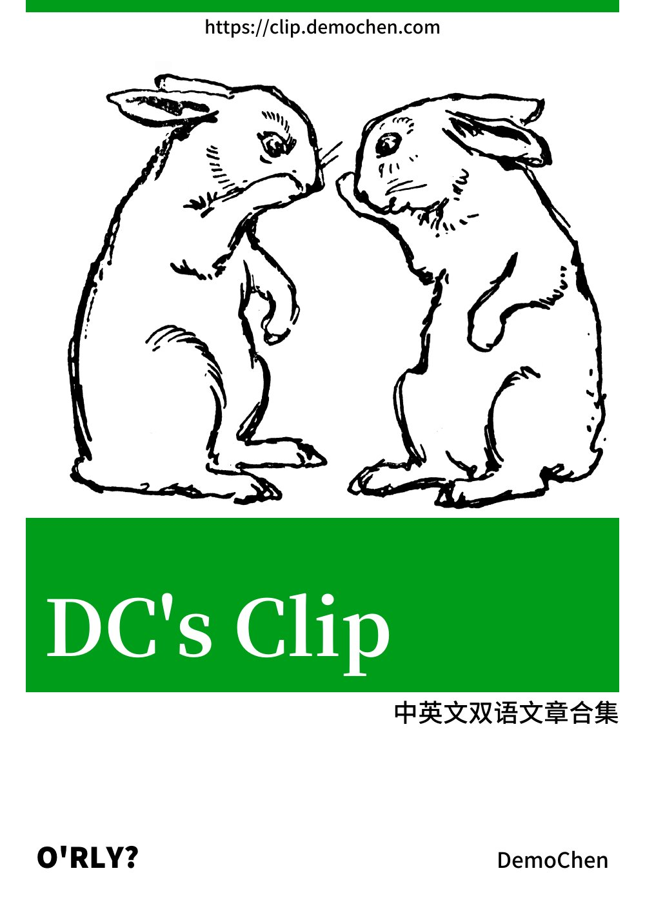

# hi, DemoChen's Clip

 

在《
<a href="https://demochen.com/posts/111501/" target="_blank" rel="noopener noreferrer">高效阅读英语信息的方法</a>
》中提到，我英语信息源占比越来越大，同时在
<a href="https://github.com/immersive-translate/immersive-translate" target="_blank" rel="noopener noreferrer">Immersive-translate</a>
的加持下，我逐渐喜欢上看英语内容，但是对自己阅读过的文章希望能将
**「双语」版本** 保存下来，供后续查阅。

于是，我想到了两种方式，分别是保存到稍后读
<a href="https://blog.readwise.io/readwise-reading-app/" target="_blank" rel="noopener noreferrer">Readwise
Reader</a>
中或者下载到本地；前者会造成信息冗余（加上对英语不够熟悉会忘记关键词），后者会加重本地管理压力，都不是满意的方案。

在群里和
<a href="https://www.owenyoung.com/about/" target="_blank" rel="noopener noreferrer">@OwenYoung</a>
表达了想法，他和我说：前两天刚好搭建了一个类似项目
<a href="https://clip.owenyoung.com/" target="_blank" rel="noopener noreferrer">Owen's Clip</a>
，于是我申请复刻（白嫖）了。

经过不到 1 小时的折腾，站在巨人的肩膀上，我的 **DemoChen's Clip** 复刻成功。

## 流程

- 浏览时用
  <a href="https://github.com/immersive-translate/immersive-translate" target="_blank" rel="noopener noreferrer">Immersive-translate </a> +  <a href="https://www.deepl.com/translator" target="_blank" rel="noopener noreferrer">DeepL</a> 
  完成中英文对照翻译；
- 如有必要，再用
  <a href="https://github.com/theowenyoung/markdownload" target="_blank" rel="noopener noreferrer">Markdownload</a>
  插件将其下载到本站对应目录；
- 接着，通过 Git
  将文章对应文件提交至<a href="https://github.com/helloChenLei/clip" target="_blank" rel="noopener noreferrer">本站仓库</a>；
- 最后
  <a href="https://vercel.com/" target="_blank" rel="noopener noreferrer">Vercel</a> 会自动化完成部署。

## 说明

1. 筛选标准：**半衰期可能较长**（我感兴趣）的文章；
2. 99.78% 的文章会提供**中英文双语版本**；
3. 更新频次不定，可根据左侧目录查看对应日期文章；
4. 文中「#CM」部分是我自己的评论或者想法，注意识别；

## 订阅

若希望查看最新文章，可以通过 RSS 订阅本站。

> 订阅地址：<a href="https://clip.demochen.com/feed.xml" target="_blank" rel="noopener noreferrer">https://clip.demochen.com/feed.xml</a>

## 赞助

若你觉得本站对你有些许帮助，

可以通过「赞助」的方式来支持我的运营和后续更新。

> 赞助地址：<a href="https://demochen.com/sponsors/" target="_blank" rel="noopener noreferrer">https://demochen.com/sponsors/</a>

## 作者

本站是由 [@DemoChen](https://demochen.com/) 创建并维护，如果有更好的建议或者想法，欢迎来信交流。

我的其他站点：

- <a href="https://demochen.com" target="_blank" >DemoChen’s Blog</a>：个人博客，记录自己生活、学习和思考
- <a href="https://today.demochen.com" target="_blank"  >今天长这样</a>：记录天空的颜色，欢迎投稿
- <a href="https://www.dochub.wiki" target="_blank" >DocHub.wiki</a>：优质的公开文档聚合站

联系邮箱：i#demochen.com (将`#`换成`@`)。

注：本站内容均不是原创，如有侵权，联系删除。

## 所有文章

<!-- Table of Content-->