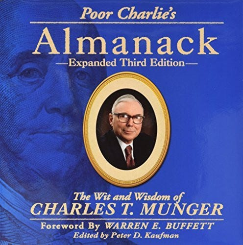
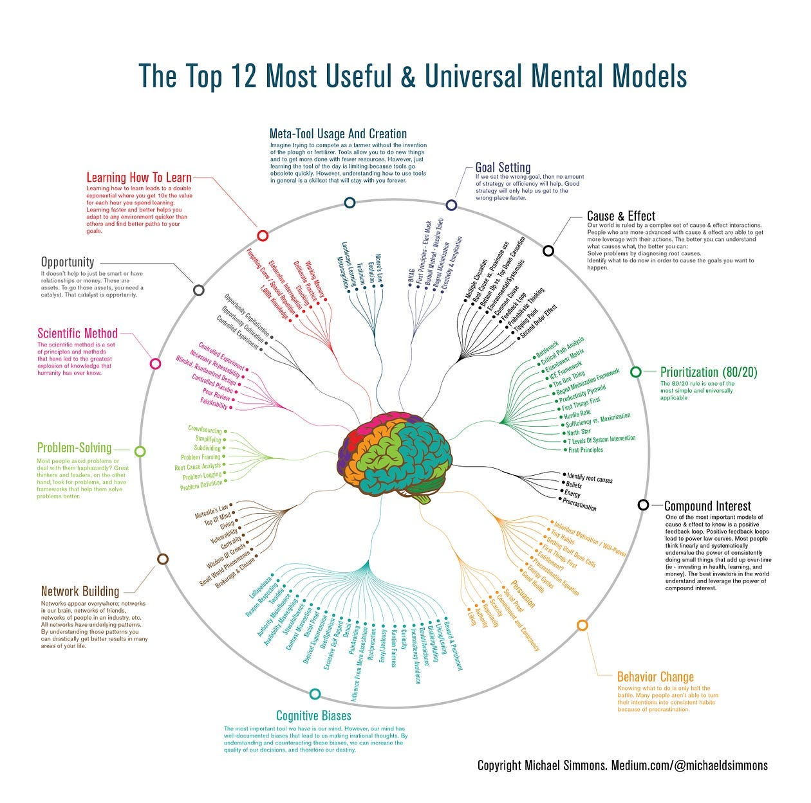
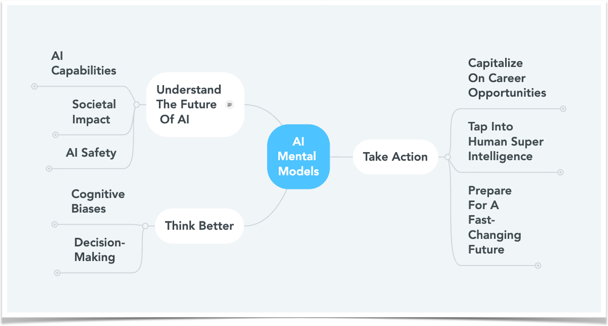

_**Author’s Note:** Today is the day! This is the most important post in this newsletter since I launched it last July.  

作者注：今天终于到了！这是自我去年七月推出以来，这份通讯中最重要的一篇文章。  

I’ve spent more time on the research for this article than any other.  

我为这篇文章的研究花费的时间比其他任何文章都要多。  

I’m proud of it, and I hope you enjoy.  

我为此感到自豪，希望你喜欢。_

_Over the last nine years, I’ve spent more time than anyone else in the world collecting and understanding the most useful and universal mental models (and then sharing them in my [Mental Model Club](https://www.mentalmodelclub.com/mental-model-club-v2.html)). Mental models have fundamentally changed how I make decisions and experience life.  

在过去的九年里，我花费了比世界上任何其他人更多的时间，收集和理解最有用和普遍的心智模型（然后在我的心智模型俱乐部中分享）。心智模型从根本上改变了我做决定和体验生活的方式。_

_Because of the power of mental models, I’ve spent hundreds of hours collecting the 100 most important mental models related to AI over the last six months**.** To my knowledge, this is the first and most comprehensive map of AI mental models ever created.  

凭借心智模型的力量，我在过去六个月里花费了数百个小时，收集了与人工智能相关的 100 个最重要的心智模型。据我所知，这是有史以来第一个也是最全面的人工智能心智模型图谱。_

_If you’re wondering, “How can I go beyond surface-level AI news to learn about AI in order to prepare myself for the future of AI?” then this post is for you!  

如果您想了解更多关于人工智能的知识，以便为人工智能的未来做好准备，那么这篇文章适合您！_

_**Quick Request:** If you enjoy the mental model map_, _please forward it to a friend. It only takes 10 seconds.  

快速请求：如果您喜欢这个心智模型图，请将它分享给朋友。只需要 10 秒钟。  

Making the map and esplainers has taken hundreds of hours.  

制作地图和解释器已经花费了数百个小时。_

_**Free members:** Get access to the categorized list of mental models.  

免费会员：获取分类的心理模型清单。_

_**Paid members:** In addition, get access to a chatbot I created to explain each of the mental models, suggest models for your particular situation, or to contextualize the news.  

付费会员：此外，您还可以访问我创建的聊天机器人，以解释每个心智模型，为您的特定情况提供建议模型，或者对新闻进行情境化解读。  

I also provide the full prompt of the bot so you can customize it.  

我还提供机器人的完整提示，以便您可以自定义它。_

_**[Mental Model Club](https://www.mentalmodelclub.com/mental-model-club-v2.html) members:** Get access to a live version of a AI mental models class. More on this soon.  

心智模型俱乐部会员：获得 AI 心智模型课程的实时版本。更多信息即将公布。_

AI will be the most important technology that humanity has ever created.  

人工智能将成为人类有史以来最重要的技术创新。

How we react to it NOW may be one of the most important career decisions we ever make.  

我们现在如何对待它可能是我们一生中最重要的职业决定之一。  

Now is the moment because we have the time and blue ocean to prepare financially, mentally, emotionally, and relationally.  

现在是一个重要时刻，因为我们有时间和广阔的机遇来在财务、心理、情感和人际关系方面做好准备。  

To decide how we react, it’s critical that we deliberately learn about AI rather than making a blind, reflexive adoption or rejection decision.  

为了决定我们如何做出反应，重要的是我们有意识地学习人工智能，而不是盲目地、本能地接受或拒绝决定。

This brings up the fundamental learning challenge we are all confronted with…  

这引发了我们所面临的根本学习难题…

Most people simply ignore AI without seriously exploring it.  

大多数人只是简单地忽视人工智能，而没有认真探索它。

And honestly, this approach makes sense. AI is the worst it will ever be.  

而且说实话，这种方法是合理的。AI 的表现已经达到了最差的水平。  

There is nothing urgent pushing us to learn about it now.  

目前没有任何紧迫的事情需要我们立即了解。  

Focusing on what we’ve been doing in the past will give us the most immediate rewards.  

我们专注于过去的所做之事将会给我们带来最即时的回报。

But what we gain in the short term, we lose in spades in the long term.  

然而，我们在短期内取得的收益，在长期内却会大量流失。  

Just as it makes sense to buy low and sell high in markets, it makes sense to learn about AI before everyone else.  

就像在市场中低买高卖是明智的一样，在其他人之前了解人工智能也是明智的。  

Said differently, “Learn low. Act high.” Don’t start your learning while everyone else is acting.  

以不同的方式说，“学会低调，行动高调。”不要在其他人都在行动时开始学习。

Of those knowledge workers who do explore AI now, they often take one or both paths below:  

那些现在探索人工智能的知识工作者，通常会选择以下一种或两种路径：

1.  Read AI news  
    
    阅读人工智能相关新闻
    
2.  Do AI prompting  
    
    进行 AI 提示
    

While each of these paths is important, they are not enough to think strategically about what to do about AI in your life, career, and business.  

尽管每条路径都很重要，但仅有这些还不足以在生活、职业和业务中对如何处理人工智能进行战略性思考。

It’s critical to understand the limitations of each path in order to move beyond them…  

了解每条道路的局限性是至关重要的，才能超越它们

There are now dozens of podcasts, newsletters, blogs, Twitter accounts, and other experts that cover every update on AI, from demos, prompts, and tools to rumors, funding announcements, profiles, and predictions.  

现在有数十个播客、通讯、博客、Twitter 账号和其他专家，涵盖了人工智能的每一个更新，从演示、提示和工具到传言、资金公告、档案和预测。

This news is important. And it is important to stay up-to-date to a certain degree.  

这则新闻很重要，保持一定程度的更新也很重要。

At the same time, it’s easy to get lost in fake learning, where you think you’re learning, but, in actuality, you’re not learning nearly as much as you think.  

与此同时，很容易陷入虚假学习的陷阱，你以为自己在学习，但实际上，你学到的远远不如你所想象的那么多。  

**The brutal reality is that within weeks and months, almost none of this news will matter:  

残酷的现实是，几周甚至几个月后，几乎所有这些新闻都将毫无意义**

-   Most new tools will not gain traction  
    
    大多数新工具不会受到关注
    
-   Most predictions will turn out to be wrong  
    
    大多数预测往往是错误的
    
-   Most new companies will fail  
    
    大多数新公司都会失败
    
-   New versions of AI will obsolete many of today’s prompts  
    
    未来的人工智能版本将使许多今天的提示变得过时
    

**Not only that, much of the news just isn’t practical now or is biased:  

不仅如此，许多新闻现在要么不实用，要么带有偏见**

-   Demos are often highly edited and will take forever to turn into mainstream products  
    
    演示通常经过高度编辑，需要很长时间才能成为主流产品
    
-   A lot of news ultimately isn’t relevant to day-to-day life and work  
    
    许多新闻最终并不影响日常生活和工作
    
-   The news is biased to be interesting, which means it is overly optimistic or overly pessimistic  
    
    新闻报道往往带有偏见，目的是为了吸引眼球，这就意味着它可能过于乐观或者过于悲观
    

Many jump right into prompting frontier chatbot models (eg, ChatGPT, Gemini, Claude) in order to understand what and how to prompt.  

许多人直接开始使用边界聊天机器人模型（例如，ChatGPT，Gemini，Claude），以了解如何提示和如何进行提示。  

Getting a basic proficiency is critical, and I highly recommend it.  

掌握基本技能至关重要，我强烈推荐。

But, at a certain point, you’re left with a decision of whether or not to go all-in and turn your into workflow into chained prompts.  

但是，在某个时候，你会面临一个决定，即是否全力以赴，将你的工作流转变为一系列链接的提示。  

**The problem with going all in on prompting** is a few-fold:  

专注于提示的问题在于存在几个方面：

1.  **Obseletion Risk.** New versions of frontier models will get better at creating prompts, which may make our old prompts obsolete.  
    
    遗忘风险。前沿模型的新版本将更擅长创建提示，这可能会使我们的旧提示过时。  
    
2.  **Limits Of Today’s Models.** While today’s frontier models are amazing, they are also seriously limited, which means our prompts often aren’t reliable or massively transformative yet.  
    
    今天的模型存在一些局限性。尽管这些前沿模型令人惊叹，但它们也有严重的局限性，这意味着我们的提示通常还不够可靠或具有巨大的变革性。  
    
    It can take hours of trouble-shooting prompts to get results that the next versions of AI will do easily out-of-the-box.  
    
    要获得结果可能需要数小时的故障排除提示，而下一个版本的人工智能将轻松实现这一点。  
    
3.  **Energy-Intensive.** It typically takes years to completely overhaul workflows.  
    
    能源密集型。通常需要数年时间才能彻底改造工作流程。  
    
    For example, it might take someone hundreds of tiny steps to do a knowledge workers job.  
    
    例如，完成一名知识工作者的工作可能需要数百个微小的步骤。  
    
    And refining and testing each of those steps is time-intensive.  
    
    优化和测试每个步骤都需要耗费大量时间。  
    
    Thus, starting a long workflow overhaul with a technology like AI that is changing so rapidly can be daunting and feel risky.  
    
    因此，使用像人工智能这样快速变化的技术开始进行长期的工作流程改革可能会让人感到畏惧和风险。
    

While both reading AI news and doing basic prompting are key, at some point, they have diminishing returns, and many of us are just left waiting for GPT.  

虽然阅读人工智能新闻和进行基本提示都很关键，但在某个时候，它们的效果会递减，许多人只能等待 GPT 的出现。

Thus, it’s easy to get stuck in a no man’s land where you believe that AI will be important in the future, but you’re not sure what to do now on a practical level that will actually end up paying off and not wasting time.  

因此，很容易陷入一种无人之境，你相信人工智能在未来将变得重要，但你不确定现在在实际层面该做什么才能真正产生效益，而不是浪费时间。

I personally can attest to feeling stuck in no man’s land.  

我个人可以证明自己感到陷入了一种困境。

Then, December happened.  

然后，十二月来了。

In December, I found a way to get out of no man’s land…  

十二月份，我找到了一条走出绝境的路…

I first became obsessed with mental models in 2015 when I read Poor Charlie’s Almanack, written by self-made billionaire investor and Warren Buffett’s longtime business partner, Charlie Munger.  

2015 年，我第一次对心智模型产生了浓厚兴趣，那时我阅读了《查理的智慧宝典》，这本书是由自学成才的亿万富翁投资者、沃伦·巴菲特的长期商业伙伴查理·芒格所著。

In the book, Munger shares his life story and his #1 strategy for success: mental models.  

在这本书中，芒格分享了他的人生故事以及取得成功的首要策略：心智模型。  

Mental models are frameworks that map the key cause-and-effect relationships across multiple domains.  

心智模型是一种框架，用于映射跨多个领域的关键因果关系。  

They are like wearing augmented reality glasses to see things others don’t and make smart, independent decisions.  

他们就像戴上增强现实眼镜，看到别人看不到的事物，然后做出聪明而独立的决策。  

It turns out that Munger had spent his whole life collecting the most important mental models:  

原来，蒙格一生致力于收集最重要的心智模型：

> _“Developing the habit of mastering the multiple models which underlie reality is the best thing you can do.”  
> 
> “培养掌握现实多重模型的习惯是你能做的最好的事情。”_  
> 
> **Charlie Munger, Warren Buffett’s Longtime Business Partner  
> 
> 查理·芒格，沃伦·巴菲特的长期合作伙伴**

As I started to explore mental models, I saw that many of the top innovators and leaders in history that I admired also swore by them.  

当我开始探索心智模型时，我发现许多我所钦佩的历史上顶尖创新者和领袖也信奉这些模型。  

For example, Elon Musk, Ray Dalio, and Jeff Bezos have all publicly talked about the power of mental models.  

举例来说，埃隆·马斯克、雷·达里奥和杰夫·贝索斯都曾公开谈论心智模式的重要性。  

What most excited me about this approach was the leverage.  

这种方法让我最兴奋的是它的杠杆效应。  

More specifically, the top mental models have a few amazing qualities:  

更具体地说，顶级心智模型具有一些令人惊叹的特点：

-   **Universal.** They can be applied across domains.  
    
    通用。可以跨领域应用。  
    
    This is important so that we can bring our knowledge with us as we switch industries and professions throughout our careers.  
    
    这一点很重要，因为我们可以随着职业生涯的变化，将知识带入不同的行业和职业。  
    
-   **Ever-Green.** They will be relevant for the rest of our lives rather than getting [outdated](https://blockbuster.thoughtleader.school/p/the-math-behind-the-5-hour-rule-why).  
    
    永恒不变。它们将在我们的一生中保持相关，而不会过时。  
    
    This is important because it allows our knowledge to compound in value over time as we stack knowledge upon knowledge.  
    
    这很重要，因为随着时间的推移，我们的知识会不断增值，随着知识的积累而积累，使我们的知识更加丰富。  
    
    As Einstein says, “Compound interest is the eighth wonder of the world.”  
    
    如爱因斯坦所说，“复利是世界第八大奇迹。”  
    
-   **Rare & Valuable.** Mental models can be used to make smart and unconventional decisions.  
    
    稀有且有价值。心智模型可帮助做出明智且非传统的决策。  
    
    Thus, rather than following the herd on major decisions, we can make independent, smart decisions.  
    
    因此，我们可以做出独立而明智的决定，而不是随波逐流。
    

**In short, I saw that mental models would give me a foundational understanding of the world that would be more helpful than a college degree.  

简单来说，我意识到心智模型能够为我提供比大学学位更有帮助的世界基础理解。  

**

As I love to learn things more deeply by teaching them to others (see E[xplanation Effect](https://blockbuster.thoughtleader.school/p/explanation-effect-why-you-should)), I started to share what I was learning.  

由于我喜欢通过向他人教授来更深入地学习事物（参见解释效应），我开始分享我所学到的内容。

In 2015, I wrote a Forbes article on the power of mental models titled [How One Life Hack From A Self-Made Billionaire Leads To Exceptional Success](https://blockbuster.thoughtleader.school/p/how-one-life-hack-from-a-self-made).  

2015 年，我撰写了一篇关于心智模型力量的福布斯文章，题为《一位白手起家的亿万富翁如何实现非凡成功的生活技巧》。

In the following few years, I started collecting mental models.  

在接下来的几年里，我开始收集心理模型。  

I finally shared my top models in late 2017 in the article  

2017 年底，我终于在文章中分享了我的顶级模特，[This Is Exactly How You Should Train Yourself To Be Smarter \[Infographic\]](https://blockbuster.thoughtleader.school/p/this-is-exactly-how-you-should-train). This article has been read by more than 342,000 people and introduced the following diagram…  

这就是您应该训练自己变得更聪明的确切方式\[信息图表\]。这篇文章已被超过 342,000 人阅读，并介绍了以下图表…

In early 2018, [Eben Pagan](https://ebenpagantraining.com/) and I decided to collaborate to create the [Mental Model Club](https://mentalmodelclub.com/).  

2018 年初，Eben Pagan 和我决定合作创建心智模型俱乐部。  

The premise was that we would introduce a new mastery manual every month on the most important mental models.  

核心思想是，我们计划每月推出一本新的精通手册，介绍最重要的心智模型。  

The quote that inspired going deep on a small number of mental models was this Charlie Munger quote:  

激发我们深入研究少量心智模型的引语是查理·芒格的这句话：

> _You may say, ‘My God, this \[collecting mental models\] is already getting way too tough.’ But, fortunately, it isn’t that tough — because 80 or 90 important models will carry about 90% of the freight in making you a worldly-wise person.  
> 
> 你可能会说，“我的天啊，这个\[收集心智模型\]已经变得太难了。” 但幸运的是，它并不那么难 — 因为 80 或 90 个重要模型将占据大约 90%的重要性，让你成为一个见多识广的人。  
> 
> And, of those, only a mere handful really carry very heavy freight.  
> 
> 而且，其中只有少数几个真正承载着非常沉重的货物。  
> 
> _**—Charlie Munger  
> 
> —查理·芒格**

Over the last six years, we have released 50+ mastery manuals, each with a live class. [You can try the club and get access to all of the manuals for just $1](https://www.mentalmodelclub.com/mental-model-club-v2.html).  

在过去的六年里，我们发布了 50 多本精通手册，每本都有现场课程。您可以尝试这个俱乐部，仅需 1 美元即可获取所有手册。

Looking back, making the leap of faith to go all in on mental models was one of the best decisions I’ve ever made.  

回顾过去，我认为全力投入心智模型是我迄今为止做过的最明智的决定之一。  

I constantly find myself re-using models I learned years ago in order to make better decisions, learn faster, and come up with my own Trademark Ideas.  

我不断发现自己在利用多年前学到的模型，以便做出更好的决策、更快地学习，并产生我自己的独特想法。  

This brings me to December 2023.  

这让我联想到了 2023 年 12 月。

That’s when I realized I could more deeply understand the future of AI by collecting mental models in a few key areas…  

那时我意识到，通过在一些关键领域收集心智模型，我能更深入地理解人工智能的未来..

My reasoning for choosing the categories above was as follows…  

我选择上述类别的原因是以下…

**First, the most fundamental decision we need to make is about the future technical capabilities of AI.** Our decision-making is completely different based on which of the following things we believe:  

首先，我们需要做出的最基本决定是关于人工智能未来技术能力的。我们的决策完全取决于我们相信以下哪些事情：

-   AI progress will continue to be exponential for years OR  
    
    人工智能的进展将在未来几年继续呈指数增长
    
-   AI progress will hit a wall and evolve very slowly  
    
    人工智能的进展将会遇到瓶颈，发展速度会变得非常缓慢
    

Sam Altman, CEO of OpenAI, puts these two possibilties in stark contrast with the following quote in a [recent interview](https://www.youtube.com/watch?v=fMtbrKhXMWc&ab_channel=TheLoganBartlettShow):  

山姆·奥特曼，OpenAI 的首席执行官，在最近的一次采访中，用以下话语鲜明对比了这两种可能性：

> _**Interviewer:** What are the characteristics of AI-first businesses that you think will survive GPT's advancement?  
> 
> 面试官：您认为哪些 AI 优先企业的特点能够在 GPT 进步的过程中生存下来？_
> 
> _**Sam Altman:** The only framework that I have found that works for this is you.  
> 
> 山姆·奥特曼说：我发现这是唯一行之有效的框架。  
> 
> You can either build a business that bets against the next model being really good, or a model that bets on that happening and benefits from it happening.  
> 
> 你可以选择建立一家企业，押注下一个模型不会很好，或者押注下一个模型会很好并从中受益。_

After tons of research, I personally believe that the probability of [AI continuing to grow exponentially](https://blockbuster.thoughtleader.school/p/ai-scaling-law-predict-the-future) for the next few years is very high.  

经过大量研究，我个人认为未来几年人工智能继续呈指数增长的可能性非常高。  

Therefore, I’m basing my decision-making on the scenario that it will continue while acknowledging that it isn’t guaranteed.  

因此，我在假设情况会持续的基础上做出决策，同时意识到这并非百分之百保证。  

For example, We could hit a large technical hurdle we can’t see right now.  

例如，我们可能会遇到一些目前看不见的重大技术障碍。  

Or we might make so much progress that the government enforces an AI progress pause.  

或者我们取得了如此巨大的进步，以至于政府实施了人工智能进展暂停。

**Second, we need to consider AI's societal impact. Fortunately, many researchers** have spent their whole careers creating models about how technology impacts society.  

其次，我们需要考虑人工智能对社会的影响。幸运的是，许多研究人员已经花费了整个职业生涯来创建关于技术如何影响社会的模型。  

While it’s impossible for anyone to predict the exact impacts, these models provide us with broad scenarios to prepare for.  

尽管任何人都无法预测确切的影响，但这些模型为我们提供了准备的广泛场景。

**Third, once you consider how much our world could be upended in the near future, it’s important to stay rational.** In periods of rapid change, many cognitive biases get triggered in us that we need to be aware of, and we need new frameworks for making decisions about an uncertain future.  

第三，当您考虑到我们的世界在不久的将来可能会发生翻天覆地的变化时，保持理性变得至关重要。在快速变化的时期，我们会受到许多认知偏见的影响，我们需要意识到这一点，并且我们需要新的决策框架来应对不确定的未来。

**Finally, we need to take action now.** I dividing action-taking into three categories:  

现在我们需要立即采取行动。我将行动分为三个类别：

-   **Capitalize on career opportunities.** These models help us think about what skills, professions, industries, and other opportunities to identify, create, select, and pursue.  
    
    充分利用职业机会。这些模型帮助我们思考如何识别、创造、选择和追求各种技能、职业、行业和其他机会。
    
-   **Tap into Human Super Intelligence.** One of the things that makes humans unique is our ability to use tools to extend our own intelligence.  
    
    挖掘人类超级智慧。人类独特之处之一在于我们能够利用工具来延伸自身智慧。  
    
    These models help us reason about how to push the boundaries of our own potential with AI.  
    
    这些模型帮助我们思考如何推动我们自身潜力的边界，借助人工智能。  
    
-   **Prepare for a fast-changing future that is hard to fathom.** While we don’t know the exact future, we can predict that it will be VUCA (volatile, uncertain, complex, and ambiguous).  
    
    为难以预测的快速变化的未来做好准备。虽然我们不知道确切的未来会是什么样子，但我们可以预测它将是 VUCA（易变、不确定、复杂和模糊）。  
    
    These models help us prepare for a VUCA world.  
    
    这些模型帮助我们应对不确定、多变、复杂和模糊的世界。
    

These categories are comprehensive but not exhaustive.  

这些类别是全面的，但并非穷尽之尽。  

To ship something now and keep things simple, I decided to hold off on collecting AI mental models related to:  

为了立即发货并保持简单，我决定暂时不收集与 AI 心智模型相关的内容

-   Investing  
    
    投资领域
    
-   Parenting  
    
    家庭教育
    
-   Romance  
    
    爱情
    
-   Friendship  
    
    友情
    
-   Health  
    
    健康领域
    
-   Hobbies  
    
    兴趣爱好
    

After identifying the most important mental model categories, I spent hundreds of hours collecting, understanding, and applying these models.  

在确定了最重要的心智模型类别后，我花费了数百个小时来收集、理解和应用这些模型。  

Furthermore, I also did a few deep dives in the newsletter on AI mental models I found particularly important:  

此外，我还在通讯中深入探讨了我认为特别重要的人工智能心智模型：

-   [Ben Franklin, Thomas Edison, & Other Pioneers Teach A Critical Futurism Mental Model  
    
    本·富兰克林、托马斯·爱迪生等先驱者传授重要的未来主义心智模式](https://blockbuster.thoughtleader.school/p/ben-franklin-thomas-edison-ai)
    
-   [AI Scaling Law Part 2: Predict The Near-Future Of AI  
    
    AI 扩展法则第 2 部分：预测人工智能的近期发展](https://blockbuster.thoughtleader.school/p/ai-scaling-law-predict-the-future)
    
-   [Steve Jobs' Hockey Stick Rule Helps Predict The "Inevitable" Future Of AI  
    
    史蒂夫·乔布斯的曲棍球杆规则有助于预测人工智能的“不可避免”未来](https://blockbuster.thoughtleader.school/p/steve-jobs-trend-tracking-mental)
    
-   [Elon Musk: "AI will probably be smarter than any single human next year.”  
    
    埃隆·马斯克：“人工智能可能会比任何单个人类更聪明，明年。”](https://blockbuster.thoughtleader.school/p/elon-musk-ai-will-probably-be-smarter)
    
-   [Augmented Reading: Learn 10x Faster And Better With AI  
    
    借助人工智能实现阅读增强：学习速度提升 10 倍，效果更佳](https://blockbuster.thoughtleader.school/p/augmented-reading-learn-10x-faster-and-better)
    

Finally, I made a fuller case for the power of AI mental models in [Most People Think This Is A Smart Way To Learn AI, But It’s Actually Making You Dumber](https://blockbuster.thoughtleader.school/p/most-people-think-this-is-a-smart-ai).  

最终，我为 AI 心智模型的力量提出了更充分的论证。大多数人认为这是学习 AI 的聪明方式，但实际上它却让你变得更愚蠢。

With that said, I’m finally ready to share the AI models I collected…  

说到这里，我终于准备好分享我收集的 AI 模型了

This map is a v1. It does not include descriptions or links for all of the models yet.  

这个地图是版本 1。目前还没有包含所有模型的描述或链接。

If you’re curious about any of the models, I recommend going to the GPT that I created below to learn more about it (if you’re a paying subscriber).  

如果您对任何模型感到好奇，我建议您查看下面我创建的 GPT，以了解更多相关信息（如果您是付费订阅者）。  

Alternatively, you can go to Google or Wikipedia to learn more.  

或者，您可以查阅谷歌或维基百科以获取更多信息。

After 9 years of learning about and teaching mental models, here’s my suggestion for how to master them:  

在学习和教授心智模型九年后，我有一个建议，帮助你掌握它们：

1.  **Awareness.** Get a basic understanding of all of the mental models.  
    
    了解。对所有心智模型有基本的了解。
    
2.  **Prioritize.** Identify and go deeper into the most important mental models.  
    
    优先考虑。识别并深入了解最重要的心智模式。
    
3.  **Apply.** Think about all of the ways you can apply the model to your life.  
    
    应用。思考如何将这个模型应用到你的生活中的各个方面。
    
4.  **Get Results.** Apply the models until you get results.  
    
    获取结果。持续应用模型直到获得结果。
    
5.  **Master.** Use multiple models simultaneously and automatically.  
    
    主人。同时自动使用多个模型。
    

But, for now, my #1 recommendation is simply to get acquainted with these models.  

但是，目前，我最推荐的是简单地熟悉这些模型。  

While 100 models may sound like a lot, if you just learn one per day, you will get through all of them in three months.  

虽然 100 个模型听起来很多，但如果你每天只学习一个，你将在三个月内完成所有模型。  

[Access Interactive Mind Map  

访问交互式心智导图](https://mm.tt/app/map/3268565069?t=KSykw5ZJV2)

**Capabilities  

能力要求**

-   Weak Signals  
    
    弱信号源
    
-   Lindy Effect  
    
    林迪效应
    
-   [AI Scaling Law  
    
    AI 扩展法则](https://blockbuster.thoughtleader.school/p/ai-scaling-law-predict-the-future)
    
-   Wisdom Of Crowds / Collective Intelligence  
    
    众人的智慧 / 集体智慧
    
-   Positive Feedback Loops  
    
    积极反馈循环
    
-   Bottlenecks  
    
    优化瓶颈
    
-   Exponential Growth  
    
    指数增长率
    
-   Moloch  
    
    莫洛克
    
-   Law Of Accelerating Returns / Moore’s Law  
    
    加速回报定律 / 摩尔定律
    
-   [Monkey To The Moon Fallacy  
    
    猴子登月的谬论](https://arxiv.org/abs/2104.12871)
    
-   Exponential Curve  
    
    指数曲线
    
-   Double Exponential Function  
    
    双曲指数函数
    
-   S-Curves  
    
    S 曲线
    
-   Convergence Theory  
    
    收敛理论
    
-   Amara’s Law  
    
    阿玛拉定律
    
-   Complexity Theory  
    
    复杂理论
    
-   Forecasting Error Bars  
    
    预测误差边界
    
-   Content Fidelity Escalation  
    
    内容保真度提升
    
-   Anthropomorphic AI Evolution  
    
    人形智能的演进
    

**Impact  

影响力**

-   Inflection Points  
    
    变点
    
-   Scenario Planning  
    
    情景规划策划
    
-   Hype Cycles  
    
    热潮周期
    
-   Second-Order Effects  
    
    二阶影响
    
-   Paradigm Shifts  
    
    范式转移
    
-   Productivity Chain  
    
    生产力链
    
-   Paradox Of Progress  
    
    进步的困境
    
-   Diffusion Of Innovations  
    
    创新的传播
    
-   Pace Layering  
    
    速度分层策略
    
-   Socio-Technical Systems Theory  
    
    社会技术系统理论
    
-   Moravec's Paradox  
    
    莫拉维克悖论
    
-   Polarization  
    
    极化
    

**Safety  

安全性**

-   Risk Of Ruin (Existential Risk)  
    
    风险毁灭（存在性风险）
    
-   The Control Problem  
    
    控制问题
    
-   Orthogonality Thesis  
    
    正交性原理
    
-   [Instrumental Convergence  
    
    仪器收敛效应](https://www.lesswrong.com/tag/instrumental-convergence)
    
-   Interpretability  
    
    可解释性
    
-   Threshold Effects  
    
    阈值效应
    
-   Precautionary Principle  
    
    预防性原则
    
-   Dead Internet Theory  
    
    亡者互联网理论
    
-   Tragedy Of The Anticommons  
    
    Anticommons 的悲剧
    
-   Red Teaming  
    
    红队渗透测试
    
-   Collective Action Problems  
    
    集体行动问题
    
-   Moral Hazard  
    
    道德风险
    
-   Recursive Self-Improvement  
    
    递归式自我改善
    
-   The Alignment Problem  
    
    对准问题
    
-   Paperclip Maximizer  
    
    纸夹最大化器
    
-   The Sorcerer's Apprentice Syndrome  
    
    巫师学徒综合症
    
-   Goodhart's Law  
    
    古德哈特定律
    

-   [Hockey Stick Rule  
    
    曲棍球杆规则](https://open.substack.com/pub/michaeldsimmons/p/the-jeff-bezos-hockey-stick-rule)
    
-   Floor & Ceiling Skill Model  
    
    楼层和天花板技能模型
    
-   Comparative Advantage  
    
    比较优势
    
-   Blue Ocean Strategy  
    
    蓝海战略思维
    
-   Opportunity Space  
    
    机会领域
    
-   Search  
    
    搜索结果
    
-   [10,000 Experiment Rule  
    
    一万次实验法](https://blockbuster.thoughtleader.school/p/forget-the-10000-hour-rule-edison)
    
-   Long Tail  
    
    长尾关键词
    
-   Value Chain  
    
    价值链
    
-   Adjacent Possible  
    
    相邻可能性
    
-   [Idea Maze  
    
    创意迷宫](https://podcasteditor.streamlabs.com/share/3BtdpH9b9eUVk502RWQb?crumbs=G93Gt89HNmQq5NA9eO7O)
    
-   3 Horizons Model  
    
    三个地平线模型
    
-   Jobs To Be Done  
    
    工作需求
    
-   Design Thinking  
    
    设计思考
    
-   Circle Of Competence  
    
    竞争力范围
    
-   Value Chain  
    
    价值链
    
-   Inverse Risk Perception  
    
    逆向风险认知
    
-   ICE Model  
    
    冰模型
    
-   Opportunity Cost  
    
    机会成本
    
-   Return On Investment  
    
    投资回报率
    

**Tap Into Human Super Intelligence  

探索人类超级智慧**

-   Cognitive Artifacts  
    
    认知工具
    
-   Cognitive Offloading Framework  
    
    认知卸载框架设计
    
-   Extended Mind Theory  
    
    扩展心智理论
    
-   Compensation Theory  
    
    薪酬理论
    
-   Skill-Biased Technological Change  
    
    技能偏向性技术变革
    

**Capitalize On Career Opportunities  

抓住职业发展机遇**

-   Antifragility  
    
    抗脆性特质
    
-   Emotional Regulation  
    
    情绪管理
    
-   Kubler-Ross Grief Cycle  
    
    库布勒-罗斯哀伤循环
    
-   Terror Management Theory  
    
    恐怖管理理论理论
    
-   Margin Of Safety  
    
    安全边际值
    
-   Black Swan Theory  
    
    黑天鹅理论
    
-   Gray Swan Theory  
    
    灰天鹅理论
    
-   Barbell Strategy  
    
    杠铃策略
    
-   VUCA  
    
    没有稳定性、不确定性、复杂性和模糊性
    
-   Redundancy  
    
    冗余数据
    
-   Optionality  
    
    可选性
    
-   [Shattered Assumptions Theory  
    
    粉碎假设理论](https://www.amazon.com/Shattered-Assumptions-Towards-Psychology-Trauma/dp/0743236254)
    
-   Goldilocks Zone Of Growth  
    
    成长的黄金地带
    
-   5% Rule  
    
    5% 规则
    
-   Disruption Theory  
    
    破坏性理论
    
-   Pre-Adaptation  
    
    预先适应
    
-   Red Queen Effect  
    
    红后效应
    
-   [Modern Polymath  
    
    现代多才多艺者](https://blockbuster.thoughtleader.school/p/people-who-have-too-many-interests)
    
-   Network Brokerage  
    
    网络经纪服务
    
-   Power Of Weak Ties  
    
    弱连接的力量
    
-   Explore-Exploit Tradeoff  
    
    探索与利用的权衡
    
-   Negative Learning Transfer  
    
    负面学习迁移
    
-   [Augmented Reading  
    
    增强现实阅读](https://blockbuster.thoughtleader.school/p/augmented-reading-learn-10x-faster-and-better)
    
-   [Rising Tide Effect  
    
    崛起潮汐效应](https://podcasteditor.streamlabs.com/share/KUoHtDGrtLZBg6TKApMl?crumbs=x5BTdsULVRLfeAc9cimC)
    

**Make Better Decisions  

做出更明智的决策**

-   Probabilistic Thinking  
    
    概率思维方式
    
-   [Dialectical Thinking  
    
    辩证思考](https://blockbuster.thoughtleader.school/p/dialectical-thinking-how-to-develop)
    
-   Expected Value  
    
    期望值
    
-   [Zeroth Thinking  
    
    零思维思考](https://podcasteditor.streamlabs.com/editor/rUWSKPc2UvWI66oj9UmF?crumbs=ju3me34KdXUstURbIBT6)
    
-   First Principles  
    
    基本原则
    
-   Inversion  
    
    反转操作
    
-   Bayesian Thinking  
    
    贝叶斯思维方式
    
-   Moonshot Thinking  
    
    月球登陆计划思维
    

**Cognitive Biases  

认知偏差**

-   Paradigm blindness  
    
    范式盲点误解
    
-   Confirmation bias  
    
    确认偏见
    
-   Moving goalposts illusion  
    
    移动目标柱幻觉
    
-   Fixed mindset about human potential  
    
    对人类潜力的固定看法
    
-   Status Quo Bias  
    
    状态 quo 偏见
    
-   Uncanny Valley  
    
    幽谷效应
    
-   Availability Bias  
    
    可用性偏见
    
-   Sunk Cost Fallacy  
    
    沉没成本谬误
    
-   Group Think  
    
    集体思维
    
-   In-Group vs Outgroup  
    
    内部群体与外部群体
    
-   Temporal Discounting  
    
    时间折扣率
    
-   Status Quo Projection Bias  
    
    现状偏见投射偏差
    
-   Temporal Displacement  
    
    时间位移技术
    
-   Functional Fixedness  
    
    功能固着性（Functional Fixedness）
    

-   List and briefly explain each of the mental models  
    
    列出并简要解释各种心智模型
    
-   Do a deep-dive explanation of one mental model  
    
    深入解析一个心理模型
    
-   Suggest models for your particular situation  
    
    为您的具体情况推荐适合的模型
    
-   Contextualize a major AI news announcement  
    
    解读一项重大的人工智能新闻公告
