## Photography for geeks

## 极客摄影

Billions of people carry cameras in their pockets and use them to document their lives. Yet, despite the democratization of photo hardware, the knowledge of photographic techniques remains elusive. Countless books, webpages, and YouTube videos purport to offer advice, but tend to dwell on topics of little consequence to most hobbyists - such as shopping for gear or memorizing made-up rules of composition that seldom make for a good shot.

数十亿人将相机放在口袋里，用它们记录自己的生活。 然而，尽管照片硬件已经大众化， 摄影技术的知识仍然难以捉摸。 无数书籍、网页和 YouTube 视频声称提供建议，但往往 专注于对大多数爱好者来说无关紧要的话题——例如购买装备或记住很少能拍出好照片的虚构构图规则。

I'm not a pro, but I dabbled in photography for more than two decades - and after making countless mistakes, I have gotten fairly good. This page is an impassioned contrarian take on what it takes to snap great photos, along with a set of simple experiments that can be repeated at home.

我不是专业人士，但我涉猎摄影已有二十多年 - 在犯了无数错误之后，我已经相当不错了。 这个页面是对如何拍出好照片的充满激情的逆向看法，以及一组可以重复的简单实验 在家。

   
 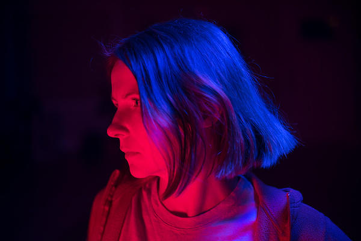

## Part I: Light

## 第一部分：光

It is said that composition is the most important aspect of a photograph. I disagree. An intriguing interplay of light and shadows can make a discarded candy wrapper look profound. An unflattering light makes even the most expertly framed scenery look pedestrian and dull.

据说构图是照片最重要的方面。 我不同意。 光与影的有趣相互作用可以使 一张废弃的糖果包装纸看起来很深奥。 不讨人喜欢的光线即使是构图最精巧的风景也显得平淡乏味。

Monitors and photographic paper are capable of faithfully reproducing only a tiny portion of the luminance range our eyes can perceive. It follows that in a photograph or a video, shadows and highlights are not just a mild distraction: they control what can and cannot be seen. Good photographers exploit this property to accentuate what matters and conceal what does not. Inexperienced hobbyists abdicate the responsibility to an algorithm in the camera. They often end up with competent results, but seldom with what they had in mind.

显示器和相纸只能忠实地再现我们眼睛所能看到的亮度范围的一小部分 感知。 因此，在照片或视频中，阴影和高光不仅仅是一种轻微的干扰：它们控制着可以和不可以的东西 见过。 优秀的摄影师会利用这一特性来突出重要的部分并隐藏不重要的部分。 没有经验的爱好者放弃 对相机中的算法负责。 他们通常会以令人满意的结果告终，但很少能实现他们的初衷。

Most novices think that illumination is entirely out of their control, but it isn't so. A solid grasp of the fundamentals allows one to leverage the environment. When shooting outdoors, you might ask your subject to stand near an exterior wall to eliminate the harsh shadows that plague most vacation shots. Indoors, you might move toward a nearest window or stay clear of recessed lights.

大多数新手认为照明完全不受他们控制，但事实并非如此。 扎实地掌握基础知识可以让人们利用环境。 在户外拍摄时，您可能会要求拍摄对象站在外墙附近，以消除困扰大多数度假照片的刺眼阴影。 在室内，您可能会走向最近的窗户或远离嵌入式灯。

To understand how these tricks can help, let's talk about some of the key properties and types of light.

要了解这些技巧如何提供帮助，让我们来谈谈一些关键属性和光的类型。

### Point and area lights

### 点光源和面光源

One of the most consequential ways to classify light sources is by their apparent size. Some sources are so small or so distant that they behave as if all the light rays emanated from a single point in space. A well-known example is the sun on a clear day. Inside your house, the same can be said of a bare lightbulb or a flashlight, especially if placed some distance away. The shadows cast by such sources are intense and sharp-edged. The transition between light and shadow is abrupt because a point source instantenously disappears from view when an opaque item gets in the way.

对光源进行分类的最重要的方法之一是根据它们的表观尺寸。 有些来源太小或太远以至于它们表现得好像所有 光线从空间中的一个点发出。 一个众所周知的例子是晴天的太阳。 在你的房子里，同样可以说是光秃秃的 灯泡或手电筒，尤其是放置在一定距离之外时。 此类光源投射的阴影强烈而锋利。 之间的过渡 光影是突然的，因为当一个不透明的物体挡道时，点光源会立即从视野中消失。

Other sources behave as if the light emanated from a larger surface, be it because of the nature of the emitter or due to some apparatus that scatters the rays. A familiar mega-scale area light is the sky on an overcast day. Indoors, a common example is a bedside lamp equipped with a shade. Area lights produce soft shadows because there are many possible intermediate states between the source being fully visible and fully occluded. The softness is proportional to how large the source is and how closely it is situated.

其他光源表现得好像光是从更大的表面发出的，这是因为发射器的性质或由于某些散射的装置 射线。 一个熟悉的巨型区域光是阴天的天空。 在室内，一个常见的例子是配有灯罩的床头灯。 区域光产生柔和的阴影，因为在光源完全可见之间有许多可能的中间状态 并完全遮挡。 柔和度与声源的大小和位置的接近程度成正比。

Point sources have their uses in photographic work, but more often than not, they get in the way. In landscape photography, they create jarring contrast, particularly when snapping buildings or trees. In portrait work, they produce unflattering and distracting shadows, especially around the nose. The phenomenon can be seen in the following picture:

点光源在摄影作品中有其用途，但通常会妨碍拍摄。 在风景摄影中，它们会产生强烈的对比， 特别是在捕捉建筑物或树木时。 在人像作品中，它们会产生不讨人喜欢且分散注意力的阴影，尤其是鼻子周围。 现象 可以在下图中看到：

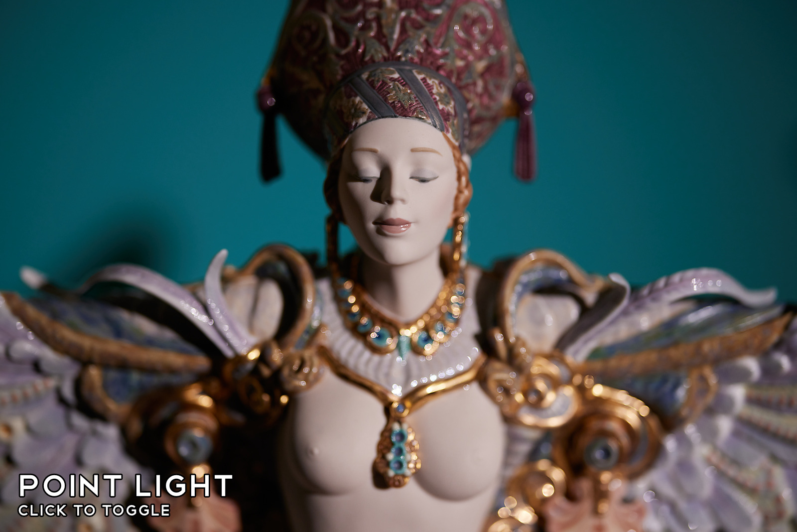

For simplicity and consistency, I am using a porcelain figurine as a stand-in for a model. In both of these examples, I placed the source a bit to the right of the camera. The problem with point lights gets more severe if the source is positioned overhead. In such circumstances, eyes appear dark and sunken, and your model may end up springing a Hitleresque mustache. Again, such lighting can be sometimes employed for dramatic effect - but it's more common for it to ruin the shot:

为了简单和一致，我使用陶瓷小雕像作为模型的替身。 在这两个示例中，我都将光源放置在相机的右侧。 如果光源位于头顶上方，点光源的问题会变得更加严重。 在这种情况下，眼睛会显得又黑又凹陷，你的模特最终可能会长出希特勒式的小胡子。 同样，有时可以采用这种照明来产生戏剧效果 - 但 它更常见的是破坏镜头：

As hinted earlier, the remedy can be simple. Outdoors, a nearby reflective surface, such as a light-colored wall, can provide diffuse illumination that makes the shadows less evident. Indoors, staying away from recessed lighting is a good habit. Finding a night lamp or a window on the shady side of the house can also help.

如前所述，补救措施很简单。 在室外，附近的反射表面（例如浅色墙壁）可以提供漫射照明，使 阴影不太明显。 在室内，远离嵌入式照明是一个好习惯。 在房子阴凉的地方找一盏夜灯或一扇窗户可以 也有帮助。

### Floodlights and spotlights

### 泛光灯和聚光灯

Another noteworthy quality of a light source is its beam shape. A bare lightbulb is omnidirectional and unfocused. It illuminates all nearby items fairly evenly, but the intensity falls off fast when you take a couple of steps back. A flashlight, in contrast, produces a focused beam that lights up only a tiny slice of your field of view, but can carry up to a hundred yards.

光源的另一个值得注意的品质是它的光束形状。 裸露的灯泡是全向的，没有聚焦。 它相当均匀地照亮附近的所有物品， 但是当您后退几步时，强度会迅速下降。 相比之下，手电筒产生的聚焦光束会照亮 只占您视野的一小部分，但可以携带多达一百码。

Wide-angle lights ("floodlights") are the bread and butter of photographic trade. In addition to providing uniform and predictable illumination, they also excel at isolating subjects from their backgrounds. If your subject is placed near the light but some distance away from the background, and if you set the exposure right, light falloff ensures that all the background clutter neatly fades from view.

广角灯（“泛光灯”）是摄影行业的生计。 除了提供均匀且可预测的照明外，它们还 擅长将主题从背景中分离出来。 如果你的拍摄对象靠近灯光但离背景有一段距离，并且如果你 设置正确的曝光，光衰减确保所有背景杂乱整齐地从视图中消失。

Narrow-beam spotlights, on the other hand, tend to create extreme contrast and usually need to be offset by a floodlight to make the picture work. In particular, if you want to create a night scene of someone holding a flashlight or standing in the headlights of a car, you need to provide additional "fill" illumination from a more uniform source - or shoot an underexposed photo at dusk.

另一方面，窄光束聚光灯往往会产生极端的对比度，通常需要用泛光灯进行抵消才能使图片正常工作。 特别是，如果你想创建一个人拿着手电筒或站在汽车前灯下的夜景，你需要提供额外的 从更均匀的光源“填充”照明 - 或者在黄昏时拍摄曝光不足的照片。

It follows that accidental spotlights, such as recessed lighting or sunbeams coming through windows, are best avoided unless you have a way to offset their undesirable effects. That said, a well-employed spotlight can add value. The following picture uses a gentle spotlight to bring out the face while keeping the rest of the figurine in a subtle shade:

因此，最好避免意外的聚光灯，例如嵌入式照明或透过窗户的阳光，除非您有办法抵消 他们的不良影响。 也就是说，使用得当的聚光灯可以增加价值。 下图用柔和的聚光灯把脸衬托出来 同时将小雕像的其余部分保持在微妙的阴影中：

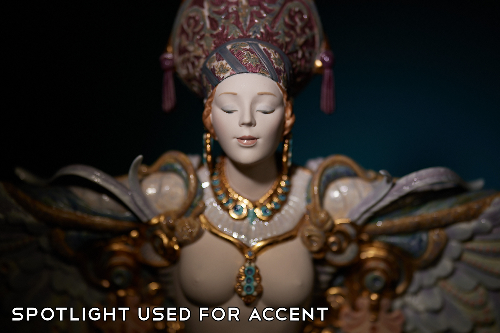

### Illumination angle

### 照明角度

The next light property to pay attention to is the angle of illumination. We already discussed the issues with overhead lights. The other undesirable extreme is a light source placed in about the same axis as your lens, for example when using an on-camera flash. This type of illumination prevents the formation of natural shadows that convey information about the curvature of three-dimensional objects, making faces look round and flat:

下一个要注意的灯光属性是照明角度。 我们已经讨论了顶灯的问题。 另一个不受欢迎的极端是光 源放置在与镜头大致相同的轴上，例如在使用相机闪光灯时。 这种类型的照明可防止形成自然阴影 传达有关三维物体曲率的信息，使人脸看起来圆而扁：

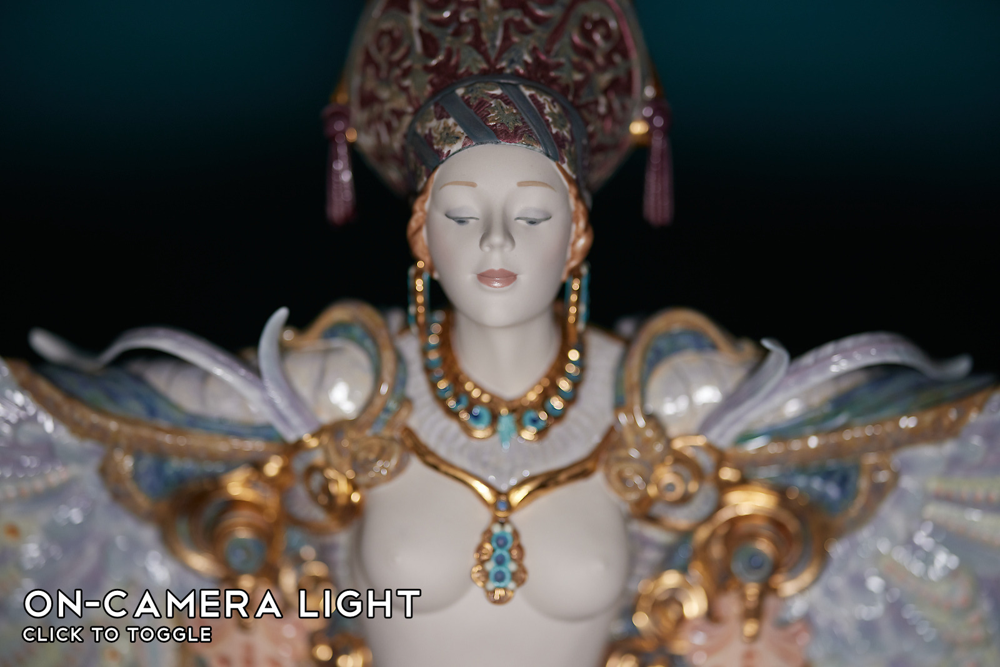

Once again, creative light positioning can be used for dramatic effect; for example, a light shining from below makes your model look sinister and out of this world (perhaps emerging from the depths of hell). That said, in most situations, the extremes are best avoided. Placing the light slightly to the side, perhaps at 20-30 degrees from the axis of the lens, is often the best starting point.

再次，创造性的灯光定位可用于戏剧效果； 例如，从下方射出的光使您的模型看起来阴森森的，与这个世界格格不入 （也许从地狱深处浮现）。 也就是说，在大多数情况下，最好避免走极端。 将光线稍微偏向一侧，大约与镜头轴成 20-30 度角，是 通常是最好的起点。

### Color temperature

### 色温

The final light quality we're going to discuss is color temperature. In the olden days, most man-made lighting - from candles to incandescent lightbulbs - had an inherent orange-yellow hue. Today, this is no longer a physical constraint, but most CCFL and LED lamps still mimic the effect, aiming for a color temperature between 2,700 K ("soft white" or "warm white") and 3,500 K ("neutral white"). This is not just a force of habit: this type of illumination is easy on the eyes and nicely complements skin tones. Higher color temperatures with a stronger blue cast are reserved for factory floors, workshops, and other areas where maximum light intensity and superior color rendition matter more than good looks.

我们要讨论的最终光质量是色温。 在过去，大多数人造照明——从蜡烛到白炽灯泡—— 具有固有的橙黄色调。 今天，这已不再是物理限制，但大多数 CCFL 和 LED 灯仍然模仿这种效果， 旨在实现 2,700 K（“柔和白”或“暖白”）和 3,500 K（“中性白”）之间的色温。 这不仅仅是一种习惯的力量：这种类型 的照明对眼睛来说很舒服，并且可以很好地衬托肤色。 更高的色温和更强的蓝色色偏 专为工厂车间、车间和其他区域预留，在这些区域中，最大光强度和卓越的色彩再现比美观更重要。

In outdoor settings, color temperatures dip to around 2,000 K during sunrise and sunset; together with lower light intensity and favorable illumination angles, these "magic hours" are some of the best times for outdoor photography. During the day, the temperature will usually go up to about 5,500 K, and if the sky is overcast, it can reach 6,500 K or so. Moonlight isn't any bluer, but nights may appear this way when viewed through the windows of a warmly-lit home. Because of that, it's a habit of most photographers and filmmakers to add a dark blue cast to night scenes - and audiences have come to expect it as a visual cue.

在室外环境中，日出和日落时色温会下降到 2,000 K 左右； 加上较低的光照强度和良好的照明 角度，这些“神奇时刻”是户外摄影的最佳时间。 白天，温度通常会上升到 5,500 K 左右， 如果天空是阴天，它可以达到 6,500 K 左右。 月光并没有更蓝，但透过窗户看夜色可能会是这样 灯火通明的家 正因为如此，大多数摄影师和电影制作人的习惯是在夜景中加入深蓝色演员表——而观众也开始期待 它作为一个视觉提示。

You can see an approximation of the difference between incandescent ("tungsten") and daylight color temperatures below:

您可以在下面看到白炽灯（“钨丝灯”）和日光色温之间差异的近似值：

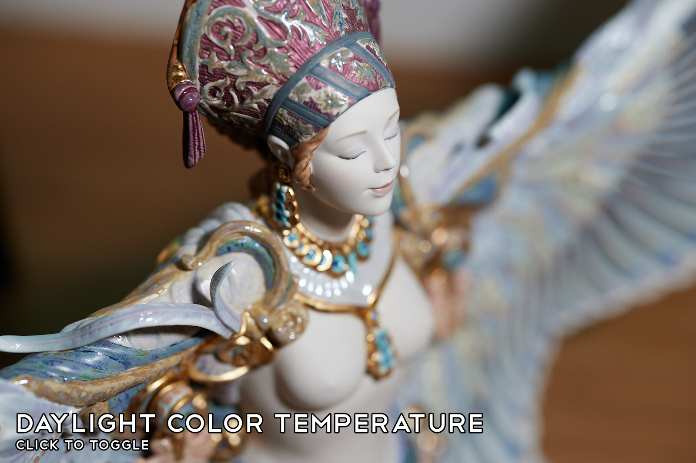

It's not that one color temperature is inherently better than another; orange cast can be more flattering in portrait work, but a photographer can add and remove it at will. In the era of photographic film, one would place a piece of colored glass in front of the lens. Today, the adjustment is as simple as moving a slider in a photo editing program or selecting a particular white balance setting in the camera. That said, if no action is taken, an in-camera algorithm will try to remove any "errornous" color cast - and the result might not be what you aimed for.

并不是说一种色温天生就比另一种好。 橙色色偏在人像作品中更讨人喜欢，但摄影师可以添加 并随意删除。 在摄影胶片时代，人们会在镜头前放置一块彩色玻璃。 今天，调整就像在照片编辑程序中移动滑块或在相机中选择特定的白平衡设置一样简单。 也就是说， 如果不采取任何措施，相机内的算法将尝试消除任何“错误”的色偏 - 结果可能不是您想要的。

Another gotcha is what happens when two lights with different color temperatures illuminate a single scene. In such circumstances, automatic white balance algorithms will struggle, and if the illumination is harsh, you end up with a mess of alternating yellow- and blue-tinted shadows that don't look right. Still, if the light is diffuse and white balance is picked by hand, mixing color temperatures can pay off:

另一个陷阱是当两个具有不同色温的灯照亮一个场景时会发生什么。 在这种情况下，自动白平衡 算法会遇到困难，如果照明很刺眼，您最终会看到一堆看起来不正确的黄色和蓝色交替阴影。 不过，如果 光线是漫射的，白平衡是手动选择的，混合色温可以带来回报：

It must be said that the color temperature model is fairly simplistic: it represents a one-dimensional continuum, from red to blue, in a [two-dimensional color space](https://upload.wikimedia.org/wikipedia/commons/thumb/b/ba/PlanckianLocus.png/910px-PlanckianLocus.png). Some light sources can exhibit other tints: for example, early fluorescent lamps had an unpleasant greenish hue that made skin appear unhealthy and pale. Today, Western filmmakers intentionally replicate this look when portraying the Soviet-era world behind the Iron Curtain; a good example is the acclaimed HBO miniseries "Chernobyl". In any case: on-camera controls might not offer enough flexibility to fix all color issues, but most photo editing software has an additional white balance slider on the continuum from purple to green.

必须说色温模型相当简单：它表示一个一维连续体，从红色到蓝色，在 [二维色彩空间](https://upload.wikimedia.org/wikipedia/commons/thumb/b/ba/PlanckianLocus.png/910px-PlanckianLocus.png) 。 有些光源会呈现出其他色调：例如，早期的荧光灯有一种令人不快的绿色调，使皮肤看起来不健康 和苍白。 今天，西方电影制作人在描绘铁幕后的苏联时代世界时，有意复制这种外观； 一个好的 例如广受好评的 HBO 迷你剧“切尔诺贝利”。 在任何情况下：机载控件可能无法提供足够的灵活性来修复所有颜色 问题，但大多数照片编辑软件在从紫色到绿色的连续体上都有一个额外的白平衡滑块。

### Getting creative with light

### 用光发挥创意

As noted earlier, a skilled photographer doesn't need to haul thousands of dollars in lighting gear everywhere they go. It is often enough to take note of existing illumination sources and reason about how they affect the scene. It pays to remember that, owing to the nature of camera sensors and computer displays, seemingly small differences in illumination have a huge impact on the appearance of the photograph.

如前所述，熟练的摄影师不需要随身携带数千美元的照明设备。 通常需要注意 现有的照明源以及它们如何影响场景的原因。 值得记住的是，由于相机传感器和计算机显示器的性质， 看似微小的照明差异对照片的外观有巨大影响。

Whether you're using existing or added lights, it's best not to put too much faith in on-camera algorithms. Automatic exposure usually works to preserve detail in the highlights, but in a high-contrast scene, it might make everything else too dark. Some cameras attempt to compress the dynamic range ("HDR") to salvage both highlights and shadows, but this can produce an artificial look: rough skin, unnaturally bright shadows, and weird halos in the areas of high contrast. It's better to stay in the driver's seat. Even on devices without manual exposure controls, it's usually still possible to dial in exposure compensation, or tap on the screen to set metering priority. But if your camera supports manually setting exposure time, you might be surprised how easy it is to get used to.

无论您是使用现有的还是添加的灯光，最好不要对相机算法抱有太大的信心。 自动曝光通常可以保留细节 在高光中，但在高对比度场景中，它可能会使其他一切都太暗。 一些相机试图压缩动态范围（“HDR”）以挽救两者 高光和阴影，但这会产生人为的外观：粗糙的皮肤、不自然的明亮阴影以及高对比度区域的怪异光晕。 最好留在驾驶座上。 即使在没有手动曝光控制的设备上，通常仍然可以 拨入曝光补偿，或点击屏幕以设置测光优先级。 但是如果你的相机支持手动设置曝光时间，你可能会惊讶于 很容易习惯。

For those who want to invest in photographic lighting, I recommend starting small - perhaps with a pair of battery-powered LED tubes such as [Genaray Beacon](https://www.bhphotovideo.com/c/product/1302843-REG/genaray_sp_lr2_spectroled_beacon.html) or [Nanlite PavoTube 15C](https://www.bhphotovideo.com/c/product/1476407-REG/nanlite_15_2009_2kit_pavotube_15c_2_rgbw.html). This accessory provides a neatly diffused light that's more than enough for taking portraits of people and pets. But above all, unlike most other studio gear, it does not require any setup. You can grab it at a moment's notice, hold it in one hand, and have some casual fun.

对于那些想要投资摄影照明的人，我建议从小处着手——也许使用一对电池供电的 LED 灯管，例如 [Genaray 信标](https://www.bhphotovideo.com/c/product/1302843-REG/genaray_sp_lr2_spectroled_beacon.html) 或 [纳米孔隙管 15C](https://www.bhphotovideo.com/c/product/1476407-REG/nanlite_15_2009_2kit_pavotube_15c_2_rgbw.html) 。 这个配件提供了一个整齐 漫射光足以拍摄人物和宠物的肖像。 但最重要的是，与大多数其他工作室设备不同，它不需要任何设置。 你 可以瞬间抓住它，单手握住它，享受一些不经意的乐趣。

To illustrate the potential of such simple tools, let's have a look at this snapshot taken in a darkened living room. I put one cheap LED tube upright behind my wife's back, pointed toward a bookshelf on the wall. I held another tube in front, above the camera, to exaggerate the curvature of cheekbones and eyebrows. The darkness in between did the rest to achieve an unsettling, low-key look:

为了说明这种简单工具的潜力，让我们看一下在黑暗的客厅里拍摄的这张快照。 我把一个便宜的 LED 灯管直立 在我妻子的背后，指着墙上的一个书架。 我在相机上方的前面拿着另一个管子，以夸大曲率 颧骨和眉毛。 中间的黑暗做了其余部分以实现令人不安的低调外观：

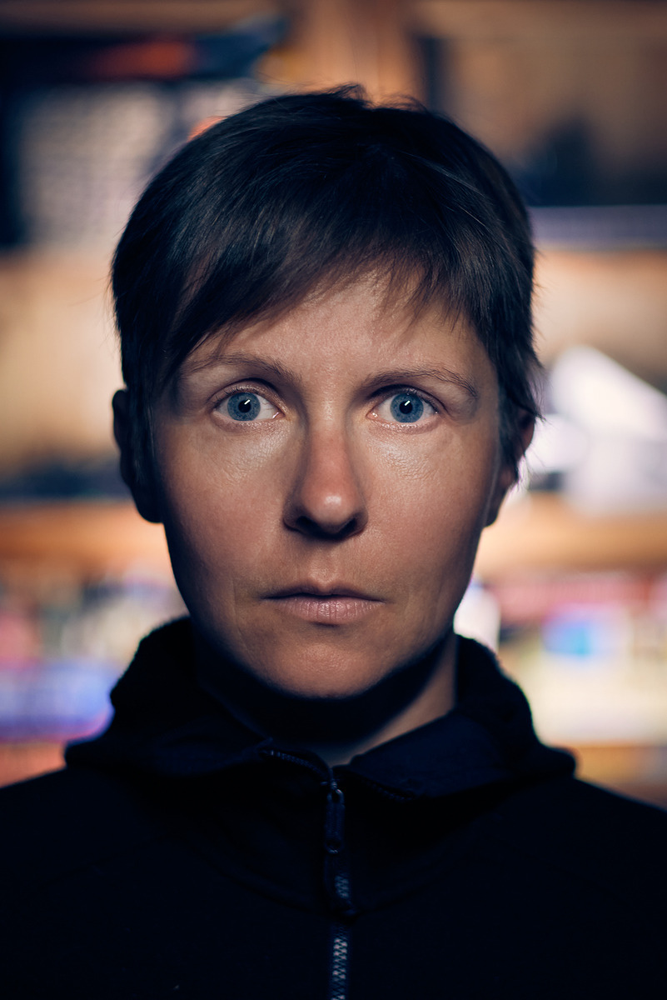

For the next shot, we moved into the hallway. Another light pointed at her back introduced a subtle glowing silhouette - a flattering look that separates the subject from the background. I placed the main light a bit lower than before to make facial features appear more neutral and to reduce shadows:

为了拍摄下一个镜头，我们进入了走廊。 另一盏灯指向她的背部，引入了一种微妙的发光轮廓——一种讨人喜欢的外观，将 从背景的主题。 我把主灯放得比以前低一点，使面部特征看起来更中性并减少阴影：

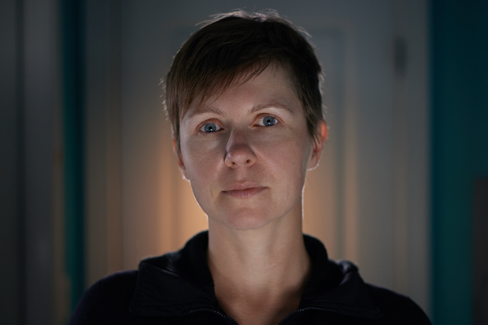

Some LED tubes offer not just white light, but can be adjusted to achieve a full spectrum of colors. Although it's best to master traditional lighting first, such color variations can create a wide range of interesting effects. For example, if you want to recreate the popular "night club" vibe of some contemporary films and video games, you'd want to make the background blue or violet, and then bathe the foreground in magenta or red.

一些 LED 灯管不仅提供白光，还可以进行调整以获得全光谱的颜色。 虽然最好先掌握传统照明， 这种颜色变化可以产生各种有趣的效果。 例如，如果您想重现某些当代流行的“夜总会”氛围 在电影和视频游戏中，您可能希望将背景设为蓝色或紫色，然后将前景染成洋红色或红色。

Of course, there are limits to what LED tubes can do; for one, they aren't particularly bright and can't produce a collimated beam to selectively illuminate a small portion of the frame. It follows that serious studio photographers may also benefit from continuous floodlights such as [Westcott Solix](https://www.bhphotovideo.com/c/product/1508056-REG/westcott_6350_solix_bi_color_1_light_compact.html), as well as focusable spotlights such as [Genaray Torpedo](https://www.bhphotovideo.com/c/product/1495036-REG/genaray_blt_60b_torpedo_led_bi_color_focusing.html).

当然，LED 灯管的作用是有限的； 一方面，它们不是特别亮，不能产生准直光束以选择性地 照亮画面的一小部分。 它遵循 严肃的工作室摄影师也可能受益于连续泛光灯，例如 [Westcott Solix](https://www.bhphotovideo.com/c/product/1508056-REG/westcott_6350_solix_bi_color_1_light_compact.html) ， 以及可聚焦聚光灯，例如 [Genaray Torpedo](https://www.bhphotovideo.com/c/product/1495036-REG/genaray_blt_60b_torpedo_led_bi_color_focusing.html) 。

Shopping for lights can be tricky. Modern cameras perform well in low-light conditions, so photographic lights usually don't need to be exceptionally bright, but they should be matched to the intended use. When it comes to light output, there are two units of measurement you might encounter in product brochures: the _lumen_ (lm) and the _lux_ (lx). Lumens tell you the overall luminous output of a source, no matter which direction the light goes; lux tell you brightly the lamp will illuminate a unit of surface area right in front of it.

购买灯可能很棘手。 现代相机在弱光条件下表现良好，因此摄影灯通常不需要特别亮，但应该匹配 到预期用途。 谈到光输出，您可能会在产品手册中遇到两种测量单位： _流明_ (lm) 和 _勒克斯_ (lx)。 流明告诉您一个光源的整体光输出，无论光向哪个方向； lux 明亮地告诉你灯会照亮它前面的一个单位表面积。

The latter is more useful for photography, and it's good to memorize several points of reference. On a clear day at noon, you might get up to 100,000 lx in the sun and 20,000 lx in the shade; a cover of clouds can bring it down to 2,000 lx or less. Household lighting is quite variable, but measurements tend to hover around 50 to 300 lx. Urban stret illumination in pedestrian areas is around 5-10 lx. A typical candle scores about 1 lx from one meter away, hinting at the historical origins of this unit of measurement. Last but not least, moonlight is usually around 0.1 lx.

后者对摄影更有用，记住几个参考点也很好。 在晴朗的中午，您可能在阳光下达到 100,000 lx，在阴凉处达到 20,000 lx； 封面 云可以将其降低到 2,000 lx 或更少。 家庭照明变化很大，但测量值往往徘徊在 50 到 300 lx 左右。 城市街道照明 步行区约为 5-10 lx。 一根典型的蜡烛在一米外的距离约为 1 lx，暗示了该测量单位的历史渊源。 最后但同样重要的是，月光通常在 0.1 lx 左右。

Pocket photographic lights, such as [Genaray Powerbank 96A](https://www.bhphotovideo.com/c/product/1573349-REG/genaray_pb_96a_powerbank_96a_pocket_light.html) or [Luxli Fiddle](https://www.bhphotovideo.com/c/product/1560012-REG/luxli_orc_fiddle_01_pocket_rgbaw_led_light.html), deliver around 150-200 lx at 1 meter at maximum power. This makes them quite suitable for indoor close-up photography, but fairly useless outdoors, at least until dusk. Handheld LED tubes peak around 400-600 lx; that's enough to provide an outdoor fill light early or late in the day. Affordable AC-powered lamps, such as Westcott Solix or Genaray Torpedo, usually deliver around 3,000-6,000 lx at 1 m. Finally, if you absolutely need it, larger (and costlier) spotlights can pump out 50,000 lx or more.

袖珍摄影灯，例如 [Genaray Powerbank 96A](https://www.bhphotovideo.com/c/product/1573349-REG/genaray_pb_96a_powerbank_96a_pocket_light.html) 或 [Luxli Fiddle](https://www.bhphotovideo.com/c/product/1560012-REG/luxli_orc_fiddle_01_pocket_rgbaw_led_light.html) ，在 1 米处提供大约 150-200 lx 在最大功率。 这使得它们非常适合室内特写摄影，但在户外相当无用，至少在黄昏之前是这样。 手持式LED灯管峰值左右 400-600 勒克斯； 这足以在一天的早些时候或晚些时候提供室外补光灯。 经济实惠的交流电灯，例如 Westcott Solix 或 Genaray Torpedo，通常提供 1 m 处约 3,000-6,000 lx。 最后，如果您确实需要它，更大（也更昂贵）的聚光灯可以输出 50,000 lx 或更多。

## Part II: The optical path

## 第二部分：光路

Right after illumination, the optical system of your camera has an outsized impact on the appearance of your photos and video clips. This does not mean you need to go broke and buy a bulky camera with an array of interchangeable lens; it suffices to know when to zoom in, when to zoom out, and how to control the focus within the scene. The answers to these questions may seem obvious, but there's more to it than meets the eye.

照明后，相机的光学系统会对照片和视频剪辑的外观产生巨大影响。 这并不意味着你需要破产 并购买带有一系列可更换镜头的笨重相机； 知道何时放大，何时缩小以及如何控制场景内的焦点就足够了。 的答案 这些问题可能看起来很明显，但其中的意义远不止表面上看到的那么简单。

### Focal length, aka zoom

### 焦距，又名变焦

"Focal length" is a fancy way of describing the camera's field of view. A wide-angle lens with a short focal length can capture everything that's happening in a crowded bar; meanwhile, telephoto optics let you fill the frame with a single soda can from across the room. In theory, increasing the focal length is the same as snapping a wide-angle photo and then cropping and magnifying the center part. In practice, without optical magnification, you quickly run out of pixels and end up with a blurry mess.

“焦距”是描述相机视野的一种奇特方式。 短焦距的广角镜头可以捕捉到拥挤酒吧中发生的一切； 同时，长焦镜头让您可以从房间的另一端用一个汽水罐填满整个画面。 从理论上讲，增加焦距与拍摄广角照片然后进行裁剪和裁剪是一样的。 放大中心部分。 在实践中，如果没有光学放大，您很快就会用完像素并最终导致模糊不清。

At first blush, focal length may seem uninteresting: after all, you want your subject to occupy a reasonable portion of the frame, and for many novices, this dictates the zoom level they choose. What they overlook is that the size of the subject can be also controlled by moving the camera closer or farther away; in effect, there are countless combinations of distance and focal length settings that preserve the scale of the primary object they're trying to photograph. Let's demonstrate this effect using another porcelain figurine against the backdrop of a cluttered living room:

乍一看，焦距似乎无趣：毕竟，您希望拍摄对象占据画面的合理部分，对于许多新手来说， 这决定了他们选择的缩放级别。 他们忽略的是，拍摄对象的大小也可以通过将相机移近或移远来控制； 实际上，有无数种距离和焦距设置的组合可以保留他们试图拍摄的主要物体的比例。 让我们在杂乱的客厅背景下使用另一个瓷器小雕像来展示这种效果：

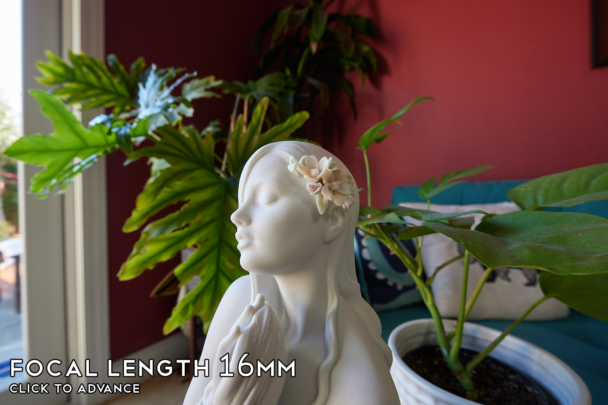

I captured this sequence by taking a step back every time I increased the focal length, so the size of the figurine's face didn't change. Yet, the pictures differ in many ways. For one, at wide angles, distant objects appear much smaller, and a good portion of the room ends up in the frame. As the focal length increases, the perspective becomes less pronounced, and field of view narrows all the way down to a single leaf of a household plant.

每次增加焦距时，我都会后退一步来拍摄这个序列，所以小雕像脸部的大小没有改变。 然而，这些图片在很多方面都有所不同。 首先，在广角下，远处的物体看起来要小得多，而且房间的很大一部分最终都出现在画面中。 随着焦距的增加， 视角变得不那么明显，视野一直缩小到家用植物的一片叶子。

But there's something else happening too: in the first picture, the figurine appears to have a slender face, pouty lips, and a relatively large nose. As the sequence progresses, the face takes on a more rounded shape. This is another manifestation of the same optical phenomenon: at short focal lengths, features closer to the camera look larger, even if the distance differential is a fraction of an inch. It's why cell phone selfies usually look off.

但也有其他事情发生：在第一张照片中，小雕像看起来有一张修长的脸、噘嘴和相对较大的鼻子。 随着序列的推进， 脸部呈现出更圆润的形状。 这是同一光学现象的另一种表现：在短焦距下，特征更接近相机外观 更大，即使距离差只有几分之一英寸。 这就是为什么手机自拍通常看起来不好看。

The slideshow is annotated with focal length numbers for a 35mm camera sensor, also known as "full frame" (a throwback to the days of photographic film). To achieve a similar effect with a smaller sensor, the focal length would need to be proportionally less. Unfortunately, when buying gear, it's not always clear if the manufacturer is talking about "35mm equivalent" focal length or about nominal measurements of the optical path. The former is common in cell phones; the latter in prosumer cameras.

幻灯片上标有 35 毫米相机传感器的焦距数字，也称为“全画幅”（倒退到胶片时代）。 达到类似的效果 使用较小的传感器，焦距需要成比例地减小。 不幸的是，在购买装备时，并不总是很清楚制造商是否在谈论“35mm 等效” 焦距或关于光路的标称测量值。 前者常见于手机； 后者在专业消费者相机中。

Either way, in the 35mm world, there are several reference points to memorize:
    
-   The length of about 20-22mm corresponds to the natural field of view of human vision. Lenses in this vicinity are ideal for photographing nearby crowds, snapping photos for real estate listings, or filming your kids playing on the beach. That said, any features in the periphery of the frame will appear distorted.
    
-   大约20-22mm的长度对应于人类视觉的自然视野。 这附近的镜头 非常适合拍摄附近的人群、拍摄房地产清单的照片或拍摄孩子在海滩上玩耍的照片。 也就是说，任何功能在 框架的外围会出现扭曲。
    
    
-   Focal lengths around 40mm project a 1:1 image onto the sensor, as if you looked at your surroundings through a rectangular viewfinder with no optics at all. This captures lifelike perspective with little distortion. For historical reasons, the most popular lens choice in this neighborhood is actually 50mm - a versatile if unassuming choice for indoor and outdoor scenes where you don't need to cram too much into the frame.
    
-   大约 40 毫米的焦距将 1:1 的图像投射到传感器上，就好像您通过完全没有光学元件的矩形取景器观察周围环境一样。 这捕捉了几乎没有失真的逼真视角。 由于历史原因， 这个社区最受欢迎的镜头选择实际上是 50mm - 对于室内和室外场景来说，这是一个多功能但不张扬的选择，您不需要塞入太多东西 框架。
    
-   Focal length of 85mm is considered to be ideal for professional portrait work. It is long enough to virtually eliminate distortion, but short enough to allow the photographer to stand reasonably close the the model.
    
-   85mm 的焦距被认为是专业人像作品的理想选择。 它足够长以几乎消除失真，但又足够短以 让摄影师站得合理地靠近模特。
    
    
-   Focal lengths of 200mm and above are most commonly employed for nature photography, sports, and for spying on people from afar.
    
-   200mm 及以上的焦距最常用于自然摄影、运动和远距离监视人。
    

Smartphones with zoom optics usually feature focal lengths corresponding to about 20-80mm in the world of full-frame sensors. Past that point, the phone usually switches to digital magnification, and picture quality takes a nosedive.

在全画幅传感器领域，具有变焦光学系统的智能手机通常具有相当于 20-80 毫米的焦距。 过了那个点，电话通常 切换到数字放大，图像质量急转直下。

### Depth of field

### 景深

Depth of field is a property of the optical system that determines what slice of the scene will appear sharp when you focus the lens at a particular distance. Shallow DOF is a wonderful tool for isolating subjects and hiding background clutter, as shown in the sequence below:

景深是光学系统的一个属性，它决定了当您将镜头聚焦在特定距离时，场景的哪一部分会显得清晰。 浅景深是隔离主体和隐藏杂乱背景的绝佳工具，如下图所示：

The depth of field in your photos will depend on three things:

照片的景深取决于三件事：

-   The focal length of the lens. Telephoto optics tend to produce shallow DOF; wide-angle lenses keep almost everything in focus most of the time.
    
-   镜头的焦距。 长焦光学器件往往会产生浅景深； 大多数时候，广角镜头几乎可以让所有东西都清晰对焦。
    
-   The distance to your subject. In close quarters, the DOF might be measured in fractions of an inch; toward the horizon, it can span a mile or more.
    
-   到你的主题的距离。 在近距离，DOF 可能以几分之一英寸为单位进行测量； 朝向地平线，它可以跨越一英里或更多。
    
-   The aperture of the lens, aka the relative diameter of the optical path. Large apertures (numerically low f-values, around f/1.2 to f/1.8) exhibit extremely shallow DOF and create a pleasing blur. Smaller apertures, around f/4 and above, provide relatively little latitude for creative DOF work.
    
-   镜头的孔径，也就是光路的相对直径。 大光圈（数值较低的 f 值，大约 f/1.2 到 f/1.8）表现出极 浅景深并创造令人愉悦的模糊效果。 f/4 左右及以上的较小光圈为创造性的 DOF 工作提供了相对较小的自由度。
    

Although most people find shallow DOF quite agreeable, it can interfere with landscape shots and street photography. In such situations, the simplest solution is to reduce the aperture (increase the f-number). This is akin to squinting your eyes; in addition to making the picture sharper, it also reduces the amount of light hitting the sensor, so you need to crank up the exposure time to cancel out the loss.

虽然大多数人都觉得浅景深很舒服，但它会干扰风景拍摄和街头摄影。 在这种情况下，最简单的 解决办法是减小光圈（增加 f 值）。 这类似于眯起眼睛； 除了让画面更锐利，也减少了进光量 击中传感器，因此您需要增加曝光时间以抵消损失。

The optics of cell phone cameras usually exhibit extremely wide DOF at short focal lengths and do not expose aperture controls, but selective blurring might be doable when the lens are zoomed in. Barring this, some phones employ algorithms that try to estimate depth and selectively apply software blur to portraits. This doesn't always work well, but the results might be acceptable every now and then.

手机摄像头的光学系统通常在短焦距下表现出极宽的景深，并且不会暴露光圈控制，但选择性模糊可能 当镜头放大时是可行的。除此之外，一些手机采用算法来尝试估计深度并有选择地应用软件模糊到 肖像。 这并不总是有效，但有时结果可能是可以接受的。

### Focus point

### 焦点

Even if you are not angling for a shallow DOF, the camera still needs to be focused on the subject to produce crisp-looking photographs. The actual task of adjusting the optics to maximize sharpness is almost always delegated to the camera's autofocus mechanism. That said, it's still up to the photographer to tell the AF mechanism which portion of the image to look at while making the adjustments; in the absence of this input, the system may default to a point in the center of the frame, lock in on a random high-contrast edge, or pick what looks like a face.

即使您不是在寻找浅景深，相机仍然需要聚焦在拍摄对象上才能拍出清晰的照片。 的实际任务 调整光学器件以最大化清晰度几乎总是委托给相机的自动对焦机制。 也就是说，仍然由摄影师告诉 AF 进行调整时要查看图像的哪一部分的机制； 在没有此输入的情况下，系统可能默认为框架中心的一个点， 锁定随机的高对比度边缘，或选择看起来像脸的东西。

Almost every camera is equipped with a joystick or a touch interface to guide the AF system. In portrait work, it is customary to focus on the eyes; we're instinctively drawn to this part of the face, so any accidental focus errors tend to stand out:

几乎每个相机都配备了操纵杆或触摸界面来引导自动对焦系统。 在人像作品中，通常将注意力集中在眼睛上； 我们本能地 吸引到脸部的这一部分，因此任何意外的焦点错误往往会脱颖而出：

If the model's head is titled, it's safer to pick the eye closer to the camera or that is otherwise more prominent; again, there's no one correct answer, but focusing on the less visible eye usually doesn't look right:

如果模特的头是倾斜的，那么将眼睛挑得离相机更近或更突出会更安全； 再次，没有一个正确的答案，但专注于 不太明显的眼睛通常看起来不对：

If the photographer wishes to draw attention to some other element of the composition while keeping a person's face in the frame, it's best to make sure the eyes are robustly out of focus, and not just slightly blurred:

如果摄影师希望在将人脸留在画面中的同时将注意力吸引到构图中的其他元素， 最好确保眼睛完全失焦，而不仅仅是稍微模糊：

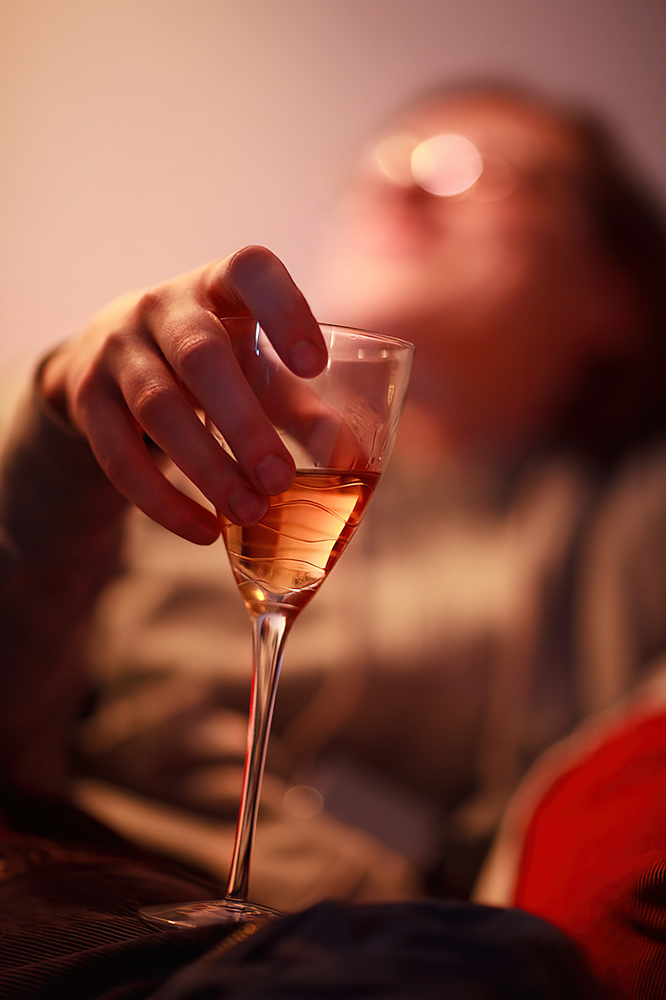

Portraits aside: when setting up landscape shots, many novices pick the horizon as the focus point. That can be a mistake: it's better to select a point about one third of the way between the nearest and the most distant plane in the photograph. As noted earlier, DOF increases with distance, so this approach maximizes the odds that both the foreground and the background are going to look just right. The same one-third rule works for macro shots.

除了人像：在设置风景照片时，许多新手会选择地平线作为焦点。 这可能是一个错误：最好选择大约三分之一的点 照片中最近和最远平面之间的方式。 如前所述，DOF 随着距离的增加而增加，因此这种方法最大限度地提高了 前景和背景看起来都恰到好处。 同样的三分之一规则适用于微距照片。

## Part III: Color and tone

## 第三部分：颜色和色调

Color theory is a peculiar discipline that studies contemporary color preferences and design fads to develop a set of immutable principles that purportedly govern all uses of color in creative work. As with the "ironclad" rules of composition, I recommend skepticism - especially if the author brings out color wheels and starts drawing squiggles between equidistant points.

色彩理论是一门特殊的学科，它研究当代的色彩偏好和设计潮流，以发展出一套据称是不可改变的原则 管理创意作品中所有颜色的使用。 对于“铁定”的构图规则，我建议持怀疑态度——尤其是当作者带出色彩时 轮子并开始在等距点之间绘制波浪线。

At the same time, it must be said that color and tone can be what separates a second-rate photograph from a memorable one. To illustrate, let's look at the potential evolution of this vacation shot deliberately chosen for its mediocrity:

同时，必须指出的是，色彩和色调可以将二流照片与令人难忘的照片区分开来。 为了说明，让我们看一下 因平庸而故意选择的这个假期镜头的潜在演变：

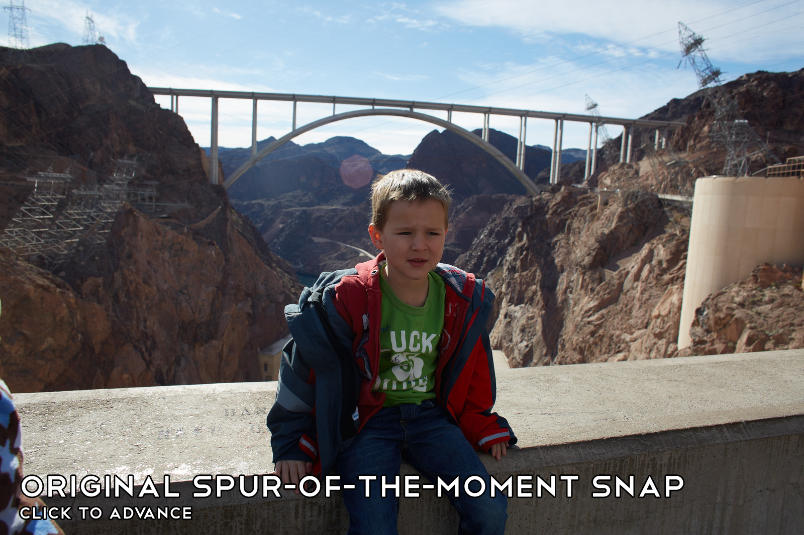

The final photo appears to be better illuminated and more closely conforms to the popular depictions of the [mountainous desert terrain](https://media.istockphoto.com/id/1281287664/photo/red-mars-like-landscape-in-wadi-rum-desert-jordan-this-location-was-used-as-set-for-many.jpg?s=612x612&w=0&k=20&c=XFX3EWeLz2Lb04HhXF_3bnV6uPuSEjVXWbhKW3MLrvI=) around the Hoover Dam. Indeed, some cell phones automatically apply similar tone mapping tricks to photos taken in full sunlight; this happens without the photographer's knowledge and sometimes produces unexpected results.

最终照片看起来更明亮，更符合流行的描述 [多山沙漠地形](https://media.istockphoto.com/id/1281287664/photo/red-mars-like-landscape-in-wadi-rum-desert-jordan-this-location-was-used-as-set-for-many.jpg?s=612x612&w=0&k=20&c=XFX3EWeLz2Lb04HhXF_3bnV6uPuSEjVXWbhKW3MLrvI=) 胡佛水坝周围。 事实上，一些手机会自动对在充足阳光下拍摄的照片应用类似的色调映射技巧； 这发生在没有 摄影师的知识有时会产生意想不到的效果。

### On-the-scene adjustments versus photo editing

### 现场调整与照片编辑

Some color and tone tweaks can be taken care of when taking the photo, but many others are accomplished more easily in front of a computer screen. Pay no mind to purists: even in the era of photographic film, there was no such a thing as an "unaltered" photograph. The choice of process chemicals, paper, and enlarger settings profoundly affected the appearance of the final print. Deceptive edits may be a no-no, but absolute purity was never a meaningful goal.

拍照时可以调整一些颜色和色调，但许多其他调整在电脑屏幕前更容易完成。 无所谓 纯粹主义者：即使在摄影胶卷时代，也没有所谓“未经修改”的照片。 工艺化学品、纸张和 放大机设置深刻地影响了最终印刷品的外观。 欺骗性编辑可能是禁忌，但绝对纯度从来都不是一个有意义的目标。

At this point, we must note that the range of postprocessing options at your disposal is far greater if you capture photos as "raw" files (DNG, CR3, NEF, etc). Most cameras default to JPEG - a compact, 8-bit file format that keeps only the bare minimum of data needed to display the original image. In the Hoover Dam example shown earlier, JPEG compression would have destroyed the texture of the clouds and the detail in the blown-out highlight in my son's hair. Luckily, the raw file I captured contained enough information to bring out that extra detail when the correct slider was dialed down in a software tool.

此时，我们必须注意，如果您将照片捕获为“原始”文件（DNG、CR3、NEF 等），您可以使用的后处理选项范围要大得多。 大多数相机 默认为 JPEG - 一种紧凑的 8 位文件格式，仅保留显示原始图像所需的最少数据。 在胡佛水坝的例子中 如前所示，JPEG 压缩会破坏云的纹理和我儿子头发中过曝高光的细节。 幸运的是，当在软件工具中拨下正确的滑块时，我捕获的原始文件包含足够的信息来显示额外的细节。

Virtually all mid-range digital cameras have the ability to capture raw images, but the feature is not always available on mobile phones. That said, at least some Huawei, Samsung, and Apple handsets support raw images. The photos taken in this mode take up more storage space and can't be directly opened with some programs, but if you're serious about photography, you should give it a go.

几乎所有的中端数码相机都具有捕捉原始图像的能力，但该功能并不总是在手机上可用。 也就是说，至少有一些 华为、三星和苹果手机支持原始图像。 该模式拍摄的照片占用存储空间较大，部分程序无法直接打开， 但如果你认真对待摄影，你应该试一试。

There is a wide selection of programs for editing raw images. The gold standard used to be Adobe Lightroom, but after the app moved to an exploitative subscription model, perhaps the best alternative is [Capture One](https://www.captureone.com/en) ($300 for a perpetual license), followed by [Darktable](https://www.darktable.org/) (free). Most other general-purpose image editors, such as GIMP or Affinity Photo, are also capable of working with raw images, but lack useful photographic workflow features, such as catalog management. This matters if you're trying to quickly sort through several hundred photos, or apply the same adjustments across the entire lot.

有多种用于编辑原始图像的程序可供选择。 黄金标准曾经是 Adobe Lightroom，但在应用程序之后 转向剥削性订阅模式，也许最好的选择是 [Capture One](https://www.captureone.com/en) （永久许可 300 美元）， 其次是 [Darktable](https://www.darktable.org/) （免费）。 大多数其他通用图像编辑器，例如 GIMP 或 Affinity Photo，也是 能够处理原始图像，但缺乏有用的摄影工作流程功能，例如目录管理。 如果你想快速排序，这很重要 通过数百张照片，或对整个批次应用相同的调整。

### Shifting the color balance

### 改变色彩平衡

In the world of digital cameras, color balancing is implemented in software: after the picture is taken, the readings from the sensor are shifted by an algorithm to obtain neutral whites or achieve some other algorithmic goal. When working with JPEG files, the results of this transformation are baked into the final image and cannot be fully undone; but when shooting raw, the original sensor data is preserved, and a full range of adjustments is possible down the line.

在数码相机的世界里，颜色平衡是在软件中实现的：拍摄图片后，传感器的读数被算法移动，以获得中性白或实现其他算法目标。在处理JPEG文件时，此转换的结果被烘焙到最终图像中，无法完全撤销；但在原始拍摄时，会保留原始传感器数据，并且可以进行全方位的调整。

Whenever the in-camera algorithm misses the mark, the most convenient way of removing an undesirable color cast is to point the photo editor's white balance picker at a portion of the picture meant to have a neutral shade of gray. This may be a stainless steel appliance, a section of the pavement, a white wall, a piece of clothing, or a special calibration card. If the result is unsatisfactory or if no suitable target is found, color balance can be also adjusted with manual sliders: "temperature" for moving from yellow to blue and "tint" for purple to green.

每当相机内算法未命中目标时，消除不良色偏的最便捷方法是将照片编辑器的白平衡指向 图片部分的选择器意味着具有中性灰色阴影。 这可能是一个不锈钢器具、一段人行道、一面白墙、一块 衣服，或特殊的校准卡。 如果结果不理想或没有找到合适的目标，也可以使用手动滑块调整色彩平衡： 从黄色到蓝色的“温度”和从紫色到绿色的“色调”。

Of course, one doesn't need to seek a perfectly neutral look. As noted earlier, flattering orange hues are sought after in portrait work; subtle orange grading is the secret behind the good looks of most TV anchors on the news. Outside of portrait work, we are primed to interpret a yellow-orange cast in a well-lit photograph as an indicator of a warm summer day; while a shift toward blues might signal moonlight, frigid cold, or a sterile high-tech environment. Finally, greenish tints give the impression of an inhospitable place; while low-key purples, violets, and reds are the pop-cultural stand-ins for danger or lust.

当然，人们不需要寻求一种完全中性的外观。 如前所述，迷人的橙色色调在肖像作品中受到追捧； 微妙的橙色 分级是新闻中大多数电视主播好看的秘诀。 在人像工作之外，我们准备好在光线充足的照片中解读黄橙色色偏 作为温暖夏日的指标； 而向蓝调的转变可能预示着月光、严寒或无菌的高科技环境。 最后， 淡绿色给人一种荒凉之地的印象； 而低调的紫色、紫罗兰色和红色则是流行文化中危险或欲望的代名词。

As a practical example, consider this sequence of edits, starting with a neutral white balance calibrated on the pillows, and then introducing warmer and cooler tints:

作为一个实际的例子，考虑这个编辑序列，从在枕头上校准的中性白平衡开始，然后引入暖色和冷色 色调：

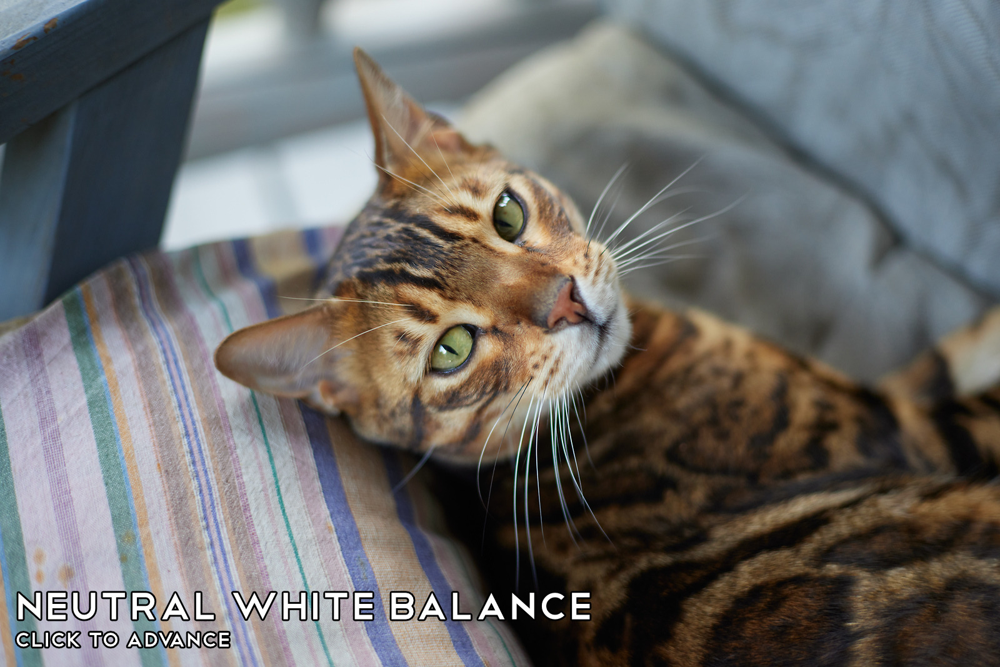

### Exposure adjustments

### 曝光调整

Along with color balance, exposure is one of the most important postprocessing tweaks you can make. Dark, underexposed ("low-key") photos tend to have an ominous appearance, and - with the right lighting and color tint - can imitate nighttime takes. On the other end of the spectrum, overexposed low-contrast ("high-key") shots may have an angelic vibe or signal a futuristic, high-tech setting of some sort.

除了色彩平衡，曝光是您可以进行的最重要的后处理调整之一。 黑暗、曝光不足（“低调”）的照片往往有不祥之兆 外观，并且 - 通过正确的照明和色调 - 可以模仿夜间拍摄。 另一方面，过度曝光的低对比度（“高调”） 镜头可能具有天使般的氛围或暗示某种未来主义的高科技环境。

Strictly speaking, exposure settings can't be changed after the fact: the picture is taken with a predefined shutter time, lens aperture, and sensor amplifier gain (also known as the ISO setting, in another throwback to the era of film photography). It follows that gross exposure errors, such as shooting a completely overexposed frame, usually aren't recoverable. Luckily, when working with raw images, there's still some data captured in the highlights and in the shadows, giving you room to fine-tune the exposure down the line. In essence, photo editing software may shift pixel values up or down to simulate the light hitting the sensor for a bit more or a bit less time.

严格来说，曝光设置不能在事后更改：照片是使用预定义的快门时间、镜头光圈和传感器放大器增益拍摄的（也 被称为 ISO 设置，又回到了胶片摄影时代）。 随之而来的是严重的曝光错误，例如拍摄完全曝光过度的照片 帧，通常是不可恢复的。 幸运的是，在处理原始图像时，仍然会在高光和阴影中捕获一些数据，从而为您留出空间 微调曝光。 本质上，照片编辑软件可能会向上或向下移动像素值以模拟光线照射传感器 多一点或少一点时间。

The usual viable range of such adjustments is plus / minus two "stops"; a stop means a two-fold increase or decrease in exposure time, so the range translates to exposure times between 25% and 400% of the starting point. The following photo of a dog illustrates the effect of adjusting exposure +/- 1 stop:

这种调整通常可行的范围是加/减两个“止损”； 停止意味着曝光时间增加或减少两倍，因此范围转化为曝光时间 起点的 25% 到 400% 之间。 以下狗的照片说明了调整曝光 +/- 1 档的效果：

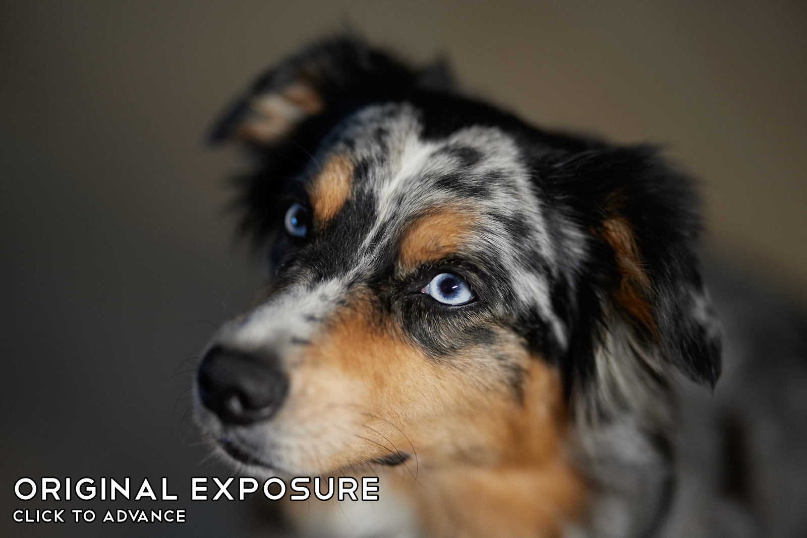

In this instance, the underexposed photo is pretty interesting, perhaps reminiscent of a gray, rainy day in the fall.

在这种情况下，曝光不足的照片非常有趣，可能让人联想到秋天灰蒙蒙的雨天。

Again, there are limits to what can be done in software: the electronics in the camera have their constraints, and the optical path can get in the way, too: especially with lower-grade lens, extreme highlights tend to produce blooming and chromatic aberrations (color fringing) that can't be fixed with a single click. Further, the latitude of possible adjustments is much lower when working with JPEG files; going beyond +/- 25% would be pushing your luck.

Again, there are limits to what can be done in software: the electronics in the camera have their constraints, and the optical path can get in the way, too: especially with lower-grade lens, extreme highlights tend to produce blooming and chromatic aberrations (color fringing) that can't be fixed with a single click. Further, the latitude of possible adjustments is much lower when working with JPEG files; going beyond +/- 25% would be pushing your luck.

### Selective color and tone tweaks

### 选择性颜色和色调调整

In addition to the whole-picture techniques discussed in the two preceding sections, most photo editing programs offer a handful of targeted tone adjustment tools. Chief among them are:

除了前两节中讨论的全图技术外，大多数照片编辑程序还提供一些有针对性的色调调整工具。 其中最主要的是：

-   Separate luminance adjustments for shadows and highlights. In most programs, this is a standalone feature; in Capture One, it's a part of a confusingly-named "High Dynamic Range" tool. The tool helps restore details in overexposed or underexposed areas without affecting the rest of the image. For example, in the Hoover Dam photo, I used it to bring out the texture of the clouds.
    
-   阴影和高光的单独亮度调整。 在大多数程序中，这是一个独立的功能； 在 Capture One 中，它是一个容易混淆的名称的一部分 “高动态范围”工具。 该工具有助于恢复曝光过度或曝光不足区域的细节，而不会影响图像的其余部分。 例如，在胡佛水坝的照片中，我用它来突出云的纹理。
    
    
-   Three-way hue and saturation adjustments for luminance ranges (shadows, midtones, highlights). Most programs refer to this as "color balance". The tool helps correct background color casts when mixing incompatible sources of light. It's also useful for adding distinctive tints to backgrounds, provided that the background is darker or lighter than the main subject of your shot.
    
-   亮度范围（阴影、中间调、高光）的三向色调和饱和度调整。 大多数程序将此称为“色彩平衡”。 该工具有助于在混合不兼容的光源时纠正背景色偏。 它还可用于为背景添加独特的色调，前提是 背景比拍摄的主体更暗或更亮。
    
-   Hue, saturation, and luminance adjustment for a specific source color (common preprogrammed choices: red, orange, yellow, green, cyan, blue, violet, magenta). Also known as the HSL tool, the mechanism is invaluable for making the vegetation greener or the sky more blue; or for selectively correcting skin tones, which tend to be clustered in the red-orange-yellow zone.
    
-   特定源颜色的色调、饱和度和亮度调整（常见的预编程选择：红色、橙色、黄色、绿色、青色、蓝色、紫色、品红色）。 也称为 HSL 工具， 该机制对于使植被更绿或天空更蓝具有无可估量的价值； 或用于有选择地校正肤色，这些肤色往往聚集在 红橙黄带。
    

Here's a practical example of using these tools to make subtle stylistic tweaks to a photograph and give it a distinctive look:

以下是使用这些工具对照片进行细微的风格调整并赋予其独特外观的实际示例：

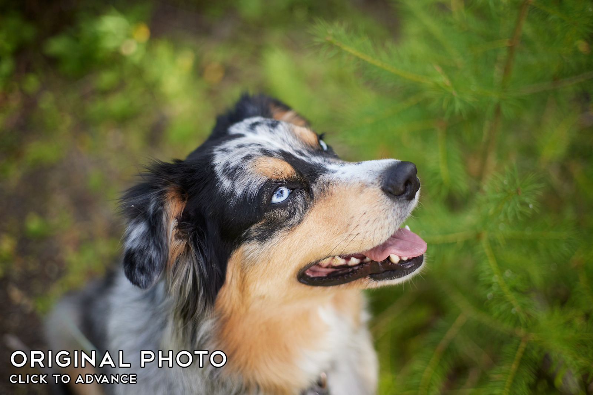

Of course, the adjustments can be bolder. The following sequence of edits to a casual photo of my wife demonstrates some of the possibilities:

当然，调整可以更大胆一些。 以下对我妻子的随意照片进行的一系列编辑展示了一些可能性：

The first variant uses the low-key orange-teal color scheme [all-too-common in superhero action films](https://lcamtuf.coredump.cx/photo_basics/action-ref.jpg); the second one employs a sickly, low-contrast greenish cast seen in [HBO's "Chernobyl"](https://lcamtuf.coredump.cx/photo_basics/chernobyl-ref2.jpg); and the final one is a dark, blue-shifted version that, despite ample illumination, [emulates a photo taken at night](https://lcamtuf.coredump.cx/photo_basics/night-ref.jpg).

的低调橙色蓝绿色配色方案 [第一个变体使用超级英雄动作片中非常常见](https://lcamtuf.coredump.cx/photo_basics/action-ref.jpg) ； 第二个使用病态的、低对比度的绿色投射 在 [HBO 的“切尔诺贝利”](https://lcamtuf.coredump.cx/photo_basics/chernobyl-ref2.jpg) 中看到； 最后一个是深色蓝移版本，尽管照明充足，但仍能 [模拟夜间拍摄的照片](https://lcamtuf.coredump.cx/photo_basics/night-ref.jpg) 。

Of course, some photos may require corrections to regions that can't be isolated based on their color or luminance. In such a case, the photographer may need to resort to manual retouching, either creating a mask layer or freestyling with a "dodge" or "burn" tool or a color brush. Some emerging photo editors, such as [Luminar Neo](https://skylum.com/luminar), employ machine learning to infer the 3D structure of the scene, offering the ability to apply sophisticated lighting effects ("relighting") without fiddling with a brush. The algorithms are slow and clunky, but every now and then, they can save a botched shot.

当然，某些照片可能需要根据颜色或亮度对无法隔离的区域进行校正。 在这种情况下， 摄影师可能需要求助于手动修饰，要么创建遮罩层，要么使用“减淡”或“加深”工具或彩色画笔进行自由造型。 一些新兴的照片编辑器，例如 [Luminar Neo](https://skylum.com/luminar) ， 采用机器学习来推断场景的 3D 结构，提供应用复杂照明效果（“重新照明”）的能力，而无需摆弄 刷子。 这些算法缓慢而笨拙，但时不时地，它们可以挽救一个拙劣的镜头。

## Part IV: Framing

## 第四部分：框架

Along with color theory, the principles of photographic composition are the refuge of armchair philosophers who pen stuffy essays about concepts such as "the golden ratio" or "the rule of thirds".

连同色彩理论，摄影构图的原则是纸上谈兵哲学家的避难所，他们写了关于 “黄金比例”或“三分法则”等概念。

Naturally, aesthetics are to some extent a social construct: your audience might _expect_ photographs to look in a particular way simply because that's what they're accustomed to. It follows that one shouldn't be a habitual contrarian; but it's about as counterproductive to get too hung up on dogma.

自然地，美学在某种程度上是一种社会建构：你的观众可能 _希望_ 照片以特定的方式简单地看 因为那是他们习惯的。 因此，一个人不应该是一个习惯性的逆势投资者； 但这适得其反 太执着于教条。

With this in mind, in the final chapter of this guide, let's have a quick look at several important composition choices - and let's do it without getting bogged down with ideology.

考虑到这一点，在本指南的最后一章中，让我们快速看看几个重要的构图选择——让我们在不被意识形态所困扰的情况下做到这一点。

### Clutter

### 散乱

By far the most serious and preventable error in composition is background clutter. It's not that backgrounds need to be tidy: in street photography, busy cityscapes are a part of the picture as much as the subject standing in front. But when clutter is poorly controlled, it distracts from what the photographer is trying to say.

到目前为止，构图中最严重和可预防的错误是背景杂乱。这并不是说背景需要整洁：在街头摄影中，繁忙的城市景观和站在前面的主题一样是图片的一部分。但是，当杂乱控制不善时，它会分散人们对摄影师试图说的话的注意力。

The distractions can come in many forms: busy textures, clashing colors, intrusive shadows or highlights, awkwardly cropped detail, or elements that simply do not belong - say, a toddler throwing a tantrum in the background of a glamour shot. In the following photograph of a camping knife, survivalist-themed background items make the picture more interesting; removing the props and exposing a messy kitchen countertop ruins the shot:

干扰可能以多种形式出现：复杂的纹理、冲突的颜色、侵入性的阴影或高光、笨拙的裁剪细节，或元素 根本不属于-比如说，一个蹒跚学步的孩子在魅力镜头的背景下发脾气。 在下面的野营刀照片中， 以生存主义为主题的背景物品使画面更有趣； 移除道具并暴露凌乱的厨房台面破坏了镜头：

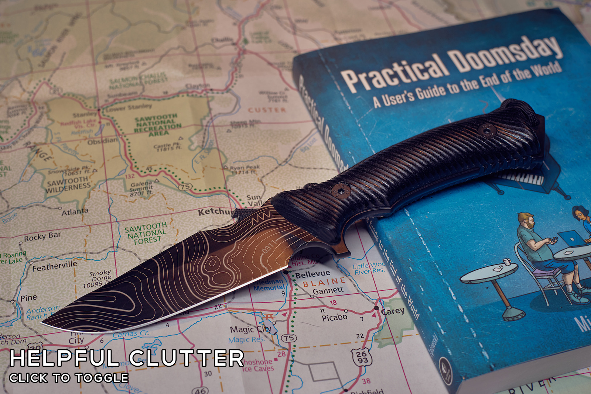

Of course, are times when we want the background to simply disappear. We showcased three ways of doing this earlier in the guide: area lighting, wide apertures, and long focal lengths.

当然，有时我们希望背景简单地消失。 我们在指南的前面展示了三种实现此目的的方法：区域照明、大光圈、 和长焦距。

### Placing the subject within the frame

### 将主体置于框架内

Most novice photographers tend to place their subject smack dab in the middle, facing the camera, and filling most of the frame. There is nothing wrong with this approach, especially in portrait work - but it tends to create a static and clinical look. When the setting permits it, a wider crop can easily liven up the photograph:

大多数新手摄影师倾向于将他们的拍摄对象轻拍放在中间，面对相机，并填满画面的大部分。 没有任何错误 使用这种方法，尤其是在肖像作品中——但它往往会产生一种静态和临床的外观。 当设置允许时，更广泛的作物可以 轻松使照片生动起来：

More dynamism can be added by moving the subject to the left or to the right; this works equally well in landscapes and in portrait work. The resulting negative space provides interesting contrast. If the model's gaze or head is turned in that direction, the photograph has a more balanced appearance and will usually convey a playful or contemplative mood. If all the action is concentrated on a single side of the photograph, the effect is more unsettling, creating a sense of a disturbance happening just outside the frame:

通过将主体向左或向右移动可以增加更多的活力； 这在风景和肖像作品中同样有效。 所结果的 负空间提供了有趣的对比。 如果模特的目光或头部转向那个方向，照片的外观会更加平衡， 通常会传达一种嬉戏或沉思的心情。 如果所有的动作都集中在照片的一面，效果会更令人不安， 创造一种在框架外发生的干扰感：

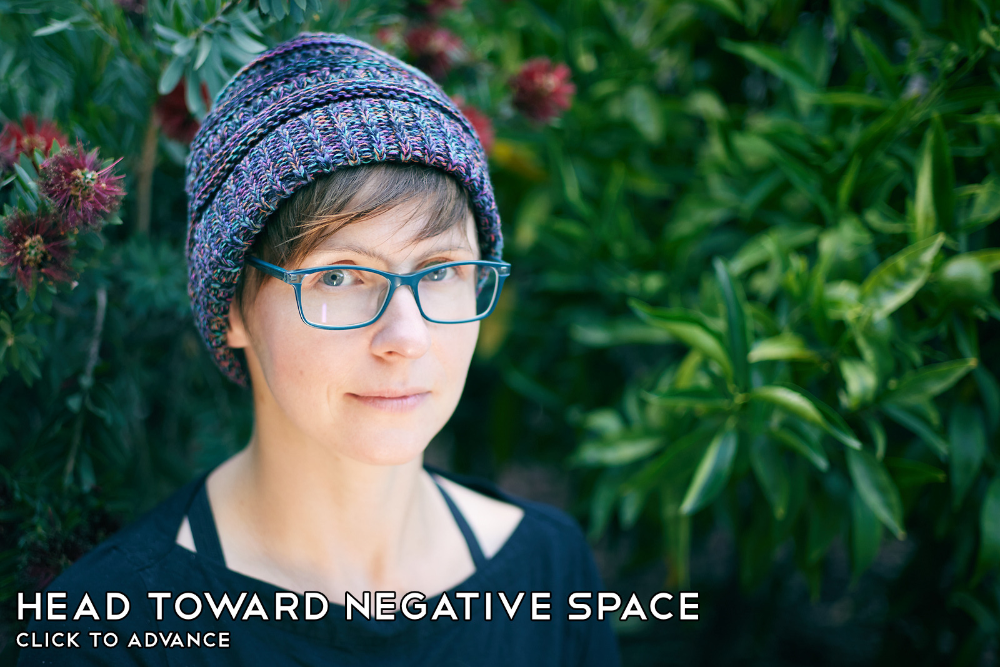

Titling the camera is another underused trick. It usually doesn't help much in portrait work, as it distorts body proportions and just looks odd; but in landscapes, it is a godsend. In the plains, tilting the camera up lets you to capture more of the sky and less distracting details right next to the photographer. In mountainous terrains or next to large bodies of water, doing the opposite helps capture more architectural detail or more reflections of the sky.

为相机设置标题是另一个未被充分利用的技巧。 它通常对人像工作没有多大帮助，因为它会扭曲身体比例并且看起来很奇怪； 但在风景中，这是天赐之物。 在平原上，将相机向上倾斜可以让您捕捉到更多的天空和更少令人分心的细节 给摄影师。 在山区或靠近大片水域时，反其道而行之有助于捕捉更多建筑细节 或更多天空的倒影。

For portraits, it's also good to pay attention to model's posture; the pictures tend to be far more flattering if the model stands up straight and raises their chin up a bit.

对于人像，注意模特的姿势也很好； 如果模特站直并且 抬起他们的下巴一点。

## Epilogue

## 结语

The approaches and tools described in this document are by no means exhaustive. There are many other photographic techniques worth learning; for example, there are several methods for conveying motion - timelapses, multiple exposures, and selective blur effects created by panning the camera in tandem with the movement of the subject of the shot. Or, there are multiple optical and postprocessing-based methods for correcting or exaggerating perspective, or for achieving a variety of non-photorealistic looks.

本文档中描述的方法和工具并不详尽。 还有很多其他的摄影技巧值得学习； 为了 例如，有几种传达运动的方法 - 延时摄影、多重曝光，以及通过串联摇动相机创建的选择性模糊效果 随着拍摄对象的移动。 或者， 有多种基于光学和后处理的方法可用于校正或夸大透视，或用于实现各种非逼真的外观。

My goal wasn't to create a comprehensive list of every little trick in the book. Instead, I wanted to help the readers discover the joy of photographic experimentation, no matter whether they're carrying a smartphone or a $5,000 professional photo rig. Unlike some other authors, I also wanted to do this without bragging about my own best shots: the examples employed on this page were all shot in the backyard or around the home with minimal prep.

我的目标不是为书中的每个小技巧创建一个完整的列表。 相反，我想帮助读者发现摄影的乐趣 进行实验，无论他们携带的是智能手机还是价值 5,000 美元的专业照相设备。 不像其他一些作者，我也想这样做 无需吹嘘我自己的最佳镜头：本页中使用的示例都是在后院或家中拍摄的，准备工作很少。

If you are interested in learning from others, I recommend joining a photo community, although I would avoid sites such as Instagram or Flickr. They are centered around view counts, "like" counts, and algorithmic feeds, leading to extreme homogenization of content and toxic community dynamics. My favorite site right now is [Glass](https://glass.photo/). They charge a modest fee ($30/year), but have a friendly community and give every photographer an equal chance of getting noticed without making it feel that you're participating in a zero-sum game.

如果您有兴趣向他人学习，我建议您加入照片社区，尽管我会避开网站 例如 Instagram 或 Flickr。 它们以观看次数、“喜欢”次数和算法提要为中心，导致内容和内容的极端同质化 有毒的社区动态。 我现在最喜欢的网站是 [玻璃](https://glass.photo/) 。 他们收取适度的费用（每年 30 美元），但有一个友好的社区，并为每位摄影师提供平等的待遇 在不让人觉得您正在参与零和游戏的情况下获得关注的机会。

_You can contact me at [lcamtuf@coredump.cx](mailto:lcamtuf@coredump.cx), [follow me on Twitter](https://twitter.com/lcamtuf), or [subscribe on Substack](https://lcamtuf.substack.com/archive).  
For other features, check out [my homepage](https://lcamtuf.coredump.cx/)._

_你可以通过 [lcamtuf@coredump.cx](mailto:lcamtuf@coredump.cx) 联系我， [在 Twitter 上关注我](https://twitter.com/lcamtuf) ， 或 [订阅 Substack](https://lcamtuf.substack.com/archive) 。  
其他功能请查看 [我的主页](https://lcamtuf.coredump.cx/) 。_

_Your lucky number is: 21884000_