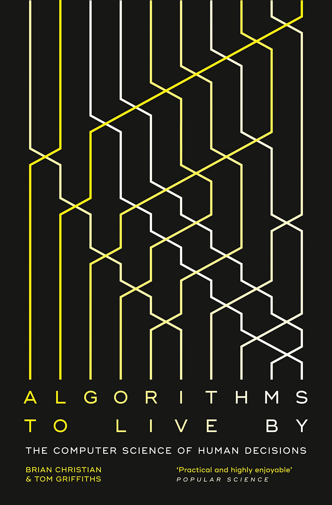
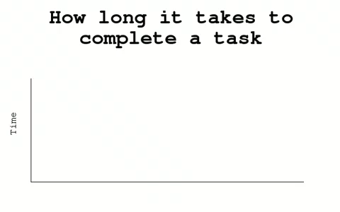
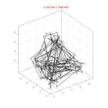
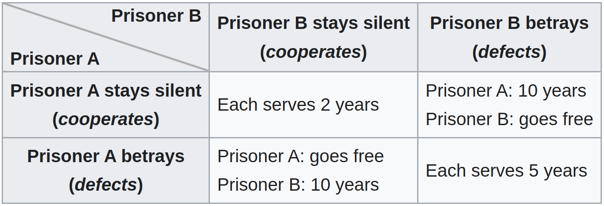

December 28, 2022 Tags: [book](https://blog.galowicz.de/tags/book.html "All pages tagged 'book'.")  
2022 年 12 月 28 日标签：书  

What does the math tell us about how many job applicants we should look at before hiring one? While onboarding our new employees, how can ideas from the [TCP networking protocol](https://en.wikipedia.org/wiki/Transmission_Control_Protocol) help us to identify the optimal workload for them? Why would giving employees unlimited vacation days most likely lead to less vacation being taken? [Algorithms to live By - The Computer Science of Human Decisions](https://amzn.to/3HAmDaM) gives some fascinating insights into such questions.

关于在雇用一个求职者之前我们应该看多少求职者，数学告诉我们什么？在新员工入职时，TCP 网络协议的想法如何帮助我们确定适合他们的最佳工作负载？为什么给员工无限假期最有可能导致休假减少？ Algorithms to live By - The Computer Science of Human Decisions 对这些问题给出了一些有趣的见解。

[Link to the Amazon Store Page](https://amzn.to/3HAmDaM)  
链接到亚马逊商店页面  

The first edition of this book is from 2016 and the store page on Amazon says that since 2017 it’s already the 12th edition. It is ~370 pages in total but the actual content without notes etc. is just about 260 pages.

这本书的第一版是 2016 年的，亚马逊商店页面上说自 2017 年以来已经是第 12 版了。总共约 370 页，但不含注释等的实际内容只有 260 页左右。

[Brian Christian](https://en.wikipedia.org/wiki/Brian_Christian) is a non-fiction author, speaker, poet, programmer (e.g. Ruby on Rails contributor), and researcher. This book and his other books, [The Most Human Human](https://amzn.to/3G4nkbn) and [The Alignment Problem](https://amzn.to/3vbQqPP) won several awards.

Brian Christian 是一位非小说类作家、演说家、诗人、程序员（例如 Ruby on Rails 贡献者）和研究员。这本书和他的其他著作《最人性化的人类》和《对齐问题》获得了多个奖项。

[Tom Griffiths](https://en.wikipedia.org/wiki/Tom_Griffiths_(cognitive_scientist)) is a professor of computer science and psychology and the director of the [Computational Cognitive Science Lab](https://cocosci.princeton.edu/) at Princeton University.

汤姆·格里菲思 (Tom Griffiths) 是普林斯顿大学计算机科学和心理学教授，也是计算认知科学实验室的主任。

## Content and Structure  
内容和结构  

The authors selected 11 topics from mathematics and computer science. In each chapter, they describe practical and relevant challenges from real life that can be solved with formulas and algorithms. If you ever asked yourself “What’s the point? I will never use this in real life!” at school or university, these are for you!

作者从数学和计算机科学中选择了 11 个主题。在每一章中，他们都描述了现实生活中可以用公式和算法解决的实际和相关挑战。如果你曾经问过自己“这有什么意义？我永远不会在现实生活中使用它！”在学校或大学，这些都是给你的！

The authors spend some time explaining probabilities, trade-offs, complexities, etc. with scientific methods, but they don’t go too deep. This makes the content comprehensible for nearly everyone, especially interested readers who never studied anything mathematical/technical. I might not be the best person to judge that because I did study at university, but I am certain that as long as seeing variable names or diagrams does not straightly trigger fear, you should be able to understand it and experience fun reading the stories.

作者花了一些时间用科学的方法解释概率、权衡、复杂性等，但并没有深入。这使得几乎每个人都可以理解内容，尤其是从未研究过任何数学/技术的感兴趣的读者。我可能不是最好的判断者，因为我在大学学习过，但我确信只要看到变量名或图表不会直接引发恐惧，你应该能够理解它并体验阅读故事的乐趣。

Let’s get to the different chapters and their content. This review is much longer than [the others in my blog](https://blog.galowicz.de/tags/book.html): The different chapters provide valuable insights, but on mostly disconnected topics. I did not want to drop any.

让我们来看看不同的章节及其内容。这篇评论比我博客中的其他评论长得多：不同的章节提供了有价值的见解，但主题大多是互不相关的。我不想放弃任何东西。

### 1\. Optimal Stopping - When to Stop Looking  
1\. 最佳停止——什么时候停止看  

This chapter is about the _stopping problem_, which is a classic decision-making problem that involves choosing the optimal time to stop a process or activity. When you want to find the best specimen out of an unknown set (in the sense that you don’t know what’s the lower and upper bounds of “good” are), the **Look-Then-Leap rule** states that you should set an amount of time you want to spend looking. This amount of time should then be split into a looking phase and a leaping phase. In the looking phase, you categorically don’t choose anyone. After that point, you enter the leaping phase and commit to the next candidate who outshines the best applicants from the looking phase. The looking phase shall occupy 37% of the time or the number of candidates you can afford to look at. This leads to a 37% chance of selecting the best (That it’s both 37% is a coincidence that results from the maths). 37% does not appear great, but is better or worse than the gut feeling?

本章介绍停止问题，这是一个经典的决策制定问题，涉及选择最佳时间停止流程或活动。当你想从一个未知的集合中找到最好的样本时（在你不知道“好”的下限和上限是什么的意义上），Look-Then-Leap 规则规定你应该设置一个数量你想花时间看。然后应将这段时间分为观察阶段和跳跃阶段。在寻找阶段，你绝对不会选择任何人。在那之后，你进入了跨越阶段，并致力于下一位在寻找阶段胜过最佳申请人的候选人。寻找阶段应占据 37% 的时间或您可以负担得起的候选人数量。这导致选择最佳的机会为 37%（两者都是 37% 是数学得出的巧合）。 37% 看起来并不好，但比直觉更好还是更差？

This strategy can be used in a variety of interesting situations:  
此策略可用于各种有趣的情况：  

-   The Secretary Problem: Choosing the best candidate from a pool of applicants  
    秘书问题：从众多申请人中选出最佳人选  
    
-   Selling a house: Determining the best offer  
    卖房子：确定最佳报价  
    
-   Finding a partner: Deciding when to commit to a relationship after a series of different dates
    
    寻找伴侣：在一系列不同的约会之后决定何时开始一段关系
    
-   Selecting a parking lot: Choosing the best parking space available while trading off between how far it is from your flat and how often you will have to do another round around the block
    
    选择停车场：选择最好的可用停车位，同时权衡距离您的公寓多远以及您必须绕着街区转一圈的频率
    
-   Quitting an activity: Deciding when to stop doing something  
    退出活动：决定何时停止做某事  
    

### 2\. Explore/Exploit - The Latest vs. the Greatest  
2\. 探索/利用——最新与最伟大  

This chapter starts with the very concrete question of when you should stick to the restaurants you know to be good, and when to try out new ones. It turns out that this is the same problem that casino visitors face in a saloon full of one-armed bandits: Should they try the same bandit again, or should they switch to another one? It’s also the same problem that marketing specialists face when they do [A/B testing](https://en.wikipedia.org/wiki/A/B_testing) of different wordings or styles of advertisements (the book mentions that Google tested 41 shades of blue for a toolbar in 2009).

本章从一个非常具体的问题开始，即什么时候应该坚持去那些你认为不错的餐厅，什么时候去尝试新的。事实证明，这与赌场游客在满是独臂强盗的沙龙中面临的问题相同：他们应该再次尝试同一个强盗，还是应该换一个？这也是营销专家在对不同的广告措辞或风格进行 A/B 测试时面临的相同问题（书中提到谷歌在 2009 年为工具栏测试了 41 种蓝色阴影）。

The [Gittins Index](https://en.wikipedia.org/wiki/Gittins_index) models a strategy for deciding when to switch from one solution to another, based on the _history_ of success rates. The way it works is that each alternative gets a score. For every decision, the alternative with the highest score is selected. Based on success or failure, the score is updated following a specific scheme. This strategy results in the following behavior:

Gittins Index 根据成功率的历史，对决定何时从一种解决方案切换到另一种解决方案的策略进行建模。它的工作方式是每个备选方案都得到一个分数。对于每个决策，都会选择得分最高的备选方案。根据成功或失败，分数会按照特定方案更新。此策略会导致以下行为：

-   _Untested options_ are tried if the tested ones go below a success rate of 70%  
    如果测试的选项低于 70% 的成功率，则尝试未测试的选项  
    
-   The strategy is more merciful on failing alternatives in the beginning than on long-known alternatives
    
    该策略对一开始失败的备选方案比对长期已知的备选方案更仁慈
    

Switching or not switching between alternatives raises questions about other use cases: In clinical studies, the set of voluntary patients (or not so voluntary if the only cure is still experimental) is split into a group that gets the new experimental medicine, and another group that gets placebos. When the study is only half over but the new treatment already proved very effective, how ethical is it to stick to giving the placebo group placebos instead of switching over all patients to the seemingly effective treatment? Switching might however jeopardize the needed statistical backing that is needed to approve the effectiveness of new treatments.

在备选方案之间切换或不切换会引发对其他用例的问题：在临床研究中，自愿患者组（如果唯一的治疗方法仍在试验中，则不是那么自愿）被分成一组获得新的实验药物，另一组那得到安慰剂。当研究只进行了一半但新疗法已经被证明非常有效时，坚持给安慰剂组安慰剂而不是将所有患者转为看似有效的治疗，这在道德上有多大？然而，转换可能会危及批准新疗法有效性所需的统计支持。

While the Gittins Index looks at the past, the chapter also introduces the reader to other strategies as the **regret minimization strategy** based on so-called [Upper Confidence Bound algorithms](https://en.wikipedia.org/wiki/Thompson_sampling#Upper-Confidence-Bound_%28UCB%29_algorithms), which take assumptions on the future into account. These give the benefit of the doubt a mathematical backing:

在 Gittins 指数回顾过去的同时，本章还向读者介绍了其他策略，例如基于所谓的置信上限算法的遗憾最小化策略，该算法考虑了对未来的假设。这些为怀疑的好处提供了数学支持：

> Following the advice of these algorithms, you should be excited to meet new people and try new things — to assume the best about them, in the absence of evidence to the contrary. In the long run, optimism is the best prevention for regret.
> 
> 按照这些算法的建议，你应该很高兴结识新朋友并尝试新事物——假设他们最好，在没有相反证据的情况下。从长远来看，乐观是最好的预防后悔的方法。

When looking at the future, it also becomes relevant how much time is left:  
在展望未来时，还剩下多少时间也很重要：  

> Explore when you will have time to use the resulting knowledge and exploit when you’re ready to cash in. The interval makes the strategy.
> 
> 探索您何时有时间使用由此产生的知识，并在您准备好兑现时加以利用。时间间隔决定了策略。

### 3\. Sorting - Making Order  
3.排序-下单  

This chapter handles sorting theory and discusses the cost of sorting. Sorting costs _time_ (and comparisons - sometimes these are not free), which is something that computer science students learn to quantify with complexity theory up and down, typically by analyzing different sorting algorithms and estimating their costs as a function of the input size.

本章处理排序理论并讨论排序的成本。排序需要时间（和比较——有时这些不是免费的），这是计算机科学专业的学生学习用复杂性理论上下量化的东西，通常是通过分析不同的排序算法并根据输入大小估算它们的成本。

Ever thought about how long it would take to sort a deck of 5 cards? Or 10? Or 20? The cost of sorting them goes up much steeper than the deck of cards grows. The book demonstrates the science behind scale nicely to non-computer-scientists using more examples that show how much scale hurts when sorting inputs that are just too big. Social hierarchies and pecking orders have been established with physical fighting as sorting methods, which puts the “cost” of comparison/sorting in a completely different perspective. Civilization has brought softer and more efficient ways to sort with sports and markets, which resemble crowd algorithms, so to say.

有没有想过整理一副 5 张牌需要多长时间？还是 10 个？还是20？对它们进行分类的成本上升得比纸牌增长的速度快得多。该书使用更多示例向非计算机科学家很好地展示了规模背后的科学，这些示例表明在对太大的输入进行排序时规模有多大伤害。以肉搏为排序方式的社会等级和等级制度已经建立，这将比较/排序的“成本”放在一个完全不同的角度。文明带来了更柔和、更有效的方式来分类体育和市场，可以说这类似于人群算法。

The example of sports is explained more in-depth: Championships and leagues are a way to sort teams by performance. For sports where one person or team competes version one other at a time, complex tournament strategies like [Single Elimination](https://en.wikipedia.org/wiki/Single-elimination_tournament), [Round Robin](https://en.wikipedia.org/wiki/Round-robin_tournament), [Ladder](https://en.wikipedia.org/wiki/Ladder_tournament), and [Bracket Tournament](https://en.wikipedia.org/wiki/Bracket_(tournament)) strategies are used. Races with many competitors are simpler, but even these have qualifying events, which sort them before the race which is supposed to sort them in the first place. Each of these strategies resembles different sort algorithms for different problem sizes, long before sorting algorithms have been formalized.

对体育运动的例子进行了更深入的解释：锦标赛和联赛是一种按表现对球队进行排序的方式。对于一个人或一个团队一次竞争另一个版本的运动，使用复杂的锦标赛策略，如单淘汰赛、循环赛、阶梯赛和分组赛策略。有很多参赛者的比赛更简单，但即使是这些比赛也有排位赛，这些比赛在本应首先对它们进行排序的比赛之前对它们进行排序。这些策略中的每一个都类似于针对不同问题规模的不同排序算法，远早于排序算法被形式化。

Even _search_ machines offer some kind of sorting, although this is surprising at first: You enter some search words into Google, and Google presents you not one but many websites - sorted by relevance.

甚至搜索机也提供某种排序，尽管一开始这很令人惊讶：你在谷歌中输入一些搜索词，谷歌向你展示的不是一个网站，而是许多网站——按相关性排序。

### 4\. Caching - Forget About It  
4.缓存——忘记它  

This chapter motivates the concept of “caching” by explaining [memory hierarchies](https://en.wikipedia.org/wiki/Memory_hierarchy): Computers have smaller portions of very fast but expensive memory and bigger portions of memory that is cheap but slow. Users like their computers fast, so engineers have to deal with the challenge to provide the right data at the right time from limited faster memory.

本章通过解释内存层次结构来激发“缓存”的概念：计算机有较小部分的非常快但昂贵的内存和较大部分的便宜但慢的内存。用户喜欢他们的计算机速度很快，因此工程师必须应对挑战，在正确的时间从有限的更快的内存中提供正确的数据。

Phil Karlton, at that time an engineer at Carnegie Mellon, half-jokingly originated [this quote around 1970](https://www.karlton.org/2017/12/naming-things-hard/):

Phil Karlton，当时是卡内基梅隆大学的一名工程师，在 1970 年左右半开玩笑地引用了这句话：

> There are only two hard things in Computer Science: Cache invalidation and naming things.
> 
> 计算机科学中只有两件难事：缓存失效和命名事物。

The chapter before was all about sorting data to make specific items easier to find. This chapter brings some (half-joking) news for the lazy. With all the knowledge about caching, it turns out, that _not_ sorting data can shorten access times a lot:

之前的章节都是关于对数据进行排序以使特定项目更容易找到的。本章为懒人带来了一些（半开玩笑的）消息。有了关于缓存的所有知识，事实证明，不对数据进行排序可以大大缩短访问时间：

> Tom’s otherwise extremely tolerant wife objects to a pile of clothes next to the bed, despite his insistence that it’s in fact a highly efficient caching scheme. Fortunately, our conversations with computer scientists revealed a solution to this problem too. Rik Belew of UC San Diego, who studies search engines from a cognitive perspective, recommended the use of a valet stand.
> 
> Tom 极其宽容的妻子反对在床边放一堆衣服，尽管他坚持认为这实际上是一种高效的缓存方案。幸运的是，我们与计算机科学家的对话也揭示了这个问题的解决方案。加州大学圣地亚哥分校的 Rik Belew 从认知角度研究搜索引擎，他建议使用代客泊车台。

The mentioned “pile of clothes” in some sense resembles the [Least Recently Used](https://en.wikipedia.org/wiki/Cache_replacement_policies#LRU) caching scheme:

上面提到的“一堆衣服”在某种意义上类似于最近最少使用的缓存方案：

> LRU teaches us that the next thing we can expect to need is the last one we needed, while the thing we’ll need after that is probably the second-most-recent one. And the last thing we can expect to need is the one we’ve already gone the longest without.
> 
> LRU 告诉我们，下一个我们需要的东西是我们需要的最后一个，而在那之后我们需要的东西可能是倒数第二个。我们最不需要的东西就是我们已经离开了最长时间的东西。

The chapter makes interesting detours between principles known from computer science like [Beladys Anomaly](https://en.wikipedia.org/wiki/B%C3%A9l%C3%A1dy%27s_anomaly), [First-In-First-Out (FIFO)](https://en.wikipedia.org/wiki/FIFO_(computing_and_electronics)), and [Random Replacement](https://en.wikipedia.org/wiki/Cache_replacement_policies#Random_replacement_(RR)), and shows how similar these principles are to processes that happen in our brains, like the [Human Forgetting Curve](https://en.wikipedia.org/wiki/Forgetting_curve), which is a known phenomenon from neurosciences and psychology.

本章在 Beladys 异常、先进先出 (FIFO) 和随机替换等计算机科学已知原理之间进行了有趣的迂回，并展示了这些原理与我们大脑中发生的过程有多么相似，例如人类遗忘曲线，这是神经科学和心理学的已知现象。

The science of caching can not only be applied to computers, but also the physical layout of library rooms, the ordering of clothes in the bedroom, management of post-its, and shelves, and why/when/how people remember or forget things:

缓存科学不仅可以应用于计算机，还可以应用于图书馆房间的物理布局、卧室的衣服排序、便利贴和书架的管理，以及人们为什么/何时/如何记住或忘记事物：

> Caching gives us the language to understand what’s happening. We say “brain fart” when we should really say “cache miss”.
> 
> 缓存为我们提供了理解正在发生的事情的语言。当我们真的应该说“缓存未命中”时，我们说“脑放屁”。

### 5\. Scheduling - First Things First  
5\. 日程安排——要事第一  

Beginning with the question of how to schedule tasks in everyday life, the book delves briefly into how computers schedule technical tasks, and what to learn from them:

这本书从日常生活中如何安排任务的问题开始，简要探讨了计算机如何安排技术任务，以及可以从中学到什么：

> The first lesson in single-machine scheduling is literally before we even begin: make your goals explicit.
> 
> 单机调度的第一课实际上是在我们开始之前：明确你的目标。

As things are generally a bit more arranged in computer memory than in real life, it is easier to summarize observations and extract guidelines:

由于事物在计算机内存中的排列通常比现实生活中的要多一些，因此更容易总结观察结果并提取指导方针：

> Minimizing the sum of completion times leads to a very simple optimal algorithm called Shortest Processing Time: Always do the quickest task you can.
> 
> 最小化完成时间的总和会导致一个非常简单的最优算法，称为最短处理时间：总是尽可能快地完成任务。

After a few motivating examples that relate to real-life tasks, the amount of theory is ramped up a bit, for example when explaining [Earliest Due Date (also called Moore’s Algorithm)](https://en.wikipedia.org/wiki/Single-machine_scheduling) vs [Shortest Processing Time](https://en.wikipedia.org/wiki/Shortest_job_next) and discussing such strategies with real-life problems (e.g. something bad happens when a deadline is crossed).

在一些与现实生活任务相关的激励性例子之后，理论的数量有所增加，例如在解释最早截止日期（也称为摩尔算法）与最短处理时间以及讨论此类策略与现实生活问题时（例如，超过截止日期时会发生一些不好的事情）。

This example cracked me up:  
这个例子让我崩溃了：  

> There’s an episode of The X-Files where the protagonist Mulder, bedridden and about to be consumed by an obsessive-compulsive vampire, spills a bag of sunflower seeds on the floor in self-defense. The vampire, powerless against his compulsion, stoops to pick them up one by one, and ultimately the sun rises before he can make a meal of Mulder. Computer scientists would call this a “ping attack” or a “denial of service” attack: Give a system an overwhelming number of trivial things to do, and the important things get lost in the chaos.
> 
> 在 X 档案的一集中，主人公穆德卧床不起，即将被强迫症吸血鬼吞噬，为了自卫，他将一袋葵花籽洒在了地板上。吸血鬼无力抵抗他的冲动，弯下腰把它们一个接一个地捡起来，最终太阳升起来了，他还没来得及和 Mulder 做一顿饭。计算机科学家将此称为“ping 攻击”或“拒绝服务”攻击：给系统大量琐碎的事情要做，而重要的事情却在混乱中消失了。

The chapter also goes a meta-level up: A perfect schedule or time plan must reflect two things:

本章还进行了元级别的提升：完美的时间表或时间计划必须反映两件事：

> \[…\], preemption isn’t free. Every time you switch tasks, you pay a price, known in computer science as a context switch.
> 
> \[...\]，抢占不是免费的。每次切换任务时，都会付出代价，在计算机科学中称为上下文切换。

The little pause between two tasks should be reflected, otherwise, we drown in task switching:

应该反映两个任务之间的小停顿，否则，我们会淹没在任务切换中：

> Anyone you interrupt more than a few times an hour is in danger of doing no work at all.
> 
> 任何你每小时打断几次以上的人都有可能根本没有做任何工作。

…for which computer science also has a name: [Thrashing Phenomenon](https://en.wikipedia.org/wiki/Thrashing_(computer_science))  
......计算机科学还有一个名字：抖动现象  

But that is not all, the time in which we are rethinking to create the plan must also be part of the plan, which is where it gets complicated. In many cases, no perfect plan exists because whenever a human or a machine waits for external events to happen, they have to deal with uncertainty and in between do what’s possible, which in turn brings new problems:

但这还不是全部，我们重新考虑制定计划的时间也必须是计划的一部分，这就是它变得复杂的地方。在许多情况下，不存在完美的计划，因为每当人或机器等待外部事件发生时，他们都必须处理不确定性并在两者之间做可能的事情，这反过来又会带来新的问题：

> What makes real-time scheduling so complex and interesting is that it is fundamentally a negotiation between two principles that aren’t fully compatible. These two principles are called responsiveness and throughput: How quickly you can respond to things, and how much you can get done overall.
> 
> 实时调度之所以如此复杂和有趣，是因为它从根本上说是两个不完全兼容的原则之间的协商。这两个原则称为响应性和吞吐量：您对事物的响应速度有多快，以及您总体上可以完成多少。

Most computer scientists already know this example from real-time scheduling lectures at university, but I think that this is one of the most interesting examples in this chapter:

大多数计算机科学家已经从大学的实时调度讲座中了解到这个例子，但我认为这是本章中最有趣的例子之一：

> For the first time ever, a rover was navigating the surface of Mars. The $150 million Mars Pathfinder spacecraft had accelerated to a speed of 16,000 miles per hour, traveled across 309 million miles of empty space and landed with space-grade airbags onto the rocky red Martian surface. And now it was procrastinating.
> 
> 火星车有史以来第一次在火星表面航行。耗资 1.5 亿美元的火星探路者号宇宙飞船已加速至每小时 16,000 英里的速度，穿越了 3.09 亿英里的空旷空间，并带着太空级安全气囊降落在多岩石的红色火星表面。现在它正在拖延。

By _procrastinating_ the author means that the $150 million Pathfinder was not responding to commands from the earth due to a scheduling problem called [Priority Inversion](https://en.wikipedia.org/wiki/Priority_inversion). A good solution for priority inversion is [Priority Inheritance](https://en.wikipedia.org/wiki/Priority_inheritance): If you realize that employees come late to very important meetings all the time, do some research to find the reason and find out that the coffee machine is so slow that employees end up in endless queues: Increase the importance of high-quality coffee machine maintenance to the same level like the most important meetings.

作者的拖延意味着耗资 1.5 亿美元的探路者号由于称为优先级反转的调度问题而没有响应来自地球的命令。优先级反转的一个很好的解决方案是优先级继承：如果您发现员工总是在非常重要的会议上迟到，请进行一些研究以找出原因并发现咖啡机太慢以致于员工无休止地排队：将高质量咖啡机维护的重要性提高到与最重要的会议同等的水平。

The main message is:  
主要信息是：  

> As business writer and coder Jason Fried says, “Feel like you can’t proceed until you have a bulletproof plan in place? Replace ‘plan’ with ‘guess’ and take it easy.” Scheduling theory bears this out.
> 
> 正如商业作家兼编码员 Jason Fried 所说，“感觉在制定防弹计划之前无法继续？用‘猜测’代替‘计划’，放轻松。”调度理论证实了这一点。

### 6\. Bayes’s Rule - Predicting the Future  
6\. 贝叶斯法则——预测未来  

This chapter begins with a problem that, if it was solved, would make scheduling much easier: Predicting the future. Statistics and stochastic theory are typically used to model the certainty of the timing and quantity of events or things. The whole chapter starts with historic developments on this matter and tries to make it entertaining a bit, but statistics are still notoriously hard to make look interesting.

本章从一个问题开始，如果解决了这个问题，日程安排就会变得容易得多：预测未来。统计学和随机理论通常用于模拟事件或事物的时间和数量的确定性。整章都从这个问题的历史发展开始，并试图让它变得有趣一点，但众所周知，统计数据仍然很难看起来很有趣。

The biggest part of the chapter educates (in easy-to-understand ways) about [Bayes’ Rule](https://en.wikipedia.org/wiki/Bayes%27_theorem), [Laplace’s Law](https://en.wikipedia.org/wiki/Rule_of_succession), the [Copernican Principle](https://en.wikipedia.org/wiki/Copernican_principle), [normal distribution](https://en.wikipedia.org/wiki/Normal_distribution) vs. [power-law distribution](https://en.wikipedia.org/wiki/Power_law), and many others, which is relatively boring. After we read through that part (or skipped it), we reach my favorite example:

本章的大部分内容（以通俗易懂的方式）教育了贝叶斯法则、拉普拉斯定律、哥白尼原理、正态分布与幂律分布等等，比较枯燥。在我们阅读完那部分（或跳过它）之后，我们得到了我最喜欢的例子：

The [Marshmallow experiment](https://www.simplypsychology.org/marshmallow-test.html) is widely known:  
棉花糖实验广为人知：  

> Each child would be shown a delicious treat, such as a marshmallow, and told that the adult running the experiment was about to leave the room for a while. If they wanted to, they could eat the treat right away. But if they waited until the experimenter came back, they would get two treats. Unable to resist, some of the children ate the treat immediately. And some of them stuck it out for the full fifteen minutes or so until the experimenter returned, and got two treats as promised.
> 
> 每个孩子都会看到一份美味的食物，比如棉花糖，并告诉他们进行实验的成年人即将离开房间一会儿。如果他们愿意，他们可以马上吃掉食物。但如果他们等到实验者回来，他们就会得到两份奖励。无法抗拒，一些孩子立即吃了点心。他们中的一些人坚持了整整 15 分钟左右，直到实验者回来，并按照承诺得到了两份零食。

Everyone who knows about this experiment also knows that long-time observation of these kids suggested that the ones who are patient enough to wait to get both marshmallows are also generally more successful in their later life (which has to be questioned because the study has been repeated to find out that the statistical significance is too weak). The chapter however continues with an interesting twist, which is by far not as widely known:

知道这个实验的人也都知道，对这些孩子的长期观察表明，那些有足够耐心等待得到两个棉花糖的孩子在他们以后的生活中通常也更成功（这不得不受到质疑，因为研究已经反复发现统计意义太弱）。然而，本章继续有一个有趣的转折，到目前为止还没有广为人知：

> \[…\] the most interesting group comprised the ones in between — the ones who managed to wait a little while, but then surrendered and ate the treat.
> 
> \[…\] 最有趣的一组包括介于两者之间的那些——那些设法等了一会儿，但随后投降并吃了点心的人。

The researchers tried to find out why kids would behave so irrationally - is it a sheer lack of discipline? They found out that it is more about trust in authorities than discipline:

研究人员试图找出为什么孩子们会表现得如此不理智——这是完全缺乏纪律吗？他们发现这更多的是关于对权威的信任而不是纪律：

> \[…\], the kids in the experiment embarked on an art project. The experimenter gave them some mediocre supplies and promised to be back with better options soon. But, unbeknownst to them, the children were divided into two groups. In one group, the experimenter was reliable and came back with the better art supplies as promised. In the other, she was unreliable, coming back with nothing but apologies.
> 
> \[…\]，实验中的孩子们开始了一项艺术项目。实验者给了他们一些平庸的用品，并承诺很快会带着更好的选择回来。但是，他们不知道的是，孩子们被分成了两组。在一组中，实验者很可靠，并按照承诺带回了更好的美术用品。另一方面，她不可靠，除了道歉什么也没回来。

When the marshmallow experiment was repeated with children who first went through this experiment, the results showed that the children which were disappointed by the experimenter would more likely give up in the middle of the marshmallow experiment. I thought about this a little longer - This is an interesting data point for potential disadvantages that many (poor/less successful) people might suffer from: Some may have grown up in environments where they have been disappointed by their parents/authorities too often and ended up trusting less in such investments.

当对第一次经历这个实验的孩子重复棉花糖实验时，结果表明，对实验者失望的孩子更有可能在棉花糖实验中途放弃。我想了很久——这是一个有趣的数据点，说明许多人（穷人/不太成功的人）可能遭受的潜在劣势：有些人可能在父母/当局经常失望的环境中长大，最终对此类投资的信任度降低了。

### 7\. Overfitting - When to Think Less  
7\. 过度拟合——什么时候少思考  

This chapter was very interesting and captivating read: The phenomenon of [overfitting](https://en.wikipedia.org/wiki/Overfitting) is a known problem in the domain of artificial intelligence/machine learning. Most explanations are extremely abstract and hard to grasp for outsiders. But actually, overfitting is very easy to understand when explained through real-life situations:

这一章读起来非常有趣和迷人：过度拟合现象是人工智能/机器学习领域的一个已知问题。大多数解释都非常抽象，外行人很难理解。但实际上，通过现实生活中的情况来解释过拟合非常容易理解：

> In the military and in law enforcement, for example, repetitive, rote training is considered a key means for instilling line-of-fire skills. The goal is to drill certain motions and tactics to the point that they become totally automatic. But when overfitting creeps in, it can prove disastrous. There are stories of police officers who find themselves, for instance, taking time out during a gunfight to put their spent casings in their pockets — good etiquette on a firing range.
> 
> 例如，在军队和执法部门，重复的死记硬背训练被认为是灌输火线技能的关键手段。目标是将某些动作和战术训练到完全自动化的程度。但是当过度拟合悄悄出现时，它可能会造成灾难性的后果。例如，有警察发现自己在枪战中抽出时间将用过的弹壳放入口袋的故事——这是射击场上的良好礼仪。

The effect of this case of overfitting was an unnecessary increase in dead officers:

这种过度拟合的结果是不必要地增加了死亡军官的数量：

> On several occasions, dead cops were found with brass in their hands, dying in the middle of an administrative procedure that had been drilled into them.
> 
> 有几次，死去的警察被发现手上拿着黄铜，死于对他们进行钻探的行政程序。

Another example from the same domain goes like this:  
来自同一领域的另一个例子是这样的：  

> \[…\] the FBI was forced to change its training after agents were found reflexively firing two shots and then holstering their weapon—a standard cadence in training — regardless of whether their shots had hit the target and whether there was still a threat. Mistakes like these are known in law enforcement and the military as “training scars,” and they reflect the fact that it’s possible to overfit one’s own preparation.
> 
> \[...\] 在发现特工反射性地开两枪然后收起武器后，联邦调查局被迫改变训练——这是训练中的标准节奏——不管他们的枪是否击中目标以及是否仍然存在威胁。像这样的错误在执法部门和军队中被称为“训练伤疤”，它们反映了一个事实，即可能会过度适应自己的准备工作。

Overfitting and the difficulty to set incentives in a way that they don’t end up being counter-effective have a lot of overlap:

过度拟合和难以以最终不会适得其反的方式设置激励措施有很多重叠之处：

> \[…\] focusing on production metrics led supervisors to neglect maintenance and repairs, setting up future catastrophe. Such problems can’t simply be dismissed as a failure to achieve management goals. Rather, they are the opposite: The ruthless and clever optimization of the wrong thing.
> 
> \[…\] 专注于生产指标导致主管忽视维护和维修，从而造成未来的灾难。这些问题不能简单地被视为未能实现管理目标而被忽视。相反，它们恰恰相反：对错误事物的无情而巧妙的优化。

The presented examples were my highlights, but the chapter has some more good ones. Out of all the theory and real-life examples, the authors extract one piece of good advice against overthinking:

提供的例子是我的亮点，但本章还有一些更好的例子。在所有理论和现实生活中的例子中，作者提取了一条反对过度思考的好建议：

> The greater the uncertainty, the bigger the gap between what you can measure and what matters, the more you should watch out for overfitting — that is, the more you should prefer simplicity, and the earlier you should stop.
> 
> 不确定性越大，您可以测量的内容与重要内容之间的差距就越大，您就越应该注意过度拟合——也就是说，您应该越喜欢简单性，并且应该越早停止。

### 8\. Relaxation - Let It Slide  
8\. 放松——顺其自然  

At university in group assignments, but also later at work while discussing with colleagues, I often experienced that [perfect is the enemy of the good](https://en.wikipedia.org/wiki/Perfect_is_the_enemy_of_good): The group of students or colleagues would rather discuss forever while ditching one 80-90% idea after the other, instead of simply deciding for one and live with a “good” result. (After having the last chapter also discussing the difficulty of setting good incentives: Often company culture makes employees want to avoid making mistakes to not damage their career, so it seems better to discuss perfect solutions forever.)

在大学的小组作业中，以及后来在与同事讨论时的工作中，我经常体验到完美是好的敌人：学生或同事小组宁愿永远讨论，同时放弃一个 80-90% 的想法，而不是简单地决定一个人并带着“好”的结果生活。 （上一章还讨论了设置良好激励的困难：通常公司文化让员工希望避免犯错以免损害他们的职业生涯，因此最好永远讨论完美的解决方案。）

This is irrational, but what’s the rational way if a problem looks too hard to solve? In computer science, problems are considered “too hard” when the runtime and/or memory complexity of finding the solution has exponential growth (instead of polynomial, which is considered “easy”). The chapter contains strategies and algorithms that do [Constraint Relaxation](https://en.wikipedia.org/wiki/Relaxation_(approximation)):

这是不合理的，但如果问题看起来太难解决，合理的方法是什么？在计算机科学中，当寻找解决方案的运行时和/或内存复杂性呈指数增长时（而不是多项式，这被认为是“简单的”），问题被认为“太难了”。本章包含执行约束松弛的策略和算法：

> But \[computer scientists\] don’t relax themselves; they relax the problem.  
> 但是 \[计算机科学家\] 并没有放松自己；他们放宽了问题。  

The first example that can be solved faster with this strategy is the [Traveling Salesman Problem](https://en.wikipedia.org/wiki/Travelling_salesman_problem): If you want to visit many places, what is the right order to visit them that at the same time gives you the shortest overall travel distance? To really find out, one would have to sum up the travel distances of _all_ possible paths and then take the shortest one out of the huge list. Constraint relaxing algorithms make shortcuts and are hence faster, but don’t guarantee you the correct result - instead, you get a “good” answer that’s most probably better than following your gut feeling or just trying randomly. The message is clear:

第一个可以用这种策略更快解决的例子是旅行推销员问题：如果你想访问很多地方，访问它们的正确顺序是什么，同时给你最短的总旅行距离？要真正找到答案，就必须将所有可能路径的行进距离相加，然后从庞大的列表中选出最短的一条。约束松弛算法可以创建捷径，因此速度更快，但不能保证您得到正确的结果——相反，您会得到一个“好”的答案，这很可能比跟随您的直觉或只是随机尝试要好。信息很明确：

> If we’re willing to accept solutions that are close enough, then even some of the hairiest problems around can be tamed with the right techniques.
> 
> 如果我们愿意接受足够接近的解决方案，那么即使是一些最棘手的问题也可以用正确的技术来解决。

This chapter is really short and less technical than the following ones which will pick up on relaxation again, but it leaves another very interesting life-philosophic inspiration:

这一章真的很短，而且比后面的章节技术性要低，这些章节会再次放松，但它留下了另一个非常有趣的生活哲学灵感：

> One day as a child, Brian was complaining to his mother about all the things he had to do: his homework, his chores… “Technically, you don’t have to do anything,” his mother replied. “You don’t have to do what your teachers tell you. You don’t have to do what I tell you. You don’t even have to obey the law. There are consequences to everything, and you get to decide whether you want to face those consequences.” Brian’s kid-mind was blown. It was a powerful message, an awakening of a sense of agency, responsibility, moral judgment.
> 
> 小时候的一天，布赖恩向他的母亲抱怨他必须做的所有事情：他的家庭作业、他的杂务……“从技术上讲，你不需要做任何事情，”他的母亲回答道。 “你不必按照老师告诉你的去做。你不必按照我告诉你的去做。你甚至不必遵守法律。凡事都有后果，你可以决定是否要面对这些后果。”布赖恩的孩子气被击垮了。这是一个强有力的信息，唤醒了一种能动性、责任感和道德判断力。

It was probably not clear to both at that moment, but she taught him [Lagrangian Relaxation](https://en.wikipedia.org/wiki/Lagrangian_relaxation): Take rules (constraints) and transform them into costs which means taking the _impossible_ and downgrading it to _costly_. Sometimes the consequences of breaking some rules are less bad than not solving some bigger problem.

那时两人可能都不清楚，但她教会了他拉格朗日松弛：采用规则（约束）并将其转化为成本，这意味着将不可能的事情降级为昂贵的。有时违反一些规则的后果比不解决一些更大的问题要好。

### 9\. Randomness - When to Leave It to Chance  
9\. 随机性——什么时候听天由命  

We usually only leave important things to chance (if at all) when we exhausted all other strategies, and they did not work out. This chapter illuminates some use cases where introducing randomness into algorithms makes them perform better than deterministic algorithms would. Again, let us skip over the rich details and background stories that are shared about the [Monte Carlo Method](https://en.wikipedia.org/wiki/Monte_Carlo_method), [Bloom Filters](https://en.wikipedia.org/wiki/Bloom_filter), [Hill Climbing](https://en.wikipedia.org/wiki/Hill_climbing), [Metropolis Algorithm](https://en.wikipedia.org/wiki/Metropolis%E2%80%93Hastings_algorithm), and [Simulated Annealing](https://en.wikipedia.org/wiki/Simulated_annealing). Instead, let’s have a look at the [Miller-Rabin Primality Test](https://en.wikipedia.org/wiki/Miller%E2%80%93Rabin_primality_test) and its significance to the majority of private communication on this planet:

当我们用尽所有其他策略并且它们没有成功时，我们通常只会将重要的事情留给机会（如果有的话）。本章阐述了一些用例，在这些用例中，将随机性引入算法使其性能优于确定性算法。同样，让我们跳过有关蒙特卡洛方法、布隆过滤器、爬山算法、Metropolis 算法和模拟退火的丰富细节和背景故事。相反，让我们看看 Miller-Rabin 素数测试及其对这个星球上大多数私人通信的意义：

When encrypting messages before sending and decrypting after receiving them, we typically rely on [asymmetric cryptography](https://en.wikipedia.org/wiki/Public-key_cryptography). For the user, this means that encryption and decryption are done with _different keys_. Having different keys has the advantage that the key for encryption can be publicly shared, enabling anyone to send us an encrypted message that only we can read. The decryption key is stored and protected in private. Without going too deep into detail, such algorithms rely on the fact that there are no “fast” (following the notion of fast from the earlier chapters) mathematical algorithms that can reverse multiplication or exponentiation of very large numbers if not all variables are known (i.e. the key that is part of the calculation). A simple example with small numbers is the question “What are the two prime factors of the number `15`?”. The answer is: `3 * 5` equals `15` as both `3` and `5` are prime and there is no other combination of prime numbers for which this works, so this is the correct answer. For small numbers, this is very easy, but for huge numbers, computers would need centuries - so the designers of algorithms like [PGP](https://en.wikipedia.org/wiki/Pretty_Good_Privacy) decided to rely on the security of messages on this fact: The user’s private key for decryption consists of two huge prime numbers and must be kept secret. The public key that the user can freely send around consists of … the _product_ of these numbers. (So if the combination of `3` and `5` would be the user’s private key, the product `15` would be the public one!) This means that everyone actually _has_ access to the secret private key. It is nonetheless safe from being misused because no one can extract the two individual prime numbers from it. This might sound like a wonky foundation for security for everyone who thought that messages are only secure if third parties cannot decrypt them, but such a perfect algorithm does not exist: The best we can get is that it’s only _too hard_ to decrypt a message within the same century.

在发送前加密消息和接收后解密时，我们通常依赖非对称密码学。对于用户来说，这意味着加密和解密是用不同的密钥完成的。拥有不同的密钥的好处是加密密钥可以公开共享，使任何人都可以向我们发送只有我们才能阅读的加密消息。解密密钥是私下存储和保护的。无需太深入细节，此类算法依赖于这样一个事实，即如果不是所有变量都已知，则不存在可以反转非常大数的乘法或求幂的“快速”（遵循前面章节中快速的概念）数学算法（即作为计算一部分的密钥）。小数的一个简单示例是“数字`15` 的两个质因数是什么？”这个问题。答案是：`3 * 5` 等于`15`，因为`3` 和`5` 都是质数，并且没有其他质数组合适用，所以这是正确答案。对于小数字，这很容易，但对于大数字，计算机将需要几个世纪 - 因此 PGP 等算法的设计者决定依赖于以下事实的消息安全性：用于解密的用户私钥由两个巨大的质数组成并且必须保密。用户可以自由发送的公钥包括……这些数字的乘积。 （所以如果`3` 和`5` 的组合是用户的私钥，产品`15` 就是公钥！）这意味着每个人实际上都可以访问秘密私钥。尽管如此，它还是不会被滥用，因为没有人可以从中提取出两个单独的素数。 对于那些认为消息只有在第三方无法解密时才是安全的人来说，这听起来像是一个不稳定的安全基础，但这样一个完美的算法并不存在：我们能得到的最好的结果是在内部解密消息太难了同一个世纪。

It does not stop there: Let’s see how the user selects the prime numbers. When running a mail program or secure messenger for the first time, the laptop or cell phone would automatically generate a key for the user (Often hidden from the user’s sight to improve the user experience). To get two huge prime numbers, the program rolls the dice to get two huge numbers and then tests if they are prime. If they are not, it rolls the dice again and again, until it has two huge prime numbers. Testing if a number is a prime number is typically done with the [Miller-Rabin Primality Test](https://en.wikipedia.org/wiki/Miller%E2%80%93Rabin_primality_test). This test consists of a formula that is cheap to compute. Its result tells if the number is a _strong probable prime_ or not - it can’t say if it _is_ a prime, but only if it is likely one. To get to `99.999999...%` (and many more nines) probability of being correct, the algorithm is repeated a lot. Now we (or our messenger application) know that we have two prime numbers that are most probably prime, and unlikely to have been chosen by someone else for their keys, so we can now happily encrypt our most secret and important messages with them. This might again sound like a wonky foundation, but it’s more probable to end up with insecure keys due to [broken random number generators](https://en.wikinews.org/wiki/Predictable_random_number_generator_discovered_in_the_Debian_version_of_OpenSSL) than due to trusting the probabilities from the encryption algorithms. I learned about these things at university in multiple cryptography lectures, but we were too busy learning how they work to have a look at the history and real-life stories, so reading about it again from some fresh perspective in this book was enlightening.

它并不止于此：让我们看看用户如何选择素数。首次运行邮件程序或安全信使时，笔记本电脑或手机会自动为用户生成一个密钥（通常隐藏在用户的视线之外以改善用户体验）。为了得到两个巨大的素数，程序掷骰子得到两个巨大的数字，然后测试它们是否是素数。如果不是，它会一次又一次地掷骰子，直到它有两个巨大的素数。测试一个数是否为质数通常使用 Miller-Rabin 素数测试来完成。该测试包含一个计算成本低的公式。它的结果表明这个数字是否是一个强可能的素数——它不能说它是否是一个素数，但只能说它可能是一个。为了达到`99.999999...%`（以及更多的 9）正确的概率，该算法要重复很多次。现在我们（或我们的信使应用程序）知道我们有两个最有可能是质数的质数，并且不太可能被其他人选择作为他们的密钥，所以我们现在可以愉快地用它们加密我们最机密和最重要的消息。这可能再次听起来像是一个不稳定的基础，但由于随机数生成器损坏而不是由于信任加密算法的概率，最终得到不安全密钥的可能性更大。我在大学里通过多次密码学讲座了解了这些东西，但我们忙于学习它们的工作原理，无暇了解历史和现实生活中的故事，因此从本书的新视角再次阅读它很有启发性。

The main message of this chapter is:  
本章的主要信息是：  

> There is a deep message in the fact that on certain problems, randomized approaches can outperform even the best deterministic ones. Sometimes the best solution to a problem is to turn to chance rather than trying to fully reason out an answer.
> 
> 事实上，在某些问题上，随机方法甚至可以胜过最好的确定性方法，这一事实传达了一个深刻的信息。有时，解决问题的最佳方法是求助于机会，而不是试图完全推理出答案。

### 10\. Networking - How We Connect  
10\. 网络——我们如何联系  

After beginning with a historic tour of the content of the first telegraph, first phone call, first _mobile_ phone call, and first text message over the internet, the first subsection finds an elegant conclusion:

在对第一条电报、第一个电话、第一个移动电话和互联网上的第一条短信的内容进行了历史性的浏览之后，第一小节得出了一个优雅的结论：

> The foundation of human connection is protocol — a shared convention of procedures and expectations, from handshakes and hellos to etiquette, politesse, and the full gamut of social norms. Machine connection is no different. Protocol is how we get on the same page; in fact, the word is rooted in the [Greek _protokollon_](https://en.wikipedia.org/wiki/Protocol_(diplomacy)), “first glue,” which referred to the outer page attached to a book or manuscript.
> 
> 人际关系的基础是礼仪——一种共同的程序和期望约定，从握手和问候到礼节、礼貌和社会规范的全部范围。机器连接也不例外。协议是我们达成共识的方式；事实上，这个词源于希腊语 protokollon，“第一胶水”，指的是附在书籍或手稿上的外页。

Most of the chapter goes into explaining how switched packet networking works because all the digital communication on the planet relies on it. The interesting bit of switched networking is that there is no such thing as a _connection_ like telephone calls used to have, although video meeting apps tell you the opposite. Ditching dedicated connections gives more flexibility because computers don’t maintain only a few connections that are used all the time, but instead maintain many connections which are only used in bursts. The book shares the amount of technical detail about [TCP](https://en.wikipedia.org/wiki/Transmission_Control_Protocol), [Congestion Control](https://en.wikipedia.org/wiki/Network_congestion#Congestion_control), the [Byzantine Generals Problem](https://en.wikipedia.org/wiki/Two_Generals%27_Problem), and [Exponential Backoff](https://en.wikipedia.org/wiki/Exponential_backoff) that is needed to bridge the ideas behind them with real-life scenarios that most readers know.

本章的大部分内容都在解释交换分组网络的工作原理，因为地球上所有的数字通信都依赖于它。交换网络的有趣之处在于，没有像电话过去那样的连接，尽管视频会议应用程序告诉您相反的情况。放弃专用连接提供了更大的灵活性，因为计算机不会只维护一些一直使用的连接，而是维护许多只在突发中使用的连接。这本书分享了有关 TCP、拥塞控制、拜占庭将军问题和指数退避的大量技术细节，这些细节是将它们背后的思想与大多数读者所知的现实生活场景联系起来所需要的。

I liked how the authors found something in nature that makes TCP’s flow control strategy look very natural:

我喜欢作者如何在自然界中发现一些东西，使 TCP 的流量控制策略看起来非常自然：

> Other animal behavior also evokes TCP flow control, with its characteristic sawtooth. Squirrels and pigeons going after human food scraps will creep forward a step at a time, occasionally leap back, then steadily creep forward again.
> 
> 其他动物行为也唤起 TCP 流量控制，具有锯齿特征。追逐人类食物残渣的松鼠和鸽子会一次向前爬行，偶尔向后跳，然后又稳步向前爬行。

This strategy is also called [Additive Increase/Multiplicative Decrease](https://en.wikipedia.org/wiki/Additive_increase/multiplicative_decrease) due to its nature to increment the send rate in small steps while the transmission of packets is successful but drop the rate drastically in case of transmission errors. This way messages are often sent at a slower rate than possible, but transmission errors are kept to a minimum.

这种策略也称为加性增加/乘性减少，因为它的性质是在数据包传输成功时以小步增加发送速率，但在传输错误的情况下大幅降低速率。这种方式通常以比可能的速度慢的速度发送消息，但传输错误保持在最低限度。

The book suggests the application of the AIMD strategy during the onboarding of new employees: If it’s unclear how much they will perform in their new environment, increase their workload in small steps, and as soon as they appear overloaded and make too many mistakes due to stress, drastically reduce the number again. Midterm, the employee would work slightly below their maximum and not be over-stressed, which is good for all participants.

书中建议在新员工入职时应用 AIMD 策略：如果不清楚他们在新环境中的表现如何，就小步增加他们的工作量，一旦他们出现超负荷并因以下原因犯太多错误压力，再次大幅减少数量。中期，员工的工作量会略低于他们的最大值并且不会过度紧张，这对所有参与者都有好处。

Application of this strategy would also have a positive long-term impact if applied as a countermeasure against the bad effects of the [Peter principle](https://en.wikipedia.org/wiki/Peter_principle): Employees are promoted based on their success in previous jobs until they reach a level at which they are no longer competent, as skills in one job do not necessarily translate to another. The AIMD strategy suggests that we should be able to demote people again if their last promotion decreased the overall organization’s strength (it does not appear useful in this case to demote the person _multiple_ levels lower although AIMD works like that, depending on the metrics).

如果将此策略用作应对彼得原则的不良影响的对策，该策略的应用也会产生积极的长期影响：员工根据他们在以前工作中的成功得到晋升，直到他们达到不再胜任的水平，因为一项工作的技能不一定能转化为另一项工作。 AIMD 策略表明，如果他们上次晋升降低了整个组织的实力，我们应该能够再次降级（在这种情况下，将人员降级多个级别似乎没有用，尽管 AIMD 是这样工作的，具体取决于指标）。

Two other interesting messages can be extracted from this chapter:  
从本章中可以提取另外两条有趣的信息：  

> In 2014, for instance, UC Santa Cruz’s Jackson Tolins and Jean Fox Tree demonstrated that those inconspicuous “uh-huhs” and “yeahs” and “hmms” and “ohs” that pepper our speech perform distinct, precise roles in regulating the flow of information from speaker to listener—both its rate and level of detail. Indeed, they are every bit as critical as ACKs are in TCP. Says Tolins, “Really, while some people may be worse than others, ‘bad storytellers’ can at least partly blame their audience.”
> 
> 例如，在 2014 年，加州大学圣克鲁斯分校的杰克逊·托林斯和让·福克斯特里证明，那些充斥在我们讲话中的不起眼的“嗯嗯”、“是”、“嗯”和“哦”在调节语流中发挥着独特而精确的作用从说话者到听者的信息——包括它的速率和详细程度。事实上，它们与 TCP 中的 ACK 一样重要。托林斯说，“真的，虽然有些人可能比其他人更糟糕，但‘糟糕的讲故事者’至少可以部分归咎于他们的听众。”

I liked to read this because it backs something that I always felt in online meetings: If all or most participants are on mute with disabled webcams, it hurts the effectiveness of online meetings. Unfortunately, I have seen this online meeting culture a lot. I typically also annoy the students of [my university lecture](https://qasm.de/) into enabling their webcams because it enables me to present them with a better listening experience when I see the students’ faces: If they look annoyed, I might have been talking about the same thing for too long (thinking that the majority does not understand it yet) and if they pinch their eyes, I might have skipped over something too quickly. Giving some kind of talk in front of a screen without faces on it is a bad experience and makes it harder to give the audience a good experience.

我喜欢阅读这篇文章，因为它支持我在在线会议中一直感受到的一些东西：如果所有或大多数参与者都在禁用网络摄像头的情况下保持静音，则会损害在线会议的效率。不幸的是，这种在线会议文化我见多了。我通常也会惹恼我大学讲座的学生启用他们的网络摄像头，因为当我看到学生的脸时，这使我能够为他们提供更好的聆听体验：如果他们看起来很生气，我可能也在谈论同样的事情很长（认为大多数人还不明白），如果他们捏着眼睛，我可能跳过得太快了。在没有面孔的屏幕前进行某种演讲是一种糟糕的体验，并且更难为观众提供良好的体验。

My last highlight of this chapter is the explanation of the technical phenomenon in computer networks called [Buffer Bloat](https://en.wikipedia.org/wiki/Bufferbloat): When network devices that are under heavy load are configured with too large buffers (This is typically not a configuration knob that is visible for end-users) to queue up packets that can’t be processed yet, then this often impacts latencies of TCP network connections negatively. The real-life example that the authors came up with to explain this to non-engineers is strikingly simple:

本章的最后一个重点是对计算机网络中称为缓冲区膨胀的技术现象的解释：当负载很重的网络设备配置了太大的缓冲区时（这通常不是最终用户可见的配置旋钮）将尚未处理的数据包排队，这通常会对 TCP 网络连接的延迟产生负面影响。作者想出的向非工程师解释这一点的真实示例非常简单：

> When Tom took his daughter to a Cinco de Mayo festival in Berkeley, she set her heart on a chocolate banana crêpe, so they got in line and waited. Eventually — after twenty minutes — Tom got to the front of the line and placed his order. But after paying, they then had to wait _forty more minutes_ to actually get the crêpe.
> 
> 当汤姆带他的女儿去伯克利参加 Cinco de Mayo 节日时，她非常喜欢巧克力香蕉薄饼，所以他们排队等候。最终——二十分钟后——汤姆走到了队伍的最前面并下了订单。但付款后，他们还得再等 40 分钟才能真正拿到可丽饼。

The solution for this problem is simple and works both on network devices and in crêpe shops:

这个问题的解决方案很简单，适用于网络设备和可丽饼店：

> Turning customers away would have made everyone better off—whether they ended up in a shorter crêpe line or went elsewhere. And wouldn’t have cost the crêpe stand a dime of lost sales, because either way they can only sell as many crêpes as they can make in a day, regardless of how long their customers are waiting.
> 
> 把顾客拒之门外会让每个人都过得更好——不管他们最终选择了一条更短的可丽饼生产线还是去了其他地方。而且不会让可丽饼摊损失一毛钱的销售损失，因为不管他们的顾客等了多久，无论哪种方式，他们一天只能卖出尽可能多的可丽饼。

This might suggest finding peace with one or the other dropped packet, and more generally in life learning to say “no”: If you tend to accept too many requests from others to not disappoint them, you will end up disappointing them with long wait times anyway.

这可能意味着与一个或另一个丢失的数据包和平相处，更普遍的是在生活中学会说“不”：如果你倾向于接受太多来自他人的请求而不会让他们失望，你最终会因为漫长的等待时间而让他们失望反正。

### 11\. Game Theory - The Minds of Others  
11.博弈论——他人的思想  

[Game Theory](https://en.wikipedia.org/wiki/Game_theory) is all about studying the rules of games and the strategies that players can follow to get the best results for them. This chapter explains the so-called [Nash Equilibrium](https://en.wikipedia.org/wiki/Nash_equilibrium), which is a state of any game where all players found the strategy that gives them the best result from their perspective and everyone sticks to theirs. Depending on the design of the game, this means anything between good and bad results for all players.

博弈论是关于研究游戏规则和玩家可以遵循的策略以获得最佳结果的全部内容。本章解释了所谓的纳什均衡，这是任何游戏的一种状态，在这种状态下，所有玩家都找到了从他们的角度来看能给他们带来最佳结果的策略，并且每个人都坚持自己的策略。根据游戏的设计，这对所有玩家来说意味着好坏之间的任何结果。

The best example of a nash equilibrium that brings bad results for the players is the [Prisoner’s Dilemma](https://en.wikipedia.org/wiki/Prisoner%27s_dilemma): Imagine two collaborators of a crime are caught but the police do not have enough evidence to convict them on the principal charge. During the interrogation, each collaborator has the choice to remain silent or cooperate with the police, which means betraying their collaborator but getting out of jail immediately. If both collaborators betray each other they will however both end up in jail for long.

给玩家带来坏结果的纳什均衡的最好例子是囚徒困境：想象一下犯罪的两个合作者被抓获，但警方没有足够的证据将他们定罪。在审讯过程中，每个合作者都可以选择保持沉默或与警方合作，这意味着出卖他们的合作者但立即出狱。如果两个合作者都背叛了对方，那么他们最终都会长期入狱。

The only good way out of this game for both participants is if they really can trust each other, but the individual player will get the best “score” for them if they do the betrayal (going out of jail is still better than sitting for just a few years). The message of the prisoner’s dilemma is that if you set up a game like this, the mainstream of participants will converge on the bad behavior because this is the rational choice resulting from understanding the game. At this point, it’s easy to blame the players, but the book suggests blaming the game author for setting up the rules like this in the first place.

对于两个参与者来说，唯一好的出路是他们是否真的可以相互信任，但是如果他们背叛了个人玩家，他们将获得最好的“分数”（出狱仍然比坐牢要好）一些年）。囚徒困境的信息是，如果你设置这样的博弈，参与者的主流将集中在不良行为上，因为这是理解博弈后产生的理性选择。在这一点上，很容易责怪玩家，但本书建议首先责怪游戏作者制定这样的规则。

While the prisoner’s dilemma will most likely be familiar to most readers already, the book comes up with two other nice and intriguing examples:

虽然囚徒困境很可能已经为大多数读者所熟悉，但该书还提供了另外两个很好且有趣的例子：

> Imagine two shopkeepers in a small town. Each of them can choose either to stay open seven days a week or to be open only six days a week, taking Sunday off to relax with their friends and family. If both of them take a day off, they’ll retain their existing market share and experience less stress. However, if one shopkeeper decides to open his shop seven days a week, he’ll draw extra customers
> 
> 想象一个小镇上有两个店主。他们每个人都可以选择每周营业 7 天或每周只营业 6 天，周日休息与朋友和家人一起放松。如果他们都休息一天，他们将保留现有的市场份额并减轻压力。然而，如果一位店主决定每周营业 7 天，他就会吸引更多的顾客

The Nash equilibrium of this game is a market where all shops are under pressure to have open all the time. Depending on the question if this is a good thing for all participants, it might be necessary to change the rules to relieve the players from pressure.

这个博弈的纳什均衡是一个市场，所有商店都面临着一直开门的压力。根据问题这是否对所有参与者都是好事，可能有必要更改规则以减轻玩家的压力。

As intuitive as the market example is, the next example seems counter-intuitive and surprising at first glance. What would happen, if a company gave every one of their employees unlimited vacation time?

与市场示例一样直观，下一个示例乍一看似乎违反直觉且令人惊讶。如果一家公司给每位员工无限的休假时间会怎样？

> All employees want, in theory, to take as much vacation as possible. But they also all want to take just slightly less vacation than each other, to be perceived as more loyal, more committed, and more dedicated (hence more promotion-worthy). Everyone looks to the others for a baseline, and will take just slightly less than that. The Nash equilibrium of this game is zero.
> 
> 从理论上讲，所有员工都希望尽可能多地休假。但他们也都希望休假比彼此少一点，以便被认为更忠诚、更投入、更敬业（因此更值得晋升）。每个人都向其他人寻求基线，并且会比这稍微少一点。该博弈的纳什均衡为零。

This is shocking because it shows how quickly bad scores can result from initially well-intended rules. The authors call this the [Tragedy of the Commons](https://en.wikipedia.org/wiki/Tragedy_of_the_commons). Stock markets close at defined times as otherwise traders would lose money if they went to bed, leading to many burned-out traders.

这是令人震惊的，因为它显示了最初用心良苦的规则会以多快的速度产生糟糕的分数。作者将此称为公地悲剧。股票市场在规定的时间关闭，否则交易员如果上床睡觉就会赔钱，导致许多交易员筋疲力尽。

[Mechanism Design](https://en.wikipedia.org/wiki/Mechanism_design) is then presented as the solution: Game theory asks what behavior will result from a given set of rules and mechanism design asks what set of rules should be given for the desired behavior. Mechanism design can help make the game moves that would otherwise be irrational, rational. Revenge, for example, is a very natural behavior in animals and humans, but it is irrational because it just increases the damage and does not bring anything back to anyone. Still, it seems to be helpful, because the sheer _likelihood_ that someone would take vengeance if someone else did them badly models a counterincentive.

然后将机制设计作为解决方案提出：博弈论询问一组给定的规则会产生什么行为，而机制设计询问应该为期望的行为给出一组规则。机制设计可以帮助使原本不合理的游戏动作变得合理。例如，报复是动物和人类的一种非常自然的行为，但它是非理性的，因为它只是增加了伤害，并没有给任何人带来任何回报。尽管如此，这似乎还是有帮助的，因为如果其他人对他们的行为很糟糕，那么有人会报复的可能性极大地模拟了一种反激励。

The next interesting principle from game theory research is [the price of anarchy](https://en.wikipedia.org/wiki/Price_of_anarchy), which measures how much worse the average outcome of a game gets for everyone due to selfish behavior. Games with a high price of anarchy are hence worthy of being redesigned to reduce the effect of the tragedy of the commons. Calculating the price of anarchy can even show that some games don’t necessarily need a redesign, although one would intuitively think so: The price of anarchy shows that human traffic with egoistic drivers is only 33% worse than a perfect centrally planned traffic of computer drivers (not including the reduced number of accidents with injuries/deaths). There are arguments against individual car traffic, but they originate more from the scaling perspective than from game theory.

博弈论研究的下一个有趣原则是无政府状态的代价，它衡量了由于自私行为，游戏的平均结果对每个人的影响有多大。因此，以无政府状态为代价的游戏值得重新设计，以减少公地悲剧的影响。计算无政府状态的代价甚至可以表明某些游戏不一定需要重新设计，尽管人们直觉上会这么认为：无政府状态的代价表明，具有利己主义司机的人类交通只比完美的中央计划计算机交通差 33%司机（不包括减少的伤亡事故数量）。有反对个别汽车交通的争论，但它们更多地来自缩放比例的角度而不是博弈论。

### Conclusion - Computational Kindness  
结论——计算善良  

My favorite main message of this concluding chapter is, that mathematics and algorithms show us that we can stop stressing ourselves over always improving in all areas, because even with optimal strategies, the results are not always optimal, and accepting that is just rational. This does not mean that one should not try if science says that the probability of success is too low - but that one should try and simply adjust their expectations.

最后一章我最喜欢的主要信息是，数学和算法告诉我们，我们可以停止强调自己总是在所有领域进行改进，因为即使采用最佳策略，结果也不总是最佳的，并且接受它只是理性的。这并不意味着如果科学表明成功的可能性太低就不应该尝试——而是说人们应该尝试并简单地调整他们的期望。

This chapter also cultivates the principle of being “computationally kind” to others:

本章还培养了对他人“计算友好”的原则：

> We can be “computationally kind” to others by framing issues in terms that make the underlying computational problem easier. This matters because many problems—especially social ones, as we’ve seen—are intrinsically and inextricably hard. \[…\] Politely withholding your preferences puts the computational problem of inferring them on the rest of the group. In contrast, politely asserting your preferences (“Personally, I’m inclined toward x. What do you think?”) helps shoulder the cognitive load of moving the group toward resolution.
> 
> 我们可以通过用使潜在计算问题更容易的术语来构建问题，从而对他人“计算友好”。这很重要，因为许多问题——尤其是社会问题，正如我们所见——本质上是难以解决的。 \[...\] 礼貌地隐瞒您的偏好会将推断它们的计算问题放在小组的其他人身上。相比之下，礼貌地表达你的偏好（“就我个人而言，我倾向于 x。你觉得怎么样？”）有助于承担推动团队解决问题的认知负担。

Life is complicated and full of decisions with no upfront clear outcome, so relax and follow the final advice:

生活是复杂的，充满了没有预先明确结果的决定，所以放轻松并遵循最后的建议：

> In the hard cases, the best algorithms are all about doing what makes the most sense in the least amount of time, which by no means involves giving careful consideration to every factor and pursuing every computation to the end. Life is just too complicated for that.
> 
> 在困难的情况下，最好的算法都是在最短的时间内做最有意义的事情，这绝不涉及仔细考虑每个因素并将每个计算进行到底。生活太复杂了。

## Summary

I think that the people who profit most from reading this book are curious non-technical people, people who work with (software) engineers (e.g. their managers), and early students: The examples and anecdotes are interesting and vivid, as they back otherwise boring theory with relevant and partly entertaining real-life scenarios that have strong potential to motivate further study. Computer scientists will appreciate the examples and anecdotes because they are entertaining, but also because they help to explain tricky technical situations to non-technical colleagues with good comparisons when it matters.

我认为从阅读这本书中获益最多的人是好奇的非技术人员、与（软件）工程师（例如他们的经理）一起工作的人，以及早期的学生：示例和轶事有趣而生动，因为他们以其他方式支持无聊的理论与相关且部分有趣的现实生活场景，这些场景具有激发进一步研究的强大潜力。计算机科学家会欣赏这些例子和轶事，因为它们很有趣，但也因为它们有助于向非技术同事解释棘手的技术情况，并在重要时进行良好的比较。

While reading about algorithms and strategies and their application to social situations, I remembered many situations at work where the whole team rendered trapped in escaping local maximums because solutions worked “well enough” to not change them, although there were problems that could have been solved by shaking everything up a little (as suggested by e.g. the simulated annealing algorithm). These were situations where people would use all their engineering skills to solve technical challenges, but would not use the same knowledge to challenge their feelings and comfort zone - but that is the game changer that would help many to be more innovative. A good part of the messages in this book converges to “stop overthinking, even science says that it’s more rational to try something new”.

在阅读算法和策略及其在社交场合的应用时，我记得在工作中的许多情况下，整个团队都陷入了逃避局部最大值的困境，因为解决方案“足够好”，不会改变它们，尽管有些问题本可以解决通过稍微摇晃一切（如模拟退火算法所建议的那样）。在这些情况下，人们会使用他们所有的工程技能来解决技术挑战，但不会使用相同的知识来挑战他们的感受和舒适区 - 但这是可以帮助许多人更具创新性的游戏规则改变者。本书中的大部分信息都集中在“停止过度思考，即使科学表明尝试新事物更理性”。

This book is a bridge between the technical and the non-technical worlds. It is not a must-read but a very good book for everyone who likes a mixture of slight entertainment, story-telling, and a closer but not too technical look at interdisciplinary connections of life with mathematics and computer science. If you don’t read it, you might be missing out on some of the most interesting details of the inner workings of the modern world.

本书是连接技术世界和非技术世界的桥梁。这不是一本必读的书，但却是一本非常好的书，适合所有喜欢将轻微的娱乐、讲故事以及对生活与数学和计算机科学的跨学科联系进行近距离但不太技术性的观察的人。如果您不阅读它，您可能会错过现代世界内部运作的一些最有趣的细节。
