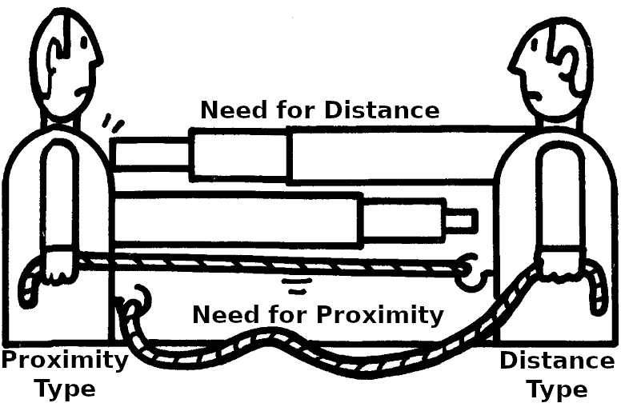

January 2, 2023 Tags: [book](https://blog.galowicz.de/tags/book.html "All pages tagged 'book'.")  
2023 年 1 月 2 日标签：书  

Software engineering, or generally IT jobs, are highly social because all big software projects or products are built by teams of professionals. When humans work with humans, all kinds of conflict can emerge, and they are often not as easy to fix as IT problems, especially in distributed teams with less offline human interaction. This article is about [Fritz Riemann’s book “Anxiety”](https://amzn.to/3Gl86yK), which answers the question “What do people fear and how do they cope with it?”.

软件工程，或者一般的 IT 工作，是高度社会化的，因为所有大型软件项目或产品都是由专业团队构建的。当人与人一起工作时，各种冲突都会出现，而且它们往往不像 IT 问题那样容易解决，尤其是在离线人际互动较少的分布式团队中。这篇文章是关于弗里茨黎曼的书“焦虑”，它回答了“人们害怕什么以及他们如何应对它？”这个问题。

[Link to the Amazon Store Page of the English version](https://amzn.to/3Gl86yK)  
链接到英文版的亚马逊商店页面  

[Link to the Amazon Store Page of the original German version](https://amzn.to/3C87PfQ)  
链接到原始德语版本的亚马逊商店页面  

The book was initially published in German in 1961 and since 2022 its 47th edition is sold, while its English translation was published in 2009. Both versions are a bit more than 200 pages. I have read the German version of the book. The English version is advertised as a 1:1 translation.

该书最初于 1961 年以德文出版，自 2022 年起售出第 47 版，而英文译本于 2009 年出版。两个版本都有 200 多页。我读过这本书的德文版。英文版被宣传为 1:1 翻译。

[Fritz Riemann](https://en.wikipedia.org/wiki/Fritz_Riemann_(psychologist)) was a German psychologist, psychoanalyst, and book author. In 1946, he co-founded the Institute for psychological research and psychotherapy in Munich. Riemann became an honorary member of the Academy of Psychoanalysis New York.

弗里茨·黎曼 (Fritz Riemann) 是德国心理学家、精神分析学家和书籍作者。 1946 年，他在慕尼黑与他人共同创立了心理研究和心理治疗研究所。黎曼成为纽约精神分析学院的名誉会员。

## Content and Structure  
内容和结构  

This book is from a psychologist for non-psychologists. People go to places, found companies, quit their job to apply for new ones, build houses, give talks, etc., for reasons. According to Riemann, people sometimes do these things as a _reaction_ to fear. Especially when people work or live together, all kinds of conflicts emerge due to differences in their characters. What appears normal to one might trigger fears in another. This can especially happen in international teams due to cultural differences but for that topic have a look at my [book review of “The Culture Map”](https://blog.galowicz.de/2022/12/12/book-review-the-culture-map/).

这本书是心理学家为非心理学家准备的。人们去某个地方、创办公司、辞职申请新工作、盖房子、发表演讲等等，都是有原因的。根据黎曼的说法，人们有时会做这些事情作为对恐惧的反应。尤其是当人们一起工作或生活时，由于性格的不同，会产生各种各样的矛盾。一个人看来正常的事情可能会引发另一个人的恐惧。由于文化差异，这种情况尤其可能发生在国际团队中，但对于该主题，请查看我对“文化地图”的书评。

Fritz Riemann explains his model that I call the “Riemann Model” over the rest of this article.  
弗里茨黎曼在本文的其余部分解释了他的模型，我称之为“黎曼模型”。  

### The Model

No model is a silver bullet but knowing in which situations to apply what model or at least take it as a rough guide often proves useful. Riemann postulates that there are different [Personality Types](https://en.wikipedia.org/wiki/Personality_type) based on different atomic fears and needs that each individual has. People’s lives are _driven by their fears_, some more than others. These fears and needs are:

没有模型是灵丹妙药，但知道在什么情况下应用什么模型或至少将其作为粗略指南通常证明是有用的。黎曼假设，基于每个人的不同原子恐惧和需求，存在不同的人格类型。人们的生活受到恐惧的驱使，有些人比其他人更害怕。这些恐惧和需求是：

  
| Fear | Need | Experienced as |
| --- | --- | --- |
| Fear of **self-surrender**  
害怕自我投降  
 | Need to be an **individual**  
需要是个人  
 | loss of self and dependence  
失去自我和依赖  
 |
| Fear of **self-realization**  
害怕自我实现  
 | Need to be part of a **group**  
需要成为一个团体的一部分  
 | isolation and lack of emotional security  
孤立和缺乏情感安全感  
 |
| Fear or **necessity** 恐惧或必要 | Need for **change** 需要改变 | finality and lack of freedom  
终结性和缺乏自由  
 |
| Fear of **change** 害怕改变 | Need for **continuity** 需要连续性 | transience and insecurity  
短暂和不安全  
 |

Regarded as pairs, they form two conflicting poles that can be visualized as a diagram:  
将它们视为成对，它们形成两个相互冲突的极点，可以用图表形象化：  

-   Emotional distance vs. proximity from/to others  
    与他人的情感距离与亲近度  
    
-   Change vs. continuity  
    变化与连续性  
    

The book puts some emphasis on explaining the _extremes_ of these characters first. These are explained in 40-50 pages each, so if the summarized presentation in this blog gives the impression that the topic is dealt with like in a magazine checklist, then this is due to the abridged presentation. These explanations seem very pathologic at first glance because the book is not about mentally sick but healthy people. The point of this pathological view is that understanding the extremes improves comprehension of such traits when observing them in real life, although of course not in the depicted extremes. For every character trait, Riemann gives a very rich and detailed overview of the trait but also delves into how they deal with love and aggression and gives examples of how they experience typical situations in life. These chapters are explaining it all so well that it hurts to provide only a short and simplified explanation here, but that’s why one reads whole books instead of summaries anyway. I am pretty sure that everyone will recognize themselves in all chapters to some degree, but in different severity. At last, he also explains what situations and events in early life cause the development towards each pole. Let’s summarize every trait into caricatures to have an overview:

这本书着重于首先解释这些角色的极端情况。这些内容每篇有 40-50 页的解释，因此如果此博客中的摘要介绍给人的印象是该主题的处理方式就像杂志清单，那么这是由于简略的介绍所致。乍一看，这些解释似乎非常病态，因为这本书不是关于精神病而是健康人。这种病态观点的要点是，理解极端可以提高在现实生活中观察这些特征时对这些特征的理解，尽管当然不是在描绘的极端中。对于每个性格特征，黎曼都给出了非常丰富和详细的概述，但也深入研究了他们如何处理爱和攻击，并举例说明了他们如何经历生活中的典型情况。这些章节都很好地解释了它，以至于在这里只提供一个简短的和简化的解释是有伤害的，但这就是为什么无论如何都要阅读整本书而不是摘要的原因。我很确定每个人都会在一定程度上在所有章节中认出自己，但程度不同。最后，他还解释了早年的情况和事件导致了向每个极点的发展。让我们将每个特征总结成漫画以进行概述：

Schizoid Personality (Distance)  
分裂样人格（距离）  

Schizoids want and need to be seen as individuals (have you ever been irritated when someone got your name or gender slightly wrong?). They fight for their freedom and independence. For that reason, they feel the need to avoid compromise and commitment. Keeping enough emotional distance from everyone is on the one hand like a defense mechanism against everything that reduces their freedom and independence. Talking about emotions: They don’t like them much and see pure cold rationality as a cure - which is a strength and weakness at the same time. However, proximity to others is unavoidable, so they end up developing some protective stance that might often look impersonal and cold to others. Schizoids often drift into isolation, as this is what they rescue themselves into after conflicts with others. While behaving how schizoids behave, they can look aggressive from the perspective of others, which might also be intimidating.

Such shields are a result of their past: They most likely experienced too much pain in dependent relationships in their young years and grew independent to free themselves from it.

Typical traits or attributions by others: Aggressive, arrogant, cold, isolated, objective, strong self-esteem, task-oriented, criminal, anti-social

精神分裂症患者希望并且需要被视为独立个体（当有人把你的名字或性别弄错时，你有没有被激怒过？）。他们为自己的自由和独立而战。出于这个原因，他们觉得有必要避免妥协和承诺。与每个人保持足够的情感距离，一方面就像一种防御机制，可以抵御一切会降低他们的自由和独立性的事物。谈论情绪：他们不太喜欢它们，并将纯粹冷酷的理性视为一种治疗方法——这既是一种力量，也是一种弱点。然而，与他人的亲近是不可避免的，因此他们最终会形成某种保护姿态，而这种姿态在他人看来常常显得没有人情味和冷漠。精神分裂症患者经常陷入孤立，因为这是他们在与他人发生冲突后将自己拯救到的境地。虽然表现出精神分裂症患者的行为方式，但从其他人的角度来看，他们可能看起来具有攻击性，这也可能令人生畏。 这样的盾牌是他们过去的结果：他们很可能在年轻时在依赖关系中经历过太多痛苦，然后变得独立以摆脱它。 他人的典型特征或归因：好斗、傲慢、冷漠、孤立、客观、强烈的自尊、任务导向、犯罪、反社会

Depressed Personality (Proximity)  
抑郁人格（亲近）  

“Depressed” people have a deeply embedded wish for affection and emotional proximity to others, literally all the time. “I love you because I need you” and “I need you because I love you” are two equally true statements for them. All distance that Schizoids try to build up, Depressed try to tear down as it feels like loneliness and being forgotten to them. To counter their separation anxiety, they build up all kinds of dependency on others, towards which they also form expectations - which they won’t explain because they see that as an indicator of not being understood. Depressed often end up blaming others for their situation - the obvious way to work towards a solution independently triggers their separation anxiety so they “can’t”. They hope that when they lament their problems, someone will help them. Most of the time, help is not what they ask for when they keep lamenting about their problems - it’s affection in the form of listening and empathy. To others, this often looks like [learned helplessness](https://en.wikipedia.org/wiki/Learned_helplessness), self-pity, a lack of direction, and clumsiness.

Deep inside, depressive parents don’t want their children to grow up and become independent because this bears the potential for the distance they fear. So they sometimes end up raising spoiled children with a lack of skills to master life on their own, which produces the next generation of depressive humans.

Typical traits or attributions by others: Indecision, Blaming others, insecure, warm, needy, clingy, caring, dependent, subordinate, people-oriented, empathic, envy, resigning, self-hate, depression, suicide

“抑郁”的人对与他人的感情和情感亲近有着根深蒂固的愿望，几乎一直如此。 “我爱你因为我需要你”和“我需要你因为我爱你”对他们来说是两个同样真实的陈述。 Schizoids 试图建立的所有距离，Depressed 试图拆除，因为感觉就像孤独和被遗忘。为了对抗他们的分离焦虑，他们建立了对他人的各种依赖，他们也对此形成了期望——他们不会解释，因为他们认为这是不被理解的标志。抑郁症患者往往最终会因为自己的处境而责怪他人——独立解决问题的明显方式会引发他们的分离焦虑，因此他们“做不到”。他们希望当他们哀叹自己的问题时，有人会帮助他们。大多数时候，当他们不断抱怨自己的问题时，他们寻求的并不是帮助——而是以倾听和同理心的形式表达的爱意。在其他人看来，这通常看起来像是习得性无助、自怜、缺乏方向和笨拙。 在内心深处，抑郁的父母不希望他们的孩子长大并变得独立，因为这有可能让他们害怕距离。因此，他们有时最终会养育缺乏独立掌握生活技能的被宠坏的孩子，这会产生下一代抑郁的人。 他人的典型特征或归因：优柔寡断、责备他人、缺乏安全感、热情、有需要、粘人、关怀、依赖、下属、以人为本、同理心、嫉妒、顺从、自恨、抑郁、自杀

Compulsive Personality (Continuity)  
强迫性人格（连续性）  

Compulsive characters fear changes and unplanned events. They are on a quest for permanence and security. For that reason, they enjoy planning ahead everything in meticulous depth, to be prepared even for events that may probably never occur. Changing plans even in light of changed circumstances is difficult for the compulsive. Enduring the costly trade-offs of a local optimum is much easier for them than trying a promising new solution because it might introduce new unforeseen problems. New ideas are always evaluated in terms of how they help support the Old World. The lack of control over life and the future is a burden. When compulsive people catch themselves in the act of giving in to temptation or losing control of their emotions in an argument, guilt plagues them for a long time.

Strict parents instill in their children the need for planning, control, and security by constantly admonishing them about order, punctuality, and compliance from an early age. In later life, the ever-admonishing feeling remains in the back of their mind.

Typical traits or attributions by others: Reliable, dutiful, precise, rigid, jealous, fanatic, despotic, pedantic, prejudice, perfectionism, responsible, diligent, tidiness, parsimony

强迫性角色害怕变化和计划外的事件。他们正在寻求永久性和安全性。出于这个原因，他们喜欢提前计划好每一件事，甚至为可能永远不会发生的事件做好准备。对于强迫症患者来说，即使情况发生了变化也很难改变计划。对他们来说，忍受局部最优的代价高昂的权衡比尝试有前途的新解决方案要容易得多，因为它可能会引入新的不可预见的问题。新想法总是根据它们如何帮助支持旧世界来评估。对生活和未来缺乏控制是一种负担。当有强迫症的人发现自己屈服于诱惑或在争论中失去对情绪的控制时，内疚会长期困扰他们。 严厉的父母从小就不断告诫孩子遵守秩序、守时和服从，从而向他们灌输计划、控制和安全的需要。在以后的生活中，这种不断告诫的感觉仍然存在于他们的脑海深处。 他人的典型特征或归因：可靠、尽责、精确、刻板、嫉妒、狂热、专制、迂腐、偏见、完美主义、负责任、勤奋、整洁、吝啬

Histrionic Personality (Change)  
戏剧性人格（变化）  

Histrionics fear stagnation. It does not matter if everything is fine where they are: They want to experience new things, travel to new places, and try out new ideas. That the unknown does not always bear good things is irrelevant: It’s change what they are after, change for its own sake. Making no plans helps histrionics to concentrate on the moment, free from the obligation to express what goal would be achieved by what they are doing. They don’t find security at all convincing because they are busy trying to free themselves from rules and compromises. In between their chaotic life they are nonetheless very charismatic and charming. But don’t feel too flattered if they tell you confidential gossip as you’re one of many listeners providing them attention.

Milieus that are chaotic, contradictory, incomprehensible, and/or without guidance and healthy models give the child too little orientation and support. In such environments, children learn: “If they don’t love you enough when you’re easy and uncomplicated, then their concern for you will get you there when you’re being problematic. The more often sick, the more loved.”

Typical traits or attributions by others: Adventurous, impulsive, spirited, attention-seeking, narcissistic, unreliable, airs and graces, superficial, manipulable, charming, impatient

表演学害怕停滞。他们所在的地方是否一切都好并不重要：他们想体验新事物，去新地方旅行，尝试新想法。未知并不总是承载美好的事物是无关紧要的：它是改变他们所追求的，为改变而改变。不做计划有助于表演者专注于当下，而不必表达他们正在做的事情会达到什么目标。他们根本不觉得安全是有说服力的，因为他们正忙于尝试让自己摆脱规则和妥协。在他们混乱的生活中，他们仍然非常有魅力和魅力。但是，如果他们告诉您机密八卦，请不要感到太受宠若惊，因为您是关注他们的众多听众之一。 混乱、矛盾、难以理解和/或没有指导和健康模式的环境给孩子的指导和支持太少。在这样的环境中，孩子们会学到：“如果他们在你轻松简单的时候不够爱你，那么当你有问题的时候，他们对你的关心就会把你带到那里。越常生病，就越被爱。” 其他人的典型特征或归因：喜欢冒险、冲动、活泼、寻求关注、自恋、不可靠、空气和优雅、肤浅、可操纵、迷人、急躁

### Application

Similar to the question about what _good_ criticism or _good_ communication is, as covered in my [review of the book The Culture Map](https://blog.galowicz.de/2022/12/12/book-review-the-culture-map), the model highlights what the limits of empathy can look like and where they originate: Characters of one side feel like they have the cure for the other. That is because their fears and feelings are not only very different - they never felt each other’s emotions the same way in comparable situations like this.

类似于什么是好的批评或好的沟通的问题，正如我对文化地图一书的评论所涵盖的那样，该模型强调了同理心的局限性可能是什么样子以及它们的起源：一方的角色感觉他们有治愈另一个。那是因为他们的恐惧和感受不仅非常不同——在类似的情况下，他们从未以相同的方式感受彼此的情绪。

From the perspective of the diagram, Riemann’s model has a striking similarity to the [DISC model](https://en.wikipedia.org/wiki/DISC_assessment) which is more internationally known. But Riemann’s model is not designed to match people with lists of traits to classify them in isolation (although you can always analyze your own fears, use the model to help yourself understand the underlying causes and improve your daily interaction with the world at work or in relationships). Every human has traits from all the presented poles at the same time. It’s the personal weighting of each trait that makes the character. The Swiss psychologist [Christoph Thomann](https://de.wikipedia.org/wiki/Christoph_Thomann) extended this model to the Riemann-Thomann model: The most obvious changes are that he substituted the pathological terms _schizoid_, _depressed_, _compulsive_, and _histrionic_ with the softer terms _distance_, _proximity_, _continuity_, and _change_ (as already reflected in this article). He also suggests that people might have different positions in the model at work than in private life. This way the model has less of a judging character when used to assess people. As a couple therapist and later conflict moderator in companies, he demonstrated how to use it to arrange people _relative_ to each other to understand their conflict potential.

从图上看，黎曼模型与国际上更为知名的DISC模型有着惊人的相似性。但黎曼模型并不是设计用来匹配具有特征列表的人以将他们孤立地分类（尽管你总是可以分析你自己的恐惧，使用该模型来帮助你自己理解潜在的原因并改善你在工作或生活中与世界的日常互动关系）。每个人同时具有所有呈现的两极的特征。塑造角色的是每个特质的个人权重。瑞士心理学家 Christoph Thomann 将这个模型扩展到 Riemann-Thomann 模型：最明显的变化是他用更温和的术语距离、接近、连续性和变化代替了病理学术语分裂样、抑郁、强迫和表演（如前所述在本文中）。他还表示，人们在工作模式中的位置可能与在私人生活中的位置不同。这样，该模型在用于评估人时就没有那么多判断力了。作为夫妻治疗师和后来的公司冲突调解人，他演示了如何使用它来安排人们彼此之间的关系，以了解他们潜在的冲突。

If you identify someone as more of a proximity-continuity type in comparison to someone else who is more of a change-distance type, it becomes relatively simple to foresee the kinds of conflicts they will have with each other at work or in their private life. In a conflict between such a pair, the conflict resolution must begin with strengthening the bond for the proximity person, while the distance person first needs distance to recover. This example models a [deadlock](https://en.wikipedia.org/wiki/Deadlock) that is often easier to solve at work than in romantic relationships.

如果你认为某人更接近连续性类型，而不是其他更接近变化距离类型的人，那么预见他们在工作或私人生活中彼此之间会发生什么样的冲突就变得相对简单.在这样的一对之间发生冲突时，解决冲突必须从加强亲近人的联系开始，而远方的人首先需要距离来恢复。这个例子模拟了一个在工作中比在恋爱关系中更容易解决的僵局。

Another conflict example would be: What happens if you put one or more distance-change types of persons together with an existing established team of proximity-continuity types and give them the mission to introduce some complex change? It is not unlikely that the productivity of the group will be reduced while the team gets stuck in discussions between the people who want a plan for everything and the ones who think that you need more of an open experimental approach because trying out new things will produce new unforeseeable problems where planning doesn’t help you much. Most likely, no one will say “I feel uncomfortable like this, can you please at least give me something to hold on” but instead non-productively fantasize bad intentions or cram out some prejudices.

另一个冲突示例是：如果您将一种或多种距离变化类型的人与现有的已建立的接近连续性类型的团队放在一起，并赋予他们引入一些复杂变化的任务，会发生什么情况？当团队陷入讨论时，团队的生产力会降低，这两种情况都需要一个计划的人和认为你需要更多开放实验方法的人之间的讨论，因为尝试新事物会产生新的不可预见的问题，计划对您没有太大帮助。最有可能的是，没有人会说“我觉得这样不舒服，你能不能至少给我一些坚持的东西”，而是非生产性地幻想不良意图或灌输一些偏见。

In such cases, the model helps find out why people don’t want things and how to present each other’s positions in a way that doesn’t trigger the other side’s fears. The more people in the team educated themselves with such models, the less need would be for a manager or moderator to solve such crises.

在这种情况下，该模型有助于找出人们不想要东西的原因，以及如何以一种不会引发对方恐惧的方式表达彼此的立场。团队中使用此类模型自学的人越多，就越不需要经理或主持人来解决此类危机。

Also, if someone works together with a happy team of relatively homogeneous character traits and realizes that he/she is in the opposite corner of the Riemann coordinate system than most of the others, then the Riemann model provides new ways to explain why such an environment feels exhausting or even toxic to them without even anyone having about bad intentions. In such cases, the model provides some guidance in describing why some team constellations simply are less efficient or effective than others, and how to compose teams with what combination of personality types for which kind of task. If all advice fails, the book gives a good decision basis on whether to leave a constellation.

此外，如果某人与一个具有相对同质性格特征的快乐团队一起工作，并意识到他/她与大多数其他人相比处于黎曼坐标系的对角，那么黎曼模型提供了解释为什么这样的环境的新方法即使没有任何人有恶意，也会让他们感到筋疲力尽甚至有毒。在这种情况下，该模型提供了一些指导来描述为什么某些团队组合比其他团队组合效率低或效果差，以及如何用什么样的人格类型组合来组成团队来完成哪种任务。如果所有的建议都失败了，这本书给出了一个很好的决定是否离开一个星座的依据。

If you speak in front of a group or sell products or ideas, having some knowledge about the character types of the key people in the room will also help present your subject in the right way by carefully circumnavigating what might trigger their discomfort.

如果你在一群人面前演讲或销售产品或想法，了解房间里关键人物的性格类型也有助于以正确的方式展示你的主题，小心绕开可能引发他们不适的内容。

The Riemann Model is also a useful complement to the [Situational Leadership](https://en.wikipedia.org/wiki/Situational_leadership_theory) model for managers: This model prescribes that leaders should adapt their leadership style to the maturity of the people or group they manage. At the same time, the Riemann Model suggests that the style of interaction with people and groups should be chosen by their personality traits. From that perspective, the situational leadership model provides a _temporal_ view that develops over time, and the Riemann model a _spatial_ view that considers the needs of the underlying character.

黎曼模型也是对管理者情境领导模型的有用补充：该模型规定领导者应根据他们管理的人员或团队的成熟度调整他们的领导风格。同时，黎曼模型建议，与人和群体互动的方式应根据他们的性格特征来选择。从这个角度来看，情境领导模型提供了一个随时间发展的时间视图，而黎曼模型提供了一个考虑潜在角色需求的空间视图。

## Summary

Over the years, it kind of became my thing at work to introduce new technologies or ways to solve challenges - having a tendency towards the distance and change types from the book - this always happened with the best intentions to improve my customer’s/team’s/company’s agility, ability to innovate, etc. Reading this book helped me understand better _why_ and how other people sometimes see this as a curse or threat instead of a blessing, and how to present ideas to reach more people in the intended ways with fewer misunderstandings. Also, while founding my own company together with colleagues, I faced new challenges in human interaction e.g. by becoming manager of a team, etc.

多年来，引入新技术或解决挑战的方法已成为我的工作 - 倾向于与书中的距离和变化类型 - 这总是以改善我的客户/团队/公司的最佳意图发生敏捷性、创新能力等。阅读这本书帮助我更好地理解其他人为什么以及如何有时将其视为诅咒或威胁而不是祝福，以及如何以预期的方式提出想法以减少误解，从而影响更多的人。此外，在与同事一起创立自己的公司时，我面临着人际交往方面的新挑战，例如通过成为团队经理等

Most popular science books that originate from psychology or social sciences don’t contain completely new things: As an “experienced human” we have seen most situations already. What such books provide are views on the situations/challenges that are already known, with a new structure that helps describe challenges and find better solutions. Not only in that regard I found this book to be a fascinating and inspirational read. To me, reading this book equals never again having no explanation for the strange behavior of others that have a completely different character. Such insights don’t automatically provide solutions but at least extend limits of empathy.

大多数源自心理学或社会科学的科普书籍并不包含全新的内容：作为“有经验的人”，我们已经看到了大多数情况。此类书籍提供的是对已知情况/挑战的看法，采用有助于描述挑战和找到更好解决方案的新结构。不仅在这方面，我还发现这本书是一本引人入胜且鼓舞人心的读物。对我来说，读这本书就等于再也无法解释性格完全不同的人的奇怪行为了。这样的见解不会自动提供解决方案，但至少会扩大同理心的范围。

The model provides useful insights but less actionable advice. For more detailed advisory I suggest reading [Nico Fleisch’s book about the Riemann-Thomann Model](https://amzn.to/3Q6njH4) for which I, unfortunately, did not find any English version.

该模型提供了有用的见解，但可操作性较差的建议。如需更详细的咨询，我建议阅读 Nico Fleisch 关于黎曼-托曼模型的书，不幸的是，我没有找到任何英文版本。

Humans who work with other humans should read this.  
与其他人一起工作的人应该阅读这篇文章。
