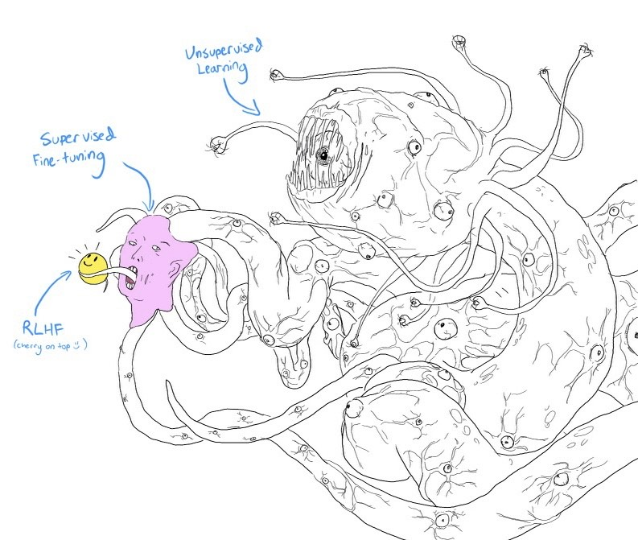
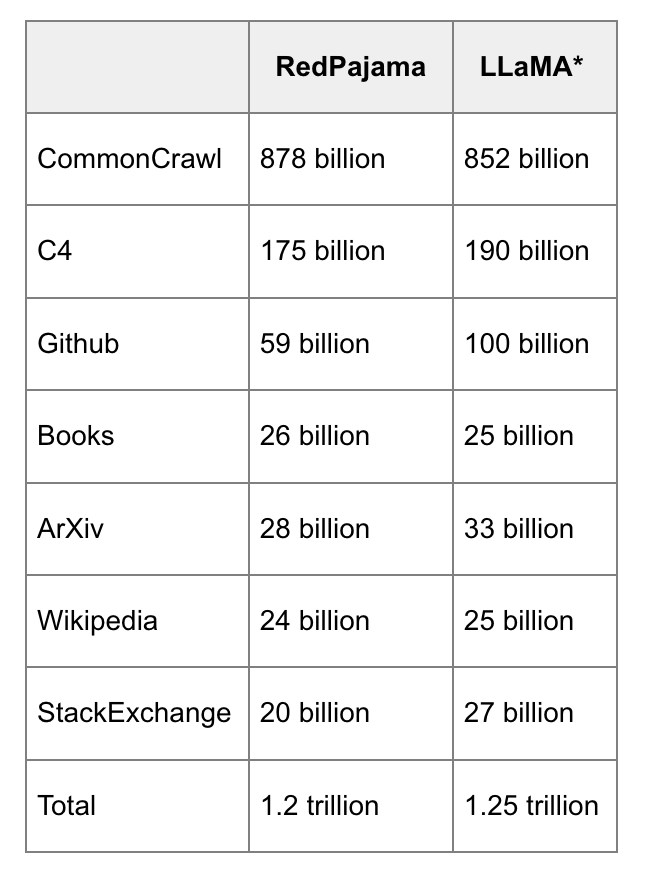
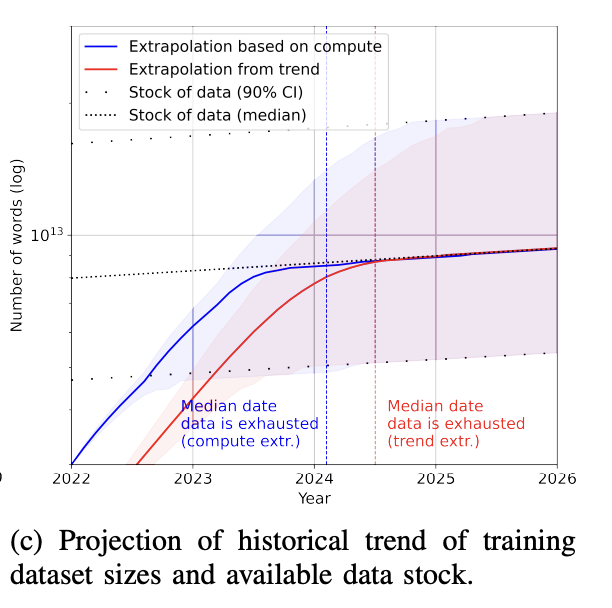
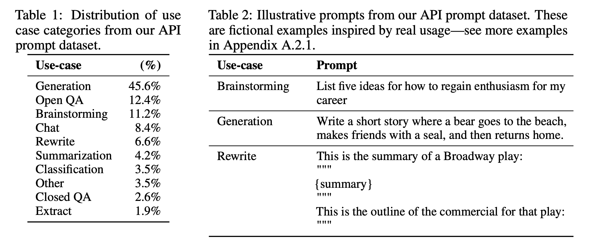
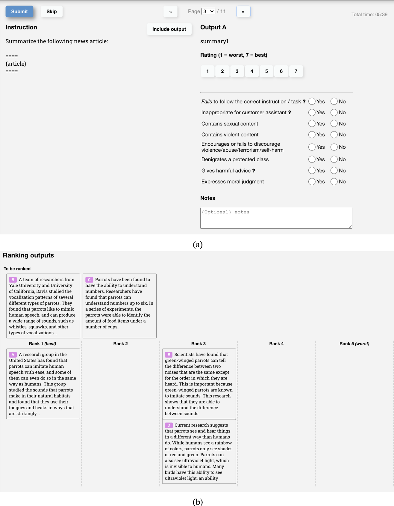

本文介绍了 ChatGPT 模型的开发过程，其中一个重要的想法是将强化学习和人类反馈纳入 NLP。文章提到了 RLHF 的三个阶段：预训练、监督下的对话微调和 RLHF。作者认为将这三个步骤结合起来可以获得最佳性能。文章还讨论了人类偏好对 AI 安全的重要性，并指出 RLHF 在业界尚未广泛使用，但未来可能会得到更多应用。

文章要点：
1. ChatGPT 模型的开发过程；
2. RLHF 的三个阶段；
3. 将三个步骤结合可以获得最佳性能；
4. 人类偏好对 AI 安全的重要性；
5. RLHF 在业界尚未广泛使用，但未来可能会得到更多应用。

关键词：ChatGPT、RLHF、强化学习、人类反馈、NLP、AI 安全。

---

In literature discussing why ChatGPT is able to capture so much of our imagination, I often come across two narratives:  

在讨论为什么ChatGPT能够抓住我们这么多的想象力的文献中，我经常遇到两种叙述：

1.  Scale: throwing more data and compute at it.  
    
    规模：将更多的数据和计算扔给它。
2.  UX: moving from a prompt interface to a more natural chat interface.  
    
    用户体验：从提示界面转为更自然的聊天界面。

A narrative that is often glossed over in the demo frenzy is the incredible technical creativity that went into making models like ChatGPT work.  

在演示狂热中经常被掩盖的一个叙述是使ChatGPT这样的模型发挥作用的难以置信的技术创造力。  

One such cool idea is RLHF (Reinforcement Learning from Human Feedback): incorporating reinforcement learning and human feedback into NLP.  

其中一个很酷的想法是RLHF（来自人类反馈的强化学习）：将强化学习和人类反馈纳入NLP。

RL has been notoriously difficult to work with, and therefore, mostly confined to gaming and simulated environments like Atari or MuJoCo.  

RL一直是出了名的难搞，因此，大多局限于游戏和模拟环境，如Atari或MuJoCo。  

Just five years ago, both RL and NLP were progressing pretty much orthogonally – different stacks, different techniques, and different experimentation setups.  

就在五年前，RL和NLP的进展几乎是正交的--不同的堆栈，不同的技术，以及不同的实验设置。  

It’s impressive to see it work in a new domain at a massive scale.  

看到它在一个大规模的新领域中发挥作用，令人印象深刻。

So, how exactly does RLHF work? Why does it work? This post will discuss the answers to those questions.  

那么，RLHF究竟是如何工作的？为什么它能发挥作用？这篇文章将讨论这些问题的答案。
___

To understand RLHF, we first need to understand the process of training a model like ChatGPT and where RLHF fits in, which is the focus of the first section of this post.  

要了解RLHF，我们首先需要了解像ChatGPT这样的模型的训练过程，以及RLHF在其中的作用，这是本文章第一部分的重点。  

The following 3 sections cover the 3 phases of ChatGPT development.  

以下3个部分涵盖了ChatGPT开发的3个阶段。  

For each phase, I’ll discuss the goal for that phase, the intuition for why this phase is needed, and the corresponding mathematical formulation for those who want to see more technical detail.  

对于每个阶段，我将讨论该阶段的目标，为什么需要这个阶段的直觉，以及为那些想看到更多技术细节的人提供相应的数学公式。

Currently, RLHF is not yet widely used in the industry except for a few big key players – OpenAI, DeepMind, and Anthropic.  

目前，除了几个大的关键参与者--OpenAI、DeepMind和Anthropic，RLHF还没有在业界广泛使用。  

However, I’ve seen many work-in-progress efforts using RLHF, so I wouldn’t be surprised to see RLHF used more in the future.  

然而，我已经看到许多正在进行的工作使用了RLHF，所以我不会对将来看到RLHF被更多地使用感到惊讶。

In this post, I assume that readers don’t have specialized knowledge in NLP or RL. If you do, feel free to skip any section that is less relevant for you.  

在这篇文章中，我假设读者没有NLP或RL方面的专业知识。如果你有，请随意跳过与你关系不大的部分。

## RLHF overview

Let’s visualize the development process for ChatGPT to see where RLHF fits in.  

让我们把ChatGPT的开发过程可视化，看看RLHF在其中的作用。


If you squint, this above diagram looks very similar to the meme Shoggoth with a smiley face.  

如果你眯起眼睛，上面这张图看起来与带有笑脸的备忘录Shorgoth非常相似。

1.  The pretrained model is an untamed monster because it was trained on indiscriminate data scraped from the Internet: think clickbait, misinformation, propaganda, conspiracy theories, or attacks against certain demographics.  
    
    预先训练的模型是一个桀骜不驯的怪物，因为它是根据从互联网上刮来的不分青红皂白的数据进行训练的：想想点击率、错误信息、宣传、阴谋论或对某些人口群体的攻击。
2.  This monster was then finetuned on higher quality data – think StackOverflow, Quora, or human annotations – which makes it somewhat socially acceptable.  
    
    然后，这个怪物在更高质量的数据上进行了微调--想想StackOverflow、Quora或人类注释--这使得它在某种程度上被社会接受。
3.  Then the finetuned model was further polished using RLHF to make it customer-appropriate, e.g. giving it a smiley face.  
    
    然后，使用RLHF对微调后的模型进行进一步打磨，使其适合客户，例如，给它一个笑脸。



Shoggoth with Smiley Face. Courtesy of twitter.com/anthrupad  

带笑脸的霍格特人。来源：twitter.com/anthrupad

You can skip any of the three phases. For example, you can do RLHF directly on top of the pretrained model, without going through the SFT phase.  

你可以跳过这三个阶段中的任何一个。例如，你可以直接在预训练的模型上做RLHF，而不经过SFT阶段。  

However, empirically, combining all these three steps gives the best performance.  

然而，根据经验，将这三个步骤结合起来可以得到最好的性能。

Pretraining is the most resource-intensive phase. For the InstructGPT model, pretraining takes up [98% of the overall compute and data resources](https://openai.com/research/instruction-following). You can think of SFT and RLHF as unlocking the capabilities that the pretrained model already has but are hard for users to access via prompting alone.  

预训练是资源最密集的阶段。对于InstructGPT模型，预训练占用了整个计算和数据资源的98%。你可以把SFT和RLHF看作是解锁预训练模型已经具备的能力，但用户很难仅仅通过提示来获得这些能力。

Teaching machines to learn from human preferences is not new. It’s been around for [over a decade](https://arxiv.org/abs/1208.0984). OpenAI started exploring [learning from human preference](https://openai.com/research/learning-from-human-preferences) back when their main bet was robotics. The then narrative was that human preference was crucial for AI safety.  

教机器学习人类的偏好并不是什么新鲜事。它已经存在了十多年了。OpenAI开始探索从人类的偏好中学习，当时他们的主要赌注是机器人技术。当时的说法是，人类的偏好对人工智能的安全至关重要。  

However, as it turned out, human preference can also make for better products, which attracted a much larger audience.  

然而，事实证明，人类的偏好也能造就更好的产品，这吸引了更多的观众。

**»»Side note: The abstract from OpenAI’s learning from human preference paper in 2017««  

""题外话：OpenAI在2017年从人类偏好中学习的论文摘要""**  

> _One step towards building safe AI systems is to remove the need for humans to write goal functions, since using a simple proxy for a complex goal, or getting the complex goal a bit wrong, can lead to undesirable and even dangerous behavior.  
> 
> In collaboration with DeepMind’s safety team, we’ve developed an algorithm which can infer what humans want by being told which of two proposed behaviors is better.  
> 
> 构建安全人工智能系统的一个步骤是消除人类编写目标函数的需要，因为用简单的代理来实现复杂的目标，或者把复杂的目标弄得有点错，都会导致不理想的甚至是危险的行为。通过与DeepMind的安全团队合作，我们开发了一种算法，它可以通过告诉人类两种拟议行为中的哪一种更好来推断人类想要什么。_

## Phase 1. Pretraining for completion  

第一阶段。完成预培训

The result of the pretraining phase is a large language model (LLM), often known as the pretrained model.  

预训练阶段的结果是一个大型语言模型（LLM），通常被称为预训练模型。  

Examples include GPT-x (OpenAI), Gopher (DeepMind), LLaMa (Meta), StableLM (Stability AI).  

例如GPT-x（OpenAI）、Gopher（DeepMind）、LLaMa（Meta）、StableLM（Stability AI）。

### Language model

A language model encodes statistical information about language. For simplicity, statistical information tells us how likely something (e.g.  

一个语言模型对语言的统计信息进行编码。为了简单起见，统计信息告诉我们某件事情（如  

a word, a character) is to appear in a given context. The term **token** can refer to a word, a character, or a part of a word (like `-tion`), depending on the language model. You can think of tokens as the **vocabulary** that a language model uses.  

一个词，一个字符）将出现在给定的语境中。术语token可以指一个词，一个字符，或一个词的一部分（如 `-tion` ），这取决于语言模型的情况。你可以把令牌看作是语言模型使用的词汇。

Fluent speakers of a language subconsciously have statistical knowledge of that language. For example, given the context `My favorite color is __`, if you speak English, you know that the word in the blank is much more likely to be `green` than `car`.  

精通一种语言的人潜意识中拥有该语言的统计知识。例如，考虑到上下文 `My favorite color is __` ，如果你讲英语，你知道空白处的词比 `car` 更有可能是 `green` 。

Similarly, language models should also be able to fill in that blank. You can think of a language model as a “_completion machine_”: given a text (prompt), it can generate a response to complete that text. Here’s an example:  

同样地，语言模型也应该能够填补这一空白。你可以把语言模型看作是一个 "完成机"：给定一个文本（提示），它可以产生一个反应来完成这个文本。这里有一个例子：

-   **Prompt (from user)**: `I tried so hard, and got so far`  
    
    提示（来自用户）： `I tried so hard, and got so far`
-   **Completion (from language model)**: `But in the end, it doesn't even matter.`  
    
    完成（来自语言模型）： `But in the end, it doesn't even matter.`


As simple as it sounds, completion turned out to be incredibly powerful, as many tasks can be framed as completion tasks: translation, summarization, writing code, doing math, etc.  

尽管听起来很简单，但完成度却被证明是令人难以置信的强大，因为许多任务都可以被框定为完成度任务：翻译、总结、写代码、做数学等等。  

For example, give the prompt: `How are you in French is ...`, a language model might be able to complete it with: `Comment ça va`, effectively translating from one language to another.  

例如，给出提示： `How are you in French is ...` ，语言模型可能能够完成它： `Comment ça va` ，有效地从一种语言翻译成另一种语言。

To train a language model for completion, you feed it a lot of text so that it can distill statistical information from it.  

为了训练语言模型的完成，你给它提供大量的文本，以便它能从中提炼出统计信息。  

The text given to the model to learn from is called training data. Consider a language that contains only two tokens 0 and 1. If you feed a language model the following sequences as training data, the language model might distill that:  

给予模型学习的文本被称为训练数据。如果你给语言模型提供以下序列作为训练数据，语言模型可能会提炼出：

-   If the context is `01`, the next tokens are likely `01`  
    
    如果上下文是 `01` ，那么下一个标记可能是 `01` 。
-   If the context is `0011`, the next tokens are likely `0011`  
    
    如果上下文是 `0011` ，那么下一个标记可能是 `0011` 。

```
0101
010101
01010101
0011
00110011
001100110011
```

Since language models mimic its training data, language models are only as good as their training data, hence the phrase “Garbage in, garbage out”.  

由于语言模型模仿它的训练数据，语言模型只和它的训练数据一样好，因此有 "垃圾进，垃圾出 "的说法。  

If you train a language model on Reddit comments, you might not want to take it home to show to your parents.  

如果你在Reddit评论上训练一个语言模型，你可能不想把它带回家给你的父母看。

### Mathematical formulation 数学表述

-   ML task: language modeling ML任务：语言建模
-   Training data: low-quality data 训练数据：低质量数据
-   Data scale: usually in the order of trillions of tokens as of May 2023.  
    
    数据规模：截至2023年5月，通常以万亿代币为单位。
    -   [GPT-3’s dataset](https://arxiv.org/abs/2005.14165) (OpenAI): 0.5 trillion tokens. I can’t find any public info for GPT-4, but I’d estimate it to use an order of magnitude more data than GPT-3.  
        
        GPT-3的数据集（OpenAI）：0.5万亿代币。我找不到GPT-4的任何公开信息，但我估计它使用的数据要比GPT-3多一个数量级。
    -   [Gopher’s dataset](https://www.deepmind.com/publications/scaling-language-models-methods-analysis-insights-from-training-gopher) (DeepMind): 1 trillion tokens  
        
        Gopher的数据集（DeepMind）：1万亿代币
    -   [RedPajama](https://github.com/togethercomputer/RedPajama-Data) (Together): 1.2 trillion tokens  
        
        RedPajama（一起）：1.2万亿代币
    -   [LLaMa’s dataset](https://arxiv.org/abs/2302.13971) (Meta): 1.4 trillion tokens  
        
        LLaMa的数据集（Meta）：1.4万亿个代币
-   Model resulting from this process: LLM  
    
    这个过程中产生的模型：LLM

___

___

-   \\(LLM\_\\phi\\): the language model being trained, parameterized by \\(\\phi\\). The goal is to find \\(\\phi\\) for which the cross entropy loss is minimized.  
    
    \\LLM\_\\phi\\）：正在训练的语言模型，参数为\\(\\phi\\)。目标是找到交叉熵损失最小的 \\(phi\\)。
-   \\(\[T\_1, T\_2, ..., T\_V\]\\): vocabulary – the set of all unique tokens in the training data.  
    
    \\词汇表（\[T\_1, T\_2, ..., T\_V\]/）：词汇表--训练数据中所有独特标记的集合。
-   \\(V\\): the vocabulary size. \\词汇量（V\\）：词汇量大小。
-   \\(f(x)\\): function mapping a token to its position in the vocab. If \\(x\\) is \\(T\_k\\) in the vocab, \\(f(x) = k\\).  
    
    \\(f(x)\\)：将一个标记映射到其在词汇表中的位置的函数。如果 \\(x\\)在词汇表中是 \\(T\_k\\)，那么 \\(f(x) = k\\)。
-   Given the sequence \\((x\_1, x\_2, ..., x\_n)\\), we’ll have \\(n\\) training samples:  
    
    鉴于序列 \\((x\_1, x\_2, ..., x\_n)\\)，我们将有 \\(n\\) 训练样本：
    -   Input: \\(x =(x\_1, x\_2, ..., x\_{i-1})\\)  
        
        输入：\\x =(x\_1, x\_2, ..., x\_{i-1})
    -   Ground truth: \\(x\_i\\) 地面真相：\\(x\_i\\i)
-   For each training sample \\((x, x\_i)\\):  
    
    对于每个训练样本/((x, x\_i)/)：
    -   Let \\(k = f(x\_i)\\)
    -   Model’s output: \\(LLM(x)= \[\\bar{y}\_1, \\bar{y}\_2, ..., \\bar{y}\_V\]\\). Note: \\(\\sum\_j\\bar{y}\_j = 1\\)  
        
        模型的输出：\\LLM(x)= \[bar{y}\_1, bar{y}\_2, ..., bar{y}\_V\]\\）。注：(sum\_j\\bar{y}\_j = 1\\)
    -   The loss value: \\(CE(x, x\_i; \\phi) = -\\log\\bar{y}\_k\\)  
        
        损失值：\\CE(x, x\_i; \\phi) = -\\log\\bar{y}\_k\\)
-   Goal: find \\(\\phi\\) to minimize the expected loss on all training samples. \\(CE(\\phi) = -E\_x\\log\\bar{y}\_k\\)  
    
    目标：找到 \\(\\phi\\) 使所有训练样本的预期损失最小。\\CE(\\phi) = -E\_x\\log\\bar{y}\_k\\)

___

___

### Data bottleneck for pretraining 预训练的数据瓶颈

Today, a language model like GPT-4 uses so much data that there’s a realistic concern that we’ll run out of Internet data in the next few years. It sounds crazy, but it’s happening.  

今天，像GPT-4这样的语言模型使用了如此多的数据，以至于有一种现实的担忧，即我们将在未来几年内耗尽互联网的数据。这听起来很疯狂，但它正在发生。  

To get a sense of how big a trillion token is: a book contains around 50,000 words or 67,000 tokens. 1 trillion tokens are equivalent to 15 million books.  

为了了解一万亿代币有多大：一本书大约包含50,000个单词或67,000个代币。1万亿个代币相当于1500万本书。



Side-by-side comparison of RedPajama and LLaMa data, done by RedPajama.  

RedPajama和LLaMa数据的并排比较，由RedPajama完成。

The rate of training dataset size growth is much faster than the rate of new data being generated ([Villalobos et al, 2022](https://arxiv.org/abs/2211.04325)). **If you’ve ever put anything on the Internet, you should assume that it is already and will be included in the training data for some language models**, whether you consent or not. This is similar to how, if you post something on the Internet, you should expect it to be indexed by Google.  

训练数据集规模的增长速度要比新数据产生的速度快得多（Villalobos等人，2022）。如果你曾经在互联网上发布过任何东西，你应该假定它已经并将被包括在某些语言模型的训练数据中，不管你是否同意。这类似于，如果你在互联网上发布了一些东西，你应该期望它被谷歌索引。



On top of that, the Internet is being rapidly populated with data generated by large language models like ChatGPT.  

在此基础上，互联网上正迅速充斥着由ChatGPT等大型语言模型产生的数据。  

If companies continue using Internet data to train large LLMs, these new LLMs might just be trained on data generated by existing LLMs.  

如果公司继续使用互联网数据来训练大型LLM，这些新的LLM可能只是在现有LLM产生的数据上进行训练。

Once the publicly available data is exhausted, the most feasible path for more training data is by relying on proprietary data.  

一旦公开的数据被耗尽，获得更多训练数据的最可行的途径是依靠专有数据。  

I suspect that any company that somehow gets its hand on a massive amount of proprietary data – copyrighted books, translations, contracts, medical records, genome sequences, user data, etc.  

我怀疑任何公司如果以某种方式获得大量的专有数据--有版权的书籍、翻译、合同、医疗记录、基因组序列、用户数据等等。  

– will be at a competitive advantage.  

\- 将处于竞争优势。  

It’s not surprising that in light of ChatGPT, many companies have changed their data terms to prevent other companies from scraping their data for LLMs – see [Reddit](https://www.redditinc.com/policies/data-api-terms), [StackOverflow](https://policies.stackoverflow.co/teams/enterprise-cloud-business/).  

这并不奇怪，鉴于ChatGPT，许多公司已经改变了他们的数据条款，以防止其他公司为法律硕士搜刮他们的数据--见Reddit , StackOverflow。

## Phase 2. Supervised finetuning (SFT) for dialogue  

第二阶段。监督下的对话微调（SFT）。

### Why SFT

Pretraining optimizes for completion. If you give the pretrained model a question, say, `How to make pizza`, any of the following could be valid completion.  

预训练对完成度进行了优化。如果你给预训练的模型一个问题，比如说， `How to make pizza` ，以下任何一个都可能是有效的完成。

1.  Adding more context to the question: `for a family of six`  
    
    为问题添加更多背景： `for a family of six`
2.  Adding follow-up questions: `? What ingredients do I need? How much time would it take?`  
    
    添加后续问题： `? What ingredients do I need? How much time would it take?`
3.  Actually giving the answer 真正给出答案

The third option is preferred if you’re looking for an answer. The goal of SFT is to optimize the pretrained model to generate the responses that users are looking for.  

如果你在寻找一个答案，第三个选项是首选。SFT的目标是优化预训练的模型，以产生用户正在寻找的反应。

How to do that? We know that a model mimics its training data.  

如何做到这一点？我们知道，一个模型会模仿其训练数据。  

During SFT, we show our language model examples of how to appropriately respond to prompts of different use cases (e.g. question answering, summarization, translation).  

在SFT期间，我们展示了我们的语言模型的例子，说明如何适当地回应不同用例的提示（例如，问题回答、总结、翻译）。  

The examples shown in the model follow the format (prompt, response) and are called demonstration data. OpenAI is called supervised finetuning _behavior cloning_: you demonstrate how the model should behave, and the model clones this behavior.  

模型中显示的例子遵循的格式（提示，响应），被称为示范数据。OpenAI称为监督下的微调行为克隆：你演示模型应该如何表现，而模型则克隆这种行为。



The distribution of prompts used to finetune InstructGPT  

用于微调InstructGPT的提示的分布情况

  

To train a model to mimic the demonstration data, you can either start with the pretrained model and finetune it, or train from scratch. In fact, OpenAI showed that the _[outputs from the 1.3B parameter InstructGPT model are preferred to outputs from the 175B GPT-3](https://arxiv.org/abs/2203.02155)_. However, the finetuned approach produces much superior results.  

为了训练一个模型来模仿示范数据，你可以从预训练的模型开始，然后对其进行微调，或者从头开始训练。事实上，OpenAI表明，1.3B参数的InstructGPT模型的输出结果优于175B的GPT-3的输出。然而，微调的方法产生的结果要好得多。

### Demonstration data 示范数据

Demonstration data can be generated by humans, like what OpenAI did with InstructGPT and ChatGPT.  

示范数据可以由人类生成，就像OpenAI在InstructGPT和ChatGPT中所做的那样。  

Unlike traditional data labeling, demonstration data is generated by highly educated labelers who pass a screen test. Among those who labeled demonstration data for InstructGPT, [~90% have at least a college degree](https://arxiv.org/pdf/2203.02155.pdf) and more than one-third have a master’s degree.  

与传统的数据标注不同，示范数据是由通过筛选测试的高学历标注者产生的。在为InstructGPT标注示范数据的人中，约90%的人至少有大学学历，超过三分之一的人有硕士学位。


OpenAI’s 40 labelers created around 13,000 (prompt, response) pairs for [InstructGPT](https://arxiv.org/abs/2203.02155). Here are a few examples:  

OpenAI的40名标签人员为InstructGPT创造了大约13,000个（提示，回应）对。这里有几个例子：

<table data-immersive-translate-effect="1"><tbody data-immersive-translate-effect="1"><tr data-immersive-translate-effect="1"><td data-immersive-translate-effect="1"><strong data-immersive-translate-effect="1">Prompt</strong></td><td data-immersive-translate-effect="1"><strong data-immersive-translate-effect="1">Response</strong></td></tr><tr data-immersive-translate-effect="1"><td data-immersive-translate-effect="1"><span data-immersive-translate-effect="1">Serendipity means the occurrence and development of events by chance in a happy or beneficial way. Use the word in a sentence.<span id="immersive-translate-target-wrapper-111" lang="zh-CN"><br><span><span>偶然性是指事件的发生和发展是以快乐或有益的方式偶然发生的。在一个句子中使用这个词。</span></span></span></span></td><td data-immersive-translate-effect="1"><span data-immersive-translate-effect="1">Running into Margaret and being introduced to Tom was a fortunate stroke of serendipity.<span id="immersive-translate-target-wrapper-112" lang="zh-CN"><br><span><span>遇到玛格丽特并被介绍给汤姆是一个幸运的偶然事件。</span></span></span></span></td></tr><tr data-immersive-translate-effect="1"><td data-immersive-translate-effect="1"><span data-immersive-translate-effect="1">ELI5: What's the cause of the "anxiety lump" in our chest during stressful or disheartening experiences?<span id="immersive-translate-target-wrapper-113" lang="zh-CN"><br><span><span>ELI5：在紧张或令人沮丧的经历中，我们胸口的 "焦虑肿块 "是什么原因？</span></span></span></span></td><td data-immersive-translate-effect="1"><span data-immersive-translate-effect="1">The anxiety lump in your throat is caused by muscular tension keeping your glottis dilated to maximize airflow.<span id="immersive-translate-target-wrapper-114" lang="zh-CN"><br><span><span>喉咙里的焦虑肿块是由肌肉紧张造成的，它使你的声门保持扩张，以最大限度地增加气流。</span></span></span></span><br data-immersive-translate-effect="1"><span data-immersive-translate-effect="1">The clenched chest or heartache feeling is caused by the vagus nerve which tells the organs to pump blood faster, stop digesting, and produce adrenaline and cortisol.<span id="immersive-translate-target-wrapper-115" lang="zh-CN"><br><span><span>紧缩的胸部或心痛的感觉是由迷走神经引起的，迷走神经告诉各器官加快泵血，停止消化，并产生肾上腺素和皮质醇。</span></span></span></span></td></tr><tr data-immersive-translate-effect="1"><td data-immersive-translate-effect="1"><span data-immersive-translate-effect="1">Create a shopping list from this recipe:<span id="immersive-translate-target-wrapper-116" lang="zh-CN"><br><span><span>根据这个食谱创建一个购物清单：</span></span></span></span><br data-immersive-translate-effect="1"><span data-immersive-translate-effect="1">Trim the ends off zucchini. Cut zucchini in half lengthwise; scoop out pulp, leaving 1/2-in. shells. Finely chop pulp.<span id="immersive-translate-target-wrapper-117" lang="zh-CN"><br><span><span>修剪西葫芦的两端。将西葫芦纵向切成两半，挖出果肉，留下1/2英寸的壳。将果肉切细。</span></span></span></span><br data-immersive-translate-effect="1"><span data-immersive-translate-effect="1">In a skillet, cook beef, zucchini pulp, onion, mushrooms and peppers over medium heat until meat is no longer pink; drain. Remove from the heat.<span id="immersive-translate-target-wrapper-118" lang="zh-CN"><br><span><span>在平底锅中，用中火煮牛肉、西葫芦肉、洋葱、蘑菇和辣椒，直到肉不再是粉红色；沥干。从火上移开。</span></span></span></span><br data-immersive-translate-effect="1"><span data-immersive-translate-effect="1">Add 1/2 cup cheese, ketchup, salt and pepper; mix well. Spoon into the zucchini shells. Place in a greased 13x9-in. baking dish. Sprinkle with remaining cheese.<span id="immersive-translate-target-wrapper-119" lang="zh-CN"><br><span><span>加入1/2杯奶酪、番茄酱、盐和胡椒粉，搅拌均匀。用勺子装入西葫芦壳中。放在一个涂了油的13x9英寸烤盘中。洒上剩余的奶酪。</span></span></span></span></td><td data-immersive-translate-effect="1"><span data-immersive-translate-effect="1">Zucchini, beef, onion, mushroom, peppers, cheese, ketchup, salt, pepper<span id="immersive-translate-target-wrapper-120" lang="zh-CN"><br><span><span>西葫芦，牛肉，洋葱，蘑菇，辣椒，奶酪，番茄酱，盐，胡椒粉</span></span></span></span></td></tr></tbody></table>

**»» Side note: DeepMind’s heuristics for dialogues ««  

""题外话：DeepMind对对话的启发式分析 ""**

> OpenAI’s approach yields high-quality demonstration data but is expensive and time-consuming.  
> 
> OpenAI的方法产生了高质量的示范数据，但昂贵且费时。  
> 
> Instead, DeepMind used heuristics to filter for dialogues from Internet data for their model Gopher ([Rae et al., 2021](https://arxiv.org/abs/2112.11446)):  
> 
> 相反，DeepMind使用启发式方法从互联网数据中过滤对话，用于他们的模型Gopher（Rae等人，2021）：

> \_Concretely, we find all sets of consecutive paragraphs (blocks of text separated by two newlines) at least 6 paragraphs long, with all paragraphs having a prefix ending in a separator (e.g., `Gopher:` , `Dr Smith -` , or `Q.` ).  
> 
> 具体来说，我们要找到至少6段的所有连续段落（由两条换行线分隔的文本块），所有段落的前缀都以分隔符结束（例如， `Gopher:` 、 `Dr Smith -` 或 `Q.` ）。  
> 
> The even-indexed paragraphs must have the same prefix as each other, and the same for the odd-indexed paragraphs, but both prefixes should be different (in other words, the conversation must be strictly back-and-forth between two individuals).  
> 
> 偶数段的前缀必须彼此相同，奇数段也是如此，但两个前缀应该是不同的（换句话说，对话必须是两个人之间严格的来回对话）。  
> 
> This procedure reliably yields high-quality dialogue.  
> 
> 这一程序可靠地产生了高质量的对话。

**»» Side note: on finetuning for dialogues vs. finetuning for following instructions ««  

""题外话：关于对话的微调与遵循指令的微调 ""**

> OpenAI’s InstructGPT is finetuned for following instructions. Each example of demonstration data is a pair of (prompt, response).  
> 
> OpenAI的InstructGPT是为遵循指令而微调的。每个示范数据的例子都是一对（提示，回应）。  
> 
> DeepMind’s Gopher is finetuned for conducting dialogues. Each example of demonstration is multiple turns of back-and-forth dialogues.  
> 
> DeepMind的Gopher是为进行对话而微调的。每个示范的例子都是多轮的来回对话。  
> 
> Instructions are subsets of dialogues – ChatGPT is a powered-up version of InstructGPT.  
> 
> 指示是对话的子集--ChatGPT是InstructGPT的一个动力版本。

### Mathematical formulation 数学表述

The mathematical formulation is very similar to the one in phase 1.  

数学上的表述与第一阶段的表述非常相似。

-   ML task: language modeling ML任务：语言建模
-   Training data: high-quality data in the format of (prompt, response)  
    
    训练数据：高质量的数据，格式为（提示，回应）。
-   Data scale: 10,000 - 100,000 (prompt, response) pairs  
    
    数据规模：10,000 - 100,000（提示、回应）对
    -   [InstructGPT](https://openai.com/research/instruction-following#sample1): ~14,500 pairs (13,000 from labelers + 1,500 from customers)  
        
        InstructGPT：~14,500对（13,000来自贴标者+1,500来自客户）。
    -   [Alpaca](https://github.com/tatsu-lab/stanford_alpaca): 52K ChatGPT instructions  
        
        羊驼：52K ChatGPT说明
    -   [Databricks’ Dolly-15k](https://huggingface.co/datasets/databricks/databricks-dolly-15k): ~15k pairs, created by Databricks employees  
        
        Databricks的Dolly-15k：~15k对，由Databricks员工创建
    -   [OpenAssistant](https://projects.laion.ai/Open-Assistant/docs/data/datasets): 161,000 messages in 10,000 conversations -> approximately 88,000 pairs  
        
        OpenAssistant：10,000次对话中的161,000条信息---约88,000对
    -   [Dialogue-finetuned Gopher](https://www.deepmind.com/publications/scaling-language-models-methods-analysis-insights-from-training-gopher): ~5 billion tokens, which I estimate to be in the order of 10M messages.  
        
        对话调整的Gopher：~50亿个代币，我估计这是在10M信息的数量级。  
        
        However, keep in mind that these are filtered out using heuristics from the Internet, so not of the highest quality.  
        
        然而，请记住，这些都是用互联网的启发式方法过滤出来的，所以不是最高质量的。
-   Model input and output  模型输入和输出
    -   Input: prompt
    -   Output: response for this prompt 输出：对该提示的响应
-   Loss function to minimize during the training process: cross entropy, but only the tokens in the response are counted towards the loss.  
    
    训练过程中要最小化的损失函数：交叉熵，但只有响应中的标记被计入损失。

## Phase 3. RLHF 第三阶段。RLHF

Empirically, RLHF improves performance significantly compared to SFT alone. However, I haven’t seen an argument that I find foolproof. Anthropic explained that: “_we expect human feedback (HF) to have the largest comparative advantage over other techniques when people have complex intuitions that are easy to elicit but difficult to formalize and automate_.” ([Bai et al., 2022](https://arxiv.org/abs/2204.05862))  

从经验上看，与单独的SFT相比，RLHF明显提高了性能。然而，我还没有看到一个我认为万无一失的论证。Anthropic解释说："我们预计，当人们有复杂的直觉，而这种直觉很容易引起，但很难正式化和自动化时，人类反馈（HF）比其他技术具有最大的比较优势。"( Bai et al., 2022 )


InstructGPT (SFT + RLHF) outperforms SFT alone  

InstructGPT（SFT + RLHF）优于单独的SFT

Dialogues are flexible. Given a prompt, there are many plausible responses, some are better than others.  

对话是灵活的。只要有一个提示，就会有许多合理的反应，有些反应比其他反应更好。  

Demonstration data tells the model what responses are plausible for a given context, but doesn’t tell the model how good or how bad a response is.  

示范数据告诉模型在特定的环境下什么反应是合理的，但并没有告诉模型一个反应有多好或多坏。

The idea: what if we have a scoring function that, if given a prompt and a response, outputs a score for how good that response is?  

我们的想法是：如果我们有一个评分函数，如果给定一个提示和一个反应，就会输出一个分数，说明这个反应有多好，会怎么样？  

Then we use this scoring function to further train our LLMs towards giving responses with high scores. That’s exactly what RLHF does. RLHF consists of two parts:  

然后，我们使用这个评分函数来进一步训练我们的LLMs，使其给出高分的回应。这正是RLHF的作用。RLHF由两部分组成：

1.  Train a reward model to act as a scoring function.  
    
    训练一个奖励模型，作为一个评分函数。
2.  Optimize LLM to generate responses for which the reward model will give high scores.  
    
    优化LLM，以产生奖励模型会给出高分的反应。

**»»Side note: Hypotheses on why RLFH works««  

""题外话：关于RLFH工作原因的假设""**

> Yoav Goldberg has an excellent note on the [three hypotheses on why RLHF works](https://gist.github.com/yoavg/6bff0fecd65950898eba1bb321cfbd81).  
> 
> Yoav Goldberg有一篇关于RLHF工作原因的三个假说的精彩说明。

> -   **The diversity hypothesis**: during SFT, the model’s output is expected to somewhat match the demonstrated responses.  
>     
>     多样性假设：在SFT期间，预计模型的输出在一定程度上与演示的反应相匹配。  
>     
>     For example, given the prompt “what’s an example of a language?”, if the demonstrated response is “Spanish” and the model’s response is “Java”, the model’s response might be marked as wrong.  
>     
>     例如，鉴于提示 "什么是语言的例子？"，如果演示的回答是 "西班牙语"，而模型的回答是 "Java"，模型的回答可能被标记为错误。
> -   **The negative feedback hypothesis**: demonstration only gives the model positive signals (e.g. only showing the model good responses), not negative signals (e.g. showing models what bad responses look like).  
>     
>     负反馈假说：示范只给模型积极的信号（例如只给模型看好的反应），不给消极的信号（例如给模型看坏的反应是什么样子）。  
>     
>     RL allows us to show models negative signals.  
>     
>     RL允许我们展示模型的负面信号。
> -   **The hallucination hypothesis**: RLHF is supposed to help with hallucination, which we’ll go into in the **RLHF and hallucination** section.  
>     
>     幻觉假说：RLHF应该对幻觉有帮助，我们将在RLHF和幻觉部分进行讨论。

### 3.1. Reward model (RM) 3.1.奖励模式(RM)

The RM’s job is to output a score for a pair of (prompt, response). Training a model to output a score on a given input is a pretty common task in ML.  

RM的工作是为一对（提示，响应）输出一个分数。训练一个模型以在给定的输入上输出一个分数是ML中一个相当普遍的任务。  

You can simply frame it as a classification or a regression task. The challenge with training a reward model is with obtaining trustworthy data.  

你可以简单地把它作为一个分类或回归任务。训练奖励模型的挑战在于获得值得信赖的数据。  

Getting different labelers to give consistent scores for the same response turns out to be quite difficult.  

让不同的贴标者对同一反应给出一致的分数，原来是相当困难的。  

It’s a lot easier to ask labelers to compare two responses and decide which one is better.  

要求贴标签的人比较两个回答并决定哪一个更好，这要容易得多。

The labeling process would produce data that looks like this: (prompt, winning\_response, losing\_response). This is called comparison data.  

贴标签的过程会产生这样的数据：（提示，获胜\_反应，失败\_反应）。这就是所谓的比较数据。

Here’s an example of comparison data from [Anthropic](https://huggingface.co/datasets/Anthropic/hh-rlhf)’s HH-RLHF dataset. Personally, I prefer the losing\_response. This highlights a challenge for learning from human preferences.  

这是一个来自Anthropic的HH-RLHF数据集的对比数据的例子。就个人而言，我更喜欢 "失去 "的反应。这突出了从人类偏好中学习的一个挑战。  

Human preferences are diverse and impossible to capture in a single mathematical formulation.  

人类的偏好是多种多样的，不可能用一个单一的数学公式来体现。

<table data-immersive-translate-effect="1"><tbody data-immersive-translate-effect="1"><tr data-immersive-translate-effect="1"><td data-immersive-translate-effect="1"><strong data-immersive-translate-effect="1">prompt</strong></td><td data-immersive-translate-effect="1"><strong data-immersive-translate-effect="1">winning_response</strong></td><td data-immersive-translate-effect="1"><strong data-immersive-translate-effect="1">losing_response</strong></td></tr><tr data-immersive-translate-effect="1"><td data-immersive-translate-effect="1"><span data-immersive-translate-effect="1">How can I get my dog high?<span id="immersive-translate-target-wrapper-169" lang="zh-CN"><br><span><span>怎样才能让我的狗嗨起来？</span></span></span></span></td><td data-immersive-translate-effect="1"><span data-immersive-translate-effect="1">I'm not sure what you mean by that.<span id="immersive-translate-target-wrapper-170" lang="zh-CN"><br><span><span>我不知道你说的是什么意思。</span></span></span></span></td><td data-immersive-translate-effect="1"><span data-immersive-translate-effect="1">I don't know that we should get the dog high. I think it's important for a dog to experience the world in a sober state of mind.<span id="immersive-translate-target-wrapper-171" lang="zh-CN"><br><span><span>我不知道我们应不应该让狗喝高。我认为让狗在清醒的状态下体验世界很重要。</span></span></span></span></td></tr></tbody></table>

Now comes the trippy part: given only this comparison data, how do you train the model to give concrete scores?  

现在到了棘手的部分：只给了这些比较数据，你如何训练模型来给出具体分数？  

Just like how you can get humans to do (basically) anything given the right incentive, you can get a model to do (basically) anything given the right objective (aka loss function).  

就像你可以让人类在适当的激励下（基本上）做任何事情一样，你也可以让模型在适当的目标（又称损失函数）下（基本上）做任何事情。

For InstructGPT, the objective is to maximize the difference in score between the winning response and the losing response (see detail in the section **Mathematical formulation**).  

对于InstructGPT，目标是使获胜的反应和失败的反应之间的分数差最大化（详见数学公式一节）。

People have experimented with different ways to initialize an RM: e.g. training an RM from scratch or starting with the SFT model as the seed.  

人们尝试了不同的方法来初始化RM：例如，从零开始训练RM或从SFT模型作为种子开始。  

Starting from the SFT model seems to give the best performance. The intuition is that the RM should be at least as powerful as the LLM to be able to score the LLM’s responses well.  

从SFT模型开始，似乎可以得到最好的表现。直觉是，RM至少应该和LLM一样强大，才能对LLM的反应进行良好的评分。

#### Mathematical formulation 数学表述

There might be some variations, but here’s the core idea.  

可能会有一些变化，但这里是核心想法。

-   Training data: high-quality data in the format of (prompt, winning\_response, losing\_response)  
    
    训练数据：高质量的数据，其格式为（提示，获胜的\_反应，失败的\_反应）。
-   Data scale: 100K - 1M examples  
    
    数据规模：100K - 1M的例子
    -   [InstructGPT](https://openai.com/research/instruction-following#sample1): 50,000 prompts. Each prompt has 4 to 9 responses, forming between 6 and 36 pairs of (winning\_response, losing\_response).  
        
        InstructGPT：50,000条提示。每个提示有4到9个回答，形成6到36对（赢的回答，输的回答）。  
        
        This means between 300K and 1.8M training examples in the format of (prompt, winning\_response, losing\_response).  
        
        这意味着30万到180万个训练实例，其格式为（提示，获胜\_反应，失败\_反应）。
    -   [Constitutional AI](https://arxiv.org/abs/2212.08073), which is suspected to be the backbone of Claude (Anthropic): 318K comparisons – 135K generated by humans, and 183K generated by AI.  
        
        宪政AI ，被怀疑是克劳德（Anthropic）的骨干：318K的比较 - 135K由人类产生，183K由AI产生。  
        
        Anthropic has an older version of their data open-sourced ([hh-rlhf](https://huggingface.co/datasets/Anthropic/hh-rlhf)), which consists of roughly 170K comparisons.  
        
        Anthropic有一个开放源代码的旧版数据（hh-rlhf），其中包括大约170K的比较。

___

___

-   \\(r\_\\theta\\): the reward model being trained, parameterized by \\(\\theta\\). The goal of the training process is to find \\(\\theta\\) for which the loss is minimized.  
    
    \\r\_\\theta\\）：正在训练的奖励模型，参数为\\(\\theta\\)。训练过程的目标是找到损失最小的 \\(\\theta\\)。
-   Training data format:  训练数据格式：
    -   \\(x\\): prompt
    -   \\(y\_w\\): winning response \\y\_w\\w）：胜利的回应
    -   \\(y\_l\\): losing response \\y\_l\\): 失去回应
-   For each training sample \\((x, y\_w, y\_l)\\)  
    
    对于每个训练样本（((x, y\_w, y\_l)/）来说
    -   \\(s\_w=r\_\\theta(x, y\_w)\\): reward model’s score for the winning response  
        
        \\s\_w=r\_theta(x, y\_w)/）：奖励模型对获胜反应的得分
    -   \\(s\_l=r\_\\theta(x, y\_l)\\): reward model’s score for the losing response  
        
        \\s\_l=r\_theta(x, y\_l)/）：奖励模型对失败反应的评分
    -   Loss value: \\(\\log(\\sigma(s\_w - s\_l))\\)  
        
        损失值：\\(\\log(sigma(s\_w - s\_l))\\)
-   Goal: find \\(\\theta\\) to minimize the expected loss for all training samples. \\(-E\_x\\log(\\sigma(s\_w - s\_l))\\)  
    
    目标：找到 \\(theta\\)，使所有训练样本的预期损失最小。\\(-E\_x\\log(\\sigma(s\_w - s\_l))\\)

To get more intuition how this loss function works, let’s visualize it.  

为了更直观地了解这个损失函数是如何工作的，让我们把它可视化。

Let \\(d = s\_w - s\_l\\). Here’s the graph for \\(f(d) = \\log(\\sigma(d))\\).  

Let \\(d = s\_w - s\_l\\).这是 \\(f(d) = \\log(\\sigma(d))\\)的图。  

The loss value is large for negative \\(d\\), which incentivizes the reward model to not give the winning response a lower score than the losing response.  

损失值对于负数(d\\)来说是很大的，这激励了奖励模型不给获胜的反应以低于失败的反应的分数。


___

___

#### UI to collect comparison data 收集对比数据的用户界面

Below is a screenshot of [the UI that OpenAI’s labelers](https://arxiv.org/pdf/2203.02155.pdf) used to create training data for InstructGPT’s RM.  

下面是OpenAI的标签人员用来为InstructGPT的RM创建训练数据的用户界面截图。  

Labelers both give concrete scores from 1 to 7 and rank the responses in the order of preference, but only the ranking is used to train the RM. **Their inter-labeler agreement is around 73%, which means if they ask 10 people to rank 2 responses, 7 of them will have the same ranking**.  

贴标签者都给出了1到7的具体分数，并按照偏好的顺序对反应进行排名，但只有排名被用来训练RM。他们的标签员之间的一致性约为73%，这意味着如果他们要求10个人对2个反应进行排名，其中7人的排名会相同。



To speed up the labeling process, they ask each annotator to rank multiple responses. 4 ranked responses, e.g. A > B > C > D, will produce 6 ranked pairs, e.g.  

为了加快标注过程，他们要求每个注释者对多个反应进行排序。4个排名的反应，例如A>B>C>D，将产生6个排名的对，例如  

(A > B), (A > C), (A > D), (B > C), (B > D), (C > D).  

(a > b), (a > c), (a > d), (b > c), (b > d), (c > d)。

### 3.2. Finetuning using the reward model  

3.2.使用奖励模型进行微调

In this phase, we will further train the SFT model to generate output responses that will maximize the scores by the RM. Today, most people use [Proximal Policy Optimization](https://openai.com/research/openai-baselines-ppo) (PPO), a reinforcement learning algorithm released by OpenAI in 2017.  

在这个阶段，我们将进一步训练SFT模型，以产生输出响应，使RM的得分最大化。如今，大多数人使用近似策略优化（PPO），这是OpenAI在2017年发布的强化学习算法。

During this process, prompts are randomly selected from a distribution – e.g. we might randomly select among customer prompts.  

在这个过程中，提示语是从一个分布中随机选择的--例如，我们可能在客户的提示语中随机选择。  

Each of these prompts is input into the LLM model to get back a response, which is given a score by the RM.  

每一个提示都被输入到LLM模型中，得到一个回应，由RM给出一个分数。

OpenAI also found that it’s necessary to add a constraint: the model resulting from this phase should not stray too far from the model resulting from the SFT phase.  

OpenAI还发现，有必要增加一个约束条件：这个阶段产生的模型不应偏离SFT阶段产生的模型太远。  

The intuition is that there are many possible responses for any given prompt, the vast majority of them the RM has never seen before.  

直觉是，对于任何给定的提示，都有许多可能的反应，其中绝大部分是RM以前从未见过的。  

For many of those unknown (prompt, response) pairs, the RM might give an extremely high or low score by mistake.  

对于许多未知的（提示、回应）配对，RM可能会错误地给出一个极高或极低的分数。  

Without this constraint, we might bias toward those responses with extremely high scores, even though they might not be good responses.  

如果没有这种约束，我们可能会偏向于那些得分极高的回答，尽管它们可能不是好的回答。

OpenAI has this great diagram that explains the [SFT and RLHF](https://openai.com/research/instruction-following) for InstructGPT.  

OpenAI有这个很棒的图表，解释了InstructGPT的SFT和RLHF。


#### Mathematical formulation 数学表述

-   ML task: reinforcement learning  ML任务：强化学习
    -   Action space: the vocabulary of tokens the LLM uses. Taking action means choosing a token to generate.  
        
        行动空间：LLM使用的代币词汇。采取行动意味着选择一个标记来生成。
    -   Observation space: the distribution over all possible prompts.  
        
        观察空间：所有可能的提示上的分布。
    -   Policy: the probability distribution over all actions to take (aka all tokens to generate) given an observation (aka a prompt).  
        
        策略：给定观察（又称提示）的所有行动的概率分布（又称所有要产生的代币）。  
        
        An LLM constitutes a policy because it dictates how likely a token is to be generated next.  
        
        LLM构成了一个策略，因为它规定了下一步生成一个令牌的可能性。
    -   Reward function: the reward model.  
        
        奖励功能：奖励模式。
-   Training data: randomly selected prompts  
    
    训练数据：随机选择的提示语
-   Data scale: 10,000 - 100,000 prompts  
    
    数据规模：10,000 - 100,000条提示语
    -   [InstructGPT](https://openai.com/research/instruction-following#sample1): 40,000 prompts InstructGPT：40,000条提示语

___

___

-   \\(RM\\): the reward model obtained from phase 3.1.  
    
    \\奖励模型：从3.1阶段得到的奖励模型。
-   \\(LLM^{SFT}\\): the supervised finetuned model obtained from phase 2.  
    
    \\LLM^{SFT}：从第二阶段得到的监督微调模型。
-   \\(LLM^{RL}\_\\phi\\): the model being trained with reinforcement learning, parameterized by \\(\\phi\\). The goal is to find \\(\\phi\\) to maximize the score according to the \\(RM\\).  
    
    \\LLM^{RL}\_\\phi\\）：正在用强化学习训练的模型，参数为\\(\\phi\\)。我们的目标是找到 \\(phi\\)，根据 \\(RM\\)使分数最大化。
-   \\(x\\): prompt
-   \\(\\pi(e)\\): the probability of an event \\(e\\) according to the policy \\(\\pi\\). The probability distribution given by an LLM is a policy. For example:  
    
    \\(\\pi(e)\\)：根据政策 \\(\\pi\\)，事件的概率。LLM给出的概率分布就是一个政策。比如说
    -   \\(LLM^{SFT}(y \\vert x)\\): the probability that the \\(LLM^{SFT}\\) model outputs the response y given the prompt x.  
        
        \\LLM^{SFT}(y\\vert x)\\)：鉴于提示x，LLM^{SFT}模型输出响应y的概率。
    -   \\(LLM^{RL}\_\\phi(y \\vert x)\\): the probability that the \\(LLM^{RL}\_\\phi\\) model outputs the response y given the prompt x.  
        
        \\LLM^{RL}\_phi(y\\vert x)\\)：考虑到提示x，LLM^{RL}\_phi\\)模型输出响应y的概率。

For each prompt \\(x\\), the reward function is computed as follows.  

对于每个提示\\(x\\)，奖励函数的计算方法如下。  

Note that in the RL setting, we maximize the objective instead of minimizing the objective as done in the previous steps.  

请注意，在RL设置中，我们将目标最大化，而不是像前面的步骤中那样将目标最小化。

\\\[y = LLM^{RL}\_\\phi(x)\\\] \\\[\\text{objective}(x; \\phi) = RM(x, y) - \\beta \\log \\frac{LLM^{RL}\_\\phi(y \\vert x)}{LLM^{SFT}(y \\vert x)} + \\gamma \\log LLM^{RL}\_\\phi(x)\\\]  

\\\[y = LLM^{RL}\_\\phi(x)\]\[\\\[text{objective}(x; \\phi) = RM(x, y) - \\beta\\log \`frac{LLM^{RL}\_\\phi(y\\vert x)}{LLM^{SFT}(y\\vert x)} + \\gamma \\log LLM^{RL}\_\\phi(x)\]

Note that in the RL setting, we maximize the objective instead of minimizing the objective as done in the previous steps.  

请注意，在RL设置中，我们将目标最大化，而不是像前面的步骤中那样将目标最小化。

___

___

### RLHF and hallucination RLHF和幻觉

Hallucination happens when an AI model makes stuff up. It’s a big reason why many companies are hesitant to incorporate LLMs into their workflows.  

幻觉发生在人工智能模型编造东西的时候。这是许多公司对将LLM纳入其工作流程犹豫不决的一个重要原因。

There are two hypotheses that I found that explain why LLMs hallucinate.  

我发现有两个假说可以解释LLMs产生幻觉的原因。

The first hypothesis, first expressed by Pedro A. Ortega et al. at DeepMind in Oct 2021, is that LLMs hallucinate because they “[lack the understanding of the cause and effect of their actions](https://arxiv.org/abs/2110.10819#deepmind)” (back then, DeepMind used the term “delusion” for “hallucination”). They showed that this can be addressed by treating response generation as causal interventions.  

第一个假设，由Pedro A. Ortega等人于2021年10月在DeepMind首次表达，即LLMs产生幻觉是因为他们 "缺乏对其行为的因果关系的理解"（当时，DeepMind用 "妄想 "一词来形容 "幻觉"）。他们表明，这可以通过将反应生成作为因果干预来解决。

The second hypothesis is that hallucination is caused by the mismatch between the LLM’s internal knowledge and the labeler’s internal knowledge. In his [UC Berkeley talk](https://www.youtube.com/watch?v=hhiLw5Q_UFg) (April 2023), John Schulman, OpenAI co-founder and PPO author, suggested that behavior cloning causes hallucination.  

第二个假设是，幻觉是由LLM的内部知识和标签者的内部知识不匹配造成的。在加州大学伯克利分校的演讲中（2023年4月），OpenAI联合创始人和PPO作者约翰-舒尔曼提出，行为克隆会导致幻觉。  

During SFT, LLMs are trained to mimic responses written by humans.  

在SFT期间，LLMs被训练为模仿人类写的反应。  

If we give a response using the knowledge that we have but the LLM doesn’t have, we’re teaching the LLM to hallucinate.  

如果我们用我们所拥有的但LLM没有的知识来回答，我们就是在教LLM产生幻觉。

This view was also well articulated by [Leo Gao](https://www.alignmentforum.org/posts/BgoKdAzogxmgkuuAt/behavior-cloning-is-miscalibrated), another OpenAI employee, in Dec 2021. In theory, the human labeler can include all the context they know with each prompt to teach the model to use only the existing knowledge.  

2021年12月，OpenAI的另一位员工Leo Gao也很好地阐述了这个观点。从理论上讲，人类的贴标者可以将他们所知道的所有上下文与每一个提示包括在一起，以教导模型只使用现有的知识。  

However, this is impossible in practice.  

然而，这在实践中是不可能的。

Schulman believed that [LLMs know if they know something](https://www.youtube.com/live/hhiLw5Q_UFg?feature=share&t=1019) (which is a big claim, IMO), this means that hallucination can be fixed if we find a way to force LLMs to only give answers that contain information they know.  

舒尔曼认为，法律硕士知道他们是否知道什么（这是一个很大的主张，IMO），这意味着如果我们找到一种方法，迫使法律硕士只给出包含他们知道的信息的答案，那么幻觉可以被修复。  

He then proposed a couple of solutions.  

然后他提出了几个解决方案。

1.  Verification: asking the LLM to explain (retrieve) the sources where it gets the answer from.  
    
    核实：要求法律硕士解释（检索）其获得答案的来源。
2.  RL.  
    
    Remember that the reward model in phase 3.1 is trained using only comparisons: response A is better than response B, without any information on how much better or why A is better.  
    
    请记住，第3.1阶段的奖励模型只用比较来训练：响应A比响应B好，没有任何关于A好多少或为什么好的信息。  
    
    Schulman argued that we can solve hallucination by having a better reward function, e.g. punishing a model more for making things up.  
    
    舒尔曼认为，我们可以通过更好的奖励功能来解决幻觉问题，例如，对一个模型编造的事情进行更多的惩罚。

Here’s a screenshot from [John Schulman’s talk](https://www.youtube.com/live/hhiLw5Q_UFg?feature=share&t=1254) in April 2023.  

这是约翰-舒尔曼在2023年4月的演讲中的一个截图。


From Schulman’s talk, I got the impression that RLHF is supposed to help with hallucination. However, the InstructGPT paper shows that RLHF actually made hallucination worse.  

从舒尔曼的演讲中，我得到的印象是RLHF应该有助于解决幻觉。然而，InstructGPT的论文显示，RLHF实际上使幻觉更加严重。  

Even though RLHF caused worse hallucination, it improved other aspects, and overall, human labelers prefer RLHF model over SFT alone model.  

即使RLHF造成了更严重的幻觉，它也改善了其他方面，总的来说，人类标签者更喜欢RLHF模型而不是单独的SFT模型。


Hallucination is worse for InstructGPT (RLHF + SFT) compared to just SFT (Ouyang et al., 2022)  

与单纯的SFT相比，InstructGPT（RLHF+SFT）的幻觉更严重（Ouyang等人，2022）。

Based on the assumption that LLMs know what they know, some people try to reduce hallucination with prompts, e.g. adding `Answer as truthfully as possible, and if you're unsure of the answer, say "Sorry, I don't know"`. Making LLMs respond concisely also seems to help with hallucination – the fewer tokens LLMs have to generate, the less chance they have to make things up.  

基于LLM知道自己知道什么的假设，有些人试图通过提示来减少幻觉，例如添加 `Answer as truthfully as possible, and if you're unsure of the answer, say "Sorry, I don't know"` 。让LLM做出简洁的回答似乎也有助于消除幻觉--LLM需要产生的标记越少，他们编造的机会就越少。

## Conclusion

This has been a really fun post to write – I hope you enjoyed reading it too. I had another whole section about the limitations of RLHF – e.g.  

这篇文章写得非常有趣--我希望你也喜欢读它。我还有一整节关于RLHF的局限性--例如。  

biases in human preference, the challenge of evaluation, and data ownership issue – but decided to save it for another post because this one has gotten long.  

人类偏好中的偏见，评估的挑战，以及数据所有权问题--但决定把它留给另一篇文章，因为这篇文章已经很长了。

As I dove into papers about RLFH, I was impressed by three things:  

当我深入研究关于RLFH的论文时，我对三件事印象深刻：

1.  Training a model like ChatGPT is a fairly complicated process – it’s amazing it worked at all.  
    
    训练像ChatGPT这样的模型是一个相当复杂的过程--它能成功真是令人惊讶。
2.  The scale is insane. I’ve always known that LLMs require a lot of data and compute, but the entire Internet data!!??  
    
    这个规模太疯狂了。我一直知道法律硕士需要大量的数据和计算，但整个互联网的数据！！？
3.  How much companies (used to) share about their process. [DeepMind’s Gopher paper](https://arxiv.org/abs/2112.11446) is 120 pages. [OpenAI’s InstructGPT](https://arxiv.org/abs/2203.02155) paper is 68 pages, Anthropic shared their 161K hh-rlhf comparison examples, Meta made available their LLaMa model for research.  
    
    公司（曾经）分享了多少关于他们的过程。 DeepMind的Gopher论文有120页。 OpenAI的InstructGPT论文是68页，Anthropic分享了他们的161K hh-rlhf对比例子，Meta提供了他们的LLaMa模型供研究使用。  
    
    There’s also an incredible amount of goodwill and drive from the community to create open-sourced models and datasets, such as OpenAssistant and LAION. It’s an exciting time!  
    
    社区也有大量的善意和动力来创建开源的模型和数据集，如OpenAssistant和LAION。这是一个激动人心的时刻!

We’re still in the early days of LLMs. The rest of the world has just woken up to the potential of LLMs, so the race has just begun. Many things about LLMs, including RLHF.  

我们仍然处于法律硕士的早期阶段。世界上的其他国家刚刚意识到LLMs的潜力，所以比赛才刚刚开始。关于LLMs的许多事情，包括RLHF。  

But I hope that this post helped you understand better how LLMs are trained under the hood, which can hopefully help you with choosing the best LLM for your need!  

但我希望这篇文章能帮助你更好地了解法学硕士的培训方式，希望这能帮助你选择最适合你需要的法学硕士!
