Here’s a keynote I gave at [RubyConf Mini](https://www.rubyconfmini.com/) last year: Learning DNS in 10 years. It’s about strategies I use to learn hard things.  

这是我去年在 RubyConf Mini 上发表的主题演讲：10 年学习 DNS。这是关于我用来学习困难事物的策略。  

I just noticed that they’d released the video the other day, so I’m just posting it now even though I gave the talk 6 months ago.  

我刚刚注意到他们前几天发布了视频，所以我现在才发布它，尽管我在 6 个月前发表了演讲。

Here’s the video, as well as the slides and a transcript of (roughly) what I said in the talk.  

这是视频、幻灯片和（大致）我在演讲中所说内容的文字记录。

### the video

<iframe src="https://www.youtube.com/embed/tsxjNsFu_2g" title="YouTube video player" allow="accelerometer; autoplay; clipboard-write; encrypted-media; gyroscope; picture-in-picture; web-share" allowfullscreen="" data-immersive-translate-effect="1" data-immersive-translate-inline-mark="1" data-immersive-translate-mark="1" width="560" height="315" frameborder="0"></iframe>

### the transcript

[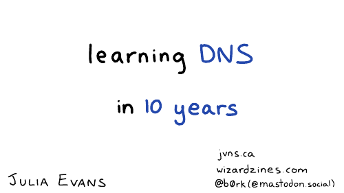](https://jvns.ca/images/2022-railsconf/slide-01.png)

You all got this zine ([How DNS Works](https://wizardzines.com/zines/dns/)) in your swag bags -- thanks to RubyConf for printing it!  

你们的手提包里都有这本杂志（DNS 的工作原理）——感谢 RubyConf 的印刷！

But this talk is not really about DNS. I mean, this is a Ruby conference, right?  

但这次谈话并不是真正关于 DNS。我的意思是，这是一个 Ruby 会议，对吧？  

So this talk is really about learning hard things, and DNS is an example of something that was hard for me to learn.  

所以这次演讲真的是关于学习困难的东西，而 DNS 就是我难以学习的东西的一个例子。

It took me maybe 16 years from the first time that like I bought a domain name and set up my DNS records to when I really felt like I understood how the system worked.  

从我第一次购买域名并设置我的 DNS 记录到我真正觉得我了解该系统的工作原理，我大概花了 16 年的时间。

And one thing I want to say at the beginning of this talk, is that I think that taking like 16 years to learn something like DNS is kind of normal.  

在本次演讲开始时我想说的一件事是，我认为花 16 年时间学习 DNS 之类的东西是很正常的。  

The idea that "I should understand this already" is a bit silly. For me, I was doing other stuff for most of the 16 years! There was other stuff I wanted to learn.  

“我应该已经明白这一点”的想法有点愚蠢。对我来说，在这 16 年的大部分时间里，我都在做其他事情！我还有其他想学的东西。

And so, this talk is not about how you should learn about any particular thing. I don't care if you learn how DNS works!  

因此，本次演讲不是关于您应该如何学习任何特定事物。我不在乎你是否了解 DNS 的工作原理！  

It's really about how to approach learning something hard that's a priority for you to learn.  

这实际上是关于如何努力学习一些你优先学习的东西。

So, we're going to talk about learning through a series of tiny deep dives. My favorite way of learning things is to do nothing, most of the time.  

因此，我们将讨论通过一系列微小的深入研究来学习。我最喜欢的学习方式是大部分时间什么都不做。

That's why it takes 10 years.  

这就是为什么需要 10 年的原因。

So for six months I'll do nothing and then like I'll furiously learn something for maybe 30 minutes or three hours or an afternoon.  

所以六个月里我什么都不做，然后我会用 30 分钟或三个小时或一个下午疯狂地学习一些东西。  

And then I'll declare success and go back to doing nothing for months. I find this works really well for me.  

然后我会宣布成功并回去几个月无所事事。我发现这对我来说非常有效。

Here are some of the strategies we're going to talk about for doing these tiny deep dives  

以下是我们将要讨论的进行这些微小的深度潜水的一些策略

First, we're going to start briefly by talking about what DNS is.  

首先，我们将简要介绍一下 DNS 是什么。

Next, we're going to talk about spying on DNS.  

接下来，我们将讨论对 DNS 的监视。

Then we're gonna talk about being confused, which is my main mode. (I'm always confused about something!)  

然后我们要说的是迷茫，这是我的主要模式。 （我总是对某些事情感到困惑！）

Then we'll talk about reading the specification, we'll going to do some experiments, and we're going to implement our own terrible version of DNS.  

然后我们将讨论阅读规范，我们将做一些实验，我们将实施我们自己的可怕版本的 DNS。

And so what's DNS really briefly? DNS stands for the Domain Name System. And every time you go to a website like `www.example.com`, your browser needs to look up that website's IP address. So DNS translates domain names into IP addresses.  

那么什么是 DNS 呢？ DNS 代表域名系统。每次您访问 `www.example.com` 之类的网站时，您的浏览器都需要查找该网站的 IP 地址。所以 DNS 将域名翻译成 IP 地址。  

It looks up other information about domain names too, but we're mostly just going to talk about IP addresses today.  

它还会查找有关域名的其他信息，但我们今天主要只讨论 IP 地址。

I want to briefly sell why I think DNS is cool, because we're going to be talking about it a lot.  

我想简要说明为什么我认为 DNS 很酷，因为我们会经常谈论它。

One cool thing about DNS is that it's this invisible system that controls the entire internet.  

DNS 的一件很酷的事情是，它是控制整个互联网的无形系统。

For example, you're on your phone, you're using Google Maps, it needs to know, where is maps.google.com, right? Or on your computer, where's reddit.com? What's the IP address?  

例如，您在手机上使用 Google 地图，它需要知道 maps.google.com 在哪里，对吗？或者在您的计算机上，reddit.com 在哪里？ IP地址是多少？  

And if we didn't have DNS, the entire internet would collapse.  

如果我们没有 DNS，整个互联网就会崩溃。

I think it's fun to learn how this behind the scenes stuff works.  

我认为了解幕后工作原理很有趣。

The other thing about DNS I find interesting is that it's really old. There's this document ([RFC 1035](https://datatracker.ietf.org/doc/html/rfc1035)) which defines how DNS works, that was written in 1987. And if you take that document and you write a program that works the way that documents says to work, your program will work.  

关于 DNS 我觉得有趣的另一件事是它真的很旧。这份文档 (RFC 1035) 定义了 DNS 的工作原理，它写于 1987 年。如果您使用该文档并编写一个按照文档所说的工作方式工作的程序，您的程序就会工作。  

And I think that's kind of wild, right?  

我认为这有点疯狂，对吧？

The basics haven't changed since before I was born. So if you're a little slow about learning about it, that's ok: it's not going to change out from under you.  

自从我出生之前，基础知识就没有改变过。所以如果你对它的了解有点慢，那没关系：它不会从你下面改变。

Next I want to talk about spying on DNS, which is one of my favorite ways to learn about things.  

接下来我想谈谈对 DNS 的监视，这是我最喜欢的了解事物的方式之一。

I'm going to talk about two spy tools for DNS: dig and wireshark.  

我要谈谈两个用于 DNS 的间谍工具：dig 和 wireshark。

dig is a tool for making DNS queries. We talked about you know, how your browser needs to look up the IP address for `maps.google.com`. We can do that in dig!  

dig 是一个用于进行 DNS 查询的工具。我们讨论过您知道，您的浏览器需要如何查找 `maps.google.com` 的 IP 地址。我们可以在挖掘中做到这一点！

When we run `dig maps.google.com`, it prints out 5 fields. Let's talk about what those 5 fields are.  

当我们运行 `dig maps.google.com` 时，它会打印出 5 个字段。让我们谈谈这5个领域是什么。

[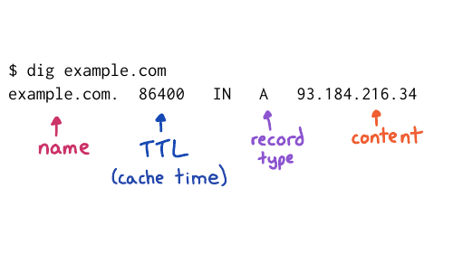](https://jvns.ca/images/2022-railsconf/slide-17.png)

I've used example.com instead of maps.google.com on this slide, but the fields are the same. Let's talk about 4 of them:  

我在这张幻灯片上使用了 example.com 而不是 maps.google.com，但字段是相同的。让我们谈谈其中的 4 个：

We have the domain name, no big deal  

我们有域名，没什么大不了的

The Time To Live, which is how long to cache that record for so this is a one day  

生存时间，这是缓存该记录的时间，所以这是一天

You have the record type, A stands for address because this is an IP address  

您有记录类型，A 代表地址，因为这是一个 IP 地址

And you have the content, which is the IP address  

你有内容，也就是 IP 地址

But I think that the funniest field in a DNS record is this field in the middle, IN, which stands for INternet.  

但是我觉得DNS记录中最搞笑的字段是中间这个字段IN，代表INTERNET。  

I guess in 1987, they thought that we might be on a lot of different networks. So they made an option for it. In reality, we're all on the internet.  

我猜在 1987 年，他们认为我们可能在很多不同的网络上。所以他们为此做了一个选择。实际上，我们都在互联网上。  

And every DNS query has class set to "internet". There are a couple of others query classes (CHAOS and HESIOD), which truly almost nobody uses.  

每个 DNS 查询都将类设置为“互联网”。还有几个其他查询类（CHAOS 和 HESIOD），实际上几乎没有人使用。

[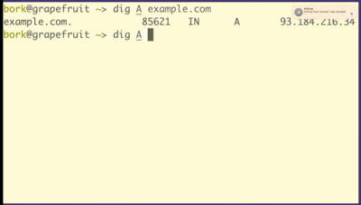](https://jvns.ca/images/2022-railsconf/demo-dig2.png)

We can also kind of poke around on the internet with Dig. We've talked about A records to look up IP addresses.  

我们还可以使用 Dig 在互联网上四处浏览。我们已经讨论过 A 记录来查找 IP 地址。

But there are other kinds of records like TXT records. So we're going to look at a TXT record really quickly just because I think this is very fun.  

但还有其他类型的记录，如 TXT 记录。所以我们将非常快速地查看 TXT 记录，因为我认为这非常有趣。  

We're going to look at twitter.com's TXT records.  

我们将查看 twitter.com 的 TXT 记录。

So TXT records are something that people use for domain verification, for example to prove to Google that you own twitter.com.  

所以 TXT 记录是人们用于域验证的东西，例如向谷歌证明你拥有 twitter.com。

So what you can do is you can set this DNS record `google-site-verification`. Google will tell you what to set it to, you'll set it, and then Google will believe you.  

所以你可以做的是你可以设置这个 DNS 记录 `google-site-verification` 。 Google 会告诉您将其设置为什么，您将对其进行设置，然后 Google 就会相信您。

I think it's kind of fun that you can like kind of poke around with DNS and see that Twitter is using Miro or Canva or Mixpanel, that's all public.  

我认为您可以喜欢使用 DNS 并查看 Twitter 使用 Miro 或 Canva 或 Mixpanel，这很有趣，这些都是公开的。  

It's like a little peek into what people are doing inside their companies  

这就像窥视人们在公司内部所做的事情

Oh, the other thing about dig is that by default, dig's output looks like this, which is very ugly and unreadable. There's a lot of nonsense here.  

哦，关于 dig 的另一件事是，默认情况下，dig 的输出看起来像这样，非常丑陋且不可读。这里有很多废话。

[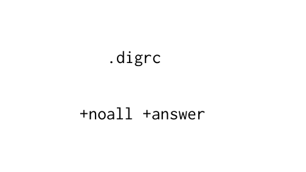](https://jvns.ca/images/2022-railsconf/slide-19.png)

So dig has a configuration file, where you can put `+noall +answer` and then your dig responses look much nicer (like they did in the screenshots above) instead of having a lot of nonsense in them.  

所以 dig 有一个配置文件，你可以在其中放置 `+noall +answer` 然后你的 dig 响应看起来更好（就像他们在上面的屏幕截图中所做的那样），而不是在其中有很多废话。  

Whenever possible, I try to make my tools behave in a more human way.  

只要有可能，我都会尝试让我的工具以更人性化的方式运行。

The other thing I want to talk about is Wireshark, which is my favorite computer networking tool in the universe for spying on all things computer networks.  

我想谈的另一件事是 Wireshark，它是我最喜欢的计算机网络工具，用于监视计算机网络中的所有事物。  

In this case, DNS queries. So let's go look at Wireshark.  

在这种情况下，DNS 查询。那么让我们来看看 Wireshark。

When we make a DNS query like this and look up example.com, Wireshark can capture it.  

当我们像这样进行 DNS 查询并查找 example.com 时，Wireshark 可以捕获它。

[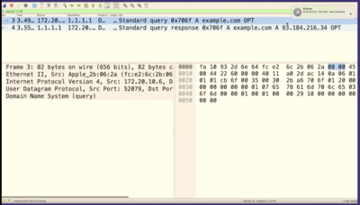](https://jvns.ca/images/2022-railsconf/demo-wireshark2.png)

When you start looking in the guts of things, I think it can be a bit scary at first. Like what do all these numbers? It kind of seems like a lot.  

当您开始深入研究事物时，我认为一开始可能会有点吓人。就像所有这些数字一样？似乎很多。  

So when I'm looking at something new, I try to start by looking at stuff that I understand.  

所以当我看新事物时，我会尝试从我理解的东西开始。

For example, I know that example.com is a domain name, right? So we should able to use Wireshark to go find that domain name in the DNS query.  

例如，我知道 example.com 是一个域名，对吧？所以我们应该能够使用 Wireshark 在 DNS 查询中找到该域名。  

If we click into the "query" part of the DNS packet, we can see 3 fields that we recognize. First, the domain name.  

如果我们点击 DNS 数据包的“查询”部分，我们可以看到我们识别的 3 个字段。第一，域名。

[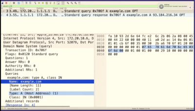](https://jvns.ca/images/2022-railsconf/demo-wireshark4.png)

We can also see the type ("A")  

我们还可以看到类型 ("A")

And the third one is the class which is INternet, which is always the same.  

第三个是互联网类，它总是一样的。  

What I find comforting here is that in the query, there are really only 2 important fields: a DNS query is just saying "I want the IP address for example.com".  

我在这里感到欣慰的是，在查询中，实际上只有 2 个重要字段：DNS 查询只是说“我想要 example.com 的 IP 地址”。  

There's just two fields. And that that always makes me feel a little bit better about understanding something.  

只有两个字段。这总是让我对理解某事感觉好一点。

A quick caveat: your browser might be using encrypted DNS and spying on your DNS queries with Wireshark will not work if your DNS is encrypted.  

快速警告：您的浏览器可能正在使用加密的 DNS，如果您的 DNS 已加密，则使用 Wireshark 监视您的 DNS 查询将不起作用。  

But there's lots of non-encrypted DNS to spy on.  

但是有很多未加密的 DNS 可供监视。

The second thing I want to talk about for learning new things is to notice when you're confused about something.  

关于学习新事物，我想谈的第二件事是当你对某事感到困惑时要注意。

I want to tell you a story, "the case of the mysterious caching", of something that happened to me with DNS that really confused me.  

我想告诉你一个故事，“神秘缓存的案例”，发生在我身上的关于 DNS 的事情让我很困惑。

First, I want to talk to you a little bit about how DNS works a little bit more. So on the left here, you have your browser.  

首先，我想和大家多谈谈 DNS 的工作原理。所以在左边，你有你的浏览器。  

And when your browser makes a DNS query, it asks a server called a resolver.  

当您的浏览器进行 DNS 查询时，它会询问称为解析器的服务器。  

And all you need to know about the resolver is that it's cache, which as we know is like the worst thing in computer science.  

关于解析器，您只需要知道它是缓存，正如我们所知，这是计算机科学中最糟糕的事情。  

So the resolver is a cache, and it gets its information from the source of truth, which has the real answers.  

所以解析器是一个缓存，它从具有真实答案的真实来源获取信息。

So your browser talks to a resolver, which is a cache.  

因此，您的浏览器会与解析器（即缓存）对话。

At the time of this story, I had this mental model for like how I thought about DNS, which is that if I set a TTL (the cache time) of 5 minutes when configuring my DNS records, then I would never have to wait more than five minutes.  

在写这个故事的时候，我对 DNS 有这样的心理模型，那就是如果我在配置 DNS 记录时将 TTL（缓存时间）设置为 5 分钟，那么我将永远不必等待更多超过五分钟。  

Something you need to know about me is that I'm a very impatient person. And I hate waiting.  

关于我，你需要知道的是我是一个非常没有耐心的人。我讨厌等待。  

So this model was mostly working for me at the time, though there are a few other very important caveats that we're not going to get into.  

所以这个模型当时主要对我有用，尽管还有一些其他非常重要的警告我们不会讨论。

[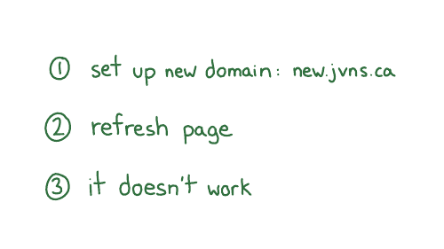](https://jvns.ca/images/2022-railsconf/slide-28.png)

But one day I was setting up a new subdomain for some new project. Let's say it was new.jvns.ca. So I set it up. I made its DNS records, and I refreshed the page.  

但是有一天我为某个新项目设置了一个新的子域。假设它是 new.jvns.ca。所以我设置了它。我做了它的 DNS 记录，我刷新了页面。  

And it wasn't working. So I figured, that's fine, my model says, I only have to wait five minutes, right? Because that's what I was used to.  

它没有用。所以我想，没关系，我的模型说，我只需要等五分钟，对吧？因为那是我习惯的。  

But I waited five minutes and still didn't work.  

但是我等了五分钟，还是不行。

And I was like, oh, no. My mental model was broken! I did not feel good.  

我当时想，哦，不。我的心智模型被打破了！我感觉不太好。

And often when this happens to me, and I think for most of us, if something weird happens with a computer, you let it go, right?  

通常当这种情况发生在我身上时，我认为对于我们大多数人来说，如果计算机出现奇怪的事情，你就会放手，对吧？  

You might decide okay, I don't have time to go into a deep investigation here. I'll just wait longer.  

你可能会决定好吧，我没有时间在这里进行深入调查。我只会等更长的时间。

But sometimes I have a lot of energy, and maybe I'm feeling mad, like "the computer can't beat me today"! Because there's a reason that this is happening, right?  

但有时我精力充沛，也许我感到很生气，就像“今天电脑打不过我”！因为这是有原因的，对吧？  

And I want to find out what it is. So this day for some reason. I had a lot of energy.  

我想知道它是什么。所以今天出于某种原因。我精力充沛。

So I started Googling furiously. And I found a useful comment on Stack Overflow.  

所以我开始疯狂地谷歌搜索。我在 Stack Overflow 上找到了一条有用的评论。

The Stack Overflow comment talked about something called negative caching. What's that?  

Stack Overflow 评论谈到了一种叫做负缓存的东西。那是什么？

And so here's what it said might be going on.  

所以这就是它所说的可能会发生的事情。  

The first time I opened the website (before the DNS records had been set up), the DNS servers returned a negative answer, saying hey,this domain doesn't exist yet.  

我第一次打开网站时（在 DNS 记录设置之前），DNS 服务器返回一个否定的答案，说嘿，这个域还不存在。  

The code for that is NXDOMAIN, which is like a 404 for DNS.  

其代码是 NXDOMAIN，类似于 DNS 的 404。

And the resolver cached that negative NXDOMAIN response. So the fact that it didn't exist was cached.  

解析器缓存了否定的 NXDOMAIN 响应。所以它不存在的事实被缓存了。

So my next question was: how long do I have to wait for the cache to expire? This brings us to a another learning technique.  

所以我的下一个问题是：我必须等待缓存过期多长时间？这给我们带来了另一种学习技巧。

I think like maybe the most upsetting learning technique to me is to read a very boring technical document. I'm like very impatient. I kind of hate reading boring things.  

我认为对我来说最令人沮丧的学习技巧可能是阅读一份非常无聊的技术文档。我很不耐烦。我有点讨厌读无聊的东西。  

And so when I read something very boring, I like to bring a specific question.  

所以当我读到一些非常无聊的东西时，我喜欢提出一个具体的问题。  

So in this case, I had a specific question, which is how long do I have to wait for the cache to expire?  

所以在这种情况下，我有一个具体的问题，就是我必须等待缓存过期多长时间？

In networking, everything has a specification. The boring technical documents are called RFC is for request for comments.  

在网络中，一切都有规范。无聊的技术文档称为 RFC 是征求意见。  

I find this name a bit funny, because for DNS, some of the main RFCs are RFC 1034 and 1035. These were written in 1987, and the comment period ended in 1987. You can definitely no longer make comments.  

我觉得这个名字有点搞笑，因为对于DNS来说，一些主要的RFC是RFC 1034和1035。这些是1987年写的，评论期到1987年就结束了。你绝对不能再评论了。

But anyway, that's what they're called.  

但无论如何，这就是他们的名字。

I personally kind of love RFCs because they're like the ultimate answer to many questions. There's a great series of HTTP RFCs, 9110 to 9114. DNS actually has a million different RFCs, it's very upsetting, but the answers are often there.  

我个人有点喜欢 RFC，因为它们就像是许多问题的最终答案。有一系列很棒的 HTTP RFC，从 9110 到 9114。DNS 实际上有一百万个不同的 RFC，这很令人沮丧，但答案通常就在那里。  

So I went looking. And I think I went looking because when I read comments on StackOverflow, I don't always trust them. How do I know if they're accurate?  

所以我去找了。我想我去寻找是因为当我在 StackOverflow 上阅读评论时，我并不总是相信他们。我怎么知道它们是否准确？  

So I wanted to go to an authoritative source.  

所以我想去一个权威的来源。

[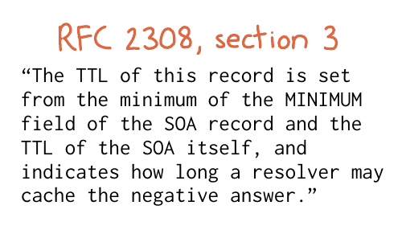](https://jvns.ca/images/2022-railsconf/slide-38.png)

So I found this document called RFC 2308. In section 3, it has this very boring sentence, the TTL of this record is set to the minimum of the minimum field of the SOA record and the TTL of the SOA itself.  

于是我找到了这个叫做RFC 2308的文档。在第3节中，有这么一句很无聊的话，这条记录的TTL设置为SOA记录的最小字段和SOA本身的TTL中的最小值。  

It indicates how long a resolver may cache the negative answer.  

它指示解析器可以将否定答案缓存多长时间。

So, um, ok, cool. What does that mean, right? Luckily, we only have one question: I don't need to read the entire boring document.  

所以，嗯，好的，很酷。那是什么意思，对吧？幸运的是，我们只有一个问题：我不需要阅读整个枯燥的文档。  

I just need to like analyze this one sentence and figure it out.  

我只需要喜欢分析这句话并弄清楚。

So it's saying that the cache time depends on two fields. I want to show you the actual data it's talking about, the SOA record.  

所以说缓存时间取决于两个字段。我想向您展示它所谈论的实际数据，即 SOA 记录。

Let's look at what happens when we run `dig +all asdfasdfasdfasdfasdf.jvns.ca` It says that the domain doesn't exist, NXDOMAIN. But it also returns this record called the SOA record, which has some domain metadata.  

让我们看看当我们运行 `dig +all asdfasdfasdfasdfasdf.jvns.ca` 时会发生什么 它说域不存在，NXDOMAIN。但它也返回这个称为 SOA 记录的记录，它有一些域元数据。  

And there are two fields here that are relevant.  

这里有两个相关的字段。

[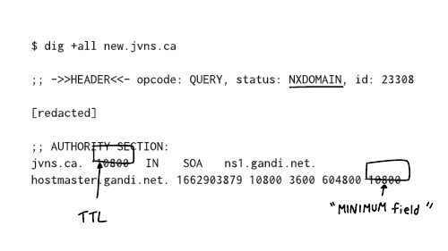](https://jvns.ca/images/2022-railsconf/slide-40.png)

Here. I put this on a slide to try to make it a little bit clearer.  

这里。我把它放在幻灯片上，试图让它更清楚一点。  

This slide is a bit messed up, but there's this field at the end that's called the MINIMUM field, and there's the TTL, time to live of the record, that I've tried to circle.  

这张幻灯片有点乱，但最后有一个字段称为最小字段，还有 TTL，记录的生存时间，我试图圈出。

And what it's saying is that if a record doesn't exist, the amount of time the resolver should cache "it doesn't exist" for is the minimum of those two numbers.  

它的意思是，如果记录不存在，解析器应缓存“它不存在”的时间量是这两个数字中的最小值。

[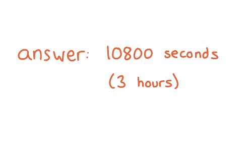](https://jvns.ca/images/2022-railsconf/slide-41.png)

In this case, both of those numbers are 10800. So that's how long have to wait. We have to wait 10,800 seconds. That's 3 hours.  

在本例中，这两个数字都是 10800。这就是需要等待的时间。我们必须等待 10,800 秒。那是3个小时。

And so I waited three hours and then everything worked.  

所以我等了三个小时，然后一切正常。  

And I found this kind of fun to know because often like if you look up DNS advice it will say something like, if something has gone wrong, you need to wait 48 hours.  

我发现了解这种情况很有趣，因为如果您查找 DNS 建议，它通常会说，如果出现问题，您需要等待 48 小时。  

And I do not want to wait 48 hours! I hate waiting. So I love it when I can like use my brain to figure out that I can wait for less time.  

而且我不想等 48 小时！我讨厌等待。所以我喜欢用我的大脑来弄清楚我可以等待更少的时间。

Sometimes when I find my mental model is broken, it feels like I don't know anything  

有时当我发现我的心智模型被打破时，感觉就像我什么都不知道

But in this case, and I think in a lot of cases, there's often just a few things I'm missing?  

但在这种情况下，而且我认为在很多情况下，我通常只遗漏了几件事？  

Like this negative caching thing is like kind of weird, but it really was the one thing I was missing.  

就像这种负缓存的东西有点奇怪，但它确实是我所缺少的一件事。  

There are a few more important facts about how DNS caching works that I haven't mentioned, but I haven't run into more problems I didn't understand since then.  

还有一些关于 DNS 缓存如何工作的更重要的事实我没有提到，但从那以后我没有遇到更多我不理解的问题。  

Though I'm sure there's something I don't know.  

虽然我确定有些事情我不知道。

So sometimes learning one small thing really can solve all your problems.  

所以有时候学会一件小事真的可以解决你所有的问题。

I want to say briefly that there's a solution to this negative caching problem. We talked about how like if you visit a domain that's nonexistent, it gets cached.  

我想简单地说一下，这个负缓存问题有一个解决方案。我们讨论了如果您访问一个不存在的域，它会如何被缓存。  

The solution is if you haven't set up your domain's DNS, don't visit the domain! Only visit it after you set it up.  

解决办法是如果你还没有设置你的域的 DNS，不要访问该域！仅在设置后访问它。  

So I've learned to do that and now I almost never have this problem anymore. It's great.  

所以我学会了这样做，现在我几乎再也不会遇到这个问题了。这很棒。

The next thing I want to talk about is doing experiments.  

接下来我要说的是做实验。

So let's say we want to do some experiments with caching.  

所以假设我们想做一些缓存实验。

I think most people don't want to make experimental changes to their domain names, because they're worried about breaking something. Which I think is very understandable.  

我认为大多数人不想对他们的域名进行实验性更改，因为他们担心破坏某些东西。我认为这是非常可以理解的。

Because I was really into DNS, I wanted to experiment with DNS. And I also wanted other people to experiment with DNS without having to worry about breaking something.  

因为我真的很喜欢 DNS，所以我想尝试使用 DNS。我还希望其他人可以试用 DNS 而不必担心会破坏某些东西。  

So I made this little website with my friend, Marie, called [Mess with DNS](https://messwithdns.net/)  

所以我和我的朋友 Marie 做了这个小网站，叫做 Mess with DNS

The idea is, if you don't want to do that DNS experiments on your domain, you can do them on my domain. And if you mess something up, it's my problem, it's not your problem.  

我的想法是，如果您不想在您的域中进行 DNS 实验，您可以在我的域中进行。如果你把事情搞砸了，那是我的问题，不是你的问题。  

And there have been no problems, so that's fine.  

没有任何问题，所以很好。

So let's use Mess With DNS to do a little DNS experimentation  

因此，让我们使用 Mess With DNS 来做一些 DNS 实验

The way this works is you get a little subdomain. This one is chair131.messwithdns.com. And then you can make DNS records on it and try things out.  

它的工作方式是你得到一个小的子域。这是 chair131.messwithdns.com。然后你可以在上面做 DNS 记录并尝试一下。  

Here we're making a record for test.char131.messwithdns.net, with type A, the IP 7.7.7.7, and TTL 3000 seconds.  

这里我们为 test.char131.messwithdns.net 做一个记录，类型 A，IP 7.7.7.7，TTL 3000 秒。

What we would expect to see is that if we make a query to the resolver, then it asks kind of like the source of truth, which we control.  

我们希望看到的是，如果我们向解析器发出查询，那么它会询问我们控制的真相来源。  

And we should expect the resolver to make only one query, because it's cached. So I want to do an experiment and see if it's true that we get only 1 query.  

我们应该期望解析器只进行一次查询，因为它被缓存了。所以我想做一个实验，看看我们是否只得到 1 个查询。

So I'm going to make a few queries for it, with `dig @1.1.1.1 test.chair131.messwithdns.com`. I've queried it a bunch of times, maybe 10 or 20.  

因此，我将使用 `dig @1.1.1.1 test.chair131.messwithdns.com` 对其进行一些查询。我已经查询了很多次，可能有 10 次或 20 次。

Oh, cool. This isn't what I expected to see. This is fun, though, that's great. We made about 20 queries for that DNS record.  

哦，酷。这不是我期望看到的。不过，这很有趣，这很棒。我们对该 DNS 记录进行了大约 20 次查询。  

The server logs all queries it receives, so we can count them. Our server got 1, 2, 3, 4, 5, 6, 7, 8 queries. That's kind of fun. 8 is less than 20.  

服务器记录它收到的所有查询，因此我们可以计算它们。我们的服务器收到 1、2、3、4、5、6、7、8 次查询。这很有趣。 8 小于 20。

One reason I like to do demos live on stage is that sometimes what I what happens isn't exactly what I think will happen.  

我喜欢在舞台上现场演示的原因之一是，有时发生的事情并不完全是我认为会发生的事情。  

When I do this exact experiment at home, I just get 1 query to the resolver.  

当我在家里做这个确切的实验时，我只收到 1 个对解析器的查询。

So we only saw like eight queries here. And I assume that this is because the resolver, 1.1.1.1, we're talking to has more than one independent cache, I guess there are 8 caches.  

所以我们在这里只看到了八个查询。我假设这是因为解析器，1.1.1.1，我们正在谈论的有不止一个独立的缓存，我猜有 8 个缓存。  

This makes sense to me because Cloudflare's network is distributed -- the exact machines I'm talking to here in Providence are not the same as the ones in Montreal.  

这对我来说很有意义，因为 Cloudflare 的网络是分布式的——我在普罗维登斯与我交谈的确切机器与蒙特利尔的机器不同。

This is interesting because it complicates your idea about how caching works a little bit, right?  

这很有趣，因为它使您对缓存如何工作的想法有点复杂，对吧？  

Like maybe a given DNS resolver actually has like eight caches and which one you get is random, and you're not always talking to the same one. I think that's what's going on here.  

就像一个给定的 DNS 解析器实际上有八个缓存，你得到的是随机的，你并不总是与同一个缓存。我认为这就是这里发生的事情。

We can also do the same experiment, but ask Google's resolver, 8.8.8.8, instead of Cloudflare's resolver.  

我们也可以做同样的实验，但是询问 Google 的解析器 8.8.8.8，而不是 Cloudflare 的解析器。

And we're seeing a similar thing here to what we saw with Cloudflare, there are maybe 4 independent caches.  

我们在这里看到的情况与我们在 Cloudflare 中看到的类似，可能有 4 个独立的缓存。

We could also do an experiment with negative caching, but no, I'm not going to do this demo. Sorry. I could just see it going downhill.  

我们也可以用负缓存做一个实验，但不，我不打算做这个演示。对不起。我只能看到它在走下坡路。  

The problem is that there's too many different caches, and I really want there to be one cache, but there's like seven. That's fine, let's move on.  

问题是有太多不同的缓存，我真的希望有一个缓存，但有七个。没关系，让我们继续。

Now I'm going to talk about my favorite strategy for learning about stuff, which is to write my own very bad version of the thing.  

现在我要谈谈我最喜欢的学习东西的策略，那就是写我自己的东西的非常糟糕的版本。  

And I want to say that writing my very bad implementation gives me a really unreasonable amount of confidence.  

而且我想说，编写我非常糟糕的实现给了我一种非常不合理的信心。

So you might think that writing DNS software is complicated, right? But it's easier than you might think, as long as you keep your expectations low.  

所以您可能认为编写 DNS 软件很复杂，对吧？但它比您想象的要容易，只要您保持较低的期望即可。

To make the DNS queries, the first thing we need to do is we need to make a network connection. Let's do that.  

要进行 DNS 查询，我们需要做的第一件事是建立网络连接。让我们这样做吧。

[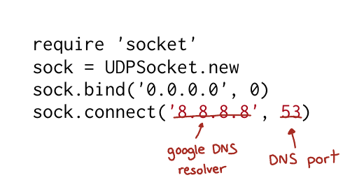](https://jvns.ca/images/2022-railsconf/slide-54.png)

These four lines of Ruby connect to 8.8.8.8, the Google DNS resolver, on UDP port 53. Now we're like halfway there.  

这四行 Ruby 连接到 UDP 端口 53 上的 Google DNS 解析器 8.8.8.8。现在我们已经完成了一半。  

So after we've made a connection, we need to send Google a DNS query. You might be thinking, Julia, I don't know how to write a DNS query.  

因此，在建立连接后，我们需要向 Google 发送 DNS 查询。你可能会想，Julia，我不知道如何编写 DNS 查询。

But there's no problem. We can copy one from something else that knows what a DNS query looks like. AKA Wireshark.  

但是没有问题。我们可以从其他知道 DNS 查询的东西中复制一个。又名 Wireshark。

[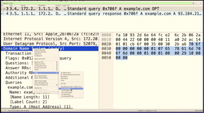](https://jvns.ca/images/2022-railsconf/demo-write1.png)

So if I right click on this DNS query, it's very small, but I'm clicking on "copy", and then "copy as hex stream". You might not know what this means yet, but this is a DNS query.  

因此，如果我右键单击此 DNS 查询，它非常小，但我单击“复制”，然后单击“复制为十六进制流”。您可能还不知道这意味着什么，但这是一个 DNS 查询。  

And you might think that like, Hey, you can't just copy and paste something and then send the exact same thing and it'll reply, but you can. And it works.  

你可能会想，嘿，你不能只是复制和粘贴一些东西，然后发送完全相同的东西，它会回复，但你可以。它有效。

Here's what the code looks like to send this hex string we copied and pasted to 8.8.8.8.  

下面是将我们复制并粘贴到 8.8.8.8 的十六进制字符串发送到 8.8.8.8 的代码。

So we take this like hex string that we copy and pasted, and paste it into our tiny Ruby program, and use \`.pack\` to convert into a string of bytes and send it.  

所以我们把这个像我们复制和粘贴的十六进制字符串一样，并将它粘贴到我们的小 Ruby 程序中，并使用 .pack 将其转换为字节字符串并发送。

[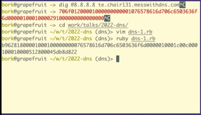](https://jvns.ca/images/2022-railsconf/demo-write3.png)

Now we run the Ruby program.  

现在我们运行 Ruby 程序。

[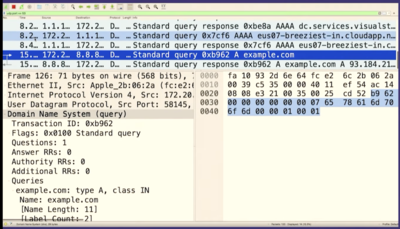](https://jvns.ca/images/2022-railsconf/demo-write4.png)

Let's go to Wireshark and look for the packet we just sent. And we can see it there! There's some other noise in between, so I'll stop the capture.  

让我们转到 Wireshark 并查找我们刚刚发送的数据包。我们可以在那里看到它！中间还有一些其他的噪音，所以我会停止捕捉。

We can see that it's the same packet because the query ID matches, B962.  

我们可以看到这是同一个数据包，因为查询 ID 匹配，B962。

So we sent a query to Google the answer server and we got a response right? It was like this is totally legitimate. There's no problem.  

所以我们向谷歌的答案服务器发送了一个查询，我们得到了回应，对吗？好像这是完全合法的。这里没有问题。  

It doesn't know that we copied and pasted it and that we have no idea what it means!  

它不知道我们复制粘贴了它，我们不知道它是什么意思！

But we do want to know what this means, right? And so we'll take this hex string and split it into 2 parts. The first part is the header.  

但我们确实想知道这意味着什么，对吧？所以我们将把这个十六进制字符串分成两部分。第一部分是标题。  

And the second part is the question, which contains the actual domain name we're looking up.  

第二部分是问题，其中包含我们正在查找的实际域名。

We're going to see how to construct these in Ruby, but first I want to talk about what a byte is for one second. So this (b9) is the hexadecimal representation of a byte.  

我们将看到如何在 Ruby 中构建这些，但首先我想花一秒钟谈谈字节是什么。所以这个（b9）是一个字节的十六进制表示。  

The way I like to look at figure out what that means is just type it into IRB, if you type in 0xB9 it'll print out, that's the number 184.  

我想弄清楚这意味着什么的方式就是将它输入 IRB，如果你输入 0xB9，它会打印出来，那就是数字 184。

So the question is 12 bytes  

所以问题是12个字节

Those 12 bytes correspond six numbers, which are two bytes each. So the first number is the thing `b962` which is the query ID. The next number is the flags, which basically in this case, means like this is a query like hello, I have a question.  

这 12 个字节对应六个数字，每个数字是两个字节。所以第一个数字是 `b962` ，它是查询 ID。下一个数字是标志，基本上在这种情况下，这意味着这是一个查询，比如你好，我有一个问题。  

And then there's four more sections, the number of questions and then the number of answers. We do not have any answers. We only have a question.  

然后还有四个部分，问题的数量，然后是答案的数量。我们没有任何答案。我们只有一个问题。  

So we're saying, hello, I have one question. That's what the header means.  

所以我们说，你好，我有一个问题。这就是标题的意思。

And the way that we can do this in Ruby, is we can make a little array that has the query ID, and then these numbers which correspond to the other the other header fields, the flags and then 1 for 1 question, and then three zeroes for each of the 3 sections of answers.  

我们可以在 Ruby 中做到这一点的方法是，我们可以制作一个具有查询 ID 的小数组，然后这些数字对应于其他标头字段、标志，然后是 1 个问题，然后是三个答案的 3 个部分中的每一个都为零。

And then we need to tell Ruby how to take these like six numbers and then represent them as bytes.  

然后我们需要告诉 Ruby 如何取这些像六个数字，然后将它们表示为字节。  

So n here means each of these is supposed to represent it as two bytes, and it also means to use big endian byte order.  

所以这里的n表示每一个都应该表示为两个字节，也表示使用big endian字节顺序。

Now let's talk about the question.  

现在让我们谈谈这个问题。

[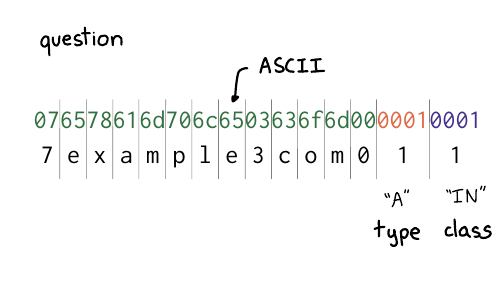](https://jvns.ca/images/2022-railsconf/slide-62.png)

I broke up the question section here. There are two parts you might recognize from `example.com`: there's example, and com. The way it works is that first you have a number (like 7), and then a 7-character string, like "example".  

我在这里分解了问题部分。您可能会从 `example.com` 中认出两个部分：example 和 com.它的工作方式是首先你有一个数字（如 7），然后是一个 7 个字符的字符串，如“example”。  

The number tells you how many characters to expect in each part of the domain name. So it's 7, example, 3, com, 0.  

该数字告诉您在域名的每个部分中预期有多少个字符。所以它是 7，例如，3，com，0。

And then at the end, you have two more fields for the type and the class. Class 1 is code for "internet".  

最后，还有两个字段用于类型和类。 1 类是“互联网”的代码。  

And type 1 is code for "IP address", because we want to look up the IP address. is  

类型 1 是“IP 地址”的代码，因为我们要查找 IP 地址。是

So we can write a little bit of code to do this.  

所以我们可以写一点代码来做到这一点。  

If we want to translate example.com into seven example three column zero, can like split the domain on a dot and then like get its length and concatenate that together and put a 0 on the end.  

如果我们想将 example.com 翻译成七个示例，三列零，可以像在一个点上拆分域，然后像获取它的长度并将其连接在一起并在末尾放置一个 0。  

It's just a little bit of Ruby. how to encode a domain name.  

这只是一点点 Ruby。如何对域名进行编码。

[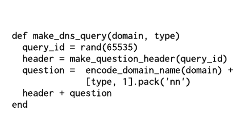](https://jvns.ca/images/2022-railsconf/slide-64.png)

And then we can wrap all this up together where we make a random query ID.  

然后我们可以将所有这些组合在一起，生成一个随机查询 ID。  

And then you make the header, encode the domain name, and then we add the type and the class, 1 and 1, and then we can just concatenate everything together and that's our query.  

然后你制作标头，对域名进行编码，然后我们添加类型和类，1 和 1，然后我们可以将所有内容连接在一起，这就是我们的查询。

There's definitely more work to do here to print out the response, but I wrote a 120-line Ruby script that parses the response too, and I want to show you a quick demo of it working.  

这里肯定还有更多工作要做才能打印出响应，但我也编写了一个 120 行的 Ruby 脚本来解析响应，我想向您展示它的快速演示。

[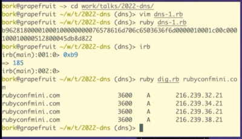](https://jvns.ca/images/2022-railsconf/demo-write7.png)

What domain should we look up>. rubyconfmini.com. All right, let's do it. Hey, it works!  

我们应该查找什么域>。 rubyconfmini.com。好吧，让我们开始吧。嘿，它有效！

I have a blog post that breaks down the whole thing on my blog, [Making a DNS query in Ruby from scratch](https://jvns.ca/blog/2022/11/06/making-a-dns-query-in-ruby-from-scratch/). It talks about how to decode the response.  

我有一篇博客文章，从头开始在 Ruby 中进行 DNS 查询，对整个内容进行了分解。它讨论了如何解码响应。

We're at the end! Let's do a recap.  

我们结束了！让我们回顾一下。

Okay. Let's go over the ways we've talked about learning things!  

好的。让我们回顾一下我们讨论过的学习方式！

First, spy on it. I find that when I look at things like to see like really what's happening under the hood, and when I look at like, what's in the bytes, you know what's going on?  

首先，监视它。我发现，当我看事物时，我喜欢看看引擎盖下到底发生了什么，当我看时，字节中有什么，你知道发生了什么吗？  

It's often like not as complicated as I think. Like, oh, there's just the domain name and the type. It really makes me feel far more confident that I understand that thing.  

它通常不像我想象的那么复杂。就像，哦，只有域名和类型。这真的让我对自己理解那件事更有信心。

I try to notice when I'm confused, and I want to say again, that noticing when you're confused is something that like we don't always have time for right?  

当我感到困惑时，我试着去注意，我想再说一遍，当你感到困惑时，注意是我们并不总是有时间做的事情，对吗？  

It's something to do when you have the energy.  

当你有精力时，这是要做的事情。  

For example there's this weird DNS query I saw in one of the demos today that I don't understand, but I ignored it because, well, I'm giving a talk.  

例如，我在今天的一个演示中看到了这个奇怪的 DNS 查询，我不理解它，但我忽略了它，因为好吧，我正在演讲。  

But maybe one day I'll feel like looking at it.  

但也许有一天我会想看看它。

We talked about reading the specification, which, there are few times I feel like more powerful than when I'm in like a discussion with someone, and I KNOW that I have the right answer because, well, I read the specification! It's a really nice way to feel certain.  

我们谈到了阅读规范，很少有几次我觉得比与某人讨论时更强大，而且我知道我有正确的答案，因为，好吧，我阅读了规范！这是一种确定的好方法。

I love to do experiments to check that my understanding of stuff is right. And often I learn that my understanding of something is wrong!  

我喜欢做实验来检查我对事物的理解是否正确。而且我经常发现我对某些事情的理解是错误的！  

I had an example in this talk that I was going to include and I did an experiment to check that that example was true, and it wasn't! And now I know that.  

我在这次演讲中有一个我要包括的例子，我做了一个实验来检查这个例子是否正确，但事实并非如此！现在我知道了。  

I love that experiments on computers are very fast and cheap and usually have no consequences.  

我喜欢在计算机上进行的实验非常快速且便宜，而且通常不会产生任何后果。

And then the last thing we talked about and truly my favorite, but the most work is like implementing your own terrible version.  

然后是我们谈论的最后一件事，也是我最喜欢的，但大部分工作就像实现你自己的糟糕版本。  

For me, the confidence I get from writing like a terrible DNS implementation that works on 11 different domain names is unmatched.  

对我来说，我从编写一个可在 11 个不同域名上运行的糟糕 DNS 实现中获得的信心是无与伦比的。  

If my thing works at all, I feel like, wow, you can't tell me that I don't know how DNS works! I implemented it!  

如果我的东西能正常工作，我觉得，哇，你不能告诉我我不知道 DNS 是如何工作的！我实施了！  

And it doesn't matter if my implementation is "bad" because I know that it works! I've tested it. I've seen it with my own eyes. And I think that just feels amazing.  

我的实现是否“糟糕”也没关系，因为我知道它有效！我已经测试过了。我亲眼所见。我认为那感觉太棒了。  

And there are also no consequences because you're never going to run it in production. So it doesn't matter if it's terrible.  

而且也没有任何后果，因为您永远不会在生产环境中运行它。所以，它是否可怕并不重要。  

It just exists to give you huge amounts of confidence in yourself. And I think that's really nice.  

它的存在只是为了让你对自己充满信心。我认为那真的很好。

That's all for me. Thank you for listening.  

这就是我的全部。谢谢你的聆听。

### thanks to the organizers! 感谢主办方！

Thanks to the RubyConf Mini organizers for doing such a great job with the conference – it was the first conference I’d been to since 2019, and I had a great time.  

感谢 RubyConf Mini 组织者在会议上做得如此出色——这是我自 2019 年以来第一次参加会议，我玩得很开心。

### a quick plug for “How DNS Works”  

“DNS 工作原理”的快速插件

If you liked this talk and want to to spend _less_ than 10 years learning about how DNS works, I spent 6 months condensing everything I know about DNS into 28 pages. It’s here and you can get it for $12: [How DNS Works](https://wizardzines.com/zines/dns/).  

如果您喜欢这个演讲并且想花不到 10 年的时间来了解 DNS 的工作原理，我花了 6 个月的时间将我对 DNS 的了解浓缩为 28 页。它在这里，您只需 12 美元即可获得：DNS 的工作原理。
