People often say that long-tail keywords are easier to rank for and convert better. But is this actually true?  

人们常说长尾关键词更容易排名和转化更好。但这真的是真的吗？

_It depends._ There are two different types of long-tail keywords, and some are no easier to rank for than their short-tail counterparts.  

这取决于。有两种不同类型的长尾关键词，有些并不比短尾关键词更容易排名。

In this article, you’ll learn the differences between the two types of long-tail keywords and how to find them.   

在本文中，您将了解两种长尾关键字之间的区别以及如何找到它们。

But first, let’s dive into the key things we’ll cover:  

但首先，让我们深入探讨我们将涵盖的关键内容：

-   [What are long-tail keywords?  
    
    什么是长尾关键词？](https://ahrefs.com/blog/long-tail-keywords/#1-what-are-long-tail-keywords)
-   [Why are they called long-tail keywords?  
    
    为什么叫长尾关键词？](https://ahrefs.com/blog/long-tail-keywords/#2-why-called-long-tail-keywords)
-   [What makes long-tail keywords so great?  
    
    是什么让长尾关键字如此出色？](https://ahrefs.com/blog/long-tail-keywords/#3-what-makes-long-tail-keywords-great)
-   [How to find long-tail keywords?  
    
    如何找到长尾关键词？](https://ahrefs.com/blog/long-tail-keywords/#4-how-to-find-long-tail-keywords)
-   [The two types of long-tail keywords  
    
    长尾关键词的两种类型](https://ahrefs.com/blog/long-tail-keywords/#5-two-types-of-long-tail-keywords)

Long-tail keywords are search queries that get a small number of searches per month.  

长尾关键字是每月搜索次数较少的搜索查询。  

They tend to be longer and more specific than their “head” counterparts and, therefore, often have a higher conversion rate.  

它们往往比“头部”对应物更长、更具体，因此通常具有更高的转化率。

For example, the keyword “meditation” is a “head” keyword because it gets 211k searches per month.  

例如，关键字“meditation”是一个“head”关键字，因为它每月有 211k 次搜索。  

The keyword “can meditation make you smarter” is a long-tail keyword because it only gets 50 searches per month.  

关键字“冥想能让你更聪明吗”是一个长尾关键字，因为它每月只有 50 次搜索。

## Why are they called “long-tail” keywords?  

为什么它们被称为“长尾”关键词？

Long-tail keywords got their name from their position on the “search demand” curve.  

长尾关键词的名字来源于它们在“搜索需求”曲线上的位置。  

If we plot all search queries that people have performed in Google in the course of a month and order them by their search volumes, it’ll look somewhat like this:  

如果我们绘制人们在一个月内在 Google 中执行的所有搜索查询并按搜索量排序，它看起来有点像这样：

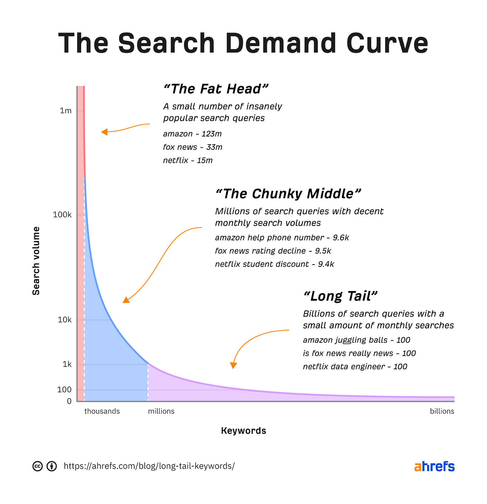

At the “head” of the curve, we have a tiny number of keywords with super high search volumes, while the “tail” consists of billions of keywords with very low search volumes.  

在曲线的“头部”，我们有少量具有超高搜索量的关键字，而“尾部”则由数十亿个搜索量非常低的关键字组成。

To be precise, in Ahrefs’ U.S. database (which is the biggest in the industry, by the way), there are just 31,000 keywords with search volumes of more than 100k searches per month; on the other hand, there are 3.8 billion keywords that have fewer than 10 searches per month.  

准确地说，在 Ahrefs 的美国数据库（顺便说一句，这是业内最大的）中，每月搜索量超过 10 万次搜索的关键词只有 31,000 个；另一方面，有 38 亿个关键字每月的搜索次数少于 10 次。

Here’s how this looks like in a pie chart:  

这是饼图中的样子：

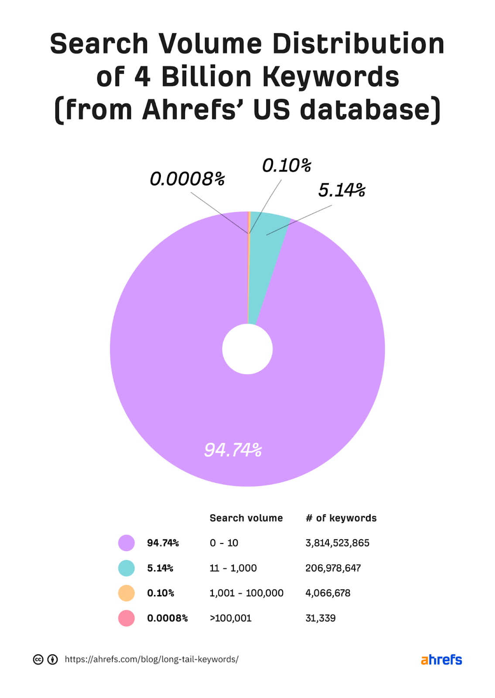

As you can tell, keywords with fewer than 10 searches per month account for almost 95% of our U.S. keyword database. This should not really come as a surprise, given that [~15% of daily Google searches are new and have never been searched before](https://searchengineland.com/google-reaffirms-15-searches-new-never-searched-273786).  

如您所知，每月搜索次数少于 10 次的关键字几乎占我们美国关键字数据库的 95%。这真的不足为奇，因为大约 15% 的日常 Google 搜索是新的并且以前从未搜索过。

> 95% of all search queries in the U.S. get fewer than 10 searches per month.  
> 
> 在美国，95% 的所有搜索查询每月的搜索次数都少于 10 次。

But to qualify as “long-tail,” a keyword doesn’t necessarily have to get fewer than 10 searches per month.  

但要符合“长尾”的条件，关键字每月的搜索量不一定要少于 10 次。  

And there’s no specific search volume threshold, which would define a keyword as “long-tail.” It mostly depends on the “head” keyword that you’re comparing it to.   

并且没有特定的搜索量阈值，这会将关键字定义为“长尾”。这主要取决于您要与之比较的“head”关键字。

What is a big mistake, though, is to define long-tail keywords by their length in words.  

然而，一个大错误是根据单词的长度来定义长尾关键词。

The thing is, there are many one-word keywords that get fewer than 100 monthly searches.  

问题是，有许多单字关键字的每月搜索量少于 100 次。  

There are also keywords five words long (or more) with hundreds of thousands of monthly searches.  

还有五个字长（或更多）的关键字，每月搜索量达数十万次。

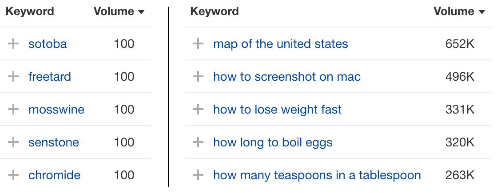

So it is not the length of a keyword that makes it a long-tail. It’s the search volume of that keyword.  

因此，不是关键字的长度使其成为长尾。这是该关键字的搜索量。

## What makes long-tail keywords so great?  

是什么让长尾关键字如此出色？

Here are three reasons why you should consider making long-tail keywords an integral part of your SEO strategy.  

以下是您应该考虑将长尾关键字作为 SEO 策略不可或缺的一部分的三个原因。

### Reason 1. Long-tail keywords are (generally) a lot less competitive  

原因 1. 长尾关键词（通常）的竞争力要低得多

Let’s say you’ve just launched a blog about cryptocurrencies.  

假设您刚刚发布了一个关于加密货币的博客。  

There are lots of popular keywords with high search volumes that could potentially drive LOADS of traffic to your blog:  

有许多具有高搜索量的热门关键字可能会为您的博客带来大量流量：

Those keywords are tempting to target. But let’s be real. What are the chances that your blog will rank for any of them anytime soon?  

这些关键字很容易成为目标。但让我们面对现实吧。您的博客很快会为其中任何一个排名的机会有多大？

All of the above keywords have a high [Keyword Difficulty](https://ahrefs.com/keyword-difficulty) (KD) score. This means it’ll be incredibly hard to get to the first page of Google for any of them. And if your website is brand new, that feat will be plain impossible.   

以上所有关键词都具有较高的关键词难度 (KD) 分数。这意味着它们中的任何一个都很难进入谷歌的第一页。如果您的网站是全新的，那将是不可能的。

Now let’s look at some of the less popular search queries for the topic of bitcoin:  

现在让我们看看一些不太受欢迎的比特币主题搜索查询：

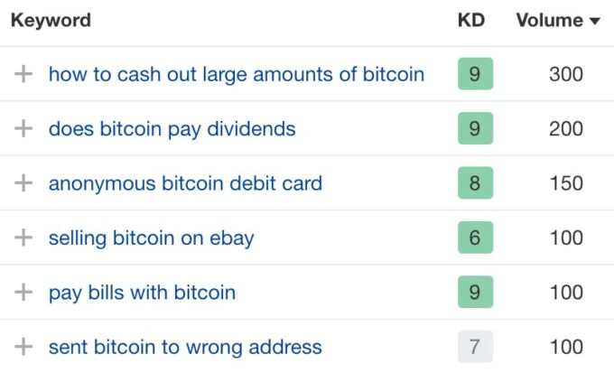

As you can see, this time, their KD score is low. This means that even a new website has a chance to rank in the top 10 search results and get a few visitors from those keywords.  

如您所见，这一次，他们的 KD 分数很低。这意味着即使是新网站也有机会排在前 10 名搜索结果中，并通过这些关键字获得一些访问者。

### Reason 2. Long-tail keywords are (generally) easier to address  

原因 2. 长尾关键词（通常）更容易找到

Let’s continue comparing the two sets of keywords above.   

我们继续对比上面两组关键词。

“How to buy bitcoin” seems like a rather straightforward question to answer. But if you look at the top-ranking page for that search query, it is actually 3,400 words long.   

“如何购买比特币”似乎是一个相当简单的问题。但是，如果您查看该搜索查询的排名靠前的页面，它实际上有 3,400 个词长。

Conversely, the top-ranking page for “how to cash out large amounts of bitcoin” is just 1,000 words long.  

相反，“如何提现大量比特币”的排名靠前的页面只有 1000 字长。

The thing is, the more general the search query is, the more details you’ll have to include when addressing it.  

问题是，搜索查询越笼统，您在处理它时必须包含的详细信息就越多。  

But if the search query is specific, you can often answer it rather briefly and still satisfy the searchers.  

但是，如果搜索查询是特定的，您通常可以相当简短地回答它，并且仍然能满足搜索者的需求。

In other words, creating content for long-tail keywords generally requires less work.  

换句话说，为长尾关键词创建内容通常需要更少的工作。

Other than that, you can actually look for groups of similar long-tail search queries and address them with pages that only have a few differences.   

除此之外，您实际上可以查找类似的长尾搜索查询组，并使用只有少数差异的页面来解决它们。

For example, check out the following group of keywords:  

例如，查看以下关键字组：

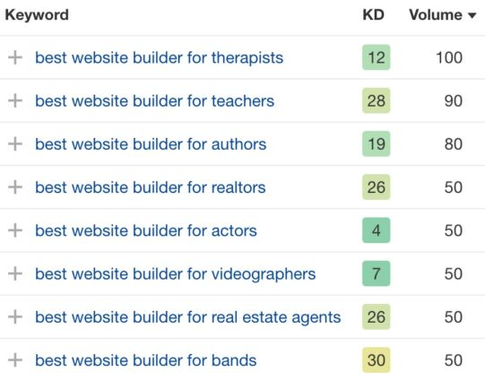

The same website builder software would likely suit therapists just as well as it would suit teachers or actors.  

相同的网站构建器软件可能既适合治疗师，也适合教师或演员。  

This means you can target all these different searches with pages that have 80% similar content, while the remaining 20% will be tailored to each user profile.  

这意味着您可以使用具有 80% 相似内容的页面来定位所有这些不同的搜索，而剩下的 20% 将针对每个用户个人资料进行定制。

In other words, you can easily create a dozen pages in one day to address those similar long-tail searches.  

换句话说，您可以轻松地在一天内创建十几个页面来解决那些类似的长尾搜索。

### Reason 3. There are LOTS of them  

原因 3。有很多

Yes, each individual long-tail keyword won’t open floodgates of traffic to your website.  

是的，每个单独的长尾关键字都不会打开您网站的流量闸门。  

But as you address more and more of them, the search traffic will eventually compound to something pretty substantial.  

但是随着您解决越来越多的问题，搜索流量最终会复合成相当可观的东西。

And since there are lots of long-tail keywords in pretty much every industry, you’re unlikely to suffer from a shortage of them.  

而且由于几乎每个行业都有很多长尾关键字，因此您不太可能遇到它们短缺的问题。

Back to my example of “best website builder for \_\_” keywords. A search in Ahrefs’ [Keywords Explorer](https://ahrefs.com/keywords-explorer) returns over a thousand of them:  

回到我的“\_\_ 的最佳网站建设者”关键字示例。在 Ahrefs 的关键字资源管理器中搜索会返回一千多个关键字：

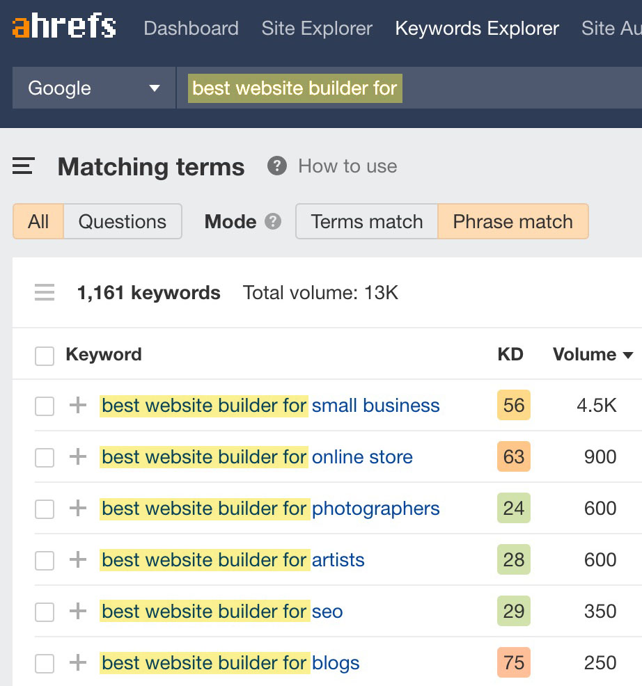

## How to find long-tail keywords 如何找到长尾关键词

There’s a number of methods you can use to find long-tail keywords. Some are more tedious than others, [some are a tad “unconventional,”](https://ahrefs.com/blog/keyword-ideas/) and some are just plain incorrect.  

您可以使用多种方法来查找长尾关键字。有些比其他的更乏味，有些有点“非常规”，有些则完全不正确。

Let’s start with an incorrect one.  

让我们从一个不正确的开始。

### 1\. Use Google Autosuggest… NOT 1\. 使用谷歌自动提示……不是

Some SEO experts advise you to source long-tail keywords from Google Autosuggest by entering your target keyword followed by different letters of the alphabet.  

一些 SEO 专家建议您通过输入目标关键字后跟不同的字母表来从 Google Autosuggest 获取长尾关键字。

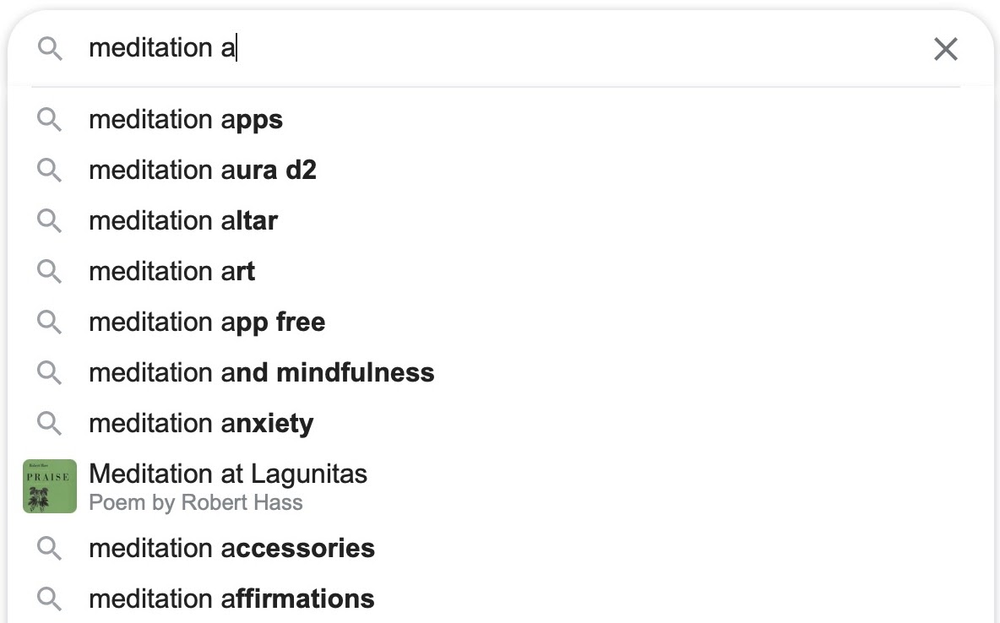

Well, Google Autosuggest is a feature designed to give you quick access to **popular** search queries. So if we check the search volumes of keywords in the above screenshot, most of them will have a rather decent number of searches.  

好吧，Google Autosuggest 是一项旨在让您快速访问热门搜索查询的功能。因此，如果我们检查上面屏幕截图中关键字的搜索量，大多数关键字的搜索量都相当可观。

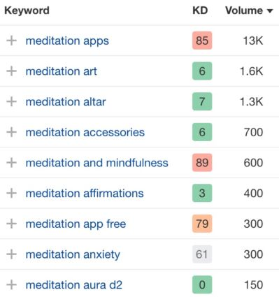

In other words, Google Autosuggest is much more likely to offer you highly popular search queries rather than the coveted long-tails.  

换句话说，Google Autosuggest 更有可能为您提供非常受欢迎的搜索查询，而不是令人垂涎的长尾词。

The same goes for online tools like [Answer The Public](https://answerthepublic.com/) or [Soovle](https://soovle.com/) that scrape Autosuggest to generate their lists of keyword ideas. A large number of their keyword suggestions will turn out to be rather popular and competitive.  

Answer The Public 或 Soovle 等在线工具也是如此，它们会抓取 Autosuggest 以生成关键字提示列表。他们的大量关键字建议将变得相当受欢迎和具有竞争力。

### 2\. Use Ahrefs’ Keywords Explorer 2\. 使用 Ahrefs 的关键词浏览器

Unlike the previous one, this method doesn’t require any tedious manual work. Just search for any word that defines your niche in [Keywords Explorer](https://ahrefs.com/keywords-explorer) and use the search volume filter to instantly see thousands of long-tail keywords.  

与前一种方法不同，此方法不需要任何繁琐的手动工作。只需在关键字资源管理器中搜索任何定义您的利基的词，然后使用搜索量过滤器即可立即查看数以千计的长尾关键字。

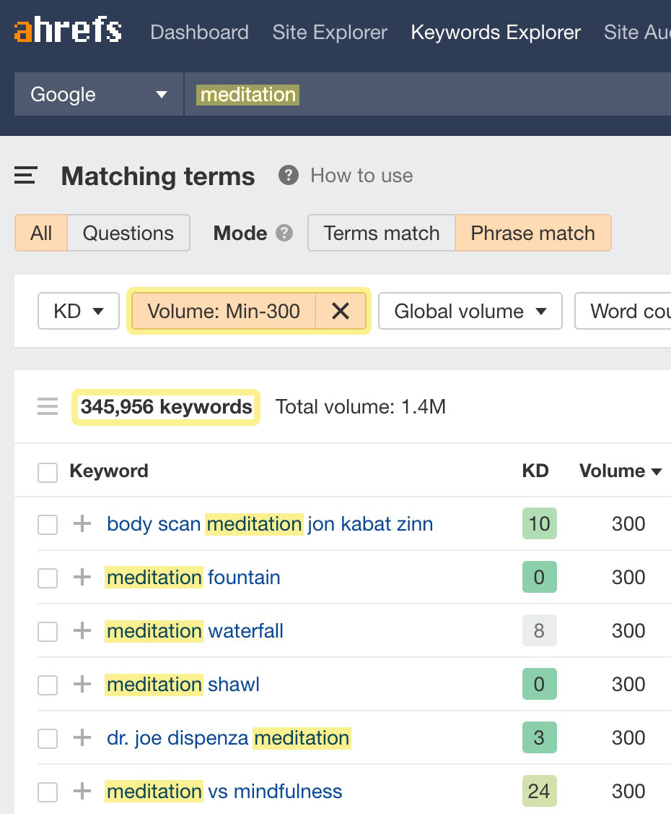

If your website is brand new and barely has any “[authority](https://ahrefs.com/website-authority-checker),” then I recommend you to use the KD filter, which helps you find the least competitive keywords.  

如果你的网站是全新的，几乎没有任何“权限”，那么我建议你使用 KD 过滤器，它可以帮助你找到竞争力最低的关键词。

Also, make sure to try the “Questions” button. It often returns some cool long-tail search queries that are phrased as questions:  

另外，请务必尝试“问题”按钮。它经常返回一些很酷的长尾搜索查询，这些查询被表述为问题：

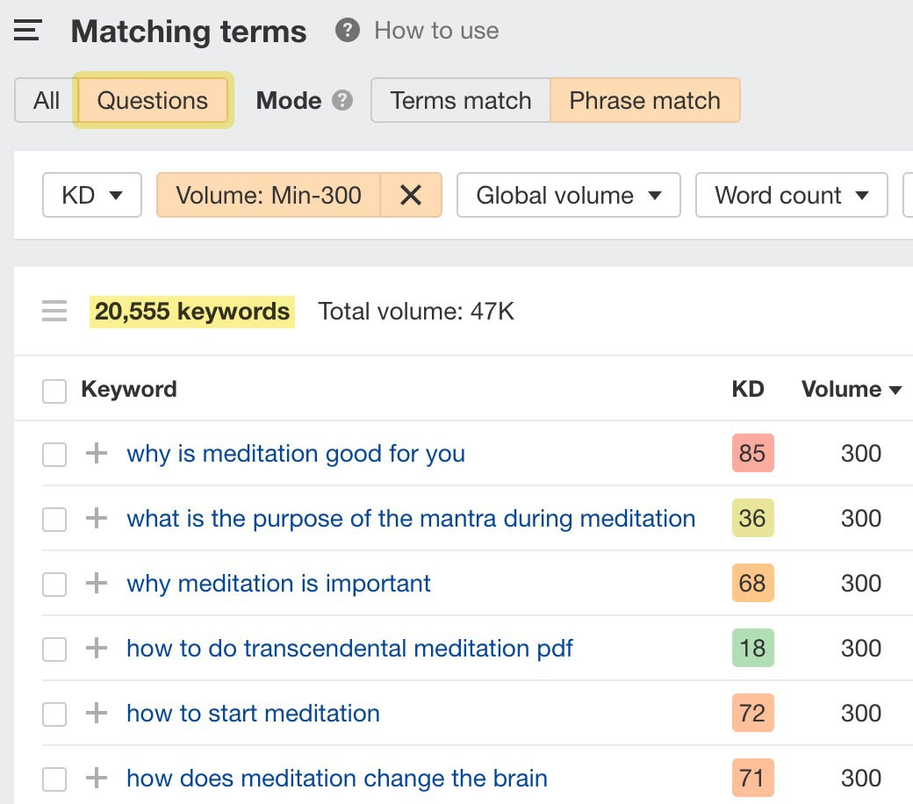

### 3\. See which keywords your competitors are ranking for  

3\. 查看竞争对手排名的关键词

Another great source of long-tail keywords comes from your competitors. Ahrefs’ [Site Explorer](https://ahrefs.com/site-explorer) will help you see what long-tail keywords they are ranking for.  

长尾关键词的另一个重要来源来自您的竞争对手。 Ahrefs 的 Site Explorer 将帮助您查看他们排名的长尾关键字。

Just take a website belonging to your competitor, plug it into [Site Explorer](https://ahrefs.com/site-explorer) and go to the **Organic keywords** report to see which long-tail keywords are bringing traffic to their website:  

只需拿一个属于您的竞争对手的网站，将其插入 Site Explorer 并转到有机关键字报告，看看哪些长尾关键字为他们的网站带来了流量：

Repeat that with 5-10 of your competitors’ websites, and you’ll mine enough long-tail keyword ideas to keep you busy for months to come.  

对 5-10 个竞争对手的网站重复此操作，您将挖掘出足够多的长尾关键词创意，让您在接下来的几个月里保持忙碌。

### 4\. Browse Reddit, Quora, and niche forums  

4\. 浏览 Reddit、Quora 和小众论坛

Whenever people visit Google and fail to find a good answer to their question, they ask it at places like Quora and Reddit.  

每当人们访问谷歌但找不到问题的好答案时，他们就会在 Quora 和 Reddit 等地方提问。

For example, I was browsing the “marketing” topic on Quora and saw this post:  

例如，我在 Quora 上浏览“营销”主题时看到了这篇文章：

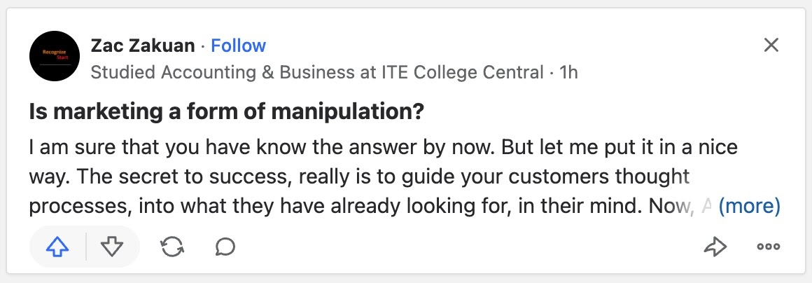

A quick check in [Keywords Explorer](https://ahrefs.com/keywords-explorer) revealed that “marketing manipulation” is actually a long-tail keyword with a low KD score.  

快速检查关键字资源管理器后发现，“营销操纵”实际上是一个 KD 分数较低的长尾关键字。

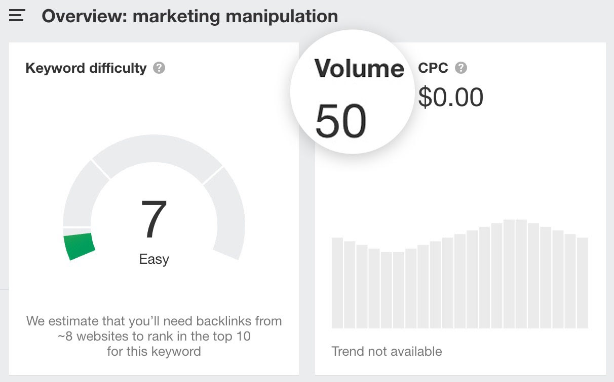

The upside of this method is those forum threads may have some good discussions, which can be useful when creating a piece of content on that topic.  

这种方法的好处是那些论坛线程可能会有一些很好的讨论，这在创建关于该主题的内容时很有用。

The downside is mining long-tail keywords from forums is a rather tedious process. And you’ll still have to use an SEO tool like [Keywords Explorer](https://ahrefs.com/keywords-explorer) to check for the search volumes and KD of your keyword ideas.  

缺点是从论坛中挖掘长尾关键词是一个相当乏味的过程。而且您仍然必须使用 Keywords Explorer 等 SEO 工具来检查搜索量和关键字创意的 KD。

But the thing is, that same keyword can easily be discovered via [Keywords Explorer](https://ahrefs.com/keywords-explorer) in the first place:  

但问题是，首先可以通过关键字资源管理器轻松发现相同的关键字：

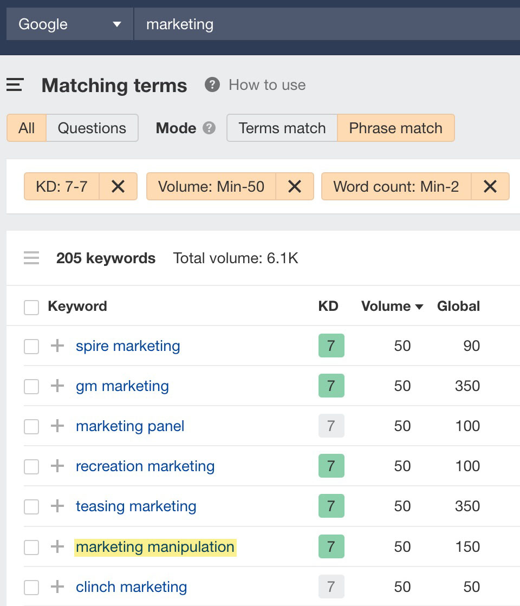

## The two types of long-tail keywords  

长尾关键词的两种类型

Not all long-tail keywords are the same. Some of them represent a unique search query, while others are merely a less popular variation of a more popular search query.  

并非所有的长尾关键词都是相同的。其中一些代表独特的搜索查询，而另一些则只是更受欢迎的搜索查询的不太受欢迎的变体。

We call the former “topical long-tail keywords” and the latter “supporting long-tail keywords.”  

我们称前者为“话题长尾关键词”，后者为“支撑长尾关键词”。

### Supporting long-tail keywords 支持长尾关键词

Let me explain it with an example. “Best healthy treats for dogs” is definitely a long-tail keyword because it gets just 100 searches per month:  

让我用一个例子来解释它。 “Best healthy treats for dogs”绝对是一个长尾关键字，因为它每月只有 100 次搜索：

But there are a few other search queries that mean the same thing while having a much bigger search volume:  

但是还有一些其他搜索查询具有相同的含义，同时具有更大的搜索量：

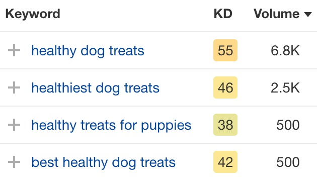

If you search for each of them in Google, you’ll discover the same pages are ranking at the top for each of these keywords.   

如果你在谷歌中搜索它们中的每一个，你会发现相同的页面在这些关键字中的每一个都排名靠前。

Google is smart enough to understand that different people phrase their searches differently while they look for the exact same thing.  

谷歌足够聪明，可以理解不同的人在寻找完全相同的东西时会以不同的方式表达他们的搜索。  

Therefore, it ranks the same set of pages for all these keyword variations.  

因此，它对所有这些关键字变体的同一组页面进行排名。

This means if your page starts ranking for a popular search query like “healthy dog treats” (6.8k searches), it will **automatically** rank for all the query’s long-tail variations. So you don’t need to create individual pages for each long-tail variation. Rather, you should target them all with a single page.  

这意味着如果您的页面开始针对“健康狗粮”（6.8k 搜索）等热门搜索查询进行排名，它将自动针对所有查询的长尾变体进行排名。因此，您无需为每个长尾变体创建单独的页面。相反，您应该将它们全部定位到一个页面。

But how do you know if a long-tail keyword you’re looking at is a part of a broader topic or not?  

但是你怎么知道你正在查看的长尾关键字是否属于更广泛的主题？

Well, here at Ahrefs, we have developed a unique feature just for that.  

那么，在 Ahrefs，我们为此开发了一项独特的功能。

It’s called **Parent Topic**. 它被称为父主题。

Whenever you enter a keyword into [Keywords Explorer](https://ahrefs.com/keywords-explorer), we check the top-ranking page for that keyword and see if there’s a more popular search query this page is ranking for.  

每当您在 Keywords Explorer 中输入关键字时，我们都会检查该关键字的排名靠前的页面，看看是否有更受欢迎的搜索查询为该页面排名。

This is how it looks for “best healthy treats for dogs”:  

这就是它寻找“狗的最佳健康零食”的方式：

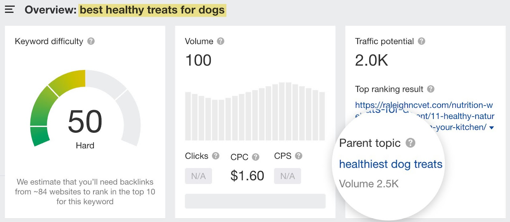

As you can see in the screenshot above, this long-tail keyword has a much more popular variation: “healthiest dog treats” (2.5k searches).  

正如您在上面的屏幕截图中看到的，这个长尾关键词有一个更受欢迎的变体：“healthiest dog treats”（2500 次搜索）。  

And if you manage to rank for that search query, you’ll automatically rank for its supporting long-tail keyword too.  

而且，如果您设法对该搜索查询进行排名，您也会自动为其支持的长尾关键字进行排名。

### Topical long-tail keywords 话题长尾关键词

Now let’s look at a different kind of long-tail keyword: “fly bites on dogs ears.”  

现在让我们看看另一种长尾关键字：“狗耳朵上的苍蝇叮咬”。

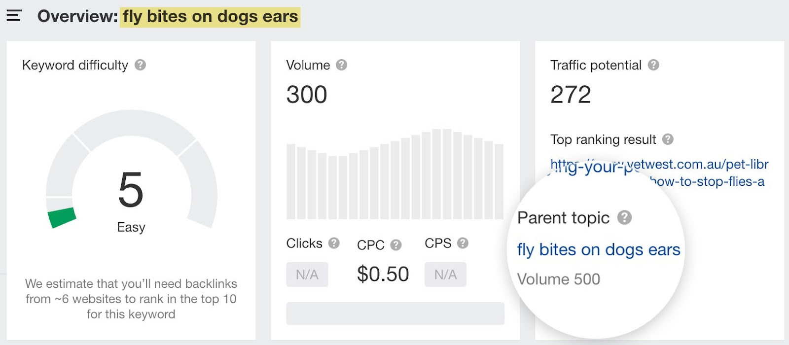

This time, the Parent Topic is the same as the original keyword. This means our keyword is actually the most popular way to search for this thing.  

这次，父主题与原始关键字相同。这意味着我们的关键词实际上是搜索这个东西最流行的方式。  

And you can safely target this long-tail keyword with a dedicated page.  

您可以使用专用页面安全地定位此长尾关键字。

And once you manage to rank for this topical long-tail keyword, you’ll automatically rank for all the less popular “supporting” search query variations:  

一旦你设法为这个主题长尾关键词排名，你就会自动为所有不太受欢迎的“支持”搜索查询变体排名：

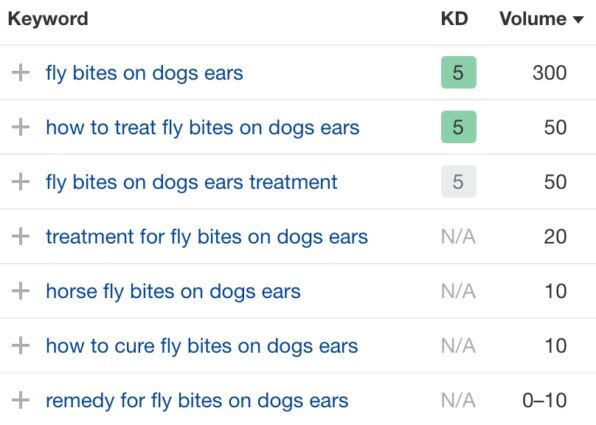

But unfortunately, things aren’t always this straightforward.  

但不幸的是，事情并不总是那么简单。

Let’s examine one last search query: “natural sleep aid for dogs.”  

让我们检查最后一个搜索查询：“狗的天然助眠剂”。

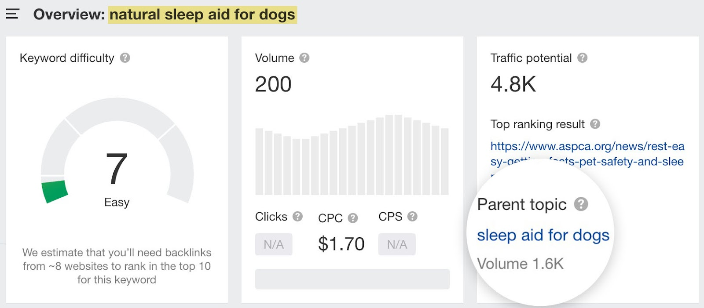

The Parent Topic suggests this long-tail keyword is just a variation of the search query “sleep aid for dogs”(1.6k searches).  

Parent Topic 建议这个长尾关键词只是搜索查询“sleep aid for dogs”（1.6k 搜索）的变体。

But I think the word “natural” in the original keyword actually makes it distinct from the suggested Parent Topic. People who search for it seem to be looking for a **natural** alternative to the usual pharmaceutical options.  

但我认为原始关键字中的“自然”一词实际上使其与建议的父主题不同。寻找它的人似乎是在寻找一种天然的替代品来替代通常的药物选择。

And if we look at the top search results for that long-tail keyword, none of them seems to be talking about “**natural** sleep aid.” Rather, it talks about “sleep aids” in general:  

如果我们查看该长尾关键词的热门搜索结果，他们似乎都没有在谈论“天然助眠剂”。相反，它一般谈论“睡眠辅助”：

So I’d argue it does make sense to create a dedicated piece of content to target the keyword “**natural** sleep aid for dogs.” There’s a good chance it will actually rank #1 for that query—in the absence of any other articles that cover that specific topic.  

因此，我认为创建专门的内容来针对关键字“狗的天然助眠剂”确实是有意义的。如果没有任何其他文章涵盖该特定主题，它很有可能会在该查询中排名第一。

In other words, you shouldn’t always blindly trust whatever the Parent Topic tells you. It’s just a computer algorithm and has its flaws and limitations.  

换句话说，您不应该总是盲目相信父主题告诉您的任何内容。它只是一种计算机算法，有其缺陷和局限性。  

It is always a good idea to analyze the top-ranking pages for your keyword and figure out if your search query represents a distinct topic or a part of a broader topic.  

分析关键字的排名靠前的页面并确定您的搜索查询是代表一个不同的主题还是更广泛主题的一部分始终是一个好主意。

## Final thoughts

And that is all I have to say about long-tail keywords and what makes them so awesome.  

这就是我要说的关于长尾关键词的全部内容，以及是什么让它们如此出色。

Hopefully, this article will help you fine-tune your SEO strategy and accelerate the growth of search traffic to your website.  

希望本文能帮助您微调您的 SEO 策略并加速网站搜索流量的增长。

If you have any further questions, feel free to ping me [on Twitter](https://twitter.com/timsoulo).  

如果您有任何其他问题，请随时在 Twitter 上联系我。
