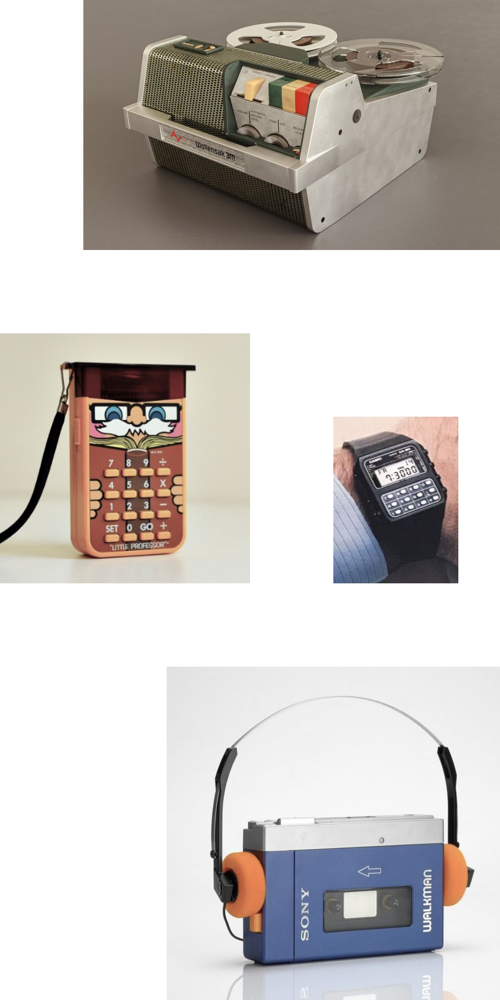
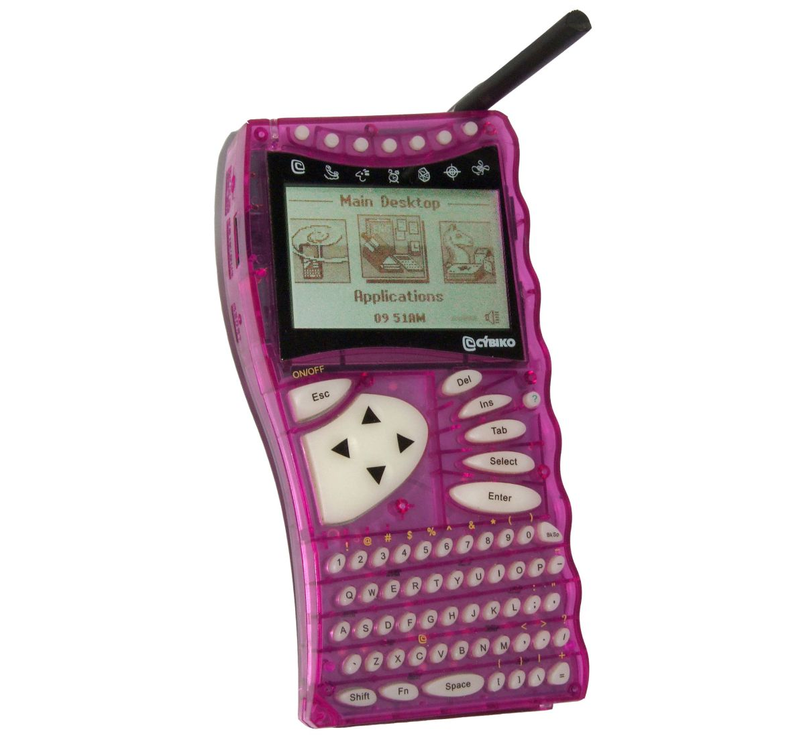
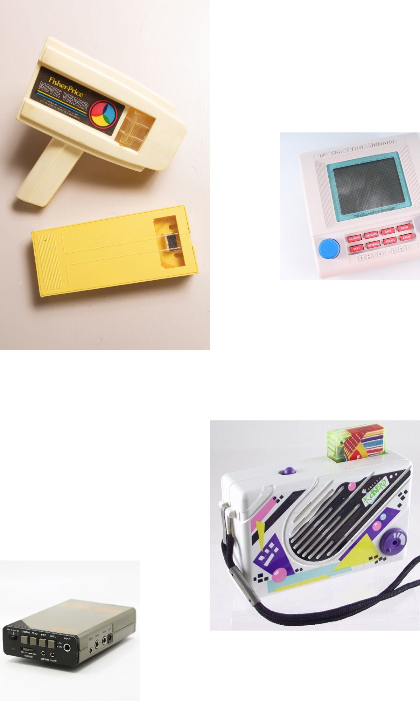
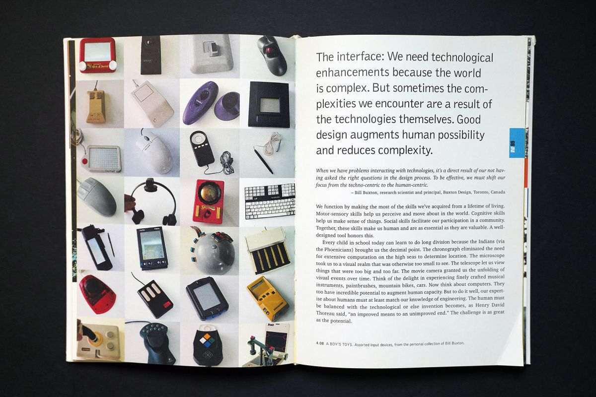
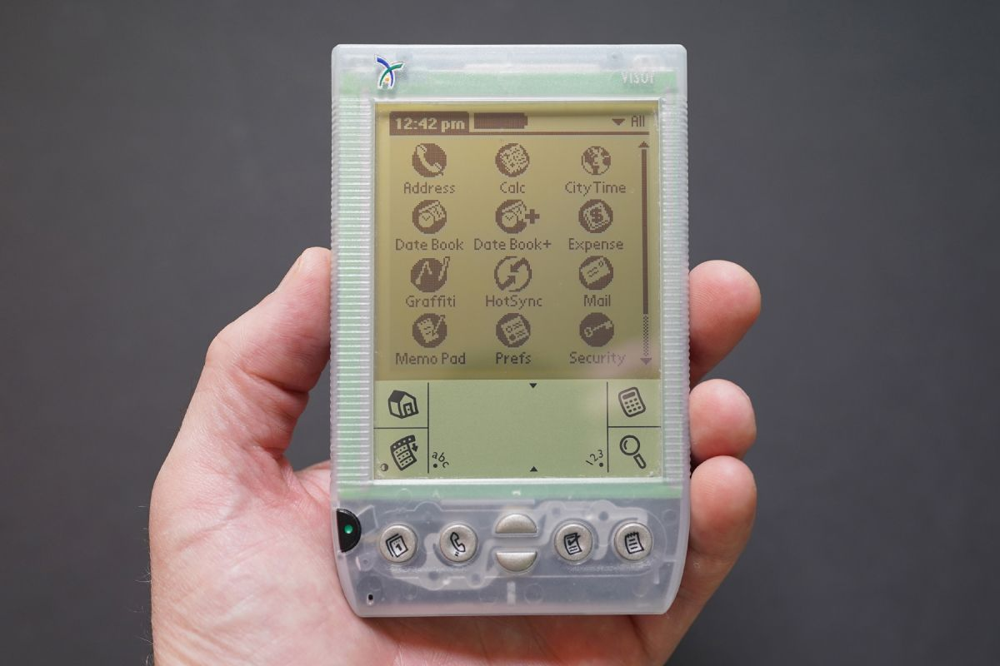
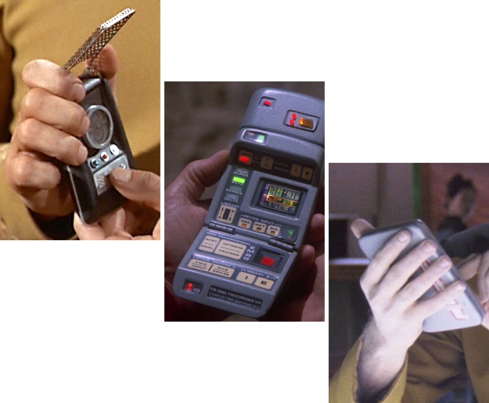
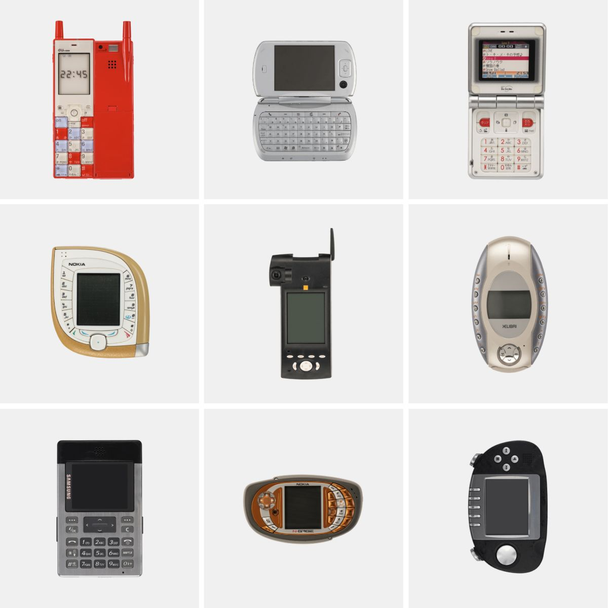
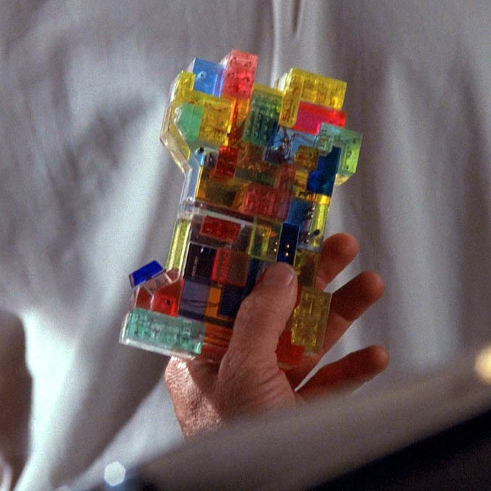
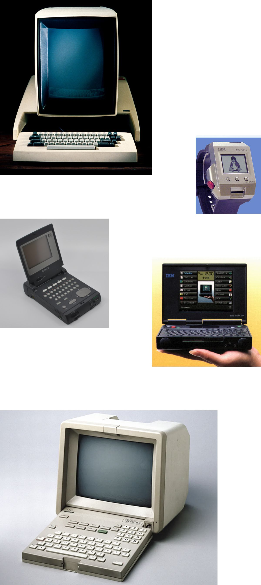

## A personal machine balances access to another world with the kinds of limits and boundaries that make a thing private.  

个人电脑在访问另一个世界的同时，也兼顾了各种限制和界限，从而使事物具有私密性。

A lifelong fascination with technology begins with a single object.  

对技术的终生痴迷始于一件物品。

Think back to when you were a child, to when you first encountered something you could hold in your hand that _held you_ in awe. Perhaps you thought to yourself, “Wow, _this_ does _that_?!”  

回想一下，当你还是个孩子的时候，当你第一次遇到可以拿在手上让你惊叹不已的东西的时候。也许你会想，"哇，这东西还能这样！"

I asked as many people as I could what that thing was for them. Age, of course, had a lot to do with the range of replies I received.  

我向尽可能多的人询问了他们的感受。当然，年龄与我收到的答复的范围有很大关系。  

The older people told me about pull-string “talking” toys, reel-to-reel tape players, and the family’s first color television.  

上了年纪的人告诉我拉绳 "会说话 "的玩具、磁带录音机和家里的第一台彩色电视机。  

People my age recalled things that I, too, had used from early on — gadgets like the Speak and Spell, the Sony Walkman, Atari consoles, calculator watches, and more.  

与我同龄的人回忆起我很早就使用过的东西--"说和拼"、索尼随身听、雅达利游戏机、计算器手表等小玩意儿。  

Younger people seemed to not understand the question, at least not in the same way those of us of Generation X or prior did.  

年轻人似乎不理解这个问题，至少和我们 X 代或更早的人不一样。  

I got answers, but they often came with explanations like, “I dunno…everything was technology…this was just my _favorite_ thing.” And, at least in my observation, most of those favorite things were much closer to the sort of personal device _everyone_ has today.  

我得到了答案，但他们的解释往往是 "我不知道......一切都是科技......这只是我最喜欢的东西"。而且，至少在我的观察中，这些最喜欢的东西大多更接近于今天每个人都拥有的那种个人设备。  

Things like the LeapFrog Leapster (a portable gaming system), the Sidekick (a mobile phone), and the iPod — all mentioned — not only have counterparts still in wide use today but were created at a time when personal computing was already ubiquitous.  

在这里提到的 LeapFrog Leapster（一种便携式游戏系统）、Sidekick（一种手机）和 iPod 等产品，不仅有今天仍在广泛使用的同类产品，而且是在个人计算机已经无处不在的时代诞生的。

Perhaps that is the key: there’s a significant generational line dividing those who came of age before the internet transformed what we mean by “personal devices” and those who came of age after.  

也许这就是关键所在：在互联网改变我们对 "个人设备 "的理解之前出生的人和之后出生的人之间，存在着明显的代沟。  

That we already knew. Its impact on technological worldviews remains to be fully understood.  

我们已经知道了。它对技术世界观的影响仍有待全面了解。

My younger brother, born a decade later than I was, mentioned an interesting object. It was the [Cybiko](https://en.wikipedia.org/wiki/Cybiko), a Russian-made PDA for kids.  

比我晚十年出生的弟弟提到了一个有趣的东西。那是一款俄罗斯制造的儿童掌上电脑 Cybiko。  

He recalled that, though it looked cool and could run games and play music, the feature that astounded him was that it essentially generated a local social network, allowing users to wirelessly chat with one another at a range of up to 100 meters.  

他回忆说，虽然它看起来很酷，可以运行游戏和播放音乐，但令他震惊的功能是，它基本上可以生成一个本地社交网络，允许用户在 100 米范围内无线聊天。  

It was like having a text-based walkie-talkie in your pocket.  

这就像在口袋里装了一个文本对讲机。

What a cool idea — especially at a time when a ten-year-old _could_ have freely communicated over the internet or mobile network but whose parents would have wisely prevented it.  

这是一个多么酷的想法--尤其是在一个十岁的孩子可以自由地通过互联网或移动网络进行交流的时代，但他的父母会明智地阻止他这样做。

I would have been over twenty years old when my brother received his Cybiko.  

哥哥收到 Cybiko 时，我已经二十多岁了。  

But it would have been just the sort of personal device I’d have found fascinating then, and still do today.  

不过，我当时就会觉得这种个人设备很吸引人，今天依然如此。

There’s something about the _personal_ device that I have always found fascinating and now find to be almost mysterious. But to be _personal_ it has to be a certain kind of device — the kind that balances access to another world with the kinds of limits and boundaries that make a thing private.  

我一直觉得个人设备很迷人，现在又觉得它近乎神秘。但要成为个人设备，它必须是一种特定的设备--在进入另一个世界的同时，又能兼顾各种限制和界限，使之成为私人物品。  

That balance is something I’ve always been able to point to in particular objects — _this_ has it, but _that_ does not — but describing it on its own, as a set of rules or characteristics, has always eluded me. But, for me, a _personal_ device is defined by this balance, not by virtue of being the thing in my pocket and not the one in yours.  

我总能从一些特定的物品中发现这种平衡--这个有，但那个没有--但要把它单独描述成一套规则或特征，我却总是无从下手。但是，对我来说，个人设备就是由这种平衡来定义的，而不是因为它是我口袋里的东西，而不是你口袋里的东西。

I think this notion of a personal technology is deeply meaningful. So I’d like to find a way to explain it.  

我认为这种个人技术的概念意义深远。因此，我想找到一种解释它的方法。

Nearly everyone I asked returned the question — _That was the gadget for me… So, what was yours?_  

我问的每个人几乎都回答了这个问题--那就是我的小工具......那么，你的小工具是什么呢？

I can point to my own origin-objects — gadgets like the Fisher Price Movie Viewer, the Pocket Rocker, the Etch A Sketch Animator, or, from a bit later, the Arion Hot-Watt II — and describe why they had that _thing_. Besides being quirky, niche products, they all let me enter another world that, at times, seemed both bigger and smaller than this one.  

我可以指着自己的起源物品--费雪牌电影浏览器、口袋摇摇乐、Etch A Sketch Animator，或者稍后的 Arion Hot-Watt II 等小玩意儿--描述他们为什么会有那样的东西。除了奇特的小众产品之外，它们都让我进入了另一个世界，这个世界有时看起来比这个世界更大，有时又比这个世界更小。  

It was as if that world was outside of this one, made accessible by the push of a button and, _at the same time_, that it sprang into existence as a me-sized bubble universe, Population: 1. This is the paradox of the personal device.  

仿佛那个世界就在这个世界之外，只需按下一个按钮就能进入，同时，它又像一个我大小的气泡宇宙--人口：1.这就是个人设备的悖论。

The tension between knowing that the world a personal device creates has boundaries defined by its code and materials and not knowing exactly what they are is one that, when kept in balance, activates the imagination.  

我们知道，个人设备所创造的世界有其代码和材料所界定的边界，但又不知道这些边界到底是什么，这种矛盾在保持平衡的情况下会激发想象力。  

It allows for exploration, both of the object and through the object.  

它允许对物体和通过物体进行探索。

People of a certain age who remember spending hours exploring Hyrule, the world of [The Legend of Zelda](https://en.wikipedia.org/wiki/The_Legend_of_Zelda_(video_game)), will immediately understand this feeling. You could explore the world, and you could play the game. I’m not sure I ever tired of exploring enough to actually play the game.  

上了一定年纪的人，如果还记得在《塞尔达传说》的世界 "海鲁尔"（Hyrule）中探索了几个小时，就会立刻理解这种感觉。你可以探索世界，也可以玩游戏。我不确定自己是否厌倦了探索，以至于真的玩起了游戏。

The most magical of personal devices are those which offer access to the experience of infinitude without measuring it for you. The unknown is the stuff of imagination.  

最神奇的个人设备是那些无需测量就能让你体验无限的设备。未知是想象的源泉。

That is the opposite of our most common device-based experiences today.  

这与我们今天最常见的基于设备的体验恰恰相反。  

Whether you use a phone, tablet, laptop, or any other computer, the digital “world” today is always defined by an acute awareness of measure. Of _more_. But _more_ is the easiest way to obstruct the imagination.  

无论你使用的是手机、平板电脑、笔记本电脑还是其他任何电脑，如今的数字 "世界 "总是被一种敏锐的测量意识所定义。更多。但 "多 "是阻碍想象力的最简单方式。  

Persistent input keeps cognition at its lower levels — maintaining attention, storing memory, applying perception, and processing language — without allowing a transition to thought and learning.  

持续的输入会使认知停留在较低的水平--保持注意力、储存记忆、应用感知和处理语言--而无法过渡到思考和学习。

The best personal device supports thought — with it, within it, and most importantly, within you. Carl Jung once [wrote](https://www.google.com/books/edition/Civilization_in_Transition/I9jfBQAAQBAJ) that “in each of us there is another whom we do not know.” The purpose of introspection, for Jung, was to become acquainted with that person — to deepen our understanding of ourselves so that we may _be_ more fully ourselves.  

最好的个人设备支持思想--用它，在它里面，最重要的是，在你自己里面。卡尔-荣格曾写道："在我们每个人心中，都有另一个我们不认识的人。对荣格来说，反省的目的就是要了解那个人--加深我们对自己的了解，从而让我们更完整地做自己。

What if technology had the same purpose?  

如果技术也有同样的目的呢？

What if personal technology saw imagination — open, unresolved, interior, and subjective as it is — not just as a byproduct of use but as a purpose for it; as equal to utility, communication, or entertainment?  

如果个人技术将想象力--开放的、悬而未决的、内在的和主观的想象力--不仅视为使用的副产品，而且视为使用的目的；视为与实用性、通信或娱乐同等重要，那会怎样？

## Solutions to Complexity  复杂性的解决方案

I have been thinking about these pages ↓ for two decades.  

二十年来，我一直在思考这几页↓。

They come from Bruce Mau’s _[Massive Change](https://www.brucemaudesign.com/work/massive-change)_, a text that — unlike so many other books about design, systems, technology, and human culture that speak loudly to their time and then never again — remains important.  

它们来自布鲁斯-毛（Bruce Mau）的《巨变》（Massive Change）一书，这本书与其他许多关于设计、系统、技术和人类文化的书籍不同，它在其所处的时代大放异彩，但却一去不复返。  

Has as much to say to today’s world as it did nearly twenty years ago, if not more. Was prescient. Is prophetic.  

它对当今世界的启示与近二十年前一样多，甚至更多。有先见之明。具有先见之明。

Read what Mau and those who comprised the Institute Without Boundaries had to say here, and then remember that it was written twenty years ago — when the most popular mobile phone was the [Nokia 1100](https://en.wikipedia.org/wiki/Nokia_1100), Windows XP had just been released, the iTunes Store had opened for the very first time, and few people had ever experienced mobile computing.  

请阅读毛和无国界研究所的成员们在这里所说的话，然后记住这是二十年前写的，当时最流行的手机是诺基亚 1100，Windows XP 刚刚发布，iTunes Store 首次开放，很少有人体验过移动计算。  

It would take a few years until laptop sales would exceed desktop; a few more before smartphone sales would exceed computers. It was a different time.  

再过几年，笔记本电脑的销量就会超过台式机；再过几年，智能手机的销量就会超过电脑。这是一个不同的时代。

> “The interface: We need technological enhancements because the world is complex. But sometimes the complexities we encounter are a result of the technologies themselves.  
> 
> "界面：我们需要技术的提升，因为世界是复杂的。但有时我们遇到的复杂问题是技术本身造成的。  
> 
> Good design augments human possibility and reduces complexity…Think of the delight in experiencing finely crafted musical instrument, paintbrushes, mountain bikes, cars.  
> 
> 好的设计能增加人类的可能性，减少复杂性......想想在体验精雕细琢的乐器、画笔、山地自行车和汽车时的喜悦吧。  
> 
> Now think about computers. They too have incredible potential to augment human capacity.  
> 
> 现在再想想计算机。它们在增强人的能力方面也具有惊人的潜力。  
> 
> But to do it well, our expertise about humans must at least match our knowledge of engineering.  
> 
> 但要做好这项工作，我们对人类的专业知识至少必须与我们的工程知识相匹配。  
> 
> The human must be balanced with the technological or else invention becomes, as Henry David Thoreau said, ‘an improved means to an unimproved end.’ The challenge is as great as the potential.”  
> 
> 人类必须与技术保持平衡，否则发明就会像亨利-戴维-梭罗所说的那样，成为'达到未改进目的的改进手段'。挑战与潜力同样巨大"。

These words were a powerful prompt. They could have easily opened the pitch for any number of devices of the time — either imaginary or in production.  

这些话是一个强有力的提示。它们可以很容易地为当时的任何一种设备--无论是想象中的还是生产中的设备--打开销路。  

Steve Jobs could have cited them [three years later](https://www.youtube.com/watch?v=x7qPAY9JqE4), in between the refrain, “an iPod, a phone, an internet communicator”. He could have pointed to these pages when he said, “Are you getting it?  

史蒂夫-乔布斯本可以在三年后，在 "iPod、手机、互联网通讯器 "的重复之间引用它们。当他说："你明白了吗？  

These are not three separate devices!”  

这不是三个独立的设备！"

From the view of twenty years ago, the solution to complexity was complexity dressed up like simplicity.  

从二十年前的观点来看，复杂性的解决方案就是把复杂性装扮成简单性。  

A better machine was one that replaced three and still “just worked.” Our expertise about humans suggested that we wanted to do more with less and our knowledge of engineering was able to deliver that.  

更好的机器是可以取代三台机器，而且还能 "正常工作"。我们对人类的了解表明，我们希望用更少的资源做更多的事情，而我们的工程学知识能够做到这一点。

But twenty years of increasingly technological everyday life has me reinterpreting Mau’s words on the interface.  

但二十年来日益科技化的日常生活让我重新理解了毛泽东关于界面的话语。

Now, when I read of the need for technological solutions to complexity, I think less of gathering power at my fingertips and more about getting distance from it.  

现在，当我读到需要用技术来解决复杂问题时，我想到的不是把力量聚集在指尖，而是如何远离它。  

When I think about the delight in experiencing a finely crafted object, I think less about features and more about feel.  

当我想到体验精雕细琢的物品所带来的愉悦时，我想到的更多的是感觉，而不是功能。

When I read that passage, the words that once stood out — enhance, augment, engineering — recede, while others protrude with a new urgency: possibility, human, balance.  

当我读到这段话时，那些曾经引人注目的词语--"增强"、"增大"、"工程"--逐渐退去，而另一些词语则以新的紧迫感凸显出来："可能性"、"人类"、"平衡"。

In hindsight, the smartphone tipped the scales in favor of technology. It did not balance the human with the technological.  

事后看来，智能手机的天平倾向于技术。它没有平衡人类与技术之间的关系。  

Of course, we wouldn’t really know that until later, and truth be told, plenty aren’t sure it’s even so today. For me, however, _it is so_; the debate is no longer interesting.  

当然，我们要到后来才能真正知道这一点，而且说实话，很多人甚至不确定今天是否如此。不过，对我来说，事实如此；争论已不再有趣。  

But an effort to continue the process of invention, continue to calibrate our balance of the human and the technological, continue to imagine what the things we carry can and should do for us and what worlds they create — that is interesting.  

但是，努力继续发明创造的进程，继续调整我们在人类和技术之间的平衡，继续想象我们携带的东西能为我们做什么，应该为我们做什么，它们创造了怎样的世界--这才是有趣的。

In 2003, the idea that a music player, a phone, a computer, and a camera would all be the same object small enough to fit in your pocket was a dream worthy of pursuit.  

2003 年，将音乐播放器、手机、电脑和照相机整合为一个小巧的物体，并将其装入口袋，这是一个值得追求的梦想。  

In 2023, it isn’t the object that is the problem, it’s the world that object has created around it.  

在 2023 年，问题不在于物体，而在于物体所创造的世界。  

It’s a world of perpetual access and persistent distraction, of vamping and voyeurism, of want and waste, of noise and never being alone.  

这是一个永无休止地接触和持续分心的世界，是一个恣意妄为和偷窥的世界，是一个匮乏和浪费的世界，是一个喧闹和永不孤独的世界。  

That one little object wraps us in an inhuman aura that we are socially-pressured to deny as a luddite metaphor. But _it is there_. It’s invisible, but it may as well be a mechsuit. The world we make _now_ is for living like _that_.  

这一个小东西将我们包裹在非人的光环中，而我们却迫于社会压力，将其视为一种愚昧的隐喻而加以否认。但它确实存在。它是无形的，但也可能是一件机械服。我们现在创造的世界，就是为这样的生活而存在的。

But it doesn’t have to be. It wasn’t always.  

但并非必须如此。并不总是这样。

Our identity as humans-who-compute is probably irreversible. But our experience as slaves to the everything machine can be changed — should be.  

我们作为 "会计算的人类 "的身份可能是不可逆转的。但我们作为万物机器奴隶的体验是可以改变的，而且应该改变。

Which, after all, is the more appealing metaphor to wrap oneself in — a mechsuit or a bubble universe of one? Which affords the greatest mobility?  

毕竟，哪种隐喻更能吸引人把自己包裹起来--是机械装甲还是一个泡泡宇宙？哪个能提供最大的机动性？  

Which is most pliable to the growth of the interior — to the person inside?  

哪一种最适合内在的成长--适合内在的人？

## “The Dream of the Personal Machine”  

"个人机器之梦"

Kyle Chayka is working on a book that sounds like it may make a good case for my invisible mechsuit world. In a post titled, “[The dream of the personal machine](https://kylechayka.substack.com/p/the-dream-of-the-personal-machine),” Chayka writes:  

凯尔-查伊卡（Kyle Chayka）正在撰写一本书，听起来可能会为我的隐形机甲世界提供一个很好的案例。在一篇题为 "个人机器的梦想 "的文章中，查卡写道

> “My book is so much about how technology dictates culture.  
> 
> "我的书非常关注技术如何支配文化。  
> 
> The devices that we use aren’t just accessories to culture or windows that we consume things through; they are collaborators, gateways, and molds…the idea of a personal computer had to be invented, manufactured, and marketed.  
> 
> 我们使用的设备不仅仅是文化的附属品，也不仅仅是我们消费事物的窗口；它们是合作者、通道和模具......个人电脑的想法必须经过发明、制造和营销。  
> 
> We had to imagine computers as personal machines.”  
> 
> 我们不得不把计算机想象成个人机器"。

This is an important point. We _could_ live in a world where computing is a public works — where terminals to central processing work like telephones used to.  

这一点非常重要。我们可以生活在这样一个世界里：计算是一项公共工程--连接中央处理器的终端就像过去的电话一样工作。  

You can pick them up or put them down, but nothing inside of them is yours. But we don’t live in that world.  

你可以拿起或放下它们，但里面的东西都不是你的。但我们并不生活在那样的世界里。  

As soon as the first computer booted up in the first home, the computer became a personal object. And when an object becomes personal, it is difficult to leave it behind.  

当第一台电脑在第一个家庭中启动时，电脑就成了个人物品。而当一件物品成为个人物品时，就很难将其抛弃。  

We want it with us.  

我们希望它和我们在一起。

Perhaps that one thing — a simple desire for a personal machine — set us on the course we have followed since. Not Moore’s Law, not Capitalism, but personhood.  

也许就是这一件事--对个人机器的简单渴望--让我们走上了此后的道路。不是摩尔定律，不是资本主义，而是人格。

Later, in the same post, Chayka writes of the Palm Pilot — an early attempt at portable computing — that, despite it not providing much in the way of “fun” features for a kid, there was still an “ineffable appeal to holding a gateway to a digital world in your hand.”  

后来，在同一篇文章中，Chayka 谈到 Palm Pilot（便携式计算机的早期尝试）时写道，尽管 Palm Pilot 并没有为孩子们提供太多 "有趣 "的功能，但 "手握通往数字世界的大门仍有一种难以言表的吸引力"。

A _world_. There’s that word again.  

一个世界。又是这个词。

Why a world? There is a sense of dimensional transcendence to computers. As C.S. Lewis [wrote](https://en.wikipedia.org/wiki/The_Last_Battle) of the wardrobe, “It’s inside is bigger than its outside.” In the early days of mobile computing, it was hard to not compare the capaciousness of a computer you could carry with you to something like a book. Of both you _could_ say their insides were bigger than their outsides, but when it came to information, you’d have to settle for figurative capaciousness in a book; their actual contents are literally cover to cover.  

为什么是世界？计算机有一种超越维度的感觉。正如 C. S. 刘易斯在谈到衣柜时写道："它的内部比外部更大"。在早期的移动计算时代，你很难不把可以随身携带的电脑与书本之类的东西进行比较。两者都可以说是 "内大于外"，但在信息方面，你只能满足于书的具象容量；它们的实际内容简直是封面到封面。  

A digital machine’s contents are an entirely different thing.  

数字机器的内容则完全不同。

In the time of the Palm Pilot, a tiny door to a vast digital world was more powerful as an idea than a tool. The digital world just wasn’t as big back then as it is now.  

在 Palm Pilot 时代，一扇通往广阔数字世界的小门作为一种理念比作为一种工具更强大。那时的数字世界还没有现在这么大。  

But to Chayka’s first point, we built the digital world using these little devices that didn’t do very much. We made it worth the journey.  

但就 Chayka 的第一点而言，我们用这些功能并不强大的小设备构建了数字世界。我们让这段旅程变得值得。  

And meanwhile, the object was our companion, and inside was a tiny, _personal_ digital world — our notes, our messages, our few digital texts. It was not much, but it was ours.  

与此同时，这个物体也是我们的伴侣，里面是一个微小的个人数字世界--我们的笔记、我们的信息、我们为数不多的数字文本。虽然不多，但它是我们的。

Chayka attributes his fascination with the personal machine to the anime he watched as a kid. He writes:  

Chayka 将自己对个人机器的痴迷归功于小时候看的动画片。他写道

> “What these fantastical, technological objects have in common is their ability to modify carriers’ immediate surroundings, flattening together the actual and the virtual and forming a window from reality into the unreal…Where Pokemon and Digimon depicted wholly alternate realities — virtual realms that were fun and cool, lol — the virtual world of today’s devices has simply overlaid the physical like a dense fog…I want a device that is truly personal, in that it is a reflection of the self (unique, changing, unstable).”  
> 
> "这些奇幻的科技物品的共同之处在于，它们能够改变载体周围的环境，将现实与虚拟平铺在一起，形成一个从现实进入虚幻的窗口......《口袋妖怪》和《数码宝贝》描绘的是完全不同的现实--虚拟世界既有趣又酷，笑死我了--而如今设备的虚拟世界只是像浓雾一样覆盖了物理世界......我想要一个真正个性化的设备，因为它是自我的反映（独一无二、不断变化、不稳定）"。

Chayka’s personal machine is one we probably believe we have already made — dozens of times over. But have we?  

Chayka 的个人机器可能是我们认为自己已经制造过数十次的机器。但我们做到了吗？  

We’ve made things we can carry that do more than we ever dreamed they could. But we’ve also made a world that consumes that power uniformly.  

我们制造了可以随身携带的东西，它们的功能超出了我们的想象。但我们也创造了一个统一消耗这种能量的世界。  

There’s an assimilation to what the aura of technology does to us. If we could see the mechsuits, they’d all look the same.  

科技的光环会对我们产生同化作用如果我们能看到机械战衣 它们看起来都是一样的

## Design Fictions and Mind Objects  

设计虚构与心灵对象

I began with the simple idea that a single object can begin a lifelong fascination with technology. I still think that is true.  

我最初的想法很简单，那就是一件物品就能开启我对技术的终生迷恋。我现在仍然这么认为。  

But Kyle Chayka traces his lifelong interest to both real objects, like his Palm Pilot, and fictional ones.  

但是，凯尔-查伊卡（Kyle Chayka）将他毕生的兴趣都追溯到了他的掌上电脑等真实物品和虚构物品上。

Just as we all probably have that origin-object, we also probably have similar memories of design fictions that filled us with wonder and expectation.  

就像我们每个人都可能有那个起源物一样，我们也可能有类似的记忆，那些设计虚构的东西曾让我们充满惊奇和期待。

Mine have to be standard among people _of a certain age_: the communicator used in the original series of _Star Trek_ (its gold mesh exterior always intrigued me, not to mention the sound it made when flipped open), or the tricorders and PADDs of _The Next Generation_. They were so fully-formed and so well designed that they felt like prototyped inevitabilities, not props.  

在一定年龄段的人中，我的标准配置应该是：《星际迷航》原版系列中使用的通讯器（它的金色网状外观一直吸引着我，更不用说翻开时发出的声音了），或者《下一代》中的三叉戟和 PADD。它们的外形如此完整，设计如此精良，让人感觉它们是不可避免的原型，而不是道具。

And yet, the _Star Trek_ devices weren’t exactly personal, were they? The idea that these objects were interchangeable was telegraphed regularly. Crew members would hand each other PADDs.  

然而，《星际迷航》中的设备并不完全是个人的，不是吗？这些物品可以互换的想法经常被传递出来。船员们会互相递给对方 PADD。  

Tricorders were retrieved from general storage locations. Nothing had signs of the wear and tear that comes from daily use or even the hint of a personal patina. It was _a_ communicator, not _my communicator_.  

三坐标测量仪都是从一般的储存地点取回的。没有任何日常使用造成的磨损痕迹，甚至没有一丝个人污渍。这是一个通讯器，不是我的通讯器。

Chayka points out that the personal machines from anime were not only unique compared to the machines of our world and its glass-slab device vernacular, but were unique to the owner.  

Chayka 指出，动漫中的个人机器不仅与我们这个世界的机器和玻璃板设备相比独一无二，而且对于主人来说也是独一无二的。  

There was not only a sense of the _personal_ that came from a device being a person’s _one_ device, but also from it being theirs — inside and out. As if the manufacture of the device was simply its birth; future growth came from its use and user. Nature _and_ nurture.  

设备是一个人的唯一设备，这不仅给人一种个人感，而且从里到外都是他们自己的。仿佛设备的制造只是它的诞生，未来的成长则来自于它的使用和用户。天性与教养。

I love that idea.  

我喜欢这个主意。

It’s also what makes me sad — still to this day — that modular concepts like Google’s [Project Ara](https://en.wikipedia.org/wiki/Project_Ara) never caught on. It’s what makes exploring the [Mobile Phone Museum](https://www.mobilephonemuseum.com/) so fascinating. Browsing its collection makes clear the aesthetic timeline leading directly to the current slab of glass in your hand right now.  

这也是让我至今仍为谷歌的 Project Ara 等模块化概念从未流行起来而感到遗憾的原因。这也是探索手机博物馆的魅力所在。浏览博物馆的藏品，可以清楚地看到一条美学时间线，这条时间线直接通向你现在手中的这块玻璃。  

But you can also follow the strange tributaries that came from who-knows-where but were ultimately absorbed into the status quo.  

但你也可以追随那些不知从何而来，但最终被现状所吸收的奇怪支流。  

When I look at the diversity of form shown in that museum, I see an attempt to nurture the idea of a personal device.  

当我看到博物馆中展示的各种形式时，我看到了一种培育个人设备理念的尝试。

Back to fictions for a moment.  

先回到虚构吧。

In _Inspector Gadget_, Penny has a [computer book](https://inspectorgadget.fandom.com/wiki/Penny%27s_computer_book?utm_source=Robin_Sloan_sent_me) (thanks for sending me, [Robin](https://www.robinsloan.com/)) that feels as bespoke as such a thing could be.  

在《小玩意儿探长》中，佩妮有一本电脑书（谢谢你寄给我，罗宾），感觉就像这样的东西一样亲切。

In Mary Doria Russell’s _[Children of God](https://en.wikipedia.org/wiki/Children_of_God_(novel))_, a human character born on a distant planet after his mother’s mission was marooned there grows up using a decades-old tablet recovered from her derelict ship.  

在玛丽-多利亚-罗素的《上帝之子》中，一个人类角色因母亲的任务流落到一个遥远的星球而出生，长大后他使用了从母亲废弃的飞船上找到的一块已有几十年历史的石板。  

It becomes as precious and personal to him as a diary or a family Bible of old — beginning not with the printed scripture but with the hand-etched names of one’s family tree.  

对他来说，这就像一本日记或一本古老的家庭圣经一样珍贵和个性化--不是从印刷的经文开始，而是从一个人的家谱上手绘的名字开始。  

I pictured it his tablet with an indescribable patina.  

我想象着这是他的石碑，上面有难以形容的铜锈。

In _[Quantum Leap](https://en.wikipedia.org/wiki/Quantum_Leap)_, the protagonist is regularly visited by the hologram of his friend, Al — somehow projected to him across time — who retrieves help every now and then from a handlink device connected to… something somewhere.  

在《量子飞跃》中，主人公的朋友艾尔（Al）的全息影像会定期拜访他--以某种方式跨越时空投射到他身上--艾尔时不时地从一个连接到......某处的手控设备中获取帮助。  

As the show progressed, the handlink became so abstract I often wondered how Al — or any human — could actually use it. It had no screen, no discernible buttons.  

随着节目的进行，手控链路变得如此抽象，我常常在想，艾尔或任何人类如何才能真正使用它。它没有屏幕，没有明显的按钮。  

It was a handheld grid of pulsating color.  

它是一个手持式彩色脉动网格。  

It didn’t occur to me until decades later that perhaps the handlink was a visual metaphor — a projection within a projection — coming entirely from the mind of Al.  

直到几十年后，我才想到，也许手环是一个视觉隐喻--投影中的投影--完全来自阿尔的头脑。  

That would make it a mind-object. A totem.  

这将使它成为一个心智对象。图腾  

Entirely imaginary, yet with real power.  

完全是虚构的，却具有真实的力量。

My interpretation of Al’s handlink may tip the balance too far toward the metaphysical.  

我对 Al 的手链的解释可能会让天平过于偏向形而上学。  

But tipping is part of the calibration process, and if anything, we’ve tipped too far the other way for too long.  

但是，小费是校准过程的一部分，如果有的话，那就是我们长期以来向另一边倾斜得太厉害了。

While I wait for the real world to shift in its personal machine culture, I’d be happy to see that happen in fiction first. All of my good examples are old!  

当我等待现实世界的个人机器文化发生转变时，我很乐意看到这种转变首先在小说中发生。我所有的好例子都已经过时了！  

Contemporary science fiction is still replete with design fictions. But as sophisticated and believable as they have become — I’m especially thinking of the [foldable of Westward](https://kodenext.com/digital-success-blog/mobile-tablet-technology-westworld/) — they’re products. Regardless of the imagined economic conditions of these futures, the same old material supply chain and assembly line manufacturing seems to be at work.  

当代科幻小说仍然充斥着设计虚构。但是，尽管它们已经变得精致和可信--我尤其想到了《西游记》中的折叠式交通工具--但它们都是产品。无论这些未来的经济状况如何，材料供应链和流水线生产似乎都在起作用。  

Show me someone making something of their own. Show me an imaginary _imagined_ device in an imaginary world.  

让我看到有人在制作自己的东西。给我看一个想象世界中的想象装置。

(If there are any young industrial designers reading, I feel like I’m writing a manifesto charged with just the right amount of practical ignorance.)  

(如果有任何年轻的工业设计师在读，我觉得自己就像在写一份宣言，带着恰到好处的实际无知）。

## Building a personal machine is not just a design problem.  

制造个人计算机不仅仅是一个设计问题。

Many of the examples I’ve looked at so far align with my ideas of what makes a machine _personal_ because they were designed with limitations imposed upon them, and many of the examples I’ve discussed that no longer feel _personal_ have been designed to surpass those limitations. If machines were designed to be more personal, we’d have very different machines.  

到目前为止，我看过的许多例子都符合我对机器个性化的理解，因为它们在设计时都受到了限制，而我讨论过的许多不再具有个性化的例子都是为了超越这些限制而设计的。如果机器被设计得更加个性化，我们就会拥有截然不同的机器。

Sometimes it feels like it is simply a matter of whether a machine is connected to the internet or not. But of course it’s more than that.  

有时，人们觉得这只是一台机器是否连接到互联网的问题。但问题当然不止于此。  

It’s as much about what we do with our machines as it is about what they were designed to do.  

这既与我们使用机器的方式有关，也与机器的设计用途有关。

I think we can still experience the personal machine by choosing to experience a machine that way.  

我认为，我们仍然可以通过选择体验机器的方式来体验个人机器。

In a way, the continued popularity of vinyl is a good example of this.  

从某种程度上说，黑胶唱片的持续流行就是一个很好的例子。  

For the same price as a single record, you can get several months of access to more music than you could ever hear in that time.  

只需花一张唱片的价格，您就可以在几个月的时间里听到您听不到的音乐。  

Still, some people choose records over digital files. It’s too easy to dismiss this as an affectation. It’s a choice to experience music in a particular way.  

不过，有些人还是会选择唱片而不是数字文件。这很容易被认为是一种矫揉造作。这是以特定方式体验音乐的一种选择。  

It’s also a choice of a personal machine — a record player rather than a phone.  

这也是对个人机器的一种选择--唱片机而不是手机。

One benefit of personal technology reaching the maturity it has is the abundance of choices.  

个人技术发展到今天的成熟阶段，其好处之一就是有了丰富的选择。  

It may seem like you must use an iPhone — perhaps everyone you know and care about is group messaging with iMessage — but you can choose something else.  

看起来你似乎必须使用 iPhone，也许你认识和关心的每个人都在用 iMessage 群发信息，但你也可以选择其他方式。  

Every choice has benefits and costs. Ten years ago, I chose to leave Facebook.  

每一种选择都有好处和代价。十年前，我选择离开 Facebook。  

The benefits were many; the costs were not having easy access to where people I cared about shared information I wanted to know.  

这样做的好处很多，但代价是我无法方便地与我关心的人分享我想知道的信息。  

A few years ago, I stopped using an e-reader — I had used a Kindle, and then a Kobo, both great machines.  

几年前，我不再使用电子阅读器--我用过 Kindle，后来又用过 Kobo，这两款机器都很棒。  

The cost was no longer being able to send articles from the web to my machine and reading them, as well as books, in bed.  

代价是无法再从网上向我的机器发送文章，也无法在床上阅读这些文章和书籍。  

The benefit was not having too many choices in front of me when I just want to read one thing. I went back to the printed book.  

这样做的好处是，当我只想读一件事时，面前没有太多选择。我又回到了印刷书的时代。  

You could say that’s as much of an affectation in 2023 as playing a vinyl record. Maybe. But it’s a choice.  

你可以说，在 2023 年，这和播放黑胶唱片一样是一种情调。也许吧但这是一种选择。

I haven’t owned a laptop for many years. My primary machine is a Mac Mini set up in my home office. The cost is I can’t work from my couch or the local coffee shop.  

我已经很多年没有笔记本电脑了。我的主要设备是一台安装在家里办公室的 Mac Mini。代价是我不能在沙发上或当地的咖啡馆工作。  

The benefit is I have some separation in my life between work and not work.  

这样做的好处是，我可以在生活中把工作和非工作区分开来。

For me, these choices turn using the same machines everyone uses into a more personal experience.  

对我来说，这些选择将使用大家都在使用的机器变成了一种更个性化的体验。

Don’t get me wrong, I can spend [a lot of time indulging nostalgia for old machines](https://twitter.com/chrbutler/status/1672619591015571457) that did less and imagining collecting them and using them again. In some cases, I’ve done that. I started using a minidisc player again recently.  

别误会我的意思，我可以花很多时间去怀念那些性能较差的旧机器，想象着把它们收集起来重新使用。在某些情况下，我已经这么做了。最近，我又开始使用迷你光碟播放机了。  

It’s much more work and has many more limitations than just opening up Apple Music on my phone. But, it’s fun and it’s _mine_. I own a few other pieces of old tech that mean something to me — my old Gameboy, my first cellphone, an old Handspring Visor.  

这比在手机上打开 Apple Music 要麻烦得多，也有更多限制。但是，它很有趣，而且是我的。我还拥有其他一些对我来说意义非凡的老科技产品--我的老 Gameboy、我的第一部手机、老 Handspring Visor。  

I keep these things running not for primary use, but to periodically re-experience that old feeling of using something that did less and required more of my imagination.  

我让这些东西继续运转，并不是为了主要用途，而是为了定期重新体验以前那种使用功能较少、需要更多想象力的东西的感觉。  

Friction is underrated.  摩擦力被低估了。

I also notice that when I look at these older machines and the old media they use, I often find myself feeling like I’m looking at a door to a world.  

我还注意到，当我看到这些老式机器和它们使用的老式媒体时，我常常发现自己仿佛看到了一扇通往世界的大门。  

I look at a book — there’s a world. Every playable disc in our house — each a world.  

我看一本书，就是一个世界。我们家里的每张可播放光盘都是一个世界。

Once you become accustomed to worldspotting, you can see them in anything. Every object is a world.  

一旦你习惯了世界观，你就能在任何事物中看到它们。每个物体都是一个世界。

## In the World; of the Worlds  

世界中的世界

Perhaps the days of _personal_ machines are over. Maybe the complexities that Mau and his cohort wrote about are not safely reducible. Maybe we can’t decomplexify the world of things. Maybe.  

也许，个人机器的时代已经过去。也许毛泽东和他的同僚们笔下的复杂性并不能安全地还原。也许我们无法化解事物世界的复杂性。也许吧。  

And if we can, I wouldn’t dare imagine it could happen quickly.  

如果我们能做到，我也不敢想象它会很快发生。

But _if_ we can, where do we start? What do we look at? What do we use again, despite there being sleeker, faster, frictionless options available?  

但如果可以，我们从哪里开始？我们看什么？尽管有更时尚、更快捷、无摩擦的选择，我们还用什么？  

What limits do we embrace so that we can re-balance the human with the machine?  

我们应该接受什么样的限制，才能重新平衡人类与机器之间的关系？

I have spent the last few years slowly disconnecting in various ways. I’ve chosen to use things that only do a part of what readily available alternatives do and more.  

在过去的几年里，我慢慢地以各种方式断开了与外界的联系。我选择使用的东西只能做到现有替代品所能做到的一部分，甚至更多。  

I’ve chosen to stop using some things altogether.  

我选择完全停止使用某些东西。  

I have found that these choices have enhanced my experiences because they’ve supported true insight; they’ve helped me be more aware of what I’m doing, why I’m doing it, and who I am becoming.  

我发现，这些选择提升了我的经历，因为它们支持真正的洞察力；它们帮助我更清楚地认识到我在做什么、为什么要这么做，以及我正在成为什么样的人。  

I have found that they change the world because they change my world.  

我发现，他们改变了世界，因为他们改变了我的世界。

Jung said that in each of us is another. I think that in each of us is another world. A good personal machine reveals that world and helps us shape it.  

荣格说，我们每个人心中都有另一个世界。我认为，我们每个人心中都有另一个世界。一台好的个人机器可以揭示这个世界，并帮助我们塑造它。

___

___

##### Date 日期

9 July 2023  

2023 年 7 月 9 日

___

___
