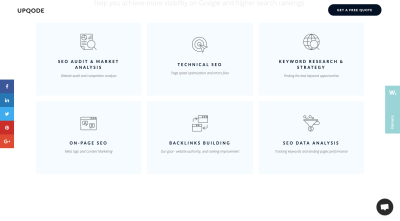
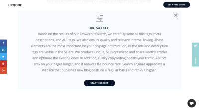
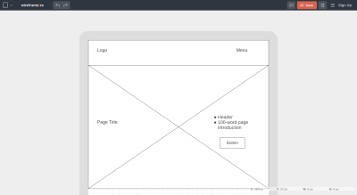

-   11 min read
-   [SEO](https://www.smashingmagazine.com/category/seo), [Business](https://www.smashingmagazine.com/category/business), [Process](https://www.smashingmagazine.com/category/process) 搜索引擎优化、业务、流程

The word “SEO” holds a lot of weight.  

搜索引擎优化 "这个词的分量很重。  

We know how critical it is to the success of a website and, yet, it often becomes one of those things that’s left until the very end of a web design project to deal with.  

我们知道它对网站的成功至关重要，但它往往成为网站设计项目最后才处理的问题之一。  

Or, worse, it’s pushed onto one person’s plate who likely isn’t capable of doing all that needs to be done. SEO should be a team sport — and that’s what today’s post is all about.  

更糟糕的是，这些工作都推给了一个人，而这个人很可能没有能力完成所有需要完成的工作。搜索引擎优化应该是一项团队运动，这就是今天这篇文章的主题。

We all have a role to play in the building of a website. Designers create beautiful and interactive interfaces.  

在网站建设过程中，我们每个人都要发挥作用。设计师们设计出精美的交互式界面。  

Copywriters create messaging that gets visitors to take notice and action. Developers bring it all together with code.  

文案撰写人员则负责撰写信息，吸引访客注意并采取行动。开发人员用代码将这一切整合在一起。

But there’s one piece of the puzzle that can’t be handed off to just one person. And that’s SEO.  

但有一块拼图不能只交给一个人。那就是搜索引擎优化。

If you’re building websites for clients and they’re expecting impressive outcomes in the end (i.e. high conversion rates), SEO _has_ to be part of your process. You can’t just leave it in the hands of your writer or a dedicated SEO and assume that’s enough.  

如果您正在为客户建设网站，而客户又期望最终获得令人印象深刻的结果（即高转化率），那么搜索引擎优化就必须成为您工作流程的一部分。您不能仅仅将其交给撰稿人或专门的搜索引擎优化人员，并认为这就足够了。

Google is a demanding overlord and we must appease it if we want our websites to reach the top of search.  

谷歌是一个苛刻的霸主，如果我们想让自己的网站在搜索中名列前茅，就必须讨好它。  

And what that means is taking a well-rounded approach to SEO throughout the lifecycle of the website design and development process.  

这意味着在网站设计和开发的整个过程中，都要采取全面的搜索引擎优化方法。

If you haven’t accounted for this already or you want to make sure you’ve covered all the bases in what you currently do, this post is for you.  

如果您还没有考虑到这一点，或者您想确保您目前所做的工作已经覆盖了所有基础，那么这篇文章就是为您准备的。  

I’m going to run through when and how SEO needs to enter the picture in your workflow.  

下面我将介绍搜索引擎优化何时以及如何进入您的工作流程。  

In addition, I’ve included an SEO checklist at the bottom of this post that you and your team can adapt to your workflow.  

此外，我还在本帖底部提供了一份搜索引擎优化清单，您和您的团队可以根据自己的工作流程进行调整。

SEO should be something you’re always thinking about and planning for, from the prospecting phase all the way to the launch date.  

搜索引擎优化应该是你一直在考虑和计划的事情，从潜在客户阶段一直到发布日期。

### SEO During the Proposal Phase [#](https://www.smashingmagazine.com/2020/02/seo-web-design-process/#seo-during-the-proposal-phase)  

提案阶段的搜索引擎优化 #

When you talk to a prospect about what they need your help for, they’re going to focus on the website itself.  

当你与潜在客户谈及他们需要你的帮助时，他们会把注意力集中在网站本身。

> “I need a website so I can sell my products online/grow my presence/get new customers.”  
> 
> "我需要一个网站，以便在线销售我的产品/扩大我的影响力/获得新客户"。

But that’s not _really_ what they’re asking for.  

但这并不是他们真正的要求。  

What they want is a website to help their business get found in Google and to convert visitors, which requires something more complex from you than just slapping together some copy and designs.  

他们需要的是一个能帮助他们的企业在谷歌上被发现并转化访客的网站，这就需要你做一些更复杂的事情，而不仅仅是拼凑一些文案和设计。

You know that the website needs to be optimized for search if the website is to do what the client needs it to.  

要知道，网站要想达到客户的要求，就必须针对搜索进行优化。  

Because of this, it’s going to impact things like cost, timeline and process flow. **All of these details should be mapped out on your end as you prepare the proposal.**  

因此，这将对成本、时间表和流程等产生影响。所有这些细节都应在您准备建议书的过程中在您这一方绘制出来。

As for what you actually tell your clients? This is where things get tricky.  

至于你究竟要告诉客户什么？这就是事情变得棘手的地方。

You have to somehow address SEO with your prospect 1) to set the right expectations and 2) to justify what you’re about to propose to them in terms of scope and cost.  

您必须以某种方式与潜在客户讨论搜索引擎优化问题：1）设定正确的期望；2）从范围和成本方面证明您即将向他们提出的建议是合理的。  

The only problem is, some clients might know the term “SEO”, but they don’t really understand what it entails.  

唯一的问题是，有些客户可能知道 "搜索引擎优化 "这个词，但并不真正了解它的含义。

The conversation could quickly devolve into something like this:  

谈话很快就会变成这样：

> **You**: \[You explain the details of your design offering and mention that SEO is part of it.\]  
> 
> 您：\[您解释了设计服务的细节，并提到搜索引擎优化是其中的一部分。］
> 
> **Client**: “Oh, great. I have a list of 20 keywords I want included in every page.”
> 
>   
> 
> 客户"哦，太好了。我有一个 20 个关键词的列表，我希望每个页面都包含这些关键词。
> 
> **You**: “Well, that’s not really what search engine optimization is.
> 
>   
> 
> 你"其实，搜索引擎优化并不是这样的。  
> 
> If you want your website to perform well, you need to pay attention to things like caching, security and mobile-first design.”  
> 
> 如果你想让你的网站表现出色，你就需要关注缓存、安全和移动优先设计等问题"。
> 
> **Client**: “What are you talking about? Cashing? What even is that? I thought you said you do SEO. I want to rank for these 20 keywords.”
> 
>   
> 
> 客户"你在说什么？兑现？那是什么？你不是说你是做搜索引擎优化的吗？我想让这 20 个关键词排名靠前。"

It’s your job to get clients the results they need, not to try and explain to them the technicalities of how you do it. That’s why they’re paying you to do this, after all.  

你的工作是让客户得到他们需要的结果，而不是向他们解释你是如何做到这一点的。毕竟，这才是他们花钱请你来做这件事的原因。  

So, here’s what I’d recommend for your proposal and early discussions with clients:  

因此，我建议您在提案和与客户进行早期讨论时采用以下方法：

First, let your website do all the talking about SEO like [UPQODE](https://upqode.com/)’s does:  

首先，像 UPQODE 一样，让您的网站为搜索引擎优化做所有的工作：

UPQODE briefly details the kinds of SEO services it provides. (Image source: [UPQODE](https://upqode.com/)) ([Large preview](https://archive.smashing.media/assets/344dbf88-fdf9-42bb-adb4-46f01eedd629/d45d2b2e-dbc2-461a-8364-b198494f4c3a/upquode-seo-services.png))  

UPQODE 简要介绍其提供的搜索引擎优化服务。(图片来源：UPQODE） ( 大图预览)

This would allow you to clearly spell out the kinds of SEO you provide (which will also help those SEO-minded clients find you in the first place).  

这样，您就可以清楚地说明您所提供的搜索引擎优化类型（这也有助于那些注重搜索引擎优化的客户首先找到您）。  

It’s okay to include technical terms here so long as you briefly explain what each is in layman’s terms:  

只要用通俗易懂的语言简要解释每个术语的含义，在这里加入专业术语也是可以的：

UPQODE explains what’s involved in on-page SEO. (Image source: [UPQODE](https://upqode.com/)) ([Large preview](https://archive.smashing.media/assets/344dbf88-fdf9-42bb-adb4-46f01eedd629/47afbb9e-c5f3-40a2-a7e3-099e8c2355c1/upquode-seo-explainer.png))  

UPQODE 解释页面搜索引擎优化的内容。(图片来源：UPQODE） ( 大图预览)

What I like about this approach is that it enables you to say “We’re going to do X, Y and Z” while framing it in a light that the client actually understands.  

我喜欢这种方法的原因是，它能让你说 "我们要做 X、Y 和 Z"，同时又能让客户真正理解。  

In this case, what you’d really be saying is “We handle all the technical stuff so your site’s visibility grows in search and, consequently, you get more traffic.”  

在这种情况下，你真正想说的是："我们处理所有的技术问题，这样你的网站在搜索中的可见度就会提高，从而获得更多的流量"。

This is how you should be talking to your prospects and laying out SEO-related details in your proposals and contracts, too.  

您也应该这样与潜在客户交流，并在提案和合同中列出与搜索引擎优化相关的细节。

In other words, don’t delve too much into your SEO tasks. Instead, just spell out the benefits. For example:  

换句话说，不要过多地介绍搜索引擎优化任务。相反，只需说明好处即可。例如

-   Responsive web design that looks great on all devices.  
    
    响应式网页设计，在所有设备上都美观大方。
-   Web pages that load in three seconds or less for optimal visitor experiences.  
    
    网页加载时间不超过 3 秒，为访客提供最佳体验。
-   Tightened up security to keep all your business data as well as your visitors’ data private.  
    
    加强安全性，确保您的所有业务数据和访客数据的私密性。
-   Content that’s easy for humans to read and even easier for Google bots to understand.  
    
    内容要易于人类阅读，更易于 Google 机器人理解。
-   Custom-built user pathways that turn visitors into customers in no time.  
    
    定制用户路径，让访客迅速成为客户。

The goal is to get them onboard with your search-optimized web design services and perhaps even ongoing maintenance and support afterwards.  

我们的目标是让他们接受您的搜索优化网页设计服务，甚至是之后的持续维护和支持。  

To do that, you have to clearly convey the benefits without getting them wrapped up in the technicalities of SEO.  

要做到这一点，你必须清楚地传达好处，而不能让他们被搜索引擎优化的技术性问题所困扰。

### SEO During the Setup and Planning Phase [#](https://www.smashingmagazine.com/2020/02/seo-web-design-process/#seo-during-the-setup-and-planning-phase)  

设置和规划阶段的搜索引擎优化 #

In the early phases of an approved project, SEO shouldn’t be far from your mind.  

在批准项目的早期阶段，搜索引擎优化不应该远离你的脑海。  

While you might not actively be working on optimizations yet, it’s a good idea to make sure the baseline you’re working from won’t cause more work for you down the line.  

虽然您可能还没有积极开展优化工作，但最好确保您的工作基线不会为您带来更多工作。

Here are some things to keep in mind:  

以下是一些需要注意的事项：

**Review the Client’s Design Assets  

审查客户的设计资产**

You probably ask clients to provide you with assets, logins and even copy before a project gets underway.  

您可能会要求客户在项目开始前向您提供资产、登录名甚至副本。  

While this is mainly to protect yourself from scope creep, it can also come in handy for SEO.  

虽然这主要是为了保护自己免受范围蠕变的影响，但也可以在搜索引擎优化方面派上用场。

Say your client hands over logos and other image assets that are really low quality or look super outdated.  

比如说，你的客户交给你的徽标和其他图像资产质量很低，或者看起来非常过时。  

The earlier you have these assets in hand, the sooner you can let them know that they need to be replaced if they want people to take their website seriously.  

越早掌握这些资产，就能越早让他们知道，如果他们想让人们认真对待他们的网站，就必须更换这些资产。

If visitors don’t like the look of a website, they’re going to abandon it without fail and that high bounce rate is going to kill the site’s ranking.  

如果访问者不喜欢网站的外观，他们就会放弃网站，而高跳出率会扼杀网站的排名。  

So, make sure your clients don’t stand in the way of the results you’re trying to help them achieve.  

因此，请确保您的客户不会妨碍您帮助他们实现目标。

**Work in Tandem with the Copywriter  

与文案合作**

Even if a professional copywriter is creating the content for your website, if you’re not working closely with them from the start, there could be problems.  

即使有专业的文案为您的网站创作内容，如果您没有从一开始就与他们密切合作，也可能会出现问题。

Web design agencies often debate the merits of content-first website development vs. design-first. The truth is, they should be created together.  

网页设计公司经常争论网站开发内容优先与设计优先的优劣。事实上，它们应该一起创建。  

If you don’t, you put the whole project at risk.  

否则，整个项目就会面临风险。

For starters, a writer and designer working in isolation are bound to come up with different ways to handle style and layout.  

首先，作家和设计师各自为战，必然会产生不同的风格和排版方式。  

But if you establish guidelines from the get-go (which you can easily do with [wireframes](https://wireframe.cc/)), you can avoid any disjoint in how the copy and design are created.  

但是，如果从一开始就制定指导原则（使用线框图就可以轻松做到这一点），就可以避免文案和设计之间出现脱节。

Designers can use a tool like Wireframe.cc to create wireframes that both they and the writer can work out of. (Image source: [Wireframe.cc](https://wireframe.cc/)) ([Large preview](https://archive.smashing.media/assets/344dbf88-fdf9-42bb-adb4-46f01eedd629/184f08b6-b645-42e4-bd15-e581aaa909b7/wireframe-for-designer-writer.png))  

设计师可以使用 Wireframe.cc 这样的工具来创建线框图，他们和撰稿人都可以根据这些线框图开展工作。(图片来源：Wireframe.cc） ( 大图预览)

You’re going to wireframe any website you build anyway, so why not provide a copy of it to the writer so you two can be on the same page from the beginning?  

无论如何，您都要为您建立的网站绘制线框，那么为什么不向撰稿人提供一份线框副本，这样你们俩从一开始就能站在同一条起跑线上呢？  

Even better, why not collaborate with the writer?  

更妙的是，为什么不与作者合作呢？  

They might not know design techniques or best practices, but they can certainly provide insight on things like optimal text length, the priority of certain sales or marketing messages and so on.  

他们可能不懂设计技巧或最佳实践，但肯定能提供有关最佳文本长度、某些销售或营销信息的优先级等方面的见解。

Then, there’s the matter of optimizing copy for search. Ideally, you’d want to work with a copywriter who can do the following:  

然后是优化搜索文案。理想情况下，您希望与能做到以下几点的文案合作：

-   Create actionable messaging and CTAs,  
    
    创建可操作的信息和 CTA、
-   Naturally weave target keywords into the copy,  
    
    将目标关键词自然地融入文案中、
-   Write for user intent, 根据用户意图写作、
-   Write in HTML, 用 HTML 书写、
-   Create copy that’s both readable and scannable,  
    
    创建可读性和可扫描性兼具的副本、
-   Build a system of internal links from page to page,  
    
    建立页面与页面之间的内部链接系统、
-   Create meta tags and optimize URLs for search,  
    
    创建元标签并优化搜索 URL、
-   Write alt tags for images.  
    
    为图片编写 alt 标签。

The more of this that gets built into the copy from the get-go, the less back-and-forth you have to do with them later.  

从一开始就在文案中加入越多这样的内容，就越能减少日后与他们之间的来来回回。  

It’ll also spare you the trouble of trying to fix this on your own (which you shouldn’t attempt to do).  

这样还可以免去您自己尝试修复的麻烦（您不应该尝试这样做）。

**Design for Sales Funnels 销售渠道设计**

In order to increase conversions on a site, you should be [designing sales funnels](https://www.smashingmagazine.com/2019/12/design-profitable-sales-funnels-mobile/) into them. But sales funnels aren’t just a series of steps that you lay down for visitors on the website.  

为了提高网站的转化率，你应该在网站中设计销售漏斗。但销售漏斗并不仅仅是为网站访客设置的一系列步骤。

It all begins with understanding user intent outside of the site. If you know what draws visitors to your site from search engines and social media, you can design your metadata _and_ landing pages to align with that intent.  

这一切都始于了解网站之外的用户意图。如果您知道是什么吸引访客从搜索引擎和社交媒体访问您的网站，您就可以根据这一意图设计元数据和登陆页面。

Again, if you do the research and planning upfront with SEO in mind, you’ll have less cleanup work to do later.  

同样，如果你在前期进行研究和规划时就考虑到搜索引擎优化，那么后期的清理工作就会减少。

### SEO During Design and Development [#](https://www.smashingmagazine.com/2020/02/seo-web-design-process/#seo-during-design-and-development)  

设计和开发过程中的搜索引擎优化 #

This, obviously, is the most important and labor-intensive stage for you. **And while it’s easy to get wrapped up in designing and coding, it’s important not to lose sight of SEO here.**  

这显然是最重要、最耗费精力的阶段。虽然设计和编码很容易让人着迷，但重要的是不要忽视搜索引擎优化。

What I’d recommend is creating a universal SEO checklist you can use from project to project.  

我建议创建一个通用的搜索引擎优化清单，以便在各个项目中使用。  

If you account for every possible optimization now, you can take the guesswork out of SEO.  

如果现在就考虑到每一种可能的优化方式，就能让搜索引擎优化不再靠猜测。  

Plus, a checklist allows you to become better acquainted with everything that needs to be done, which will enable you to find more efficient ways of building search optimizations into your process.  

此外，核对表可以让你更好地熟悉需要完成的所有工作，这将使你能够找到更有效的方法，将搜索优化纳入你的工作流程。

To help you along, I’ve created the following SEO checklist. Feel free to copy and use for your own needs:  

为了帮助您，我创建了以下搜索引擎优化清单。请根据自己的需要复制和使用：

-   **Technical SEO 技术性搜索引擎优化**

-   Web hosting with 99.9%+ uptime  
    
    正常运行时间超过 99.9% 的虚拟主机
-   Domain with clean web history  
    
    无网络历史记录的域名
-   SSL certificate installed  
    
    已安装 SSL 证书
-   Firewall implemented 实施防火墙
-   Caching enabled (page, browser, object, etc.)  
    
    已启用缓存（页面、浏览器、对象等）
-   Image compression and resizing (in-house system or automated)  
    
    图像压缩和大小调整（内部系统或自动系统）
-   Automated backups 自动备份
-   Google Analytics account connected  
    
    已连接 Google Analytics 账户
-   Google Analytics goal tracking, ecommerce tracking and other special tracking enabled  
    
    启用 Google Analytics 目标跟踪、电子商务跟踪和其他特殊跟踪功能
-   Google Search Console account connected  
    
    已连接 Google Search Console 账户
-   XML sitemap set up and submitted to Google  
    
    设置并向 Google 提交 XML 网站地图
-   Separate sitemap submitted for images and for videos  
    
    为图片和视频分别提交网站地图
-   Robots.txt set up 设置 Robots.txt
-   Schema.org markup (when relevant) written  
    
    编写 Schema.org 标记（相关时

-   **Design SEO 设计搜索引擎优化**

-   Information architecture mapped out  
    
    绘制信息架构图
-   Responsive web design 响应式网页设计
-   Mobile-first web design 移动优先的网页设计
-   1 clear CTA per page  
    
    每页 1 个明确的 CTA
-   Custom 404 page set up  
    
    设置自定义 404 页面
-   All links, buttons and forms tested and working  
    
    所有链接、按钮和表格均已测试并正常运行

-   **On-page SEO 页面搜索引擎优化**

-   1 unique focus keyword per page  
    
    每页 1 个独特的重点关键词
-   Focus keyword density between 1-3%  
    
    将关键词密度集中在 1-3% 之间
-   50-60 character meta title including the focus keyword  
    
    50-60 个字符的元标题，包括重点关键词
-   150-160 character meta description including the focus keyword  
    
    150-160 个字符的元描述，包括重点关键词
-   Short but descriptive slug including the focus keyword  
    
    简短但具有描述性的标题，包括重点关键词
-   Error-free content 无差错内容
-   At least 1 relevant internal link per page  
    
    每页至少有一个相关内部链接
-   Featured image for each page  
    
    每个页面的特色图片
-   Descriptive alt text for each image  
    
    每张图片的描述性 alt 文本
-   Header tags used (focus keyword included in at least 1)  
    
    使用的标题标签（至少包含 1 个重点关键词）
-   Headers appear every 300 words or so  
    
    标题每 300 字左右出现一次
-   Sentences stretch no more than two lines  
    
    句子不超过两行
-   Paragraphs stretch no more than five lines  
    
    段落不超过五行
-   Duplicate content analysis  
    
    重复内容分析
-   Plagiarism check 抄袭检查

-   **Local SEO 本地搜索引擎优化**

-   Google My Business page set up  
    
    建立谷歌 "我的企业 "页面
-   Geo-specific keywords included  
    
    包括特定地理位置的关键词
-   Location-specific pages created (when relevant)  
    
    创建针对特定地点的页面（相关时）
-   Contact information provided (e.g. phone number, address, etc.)  
    
    提供的联系信息（如电话号码、地址等）

-   **Ongoing SEO Support 持续的搜索引擎优化支持**

-   Web server uptime, speed and security analysis  
    
    网络服务器正常运行时间、速度和安全分析
-   Page speed testing 页面速度测试
-   Security monitoring 安全监控
-   Google blacklist monitoring  
    
    谷歌黑名单监控
-   Keyword rank monitoring 关键词排名监控
-   Broken link checking 断开链接检查
-   Software updates 软件更新

### A Few Notes [#](https://www.smashingmagazine.com/2020/02/seo-web-design-process/#a-few-notes) 几点说明 #

1.  Anything that’s not relevant to the kinds of clients you serve or the kinds of services you offer, delete the row.  
    
    任何与您服务的客户或提供的服务种类无关的内容都要删除。
2.  If there’s anything I’m missing, feel free to add it on (like if you specialize in e-commerce design and want to prep product pages to appear in Google Shopping results).  
    
    如果我遗漏了什么，请随时补充（比如，如果您擅长电子商务设计，并希望将产品页面预设为出现在谷歌购物结果中）。
3.  If you’re not comfortable checking the on-page SEO stuff, hand it off to a proofreader or editor (someone who didn’t do the copywriting).  
    
    如果您不方便检查页面搜索引擎优化方面的内容，可以将其交给校对员或编辑（不是撰写文案的人）。

For those of you looking for additional opportunities to make money, this SEO checklist can also be used to analyze an existing website and present a prospective client with a website redesign or optimization plan.  

对于那些正在寻找更多赚钱机会的人来说，这份搜索引擎优化清单还可以用来分析现有网站，并向潜在客户介绍网站重新设计或优化计划。

## Wrapping Up [#](https://www.smashingmagazine.com/2020/02/seo-web-design-process/#wrapping-up) 总结 #

Keyword optimization and link building are only part of the SEO puzzle.  

关键词优化和链接建设只是搜索引擎优化难题的一部分。  

As a web designer or developer, you have a huge contribution to make here as well. Whether it’s in the quality of code written on the backend, the way images are optimized or how well-secured the site is, these are the kinds of tasks you’re responsible for managing that no writer or SEO is going to or should handle.  

作为一名网页设计师或开发人员，你也可以在这方面做出巨大贡献。无论是后台代码的编写质量、图片的优化方式，还是网站的安全性，这些都是你要负责管理的工作，而这些工作是任何撰稿人或搜索引擎优化人员都不会或不应该去做的。  

And, without these optimizations, Google and your visitors will fail to take notice of the site you worked so hard to build for them.  

如果不进行这些优化，谷歌和您的访客就不会注意到您辛辛苦苦为他们建立的网站。

 (ra, il)    (俄、伊)
