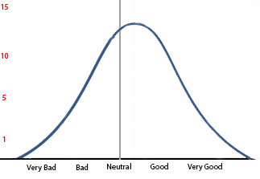
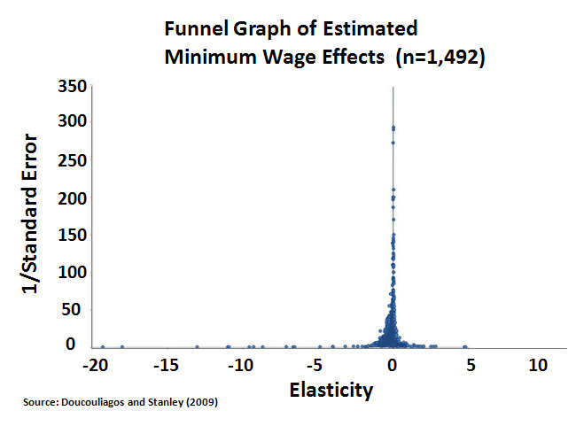

Aquinas famously [said](http://en.wikipedia.org/wiki/Homo_unius_libri): beware the man of one book. I would add: beware the man of one study.  

阿奎那有句名言：小心只读一本书的人。我还要补充一句：小心只读一本书的人。

For example, take medical research. Suppose a certain drug is weakly effective against a certain disease.  

以医学研究为例。假设某种药物对某种疾病的疗效很弱。  

After a few years, a bunch of different research groups have gotten their hands on it and done all sorts of different studies.  

几年后，一些不同的研究小组拿到了它，并进行了各种不同的研究。  

In the best case scenario the average study will find the true result – that it’s weakly effective.  

在最好的情况下，一般的研究会发现真实的结果--效果微弱。

But there will also be random noise caused by inevitable variation and by some of the experiments being better quality than others.  

但是，由于不可避免的变化以及某些实验的质量优于其他实验，也会产生随机噪声。  

In the end, we might expect something looking kind of like a bell curve. The peak will be at “weakly effective”, but there will be a few studies to either side.  

最后，我们可能会看到类似钟形曲线的结果。峰值是 "弱有效"，但两侧会有一些研究。  

Something like this: 差不多是这样

We see that the peak of the curve is somewhere to the right of neutral – ie weakly effective – and that there are about 15 studies that find this correct result.  

我们可以看到，曲线的峰值在中性偏右的位置，即弱效，大约有 15 项研究发现了这一正确结果。

But there are also about 5 studies that find that the drug is very good, and 5 studies missing the sign entirely and finding that the drug is actively bad.  

但也有大约 5 项研究发现这种药物非常好，还有 5 项研究完全没有发现这种迹象，却发现这种药物非常糟糕。  

There’s even 1 study finding that the drug is very bad, maybe seriously dangerous.  

甚至有一项研究发现，这种药物非常糟糕，可能非常危险。

This is before we get into fraud or statistical malpractice. I’m saying this is what’s going to happen just by normal variation in experimental design.  

这还没有涉及到欺诈或统计弊端。我的意思是，这只是实验设计中的正常变化。  

As we increase experimental rigor, the bell curve might get squashed horizontally, but there will still be a bell curve.  

随着实验严谨性的提高，钟形曲线可能会被水平压扁，但仍会有一条钟形曲线。

In practice it’s worse than this, because this is assuming everyone is investigating exactly the same question.  

实际上，情况比这更糟，因为这是在假设每个人都在调查完全相同的问题。

Suppose that the graph is titled “Effectiveness Of This Drug In Treating Bipolar Disorder”.  

假设图表的标题是 "这种药物治疗躁郁症的效果"。

But maybe the drug is more effective in bipolar i than in bipolar ii (Depakote, for example)  

但也许这种药物对躁郁症 i 比躁郁症 ii 更有效（例如 Depakote）。

Or maybe the drug is very effective against bipolar mania, but much less effective against bipolar depression (Depakote again).  

或者，这种药物对双相躁狂症非常有效，但对双相抑郁症的效果却差得多（又是德帕科特）。

Or maybe the drug is a good acute antimanic agent, but less effective at maintenance treatment (let’s stick with Depakote).  

或者，这种药物是一种很好的急性抗躁剂，但在维持治疗方面效果较差（让我们坚持使用德帕科特）。

If you have a graph titled “Effectiveness Of Depakote In Treating Bipolar Disorder” plotting studies from “Very Bad” to “Very Good” – and you stick all the studies – maintenence, manic, depressive, bipolar i, bipolar ii – on the graph, then you’re going to end running the gamut from “very bad” to “very good” even before you factor in noise and even before even before you factor in bias and poor experimental design.  

如果你有一张题为 "迪帕科特治疗双相情感障碍的疗效 "的图表，把从 "很差 "到 "很好 "的研究绘制成图--你把所有的研究，包括维持性研究、躁狂研究、抑郁研究、双相 i 型研究、双相 ii 型研究，都贴在图表上，那么，即使你还没有考虑噪音因素，即使你还没有考虑偏见和糟糕的实验设计因素，你也会看到从 "很差 "到 "很好 "的结果。

So here’s why you should beware the man of one study.  

因此，你应该警惕一项研究中的人。

If you go to your better class of alternative medicine websites, they don’t tell you “Studies are a logocentric phallocentric tool of Western medicine and the Big Pharma conspiracy.”  

如果你去浏览那些较好的替代医学网站，它们不会告诉你 "研究是西医和大药厂阴谋的逻各斯中心主义工具"。

They tell you “medical science has proved that this drug is terrible, but ignorant doctors are pushing it on you anyway.  

他们告诉你："医学已经证明这种药很糟糕，但无知的医生还是把它强塞给你。  

Look, here’s a study by a reputable institution proving that the drug is not only ineffective, but harmful.”  

听着，这是由知名机构进行的研究，证明这种药物不仅无效，而且有害。"

And the study will exist, and the authors will be prestigious scientists, and it will probably be about as rigorous and well-done as any other study.  

这项研究将会存在，作者也将是享有盛誉的科学家，它可能会像其他任何研究一样严谨和出色。

And then a lot of people raised on [the idea](https://slatestarcodex.com/2014/04/15/the-cowpox-of-doubt/) that some things have Evidence and other things have No Evidence think _holy s\*\*t, they’re right!_  

很多人从小就认为，有些事情有证据，有些事情没有证据，他们觉得天哪，他们是对的！

On the other hand, your doctor isn’t going to a sketchy alternative medicine website.  

另一方面，你的医生也不会去一个草率的替代医学网站。  

She’s examining the entire literature and extracting careful and well-informed conclusions from…  

她对所有文献进行了研究，并从这些文献中得出了谨慎而有理有据的结论。

Haha, just kidding. She’s going to a luncheon at a really nice restaurant sponsored by a pharmaceutical company, which assures her that they would _never_ take advantage of such an opportunity to shill their drug, they just want to raise awareness of the latest study. And the latest study shows that their drug is great! Super great!  

哈哈，开个玩笑。她要去一家非常不错的餐厅参加一个午餐会，由一家制药公司赞助，该公司向她保证，他们绝不会利用这样的机会推销自己的药物，他们只是想提高人们对最新研究的认识。最新研究表明，他们的药物非常棒！超级棒  

And your doctor nods along, because the authors of the study are prestigious scientists, and it’s about as rigorous and well-done as any other study.  

你的医生也点头称是，因为这项研究的作者都是享有盛誉的科学家，而且这项研究和其他研究一样严谨，做得很好。

But obviously the pharmaceutical company has selected one of the studies from the “very good” end of the bell curve.  

但很明显，制药公司从钟形曲线的 "非常好 "一端选择了一项研究。

And I called this “Beware The Man of One Study”, but it’s easy to see that in the little diagram there are like three or four studies showing that the drug is “very good”, so if your doctor is a little skeptical, the pharmaceutical company can say “You are right to be skeptical, one study doesn’t prove anything, but look – here’s another group that finds the same thing, here’s yet another group that finds the same thing, and here’s a replication that confirms both of them.”  

我把这叫做 "当心一个研究的人"，但很容易看到，在这个小图中，好像有三四个研究表明这种药 "非常好"，所以如果你的医生有点怀疑，制药公司就可以说："你的怀疑是对的，一个研究并不能证明什么，但你看--这里还有一组研究发现了同样的事情，这里还有一组研究发现了同样的事情，这里还有一个重复研究证实了这两个研究"。

And even though it looks like in our example the sketchy alternative medicine website only has one “very bad” study to go off of, they could easily supplement it with a bunch of merely “bad” studies.  

尽管在我们的例子中，这个草率的替代医学网站似乎只有一项 "非常糟糕 "的研究，但他们可以很容易地补充大量 "糟糕 "的研究。  

Or they could add all of those studies about slightly different things. Depakote is ineffective at treating bipolar depression.  

或者，他们可以把所有这些关于略有不同的研究都加进去。迪帕科特对治疗双相抑郁症无效。  

Depakote is ineffective at maintenance bipolar therapy.  

迪帕科特对双相情感维持治疗无效。  

Depakote is ineffective at bipolar ii.  

Depakote 对双相情感障碍 II 无效。

So just sum it up as “Smith et al 1987 found the drug ineffective, yet doctors continue to prescribe it anyway”.  

因此，只需将其总结为 "1987 年史密斯等人发现该药无效，但医生仍继续开药"。  

Even if you hunt down the original study (which no one does), Smith et al won’t say specifically “Do remember that this study is only looking at bipolar maintenance, which is a different topic from bipolar acute antimanic treatment, and we’re not saying anything about that.” It will just be titled something like “Depakote fails to separate from placebo in six month trial of 91 patients” and trust that the responsible professionals reading it are well aware of the difference between acute and maintenance treatments (hahahahaha).  

即使你找到了最初的研究（没有人会这样做），史密斯等人也不会明确指出 "请记住，这项研究只关注双相情感维持治疗，这与双相情感急性抗躁治疗是两个不同的主题，我们对此不发表任何意见"。"它只会冠以这样的标题："在对91名患者进行的为期6个月的试验中，地巴科特未能与安慰剂区分开来"，并相信阅读它的负责任的专业人士非常清楚急性期治疗与维持期治疗之间的区别（哈哈哈哈）。

So it’s not so much “beware the man of one study” as “beware the man of any number of studies less than a relatively complete and not-cherry-picked survey of the research”.  

因此，与其说是 "提防一个研究报告中的人"，不如说是 "提防任何数量的研究报告中的人，这些研究报告都不是相对完整的、经过挑选的研究报告"。

**II.**

I think medical science is still pretty healthy, and that the consensus of doctors and researchers is more-or-less right on most controversial medical issues.  

我认为医学科学仍然相当健康，在大多数有争议的医学问题上，医生和研究人员的共识基本是正确的。

(it’s the _uncontroversial_ ones you have to worry about)  

(你要担心的是那些没有争议的人）

Politics doesn’t have this protection.  

政治没有这种保护。

Like, take the minimum wage question (please). We all know about the Krueger and Card [study](http://davidcard.berkeley.edu/papers/njmin-aer.pdf) in New Jersey that found no evidence that high minimum wages hurt the economy. We probably also know the counterclaims that it was [completely debunked](http://nypost.com/2013/08/06/minimum-honesty-on-minimum-wage/) as despicable dishonest statistical malpractice. Maybe some of us know Card and Krueger wrote a [pretty convincing rebuttal](http://www.jstor.org/discover/10.2307/2677856?uid=16785200&uid=3739728&uid=2&uid=3&uid=67&uid=16754504&uid=62&uid=3739256&sid=21104826014421) of those claims. Or that a bunch of large and methodologically advanced studies have come out since then, some finding no effect like [Dube](https://escholarship.org/uc/item/86w5m90m), others finding strong effects like [Rubinstein](https://economics.uchicago.edu/workshops/Rubinstein%20Yona%20Using%20Federal%20Minimum%20Wages%20Paper.pdf) and [Wither](http://econbrowser.com/archives/2014/12/new-estimates-of-the-effects-of-the-minimum-wage). These are just examples; there are at least dozens and probably hundreds of studies on both sides.  

比如，就拿最低工资问题来说吧（拜托）。我们都知道克鲁格和卡德在新泽西州进行的研究，该研究没有发现任何证据表明高最低工资会损害经济。我们可能也知道有人反驳说，这项研究被彻底揭穿是卑鄙不诚实的统计弊端。也许我们中的一些人知道卡德和克鲁格写了一篇很有说服力的反驳文章。或者说，从那以后，又有许多大型的、方法先进的研究问世，有些研究发现没有影响，比如杜比，有些研究发现有很强的影响，比如鲁宾斯坦和威瑟。这些只是一些例子，正反两方面的研究至少有几十项，甚至上百项。

But we can solve this with meta-analyses and systemtic reviews, right?  

但我们可以通过荟萃分析和系统回顾来解决这个问题，不是吗？

Depends which one you want. Do you go with [this meta-analysis](http://people.hss.caltech.edu/~camerer/SS280/Card-Kruger-AER_Jan95.pdf) of fourteen studies that shows that any presumed negative effect of high minimum wages is likely publication bias? With [this meta-analysis](http://onlinelibrary.wiley.com/doi/10.1111/j.1467-8543.2009.00723.x/abstract) of sixty-four studies that finds the same thing and discovers no effect of minimum wage after correcting for the problem? Or how about [this meta-analysis](http://ftp.iza.org/dp4983.pdf) of fifty-five countries that does find effects in most of them? Maybe you prefer [this systematic review](http://www.nber.org/papers/w12663.pdf) of a hundred or so studies that finds strong and consistent effects?  

这取决于你想要哪一个。你会选择这个由 14 项研究组成的荟萃分析，该分析表明，任何假定的高最低工资的负面影响都可能是出版偏差？还是通过对 64 项研究的荟萃分析，发现同样的问题，并在纠正了这一问题后发现最低工资没有影响？或者，这份对 55 个国家进行的荟萃分析确实在大多数国家发现了影响，又如何呢？也许你更喜欢这种对一百来项研究进行的系统回顾，它发现了强烈而一致的影响？

Can we trust news sources, think tanks, econblogs, and other institutions to sum up the state of the evidence?  

我们能相信新闻来源、智库、经济博客和其他机构对证据状况的总结吗？

CNN [claims that](http://www.cnn.com/2011/09/16/opinion/saltsman-minimum-wage/) 85% of credible studies have shown the minimum wage causes job loss. But raisetheminimumwage.com [declares that](http://www.raisetheminimumwage.com/pages/job-loss) “two decades of rigorous economic research have found that raising the minimum wage does not result in job loss…researchers and businesses alike agree today that the weight of the evidence shows no reduction in employment resulting from minimum wage increases.” Modeled Behavior [says](http://modeledbehavior.com/2010/10/12/what-the-new-minimum-wage-research-says/) “the majority of the new minimum wage research supports the hypothesis that the minimum wage increases unemployment.” The Center for Budget and Policy Priorities [says](http://www.cbpp.org/cms/?fa=view&id=4075) “The common claim that raising the minimum wage reduces employment for low-wage workers is one of the most extensively studied issues in empirical economics.  

美国有线电视新闻网（CNN）声称，85% 的可信研究表明，最低工资会导致就业机会减少。但raisetheminimumwage.com宣称，"二十年来严谨的经济研究发现，提高最低工资并不会导致失业......如今，研究人员和企业都一致认为，大量证据表明，提高最低工资不会导致就业减少"。行为模型》称，"大多数新的最低工资研究都支持最低工资增加失业的假设"。预算与政策优先中心（Center for Budget and Policy Priorities）说："提高最低工资会减少低工资工人就业的普遍说法是实证经济学中研究最广泛的问题之一。  

The weight of the evidence is that such impacts are small to none.”  

大量证据表明，这种影响很小，甚至没有"。

Okay, fine. What about economists? They seem like experts. What do they think?  

好吧那经济学家呢？他们看起来像专家他们是怎么想的？

Well, five hundred economists [signed](http://economistletter.com/) a letter to policy makers saying that the science of economics shows increasing the minimum wage would be a bad idea. That sounds like a promising consensus…  

五百名经济学家联名致信政策制定者，称经济科学表明，提高最低工资是个坏主意。这听起来像是一个充满希望的共识......

..except that six hundred economists [signed](http://www.epi.org/minimum-wage-statement/) a letter to policy makers saying that the science of economics shows increasing the minimum wage would be a _good_ idea. (h/t [Greg Mankiw](http://gregmankiw.blogspot.com/2014/03/economists-divided-on-minimum-wage-hike.html))  

.except that six hundred economists signed a letter to policy makers saying that the science of economics shows increasing the minimum wage would be a good idea.(h/t Greg Mankiw)

Fine then. Let’s do a formal survey of economists. Now what?  

那好吧。让我们对经济学家进行一次正式调查。现在做什么？

[raisetheminimumwage.com](http://www.raisetheminimumwage.com/pages/job-loss), an unbiased source if ever there was one, confidently tells us that “indicative is a 2013 survey by the University of Chicago’s Booth School of Business in which leading economists agreed by a nearly 4 to 1 margin that the benefits of raising and indexing the minimum wage outweigh the costs.”  

raisetheminimumwage.com是一个公正的信息来源，它自信地告诉我们，"芝加哥大学布斯商学院2013年的一项调查表明，主要经济学家以近4比1的比例一致认为，提高最低工资标准并将其指数化的收益大于成本"。

But the Employment Policies Institute, which sounds like it’s trying _way_ too hard to sound like an unbiased source, [tells us that](https://www.epionline.org/release/o185/) “Over 73 percent of AEA labor economists believe that a significant increase will lead to employment losses and 68 percent think these employment losses fall disproportionately on the least skilled.  

但就业政策研究所（Employment Policies Institute）却告诉我们："超过 73% 的 AEA 劳动力经济学家认为，大幅提高就业率将导致就业损失，68% 的经济学家认为，这些就业损失将不成比例地落在技术水平最低的人身上。  

Only 6 percent feel that minimum wage hikes are an efficient way to alleviate poverty.”  

只有 6% 的人认为提高最低工资是有效的扶贫方式"。

So the whole thing is fiendishly complicated. But unless you look very very hard, you will never know that.  

因此，整件事情复杂得令人发指。但是，除非你仔细观察，否则你永远不会知道。

If you are a conservative, what you will find on the sites you trust will be something like this:  

如果你是保守派，你在你信任的网站上会发现类似这样的内容：

> Economic theory has always shown that minimum wage increases decrease employment, but the Left has never been willing to accept this basic fact.  
> 
> 经济理论一直都表明，提高最低工资会减少就业，但左派从来都不愿意接受这一基本事实。  
> 
> In 1992, they trumpeted a single study by Card and Krueger that purported to show no negative effects from a minimum wage increase.  
> 
> 1992 年，他们大肆宣扬卡德和克鲁格的一项研究，声称该研究表明提高最低工资不会产生负面影响。  
> 
> This study was immediately debunked and found to be based on statistical malpractice and “massaging the numbers”.  
> 
> 这项研究立即被推翻，被认为是基于统计失当和 "篡改数字"。  
> 
> Since then, dozens of studies have come out confirming what we knew all along – that a high minimum wage is economic suicide.  
> 
> 从那时起，数十项研究证实了我们一直知道的事实--高最低工资是经济自杀。  
> 
> Systematic reviews and meta-analyses (Neumark 2006, Boockman 2010) consistently show that an overwhelming majority of the research agrees on this fact – as do 73% of economists.  
> 
> 系统回顾和元分析（Neumark，2006 年；Boockman，2010 年）一致表明，绝大多数研究都认同这一事实，73% 的经济学家也是如此。  
> 
> That’s why five hundred top economists recently signed a letter urging policy makers not to buy into discredited liberal minimum wage theories.  
> 
> 正因如此，五百名顶级经济学家最近联名写信，敦促政策制定者不要相信名誉扫地的自由主义最低工资理论。  
> 
> Instead of listening to starry-eyed liberal woo, listen to the empirical evidence and an overwhelming majority of economists and oppose a raise in the minimum wage.  
> 
> 与其听信自由主义者的胡言乱语，不如听取经验证据和绝大多数经济学家的意见，反对提高最低工资。

And if you are a leftist, what you will find on the sites you trust will be something like this:  

如果你是左派，在你信任的网站上你会发现类似这样的内容：

> People used to believe that the minimum wage decreased unemployment. But Card and Krueger’s famous 1992 study exploded that conventional wisdom.  
> 
> 人们曾经相信，最低工资会降低失业率。但卡德和克鲁格在 1992 年发表的著名研究报告打破了这一传统观点。  
> 
> Since then, the results have been replicated over fifty times, and further meta-analyses (Card and Krueger 1995, Dube 2010) have found no evidence of any effect.  
> 
> 此后，这些结果被重复了五十多次，进一步的元分析（Card 和 Krueger，1995 年；Dube，2010 年）没有发现任何效果的证据。  
> 
> Leading economists agree by a 4 to 1 margin that the benefits of raising the minimum wage outweigh the costs, and that’s why more than 600 of them have signed a petition telling the government to do exactly that.  
> 
> 领先的经济学家们以 4 比 1 的比例一致认为，提高最低工资的好处大于成本，这也是他们中的 600 多人签署请愿书，要求政府提高最低工资的原因。  
> 
> Instead of listening to conservative scare tactics based on long-debunked theories, listen to the empirical evidence and the overwhelming majority of economists and support a raise in the minimum wage.  
> 
> 与其听信保守派基于早已被推翻的理论的恐吓策略，不如听取经验证据和绝大多数经济学家的意见，支持提高最低工资。

Go ahead. [Google](http://webcache.googleusercontent.com/search?hl=en&q=cache:TcOxVD4OoyQJ:http://www.businessinsider.com/krueger-card-fast-food-minimum-wage-study-2013-8%2Bhttp://www.businessinsider.com/krueger-card-fast-food-minimum-wage-study-2013-8&gbv=2&&ct=clnk) [the](http://www.rifuture.org/republicans-are-wrong-about-minimum-wage-and-economists-know-it.html) [issue](http://mic.com/articles/61573/the-argument-to-increase-minimum-wage-you-haven-t-heard) [and](http://www.washingtonexaminer.com/article/2521472) [see](http://chicagopolicyreview.org/2014/05/20/do-you-want-a-higher-minimum-wage-with-that/) [what](http://www.nextnewdeal.net/rediscovering-government/debunking-minimum-wage-myth-higher-wages-will-not-reduce-jobs) [stuff](http://www.freedomworks.org/content/yes-minimum-wage-increases-reduce-employment-and-hurt-low-skilled-workers) [comes](http://www.nationalreview.com/corner/275846/krueger-s-faulty-minimum-wage-study-carrie-l-lukas) [up](http://www.dailykos.com/story/2014/05/01/1296116/-Minimum-Wage-Maximum-Rage). If it doesn’t quite match what I said above, it’s usually because they can’t even muster _that_ level of scholarship. Half the sites just cite Card and Krueger and call it a day!  

来吧。谷歌一下这个问题，看看会出现什么东西。如果和我上面说的不太一致，通常是因为他们根本无法达到这样的学术水平。有一半的网站只是引用了卡德和克鲁格的观点就完事了！

These sites with their long lists of studies and experts are super convincing. And half of them are wrong.  

这些网站列出了长长的研究报告和专家名单，极具说服力。但其中一半都是错的。

At some point in their education, most smart people usually learn not to credit arguments from authority.  

在接受教育的某个阶段，大多数聪明人通常会学会不相信权威的论点。  

If someone says “Believe me about the minimum wage because I seem like a trustworthy guy,” most of them will have at least one neuron in their head that says “I should ask for some evidence”.  

如果有人说 "关于最低工资问题，请相信我，因为我看起来是个值得信赖的人"，那么大多数人的大脑中至少会有一个神经元会说 "我应该要求一些证据"。  

If they’re _really_ smart, they’ll use the magic words “peer-reviewed experimental studies.”  

如果他们真的很聪明，就会使用 "同行评审实验研究 "这个神奇的词。

But I worry that most smart people have _not_ learned that a list of dozens of studies, several meta-analyses, hundreds of experts, and expert surveys showing almost all academics support your thesis – can _still_ be bullshit.  

但我担心的是，大多数聪明人并没有认识到，一份由数十项研究、数项元分析、数百位专家以及专家调查所组成的清单表明，几乎所有学者都支持你的论文--但这仍然可能是胡说八道。

Which is too bad, because that’s exactly what people who want to bamboozle an educated audience are going to use.  

这太糟糕了，因为这正是那些想欺骗受过教育的受众的人要使用的手段。

**III.**

I do not want to preach radical skepticism.  

我不想宣扬激进的怀疑论。

For example, on the minimum wage issue, I notice only one side has presented a funnel plot.  

例如，在最低工资问题上，我注意到只有一方提出了漏斗图。  

A funnel plot is usually used to investigate publication bias, but it has another use as well – it’s pretty much an exact presentation of the “bell curve” we talked about above.  

漏斗图通常用于研究发表偏倚，但它还有另一个用途--它几乎就是我们上面谈到的 "钟形曲线 "的精确呈现。

This is more of a needle curve than a bell curve, but the point still stands.  

这与其说是钟形曲线，不如说是针形曲线，但观点仍然成立。  

We see it’s centered around 0, which means there’s some evidence that’s the real signal among all this noise.  

我们看到它的中心是 0，这意味着有一些证据表明，在这些噪音中，真正的信号是 0。  

The bell skews more to left than to the right, which means more studies have found negative effects of the minimum wage than positive effects of the minimum wage.  

钟形偏左多于偏右，这意味着发现最低工资负面影响的研究多于发现最低工资正面影响的研究。  

But since the bell curve is asymmetrical, we intepret that as _probably_ publication bias. So all in all, I think there’s at least some evidence that the liberals are right on this one.  

但由于钟形曲线是不对称的，我们认为这可能是出版偏见。所以总的来说，我认为至少有证据表明自由派在这一点上是正确的。

Unless, of course, someone has realized that I’ve wised up to the studies and meta-analyses and and expert surveys, and figured out a way to hack _funnel plots_, which I am totally not ruling out.  

当然，除非有人发现我已经意识到研究、荟萃分析和专家调查，并想出了破解漏斗图的方法，我完全不排除这种可能性。

(okay, I _kind of_ want to preach radical skepticism)  

(好吧，我有点想宣扬激进的怀疑论）。

Also, I should probably mention that it’s much more complicated than one side being right, and that the minimum wage probably works differently depending on what industry you’re talking about, whether it’s state wage or federal wage, whether it’s a recession or a boom, whether we’re talking about increasing from $5 to $6 or from $20 to $30, etc, etc, etc.  

另外，我也许应该提到，这比一方是对的要复杂得多，最低工资的作用可能会因行业不同而不同，是州工资还是联邦工资，是经济衰退还是经济繁荣，是要从 5 美元提高到 6 美元还是从 20 美元提高到 30 美元，等等，等等。  

There are eleven studies on that plot showing an effect even worse than -5, and very possibly they are all accurate for whatever subproblem they have chosen to study – much like the example with Depakote where it might an effective antimanic but a terrible antidepressant.  

该图谱上有 11 项研究显示效果甚至比-5 更差，而且很有可能这些研究对于他们选择研究的子问题都是准确的--就像德帕可特（Depakote）的例子一样，它可能是一种有效的抗躁剂，但却是一种糟糕的抗抑郁剂。

(radical skepticism actually sounds a lot better than figuring this all out).  

(激进的怀疑论听起来其实比弄清这一切要好得多）。

**IV.**

But the question remains: what happens when (like in most cases) you don’t have a funnel plot?  

但问题仍然存在：如果（在大多数情况下）没有漏斗图，该怎么办？

I don’t have a good positive answer. I do have several good _negative_ answers.  

我没有很好的正面答案。我倒是有几个不错的否定答案。

Decrease your confidence about most things if you’re not sure that you’ve investigated every piece of evidence.  

如果你不确定是否已经调查了每一个证据，就会降低你对大多数事情的信心。

Do not trust websites which are obviously biased (eg Free Republic, Daily Kos, Dr.  

不要相信明显带有偏见的网站（如 Free Republic、Daily Kos、Dr.  

Oz) when they tell you they’re going to give you “the state of the evidence” on a certain issue, even if the evidence seems very stately indeed.  

Oz）当他们告诉你，他们将向你提供某个问题的 "证据状况 "时，即使证据看起来确实非常严谨。  

This goes double for any site that contains a list of “myths and facts about X”, quadruple for any site that uses phrases like “ingroup member uses actual FACTS to DEMOLISH the outgroup’s lies about Y”, and octuple for RationalWiki.  

任何包含 "关于 X 的神话和事实 "列表的网站都是双倍的，任何使用 "组内成员使用实际事实来揭穿组外成员关于 Y 的谎言 "等短语的网站都是四倍的，而 RationalWiki 则是八倍。

Most important, even if someone gives you what seems like overwhelming evidence in favor of a certain point of view, don’t trust it until you’ve done a simple Google search to see if the opposite side has equally overwhelming evidence.  

最重要的是，即使有人给了你看似压倒性的证据来支持某种观点，在你进行简单的谷歌搜索，看看反方是否有同样压倒性的证据之前，不要相信它。
