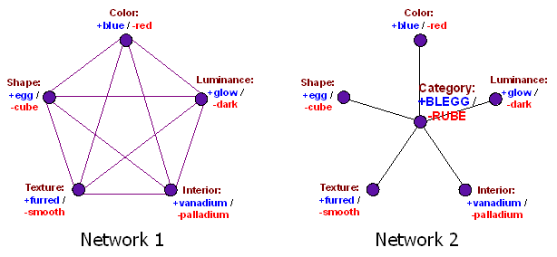

**I.**

“Silliest internet atheist argument” is a hotly contested title, but I have a special place in my heart for the people who occasionally try to prove Biblical fallibility by pointing out whales are not a type of fish.  

"最愚蠢的网络无神论者论点 "是一个很有争议的头衔，但我心中对那些偶尔试图通过指出鲸鱼不是鱼的一种来证明《圣经》的谬误的人有一个特殊的位置。

(this is going to end up being a metaphor for something, so bear with me)  

(这将是一个隐喻，请耐心听我说）。

The argument goes like this. Jonah got swallowed by a whale. But the Bible says Jonah got swallowed by a big fish. So the Bible seems to think whales are just big fish.  

论据是这样的。约拿被鲸鱼吞了但《圣经》说约拿是被一条大鱼吞下去的。所以《圣经》似乎认为鲸鱼就是大鱼。  

Therefore the Bible is fallible. Therefore, the Bible was not written by God.  

因此，《圣经》是易错的。因此，《圣经》不是上帝写的。

The first problem here is that “whale” is just our own modern interpretation of the Bible. For all we know, Jonah was swallowed by a really really really big herring.  

这里的第一个问题是，"鲸鱼 "只是我们对《圣经》的现代解释。据我们所知，约拿是被一条非常非常非常大的鲱鱼吞下去的。

The second problem is that if the ancient Hebrews want to call whales a kind of fish, let them call whales a kind of fish.  

第二个问题是，如果古代希伯来人想把鲸鱼称为鱼的一种，那就让他们把鲸鱼称为鱼的一种吧。

I’m not making the weak and boring claim that since they’d never discovered genetics they don’t know better.  

我并没有软弱而无聊地声称，因为他们从未发现过遗传学，所以他们不知道更好。  

I am making the much stronger claim that, even if the ancient Hebrews had taken enough of a break from murdering Philistines and building tabernacles to sequence the genomes of all known species of aquatic animals, there’s nothing whatsoever wrong, false, or incorrect with them calling a whale a fish.  

我更强烈地声称，即使古代希伯来人从谋杀非利士人和建造帐篷中抽出足够的时间，对所有已知水生动物物种的基因组进行排序，他们称鲸鱼为鱼也没有任何错误、虚假或不正确之处。

Now, there’s something wrong with saying “whales are phylogenetically just as closely related to bass, herring, and salmon as these three are related to each other.” What’s wrong with the statement is that it’s false.  

现在，说 "鲸鱼在系统发育上与鲈鱼、鲱鱼和鲑鱼的亲缘关系就像这三种鱼之间的亲缘关系一样密切 "是有问题的。这句话的错误在于它是错误的。  

But saying “whales are a kind of fish” isn’t.  

但说 "鲸是鱼的一种 "就不对了。

Suppose you travel back in time to ancient Israel and try to explain to King Solomon that whales are a kind of mammal and not a kind of fish.  

假设你穿越时空回到古代以色列，试图向所罗门王解释鲸鱼是哺乳动物的一种，而不是鱼的一种。

Your translator isn’t very good, so you pause to explain “fish” and “mammal” to Solomon.  

你的翻译不是很好，所以你停下来向所罗门解释 "鱼 "和 "哺乳动物"。  

You tell him that fish is “the sort of thing herring, bass, and salmon are” and mammal is “the sort of thing cows, sheep, and pigs are”.  

你告诉他，鱼类是 "鲱鱼、鲈鱼和鲑鱼一类的东西"，哺乳动物是 "牛、羊和猪一类的东西"。  

Solomon tells you that your word “fish” is Hebrew _dag_ and your word “mammal” is Hebrew _behemah_.  

所罗门告诉你，你的 "鱼 "是希伯来文 dag，你的 "哺乳动物 "是希伯来文 behemah。

So you try again and say that a whale is a _behemah_, not a _dag_. Solomon laughs at you and says you’re an idiot.  

于是你又试着说鲸鱼是behemah，而不是dag。所罗门嘲笑你，说你是个白痴。

You explain that you’re not an idiot, that in fact all kinds of animals have things called genes, and the genes of a whale are much closer to those of the other _behemah_ than those of the _dag_.  

你解释说，你不是白痴，事实上，所有动物都有一种叫做基因的东西，鲸鱼的基因比达格的基因更接近其他贝希玛的基因。

Solomon says he’s never heard of these gene things before, and that maybe genetics is involved in your weird foreign words “fish” and “mammal”, but _dag_ are just finned creatures that swim in the sea, and _behemah_ are just legged creatures that walk on the Earth.  

所罗门说，他从来没听说过基因这种东西，也许基因与你们这些奇怪的外来词 "鱼 "和 "哺乳动物 "有关，但 "dag "只是在海里游泳的有鳍生物，而 "behemah "只是在地球上行走的有腿生物。

You try to explain that no, Solomon is wrong, _dag_ are actually defined not by their swimming-in-sea-with-fins-ness, but by their genes.  

你试图解释说，不，所罗门错了，达格人实际上并不是由他们在海中游泳的能力决定的，而是由他们的基因决定的。

Solomon says you didn’t even _know_ the word _dag_ ten minutes ago, and now suddenly you think you know what it means better than he does, who has been using it his entire life? Who died and made _you_ an expert on Biblical Hebrew?  

所罗门说，十分钟前你甚至不知道 "dag "这个词，而现在你突然认为你比他更清楚这个词的意思，而他一辈子都在使用这个词？是谁死后让你成为圣经希伯来语专家的？

You try to explain that whales actually have tiny little hairs, too small to even see, just as cows and sheep and pigs have hair.  

你试着解释说，鲸鱼身上其实有细小的毛发，小得根本看不见，就像牛、羊和猪身上有毛发一样。

Solomon says oh God, you are so annoying, who the hell cares whether whales have tiny little hairs or not.  

所罗门说，哦，上帝，你真讨厌，谁他妈在乎鲸鱼有没有细小的毛发。  

In fact, the only thing Solomon cares about is whether responsibilities for his kingdom’s production of blubber and whale oil should go under his Ministry of Dag or Ministry of Behemah.  

事实上，所罗门唯一关心的是，他的王国生产鲸脂和鲸油的责任应该由他的 "达格部"（Ministry of Dag）还是 "比哈玛部"（Ministry of Behemah）负责。  

The Ministry of Dag is based on the coast and has a lot of people who work on ships.  

达格部设在海岸边，有很多人在船上工作。  

The Ministry of Behemah has a strong presence inland and lots of of people who hunt on horseback.  

贝赫马赫部在内陆有很大的影响力，有很多人骑马打猎。  

So please (he continues) keep going about how whales have little tiny hairs.  

所以，请（他继续）说下去，说鲸鱼是如何长出细小的毛发的。

It’s easy to see that Solomon has a point, and that if he wants to define _behemah_ as four-legged-land-dwellers that’s his right, and no better or worse than your definition of “creatures in a certain part of the phylogenetic tree”.  

不难看出，所罗门说得有道理，如果他想把behemah定义为四条腿的陆地居民，那是他的权利，与你定义的 "系统发育树上某一部分的生物 "没有优劣之分。  

Indeed, it might even be that if you spent ten years teaching Solomon all about the theory of genetics and evolution (which would be hilarious – think how annoyed the creationists would get) he might still say “That’s very interesting, and I can see why we need a word to describe creatures closely related along the phylogenetic tree, but make up your own word, because _behemah_ already means ‘four-legged-land-dweller’.”  

事实上，如果你花十年时间向所罗门传授遗传学和进化论的全部知识（这会很滑稽--想想创世论者会有多恼火吧），他可能还是会说："这很有趣，我明白为什么我们需要一个词来描述在系统发育树上密切相关的生物了，不过你还是自己造一个词吧，因为behemah已经是'四足陆栖动物'的意思了"。

Now imagine that instead of talking to King Solomon, you’re talking to that guy from Duck Dynasty with the really crazy beard (I realize that may describe more than one person), who stands in for all uneducated rednecks in the same way King Solomon stands in for all Biblical Hebrews.  

现在想象一下，你不是在跟所罗门王说话，而是在跟 "鸭子王朝 "里那个留着疯疯癫癫胡子的家伙说话（我知道这描述的可能不止一个人），他代表了所有没受过教育的乡巴佬，就像所罗门王代表了所有《圣经》中的希伯来人一样。

“Ah course a whale is a feesh, ya moron” he says in his heavy Southern accent.  

"他用浓重的南方口音说："啊，鲸鱼当然是鲸鱼了，你这个白痴。

“No it isn’t,” you say. “A fish is a creature phylogenetically related to various other fish, and with certain defining anatomical features.  

"不，不是的，"你说。"鱼是一种在系统发育上与其他各种鱼类有亲缘关系的生物，具有某些明确的解剖学特征。  

It says so right here in this biology textbook.”  

这本生物教科书上就是这么写的。"

“Well,” Crazy Beard Guy tells you, “Ah reckon that might be what a fish is, but a _feesh_ is some’in that swims in the orshun.”  

"好吧，"疯狂大胡子告诉你 "啊，我想那可能就是鱼的意思 但 "鱼 "是游在水里的东西"

With a sinking feeling in your stomach, you spend ten years turning Crazy Beard Guy into a world expert on phylogenetics and evolutionary theory.  

你怀着忐忑不安的心情，花了十年时间把 "疯狂胡须男 "打造成系统发育学和进化论方面的世界级专家。  

Although the Duck Dynasty show becomes _much_ more interesting, you fail to budge him a bit on the meaning of “feesh”.  

虽然 "鸭子王朝 "节目变得有趣多了，但你还是没能让他明白 "feesh "的意思。

It’s easy to see here that “fish” and “feesh” can be different just as “fish” and “_dag_” can be different.  

从这里不难看出，"fish "和 "feesh "可以不同，就像 "fish "和 "dag "可以不同一样。

You can point out how many important professors of icthyology in fancy suits use your definition, and how only a couple of people with really weird facial hair use his.  

你可以指出有多少身着华丽西装的重要鱼类学教授使用你的定义，而只有几个面部毛发非常怪异的人使用他的定义。  

But now you’re making a status argument, not a factual argument.  

但现在你是在进行身份论证，而不是事实论证。  

Your argument is “conform to the way all the cool people use the word ‘fish'”, not “a whale is really and truly not a fish”.  

你的论点是 "符合所有酷人使用'鱼'这个词的方式"，而不是 "鲸鱼真的不是鱼"。

There are facts of the matter on each individual point – whether a whale has fins, whether a whale lives in the ocean, whether a whale has tiny hairs, et cetera.  

鲸鱼是否有鳍，鲸鱼是否生活在海洋中，鲸鱼是否有细小的毛发，等等，每一点都有事实根据。  

But there is no fact of the matter on whether a whale is a fish. The argument is entirely semantic.  

但是，鲸鱼是否属于鱼类并不是事实。这种争论完全是语义上的。

So this is the second reason why this particular objection to the Bible is silly. If God wants to call a whale a big fish, stop telling God what to do.  

这就是为什么反对《圣经》是愚蠢的第二个原因。如果上帝想把鲸鱼称为大鱼，那就别再对上帝指手画脚了。

(also, [bats](http://errancy.org/bats.html)) 蝙蝠

**II.**

When terms are _not_ defined directly by God, we need our own methods of dividing them into categories.  

当上帝没有直接给术语下定义时，我们就需要用自己的方法将它们分门别类。

_Less Wrong_ classic [How An Algorithm Feels From The Inside](http://lesswrong.com/lw/no/how_an_algorithm_feels_from_inside/) starts with a discussion of whether or not Pluto is a planet. Planets tend to share many characteristics in common.  

少错经典算法的内心感受》从讨论冥王星是否是行星开始。行星往往有许多共同特征。  

For example, they are large, round, have normal shaped orbits lined up with the plane of the ecliptic, have cleared out a certain area of space, and are at least kind of close to the Sun as opposed to way out in the Oort Cloud.  

例如，它们又大又圆，具有与黄道面一致的正常轨道形状，清空了一定面积的空间，而且至少有点靠近太阳，而不是在奥尔特云中。

One could imagine a brain that thought about these characteristics like Network 1 here:  

我们可以想象一下，一个大脑是如何思考这些特征的，就像这里的网络 1：

One could imagine this model telling you everything you need to know. If an object is larger, it’s more likely to be round and in cis-Neptunian space.  

我们可以想象一下这个模型，它能告诉你所需要知道的一切。如果一个天体较大，那么它更有可能是圆形的，并且位于顺海王星空间。  

If an object has failed to clear its orbit of debris, it’s more likely to have a skewed orbit relative to the plane of the ecliptic.  

如果一个天体未能清除其轨道上的碎片，那么它的轨道相对于黄道面就更有可能偏斜。  

We could give each of these connections a weight and say things like large objects have a 32% chance of being in cis-Neptunian space and small objects an 86% chance. Or whatever.  

我们可以给每种连接赋予一个权重，比如大型天体有 32% 的几率位于顺海王星空间，小型天体有 86% 的几率位于顺海王星空间。或者别的什么。

But Network 1 has some big problems. For one thing, if you inscribe it in blood, you might accidentally summon the Devil. But for another, it’s computationally very complicated.  

但网络 1 有一些大问题。首先，如果用鲜血刻字，可能会不小心召唤出魔鬼。另外，它的计算非常复杂。  

Each attribute affects each other attribute which affects it in turn and so on in an infinite cycle, so that its behavior tends to be chaotic and unpredictable.  

每个属性都会影响另一个属性，而另一个属性又会反过来影响它，如此无限循环，因此其行为趋于混乱和不可预测。

What people actually seem to do is more like Network 2: sweep all common correlations into one big category in the middle, thus dividing possibility-space into large round normal-orbit solitary inner objects, and small irregular skewed-orbit crowded outer objects.  

实际上，人们的做法似乎更像网络 2：把所有常见的相关性都归入中间的一个大类别，从而把可能性空间划分为大的圆形正常轨道孤独的内部物体和小的不规则倾斜轨道拥挤的外部物体。  

It calls the first category “planets” and the second category “planetoids”.  

它把第一类称为 "行星"，第二类称为 "类行星"。

You can then sweep minor irregularities under the rug.  

这样就可以把小的违规行为一扫而空。  

Neptune is pretty far from the sun, but since it’s large, round, normal-orbit, and solitary, we know which way the evidence is leaning.  

海王星离太阳很远，但由于它又大又圆，轨道正常，而且是单独存在的，所以我们知道证据倾向于哪个方向。

When an object satisfies about half the criteria for planet and half the criteria for planetoid, _then_ it’s awkward. Pluto is the classic example. It’s relatively large, round, skewed orbit, solitary…ish? and outer-ish. What do you do?  

当一个天体满足一半行星标准和一半类地行星标准时，它就很尴尬了。冥王星就是一个典型的例子。它相对较大，呈圆形，轨道倾斜，孤独......是吗？怎么办？

The _practical_ answer is you convene some very expensive meeting of prestigious astronomers and come to some official decision which everyone agrees to follow so they’re all on the same page.  

实际的答案是，你召集一些有名望的天文学家召开一些非常昂贵的会议，然后做出一些官方决定，让所有人都同意遵守，这样他们就都站在同一战线上了。

But the _ideal_ answer is you say “Huh, the assumption encoded in the word ‘planet’ that the five red criteria always went together and the five blue criteria always went together doesn’t hold.  

但理想的答案是，你说："咦，'星球'这个词所包含的假设，即五个红色标准总是在一起，五个蓝色标准总是在一起，并不成立。  

Whatever.”

Then you divide the solar system into three types of objects: planets, planetoids, and dammit-our-categorization-scheme-wasn’t-as-good-as-we-thought.  

然后，你把太阳系分为三类天体：行星、类地行星和该死的--我们的分类方案没有我们想象的那么好。

The situation with whales and fish is properly understood in the same context. Fish and mammals differ on a lot of axes.  

鲸鱼和鱼类的情况也可以在同样的背景下得到正确理解。鱼类和哺乳动物在很多方面都有所不同。  

Fish generally live in the water, breathe through gills, have tails and fins, possess a certain hydrodynamic shape, lay eggs, and are in a certain part of the phylogenetic tree.  

鱼类一般生活在水中，用鳃呼吸，有尾巴和鳍，具有一定的水动力形状，产卵，处于系统发育树的某一部分。  

Mammals generally live on land, breathe through lungs, have legs, give live birth, and are in another part of the phylogenetic tree.  

哺乳动物一般生活在陆地上，用肺呼吸，有腿，活产，属于系统发育树的另一部分。  

Most fish conform to all of the fish desiderata, and most mammals conform to all of the mammal desiderata, so there’s no question of how to categorize them.  

大多数鱼类符合鱼类的所有需要，大多数哺乳动物符合哺乳动物的所有需要，因此不存在如何分类的问题。  

Occasionally you get something weird (a platypus, a lungfish, or a whale) and it’s a judgment call which you have to decide by fiat.  

偶尔你也会遇到一些奇怪的东西（鸭嘴兽、肺鱼或鲸鱼），这就需要你根据自己的判断来决定了。  

In our case, that fiat is “use genetics and ignore all other characteristics” but some other language, culture, or scientific community might make a different fiat, and then the borders between their categories would look a little bit different.  

在我们的例子中，这一规定是 "使用遗传学，忽略所有其他特征"，但其他一些语言、文化或科学界可能会做出不同的规定，那么他们的类别之间的边界看起来就会有些不同。

**III.**

Since I shifted to a borders metaphor, let’s follow that and see where it goes.  

既然我改用了边界的比喻，那我们就顺着它看下去。

Imagine that Israel and Palestine agree to a two-state solution with the final boundary to be drawn by the United Nations.  

设想以色列和巴勒斯坦同意两国解决方案，最终边界由联合国划定。  

You’re the head of the United Nations committee involved, so you get out a map and a pencil. Both sides swear to follow whatever you determine.  

你是联合国相关委员会的负责人，所以你要拿出地图和铅笔。双方发誓遵从你的决定。

Your job is not to draw “the correct border”. There is no one correct border between Israel and Palestine.  

你的工作不是绘制 "正确的边界"。以色列和巴勒斯坦之间没有一条正确的边界。  

There are a couple of very strong candidates (for example, the pre-1967 line of control), but both countries have suggested deviations from that (most people think an actual solution would involve Palestine giving up some territory that has since been thoroughly settled by Israel in exchange for some territory within Israel proper, or perhaps for a continuous “land bridge” between the West Bank and Gaza).  

有几个非常有力的候选方案（例如，1967 年以前的控制线），但两国都建议偏离这一方案（大多数人认为，真正的解决方案将涉及巴勒斯坦放弃以色列已经彻底解决的一些领土，以换取以色列本土的一些领土，或者可能是西岸和加沙之间连续的 "陆地桥梁"）。  

Even if you wanted to use the pre-1967 line as a starting point, there would still be a lot of work to do deciding what land swaps should and shouldn’t be made.  

即使您想以 1967 年以前的界线作为起点，要决定哪些土地应该交换，哪些不应该交换，仍有大量工作要做。

Instead you’d be making a series of trade-offs. Giving all of Jerusalem to the Israelis would make them very happy but anger Palestine.  

相反，你会做出一系列权衡。把整个耶路撒冷交给以色列人会让他们非常高兴，但却会激怒巴勒斯坦。  

Creating a contiguous corridor between Gaza and the West Bank makes some sense, but then you’d be cutting off Eilat from the rest of Israel.  

在加沙和约旦河西岸之间建立一条毗连的走廊有一定道理，但这样就会切断埃拉特与以色列其他地区的联系。  

Giving all of the Israeli settlements in the West Bank back to Palestine would satisfy a certain conception of property rights, but also leave a lot of Jews homeless.  

将约旦河西岸的所有以色列定居点归还巴勒斯坦可以满足某种财产权的概念，但也会让许多犹太人无家可归。

There are also much stupider decisions you could make. You could give Tel Aviv to Palestine.  

你还可以做出更愚蠢的决定。你们可以把特拉维夫交给巴勒斯坦。  

You could make the Palestinian state a perfect circle five miles in radius centered on Rishon LeZion.  

你可以把巴勒斯坦国打造成一个以里申莱锡安为中心、半径五英里的完美圆圈。  

You could just split the territory in half with a straight line, and give Israel the north and Palestine the south. All of these things would be really dumb.  

你可以直接用一条直线将领土一分为二，把北部划给以色列，把南部划给巴勒斯坦。所有这些都是非常愚蠢的做法。

But, crucially, they would not be _false_. They would not be _factually incorrect_. They would just be failing to achieve pretty much any of the goals that we would expect a person solving land disputes in the Middle East to have.  

但至关重要的是，它们不会是错误的。它们不会与事实不符。它们只是没有达到我们期望解决中东土地争端的人所应达到的几乎所有目标。  

You can think of alternative arrangements in which these wouldn’t be dumb.  

你可以想出其他的安排，在这些安排中，这些都不会是哑巴。  

For example, if you’re a despot, and you want to make it very clear to both the Israelis and Palestinians that their opinions don’t matter and they should stop bothering you with annoying requests for arbitration, maybe splitting the country in half north-south is the way to go.  

例如，如果你是一个暴君，你想让以色列人和巴勒斯坦人都明白，他们的意见并不重要，他们应该停止用恼人的仲裁请求来烦你，也许把国家南北分成两半是个好办法。

And real borders are, in fact, very weird.  

事实上，真正的边界是非常奇怪的。

The border between Turkey and Syria follows a mostly straight-ish line near-ish the 36th parallel, except that about twenty miles south of the border Turkey controls a couple of square meters in the middle of a Syrian village.  

土耳其和叙利亚之间的边界线大致呈直线，靠近北纬 36 度线，但在边界以南约 20 英里处，土耳其控制着叙利亚一个村庄中间的几平方米土地。  

This is the tomb of the ancestor of the Ottoman Turks, and Turkey’s border agreement with Syria stipulates that it will remain part of Turkey forever. And the Turks take this _very_ seriously; they maintain a platoon of special forces there and have recently been [threatening war against Syria](http://news.nationalgeographic.com/news/2014/10/141003-suleyman-tomb-ottoman-osman-turkey-syria-isis/) if their “territory” gets “invaded” in the current conflict.  

这是奥斯曼土耳其人祖先的坟墓，土耳其与叙利亚的边境协议规定，这里将永远是土耳其的一部分。土耳其人非常重视这一点；他们在这里驻扎了一个排的特种部队，最近还威胁说，如果他们的 "领土 "在当前的冲突中遭到 "入侵"，他们将对叙利亚开战。

_Pictured: Turkey (inside fence), Syria (outside)  

图为土耳其（围栏内），叙利亚（围栏外）_

The border between Bangladesh and India is complicated at the best of times, but it becomes absolutely ridiculous in a place called Cooch-Behar, which I guess is as good a name as any for a place full of ridiculous things.  

孟加拉国和印度之间的边界在最好的情况下也很复杂，但到了一个叫库奇-贝加尔（Cooch-Behar）的地方就变得绝对荒谬了。  

In at least one spot there is an ‘island’ of Indian territory within a larger island of Bangladeshi territory within a larger island of Indian territory within Bangladesh.  

至少在一个地方，印度领土的 "岛屿 "位于孟加拉国领土的更大岛屿中，而孟加拉国领土的更大岛屿位于印度领土的更大岛屿中。  

According to [mentalfloss.com](http://mentalfloss.com/article/29086/its-complicated-5-puzzling-international-borders):  

据 mentalfloss.com 网站报道：

> So why’d the border get drawn like that?  
> 
> 那么，为什么边界会被画成这样呢？  
> 
> It can all be traced back to power struggles between local kings hundreds of years ago, who would try to claim pockets of land inside each other’s territories as a way to leverage political power.  
> 
> 这一切都可以追溯到数百年前地方国王之间的权力斗争，他们试图在对方的领地内夺取小块土地，以此来攫取政治权力。  
> 
> When Bangladesh became independent from India in 1947 (as East Pakistan until 1971), all those separate pockets of land were divvied up. Hence the polka-dotted mess.  
> 
> 1947 年，孟加拉国从印度独立（1971 年之前为东巴基斯坦），所有这些独立的小块土地被分割开来。因此就出现了圆点状的混乱局面。

Namibia is a very weird-looking country with a very thin three-hundred-mile-long panhandle (eg about twice as long as Oklahoma’s).  

纳米比亚是一个长相非常怪异的国家，有一个长达三百英里的狭长地带（大约是俄克拉荷马州的两倍）。  

Apparently during the Scramble For Africa, the Germans who colonized Namibia really wanted access to the Zambezi River so they could reach the Indian Ocean and trade their colonial resources.  

显然，在 "非洲争夺战 "期间，殖民纳米比亚的德国人非常希望能够进入赞比西河，这样他们就可以到达印度洋，交易他们的殖民资源。  

They kept pestering the British who colonized Botswana until the Brits finally agreed to give up a tiny but very long strip of territory ending at the riverbank.  

他们不断纠缠殖民博茨瓦纳的英国人，直到英国人最终同意放弃以河岸为终点的一小块但很长的领土。  

This turned out to be not so useful, as _just_ after Namibia’s Zambezi access sits Victoria Falls, the largest waterfall in the world – meaning that any Germans who tried to traverse the Zambezi to reach the Indian Ocean would last a matter of minutes before suddenly encountering a four hundred foot drop and falling to pretty much certain death.  

事实证明，这并没有多大用处，因为在纳米比亚的赞比西河通道之后，坐落着世界上最大的瀑布--维多利亚瀑布--这意味着，任何试图穿越赞比西河到达印度洋的德国人，都只能坚持几分钟，然后就会突然遭遇四百英尺的落差，摔得几乎必死无疑。  

The moral of the story is not to pester the British Empire too much, especially if they’ve explored Africa and you haven’t.  

这个故事的寓意是不要过多地纠缠大英帝国，尤其是当他们已经探索了非洲而你还没有的时候。

But the other moral of the story is that borders are weird.  

不过，这个故事的另一个寓意是，边界很奇怪。  

Although we think of borders as nice straight lines that separate people of different cultures, they can form giant panhandles, distant islands, and enclaves-within-enclaves-within-enclaves.  

虽然我们认为边界是一条漂亮的直线，将不同文化背景的人分隔开来，但它也可能形成巨大的盘山公路、遥远的岛屿以及飞地中的飞地。  

They can depart from their usual course to pay honor to national founders, to preserve records of ancient conquests, or to connect to trade routes.  

它们可以偏离通常的路线，以纪念国家的建立者，保存古代征服的记录，或连接贸易路线。

Hume’s ethics restrict “bad” to an instrumental criticism – you can condemn something as a bad way to achieve a certain goal, but not as morally bad independent of what the goal is.  

休谟的伦理学将 "坏 "限制在工具性批判的范围内--你可以谴责某件事是实现某个目标的坏方法，但不能谴责它在道德上是坏的，与目标无关。

In the same way, borders can be bad at fulfilling your goals in drawing them, but not bad in an absolute sense or factually incorrect.

  

同样，边界可能无法实现你绘制边界的目标，但并不是绝对意义上的坏边界或与事实不符。  

Namibia’s border is bad from the perspective of Germans who want access to the Indian Ocean. But it’s _excellent_ from the perspective of Englishmen who want to watch Germans plummet into the Lower Zambezi and get eaten by hippos.  

从想要通往印度洋的德国人的角度来看，纳米比亚的边界很糟糕。但从英国人的角度来看，这却是极好的，因为英国人想看着德国人跌入赞比西河下游，被河马吃掉。

Breaking out of the metaphor, the same is true of conceptual boundaries. You _may_ draw the boundaries of the category “fish” any way you want.  

跳出比喻，概念边界也是如此。你可以随意划定 "鱼 "这个类别的界限。  

A category “fish” containing herring, dragonflies, and asteroids is going to be stupid, but only in the same sense that a Palestinian state centered around Tel Aviv would be stupid – it fails to fulfill any conceivable goals of the person designing it.  

一个包含鲱鱼、蜻蜓和小行星的 "鱼 "类将是愚蠢的，但这与以特拉维夫为中心的巴勒斯坦国是愚蠢的意义相同--它无法实现设计者的任何可以想象的目标。  

Categories “fish” that do or don’t include whales may be appropriate for different people’s purposes, the same way Palestinians might argue about whether the borders of their state should be optimized for military defensibility or for religious/cultural significance.  

对于不同的人来说，"鱼 "的类别包括或不包括鲸鱼可能是合适的，就像巴勒斯坦人可能会争论他们国家的边界是应该为了军事防御性而优化还是为了宗教/文化意义而优化一样。

Statements like “the Zambezi River is full of angry hippos” are brute facts. Statements like “the Zambezi River is the territory of Namibia” are negotiable.  

像 "赞比西河上到处都是愤怒的河马 "这样的说法是粗暴的事实。像 "赞比西河是纳米比亚的领土 "这样的说法是可以商量的。

In the same way, statements like “whales have little hairs” are brute facts. Statements like “whales are not a kind of fish” are negotiable.  

同样，像 "鲸鱼身上的毛很少 "这样的说法是粗暴的事实。而 "鲸鱼不是鱼的一种 "这样的说法是可以商量的。

So it’s important to keep these two sorts of statements separate, and remember that in no case can an agreed-upon set of borders or a category boundary be factually incorrect.  

因此，重要的是要把这两种说法分开，并记住，在任何情况下，商定的边界或类别边界都不能与事实不符。

**IV.**

There is an anti-transgender argument that I take very seriously. The argument goes: we are rationalists. Our _entire shtick_ is trying to believe what’s actually true, not on what we wish were true, or what our culture tells us is true, or what it’s popular to say is true.  

有一种反变性人的论调我非常重视。这个论点是：我们是理性主义者。我们的全部伎俩就是试图相信真正的事实，而不是我们希望的事实，或者我们的文化告诉我们的事实，或者流行说的事实。  

If a man thinks he’s a woman, then we might (empathetically) wish he were a woman, other people might demand we call him a woman, and we might be much more popular if we say he’s a woman.  

如果一个男人认为自己是个女人，那么我们可能会（感同身受地）希望他是个女人，其他人可能会要求我们称他为女人，如果我们说他是个女人，我们可能会更受欢迎。  

But if we’re going to be rationalists who focus on believing what’s actually true, then we’ve got to call him a man and take the consequences.  

但是，如果我们要做一个理性主义者，专注于相信真正的事实，那么我们就必须称他为男人，并承担后果。

Thus Abraham Lincoln’s famous riddle: “If you call a tail a leg, how many legs does a dog have?” And the answer: “Four – because a tail isn’t a leg regardless of what you call it.”  

这就是亚伯拉罕-林肯的著名谜语："如果你把尾巴叫做一条腿 那么一条狗有几条腿？"答案是："四条 - 因为不管你怎么叫，尾巴都不是腿"

(if John Wilkes Booth had to suffer through that riddle, then I don’t blame him)  

(如果布斯不得不忍受这个谜语，那我不怪他）

I take this argument seriously, because sticking to the truth really is important. But having taken it seriously, I think it’s seriously wrong.  

我认真对待这个论点，因为坚持真理确实很重要。但在认真对待之后，我认为它是大错特错的。

An alternative categorization system is not an error, and borders are not objectively true or false.  

另一种分类系统不是错误，边界在客观上也没有真假之分。

Just as we can come up with criteria for a definition of “planet”, we can come up with a definition of “man”.  

正如我们可以为 "地球 "的定义提出标准一样，我们也可以为 "人类 "提出定义。  

Absolutely typical men have Y chromosomes, have male genitalia, appreciate manly things like sports and lumberjackery, are romantically attracted to women, personally identify as male, wear male clothing like blue jeans, sing baritone in the opera, et cetera.  

绝对典型的男性有 Y 染色体，有男性生殖器，欣赏体育和伐木等男子气概的东西，对女性有浪漫的吸引力，个人认同为男性，穿蓝色牛仔裤等男性服装，在歌剧中唱男中音，等等。

Some people satisfy some criteria of manhood and not others, in much the same way that Pluto satisfies only some criteria of planethood and whales satisfy only some criteria of mammalhood.  

有些人符合成人的某些标准，有些人则不符合，就像冥王星只符合行星的某些标准，鲸鱼只符合哺乳动物的某些标准一样。  

For example, gay men might date other men and behave in effeminate ways.  

例如，男同性恋者可能会与其他男性约会，表现得很娘娘腔。  

People with congenital androgen insensitivity syndrome might have female bodies, female external genitalia, and have been raised female their entire life, but when you look into their cells they have Y chromosomes.  

先天性雄激素不敏感综合征患者可能拥有女性的身体、女性的外生殖器，而且一生都是由女性抚养长大，但当你观察他们的细胞时，他们的染色体却是 Y 染色体。

Biologists defined by fiat that in cases of ambiguous animal grouping like whales, phylogenetics will be the tiebreaker.  

生物学家规定，在鲸鱼等动物分类不明确的情况下，系统发育学将是决定胜负的关键。  

This was useful to resolve ambiguity, and it’s worth sticking to as a Schelling point so everyone’s using their words the same way, but it’s kind of arbitrary and mostly based on biologists caring a lot about phylogenetics.  

这对于消除歧义是有用的，而且作为谢林观点值得坚持，这样每个人都能以同样的方式用词，但这有点武断，而且主要是基于生物学家非常关心系统发生学。  

If we let King Solomon make the decision, he might decide by fiat that whether animals lived in land or water would be the tiebreaker, since he’s most interested in whether the animal is hunted on horseback or by boat.  

如果我们让所罗门王来做决定，他可能会擅自决定动物是生活在陆地上还是水里，因为他最关心的是动物是在马背上还是在船上被猎杀。

Likewise, astronomers decided by fiat that something would be a planet if and only if meets the three criteria of orbiting, round, and orbit-clearing.  

同样，天文学家擅自决定，某物只有在满足轨道、圆形和轨道清晰这三个标准的情况下才是行星。  

But here we have a pretty neat window into how these kinds of decisions take place – you can [read the history](http://en.wikipedia.org/wiki/IAU_definition_of_planet) of the International Astronomical Union meeting where they settled on the definition and learn about all the alternative proposals that were floated and rejected and which particular politics resulted in the present criteria being selected among all the different possibilities.  

但在这里，我们有一个很好的窗口，可以了解这类决定是如何做出的--你可以阅读国际天文学联合会确定定义的会议的历史，了解所有被提出和否决的备选方案，以及哪些特定的政治因素导致目前的标准在所有不同的可能性中被选中。  

Here it is _obvious_ that the decision was by fiat.  

很明显，这里的决定是通过法令做出的。

Without the input of any prestigious astronomers at all, most people seem to assume that the ultimate tiebreaker in man vs. woman questions is presence of a Y chromosome.  

在没有任何著名天文学家提供任何意见的情况下，大多数人似乎都认为，在男人和女人的问题上，最终的决定因素是 Y 染色体的存在。  

I’m not sure this is a very principled decision, because I expect most people would classify congenital androgen insensitivity patients (XY people whose bodies are insensitive to the hormone that makes them look male, and so end up looking 100% female their entire lives and often not even knowing they have the condition) as women.  

我不确定这是不是一个非常有原则性的决定，因为我估计大多数人都会把先天性雄性激素不敏感患者（XY 患者的身体对使他们看起来像男性的激素不敏感，因此最终一生看起来都是 100% 的女性，甚至常常不知道自己患有这种疾病）归类为女性。

The project of the transgender movement is to propose a switch from using chromosomes as a tiebreaker to using self-identification as a tiebreaker.  

变性人运动的项目是建议从以染色体为决胜因素转向以自我认同为决胜因素。

(This isn’t actually the whole story – some of the more sophisticated people want to split “sex” and “gender”, so that people who want to talk about what chromosomes they’ve got have a categorization system to do that with, and a few people even want to split “chromosomal sex” and “anatomical sex” and “gender” and goodness knows what else – and I support all of these as very important examples of the virtue of precision – but to a first approximation, they want to define gender as self-identification)  

(实际上，这并不是故事的全部--一些更复杂的人想把 "性 "和 "性别 "分开，这样，想讨论染色体的人就有一个分类系统来讨论这个问题，还有一些人甚至想把 "染色体性别 "和 "解剖性别 "以及 "性别 "分开，天知道还有什么--我支持所有这些，认为它们是精确性美德的非常重要的例子--但在第一近似值中，他们想把性别定义为自我认同）。

This is not something that can be “true” or “false”. It’s a boundary-redrawing project.  

这不是什么 "真 "或 "假 "的问题。这是一个划定边界的项目。  

It can make for some boundaries that look a little bit weird – like a small percent of men being able to get pregnant – but as far as weird boundaries go that’s probably not as bad as having a tiny exclave of Turkish territory in the middle of a Syrian village.  

这可能会造成一些看起来有点怪异的边界--比如一小部分男性可以怀孕--但就怪异的边界而言，这可能还不如在叙利亚村庄中间有一小块土耳其领土飞地来得糟糕。

You draw category boundaries in specific ways to capture tradeoffs you care about.  

您可以用特定的方式划定类别界限，以捕捉您所关心的权衡。  

If you care about the sanctity of the tomb of your country’s founder, sometimes it’s worth having a slightly weird-looking boundary in order to protect and honor it.  

如果你关心自己国家创始人陵墓的神圣性，有时为了保护和纪念它，设置一个看起来有点怪异的边界也是值得的。  

And if you care about…  

如果你关心...

I’m writing this post today because I just finished accepting a transgender man to the mental hospital.  

我今天写这篇文章，是因为我刚刚接受了一个变性人去精神病院。  

He alternates between trying to kill himself and trying to cut off various parts of his body because he’s so distressed that he is biologically female.  

他时而试图自杀，时而试图割掉身体的各个部位，因为他对自己在生理上是女性感到非常痛苦。  

We’ve connected him with some endocrinologists who can hopefully get him started on male hormones, after which maybe he’ll stop doing that and [hopefully](http://thingofthings.wordpress.com/2014/11/13/on-trans-regret/) be able to lead a normal life.  

我们为他联系了一些内分泌专家，希望他们能让他开始使用雄性激素，之后也许他就不会再这样做了，有望过上正常的生活。

If I’m willing to accept an unexpected chunk of Turkey deep inside Syrian territory to honor some random dead guy – and I better, or else a platoon of Turkish special forces will want to have a word with me – then I ought to accept an unexpected man or two deep inside the conceptual boundaries of what would normally be considered female if it’ll save someone’s life.  

如果我愿意接受土耳其在叙利亚境内纵深地带的一块意外之地，以纪念某个随机死去的人--我最好是这样，否则土耳其特种部队的一个排会想和我谈谈--那么我就应该接受在通常被认为是女性的概念边界内纵深地带的一两个意外男人，如果这能救人一命的话。  

There’s no rule of rationality saying that I shouldn’t, and there are plenty of rules of human decency saying that I should.  

没有任何理性规则说我不应该这样做，也有很多人类礼仪规则说我应该这样做。

**V.**

I’ve made this argument before and gotten a reply something like this:  

我曾经提出过这个论点，得到的答复是这样的：

“Transgender is a psychiatric disorder. When people have psychiatric disorders, certainly it’s right to sympathize and feel sorry for them and want to help them.  

"变性是一种精神障碍。当人们患有精神障碍时，同情他们、为他们感到难过并想要帮助他们当然是对的。  

But the way we try to help them is by treating their disorder, not by indulging them in their delusion.”  

但我们帮助他们的方式是治疗他们的失调，而不是放纵他们的妄想"。

I think these people expect me to argue that transgender “isn’t really a psychiatric disorder” or something.  

我觉得这些人希望我辩解说，变性人 "并不是一种真正的精神疾病 "什么的。  

But “psychiatric disorder” is just another category boundary dispute, and one that I’ve already [written enough about elsewhere](http://lesswrong.com/lw/2as/diseased_thinking_dissolving_questions_about/).  

但 "精神障碍 "只是另一个类别的边界争端，我在其他地方已经写得够多了。  

At this point, I don’t care enough to say much more than “If it’s a psychiatric disorder, then attempts to help transgender people get covered by health insurance, and most of the transgender people I know seem to want that, so sure, gender dysphoria is a psychiatric disorder.”  

在这一点上，除了 "如果这是一种精神障碍，那么帮助变性人的尝试就会被纳入医疗保险范围，而我认识的大多数变性人似乎都希望这样，所以当然，性别焦虑症是一种精神障碍 "之外，我并不关心更多。

And then I think of the Hair Dryer Incident.  

然后我想到了 "吹风机事件"。

The Hair Dryer Incident was probably the biggest dispute I’ve seen in the mental hospital where I work.  

在我工作的精神病院里，"吹风机事件 "可能是我见过的最大的纠纷。  

Most of the time all the psychiatrists get along and have pretty much the same opinion about important things, but people were at each other’s _throats_ about the Hair Dryer Incident.  

大多数时候，所有精神科医生都能和睦相处，对重要事情的看法也基本一致，但在 "电吹风事件 "上，大家却互不相让。

Basically, this one obsessive compulsive woman would drive to work every morning and worry she had left the hair dryer on and it was going to burn down her house.  

基本上，这个有强迫症的女人每天早上开车上班时，都会担心自己没关吹风机，吹风机会烧掉她的房子。  

So she’d drive back home to check that the hair dryer was off, then drive back to work, then worry that maybe she hadn’t _really_ checked well enough, then drive back, and so on ten or twenty times a day.  

于是，她开车回家检查吹风机是否关了，然后再开车回去上班，接着又担心自己检查得不够仔细，然后再开车回去，这样一天要做十几二十次。

It’s a pretty typical case of obsessive-compulsive disorder, but it was really interfering with her life. She worked some high-powered job – I think a lawyer – and she was _constantly_ late to everything because of this driving back and forth, to the point where her career was in a downspin and she thought she would have to quit and go on disability.  

这是一个非常典型的强迫症病例，但这真的干扰了她的生活。她从事的是一份高职位的工作--我想是一名律师--因为来回开车，她经常迟到，以至于她的职业生涯陷入了低谷，她以为自己不得不辞职，去做残疾人。  

She wasn’t able to go out with friends, she wasn’t even able to go to restaurants because she would keep fretting she left the hair dryer on at home and have to rush back.  

她不能和朋友外出，甚至不能去餐馆吃饭，因为她总是担心吹风机忘在家里了，必须赶回去。  

She’d seen countless psychiatrists, psychologists, and counselors, she’d done all sorts of therapy, she’d taken every medication in the book, and none of them had helped.  

她看过无数的精神病医生、心理学家和咨询师，接受过各种治疗，吃过书上写的所有药物，但都无济于事。

So she came to my hospital and was seen by a colleague of mine, who told her “Hey, have you thought about just bringing the hair dryer with you?”  

于是她来到我的医院，我的一位同事给她看了病，并告诉她："嘿，你有没有想过把吹风机带上？"

And it _worked_. 它成功了。

She would be driving to work in the morning, and she’d start worrying she’d left the hair dryer on and it was going to burn down her house, and so she’d look at the seat next to her, and there would be the hair dryer, right there.  

她早上开车去上班时，会开始担心吹风机没关好，会把房子烧掉，于是她会看看旁边的座位，吹风机就在那里。  

And she only had the one hair dryer, which was now accounted for. So she would let out a sigh of relief and keep driving to work.  

而且，她只有一个吹风机，现在已经报废了。于是她松了一口气，继续开车去上班。

And approximately half the psychiatrists at my hospital thought this was _absolutely scandalous_, and This Is Not How One Treats Obsessive Compulsive Disorder, and what if it got out to the broader psychiatric community that instead of giving all of these high-tech medications and sophisticated therapies we were just telling people to _put their hair dryers on the front seat of their car_?  

我所在医院大约有一半的精神科医生都认为这绝对是丑闻，这不是治疗强迫症的方法，如果让更多的精神科医生知道，我们不是在提供这些高科技药物和复杂的疗法，而是在告诉人们把吹风机放在汽车前座上，那该怎么办？

But I think the guy deserved a medal.  

但我认为他应该得到一枚奖章。  

Here’s someone who was totally untreatable by the normal methods, with a debilitating condition, and a drop-dead simple intervention that nobody else had thought of gave her her life back.  

这是一个完全无法用常规方法治疗的人，她的病情让她衰弱不堪，而一个别人想都没想过的简单干预却让她重获新生。  

If one day I open up my own psychiatric practice, I am half-seriously considering using a picture of a hair dryer as the logo, just to let everyone know where I stand on this issue.  

如果有一天我开了自己的精神科诊所，我半真半假地考虑用吹风机的图片作为标志，好让大家知道我在这个问题上的立场。

Miyamoto Musashi is quoted as saying:  

有人引用宫本武藏的话说：

> The primary thing when you take a sword in your hands is your intention to cut the enemy, whatever the means.  
> 
> 当你拿起手中的剑时，最重要的是你要斩杀敌人，无论用什么手段。  
> 
> Whenever you parry, hit, spring, strike or touch the enemy’s cutting sword, you must cut the enemy in the same movement. It is essential to attain this.  
> 
> 每当您招架、击中、弹起、击打或触碰到敌人的斩剑时，您必须在同一动作中将敌人斩于剑下。达到这一点至关重要。  
> 
> If you think only of hitting, springing, striking or touching the enemy, you will not be able actually to cut him.  
> 
> 如果只想着打、弹、击或触敌，就无法真正砍到敌人。

Likewise, the primary thing in psychiatry is to help the patient, whatever the means.  

同样，精神病学的首要任务是帮助病人，无论采取什么手段。  

Someone can concern-troll that the hair dryer technique leaves something to be desired in that it might have prevented the patient from seeking a more thorough cure that would prevent her from having to bring the hair dryer with her.  

有人可能会担心，吹风机的技术还有待改进，因为这可能会妨碍病人寻求更彻底的治疗方法，使她不必带着吹风机。  

But compared to the alternative of “nothing else works” it seems clearly superior.  

但与 "其他方法都不管用 "的选择相比，它显然更胜一筹。

And that’s the position from which I think a psychiatrist should approach gender dysphoria, too.  

我认为精神科医生也应该从这个角度来看待性别焦虑症。

Imagine if we could give depressed people a much higher quality of life merely by giving them cheap natural hormones.  

试想一下，如果我们仅仅通过向抑郁症患者提供廉价的天然荷尔蒙，就能让他们的生活质量大大提高。  

I don’t think there’s a psychiatrist in the world who wouldn’t celebrate that as one of the biggest mental health advances in a generation.  

我认为，世界上没有一个精神病医生会不把这当作一代人在心理健康方面取得的最大进步之一来庆祝。  

Imagine if we could ameliorate schizophrenia with one safe simple surgery, just snip snip you’re not schizophrenic anymore. Pretty sure that would win _all_ of the Nobel prizes. Imagine that we could make a serious dent in bipolar disorder just by calling people different pronouns.  

试想一下，如果我们能用一个安全简单的手术来改善精神分裂症，只需剪一剪，你就不再是精神分裂症患者了。这肯定会赢得所有诺贝尔奖。想象一下，我们只需称呼不同的人称代词，就能让躁郁症大为改观。  

I’m pretty sure the entire mental health field would join together in bludgeoning anybody who refused to do that.  

我敢肯定，整个心理健康领域都会联合起来，对拒绝这样做的人痛下杀手。  

We would bludgeon them over the head with big books about the side effects of lithium.  

我们会用关于锂的副作用的大书敲打他们的头。

Really, are you _sure_ you want your opposition to accepting transgender people to be “I think it’s a mental disorder”?  

真的吗，你确定你反对接受变性人的理由是 "我认为这是一种精神障碍 "吗？

**VI.**

Some people can’t leave well enough alone, and continue to push the mental disorder angle. For example:  

有些人就是不死心，继续从精神失常的角度出发。例如：

There are a lot of things I could say here.  

在这里，我有很多话想说。

I could point out that trans-Napoleonism seem to be mysteriously less common than transgender.  

我可以指出，变性-拿破仑主义似乎比变性人更不常见。

I could relate this mysterious difference to the various heavily researched [apparent biological correlates of transgender](http://en.wikipedia.org/wiki/Causes_of_transsexualism#Biological-based_theories), including unusual variants of the androgen receptor, birth-sex-discordant sizes of various brain regions, birth-sex-discordant responses to various pheromones, high rates of something [seemingly like body integrity identity disorder](https://slatestarcodex.com/2013/02/18/typical-mind-and-gender-identity/), and of course our old friend altered digit ratios.  

我可以把这种神秘的差异与变性人的各种经过大量研究的明显生物学相关因素联系起来，包括雄性激素受体的不寻常变体、各种脑区的大小与出生时性别不一致、对各种信息素的反应与出生时性别不一致、身体完整性身份识别障碍的高发率，当然还有我们的老朋友数字比例的改变。  

If our hypothetical trans-Napoleon came out of the womb wearing a French military uniform and clutching a list of 19th century Grand Armee positions in his cute little baby hands, I think I’d take him more seriously.  

如果我们假想中的 "变种拿破仑 "从娘胎里出来时穿着一身法国军装，可爱的小手紧握着一份 19 世纪大军团的职位表，我想我会更认真地对待他。

I could argue that questions about gender are questions about category boundaries, whereas questions about Napoleon – absent some kind of philosophical legwork that I would very much like to read – are questions of fact.  

我可以说，关于性别的问题是关于类别界限的问题，而关于拿破仑的问题--如果没有某种我很想读到的哲学论证--则是关于事实的问题。

I could point out that if the extent of somebody’s trans-Napoleonness was wanting to wear a bicorne hat, and he was going to be suicidal his entire life if he couldn’t but pretty happy if I could, let him wear the damn hat.  

我可以指出，如果某人变性拿破仑的程度仅仅是想戴一顶双角帽，而如果他不能戴上这顶帽子，他一辈子都会有自杀倾向，但如果我能戴上这顶帽子，他就会非常高兴，那就让他戴上这顶该死的帽子吧。

I could just link people to [other](http://freethoughtblogs.com/zinniajones/2012/08/being-a-woman-also-isnt-like-being-napoleon/) [sites’](http://debunkingdenialism.com/2013/12/06/being-transgender-is-nothing-like-having-a-psychotic-napoleon-delusion/) pretty good objections to the same argument.  

我可以把人们链接到其他网站上对同样论点提出的很好的反对意见。

But I think what I actually want to say is that there was once a time somebody tried pretty much exactly this, silly hat and all.  

但我想我想说的是，曾经有一段时间，有人尝试过几乎完全相同的做法，戴着愚蠢的帽子。  

Society shrugged and played along, he led a rich and fulfilling life, his grateful Imperial subjects came to love him, and it’s one of the most heartwarming episodes in the history of one of my favorite places in the world.  

社会对他不屑一顾，他过着富足充实的生活，他的帝国臣民对他感恩戴德，这是我在世界上最喜欢的地方之一的历史上最感人的情节之一。

Sometimes when you make a little effort to be nice to people, even people you might think are weird, [really good things happen](http://en.wikipedia.org/wiki/Emperor_Norton_I).  

有时候，当你努力对别人好一点，即使是你可能认为很奇怪的人，也会有非常好的事情发生。

\[**EDIT:** _I’ve been told some people are misinterpreting this post as “you can define words any way you want, don’t worry about it”. While nothing is _stopping_ you from defining a word any way you want, you should definitely worry about it.  

I had hoped that the Israel/Palestine example above made it clear that you have to deal with the consequences of your definitions, which can include confusion, muddling communication, and leaving openings for deceptive rhetorical strategies.  

我希望上述以色列/巴勒斯坦的例子能让大家明白，你必须面对你的定义所带来的后果，其中可能包括混淆视听、混淆交流，以及为欺骗性修辞策略留下空子。_

_In most cases plausible definitions will be limited to a few possibilities suggested by the territory, with worsening penalties as you deviate from these further._

\[编辑：有人告诉我，有些人把这篇文章误解为 "你可以随心所欲地定义单词，不用担心"。虽然没有任何东西可以阻止你以任何方式定义一个词，但你绝对应该为此担心。 \]  

在大多数情况下，合理的定义将仅限于领土提出的几种可能性，如果进一步偏离这些可能性，则会受到越来越严重的惩罚\]。
