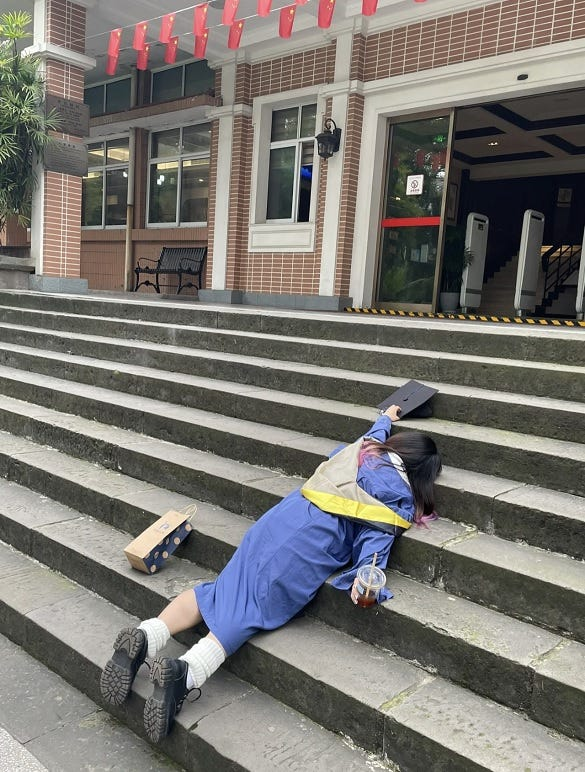
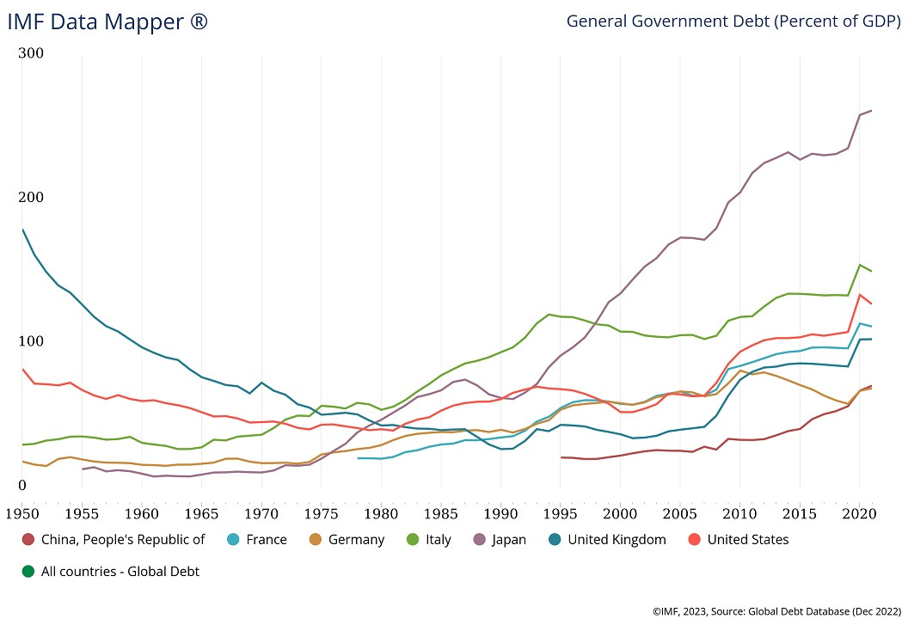
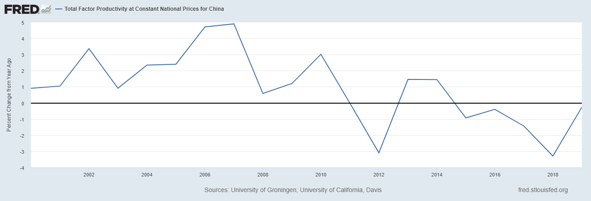
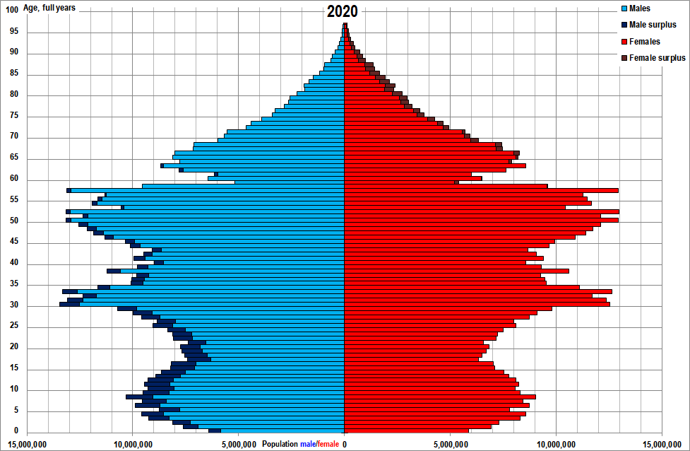

Photo via [Radii](https://radii.co/article/sarcastic-graduation-photos-china-gen-z) 图片来自 Radii

OK, I know I said that [the previous post](https://www.noahpinion.blog/p/china-at-the-peak) in my China’s Economy in 2023 series would be the last one, but I just can’t resist writing one more.  

In the earlier posts I talked mainly about structural long-term issues, but I really should write something about the macroeconomic situation.  

在前面的文章中，我主要谈到了长期结构性问题，但我确实应该写一些关于宏观经济形势的文章。  

好吧，我知道我说过 2023 年中国经济系列的上一篇文章将是最后一篇，但我还是忍不住要再写一篇。

Everyone is talking about China’s economic slowdown.  

每个人都在谈论中国经济放缓。  

China’s headline growth for the second quarter is being reported at 6.3%, which sounds really fast, and which the country’s boosters [have been trumpeting](https://twitter.com/zhang_heqing/status/1681437300167966720) as a sign that China Is Back. But economics writers aren’t being fooled; they know this is a year-on-year figure, and represents a comparison with the darkest days of Zero Covid.  

In fact,据报道，中国第二季度的整体增长率为 6.3%，这听起来非常快，中国的支持者们一直在大肆宣扬这是 "中国回来了"（China Is Back）的标志。但经济学家们并没有被蒙蔽，他们知道这是一个同比数字，是与 "零容忍 "最黑暗时期的对比。 [China’s quarterly growth rate was 0.8%](https://www.bloomberg.com/news/articles/2023-07-21/chip-ceos-urge-us-to-study-impact-of-china-curbs-and-take-pause?sref=R8NfLgwS), which represents a 3.2% annualized rate of growth:  

事实上，中国的季度增长率为 0.8%，年化增长率为 3.2%：

3.2% isn’t that bad; it certainly isn’t a recession. The question is whether or not even that modest number reflects reality. We have [plenty of evidence](https://www.aeaweb.org/articles?id=10.1257/mac.20150074) that China smooths its growth numbers over time; when the economy is slowing down, “smoothing” just means “overstating”. And of course China has become a lot more [cagey and secretive](https://twitter.com/michaelxpettis/status/1682994646547410944) about its economic statistics in the last couple of years, and its leaders want to avoid the perception of economic weakness, so there’s a high likelihood that the real growth number is significantly worse than 3.2%.  

3.2% 并不算太坏，当然也不是经济衰退。问题是，即使是这个适度的数字，是否也反映了现实。我们有大量证据表明，随着时间的推移，中国会平滑其经济增长数字；当经济放缓时，"平滑 "就意味着 "夸大"。当然，在过去几年中，中国对其经济统计数据变得更加谨慎和神秘，中国领导人也希望避免让外界认为其经济疲软，因此实际增长数字很有可能远低于 3.2%。

Other numbers generally corroborate that story. China’s youth unemployment has risen from 11% or so before the pandemic to [over 20% now](https://www.bbc.com/news/business-66219007), exports and imports are [both falling](https://www.bloomberg.com/news/articles/2023-07-13/china-s-exports-drop-for-second-month-in-blow-to-slowing-economy), and the country appears to be [heading for deflation](https://www.bloomberg.com/news/articles/2023-07-10/china-s-inflation-rate-slows-to-zero-as-economic-woes-mount?sref=R8NfLgwS) if it isn’t there already:  

其他数据也普遍证实了这一点。中国的青年失业率已从大流行前的 11% 左右上升到现在的 20% 以上，出口和进口都在下降，中国似乎正在走向通货紧缩，如果它还没到那一步的话：

The reason for this downturn — whether or not you want to call it a “recession” — is clear to pretty much everyone. It’s [the real estate sector](https://www.noahpinion.blog/p/real-estate-is-chinas-economic-achilles), which has been China’s biggest economic engine since at least 2008, and which has now mostly ground to a halt after a bunch of developers blew up.  

这次经济下滑的原因--无论你是否愿意称之为 "衰退"--几乎每个人都很清楚。至少自 2008 年以来，房地产行业一直是中国最大的经济引擎，而现在，随着大量开发商倒闭，房地产行业已基本停滞。

Whether this is a bad thing for the rest of the world isn’t yet clear.  

对于世界其他地区来说，这是否是一件坏事还不清楚。  

On one hand, China used to be the largest contributor to global economic growth, and at least until recently was expected to be this in the 2020s as well.  

一方面，中国曾经是全球经济增长的最大贡献者，至少直到最近，预计在 2020 年代也将如此。  

On the other hand, a collapse in Chinese demand for imported commodities has helped lower inflation around the world, and the diversion of international investment from China to other countries could give them a boost.  

另一方面，中国对进口商品需求的下降帮助降低了全球通胀，而国际投资从中国转向其他国家也会给这些国家带来提振。

But either way, China’s policymakers will certainly be looking for ways out of this downturn. So far, the main ideas being suggested are basically the tools the U.S. used to fight its own housing-driven crash in 2008: fiscal stimulus and a central government bailout of bad debts.  

但无论如何，中国的政策制定者肯定会寻找摆脱经济下滑的方法。到目前为止，人们提出的主要想法基本上都是美国在 2008 年应对本国房地产崩盘时所使用的工具：财政刺激和中央政府救助坏账。

The economist Richard Koo was one of the intellectual heroes of the Great Recession.  

经济学家理查德-顾（Richard Koo）是大衰退中的知识英雄之一。  

Having carefully watched Japan’s bubble bust and “lost decade” in the 1990s, he came up with the idea of the “balance sheet recession”.  

他仔细观察了日本上世纪 90 年代的泡沫破灭和 "失去的十年"，提出了 "资产负债表衰退 "的观点。  

This is the idea that when a recession follows a big borrowing binge, households and/or companies stop borrowing and start trying to “rebuild” their balance sheets.  

这种观点认为，在大举借贷之后出现衰退时，家庭和/或公司会停止借贷，并开始努力 "重建 "资产负债表。  

Of course if everyone tries to save money all at once, it means people stop consuming and companies stop investing. That exacerbates the recession.  

当然，如果每个人都想一下子把钱存起来，就意味着人们停止消费，公司停止投资。这就加剧了经济衰退。

Koo’s analysis isn’t very different from traditional Keynesian economics, but it assumes a specific type of what Keynes called “animal spirits”.  

Koo 的分析与传统的凯恩斯主义经济学并无太大区别，但它假设了一种凯恩斯所谓的 "动物精神"。  

Basically, it’s the idea that when the economy gets weaker, people are more sensitive to debt.  

基本上，这种观点认为，当经济疲软时，人们对债务更加敏感。  

Maybe when it’s 2006 and everyone is seeing their house prices go way up, you don’t mind having a bunch of debt because you expect price appreciation to pay it off for you, or maybe you’re just having so much fun you’re not really paying attention to the “liabilities” side of the ledger.  

也许在 2006 年，当所有人都看到自己的房价一路上涨时，你并不介意背负一大堆债务，因为你期望房价升值能帮你还清债务；也许你只是玩得太开心了，并没有真正关注账本上的 "负债 "部分。  

But when it’s 2010 and your house is underwater, maybe you go into financially-conservative mode and decide that you had better pinch every penny you can.  

但到了 2010 年，当你的房子处于水下时，也许你就会进入财务保守模式，决定最好能抠出每一分钱。  

There are lots of reasons people could behave like this — extrapolative expectations, limited attention, time-varying [credit constraints](https://www.nber.org/papers/w15817), or various other reasons. But the [evidence](https://www.imf.org/external/pubs/ft/wp/2015/wp1535.pdf) generally [favors](http://conference.nber.org/confer/2015/EASE15/Jorda_Schularick_Taylor.pdf) the idea that downturns with a bunch of debt are deeper and last longer.  

人们有很多原因会做出这样的行为--推断性预期、有限的注意力、随时间变化的信贷限制或其他各种原因。但证据普遍支持这样的观点，即有大量债务的经济衰退程度更深，持续时间更长。

And the basic policy recommendation is the same: to fight a recession, make people and companies feel financially healthy again.  

基本的政策建议也是一样的：为了应对经济衰退，让人们和公司重新感到财务健康。  

This means either bailouts and/or fiscal stimulus — either have the central government explicitly take on the debts of various other actors in the economy, or have it spend a bunch of money that people can use to pay down their own debts.  

这意味着要么采取救助措施和/或财政刺激措施--要么让中央政府明确承担经济中其他各行为体的债务，要么让中央政府花一大笔钱，让人们用这笔钱偿还自己的债务。

(Note: This is a _little_ different than standard Keynesianism, which recommends fiscal stimulus as a way to jump-start spending activity via multiplier effects.  

In Koo’s modified version, stimulus helps even if the multiplier is low; even if people just save their government checks instead of spending them, that will help repair their balance sheets and eventually make them more confident about spending more.)  

在 Koo 的修改版本中，即使乘数很低，刺激措施也会有帮助；即使人们只是把政府支票存起来而不是花掉，这也会有助于修复他们的资产负债表，最终让他们更有信心花更多的钱）。  

(注：这与标准的凯恩斯主义略有不同，后者建议采取财政刺激措施，通过乘数效应来启动支出活动。

So anyway as you might expect, [Koo is suggesting](https://www.bloomberg.com/news/articles/2023-06-29/inventor-of-balance-sheet-recession-says-china-is-now-in-one?sref=R8NfLgwS) that China do both stimulus and bailouts. This is from [his interview](https://www.bloomberg.com/news/articles/2023-07-10/richard-koo-on-china-s-risk-of-a-japan-style-balance-sheet-recession?sref=R8NfLgwS) on the Odd Lots podcast:  

因此，无论如何，正如您所预料的那样，辜胜阻建议中国同时采取刺激和救助措施。这是他在 Odd Lots 播客中的访谈内容：

> \[T\]he private sector themselves cannot change their behavior -- after all, they're doing the right things: trying to repair their balance sheets -- then the government has to come in and borrow and put that money back into the income stream, which means fiscal stimulus is absolutely essential once you're in balance sheet recession.  
> 
> \[私营部门本身无法改变自己的行为--毕竟他们在做正确的事情：努力修复资产负债表--那么政府就必须介入并借贷，将这些钱重新投入到收入流中，这意味着一旦陷入资产负债表衰退，财政刺激是绝对必要的。

Now, the basic macroeconomic argument for stimulus looks pretty strong.  

现在，刺激经济的基本宏观经济论据看起来非常有力。  

Rising youth unemployment and deflation both suggest a lack of aggregate demand, which is the typical Keynesian reason for stimulus. Chinese households have [boosted their savings rates](https://www.bloomberg.com/news/articles/2023-07-17/china-s-economic-recovery-loses-steam-as-gdp-disappoints?sref=R8NfLgwS) in recent years, suggesting a Keynesian “paradox of thrift” is going on. And China’s high amount of private-sector debt — [substantially higher as a share of GDP](https://www.wsj.com/articles/fueled-by-long-credit-binge-chinas-economy-faces-drag-from-debt-purge-e4621859) than either the U.S. or the Eurozone — suggests that the central government could afford to assume some of this debt.  

青年失业率上升和通货紧缩都表明总需求不足，而这正是典型的凯恩斯主义刺激理由。中国家庭近年来提高了储蓄率，这表明凯恩斯主义的 "节俭悖论 "正在发生。而中国私营部门的高额债务--占 GDP 的比重远高于美国或欧元区--表明中央政府有能力承担部分债务。

China certainly has the fiscal “space” to do massive stimulus and/or bailouts.  

中国当然有足够的财政 "空间 "来实施大规模的经济刺激和/或救市措施。  

Its central government debt to GDP ratio is only around 80% of GDP — about where Japan’s was at the start of its lost decade, and much lower than where the U.S., Japan, or most of Europe are today:  

其中央政府债务与 GDP 的比率仅为 GDP 的 80% 左右--与日本在失去的十年之初的比率差不多，比美国、日本或欧洲大部分国家今天的比率要低得多：

Source: IMF 来源：国际货币基金组织资料来源：国际货币基金组织

But a couple points here. First, China is a very low-tax country. Taxes were [less than 20% of GDP in 2022](https://www.bloomberg.com/news/articles/2023-06-14/potential-tax-increases-in-china-risk-political-backlash-for-xi?sref=R8NfLgwS), compared to about 33% in Japan and 27% in the U.S. And that number has gone _down_ in recent years:  

但这里有几点。首先，中国是一个税率很低的国家。2022 年，税收占 GDP 的比例不到 20%，而日本和美国分别为 33% 和 27%：

If China’s central government does stimulus, it will either have to raise taxes or accept a very large, very rapid runup in government debt.  

如果中国中央政府采取刺激措施，要么增加税收，要么接受政府债务大幅、快速增加。  

Raising taxes could be politically quite difficult, and there’s also [eventually some limit](https://www.noahpinion.blog/p/no-one-knows-how-much-the-government) to how much debt the central government can take on before economic problems start emerging. So these will hamper China’s attempts to do big sustained stimulus.  

This probably explains the提高税收在政治上可能相当困难，而且在经济问题开始显现之前，中央政府能够承担的债务最终也会受到一定限制。因此，这些都将阻碍中国实施大规模持续刺激政策的尝试。 [general skepticism](https://www.bloomberg.com/news/articles/2023-07-20/china-s-ultra-long-bonds-are-the-hottest-trade-on-economic-gloom?utm_source=website&utm_medium=share&utm_campaign=twitter&sref=R8NfLgwS) about whether China will take this route.  

这也许就是人们对中国是否会走这条路普遍持怀疑态度的原因。

Next, it’s far from clear that stimulus will make China avoid Japan’s fate. Koo writes:  

其次，刺激政策能否使中国避免日本的命运还很不确定。辜胜阻写道：

> And so my guess is that Chinese government will put in the fiscal stimulus, which they're actually quite good at, and that will keep the recession from turning into a depression or something.  
> 
> 因此，我猜测中国政府会采取财政刺激措施，这其实是他们非常擅长的，这将使经济衰退不至于演变成大萧条什么的。  
> 
> So that's the key difference between the Japanese situation 30 years ago and what the Chinese may be faced with today…  
> 
> 这就是日本 30 年前的情况与中国今天可能面临的情况之间的主要区别......

But if you look at the chart above, you can see that starting in 1993, Japan started to run _very_ large and _very_ sustained fiscal deficits. And in fact those deficits are probably one reason why Japan avoided a large increase in unemployment during its “lost decade”. Japan’s stimulus [was macroeconomically successful](https://www.nytimes.com/2014/10/31/opinion/paul-krugman-apologizing-to-japan.html). It just didn’t stop Japan from becoming “Japanified”. So I’m not sure we should expect even a large Chinese stimulus to achieve significantly better results.  

但如果你看一下上图，就会发现从 1993 年开始，日本开始出现非常巨大和持续的财政赤字。事实上，这些赤字可能是日本在 "失去的十年 "中避免失业率大幅上升的原因之一。日本的刺激政策在宏观经济上是成功的。只是没有阻止日本走向 "日本化"。因此，我不确定我们是否应该期待中国的大规模刺激政策能取得明显更好的效果。

Some people argue that because Chinese property prices aren’t actually plummeting — as Japanese commercial real estate prices did in the early 90s — that China can avoid Japan’s fate.  

有些人认为，由于中国房地产价格并未像日本商业房地产价格在上世纪 90 年代初那样暴跌，因此中国可以避免日本的命运。  

And maybe that’s true — if credit constraints are the reason for balance sheet recessions, then maybe having real estate that’s still worth a lot on paper can help avoid the economic harms of a debt hangover.  

也许这是真的--如果信贷限制是资产负债表衰退的原因，那么也许拥有在纸面上仍然价值不菲的房地产可以帮助避免债务宿醉对经济造成的危害。

But I have my doubts. At this point, Chinese people no longer think of real estate as an asset that always goes up in price.  

但我对此表示怀疑。在这一点上，中国人不再认为房地产是一种永远会涨价的资产。  

Even if prices don’t plummet, the extrapolative expectations are gone; most people know that the only way to avoid selling their houses at a big loss will be not to sell at all.  

即使房价没有暴跌，推断性预期也已不复存在；大多数人都知道，避免亏本卖房的唯一办法就是根本不卖。  

And if you can’t sell an asset for cash, what’s it really worth?  

如果你无法出售资产换取现金，那么它到底值多少钱？

Japan comparisons aside, there’s the question of what China would actually spend stimulus money on.  

撇开与日本的比较不谈，中国究竟会把刺激经济的钱花在什么地方也是个问题。  

Koo suggests that China’s government spend money on completing the uncompleted houses that have made lots of people so mad:  

辜濂松建议，中国政府应斥资完成那些让很多人抓狂的楼花：

> I would recommend Chinese government to go in there and help those construction companies so that all the promised construction will be actually completed.  
> 
> 我建议中国政府到那里去，帮助那些建筑公司，使所有承诺的工程都能真正完工。  
> 
> I think that will be the most effective way to spend fiscal stimulus, fiscal money.  
> 
> 我认为，这将是使用财政刺激措施、财政资金的最有效方式。

This might be a good idea, but it would be pretty small potatoes. China was estimated in 2022 to have up to [225 million square meters](https://www.bloomberg.com/news/articles/2022-07-21/china-s-225-million-square-meters-of-unfinished-homes-chart?sref=R8NfLgwS) of unfinished homes (though some of that has probably since been completed or scrapped).  

That sounds like a lot, until you realize that it’s only 15% of Chinese housing construction in 2021, and less than 7% of the total number of这或许是个好主意，但也只是小打小闹。据估计，2022 年中国将有多达 2.25 亿平方米的未完工住宅（尽管其中一些可能已经完工或报废）。 _unsold_ homes China already has [sitting on the market](https://www.wsj.com/articles/chinas-smaller-cities-struggle-to-unload-empty-apartments-1a70f551).  

这听起来似乎很多，但你要知道，这只是 2021 年中国住房建设总量的 15%，还不到中国市场上未售出住房总量的 7%。

There are also several big problems with the general idea of using stimulus to prop up the real estate industry. This is what China [did again and again](https://www.noahpinion.blog/p/what-does-china-have-to-lose-from) throughout the late 2000s and 2010s; when Koo says China’s government is “actually quite good at” stimulus, this is what he’s talking about.  

But those years of real-estate-focused stimulus came with major costs — in particular, a massively bloated real estate sector and slower productivity growth.  

但是，这些年以房地产为重点的刺激政策也付出了重大代价--尤其是房地产行业的大规模臃肿和生产率增长的放缓。  

利用刺激政策扶持房地产业的总体思路也存在几个大问题。这正是中国在 2000 年代末和 2010 年代一再采取的做法；当辜胜阻说中国政府 "实际上相当擅长 "刺激政策时，他说的就是这个意思。

So trying to go back to that well once again might cement China in the dread middle-income trap.  

因此，试图再次回到那口井，可能会使中国陷入可怕的中等收入陷阱。

Second, China’s ability to use real estate as stimulus was predicated on the expectation that prices would always go up, which created ever-greater demand for the new apartments that were being pumped out.  

其次，中国利用房地产刺激经济的能力是建立在房价会一直上涨的预期之上的，这就对不断推出的新公寓产生了更大的需求。  

That’s probably gone now; China has reached developed-world levels of floor space per person, and Chinese people have now spent a couple years watching prices drift downward.  

现在这种情况可能已经一去不复返了；中国的人均建筑面积已经达到了发达国家的水平，中国人已经花了几年时间看着房价一路下滑。  

So the extrapolative expectations that motivated whole families — eight grandparents, two parents, and a young couple — to pool their life’s savings to buy a _single urban apartment_ have probably been destroyed.  

因此，当初促使整个家庭--祖父母八人、父母两人和一对年轻夫妇--集毕生积蓄购买一套城市公寓的推断性期望可能已经破灭。

In other words, having the central government borrow a large percentage of GDP and hurl it at the housing market will probably not be a very effectual form of stimulus.  

换句话说，让中央政府借入占国内生产总值很大比例的资金，并将其投向房地产市场，可能不会是一种非常有效的刺激方式。

The other big suggestion I’ve seen is to have the central government use stimulus money to [bail out local governments](https://www.washingtonpost.com/world/2023/06/02/china-cities-debt-default/), which ran up a ton of real-estate-related debt. I don’t see the point of that.  

China’s local governments have a lot of debt because they don’t do property taxation, so bailing them out will not allow them to start spending more, now that land sales revenues have dried up.  

中国的地方政府因为不征收房产税而负债累累，所以在土地出让收入枯竭的情况下，救助他们并不能让他们开始增加支出。  

Instead, China’s government can (and probably will) take over some of the day-to-day funding of local governments, though this will require raising income taxes or sales taxes or some such.  

相反，中国政府可以（而且很可能会）接管地方政府的部分日常资金，不过这需要提高所得税或销售税之类的税收。  

我看到的另一个重要建议是让中央政府用刺激经济的资金来救助地方政府，因为地方政府积累了大量与房地产相关的债务。我不明白这有什么意义。

Instead, what China should do is just have the central government cut a bunch of checks to Chinese households.  

相反，中国应该做的是让中央政府向中国家庭开出一大堆支票。  

If they went out and spent the money, good — that would deal with the aggregate demand problem.  

如果他们出去把钱花掉了，那很好，这样就能解决总需求问题。  

And if they used the money to pay down their debts, also good — that would help deal with the balance-sheet problem.  

如果他们用这笔钱偿还债务，也很好--这将有助于解决资产负债表问题。

I’m not sure whether China’s government feels comfortable dropping money out of a helicopter, but it seems like the best way to give their economy a short-term boost.  

我不确定中国政府是否愿意从直升机上撒钱，但这似乎是短期刺激经济的最佳方式。

But there’s one more big thing I think China can and should do.  

但是，我认为中国还可以而且应该做一件大事。

Some people argue against using a short-term macroeconomic crisis as a reason to undertake needed long-term structural reforms. I don’t see the point of that argument.  

有些人反对以短期宏观经济危机为由进行必要的长期结构改革。我不明白这种说法有什么意义。  

If there are reforms you need to make anyway, and if they involve spending more government money, then a recession seems like a perfect time to do them.  

如果无论如何都需要进行改革，而改革又涉及花费更多的政府资金，那么经济衰退似乎是进行改革的最佳时机。

In China’s case, the reform it needs is a world-class health government-funded health care system.  

就中国而言，它需要的改革是由政府资助的世界级医疗保健体系。  

China still spends very little of its GDP on health care compared to advanced economies:  

与发达经济体相比，中国在医疗保健方面的投入仍然只占国内生产总值的很小一部分：

Although China nominally has universal health coverage, it’s actually [pretty patchwork and subpar](https://www.publichealth.columbia.edu/research/others/comparative-health-policy-library/china-summary):  

虽然中国名义上实现了全民医保，但实际上非常零散，而且质量不高：

> Since 2016, the two main \[Chinese health insurance\] programs covering 95% of population are voluntary, residency-based, basic medical insurance; and mandatory employment-based program for urban residents with formal-sector jobs…Although China has universal coverage, it has a very entrepreneurial, unregulated healthcare system which led to some gaps in the system…  
> 
> 自 2016 年以来，\[中国医疗保险\] 的两大项目覆盖了 95% 的人口，即自愿参加的、以居住地为基础的基本医疗保险；以及为有正式工作的城镇居民提供的、以就业为基础的强制性项目......虽然中国实现了全民医保，但它的医疗系统非常企业化、不规范，导致系统中存在一些漏洞......
> 
> The health system is [conflicted between stressing quality of care or spreading the scarce medical resources](https://www.britannica.com/place/China) as widely as possible. As evaluated on a per capita basis, China’s health facilities remain unevenly distributed.  
> 
> Only about half of the country’s medical and health personnel work in rural areas, where approximately three-fifths of the population resides.  
> 
> 全国只有约一半的医疗卫生人员在农村地区工作，而农村地区的人口约占全国人口的五分之三。  
> 
> The severest limitation on the availability of health services, however, appears to be an absolute lack of resources, rather than discrimination in access on the basis of the ability of individuals to pay.  
> 
> 然而，对提供医疗服务的最严重限制似乎是资源的绝对匮乏，而不是基于个人支付能力的歧视。  
> 
> An extensive system of paramedical care has been fostered as the major medical resource available to most of the rural population, but the care has been of uneven quality.  
> 
> 作为大多数农村人口可利用的主要医疗资源，一个广泛的辅助医疗系统得到了发展，但医疗质量参差不齐。  
> 
> 在强调医疗质量与尽可能广泛地分配稀缺的医疗资源之间，卫生系统面临着矛盾。按人均计算，中国的卫生设施分布仍不均衡。

Basically, China’s health care system isn’t great because they just don’t spend very much. Well, time to spend more.  

从根本上说，中国的医疗保健系统并不完善，因为他们的投入并不多。那么，是时候多花点钱了。  

A massive program of government spending on health care would work as fiscal stimulus even as it also fixed one of the most glaring holes in the Chinese economic model.  

政府在医疗保健方面的大规模支出计划将起到财政刺激作用，同时还能弥补中国经济模式中最明显的漏洞之一。

It would also deal with that pesky youth unemployment problem.  

它还能解决烦人的青年失业问题。  

Health care is one of the most labor-intensive industries, so in terms of providing jobs for youngsters, it makes a good replacement for the anemic real estate industry.  

医疗保健业是劳动密集型产业之一，因此在为年轻人提供工作岗位方面，它可以很好地替代不景气的房地产业。

It’s also something China is just going to have to do anyway. A huge cohort of Chinese people in their 50s is about to enter old age:  

无论如何，这也是中国必须要做的事情。一大批 50 多岁的中国人即将步入老年：

By Rickky1409 - [Own work](https://commons.wikimedia.org/w/index.php?curid=115105007), CC BY-SA 4.0  

作者 Rickky1409 - 自己的作品，CC BY-SA 4.0

Without a world-class health care system, the burden of caring for these old folks when they get sick or disabled is going to fall on young workers.  

如果没有世界一流的医疗保健系统，当这些老人生病或致残时，照顾他们的重担就会落在年轻工人身上。  

That eldercare burden will draw young healthy people (especially women) away from productive work, and force them to spend their time doing tasks for which they are not specialized.  

这种照顾老人的负担将使年轻健康的人们（尤其是妇女）远离生产性工作，迫使他们把时间花在做自己不擅长的工作上。

Which will starve Chinese companies of needed labor and reduce potential growth.

  

这将使中国企业无法获得所需的劳动力，并降低潜在的增长潜力。

Building a world-class health care system could avert this fate.  

建立世界一流的医疗保健系统可以避免这种命运。  

Maybe the Chinese government won’t do this; maybe Xi Jinping thinks that health care is weak and decadent, and that Real Men (TM) work in factories or construction sites.  

也许中国政府不会这样做；也许习近平认为医疗保健薄弱而颓废，真正的男人（TM）应该在工厂或建筑工地工作。  

But what America’s New Dealers realized is that if you lower the amount of time that young people have to spend taking care of grandma and grandpa, you free up young people for more productive work.  

但美国的新政者们意识到，如果减少年轻人照顾爷爷奶奶的时间，就能解放年轻人，让他们从事更有生产力的工作。  

China would be wise to follow that example. And an economic downturn is a perfect chance to do this.  

中国最好能以此为榜样。而经济衰退正是这样做的绝佳机会。

So those are my two suggestions for China to get its flagging economy on its feet: Cut big checks to households, and rapidly build out a top-notch government-funded health care system.  

以上就是我对中国经济复苏的两点建议：向家庭发放大额支票，迅速建立由政府资助的一流医疗保健系统。  

Those will both require spending a lot of central government money, and — eventually, not right now — raising taxes to developed-world levels.  

这都需要中央政府花费大量资金，并最终（不是现在）将税收提高到发达国家的水平。  

But the alternative is to experience a protracted downturn as real estate prices go sideways for a decade and economic pessimism becomes entrenched.  

但另一种选择则是，房地产价格在十年内持续低迷，经济悲观情绪根深蒂固。  

And spending money on consumption and health care will yield a lot more bang for the buck than hurling it directly into the maw of the real estate mess.  

而把钱花在消费和医疗保健上，要比直接扔进房地产的泥潭里划算得多。  

Either way, Chinese growth is going to slow down going forward, but I think my two suggestions would make that transition a lot less painful.  

无论如何，中国的经济增长在未来都会放缓，但我认为我的两个建议会让这种过渡的痛苦减少很多。

[Share 分享](https://www.noahpinion.blog/p/what-should-china-do-to-revive-its?utm_source=substack&utm_medium=email&utm_content=share&action=share)
