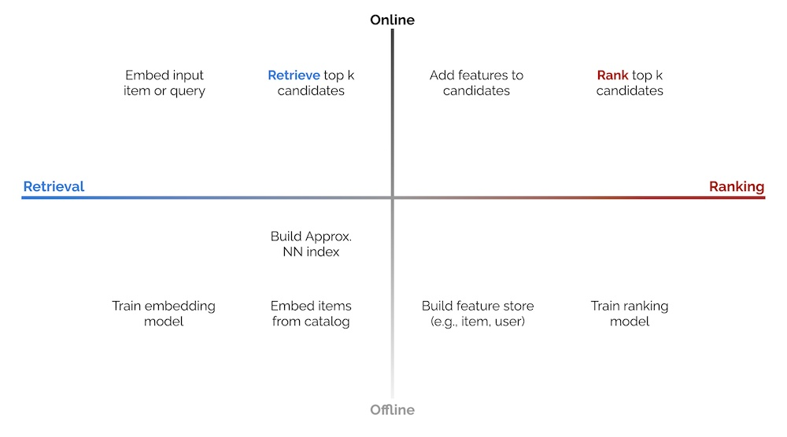
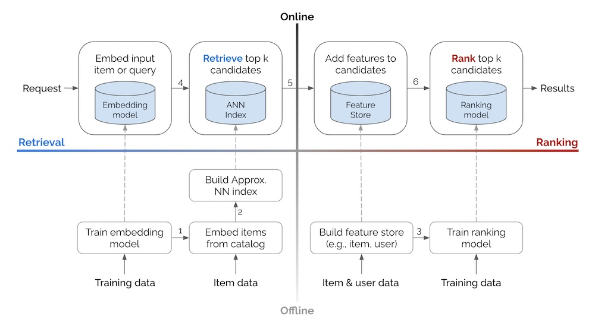
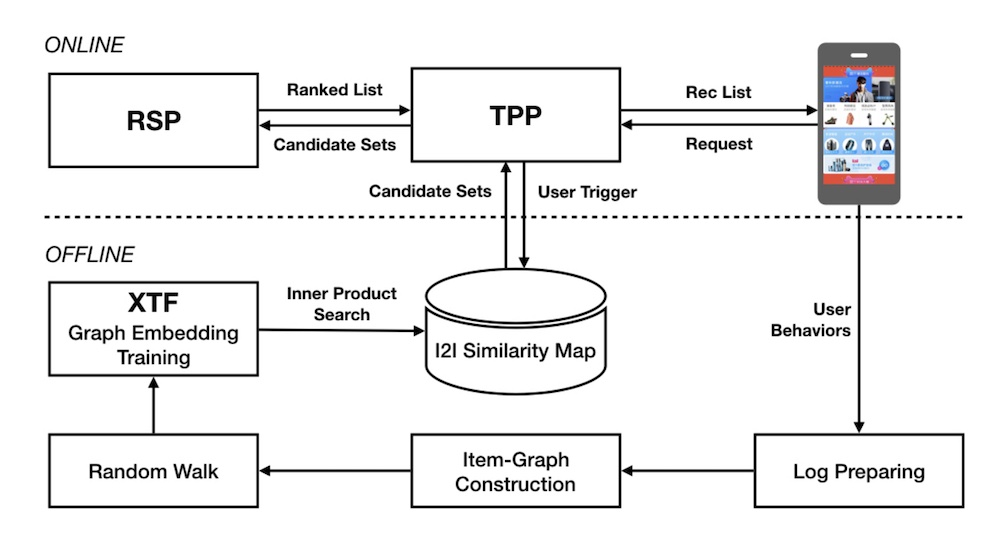
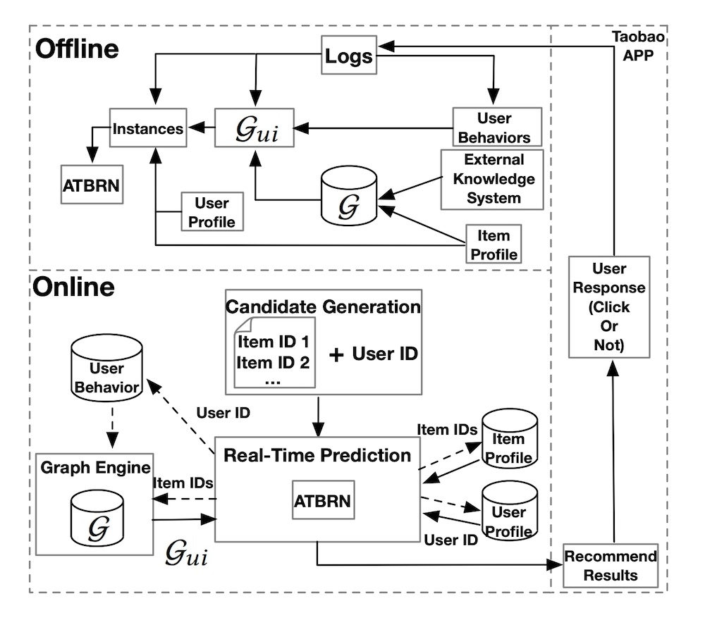
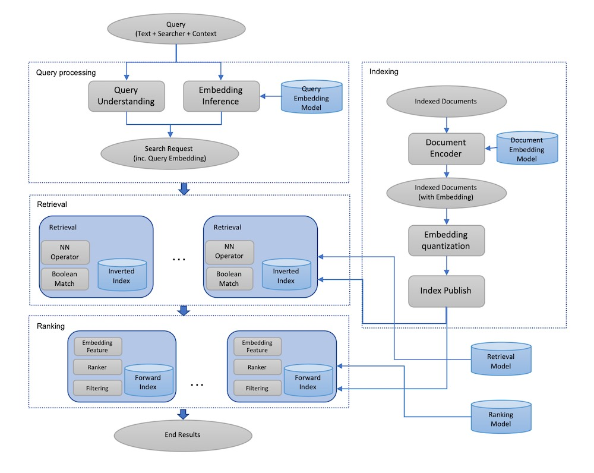
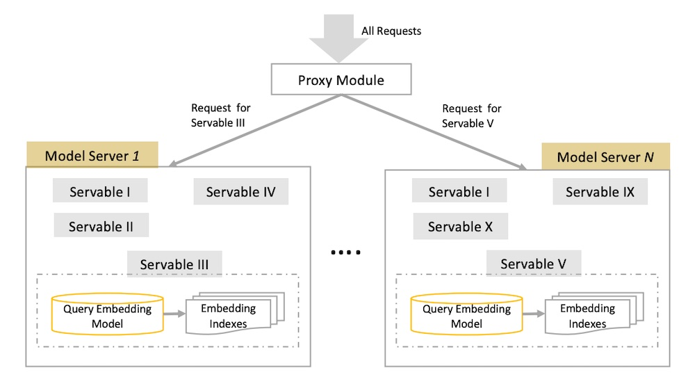
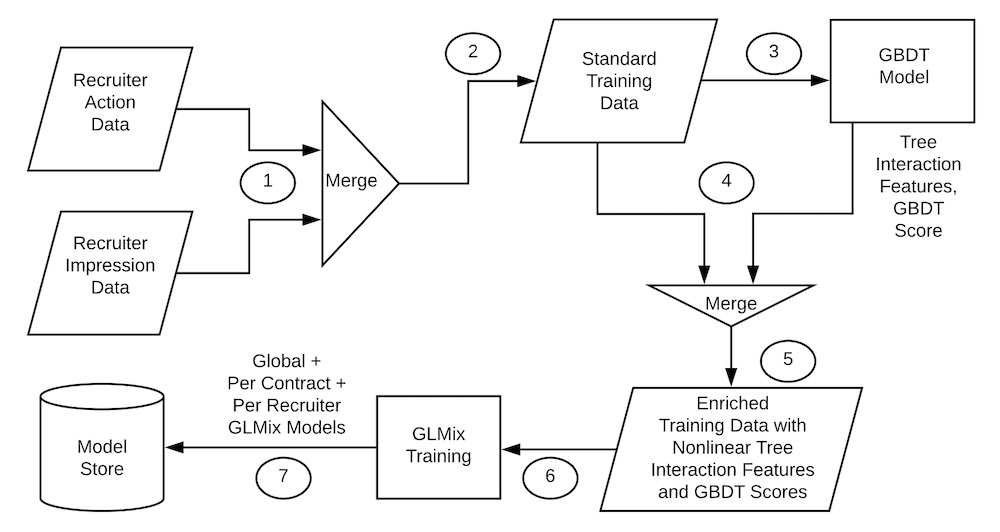
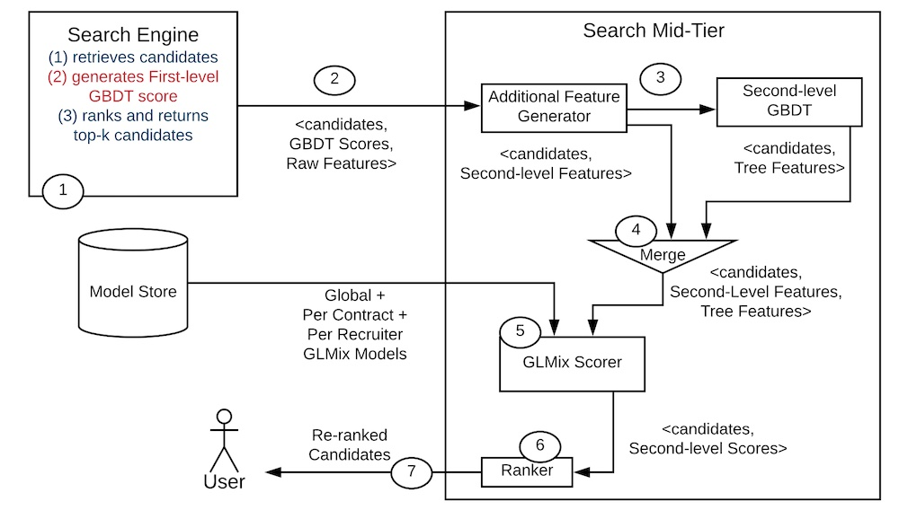
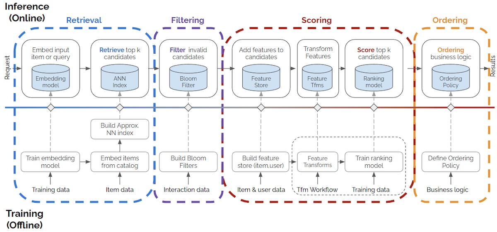

> Also translated to [Korean](https://ziminpark.github.io/posts/system-design-for-discovery/) thanks to Zimin Park.  
> 
> 同时感谢 Zimin Park 翻译成韩文。

How do the system designs for industrial recommendations and search look like?  

工业推荐和搜索的系统设计是怎样的？  

It’s uncommon to see system design discussed in machine learning papers or blogs; most focus on model design, training data, and/or loss functions.  

在机器学习论文或博客中，很少能看到对系统设计的讨论；大多数讨论都集中在模型设计、训练数据和/或损失函数上。  

Nonetheless, the handful of papers that discuss implementation details elucidate design patterns and best practices that are hard to gain outside of hands-on experience.  

尽管如此，少数讨论实施细节的论文阐明了设计模式和最佳实践，而这些都是在实践经验之外很难获得的。

Specific to discovery systems (i.e., recommendations and search), most implementations I’ve come across follow a similar paradigm—components and processes are split into offline vs.  

具体到发现系统（即推荐和搜索），我遇到的大多数实施方案都遵循类似的范式--组件和流程分为离线和在线两种。  

online environments, and candidate retrieval vs. ranking steps. The 2 x 2 below tries to simplify this.  

在线环境，以及候选人检索与排序步骤。下面的 2 x 2 试图对此进行简化。



2 x 2 of online vs. offline environments, and candidate retrieval vs. ranking.  

2 x 2 的在线与离线环境，以及候选检索与排序。

**The offline environment** largely hosts batch processes such as model training (e.g., representation learning, ranking), creating embeddings for catalog items, and building an approximate nearest neighbors (ANN) index or knowledge graph to find similar items. It may also include loading item and user data into a feature store that is used to augment input data during ranking.  

离线环境主要承载批处理流程，如模型训练（如表征学习、排序）、为目录项目创建嵌入、建立近似近邻（ANN）索引或知识图谱以查找相似项目。它还可能包括将项目和用户数据加载到特征存储中，用于在排序过程中增加输入数据。

**The online environment** then uses the artifacts generated (e.g., ANN indices, knowledge graphs, models, feature stores) to serve individual requests.  

然后，在线环境使用生成的人工制品（如 ANN 索引、知识图谱、模型、特征库）为个人请求提供服务。  

A typical approach is converting the input item or search query into an embedding, followed by candidate retrieval and ranking.  

一种典型的方法是将输入项目或搜索查询转换为嵌入，然后进行候选检索和排序。  

There are also other preprocessing steps (e.g., standardizing queries, tokenization, spell check) and post-processing steps (e.g., filtering undesirable items, business logic) though we won’t discuss them in this writeup.  

还有其他预处理步骤（如标准化查询、标记化、拼写检查）和后处理步骤（如过滤不需要的项目、业务逻辑），但我们不会在本文中讨论。

**Candidate retrieval** is a fast—but coarse—step to narrow down millions of items into hundreds of candidates.  

候选项目检索是将数百万个项目缩减为数百个候选项目的一个快速但粗糙的步骤。  

We trade off precision for efficiency to quickly narrow the search space (e.g., from millions to hundreds, a 99.99% reduction) for the downstream ranking task.  

我们以精确度换取效率，从而快速缩小搜索空间（例如，从数百万缩小到数百，减少 99.99%），完成下游排序任务。  

Most contemporary retrieval methods convert the input (i.e., item, search query) into an embedding before using ANN to find similar items. Nonetheless, in the examples below, we’ll also see systems using graphs (DoorDash) and decision trees (LinkedIn).  

大多数现代检索方法都是先将输入（即项目、搜索查询）转换为嵌入，然后再使用 ANN 查找类似项目。不过，在下面的例子中，我们也会看到使用图（DoorDash）和决策树（LinkedIn）的系统。

**Ranking** is a slower—but more precise—step to score and rank top candidates.  

排名是一个较慢但更精确的步骤，用于对优秀候选人进行评分和排名。  

As we’re processing fewer items (i.e., hundreds instead of millions), we have room to add features that would have been infeasible in the retrieval step (due to compute and latency constraints).  

由于我们处理的条目数量较少（即数百条而非数百万条），我们有余地添加在检索步骤中不可行的功能（由于计算和延迟限制）。  

Such features include item and user data, and contextual information. We can also use more sophisticated models with more layers and parameters.  

这些特征包括项目和用户数据以及上下文信息。我们还可以使用具有更多层次和参数的更复杂模型。

Ranking can be modeled as a learning-to-rank or classification task, with the latter being more commonly seen.  

排序可被模拟为学习排序或分类任务，后者更为常见。  

If deep learning is applied, the final output layer is either a softmax over a catalog of items, or a sigmoid predicting the likelihood of user interaction (e.g., click, purchase) for each user-item pair.  

如果采用深度学习，最终输出层要么是项目目录上的软最大值，要么是预测每个用户-项目对的用户交互（如点击、购买）可能性的 sigmoid。

Next, let’s see how the processes above come together in a recommender or search system.  

接下来，让我们看看上述过程是如何在推荐或搜索系统中结合起来的。



Basic system design for recommendations and search, based on the 2 x 2 above.  

基于上述 2 x 2 的推荐和搜索基本系统设计。

**In the offline environment, data flows bottom-up,** where we use training data and item/user data to create artifacts such as models, ANN indices, and feature stores.  

在离线环境中，数据是自下而上流动的，我们使用训练数据和项目/用户数据来创建模型、ANN 索引和特征库等人工制品。  

These artifacts are then loaded into the online environment (via the dashed arrows). **In the online environment, each request flows left to right,** through the retrieval and ranking steps before returning a set of results (e.g., recommendations, search results).  

然后，这些工件被加载到在线环境中（通过虚线箭头）。在在线环境中，每个请求从左到右依次经过检索和排序步骤，然后返回一组结果（如推荐、搜索结果）。

Additional details on some arrows in the diagram:  

图中某些箭头的更多细节：

1.  With the trained representation learning model, embed items in the catalog.  
    
    利用训练有素的表征学习模型，将项目嵌入目录。
2.  With the item embeddings, build the ANN index that allows retrieval of similar embeddings and their respective items.  
    
    利用项目嵌入，建立 ANN 索引，以便检索相似的嵌入及其各自的项目。
3.  Get (historical) features to augment training data for the ranking model. Use the same feature store in offline training and online serving to minimize train-serve skew.  
    
    获取（历史）特征，为排名模型增加训练数据。在离线训练和在线服务中使用相同的特征库，以尽量减少训练-服务偏差。  
    
    Might require [time travel](https://eugeneyan.com/writing/feature-stores/#integrity-creating-correct-offline-and-online-features).  
    
    可能需要时间旅行。
4.  Use the input query/item(s) embedding to retrieve `k` similar items via ANN.  
    
    使用输入查询/项目嵌入，通过 ANN 检索 `k` 相似项目。
5.  Add item and user features to the candidates for downstream ranking.  
    
    为候选者添加项目和用户特征，以便进行下游排序。
6.  Rank the candidates based on objectives such as click, conversion, etc.  
    
    根据点击率、转化率等目标对候选人进行排名。

> Update: This 2x2 has since been referenced in other resources, including:  
> 
> 更新：这一 2x2 后来被其他资源引用，包括
> 
> -   NVIDIA’s “[Recommender Systems, Not Just Recommender Models](https://medium.com/nvidia-merlin/recommender-systems-not-just-recommender-models-485c161c755e)”  
>     
>     英伟达™（NVIDIA®）"推荐系统，不仅仅是推荐模型
> -   Xavier Amatriain’s “[Blueprints for RecSys Architectures](https://amatriain.net/blog/RecsysArchitectures)”  
>     
>     Xavier Amatriain 的 " RecSys 架构蓝图

## Examples from Alibaba, Facebook, JD, Doordash, etc.  

阿里巴巴、Facebook、京东、Doordash 等公司的例子。[](https://eugeneyan.com/writing/system-design-for-discovery/#examples-from-alibaba-facebook-jd-doordash-etc)

Next, we’ll briefly discuss the high-level system design of some discovery systems, based on their respective papers and tech blogs.  

接下来，我们将根据各自的论文和技术博客，简要讨论一些发现系统的高层系统设计。  

I’ll highlight how these systems are split into offline and online environments, and their retrieval and ranking steps.  

我将重点介绍这些系统如何分为离线和在线环境，以及它们的检索和排名步骤。  

For full details on the methodology, model, etc., I recommend you read the full paper/blog.  

有关方法、模型等全部细节，我建议您阅读论文/博客全文。

**We start with Alibaba’s sharing about [building item embeddings for candidate retrieval](https://arxiv.org/abs/1803.02349).** In the _offline_ environment, session-level user-item interactions are mined to construct a weighted, bidirectional item graph. The graph is then used to generate item sequences via random walks.  

我们从阿里巴巴关于为候选检索构建项目嵌入的分享开始。在离线环境中，会话级别的用户-物品交互被挖掘出来，以构建一个加权的双向物品图。然后，利用该图通过随机游走生成项目序列。  

Item embeddings are then learned via representation learning (i.e., word2vec skip-gram), doing away with the need for labels.  

然后，通过表征学习（即 word2vec 跳格）来学习项目嵌入，从而消除对标签的需求。  

Finally, with the item embeddings, they get the nearest neighbor for each item and store it in their item-to-item (i2) similarity map (i.e., a key-value store).  

最后，通过项目嵌入，他们为每个项目找到最近的邻居，并将其存储在项目到项目 (i2) 相似性地图（即键值存储）中。



Alibaba's design for candidate retrieval in Taobao via item embeddings and ANN.  

阿里巴巴通过项目嵌入和 ANN 设计淘宝候选检索。

In the _online_ environment, when the user launches the app, the [Taobao](https://taobao.com/) Personalization Platform (TPP) starts by fetching the latest items that the user interacted with (e.g., click, like, purchase). These items are then used to _retrieve_ candidates from the i2i similarity map. The candidates are then passed to the Ranking Service Platform (RSP) for _ranking_ via a deep neural network, before being displayed to the user.  

在在线环境中，当用户启动应用程序时，淘宝个性化平台（TPP）首先会获取用户与之互动（如点击、喜欢、购买）的最新商品。然后利用这些商品从 i2i 相似性地图中检索候选商品。然后，候选项目被传递到排名服务平台（RSP），通过深度神经网络进行排名，然后再显示给用户。

**Alibaba also shared a similar example where they apply a [graph network for ranking](https://arxiv.org/abs/2005.12002).** In the _offline_ environment, they combine an existing knowledge graph (`G`), user behavior (e.g., impressed but not clicked, clicked), and item data to create an adaptive knowledge graph (`G_ui`). This is then merged with user data (e.g., demographics, user-item preferences) to train the ranking model (Adaptive Target-Behavior Relational Graph Network, ATBRN).  

阿里巴巴也分享了一个类似的应用图网络进行排名的例子。在离线环境中，他们将现有的知识图谱（ `G` ）、用户行为（如留下深刻印象但未点击、已点击）和商品数据结合起来，创建了自适应知识图谱（ `G_ui` ）。然后将其与用户数据（如人口统计学、用户-物品偏好）合并，训练排名模型（自适应目标-行为关系图网络，ATBRN）。



Alibaba's design for ranking in Taobao via a graph network (ATBRN).  

阿里巴巴通过图网络（ATBRN）进行淘宝排名的设计。

In the _online_ environment, given a user request, the candidate generator _retrieves_ a set of candidates and the user ID, before passing them to the Real-Time Prediction (RTP) platform.  

在在线环境中，给定用户请求后，候选生成器会检索一组候选信息和用户 ID，然后将其传递给实时预测（RTP）平台。  

RTP then queries the knowledge graph and feature stores for item and user attributes. The graph representations, item data, and user data is then fed into the _ranking_ model (i.e., ATBRN) to predict the probability of click on each candidate item. The candidates are then reordered based on probability and displayed to the user.  

然后，RTP 会查询知识图谱和特征库中的项目和用户属性。然后将图表示、项目数据和用户数据输入排序模型（即 ATBRN），以预测每个候选项目的点击概率。然后根据概率对候选项重新排序，并显示给用户。

**Next, we look at Facebook’s [embedding-based retrieval for search](https://arxiv.org/abs/2006.11632).** In the _offline_ environment (right half of image), they first train a two-tower network—with a query encoder and document encoder—that outputs cosine similarity for each query-document pair (not shown in image).  

接下来，我们看看 Facebook 基于嵌入的搜索检索。在离线环境下（图片右半部分），他们首先训练一个双塔网络--包含查询编码器和文档编码器--为每个查询-文档对输出余弦相似度（图片中未显示）。  

This ensures that search queries and documents (e.g., user profiles, groups) are in the same embedding space.  

这确保了搜索查询和文档（如用户配置文件、群组）处于同一嵌入空间。



Facebook's design for embedding-based retrieval via query and document encoders.  

Facebook 通过查询和文档编码器设计基于嵌入的检索。

Then, with the document encoder, they embed each document via Spark batch jobs. The embeddings are then quantized and published into their ANN index (“inverted index”).  

然后，利用文档编码器，他们通过 Spark 批量作业嵌入每个文档。然后对嵌入进行量化，并发布到其 ANN 索引（"倒排索引"）中。  

This ANN index is based on [Faiss](https://engineering.fb.com/2017/03/29/data-infrastructure/faiss-a-library-for-efficient-similarity-search/) and fine-tuned (see Section 4.1 of paper). The embeddings are also published in a forward index, without quantization, for ranking.  

该 ANN 指数以 Faiss 为基础，并进行了微调（见本文第 4.1 节）。嵌入式指数还发布了一个不带量化的前向指数，用于排名。  

The forward index can also include other data such as profile and group attributes to augment candidates during ranking.  

前向索引还可包括其他数据，如个人资料和组属性，以便在排序时增加候选者。

In the _online_ environment, each search request goes through query understanding and is embedded via the query encoder. The search request and associated embedding then go through the _retrieval_ step to get nearest neighbor candidates via the ANN index and boolean filtering (e.g., match on name, location, etc.).  

在在线环境中，每个搜索请求都要经过查询理解，并通过查询编码器进行嵌入。然后，搜索请求和相关的嵌入会经过检索步骤，通过 ANN 索引和布尔过滤（如名称、位置等匹配）获得近邻候选信息。  

The candidates are then augmented with full embeddings and additional data from the forward index before being _ranked_.  

然后，在对候选数据进行排序之前，使用完整嵌入和前向索引中的其他数据对其进行增强。

**JD shared a similar approach for [semantic retrieval for search](https://arxiv.org/abs/2006.02282).** In the _offline_ environment, a two-tower model with a query encoder and an item encoder is trained to output a similarity score for each query-item pair.  

JD 分享了一种类似的搜索语义检索方法。在离线环境中，一个包含查询编码器和条目编码器的双塔模型经过训练，为每个查询-条目对输出一个相似度得分。  

The item encoder then embeds catalog items before loading them into an embedding index (i.e., key-value store).  

然后，条目编码器会嵌入目录条目，再将其加载到嵌入索引（即键值存储）中。

, JD's design for candidate retrieval (right).")

Major stages of an e-commerce search systems (left), JD's design for candidate retrieval (right).  

电子商务搜索系统的主要阶段（左），JD 的候选检索设计（右）。

Then, in the _online_ environment, each query goes through preprocessing (e.g., spelling correction, tokenization, expansion, and rewriting) before being embedding via the query encoder.  

然后，在在线环境中，每个查询都要经过预处理（如拼写校正、标记化、扩展和重写），然后再通过查询编码器进行嵌入。  

The query embedding is then used to _retrieve_ candidates from the embedding index via nearest neighbors lookup. The candidates are then _ranked_ on factors such as relevance, predicted conversion, etc.  

然后，通过近邻查找，利用查询嵌入从嵌入索引中检索候选内容。然后根据相关性、预测转换等因素对候选项进行排序。

The paper also shares practical tips to optimize model training and serving.  

本文还分享了优化模型培训和服务的实用技巧。  

For model training, they raised that the de facto input of user-item interaction, item data, and user data is duplicative—item and user data appear once per row, consuming significant disk space.  

对于模型训练，他们提出，用户-物品交互、物品数据和用户数据的实际输入是重复的--物品和用户数据每行出现一次，占用大量磁盘空间。  

To address this, they built a custom TensorFlow dataset where user and item data are first loaded into memory as lookup dictionaries.  

为了解决这个问题，他们建立了一个定制的 TensorFlow 数据集，其中用户和项目数据首先作为查找字典加载到内存中。  

Then, during training, these dictionaries are queried to append user and item attributes to the training set. This simple practice reduced training data size by 90%.  

然后，在训练过程中查询这些字典，将用户和项目属性添加到训练集。这种简单的做法将训练数据量减少了 90%。

They also called out the importance of ensuring offline training and online serving consistency.  

他们还呼吁必须确保线下培训和线上服务的一致性。  

For their system, the most critical step was text tokenization which happens thrice (data preprocessing, training, serving).  

对于他们的系统来说，最关键的步骤是文本标记化，要进行三次（数据预处理、训练、服务）。  

To minimize train-serve skew, they built a C++ tokenizer with a thin Python wrapper that was used for all tokenization tasks.  

为了最大限度地减少训练与服务之间的偏差，他们构建了一个 C++ 标记符号化器，并在所有标记符号化任务中使用了一个薄 Python 封装器。

For model serving, they shared how they reduced latency by combining services. Their model had two key steps: query embedding and ANN lookup.  

在模型服务方面，他们分享了如何通过组合服务来减少延迟。他们的模型有两个关键步骤：查询嵌入和 ANN 查找。  

The simple approach would be to have each as a separate service, but this would require two network calls and thus double network latency.  

简单的方法是将每项服务都作为单独的服务，但这需要两次网络调用，因此会造成双倍的网络延迟。  

Thus, they unified the query embedding model and ANN lookup in a single instance, where the query embedding is passed to the ANN via memory instead of network.  

因此，他们将查询嵌入模型和 ANN 查找统一在一个实例中，其中查询嵌入通过内存而不是网络传递给 ANN。

They also shared how they run hundreds of models simultaneously, for different retrieval tasks and various A/B tests.  

他们还分享了如何针对不同的检索任务和各种 A/B 测试同时运行数百个模型。  

Each “servable” consists of a query embedding model and an ANN lookup, requiring 10s of GB.  

每个 "可服务 "包括一个查询嵌入模型和一个 ANN 查找，需要数十 GB。  

Thus, each servable had their own instance, with a proxy module (or load balancer) to direct incoming requests to the right servable.  

因此，每个服务都有自己的实例，并有一个代理模块（或负载平衡器）将传入的请求导向正确的服务。



How JD organizes the embedding model and ANN indices across multiple versions.  

剑龙如何在多个版本中组织嵌入模型和 ANN 指数。

(Aside: My candidate retrieval systems have a similar design pattern.  

(题外话：我的候选人检索系统也有类似的设计模式。  

Embedding stores and ANN indices are hosted on the same docker container—you’ll be surprised how far this goes with efficiently-sized embeddings.  

嵌入式存储和 ANN 索引托管在同一个 docker 容器上--你会惊讶地发现，这在高效嵌入式方面能发挥多大作用。  

Furthermore, Docker makes it easy to version, deploy, and roll back each model, as well as scale horizontally.  

此外，Docker 还能轻松实现每个模型的版本、部署和回滚，以及横向扩展。  

Fronting the model instances with a load balancer takes care of directing incoming requests, [blue-green deployments](https://docs.aws.amazon.com/wellarchitected/latest/machine-learning-lens/bluegreen-deployments.html), and [A/B testing](https://docs.aws.amazon.com/sagemaker/latest/dg/model-ab-testing.html). SageMaker makes this easy.)  

使用负载平衡器对模型实例进行前置处理，以引导传入请求、蓝绿部署和 A/B 测试。SageMaker 可以轻松做到这一点）。

**Next, we move from the embedding + ANN paradigm and look at DoorDash’s use of a [knowledge graph for query expansion and retrieval](https://doordash.engineering/2020/12/15/understanding-search-intent-with-better-recall/).** In the _offline_ environment, they train models for query understanding, query expansion, and ranking.  

接下来，我们从 "嵌入+ANN "模式出发，看看 DoorDash 如何利用知识图谱进行查询扩展和检索。在离线环境中，他们为查询理解、查询扩展和排序训练模型。  

They also load documents (i.e., restaurants and food items) into ElasticSearch for use in retrieval, and attribute data (e.g., ratings, price points, tags) into a feature store.  

他们还将文档（即餐厅和食品项目）加载到 ElasticSearch 中用于检索，并将属性数据（如评分、价位、标签）加载到特征存储中。

 and ranking (precision)")

DoorDash splits search into offline and online, and retrieval (recall) and ranking (precision).  

DoorDash 将搜索分为离线搜索和在线搜索，以及检索（召回率）和排名（精确率）。

In the _online_ environment, each incoming query is first standardized (e.g., spell check) and synonymized (via a manually curated dictionary). Then, the knowledge graph (Neo4J) [expands the query](https://eugeneyan.com/writing/search-query-matching/#graph-based-adding-concepts-and-relationships) by finding related tags. For example, a query for “KFC” will return tags such as “fried chicken” and “wings”. These tags are then used to _retrieve_ similar restaurants such as “Popeyes” and “Bonchon”.  

在在线环境中，每个输入的查询首先要经过标准化处理（如拼写检查）和同义化处理（通过人工编辑的词典）。然后，知识图谱（Neo4J）通过查找相关标签来扩展查询。例如，查询 "肯德基 "会返回 "炸鸡 "和 "鸡翅 "等标签。然后利用这些标签检索类似的餐厅，如 "Popeyes "和 "Bonchon"。

These candidates are then _ranked_ based on lexical similarity between the query and documents (aka restaurants, food items), store popularity, and possibly the search context (e.g., time of day, location).  

然后根据查询和文档（又称餐厅、食品项目）之间的词性相似度、商店受欢迎程度以及可能的搜索上下文（如一天中的时间、地点）对这些候选者进行排序。  

Finally, the ranked results are augmented with attributes such as ratings, price point, and delivery time and cost before displayed to the customer.  

最后，在向客户显示排序结果之前，会增加评分、价位、交货时间和成本等属性。

**Finally, we look at how LinkedIn [personalizes talent search results](https://arxiv.org/abs/1902.09041).** Their system relies heavily on XGBoost, first as a model to retrieve the top 1,000 candidates for ranking, and second, as a generator of features (i.e., model scores, tree interactions) for their downstream ranking model (a generalized linear mixed model aka GLMix).  

最后，我们来看看 LinkedIn 是如何个性化人才搜索结果的。他们的系统在很大程度上依赖于 XGBoost，首先是作为检索排名前 1000 位候选人的模型，其次是作为下游排名模型（广义线性混合模型，又称 GLMix）的特征生成器（即模型得分、树交互）。



LinkedIn's offline design for generating tree-based features, and training GLMix ranking models.  

LinkedIn 用于生成树状特征和训练 GLMix 排名模型的离线设计。

In the _offline_ environment, they first combine impression and label data to generate training data (step 1 in image above).  

在离线环境中，他们首先结合印象数据和标签数据生成训练数据（上图中的步骤 1）。  

Labels consist of instances where the recruiter sent a message to potential hires and the user responded positively.  

标签包括招聘人员向潜在应聘者发送信息并得到用户积极回应的情况。  

The training data is then fed into a pre-trained XGBoost model to generate model scores and tree interaction features (step 3 in image above) to augment the training data.  

然后，将训练数据输入预先训练好的 XGBoost 模型，生成模型分数和树状交互特征（上图中的步骤 3），以增强训练数据。  

This augmented data is then used to train the ranking model (GLMix).  

然后利用这些增强数据来训练排序模型 (GLMix)。



LinkedIn's online design for candidate retrieval, feature augmentation, and ranking via GLMix.  

LinkedIn 通过 GLMix 进行候选人检索、特征增强和排名的在线设计。

In the _online_ environment, with each search request, the search engine (maybe Elastic or Solr?) first _retrieves_ candidates which are then scored via a first-level XGBoost model.  

在在线环境中，对于每个搜索请求，搜索引擎（可能是 Elastic 或 Solr？  

The top 1,000 candidates are then augmented with (i) additional features (step 2 in image above) and (ii) tree interaction features via a second-level XGBoost model (step 3 in image above).  

然后，对排名前 1000 位的候选者添加 (i) 附加特征（上图中的步骤 2）和 (ii) 通过二级 XGBoost 模型的树交互特征（上图中的步骤 3）。  

Finally, these augmented candidates are ranked before the top 125 results are shown to the user.  

最后，在向用户显示前 125 个结果之前，会对这些经过增强的候选结果进行排序。

## Conclusion 结论[](https://eugeneyan.com/writing/system-design-for-discovery/#conclusion)

That was a brief overview of the offline-online, retrieval-ranking pattern for search and recommendations.  

以上是对搜索和推荐的离线-在线、检索-排名模式的简要概述。  

While this isn’t the only approach for discovery systems, from what I’ve seen, it’s the most common design pattern.  

虽然这不是发现系统的唯一方法，但据我所见，这是最常见的设计模式。  

I’ve found it helpful to distinguish the latency-constrained online systems from the less-demanding offline systems, and split the online process into retrieval and ranking steps.  

我发现，将延迟受限的在线系统与要求较低的离线系统区分开来，并将在线过程分为检索和排序步骤，是很有帮助的。

If you’re starting to build your discovery system, start with [candidate retrieval via simple embeddings and approximate nearest neighbors](https://eugeneyan.com/writing/real-time-recommendations/#how-to-design-and-implement-an-mvp), before adding a ranker on top of it. Alternatively, consider using a knowledge graph [like Uber and DoorDash did](https://eugeneyan.com/writing/search-query-matching/#graph-based-adding-concepts-and-relationships). But before you get too excited, think hard about whether you need real-time retrieval and ranking, or [if batch recommendations will suffice](https://eugeneyan.com/writing/real-time-recommendations/#when-not-to-use-real-time-recommendations).  

如果您刚开始构建发现系统，可以先通过简单的嵌入和近似近邻进行候选检索，然后再在此基础上添加排名器。或者，也可以考虑像 Uber 和 DoorDash 那样使用知识图谱。不过，在你过于兴奋之前，请认真考虑一下你是否需要实时检索和排名，或者批量推荐是否足够。

Did I miss out anything? Please reach out and let me know!  

我错过了什么吗？请告诉我！

Update (2022-04-14): Even Oldridge and Karl Byleen-Higley from NVIDIA updated the [2-stage design to 4-stages](https://medium.com/nvidia-merlin/recommender-systems-not-just-recommender-models-485c161c755e) by adding a filtering step and splitting ranking into scoring and ordering. They also presented it at [KDD’s Industrial Recommender Systems workshop](https://www.youtube.com/watch?v=5qjiY-kLwFY&list=PL65MqKWg6XcrdN4TJV0K1PdLhF_Uq-b43&index=4).  

更新（2022-04-14）：来自 NVIDIA 的 Even Oldridge 和 Karl Byleen-Higley 将 2 阶段设计更新为 4 阶段，增加了一个过滤步骤，并将排名分为评分和排序。他们还在 KDD 的工业推荐系统研讨会上做了介绍。



Even Oldridge & Karl Byleen-Higley (NVIDIA) augmented my 2-stage design with 2 more stages.  

甚至连 Oldridge 和 Karl Byleen-Higley（英伟达）也在我的两级设计基础上增加了两级。

## References 参考资料[](https://eugeneyan.com/writing/system-design-for-discovery/#references)

-   [Billion-scale Commodity Embedding for E-commerce Recommendation](https://arxiv.org/abs/1803.02349) `Alibaba`  
    
    为电子商务推荐嵌入亿万级商品 `Alibaba`
-   [Adaptive Target-Behavior Relational Graph Network for Recommendation](https://arxiv.org/abs/2005.12002) `Alibaba`  
    
    用于推荐的自适应目标行为关系图网络 `Alibaba`
-   [Embedding-based Retrieval in Facebook Search](https://arxiv.org/abs/2006.11632) `Facebook`  
    
    Facebook 搜索中基于嵌入的检索 `Facebook`
-   [An End-to-End Solution for E-commerce Search via Embedding Learning](https://arxiv.org/abs/2006.02282) `JD`  
    
    通过嵌入式学习为电子商务搜索提供端到端解决方案 `JD`
-   [Things Not Strings: Understanding Search Intent with Better Recall](https://doordash.engineering/2020/12/15/understanding-search-intent-with-better-recall/) `DoorDash`  
    
    事物而非字符串：了解搜索意图，提高检索效率 `DoorDash`
-   [Entity Personalized Talent Search Models with Tree Interaction Features](https://arxiv.org/abs/1902.09041) `LinkedIn`  
    
    具有树状交互特征的实体个性化人才搜索模型 `LinkedIn`
-   [Faiss: A Library for Efficient Similarity Search](https://engineering.fb.com/2017/03/29/data-infrastructure/faiss-a-library-for-efficient-similarity-search/) `Facebook`  
    
    Faiss：高效相似性搜索库 `Facebook`

  

**Thanks** to Yang Xinyi for reading drafts of this.  

感谢杨心怡阅稿。

If you found this useful, please cite this article as:  

如果您觉得本文有用，请将本文作为引用：

> Yan, Ziyou. (Jun 2021). System Design for Recommendations and Search. eugeneyan.com. https://eugeneyan.com/writing/system-design-for-discovery/.  
> 
> Yan, Ziyou.(Jun 2021).推荐与搜索的系统设计》。eugeneyan.com. https://eugeneyan.com/writing/system-design-for-discovery/.

or

```
@article{yan2021system,
  title   = {System Design for Recommendations and Search},
  author  = {Yan, Ziyou},
  journal = {eugeneyan.com},
  year    = {2021},
  month   = {Jun},
  url     = {https://eugeneyan.com/writing/system-design-for-discovery/}
}
```

Share on:  分享到
