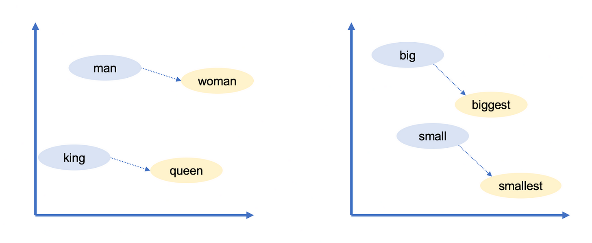
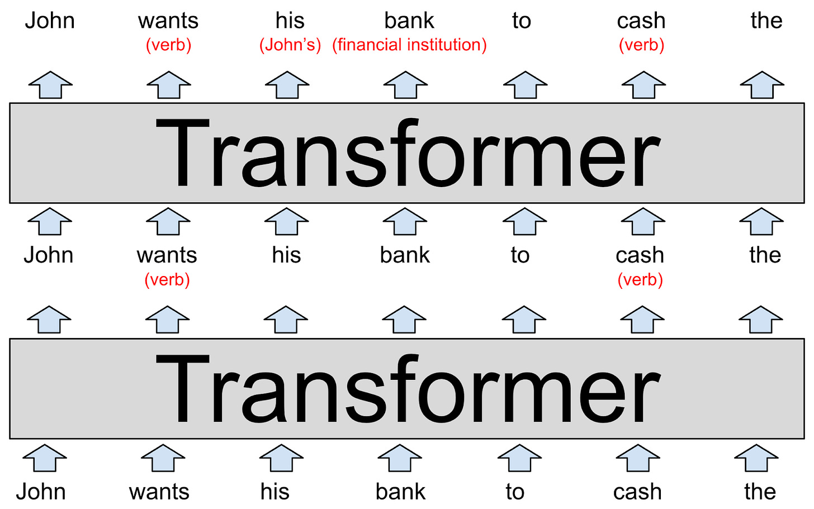
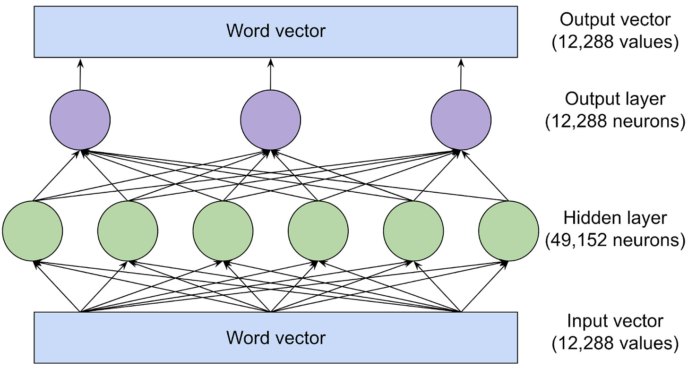
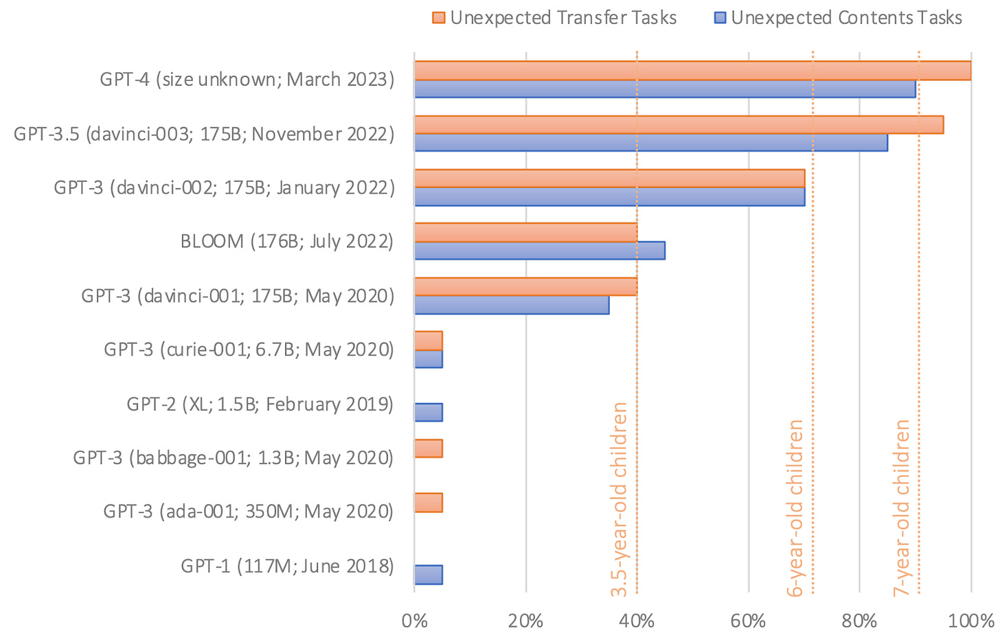

_Hi, it’s Tim Lee. I’m a journalist with a master’s degree in computer science. This post is the result of two months of in-depth research.  

大家好，我是 Tim Lee。我是一名记者，拥有计算机科学硕士学位。这篇文章是我两个月来深入研究的成果。  

If you find it helpful, please subscribe to get future articles delivered straight to your inbox.  

如果您觉得这篇文章对您有帮助，请订阅，我们会将未来的文章直接发送到您的收件箱。_

_Today’s post is co-authored with Sean Trott, a cognitive scientist at the University of California, San Diego.  

今天这篇文章的作者是加州大学圣地亚哥分校的认知科学家肖恩-特洛特（Sean Trott）。  

If you are interested in the intersection of cognitive science and AI, I recommend that you [subscribe to his excellent Substack](https://seantrott.substack.com/).  

如果您对认知科学和人工智能的交叉学科感兴趣，我建议您订阅他出色的 Substack。_

When ChatGPT was introduced last fall, it sent shockwaves through the technology industry and the larger world.  

去年秋天，ChatGPT 一经推出，就在技术行业和整个世界引起了震动。  

Machine learning researchers had been experimenting with large language models (LLMs) for a few years by that point, but the general public had not been paying close attention and didn’t realize how powerful they had become.  

当时，机器学习研究人员已经对大型语言模型（LLM）进行了数年的实验，但普通大众并没有密切关注，也没有意识到这些模型已经变得如此强大。

Today almost everyone has heard about LLMs, and tens of millions of people have tried them out. But, still, not very many people understand how they work.  

如今，几乎每个人都听说过法律硕士，数以千万计的人尝试过法律硕士。但是，仍然没有多少人了解它们是如何运作的。

If you know anything about this subject, you’ve probably heard that LLMs are trained to “predict the next word,” and that they require huge amounts of text to do this.  

如果你对这一主题有所了解，你可能听说过 LLM 被训练来 "预测下一个单词"，而且它们需要大量的文本才能做到这一点。  

But that tends to be where the explanation stops. The details of _how_ they predict the next word is often treated as a deep mystery.  

但解释往往到此为止。他们如何预测下一个单词的细节往往被视为一个深奥的谜。

One reason for this is the unusual way these systems were developed. Conventional software is created by human programmers who give computers explicit, step-by-step instructions.  

原因之一是这些系统的开发方式不同寻常。传统软件是由人类程序员创建的，他们向计算机发出明确的、一步一步的指令。  

In contrast, ChatGPT is built on a neural network that was trained using billions of words of ordinary language.  

相比之下，ChatGPT 建立在一个使用数十亿普通语言单词训练而成的神经网络之上。

As a result, no one on Earth fully understands the inner workings of LLMs. Researchers are working to gain a better understanding, but this is a slow process that will take years—perhaps decades—to complete.  

因此，地球上没有人完全了解 LLM 的内部运作。研究人员正在努力加深了解，但这是一个缓慢的过程，需要数年甚至数十年才能完成。

Still, there’s a lot that experts _do_ understand about how these systems work. The goal of this article is to make a lot of this knowledge accessible to a broad audience.  

We’ll aim to explain what’s known about the inner workings of these models without resorting to technical jargon or advanced math.  

我们的目标是在不使用专业术语或高等数学的情况下，解释这些模型的内部工作原理。  

不过，专家们对这些系统的工作原理还是有很多了解的。本文的目的就是让广大读者了解这些知识。

We’ll start by explaining word vectors, the surprising way language models represent and reason about language.  

我们将首先解释单词向量，这是语言模型表示和推理语言的惊人方式。  

Then we’ll dive deep into the transformer, the basic building block for systems like ChatGPT.  

然后，我们将深入研究变压器，它是 ChatGPT 等系统的基本构件。  

Finally, we’ll explain how these models are trained and explore why good performance requires such phenomenally large quantities of data.  

最后，我们将解释这些模型是如何训练出来的，并探讨为什么良好的性能需要如此大量的数据。

To understand how language models work, you first need to understand how they represent words. Human beings represent English words with a sequence of letters, like C-A-T for **cat**. Language models use a long list of numbers called a word vector. For example, [here’s one way](http://vectors.nlpl.eu/explore/embeddings/en/MOD_enwiki_upos_skipgram_300_2_2021/cat_NOUN/) to represent **cat** as a vector:  

要了解语言模型是如何工作的，首先需要了解它们是如何表示单词的。人类用字母序列来表示英语单词，比如用 C-A-T 表示 cat。语言模型使用的是一长串数字，称为单词向量。例如，下面就是用向量表示 cat 的一种方法：

\[0.0074, 0.0030, -0.0105, 0.0742, 0.0765, -0.0011, 0.0265, 0.0106, 0.0191, 0.0038, -0.0468, -0.0212, 0.0091, 0.0030, -0.0563, -0.0396, -0.0998, -0.0796, …, 0.0002\]   

\[0.0074, 0.0030, -0.0105, 0.0742, 0.0765, -0.0011, 0.0265, 0.0106, 0.0191, 0.0038, -0.0468, -0.0212, 0.0091, 0.0030, -0.0563, -0.0396, -0.0998, -0.0796, ..., 0.0002\]

(The full vector is 300 numbers long—to see it all [click here](http://vectors.nlpl.eu/explore/embeddings/en/MOD_enwiki_upos_skipgram_300_2_2021/cat_NOUN/) and then click “show the raw vector.”)  

(完整的矢量长达 300 个数字，点击此处查看全部内容，然后点击 "显示原始矢量"）。

Why use such a baroque notation? Here’s an analogy. **Washington DC** is located at 38.9 degrees North and 77 degrees West. We can represent this using a vector notation:  

为什么要使用如此巴洛克式的记谱法？打个比方吧。华盛顿特区位于北纬 38.9 度，西经 77 度。我们可以用矢量符号来表示：

-   **Washington DC** is at \[38.9, 77\]  
    
    华盛顿特区位于 \[38.9, 77\]
    
-   **New York** is at \[40.7, 74\]  
    
    纽约在\[40.7，74\]
    
-   **London** is at \[51.5, 0.1\]  
    
    伦敦位于\[51.5, 0.1\]
    
-   **Paris** is at \[48.9, -2.4\]  
    
    巴黎位于\[48.9, -2.4\]
    

This is useful for reasoning about spatial relationships. You can tell **New York** is close to **Washington DC** because 38.9 is close to 40.7 and 77 is close to 74. By the same token, **Paris** is close to **London**. But **Paris** is far from **Washington DC**.  

这对于空间关系的推理非常有用。你可以知道纽约离华盛顿特区很近，因为 38.9 接近 40.7，77 接近 74。同样，巴黎离伦敦很近。但巴黎离华盛顿特区很远。

Language models take a similar approach: each word vector

represents a point in an imaginary “word space,” and words with more similar meanings are placed closer together. For example, the [words closest to](http://vectors.nlpl.eu/explore/embeddings/en/MOD_enwiki_upos_skipgram_300_2_2021/cat_NOUN/) **[cat](http://vectors.nlpl.eu/explore/embeddings/en/MOD_enwiki_upos_skipgram_300_2_2021/cat_NOUN/)** in vector space include **dog**, **kitten**, and **pet**. A key advantage of representing words with vectors of _real numbers_ (as opposed to a string of letters, like “C-A-T”) is that numbers enable operations that letters don’t.   

语言模型也采用了类似的方法：每个单词向量 1 代表一个假想的 "单词空间 "中的一个点，意思更相近的单词会被放在更近的位置。例如，在向量空间中最接近猫的词包括狗、小猫和宠物。用实数向量表示单词（而不是字母串，如 "C-A-T"）的一个主要优势是，数字可以进行字母无法进行的运算。

Words are too complex to represent in only two dimensions, so language models use vector spaces with hundreds or even thousands of dimensions.  

单词过于复杂，无法仅用两个维度来表示，因此语言模型使用了数百甚至数千个维度的向量空间。  

The human mind can’t envision a space with that many dimensions, but computers are perfectly capable of reasoning about them and producing useful results.  

人类无法想象一个空间有这么多维，但计算机完全有能力对其进行推理，并产生有用的结果。

Researchers have been experimenting with word vectors for decades, but the concept really took off when Google [announced its word2vec project](https://arxiv.org/abs/1301.3781) in 2013. Google analyzed millions of documents harvested from Google News to figure out which words tend to appear in similar sentences.  

Over time, a neural network trained to predict which words co-occur with which other words learned to place similar words (like几十年来，研究人员一直在尝试使用单词向量，但这一概念在 2013 年谷歌宣布其 word2vec 项目后才真正兴起。谷歌分析了从谷歌新闻中获取的数百万篇文档，以找出哪些词语容易出现在相似的句子中。 **dog** and **cat**) close together in vector space.  

随着时间的推移，为预测哪些词与哪些词同时出现而训练的神经网络学会了在向量空间中将类似的词（如狗和猫）放在一起。

Google’s word vectors had another intriguing property: you could “reason” about words using vector arithmetic. For example, Google researchers took the vector for **biggest**, subtracted **big**, and added **small**. The word closest to the resulting vector was **smallest**.  

谷歌的单词向量还有一个有趣的特性：你可以用向量算术来 "推理 "单词。例如，谷歌研究人员将最大（biggest）的向量减去大（big），再加上小（small）。与结果向量最接近的词是 smallest。

You can use vector arithmetic to draw analogies! In this case **big** is to **biggest** as **small** is to **smallest**. Google’s word vectors captured a lot of other relationships:  

您可以使用向量运算法进行类比！在这种情况下，大就是最大，小就是最小。谷歌的单词向量捕捉到了许多其他关系：

-   **Swiss** is to **Switzerland** as **Cambodian** is to **Cambodia**. (nationalities)  
    
    瑞士人之于瑞士，就如同柬埔寨人之于柬埔寨。国籍
    
-   **Paris** is to **France** as **Berlin** is to **Germany**. (capitals)  
    
    巴黎之于法国，正如柏林之于德国。（首都）
    
-   **Unethical** is to **ethical** as **possibly** is to **impossibly**. (opposites)  
    
    不道德之于道德，就像可能之于不可能。(对立面）
    
-   **Mouse** is to **mice** as **dollar** is to **dollars**. (plurals)  
    
    老鼠之于老鼠，就像美元之于美元。复数
    
-   **Man** is to **woman** as **king** is to **queen**. (gender roles)  
    
    男人之于女人，就像国王之于王后。(性别角色）
    

Because these vectors are built from the way humans use words, they end up reflecting many of the [biases that are present in human language](https://www.science.org/doi/full/10.1126/science.aal4230). For example, in some word vector models, **doctor** minus **man** plus **woman** yields **nurse**. Mitigating biases like this is an area of active research.  

由于这些向量是根据人类使用词语的方式建立的，它们最终反映了人类语言中存在的许多偏差。例如，在某些词向量模型中，医生减去男人再加上女人就得到了护士。减少这样的偏差是一个正在积极研究的领域。

Nevertheless, word vectors are a useful building block for language models because they encode subtle but important information about the relationships between words.  

然而，词向量是语言模型的一个有用构件，因为它们编码了词与词之间关系的微妙但重要的信息。  

If a language model learns something about a **cat** (for example: it sometimes goes to the vet), the same thing is likely to be true of a **kitten** or a **dog**. If a model learns something about the relationship between **Paris** and **France** (for example: they share a language) there’s a good chance that the same will be true for **Berlin** and **Germany** and for **Rome** and **Italy**.  

如果一个语言模型了解了猫的一些情况（例如：它有时会去看兽医），那么小猫或小狗也很可能会有同样的情况。如果一个模型了解了巴黎和法国之间的关系（例如：它们有共同的语言），那么柏林和德国以及罗马和意大利也很有可能有同样的情况。

A simple word vector scheme like this doesn’t capture an important fact about natural language: words often have multiple meanings.  

这样一个简单的词向量方案并不能捕捉到自然语言的一个重要事实：词语往往具有多重含义。

For example, the word **bank** can refer to a financial institution _or_ to the land next to a river. Or consider the following sentences:  

例如，"银行 "一词可以指金融机构，也可以指河流旁边的土地。或者考虑一下下面的句子：

-   John picks up a **magazine**.  
    
    约翰拿起一本杂志。
    
-   Susan works for a **magazine**.  
    
    苏珊在一家杂志社工作。
    

The meanings of **magazine** in these sentences are related but subtly different. John picks up a _physical_ magazine, while Susan works for an organization that _publishes_ physical magazines.   

在这些句子中，"杂志 "的意思是相关的，但又有微妙的不同。约翰拿的是一本实体杂志，而苏珊工作的机构出版实体杂志。

When a word has two unrelated meanings, as with **bank**, linguists call them homonyms. When a word has two closely related meanings, as with **magazine**, linguists call it polysemy.   

当一个词有两个不相关的意思时，如银行，语言学家称之为同形异义词。当一个词有两个密切相关的含义时，如杂志，语言学家称之为多义词。

LLMs like ChatGPT are able to represent the same word with different vectors depending on the context in which that word appears. There’s a vector for **bank** (financial institution) and a different vector for **bank** (of a river). There’s a vector for **magazine** (physical publication) and another for **magazine** (organization). As you might expect, LLMs [use more similar vectors](https://arxiv.org/abs/2010.13057) for polysemous meanings than for homonymous meanings.  

像 ChatGPT 这样的 LLM 可以根据单词出现的语境，用不同的向量来表示同一个单词。银行（金融机构）有一个向量，而银行（河流）有另一个向量。杂志（实体出版物）有一个向量，杂志（组织）也有另一个向量。正如您所预料的，与同义词相比，多义词的 LLM 使用了更多的相似向量。

So far we haven’t said anything about _how_ language models do this—we’ll get into that shortly. But we’re belaboring these vector representations because it’s fundamental to understanding how language models work.  

到目前为止，我们还没有提到语言模型是如何做到这一点的--我们很快就会讲到。但我们之所以强调这些向量表征，是因为这是理解语言模型如何工作的基础。

Traditional software is designed to operate on data that’s unambiguous. If you ask a computer to compute “2 + 3,” there’s no ambiguity about what **2,** **+,** or **3** mean. But natural language is full of ambiguities that go beyond homonyms and polysemy:  

传统软件的设计目的是处理明确无误的数据。如果你要求计算机计算 "2 + 3"，那么 2、+ 或 3 的含义并不模糊。但是，自然语言中除了同音异义词和多义词之外，还有很多含糊不清的地方：

-   In “the customer asked the mechanic to fix **his** car” does **his** refer to the customer or the mechanic?  
    
    在 "顾客请技工修车 "中，"顾客 "指的是顾客还是技工？
    
-   In “the professor urged the student to do **her** homework” does **her** refer to the professor or the student?  
    
    在 "教授催促学生做作业 "中，"她 "指的是教授还是学生？
    
-   In “fruit **flies** like a banana” is **flies** a verb (referring to fruit soaring across the sky) or a noun (referring to banana-loving insects)?  
    
    在 "果蝇像香蕉 "中，"蝇 "是动词（指翱翔天空的水果）还是名词（指喜欢吃香蕉的昆虫）？
    

People resolve ambiguities like this based on context, but there are no simple or deterministic rules for doing this. Rather, it requires understanding facts about the world.  

人们会根据上下文来解决类似的模糊问题，但这样做并没有简单或确定的规则。相反，这需要了解世界的事实。  

You need to know that mechanics typically fix customers’ cars, that students typically do their own homework, and that fruit typically doesn’t fly.  

你需要知道，机械师通常会为客户修车，学生通常会自己做作业，水果通常不会飞。

Word vectors provide a flexible way for language models to represent each word’s precise meaning in the context of a particular passage. Now let’s look at how they do that.  

单词向量为语言模型提供了一种灵活的方式，使其能够在特定段落的上下文中准确表达每个单词的含义。现在让我们看看它们是如何做到这一点的。

GPT-3, the model behind the original version of ChatGPT

, is organized into dozens of layers.  

Each layer takes a sequence of vectors as inputs—one vector for each word in the input text—and adds information to help clarify the meaning of that word and better predict which word might come next.  

每一层将一系列向量作为输入--输入文本中的每个单词都有一个向量--然后添加信息，帮助澄清该单词的含义，并更好地预测下一个可能出现的单词。  

GPT-3 是 ChatGPT 2 原始版本背后的模型，分为几十个层。

Let’s start by looking at a stylized example:  

我们先来看一个风格化的例子：

Each layer of an LLM is a transformer, a neural network architecture that was first introduced by Google in a [landmark 2017 paper](https://arxiv.org/abs/1706.03762).  

LLM 的每一层都是一个变压器，这是一种神经网络架构，由谷歌在 2017 年的一篇具有里程碑意义的论文中首次提出。

The model’s input, shown at the bottom of the diagram, is the partial sentence “John wants his bank to cash the.” These words, represented as word2vec-style vectors, are fed into the first transformer.   

图中底部显示的模型输入是部分句子 "约翰希望他的银行兑现"。这些以 word2vec 风格向量表示的单词被输入第一个转换器。

The transformer figures out that **wants** and **cash** are both verbs (both words can also be nouns).  

We’ve represented this added context as red text in parentheses, but in reality the model would store it by modifying the word vectors in ways that are difficult for humans to interpret.  

我们用括号中的红色文字来表示这些添加的上下文，但实际上，模型会通过修改单词向量来存储这些上下文，而人类很难解读这些上下文。  

These new vectors, known as a hidden state, are passed to the next transformer in the stack.  

这些被称为隐藏状态的新矢量会传递给堆栈中的下一个转换器。  

变压器发现，wants 和 cash 都是动词（这两个词也可以是名词）。

The second transformer adds two other bits of context: it clarifies that **bank** refers to a financial institution rather than a river bank, and that **his** is a pronoun that refers to **John**. The second transformer produces another set of hidden state vectors that reflect everything the model has learned up to that point.  

第二个转换器添加了另外两个上下文：它明确了 bank 指的是金融机构而不是河岸，以及 his 是指约翰的代词。第二个转换器产生了另一组隐藏状态向量，它们反映了模型在此之前所学到的所有知识。

The above diagram depicts a purely hypothetical LLM, so don’t take the details too seriously. We’ll take a look at research into real language models shortly.  

上图描述的是一个纯粹假设的 LLM，所以不要把细节看得太重。我们很快就会看到对真实语言模型的研究。  

Real LLMs tend to have a lot more than two layers. The most powerful version of GPT-3, for example, has 96 layers.  

真正的 LLM 往往不止两层。例如，最强大的 GPT-3 版本有 96 层。

[Research suggests](https://arxiv.org/abs/1905.05950) that the first few layers focus on understanding the syntax of the sentence and resolving ambiguities like we’ve shown above.  

Later layers (which we’re not showing to keep the diagram a manageable size) work to develop a high-level understanding of the passage as a whole.  

后面的图层（为使图表大小适中，我们不显示这些图层）旨在加深对整个段落的理解。  

研究表明，前几层的重点是理解句子的语法和解决模棱两可的问题，如上图所示。

For example, as an LLM “reads through” a short story, it appears to keep track of a variety of information about the story’s characters: sex and age, relationships with other characters, past and current location, personalities and goals, and so forth.  

例如，当 LLM "通读 "一篇短篇小说时，它似乎会记录故事中人物的各种信息：性别和年龄、与其他人物的关系、过去和现在的位置、性格和目标等等。

Researchers don’t understand exactly how LLMs keep track of this information, but logically speaking the model must be doing it by modifying the hidden state vectors as they get passed from one layer to the next.  

研究人员并不清楚 LLM 是如何跟踪这些信息的，但从逻辑上讲，当隐藏状态向量从一层传递到下一层时，模型一定是通过修改隐藏状态向量来实现这一点的。  

It helps that in modern LLMs, these vectors are extremely large.  

在现代 LLM 中，这些矢量非常大。

For example, the most powerful version of GPT-3 uses word vectors with 12,288 dimensions—that is, each word is represented by a list of 12,288 numbers.  

例如，功能最强大的 GPT-3 版本使用 12,288 维的单词向量，即每个单词由 12,288 个数字组成的列表表示。  

That’s 20 times larger than Google’s 2013 word2vec scheme.  

这比谷歌 2013 年的 word2vec 方案大 20 倍。  

You can think of all those extra dimensions as a kind of “scratch space” that GPT-3 can use to write notes to itself about the context of each word.  

你可以把所有这些额外的维度看作是一种 "划痕空间"，GPT-3 可以用它来给自己写有关每个单词上下文的注释。  

Notes made by earlier layers can be read and modified by later layers, allowing the model to gradually sharpen its understanding of the passage as a whole.  

前几层所做的笔记可以由后几层阅读和修改，从而使模型逐渐加深对整个段落的理解。

So suppose we changed our diagram above to depict a 96-layer language model interpreting a 1,000-word story. The 60th layer might include a vector for **John** with a parenthetical comment like “(main character, male, married to Cheryl, cousin of Donald, from Minnesota, currently in Boise, trying to find his missing wallet).” Again, all of these facts (and probably a lot more) would somehow be encoded as a list of 12,288 numbers corresponding to the word **John**. Or perhaps some of this information might be encoded in the 12,288-dimensional vectors for **Cheryl**, **Donald**, **Boise**, **wallet**, or other words in the story.  

因此，假设我们将上图改为一个 96 层的语言模型来解释一个 1000 字的故事。第 60 层可能包含一个约翰的向量，并附有"（主角，男性，与谢丽尔结婚，唐纳德的表弟，来自明尼苏达州，目前在博伊西，试图找到他丢失的钱包）"这样的括号注释。同样，所有这些事实（可能还有更多事实）都将以某种方式编码为与 John 一词相对应的 12 288 个数字的列表。或者，其中的一些信息可能会被编码为谢丽尔、唐纳德、博伊西、钱包或故事中其他单词的 12,288 维向量。

The goal is for the 96th and final layer of the network to output a hidden state for the final word that includes all of the information necessary to predict the next word.  

我们的目标是让网络的第 96 层，也就是最后一层，为最后一个单词输出一个隐藏状态，其中包含预测下一个单词所需的所有信息。

Now let’s talk about what happens inside each transformer. The transformer has a two-step process for updating the hidden state for each word of the input passage:  

现在让我们来谈谈每个转换器内部发生了什么。转换器分两步更新输入段落中每个单词的隐藏状态：

1.  In the **attention step**, words “look around” for other words that have relevant context and share information with one another.  
    
    在注意步骤中，词语会 "四处寻找 "与上下文相关的其他词语，并相互分享信息。
    
2.  In the **feed-forward step**, each word “thinks about” information gathered in previous attention steps and tries to predict the next word.  
    
    在前馈步骤中，每个单词都会 "思考 "之前注意力步骤中收集的信息，并尝试预测下一个单词。
    

Of course it’s the network, not the individual words, that performs these steps.  

当然，执行这些步骤的是网络，而不是单个词语。  

But we’re phrasing things this way to emphasize that transformers treat words, rather than entire sentences or passages, as the basic unit of analysis.  

但我们这样措辞是为了强调，转换器将单词而不是整个句子或段落作为基本分析单位。  

This approach enables LLMs to take full advantage of the massive parallel processing power of modern GPU chips. And it also helps LLMs to scale to passages with thousands of words.  

这种方法使 LLM 能够充分利用现代 GPU 芯片的大规模并行处理能力。它还有助于 LLM 扩展到数千字的段落。  

These are both areas where [earlier language models](https://en.wikipedia.org/wiki/Recurrent_neural_network) struggled.  

这两个领域都是早期语言模型的难点所在。

You can think of the attention mechanism as a matchmaking service for words.  

你可以把注意力机制看作是为文字牵线搭桥的服务。  

Each word makes a checklist (called a query vector) describing the characteristics of words it is looking for.  

每个单词都会列出一份检查表（称为查询向量），描述它要查找的单词的特征。  

Each word also makes a checklist (called a key vector) describing its own characteristics. The network compares each key vector to each query vector (by computing a [dot product](https://en.wikipedia.org/wiki/Dot_product)) to find the words that are the best match. Once it finds a match, it transfers information from the word that produced the key vector to the word that produced the query vector.  

每个词还会列出一份描述其自身特征的核对表（称为关键向量）。网络会将每个关键向量与每个查询向量进行比较（通过计算点积），找出最匹配的词。一旦找到匹配，它就会将信息从产生关键向量的单词传输到产生查询向量的单词。

For example, in the previous section we showed a hypothetical transformer figuring out that in the partial sentence “John wants his bank to cash the,” **his** refers to **John.** Here’s what that might look like under the hood. The query vector for **his** might effectively say “I’m seeking: a noun describing a male person.” The key vector for **John** might effectively say “I am: a noun describing a male person.” The network would detect that these two vectors match and move information about the vector for **John** into the vector for **his**.  

例如，在上一节中，我们展示了一个假定的转换器，它能识别出在 "约翰希望他的银行兑现 "这个部分句子中，"他的 "指的是约翰。下面是在引擎盖下可能出现的情况。his 的查询向量可以有效地表示 "我正在查找：一个描述男性的名词"。约翰的关键向量可能有效地表示 "我是：一个描述男性的名词"。网络会检测到这两个向量相匹配，并将约翰的向量信息转移到他的向量中。

Each attention layer has several “attention heads,” which means that this information-swapping process happens several times (in parallel) at each layer.  

每个注意层都有多个 "注意头"，这意味着信息交换过程会在每个注意层多次（并行）进行。  

Each attention head focuses on a different task:  

每个注意头都专注于不同的任务：

-   One attention head might match pronouns with nouns, as we discussed above.  
    
    一个注意头可能会将代词与名词匹配起来，就像我们上面讨论的那样。
    
-   Another attention head might work on resolving the meaning of homonyms like bank.  
    
    另一个注意头可能致力于解决银行等同音词的含义问题。
    
-   A third attention head might link together two-word phrases like “Joe Biden.”  
    
    第三个注意头可能会把 "乔-拜登 "这样的两个词组连在一起。
    

And so forth. 等等。

Attention heads frequently operate in sequence, with the results of an attention operation in one layer becoming an input for an attention head in a subsequent layer.  

注意头经常是按顺序运作的，一层的注意操作结果会成为下一层注意头的输入。  

Indeed, each of the tasks we just listed above could easily require several attention heads rather than just one.  

事实上，我们上面列出的每项任务都很容易需要多个关注头，而不仅仅是一个。

The largest version of GPT-3 has 96 layers with 96 attention heads each, so GPT-3 performs 9,216 attention operations each time it predicts a new word.  

最大版本的 GPT-3 有 96 层，每层有 96 个注意力头，因此 GPT-3 每次预测一个新词时要执行 9,216 次注意力操作。

In the last two sections we presented a stylized version of how attention heads work. Now let’s look at research on the inner workings of a real language model.  

在前两节中，我们介绍了注意头如何工作的风格化版本。现在，让我们来看看有关真实语言模型内部运作的研究。  

Last year scientists at Redwood Research [studied](https://arxiv.org/abs/2211.00593) how GPT-2, a predecessor to ChatGPT, predicted the next word for the passage “When Mary and John went to the store, John gave a drink to.”  

去年，Redwood Research 公司的科学家们研究了 ChatGPT 的前身 GPT-2 如何预测 "当玛丽和约翰去商店时，约翰给了他们一杯饮料 "这段话的下一个单词。

GPT-2 predicted that the next word was **Mary**. The researchers found that three types of attention heads contributed to this prediction:  

GPT-2 预测下一个单词是 "玛丽"。研究人员发现，有三种类型的注意头促成了这一预测：

-   Three heads they called **Name Mover Heads** copied information from the **Mary** vector to the final input vector (for the word **to**). GPT-2 uses the information in this rightmost vector to predict the next word.  
    
    三个被称为 "名称移动头"（Name Mover Heads）的磁头将信息从 "玛丽"（Mary）向量复制到最终输入向量（单词 "to"）。GPT-2 利用最右侧向量中的信息预测下一个单词。
    
-   How did the network decide **Mary** was the right word to copy? Working backwards through GPT-2’s computational process, the scientists found a group of four attention heads they called **Subject Inhibition Heads** that marked the second **John** vector in a way that blocked the Name Mover Heads from copying the name **John**.  
    
    网络是如何决定玛丽是正确的复制词的？通过 GPT-2 的计算过程，科学家们发现了一个由四个注意头组成的小组，他们称之为 "主体抑制头"（Subject Inhibition Heads），这些注意头对第二个约翰向量进行标记，从而阻止 "名称移动头 "复制约翰这个名字。
    
-   How did the Subject Inhibition Heads know **John** shouldn’t be copied? Working further backwards, the team found two attention heads they called **Duplicate Token Heads.** They marked the second **John** vector as a duplicate of the first **John** vector, which helped the Subject Inhibition Heads to decide that **John** shouldn’t be copied.  
    
    主题抑制头是如何知道约翰不应该被复制的呢？研究小组进一步逆向研究，发现了两个被称为 "重复标记头"（Duplicate Token Heads）的注意头。它们将第二个约翰向量标记为第一个约翰向量的重复，这有助于主体抑制头决定约翰不应该被复制。
    

In short, these nine attention heads enabled GPT-2 to figure out that “John gave a drink to John” doesn’t make sense and choose “John gave a drink to Mary” instead.  

简而言之，这九个注意头让 GPT-2 发现 "约翰给了约翰一杯酒 "说不通，于是选择了 "约翰给了玛丽一杯酒"。

We love this example because it illustrates just how difficult it will be to fully understand LLMs. The five-member Redwood team published a [25-page paper](https://arxiv.org/abs/2211.00593) explaining how they identified and validated these attention heads.  

Yet even after they did all that work, we are still far from having a comprehensive explanation for why GPT-2 decided to predict我们喜欢这个例子，因为它说明了要完全理解 LLM 有多么困难。由五人组成的红木团队发表了一篇长达 25 页的论文，解释了他们是如何识别和验证这些注意头的。 **Mary** as the next word.  

然而，即使他们做了所有这些工作，我们仍然远远无法全面解释为什么 GPT-2 决定预测玛丽是下一个单词。

For example, how did the model know the next word should be someone’s name and not some other kind of word? It’s easy to think of similar sentences where **Mary** wouldn’t be a good next-word prediction.  

For example, in the sentence “when Mary and John went to the restaurant, John gave his keys to,” the logical next words would be “the valet.”  

例如，在句子 "玛丽和约翰去餐厅时，约翰把钥匙给了 "中，合乎逻辑的下一个词应该是 "男仆"。  

例如，模型是如何知道下一个词应该是某人的名字而不是其他词的？我们很容易想到类似的句子，在这些句子中，Mary 并不能很好地预测下一个词。

Presumably, with enough research computer scientists could uncover and explain additional steps in GPT-2’s reasoning process.  

据推测，只要有足够的研究，计算机科学家就能发现并解释 GPT-2 推理过程中的其他步骤。  

Eventually, they might be able to develop a comprehensive understanding of how GPT-2 decided that **Mary** is the most likely next word for this sentence. But it could take months or even years of additional effort just to understand the prediction of a single word.  

最终，他们也许能够全面理解 GPT-2 是如何决定 Mary 是这个句子中最有可能出现的下一个单词的。但是，他们可能需要花费数月甚至数年的额外努力，才能理解对一个单词的预测。

The language models underlying ChatGPT—GPT-3.5 and GPT-4—are significantly larger and more complex than GPT-2. They are capable of more complex reasoning than the simple sentence-completion task the Redwood team studied.  

作为 ChatGPT-GPT-3.5 和 GPT-4 基础的语言模型比 GPT-2 要大得多，也复杂得多。与红木团队研究的简单句子完成任务相比，它们能够进行更复杂的推理。  

So fully explaining how these systems work is going to be a huge project that humanity is unlikely to complete any time soon.  

因此，要完全解释这些系统是如何工作的，将是一项人类不可能在短期内完成的巨大工程。

After the attention heads transfer information between word vectors, there’s a feed-forward network

that “thinks about” each word vector and tries to predict the next word.  

No information is exchanged between words at this stage: the feed-forward layer analyzes each word in isolation.  

在这一阶段，单词之间不交换信息：前馈层对每个单词进行单独分析。  

However, the feed-forward layer does have access to any information that was previously copied by an attention head.  

不过，前馈层确实可以获取先前由注意头复制的任何信息。  

Here’s the structure of the feed-forward layer in the largest version of GPT-3:  

下面是最大版本的 GPT-3 的前馈层结构：  

注意头在单词向量之间传递信息后，会有一个前馈网络 3 "思考 "每个单词向量，并尝试预测下一个单词。

The green and purple circles are neurons: mathematical functions that compute a weighted sum of their inputs.

  

绿色和紫色的圆圈是神经元：计算其输入加权和的数学函数。4

What makes the feed-forward layer powerful is its huge number of connections.  

前馈层的强大之处在于它拥有大量的连接。  

We’ve drawn this network with three neurons in the output layer and six neurons in the hidden layer, but the feed-forward layers of GPT-3 are much larger: 12,288 neurons in the output layer (corresponding to the model’s 12,288-dimensional word vectors) and 49,152 neurons in the hidden layer.  

我们绘制的网络输出层有三个神经元，隐藏层有六个神经元，但 GPT-3 的前馈层要大得多：输出层有 12,288 个神经元（对应模型的 12,288 维单词向量），隐藏层有 49,152 个神经元。

So in the largest version of GPT-3, there are 49,152 neurons in the hidden layer with 12,288 inputs (and hence 12,288 weight parameters) for each neuron.  

因此，在最大版本的 GPT-3 中，隐藏层有 49 152 个神经元，每个神经元有 12 288 个输入（因此有 12 288 个权重参数）。  

And there are 12,288 output neurons with 49,152 input values (and hence 49,152 weight parameters) for each neuron.  

每个神经元有 12,288 个输出神经元，49,152 个输入值（以及 49,152 个权重参数）。  

This means that each feed-forward layer has 49,152 \* 12,288 + 12,288 \* 49,152 = 1.2 billion weight parameters.  

这意味着每个前馈层有 49,152 \* 12,288 + 12,288 \* 49,152 = 12 亿个权重参数。  

And there are 96 feed-forward layers, for a total of 1.2 billion \* 96 = 116 billion parameters!  

共有 96 个前馈层，总计 12 亿 \* 96 = 1 116 亿个参数！  

This accounts for almost two-thirds of GPT-3’s overall total of 175 billion parameters.  

这几乎占 GPT-3 1 750 亿个参数总数的三分之二。

In a [2020 paper](https://arxiv.org/abs/2012.14913), researchers from Tel Aviv University found that feed-forward layers work by pattern matching: each neuron in the hidden layer matches a specific pattern in the input text.  

Here are some of the patterns that were matched by neurons in a 16-layer version of GPT-2:  

以下是神经元在 16 层版 GPT-2 中匹配的一些模式：  

在 2020 年的一篇论文中，特拉维夫大学的研究人员发现，前馈层的工作原理是模式匹配：隐藏层中的每个神经元都与输入文本中的特定模式匹配。

-   A neuron in layer 1 matched sequences of words ending with “substitutes.”  
    
    第 1 层的一个神经元匹配以 "substitutes "结尾的单词序列。
    
-   A neuron in layer 6 matched sequences related to the military and ending with “base” or “bases.”  
    
    第 6 层中的一个神经元匹配与军事有关且以 "基地 "或 "基地 "结尾的序列。
    
-   A neuron in layer 13 matched sequences ending with a time range such as “between 3 pm and 7” or “from 7:00 pm Friday until.”  
    
    第 13 层中的一个神经元匹配以时间范围结尾的序列，如 "下午 3 点到 7 点之间 "或 "周五晚上 7 点到"。
    
-   A neuron in layer 16 matched sequences related to television shows such as “the original NBC daytime version, archived” or “time shifting viewing added 57 percent to the episode’s.”  
    
    第 16 层的一个神经元匹配了与电视节目相关的序列，如 "NBC 日间版原版存档 "或 "时移收视率增加了 57%"。
    

As you can see, patterns got more abstract in the later layers.  

正如你所看到的，图案在后面的图层中变得更加抽象。  

The early layers tended to match specific words, whereas later layers matched phrases that fell into broader semantic categories such as television shows or time intervals.  

早期层倾向于匹配特定的单词，而后期层则匹配属于更广泛语义类别的短语，如电视节目或时间间隔。

This is interesting because, as mentioned previously, the feed-forward layer examines only one word at a time.  

这一点很有意思，因为如前所述，前馈层每次只检查一个单词。  

So when it classifies the sequence “the original NBC daytime version, archived” as related to television, it only has access to the vector for **archived**, not words like **NBC** or **daytime**. Presumably, the feed-forward layer can tell that **archived** is part of a television-related sequence because attention heads previously moved contextual information into the **archived** vector.  

因此，当它将序列 "原始 NBC 日间版本，存档 "归类为与电视相关时，它只能访问存档的向量，而不能访问 NBC 或日间等词。据推测，前馈层之所以能判断出 "存档 "是与电视相关的序列的一部分，是因为注意头之前将上下文信息转移到了 "存档 "向量中。

When a neuron matches one of these patterns, it adds information to the word vector.  

当神经元匹配到其中一个模式时，就会向词向量添加信息。  

While this information isn’t always easy to interpret, in many cases you can think of it as a tentative prediction about the next word.  

虽然这些信息并不总是很容易解读，但在很多情况下，您可以将其视为对下一个单词的初步预测。

Recent [research from Brown University](https://arxiv.org/abs/2305.16130) revealed an elegant example of how feed-forward layers help to predict the next word.  

Earlier we discussed Google’s word2vec research showing it was possible to use vector arithmetic to reason by analogy. For example,布朗大学的最新研究揭示了一个优雅的例子，说明前馈层如何帮助预测下一个单词。 **Berlin** - **Germany** + **France** = **Paris**.  

早些时候，我们讨论了谷歌的 word2vec 研究，该研究表明，使用向量运算进行类比推理是可行的。例如，柏林 - 德国 + 法国 = 巴黎。

The Brown researchers found that feed-forward layers sometimes use this exact method to predict the next word.  

布朗大学的研究人员发现，前馈层有时正是使用这种方法来预测下一个单词。  

For example, they examined how GPT-2 responded to the following prompt: “Q: What is the capital of France? A: Paris Q: What is the capital of Poland? A:”  

例如，他们研究了 GPT-2 对以下提示的反应："问：法国的首都是哪里？答：巴黎 问：波兰的首都是哪里？A:"

The team studied a version of GPT-2 with 24 layers. After each layer, the Brown scientists probed the model to observe its best guess at the next token.  

研究小组研究了一个有 24 层的 GPT-2 版本。在每一层之后，布朗大学的科学家们都会对模型进行探测，以观察它对下一层标记的最佳猜测。  

For the first 15 layers, the top guess was a seemingly random word. Between the 16th and 19th layer, the model started predicting that the next word would be **Poland**—not correct, but getting warmer. Then at the 20th layer, the top guess changed to **Warsaw**—the correct answer—and stayed that way in the last four layers.  

在前 15 层中，最前面的猜测是一个看似随机的单词。在第 16 层和第 19 层之间，模型开始预测下一个词是波兰--虽然不正确，但越来越热。然后到了第 20 层，最高猜测词变成了华沙--正确答案，并在最后四层保持不变。

The Brown researchers found that the 20th feed-forward layer converted Poland to Warsaw by adding a vector that maps country vectors to their corresponding capitals.  

布朗大学的研究人员发现，第 20 个前馈层通过添加一个将国家向量映射到相应首都的向量，将波兰转换成了华沙。  

Adding the same vector to **China** produced **Beijing**.  

将同样的矢量加到中国，就产生了北京。

Feed-forward layers in the same model used vector arithmetic to transform lower-case words into upper-case words and present-tense words into their past-tense equivalents.  

同一模型中的前馈层使用向量运算将小写单词转换为大写单词，并将现在时单词转换为对应的过去时单词。

So far we’ve looked at two real-world examples of GPT-2 word predictions: attention heads helping to predict that **John** gave a drink to **Mary**, and a feed-forward layer helping to predict that **Warsaw** was the capital of **Poland**.  

到目前为止，我们已经了解了两个 GPT-2 单词预测的实际例子：注意力头帮助预测约翰给玛丽送了一杯饮料，前馈层帮助预测华沙是波兰的首都。

In the first case, **Mary** came from the user-provided prompt. But in the second case, **Warsaw** wasn’t in the prompt. Rather GPT-2 had to “remember” the fact that **Warsaw** was the capital of **Poland**—information it learned from training data.  

在第一种情况下，玛丽来自用户提供的提示。但在第二种情况下，华沙并不在提示中。相反，GPT-2 必须 "记住 "华沙是波兰首都这一事实--这是从训练数据中学到的信息。

When the Brown researchers disabled the feed-forward layer that converted **Poland** to **Warsaw**, the model no longer predicted **Warsaw** as the next word. But interestingly, if they then added the sentence “The capital of Poland is Warsaw” to the beginning of the prompt, then GPT-2 could answer the question again.  

This is probably because GPT-2 used attention heads to copy the name当布朗的研究人员关闭将波兰转换为华沙的前馈层时，模型不再预测华沙为下一个单词。但有趣的是，如果他们在提示语开头添加 "波兰首都是华沙 "这句话，GPT-2 就能再次回答问题。 **Warsaw** from earlier in the prompt.  

这可能是因为 GPT-2 使用了注意头，将华沙这个名字从提示符的前面复制过来。

This division of labor holds more generally: attention heads retrieve information from earlier words in a prompt, whereas feed-forward layers enable language models to “remember” information that’s not in the prompt.  

这种分工在更广泛的意义上也是如此：注意头从提示语的前几个词中检索信息，而前馈层则使语言模型能够 "记住 "提示语中没有的信息。

Indeed, one way to think about the feed-forward layers is as a database of information the model has learned from its training data.  

事实上，将前馈层看作是模型从训练数据中学到的信息数据库的一种方法。  

The earlier feed-forward layers are more likely to encode simple facts related to specific words, such as “Trump often comes after Donald.” Later layers encode more complex relationships like “add this vector to convert a country to its capital.”  

早期的前馈层更有可能编码与特定词语相关的简单事实，如 "特朗普经常排在唐纳德之后"。后面的层会编码更复杂的关系，如 "添加此向量可将一个国家转换为其首都"。

Many early machine learning algorithms required training examples to be hand-labeled by human beings.  

许多早期的机器学习算法都需要人工标注训练示例。  

For example, training data might have been photos of dogs or cats with a human-supplied label (“dog” or “cat”) for each photo.  

例如，训练数据可能是狗或猫的照片，每张照片都有人类提供的标签（"狗 "或 "猫"）。  

The need for humans to label data made it difficult and expensive to create large enough data sets to train powerful models.  

由于需要人工标注数据，因此很难创建足够大的数据集来训练强大的模型，而且成本高昂。

A key innovation of LLMs is that they don’t need explicitly labeled data. Instead, they learn by trying to predict the next word in ordinary passages of text.  

LLM 的一个关键创新点是，它们不需要明确标注的数据。相反，它们通过尝试预测普通文本段落中的下一个单词来学习。  

Almost any written material—from Wikipedia pages to news articles to computer code—is suitable for training these models.  

几乎任何书面材料--从维基百科页面到新闻报道再到计算机代码--都适合用于训练这些模型。

For example, an LLM might be given the input “I like my coffee with cream and” and be supposed to predict “sugar” as the next word.  

例如，如果输入 "我喜欢加奶油的咖啡"，语言学家可能会预测下一个词是 "糖"。  

A newly-initialized language model will be really bad at this because each of its weight parameters—175 billion of them in the most powerful version of GPT-3—will start off as an essentially random number.  

新初始化的语言模型在这方面会非常糟糕，因为在最强大的 GPT-3 版本中，它的每个权重参数（1750 亿个）一开始基本上都是随机数。

But as the model sees many more examples—hundreds of billions of words—those weights are gradually adjusted to make better and better predictions.  

但是，随着模型看到更多的例子--数千亿个单词--这些权重会逐渐调整，从而做出越来越好的预测。

Here’s an analogy to illustrate how this works. Suppose you’re going to take a shower, and you want the temperature to be just right: not too hot, and not too cold.  

下面用一个比喻来说明这个道理。假设您要洗澡，您希望温度恰到好处：不要太热，也不要太冷。  

You’ve never used this faucet before, so you point the knob to a random direction and feel the temperature of the water.  

您以前从未使用过这个水龙头，所以您可以将旋钮随意指向一个方向，然后感受一下水温。  

If it’s too hot, you turn it one way; if it’s too cold, you turn it the other way. The closer you get to the right temperature, the smaller the adjustments you make.  

如果太热，就调一个方向；如果太冷，就调另一个方向。越接近合适的温度，调整的幅度就越小。

Now let’s make a couple of changes to the analogy. First, imagine that there are 50,257 faucets instead of just one. Each faucet corresponds to a different word like **the**, **cat**, or **bank**. Your goal is to have water only come out of the faucet corresponding to the next word in a sequence.  

现在，让我们对这个比喻做一些改动。首先，想象有 50 257 个水龙头，而不是只有一个。每个水龙头对应一个不同的单词，如 "the"、"cat "或 "bank"。你的目标是让水只从对应下一个单词的水龙头流出。

Second, there’s a maze of interconnected pipes _behind_ the faucets, and these pipes have a bunch of valves on them as well. So if water comes out of the wrong faucet, you don’t just adjust the knob at the faucet.  

You dispatch an army of intelligent squirrels to trace each pipe backwards and adjust each valve they find along the way.  

你要派遣一支智能松鼠大军，逆向追踪每条管道，调整沿途发现的每个阀门。  

其次，水龙头后面有许多相互连接的管道，这些管道上还有许多阀门。因此，如果水从错误的水龙头中流出，就不能只调节水龙头的旋钮。

This gets complicated because the same pipe often feeds into multiple faucets.  

这就变得复杂了，因为同一根管道往往要连接多个水龙头。  

So it takes careful thought to figure out which valves to tighten and which ones to loosen, and by how much.  

因此，需要仔细考虑哪些阀门需要拧紧，哪些需要松开，以及松开多少。

Obviously, this example quickly gets silly if you take it too literally. It wouldn’t be realistic or useful to build a network of pipes with 175 billion valves.  

很明显，如果你过于照本宣科，这个例子很快就会变得愚蠢。建立一个有 1750 亿个阀门的管道网络既不现实，也没有用处。  

But thanks to Moore’s Law, computers can and do operate at this kind of scale.  

但是，得益于摩尔定律，计算机可以也确实能够以这种规模运行。

All the parts of LLMs we’ve discussed in this article so far—the neurons in the feed-forward layers _and_ the attention heads that move contextual information between words—are implemented as a chain of simple mathematical functions (mostly [matrix multiplications](https://en.wikipedia.org/wiki/Matrix_multiplication)) whose behavior is determined by adjustable weight parameters.  

Just as the squirrels in my story loosen and tighten the valves to control the flow of water, so the training algorithm increases or decreases the language model’s weight parameters to control how information flows through the neural network.  

就像我故事中的松鼠松开或拧紧阀门来控制水流一样，训练算法也会增加或减少语言模型的权重参数，以控制信息如何在神经网络中流动。  

到目前为止，我们在本文中讨论的 LLM 的所有部分--前馈层中的神经元和在单词之间移动上下文信息的注意头--都是作为一串简单的数学函数（主要是矩阵乘法）来实现的，其行为由可调整的权重参数决定。

The training process happens in two steps. First there’s a “forward pass,” where the water is turned on and you check if it comes out the right faucet.  

训练过程分为两个步骤。首先是 "前传"，即打开水龙头，检查水是否从正确的水龙头流出。  

Then the water is turned off and there’s a “backwards pass” where the squirrels race along each pipe tightening and loosening valves.  

然后关闭水源，进行 "倒流"，让松鼠沿着每根管道飞奔，拧紧或松开阀门。  

In digital neural networks, the role of the squirrels is played by an algorithm called backpropagation, which “walks backwards” through the network, using calculus to estimate how much to change each weight parameter.

  

在数字神经网络中，"松鼠 "的角色由一种名为 "反向传播 "的算法来扮演，该算法在网络中 "反向行走"，利用微积分来估算每个权重参数的变化幅度。5

Completing this process—doing a forward pass with one example and then a backwards pass to improve the network’s performance on that example—requires hundreds of billions of mathematical operations.  

完成这一过程--对一个示例进行前向传递，然后进行后向传递以提高网络在该示例上的性能--需要进行数千亿次数学运算。  

And training a model as big as GPT-3 requires repeating the process billions of times—once for each word of training data.

OpenAI estimates that it took more than 300 billion _trillion_ floating point calculations to train GPT-3—that’s months of work for dozens of high-end computer chips.  

而训练像 GPT-3 这样大的模型需要重复数十亿次的过程--每个词的训练数据重复一次。6 据 OpenAI 估算，训练 GPT-3 所需的浮点运算次数超过 3000 亿兆次--这相当于数十台高端计算机芯片数月的工作量。

You might find it surprising that the training process works as well as it does.  

你可能会惊讶地发现，培训过程竟然如此有效。  

ChatGPT can perform all sorts of complex tasks—composing essays, drawing analogies, and even writing computer code.  

ChatGPT 可以完成各种复杂的任务--写作文、画类比画，甚至编写计算机代码。  

So how does such a simple learning mechanism produce such a powerful model?  

那么，如此简单的学习机制是如何产生如此强大的模型的呢？

One reason is _scale_. It’s hard to overstate the sheer number of examples that a model like GPT-3 sees. GPT-3 was trained on a corpus of approximately 500 billion words.  

For comparison a typical human child原因之一是规模。像 GPT-3 这样的模型所能看到的例子数量之多，无论怎样强调都不为过。GPT-3 是在大约 5000 亿个单词的语料库中训练出来的。 [encounters roughly 100 million words by age 10](https://psycnet.apa.org/record/1993-09151-001).  

相比之下，一个典型的人类儿童到 10 岁时大约会接触 1 亿个单词。

Over the last five years, OpenAI has steadily increased the size of its language models. In a [widely-read 2020 paper](https://arxiv.org/pdf/2001.08361.pdf), OpenAI reported that the accuracy of its language models scaled “as a power-law with model size, dataset size, and the amount of compute used for training, with some trends spanning more than seven orders of magnitude.”  

在过去五年中，OpenAI 不断扩大其语言模型的规模。在 2020 年发表的一篇广受关注的论文中，OpenAI 报告说，其语言模型的准确性 "与模型大小、数据集大小和用于训练的计算量呈幂律关系，某些趋势跨越了七个数量级以上"。

The larger their models got, the better they were at tasks involving language. But this was only true if they increased the amount of training data by a similar factor.  

他们的模型越大，在涉及语言的任务中表现就越好。但这只有在训练数据量增加了类似系数的情况下才会发生。  

And to train larger models on more data, you need a lot more computing power.  

而要在更多数据上训练更大的模型，就需要更强的计算能力。

OpenAI’s first LLM, GPT-1, was released in 2018. It used 768-dimensional word vectors and had 12 layers for a total of 117 million parameters.  

OpenAI 的首个 LLM GPT-1 于 2018 年发布。它使用 768 维词向量，有 12 层，共 1.17 亿个参数。  

A few months later, OpenAI released GPT-2. Its largest version had 1,600-dimensional word vectors, 48 layers, and a total of 1.5 billion parameters.  

几个月后，OpenAI 发布了 GPT-2。其最大版本拥有 1,600 维词向量、48 层和 15 亿个参数。

In 2020, OpenAI released GPT-3, which featured 12,288-dimensional word vectors and 96 layers for a total of 175 billion parameters.  

2020 年，OpenAI 发布了 GPT-3，其中包含 12,288 个维度的词向量和 96 层，总计 1,750 亿个参数。

Finally, this year OpenAI released GPT-4. The company has not published any architectural details, but GPT-4 is widely believed to be significantly larger than GPT-3.  

最后，OpenAI 在今年发布了 GPT-4。该公司没有公布任何架构细节，但人们普遍认为 GPT-4 将比 GPT-3 大得多。

Each model not only learned more facts than its smaller predecessors, it also performed better on tasks requiring some form of abstract reasoning:  

每个模型不仅比其较小的前代学习了更多的事实，而且在需要某种形式的抽象推理的任务中表现得更好：

For example, consider the following story:  

例如，请看下面这个故事：

> Here is a bag filled with popcorn. There is no chocolate in the bag. Yet, the label on the bag says “chocolate” and not “popcorn.” Sam finds the bag.  
> 
> 这是一个装满爆米花的袋子。袋子里没有巧克力。然而，袋子上的标签写的是 "巧克力 "而不是 "爆米花"。山姆找到了这个袋子。  
> 
> She had never seen the bag before. She cannot see what is inside the bag. She reads the label.  
> 
> 她以前从未见过这个袋子。她看不到袋子里装的是什么。她看了标签。

You can probably guess that Sam believes the bag contains chocolate and will be surprised to discover popcorn inside.  

你也许能猜到，山姆认为袋子里装的是巧克力，而当他发现里面是爆米花时，一定会大吃一惊。  

Psychologists call this capacity to reason about the mental states of other people “theory of mind.” Most people have this capacity from the time they’re in grade school. [Experts disagree](https://wires.onlinelibrary.wiley.com/doi/abs/10.1002/wcs.1503?casa_token=gHvCvrVN8uwAAAAA:NCB1pdPpzpdDHoIv7Sflcvl-1fOacNrvkrLRDIDM_Yit0z6eBhovb8wpu9R0zEPdLfhXKnyBSdQRQ5Bv) about whether any non-human animals (like chimpanzees) have theory of mind, but there’s general consensus that it is important for human social cognition.  

心理学家把这种推理他人心理状态的能力称为 "心智理论"。大多数人从小学开始就具备这种能力。专家们对非人类动物（如黑猩猩）是否具有心智理论存在分歧，但普遍认为心智理论对人类的社会认知非常重要。

Earlier this year, Stanford psychologist Michal Kosinski [published research](https://arxiv.org/abs/2302.02083) examining the ability of LLMs to solve theory-of-mind tasks.  

He gave various language models passages like the one we quoted above and then asked them to complete a sentence like “she believes that the bag is full of.” The correct answer is “chocolate,” but an unsophisticated language model might say “popcorn” or something else.  

他给各种语言模型提供了类似我们上面引用的段落，然后要求他们完成类似 "她认为袋子里装满了 "这样的句子。正确答案是 "巧克力"，但不成熟的语言模型可能会说 "爆米花 "或其他。  

今年早些时候，斯坦福大学心理学家米哈尔-科辛斯基（Michal Kosinski）发表了一项研究报告，考察了法学硕士解决心智理论任务的能力。

GPT-1 and GPT-2 flunked this test.  

GPT-1 和 GPT-2 未能通过这项测试。  

But the first version of GPT-3, released in 2020, got it right almost 40 percent of the time—a level of performance Kosinski compares to a three-year-old.  

但是，2020 年发布的第一版 GPT-3 几乎有 40% 的时间是正确的--科辛斯基把这一性能水平比作三岁的孩子。  

The latest version of GPT-3, released last November, improved this to around 90 percent—on par with a seven-year-old.  

去年 11 月发布的最新版 GPT-3 将这一比例提高到约 90%，与 7 年前的版本相当。  

GPT-4 answered about 95 percent of theory-of-mind questions correctly.  

GPT-4 能正确回答约 95% 的心智理论问题。

“Given that there is neither an indication that ToM-like ability was deliberately engineered into these models, nor research demonstrating that scientists know how to achieve that, ToM-like ability likely emerged spontaneously and autonomously, as a byproduct of models’ increasing language ability,” Kosinski wrote.   

"科辛斯基写道："鉴于既没有迹象表明ToM-like能力是被刻意设计到这些模型中的，也没有研究表明科学家知道如何实现这一目标，ToM-like能力很可能是自发和自主出现的，是模型语言能力不断提高的副产品。

It’s worth noting that researchers don’t all agree that these results indicate evidence of Theory of Mind: for example, small changes to the false-belief task [led to much worse performance by GPT-3](https://arxiv.org/abs/2302.08399); and GPT-3 exhibits [more variable performance](https://openreview.net/forum?id=e5Yky8Fnvj) across other tasks measuring theory of mind. As one of us (Sean) has [written](https://onlinelibrary.wiley.com/doi/full/10.1111/cogs.13309), it could be that successful performance is attributable to confounds in the task—a kind of “clever Hans” effect, only in language models rather than horses.  

值得注意的是，研究人员并不都同意这些结果显示了心智理论的证据：例如，对虚假信念任务稍作改动，GPT-3 的表现就会差得多；在其他测量心智理论的任务中，GPT-3 的表现也更加多变。正如我们中的一位（肖恩）所写的那样，成功的表现可能归因于任务中的混淆因素--一种 "聪明的汉斯 "效应，只不过是在语言模型中，而不是在马匹中。

Nonetheless, the near-human performance of GPT-3 on several tasks designed to measure theory of mind would have been unthinkable just a few years ago—and is consistent with the idea that bigger models are generally better at tasks requiring high-level reasoning.  

尽管如此，GPT-3 在几项旨在测量心智理论的任务中表现出接近人类的水平，这在几年前是不可想象的--这也与大模型通常更擅长需要高级推理的任务这一观点相吻合。

This is just one of many examples of language models appearing to spontaneously develop high-level reasoning capabilities. In April, researchers at Microsoft [published a paper](https://arxiv.org/abs/2303.12712) arguing that GPT-4 showed early, tantalizing hints of artificial general intelligence—the ability to think in a sophisticated, human-like way.  

这只是语言模型自发发展高级推理能力的众多例子之一。今年 4 月，微软公司的研究人员发表了一篇论文，认为 GPT-4 显示出了人工通用智能的早期诱人蛛丝马迹--以复杂的、类似人类的方式进行思考的能力。

For example, one researcher asked GPT-4 to draw a unicorn using an obscure graphics programming language called TiKZ.  

例如，一位研究人员要求 GPT-4 使用一种名为 TiKZ 的晦涩图形编程语言绘制一只独角兽。  

GPT-4 responded with a few lines of code that the researcher then fed into the TiKZ software.  

GPT-4 回应了几行代码，研究人员随后将其输入 TiKZ 软件。  

The resulting images were crude, but they showed clear signs that GPT-4 had some understanding of what unicorns look like.   

生成的图像很粗糙，但有明显迹象表明，GPT-4 对独角兽的样子有一定的了解。

The researchers thought GPT-4 might have somehow memorized code for drawing a unicorn from its training data, so they gave it a follow-up challenge: they altered the unicorn code to remove the horn and move some of the other body parts.  

研究人员认为，GPT-4 可能已经从训练数据中记住了绘制独角兽的代码，因此他们给了它一个后续挑战：他们修改了独角兽代码，去掉了角，并移动了身体的其他部分。  

Then they asked GPT-4 to put the horn back on. GPT-4 responded by putting the horn in the right spot:  

然后，他们要求 GPT-4 重新装上喇叭。GPT-4 的回答是把喇叭放在正确的位置上：

GPT-4 was able to do this even though the training data for the version tested by the authors was entirely text-based. That is, there were no images in its training set.  

即使作者测试的版本的训练数据完全基于文本，GPT-4 也能做到这一点。也就是说，训练集中没有图像。  

But GPT-4 apparently learned to reason about the shape of a unicorn’s body after training on a huge amount of written text.  

但 GPT-4 显然是在接受了大量书面文字的训练后，学会了推理独角兽身体的形状。

At the moment, we don’t have any real insight into how LLMs accomplish feats like this.  

目前，我们还无法真正了解法律硕士是如何取得这样的成就的。  

Some people argue that examples like this demonstrate that the models are starting to truly understand the meanings of the words in their training set. [Others insist that language models are “stochastic parrots”](https://dl.acm.org/doi/abs/10.1145/3442188.3445922) that merely repeat increasingly complex word sequences without truly understanding them.  

有些人认为，这样的例子表明模型开始真正理解训练集中单词的含义。另一些人则坚持认为，语言模型是 "随机鹦鹉"，只会重复越来越复杂的单词序列，而不会真正理解这些单词。

This debate points to a deep philosophical tension that may be impossible to resolve. Nonetheless, we think it is important to focus on the _empirical_ performance of models like GPT-3. If a language model is able to consistently get the right answer for a particular type of question, and if researchers are confident that they have controlled for confounds (e.g., ensuring that the language model was not exposed to those questions during training), then that is an interesting and important result whether or not it understands language in exactly the same sense that people do.  

这场争论表明了一种深刻的哲学矛盾，而这种矛盾可能是无法解决的。尽管如此，我们认为关注 GPT-3 等模型的实证表现非常重要。如果一个语言模型能够对某一特定类型的问题始终如一地给出正确答案，而且如果研究人员确信他们已经控制了混杂因素（例如，确保语言模型在训练过程中没有接触过这些问题），那么无论它对语言的理解是否与人类完全相同，这都是一个有趣而重要的结果。

Another possible reason that training with next-token prediction works so well is that language itself is predictable.  

使用下一个标记词预测进行训练效果如此之好的另一个可能原因是，语言本身具有可预测性。  

Regularities in language are often (though not always) connected to regularities in the physical world.  

语言中的规律性往往（尽管并不总是）与物理世界中的规律性相关联。  

So when a language model learns about relationships among words, it’s often implicitly learning about relationships in the world too.  

因此，当语言模型学习词与词之间的关系时，它往往也在潜移默化地学习世界中的关系。

Further, prediction may be foundational to biological intelligence as well as artificial intelligence. [In the view of philosophers like Andy Clark](https://www.jstor.org/stable/43820791?casa_token=il-EbpHXQNwAAAAA%3AtIHPTA3sjEBXs5JVtAFoE5_ImT7gtkvE4tsGjtCd5k6T2nVSR7o9Ae1BzTpDdLIDcChnQxWth83emzu5yPkO54RlyuDUNNM1szcNK6jP7EEuxiMLFepe), the human brain can be thought of as a “prediction machine”, whose primary job is to make predictions about our environment that can then be used to navigate that environment successfully.  

Intuitively, making good predictions benefits from good此外，预测可能是生物智能和人工智能的基础。在安迪-克拉克（Andy Clark）等哲学家看来，人类大脑可以被视为一台 "预测机器"，其主要工作是对我们所处的环境做出预测，然后利用这些预测成功地驾驭环境。 _representations_—you’re more likely to navigate successfully with an accurate map than an inaccurate one.  

The world is big and complex, and making predictions helps organisms efficiently orient and adapt to that complexity.  

世界是巨大而复杂的，进行预测有助于生物体有效地定位和适应这种复杂性。  

直观地说，好的预测得益于好的表征--使用准确的地图比使用不准确的地图更有可能成功导航。

Traditionally, a major challenge for building language models was figuring out the most useful way of representing different words—especially because the meanings of many words depend heavily on context.  

传统上，建立语言模型的一大挑战是找出表示不同单词的最有用方法--特别是因为许多单词的含义在很大程度上取决于上下文。  

The next-word prediction approach allows researchers to sidestep this thorny theoretical puzzle by turning it into an empirical problem.  

下一个词预测法使研究人员能够将这一棘手的理论难题转化为经验问题，从而避开这一难题。  

It turns out that if we provide enough data and computing power, language models end up learning a lot about how human language works simply by figuring out how to best predict the next word.  

事实证明，如果我们提供足够的数据和计算能力，语言模型只需找出预测下一个词的最佳方法，就能学习到很多关于人类语言如何运作的知识。  

The downside is that we wind up with systems whose inner workings we don’t fully understand.  

这样做的弊端是，我们最终会得到一个我们并不完全了解其内部运作的系统。

_Tim Lee was on staff at Ars from 2017 to 2021. He recently launched a new newsletter, [Understanding AI](https://www.understandingai.org/). It explores how AI works and how it's changing our world. You can subscribe to his newsletter [here](https://www.understandingai.org/).  

蒂姆-李于 2017 年至 2021 年在 Ars 任职。他最近推出了一份新的时事通讯《理解人工智能》。它探讨了人工智能的工作原理以及它如何改变我们的世界。您可以在这里订阅他的时事通讯。_

_Sean Trott is an Assistant Professor at University of California, San Diego, where he conducts research on language understanding in humans and large language models.  

肖恩-特洛特（Sean Trott）是加州大学圣迭戈分校的助理教授，从事人类语言理解和大型语言模型的研究。  

He writes about these topics, and others, in his newsletter The Counterfactual.  

他在自己的时事通讯《反事实》（The Counterfactual）中撰写了关于这些主题及其他主题的文章。_
