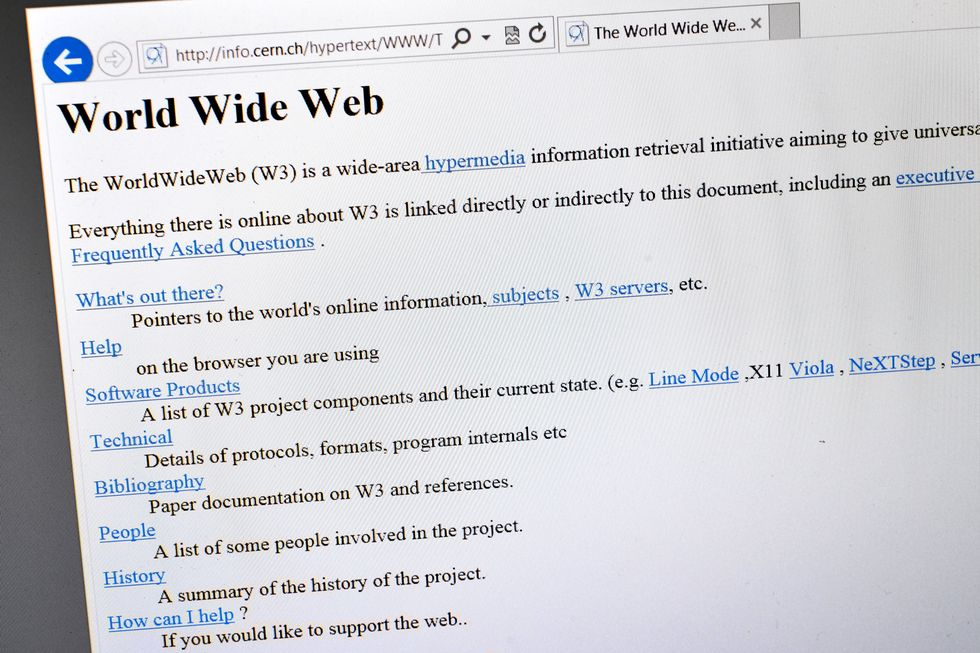
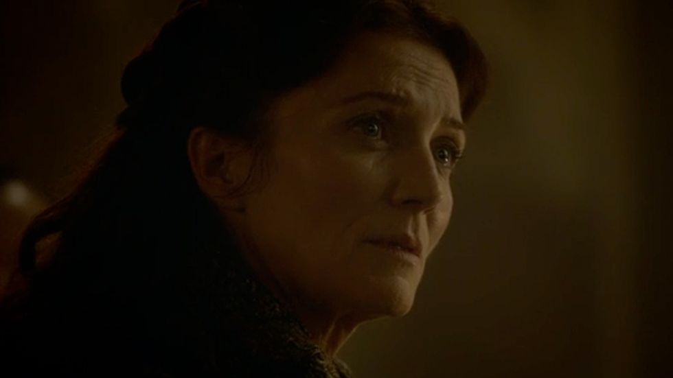

1

## ARPANET Turns On (1966)  

ARPANET 启动（1966 年）

 by Larry Roberts in 1969, apparently without the various statements Michigan Ilinois Utah, the faculty of USB (University of San")

Apic//Getty Images Apic//Getty Images

We can't talk about great moments in internet history without talking about the Advanced Research Projects Agency Network (ARPANET), which was founded in 1966.  

说到互联网历史上的伟大时刻，就不能不提到成立于 1966 年的高级研究计划局网络 (ARPANET)。

The massive network was the result of several different networks merging into one, with the idea that critical information could be shared "[in the case of a catastrophic event](https://computer.howstuffworks.com/arpanet.htm)."  

这个庞大的网络是由几个不同的网络合并而成的，其理念是 "在发生灾难性事件时 "可以共享关键信息。

Pictured is a diagram of potential internet networks conceptualized by Larry Roberts, the [self-proclaimed founder of the internet](https://www.wired.com/2012/09/larry-roberts/).  

图为自称互联网创始人的拉里-罗伯茨构思的潜在互联网网络图。

2

## The OG Meme Lord (1976)  

原始记忆大师（1976 年）

This content is imported from youTube. You may be able to find the same content in another format, or you may be able to find more information, at their web site.

Richard Dawkins on memes - Cannes Lions 2013  

理查德-道金斯谈备忘录 - 2013 年戛纳国际电影节

Richard Dawkins, author of _The Selfish Gene_, [coined the term "meme"](https://www.thrillist.com/entertainment/nation/first-meme-ever) back in 1976 and intended for it to be used in terms of evolutionary biology. But then the internet came along and adopted the phrase.  

自私的基因》一书的作者理查德-道金斯（Richard Dawkins）早在 1976 年就创造了 "meme "一词，并打算将其用于生物进化方面。但后来互联网出现了，并采用了这个词。

In a 2013 interview, Dawkins said "the internet is a first class ecology for memes to spread, and it's no wonder that the world 'meme' has taken up in the internet, because that's exactly what it is."  

在2013年的一次采访中，道金斯说："互联网是meme传播的一流生态，难怪'meme'这个词会出现在互联网上，因为这正是它的本质。"

The next time you reference or share a meme, thank Dawkins for providing us with a succinct term that's universally understood.  

下一次，当你引用或分享一个meme时，请感谢道金斯为我们提供了一个人人都能理解的简洁术语。

3

## The Birth of Spam (1978)  

垃圾邮件的诞生》（1978 年）

Caspar Benson//Getty Images  

卡斯帕-本森//盖蒂图片社

The world's first spam mail was sent in May 1978 by Gary Thuerk, who sent a message to hundreds of ARPA users. "I thought of it as e-marketing," [Thuerk has said](https://www.computerworld.com/article/2539767/unsung-innovators--gary-thuerk--the-father-of-spam.html) of his mass unsolicited email promoting a new product rollout.  

世界上第一封垃圾邮件是由 Gary Thuerk 于 1978 年 5 月向数百名 ARPA 用户发送的。Thuerk 说："我把它看作是电子营销。"他通过大量主动发送的电子邮件宣传一种新产品。  

Thuerk made his company millions with sales resulting from the spam, but also noted that "[complaints started coming in almost immediately](https://www.weforum.org/agenda/2018/05/its-40-years-since-the-first-spam-email-was-sent-here-are-6-things-you-didnt/)."  

Thuerk 通过垃圾邮件为公司带来了数百万美元的销售额，但他也指出，"投诉几乎立即就开始了"。

That hasn't really changed. People didn't like spam then and we certainly don't like it now.  

这一点并没有真正改变。当时人们不喜欢垃圾邮件，我们现在当然也不喜欢。

4

## Hello, Top Level Domains (1986)  

你好，顶级域名（1986 年）

National Institute of Standards and Technology  

美国国家标准与技术研究院

In 1986, Jon Postel introduced top level domains (.com, .org, .gov, .edu, and .mil) to the world.  

1986 年，Jon Postel 向全世界推出了顶级域名（.com、.org、.gov、.edu 和 .mil）。

Postel was a computer scientist who led the domain name system (DNS) and was referred to as the "God of the Internet" for his immense know-how and influence.  

波斯特尔是一位计算机科学家，他领导了域名系统（DNS）的工作，因其丰富的专业知识和巨大的影响力而被称为 "互联网之神"。  

In 2012, he was posthumously [inducted into the Internet Hall of Fame](https://internethalloffame.org/inductees/jon-postel).  

2012 年，他被追认为互联网名人堂成员。

Pro tip: If you have an .edu email, you can access six months of Amazon's Prime membership for free. Adobe, Spotify, and [others](https://www.makeuseof.com/tag/discounts-edu-email-address/) also offer great deals with a .edu email. Thanks, Mr. Postel.  

专业建议：如果您有一个 .edu 电子邮件，您可以免费使用六个月的亚马逊 Prime 会员资格。Adobe、Spotify 和其他公司也提供使用 .edu 电子邮件的优惠。谢谢，波斯特尔先生。

5

## Photoshop Enters the Fold (1990)  

Photoshop 进入人们的视线（1990 年）

Adobe Adobe

In 1990, the first commercial version of Photoshop was released by Adobe, changing the photo editing game forever.  

1990 年，Adobe 发布了第一个商业版 Photoshop，从此改变了照片编辑游戏。  

Decades later, it's still the most widely used photo editing tool.  

几十年过去了，它仍然是使用最广泛的照片编辑工具。  

If you [Facetune](https://www.vox.com/the-highlight/2019/7/16/20689832/instagram-photo-editing-app-facetune) your selfies, thank Photoshop for its continued influence almost 30 years later.  

如果你对自拍照进行了 Facetune，请感谢 Photoshop 在近 30 年后对你的持续影响。  

6

## The Web Goes World Wide (1991)  

网络走向世界（1991 年）

FABRICE COFFRINI//Getty Images  

FABRICE COFFRINI//盖蒂图片社

In 1991, [Tim Berners-Lee's World Wide Web](https://thenextweb.com/insider/2011/08/06/20-years-ago-today-the-world-wide-web-opened-to-the-public/) went live. The British physicist revolutionized the way the world shares and processes information. Pictured is the world's very first webpage. We've come a long way, haven't we?  

1991 年，蒂姆-伯纳斯-李的万维网正式上线。这位英国物理学家彻底改变了世界共享和处理信息的方式。图为世界上第一个网页。我们走过了漫长的道路，不是吗？

7

## Mosaic Changes the Game (1993)  

马赛克改变游戏》（1993）

Brent Stirton//Getty Images  

Brent Stirton//盖蒂图片社

Marc Andreessen (pictured) and Eric Bina launched Mosaic, "[the first popular web browser](https://www.zdnet.com/article/mosaics-birthday-25-years-of-the-modern-web/)," in January 1993. Part of the reason Mosaic became instantly popular was because it was fast and allowed users to [see images embedded on pages](https://history-computer.com/Internet/Conquering/Mosaic.html).  

马克-安德森（如图）和埃里克-比纳于 1993 年 1 月推出了 "第一个流行的网络浏览器 "Mosaic。Mosaic 浏览器之所以一经推出就大受欢迎，部分原因在于它速度快，而且允许用户查看网页中嵌入的图片。

We're used to having images, videos, gifs, and other media built into webpages, but it wasn't always like that.  

我们习惯于在网页中内置图片、视频、gif 和其他媒体，但并非总是如此。  

The ability to include media on the web is what spawned the creation of memes. Imagine a world without them.  

在网络上加入媒体的能力催生了 "备忘录 "的诞生。想象一下没有它们的世界。

8

## The World's First Livestream (1993)  

世界上第一个直播节目（1993 年）

This content is imported from youTube. You may be able to find the same content in another format, or you may be able to find more information, at their web site.

The Trojan Room Coffe Pot on Look East  

特洛伊房间咖啡壶在东望楼

One of the internet's first celebrities was the [Trojan room coffee pot](https://www.bbc.com/news/technology-20439301), subject of the world's first livestream, which went live on November 22, 1993. Yes. A coffee pot.  

互联网上最早的名人之一是特洛伊房间的咖啡壶，它是 1993 年 11 月 22 日世界上第一条直播流的主题。是的，一个咖啡壶。咖啡壶

9

## Woo, Yahoo! (1994) Woo, Yahoo!

Newscast//Getty Images Newscast//Getty Images

In February 1994, Yahoo was born.  

1994 年 2 月，雅虎诞生了。  

The site, created by David Filo and Jerry Yang, was originally called "Jerry and David’s Guide to the World Wide Web." Good thing they changed it, because it would take more time to type that into a search bar than "Yahoo."  

该网站由 David Filo 和 Jerry Yang 创建，原名为 "Jerry and David's Guide to the World Wide Web"。好在他们改了名字，因为在搜索栏里输入这个名字要比输入 "雅虎 "花更多时间。

10

## The First Online Webcam (1994)  

第一个在线摄像头（1994 年）

This content is imported from youTube. You may be able to find the same content in another format, or you may be able to find more information, at their web site.

The 1st ever webcam - Connectix Quickcam  

首款网络摄像头 - Connectix Quickcam

The Connectix QuickCam was a relatively affordable ($99) webcam that became available to the public in 1994. According to [_PC World_](https://www.pcworld.idg.com.au/slideshow/350404/history-video-calls-from-fantasy-flops-facetime/), "the first model could only capture a 320-by-240 image" in grey and the camera was only compatible with a Mac.  

Connectix QuickCam 是一款价格相对低廉（99 美元）的网络摄像头，于 1994 年面向公众发售。据《PC World》报道，"第一款产品只能捕捉 320 x 240 的灰色图像"，而且该摄像头只能与 Mac 兼容。

However, "inventive users combined the QuickCam, the emerging internet, and videoconferencing software like CU-SeeMe to take part in the first online video chats," writes _PC World._  

然而，"富有创造力的用户将 QuickCam、新兴的互联网和视频会议软件（如 CU-SeeMe）结合起来，参与了首次在线视频聊天"，《PC World》写道。

If you use Skype or FaceTime, thank these guys.  

如果你使用 Skype 或 FaceTime，请感谢这些家伙。

11

## The World Gets a Popular Navigator (1994)  

世界流行导航仪》（1994 年）

Indolering 吲哚

Netscape was released on April 4, 1994—another brainchild of Marc Andreessen. Some cite Netscape for [kicking off the dot com boom](https://www.popularmechanics.com/culture/web/a27033147/netscape-navigator-history/), while others were happy to have an internet navigator that was easy to use and maneuver.  

网景公司于 1994 年 4 月 4 日发布，这也是马克-安德森的另一个创意。一些人认为网景掀起了网络热潮，而另一些人则对拥有一个易于使用和操作的互联网导航器感到高兴。

Before Netscape, the internet was still a rather abstract notion to a lot of people who hadn't logged on.  

在网景公司之前，互联网对于很多没有登录过互联网的人来说还是一个相当抽象的概念。

12

## Amazon Meets the World (1995)  

亚马逊与世界相遇》（1995 年）

David Robbins//Getty Images  

大卫-罗宾斯/盖蒂图片社

Jeff Bezos launched the online retail behemoth Amazon in July 1995. It's hard to believe the massive marketplace started merely as an online book store.  

杰夫-贝索斯于 1995 年 7 月创办了在线零售巨头亚马逊。很难相信这个庞大的市场最初只是一家网上书店。

It's reported that Bezos eventually wanted to sell "[everything](https://www.businessinsider.com/jeff-bezos-amazon-history-facts-2017-4)," but decided that books were a good starting point. Mission accomplished, a billion times over.  

据报道，贝索斯最终想出售 "一切"，但他认为图书是一个很好的起点。任务完成，十亿倍。

13

## Transactions Change with AuctionWeb (1995)  

拍卖网的交易变化（1995年）

ullstein bild//Getty Images  

ullstein bild//盖蒂图片社

Just two months after Amazon went live, [AuctionWeb](https://www.ebayinc.com/company/our-history/), which would eventually become eBay, joined the internet as an online auction market. The first thing ever sold on the site was a broken laser pointer.  

就在亚马逊上线两个月后，AuctionWeb，也就是后来的 eBay，加入了互联网，成为一个在线拍卖市场。该网站售出的第一件商品是一个坏掉的激光笔。

14

## The Internet Finds Love (1995)  

互联网找到了爱》（1995）

SOPA Images//Getty Images  

SOPA 图片社//盖蒂图片社

Match.com went live on the internet in [1995](https://www.datingadvice.com/online-dating/what-was-the-first-online-dating-site), making it the world's first dating site. Tinder, Bumble, Grindr and so many other dating apps can thank Match for its pioneering efforts back in the mid '90s.  

1995 年，Match.com 在互联网上上线，成为世界上第一个约会网站。Tinder、Bumble、Grindr 和其他许多约会应用程序都要感谢 Match 在 90 年代中期的开创性努力。

15

## Craig Makes His List (1995)  

克雷格列名单》（1995）

Justin Sullivan//Getty Images  

Justin Sullivan//盖蒂图片社

Craigslist was introduced to the world in [1995](https://www.inc.com/magazine/201609/jon-fine/inc-interview-craigslist.html) and immediately began shaping the way people used the internet to search for lodging, goods, and services (both legal and illegal).  

Craigslist 于 1995 年问世，随即改变了人们使用互联网搜索住宿、商品和服务（包括合法和非法）的方式。

16

## You've Got HotMail (1996)  

你有 HotMail》（1996 年）

Hotmail 电子邮件

In July 1996, Hotmail became available to the public as the "[world's first free web-based email provider](http://brainprick.com/sabeer-bhatia-founder-of-hotmail-worlds-first-free-web-based-email-service/)." Hotmail burned bright before fizzling out, but its spirit is alive in Microsoft Outlook.  

1996 年 7 月，Hotmail 作为 "世界上第一个基于网络的免费电子邮件提供商 "向公众开放。Hotmail 在昙花一现之前曾大放异彩，但其精神却在 Microsoft Outlook 中得以延续。

17

## The World Becomes Wireless (1997)  

无线世界》（1997 年）

Smith Collection/Gado//Getty Images  

史密斯收藏/加多/盖蒂图片社

WiFi was first released to the public in 1997 and led to the development of the 802.11 committee, which evolved into IEEE802.11, referring to "[a set of standards](https://purple.ai/blogs/history-wifi/) that define communication for wireless local area networks (WLANs)."  

WiFi 于 1997 年首次向公众发布，并促成了 802.11 委员会的发展，后来发展成为 IEEE802.11，指的是 "一套定义无线局域网（WLAN）通信的标准"。

18

## Music Gets Free (1999)  

音乐获得自由》（1999 年）

Spencer Platt//Getty Images  

斯宾塞-普拉特/盖蒂图片社

Napster was a game changer when it hit the scene in 1999. It allowed people to access and share files—mostly music—without restriction.  

Napster 在 1999 年一经推出，就改变了游戏规则。它允许人们无限制地访问和共享文件（主要是音乐）。  

Napster grew at a rapid pack, peaked somewhere around [80 million users](https://www.lifewire.com/history-of-napster-2438592), and eventually gave way to Spotify and the sort ... but not before pissing off a whole bunch of rockstars and changing the music industry as we know it.  

Napster 发展迅猛，用户数量在 8000 万左右达到顶峰，并最终让位于 Spotify 和其他类似产品......但在此之前，Napster 惹恼了一大批摇滚明星，并改变了我们所熟知的音乐产业。

19

## Online Shopping Is Made Easier (1997)  

网上购物更便捷（1997 年）

Amazon 亚马逊

And more dangerous for your wallet, with the launch of Amazon's "[one-click](https://www.fastcompany.com/3052958/20-moments-that-matter)" option.  

随着亚马逊推出 "一键式 "选择，您的钱包将面临更大的危险。

20

## The Advent of Ad Blocking (1999)  

广告屏蔽的出现（1999 年）

SOPA Images//Getty Images  

SOPA 图片社//盖蒂图片社

[Ad Muncher](http://www.murrayhurps.com/blog/ad-muncher-history) was early ad-blocking software that's still available for download today. According to _[Hackernoon](https://hackernoon.com/the-evolution-of-online-advertisement-blockers-1518481154f6)_, "the program wasn’t effective at blocking ads for websites running in HTTPS," although it did rise in popularity thanks to its ease of use.  

Ad Muncher 是早期的广告拦截软件，至今仍可下载。根据 Hackernoon 的说法，"该软件并不能有效拦截在 HTTPS 下运行的网站广告"，不过由于其易于使用，它确实很受欢迎。

21

## DDoS Attack (2000) DDoS 攻击（2000 年）

Nasanbuyn 纳桑布恩

In February 2000, a high school student and hacker named Mike "MafiaBoy" Calce launched a DDoS (distributed denial of service) attack that crippled a host of sites including CNN, Dell, eBay, Amazon, Yahoo. The purpose?  

2000 年 2 月，一个名叫迈克-"黑手党男孩"-卡尔西（Mike "MafiaBoy" Calce）的高中生黑客发起了一次 DDoS（分布式拒绝服务）攻击，导致 CNN、戴尔、eBay、亚马逊、雅虎等众多网站瘫痪。目的是什么？  

"To intimidate other hacker groups," [says Calce](https://www.npr.org/sections/alltechconsidered/2015/02/07/384567322/meet-mafiaboy-the-bratty-kid-who-took-down-the-internet).  

"卡尔塞说："恐吓其他黑客组织。

22

## Wikipedia Gives Us the Power (2001)  

维基百科赋予我们力量》（2001 年）

Wikipedia 维基百科

[Wikipedia](https://www.britannica.com/topic/Wikipedia) went live with its first edit on January 15, 2001, and has become one of the first places people check for various kinds of information. Actually, _all_ the information.  

维基百科于 2001 年 1 月 15 日首次编辑上线，现已成为人们查找各种信息的首选网站之一。事实上，维基百科提供了所有信息。

23

## The Record Store Dies a Slow Death (2003)  

唱片店慢慢死去（2003 年）

Ian Waldie//Getty Images Ian Waldie//盖蒂图片社

On April 28, 2003, Apple launched iTunes with [200,000 songs](https://www.wired.com/2010/04/0428itunes-music-store-opens/) in its catalog. Today, iTunes holds more than 26 million songs for users to purchase and download. And your probably haven't bought a physical album in five years.  

2003 年 4 月 28 日，苹果公司推出了 iTunes，当时目录中有 20 万首歌曲。如今，iTunes 拥有超过 2,600 万首歌曲供用户购买和下载。你可能已经有五年没有购买过实体专辑了。

24

## Facebook Shows Its Face (2004)  

Facebook 露脸（2004 年）

The Washington Post//Getty Images  

华盛顿邮报》//盖蒂图片社

Before it became a platform for your family to voice their political opinions, The Facebook—that's not a typo, it was indeed called _The_ Facebook—was a directory for college students aimed at helping people at the same school connect with each other. The site was [launched](https://www.history.com/this-day-in-history/facebook-launches-mark-zuckerberg) on February 4, 2004 and gained 1,000 registered users in its first night.  

在成为家人发表政治观点的平台之前，"脸书"--这不是错别字，它确实叫 "脸书"--是一个大学生通讯录，旨在帮助同校学生相互联系。该网站于 2004 年 2 月 4 日推出，第一个晚上就获得了 1000 名注册用户。

25

## The Rise of Gmail (2004)  

Gmail 的崛起（2004 年）

franckreporter//Getty Images  

franckreporter//Getty Images

In 2004, Google announced it would allow users to create an email account for free with 1 whole GB of storage, something that was unheard of at the time, since many people were paying for email service and only getting between 2 to 4 megabytes of storage.  

2004 年，谷歌宣布允许用户免费创建一个拥有 1 GB 存储空间的电子邮件账户，这在当时是闻所未闻的，因为当时很多人花钱购买电子邮件服务，却只能获得 2 到 4 MB 的存储空间。

Don't blame folks for being skeptical at first; Google made its Gmail announcement [on April Fools Day](https://time.com/43263/gmail-10th-anniversary/).  

不要责怪人们一开始的怀疑，谷歌是在愚人节发布 Gmail 消息的。

26

## A New Way to Video (2005)  

视频新方式（2005 年）

Jeff J Mitchell//Getty Images  

Jeff J Mitchell//盖蒂图片社

In February of 2005, ex-PayPal employees created a little website called YouTube. The [first video uploaded](https://www.youtube.com/watch?v=jNQXAC9IVRw) to the site was an 18 second clip of one of the founders, Jawed Karim, at the San Diego Zoo.  

2005 年 2 月，前 PayPal 员工创建了一个名为 YouTube 的小网站。上传到该网站的第一段视频是创始人之一贾韦德-卡里姆在圣地亚哥动物园的一段 18 秒的短片。

27

## The First YouTube Makeup Tutorial (2006)  

第一个 YouTube 化妆教程（2006 年）

This content is imported from youTube. You may be able to find the same content in another format, or you may be able to find more information, at their web site.

YouTube's first ever makeup tutorial came from Adrienne K. Nelson, who set the mood with some light jazz and got to work on her model.  

YouTube 上的第一个化妆教程来自 Adrienne K. Nelson，她用轻快的爵士乐营造出一种氛围，然后开始为她的模特化妆。  

There's no voiceover and no super long intro—just a straightforward application of makeup. How simple.  

没有画外音，也没有超长的开场白，只有简单明了的化妆过程。多么简单

28

## Netflix Begins Streaming (2007)  

Netflix 开始流媒体播放（2007 年）

Future Publishing//Getty Images  

未来出版//盖蒂图片社

Although Netflix came alive in 1997 as a movie rental service, it grew to become the foremost video streaming service of all time.  

尽管 Netflix 于 1997 年作为一项电影租赁服务诞生，但它已发展成为有史以来最重要的视频流媒体服务。  

In 2007, a decade after its birth, Netflix began allowing "members to [instantly watch television shows and movies](https://media.netflix.com/en/about-netflix) on their personal computers." Today, we can't a conversation without asking, "So what are you bingeing?"  

2007 年，在诞生十年之后，Netflix 开始允许 "会员在个人电脑上即时观看电视节目和电影"。如今，我们在聊天时都会问 "你在狂欢什么？"

29

## Salad Fingers. (2007) 沙拉手指(2007)

This content is imported from youTube. You may be able to find the same content in another format, or you may be able to find more information, at their web site.

30

## SHOES (2007) 鞋》（2007 年）

This content is imported from youTube. You may be able to find the same content in another format, or you may be able to find more information, at their web site.

Two years after YouTube debuted, comedian Liam Kyle Sullivan gifted the world with a shoes video—_the_ shoes video. You know the one.  

YouTube 推出两年后，喜剧演员利亚姆-凯尔-沙利文（Liam Kyle Sullivan）向全世界赠送了一段鞋子视频--鞋子视频。你知道的。

31

## Apple Introduces the iPhone (2007)  

苹果公司推出 iPhone（2007 年）

Kim Kulish//Getty Images Kim Kulish//盖蒂图片社

On June 29, 2007, Apple released the very first [iPhone](https://appleinsider.com/articles/18/06/29/the-story-of-the-original-iphone-that-nobody-thought-was-possible), revolutionizing mobile internet usage forever.  

2007 年 6 月 29 日，苹果公司发布了第一款 iPhone，彻底改变了移动互联网的使用方式。

32

## Kanye vs. Taylor (2009)  

坎耶大战泰勒（2009）

Christopher Polk//Getty Images  

克里斯托弗-波尔克/盖蒂图片社

_"Yo Taylor, I'm really happy for you, and Imma let you finish, but Beyoncé had one of the best videos of all time … one of the best videos of all time!"  

"哟，泰勒，我真的为你感到高兴，我让你说完，但碧昂斯有一个最好的视频......有史以来最好的视频之一！"_

That's what Kanye West said to Taylor Swift when he stormed the stage during her acceptance for Best Video by a Female Artist at the 2009 VMAs. It was the start of the [Kanye vs. Taylor feud](https://www.vox.com/culture/2019/8/26/20828559/taylor-swift-kanye-west-2009-mtv-vmas-explained), sure, but also one of the first moments we all collectively watched (in horror) on Twitter together. Live-tweeting events would never be the same.  

这就是坎耶-维斯特（Kanye West）在泰勒-斯威夫特（Taylor Swift）获得 2009 年音乐颁奖礼最佳女艺人视频奖时冲上台对她说的话。这当然是坎耶与泰勒恩怨的开端，但也是我们第一次在推特上一起（惊恐地）集体观看的时刻之一。推特直播活动从此一发不可收拾。

33

## We Meet Some Humans from New York (2010)  

我们遇到了一些来自纽约的人类（2010 年）

Orbon Alija//Getty Images  

Orbon Alija//盖蒂图片社

In September 2010, [Brandon Stanton](https://www.crainsnewyork.com/article/20150426/TECHNOLOGY/150429893/meet-brandon-stanton-the-man-behind-humans-of-new-york) launched Humans of New York (HoNY), a photoblog chronicling the lives of New Yorkers. Stanton's blog quickly amassed a huge following and continues to be a hit today.  

2010 年 9 月，布兰登-斯坦顿（Brandon Stanton）创建了 "纽约人类"（HoNY）摄影博客，记录纽约人的生活。斯坦顿的博客很快就吸引了大批追随者，并持续火爆至今。

The only difference is instead of New York, Stanton has taken to several countries all over the world to meet and interview people about their everyday lives.  

唯一不同的是，斯坦顿没有去纽约，而是去了世界多个国家，与人们见面，采访他们的日常生活。

34

## Instagram Is Born (2010)  

Instagram 诞生（2010）

Anadolu Agency//Getty Images  

阿纳多卢通讯社//盖蒂图片社

In October 2010, [Instagram launched](https://www.investopedia.com/articles/investing/102615/story-instagram-rise-1-photo0sharing-app.asp) and quickly became one of the most prolific social media platforms in existence.  

2010 年 10 月，Instagram 推出，并迅速成为现存的最多产的社交媒体平台之一。

35

## The First Royal Wedding (2011)  

第一次皇家婚礼（2011 年）

Chris Jackson//Getty Images  

克里斯-杰克逊/盖蒂图片社

On April 29, 2011, Catherine Middleton married Prince William in a widely publicized wedding that enraptured the masses.  

2011 年 4 月 29 日，凯瑟琳-米德尔顿（Catherine Middleton）与威廉王子（Prince William）举行了一场广为人知的婚礼，令众人为之倾倒。  

Every major news outlet covered the event (and the days leading up to it), which took place at Westminster Abbey in London.  

各大新闻媒体都报道了这次在伦敦威斯敏斯特大教堂举行的活动（以及活动前几天的情况）。  

The world arguably hasn't cared about anything with quite the same fervor since.  

可以说，从那以后，世界再也没有像现在这样热切地关注过任何事情。

36

## Osama bin Laden's Assassination (2011)  

暗杀乌萨马-本-拉登（2011 年）

The White House//Getty Images  

白宫//盖蒂图片社

On May 2, 2011, President Barack Obama announced to the world that Osama bin Laden had been assassinated by U.S. SEAL Team Six during a raid that was [completed in about 40 minutes](https://www.history.com/news/osama-bin-laden-death-seal-team-six). You'd have been hard pressed to find anyone talk smack on Twitter—perhaps the last time _that_ happened.  

2011 年 5 月 2 日，美国总统奥巴马向全世界宣布，美国海豹六队在大约 40 分钟的突袭行动中刺杀了乌萨马-本-拉登。你很难在推特上发现有人在大放厥词--也许这已经是最后一次了。

37

## The Red Wedding (2013)  

红色婚礼》（2013）

HBO

Forget Kate and Will—_this_ was the wedding that shocked the world. As _Game of Thrones_ aired the ninth episode of its third season, the internet [reacted](https://www.youtube.com/watch?v=78juOpTM3tE) and mourned as a whole.  

忘掉凯特和威尔吧，这是一场震惊世界的婚礼。随着《权力的游戏》第三季第九集的播出，整个互联网都在反应和哀悼。

38

## A Fish Plays Pokémon Red (2014)  

一条鱼玩《神奇宝贝红色》（2014 年）

This content is imported from youTube. You may be able to find the same content in another format, or you may be able to find more information, at their web site.

When we say people were excited to watch Grayson Hopper, a fish, [play Pokémon](https://arstechnica.com/gaming/2014/08/an-actual-fish-has-been-playing-pokemon-red-for-135-hours-now/), we mean they were _excited_. Just look at the rapid fire comments at the time of the livestream shown in the video.  

当我们说人们为观看格雷森-霍普（一条鱼）玩神奇宝贝而兴奋不已时，我们的意思是他们非常兴奋。看看视频中直播时的快速评论就知道了。

39

## The Dress (2015) 礼服》（2015 年）

This content is imported from youTube. You may be able to find the same content in another format, or you may be able to find more information, at their web site.

In February of 2015, [a single dress broke the internet](https://slate.com/technology/2017/04/heres-why-people-saw-the-dress-differently.html), tore families apart, and had people feuding about what its true color(s) were. Some people saw a white and gold dress while others (the correct ones) saw a black and blue one.  

2015 年 2 月，一条裙子刷爆了网络，拆散了家庭，让人们对裙子的真实颜色争论不休。一些人看到的是白色和金色的裙子，而另一些人（正确的人）看到的是黑色和蓝色的裙子。

40

## Llama Llama Highway Drama (2015)  

Llama Llama Highway Drama (2015)

This content is imported from youTube. You may be able to find the same content in another format, or you may be able to find more information, at their web site.

On the very same day The Dress blew our minds, two [llamas escaped in Sun City, Arizona](https://www.azcentral.com/story/news/local/surprise/2015/02/26/sun-city-llamas-on-the-loose-abrk/24068713/) and provided equal intrigue. What a blessed 24 hours.  

就在《礼服》让我们大开眼界的同一天，两只骆驼在亚利桑那州太阳城逃跑，同样引人入胜。多么幸福的 24 小时啊。

41

## We Rate Dogs Joins Twitter (2015)  

We Rate Dogs 加入 Twitter（2015 年）

hobo\_018//Getty Images hobo\_018//Getty Images

In November 2015, [We Rate Dogs](https://twitter.com/dog_rates) officially joined Twitter. The premise is simple: It rates photos of dogs, on a scale of 10 to 14 out of 10. It's the last, and perhaps only, good Twitter account.  

2015 年 11 月，We Rate Dogs 正式加入 Twitter。前提很简单：它为狗狗的照片打分，满分为 10 至 14 分。它是最后一个，或许也是唯一一个优秀的 Twitter 账户。

42

## Beyoncé Releases Lemonade (2016)  

碧昂斯发布《柠檬水》（2016 年）

Steve Granitz//Getty Images  

Steve Granitz//盖蒂图片社

In 2016, Beyoncé surprise released her sixth solo album, _[Lemonade](https://www.nytimes.com/2016/04/24/arts/music/beyonce-hbo-lemonade.html)_, with an accompanying quasi-film. The Internet had thoughts. They were mostly rapturous.  

2016 年，碧昂斯惊喜地发行了她的第六张个人专辑《Lemonade》，并随之推出了一部准电影。互联网上对此议论纷纷。他们大多赞不绝口。

43

## The Launch of Pokémon Go (2016)  

口袋妖怪 Go》的发布（2016 年）

Olivia Harris//Getty Images  

奥利维亚-哈里斯/盖蒂图片社

On July 6, 2016, every Pokémon fanatic was treated to a childhood dream come true: the ability to actually [go out and catch 'em all](https://www.cnet.com/news/pokemon-go-launches-on-ios-and-android/). Using augmented reality, people could download the Pokémon Go app and run around trying to catch as many monsters as possible.  

2016 年 7 月 6 日，每一个神奇宝贝爱好者都实现了儿时的梦想：能够真正外出捕捉到所有的神奇宝贝。利用增强现实技术，人们可以下载 Pokémon Go 应用程序，四处奔跑，尽可能多地捕捉怪物。  

And for about two weeks that summer, that's all they did.  

那个夏天，他们只做了两个星期。

44

## Dear David Captivates the Masses (2017)  

亲爱的大卫》吸引大众（2017 年）

This content is imported from youTube. You may be able to find the same content in another format, or you may be able to find more information, at their web site.

Turns out ghost stories can still freak us out.  

事实证明，鬼故事仍然能吓到我们。

45

## The Second Royal Wedding (2018)  

第二次皇家婚礼（2018）

Jane Barlow - PA Images//Getty Images  

Jane Barlow - PA Images//Getty Images

This time, Prince Harry married actress Meghan Markle on May 19, 2018. Like his brother, Harry married a non-royal, and an American, to boot.  

这一次，哈里王子于2018年5月19日迎娶了女演员梅根-马克尔。和他的哥哥一样，哈里娶了一位非王室成员，而且还是一位美国人。  

We'll never get up that early on a Saturday morning again.  

我们再也不会在周六早上起那么早了。

46

## The Yanny vs. Laurel Debate (2018)  

艳妮与劳雷尔之争（2018）

This content is imported from youTube. You may be able to find the same content in another format, or you may be able to find more information, at their web site.

It's Laurel, for the record.  

我叫劳蕾尔。

47

## The Internet and Marvel Step Up (2019)  

互联网与漫威的强强联手（2019）

Steve Granitz//Getty Images  

Steve Granitz//盖蒂图片社

When a terminally ill man known only as Alexander asked the internet to help him catch an early screening of Marvel's _Avengers: Endgame_, the internet delivered.  

一位名叫亚历山大的身患绝症的男子请求互联网帮助他提前观看漫威电影《复仇者联盟：终局之战》（Avengers's Endame）：终结者》，互联网帮他实现了这个愿望。

Alexander suffered from Fanconi Anemia, and his dying wish was to see the upcoming installment of the hit franchise.  

亚历山大患有范可尼贫血症，他的遗愿是能看到即将上映的热门系列电影。  

It began with a Reddit thread that blossomed into Disney contacting Alexander to "discuss options."  

事情起源于 Reddit 上的一个话题，后来发展成迪士尼与亚历山大联系，"讨论各种选择"。

"I cried when I read their email. It's everything I hoped for and I owe it to all of you," Alexander [wrote](https://www.reddit.com/r/marvelstudios/comments/actrm0/dying_before_april_my_endgame/).  

"当我读到他们的邮件时，我哭了。这是我所希望的一切，我应该感谢你们所有人，"亚历山大写道。

Proof that sometimes, the Internet can be awesome.  

这证明，有时互联网也可以很棒。

48

## Llamas on the Loose Pt. 2 (2019)  

逃亡的喇嘛第 2 部分（2019 年）

This content is imported from youTube. You may be able to find the same content in another format, or you may be able to find more information, at their web site.

Like manna from heaven, [two llamas escaped their homes to go on an adventure](https://abc7chicago.com/pets-animals/llamas-on-the-loose-in-las-vegas/5300049/), and we gloriously followed the action.  

就像天降甘露一样，两只骆驼逃离了它们的家园，开始了一场冒险之旅，我们兴高采烈地跟在后面。  

This time they were named Hershey and Kisses, and they casually strolled around Las Vegas until animal control returned them to their owner.  

这一次，它们被命名为 "好时 "和 "亲亲"，在拉斯维加斯闲庭信步，直到动物管理部门将它们送还给主人。

49

## The Internet Rallies for Spicy Nuggets (2019)  

互联网为麻辣鸡块集结（2019年）

JIM WATSON//Getty Images JIM WATSON//盖蒂图片社

You can thank [Chance the Rapper and 2.2 million people on Twitter](https://www.eater.com/2019/6/24/18716042/wendys-spicy-nuggets-return-august-19) for their efforts in getting Wendy's to bring back their spicy chicken nuggets.  

您可以感谢说唱歌手 Chance 和推特上的 220 万人，是他们的努力让温迪重新推出了辣味鸡块。

It all started when the rapper [tweeted](https://twitter.com/chancetherapper/status/1124717840731443202?ref_src=twsrc%5Etfw%7Ctwcamp%5Etweetembed%7Ctwterm%5E1124763246370676737&ref_url=https%3A%2F%2Fwww.eater.com%2F2019%2F6%2F24%2F18716042%2Fwendys-spicy-nuggets-return-august-19) about the nuggets and Wendy's replied by throwing down the gauntlet to all of Twitter: 2 million likes in exchange for the spicy nuggets.  

事情的起因是说唱歌手在推特上发布了关于辣肉块的消息，温迪公司在回复中向整个推特抛出了橄榄枝：以 200 万个赞换取辣味炸玉米块。

[It worked](https://twitter.com/Wendys/status/1124763246370676737?ref_src=twsrc%5Etfw%7Ctwcamp%5Etweetembed%7Ctwterm%5E1124763246370676737&ref_url=https%3A%2F%2Fwww.eater.com%2F2019%2F6%2F24%2F18716042%2Fwendys-spicy-nuggets-return-august-19). 成功了

50

## Twitter Ends Political Advertising (2019)  

推特终止政治广告（2019）

Twitter 推特

In a bold move, the popular social media platform decided to "stop all political advertising on Twitter globally." On October 30, 2019, Twitter cofounder and CEO Jack Dorsey made the stunning, potentially game-changing [announcement](https://twitter.com/jack/status/1189634360472829952).  

作为一个大胆的举措，这个流行的社交媒体平台决定 "在全球范围内停止 Twitter 上的所有政治广告"。2019 年 10 月 30 日，Twitter 联合创始人兼首席执行官杰克-多西（Jack Dorsey）宣布了这一可能改变游戏规则的惊人消息。

Freelance writer 自由撰稿人

Daisy Hernandez is a reporter, editor, and content creator with a background in print and digital media and has written for Sports Illustrated, Popular Mechanics, and Bicycling magazines.  

黛西-埃尔南德斯（Daisy Hernandez）是一名记者、编辑和内容创作者，拥有平面媒体和数字媒体背景，曾为《体育画报》、《大众机械》和《自行车》杂志撰稿。  

She loves to cook, frequently testing out new recipes on friends and family, and is a big fan of prehistoric science, travel, Halloween, trivia, and dogs.  

她喜欢烹饪，经常在朋友和家人面前试验新食谱，还是史前科学、旅游、万圣节、琐事和狗的忠实粉丝。  

You can find her on Instagram and Twitter.  

您可以在 Instagram 和 Twitter 上找到她。
