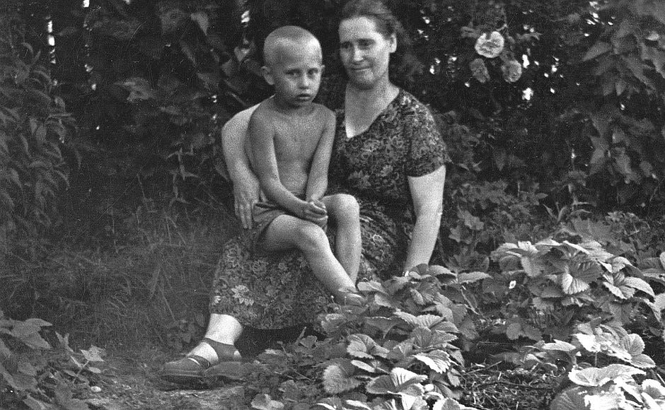
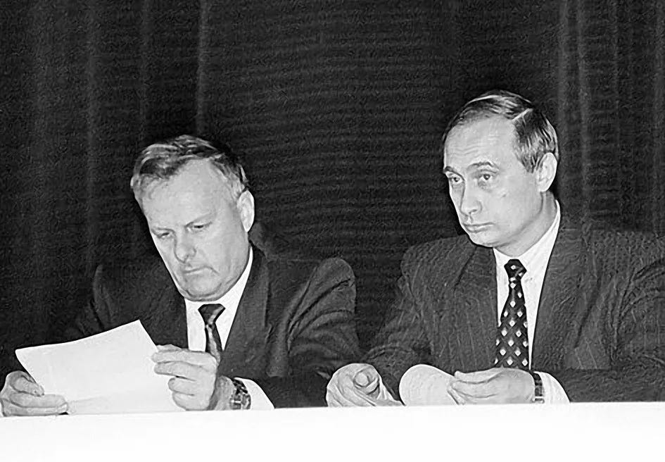
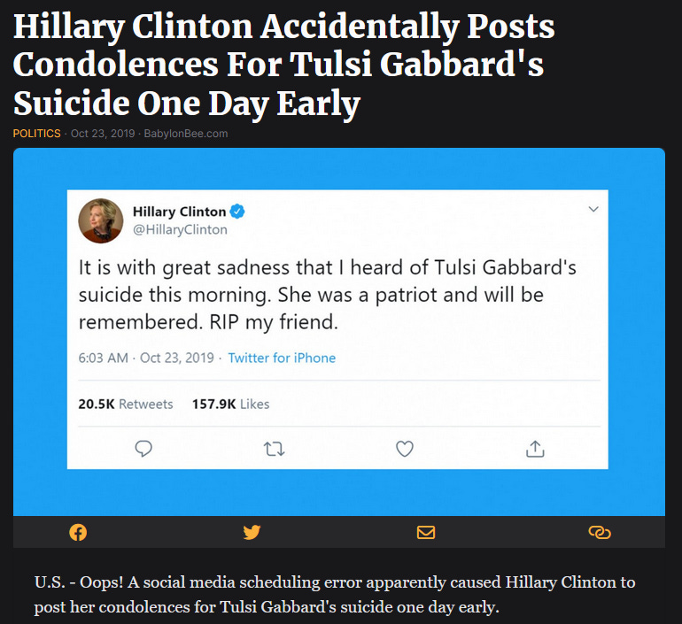
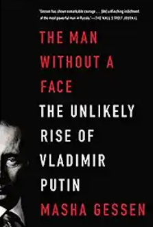

Vladimir Putin appeared on Earth fully-formed at the age of nine.  

弗拉基米尔-普京九岁时就已经完全成形，出现在地球上。

At least this is the opinion of Natalia Gevorkyan, his first authorized biographer. There were plenty of witnesses and records to every post-nine-year-old stage of Putin’s life.  

至少这是他的第一位授权传记作者纳塔利娅-格沃尔基扬（Natalia Gevorkyan）的观点。普京九岁之后的每个人生阶段都有大量的证人和记录。  

Before that, nothing. Gevorkyan thinks he might have been adopted. Putin’s official mother, Maria Putina, was 42 and sickly when he was born. In 1999, a Georgian peasant woman, [Vera Putina](https://www.economist.com/obituary/2023/06/08/vera-putina-claimed-to-be-vladimir-putins-real-mother), claimed to be his real mother, who had given him up for adoption when he was ten.  

Journalists dutifully investigated and found that a “Vladimir Putin” had been registered at her village’s school, and that a local teacher remembered him as a bright pupil who loved Russian folk tales.  

记者们尽职调查后发现，"弗拉基米尔-普京 "曾在她村里的学校注册，当地老师还记得他是个聪明的学生，喜欢俄罗斯民间故事。

What happened to him? Unclear;

在此之前，什么都没有。格沃尔基扬认为他可能是被收养的。普京的正式母亲玛丽亚-普京娜在他出生时已 42 岁，体弱多病。1999 年，格鲁吉亚农妇维拉-普京娜声称自己是他的亲生母亲，在他十岁时将他送人收养。 [Artyom Borovik](https://en.wikipedia.org/wiki/Artyom_Borovik#Death), the investigative journalist pursuing the story, died in a plane crash just before he could publish. Another investigative journalist, [Antonio Russo](https://en.wikipedia.org/wiki/Antonio_Russo), took up the story, but “his body was found on the edge of a country road . . . bruised and showed signs of torture, with techniques related to special military services.”  

他后来怎么样了？不清楚；追踪报道的调查记者阿尔乔姆-博罗维克（Artyom Borovik）在发表文章前死于飞机失事。另一名调查记者安东尼奥-鲁索（Antonio Russo）接手报道，但 "他的尸体在一条乡间小路边被发现。......遍体鳞伤，有遭受酷刑的痕迹，手法与特殊军事服务有关"。

Still, I’m inclined to doubt the adoption theory. Vladimir Putin’s official father, a WWII veteran and factory worker, was also named Vladimir Putin.  

不过，我还是倾向于怀疑收养说。弗拉基米尔-普京的正式父亲是一名二战老兵和工厂工人，也叫弗拉基米尔-普京。  

The adoption story requires that a child named Vladimir Putin was coincidentally adopted by a man also named Vladimir Putin.  

收养故事要求一个名叫弗拉基米尔-普京的孩子被一个也叫弗拉基米尔-普京的男人巧合地收养。  

Far easier to believe that an old Georgian woman had a son who died or was adopted out.  

更容易让人相信的是，一个格鲁吉亚老妇人有个儿子死了或者被领养了。  

Then, when a man with the same name became President of Russia, she assuaged her broken heart by pretending it was the same guy. Records of Putin’s early life _are_ surprisingly sparse. But there are a few photos (admittedly fakeable), and people who aren’t face-blind tell me that Putin looks very much like his official mother.  

后来，一个同名同姓的人当上了俄罗斯总统，她就假装是同一个人，以抚慰自己受伤的心灵。关于普京早年生活的记录少得出奇。但有几张照片（诚然是可以伪造的），不是脸盲的人告诉我，普京长得非常像他的正式母亲。

Vladimir Putin, age 6, with his official mother Maria Putina.  

6 岁的弗拉基米尔-普京和他的官方母亲玛丽亚-普京娜。

As for the investigative journalist deaths, it would be more surprising for a Russian investigative journalist of the early 2000s _not to_ die horribly. Both were researching other things about Putin besides his childhood. and had made themselves plenty of enemies.  

Russo was in Chechnya at the time, another known risk factor for horrible death. I wouldn’t over-update on this.  

鲁索当时在车臣，这是另一个众所周知的导致可怕死亡的危险因素。我不会对此过度更新。  

至于调查记者的死亡，21 世纪初的俄罗斯调查记者不惨死才更令人吃惊。除了普京的童年，两人还在研究有关普京的其他事情。

Still, I found the adoption controversy interesting as a metaphor for everything about Putin.  

不过，我还是觉得领养风波很有意思，它隐喻了普京的一切。  

Vladimir Putin really did seem to appear on Earth - or at least in the corridors of power in Russia - fully formed.  

弗拉基米尔-普京似乎真的是完完全全地出现在地球上，至少是出现在俄罗斯的权力走廊里。  

At each step in his career, he was promoted for no particular reason, or because he seemed so devoid of personality that nobody could imagine him causing trouble.  

在他的职业生涯中，他每一步的晋升都没有特别的原因，或者因为他看起来没有个性，没有人能想象他会制造麻烦。  

This culminated in his 2000 appointment as Yeltsin’s successor when “The world’s largest landmass, a land of oil, gas, and nuclear arms, had a new leader, and its business and political elites had no idea who he was.”  

这在他 2000 年被任命为叶利钦的继任者时达到了顶峰，当时 "世界上最大的陆地，一个盛产石油、天然气和核武器的国度，有了一位新的领导人，而其商界和政界精英却不知道他是谁"。

My source for this quote is _[The Man Without A Face: The Unlikely Rise Of Vladimir Putin](https://amzn.to/3XN9Ck7)_ by Masha Gessen, a rare surviving Russian investigative journalist.  

As always in Dictator Book Club, we’ll go through the story first, then discuss if there are any implications for other countries trying to avoid dictatorship.  

在 "独裁者读书会 "中，我们将一如既往地先回顾故事，然后讨论这对其他试图避免独裁的国家是否有任何启示。  

我引用这句话的资料来源是《没有脸的人》：俄罗斯现存罕见的调查记者玛莎-格森（Masha Gessen）所著的《没有面孔的人：弗拉基米尔-普京不可能的崛起》（The Unlikely Rise Of Vladimir Putin）。

Officially, Vladimir Putin was born in 1952 to Vladimir Putin Sr.  

官方资料显示，弗拉基米尔-普京出生于 1952 年，父亲是老弗拉基米尔-普京。  

and Maria Putina, two middle class laborers who had lost their previous two children in the hellish Nazi siege of Leningrad a decade before.  

和玛丽亚-普京娜（Maria Putina），这两个中产阶级工人在十年前纳粹对列宁格勒的地狱般的围攻中失去了前两个孩子。

Putin’s paternal grandfather was [Spiridon Putin](https://en.wikipedia.org/wiki/Spiridon_Putin), “personal cook to Vladimir Lenin and Joseph Stalin”

. Also:  

普京的祖父斯皮里东-普京是 "弗拉基米尔-列宁和约瑟夫-斯大林的私人厨师" 1。还有

> \[Spiridon\] Putin worked at the famous Hotel Astoria, where he once served Grigori Rasputin.  
> 
> \[普京曾在著名的阿斯托里亚酒店工作 他曾在那里为格里高利-拉斯普廷服务过  
> 
> Rasputin gave Putin a gold ruble as he was impressed with the cuisine and noticed the similarity between their names.  
> 
> 拉斯普京给了普京一个金卢布，因为他对普京的菜肴印象深刻，并注意到了两人名字的相似之处。

…but his family was otherwise normal.  

......但他的家人在其他方面都很正常。  

Putin was a mediocre student; schoolmates who remember him at all recall that he was easily-offended, often got in physical fights, and always won.  

普京的学习成绩平平；对他有印象的同学都记得，他很容易得罪人，经常打架，而且总是赢。

Around age ten, Putin got a burning desire to join the KGB.  

大约十岁时，普京萌生了加入克格勃的强烈愿望。  

He credits the many pro-KGB propaganda kids’ TV shows of the time, but Gessen suspects that his father might also have been a secret KGB informant.  

他将此归功于当时许多支持克格勃宣传的儿童电视节目，但格森怀疑他的父亲也可能是克格勃的秘密线人。  

Schoolmates remember he kept a portrait of the founder of the KGB on his desk.  

同学们记得，他的书桌上放着克格勃创始人的肖像。  

And Putin’s otherwise mediocre transcript was boosted by excellent grades in German; KGB employment required a foreign language. And so:  

而普京原本平平的成绩单，却因为德语成绩优秀而得到了提升；克格勃的工作需要一门外语。所以

> At the age of sixteen, a year before finishing secondary school, Vladimir Putin went to the KGB headquarters in Leningrad to try to sign up.  
> 
> 16 岁那年，在中学毕业前一年，弗拉基米尔-普京前往位于列宁格勒的克格勃总部，试图报名参军。  
> 
> “A man came out,” he recalled for a biographer. “He did not know who I was. And I never saw him again after that.  
> 
> "一个人走了出来，"他对一位传记作者回忆道。"他不知道我是谁。从那以后，我再也没有见过他。  
> 
> I told him I go to school and in the future I would like to work for the state security services. I asked if it was possible and what I would have to do to achieve it.  
> 
> 我告诉他我在上学，将来想为国家安全部门工作。我问他这是否可能，要怎么做才能实现这个愿望。  
> 
> The man said they don’t usually sign up volunteers, but the best way for me would be to go to college or serve in the military. I asked him which college.  
> 
> 那人说，他们通常不给志愿者报名，但对我来说，最好的办法是上大学或服兵役。我问他上哪所大学。  
> 
> He said a law college or the law department of the university would be best.  
> 
> 他说，最好是在大学的法学院或法律系。

To everyone’s surprise, mediocre student Putin applied to university and got in. Then:  

出乎所有人意料的是，成绩平平的学生普京申请了大学并被录取了。然后

> All through my university years I kept waiting for that man I spoke to at KGB headquarters to remember me . . . but they had forgotten all about me, because I had been a schoolboy when I came . . . But I remembered they do not sign up volunteers, so I made no moves myself.  
> 
> 整个大学期间，我一直在等待克格勃总部的那个人记得我......但他们把我忘得一干二净，因为我来的时候还是个学生......。.但我记得他们不登记志愿者，所以我自己也没做什么举动。  
> 
> Four years went by. Silence. I decided the issue was closed and started looking around for other possible job assignments . . . But when I was in my fourth year, I was contacted by a man who said he wanted to meet with me.  
> 
> 四年过去了。沉默。我决定就此了结，开始四处寻找其他可能的工作任务......。但在我工作的第四年，一个男人联系了我，说他想和我见一面。  
> 
> He did not say who he was, but somehow I knew right away.  
> 
> 他没有说他是谁，但不知怎的，我马上就知道了。

Putin trained relentlessly, both at the official KGB school and in his hobby of judo, though he took time out to marry his sweetheart:  

普京坚持不懈地训练，既在克格勃的官方学校，也在他的业余爱好柔道上，尽管他抽出时间与爱人结婚：

> Putin’s own descriptions of his relationships paint him as a strikingly inept communicator.  
> 
> 普京自己对人际关系的描述将他描绘成一个非常不善于沟通的人。  
> 
> He had one significant relationship with a woman before meeting his future wife; he left her at the altar. “That’s how it happened,” he told his biographers, explaining nothing.  
> 
> 在遇到他未来的妻子之前，他曾与一位女性有过一段重要的关系；他在圣坛前离开了她。"他对自己的传记作者说："事情就是这样发生的。  
> 
> “It was really hard.” "真的很难"
> 
> He was no more articulate on the subject of the woman he actually married - nor, it seems, was he successful at communicating his feelings to her during their courtship.  
> 
> 对于他真正娶的那个女人，他没有更多的言语表达--似乎他也没有在求爱期间成功地向她传达自己的感情。  
> 
> They dated for more than three years - an extraordinarily long time by Soviet or Russia standards, and at a very advanced age: Putin was almost thirty-one when they married which made him a member of a tiny minority - less than ten percent - of Russians who remained unmarried past the age of thirty.  
> 
> 他们约会了三年多--按照苏联或俄罗斯的标准，这是一段非常长的时间，而且是在一个非常高的年龄：普京结婚时将近 31 岁，这使他成为俄罗斯 30 岁以上仍未婚的极少数人（不到 10%）中的一员。
> 
> The future Mrs Putin was a domestic flight attendant from the Baltic Sea city of Kaliningrad; they had met through an acquaintance.  
> 
> 未来的普京夫人是一位来自波罗的海城市加里宁格勒的国内空姐；他们是通过熟人认识的。  
> 
> She has gone on record saying it was by no means love at first sight, for at first sight Putin seemed unremarkable and poorly dressed; he has never said anything about his love for her.  
> 
> 她曾公开表示，这绝不是一见钟情，因为第一眼看到普京时，他似乎并不起眼，衣着也不怎么样；他从未说过他爱她。  
> 
> In their courtship, it seems, she was both the more emotional and the more insistent one.  
> 
> 在他们的求爱过程中，似乎她是更感性也更坚持的那个。  
> 
> Her description of the day he finally proposed paints a picture of a failure to communicate so profound that it is surprising these people actually maanged to get married and have two children.  
> 
> 她对他最终求婚那天的描述描绘了一幅沟通失败的画面，其程度之深令人惊讶，以至于这两个人居然结了婚，还生了两个孩子。
> 
> “One evening we were sitting in his apartment, and he says ‘ Little friend, by now you know what I’m like.  
> 
> "一天晚上，我们坐在他的公寓里，他说'小朋友，现在你知道我是什么样的人了。  
> 
> I am basically not a very convenient person.’ And then he went on to describe himself: not a talker, can be pretty harsh, can hurt your feelings, and so on.  
> 
> 我基本上不是一个很方便的人'。然后他继续描述自己：不爱说话，可能很严厉，会伤害你的感情，等等。  
> 
> Not a good person to spend your life with. And he goes on. ‘Over the course of three and a half years you’ve probably made up your mind.’ I realized we were probably breaking up.  
> 
> 不是一个适合共度一生的人。他继续说"在三年半的时间里，你可能已经下定决心了。我意识到我们可能要分手了  
> 
> So I said, ‘Well, yes, I’ve made up my mind.’ And he said, with doubt in his voice, ‘Really?’ That’s when I knew we were definitely breaking up.  
> 
> 于是我说：'嗯，是的，我已经下定决心了。'他带着疑惑说：'真的吗？'那时候我就知道我们肯定要分手了。  
> 
> ‘In that case,’ he said, ‘I love you and I propose we get married on such and such a day.’ And that was completely unexpected.”  
> 
> '这样的话，'他说，'我爱你，我提议我们在某年某月某日结婚。'这完全出乎我的意料。"
> 
> They were married three months later.  
> 
> 三个月后，他们结婚了。

Life as a KGB officer was disappointing.  

克格勃军官的生活令人失望。  

Gessen describes it as sitting in a Leningrad office, cutting articles out of newspapers, and sending them to superiors who would ignore them.  

据格森描述，他坐在列宁格勒的一间办公室里，从报纸上剪下文章，然后寄给上级，而上级却置之不理。  

Putin probably worked in “counterintelligence”, which meant the newspaper articles he cut out were about dissidents. There was no interesting dissent in Leningrad in the late 1970s.  

普京可能在 "反间谍 "部门工作，这意味着他剪下的报纸文章都是关于持不同政见者的。20 世纪 70 年代末，列宁格勒并没有什么有趣的持不同政见者。

After five years, Putin got his “big break”; he was assigned to be a spy in East Germany. This, too, underwhelmed him.  

五年后，普京迎来了他的 "重大突破"；他被派往东德担任间谍。这也让他大失所望。  

The East Germany assignment consisted of sitting in the KGB offices in Dresden, cutting articles out of East German papers, and sending them to superiors who would ignore them.  

在东德的任务包括坐在克格勃位于德累斯顿的办公室里，从东德报纸上剪下文章，然后寄给上级，而上级却置之不理。

> Putin drank beer and got fat. He stopped training, or exercising at all, and he gained over twenty pounds - a disastrous addition to his short and fairly narrow frame.  
> 
> 普京喝啤酒变胖了。他停止了训练，也根本不锻炼，体重增加了二十多磅--这对他矮小的身材来说是灾难性的。  
> 
> From all apeearances, he was seriously depressed \[…\]  
> 
> 从种种迹象来看，他的情绪非常低落 \[...\] 。
> 
> He spent most days sitting at his desk, in a room he shared with one other agent (every other officer in the Dresden building had his own office) . . . Former agents estimate they spent three-quarters of their time writing reports.  
> 
> 他大部分时间都坐在自己的办公桌前，与另外一名特工共用一个房间（德累斯顿大楼里的每名其他官员都有自己的办公室）......。据前特工估计，他们四分之三的时间都在写报告。  
> 
> Putin’s biggest success in his \[five year\] stay in Dresden appears to have been in drafting a Colombian universtiy student at a school in West Berlin, who in turn introduced them to a Colombian-born US Army sergeant, who sold them an unclassified Army manual for 800 marks.  
> 
> 普京在德累斯顿逗留的\[五年\]时间里，最大的成功似乎是在西柏林的一所学校里招募了一名哥伦比亚大学生，而后者又把他们介绍给了一名哥伦比亚出生的美国陆军中士，后者以 800 马克的价格卖给了他们一本未分类的陆军手册。

In 1989, the Soviet Union began to collapse. East Germans protested in front of KGB headquarters; Putin was sent out to negotiate and got screamed at and insulted.  

1989 年，苏联开始解体。东德人在克格勃总部前抗议；普京被派去谈判，结果遭到谩骂和侮辱。  

HQ refused to defend them or even give them orders, before finally telling them to burn all their records - the records Putin had wasted the past five years of his life meticulously collecting.  

总部拒绝为他们辩护，甚至拒绝向他们下达命令，最后告诉他们烧掉所有记录--普京浪费了五年时间精心收集的记录。  

He and his fellow spies spent a few tense days shoveling their lives’ work into stoves while people outside hurled curses at them.  

他和他的间谍伙伴们度过了几天紧张的日子，把他们毕生的心血铲进炉子里，而外面的人却对他们破口大骂。  

He stayed and watched briefly as his East German friends and colleagues were fired and banned from all good jobs for collaborating with the Soviet occupiers - then was recalled home to Leningrad, where nobody had any idea what he should do.  

他留下来，眼睁睁地看着他的东德朋友和同事因与苏联占领者合作而被解雇，并被禁止从事任何好工作，然后他被召回列宁格勒，在那里，没有人知道他该做什么。  

Feeling abandoned, even betrayed, he handed in his resignation to the KGB.  

他觉得自己被抛弃了，甚至被背叛了，于是向克格勃递交了辞呈。

Back in Leningrad, he briefly got a position at the university as “assistant chancellor for foreign relations” on the grounds that he was one of the only people in the city who had ever been to a foreign country.  

回到列宁格勒后，他在大学里短暂地得到了一个 "对外关系校长助理 "的职位，理由是他是这座城市里唯一去过外国的人。  

After only a few months, the new mayor offered him a high position in city government, for the same reason.  

仅仅过了几个月，新市长就以同样的理由让他在市政府担任要职。  

This was Anatoly Sobchak, a two-faced politician who had climbed to the top by convincing both the pro-democracy protesters and the communists he was on their side.  

这就是阿纳托利-索布恰克，他是一个两面派政客，通过说服支持民主的抗议者和共产党人，他站在了他们这一边，从而爬上了高位。  

Gessen speculates he promoted Putin both because of his foreign experience, and because “it’s better to choose your own KGB handler than to have one assigned to you.”  

格森推测，他提拔普京既是因为他的外交经验，也是因为 "自己选择克格勃的管理者总比别人指派给你要好"。

Wait, hadn’t Putin already resigned from the KGB? Yes. He did this several times throughout his life, always at dramatic moments.  

等等，普京不是已经从克格勃辞职了吗？是的。他一生中多次这样做，而且总是在戏剧性的时刻。  

When the next dramatic moment arrived, he would hand in his resignation again. Partly this is because Putin is lying about all of this, and he can’t keep his lies straight.  

当下一个戏剧性时刻到来时，他又会递交辞呈。部分原因是普京在这一切上撒了谎，而他又无法把谎话说清楚。  

But partly it’s because resigning from the KGB is futile; once you’re a part of the network, they will always feel free to call on you when needed.  

但部分原因是，从克格勃辞职是徒劳的；一旦你成为网络的一部分，他们就会在需要时随时找你。  

Putin could resign as often as it felt dramatically appropriate to do so, secure that this wouldn’t affect his membership in any way.  

普京可以随时辞职，只要他觉得这样做是合适的，而且不会对他的成员资格造成任何影响。

Also, it seems unclear whether you can _disband_ the KGB.  

Around this point in the story, the Soviet generals launched their coup, Yeltsin defeated them, and the KGB was replaced by various other security agencies more congenial to a newly democratic state.  

大约在这个时候，苏联将军发动了政变，叶利钦击败了他们，克格勃被其他各种更适合新民主国家的安全机构所取代。  

But everyone continues to act as if this isn’t true, and Putin continues to call on and be called upon by his KGB connections.  

但每个人都继续装作事实并非如此，而普京则继续利用他的克格勃关系，并被其利用。  

I don’t have a great sense of exactly how this worked - maybe the new security agency, the FSB, had strong institutional continuity?  

我不太清楚具体是如何运作的--也许新的安全机构 FSB 具有很强的机构连续性？  

Maybe the formal network gracefully transitioned into an informal one?  

也许正式网络已优雅地过渡到非正式网络？  

另外，能否解散克格勃似乎也不清楚。

Deputy Mayor Putin with his boss, Mayor Sobchak ([source](https://medium.com/@petergrant_14485/putin-in-st-petersburg-official-corruption-and-an-enduring-alliance-with-organized-crime-242fde90fe63))  

普京副市长与他的上司索布恰克市长（消息来源）

Putin became Deputy Mayor In Charge Of Foreign Affairs, in charge of making business deals with foreign cities. In this position, he was notably corrupt even for 1990s St.  

普京成为主管外交事务的副市长，负责与外国城市进行商业交易。在这个职位上，他甚至在 20 世纪 90 年代的圣彼得堡也腐败不堪。  

Petersburg, one of the most corrupt cities in one of the most corrupt eras in one of the most corrupt nations in history.  

彼得堡，历史上最腐败的国家中最腐败的时代中最腐败的城市之一。  

People who challenged his corruption tended to have bad things happen to him; probably he called on his KGB connections here, though it seemed he also had some connections to local organized crime.  

对他的腐败行为提出质疑的人往往会遭遇不测；他可能在这里动用了克格勃的关系，不过他似乎也与当地的有组织犯罪有一些联系。  

Mayor Sobchak, who was equally corrupt, stood behind him the whole way.  

同样腐败的索布恰克市长一直站在他身后。  

Eventually the electorate got tired of all the corruption and voted Sobchak out; Putin moved to Moscow and got various mid-level positions on the strength of being boring, loyal, and not having enough personality to offend anybody - others say the KGB was involved in some way.  

最终，选民厌倦了所有的腐败现象，投票将索布恰克赶下了台；普京搬到了莫斯科，并凭借自己的乏味、忠诚和不足以冒犯任何人的个性获得了各种中层职位--也有人说克格勃以某种方式参与其中。

Around this time, President Boris Yeltsin was floundering.  

大约在这个时候，鲍里斯-叶利钦总统正陷入困境。  

He had descended into alcoholism, become temperamental, fired all of his competent ministers, and mismanaged the country to the brink of economic collapse.  

他酗酒成性，脾气暴躁，解雇了所有能干的部长，并将国家管理得濒临经济崩溃。  

His approval rating was 2%. The only people in Moscow who didn’t hate him were his daughter Tatyana and friendly oligarch Boris Berezovksy.  

他的支持率只有 2%。莫斯科唯一不恨他的人是他的女儿塔季扬娜和友好的寡头鲍里斯-别列佐夫斯基。  

Their job was to pick new officials when Yeltsin would fire the previous ones in a drunken rage.  

他们的工作就是在叶利钦醉酒后解雇前任官员时挑选新的官员。  

When an opening in Security opened up, Berezovsky remembered Putin, who he had met a few times doing business in St. Petersburg.  

当安全部出现空缺时，别列佐夫斯基想起了普京，他曾在圣彼得堡做生意时见过普京几次。  

Putin had refused a bribe - something so shocking it had seared him in the oligarch’s memory

.  

普京曾拒绝贿赂--这件事如此令人震惊，让他在寡头的记忆中留下了深刻的烙印 2。

> If Berezovsky is to be believed, he was the one who mentioned Putin to Valentin Yumashev, Yeltsin’s chief of staff.  
> 
> 如果相信别列佐夫斯基的话，就是他向叶利钦的参谋长瓦连京-尤马舍夫提到了普京。  
> 
> “I said ‘We’ve got Putin, who used to be in the secret services, didn’t he?’ And Valya said ‘Yes, he did,’ and I said, ‘Listen, I think it’s an option.  
> 
> "我说'我们有普京，他以前在特工部门工作过，不是吗？'瓦莉娅说'是的，他是'，我说'听着，我认为这是一个选择。  
> 
> Think about it: he is a friend, after all.’ And Valya said, ‘But he’s got pretty low rank.’ And I said, ‘Look, there is a revolution going on, everything is all mixed up, so there . . . ‘“  
> 
> 想想吧，他毕竟是我的朋友。'瓦莉娅说，'但他的级别很低。'我说：'听着，现在正在闹革命，一切都乱套了，所以........ .'"
> 
> As the description of the decision-making process for appointing the head of the main security agency of a nuclear power, this conversation sounds so absurd, I am actually inclined to believe it.  
> 
> 作为对任命核大国主要安全机构负责人的决策过程的描述，这段对话听起来是如此荒谬，以至于我竟然倾向于相信它。

Putin got to work filling the FSB with his old KGB pals, and Yeltsin got to work tanking his reputation still further.  

普京开始让克格勃的老伙计们充实联邦安全局，叶利钦则开始进一步败坏自己的名声。  

By this time, the most likely scenario was that the opposition party - the Communists - would win the upcoming election, then prosecute Yeltsin for corruption.  

此时，最有可能出现的情况是，反对党--共产党--将赢得即将到来的大选，然后以腐败罪起诉叶利钦。  

Berezovsky and Tatyana Yeltsin tried to come up with an exit strategy.  

别列佐夫斯基和塔吉娅娜-叶利钦试图制定退出战略。  

All they could think of was resigning in favor of some handpicked successor who would give him a presidential pardon. But who?  

他们所能想到的就是辞职，让某个钦点的继任者给他总统特赦。但是谁呢？

Well, there was always Putin again. He still seemed loyal. The security forces seemed to like him.  

好吧，还有普京。他似乎依然忠诚。安全部队似乎很喜欢他。  

There were a bunch of wars going on in Chechnya, and it would look good to have a strong scary-looking guy in power. But mostly he was just in the right place at the right time.  

当时车臣战火纷飞，如果有一个看起来很吓人的强人掌权，看起来会很不错。但大多数情况下，他只是在正确的时间出现在了正确的地点。

> Possibly the most bizarre fact about Putin’s ascent to power is that the people who lifted him to the throne know little more about him than you do.  
> 
> 普京上台后最离奇的事实可能是，把他推上王位的人对他的了解比你还少。  
> 
> Berezovsky told me he never considered Putin a friend and never found him interesting as a person . . . but when he considered Putin as a successor to Yeltsin, he seemed to assume that the very qualities that had kept them at arm’s length would make Putin an ideal candidate.  
> 
> 别列佐夫斯基告诉我，他从未把普京当作朋友，也从未觉得普京是个有趣的人......但当他考虑把普京作为叶利钦的接班人时，他似乎认为，让他们保持距离的品质会让普京成为理想人选。  
> 
> Putin, being apparently devoid of personality and personal interest, would be both malleable and disciplined.  
> 
> 普京显然没有个性和个人利益，因此既有可塑性，又有纪律性。
> 
> And what did Boris Yeltsin himself know about his soon-to-be-anointed successor? He knew this was one of the few men who had remained loyal to him.  
> 
> 叶利钦本人对他即将任命的继任者又了解多少呢？他知道这是少数几个忠于他的人之一。  
> 
> He knew he was of a different generation: unlike Yeltsin, \[communist opposition leader\] Primakov, and his army of governors, Putin had not come up through the ranks of the Communist Party and had not, therefore, had to publicly switch allegiances when the Soviet Union collapsed.  
> 
> 他知道自己属于不同的一代：与叶利钦、\[共产党反对党领袖\]普里马科夫和他的州长军队不同，普京不是从共产党的队伍中走出来的，因此在苏联解体时不必公开转换效忠对象。  
> 
> He looked different: all those men, without exception, were heavyset and, it seemed, permanently wrinkled; Putin - slim, small, and by now in the habit of wearing well-cut European suits - looked much more like the new Russia Yeltsin had promised his people ten years earlier.  
> 
> 他看起来与众不同：所有这些人无一例外都身材魁梧，而且似乎总是满脸皱纹；而普京--苗条、瘦小，而且现在已经习惯于穿着剪裁考究的欧洲西装--看起来更像叶利钦十年前向人民承诺的新俄罗斯。  
> 
> Yeltsin also knew, or thought he knew, that Putin would not allow the prosecution or persecution of Yeltsin himself once he retired.  
> 
> 叶利钦也知道，或者说他以为自己知道，一旦退休，普京不会允许起诉或迫害叶利钦本人。  
> 
> And if Yeltsin still possessed even a fraction of his once outstanding feel for politics, he knew that Russians would like this man they would be inheriting, and who would be inheriting them.  
> 
> 如果叶利钦对政治的敏锐感觉还在，那么他知道俄罗斯人会喜欢这个他们将继承的人，而这个人也将继承他们。

On December 31, 1999, Boris Yeltsin resigned in favor of Putin, effective immediately.  

1999 年 12 月 31 日，叶利钦辞职，由普京接任，立即生效。  

That same day, Putin signed his first presidential decree - a law saying Yeltsin would not be prosecuted.  

同一天，普京签署了他的第一项总统令--一项规定叶利钦不会被起诉的法律。

From the beginning, Putin had strong support. Westerners and liberals liked him because he was Yeltsin’s handpicked successor.  

从一开始，普京就得到了强有力的支持。西方人和自由派人士喜欢他，因为他是叶利钦钦点的接班人。  

Oligarchs liked him because he wasn’t communist and seemed potentially controllable.  

寡头们喜欢他，因为他不是共产主义者，而且似乎可以控制。  

The Soviet nostalgia contingent liked him because he was ex-KGB and seemed to share their values.  

怀念苏联的人喜欢他，因为他是前克格勃成员，似乎与他们有着相同的价值观。

As for ordinary citizens - a few months earlier, when Putin was still Yeltsin’s second-in-command, there had been a series of four apartment bombings, killing a total of 300+ people.  

至于普通公民--几个月前，当普京还是叶利钦的副手时，发生了四起公寓连环爆炸案，共造成 300 多人死亡。  

Everyone suspected the Chechens, a group of Muslims with a history of terrorism who Russia was in the process of invading at the time.  

所有人都怀疑是车臣人干的，他们是一群有恐怖主义历史的穆斯林，当时俄罗斯正在入侵他们。  

Vladimir Putin, as head of the security forces, got up in front of the country and gave a firm-sounding, profanity-laced speech where he vowed justice for everyone involved.  

身为安全部队首脑的弗拉基米尔-普京站在全国人民面前，发表了声色俱厉、满口脏话的讲话，发誓要为所有涉案人员讨回公道。  

His men quickly caught some Chechens, who were found guilty, and sentenced to life in prison. The bombings stopped. Putin was hailed as a hero.  

他的手下很快抓住了一些车臣人，这些人被判有罪，并被判处终身监禁。爆炸事件停止了。普京被誉为英雄。

Over the next few months, people started noticing weird things that didn’t add up.  

在接下来的几个月里，人们开始注意到一些奇怪的事情。  

Most concerningly, a fifth bomb, in the city of Ryazan, had been discovered beforehand by an alert resident. The local police were called.  

最令人担忧的是，位于梁赞市的第五枚炸弹被一名警觉的居民事先发现。当地警方接到了报警。  

They brought in a bomb squad, the bomb squad confirmed it was a bomb and defused it, and the apartment was saved. More heroics!  

他们请来了拆弹小组，拆弹小组确认了那是一枚炸弹，并拆除了炸弹，公寓得救了。更多英雄事迹  

Except a few days later, everyone involved backtracked and said no, it was fake, it was just a training exercise, no bomb at all, nothing to worry about.  

只是几天后，所有相关人员都反悔了，说不，那是假的，只是一次训练，根本没有炸弹，不用担心。  

This was clearly false; the bomb squad had tested it and the bomb was as real as they come. Several members of the local police said this, then quickly changed their story.  

这显然是假的；防爆小组已经做过测试，炸弹是真的。当地警方的几名成员也这么说，但很快又改口了。  

It started to look like a coverup.  

这开始看起来像是一种掩饰。

Russia’s investigative journalists had not yet all been murdered, and some of them started looking into the case.  

俄罗斯的调查记者尚未全部遇害，其中一些人开始调查此案。  

It seemed that when local police successfully defused the bomb, they had found clues pointing to the perpetrators, who appeared to be associated with the Russian security services.  

当地警方在成功拆除炸弹后，似乎发现了指向肇事者的线索，而肇事者似乎与俄罗斯安全部门有关。  

The security services had then strong-armed the police into denying that a bomb ever existed.  

随后，安全部门用强硬手段迫使警方否认炸弹的存在。

Also, some people noticed that the speaker of the Russian Parliament had announced on September 13 that they had just received word of a bombing in Volgodonsk, but the bombing in Volgodonsk had not occurred until September 16. It would seem that someone had passed him the wrong note.  

此外，一些人注意到，俄罗斯议会议长在 9 月 13 日宣布，他们刚刚收到伏尔加顿斯克发生爆炸的消息，但伏尔加顿斯克的爆炸直到 9 月 16 日才发生。看来是有人给他传错了纸条。

Seen on satirical conservative website [Babylon Bee](https://babylonbee.com/news/hillary-clinton-accidentally-posts-condolences-for-tulsi-gabbards-suicide-one-day-early). This was _exactly_ what happened with the Volgodonsk apartment bombing.  

见于讽刺保守派网站 Babylon Bee。伏尔加顿斯克公寓爆炸案正是如此。

The standard position in the West is now that Putin orchestrated the apartment bombings himself - killing 300 Russians - as a justification for escalating the war on Chechnya and to make himself look good after he framed some perpetrators.  

现在西方的标准立场是，普京亲自策划了这起公寓爆炸案--造成 300 名俄罗斯人死亡--以此作为升级车臣战争的理由，并在嫁祸给一些肇事者后让自己看起来更有面子。

The plan worked. Putin won re-election handily. By the time people started questioning the official story, his power was already secure.  

计划成功了。普京轻松赢得连任。当人们开始质疑官方说法时，他的权力已经稳固。  

The questioners faced harassment - typical “warning shots” would be burglaries of their houses with all the valuables left intact, or getting beaten up by random thugs while they were out walking, or being accused of a series of crimes - tax evasion, but if they proved themselves innocent of that, then it was taking bribes, and if they proved themselves innocent of that too, then it was failing to register their businesses correctly.  

提问者面临着骚扰--典型的 "警告枪声 "是他们的房屋被盗，但所有贵重物品都完好无损，或者在外出散步时被歹徒随意殴打，或者被指控犯有一系列罪行--逃税，但如果他们证明自己无罪，那就是受贿，如果他们也证明自己无罪，那就是没有正确注册企业。  

Soon media oligarchs faced the same treatment, and either fled the country or handed their newspapers and TV channels over to the state.  

很快，媒体寡头们也面临着同样的待遇，他们要么逃离国家，要么将报纸和电视频道交给国家。  

Boris Berezovsky, the oligarch who had originally helped put Putin in power, kept his own TV station until 2003, when the Russian submarine _Kursk_ sank and Putin faced criticism for bungling the rescue.  

最初帮助普京上台的寡头鲍里斯-别列佐夫斯基一直保留着自己的电视台，直到 2003 年俄罗斯 "库尔斯克 "号潜艇沉没，普京因救援失败而受到批评。

> Putin summoned Berezovsky, the former kingmaker and the man still in charge of Channel One, and demanded that the oligarch hand over his shares in the television company.  
> 
> 普京召见了前枭雄、目前仍掌管第一频道的别列佐夫斯基，要求这位寡头交出他在电视公司的股份。  
> 
> “I said no, in the presence of \[chief of stff\] Voloshin,” Berezovsky told me.  
> 
> "别列佐夫斯基告诉我："我当着（stff 局长）沃罗申的面拒绝了。  
> 
> “So Putin changed his tone of voice then and said, ‘See you later, then, Boris Abramovich.' and got up to leave.  
> 
> "于是普京改变了语气，说：'那就再见了，鲍里斯-阿布拉莫维奇'，然后起身离开。  
> 
> And I said, “Volodya \[nickname for Vladimir\], this is goodbye.’ We ended on this note, full of pathos \[…\]  
> 
> 我说："沃洛佳（弗拉基米尔的昵称），我们就此别过。我们就这样结束了，充满了悲怆\[......\]
> 
> Within days, \[Berezovsky\] had left for France, then moved on to Great Britain, joining his former \[business\] rival Gusinsky in political exile.  
> 
> 没过几天，\[别列佐夫斯基\]就去了法国，然后又去了英国，与他昔日的\[商业\]对手古辛斯基一起流亡国外。  
> 
> Soon enough, there was a awarrant out for his arrest in Russia and he had surrendered his shares of Channel One.  
> 
> 很快，俄罗斯就发出了逮捕令，他也交出了自己在第一频道的股份。

Over the next few years, Putin centralized authority further.  

在接下来的几年里，普京进一步加强了中央集权。  

He got Parliament to agree to constitutional changes where governors served at his whim, and members of Parliament were elected by governors.  

他让议会同意修改宪法，让州长听命于他，议会议员由州长选举产生。  

“The only official in the Russian Federation directly elected by the people was the President.” Then he made it clear that governors who kept his favor would keep their jobs, and vice versa.  

"俄罗斯联邦唯一由人民直接选举产生的官员就是总统"。然后，他明确表示，得到他青睐的州长将保住自己的职位，反之亦然。

He developed an entire colorful vocabulary for threatening people, moving beyond traditional standbys like “Nice house you’ve got there, shame if something were to happen to it” into new realms of intimidation.  

他开发了一整套丰富多彩的恐吓词汇，超越了 "你的房子真不错，要是出了什么事就丢人了 "等传统的恐吓方式，进入了新的恐吓领域。  

A Prime Minister who quit after Putin arrested one too many media tycoon was given the parting words “If you ever have a problem with the tax police, you may ask for help, but please come to me personally.” An urban legend says that leading dissident Marina Salye received a New Year’s postcard from Putin: “I wish you a Happy New Year and the health to enjoy it.”  

一位因普京逮捕了太多媒体大亨而辞职的总理在临别时说："如果你与税务警察有问题，你可以寻求帮助，但请亲自来找我。一个都市传说称，主要持不同政见者玛丽娜-萨利耶收到了普京寄来的新年明信片："祝您新年快乐，身体健康，万事如意"。

By the time the next election came around in 2004, the vote counts were clearly fake.  

到 2004 年下一次选举时，选票统计明显是假的。  

Gessen doubts Putin even had to give a direct order to falsify them; everyone was so desperate for his goodwill that they did so all on their own.  

格森怀疑普京甚至不需要直接下令就能伪造这些文件；每个人都是如此渴望得到普京的善意，以至于自行其是。  

The problem was less that honest officials refused to stuff the ballot box, and more that some bureaucrats were so desperate to make sure Putin knew they were complying with his (implied) desires that they faked the vote in extremely obvious ways, without even a nod to keeping it plausible.  

问题并不在于正直的官员拒绝往投票箱里塞东西，而在于一些官僚急于确保普京知道他们遵从了他的（暗示的）愿望，以至于他们用极其明显的方式伪造了投票，甚至没有点头表示要保持投票的可信度。

> The Organization for Security and Cooperation In Europe reported “The elections . . . failed to meet many OSCE and Council of Europe commitments, calling into question Russia’s willingness to move towards European standards for democratic elections.” _The New York Times_ reported something entirely different, publishing a condescending but approving editorial titled [Russians Inch Toward Democracy](https://www.nytimes.com/2003/12/08/opinion/russians-inch-toward-democracy.html).  
> 
> 欧洲安全与合作组织报告说："选举......未能履行欧安组织和欧洲委员会的许多承诺。......未能履行欧安组织和欧洲委员会的许多承诺，令人质疑俄罗斯是否愿意向欧洲民主选举标准迈进"。纽约时报》的报道则完全不同，它发表了一篇居高临下但却赞许有加的社论，题为《俄罗斯人走向民主》。

Putin had sunk far enough to earn the same dubious honor as Stalin: praise from the _New York Times_.  

普京已经沉沦到足以赢得与斯大林一样的可疑荣誉：《纽约时报》的赞誉。

One thing missing from this book: anything about religion, nationalism, gays, or the culture wars.  

本书缺少的一点是：任何有关宗教、民族主义、同性恋或文化战争的内容。

This isn’t because Masha Gessen doesn’t care about these things: when the book was written, they self-described as “the only publicly out gay person in \[Russia\]”; since then (like everyone else) they have declared themselves nonbinary with they/them pronouns.  

这并不是因为玛莎-格森不关心这些事情：写这本书的时候，他们自称是"（俄罗斯）唯一公开的同性恋者"；从那以后（像其他人一样），他们宣布自己是非二元的，使用他们/他们的代名词。

In an afterword, Gessen remedies this omission. For his first decade, Putin wasn’t too interested in culture war topics; his ideology began and ended with “Russia strong”.  

格森在后记中弥补了这一疏漏。在最初的十年里，普京对文化战争话题并不感兴趣；他的意识形态以 "俄罗斯强大 "为起点和终点。  

But Gessen says that after another rigged election in 2012, people grew tired and started protesting Putin.  

但格森说，2012 年又一次操纵选举后，人们开始感到厌倦，并开始抗议普京。  

Putin’s propaganda department made various accusations against the rioters, and one of them - they’re gay - seemed to stick.  

普京的宣传部门对骚乱者提出了各种指责，其中一条--他们是同性恋--似乎很有说服力。  

Putin had stumbled by coincidence onto a narrative that resonated with the Russian people.  

普京偶然发现了一个能引起俄罗斯人民共鸣的说法。

A few months later, a deliberately provocative punk band called Pussy Riot invaded a cathedral and sung a song whose chorus was “the Lord is shit”.  

几个月后，一个名为 "Pussy Riot "的朋克乐队蓄意挑衅，闯入一座大教堂，唱了一首副歌 "上帝是狗屎"。  

Putin announced he was against this sort of thing, again his popularity soared, and again he took notice.  

普京宣布反对这类事情，他的声望再次飙升，再次引起了人们的注意。  

Since then, he’s leaned into various culture-warrior roles that other people have cast upon him - protector of traditional values, leader of the conservative world, something something Eurasianism - without giving many clues how much he believes them vs.  

从那时起，他就开始扮演别人赋予他的各种文化斗士角色--传统价值观的保护者、保守世界的领导者、什么什么欧亚主义--但却没有透露出他对这些角色有多相信。  

considers them useful bulwarks for his own power.  

认为他们是自己权力的有用堡垒。

Is it true that Putin only leaned into traditional values after 2012? I only looked into this question briefly, and it seems like [he was on good terms with](https://www.jstor.org/stable/24358086) the Orthodox Church well before then.  

But some of this could have just been his native authoritarianism; just as he wanted to consolidate all media and business under his control, he wanted to consolidate all religion, and the Orthodox Church was the natural vehicle for, and a cooperative partner in, doing this.  

但这其中有些可能只是他天生的独裁主义；正如他想把所有媒体和企业都纳入自己的控制范围一样，他也想把所有宗教都纳入自己的控制范围，而东正教会是实现这一目标的天然工具和合作伙伴。  

Both shared suspicion of invasive Western religions and Islam; both liked the idea of Russia being united in a top-down structure.  

两人都怀疑西方宗教和伊斯兰教的入侵；两人都喜欢俄罗斯在自上而下的结构中实现统一的想法。  

God doesn’t necessarily have anything to do with it.  

上帝不一定与此有关。  

普京真的是在 2012 年之后才倾向于传统价值观的吗？我只是简单调查了一下这个问题，似乎在那之前他就与东正教关系良好。

…is the question we ask at the end of every Dictator Book Club.  

......这是我们在每次 "独裁者读书会 "结束时提出的问题。

_The Man Without A Face_ makes it sound like Putin was able to consolidate power and become a dictator because:  

无颜之人》说得好像普京能够巩固权力并成为独裁者是因为：

1.  He led the security services  
    
    他领导安全部门
    
2.  The security services had total loyalty to him personally, and zero loyalty to the constitutional government / ethics / basic human decency.  
    
    安全部门完全忠于他个人，对宪政/道德/基本人伦的忠诚度为零。
    

This let him do false flag operations to consolidate his power, and intimidate or kill anyone who threatened it.  

这让他可以采取假旗行动来巩固自己的权力，并恐吓或杀害任何威胁到他的人。  

I don’t know exactly how he got the prosecutors and courts to do his bidding in trumping up legal charges against all his opponents, but I assume it was some combination of appointing loyalists and threatening dissenters.  

我不知道他究竟是如何让检察官和法院听命于他，对他的所有反对者提出莫须有的法律指控，但我认为这是任命忠于他的人和威胁持不同政见者的某种组合。

Why were the security services so pliant? The closest _MWAF_ comes to an answer is describing the near-trauma reaction that Putin and his colleagues had when the Soviet Union abandoned them.  

It suggests that some relic of the KGB ethos or network survived the fall of the USSR, hated its democratic successor, and got reconsolidated by Putin in his FSB.  

这表明克格勃的某些精神或网络在苏联解体后幸存下来，憎恨其民主继承者，并被普京重新整合到他的联邦安全局中。  

Their loyalty was originally to some sort of spirit-of-the-KGB ethos and not to existing democratic Russia, and it was simple for Putin to transmute that to loyalty to him personally, who promised to restore Soviet-era norms.  

他们原本忠于某种克格勃精神，而非现有的民主俄罗斯，普京很容易就将这种忠诚转化为对他个人的忠诚，他承诺恢复苏联时期的规范。  

安全部门为何如此顺从？MWAF 最接近答案的地方是描述了普京和他的同事们在苏联抛弃他们时近乎创伤的反应。

Once you have the security services and the courts, it’s not trivial to take over everything else.  

一旦掌握了安全部门和法院，要接管其他一切就不是小事了。  

You still have to threaten, imprison, and rob the right people in the right order, or else everyone else will get common knowledge of your bad nature before you can crush all protests.  

你仍然必须按照正确的顺序威胁、监禁和抢劫正确的人，否则在你粉碎所有抗议之前，其他人就会普遍了解你的劣根性。  

But it’s do-able by somebody with good political instincts, which Putin had.  

但是，具有良好政治直觉的人是可以做到这一点的，而普京就具有这种直觉。

So could it happen here? Probably not. The closest US equivalents are the FBI and CIA.  

那么，这种情况会在这里发生吗？可能不会。美国最接近的机构是联邦调查局和中央情报局。  

Right now they seem more aligned with the Democratic side of the aisle, so Trump or some future Trump would have a hard time winning their total loyalty.  

现在，他们似乎更倾向于民主党一方，因此特朗普或未来的特朗普很难赢得他们的完全忠诚。  

As for the Democrats, I think it’s against their ideological DNA to do Mafia-style killings. I’m not being some misty-eyed optimist here.  

至于民主党，我认为这与他们的意识形态基因相悖，不可能进行黑手党式的杀戮。我并不是那种虚无缥缈的乐观主义者。  

I absolutely believe there are factions among the Democrats who would love to restrict free speech, pack the Supreme Court, divert Congressional powers to the executive branch, and lots of other creepy authoritarian things.  

我绝对相信，民主党内有一些派别非常希望限制言论自由、挤满最高法院、将国会权力转交给行政部门，以及做其他许多令人毛骨悚然的独裁事情。  

But I just can’t take seriously the idea of Joe Biden / Kamala Harris / Chuck Schumer ordering goons to rough someone up

.  

但我无法认真对待乔-拜登（Joe Biden）/卡马拉-哈里斯（Kamala Harris）/查克-舒默（Chuck Schumer）命令手下粗暴对待某人的想法。

And thank goodness. I tried to stick to the facts and the interesting story beats, but the meat of _Man Without A Face_ is a sense of total despair.  

Vladimir Putin killed hundreds of his people in false flag bombings, destroyed Chechnya, and murdered hundreds of journalists who tried to sound the warning about these misdeeds.  

弗拉基米尔-普京在假炸弹袭击中杀害了数百名人民，摧毁了车臣，并杀害了数百名试图对这些恶行发出警告的记者。  

He’s stolen $40 billion of Russian money for his personal fortune, driven out those Russians with the means to emigrate, and made an entire country live in fear.  

他窃取了 400 亿美元的俄罗斯资金作为个人财富，赶走了那些有能力移民的俄罗斯人，让整个国家生活在恐惧之中。  

Now he is committing similar crimes against Ukraine.  

现在，他又对乌克兰犯下了类似的罪行。  

I’m glad the Ukrainians are resisting and glad that most of the world has avoided his particular style of thuggish despotism, but can’t help feeling heartbreak for everyone still stuck in Russia.  

我很高兴乌克兰人进行了抵抗，也很高兴世界上大多数国家都避开了他的暴君式专制，但我不禁为仍被困在俄罗斯的每个人感到心碎。  

谢天谢地。我试图抓住事实和有趣的故事情节，但《无颜之人》的主要内容是一种彻底的绝望感。

It seems like an especially unstable time; hopefully things will get better soon.  

这似乎是一个特别不稳定的时期；希望事情会很快好转。

