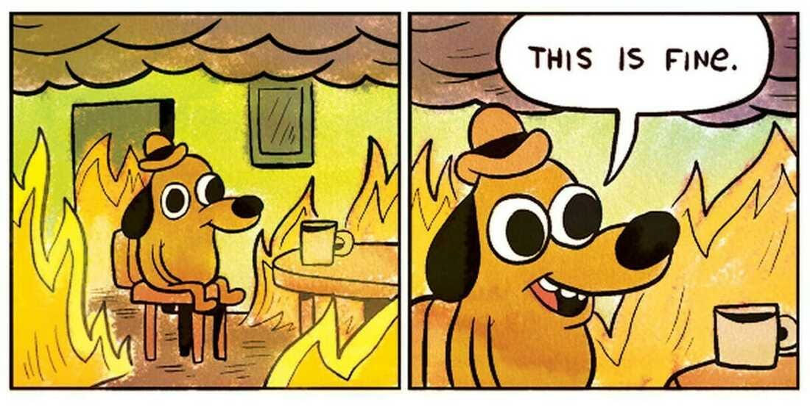

I’ve gotten asked a few times what I thought of [Brian Chesky](https://news.airbnb.com/about-us/leadership/brian-chesky/)’s talk on [leading through uncertainty: a design-led company](https://www.youtube.com/watch?v=Dkfijg7s76o). So I’m shoving aside the regularly scheduled issue for a spicy take on _Should we get just get rid of all those pms?_  

好几次有人问我对布莱恩-切斯基（Brian Chesky）关于 "在不确定性中领导：设计引领的公司 "的演讲有什么看法。因此，我把这期定期刊物放在一边，就 "我们是否应该扔掉那些短信？

Just kidding! This essay isn’t about that at all. Or maybe it is. You be the judge!  

开个玩笑！这篇文章的主题根本不是这个。或许它就是。你来评判吧！

First things first: I loved the [talk](https://www.youtube.com/watch?v=Dkfijg7s76o). I love Brian Chesky.  

I love that he makes it real for so many designers that yes, it is indeed possible to co-found and run a Fortune 500 profitable, paradigm changing company as a self-identified designer.  

我喜欢他让这么多设计师认识到，是的，作为一名自我认同的设计师，确实有可能共同创办和经营一家《财富》500 强企业，并从中获利，改变公司的模式。  

I love how he practically首先：我喜欢这次演讲。我喜欢布莱恩-切斯基。 _yelled_ at a room of the biggest design audience in the world that they need to have _nerve_, so fierce was his passion. I laughed when he said Airbnb got rid of pms — I mean, clearly they didn’t ([he later clarified it was combined with the pmm role](https://twitter.com/bchesky/status/1672004271276175361)), but it was was an ace serve, a perfect nugget in this era, for this group, to stir debate and reflection.  

我喜欢他对着一屋子世界上最大的设计观众大喊，他们需要有勇气，他的激情是如此强烈。当他说 Airbnb 取消了 pms 时，我笑了--我的意思是，很明显他们没有取消（他后来澄清说这是与 pmm 的角色结合在一起的），但这是一个王牌发球，在这个时代，对于这个群体来说，是一个引发辩论和反思的完美小插曲。

Let’s put aside pms for a minute.  

让我们暂时抛开 "性病 "不谈。

Yes, the thing I loved most was the call to action for design. Think bigger, he was saying.  

是的，我最喜欢的是他对设计的呼吁。他说，要想得更远。  

Stop being afraid of those trench lines dug by your teammates or your last company or the LinkedIn subtitle below your name.  

不要再害怕队友挖的战壕线，不要再害怕上一家公司，不要再害怕 LinkedIn 上你名字下面的副标题。  

Don’t look at your job as a battle for voice and relevance.  

不要把你的工作看作是一场争夺话语权和相关性的战斗。

Instead, tell yourself: _it’s possible to_ _design at higher levels. It’s well within your control to level up._  

相反，你要告诉自己：你有可能设计出更高水平的作品。提升水平完全在你的掌控之中。

A decade ago[1](https://lg.substack.com/p/the-looking-glass-higher-level-design#footnote-1-134596697) I wrote [about a framework for levels of design](https://medium.com/the-year-of-the-looking-glass/how-to-work-with-designers-6c975dede146):  

十年前，我写过一篇关于设计层次框架的文章：

> ### **The more senior the designer, the more abstract the problem they should be solving.  
> 
> 设计师越资深，他们要解决的问题就越抽象。**
> 
> To break it down more tangibly, let’s look at some examples of levels and appropriate responsibilities:  
> 
> 为了更具体地说明这一点，让我们举例说明一些级别和相应的职责：
> 
> **Designer Lvl 1:** _Design a form that lets people edit their profile._ Pretty scoped—assumes there is a profile, and that the solution takes the shape of a form.  
> 
> 设计师 1 级：设计一个表单，让人们编辑自己的个人资料。范围相当大--假定有一个个人资料，解决方案采用表单的形式。
> 
> **Designer Lvl 2:** _Design the best interface for users to edit their profile._ The solution could be a form, could be a WYSIWYG inline editor, could be a modal window.  
> 
> 设计师 2 级：为用户设计编辑个人资料的最佳界面。解决方案可以是一个表单，可以是一个所见即所得的内嵌编辑器，也可以是一个模式窗口。
> 
> **Designer Lvl 3 (broad)**: _Design a system for editing across everything—profiles, posts, settings, etc._ Now we’re not just profiles, but the editing system should be flexible enough to work across the entire app.  
> 
> 设计师 3 级（广义）：设计一个可以编辑所有内容的系统--配置文件、帖子、设置等。现在我们不仅要编辑个人档案，编辑系统还应该足够灵活，以便在整个应用程序中使用。
> 
> **Designer Lvl 3 (deep)**: _Design a way to get users to want to update their profiles._ Here, the questions the designer is asking is why should users update their profile? And when? And how to best convey the value proposition?  
> 
> 设计师 3 级（深度）：设计一种让用户愿意更新个人档案的方法。在这里，设计师要问的问题是：用户为什么要更新个人档案？何时更新？如何更好地传达价值主张？
> 
> **Designer Lvl 4**: _Design a solution to increase the authenticity of users among your app._ Maybe editing profiles isn’t even the right thing to focus on for our ultimate goal, maybe a peer-review system would be better.  
> 
> 设计师第四级：设计一个解决方案，提高应用程序中用户的真实性。对于我们的终极目标来说，编辑用户配置文件也许并不是正确的做法，也许同行评审系统会更好。
> 
> **Designer Lvl 5**:_Identify the biggest product problem with your app/company/site and design a solution._ At the highest level, the best designers drive the vision for a product.  
> 
> 设计师 5 级：找出应用程序/公司/网站的最大产品问题，并设计解决方案。在最高级别中，最优秀的设计师会推动产品的愿景。

As you go up the ladder, the problems get more ambiguous. In fact, at the highest level depicted here, you must go spelunking in search of the problem yourself!  

随着阶梯的上升，问题也越来越模糊。事实上，到了这里所描述的最高级别，你必须亲自去寻找问题！

Now, with the benefit of hindsight, I find myself wishing this explanation wasn’t so shallow. It’s time to spelunk deeper and pay homage to what design truly is.  

现在，回过头来看，我发现自己希望这种解释不要那么肤浅。是时候深入探究，向设计的真谛致敬了。

Steve Jobs [said it beautifully](https://www.wired.com/1996/02/jobs-2/):  

乔布斯说得好

Design is a funny word. Some people think design means how it looks.  

设计是一个有趣的词。有些人认为设计就是指它的外观。  

But of course, if you dig deeper, it’s really how it works.  

当然，如果你深入研究一下，就会发现它确实是这样的。

I’ll say it another way:  

我换一种说法：

Design is the act of intentionally trying to influence an outcome.  

设计是有意试图影响结果的行为。

Design is a means of controlling our destiny. Design is a way to reject a status quo we dislike. Design is how we _don’t_ turn into this dog[2](https://lg.substack.com/p/the-looking-glass-higher-level-design#footnote-2-134596697):  

设计是控制我们命运的一种手段。设计是拒绝我们不喜欢的现状的一种方式。设计是我们不变成这只狗的方法2：

Design is what we humans have been doing since the dawn of our existence because we were blessed with oh-so-large brains housing that marvelous prefrontal cortex which gave us the ability to plan.  

设计是我们人类自诞生以来就一直在做的事情，因为我们有幸拥有一个巨大的大脑，它容纳了奇妙的前额叶皮层，赋予了我们规划的能力。

Our hunter-gatherer ancestor was designing when she decided to plant seeds to prevent future hunger.  

当我们狩猎采集的祖先决定播种以防止未来的饥饿时，她就已经在设计了。  

Admiral Nelson was designing when he issued a surprise flank formation to overcome a navy twice his size.  

纳尔逊海军上将在设计时，出其不意地从侧翼编队，战胜了两倍于己的海军。  

Taylor Swift was designing when she brushed her hand casually across his and [masterminded that last relationship](https://genius.com/Taylor-swift-mastermind-lyrics).  

泰勒-斯威夫特（Taylor Swift）用手轻轻拂过他的手时，她正在设计，并策划了最后一段恋情。

Design is a sword against chaos. Design is the pixie dust for innovation. Design is the foundation for the pursuit of happiness.  

设计是对抗混乱的利剑。设计是创新的精灵尘。设计是追求幸福的基础。

And we’re still designing today. Engineers design better language models to improve AI. User researchers design better questions to get more insights.  

今天，我们仍在设计。工程师们设计出更好的语言模型来改进人工智能。用户研究人员设计更好的问题，以获得更多的洞察力。  

Data scientists design better metrics to more accurately quantify success. Managers design better processes to improve speed and quality of work.  

数据科学家设计出更好的衡量标准，以更准确地量化成功。管理者设计更好的流程，提高工作速度和质量。

Have I hit you enough over the head with this?  

我说得还不够清楚吗？

Yeah sure, we might not all call it _design_. Maybe we call it creating, or architecting, or founding, or directing, or communing with the muse or whatever.  

But if there is one thing I hope you take away, it is this: design is当然，我们可能并不都称之为设计。也许我们称之为创造，或建筑，或创立，或指导，或与缪斯交流，或其他。 _any_ creative endeavor in pursuit of an outcome.  

但是，如果有一件事我希望你能从中得到启发，那就是：设计是任何追求结果的创造性努力。

You may be rolling your eyes at this point. A definition that includes everything is hardly useful.  

说到这里，你可能会翻白眼。一个包含所有内容的定义几乎没有用处。  

So what is the point if engineering and design roles today are, practically speaking, different?  

那么，如果今天的工程和设计角色实际上是不同的，那又有什么意义呢？

Let us turn again to the great wisdom of Mr. Jobs, who said [in the next breath after the line above](https://www.wired.com/1996/02/jobs-2/):  

让我们再次领略乔布斯先生的伟大智慧，他在说完上面那句话后又说了一句话：

To design something really well, you have to get it.  

要想设计出真正好的东西，你必须了解它。  

You have to really grok what it’s all about.  

你必须真正理解它的含义。

How do you really get—how do you _grok—_something?  

你是如何真正理解--如何摸索--某件事情的？

You need to spend focused time it, of course. You need to be a student of it, deeply curious—maybe even _obsessed_—with it. You need to try to design for an outcome, and fail and learn and try and fail and learn and try and succeed and double down and fail and learn and keep trying.  

当然，你需要花时间专注于它。你需要成为它的学生，对它充满好奇，甚至痴迷。你需要尝试设计一个结果，失败了，学习，尝试，失败了，学习，尝试，成功，加倍努力，失败了，学习，继续尝试。

So yes, generally speaking engineers and designers in our tech ecosystem today are _not_ equally skilled at _design a way to get the site to load in 100 milliseconds_ and _design a way to get more users to sign up on the site_.  

Each requires grokking different areas of knowledge and learning different skills—say, the nuances of server architecture versus the psychology of user motivation, or how to use Figma versus emacs.  

每种方法都需要摸索不同领域的知识，学习不同的技能--例如，服务器架构的细微差别与用户动机的心理学，或者如何使用 Figma 与 emacs。  

因此，一般来说，当今技术生态系统中的工程师和设计师在设计如何在 100 毫秒内加载网站和设计如何让更多用户在网站上注册方面的技能并不相同。

Roles are a kind of explanatory shorthand because its tiring to repeatedly tell people _Hey, I know how to code and I know well the nuances of servers and networking architectures_ — it’s easier to say _I’m an infra engineer_.  

角色是一种解释性速记，因为反复告诉别人 "嘿，我知道如何编写代码，我对服务器和网络架构的细微差别了如指掌 "会很累--说我是一名信息工程师会更容易些。

Unfortunately, all too often, people forget this origin story. They start believing that _roles_ are what determine who is most qualified to come up with the best solution.

  

不幸的是，人们常常忘记这个起源故事。他们开始相信，角色决定了谁最有资格提出最佳解决方案。

This is backwards!  这是倒退！

While the role title is a reasonable enough proxy to make certain assumptions (_PMs communicate well; designers know Figma, engineers can code_) problems arise when people take it too literally. This is how you get nonsense axioms like _PMs should be the mini-CEOs of the product_ (which I am grateful many wonderful PM leaders [have been debunking](https://twitter.com/shreyas/status/1258212702087864320)!)  

虽然角色名称是一个合理的代名词，足以让我们做出某些假设（项目管理人员善于沟通；设计师了解 Figma，工程师会编程），但如果人们过于照本宣科，就会出现问题。这就是为什么会出现项目管理人员应该成为产品的小型首席执行官等无稽之谈的原因（我很感激许多优秀的项目管理领导者一直在揭穿这些无稽之谈！）。

So let’s do this right way, then. Based on the above, here is…  

那我们就按正确的方法来做吧。基于以上所述，以下是...

1.  Define the outcome we want  
    
    确定我们想要的结果
    
2.  Identify what knowledge + skills are needed to design really well for that outcome  
    
    确定需要哪些知识和技能才能真正做好成果设计
    
3.  Have the person (or people) with the best qualifications for #2 design the solution  
    
    让最有资格胜任 #2 工作的人（或多人）设计解决方案
    

Easy peasy, right? Alas, if only theory and practice were the same.[3](https://lg.substack.com/p/the-looking-glass-higher-level-design#footnote-3-134596697) Unfortunately as we sprint towards nirvana we trip and fall because we meet…  

轻而易举，对吧？唉，要是理论和实践一样就好了。3 不幸的是，当我们向涅槃冲刺时，却因为遇到......

1.  **Humans are often bad at knowing who has the most knowledge+skills in some domain.  
    
    人类往往不善于知道谁在某个领域拥有最多的知识和技能。**
    
    Ah, human biases. The [illusory superiority](https://en.wikipedia.org/wiki/Illusory_superiority) that makes us think we are way better than we are, like how 93% of Americans think they are better than average at driving.  
    
    Or, if you are truly an expert, it’s the opposite—you have a tendency to doubt you are as good as you are, as the啊，人类的偏见。虚幻的优越感让我们认为自己比实际情况要好得多，就像 93% 的美国人认为自己的驾驶技术比一般人要好。 [Dunning Kruger Effect](https://en.wikipedia.org/wiki/Dunning%E2%80%93Kruger_effect) shows. The irony is that those who are most incompetent in some domain are the ones who are the least self-aware about it!  
    
    或者，如果你真的是专家，情况恰恰相反--正如邓宁-克鲁格效应（Dunning Kruger Effect）所显示的那样，你往往会怀疑自己是否真的那么优秀。具有讽刺意味的是，那些在某些领域最无能的人却最不了解自己！
    
2.  **Humans are often bad at knowing what knowledge+skills are needed to design well for an outcome.  
    
    人类往往不知道要设计出好的结果需要哪些知识和技能。**  
    
    This is a special meta case of #1. What knowledge+skills does one need to win the Superbowl? To produce hit album after album? To run a country?  
    
    这是一个特殊的元案例 1。一个人需要具备哪些知识和技能才能赢得超级杯？制作一张又一张畅销专辑？管理一个国家？  
    
    Unless you’ve achieved this yourself (or studied a ton of people who have), it’s pretty difficult to _truly_ know. (Though there are many, many armchair experts out there!)  
    
    除非你自己做到了这一点（或者研究过很多做到这一点的人），否则很难真正了解这一点。(尽管有很多很多的专家在那里！）。
    
3.  **Humans are often bad at identifying the most important outcomes to focus on.** This is also a special meta case of #2. Should we spend more time with our partner, or more time building a career?  
    
    At work, should we focus on improving our manager relationship, or developing more product ideas?  
    
    在工作中，我们应该专注于改善与经理的关系，还是开发更多的产品创意？  
    
    On developing more product ideas, should we prioritize retaining or acquiring new users?  
    
    在开发更多产品创意时，我们应该优先考虑留住用户还是获取新用户？  
    
    人类往往不善于识别最重要的结果。这也是第 2 项的一个特殊元案例。我们应该花更多时间陪伴伴侣，还是花更多时间开创事业？
    

1.  **Emma is actually extremely qualified to design the go-to-market strategy** because no one else knows as much about how new customers think as she does.  
    
    Alas, no one (including Emma) sees it that way because her title is User Researcher (example of roadblock #1 and #2 above).  
    
    唉，没有人（包括艾玛）这么看，因为她的头衔是用户研究员（上述第 1 和第 2 个路障的例子）。  
    
    事实上，艾玛非常有资格设计市场推广战略，因为没有人比她更了解新客户的想法。
    
2.  **Betty is the engineering lead on the core product team**. She’s frustrated by the slowness of the product and has seen at her past company the correlation between performance and customer happiness.  
    
    She knows that only 2 months of dedicated focus would have a big impact on performance; however, she can’t convince her product and design partners because they want to ship more features (example of roadblock #3).  
    
    她知道，只需专注 2 个月，就能对性能产生重大影响；但她无法说服产品和设计合作伙伴，因为他们希望推出更多功能（路障 3 的示例）。  
    
    贝蒂是核心产品团队的工程主管。她对产品速度太慢感到沮丧，并在过去的公司中看到了性能与客户满意度之间的关系。
    
3.  **Product designer John is upset that he isn’t invited to strategy brainstorms**, and that there isn’t a single designer on the exec team or board. He feels this is a sign _The company doesn’t appreciate design._ At the same time, he has never taken an interest in learning the ins-and-outs of his company’s key health metrics, which is why his peers don’t see him as a strategic thinker (example of roadblock #2).  
    
    产品设计师约翰对自己没有被邀请参加战略头脑风暴、执行团队或董事会中没有一个设计师感到不满。他认为这是公司不重视设计的表现。同时，他从来没有兴趣了解公司关键健康指标的来龙去脉，这也是为什么他的同事不认为他是一个战略思考者（路障示例 2）。
    
4.  **Stephen is the first growth hire at a buzzy start-up**. After a few months, he suggests to the founder, Este, a radical experiment to make certain features of the site free to use. Este says _This is_ _definitely not going to work_ and tells Stephen to abandon it. Stephen secretly launches a small a/b test on the side and the results are fabulous (example of roadblock #1).  
    
    斯蒂芬是一家热闹的初创公司招聘的第一位成长型员工。几个月后，他向创始人埃斯特建议进行一项激进的试验，让网站的某些功能免费使用。埃斯特说这肯定行不通，让斯蒂芬放弃。斯蒂芬偷偷在一旁进行了一次小规模的 a/b 测试，结果令人难以置信（路障 1 示例）。
    

My friends, to escape from the shackles of role definitions, we must pursue higher-level design.  

朋友们，要摆脱角色定义的桎梏，我们必须追求更高层次的设计。

High-level design means not limiting yourself to activities you do but rather outcomes you’d like to influence.  

高层次的设计意味着不要局限于你所做的活动，而是要影响你想影响的结果。

It means growing the scale of your ambitions on those outcomes.  

这意味着在这些成果的基础上扩大你的雄心壮志的规模。  

Maybe you start off designing a screen that converts, then a feature that enables, then an app that retains, then an experience that delights, then a business that sustains, then a way of life that fulfills.  

也许你一开始设计的是一个可以转化的屏幕，然后是一个可以启用的功能，接着是一个可以留住人的应用程序，然后是一种令人愉悦的体验，接着是一个可以维持的业务，然后是一种可以满足的生活方式。  

Maybe you design a way to _change the world_ and it’s real and meaningful in the way you intended, not just some corporately jingo.  

也许你设计了一种改变世界的方式，它是真实的、有意义的，符合你的初衷，而不仅仅是一些公司的金科玉律。

It means getting humble and getting feedback. Ask around: what are you better at than you thought? Worse at than you thought?  

这意味着要谦虚并获得反馈。问问周围的人：你比自己想象的更擅长什么？比你想象的差在哪里？

It means doing your homework. What unique skills and knowledge are needed if you want to contribute to strategy? To marketing? To revenue? To better collaboration?  

这意味着要做足功课。如果你想为战略做出贡献，需要哪些独特的技能和知识？市场营销？为了收入？更好的合作？  

Which of these skills matter the _most_?  

哪些技能最重要？

For example, it blew my mind to discover that designing a robust UI components library is the same kind of art as designing a performant database system, just applied to different domains of knowledge.  

例如，我惊奇地发现，设计一个强大的用户界面组件库与设计一个性能良好的数据库系统是同一种艺术，只是应用于不同的知识领域而已。  

Within each domain, depth of skill determines whether a design is crude or well-crafted.  

在每个领域中，技能的深度决定了设计是粗制滥造还是精雕细琢。

We can see outcomes like the roots of a tree; for every outcome, there are branches of knowledge+skills that are needed to design well for that outcome, some thicker and more important, others less so.  

我们可以像看树根一样看结果；对于每一个结果，都有为该结果做好设计所需的知识+技能的分支，有些分支更粗更重要，有些则不那么重要。  

The closer you get to the base of the tree, the higher your level of design.  

离树根越近，你的设计水平就越高。

For example, if your goal is to be like Steve Jobs and make exceptional products that people love, then you’ll need to know…  

例如，如果你的目标是像史蒂夫-乔布斯一样，制造出人们喜爱的卓越产品，那么你就需要了解...

1.  What is a big problem people have?  
    
    人们遇到的最大问题是什么？
    
2.  What does an exceptional solution look like for that problem? Where is the bar today?  
    
    针对该问题的卓越解决方案是什么样的？今天的酒吧在哪里？
    
3.  What makes people love something?  
    
    是什么让人们爱上某样东西？
    
4.  What is easy to build, what is hard but possible, what is impossible?  
    
    什么是容易建造的，什么是困难但可能的，什么是不可能的？
    
5.  What shape will our solution take?  
    
    我们的解决方案将以何种形式出现？
    
6.  What functionality will we enable?  
    
    我们将启用哪些功能？
    
7.  How do we want people to think about it?  
    
    我们希望人们如何看待它？
    
8.  How will people discover it?  
    
    人们如何发现它？
    
9.  How will we make money off of it?  
    
    我们如何从中赚钱？
    
10.  Who do we need to build this?  
    
    我们需要谁来建造？
    
11.  What will the end product look like?  
    
    最终产品是什么样的？
    
12.  How will we improve the product improve over time?  
    
    随着时间的推移，我们将如何改进产品？
    
13.  Etc… 等等
    

Each single question unfurls another long list of questions. For example, to dive into number 9, _How will we make money off of it?_ you’d need to understand business models and pricing and cost and margins and all that jazz.  

每一个问题都会引出另一长串问题。例如，要深入探讨第 9 个问题 "我们如何从中赚钱？"，你就需要了解商业模式、定价、成本、利润率等等。

I hope what you can appreciate is that the sheer surface area of what it takes to _make an exceptional product people love_ is mind-boggling. Doing any of the above badly might doom the outcome.  

(But of course, it is its own design problem to know which of these questions matters the most for the outcome!)  

(当然，要知道哪个问题对结果最重要，这本身就是一个设计问题！）。  

我希望你能明白，要制造出深受人们喜爱的卓越产品，所需的工作面之广令人匪夷所思。做不好上述任何一件事，都可能导致失败。

This is what higher-level design looks like. It is designing solutions instead of features, outcomes instead of products.  

这就是更高层次的设计。它设计的是解决方案而不是功能，是结果而不是产品。  

Designing at higher levels is like throwing another dimension onto your chess game.  

在更高层次上进行设计，就像在棋局中加入了另一个维度。

And there is a higher level still, beyond making an exceptional product people love. There is designing a living organism—a _company_—that continues to do this well and sustainably, over the long run. That dimension—a CEO’s purview—requires designing org structures and processes, cultural norms and narratives.  

It may require, as Brian Chesky said, designing new roles altogether.  

正如布莱恩-切斯基（Brian Chesky）所说，这可能需要设计全新的角色。  

除了制造人们喜爱的卓越产品之外，还有更高的境界。这就是设计一个有生命的有机体--一家公司，使其能够长期、持续地做好这件事。这个层面--首席执行官的职权范围--需要设计组织结构和流程、文化规范和叙事。

And of course we can ascend further still into the government’s purview—designing a better _society_, one that is healthier and happier, more prosperous and free.  

当然，我们还可以进一步提升政府的权限--设计一个更好的社会，一个更健康、更快乐、更繁荣、更自由的社会。

So yes, this is design. These are design problems, and the world needs better higher-level design.  

没错，这就是设计。这些都是设计问题，世界需要更好的更高层次的设计。

Like this essay?  喜欢这篇文章吗？  

Support my writing with a monthly subscription (which is about the price of buying me a fancy coffee enlivened with nut juice.) Or jump ship with me from Twitter to [Threads](https://www.threads.net/@joulee), where I’m still @joulee.  

通过每月订阅来支持我的写作（订阅费用相当于给我买一杯加了坚果汁的高级咖啡）。或者和我一起从 Twitter 跳槽到 Threads，在那里我还是 @joulee。

Paid subscribers get access to two companion essays, one for the craftspeople and another on specific phrases you might use to make the above actionable in your day-to-day.  

付费订阅者可以获得两篇配套文章，一篇是针对手工艺者的，另一篇是关于具体用语的，您可以在日常工作中使用上述内容。
