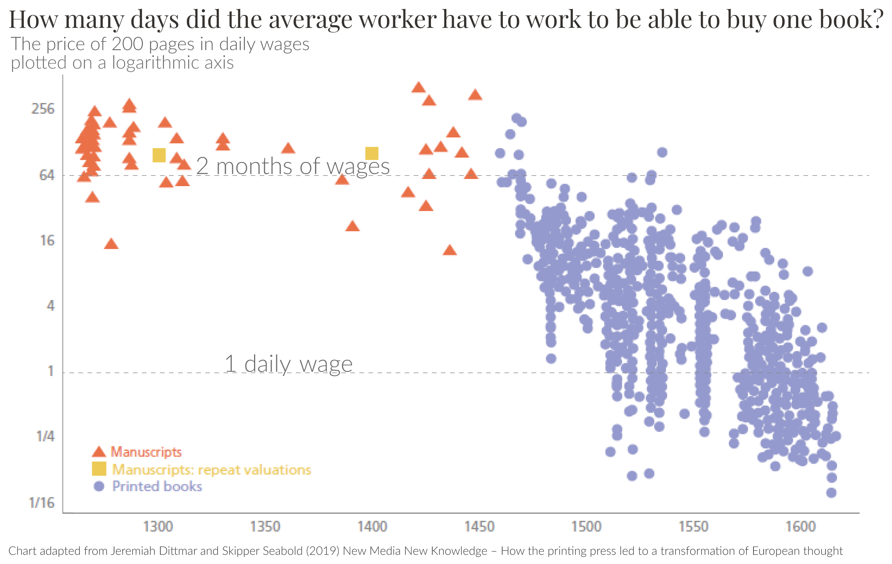

## Adjusting incomes for inflation is crucial if we want to learn how standards of living are changing. How is this adjustment done?  

如果我们想了解生活水平是如何变化的，那么根据通货膨胀调整收入是至关重要的。如何进行调整？

July 11, 2023 2023 年 7 月 11 日

When looking at data on people’s incomes, it’s usually not the quantity of currency that we’re interested in.  

在研究人们的收入数据时，我们感兴趣的通常不是货币数量。  

It’s what this quantity means for their standard of living – the quantity and quality of the _goods and services_ they can afford.  

这个数量对他们的生活水平意味着什么，也就是他们能负担得起的商品和服务的数量和质量。

To study this, we need to compare people’s incomes with the prices of the goods and services they can buy.  

要研究这一点，我们需要将人们的收入与他们可以购买的商品和服务的价格进行比较。  

These change over time – the prices on supermarket shelves that you remember from the past are typically not the same as you’ll see today.  

这些价格会随着时间的推移而变化--您记忆中超市货架上的价格通常与您今天看到的价格不同。  

Adjusting for this is crucial if we want to use income data to understand how living standards are changing around the world.  

如果我们想利用收入数据来了解世界各地生活水平的变化情况，对此进行调整至关重要。

For this reason, almost all of the income data you’ll find on Our World in Data is adjusted for inflation.  

因此，您在 "数据中的我们的世界 "中找到的几乎所有收入数据都根据通货膨胀进行了调整。

It’s important to note that here we’re referring to both positive and negative inflation.  

值得注意的是，这里的通货膨胀既包括正通货膨胀，也包括负通货膨胀。  

When incomes are adjusted for inflation, they are also at the same time adjusted for the opposite – _de_flation.  

在对收入进行通胀调整时，也会同时对相反的通货紧缩进行调整。

But how is this adjustment done?  

但如何进行调整呢？

## A simple example: adjusting incomes for the price of _one_ good  

一个简单的例子：根据一种商品的价格调整收入[](https://ourworldindata.org/how-are-incomes-adjusted-for-inflation#a-simple-example-adjusting-incomes-for-the-price-of-one-good)

A simple approach would be to adjust incomes for the change in the price of a _single_ product that is commonly purchased – for example, a loaf of bread.  

一个简单的方法是，根据通常购买的单一产品（如一条面包）的价格变化来调整收入。  

If the price of bread doubles over a period, but your employer still pays you the same income, then you can only buy half as much bread.  

如果面包的价格在一段时间内翻了一番，但你的雇主仍然付给你相同的收入，那么你只能买到一半的面包。  

Your income, adjusted for the inflation of bread prices, has halved.  

根据面包价格的通胀率进行调整后，您的收入减少了一半。

The chart below shows historical data on the relationship between incomes and the price of another commonly purchased product: books.  

下图显示了收入与另一种常见购买产品（书籍）价格之间关系的历史数据。  

It looks at this relationship the other way around: it shows how long the average worker had to work to afford one book.  

它反过来研究了这种关系：它显示了普通工人需要工作多长时间才能买得起一本书。  

We see that the price of a book, relative to incomes, rapidly declined with the invention of the printing press in the 15th century.  

我们看到，随着 15 世纪印刷术的发明，书价相对于收入迅速下降。

This means the reverse is also true: incomes, relative to the price of books, rose dramatically.  

这意味着反向情况也是如此：相对于书价而言，收入大幅增加。  

What was once totally out of reach for all but the richest elite – to own a book – became increasingly affordable to the majority.  

曾经除了最富有的精英阶层之外，所有人都无法拥有的东西--拥有一本书--变得越来越为大多数人所负担得起。  

Only by comparing data on incomes to the prices of goods over time can we learn how people’s options and opportunities change.  

只有通过比较不同时期的收入数据和商品价格，我们才能了解人们的选择和机会是如何变化的。



## The Consumer Price Index: a measure of the _overall_ change in prices  

消费价格指数：衡量价格总体变化的指标[](https://ourworldindata.org/how-are-incomes-adjusted-for-inflation#the-consumer-price-index-a-measure-of-the-overall-change-in-prices)

Comparing incomes to the price of only one product has an obvious problem: changes in this price may not be representative of all the other products that consumers buy.  

只将收入与一种产品的价格进行比较有一个明显的问题：这种价格的变化可能无法代表消费者购买的所有其他产品。  

Changes in the price of a loaf of bread, or a book, may differ from changes in the prices of medicines, heating, or computers.  

一条面包或一本书价格的变化，可能不同于药品、暖气或电脑价格的变化。  

The price of some of these goods may increase while others decrease.  

其中一些商品的价格可能会上涨，而另一些商品的价格则会下降。

When adjusting incomes for inflation, statisticians rely on a “_basket” of goods and services_ that are representative of the consumption of the average household.  

在根据通货膨胀率调整收入时，统计人员依靠的是代表普通家庭消费的 "一篮子 "商品和服务。  

Since people buy different things in different countries, these household consumption baskets vary from country to country.  

由于人们在不同的国家购买不同的东西，这些家庭消费篮子也因国家而异。  

The basket is also updated over time, as new technologies emerge making new goods or services available, and as consumption preferences change.[<sup data-immersive-translate-effect="1" data-immersive_translate_walked="d06c8dc8-f4c6-4081-9696-5b3a5a58b00e">1</sup>](https://ourworldindata.org/how-are-incomes-adjusted-for-inflation#note-1)  

随着新技术的出现、新商品或服务的提供以及消费偏好的变化，篮子也会随时间而更新。 <sup data-immersive-translate-effect="1" data-immersive_translate_walked="d06c8dc8-f4c6-4081-9696-5b3a5a58b00e">1</sup>

Statisticians monitor the prices of all the products in this basket and calculate a weighted average: when calculating the overall price level, they give more importance to the products that people spend a large share of their income on.  

统计学家对这一篮子中所有产品的价格进行监测，并计算出加权平均值：在计算总体价格水平时，他们更看重那些人们将大部分收入用于购买的产品。  

This average price level is then expressed relative to the price level in a chosen base year. This is known as the Consumer Price Index (CPI).  

然后，将这一平均价格水平与选定基年的价格水平相对比。这就是所谓的消费价格指数（CPI）。  

In the base year, the CPI is equal to 100, and in other years it shows us the price level relative to that year.  

在基准年，消费物价指数等于 100，而在其他年份，消费物价指数显示的是相对于该年的物价水平。  

A CPI of 120 means that prices are 20% higher than in the base year.  

CPI 为 120 意味着价格比基准年高出 20%。

The following chart shows CPI data gathered from national statistical offices by the International Monetary Fund.  

下图显示的是国际货币基金组织从各国统计局收集的消费物价指数数据。  

The base year in this case is 2010, so a CPI of 120 means that prices rose by 20% since 2010.  

这里的基准年是 2010 年，因此 CPI 为 120 意味着自 2010 年以来物价上涨了 20%。

## _Nominal_ incomes ‘deflated’ by a price index give us _real_ incomes  

用价格指数 "缩减 "名义收入，得出实际收入[](https://ourworldindata.org/how-are-incomes-adjusted-for-inflation#nominal-incomes-deflated-by-a-price-index-give-us-real-incomes)

The CPI allows us to compare incomes not to the price of one particular good, but to the broader cost of living.  

消费物价指数使我们能够不将收入与某一特定商品的价格进行比较，而是与更广泛的生活成本进行比较。  

By adjusting incomes with the CPI, we learn not about how many books or loaves of bread people can buy, but about their options and opportunities for consumption more generally.  

通过用消费物价指数调整收入，我们了解到的不是人们能买多少本书或面包，而是他们更普遍的消费选择和机会。

Income data generally arrives to us in what’s called ‘nominal’ terms: without any adjustment for inflation.  

收入数据通常是以所谓的 "名义 "形式提供给我们的：没有根据通货膨胀进行任何调整。  

If you compare the figure on your paycheck to the figure ten years ago to understand how your income has changed, you are not considering how the price of goods also changed over that time.  

如果你将工资单上的数字与十年前的数字进行比较，以了解你的收入发生了怎样的变化，那么你就没有考虑到商品价格在这段时间内也发生了怎样的变化。  

For this reason, nominal incomes are often referred to as incomes measured in ‘current prices’.  

因此，名义收入通常被称为按 "现行价格 "计算的收入。

_‘Real_ incomes’ is how researchers and statisticians refer to income data after it has been adjusted for inflation – or ‘deflated’, as it is sometimes called. The changes in _real_ incomes tell us the change in what people can _really_ afford.  

实际收入 "是研究人员和统计人员对经过通货膨胀调整后的收入数据的称呼，有时也称为 "缩减"。实际收入的变化告诉我们人们真正能够负担的收入的变化。  

This is often referred to as income measured in ‘constant prices’: it tells us the amount of goods and services a person’s income could have bought if prices had stayed the same as observed in one particular year (the base year of the CPI).  

这通常被称为以 "不变价格 "衡量的收入：它告诉我们，如果某一年（消费物价指数的基准年）的价格保持不变，一个人的收入可以购买多少商品和服务。

Such an adjustment is crucial for making meaningful comparisons over time. Only _real_ incomes – measured in terms of constant prices – give us an idea about how the prosperity of a population changes.  

这种调整对于进行有意义的长期比较至关重要。只有按不变价格计算的实际收入才能让我们了解人口的富裕程度是如何变化的。

### An example: Adjusting wages for inflation in the UK  

举例说明：英国根据通货膨胀调整工资[](https://ourworldindata.org/how-are-incomes-adjusted-for-inflation#an-example-adjusting-wages-for-inflation-in-the-uk)

To provide an example of an inflation adjustment, the chart below shows the evolution of average weekly wages in the United Kingdom. It shows three series:  

下图显示了英国每周平均工资的变化情况，以通货膨胀调整为例。它显示了三个系列：

-   _nominal_ wages – as measured before any inflation adjustment;  
    
    名义工资 - 未进行任何通货膨胀调整前的工资；
-   the _consumer price index_, used to track the average price level;  
    
    消费价格指数，用于跟踪平均价格水平；
-   _real_ wages – after accounting for the change in the price level.  
    
    实际工资--在考虑价格水平变化之后。

Between 1750 and 2015, nominal wages in the UK increased from £0.29 to £492 per week. This is a 1695-fold increase.  

从 1750 年到 2015 年，英国的名义工资从每周 0.29 英镑增加到 492 英镑。增长了 1695 倍。

But with these higher nominal wages, workers cannot buy 1695 times the value of goods and services, because prices rose considerably over this time too.  

但是，名义工资提高了，工人却买不到价值 1695 倍的商品和服务，因为这段时间物价也大幅上涨。  

In this chart, 2015 is the base year used for the consumer price index: in 2015, it has a value of 100. In 1750 it has a value of 0.66. The ratio between these two observations – 100 divided by 0.66 – is 152, and this tells us that the average prices that consumers face increased 152-fold over these 265 years.  

在该图表中，2015 年是消费价格指数的基年：2015 年的消费价格指数为 100。1750 年的数值为 0.66。这两个观测值之间的比率--100 除以 0.66--是 152，这告诉我们，在这 265 年里，消费者面临的平均物价上涨了 152 倍。

To calculate the real wage increase, we need to look at the nominal wage increase compared to the increase in prices.  

要计算实际工资增长，我们需要看名义工资增长与物价增长的比较。  

The third line shows real average wages: nominal wages divided by the consumer price index, expressed as a fraction. In 2015, real and nominal wages are the same.  

第三行显示的是实际平均工资：名义工资除以消费价格指数，用分数表示。2015 年，实际工资和名义工资相同。  

In the late 1980s, when prices were around half their 2015 level, real wages are twice the nominal wages.  

20 世纪 80 年代末，价格约为 2015 年的一半，实际工资是名义工资的两倍。

Over the whole period, nominal wages rose 1695-fold, and prices rose 152-fold. 1695 divided by 152 is 11.2, meaning that average wages in _real_ terms are 11.2 times higher today than back in 1750. If their great-great-grandfathers in 1750 had to work for a year to buy a representative consumption bundle, Brits today have to work for only a bit more than a month to buy a comparable bundle of goods and services.  

在整个时期，名义工资上涨了 1695 倍，物价上涨了 152 倍。1695 除以 152 是 11.2，这意味着今天的实际平均工资是 1750 年的 11.2 倍。如果说 1750 年的曾曾祖父们需要工作一年才能买到一套有代表性的消费产品，那么今天的英国人只需要工作一个多月就能买到一套类似的商品和服务。

-   LinearLog 线性日志

## Other price indexes 其他价格指数[](https://ourworldindata.org/how-are-incomes-adjusted-for-inflation#other-price-indexes)

The CPI is not the only index that can be used to adjust nominal monetary values. Its focus is on tracking the changes in the prices that _consumers_ face overall. But not all goods produced in an economy are purchased by consumers. Some goods are purchased by firms and used to produce final goods.  

消费物价指数并不是唯一可用来调整名义货币价值的指数。它的重点是跟踪消费者面临的整体价格变化。但并非一个经济体中生产的所有商品都由消费者购买。有些商品由企业购买并用于生产最终产品。

The _GDP deflator_ is another commonly-used index that tracks the price of all domestically-produced final goods and services in an economy, as measured by it’s Gross Domestic Product (GDP).  

国内生产总值平减指数是另一个常用指数，它跟踪一个经济体中所有国内生产的最终产品和服务的价格，以其国内生产总值（GDP）来衡量。  

Statisticians calculating a country’s GDP use data that is expressed in current prices – the nominal value of transactions between buyers and sellers of goods and services.  

统计学家在计算一个国家的国内生产总值时，使用的数据是以当前价格表示的，即商品和服务买卖双方交易的名义价值。  

The GDP deflator is then used to separate price changes within this nominal data, leaving a measure of the _volume_ of goods and services produced in an economy over time.  

然后，用国内生产总值平减指数来区分名义数据中的价格变化，从而得出一个经济体在一段时间内生产的商品和服务的数量。

There are two main differences between the CPI and the GDP deflator:  

消费物价指数和国内生产总值缩减指数有两个主要区别：

-   The GDP deflator tracks the prices of goods and services _produced_ in a country. The CPI, on the other hand, measures the prices of goods and services _consumed_ in a country – including those produced elsewhere and imported.  
    
    GDP 平减指数跟踪一个国家生产的商品和服务的价格。而消费物价指数则衡量一个国家消费的商品和服务的价格，包括在其他地方生产和进口的商品和服务。
-   Secondly, the GDP deflator covers capital goods – goods not bought by consumers.  
    
    其次，国内生产总值缩减指数包括资本货物--非消费者购买的货物。

You can read more about these two price indexes in a detailed guide produced by the OECD: _[Understanding National Accounts](https://www.oecd.org/sdd/UNA-2014.pdf)_.  

您可以在经合组织编制的详细指南中了解有关这两种价格指数的更多信息：了解国民账户。

### Endnotes 结束语

1.  For example, in 2012, the UK statistical agency changed the composition of this basket of goods to better reflect the typical consumption basket of households.  
    
    例如，2012 年，英国统计机构改变了这一篮子商品的构成，以更好地反映家庭的典型消费篮子。  
    
    Tablet computers were added, demonstrating the effect of new technologies, while boiled sweets were removed, reflecting changing preferences. Gooding, Philip.  
    
    增加了平板电脑，显示了新技术的影响，同时删除了水煮糖果，反映了人们喜好的变化。古丁，菲利普  
    
    "Consumer Prices Index and Retail Prices Index: the 2011 basket of goods and services." Economic and Labour Market Review 5, no. 4 (2011): 96-107.  
    
    "消费价格指数和零售价格指数：2011 年一篮子商品和服务"。经济和劳动力市场评论》5，no.4 (2011):96-107.
    

### Cite this work 引用本作品

Our articles and data visualizations rely on work from many different people and organizations. When citing this topic page, please also cite the underlying data sources.  

我们的文章和数据可视化依赖于许多不同人员和组织的工作。在引用本专题页面时，请同时引用基础数据源。  

This topic page can be cited as:  

本专题页可被引为

```
Joe Hasell and Max Roser (2023) - "How are incomes adjusted for inflation?". Published online at OurWorldInData.org. Retrieved from: 'https://ourworldindata.org/how-are-incomes-adjusted-for-inflation' [Online Resource]
```

BibTeX citation BibTeX 引用

```
@article{owid-how-are-incomes-adjusted-for-inflation,
    author = {Joe Hasell and Max Roser},
    title = {How are incomes adjusted for inflation?},
    journal = {Our World in Data},
    year = {2023},
    note = {https://ourworldindata.org/how-are-incomes-adjusted-for-inflation}
}
```


### Reuse this work freely 自由使用本作品

All visualizations, data, and code produced by Our World in Data are completely open access under the [Creative Commons BY license](https://creativecommons.org/licenses/by/4.0/). You have the permission to use, distribute, and reproduce these in any medium, provided the source and authors are credited.  

由 "我们的数据世界 "制作的所有可视化、数据和代码均在知识共享 BY 许可下完全开放。只要注明来源和作者，您就可以在任何媒体上使用、分发和复制这些内容。

The data produced by third parties and made available by Our World in Data is subject to the license terms from the original third-party authors.  

由第三方制作并由 "我们的数据世界 "提供的数据受第三方原作者许可条款的约束。  

We will always indicate the original source of the data in our documentation, so you should always check the license of any such third-party data before use and redistribution.  

我们始终会在文档中注明数据的原始出处，因此您在使用和重新分发任何此类第三方数据之前，应始终检查其许可证。

All of [our charts can be embedded](https://ourworldindata.org/how-to-use-our-world-in-data#how-to-embed-interactive-charts-in-your-article) in any site.  

我们的所有图表均可嵌入任何网站。
