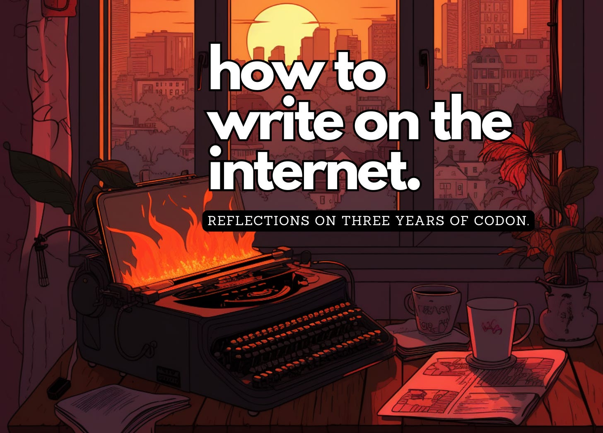

I’ve been writing this blog for three years. What began as a weekly list of synthetic biology papers (here’s the [first issue](https://www.readcodon.com/p/this-week-in-synthetic-biology-july)) has morphed into scattered essays, with many breaks along the way. This seems like a good time to reflect on what I’ve learned about writing words on the Internet (so far.)  

我写这个博客已经三年了。从最初的每周合成生物学论文列表（这里是第一期），到现在的散文随笔，一路走来，也有过许多中断。这似乎是一个很好的时机，让我反思一下（到目前为止）在互联网上撰写文字的心得体会。

My advice has little to do with the granular act of writing, like sentences or paragraphs. It is, rather, about all the _external_ factors that influence how we write and what we choose to say. Every piece of advice is something I’ve struggled with personally.  

These are the things I wish I knew three years ago.  

这些都是我希望三年前就知道的事情。  

我的建议与句子或段落等细微的写作行为关系不大。相反，它涉及影响我们如何写作以及我们选择说些什么的所有外部因素。我的每一条建议都是我亲身经历过的。

This essay isn’t about _why_ you should write, either, because there are too many reasons to list: Writing is a way to **manifest** ideas. A well-written article will help you raise funds and build a team to make your ideas real. Writing will help you become a **beacon**. Conveying an idea simply will help you become a node through which opportunities flow. And writing is a way to **think**. It isn’t possible to craft a compelling essay without a relatively deep understanding of its ideas.  

这篇文章也不是关于为什么要写作的，因为有太多的理由可以列举：写作是体现想法的一种方式。一篇写得好的文章可以帮助你筹集资金，组建团队，实现你的想法。写作将帮助你成为一座灯塔。简单地表达一个想法将帮助你成为一个节点，让机会源源不断。写作是一种思考方式。如果对文章的思想没有相对深刻的理解，就不可能写出令人信服的文章。

Now here’s my advice about how to write on the Internet.  

下面是我对如何在互联网上写作的建议。

If you want to write well, you first have to write badly. To write badly, you first have to care enough to begin. To begin, you should start a blog. [Do it now](https://guzey.com/personal/why-have-a-blog/).   

要想写得好，首先得写得坏。要想写得差，首先要有足够的兴趣去开始。为了开始，你应该写一个博客。现在就开始吧。

For every 100 people who say they want to write, perhaps ten will start a blog and publish something. If you do that, you’ve gone further than most.  

每 100 个说自己想写作的人中，也许有 10 个人会开博客并发表文章。如果你做到了，你就比大多数人走得更远。  

Start by writing short-form content on Twitter. Write about a paper you just read. Use writing as an excuse to explore an idea or business.  

从在 Twitter 上撰写短篇内容开始。写一篇你刚读过的论文。以写作为借口，探索某个想法或业务。

Publish regularly, but don’t stress over timelines. Writing is difficult enough without self-imposed deadlines.  

定期发表文章，但不要过多强调时限。没有自我设定的最后期限，写作已经够难了。  

It’s better to post a great piece once a month than something bad every week. Devote part of your day to writing, and block off everything else during that time.  

一个月发一篇好文章，总比每周都发不好的文章要好。每天抽出一部分时间来写作，在这段时间里不要做其他事情。  

Focused writing demands a [maker’s schedule](http://www.paulgraham.com/makersschedule.html); not a manager’s schedule.  

专注的写作需要制定者的日程表，而不是管理者的日程表。

Be patient about growth. It took Scott Alexander [eight years](https://guzey.com/personal/why-have-a-blog/) to become widely known. Ed Yong started [a blog](https://notexactlyrocketscience.wordpress.com/page/3/) in 2006, published several articles each week for the next ten years, landed a job at _The Atlantic_ in 2015, and won a Pulitzer in 2021. J.K. Rowling was rejected by [twelve publishers](https://riseupeight.org/jk-rowling-harry-potter-books/#:~:text=Share%20Your%20Story-,JK%20Rowling%20Turned%20Down%20By%2012%20Publishers,Success%20With%20Harry%20Potter%20Books) for _Harry Potter_. J.R.R. Tolkien wrote _The Lord of the Rings_ over a [twelve year](https://www.historyextra.com/period/20th-century/tolkien-writer-mastermind-middle-earth-hobbit-lord-rings-writing/) span and spent five more trying to get it published.  

对成长要有耐心。斯科特-亚历山大花了八年时间才广为人知。埃德-勇（Ed Yong）2006年开始写博客，之后十年每周发表几篇文章，2015年在《大西洋月刊》找到一份工作，2021年获得普利策奖。J.K. 罗琳曾因出版《哈利-波特》被12家出版商拒绝。J.R.R.托尔金用十二年时间写成了《魔戒》，又花了五年时间争取出版。

If you write what you love, success will follow. When Phil Sharp won a [Nobel Prize in 1993](https://www.nobelprize.org/prizes/medicine/1993/sharp/facts/), he said, “Never did I think I was going to necessarily see a Nobel Prize but I knew I was doing very good science and enjoyed that and that’s what life is about, it’s doing good science.” Ditto for writing.  

如果你写自己喜欢的东西，成功就会随之而来。当菲尔-夏普在 1993 年获得诺贝尔奖时，他说："我从未想过我一定会获得诺贝尔奖，但我知道我在做非常好的科学，并且乐在其中，这就是生活的意义，这就是做好科学"。写作也是如此。

Learn how to tell a story. It is a formula, and the [equations](https://ohiostate.pressbooks.pub/writingfabulousfeatures/chapter/crafting-the-nut/) are written in books and on websites. Read [advice on writing](https://slatestarcodex.com/2016/02/20/writing-advice/) from other bloggers. Buy the book called _On Writing Well_, by William Zinsser. Read it at least once. Read Paul Graham’s [essay](http://paulgraham.com/essay.html) about essays, and then read his [other essay](http://paulgraham.com/useful.html) about it, too.  

学习如何讲故事。这是一个公式，书上和网站上都写有方程式。阅读其他博主的写作建议。购买 William Zinsser 所著的《On Writing Well》一书。至少读一遍。读一读保罗-格雷厄姆（Paul Graham）关于随笔的文章，然后也读一读他关于随笔的另一篇文章。

At the sentence level, use the _active_ over the _passive_ voice. “The castle was attacked” is passive. “Soldiers attacked the castle” is active, because a subject performs the verb.  

在句子层面，使用主动语态而不是被动语态。"城堡遭到攻击 "是被动语态。"士兵们袭击了城堡 "是主动语态，因为主语执行动词。

Get rid of wasteful words and don’t repeat ideas, unless you’re really trying to emphasize a point. People don’t like to be told things twice. Support your ideas with examples. [Specificity is the key to credibility](https://www.vunela.com/what-do-you-really-mean-specificity-is-the-key-to-credibility/).  

去掉多余的词语，不要重复观点，除非你真的想强调某个观点。人们不喜欢别人重复告诉他们事情。用实例支持你的观点。具体是可信度的关键。

Refine your story’s structure before fiddling with sentences.  

在修改句子之前，先完善故事的结构。  

An apple pie tastes poor if sugar and apples are added to the butter too soon, and the order of events similarly matters in an essay.  

如果过早在黄油中加入糖和苹果，苹果派的味道就会很差，同样，在一篇文章中，事件发生的顺序也很重要。  

Map out your ideas before writing; a basic outline and story arc will help to _de-vague-ify_ your idea and focus your words.  

在写作之前先勾勒出自己的想法；一个基本的大纲和故事弧线将有助于去粗取精，使你的想法更加清晰，文字更加集中。

[A topic is not a story](https://www.theopennotebook.com/2012/07/11/sharpening-ideas/). An essay about plastics in the ocean is impossible to write because there is no outcome; no way for the story to progress. Stories have angles and arguments.  

They have a punchline. And stories are not usually linear.  

它们都有一个点睛之笔。而故事通常不是线性的。  

题目不是故事。一篇关于海洋中的塑料的文章是写不出来的，因为没有结果，故事没有进展。故事是有角度和论据的。

All essays should have a [nut graph](https://en.wikipedia.org/wiki/Nut_graph), a sentence or two that tells the reader what the piece is about, and why they should keep reading. It usually shows up in the second or third paragraph.  

所有文章都应该有一个 "螺母图"，用一两句话告诉读者文章的内容，以及他们为什么要继续阅读。它通常出现在第二或第三段。

Consider _[Plenty of Room at the Bottom](https://web.pa.msu.edu/people/yang/RFeynman_plentySpace.pdf)_, the classic Feynman lecture. He begins by talking about great scientists who made a discovery that opened a new field.  

He then says, “I would like to describe a field in which little has been done, but in which an enormous amount can be done in principle.” And then comes the nut graph: “What I want to talk about is the problem of manipulating and controlling things on a small scale.” This simple sentence sets up the entire essay, and it appears near the top.  

然后他说："我想描述一个领域，在这个领域中，我们所做的工作很少，但原则上却可以做大量的工作"。然后是坚果图："我想谈的是在小范围内操纵和控制事物的问题"。这句简单的话为整篇文章做了铺垫，它出现在文章的最顶端。  

Essays without a nut graph often feel请看费曼的经典演讲《底部有足够的空间》（Plenty of Room at the Bottom）。他首先讲述了一些伟大科学家的发现，他们的发现开辟了一个新的领域。 _rambly_ and _unfocused_.  

没有果仁图的文章往往给人一种杂乱无章、重点不突出的感觉。

It takes time to understand story structures. And beautiful writing comes with practice.  

理解故事结构需要时间。而优美的文字是练出来的。  

It is easy to appreciate beauty when in front of us, but much harder to create it from a blank canvas.  

欣赏眼前的美很容易，但要在空白的画布上创造美却难得多。

Most people learn to write in school. They write essays based on prompts given by teachers. Those [teachers are then paid](https://www.youtube.com/watch?v=vtIzMaLkCaM) to read the essays and issue grades. But the real world does not work this way. Every piece of writing sinks or floats of its own accord.  

It floats if it has good ideas, limited jargon, and an interesting story. An article sinks if it’s boring or unclear.  

如果文章有好的观点、有限的行话和有趣的故事，它就会浮起来。如果文章乏味或不清晰，它就会沉下去。  

大多数人在学校里学习写作。他们根据老师的提示写作文。然后，这些老师拿钱来阅读这些作文并给出分数。但现实世界并非如此。每一篇文章都有自己的沉浮。

If your writing sinks, there is no reason to be embarrassed. Nobody probably even saw it, and people have better things to think about anyway. Learn from it and move on.  

如果你的文章沉没了，没有理由感到尴尬。可能根本就没有人看到它，反正人们有更重要的事情要考虑。吸取教训，继续前进。  

If your writing floats, great. Learn from that and move on, too.  

如果你写的东西漂浮不定，那很好。你也可以从中吸取教训，继续前进。

Everybody has their own life, family, chores. Almost none of them are thinking about you. Embarrassment is self-inflicted.  

每个人都有自己的生活、家庭和琐事。几乎没有人会为你着想。尴尬是自找的。  

The same applies to “likes” on Twitter. Write what you want and [tame the mammoth](https://waitbutwhy.com/2014/06/taming-mammoth-let-peoples-opinions-run-life.html).  

推特上的 "赞 "也是如此。写你想写的，驯服猛犸象。

[Write like you talk](http://paulgraham.com/talk.html). Not just at the sentence level, but also at the idea level.  

像说话一样写作。不仅要在句子层面，还要在思想层面。

Don’t write ‘utilized’ in a sentence if you wouldn’t say it to a friend. Blogs are meant to be entertaining.  

如果你不会对朋友说 "利用"，就不要在句子中写 "利用"。博客旨在娱乐。  

The goal is to get people to read your words, and everybody most enjoys reading informal, humorous writing.  

目的是让人们阅读你的文字，而每个人都最喜欢阅读非正式的、幽默的文章。

At the idea level, write in a way that friends would recognize. Share drama and spill gossip. [Richard Feynman](https://en.wikipedia.org/wiki/Richard_Feynman) and [Freeman Dyson](https://en.wikipedia.org/wiki/Freeman_Dyson) were both respected physicists who wrote blogs in simple terms, with lots of personal anecdotes. I think this is why their writing became popular.  

在构思层面，以朋友们认可的方式写作。分享戏剧和八卦。理查德-费曼（Richard Feynman）和弗里曼-戴森（Freeman Dyson）都是受人尊敬的物理学家，他们的博客用语简洁，并附有大量个人趣闻轶事。我认为这就是他们的文章广受欢迎的原因。

[George Saunders](https://en.wikipedia.org/wiki/George_Saunders) is a witty writer. But as a student at Syracuse University, he was trying to write “serious things,” and so his essays suffered.  

One Monday, Saunders went to a professor’s house for a writing workshop and the professor told every student to stand up and “tell a story from our lives, off the cuff.”乔治-桑德斯是一位机智的作家。但在锡拉丘兹大学读书时，他试图写一些 "严肃的东西"，因此他的文章受到了影响。 [Here’s Saunders](https://www.newyorker.com/books/page-turner/my-writing-education-a-timeline):  

一个星期一，桑德斯去一位教授家参加写作研讨会，教授让每个学生站起来，"随口讲一个我们生活中的故事"。桑德斯是这样说的

“None of us wants to be a flop and so each of us rises to the occasion by telling a story…in something like our real voice, using the same assets (humor, understatement, overstatement, funny accents, whatever) that we actually use in our everyday lives to, for example, get out of trouble, or seduce someone.  

"我们每个人都不想成为失败者，因此我们每个人都会迎难而上，用我们的真实声音讲述一个故事......使用我们在日常生活中实际使用的相同技巧（幽默、轻描淡写、夸张、有趣的口音等等），例如，摆脱困境或引诱某人。  

For me, a light goes on: we are supposed to be—are required to be—interesting…What we’re doing in writing is not all that different from what we’ve been doing all our lives, i.e., using our personalities as a way of coping with life.  

对我来说，一盏明灯亮起：我们应该--被要求--变得有趣......我们在写作中所做的与我们一生中所做的并无太大区别，即利用我们的个性作为应对生活的一种方式。  

Writing is about charm, about finding and accessing and honing ones’ particular charms.”  

写作关乎魅力，关乎发现、获取和磨练自己的特殊魅力"。

People read blogs that are **interesting** or **useful**. There is little time to read anything else.   

人们会阅读那些有趣或有用的博客。很少有时间阅读其他内容。

An idea is generally interesting if it can be conveyed in a short headline: “[Biology is a burrito](https://www.readcodon.com/p/burrito-biology),” “[Content is king](https://readsomethingwonderful.com/p/98/content-is-king),” “[I should have loved biology](https://jsomers.net/i-should-have-loved-biology/).”  

如果一个观点可以用简短的标题表达出来，那么它一般都是有趣的："生物学是个卷饼"、"内容为王"、"我本该热爱生物学"。

A good way to improve the amount of _interesting_ in an essay is to [multiply thrust and reduce drag](https://every.to/divinations/how-to-write-essays-that-spread). “The thrust of a piece is what motivates readers to invest the energy necessary to extract its meaning. It is the reason they click.  

Drag is everything that makes the reader’s task harder, such as meandering intros, convoluted sentences, abstruse locution and even little things like a missing Oxford comma,” writes Nathan Baschez.  

内森-巴斯切兹写道："拖沓是指一切会增加读者阅读难度的东西，比如蜿蜒曲折的前言、迂回曲折的句子、深奥的用词，甚至是缺少牛津逗号这样的小事。  

Remove boring sentences and extraneous ideas. Support your arguments with stories.  

删除无聊的句子和无关的观点。用故事支持你的论点。  

提高文章趣味性的一个好方法就是增加推力，减少拖沓。"一篇文章的主旨是促使读者投入必要的精力去挖掘其内涵的动力。这是他们点击的原因。

I recently read an entirely-too-long article about [Wendell Berry](https://www.newyorker.com/magazine/2022/02/28/wendell-berrys-advice-for-a-cataclysmic-age), a writer who has renounced modernity and lives on a farm in Kansas. I couldn't care less about Mr. Berry or his farm, but I finished the article because it was well-written.  

我最近读了一篇太长的文章，是关于温德尔-贝里的，他是一位作家，放弃了现代生活，住在堪萨斯州的一个农场里。我根本不关心贝里先生或他的农场，但我读完了这篇文章，因为它写得很好。

Similarly, readers do not care if you go “off-topic,” as long as the detour is interesting. My most popular piece is “[A Brief History of Parafilm](https://www.readcodon.com/p/parafilm),” which has nothing to do with anything that I normally write about.  

同样，读者并不在乎你是否 "跑题"，只要绕开的话题有趣。我最受欢迎的文章是 "Parafilm 简史"，它与我通常写的内容毫无关系。

Audiences start small and grow fast. It took me five months to reach 1,000 subscribers, and the same amount of time to go from 2,000 to 5,000.  

受众从少到多，增长迅速。我用了五个月的时间订阅了 1,000 个用户，用同样的时间从 2,000 个增加到 5,000 个。

Don’t set arbitrary subscriber goals. Once you achieve them, you’ll move the goalposts and remain unsatisfied.  

不要随意设定用户目标。一旦你实现了这些目标，你就会移动目标标杆，继续不满足。  

Set specific goals instead: “I want to use writing to explore ideas for a company,” or “I want to blog to meet people with shared interests.”  

设定具体的目标："我想通过写作为公司开拓思路"，或者 "我想通过博客结识志同道合的朋友"。

A “small” audience is not limiting. Ash Trotman-Grant, a friend in San Francisco, wrote [a blog](https://thegamefulscientist.substack.com/) about science video games and grew it to 250 readers. In May, he launched Karyo Studios with backing from [a16z SPEEDRUN](https://a16z.com/2023/03/22/speedrun-your-gaming-startup/). Partners at the VC read his blog and now he’s building a [sandbox game](https://twitter.com/ATrotmanGrant/status/1662130329422028800) for synthetic biology. The blog fulfilled its purpose.  

受众 "少 "并不是限制。旧金山的朋友阿什-特罗曼-格兰特（Ash Trotman-Grant）写了一个关于科学电子游戏的博客，并使其读者增加到 250 人。今年 5 月，他在 a16z SPEEDRUN 的支持下成立了 Karyo Studios。风险投资公司的合伙人阅读了他的博客，现在他正在制作一款合成生物学沙盒游戏。博客的目的达到了。

Social media is a false idol. Twitter and Reddit are finicky audiences, only a small fraction of whom will actually read your words.  

社交媒体是一个虚假的偶像。Twitter 和 Reddit 的受众很挑剔，只有一小部分人会真正阅读你的文字。  

A post on Reddit with >1M impressions typically converts less than 1% of people into readers and <0.1% into subscribers.  

在 Reddit 上发布的一篇超过 100 万次浏览的文章，通常只有不到 1%的人成为读者，<0.1% 的人成为订阅者。  

When my Substack was shared by a famous investor with 50,000 subscribers, I gained 23 subscribers. There are no good shortcuts to growth, other than good writing.  

当我的 Substack 被一位拥有 50,000 订阅者的著名投资者分享时，我获得了 23 个订阅者。要实现增长，除了写好文章，没有其他捷径可走。

Virality is also difficult to predict. [Low-effort](https://etiennefd.substack.com/p/on-low-effort) posts often become unexpectedly popular. In general, follow BuzzFeed’s advice and “[err on the side of publishing](https://www.dailynews.com/2023/04/20/buzzfeed-to-close-news-division-cut-15-of-all-staff/).”  

病毒性也很难预测。不费吹灰之力的帖子往往会受到意想不到的欢迎。一般来说，应遵循 BuzzFeed 的建议，"偏重发布"。

Become friends with other writers. Send them your drafts, and edit their drafts. If you are kind, others will be kind to you.  

与其他作家成为朋友。把你的草稿发给他们，修改他们的草稿。你善待别人，别人也会善待你。  

Send each essay that you write to at least three people.  

每篇作文至少寄给三个人。

Create a [Junto](https://en.wikipedia.org/wiki/Junto_(club)).  

When Benjamin Franklin was 21 years old, he met with friends every Friday evening to debate “any point of Morals, Politics, or Natural Philosophy.” All members were expected to write an essay and read it to the group every three months.  

本杰明-富兰克林 21 岁时，每周五晚上都会与朋友们聚会，就 "道德、政治或自然哲学的任何问题 "展开辩论。所有成员都要写一篇文章，每三个月向大家宣读一次。  

The goal was to provide “a structured form of mutual improvement.” Do this with your own friends. If you don’t know other writers, reach out to me and we’ll do it together.  

其目标是提供 "一种有组织的共同进步形式"。和你的朋友们一起这样做吧。如果你不认识其他作家，请联系我，我们一起做。 创建 Junto。

Be explicit about your audience. “General audience” is not a real thing. You might as well light your words on fire and catapult them into a Black Hole.  

明确受众。"普通读者 "并不存在。你还不如点燃你的文字，把它们扔进黑洞。  

Hold one person in your mind, and write a letter to them. A defined audience makes it easier to tune the technical level of an essay and decide which jargon to keep or remove.  

在心中默念一个人，给他写一封信。有了明确的读者群，就更容易调整文章的技术水平，决定保留或删除哪些专业术语。  

Words to everyone will reach no one.  

对所有人说的话，谁也听不进去。

It often feels lonely to write online. Most readers will [never contact](https://twitter.com/NikoMcCarty/status/1685827401962721280) you, even if you change their life. Sam Arbesman’s _[Overedge Catalog](https://arbesman.net/overedge/)_ helped someone get a job, but he only heard about it much later.  

在网上写作常常会感到孤独。大多数读者永远不会联系你，即使你改变了他们的生活。山姆-阿贝斯曼的《Overedge 目录》帮助别人找到了工作，但他很久以后才听说这件事。

When Sydney Brenner won the [Nobel Prize in 2002](https://www.nobelprize.org/prizes/medicine/2002/brenner/facts/), a Chinese researcher emailed him and asked, “Please tell me how to do it.” Brenner gave an answer during his acceptance speech in Sweden: “First you must choose the right place,” he said.  

And then, “2002 年悉尼-布伦纳获得诺贝尔奖时，一位中国研究人员给他发了一封邮件，问他 "请告诉我怎么做"。布伦纳在瑞典发表获奖感言时给出了答案："首先，你必须选择合适的地方。 [choose excellent colleagues](https://www.science.org/doi/abs/10.1126/science.300.5617.278?doi=10.1126/science.300.5617.278).” Ditto for writing.  

然后，"选择优秀的同事"。写作也是如此。

[The brain is a selective filter](https://www.quantamagazine.org/to-pay-attention-the-brain-uses-filters-not-a-spotlight-20190924/). It recalls interesting things and loses the rest. Ask good questions, and others will retrieve interesting details from their own life.  

It is quicker to find ideas by talking to others than to think up something on your own. A good idea is unique, easy to describe, and often shared in an excited voice.大脑是一个选择性过滤器。它能回忆起有趣的事情，而丢掉其他的。提出好的问题，别人就会从自己的生活中找回有趣的细节。 [Cold email](https://twitter.com/alexeyguzey/status/1308456546851074048) one new person every day. [Follow up with them](https://guzey.com/follow-up/).   

与他人交流比自己想办法更快找到创意。好的想法是独一无二的，易于描述，而且经常以兴奋的声音与人分享。每天给一个新人发冷邮件。跟进他们。

Compelling ideas hide in plain sight. If you start to write regularly, you will find ideas everywhere, because you will naturally start to ask questions to uncover them.  

令人信服的想法隐藏在众目睽睽之下。如果你开始定期写作，你就会发现创意无处不在，因为你会自然而然地开始提出问题来挖掘创意。  

The more you think about writing, the more you’ll search for things to write about. Take notes after every conversation.  

你想写的东西越多，你就越会寻找要写的东西。每次谈话后都要做笔记。

[Read something wonderful](https://readsomethingwonderful.com/p/122/politics-and-the-english-language) every day. Reflect – really reflect – on the things you read. What resonated, and what fell flat? What would you have done better?  

Learn from the mistakes of others and avoid making them yourself.  

从别人的错误中吸取教训，避免自己犯错。  

每天读一些精彩的东西。反思--真正地反思--你读过的东西。哪些引起了共鸣，哪些平淡无奇？哪些地方你会做得更好？

Grab qualities from different writers and emulate them in your own writing. I strive for the voice of Richard Feynman, the empathy of Ed Yong, and the clarity of [Grant Sanderson](https://www.youtube.com/c/3blue1brown).  

汲取不同作家的特质，并在自己的写作中加以模仿。我努力追求理查德-费曼（Richard Feynman）的声音、艾德-勇（Ed Yong）的共鸣和格兰特-桑德森（Grant Sanderson）的清晰。

Writing is manifestation. It’s a way to raise money, build a team, or rally a community. But it takes a lot of time, and it’d be easiest not to do it at all.  

写作是一种表现形式。它是筹集资金、建立团队或凝聚社区的一种方式。但这需要花费大量时间，而且最简单的办法就是根本不写。  

A clear mission will help you to push through failures. Joan Didion [wrote](https://genius.com/Joan-didion-why-i-write-annotated) to see the world. David Foster Wallace [wrote](https://www.themarginalian.org/index.php/2012/11/06/the-nature-of-fun-david-foster-wallace/) to have fun. Freeman Dyson [wrote](https://archive.nwp.org/cs/public/print/resource/3677) to explain his ideas and connect with readers.   

明确的使命会帮助你克服失败。琼-迪迪恩写作是为了看世界。大卫-福斯特-华莱士写作是为了享受乐趣。弗里曼-戴森（Freeman Dyson）写作是为了解释自己的观点，并与读者建立联系。

Don’t try to please people. Just stick to your reason. [Wallace](https://en.wikipedia.org/wiki/David_Foster_Wallace), an American novelist, wrote: “At some point you find that 90% of the stuff you’re writing is motivated and informed by an overwhelming need to be liked.” Write what you want, and trust that readers will stick by you.   

不要试图取悦别人。只要坚持自己的理由。美国小说家华莱士写道："在某些时候，你会发现你所写的90%的东西都是出于一种压倒性的被喜欢的需要"。写你想写的，相信读者会支持你。

It is okay to feel like your writing is flawed, a perpetual work-in-progress. It is okay to feel dissatisfied with the things you’ve written. _[It is okay to be unhappy](https://theoatmeal.com/comics/unhappy)_.  

感觉自己的写作有缺陷，永远在进行中，这没有关系。对自己写的东西不满意也没关系。不开心也没关系。

But once you’ve found a reason, write. Then, write some more. From Annie Dillard’s _[Write Till You Drop](https://archive.nytimes.com/www.nytimes.com/books/99/03/28/specials/dillard-drop.html)_:   

但是，一旦你找到了理由，就写吧。然后，再写下去。摘自安妮-迪拉德（Annie Dillard）的《写到天亮》（Write Till You Drop）：

_After Michelangelo died, someone found in his studio a piece of paper on which he had written a note to his apprentice, in the handwriting of his old age: ''Draw, Antonio, draw, Antonio, draw and do not waste time.''  

米开朗基罗死后，有人在他的工作室里发现了一张纸，上面是他用晚年的笔迹写给学徒的便条："画画吧，安东尼奥，画画吧，安东尼奥，画画吧，不要浪费时间。_

Thanks to Tony Kulesa, Ash Trotman-Grant, and Claudia for reading drafts of this.  

感谢 Tony Kulesa、Ash Trotman-Grant 和 Claudia 阅读本文草稿。
