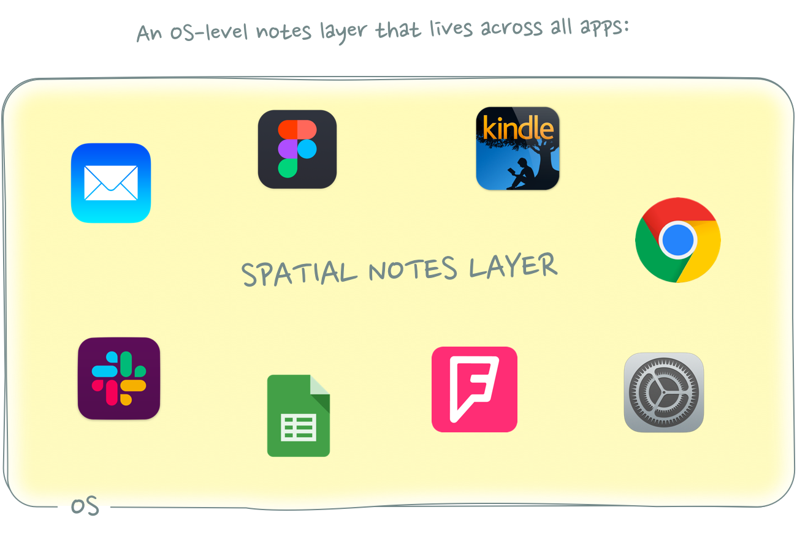

## What’s the digital equivalent of sticky notes?  

什么是数字便签？

01 Hey 01 嘿

This was originally supposed to be a blog post about [Hey](https://www.hey.com/). I wanted to write a longer essay about Basecamp’s new email tool and test if the app actually lives up to its hype.  

这原本是一篇关于 "嘿 "的博文，我想写一篇关于 Basecamp 新电子邮件工具的长文，测试一下这款应用程序是否真的名副其实。

After playing around with it for a few weeks, my conclusion is this: **Hey’s most interesting aspect is not its radical approach to email – but its fresh approach to note taking!**  

玩了几个星期之后，我得出了这样的结论：Hey 最吸引人的地方不是它对电子邮件的激进处理方式，而是它对记笔记的全新处理方式！

We have long treated notes as a distinct silo in our productivity stack, when we should have integrated them right into our workflows instead.  

长期以来，我们一直将笔记视为生产力堆栈中的一个独立筒仓，而我们本应将其直接集成到工作流程中。  

While email might need an overhaul, I see a way bigger opportunity in rethinking digital note taking.  

虽然电子邮件可能需要彻底改革，但我认为重新思考数字笔记会带来更大的机遇。

So instead of my Hey review, let’s talk about notes and my idea for a radically new kind of note taking app.  

所以，与其说是我对《嘿》的评论，不如让我们来谈谈笔记和我对一款全新笔记应用的想法。

02 A Closer Look at Notes in Hey  

02 细看《嘿》中的笔记

Hey has two interesting notes features.  

嘿》有两个有趣的注释功能。

The first are so-called [Thread Notes](https://hey.com/features/thread-notes/). These are basically emails to yourself within an email thread that only you can see.  

第一种是所谓的 "主题笔记"。这些基本上是在邮件主题中发给自己的邮件，只有自己能看到。  

You might have seen similar internal notes features in shared inbox tools like Zendesk or Front. Thread Notes in Hey are effectively the single player version of those.  

您可能在 Zendesk 或 Front 等共享收件箱工具中见过类似的内部笔记功能。Hey 中的 "线程笔记 "实际上就是这些工具的单机版。

I’d find Thread Notes super useful in combination with snoozed emails: _“Show me this email again in \[insert time\] and remind me of \[insert note\]”_  

我发现 Thread Notes 与打盹的电子邮件结合起来超级有用："在\[插入时间\]后再次向我显示这封邮件，并提醒我\[插入备注\]"。

This feels like a way better workflow than adding a note in a separate reminder, to-do, CRM, or note taking app.  

这感觉比在单独的提醒、待办事项、客户关系管理或记事应用程序中添加备注的工作流程要好得多。

a) Because there’s no need for context/app switching.  

a) 因为不需要切换上下文/应用程序。  

b) You might not even remember that you took a note related to an email when it resurfaces in your inbox a few weeks later.  

b) 几周后，当一封邮件再次出现在你的收件箱中时，你可能都不记得自己记下了与之相关的笔记。

To-do and reminder apps (and calendars!) work great for tasks that are tied to a specific day or time. But many tasks – and especially notes – are not dependent on time.  

待办事项和提醒应用程序（以及日历！）对于与特定日期或时间相关的任务非常有效。但许多任务，尤其是笔记，并不依赖于时间。  

Their relevance is based on other trigger points. Only when certain conditions are met, should these notes resurface: _“If \[insert event\] is true, then show \[note\]”_  

它们的相关性基于其他触发点。只有在满足特定条件时，这些注释才会再次出现："如果\[插入事件\]为真，则显示\[注释\]"

In the case of our email, the note becomes relevant in _\[insert snooze time\]_ or whenever the recipient replies to the email thread.  

就我们的电子邮件而言，在\[插入打盹时间\]或收件人回复电子邮件主题时，备注就会变得相关。  

The fact that many tasks have external dependencies (which are usually linked to an email thread) is one of the reasons I believe that your email inbox should also be the place where you manage your to-dos. [You shouldn’t need a separate to-do app](http://julian.digital/2020/01/17/superhuman-the-productivity-meta-layer/).  

许多任务都有外部依赖关系（通常与电子邮件线程相关联），这也是我认为电子邮件收件箱也应成为管理待办事项的地方的原因之一。你不应该需要一个单独的待办事项应用程序。

— \-

The second note feature in Hey are [Inbox Notes](https://hey.com/features/inbox-notes/).  

嘿》的第二个便笺功能是收件箱便笺。

As the name suggests, these notes are added to individual emails in your inbox.  

顾名思义，这些备注会添加到收件箱中的单个电子邮件中。  

Similar to Thread Notes, you can use them to quickly jot down things you need to remember, but they also help you to highlight specific emails.  

与 "线程笔记 "类似，你可以用它们快速记下需要记住的事情，但它们也能帮助你突出显示特定的电子邮件。

Thread Notes and Inbox Notes feel similar, but they serve two slightly different use cases. Thread Notes work more like reminders (_“Don’t forget X when you reply”_), whereas Inbox Notes feel more like bookmarks that highlight the most important messages in a long list of emails.  

线程备忘和收件箱备忘感觉很相似，但它们的用途略有不同。线程备注的作用更像是提醒（"回复时不要忘记 X"），而收件箱备注则更像是在一长串邮件中突出显示最重要邮件的书签。

Together, they remind me of one of my all-time favorite note taking tools: [Post-it Notes](https://en.wikipedia.org/wiki/Post-it_Note).  

它们让我想起了我一直以来最喜欢的记事工具之一：便利贴。

03 Post-it Notes 03 便利贴

I’m a huge fan of physical note taking and there are two writing tools that I use every single day: A physical notebook (for longer thoughts, including first drafts of my blog posts) and post-it notes (for all kinds of quick notes).  

我是实物笔记的忠实粉丝，我每天都使用两种写作工具：我每天都使用两种书写工具：实体笔记本（用于记录较长的想法，包括博客文章的初稿）和便利贴（用于记录各种快速笔记）。

(Disclaimer: When I say “post-it notes” I’m referring to all types of sticky notes, not just those sold by 3M.)  

(免责声明：我说的 "便利贴 "指的是所有类型的便条，而不仅仅是 3M 公司出售的便条）。

Post-it notes serve two of the same functions that Hey’s note features offer: highlights and reminders.  

便利贴提供了与 Hey 便签功能相同的两种功能：突出显示和提醒。

One of the reasons I still read a lot of non-fiction in physical book form is because it’s easier to bookmark and annotate passages that I quickly want to find again later.  

我仍然以实体书的形式阅读大量非虚构类书籍，原因之一是这样更容易在书签上标注我以后想快速找到的段落。  

Similar to Thread Notes, sticky note bookmarks help me **highlight** the most important items in a long list.  

与 "线程笔记 "类似，便签书签可以帮助我在长长的清单中突出最重要的项目。

Apart from helping you find important passages in a book later on, sticky note bookmarks also allow you to add additional context to the section you highlighted (e.g.  

便笺书签除了可以帮助你日后查找书中的重要段落外，还可以为你突出显示的部分添加更多的背景信息（例如  

\*why\* you bookmarked a particular section or thoughts you had about it).  

\*你\*为什么将某个部分加入书签或你对该部分的想法）。

You could write down notes like this in a separate notebook, but then you’d lose the connection to the source they are based on. **What makes post-it notes so interesting is the spatial relationship between the notes and their respective context.**  

你可以在单独的笔记本上写下这样的笔记，但这样你就失去了与这些笔记所依据的资料之间的联系。便签之所以如此有趣，是因为便签与各自背景之间的空间关系。

It’s this spatial relationship that also make post-it notes great **reminders**.  

正是这种空间关系也让便利贴成为了很好的提醒工具。

Post-it note reminders are similar to Hey’s Thread Notes in that they are triggered not based on time but on events that don’t have a (forecastable) deadline.  

便利贴的提醒功能与 Hey 的 "Thread Notes "类似，它们不是根据时间触发，而是根据没有（可预测的）截止日期的事件触发。  

They are essentially like notifications that appear when you look at specific objects.  

本质上，它们就像在你查看特定对象时出现的通知。

A post-it note on your front door, for example, is like a notification that pops up when you’re about to leave the house: _“Before you go, don’t forget to \[insert note\]”_. A shopping list on your fridge is a data request notification that surfaces when you are most likely to have new items to add to your list.  

例如，门前的便利贴就像是一个通知，在你即将出门时弹出："走之前，别忘了\[插入便条\]"。冰箱上的购物清单则是一个数据请求通知，当你最有可能有新物品要添加到清单上时，它就会出现。

Together, post-its essentially become a notes layer that augments the real world.  

这些便利贴共同构成了一个增强现实世界的笔记层。  

Instead of a physical notebook that lists all your notes and tasks in chronological order, post-it notes are scattered around your house but tied to specific places or objects where they are most relevant.  

便利贴不是按时间顺序排列所有笔记和任务的笔记本，而是散落在家中各处，但与特定地点或物品最相关的便利贴。

The question is: **Why isn’t there a digital note taking tool that works like this?**  

问题是：为什么没有这样的数字笔记工具？

04 A Spatial Note Taking Layer  

04 空间记录层

There are dozens of great note taking apps out there: Evernote, Google Keep, Apple Notes, Workflowy, Notion, Roam … the list goes on and on.  

市面上有几十种优秀的笔记应用程序：Evernote、Google Keep、Apple Notes、Workflowy、Notion、Roam......不胜枚举。  

Every one of these tools has its own unique angle on note taking, but they all have one thing in common: They are stand-alone apps.  

这些工具都有自己独特的笔记角度，但它们都有一个共同点：它们都是独立的应用程序。

This strikes me as suboptimal. Neither the creation nor the consumption of notes should be treated as separate workflows.  

在我看来，这是不理想的。创建和使用笔记都不应该被视为独立的工作流程。

As John Palmer points out in his brilliant posts on [Spatial Interfaces](https://darkblueheaven.com/spatialinterfaces/) and [Spatial Software](https://darkblueheaven.com/spatialsoftware), “Humans are spatial creatures \[who\] experience most of life in relation to space”. Post-it notes are so powerful because they have a spatial relationship to their context.  

正如约翰-帕尔默（John Palmer）在其关于《空间界面》和《空间软件》的精彩文章中所指出的，"人类是一种空间生物，\[他们\]体验的大部分生活都与空间有关"。便利贴之所以如此强大，就是因为它们与上下文有着空间关系。

Many notes shouldn’t live in a dedicated note taking app that you explicitly have to open and search.  

许多笔记不应该放在专门的笔记应用中，因为你必须打开并搜索。  

Notes should emerge automatically whenever and \*wherever\* they are most relevant.  

无论何时何地，只要是最相关的，都应自动出现备注。

As long as note taking remains separated, users constantly have to switch back and forth between different applications, which is not ideal. It reminds me of [the recent discussion around productivity and collaboration](https://kwokchain.com/2019/08/16/the-arc-of-collaboration/) – which have historically also been treated as two separate, isolated workflows:  

只要记笔记仍然分开，用户就必须在不同的应用程序之间来回切换，这并不理想。这让我想起了最近围绕工作效率和协作的讨论--在历史上，这两者也一直被视为两个独立、孤立的工作流程：

_The platonic flow of productivity should minimize time spent not productive, with collaboration as aligned and unblocking with that flow as possible.  

柏拉图式的生产流程应尽量减少非生产时间，尽可能使协作与生产流程保持一致和畅通。  

By definition, any app that requires you to switch out of your productivity app to collaborate is blocking and cannot be maximally aligned.  

顾名思义，任何要求你跳出生产力应用软件进行协作的应用软件都是阻塞性的，不可能最大限度地保持一致。  

It’s fine to leave your productivity app for exceptions and breaks. But not ideal when working.  

在例外情况和休息时间使用生产力软件是不错的选择。但在工作时就不太理想了。_

The same applies to notes. You shouldn’t have to switch apps and context to take or consume notes. It should stay within the same workflow!  

笔记也是如此。您不必切换应用程序和上下文来记录或使用笔记。它应该保持在相同的工作流程中！

(Side Note: You could argue that note taking is essentially single-player collaboration where you communicate with your future self – but that’s a whole new discussion I’ll save for another blog post.)  

(题外话：你可以说记笔记本质上是与未来的自己交流的单人协作，但这是一个全新的讨论，我将留待下一篇博文再谈）。

Natively built in note taking features like email notes in Hey feel like a good step in the right direction – but email is just one distinct silo in your productivity stack.  

本机内置的笔记功能（如 Hey 中的电子邮件笔记）让人感觉方向正确，但电子邮件只是生产力堆栈中一个独特的孤岛。  

Imagine you had to buy different sets of post-it notes for every single room or object in your house.  

想象一下，你不得不为家里的每个房间或每个物品购买不同的便签纸。

What we need instead is a spatial meta layer for notes on the OS-level that lives across all apps and workflows.  

我们需要的是一个操作系统级的笔记空间元层，它可以在所有应用程序和工作流程中使用。  

This would allow you to instantly take notes without having to switch context.  

这样，您就可以立即记笔记，而无需切换上下文。  

Even better yet, the notes would automatically resurface whenever you revisit the digital location you left them at.  

更妙的是，只要你再次访问你留下笔记的数字位置，笔记就会自动浮现。

Let’s look at a few examples.  

让我们来看几个例子。

05 Examples 05 示例

One use case that immediately came to mind when I thought about spatial notes is bookmarking.  

当我想到空间笔记时，我立刻想到了一个使用案例，那就是书签。

Most of us don’t use just one bookmarking app for everything.  

大多数人都不会只用一个书签应用程序来处理所有事情。  

We use different bookmarking apps or bookmarking features depending on the type of object we want to save for later: Podcasts are usually saved in a dedicated podcast app, for example.  

我们会根据要保存的对象类型使用不同的书签应用程序或书签功能：例如，播客通常保存在专用的播客应用程序中。  

Articles are bookmarked in Pocket, books on Goodreads, songs on Spotify, places on Foursquare, products on Amazon … you get my point.  

在 Pocket 中收藏文章，在 Goodreads 上收藏书籍，在 Spotify 上收藏歌曲，在 Foursquare 上收藏地点，在亚马逊上收藏产品......你明白我的意思。

Bookmarks are great to remember \*what\* you want to revisit later – but not \*why\* you saved something in the first place.  

书签可以让你记住\*\*想在以后重温的内容，但却记不住\*\*当初为什么要保存这些内容。  

I would love to be able to add notes to my bookmarks directly in each app so that I have some context on why these objects are important when I return to them later.  

我希望能直接在每个应用程序中为我的书签添加注释，这样当我稍后返回到这些对象时，就能知道它们为何重要。

Ideally, these notes wouldn’t just show up in the one place I originally left them, but across all apps and websites that reference the (semantic) object I bookmarked.  

理想情况下，这些笔记不会只显示在我最初留下笔记的地方，而是会显示在所有引用我书签（语义）对象的应用程序和网站上。  

A note attached to a book I want to read in Goodreads, for example, should also emerge when I see that book in my Amazon search results – or when someone mentions it in my Twitter timeline.  

例如，当我在亚马逊的搜索结果中看到我想读的书时，或者当有人在我的 Twitter 时间轴上提到这本书时，Goodreads 上附带的备注也会出现。

People are a similar type of semantic object you could tie notes to.  

人是一种类似的语义对象，你可以将笔记与之绑定。  

Instead of a stand-alone CRM tool, you would leave a note attached to a person straight from your current workflow (e.g. your email client).  

与独立的客户关系管理工具不同，您可以直接从当前的工作流程（如电子邮件客户端）中为某个人留下附注。  

That note would then automatically re-surface whenever the person it references becomes relevant again:  

然后，每当提到的人再次出现时，该笔记就会自动重新出现：

-   When you’re in an email thread with them  
    
    当你和他们在邮件线程中时
-   When you add them to a calendar event  
    
    将它们添加到日历事件时
-   When you’re visiting their LinkedIn page  
    
    访问他们的 LinkedIn 页面时
-   When you look them up in your phone book  
    
    当您在电话簿中查找他们时
-   etc 等等

— \-

Another use case for spatial notes are instructions on how to use specific software features or improve workflows.  

空间笔记的另一种用途是指导如何使用特定的软件功能或改进工作流程。  

These could be quick reminders to add permissions to new calendar events or to use Filtered Views in Google Sheets.  

这些提示可以是快速提醒，为新日历事件添加权限或在 Google Sheets 中使用过滤视图。  

You could also use these notes to train users on keyboard shortcuts.  

您还可以利用这些笔记对用户进行键盘快捷键培训。

You could imagine employers shipping corporate laptops with pre-installed notes to make it easier to transfer (previously tacit) knowledge and thus improve the onboarding process for new hires.  

你可以想象，雇主们会将预装笔记的公司笔记本电脑寄给新员工，让他们更容易传递（以前隐性的）知识，从而改善新员工的入职流程。

06 Closing Notes 06 结束语

I could go on and on about potential use cases for a spatial note taking app. The possibilities are endless – but blog posts shouldn’t be. So I’ll end things here.  

关于空间笔记应用的潜在用例，我还可以继续说下去。可能性是无穷无尽的，但博客文章不应该如此。所以我就到此为止吧。

A final note before you leave: I’d love to hear your thoughts on this whole idea. What would you use a spatial note taking tool for? Let me know what you think in [this Twitter thread](https://twitter.com/lehrjulian/status/1301903427849650176)!  

在你们离开之前，我最后说一句：我很想听听你们对整个想法的看法。你会使用空间笔记工具来做什么？请在 Twitter 上告诉我你的想法！

_Thanks to [Kevin Yien](https://twitter.com/kevinyien), [Matthew Achariam](https://twitter.com/Achariam), [Max Cutler](https://twitter.com/cutler_max) and [Nathan Baschez](https://twitter.com/nbashaw) for their detailed feedback on drafts of this post.  

感谢 Kevin Yien、Matthew Achariam、Max Cutler 和 Nathan Baschez 对本篇文章草稿的详细反馈。_

If you liked this post, you might also enjoy the following essays:  

如果您喜欢这篇文章，您可能还会喜欢以下文章：

-   [Superhuman & the Productivity Meta-Layer  
    
    超人与生产力元层](https://julian.digital/2020/01/17/superhuman-the-productivity-meta-layer/)
-   [Signaling as a Service  
    
    信号即服务](https://julian.digital/2020/03/28/signaling-as-a-service/)
-   [Proof of X X 的证明](https://julian.digital/2020/08/06/proof-of-x/)
