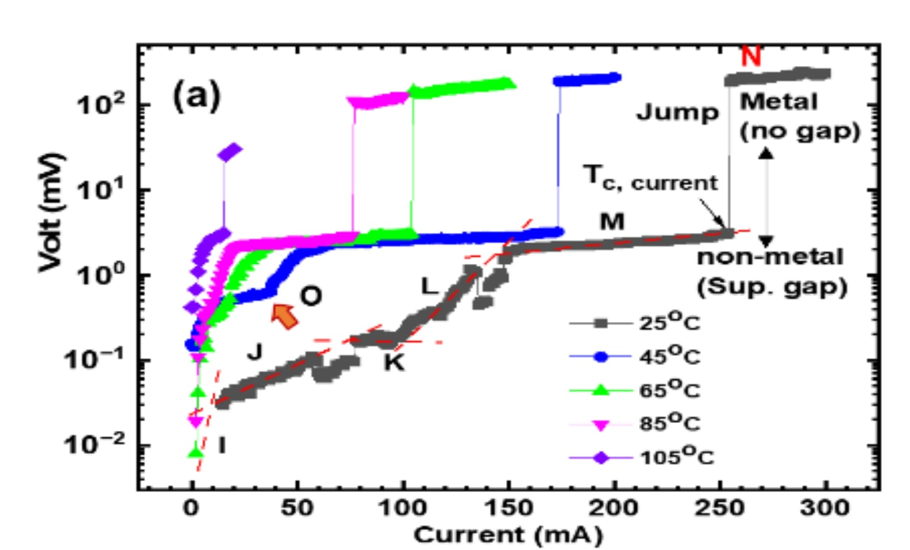

So this morning I thought to myself, "Okay, now I will actually try to study the LK99 question, instead of betting based on nontechnical priors and market sentiment reckoning."  (My initial entry into the affray, having been driven by people online presenting as confidently YES when the prediction markets were not confidently YES.)  And then I thought to myself, "This LK99 issue seems complicated enough that it'd be worth doing an actual Bayesian calculation on it"--a rare thought; I don't think I've done an actual explicit numerical Bayesian update in at least a year.  

因此，今天早上我对自己说："好吧，现在我将真正尝试研究 LK99 问题，而不是根据非技术性的先验和市场情绪计算来下注。 (我最初加入这场争论，是因为有人在网上自信地表示 "是"，而预测市场却并不自信地表示 "是"）。 然后我心想："LK99 这个问题似乎很复杂，值得对其进行实际的贝叶斯计算"--这是一个罕见的想法；我想我至少有一年没有进行过实际的明确的贝叶斯数值更新了。

In the process of trying to set up an explicit calculation, I realized I felt very unsure about some critically important quantities, to the point where it no longer seemed worth trying to do the calculation with numbers.  

在尝试进行明确计算的过程中，我发现自己对一些至关重要的量感到非常不确定，以至于似乎不再值得尝试用数字进行计算。  

 This is the System Working As Intended.  

这就是系统的工作原理。

___

On July 30th, Danielle Fong [said](https://twitter.com/DanielleFong/status/1685748984999202816) of [this temperature-current-voltage graph](https://twitter.com/marshray/status/1685525342008823808),   

7 月 30 日，Danielle Fong 谈到了这张温度-电流-电压曲线图、

> 'Normally as current increases, voltage drop across a material increases. in a \*superconductor\*, voltage stays nearly constant, 0. that appears to be what's happening here -- up to a critical current.  
> 
> 在\*超导体\*中，电压几乎保持不变，为 0。  
> 
> with higher currents available at lower temperatures  deeply in the "fraud or superconduct" territory, imo.  
> 
> 在较低的温度下就能获得较大的电流，这在 "欺诈或超导 "领域是非常普遍的。  
> 
> like you don't get this by accident -- you either faked it, or really found something.'  
> 
> 就像你不是偶然得到这个的 -- 你要么是装出来的，要么就是真的发现了什么。

The graph Fong is talking about only appears in the initial paper put forth by Young-Wan Kwon, allegedly without authorization.  A different graph, though similar, appears in Fig.  

Fong 所说的图形只出现在 Young-Wan Kwon 最初发表的论文中，据称未经授权。另一张图虽然相似，但却出现在图 1 和图 2 中。  

6 on p. 12 of [the 6-author LK-endorsed paper rushed out in response](https://arxiv.org/abs/2307.12037).  

6 的第 12 页。

Is it currently widely held by expert opinion, that this diagram has no obvious or likely explanation except "superconductivity" or "fraud"?  

专家们目前是否普遍认为，除了 "超导 "或 "欺诈 "之外，这幅图没有其他明显或可能的解释？  

 If the authors discovered something weird that wasn't a superconductor, or if they just hopefully measured over and over until they started getting some sort of measurement error, is there any known, any obvious way they could have gotten the same graph?  

如果作者发现了不是超导体的奇怪东西，或者如果他们只是满怀希望地反复测量，直到开始出现某种测量误差，有没有任何已知的、明显的方法可以得到相同的图表？

2

One person alleges an online rumor that poorly connected electrical leads can produce the same graph.  Is有人称网上有传言说，连接不良的电线也会产生同样的图形。 是否 _that 那_ a conventional view? 传统观点？

Alternatively:  If this material _is_ a superconductor, have we seen what we expected to see?  Is the diminishing current capacity with increased temperature usual?  How does this alleged direct measurement of superconductivity square up with the current-story-as-I-understood-it that the material is only being very poorly synthesized, probably only in granules or gaps, and hence only detectable by looking for magnetic resistance / pinning?  

或者说：如果这种材料是一种超导体，我们是否看到了我们预期看到的东西？电流容量随温度升高而减小的现象是否常见？这种所谓的超导直接测量结果与目前的理论--我的理解--是如何吻合的？目前的理论认为，这种材料的合成度很低，可能只有颗粒状或间隙状，因此只能通过寻找磁阻/针脚来检测？

This is my number-one question.  

这是我的首要问题。  

 Call it question 1-NO, because it's the question of "How does the NO story explain this graph, and how prior-improbable or prior-likely was that story?", with respect to my number one question.  

称其为问题 1-NO，因为这个问题是 "NO 故事如何解释这个图表，这个故事的先验可能性或先验可能性有多大？"，与我的第一个问题有关。

Though I'd also like to know the 1-YES details: whether this looks like a high-prior-probability superconductivity graph; or a graph that requires a new kind of superconductivity, but one that's theoretically straightforward given a central story; or if it looks like unspecified weird superconductivity, with there being no known theory that predicts a graph looking roughly like this.  

虽然我也想知道 "1-YES "的细节：这是否看起来像一个高先验概率的超导图；或者是一个需要一种新的超导图，但理论上简单明了的中心故事；或者它看起来像一个未指定的奇怪的超导图，没有已知的理论能预测出大致如此的图。

___

What's up with all the partial levitation videos?  Possibilities I'm currently tracking:  

那些局部悬浮的视频是怎么回事？ 我正在追踪的可能性：

2-NO-A:  There's something called "diamagnetism" which exists in other materials.  

2-NO-A：有一种叫 "二磁性 "的东西存在于其他材料中。  

 The videos by LK and attempted replicators show the putative superconductor being repelled from the magnet, but not being locked in space relative to the magnet.  

LK 和尝试复制者的视频显示，假定的超导体被磁铁排斥，但并没有被锁定在相对于磁铁的空间中。  

 Superconductors are supposed to exhibit Meissner pinning, and the failure of the material to be pinned to the magnet indicates that this isn't a superconductor.  

超导体应该表现出迈斯纳钉扎效应，而材料未能钉扎在磁铁上表明这不是超导体。  

 (Sabine Hossenfelder seems to talk this way [here](https://youtu.be/RjzL9cS3VW8?si=WVvDW0coSuCZ0i0a&t=226).  "I lost hope when I saw this video; this doesn't look like the Meissner effect to me.")  

(Sabine Hossenfelder 似乎也是这么说的）。"当我看到这段视频时，我失去了希望；在我看来，这不像是迈斯纳效应。）

2-YES-Z:  This is actually some totally expected thing called a "toroidal Meissner effect", which is exactly what we should expect to see given the one-dimensional nature of the superconducting arrangement of quantum wells, and supposedly looks just like some previous video for carbon nanotubes.  

2-是-Z：鉴于量子阱超导排列的一维性质，这正是我们应该期待看到的，而且据说看起来就像之前关于碳纳米管的视频一样。  

 This was [said by a Russian catgirl](https://twitter.com/iris_IGB/status/1686397350284079105).  

这是一位俄罗斯猫女说的。

2-YES-Y:  There is _so much_ diamagnetism on display here that [you wouldn't see it without some superconductivity](https://twitter.com/ChristianMahler/status/1686484715606351872?s=20).  

2-YES-Y：这里展示了如此多的二磁性，如果没有超导性，你是不会看到的。

2-NO-B:  There's an unusual/unprecedented amount of diamagnetism here, but in a way that fits pretty well with "they found some magnetically weird material after screening for magnetic weirdness" better than "superconductivity".  

2-NO-B：这里有不寻常的/前所未有的二磁性，但与 "他们在筛选磁性怪异性后发现了一些磁性怪异的材料 "相比，"超导性 "更符合 "他们在筛选磁性怪异性后发现了一些磁性怪异的材料 "的说法。

___

How much of a surprise was [Sinead's flat-band calculation](https://twitter.com/sineatrix/status/1686182852667572224?s=20)?  

辛妮的平带计算有多出人意料？  

 On the NO story, how likely or unlikely was the logical observation, "a result like this is calculated, for an actually-non-superconducting material, that was prescreened by the filters we already know about"?  

关于 "不超导 "的故事，"这样的结果是针对一种实际上不超导的材料计算出来的，而这种材料是通过我们已经知道的过滤器预先筛选出来的 "这一逻辑观察结果的可能性有多大？

Possibilities that are obvious and/or that I've seen claimed online:  

显而易见的可能性和/或我在网上看到的说法：

3-NO-A:  LK were deliberately seeking out materials like this, and the materials they screened were selected to all be the sort that would have a calculated flat band; therefore, arguendo, the result is not too surprising on NO.  

3-NO-A：LK 故意寻找这样的材料，而且他们筛选的材料都是经过计算会有平带的那类；因此，可以说，NO 的结果并不太令人吃惊。

3-NO-B:  Most materials in the potential-superconductor class would have a calculation like this; it's not a hard result to get by making weird unrealistic assumptions.  

3-NO-B：大多数潜在超导体类材料都会有这样的计算结果；这并不难，只要做出奇怪的不切实际的假设就能得到。

3-NO-C:  LK found a weird material that isn't a superconductor, and a weird material like this is much more likely to have a result like Sinead's calculation be true about that material or some plausibly mistaken neighboring postulated structure.  

3-NO-C： LK发现了一种不是超导体的怪异材料，而像这种怪异材料更有可能出现像辛妮的计算结果那样的真实结果，或者是一些似是而非的邻近假定结构。

3-NO-D:  We understand so little about the origins of superconductivity that a calculation like this is _not even probabilistic evidence_ about whether something is actually a superconductor.  You could probably find a calculation like that for anything magnetically or electrically weird at all.  

3-NO-D：我们对超导电性的起源知之甚少，这样的计算甚至都不能作为某物是否真的是超导体的概率证据。你也许可以为任何磁性或电性怪异的东西找到这样的计算方法。

3-YES-Z:  This is a fact we didn't know from LK's paper and LK didn't do any prior selection against it; Sinead's result is a previously unsuspected-given-NO calculation, that would be very unlikely as a calculation result unless the LK-postulated material was actually a superconductor.  

3-YES-Z：这是我们从李开复的论文中不知道的事实，李开复事先也没有针对它做任何选择；辛妮的结果是一个以前未曾预料到的 "给定-否 "计算结果，除非李开复假设的材料实际上是一种超导体，否则这种计算结果不太可能出现。  

 (This is how [Andercot initially presented Sinead's result](https://twitter.com/Andercot/status/1686215574177841152), and there was a large prediction market jump immediately after; based on the subsequent crash, it looks like this was _not_ the conventional reception after some review.)  

(Andercot 最初就是这样介绍辛妮的结果的，预测市场随即出现大幅跳水。）

3-YES-Y:  LK already knew this fact, already did some calculation reflecting it, and this is how they found the material in the first place.  

3-YES-Y：LK 已经知道了这个事实，已经做了一些计算来反映这个事实，这就是他们最初找到材料的原因。

3-YES-X:  LK didn't know the Sinead-calculation, but the already-known weirdnesses of the material, and a very high false positive rate of calculations like these, mean the calculation wasn't all that informative about YES and we don't say "game won".  

3-是-X： LK 不知道 Sinead 的计算方法，但我们已经知道材料的怪异之处，而且类似计算的假阳性率非常高，这意味着计算结果并不能完全说明 "是"，我们也不会说 "游戏赢了"。

___

Q4:  Do any other results from the 6-person or journal-submitted LK papers stand out as having the property, "This is either superconductivity or fraud?"  Like the stuff with thermal capacity or whatevs?  Are there any _claims_ - not replicated observations, just claims - that somebody wants to point to and say:  "This seems quite improbable to get as an honest mistake, or as the result of other weirdness from this sort of material, absent superconductivity"?  

问题 4：在 6 人论文或期刊提交的 LK 论文中，是否有任何其他结果具有 "这不是超导就是欺诈 "的特性？比如热容量什么的？有没有人想指出并说 "这似乎不太可能是真的"这似乎不太可能是一个诚实的错误，或者是这种材料在没有超导性的情况下产生的其他怪异现象"？

___

Q5:  When the early results hit, many online skeptics were scoffing about improbable or inconsistent results or points which supposedly showed the authors didn't know physics.  

问题 5：当早期结果公布时，许多网上的怀疑论者对不可能的或不一致的结果，或者据说表明作者不懂物理的观点嗤之以鼻。  

 Are any standout nits like that still being picked with the 6-person or journal-submitted LK papers?  

在 6 人论文或期刊提交的 LK 论文中，是否还有类似的突出问题？

___

And finally, while it's probably not _that_ important, I would like to ask "What are we pretty sure we know and how do we think we know it?" with respect to the dramatic social story.  

最后，虽然这可能并不那么重要，但我还是想就戏剧性的社会故事问一句："我们非常确定我们知道什么，我们又是如何认为我们知道的呢？

Supposedly, Lee and Kim have been researching LK-99 since 1999 as the last wish of their dying professor, albeit with a lot of breaks because they couldn't get any funding and had to go on living their lives.  

据说，自 1999 年以来，Lee 和 Kim 就一直在研究 LK-99，这是他们的教授临终前的遗愿，尽管他们因为得不到任何资助而不得不继续生活，因此中断了很多研究。

Q6:  Is there any external verification, if we don't trust LK's word alone, that they've actually been working on this project for that long, and were on the tail of materials in this category from the start?  

问题 6：如果我们不相信 LK 的一面之词，那么是否有任何外部证据可以证明他们确实在这个项目上工作了那么长时间，并且从一开始就在跟踪这一类材料？

___

You may notice that I'm not trying to point to anything as a "prior", as many layfolk incorrectly imagine to be the essence of Bayesianism.  

你可能会注意到，我并没有试图指出什么是 "先验"，很多外行人错误地把它想象成贝叶斯主义的精髓。  

 I don't particularly think that pointing to any particular starting point and calling it a prior would be helpful in figuring things out, at this point.  

我并不特别认为，在这一点上，指出任何特定的起点并将其称为先验会有助于弄清事情的真相。

What Bayesianism really has to say is more of a coherence constraint on how your beliefs should look; a reminder to ask questions like:  "What's the best explanation for Fig.  

贝叶斯主义真正要表达的，更多的是对你的信念应该如何看待的一种一致性约束；提醒你要问类似这样的问题："图的最佳解释是什么？"对无花果的最佳解释是什么？  

6 given NO, and how a-priori-probable would that explanation have sounded before we saw the graph?"  

6给NO，在我们看到图表之前，这种解释听起来有多先验？

Bayesianism, or rather probability-theoretic coherence, inspires me to say that what I'd hope to see laid out by experts or collaborating Internet citizens, is a list of...  

贝叶斯主义，或者说概率论的一致性，启发我说，我希望看到的是由专家或合作的互联网公民制定的一个清单。

(1)  Every observation, claim, fact, diagram from a paper, etcetera, _which is supposed to be confusing or surprising given some possible states of the world,_ or bear in any way as evidence upon our probable beliefs;  

(1) 每一个观察结果、主张、事实、论文中的图表等等，鉴于世界的某些可能状态，它们应该是令人困惑或惊讶的，或以任何方式作为我们可能的信念的证据；

(2)  An account of the best ways to explain each such point, from both a YES or NO standpoint, as somebody who honestly believed YES or NO would give their own best account of it.  

(2) 从 "是 "或 "否 "的角度，说明解释每一点的最佳方法，就像一个真正相信 "是 "或 "否 "的人会给出自己的最佳解释一样。

...in enough detail that you could notice if any parts of the best combined YES story or NO story stood out as a priori improbable, themselves surprising, or incoherent between points.  

......足够详细，以至于你可以注意到，在 "是 "或 "否 "的最佳组合故事中，是否有任何部分是先验地不可能的、本身令人惊讶的，或者是各点之间不连贯的。

Possibly if we had that whole list, it would still seem worth the trouble of trying to yank out numbers, and attempt an explicit calculation of how probable the best YES story and the best NO story seemed.  

也许，如果我们有了那份完整的名单，就仍然值得费尽心机地找出数字，并尝试明确计算出最佳 "是 "和最佳 "否 "故事的可能性有多大。  

 Or possibly it would seem like, as so many people on the Internet claim--and the more forthright ones have [bet](https://manifold.markets/QuantumObserver/will-the-lk99-room-temp-ambient-pre?r=RWxpZXplcll1ZGtvd3NreQ)\--that it's time to call it, in one direction or another.  

或者，就像互联网上许多人声称的那样--更直率的人已经下了赌注--现在是时候了，朝着这个方向或那个方向叫停了。
