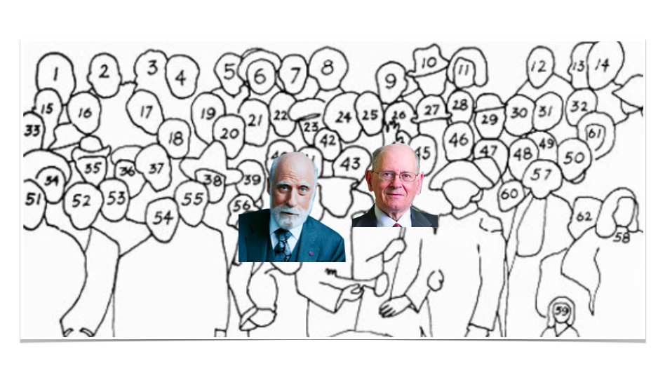
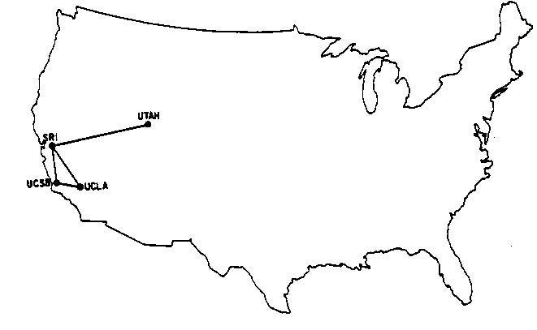
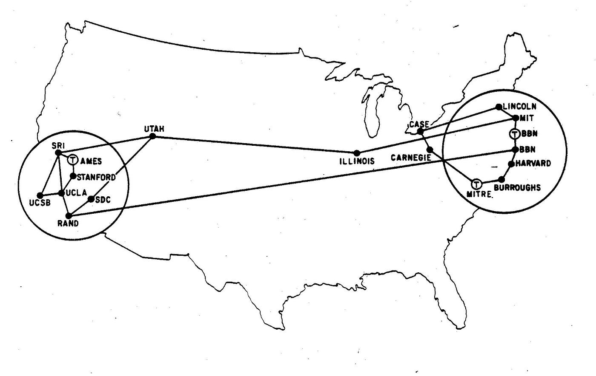
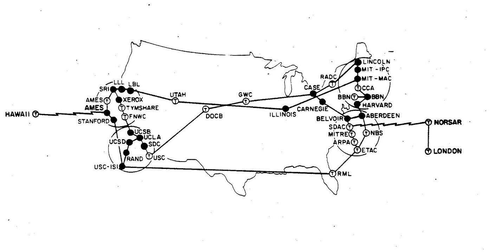
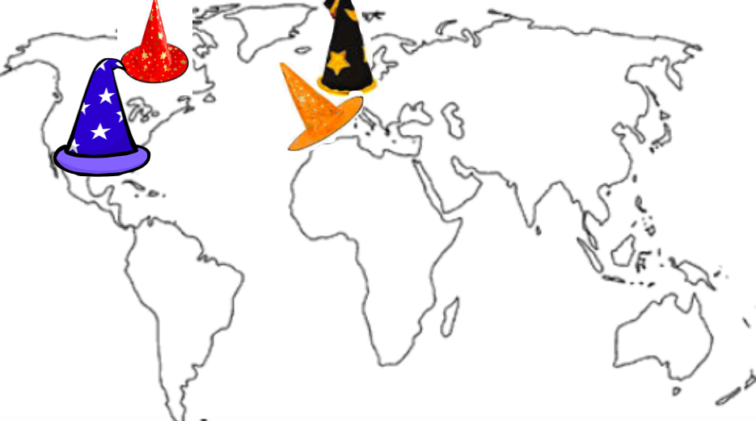
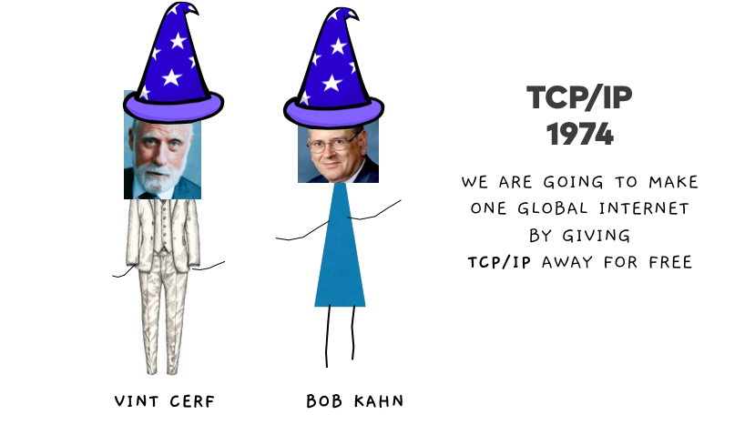
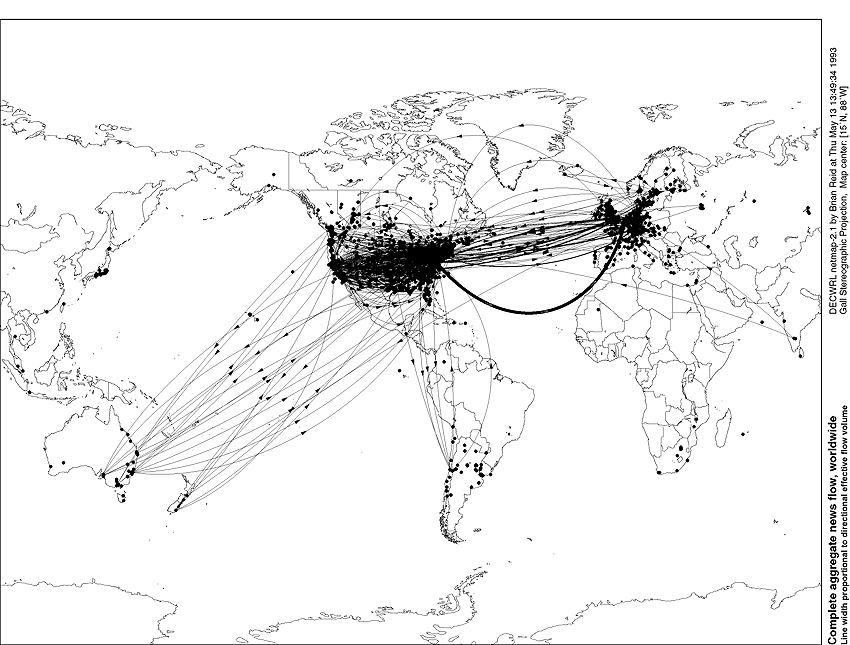
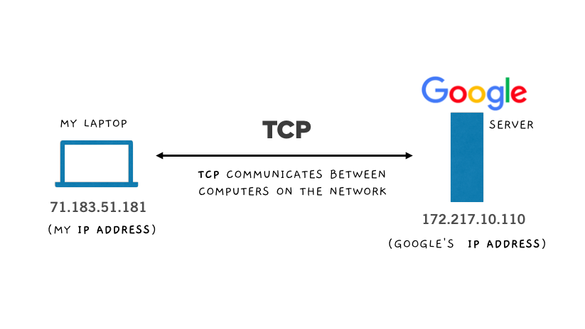
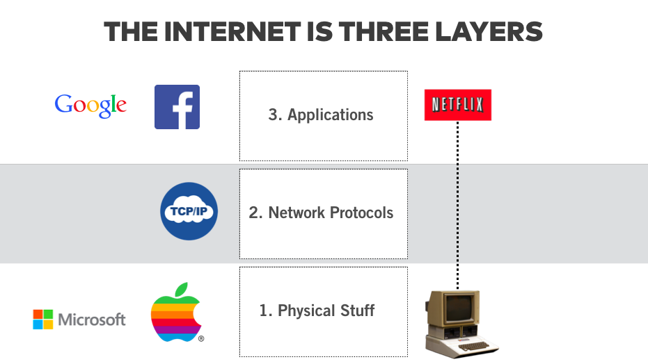
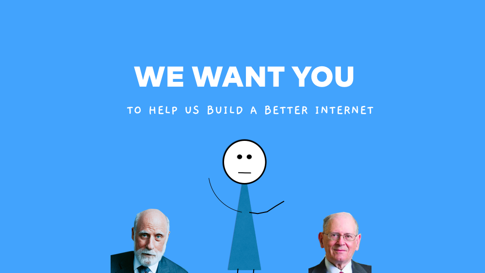

## _Celebrating the internet’s founding fathers  

纪念互联网的奠基人_

7 min read

Nov 14, 2018 2018 年 11 月 14 日

_In the autumn of 1969, a small group of people launched the most disruptive revolution of our time_ **_—_** _and yet their names aren’t taught in high school history books, nor do we take off work to celebrate their birthdays.  

In this piece, I’d like to take a look at two questions: Who invented the internet? And what exactly they did they do?  

在这篇文章中，我想探讨两个问题：谁发明了互联网？他们到底做了什么？_  

1969 年秋天，一小群人发起了我们这个时代最具破坏性的革命--但他们的名字却没有被写进中学历史课本，我们也不会请假去庆祝他们的生日。

On October 29th, 1969 the first message on the early internet was sent from UCLA to Stanford University: it was just two letters “lo.”  

1969 年 10 月 29 日，早期互联网上的第一条信息从加州大学洛杉矶分校发送到斯坦福大学：只有两个字母 "lo"。

**The first message sent on the internet —** On October 29th, 1969 Charlie Kline sent the internet’s first message “lo.” He had attempted to write the word “login,” but the system crashed before he could type the “g.”  

互联网上发送的第一条信息--1969 年 10 月 29 日，查理-克莱恩（Charlie Kline）发送了互联网上的第一条信息 "lo"。他试图写下 "登录 "一词，但还没打出 "g"，系统就崩溃了。

So how did we get from “lo” to “LOL’s,” cat GIFS, YouTube, Facebook and a global internet that connects over 3 billion people around the world?  

那么，我们是如何从 "lo "发展到 "LOL's"、猫咪 GIF、YouTube、Facebook 以及连接全球 30 多亿人的全球互联网的呢？

I’m about to share a sweeping history of the two people who founded the internet, the Founding Fathers if you will: Vint Cerf and Bob Kahn.  

我将与大家分享互联网的两位创始人，也可以说是互联网的奠基人--文特-瑟夫（Vint Cerf）和鲍勃-卡恩（Bob Kahn）的辉煌历史：文特-瑟夫（Vint Cerf）和鲍勃-卡恩（Bob Kahn）。

While working at the U.S. agency ARPA, they helped send the first message on the [ARPANET](https://en.wikipedia.org/wiki/ARPANET), and a few years later they set out to accomplish one of the biggest and most audacious of goals: to create a global decentralized internet.  

在美国机构 ARPA 工作期间，他们帮助在 ARPANET 上发送了第一条信息，几年后，他们开始着手实现一个最大、最大胆的目标：创建一个全球分散式互联网。

Please note that: Over decades, [thousands](https://en.wikipedia.org/wiki/List_of_Internet_pioneers#cite_note-138), if not tens to hundreds of thousands of people, have contributed their expertise to the construction and evolution of the internet.  

请注意这一点：几十年来，成千上万甚至数万至数十万人为互联网的建设和发展贡献了自己的专业知识。

**The pioneers of the early internet**: 1. J.C.R. Licklider — 2. Paul Baran — 3. Vannevar Bush — 4. Bob Taylor — 5. Larry Robers, 6. Leonard Kleinrock, 7. Douglas Engelbart — 8. Claude Shannon — 9. Donald Davies — 10. Charles M.  

早期互联网的先驱1.J.C.R. Licklider - 2. Paul Baran - 3. Vannevar Bush - 4.鲍勃-泰勒 - 5.拉里-罗伯斯（Larry Robers） - 6. 伦纳德-克莱因洛克（Leonard Kleinrock） - 7. 道格拉斯-恩格尔巴特（Douglas Engelbart） - 8.克劳德-香农 - 9.唐纳德-戴维斯 - 10.查尔斯-M.  

Herzfeld — 11. Louis Pouzin — 12. Glenda Schroeder — 13. Peter Kirstein — 14. Steve Crocker — 15. Jon Postel — 16. Joyce K. Reynolds — 17. Danny Cohen — 18 . NAME — 19. Ted Nelson — 20. Tim Berners Lee —21. Stewart Brand — 22. Richard Stallman — 23. Steve Wozniak \[…\] etc.  

Peter Kirstein - 14.Steve Crocker - 15.Jon Postel - 16.Joyce K. Reynolds - 17.Danny Cohen - 18.雷诺兹 - 17. 丹尼-科恩 - 18.NAME - 19.Ted Nelson - 20.Tim Berners Lee - 21.Stewart Brand - 22.Richard Stallman - 23.Steve Wozniak \[...\] 等。

With that said, I’d like to focus, though, on one year in particular, 1973 — the year when the early internet, known as the ARPANET, made the leap from being a [U.S. government military communications tool](https://hackernoon.com/the-history-of-the-internet-cdb844ff460c) to a global free internet. And the two people who are responsible: Vint Cerf and Bob Kahn.  

说到这里，我想重点谈谈 1973 年--早期互联网（即 ARPANET）从美国政府的军事通信工具一跃成为全球自由互联网的一年。而这两个人正是功不可没的：文特-瑟夫（Vint Cerf）和鲍勃-卡恩（Bob Kahn）。

## Let’s start back in 1969:  

让我们从 1969 年说起：

In 1969, there were only four computers (aka nodes) connected on the internet:  

1969 年，互联网上只连接了四台计算机（又称节点）：

By 1971, we were up to 18 computers! Most of these computers were located at academic institutions like Stanford, UCLA, MIT, and Harvard.  

到 1971 年，我们已经拥有 18 台计算机！这些计算机大多位于斯坦福大学、加州大学洛杉矶分校、麻省理工学院和哈佛大学等学术机构。

And just two years later the network doubled in size: 40 computers!  

仅仅两年后，网络规模就扩大了一倍：40 台电脑！

Q: Do you notice anything missing from all of these maps?  

问：你注意到所有这些地图中缺少了什么吗？

A: How about the rest of the world?  

答：世界其他地方呢？

## Vint Cerf and Bob Kahn shared a vision of a global decentralized internet.  

Vint Cerf 和 Bob Kahn 分享了一个全球去中心化互联网的愿景。

They shared the belief that “[information should be free](https://hackernoon.com/the-secret-hacker-code-974bc55af261)” for all humans, and that access to the internet would “[make the world a better place](https://hackernoon.com/the-secret-hacker-code-974bc55af261).” For them, it wasn’t enough to create an American owned and controlled internet. They believed everyone on the planet should benefit from this technology.  

他们的共同信念是，"信息应该是全人类的自由"，使用互联网将 "让世界变得更美好"。对他们来说，仅仅创建一个由美国人拥有和控制的互联网是不够的。他们相信，地球上的每一个人都应该从这项技术中受益。

Knock Knock — who’s there?  

咚咚--谁在那儿？

It’s Canada, France, and England who are each busy building their own national networks. And they’re not very interested in joining America’s internet.  

加拿大、法国和英国都在忙于建设自己的国家网络。他们对加入美国的互联网兴趣不大。

Here you see the national networks represented by wizard hats.  

在这里，您可以看到以巫师帽为代表的国家网络。

At the time the international community was using the telephone system as it’s model for building this new network — aka each country would have it’s own national “internet.”  

当时，国际社会将电话系统作为建立这种新网络的模式，即每个国家都将拥有自己的国家 "互联网"。

Cerf and Kahn imagined the future differently.  

瑟夫和卡恩对未来的想象有所不同。

They feared that using the telephone system model would also mean that there would be international taxes and data transmission fees applied to data.  

他们担心，使用电话系统模式还意味着将对数据征收国际税和数据传输费。  

Or worse, clunky adapters that you’d need for an American computer to speak with a European computer.  

更糟糕的是，美国电脑需要笨重的适配器才能与欧洲电脑通信。

Imagine having to use an adaptor every time you wanted to visit an international website.  

想象一下，每次访问国际网站时都要使用适配器。

Think about how the national electricity grid works — and now imagine a world with roughly 195 national internets, 195 email providers, and 195 Facebook’s, etc?!  

想想国家电网是如何工作的--现在想象一下，世界上大约有 195 个国家互联网、195 个电子邮件提供商和 195 个 Facebook，等等！

## **So how do you convince England, France, and Canada to join you in one global system?  

那么，如何说服英国、法国和加拿大加入全球统一体系呢？**

The solution: create a better internet and then give it away for free. And that’s just what Vint Cerf and Bob Kahn did.  

解决办法是：创建一个更好的互联网，然后免费赠送。文特-瑟夫和鲍勃-卡恩就是这么做的。

Vint Cerf and Bob Kahn invented the TCP/IP protocol. Vint Cerf is almost always wearing a suit in real life, and so I gave him a suit.  

Vint Cerf 和 Bob Kahn 发明了 TCP/IP 协议。Vint Cerf 在现实生活中几乎总是穿着西装，所以我给了他一套西装。  

Bob Kahn isn’t wearing a dress, that’s just how I draw stick figures.  

鲍勃-卡恩没有穿裙子，这只是我画棍棒人物的方式。

In 1973, Vint Cerf and Bob Kahn invented the TCP/IP protocol. TCP/IP is the magic that connects the entire world together on one network. [Here Vint Cerf explains](https://www.youtube.com/watch?v=nGhT8wMHnj0&feature=youtu.be) their thinking at the time,  

1973 年，文特-瑟夫和鲍勃-卡恩发明了 TCP/IP 协议。TCP/IP 是将整个世界连接在一个网络上的魔法。在这里，文特-瑟夫解释了他们当时的想法、

> “When Bob Kahn and I did the original designs we handed them out freely with no constraints, no patents, no other intellectual property claims for a very good reason.  
> 
> "鲍勃-卡恩和我在进行最初的设计时，我们将其无偿提供，没有任何限制，没有专利，也没有其他知识产权要求，这是有充分理由的。  
> 
> We wanted this to be accepted with no barriers to adoption.”  
> 
> 我们希望它能被接受，在采用时没有任何障碍"。

And adopted it was! 就这样通过了！

The internet in 1993 1993 年的互联网

By 1993, the internet had truly become a global network.  

到 1993 年，互联网已真正成为全球网络。

50 years later, with over 3 billion users, TCP/IP is still being used as the backbone of the internet. So what exactly did Cerf and Kahn build? What is TCP/IP?  

50 年后的今天，TCP/IP 已拥有超过 30 亿用户，仍被用作互联网的主干网。那么，瑟夫和卡恩究竟建立了什么？什么是 TCP/IP？

## **TCP/IP is the internet’s language  

TCP/IP 是互联网的语言**

The internet is a series of wires that connect your computer to other computers.  

互联网是一系列连接电脑和其他电脑的电线。  

Here you see TCP (the main language of the internet) that transfers data back and forth between IP addresses.  

在这里，你可以看到在 IP 地址之间来回传输数据的 TCP（互联网的主要语言）。

## TCP — Transport Communication Protocol  

TCP - 传输通信协议

**TCP** is the standard set of codes that allow computers on the internet to speak with one another. You can just think of it as the internet’s mother tongue.  

TCP 是允许互联网上的计算机相互对话的标准代码集。你可以把它想象成互联网的母语。

Further, TCP doesn’t care what kind of data you send, and has no idea what packets of data it is carrying. In that way, TCP is, by design, neutral.  

此外，TCP 不关心你发送的是哪种数据，也不知道它携带的是什么数据包。因此，TCP 在设计上是中立的。

## IP — Internet Protocol IP - 互联网协议

**IP** connects your data to the internet’s address system.  

IP 将您的数据连接到互联网的地址系统。

Your **IP address** locates your computer on the internet network.  

您的 IP 地址可确定您的计算机在互联网络上的位置。

-   Every personal computer on the internet is assigned an IP address ([you can find your public IP address here](https://www.google.com/search?sclient=psy-ab&hl=en&safe=off&site=&q=what+is+my+ip&oq=what+is+my+ip&gs_l=hp.3..0l4.382.1419.0.1766.13.11.0.0.0.0.247.1565.3j6j2.11.0.les%3B..0.0...1c.1.4.psy-ab.Sx1O8IFWjRw&pbx=1&biw=1440&bih=720&bav=on.2%2Cor.r_gc.r_pw.r_qf.&cad=h)).  
    
    互联网上的每台个人电脑都分配有一个 IP 地址（您可以在这里找到您的公共 IP 地址）。
-   Every website (aka. the server where a websites lives) also has an IP address. For example, if you type in the IP address [216.58.216.164](http://216.58.216.164/) your browser will go to [www.google.com](http://www.google.com/).  
    
    每个网站（又称网站所在的服务器）都有一个 IP 地址。例如，如果输入 IP 地址 216.58.216.164，浏览器就会跳转到 www.google.com。

Today, when computer scientists speak about the internet, they often refer to it in terms of “**layers**.” TCP/IP is the middle layer of the tech stack between your computer and a website. You can’t actually see TCP/IP, just as you can’t see electricity as it powers your home.  

如今，当计算机科学家谈到互联网时，他们通常用 "层 "来表示。TCP/IP 是计算机与网站之间技术堆栈的中间层。你实际上看不到 TCP/IP，就像你看不到电力供应一样。  

But it’s there, transporting packets of data from your computer, to Netflix (for example) and back.  

但它就在那里，将数据包从你的电脑传输到 Netflix（例如），然后再返回。

## Is TCP/IP broken? TCP/IP 是否已损坏？

Over the years there have been updates and improvements to TCP/IP, but the underlying technology has remained the same for nearly 50 years.  

多年来，TCP/IP 不断得到更新和改进，但其基础技术近 50 年来一直未变。

TCP/IP works, but it’s far from perfect.  

TCP/IP 可以工作，但远非完美。

In a recent talk at Google, [Vint Cerf outlined](https://www.youtube.com/watch?v=t9M0RPNr9qg) some of the problems with TCP/IP such as it’s inability to properly handle issues of 1) **security** (viruses, data hacking attacks, phishing, etc.), and 2) **identity** (authenticating and distinguishing good users and servers, from malicious ones).  

Vint Cerf 最近在谷歌的一次演讲中概述了 TCP/IP 的一些问题，例如它无法正确处理以下问题：1）安全（病毒、数据黑客攻击、网络钓鱼等）；2）身份（验证和区分好的用户和服务器与恶意用户和服务器）。

Cerf on the future of TCP/IP said,  

瑟夫在谈到 TCP/IP 的未来时说、

> “One of the things I want to emphasize to you is that I am NOT an IP bigot. I’m not a TCP bigot.  
> 
> "我想向你们强调的一点是，我不是一个 IP 偏执者。我不是 TCP 偏执者。  
> 
> Just because I’ve been involved in designing and building that stuff does not mean that it is the place to stop.  
> 
> 我曾参与设计和建造这些东西，但这并不意味着我们可以就此止步。  
> 
> \[…\] The important thing is that none of you should be afraid to say maybe we should do something different.”  
> 
> \[......\]重要的是，你们都不应该害怕说也许我们应该做些不同的事情"。

Over the past few years people have been doing “something different”:  

在过去几年里，人们一直在做 "与众不同的事情"：

As an example, forget everything you know about Bitcoin — Bitcoin, technically, is a _protocol_ designed specifically to improve the **security** and **identity** of money transfer on the internet’s **network** layer. Thus, making up for vulnerabilities and a lacking in the TCP/IP protocol.  

举个例子，忘掉你对比特币的所有了解--从技术上讲，比特币是一个专门为提高互联网网络层上资金转移的安全性和识别性而设计的协议。因此，弥补了 TCP/IP 协议的漏洞和不足。

If you’ve been following HBO’s Silicon Valley, you’ll be familiar with the fictional company Pied Piper planning to build “[a new internet](https://www.wired.com/2017/06/pied-pipers-new-internet-isnt-just-possible-almost/).” Well not only is Pied Piper’s plan possible, it’s already happening. Organizations like [Blockstack](https://blockstack.org/), [The Ethereum Foundation](https://www.ethereum.org/foundation), [Consensys](https://consensys.net/) and [Filecoin](https://filecoin.io/), are the real-life Pied Pipers working hard to improve data flow on the internet.  

如果你一直在关注 HBO 的《硅谷》，你一定对虚构的'魔笛手'公司计划建立'一个新的互联网'不陌生。魔笛手 "的计划不仅有可能实现，而且已经开始了。像 Blockstack、以太坊基金会、Consensys 和 Filecoin 这样的组织，就是现实生活中努力改善互联网数据流的魔笛手。

There’s a lot of innovation coming.  

未来会有很多创新。

## **Final Thoughts 最终想法**

The internet has brought immeasurable benefits to humanity.  

互联网给人类带来了不可估量的好处。  

As we approach the 50th anniversary of the internet on October 29th, 2019, it’s important that we celebrate the past from which we came. Moving forward, **I believe it’s important that we educate ourselves on how these tools work** **so that more people can be involved in building the future of the internet.**  

在 2019 年 10 月 29 日互联网诞生 50 周年纪念日即将到来之际，我们有必要庆祝我们的过去。展望未来，我认为我们有必要了解这些工具是如何工作的，以便让更多人参与到互联网未来的建设中来。

Much like building a cathedral, the internet has taken many years, and each decade new people have come along and laid down a new block on top of the old foundation.  

就像建造一座大教堂一样，互联网的发展也经历了许多年，每十年都会有新人出现，在旧地基上铺下新的砖块。  

Cerf and Kahn may have invented the primary protocol for today’s internet. But the future of the network is coming, and there’s a lot of work to be done.  

瑟夫和卡恩可能已经发明了当今互联网的主要协议。但网络的未来即将到来，还有很多工作要做。

The movement needs **skilled** **developers** to build tools, it needs **educated politicians** in Washington D.C. who are able to regulate wisely, it needs **entrepreneurs and businesses** able to support its economic growth, and it needs an **educated public** (like me and you) able to understand, adapt, and evolve alongside the future of our global network.  

这项运动需要技术娴熟的开发人员来构建工具，需要华盛顿特区受过教育的政治家来进行明智的监管，需要企业家和企业来支持其经济增长，还需要受过教育的公众（比如我和你）能够理解、适应和发展我们全球网络的未来。

