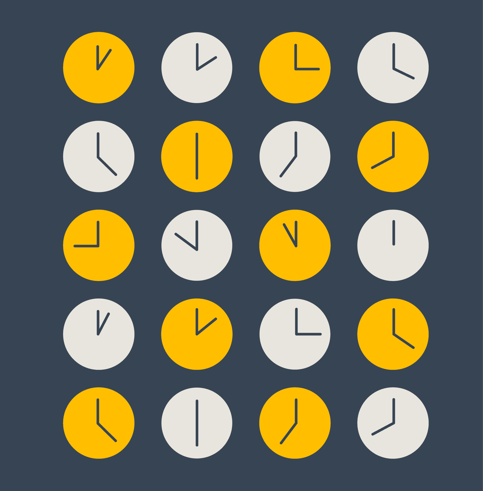

> #CM 比较有启发。比如「第五条 软件是达到目的的手段」，对于程序员来说，编码不是核心，为什么编码才是核心。本文不局限于程序员阅读，反之，我觉得特别适合产品、设计师或者老板读一下。

## Important, Read This First  

重要信息，请先阅读

You’re about to read a blog post with a _lot_ of advice. Learning from those who came before us is instrumental to success, but we often forget an important caveat.  

您将要阅读的是一篇包含大量建议的博文。向前辈学习是成功的关键，但我们往往忘记了一个重要的注意事项。  

Almost all advice is contextual, yet it is rarely delivered with any context.  

几乎所有的建议都是有背景的，但很少有建议是在有背景的情况下提出的。

“You just need to charge more!” says the company who has been in business for 20 years and spent years charging “too little” to gain customers and become successful.  

"你只需要多收点钱！"这家公司已经经营了 20 年，多年来一直以 "收费太低 "来赢得客户并取得成功。

“You need to build everything as microservices!” says the company who built a quick monolith, gained thousands of customers, and then pivoted into microservices as they started running into scaling issues.  

"你需要把所有东西都构建成微服务！"这家公司快速构建了一个单体，获得了成千上万的客户，然后在开始遇到扩展问题时转向了微服务。

Without understanding the context, the advice is meaningless, or even worse, harmful.  

不了解背景，建议就毫无意义，甚至有害。  

If those folks had followed their own advice early on, they themselves would likely have suffered from it. It is hard to escape this trap.  

如果这些人早早听从了自己的建议，他们自己很可能会因此而遭受损失。我们很难逃脱这个陷阱。  

We may be the culmination of our experiences, but we view them through the lens of the present.  

我们可能是我们经历的顶点，但我们通过现在的视角来看待它们。

So to give you a little context on where my advice comes from, I spent the first half of my career as a software engineer working for various small businesses and startups, then I went into consulting and worked in a number of really large businesses.  

我的职业生涯前半段是一名软件工程师，为各种小型企业和初创公司工作，后来我进入咨询行业，在许多大型企业工作过。  

Then I started Simple Thread and we grew from a team of 2 to a team of 25. 10 years ago we worked with mostly small/medium businesses, and now we work with a mix of big and small businesses.  

后来，我创办了 Simple Thread 公司，我们的团队从 2 人发展到 25 人。10 年前，我们的客户主要是中小型企业，而现在，我们的客户既有大型企业，也有小型企业。

My advice is from someone who…  

我的建议来自一位...

1.  has almost always been on small, lean teams where we have to do a lot with very little.  
    
    我几乎总是在小型、精干的团队中工作，在那里我们必须用很少的资源做很多的事情。
2.  values working software over specific tools.  
    
    重视工作软件而非特定工具。
3.  is starting new projects all the time, but also has to maintain a number of systems.  
    
    在不断启动新项目的同时，还必须维护许多系统。
4.  values engineer productivity over most other considerations  
    
    重视工程师的生产力，而不是其他大多数考虑因素

My experiences over the last 20 years have shaped how I view software, and have led me to some beliefs which I’ve tried to whittle down to a manageable list that I hope you find valuable.  

过去 20 年的经历塑造了我对软件的看法，并使我形成了一些信念，我试图将这些信念归纳为一份易于管理的清单，希望对你有所帮助。

## On with the list  

继续名单

### 1\. I still don’t know very much  

1.我仍然不太了解

“How can you not know what BGP is?” “You’ve never heard of Rust?” Most of us have heard these kinds of statements, probably too often.  

"你怎么会不知道BGP是什么？""你从来没听说过 Rust？"我们大多数人都听过这样的话，而且可能听得太多了。  

The reason many of us love software is because we are lifelong learners, and in software no matter which direction you look, there are wide vistas of knowledge going off in every direction and expanding by the day.  

我们中的许多人之所以热爱软件，是因为我们是终身学习者，而在软件领域，无论你朝哪个方向看，都能看到广阔的知识天地，而且知识面还在不断扩大。  

This means that you can spend decades in your career, and still have a huge knowledge gap compared to someone who has also spent decades in a seemingly similar role.  

这意味着，你可以在职业生涯中度过数十年，但与同样在看似相似的岗位上度过数十年的人相比，你仍然存在巨大的知识差距。  

The sooner you realize this, the sooner you can start to shed your imposter syndrome and instead delight in learning from and teaching others.  

你越早意识到这一点，就能越早开始摆脱冒名顶替综合症，转而乐于向他人学习并教导他人。

### 2\. The hardest part of software is building the right thing  

2.软件最难的部分是构建正确的东西

I know this is cliche at this point, but the reason most software engineers don’t believe it is because they think it devalues their work. Personally I think that is nonsense.  

我知道这已经是老生常谈了，但大多数软件工程师之所以不相信，是因为他们认为这贬低了他们的工作。我个人认为这是无稽之谈。  

Instead it highlights the complexity and irrationality of the environments in which we have to work, which compounds our challenges.  

相反，它凸显了我们工作环境的复杂性和不合理性，从而加剧了我们面临的挑战。  

You can design the most technically impressive thing in the world, and then have nobody want to use it. Happens all the time.  

你可以设计出世界上技术含量最高的东西，但却没有人愿意使用它。这种情况经常发生。  

Designing software is mostly a listening activity, and we often have to be part software engineer, part psychic, and part anthropologist.  

设计软件主要是一种倾听活动，我们常常需要兼具软件工程师、心理学家和人类学家的双重身份。  

Investing in this design process, whether through dedicated UX team members or by simply educating yourself, will deliver enormous dividends.  

无论是通过专门的用户体验团队成员，还是通过简单的自我教育，对这一设计流程的投入都将带来巨大的收益。  

Because how do you really calculate the cost of building the wrong software? It amounts to a lot more than just lost engineering time.  

因为你如何真正计算构建错误软件的成本？这不仅仅是工程时间的损失。

### 3\. The best software engineers think like designers  

3.最好的软件工程师像设计师一样思考

Great software engineers think deeply about the user experience of their code.  

优秀的软件工程师会深入思考代码的用户体验。  

They might not think about it in those terms, but whether it is an external API, programmatic API, user interface, protocol, or any other interface; great engineers consider who will be using it, why it will be used, how it will be used, and what is important to those users.  

他们可能不会从这些角度考虑问题，但无论是外部应用程序接口、编程式应用程序接口、用户界面、协议还是其他任何接口，优秀的工程师都会考虑谁会使用它、为什么会使用它、如何使用它，以及对这些用户来说什么是重要的。  

Keeping the user’s needs in mind is really the heart of good user experience.  

牢记用户需求是良好用户体验的核心。

### 4\. The best code is no code, or code you don’t have to maintain  

4.最好的代码就是没有代码，或者你不需要维护的代码

All I have to say is “coders gonna code.” You ask someone in any profession how to solve a problem, and they are going to err on the side of what they are good at.  

我只想说 "编码员要编码"。你问任何行业的人如何解决问题，他们都会偏向于自己擅长的领域。  

It is just human nature. Most software engineers are always going to err on the side of writing code, especially when a non-technical solution isn’t obvious.  

这只是人类的天性。大多数软件工程师总是倾向于编写代码，尤其是在非技术性解决方案不明显的情况下。  

The same goes for code you don’t have to maintain. Engineering teams are apt to want to reinvent the wheel, when lots of wheels already exist.  

无需维护的代码也是如此。工程团队很容易想要重新发明轮子，而很多轮子已经存在。  

This is a balancing act, there are lots of reasons to grow your own, but beware of toxic “Not Invented Here” syndrome.  

这是一种平衡行为，有很多理由让你自己种植，但要小心 "非本地发明 "综合症的毒性。

### 5\. Software is a means to an end  

5.软件是达到目的的手段

The primary job of any software engineer is delivering value. Very few software developers understand this, even fewer internalize it.  

任何软件工程师的首要工作都是提供价值。很少有软件开发人员能理解这一点，更少有人能将其内化于心。  

Truly internalizing this leads to a different way of solving problems, and a different way of viewing your tools.  

真正内化这一点，就能以不同的方式解决问题，以不同的方式看待你的工具。  

If you really believe that software is subservient to the outcome, you’ll be ready to really find “the right tool for the job” which might not be software at all.  

如果你真的相信软件服从于结果，你就会准备好真正找到 "适合工作的工具"，而这可能根本就不是软件。

### 6\. Sometimes you have to stop sharpening the saw, and just start cutting shit  

6.有时你不得不停止磨锯子，而是开始切割大便

Some people tend to jump into problems and just start writing code. Other people tend to want to research and research and get caught in analysis paralysis.  

有些人在遇到问题时往往会跃跃欲试，直接开始编写代码。另一些人则倾向于不断研究，陷入分析瘫痪。  

In those cases, set a deadline for yourself and just start exploring solutions.  

在这种情况下，为自己设定一个最后期限，然后开始探索解决方案。  

You’ll quickly learn more as you start solving the problem, and that will lead you to iterate into a better solution.  

当你开始解决问题时，你很快就会学到更多，这将引导你迭代出更好的解决方案。

### 7\. If you don’t have a good grasp of the universe of what’s possible, you can’t design a good system  

7.如果不能很好地把握宇宙的可能性，就无法设计出好的系统

This is something I struggle with a lot as my responsibilities take me further and further from the day to day of software engineering.  

这是我经常纠结的问题，因为我的职责让我离软件工程的日常工作越来越远。  

Keeping up with the developer ecosystem is a huge amount of work, but it is critical to understand what is possible.  

与开发者生态系统保持同步是一项艰巨的工作，但了解什么是可能的至关重要。  

If you don’t understand what is possible and what is available in a given ecosystem then you’ll find it impossible to design a reasonable solution to all but the most simple of problems. To summarize, be wary of people designing systems who haven’t written any code in a long time.  

如果您不了解特定生态系统中的可能性和可用性，那么除了最简单的问题外，您将无法设计出合理的解决方案。总而言之，要警惕那些很久没有写过代码的系统设计人员。

### 8\. Every system eventually sucks, get over it  

8.每个系统最终都是糟糕的，克服它吧

Bjarne Stroustrup has a quote that goes “There are only two kinds of languages: the ones people complain about and the ones nobody uses”.  

Bjarne Stroustrup 有一句名言："只有两种语言：人们抱怨的语言和没人使用的语言"。  

This can be extended to large systems as well.  

这也可以扩展到大型系统。  

There is no “right” architecture, you’ll never pay down all of your technical debt, you’ll never design the perfect interface, your tests will always be too slow.  

没有 "正确 "的架构，你永远无法还清所有的技术债务，你永远无法设计出完美的界面，你的测试总是太慢。  

This isn’t an excuse to never make things better, but instead a way to give you perspective.  

这并不是让你永远不把事情做得更好的借口，而是给你提供一种视角。  

Worry less about elegance and perfection; instead strive for continuous improvement and creating a livable system that your team enjoys working in and sustainably delivers value.  

减少对优雅和完美的担忧，转而致力于不断改进和创建一个宜居的系统，让您的团队乐于在其中工作，并可持续地创造价值。

### 9\. Nobody asks “why” enough  

9.没有人问 "为什么"。

Take any opportunity to question assumptions and approaches that are “the way things have always been done”. Have a new team member coming on board?  

抓住一切机会质疑 "一贯做法 "的假设和方法。有新的团队成员加入吗？  

Pay attention to where they get confused and what questions they ask. Have a new feature request that doesn’t make sense?  

注意他们感到困惑的地方和提出的问题。有不合理的新功能请求？  

Make sure you understand the goal and what is driving the desire for this functionality. If you don’t get a clear answer, keep asking why until you understand.  

确保您了解目标以及对该功能的渴望。如果没有得到明确的答案，就继续询问原因，直到弄明白为止。

### 10\. We should be far more focused on avoiding 0.1x programmers than finding 10x programmers  

10.与寻找 10 倍的程序员相比，我们更应该避免 0.1 倍的程序员。

[The 10x programmer is a silly myth.](https://www.simplethread.com/the-10x-programmer-myth/) The idea that someone can produce in 1 day what another competent, hard working, similarly experienced programmer can produce in 2 weeks is silly.  

10 倍程序员是一个愚蠢的神话。一个人一天就能完成另一个能干、勤奋、经验丰富的程序员两周才能完成的工作，这种想法是愚蠢的。  

I’ve seen programmers that sling 10x the amount of code, and then you have to fix it 10x the amount of times.  

我见过一些程序员，他们编写的代码量是你的 10 倍，而你却要修改 10 倍的代码。  

The only way someone can be a 10x programmer is if you compare them to 0.1x programmers.  

一个人成为 10 倍程序员的唯一途径，就是与 0.1 倍程序员进行比较。  

Someone who wastes time, doesn’t ask for feedback, doesn’t test their code, doesn’t consider edge cases, etc… We should be far more concerned with keeping 0.1x programmers off our teams than finding the mythical 10x programmer.  

一个浪费时间、不征求反馈意见、不测试代码、不考虑边缘情况等的人......比起寻找传说中的 10 倍程序员，我们更应该关注的是如何将 0.1 倍程序员挡在团队之外。

### 11\. One of the biggest differences between a senior engineer and a junior engineer is that they’ve formed opinions about the way things should be  

11.高级工程师和初级工程师之间最大的区别之一是，他们已经形成了对事情应该如何发展的看法。

Nothing worries me more than a senior engineer that has no opinion of their tools or how to approach building software.  

最让我担心的莫过于一个对自己的工具或构建软件的方法毫无见解的高级工程师。  

I’d rather someone give me opinions that I violently disagree with than for them to have no opinions at all.  

我宁愿别人给我的意见是我坚决不同意的，也不希望他们没有任何意见。  

If you are using your tools, and you don’t love or hate them in a myriad of ways, you need to experience more. You need to explore other languages, libraries, and paradigms. There are few ways of leveling up your skills faster than actively seeking out how others accomplish tasks with different tools and techniques than you do.  

如果你正在使用自己的工具，却对它们爱恨交加，那么你需要体验更多。你需要探索其他语言、库和范式。要想更快地提高技能水平，没有什么方法能比积极探索他人如何使用与自己不同的工具和技术来完成任务更有效了。

### 12\. People don’t really want innovation  

12.人们并不真正需要创新

People talk about innovation a whole lot, but what they are usually looking for is cheap wins and novelty.  

人们经常谈论创新，但他们通常追求的是廉价的胜利和新奇。  

If you truly innovate, and change the way that people have to do things, expect mostly negative feedback.  

如果你真正进行了创新，并改变了人们做事的方式，那么预期得到的大多是负面反馈。  

If you believe in what you’re doing, and know it will really improve things, then brace yourself for a long battle.  

如果你相信自己正在做的事情，并知道它确实能改善现状，那么就做好打持久战的准备吧。

### 13\. Your data is the most important part of your system  

13.数据是系统中最重要的部分

I’ve seen a lot of systems where hope was the primary mechanism of data integrity. In systems like this, anything that happens off the golden path creates partial or dirty data.  

我见过很多以希望为主要数据完整性机制的系统。在这样的系统中，任何偏离黄金路径的情况都会产生部分或不完整的数据。  

Dealing with this data in the future can become a nightmare. Just remember, your data will likely long outlive your codebase.  

将来处理这些数据可能会成为一场噩梦。请记住，您的数据很可能比您的代码库寿命更长。  

Spend energy keeping it orderly and clean, it’ll pay off well in the long run.  

花精力保持整洁有序，从长远来看会有很好的回报。

### 14\. Look for technological sharks  

14.寻找技术鲨鱼

Old technologies that have stuck around are [sharks, not dinosaurs](https://www.simplethread.com/relational-databases-arent-dinosaurs-theyre-sharks/). They solve problems so well that they have survived the rapid changes that occur constantly in the technology world.  

坚持下来的老技术是鲨鱼，而不是恐龙。它们能很好地解决问题，因此在技术世界日新月异的变化中得以幸存。  

Don’t bet against these technologies, and replace them only if you have a very good reason.  

不要对这些技术下注，只有在有充分理由的情况下才更换它们。  

These tools won’t be flashy, and they won’t be exciting, but they will get the job done without a lot of sleepless nights.  

这些工具并不华丽，也不令人兴奋，但它们可以完成工作，而无需夜不能寐。

### 15\. Don’t mistake humility for ignorance  

15.不要把谦虚误认为无知

There are a lot of software engineers out there who won’t express opinions unless asked.  

有很多软件工程师除非被问到，否则不会发表意见。  

Never assume that just because someone isn’t throwing their opinions in your face that they don’t have anything to add.  

不要因为别人没有在你面前发表意见，就认为他们没有什么可补充的。  

Sometimes the noisiest people are the ones we want to listen to the least. Talk to the people around you, seek their feedback and advice. You’ll be glad you did.  

有时，我们最不想听的人却是最聒噪的人。与周围的人交谈，寻求他们的反馈和建议。你会庆幸自己这样做了。

### 16\. Software engineers should write regularly  

16.软件工程师应定期写作

Software engineers should regularly blog, journal, write documentation and in general do anything that requires them to keep their written communication skills sharp.  

软件工程师应定期写博客、日志、撰写文档，以及做任何需要他们保持书面交流技巧的事情。  

Writing helps you think about your problems, and helps you communicate those more effectively with your team and your future self.  

写作可以帮助你思考问题，帮助你更有效地与团队和未来的自己沟通。  

Good written communication is one of the most important skills for any software engineer to master.  

良好的书面交流是软件工程师必须掌握的最重要技能之一。

### 17\. Keep your processes as lean as possible  

17.尽可能精简流程

Everyone wants to be agile these days, but being “agile” is about building things in small chunks, learning, and then iterating.  

如今，每个人都想变得敏捷，但 "敏捷 "是指以小块构建、学习，然后迭代。  

If someone is trying to shoehorn much more into it than that, then they’re [probably selling something](https://www.simplethread.com/agile-at-20-the-failed-rebellion/).  

如果有人想把比这更多的东西塞进去，那么他们很可能是在卖东西。  

It isn’t to say that people don’t need accountability or help to work this way, but how many times have you heard someone from your favorite tech company or large open source project brag about how great their Scrum process is?  

这并不是说人们不需要问责或帮助就能以这种方式工作，但你听过多少次你最喜欢的科技公司或大型开源项目的人吹嘘他们的Scrum流程有多棒？  

Stay lean on process until you know you need more. Trust your team and they will deliver.  

精益求精，直到你知道自己需要更多。相信你的团队，他们会做到的。

### 18\. Software engineers, like all humans, need to feel ownership  

18.软件工程师和其他人一样，需要有主人翁感

If you divorce someone from the output of their work, they will care less about their work. I see this almost as a tautology.  

如果你把一个人从他的工作成果中剥离出来，他就不会那么关心自己的工作。我认为这几乎是同义反复。  

This is the primary reason why cross-functional teams work so well, and why DevOps has become so popular.  

这就是跨职能团队能够如此有效运作的主要原因，也是 DevOps 如此流行的主要原因。  

It isn’t all about handoffs and inefficiencies, it is about owning the whole process from start to finish, and being directly responsible for delivering value.  

这并不全是交接和效率低下的问题，而是从头到尾拥有整个流程，并直接负责实现价值的问题。  

Give a group of passionate people complete [ownership over designing](https://www.simplethread.com/doerrs-law-on-product-teams/), building, and delivering a piece of software (or anything really) and amazing things will happen.  

让一群充满激情的人全权负责一个软件（或任何东西）的设计、构建和交付，就会有令人惊叹的事情发生。

### 19\. Interviews are almost worthless for telling how good of a team member someone will be  

19.面试对于判断一个人能否成为优秀的团队成员几乎毫无价值

Interviews are far better spent trying to understand who someone is, and how interested they are in a given field of expertise.  

面试的目的最好是了解一个人是谁，以及他对某个专业领域的兴趣有多大。  

Trying to suss out how good of a team member they will be is a fruitless endeavor.  

想知道他们能成为团队中的好成员是徒劳无功的。  

And believe me, how smart or knowledgable someone is is also not a good indicator that they will be a great team member.  

相信我，一个人有多聪明或知识有多渊博，也不能说明他就是一个优秀的团队成员。  

No one is going to tell you in an interview that they are going to be unreliable, abusive, pompous, or never show up to meetings on time.  

没有人会在面试时告诉你他们会不可靠、辱骂人、自大或从不准时参加会议。  

People might claim they have “signals” for these things… “if they ask about time off in the first interview then they are never going to be there!” But these are all bullshit.  

人们可能会说，他们对这些事情有 "信号"...... "如果他们在第一次面试时就问起休息时间，那么他们就不会去那里！"但这些都是胡说八道。  

If you’re using signals like these you’re just guessing and turning away good candidates.  

如果您使用这样的信号，您只是在猜测和拒绝优秀的候选人。

### 20\. Always strive to build a smaller system  

20.始终努力建设更小的系统

There are a lot of forces that will push you to build the bigger system up-front.  

有很多力量会促使你在前期建立更大的系统。  

Budget allocation, the inability to decide which features should be cut, the desire to deliver the “best version” of a system.  

预算分配、无法决定削减哪些功能、希望提供系统的 "最佳版本"。  

All of these things push us very forcefully towards building too much. You should [fight this](https://www.simplethread.com/where-does-complexity-go/). You learn so much as you’re building a system that you will end up iterating into a much better system than you ever could have designed in the first place.  

所有这些事情都在强烈地推动我们建造过多的建筑。你应该与之抗争。在构建系统的过程中，你会学到很多东西，最终你会迭代出一个比你当初设计的更好的系统。  

This is surprisingly a hard sell to most people.  

对大多数人来说，这竟然是一个难点。

## What is your story?  

你有什么故事？

So there you have it, 20 years of software distilled down into 20 pithy pieces of wisdom. I’d love to hear it if something resonated with you.  

就这样，20 年的软件经验浓缩成了 20 条精辟的智慧。如果您有共鸣，我很乐意倾听。  

I’d also love to hear if you have a piece of wisdom that you’ve picked up over your career that you’d like to share. Feel free to leave it down in the comments.  

如果您在职业生涯中汲取了什么智慧，我也很乐意与您分享。欢迎在评论中留言。

Loved the article? Hated it? Didn’t even read it?  

喜欢这篇文章？讨厌？甚至没读？

We’d love to hear from you.  

我们希望收到您的来信。

[Reach Out 走出去](https://www.simplethread.com/contact)
