> #CM 我自己不是很能看懂，需要借助资料；先保存下来，说不定后面熟悉了需要。

The single most undervalued fact of linear algebra: matrices are graphs, and graphs are matrices.  

线性代数中最被低估的一个事实：矩阵即图形，图形即矩阵。

[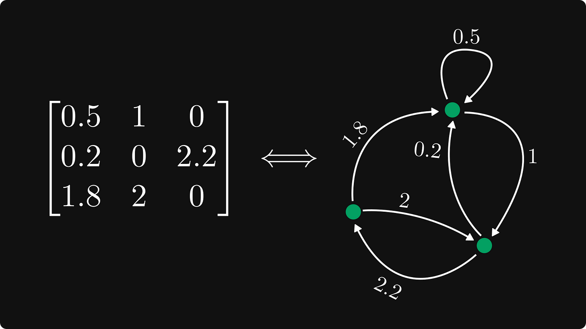](https://substackcdn.com/image/fetch/f_auto,q_auto:good,fl_progressive:steep/https%3A%2F%2Fsubstack-post-media.s3.amazonaws.com%2Fpublic%2Fimages%2F485ec4b4-6869-43bb-b17c-e2151a428dbe_1920x1080.png)

A (nonnegative) matrix and its graph  

非负）矩阵及其图形

Encoding matrices as graphs is a cheat code, making complex behavior simple to study.  

将矩阵编码为图形是一种 "作弊码"，可以让复杂的行为变得简单易学。

Let me show you how!  

让我来教你怎么做！

If you looked at the example above, you probably figured out the rule.  

如果你看了上面的例子，你可能就会明白其中的规则了。

Each row is a node, and each element represents a directed and weighted edge. Edges of zero elements are omitted. The element in the _i_\-th row and _j_\-th column corresponds to an edge going from _i_ to _j_.  

每一行是一个节点，每个元素代表一条有向加权边。元素为零的边省略。第 i 行和第 j 列中的元素对应一条从 i 到 j 的边。

The resulting graph is called _the directed graph_ (or _digraph_) _of the matrix._  

得到的图称为矩阵的有向图（或数字图）。

To unwrap the definition a bit, let's check the first row, which corresponds to the edges outgoing from the first node.  

为了解开这个定义，让我们检查一下第一行，它对应于从第一个节点流出的边。

[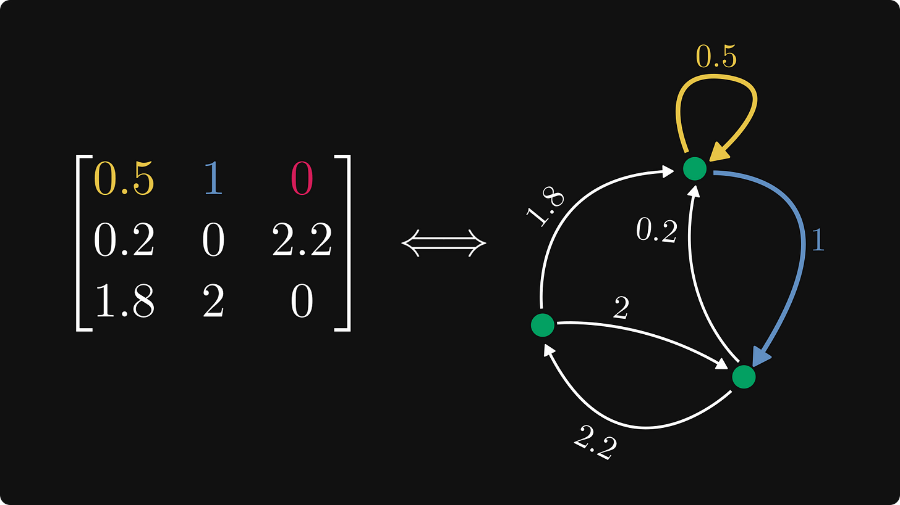](https://substackcdn.com/image/fetch/f_auto,q_auto:good,fl_progressive:steep/https%3A%2F%2Fsubstack-post-media.s3.amazonaws.com%2Fpublic%2Fimages%2Fca509380-4560-4a3b-af33-32aa5b354caa_1920x1080.png)

The first row corresponds to the edges outgoing from the first node  

第一行对应从第一个节点流出的边

Similarly, the first column corresponds to the edges incoming to the first node.  

同样，第一列对应的是进入第一个节点的边。

[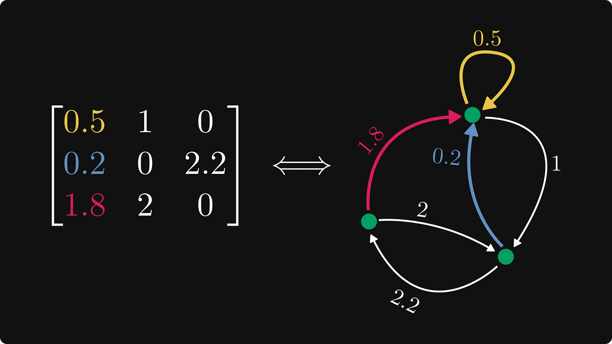](https://substackcdn.com/image/fetch/f_auto,q_auto:good,fl_progressive:steep/https%3A%2F%2Fsubstack-post-media.s3.amazonaws.com%2Fpublic%2Fimages%2F51590d4d-b767-4744-be6c-488771241c0f_1920x1080.png)

The first column corresponds to the edges incoming to the first node  

第一列对应传入第一个节点的边

Here is the full picture, with the nodes explicitly labeled.  

下面是完整的图片，节点已明确标注。

[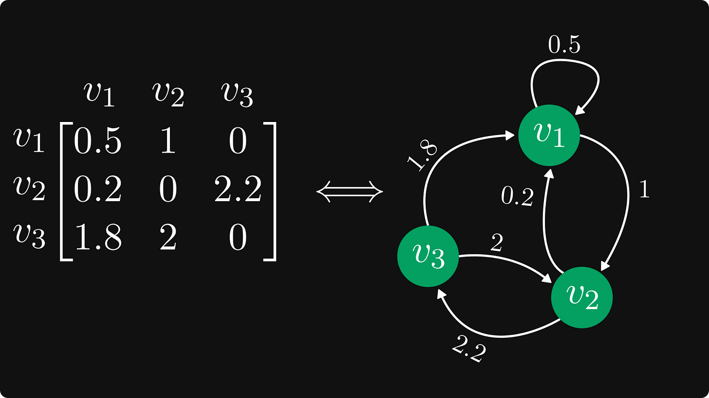](https://substackcdn.com/image/fetch/f_auto,q_auto:good,fl_progressive:steep/https%3A%2F%2Fsubstack-post-media.s3.amazonaws.com%2Fpublic%2Fimages%2F863a3c70-91cd-4ab3-b8bb-a0bb4336876e_1920x1080.png)

Why is the directed graph representation beneficial for us?  

为什么有向图表示法对我们有益？

For one, the powers of the matrix correspond to walks in the graph.  

首先，矩阵的幂对应于图形中的行走。

Take a look at the elements of the square matrix. All possible 2-step walks are accounted for in the sum defining the elements of A².  

看看方阵的元素。定义 A² 元素的总和包含了所有可能的两步行走。

[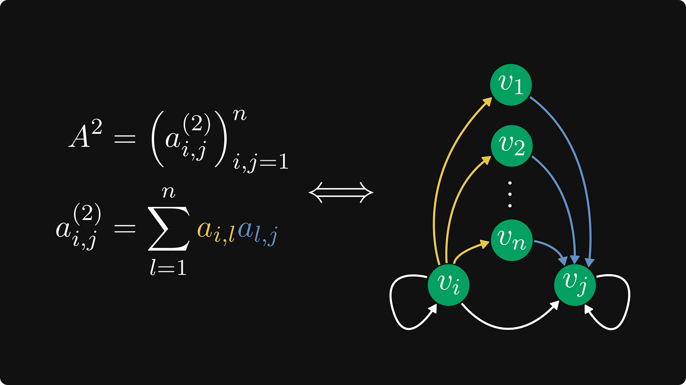](https://substackcdn.com/image/fetch/f_auto,q_auto:good,fl_progressive:steep/https%3A%2F%2Fsubstack-post-media.s3.amazonaws.com%2Fpublic%2Fimages%2F7e2865bf-b66d-4231-a4c3-ac7dad59e259_1920x1080.png)

Powers of the matrix describe walks on its directed graph  

矩阵的幂描述了在其有向图上的行走

If the directed graph represents the states of a Markov chain, the square of its transition probability matrix essentially shows the probability of the chain having some state after two steps.  

如果有向图表示马尔科夫链的状态，那么其过渡概率矩阵的平方基本上就表示了该链在两步之后处于某种状态的概率。

There is much more to this connection.  

这种联系还有很多。

For instance, it gives us a deep insight into the structure of nonnegative matrices.  

例如，它能让我们深入了解非负矩阵的结构。

To see what graphs show about matrices, let's talk about the concept of strongly connected components.  

为了了解图形对矩阵的影响，让我们来谈谈强连接成分的概念。

A directed graph is strongly connected if every node can be reached from every other node.  

如果每个节点都可以从其他节点到达，那么有向图就是强连接的。

If this is not true, the graph is not strongly connected.  

如果不是这样，则该图不是强连接的。

Below, you can see an example of both.  

下面，您可以看到两者的示例。

[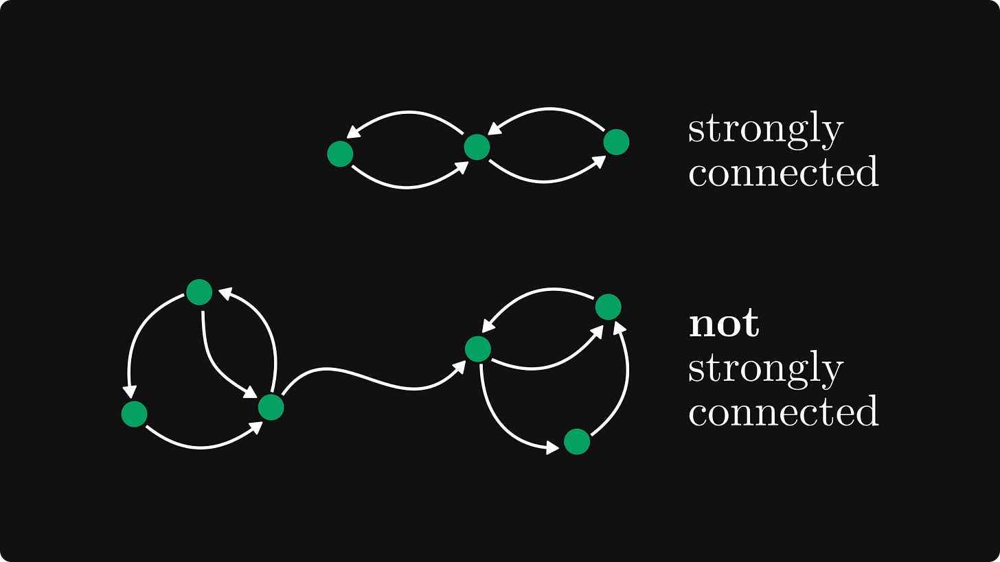](https://substackcdn.com/image/fetch/f_auto,q_auto:good,fl_progressive:steep/https%3A%2F%2Fsubstack-post-media.s3.amazonaws.com%2Fpublic%2Fimages%2Feb16cf74-eef0-4770-9ae9-c31309e310aa_1920x1080.png)

Strongly connectedness 紧密联系

Matrices that correspond to strongly connected graphs are called irreducible. All other nonnegative matrices are called reducible. Soon, we'll see why.  

与强连接图形相对应的矩阵称为不可还原矩阵。所有其他非负矩阵都称为可还原矩阵。很快，我们就会知道为什么。

(For simplicity, I assumed each edge to have a unit weight, but each weight can be an arbitrary nonnegative number.)  

(为简单起见，我假设每条边都有一个单位权重，但每个权重可以是任意的非负数）。

[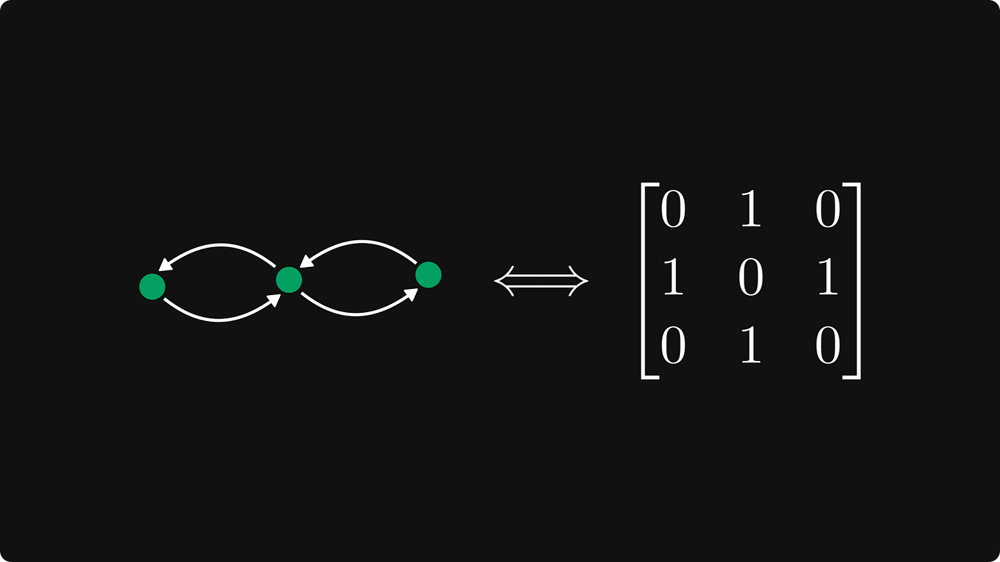](https://substackcdn.com/image/fetch/f_auto,q_auto:good,fl_progressive:steep/https%3A%2F%2Fsubstack-post-media.s3.amazonaws.com%2Fpublic%2Fimages%2Fa505eb53-7e3c-4f5a-b612-68d8e96d7567_1920x1080.png)

Strongly connected digraphs and  

强连接数图和

Back to the general case!  

回到一般情况！

Even though not all directed graphs are strongly connected, we can partition the nodes into strongly connected components.  

即使并非所有有向图都是强连接的，我们也可以将节点划分为强连接的部分。

[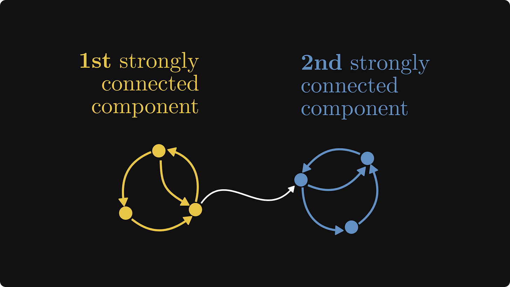](https://substackcdn.com/image/fetch/f_auto,q_auto:good,fl_progressive:steep/https%3A%2F%2Fsubstack-post-media.s3.amazonaws.com%2Fpublic%2Fimages%2F48d7eea9-9e86-4357-8f2e-4c498629bcf5_1920x1080.png)

Strongly connected components  

强连接组件

Let's label the nodes of this graph and construct the corresponding matrix!  

让我们标出该图的节点，并构建相应的矩阵！

[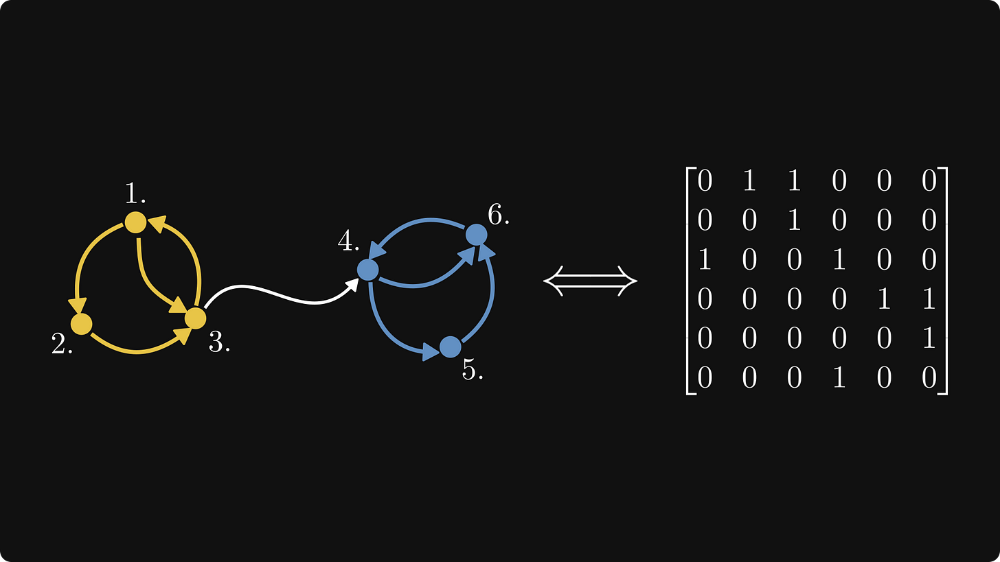](https://substackcdn.com/image/fetch/f_auto,q_auto:good,fl_progressive:steep/https%3A%2F%2Fsubstack-post-media.s3.amazonaws.com%2Fpublic%2Fimages%2Faec83a8c-ad93-4c98-a119-81b82e6265d7_1920x1080.png)

(For simplicity, assume that all edges have unit weight.) Do you notice a pattern?  

(为简单起见，假设所有边的权重都是单位。

The corresponding matrix of our graph can be reduced to a simpler form!  

我们图形的相应矩阵可以简化为更简单的形式！

[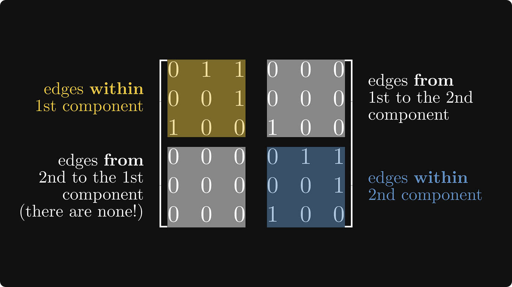](https://substackcdn.com/image/fetch/f_auto,q_auto:good,fl_progressive:steep/https%3A%2F%2Fsubstack-post-media.s3.amazonaws.com%2Fpublic%2Fimages%2F1b52f2f5-8a40-4c71-a0f3-253a9513e625_1920x1080.png)

Its diagonal comprises blocks whose graphs are strongly connected. (That is, the blocks are irreducible.) Furthermore, the block below the diagonal is zero.  

它的对角线由图形强连接的图块组成（即图块是不可还原的）。(此外，对角线以下的图块为零。

Is this true for all nonnegative matrices?  

所有非负矩阵都是这样吗？

You bet. Enter the Frobenius normal form.  

没错进入弗罗贝尼斯正则表达式。

In general, this block-matrix structure that we have just seen is called the Frobenius normal form.  

一般来说，我们刚才看到的这种块矩阵结构被称为弗罗贝尼斯正则表达式。

[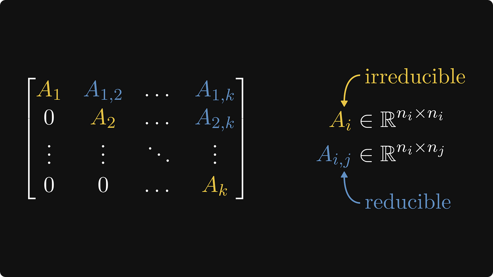](https://substackcdn.com/image/fetch/f_auto,q_auto:good,fl_progressive:steep/https%3A%2F%2Fsubstack-post-media.s3.amazonaws.com%2Fpublic%2Fimages%2F8ec6efcf-1f79-4fdd-94a3-fcd69b5ed54b_1920x1080.png)

The Frobenius normal form  

弗罗贝尼斯正则表达式

If you have a sharp eye with a hint of OCD, you probably noticed that I switched up the colors a bit. From now on, irreducible blocks (a.k.a.  

如果你有一双锐利的眼睛和一丝强迫症，你可能会注意到我稍微改变了一下颜色。从现在开始，不可还原图块（又名  

matrices that correspond to strongly connected graphs) will be colored maize, while reducible ones will be light blue.  

与强连接图形相对应的矩阵）将被染成玉米色，而可还原矩阵将被染成浅蓝色。

Let's reverse the question: can we transform an arbitrary nonnegative matrix into the Frobenius normal form?  

让我们反过来问：我们能否将任意非负矩阵转化为弗罗贝尼斯正则表达式？

Yes, and with the help of directed graphs, this is much easier to show than purely using algebra.  

是的，在有向图的帮助下，这比单纯使用代数要容易得多。

Here is the famous theorem in full form.  

下面是这个著名定理的全文。

[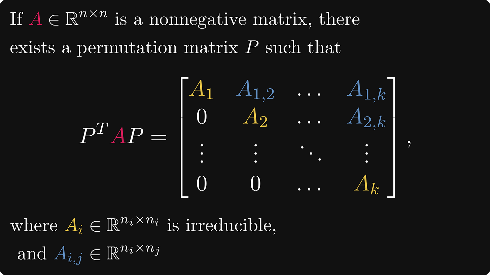](https://substackcdn.com/image/fetch/f_auto,q_auto:good,fl_progressive:steep/https%3A%2F%2Fsubstack-post-media.s3.amazonaws.com%2Fpublic%2Fimages%2F497133e9-7231-4869-b7a5-1c6db71ef8f0_1920x1080.png)

But what are permutation matrices?  

但什么是置换矩阵呢？

Let’s look at a special case: what happens if we multiply a _2 x 2_ matrix with  

让我们来看一个特例：如果我们将 2 x 2 矩阵与

[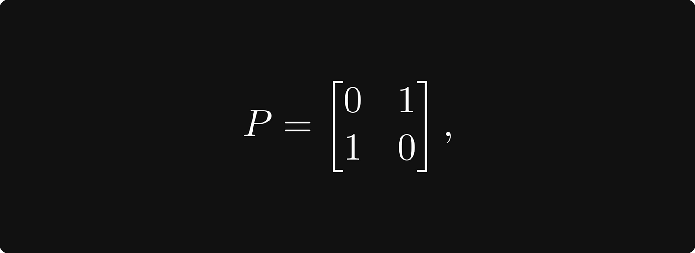](https://substackcdn.com/image/fetch/f_auto,q_auto:good,fl_progressive:steep/https%3A%2F%2Fsubstack-post-media.s3.amazonaws.com%2Fpublic%2Fimages%2F1bbc7da0-c56c-40ec-82f1-c4b69dd8d02d_1920x700.png)

a simple zero-one matrix? With a quick calculation, you can verify that  

一个简单的零一矩阵？通过快速计算，您可以验证

1.  it switches the _rows_ when multiplied from the left,  
    
    当从左边开始相乘时，它会切换行、
    
2.  and it switches the _columns_ when multiplied from the right.  
    
    并且从右边开始相乘时会切换列。
    

Just like this: 就像这样

[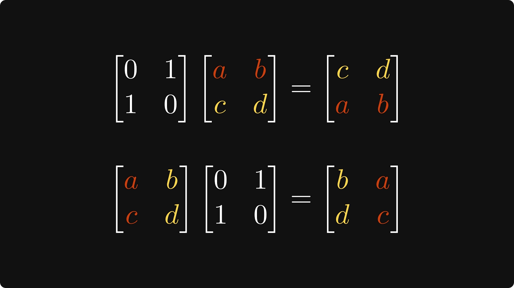](https://substackcdn.com/image/fetch/f_auto,q_auto:good,fl_progressive:steep/https%3A%2F%2Fsubstack-post-media.s3.amazonaws.com%2Fpublic%2Fimages%2Fda2e85da-26b6-4758-97c3-fb101ffd3e5f_1920x1080.png)

Multiplying with _P_ from both left and right compounds the effects: it switches rows and columns.  

从左右两边与 P 相乘，效果更佳：行列互换。

[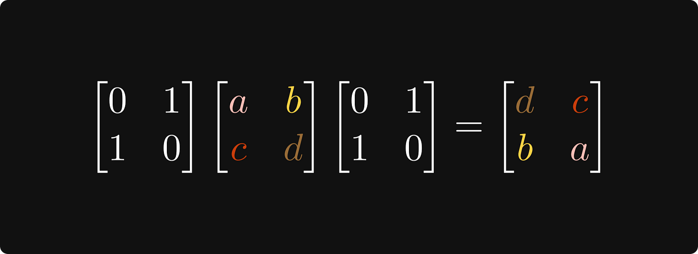](https://substackcdn.com/image/fetch/f_auto,q_auto:good,fl_progressive:steep/https%3A%2F%2Fsubstack-post-media.s3.amazonaws.com%2Fpublic%2Fimages%2F514daaef-77ad-499e-aa72-c1ed8deebd8b_1920x700.png)

(By the way, this is a similarity transformation, as our special zero-one matrix is its own inverse. This is not an accident; more about it later.)  

(顺便说一句，这是一种相似性变换，因为我们的特殊零一矩阵就是它的逆矩阵。这并非偶然，稍后再详述）。

Why are we looking at this? Because behind the scenes, this transformation doesn’t change the underlying graph structure, just relabels its nodes!  

我们为什么要看这个？因为在幕后，这种转换并没有改变底层图结构，只是重新标记了节点！

You can easily verify this by hand, but I visualized it for you below.  

您可以很容易地手动验证这一点，但我还是在下面为您做了可视化演示。

[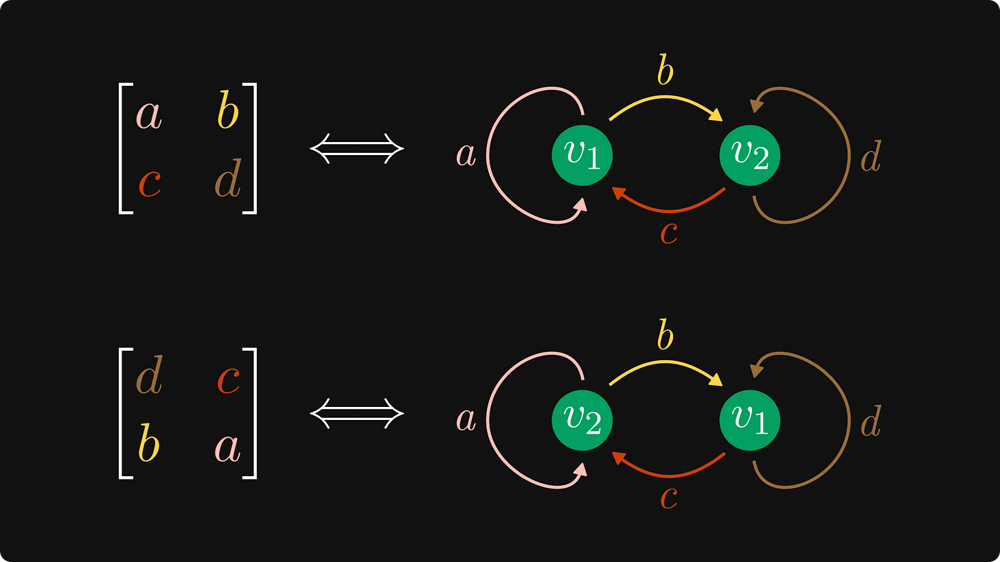](https://substackcdn.com/image/fetch/f_auto,q_auto:good,fl_progressive:steep/https%3A%2F%2Fsubstack-post-media.s3.amazonaws.com%2Fpublic%2Fimages%2F8c30ce87-490e-4b74-9b57-624dd9f1bb8f_1920x1080.png)

A similar phenomenon is true in the general _n x n_ case. Here, we define the so-called transposition matrices by switching the _i_\-th and _j_\-th rows of the identity matrix:  

在一般的 n x n 情况下也有类似的现象。在这里，我们通过调换标识矩阵的 i 行和 j 行来定义所谓的转置矩阵：

[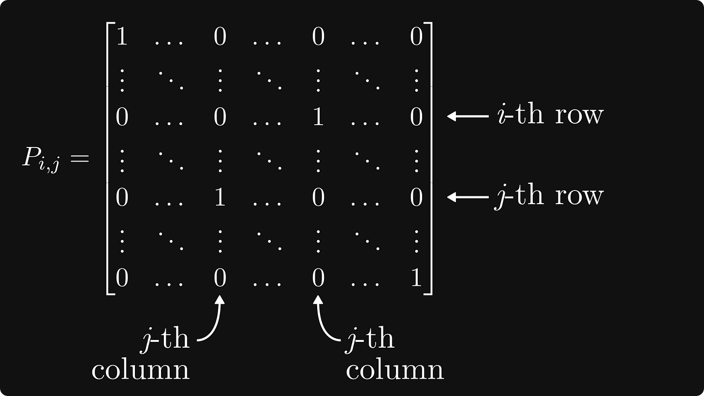](https://substackcdn.com/image/fetch/f_auto,q_auto:good,fl_progressive:steep/https%3A%2F%2Fsubstack-post-media.s3.amazonaws.com%2Fpublic%2Fimages%2F35090c32-b7d4-47aa-97c1-dd38ab8c9eef_1920x1080.png)

Multiplication with a transposition matrix has the same effect: switches rows from the left, and switches columns from the right.  

与转置矩阵相乘具有相同的效果：从左边切换行，从右边切换列。

We are not going to spell it out in detail (as the overcomplicated notation makes it especially painful), but you can verify by hand that this is indeed what’s going on.  

我们不打算详细说明（因为过于复杂的符号会让人特别痛苦），但你可以用手来验证这确实是发生了什么。

Here is a brief summary. Take note of these, as they’ll be essential in a bit.  

以下是简要概述。请注意这些内容，因为它们稍后会变得非常重要。

[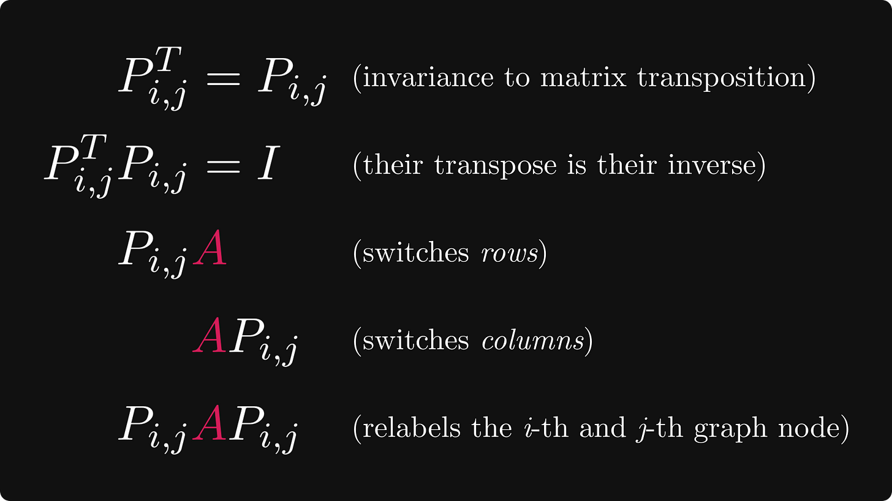](https://substackcdn.com/image/fetch/f_auto,q_auto:good,fl_progressive:steep/https%3A%2F%2Fsubstack-post-media.s3.amazonaws.com%2Fpublic%2Fimages%2Fe720646d-9f04-46c5-b55f-ddf5880529d5_1920x1080.png)

Properties of transposition matrices  

转置矩阵的性质

The most important property for us: similarity transformations with transposition matrices just relabel two nodes, but otherwise leave the graph structure invariant.  

对我们来说，最重要的特性是：使用转置矩阵的相似性变换只是对两个节点重新标注，除此之外，图的结构保持不变。

Now, about the aforementioned permutation matrices. A _permutation matrix_ is simply a product of transposition matrices.  

现在来谈谈前面提到的置换矩阵。置换矩阵只是转置矩阵的乘积。

[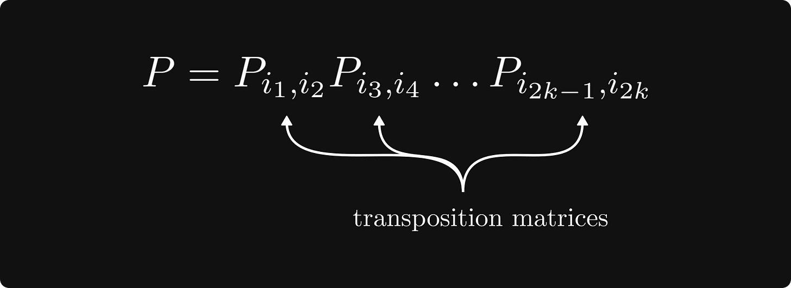](https://substackcdn.com/image/fetch/f_auto,q_auto:good,fl_progressive:steep/https%3A%2F%2Fsubstack-post-media.s3.amazonaws.com%2Fpublic%2Fimages%2F00dd24c5-fdd0-4955-ad1e-19e1ad14700f_1920x700.png)

Permutation matrices inherit some properties from their building blocks. Most importantly,  

置换矩阵继承了其构件的一些特性。最重要的是

1.  their inverse is their transpose,  
    
    它们的逆就是它们的转置、
    
2.  and a similarity transformation with them is just a relabeling of nodes that leave the graph structure invariant.  
    
    而对它们进行相似性转换，只是对节点进行重新标注，使图结构保持不变。
    

To see this latter one, consider the following argument below.  

要了解后一种情况，请看下面的论证。

[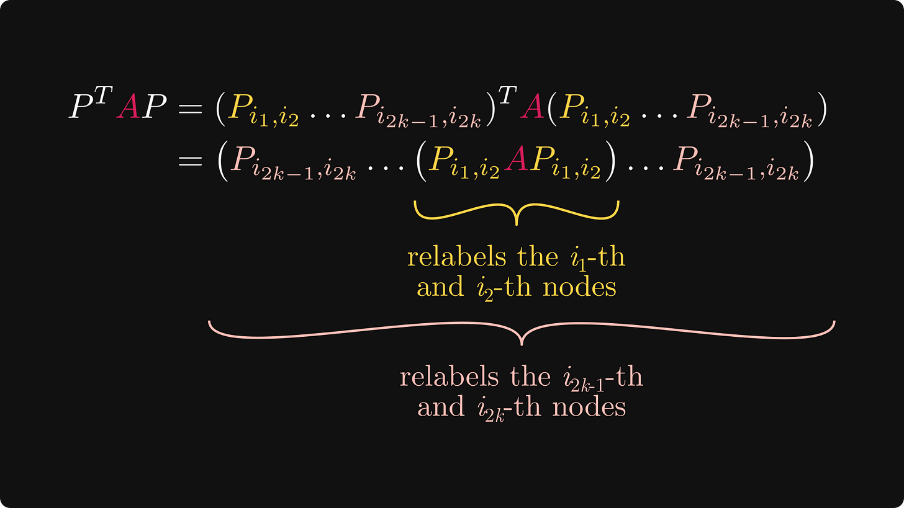](https://substackcdn.com/image/fetch/f_auto,q_auto:good,fl_progressive:steep/https%3A%2F%2Fsubstack-post-media.s3.amazonaws.com%2Fpublic%2Fimages%2F8a6694b1-79d8-44e2-b7dd-f81e8f4cdaf5_1920x1080.png)

(Recall that transposing a matrix product switches up the order, and transposition matrices are their own transposes.)  

(回想一下，矩阵乘积的转置会调换顺序，而转置矩阵就是它们自己的转置）。

Conversely, every node relabeling is equivalent to a similarity transformation with a well-constructed permutation matrix.  

反过来说，每个节点的重新标注都等同于一个具有构造良好的置换矩阵的相似性变换。

Why are we talking about this? Because the proper labeling of nodes is key to the Frobenius normal form.  

我们为什么要讨论这个问题？因为节点的正确标注是弗罗贝尼斯正则表达式的关键。

Now, let’s talk about graphs. We’ll see how _every_ digraph decomposes into strongly connected components. For that, let’s see a concrete one.  

现在，让我们来谈谈图。我们将看到每个数图是如何分解成强连接成分的。为此，让我们来看一个具体的例子。

[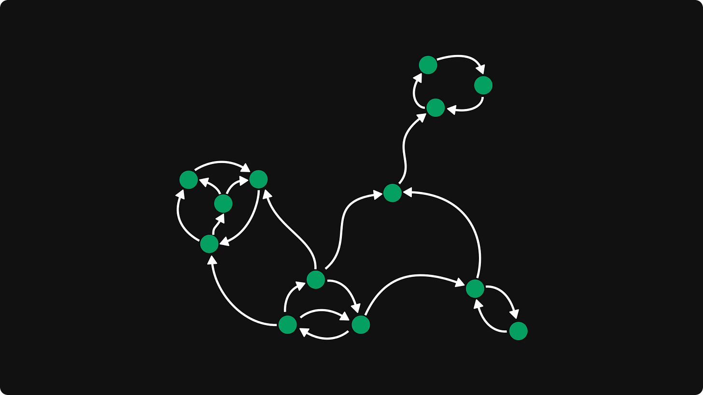](https://substackcdn.com/image/fetch/f_auto,q_auto:good,fl_progressive:steep/https%3A%2F%2Fsubstack-post-media.s3.amazonaws.com%2Fpublic%2Fimages%2Fd6e15334-a3e9-487e-a3c2-dd46b2f530d2_1920x1080.png)

This’ll be our textbook example.  

这将是我们的教科书范例。

How many nodes can be reached from a given node? Not necessarily all. Say, for the one at the bottom right, only a portion of the graph is accessible.  

从某个节点可以到达多少个节点？不一定是全部。比方说，右下角的节点只能到达图的一部分。

[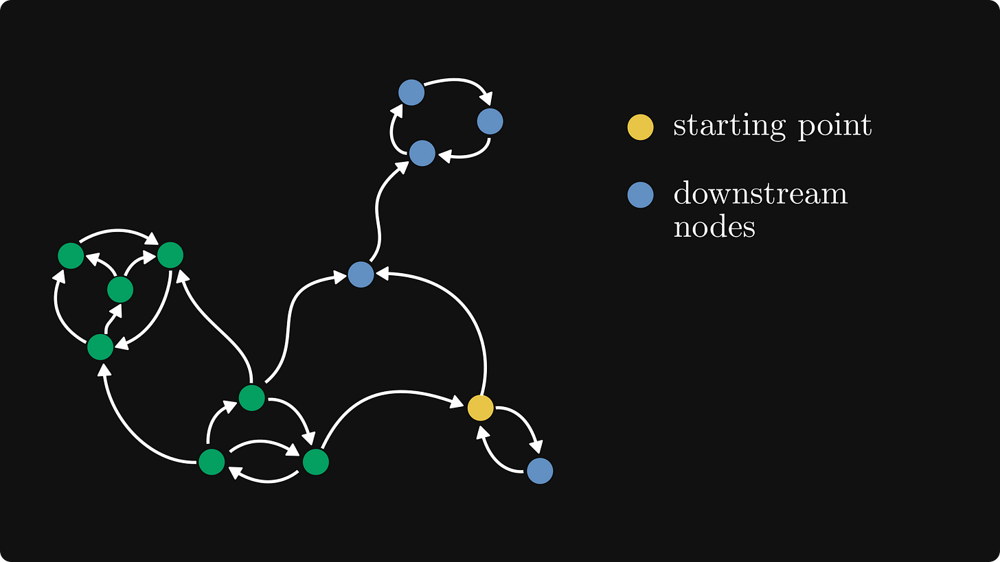](https://substackcdn.com/image/fetch/f_auto,q_auto:good,fl_progressive:steep/https%3A%2F%2Fsubstack-post-media.s3.amazonaws.com%2Fpublic%2Fimages%2F59f09d4e-81f1-4ecf-8b27-b396ddfbc5f3_1920x1080.png)

However, the set of mutually reachable nodes is much smaller.  

然而，可相互到达的节点集要小得多。

[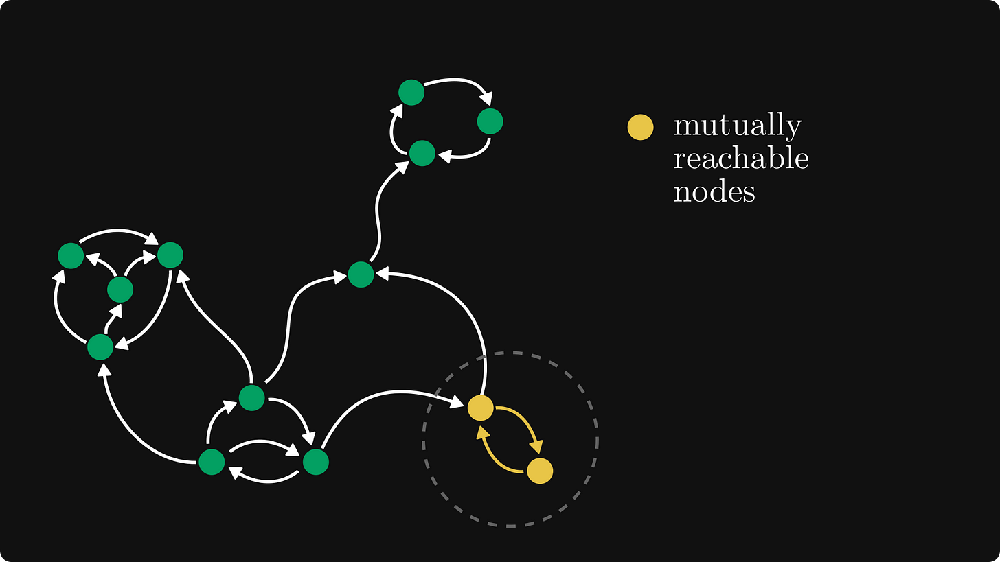](https://substackcdn.com/image/fetch/f_auto,q_auto:good,fl_progressive:steep/https%3A%2F%2Fsubstack-post-media.s3.amazonaws.com%2Fpublic%2Fimages%2F27748a78-c498-4387-b3dd-6035fe78f4ea_1920x1080.png)

Algebraically speaking, the relation _“a and b are mutually reachable from each other“_ is an equivalence relation. In other words, it partitions the set of nodes into disjoint subsets such that  

从代数学上讲，"a 和 b 之间相互可达 "是一种等价关系。换句话说，它将节点集划分为不相交的子集，即

1.  two nodes from the same subset are mutually reachable from each other,  
    
    来自同一子集的两个节点可以相互到达、
    
2.  and two nodes from different subsets are _not_ mutually reachable.  
    
    且来自不同子集的两个节点互不可达。
    

(Equivalence relations are the workhorses of mathematics. If you are not familiar with them, check out [this Wikipedia article about partitions](https://en.wikipedia.org/wiki/Partition_of_a_set#Partitions_and_equivalence_relations) to see how they relate.)  

(等价关系是数学的主力军。如果您不熟悉等价关系，可以查看维基百科上这篇关于分部的文章，了解它们之间的关系）。

The subsets of this partition are called the _strongly connected components_, and we can always decompose a directed graph in this way.  

该分区的子集称为强连接成分，我们总是可以用这种方法分解有向图。

[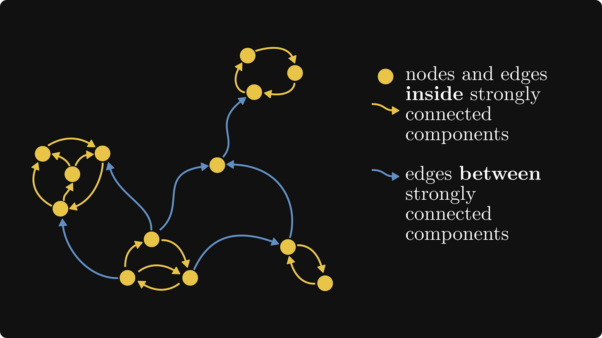](https://substackcdn.com/image/fetch/f_auto,q_auto:good,fl_progressive:steep/https%3A%2F%2Fsubstack-post-media.s3.amazonaws.com%2Fpublic%2Fimages%2Fc6fd6e5c-bb65-4180-b359-e1e423ffa82a_1920x1080.png)

Now, let’s connect everything together! (Not in a graph way, but you know, in a wholesome mathematical way.)  

现在，让我们把所有东西连接起来！(不是用图形的方式，而是用健康的数学方式）。

We are two steps away from proving that every nonnegative square matrix can be transformed into Frobenius normal form with a permutation matrix.  

我们只差两步就能证明，每一个非负平方矩阵都可以用一个置换矩阵变换成弗罗贝尼斯正态形式。

Here is the plan. 计划是这样的

1.  Construct the graph for our nonnegative matrix.  
    
    为我们的非负矩阵构建图形。
    
2.  Find the strongly connected components.  
    
    找出强连接部分。
    
3.  Relabel the nodes in a clever way.  
    
    巧妙地重新标注节点。
    

And that’s it! Why? Because, as we have seen, relabeling is the same as a similarity transform with a permutation matrix.  

就是这样！为什么？因为，正如我们已经看到的，重新标注与带有置换矩阵的相似性变换是一样的。

There’s just one tiny snag: what is the clever way? I’ll show you.  

只有一个小小的障碍：什么是巧妙的方法？我来告诉你。

First, we “skeletonize” the graph: merge the components together, as well as any edges between them.  

首先，我们对图形进行 "骨架化 "处理：将各组成部分以及它们之间的任何边合并在一起。  

Consider each component as a black box: we don’t care what’s inside, only about their external connections.  

将每个组件视为一个黑盒子：我们不关心里面有什么，只关心它们的外部连接。

[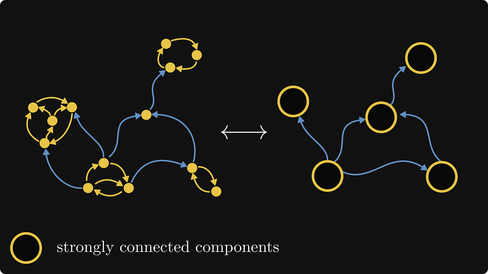](https://substackcdn.com/image/fetch/f_auto,q_auto:good,fl_progressive:steep/https%3A%2F%2Fsubstack-post-media.s3.amazonaws.com%2Fpublic%2Fimages%2Fd4c514c7-6cae-4933-879d-8f08e4a20a5b_1920x1080.png)

In this skeleton, we can find that components that cannot be entered from another components. These will be our starting points, the zeroth-class components.  

在这个骨架中，我们可以找到无法从其他组件进入的组件。这些组件就是我们的起点，也就是零类组件。  

In our example, we only have one.  

在我们的例子中，我们只有一个。

[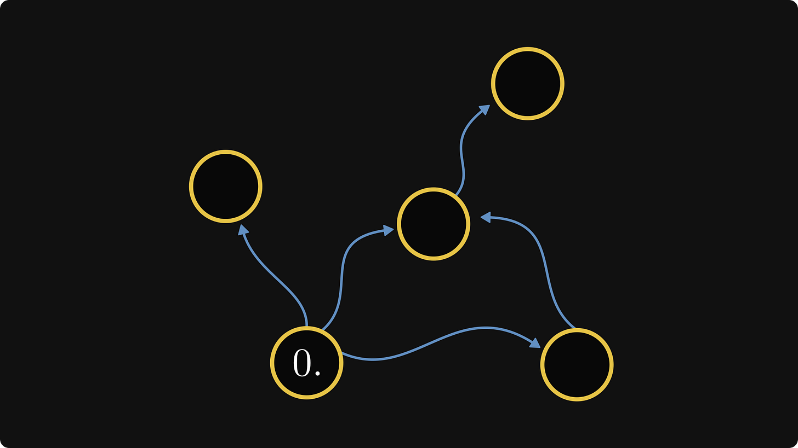](https://substackcdn.com/image/fetch/f_auto,q_auto:good,fl_progressive:steep/https%3A%2F%2Fsubstack-post-media.s3.amazonaws.com%2Fpublic%2Fimages%2Fc5eeb894-124d-4607-82f8-3d6f2f1c75e3_1920x1080.png)

Now, things get a bit tricky. We number each component by the longest path from the farthest zero-class component from which it can be reached.  

现在，事情变得有点棘手了。我们按照从最远的零级组件出发的最长路径对每个组件进行编号。

This is hard to even read, let alone to understand. So, here is what’s happening.  

这连读起来都很困难，更不用说理解了。所以，事情是这样的

[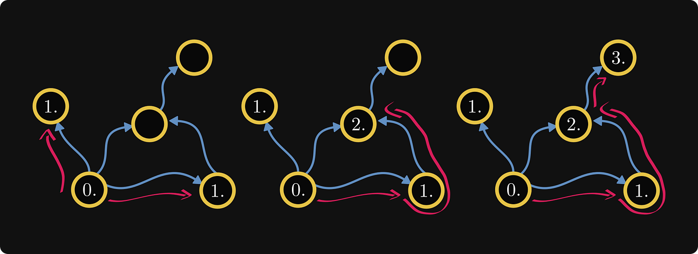](https://substackcdn.com/image/fetch/f_auto,q_auto:good,fl_progressive:steep/https%3A%2F%2Fsubstack-post-media.s3.amazonaws.com%2Fpublic%2Fimages%2F58c9bc48-a037-4a37-b450-fb31e3194094_1920x700.png)

The gist is that if you can reach an _m_\-th-class from an _n_\-th-class, then _n < m_.  

其要点是，如果能从第 n 个班级到达第 m 个班级，那么 n < m。

In the end, we have the following.  

最后，我们得出以下结论。

[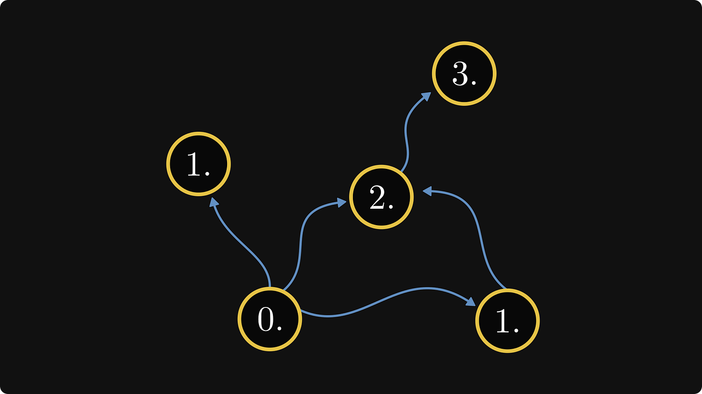](https://substackcdn.com/image/fetch/f_auto,q_auto:good,fl_progressive:steep/https%3A%2F%2Fsubstack-post-media.s3.amazonaws.com%2Fpublic%2Fimages%2Ff9d3ca4b-2851-4de3-88c3-c73e09429a72_1920x1080.png)

Numbering of the classes 班级编号

This defines an ordering on the components. (A [partial ordering](https://en.wikipedia.org/wiki/Partially_ordered_set), if you would like to be precise.)  

这就定义了组件的排序。(准确地说，是部分排序）。

Now, we label the nodes inside such that  

现在，我们给里面的节点贴上标签，这样

-   higher-order classes come first,  
    
    高阶类优先、
    
-   and consecutive indices are labeling nodes from the same component if possible.  
    
    如果可能，连续的索引都是来自同一组件的标注节点。
    

This is how it goes.  

事情是这样的

[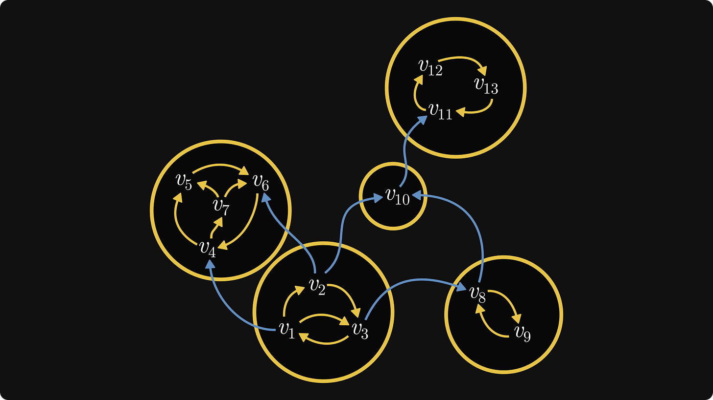](https://substackcdn.com/image/fetch/f_auto,q_auto:good,fl_progressive:steep/https%3A%2F%2Fsubstack-post-media.s3.amazonaws.com%2Fpublic%2Fimages%2F92bac5d1-bbe7-48e9-802c-f03b5ea3c2b3_1920x1080.png)

That ominous clever node labeling  

那个不祥的聪明节点标签

If the graph itself is coming from an actual matrix, such a relabeling yields the Frobenius normal form!  

如果图形本身来自一个实际的矩阵，这种重新标注会产生弗罗贝尼斯正则表达式！

Here is the matrix in this particular example, with zeros and ones for simplicity:  

下面是这个特定例子中的矩阵，为简化起见，矩阵中只有 0 和 1：

[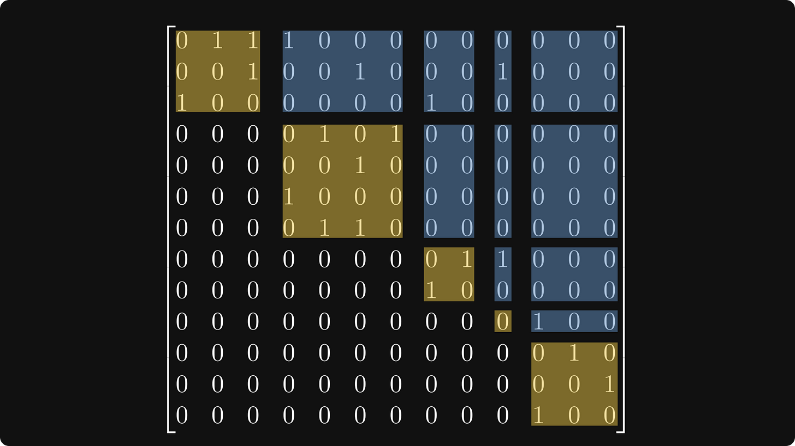](https://substackcdn.com/image/fetch/f_auto,q_auto:good,fl_progressive:steep/https%3A%2F%2Fsubstack-post-media.s3.amazonaws.com%2Fpublic%2Fimages%2Ff23786bf-7cb8-49dd-988c-5773b1194c33_1920x1080.png)

The adjacency matrix of our cleverly labeled graph  

我们巧妙标注的图的邻接矩阵

Now we have everything, and the “proof” behind the transformation to Frobenius normal form is complete!  

现在，我们拥有了一切，弗罗贝尼斯正则表达式变换背后的 "证明 "也就完成了！

To remind you, this is the theorem in its full form:  

为了提醒大家，这是定理的完整形式：

What we have seen is just the tip of the iceberg. For example, with the help of matrices, we can define the eigenvalues of graphs!  

我们所看到的只是冰山一角。例如，借助矩阵，我们可以定义图形的特征值！  

This idea gave birth to the fascinating topic of spectral graph theory, a beautiful field of mathematics.  

这一想法催生了引人入胜的谱图论这一美丽的数学领域。

Utilizing the relation between matrices and graphs has been extremely profitable for both graph theory and linear algebra.  

利用矩阵和图形之间的关系对图形理论和线性代数都大有裨益。

If you are interested in the details, I have two books to recommend to you. One is the fantastic [A Combinatorial Approach to Matrix Theory and Its Applications](https://www.taylorfrancis.com/books/mono/10.1201/9781420082241/combinatorial-approach-matrix-theory-applications-richard-brualdi-dragos-cvetkovic) by Richard A. Brualdi and Dragos Cvetkovic, my favorite learning resource on the topic.  

如果你对细节感兴趣，我有两本书推荐给你。一本是 Richard A. Brualdi 和 Dragos Cvetkovic 合著的《矩阵理论及其应用的组合方法》（A Combinatorial Approach to Matrix Theory and Its Applications），这是我最喜欢的相关学习资料。

Second, I recently finished writing my [Linear Algebra for Machine Learning](https://www.tivadardanka.com/books/linear-algebra-for-machine-learning) book. Although the contents of this post are not yet a part of this, the good thing about the ebook format is that I can always go back and add a new chapter here and there.  

其次，我最近完成了《机器学习线性代数》一书的写作。虽然这篇文章的内容还不是其中的一部分，但电子书格式的好处是，我可以随时回头在这里或那里添加新的章节。

So, I am planning to expand this post into a textbook-like chapter, possibly with interactive code examples along the way. If you are interested, [check out the first two chapters of my book](https://tivadardanka.com/linear-algebra-for-machine-learning-preview/)!  

因此，我计划将这篇文章扩展成类似教科书的章节，可能还会附带互动代码示例。如果你感兴趣，可以看看我这本书的前两章！
