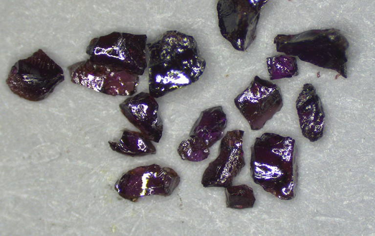
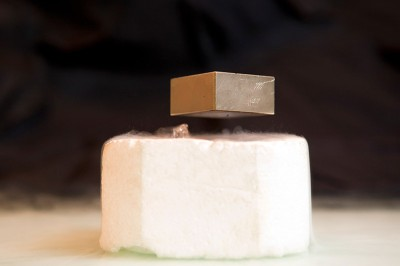

 

Pure crystals of LK-99, synthesized by a team at the Max Planck Institute for Solid State Research in Stuttgart, Germany.Credit: Pascal Puphal  

德国斯图加特马克斯-普朗克固体研究所团队合成的 LK-99 纯晶体。

Researchers seem to have solved the puzzle of LK-99. Scientific detective work has unearthed evidence that the material is not a superconductor, and clarified its actual properties.  

研究人员似乎已经解开了 LK-99 之谜。科学探测工作发现了这种材料不是超导体的证据，并澄清了它的实际特性。

The conclusion dashes hopes that LK-99 — a compound of copper, lead, phosphorus and oxygen — would prove to be the first superconductor that works at room temperature and ambient pressure.  

这一结论打破了人们对 LK-99 （一种铜、铅、磷和氧的化合物）将被证明是第一种能在室温和环境压力下工作的超导体的希望。  

Instead, studies have shown that impurities in the material — in particular, copper sulfide — were responsible for sharp drops in its electrical resistivity and a display of partial levitation over a magnet, properties similar to those exhibited by superconductors.  

相反，研究表明，这种材料中的杂质--尤其是硫化铜--是导致其电阻率急剧下降和在磁铁上显示部分悬浮的原因，这些特性与超导体表现出的特性类似。

“I think things are pretty decisively settled at this point,” says Inna Vishik, a condensed-matter experimentalist at the University of California, Davis.  

"加州大学戴维斯分校的凝聚态物质实验学家 Inna Vishik 说："我认为事情在这一点上已经有了定论。

[

Claimed superconductor LK-99 is an online sensation — but replication efforts fall short  

声称的超导体 LK-99 在网上引起轰动--但复制工作却不尽人意](https://www.nature.com/articles/d41586-023-02481-0)

The LK-99 saga began in late July, when a team led by Sukbae Lee and Ji-Hoon Kim at the Quantum Energy Research Centre, a start-up firm in Seoul, published preprints<a href="https://www.nature.com/articles/d41586-023-02585-7?error=server_error#ref-CR1" data-track="click" data-action="anchor-link" data-track-label="go to reference" data-track-category="references">1</a>,<a href="https://www.nature.com/articles/d41586-023-02585-7?error=server_error#ref-CR2" data-track="click" data-action="anchor-link" data-track-label="go to reference" data-track-category="references">2</a> claiming that LK-99 is a superconductor at normal pressure, and at temperatures up to at least 127 ºC (400 kelvin).  

LK-99 的传奇始于 7 月下旬，当时首尔一家新创公司量子能源研究中心（Quantum Energy Research Centre）的 Sukbae Lee 和 Ji-Hoon Kim 领导的团队发表了预印本 <a href="https://www.nature.com/articles/d41586-023-02585-7?error=server_error#ref-CR1" data-track="click" data-action="anchor-link" data-track-label="go to reference" data-track-category="references">1</a> <a href="https://www.nature.com/articles/d41586-023-02585-7?error=server_error#ref-CR2" data-track="click" data-action="anchor-link" data-track-label="go to reference" data-track-category="references">2</a> ，声称 LK-99 在常压和至少 127 ºC （400 开尔文）的温度下是一种超导体。  

All previously confirmed superconductors function only at very low temperatures and extreme pressures.  

所有先前确认的超导体都只能在极低的温度和极高的压力下工作。

The extraordinary claim quickly grabbed the attention of the science-interested public and researchers, some of whom tried to replicate LK-99. [Initial attempts did not find signs of room-temperature superconductivity](https://www.nature.com/articles/d41586-023-02481-0), but were not conclusive. Now, after dozens of replication efforts, many specialists are confidently saying that the evidence shows LK-99 is not a room-temperature superconductor.  

这一非同寻常的说法迅速吸引了对科学感兴趣的公众和研究人员的注意，其中一些人试图复制 LK-99。最初的尝试并没有发现室温超导的迹象，但也不是决定性的。现在，经过数十次复制努力，许多专家自信地表示，证据表明 LK-99 并非室温超导体。  

(Lee and Kim’s team did not respond to _Nature_’s request for comment.)  

(李和金的团队没有回应《自然》杂志的置评请求）。

## Accumulating evidence 积累证据

The South Korean team based its claim on two of LK-99’s properties: levitation above a magnet and abrupt drops in resistivity. But separate teams at Peking University<a href="https://www.nature.com/articles/d41586-023-02585-7?error=server_error#ref-CR3" data-track="click" data-action="anchor-link" data-track-label="go to reference" data-track-category="references">3</a> and the Chinese Academy of Sciences<a href="https://www.nature.com/articles/d41586-023-02585-7?error=server_error#ref-CR4" data-track="click" data-action="anchor-link" data-track-label="go to reference" data-track-category="references">4</a> (CAS), both in Beijing, found mundane explanations for these phenomena.  

韩国研究小组是根据 LK-99 的两个特性提出这一说法的：在磁铁上方悬浮和电阻率突然下降。但北京大学 <a href="https://www.nature.com/articles/d41586-023-02585-7?error=server_error#ref-CR3" data-track="click" data-action="anchor-link" data-track-label="go to reference" data-track-category="references">3</a> 和中国科学院 <a href="https://www.nature.com/articles/d41586-023-02585-7?error=server_error#ref-CR4" data-track="click" data-action="anchor-link" data-track-label="go to reference" data-track-category="references">4</a> （中科院）的研究小组分别找到了这些现象的世俗解释。

Another study<a href="https://www.nature.com/articles/d41586-023-02585-7?error=server_error#ref-CR5" data-track="click" data-action="anchor-link" data-track-label="go to reference" data-track-category="references">5</a>, by researchers in the United States and Europe, combined experimental and theoretical evidence to demonstrate how LK-99’s structure made superconductivity infeasible.  

美国和欧洲的研究人员进行的另一项研究 <a href="https://www.nature.com/articles/d41586-023-02585-7?error=server_error#ref-CR5" data-track="click" data-action="anchor-link" data-track-label="go to reference" data-track-category="references">5</a> ，结合实验和理论证据，证明了 LK-99 的结构如何使超导不可行。  

And other experimenters synthesized and studied pure samples<a href="https://www.nature.com/articles/d41586-023-02585-7?error=server_error#ref-CR6" data-track="click" data-action="anchor-link" data-track-label="go to reference" data-track-category="references">6</a> of LK-99, erasing doubts about the material’s structure and confirming that it is not a superconductor, but an insulator.  

其他实验人员合成并研究了 LK-99 的纯样品 <a href="https://www.nature.com/articles/d41586-023-02585-7?error=server_error#ref-CR6" data-track="click" data-action="anchor-link" data-track-label="go to reference" data-track-category="references">6</a> ，消除了对这种材料结构的怀疑，并证实它不是超导体，而是绝缘体。

The only further confirmation would come from the South Korean team sharing its samples, says Michael Fuhrer, a physicist at Monash University in Melbourne, Australia.  

澳大利亚墨尔本莫纳什大学（Monash University）物理学家迈克尔-福勒（Michael Fuhrer）说，唯一的进一步证实将来自韩国团队分享其样本。  

“The burden’s on them to convince everybody else,” he says.  

"他说："他们有责任说服其他人。

Perhaps the most striking evidence for LK-99’s superconductivity was a [video](https://sciencecast.org/casts/suc384jly50n) taken by the South Korean team that showed a coin-shaped sample of silvery material wobbling over a magnet.  

韩国研究小组拍摄的一段视频也许是 LK-99 超导性的最有力证据，视频显示一枚硬币形状的银色材料样本在磁铁上晃动。  

The researchers said that the sample was levitating because of the Meissner effect — a hallmark of superconductivity in which a material expels magnetic fields.  

研究人员说，样品悬浮的原因是迈斯纳效应--这是超导电性的标志，在这种效应中，材料会释放磁场。  

Multiple unverified videos of LK-99 levitating subsequently circulated on social media, but none of the researchers who initially tried to replicate the findings observed any levitation.  

随后，社交媒体上流传着多段未经证实的 LK-99 悬浮视频，但最初试图复制这一发现的研究人员都没有观察到任何悬浮现象。

## Half-baked levitation 半成品悬浮

Several red flags popped out to Derrick VanGennep, a former condensed-matter researcher at Harvard University in Cambridge, Massachusetts, who now works in finance but was intrigued by LK-99. In the video, one edge of the sample seemed to stick to the magnet, and it seemed delicately balanced.  

马萨诸塞州剑桥市哈佛大学的前凝聚态物质研究员德里克-范根尼普（Derrick VanGennep）突然发现了几个问题，他现在从事金融工作，但对 LK-99 很感兴趣。在视频中，样品的一个边缘似乎粘在了磁铁上，看起来平衡得很微妙。  

By contrast, superconductors that levitate over magnets can be spun and even held upside down. “None of those behaviours look like what we see in the LK-99 videos,” VanGennep says.  

相比之下，悬浮在磁铁上的超导体可以旋转，甚至可以倒持。"VanGennep 说："这些行为都不像我们在 LK-99 视频中看到的那样。

He thought LK-99’s properties were more likely to be the result of ferromagnetism. So he constructed a pellet of compressed graphite shavings with iron filings glued to it. A [video](https://twitter.com/VanGennepD/status/1688052003216261120) made by VanGennep shows that his disc — made of non-superconducting, ferromagnetic materials — mimicked LK-99’s behaviour.  

他认为 LK-99 的特性更可能是铁磁性的结果。于是，他制作了一个由压缩石墨屑组成的颗粒，上面粘有铁屑。VanGennep 制作的视频显示，他的圆盘（由非超导铁磁材料制成）模仿了 LK-99 的行为。

On 7 August, the Peking University team reported<a href="https://www.nature.com/articles/d41586-023-02585-7?error=server_error#ref-CR3" data-track="click" data-action="anchor-link" data-track-label="go to reference" data-track-category="references">3</a> that this “half-levitation” appeared in its own LK-99 samples because of ferromagnetism.  

8 月 7 日，北京大学的研究小组报告说 <a href="https://www.nature.com/articles/d41586-023-02585-7?error=server_error#ref-CR3" data-track="click" data-action="anchor-link" data-track-label="go to reference" data-track-category="references">3</a> ，在他们自己的 LK-99 样品中出现了这种 "半悬浮 "现象，原因是铁磁性。  

“It’s exactly like an iron-filing experiment,” says team member Yuan Li, a condensed-matter physicist.  

"团队成员、凝聚态物质物理学家李远说："这就像一个锉铁实验。  

The pellet experiences a lifting force, but it’s not enough for it to levitate — only for it to balance on one end.  

小球会受到一个提升力，但这个力不足以让它悬浮起来，只能让它在一端保持平衡。

Li and his colleagues measured their sample’s resistivity, and found no sign of superconductivity.  

李和他的同事测量了样品的电阻率，没有发现超导迹象。  

But they couldn’t explain the sharp resistivity drop seen by the South Korean team.  

但他们无法解释韩国团队看到的电阻率急剧下降的原因。

## Impure samples 不纯样品

The South Korean authors noted one particular temperature at which LK-99 showed a tenfold drop in resistivity, from about 0.02 ohm-centimetres to 0.002 Ω cm.  

韩国作者注意到，在一个特定温度下，LK-99 的电阻率下降了十倍，从大约 0.02 欧姆-厘米下降到 0.002 Ω 厘米。  

“They were very precise about it: 104.8 ºC,” says Prashant Jain, a chemist at the University of Illinois at Urbana–Champaign. “I was like, wait a minute, I know this temperature.”  

"他们非常精确伊利诺伊大学香槟分校的化学家 Prashant Jain 说："104.8 ºC。"我当时想，等等，我知道这个温度。

The reaction that synthesizes LK-99 uses an unbalanced recipe.  

合成 LK-99 的反应使用的是不平衡配方。  

For every one part that it makes of copper-doped lead phosphate crystal — pure LK-99 — it produces 17 parts copper and 5 parts sulfur.  

它每制造出 1 份掺铜的磷酸铅晶体（纯 LK-99），就会产生 17 份铜和 5 份硫。  

These leftovers lead to numerous impurities — especially copper sulfide (Cu2S), which the South Korean team reported finding in its sample.  

这些残留物会产生大量杂质，尤其是硫化铜（Cu 2 S），韩国研究小组报告在其样本中发现了这种杂质。

Jain, a copper-sulfide specialist, remembered 104 ºC as the temperature at which Cu2S undergoes a phase transition. Below that temperature, the resistivity of air-exposed Cu2S drops dramatically — a signal almost identical to LK-99’s purported superconducting phase transition.  

硫化铜专家 Jain 认为 104 ºC 是 Cu 2 S 发生相变的温度。低于这一温度，暴露在空气中的 Cu 2 S 的电阻率会急剧下降--这一信号与 LK-99 声称的超导相变几乎相同。  

“I was almost in disbelief that they missed it,” says Jain, who published a preprint<a href="https://www.nature.com/articles/d41586-023-02585-7?error=server_error#ref-CR7" data-track="click" data-action="anchor-link" data-track-label="go to reference" data-track-category="references">7</a> on the important confounding effect.  

Jain说："我几乎不敢相信他们会漏掉这一点，"他发表了一篇关于重要混杂效应的预印本 <a href="https://www.nature.com/articles/d41586-023-02585-7?error=server_error#ref-CR7" data-track="click" data-action="anchor-link" data-track-label="go to reference" data-track-category="references">7</a> 。

On 8 August, the CAS team reported<a href="https://www.nature.com/articles/d41586-023-02585-7?error=server_error#ref-CR4" data-track="click" data-action="anchor-link" data-track-label="go to reference" data-track-category="references">4</a> on the effects of Cu2S impurities in LK-99. “Different contents of Cu2S can be synthesized using different processes,” says team member Jianlin Luo, a CAS physicist.  

8月8日，中科院团队报告了 <a href="https://www.nature.com/articles/d41586-023-02585-7?error=server_error#ref-CR4" data-track="click" data-action="anchor-link" data-track-label="go to reference" data-track-category="references">4</a> ，研究了LK-99中Cu 2 S杂质的影响。"团队成员、中科院物理学家罗建林说："不同含量的Cu 2 S可以用不同的工艺合成。  

The researchers tested two samples — the first heated in a vacuum, which resulted in 5% Cu2S content, and the second in air, which gave 70% Cu2S content.  

研究人员测试了两个样品：第一个样品在真空中加热，铜 2 S 含量为 5%；第二个样品在空气中加热，铜 2 S 含量为 70%。

The first sample’s resistivity increased smoothly as it cooled, as did samples from other replication attempts.  

第一个样品的电阻率在冷却过程中平稳上升，其他重复尝试的样品也是如此。  

But the second sample’s resistivity plunged near 112 ºC (385 K) — closely matching the South Korean team’s observations.  

但第二个样品的电阻率在接近 112 ºC （385 K）时急剧下降，与韩国团队的观测结果非常吻合。

“That was the moment where I said, ‘Well, obviously, that’s what made them think this was a superconductor,’” says Fuhrer. “The nail in the coffin was this copper sulfide thing.”  

"就在那一刻，我说，'显然，这就是他们认为这是超导体的原因'，"Fuhrer 说，"钉在棺材上的钉子就是硫化铜。"钉在棺材上的钉子就是硫化铜"。

Making conclusive statements about LK-99’s properties is difficult, because the material is unpredictable and samples contain varying impurities.  

要对 LK-99 的特性做出定论是很困难的，因为这种材料是不可预测的，而且样品中含有不同的杂质。  

“Even from our own growth, different batches will be slightly different,” says Li.  

"即使是我们自己生产的产品，不同批次也会略有不同。  

But he argues that samples that are close enough to the original are sufficient for checking whether LK-99 is a superconductor in ambient conditions.  

但他认为，只要样品足够接近原样，就足以检验 LK-99 在环境条件下是否是超导体。

## Crystal clear 晶莹剔透

With strong explanations for the resistivity drop and the half-levitation, many in the community were convinced that LK-99 was not a room-temperature superconductor.  

由于对电阻率下降和半翘曲现象的解释不充分，许多人确信 LK-99 并非室温超导体。  

But mysteries lingered — namely, what were the material’s actual properties?  

但谜团依然存在，即这种材料的实际特性是什么？

Initial theoretical attempts using an approach called density functional theory (DFT) to predict LK-99’s structure had hinted at interesting electronic signatures known as flat bands.  

最初的理论尝试使用一种称为密度泛函理论（DFT）的方法来预测 LK-99 的结构，结果发现了一些有趣的电子特征，即平带。  

These are areas where the electrons move slowly and can be strongly correlated. In some cases, this behaviour leads to superconductivity.  

在这些区域中，电子移动缓慢，并可能具有很强的相关性。在某些情况下，这种行为会导致超导现象。  

But these calculations were based on unverified assumptions about LK-99’s structure.  

但这些计算所依据的是对 LK-99 结构未经核实的假设。

To better understand the material, the US–European group<a href="https://www.nature.com/articles/d41586-023-02585-7?error=server_error#ref-CR5" data-track="click" data-action="anchor-link" data-track-label="go to reference" data-track-category="references">5</a> performed precision X-ray imaging of its samples to calculate LK-99’s structure.  

为了更好地了解这种材料，美欧小组 <a href="https://www.nature.com/articles/d41586-023-02585-7?error=server_error#ref-CR5" data-track="click" data-action="anchor-link" data-track-label="go to reference" data-track-category="references">5</a> 对其样品进行了精密 X 射线成像，以计算 LK-99 的结构。  

Crucially, the imaging allowed the team to make rigorous calculations that clarified the situation of the flat bands, showing that they were not conducive to superconductivity.  

最重要的是，成像技术使研究小组能够进行严格的计算，从而澄清了平带的情况，表明平带不利于超导。  

Instead, the flat bands in LK-99 came from strongly localized electrons, which cannot ‘hop’ in the way that a superconductor requires.  

相反，LK-99 中的扁平带来自于强局域化电子，它们无法像超导体那样 "跳跃"。

On 14 August, a separate team at the Max Planck Institute for Solid State Research in Stuttgart, Germany, reported<a href="https://www.nature.com/articles/d41586-023-02585-7?error=server_error#ref-CR6" data-track="click" data-action="anchor-link" data-track-label="go to reference" data-track-category="references">6</a> synthesizing pure, single crystals of LK-99. Unlike previous synthesis attempts, which had relied on crucibles, this one used a technique called floating-zone crystal growth.  

8 月 14 日，德国斯图加特马克斯-普朗克固体研究所的另一个研究小组报告说， <a href="https://www.nature.com/articles/d41586-023-02585-7?error=server_error#ref-CR6" data-track="click" data-action="anchor-link" data-track-label="go to reference" data-track-category="references">6</a> ，合成出了纯净的 LK-99 单晶体。与以往依赖坩埚进行合成的尝试不同，这次尝试使用了一种称为浮区晶体生长的技术。  

This enabled the researchers to avoid introducing sulfur into the reaction, thereby eliminating the Cu2S impurities.  

这使研究人员得以避免在反应中引入硫，从而消除了 Cu 2 S 杂质。

The result was a transparent purple crystal — pure LK-99, or Pb8.8Cu1.2P6O25. Separated from impurities, LK-99 is not a superconductor, but an insulator with a resistance in the millions of ohms — too high for a standard conductivity test to be run.  

其结果是一种透明的紫色晶体--纯 LK-99，或 Pb 8.8 Cu 1.2 P 6 O 25 。从杂质中分离出来的 LK-99 不是超导体，而是绝缘体，其电阻高达数百万欧姆--太高了，无法进行标准电导率测试。  

It shows minor ferromagnetism and diamagnetism, but not enough for even partial levitation. “We therefore rule out the presence of superconductivity,” the team concluded.  

它显示出轻微的铁磁性和二磁性，但甚至不足以实现部分悬浮。"因此，我们排除了超导存在的可能性。

The team suggests that the hints of superconductivity seen in LK-99 were caused by Cu2S impurities, which are absent from their crystal.  

研究小组认为，在 LK-99 中看到的超导迹象是由 Cu 2 S 杂质引起的，而它们的晶体中不存在这种杂质。  

“This story is exactly showing why we need single crystals,” says Pascal Puphal, a specialist in crystal growth and the Max Planck physicist who led the study.  

"晶体生长专家、领导这项研究的马克斯-普朗克物理学家帕斯卡尔-普法尔（Pascal Puphal）说："这个故事恰恰说明了我们为什么需要单晶体。  

“When we have single crystals, we can clearly study the intrinsic properties of a system.”  

"当我们拥有单晶体时，我们可以清楚地研究一个系统的内在特性"。

## Lessons learnt 经验教训

Many researchers are reflecting on what they’ve learnt from the summer’s superconductivity sensation.  

许多研究人员正在反思他们从今年夏天的超导现象中学到了什么。

For Leslie Schoop, a solid-state chemist at Princeton University in New Jersey, who co-authored the flat-bands study, the lesson about premature calculations is clear.  

新泽西州普林斯顿大学的固体化学家莱斯利-肖普（Leslie Schoop）是这项平带研究的共同作者，对于他来说，关于过早计算的教训是显而易见的。  

“Even before LK-99, I have been giving talks about how you need to be careful with DFT, and now I have the best story ever for my next summer school,” she says.  

"她说："甚至在 LK-99 之前，我就一直在做关于如何小心使用 DFT 的讲座，现在我为下一个暑期班准备了最好的故事。

Jain points to the importance of old, often overlooked data — the crucial measurements that he relied on for the resistivity of Cu2S were published in 1951.  

Jain 指出了经常被忽视的旧数据的重要性--他所依赖的有关 Cu 2 S 电阻率的关键测量数据发表于 1951 年。

Although some commentators have pointed to the LK-99 saga as a model for reproducibility in science, others say that it involved an unusually swift resolution of a high-profile puzzle.  

尽管一些评论家将 LK-99 的传奇故事视为科学可重复性的典范，但另一些评论家则认为，这只是异常迅速地解决了一个备受瞩目的难题。  

“Often these things die this very slow death, where it’s just the rumours and nobody can reproduce it,” says Fuhrer.  

"Fuhrer 说："通常，这些东西会慢慢死去，只剩下传言，没有人能够再现它。

When copper oxide superconductors were discovered in 1986, researchers leapt to probe their properties.  

1986 年发现氧化铜超导体后，研究人员立即着手探究其特性。  

But nearly four decades later, there is still debate over the materials’ superconducting mechanism, says Vishik. Efforts to explain LK-99 came readily.  

但将近 40 年过去了，人们对这种材料的超导机制仍有争议，Vishik 说。解释 LK-99 的努力来得很容易。  

“The detective work that wraps up all of the pieces of the original observation — I think that’s really fantastic,” she says. “And it’s relatively rare.”  

"她说："将原始观察的所有片段整合起来的侦查工作--我认为这真是太棒了。"她说，"这也是比较罕见的。
