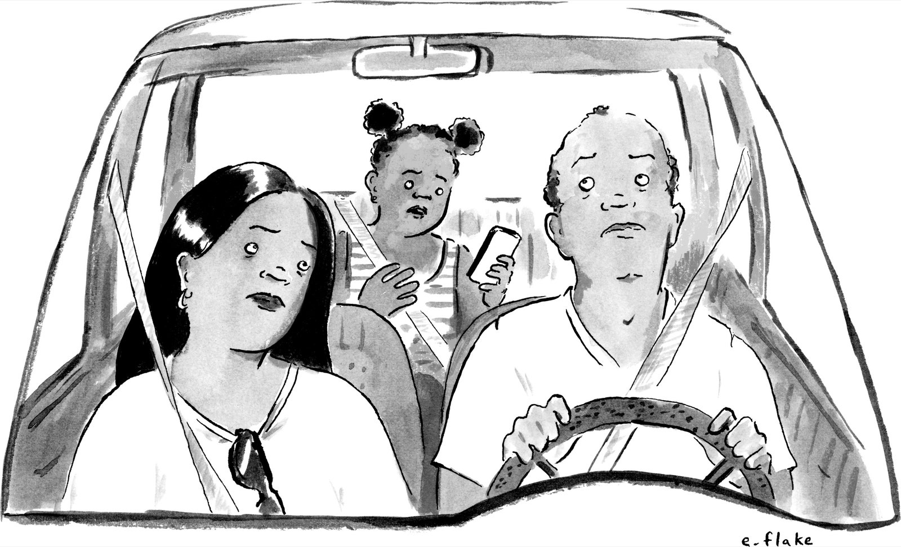
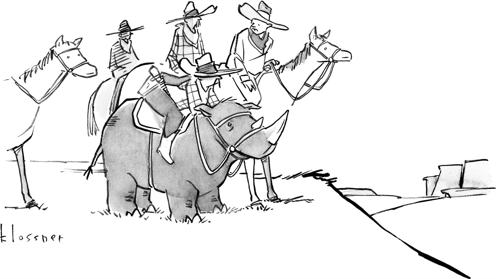
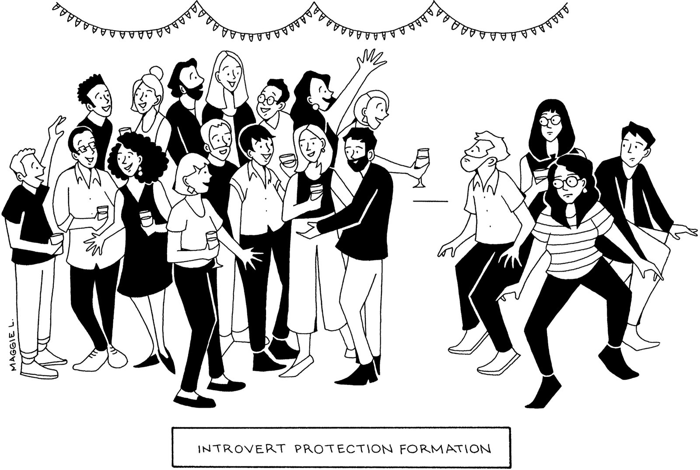
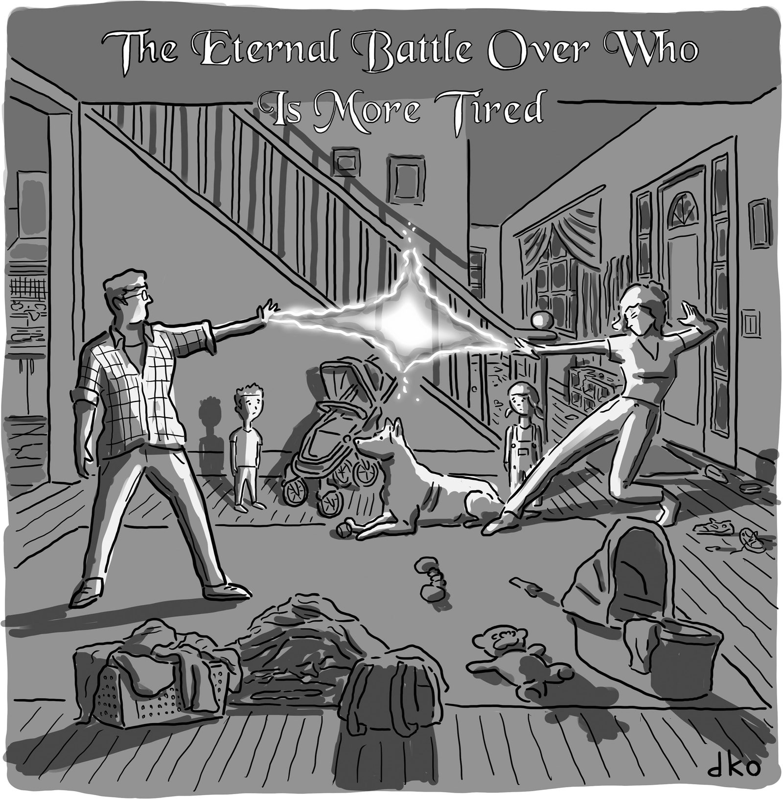

Last October, Colin Kahl, then the Under-Secretary of Defense for Policy at the Pentagon, sat in a hotel in Paris and prepared to make a call to avert disaster in Ukraine.  

去年 10 月，时任五角大楼负责政策的国防部副部长科林-卡尔坐在巴黎的一家酒店里，准备发出呼吁，以避免乌克兰的灾难。  

A staffer handed him an iPhone—in part to avoid inviting an onslaught of late-night texts and colorful emojis on Kahl’s own phone.  

一名工作人员递给他一部 iPhone--部分原因是为了避免卡赫尔自己的手机在深夜收到大量短信和五颜六色的表情符号。  

Kahl had returned to his room, with its heavy drapery and distant view of the Eiffel Tower, after a day of meetings with officials from the United Kingdom, France, and Germany.  

在与来自英国、法国和德国的官员进行了一天的会谈之后，卡尔回到了他的房间，房间里有厚重的窗帘和艾菲尔铁塔的远景。  

A senior defense official told me that Kahl was surprised by whom he was about to contact: “He was, like, ‘Why am I calling Elon Musk?’ ”  

一位高级国防官员告诉我，卡尔对他将要联系的人感到惊讶："他当时想，'我为什么要给埃隆-马斯克打电话？"

The reason soon became apparent.  

原因很快就显现出来了。  

“Even though Musk is not technically a diplomat or statesman, I felt it was important to treat him as such, given the influence he had on this issue,” Kahl told me.  

"卡赫尔告诉我："尽管从技术上讲，马斯克并不是外交官或政治家，但考虑到他在这个问题上的影响力，我觉得有必要把他当作外交官或政治家来对待。  

SpaceX, Musk’s space-exploration company, had for months been providing Internet access across Ukraine, allowing the country’s forces to plan attacks and to defend themselves.  

马斯克的太空探索公司 SpaceX 几个月来一直在为乌克兰全国提供互联网接入服务，使该国军队能够计划袭击和进行自卫。  

But, in recent days, the forces had found their connectivity severed as they entered territory contested by Russia.  

但是，最近几天，这些部队在进入俄罗斯争夺的领土时发现他们的联系被切断了。  

More alarmingly, SpaceX had recently given the Pentagon an ultimatum: if it didn’t assume the cost of providing service in Ukraine, which the company calculated at some four hundred million dollars annually, it would cut off access.  

更令人震惊的是，SpaceX 公司最近给五角大楼下了最后通牒：如果不承担在乌克兰提供服务的费用（据该公司计算，每年的费用约为 4 亿美元），它将切断乌克兰的接入。  

“We started to get a little panicked,” the senior defense official, one of four who described the standoff to me, recalled. Musk “could turn it off at any given moment.  

"这位高级国防官员是向我描述对峙情况的四位官员之一，他回忆说："我们开始有点恐慌。马斯克 "随时都可能关闭它。  

And that would have real operational impact for the Ukrainians.”  

这将对乌克兰人的行动产生真正的影响"。

Musk had become involved in the war in Ukraine soon after Russia invaded, in February, 2022. Along with conventional assaults, the Kremlin was conducting cyberattacks against Ukraine’s digital infrastructure.  

2022 年 2 月，俄罗斯入侵乌克兰后不久，马斯克就卷入了乌克兰战争。除了常规攻击，克里姆林宫还对乌克兰的数字基础设施进行了网络攻击。  

Ukrainian officials and a loose coalition of expatriates in the tech sector, brainstorming in group chats on WhatsApp and Signal, found a potential solution: SpaceX, which manufactures a line of mobile Internet terminals called Starlink.  

乌克兰官员和一个由科技界外籍人士组成的松散联盟在 WhatsApp 和 Signal 的群聊中集思广益，找到了一个潜在的解决方案：SpaceX 制造了一系列名为 Starlink 的移动互联网终端。  

The tripod-mounted dishes, each about the size of a computer display and clad in white plastic reminiscent of the sleek design sensibility of Musk’s Tesla electric cars, connect with a network of satellites.  

这些安装在三脚架上的天线与卫星网络相连，每个天线的大小与电脑显示屏差不多，外层是白色塑料，让人联想到马斯克的特斯拉电动汽车的时尚设计感。  

The units have limited range, but in this situation that was an advantage: although a nationwide network of dishes was required, it would be difficult for Russia to completely dismantle Ukrainian connectivity.  

这些装置的射程有限，但在这种情况下这是一个优势：虽然需要一个覆盖全国的天线网络，但俄罗斯很难完全摧毁乌克兰的连接。  

Of course, Musk could do so.  

当然，马斯克可以这样做。  

Three people involved in bringing Starlink to Ukraine, all of whom spoke on the condition of anonymity because they worried that Musk, if upset, could withdraw his services, told me that they originally overlooked the significance of his personal control.  

三位参与将 "星链 "引入乌克兰的人士告诉我，他们原本忽略了马斯克个人控制的重要性。  

“Nobody thought about it back then,” one of them, a Ukrainian tech executive, told me. “It was all about ‘Let’s fucking go, people are dying.’ ”  

"那时没人想过这个问题，"其中一位乌克兰技术高管告诉我。"当时只想着'我们快走吧，有人快死了'。"

In the ensuing months, fund-raising in Silicon Valley’s Ukrainian community, contracts with the U.S. Agency for International Development and with European governments, and pro-bono contributions from SpaceX facilitated the transfer of thousands of Starlink units to Ukraine.  

在随后的几个月里，硅谷乌克兰社区的筹款活动、与美国国际开发署和欧洲各国政府签订的合同以及 SpaceX 公司的无偿捐助，促成了数千台 Starlink 设备运往乌克兰。  

A soldier in Ukraine’s signal corps who was responsible for maintaining Starlink access on the front lines, and who asked to be identified only by his first name, Mykola, told me, “It’s the essential backbone of communication on the battlefield.”  

乌克兰信号部队一名负责维护前线星链接入的士兵告诉我："这是战场上必不可少的通信支柱。

Initially, Musk showed unreserved support for the Ukrainian cause, responding encouragingly as Mykhailo Fedorov, the Ukrainian minister for digital transformation, tweeted pictures of equipment in the field.  

起初，马斯克对乌克兰的事业表现出了毫无保留的支持，在乌克兰数字转型部长米哈伊洛-费多罗夫（Mykhailo Fedorov）在推特上发布现场设备图片时，马斯克做出了令人鼓舞的回应。  

But, as the war ground on, SpaceX began to balk at the cost.  

但是，随着战争的深入，SpaceX 公司开始对成本感到犹豫。  

“We are not in a position to further donate terminals to Ukraine, or fund the existing terminals for an indefinite period of time,” SpaceX’s director of government sales told the Pentagon in a letter, last September.  

"去年 9 月，SpaceX 的政府销售主管在一封信中告诉五角大楼："我们无法向乌克兰进一步捐赠终端，也无法无限期地为现有终端提供资金。  

(CNBC recently valued SpaceX at nearly a hundred and fifty billion dollars. _Forbes_ estimated Musk’s personal net worth at two hundred and twenty billion dollars, making him the world’s richest man.)  

(CNBC 最近对 SpaceX 的估值接近 1,500 亿美元。福布斯》估计马斯克的个人净资产为 2200 亿美元，使他成为世界首富）。

Musk was also growing increasingly uneasy with the fact that his technology was being used for warfare.  

马斯克对自己的技术被用于战争也越来越感到不安。  

That month, at a conference in Aspen attended by business and political figures, Musk even appeared to express support for Vladimir Putin.  

当月，在阿斯彭举行的一次有商界和政界人士参加的会议上，马斯克甚至表示支持弗拉基米尔-普京。  

“He was onstage, and he said, ‘We should be negotiating. Putin wants peace—we should be negotiating peace with Putin,’ ” Reid Hoffman, who helped start PayPal with Musk, recalled.  

"他在台上说：'我们应该谈判。普京想要和平，我们应该与普京进行和平谈判，'"与马斯克一起帮助创立 PayPal 的里德-霍夫曼回忆道。  

Musk seemed, he said, to have “bought what Putin was selling, hook, line, and sinker.” A week later, Musk tweeted a proposal for his own peace plan, which called for new referendums to redraw the borders of Ukraine, and granted Russia control of Crimea, the semi-autonomous peninsula recognized by most nations, including the United States, as Ukrainian territory.  

他说，马斯克似乎 "买了普京的账，上钩、上钩、上钩"。一周后，马斯克在推特上提出了自己的和平计划，呼吁举行新的全民公决，重新划定乌克兰的边界，并给予俄罗斯对克里米亚（包括美国在内的大多数国家承认为乌克兰领土的半自治半岛）的控制权。  

In later tweets, Musk portrayed as inevitable an outcome favoring Russia and attached maps highlighting eastern Ukrainian territories, some of which, he argued, “prefer Russia.” Musk also polled his Twitter followers about the plan.  

在后来的推文中，马斯克将有利于俄罗斯的结果描绘成不可避免的，并附上了突出显示乌克兰东部领土的地图，他认为其中一些领土 "更倾向于俄罗斯"。马斯克还就这一计划在推特上对粉丝进行了民意调查。  

Millions responded, with about sixty per cent rejecting the proposal.  

数百万人做出了回应，约 60% 的人拒绝了这一提议。  

(Volodymyr Zelensky, Ukraine’s President, tweeted his own poll, asking users whether they preferred the Elon Musk who supported Ukraine or the one who now seemed to back Russia.  

(乌克兰总统沃洛德梅尔-泽连斯基（Volodymyr Zelensky）在推特上发布了自己的民意调查，询问用户更喜欢支持乌克兰的埃隆-马斯克，还是现在似乎支持俄罗斯的埃隆-马斯克。  

The former won, though Zelensky’s poll had a smaller turnout: Musk has more than twenty times as many followers.)  

前者获胜，尽管泽伦斯基的民调参与人数较少：马斯克的粉丝数量是前者的二十多倍）。

By then, Musk’s sympathies appeared to be manifesting on the battlefield.  

那时，马斯克的同情心似乎已经在战场上显现。  

One day, Ukrainian forces advancing into contested areas in the south found themselves suddenly unable to communicate.  

有一天，向南部有争议地区推进的乌克兰部队突然发现无法通信。  

“We were very close to the front line,” Mykola, the signal-corps soldier, told me. “We crossed this border and the Starlink stopped working.” The consequences were immediate.  

"我们当时离前线很近，"信号兵米科拉告诉我。"我们越过边界，星链就停止工作了"。后果立竿见影。  

“Communications became dead, units were isolated. When you’re on offense, especially for commanders, you need a constant stream of information from battalions.  

"通讯中断，部队孤立无援。当你在进攻时，尤其是对于指挥官来说，你需要各营源源不断地提供信息。  

Commanders had to drive to the battlefield to be in radio range, risking themselves,” Mykola said.  

Mykola 说："指挥官们不得不冒着生命危险驱车前往战场，以进入无线电范围。  

“It was chaos.” Ukrainian expats who had raised funds for the Starlink units began receiving frantic calls.  

"一片混乱"为 "星链 "部队筹集资金的乌克兰侨民开始接到疯狂的电话。  

The tech executive recalls a Ukrainian military official telling him, “We need Elon now.” “How now?” he replied. “Like fucking now,” the official said.  

这位技术高管回忆说，一位乌克兰军方官员告诉他："我们现在需要埃隆。""怎么现在？"他回答。"就他妈的现在，"这位官员说。  

“People are dying.” Another Ukrainian involved told me that he was “awoken by a dozen calls saying they’d lost connectivity and had to retreat.” The _Financial Times_ reported that outages affected units in Kherson, Zaporizhzhia, Kharkiv, Donetsk, and Luhansk.  

"人们正在死去"另一位参与其中的乌克兰人告诉我，他 "被十几个电话吵醒，说他们失去了连接，不得不撤退"。金融时报》报道称，赫尔松、扎波罗热、哈尔科夫、顿涅茨克和卢甘斯克的单位都受到了断电影响。  

American and Ukrainian officials told me they believed that SpaceX had cut the connectivity via geofencing, cordoning off areas of access.  

美国和乌克兰官员告诉我，他们认为 SpaceX 通过地理围栏切断了连接，封锁了可进入的区域。

“My followers expect higher-quality vacation content than this.”  

"我的粉丝期待比这更高质量的度假内容"。

Cartoon by Emily Flake 艾米莉-弗莱克的漫画

The senior defense official said, “We had a whole series of meetings internal to the department to try to figure out what we could do about this.” Musk’s singular role presented unfamiliar challenges, as did the government’s role as intermediary.  

这位高级国防官员说："我们在部门内部召开了一系列会议，试图找出我们能为此做些什么。马斯克的单一角色带来了陌生的挑战，政府作为中间人的角色也是如此。  

“It wasn’t like we could hold him in breach of contract or something,” the official continued.  

"这位官员接着说："我们又不能追究他违约之类的责任。  

The Pentagon would need to reach a contractual arrangement with SpaceX so that, at the very least, Musk “couldn’t wake up one morning and just decide, like, he didn’t want to do this anymore.” Kahl added, “It was kind of a way for us to lock in services across Ukraine.  

五角大楼需要与 SpaceX 达成合同安排，这样至少马斯克 "不会在某天早上醒来后决定，他不想再做这件事了"。卡尔补充说："这也是我们锁定乌克兰境内服务的一种方式。  

It could at least prevent Musk from turning off the switch altogether.”  

它至少可以防止马斯克完全关闭开关"。

Typically, such a negotiation would be handled by the Pentagon’s acquisitions department.  

通常情况下，这种谈判会由五角大楼的采购部门负责。  

But Musk had become more than just a vender like Boeing, Lockheed, or other defense-industry behemoths. On the phone with Musk from Paris, Kahl was deferential.  

但马斯克已不仅仅是波音、洛克希德或其他国防工业巨头那样的供应商。在巴黎与马斯克通电话时，卡尔表现得很恭敬。  

According to unclassified talking points for the call, he thanked Musk for his efforts in Ukraine, acknowledged the steep costs he’d incurred, and pleaded for even a few weeks to devise a contract.  

根据这次通话的非机密谈话要点，他感谢马斯克在乌克兰所做的努力，承认他付出了高昂的代价，并恳求哪怕只有几周的时间来制定合同。  

“If you cut this off, it doesn’t end the war,” Kahl recalled telling Musk.  

"如果你切断了这条路，战争就不会结束，"卡尔回忆说，他对马斯克说。

Musk wasn’t immediately convinced.  

马斯克并没有立即被说服。  

“My inference was that he was getting nervous that Starlink’s involvement was increasingly seen in Russia as enabling the Ukrainian war effort, and was looking for a way to placate Russian concerns,” Kahl told me.  

我的推断是，"星链 "公司的参与在俄罗斯越来越被认为是在为乌克兰的战争努力助力，这让他感到紧张，他正在寻找一种方法来安抚俄罗斯人的担忧，"卡尔告诉我。  

To the dismay of Pentagon officials, Musk volunteered that he had spoken with Putin personally.  

令五角大楼官员大失所望的是，马斯克主动说他曾亲自与普京谈过话。  

Another individual told me that Musk had made the same assertion in the weeks before he tweeted his pro-Russia peace plan, and had said that his consultations with the Kremlin were regular.  

另一个人告诉我，马斯克在推特上发布亲俄和平计划之前的几周也曾做出过同样的断言，并表示他与克里姆林宫的磋商是定期进行的。  

(Musk later denied having spoken with Putin about Ukraine.) On the phone, Musk said that he was looking at his laptop and could see “the entire war unfolding” through a map of Starlink activity.  

(马斯克后来否认曾与普京谈论过乌克兰问题。）马斯克在电话中说，他当时正在看笔记本电脑，通过星链活动地图可以看到 "整个战争正在展开"。  

“This was, like, three minutes before he said, ‘Well, I had this great conversation with Putin,’ ” the senior defense official told me.  

"这位高级国防官员告诉我："这大概是在他说'我和普京进行了一次很棒的谈话'之前的三分钟。  

“And we were, like, ‘Oh, dear, this is not good.’ ” Musk told Kahl that the vivid illustration of how technology he had designed for peaceful ends was being used to wage war gave him pause.  

"我们当时想，'哦，天哪，这可不好'。"马斯克告诉卡尔，他设计的用于和平目的的技术如何被用于发动战争，这个生动的例子让他停了下来。

After a fifteen-minute call, Musk agreed to give the Pentagon more time. He also, after public blowback and with evident annoyance, walked back his threats to cut off service.  

在十五分钟的通话后，马斯克同意给五角大楼更多时间。在遭到公众的强烈反对后，他也明显恼火地收回了中断服务的威胁。  

“The hell with it,” he tweeted.  

"见鬼去吧！"他在推特上写道。  

“Even though Starlink is still losing money & other companies are getting billions of taxpayer $, we’ll just keep funding Ukraine govt for free.” This June, the Department of Defense announced that it had reached a deal with SpaceX.  

"即使星际链路仍在亏损，其他公司也在获得纳税人数十亿美元的资助，我们还是会继续免费资助乌克兰政府。"今年 6 月，美国国防部宣布与 SpaceX 达成协议。

The meddling of oligarchs and other monied interests in the fate of nations is not new. During the First World War, J. P.  

寡头和其他金钱利益集团对国家命运的干预并不新鲜。第一次世界大战期间，J. P.  

Morgan lent vast sums to the Allied powers; afterward, John D. Rockefeller, Jr., poured money into the fledgling League of Nations.  

摩根向同盟国提供了巨额贷款；之后，小约翰-洛克菲勒向新生的国际联盟注入资金。  

The investor George Soros’s Open Society Foundations underwrote civil-society reform in post-Soviet Europe, and the casino mogul Sheldon Adelson funded right-wing media in Israel, as part of his support of Benjamin Netanyahu.  

投资家乔治-索罗斯（George Soros）的 "开放社会基金会"（Open Society Foundations）资助了后苏联欧洲的公民社会改革，赌场大亨谢尔顿-阿德尔森（Sheldon Adelson）资助了以色列的右翼媒体，作为他支持本雅明-内塔尼亚胡（Benjamin Netanyahu）的一部分。

But Musk’s influence is more brazen and expansive.  

但马斯克的影响力更加肆无忌惮、更加广泛。  

There is little precedent for a civilian’s becoming the arbiter of a war between nations in such a granular way, or for the degree of dependency that the U.S. now has on Musk in a variety of fields, from the future of energy and transportation to the exploration of space.  

平民以如此细微的方式成为国家间战争的仲裁者，或者美国现在在从未来能源和交通到太空探索等各个领域对马斯克的依赖程度，都是鲜有先例的。  

SpaceX is currently the sole means by which _NASA_ transports crew from U.S. soil into space, a situation that will persist for at least another year.  

目前，SpaceX 是美国国家航空航天局从美国本土向太空运送乘员的唯一途径，这种情况至少还将持续一年。  

The government’s plan to move the auto industry toward electric cars requires increasing access to charging stations along America’s highways.  

政府推动汽车行业向电动汽车发展的计划要求在美国的高速公路上增加充电站。  

But this rests on the actions of another Musk enterprise, Tesla.  

但这取决于马斯克的另一家企业特斯拉的行动。  

The automaker has seeded so much of the country with its proprietary charging stations that the Biden Administration relaxed an early push for a universal charging standard disliked by Musk.  

这家汽车制造商已经在全国各地铺设了大量专有充电站，以至于拜登政府放松了对马斯克不喜欢的通用充电标准的早期推动。  

His stations are eligible for billions of dollars in subsidies, so long as Tesla makes them compatible with the other charging standard.  

只要特斯拉使其与其他充电标准兼容，他的充电站就有资格获得数十亿美元的补贴。

In the past twenty years, against a backdrop of crumbling infrastructure and declining trust in institutions, Musk has sought out business opportunities in crucial areas where, after decades of privatization, the state has receded.  

在过去的二十年里，在基础设施崩溃、对机构的信任度下降的背景下，马斯克在一些关键领域寻找商机，而在这些领域，经过几十年的私有化，国家已经退居幕后。  

The government is now reliant on him, but struggles to respond to his risk-taking, brinkmanship, and caprice. Current and former officials from _NASA_, the Department of Defense, the Department of Transportation, the Federal Aviation Administration, and the Occupational Safety and Health Administration told me that Musk’s influence had become inescapable in their work, and several of them said that they now treat him like a sort of unelected official.  

政府现在依赖于他，但又难以应对他的冒险、边缘政策和任性。来自美国国家航空航天局、国防部、交通部、联邦航空管理局和职业安全与健康管理局的现任和前任官员告诉我，马斯克的影响力在他们的工作中已变得不可避免，其中一些人说，他们现在把马斯克当作一种非民选官员来对待。  

One Pentagon spokesman said that he was keeping Musk apprised of my inquiries about his role in Ukraine and would grant an interview with an official about the matter only with Musk’s permission.  

五角大楼的一位发言人说，他一直在向马斯克通报我对他在乌克兰所扮演角色的询问，只有在马斯克允许的情况下，他才会就此事接受一位官员的采访。  

“We’ll talk to you if Elon wants us to,” he told me.  

"他对我说："如果埃隆愿意，我们会跟你谈的。  

In a podcast interview last year, Musk was asked whether he has more influence than the American government.  

在去年的一次播客采访中，马斯克被问及他的影响力是否超过了美国政府。  

He replied immediately, “In some ways.” Reid Hoffman told me that Musk’s attitude is “like Louis XIV: ‘L’état, c’est moi.’ ”  

他立即回答说："在某些方面。"里德-霍夫曼告诉我，马斯克的态度 "就像路易十四：'L'état, c'est moi."

Musk’s power continues to grow. His takeover of Twitter, which he has rebranded “X,” gives him a critical forum for political discourse ahead of the next Presidential election.  

马斯克的权力在继续增长。他接管了推特，并将其重新命名为 "X"，这为他在下届总统大选之前提供了一个重要的政治言论论坛。  

He recently launched an artificial-intelligence company, a move that follows years of involvement in the technology.  

他最近成立了一家人工智能公司，这是他多年来一直从事人工智能技术研究的成果。  

Musk has become a hyper-exposed pop-culture figure, and his sharp turns from altruistic to vainglorious, strategic to impulsive, have been the subject of innumerable articles and at least seven major books, including a forthcoming biography by Walter Isaacson.  

马斯克已成为一个曝光率极高的流行文化人物，他从利他主义到虚荣、从战略到冲动的急剧转变，已成为无数文章和至少七本重要著作的主题，包括沃尔特-艾萨克森（Walter Isaacson）即将出版的传记。  

But the nature and the scope of his power are less widely understood.  

但是，人们对其权力的性质和范围却不甚了解。

More than thirty of Musk’s current and former colleagues in various industries and a dozen individuals in his personal life spoke to me about their experiences with him.  

马斯克在各行各业的三十多位现任和前任同事，以及他个人生活中的十几个人，向我讲述了他们与马斯克共事的经历。  

Sam Altman, the C.E.O. of OpenAI, with whom Musk has both worked and sparred, told me, “Elon desperately wants the world to be saved. But only if he can be the one to save it.”  

马斯克曾与OpenAI公司的首席执行官萨姆-阿尔特曼（Sam Altman）共事过，也曾与他争吵过，他告诉我："埃隆迫切希望世界得到拯救。但前提是，他必须是那个拯救世界的人。

The terms of the Starlink deal have not been made public. Ukrainian officials say that they have not faced further service interruptions.  

Starlink 协议的条款尚未公布。乌克兰官员表示，他们没有面临进一步的服务中断。  

But Musk has continued to express ambivalence about how the technology is being used, and where it can be deployed.  

但马斯克仍对如何使用这项技术以及在何处部署这项技术表示矛盾。  

In February, he tweeted, “We will not enable escalation of conflict that may lead to WW3.” He said, as he had told Kahl, that he was sincerely attempting to navigate the moral dilemmas of his role: “We’re trying hard to do the right thing, where the ‘right thing’ is an extremely difficult moral question.”  

今年 2 月，他在推特上写道："我们不会让可能导致第三次世界大战的冲突升级。他说，正如他对卡赫尔说的那样，他真诚地试图驾驭自己角色的道德困境："我们正在努力做正确的事，而'正确的事'是一个极其困难的道德问题。

Musk’s hesitation aligns with his pragmatic interests.  

马斯克的犹豫不决符合他的实用主义利益。  

A facility in Shanghai produces half of all Tesla cars, and Musk depends on the good will of officials in China, which has lent support to Russia in the conflict.  

特斯拉一半的汽车都是在上海的一家工厂生产的，马斯克依赖于中国官员的善意，而中国在冲突中向俄罗斯提供了支持。  

Musk recently acknowledged to the _Financial Times_ that Beijing disapproves of his decision to provide Internet service to Ukraine and has sought assurances that he would not deploy similar technology in China.  

马斯克最近向《金融时报》承认，中国政府不赞成他向乌克兰提供互联网服务的决定，并要求他保证不会在中国部署类似技术。  

In the same interview, he responded to questions about China’s efforts to assert control over Taiwan by floating another peace plan.  

在同一次采访中，他在回答有关中国试图控制台湾的问题时提出了另一个和平计划。  

Taiwan, he suggested, could become a jointly controlled administrative zone, an outcome that Taiwanese leaders see as ending the country’s independence.  

他建议，台湾可以成为一个共同控制的行政区，台湾领导人认为这一结果将结束台湾的独立。  

During a trip to Beijing this spring, Musk was welcomed with what Reuters summarized as “flattery and feasts.” He met with senior officials, including China’s foreign minister, and posed for the kinds of awkwardly smiling formal photos that are more typical of world leaders.  

在今年春天的北京之行中，马斯克受到了路透社总结为 "奉承和盛宴 "的欢迎。他会见了包括中国外交部部长在内的高级官员，并摆出了世界领导人常见的尴尬微笑的正式合影。

National-security officials I spoke with had a range of views on the government’s balance of power with Musk.  

与我交谈过的国家安全官员对政府与马斯克之间的权力平衡持有不同看法。  

He maintains good relationships with some of them, including General Mark Milley, the chairman of the Joint Chiefs of Staff.  

他与其中一些人保持着良好的关系，包括参谋长联席会议主席马克-米利将军。  

Since the two men met, several years ago, when Milley was the chief of staff of the Army, they have discussed “technology applications to warfare—artificial intelligence, electric vehicles, and autonomous machines,” Milley told me.  

米利告诉我，自从几年前两人见面以来，当时米利还是陆军参谋长，他们讨论了 "技术在战争中的应用--人工智能、电动汽车和自主机器"。  

“He has insight that helped shape my thoughts on the fundamental change in the character of war and the modernization of the U.S. military.” During the Starlink controversy, Musk called him for advice.  

"他的洞察力帮助我形成了对战争性质的根本变化和美军现代化的思考。"在 "星链 "争议期间，马斯克曾打电话向他寻求建议。

But other officials expressed profound misgivings.

  

但其他官员则表示了深深的疑虑。  

“Living in the world we live in, in which Elon runs this company and it is a private business under his control, we are living off his good graces,” a Pentagon official told me.  

"五角大楼的一位官员告诉我："在我们生活的这个世界里，埃隆掌管着这家公司，它是一家由他控制的私营企业，我们靠他的恩惠生活。  

“That sucks.” "真糟糕"

One summer evening in the mid-nineteen-eighties, Musk and his friend Theo Taoushiani took Taoushiani’s father’s car for an illicit drive.  

十九世纪八十年代中期的一个夏夜，马斯克和他的朋友西奥-陶西阿尼（Theo Taoushiani）开着陶西阿尼父亲的汽车去兜风。  

Musk and Taoushiani were both in their mid-teens, and lived about a mile apart in a suburb of Johannesburg, South Africa.  

Musk 和 Taoushiani 当时都只有十来岁，住在南非约翰内斯堡郊区，相距约一英里。  

Neither had a driver’s license, or permission from Taoushiani’s father.  

两人都没有驾照，也没有陶西阿尼父亲的许可。  

But they were passionate Dungeons & Dragons fans, and a new module—a fresh scenario in the game—had just been released.  

但他们都是《龙与地下城》的狂热粉丝，而游戏中的一个新模块--一个全新的场景--刚刚发布。  

Taoushiani took the wheel for the twenty-minute drive to the Sandton City mall. “Elon was my co-pilot,” Taoushiani told me.  

在前往桑顿城购物中心的二十分钟车程中，Taoushiani 掌握了方向盘。"埃隆是我的副驾驶，"陶西阿尼告诉我。  

“We went under the cover of darkness.” At the mall, they found that they didn’t have enough money.  

"我们在黑暗的掩护下"在商场里，他们发现钱不够了。  

But Musk promised a salesperson that they would return the next day with the rest, and dropped the name of a well-known Greek restaurant owned by Taoushiani’s family.  

但马斯克向销售人员承诺，第二天他们会带着剩下的东西回来，并说出了陶西阿尼家族拥有的一家著名希腊餐馆的名字。  

“Elon had the gift of the gab,” Taoushiani said. “He’s very persuasive, and he’s quite dogged in his determination.” The two went home with the module.  

"埃隆很有口才，"陶西阿尼说。"他很有说服力，而且他的决心相当坚定"。两人带着模块回家了。

Musk was born in 1971 in Pretoria, the country’s administrative capital, and he and his younger brother, Kimbal, and his younger sister, Tosca, grew up under apartheid.  

1971 年，马斯克出生在比勒陀利亚（该国行政首都），他和弟弟金巴尔、妹妹托斯卡都是在种族隔离制度下长大的。  

Musk’s mother, Maye, a Canadian model and dietitian, and his father, Errol, an engineer, divorced when he was young, and the children initially stayed with Maye.  

马斯克的母亲梅伊是一名加拿大模特和营养师，父亲埃罗尔是一名工程师，两人在他很小的时候就离婚了，孩子们最初跟着梅伊生活。  

She has said that Errol was physically abusive toward her. “He would hit me when the kids were around,” she wrote in her memoir.  

她说埃洛尔对她有身体虐待。"她在回忆录中写道："当孩子们在身边时，他会打我。  

“I remember that Tosca and Kimbal, who were two and four, respectively, would cry in the corner, and Elon, who was five, would hit him on the backs of his knees to try to stop him.” By the mid-eighties, Musk had moved in with his father—a decision that he has said was motivated by concern for his father’s loneliness, and which he came to regret.  

"我记得，分别两岁和四岁的托斯卡和金巴尔会在角落里哭泣，五岁的埃隆会打他的膝盖背，试图阻止他。"到了 80 年代中期，马斯克搬到了父亲家--他曾说这一决定是出于对父亲孤独的担忧，但后来他后悔了。  

Musk, usually impassive in interviews, cried openly when he told _Rolling Stone_ about the years that followed, in which, he said, his father psychologically tortured him, in ways that he declined to specify. “You have no idea about how bad,” he said.  

马斯克在接受采访时通常是无动于衷的，但当他向《滚石》杂志讲述后来的岁月时，他哭了，他说，在那段岁月里，父亲对他进行了心理折磨，具体方式他不愿多说。"他说："你不知道有多糟糕。  

“Almost every crime you can possibly think of, he has done.  

"几乎所有你能想到的罪行，他都干过。  

Almost every evil thing you could possibly think of, he has done.” Taoushiani recalled witnessing Errol “chastise Elon a lot.  

几乎所有你能想到的坏事，他都干过。陶西阿尼回忆说，他目睹埃洛尔 "经常责骂埃隆"。  

Maybe belittle him.” (Errol Musk has denied allegations that he was abusive to Maye or to his children.) Musk has also said that he was violently bullied at school.  

也许是在贬低他。(埃罗尔-马斯克否认了他虐待梅伊或他的孩子的指控）。马斯克还说过，他在学校受到过暴力欺凌。  

Though he is now six feet one, with a broad-shouldered build, he was “much, much smaller back in school,” Taoushiani told me. “He wasn’t very social.”  

Taoushiani 告诉我，虽然他现在身高 6 英尺 1，肩膀宽阔，但 "在学校的时候，他要小很多很多"。"他不太合群"。

“ ‘Ram them.’ That’s your suggestion for everything.”  

"'撞死他们'。这就是你对所有事情的建议。"

Cartoon by John Klossner 约翰-克洛斯纳的漫画

Musk has said that he has Asperger’s syndrome, a form of what is now known as autism-spectrum disorder, which is characterized by difficulty with social interactions.  

马斯克曾说过，他患有阿斯伯格综合症，这是一种现在被称为自闭症的疾病，其特点是社交互动困难。  

As a child, he would sometimes fall into trancelike states of deep thought, during which he was so unresponsive that his mother eventually took him to a doctor to check his hearing.  

小时候，他有时会陷入恍惚的深思状态，在此期间他反应迟钝，以至于他的母亲最终带他去看医生，检查他的听力。

Musk’s quiet side persists—in my own interactions with him, I have found him to be thoughtful and measured.

  

马斯克沉默寡言的一面依然存在--在我与他的交往中，我发现他心思缜密，做事有分寸。  

(Musk declined to answer questions for this story.) He can also be, as he joked during a stilted “Saturday Night Live” monologue, “pretty good at running human, in emulation mode.”  

(马斯克拒绝回答本报记者的提问）正如他在 "周六夜现场 "上的一段生硬的独白中开玩笑说的那样，他也可以 "在仿真模式下很好地运行人类"。

Musk escaped into science fiction and video games. “One of the reasons I got into technology, maybe _the_ reason, was video games,” he said at a gaming-industry convention several years ago.  

马斯克从科幻小说和视频游戏中逃脱。"几年前，他在一次游戏产业大会上说："我进入科技领域的原因之一，也许就是电子游戏。  

In his early teens, Musk coded an eight-bit shooter game in the style of Space Invaders called Blastar, whose title screen, in a novelistic flourish, credits him as “E. R.  

十多岁时，马斯克就编写了一款名为 "Blastar "的太空入侵者风格的八位射击游戏。  

Musk.” The premise was basic: “_MISSION: DESTROY ALIEN FREIGHTER CARRYING DEADLY HYDROGEN BOMBS AND STATUS BEAM MACHINES._” But it won recognition from a South African trade magazine, which published the game’s hundred and sixty-seven lines of code and paid Musk a small sum.  

马斯克"。游戏的前提很简单："任务：摧毁携带致命氢弹和状态光束机器的外星货船"。但它赢得了南非一家商业杂志的认可，该杂志发表了游戏的一百六十七行代码，并付给马斯克一小笔钱。

Musk often talks about his science-fiction influences.  

马斯克经常谈到他受科幻小说的影响。  

Some have manifested in straightforward ways: he has connected his love of Isaac Asimov’s “Foundation” novels, whose characters grapple with a mathematically precise prediction of their civilization’s collapse, to his obsession with insuring human survival beyond Earth.  

有些表现方式很直接：他喜欢艾萨克-阿西莫夫（Isaac Asimov）的 "基金会"（Foundation）小说，小说中的人物努力应对数学上精确的文明崩溃预测，这与他对确保人类在地球之外生存的痴迷有关。  

But some of Musk’s touchstones present ironies.  

但是，马斯克的一些试金石却具有讽刺意味。  

He has said that his hero is Douglas Adams, the writer who skewered both the hyper-rich and the progress-at-any-cost ethos that Musk has come to embody.  

他说自己的偶像是道格拉斯-亚当斯（Douglas Adams），这位作家讽刺了超级富豪和马斯克所体现的 "不计成本的进步 "精神。  

In the “Hitchhiker’s Guide to the Galaxy” novels and radio plays, the latter of which were broadcast in South Africa during Musk’s childhood, a narcissistic playboy becomes the president of the galaxy, and Earth is demolished to make way for a space transit route.  

在《银河系漫游指南》小说和广播剧（后者在马斯克童年时期曾在南非播出）中，一个自恋的花花公子成了银河系的总统，地球被摧毁，为太空运输路线让路。  

Musk is also an avowed fan of Deus Ex, a role-playing first-person-shooter video game that he has brought up when discussing his company Neuralink, which aspires to invent ability-enhancing body modifications like those featured in the game.  

马斯克还是《除暴战警》（Deus Ex）的忠实粉丝，在谈到他的公司 Neuralink 时，他提到了这款角色扮演第一人称射击视频游戏。

During the pandemic, Musk seemed to embrace _Covid_ denialism, and for a while he changed his Twitter profile picture to an image of the protagonist of the game, which turns on a manufactured plague designed to control the masses.

  

在大流行期间，马斯克似乎接受了科维德否认主义，有一段时间他把自己的推特个人照片换成了游戏主角的形象，而游戏主角则开启了一场人造瘟疫，目的是控制大众。  

But Deus Ex, like “The Hitchhiker’s Guide to the Galaxy,” is a fundamentally anti-capitalist text, in which the plague is the culmination of unrestrained corporate power, and the villain is the world’s richest man, a media-darling tech entrepreneur with global aspirations and political leaders under his control.  

但《Deus Ex》和《银河系漫游指南》一样，从根本上说是一部反资本主义的作品，在这部作品中，瘟疫是无节制的企业权力的顶点，而反派则是世界首富，一个满怀全球抱负的媒体技术企业家，以及受其控制的政治领袖。

In 1999, Musk stood outside his Bay Area home to accept the delivery of a million-dollar McLaren F1 sports car. He was in his late twenties, and wearing an oversized brown blazer.  

1999 年，马斯克站在湾区的家门口，接受一辆价值百万美元的迈凯轮 F1 跑车的交付。当时他二十多岁，穿着一件超大号的棕色西装外套。  

“Some could interpret purchasing this car as behavior characteristic of an imperialist brat,” he told a CNN news crew.  

"他对 CNN 新闻摄制组说："有些人可能会把购买这辆车理解为帝国主义小鬼的行为特征。  

Then he beamed, saying that there were only about sixty such cars in the world.  

然后他笑着说，全世界只有大约六十辆这样的汽车。  

“My values may have changed,” he added, “but I’m not consciously aware of my values having changed.” Musk’s fiancée, a Canadian writer named Justine Wilson, seemed more aware.  

"我的价值观可能已经改变，"他补充道，"但我并没有意识到我的价值观已经改变。马斯克的未婚妻、加拿大女作家贾丝廷-威尔逊似乎意识到了这一点。  

“It’s a million-dollar car. It’s decadent,” she said. “My fear is that we become spoiled brats.  

"这是一辆价值百万美元的汽车。它很颓废，"她说。"我担心的是，我们会成为被宠坏的孩子。  

That we lose a sense of appreciation and perspective.” The McLaren, she observed, was “the perfect car for Silicon Valley.”  

我们失去了鉴赏力和洞察力"。她认为，迈凯轮是 "硅谷的完美座驾"。

Musk had moved to Canada when he was in his late teens, and met Wilson when they both attended Queen’s University, in Ontario.  

马斯克十多岁时移居加拿大，在安大略省皇后大学上学时认识了威尔逊。  

He later transferred to the University of Pennsylvania, graduating with degrees in economics and physics.  

后来，他转学到宾夕法尼亚大学，毕业时获得了经济学和物理学学位。  

In 1995, the early days of the World Wide Web, he and Kimbal founded a company that came to be called Zip2, an online city directory that they sold to newspapers.  

1995 年，在万维网诞生之初，他和 Kimbal 创办了一家公司，后来被称为 Zip2，这是一家在线城市目录公司，他们将其出售给报纸。  

Musk has often described the company’s humble origins, saying that he and his brother lived and worked in a small studio apartment, showering at a nearby Y.M.C.A.  

马斯克经常描述公司的简陋起源，他说他和哥哥在一个小单间公寓里生活和工作，在附近的基督教青年会洗澡。  

and eating at Jack in the Box. (Errol at one point gave his sons twenty-eight thousand dollars.  

在 Jack in the Box 吃东西。(埃洛尔曾给他的儿子们两万八千美元）。  

Musk, who has a tendency to fuss over questions of credit, has stated that his father’s contribution came “much later,” in a round of funding that “would’ve happened anyway.”) At Zip2, Musk developed what he describes as his “hard-core” work style; even after he had his own apartment, he often slept on a beanbag at the office.  

马斯克一向对功劳问题大惊小怪，他曾说父亲的贡献 "来得更晚"，是在一轮 "无论如何都会发生 "的融资中）。在 Zip2 公司，马斯克养成了他自称的 "严谨 "工作作风；即使在有了自己的公寓后，他还经常睡在办公室的豆袋上。  

But, in the end, the company’s investors stripped him of his leadership role and installed a more experienced chief executive.  

但最终，公司的投资者剥夺了他的领导职务，任命了一位更有经验的首席执行官。  

Musk believed that the startup should have been targeting not just newspapers but consumers. Investors pursued a more modest vision instead.  

马斯克认为，这家初创公司的目标不仅是报纸，还应该是消费者。而投资者追求的是一种更为温和的愿景。  

In 1999, Zip2 was sold to Compaq for three hundred and seven million dollars, earning Musk more than twenty million dollars.  

1999 年，Zip2 以 3.07 亿美元的价格卖给了康柏公司，为马斯克赚取了 2 000 多万美元。

Justine and Musk married the following year. After their first child died at ten weeks, from sudden infant death syndrome, the couple dealt with the tragedy in very different ways.  

Justine 和 Musk 于次年结婚。他们的第一个孩子在十周时死于婴儿猝死综合症，之后这对夫妇以截然不同的方式处理了这场悲剧。  

Justine, by her account, grieved openly; Musk later told one of his biographers, Ashlee Vance, that “wallowing in sadness does no good for anyone around you.” After pursuing I.V.F.  

据她所说，贾丝汀公开表示悲伤；马斯克后来告诉他的一位传记作者阿什利-万斯，"沉浸在悲伤中对你周围的任何人都没有好处"。在追求 I.V.F.  

treatment, the couple had twins, then triplets.  

治疗后，这对夫妇生了一对双胞胎，后来又生了三胞胎。  

(Musk now has at least nine children with three different women, and has said that he is doing his part to address one of his pet issues, the risk of population collapse; demographers are skeptical about the matter.) Justine wrote in an essay for _Marie Claire_ that their relationship eventually buckled under the weight of Musk’s obsession with work and his controlling tendencies, which began with him insisting, as they danced at their wedding, “I am the alpha in this relationship.” A messy divorce ensued, leading to a legal dispute over their postnuptial financial agreement, which was settled years later.  

(马斯克现在与三个不同的女人至少生了九个孩子，他曾说他正在尽自己的一份力量来解决他最关心的问题之一--人口崩溃的风险；但人口学家对此持怀疑态度）。贾丝廷在《玛丽-克莱尔》杂志的一篇文章中写道，他们的关系最终在马斯克对工作的痴迷和控制欲的重压下崩溃了。随后，一场混乱的离婚引发了他们婚后财务协议的法律纠纷，多年后才得以解决。  

“He had grown up in the male-dominated culture of South Africa,” Justine wrote.  

"Justine 写道："他是在南非男性主导的文化中长大的。  

“The will to compete and dominate that made him so successful in business did not magically shut off when he came home.” (Musk wrote a response to Justine’s account in Business Insider, discussing the financial dispute, but he did not address Justine’s characterizations of his behavior.)  

"让他在商业上如此成功的竞争和支配意志并没有在他回家后神奇地关闭。(马斯克在《商业内幕》（Business Insider）上撰文回应了贾丝汀的说法，讨论了财务纠纷，但他并未回应贾丝汀对他行为的定性）。

After Musk left Zip2, he poured some twelve million dollars, a majority of his wealth, into another startup, an online bank called X.com.  

马斯克离开 Zip2 之后，将大约 1 200 万美元（这是他大部分财富）投入了另一家初创公司，一家名为 X.com 的网上银行。  

It was the first instance of his obsession with the letter “X,” which has now appeared in the names of his companies, his products, and his son with the artist Grimes: X Æ A-12. The bank also marked the beginning of a long and so far unfulfilled quest—recently revived in his effort to reinvent Twitter—to create an “everything app,” incorporating a payment system.  

这是他对字母 "X "的第一次痴迷，如今，"X "已经出现在他的公司、产品以及他与艺术家格兰姆斯的儿子的名字中：X Æ A-12。这家银行也标志着他长期以来一直未完成的追求的开始--最近，他在重塑 Twitter 的过程中又重拾了这一追求--创建一个包含支付系统的 "万物应用"。  

In 2000, X.com merged with a competing online-payments startup, Confinity, co-founded by the entrepreneur Peter Thiel.  

2000 年，X.com 与一家与之竞争的在线支付初创公司 Confinity 合并，后者由企业家彼得-蒂尔（Peter Thiel）联合创办。  

In events that have since become Silicon Valley lore, Musk and Thiel battled for control of the company. Various accounts apportion blame differently.  

在后来成为硅谷传奇的事件中，马斯克和泰尔为争夺公司的控制权而大打出手。各种说法对责任的划分不尽相同。  

Hoffman told me, citing the story as an example of Musk’s disingenuousness, that Musk had pushed for the merger by highlighting the leadership of his company’s seasoned executive, only to force out the executive and place himself in the top role.  

霍夫曼告诉我，马斯克通过强调其公司经验丰富的高管的领导力来推动合并，但最终却逼走了这位高管，让自己担任了最高职位。  

“A merger like this, you’re doing a marriage,” Hoffman said. “And it’s, like, ‘I was lying to you intensely while we were dating.  

"霍夫曼说："像这样的合并，你是在做一桩婚姻。霍夫曼说，"就像'我们约会时，我对你撒了一个弥天大谎'。  

Now that we’re married, let me tell you about the herpes.’ ” People who have worked with Musk often describe him as controlling.  

现在我们结婚了，让我告诉你疱疹的事吧。"与马斯克共事过的人经常形容他控制欲很强。  

One said, “In the areas he wants to compete in, he has a very hard time sharing the spotlight, or not being the center of attention.” In the fall of 2000, another coup, executed while Musk was on a long-delayed honeymoon with Justine, overthrew Musk and installed Thiel as the company’s head.  

有人说："在他想要竞争的领域，他很难分享聚光灯，或者说，他很难不成为众人瞩目的焦点。"2000 年秋天，在马斯克与贾丝汀度过久违的蜜月时，又发生了一场政变，马斯克被推翻，泰尔成为公司的掌门人。  

Two years later, eBay acquired the company, by then called PayPal, for $1.5 billion, making Musk, who remained the largest shareholder, fabulously wealthy.  

两年后，eBay 以 15 亿美元的价格收购了这家当时名为 PayPal 的公司，马斯克也因此成为最大股东，富可敌国。

Perhaps the most revealing moment in the PayPal saga happened at its outset.  

也许 PayPal 传奇中最能揭示真相的时刻就发生在它诞生之初。  

In March, 2000, as the merger was under way, Musk was driving his new McLaren, with Thiel in the passenger seat.  

2000 年 3 月，当合并正在进行时，马斯克驾驶着他的新迈凯轮，泰尔坐在副驾驶位置上。  

The two were on Sand Hill Road, an artery that cuts through Silicon Valley.  

两人当时正在砂山路上，这是一条横贯硅谷的大动脉。  

Thiel asked Musk, “So what can this do?” Musk replied, “Watch this,” then floored the gas pedal, hit an embankment, and sent the car airborne and spinning before it slammed back onto the pavement, blowing out its suspension and its windows.  

泰尔问马斯克："这能做什么？"马斯克回答说："看这个。"然后猛踩油门，撞上了一个路堤，汽车在空中旋转，然后又撞上了人行道，悬挂系统和车窗都被撞坏了。  

“This isn’t insured,” Musk told Thiel.  

"马斯克对泰尔说："这没有保险。  

Musk’s critics have used the story to illustrate his reckless showboating, but it also underscores how often Musk has been rewarded for that behavior: he repaired the McLaren, drove it for several more years, then reportedly sold it at a profit.  

马斯克的批评者们用这个故事来说明他鲁莽的炫耀行为，但它也强调了马斯克的这种行为经常得到回报：他修好了迈凯轮，又开了几年，然后据说卖掉它赚了一笔钱。  

Musk delights in telling the story, lingering on the risk to his life.  

马斯克乐于讲述这个故事，对他的生命危险念念不忘。  

In one interview, asked whether there were parallels with his approach to building companies, Musk said, “I hope not.” Appearing to consider the idea, he added, “_Watch this_. Yeah, that could be awkward with a rocket launch.”  

在一次采访中，当被问及这是否与他创建公司的方法有相似之处时，马斯克说："我希望没有。他似乎在考虑这个想法，又补充说："看这个。是啊，火箭发射时可能会很尴尬。"

Of all Musk’s enterprises, SpaceX may be the one that most fundamentally reflects his appetite for risk.  

在马斯克的所有企业中，SpaceX 可能是最能从根本上反映其风险偏好的企业。  

Staff at SpaceX’s Starship facility, in Boca Chica, Texas, spent December of 2020 preparing for the launch of a rocket known as SN8, then the newest prototype in the company’s Starship program, which it hopes will eventually transport humans to orbit, to the moon, and, in the mission Musk speaks about with the most passion, to Mars.  

2020 年 12 月，SpaceX 位于得克萨斯州博卡奇卡的星际飞船工厂的员工们在为发射一枚名为 SN8 的火箭做准备，这枚火箭是该公司星际飞船计划的最新原型，该公司希望最终能将人类送入轨道、月球，以及马斯克最热衷的火星任务。  

The F.A.A. had approved an initial launch date for the rocket. But an engine issue forced SpaceX to delay by a day. By then, the weather had shifted. On the new day, the F.A.A.  

美国联邦航空局已经批准了火箭的最初发射日期。但引擎问题迫使 SpaceX 推迟了一天。此时，天气已经发生了变化。在新的一天，F.A.A.  

told SpaceX that, according to its model of the wind’s speed and direction, if the rocket exploded it could create a blast wave that risked damaging the windows of nearby houses.  

他们告诉 SpaceX 公司，根据风速和风向的模型，如果火箭爆炸，可能会产生冲击波，有损坏附近房屋窗户的危险。  

A series of tense meetings followed, with SpaceX presenting its own modelling to establish that the launch was safe, and the F.A.A. refusing to grant permission.  

随后举行了一系列紧张的会议，SpaceX 提交了自己的模型来证明发射是安全的，而联邦航空局拒绝批准。  

Wayne Monteith, then the head of the agency’s space division, was leaving an event at the Cape Canaveral Space Force Station when he received a frustrated call from Musk.  

时任美国宇航局太空部门主管的韦恩-蒙泰斯在离开卡纳维拉尔角太空部队站的一次活动时，接到了马斯克沮丧的电话。  

“Look, you cannot launch,” Monteith told him. “You’re not cleared to launch.” Musk acknowledged the order.  

"听着，你不能发射，"蒙特斯告诉他。"你不能发射"马斯克承认了这一命令。

Musk was on site in Boca Chica when SpaceX launched anyway.  

反正 SpaceX 发射时，马斯克就在博卡奇卡的现场。  

The rocket achieved liftoff and successfully performed several maneuvers intended to rehearse those of an eventual manned Starship.  

火箭实现了升空，并成功地进行了几次机动，目的是演练最终载人星际飞船的机动。  

But, on landing, the SN8 came in too fast, and exploded on impact. (No windows were damaged.) The next day, Musk visited the crash site.  

但是，在着陆时，SN8 速度过快，在撞击时发生爆炸。(第二天，马斯克来到了坠机现场。  

In a picture taken that day, Musk stands next to the twisted steel of the rocket, dressed in a black T-shirt and jeans, looking determined, his arms crossed and his eyes narrowed.  

在当天拍摄的一张照片中，马斯克身着黑色 T 恤和牛仔裤，站在火箭扭曲的钢铁旁，双臂交叉，双眼微眯，神情坚定。  

His tweets about the explosion were celebratory, not apologetic. “He has a long history of launching and blowing up rockets.  

他关于爆炸的推文是庆祝，而不是道歉。"他发射和炸毁火箭的历史由来已久。  

And then he puts out videos of all the rockets that he’s blown up. And like half of America thinks it’s really cool,” the former _NASA_ administrator Jim Bridenstine told me. “He has a different set of rules.”  

然后，他把自己炸毁的所有火箭的视频都放了出来。前美国国家航空航天局局长吉姆-布里登斯廷告诉我："一半的美国人都觉得这很酷。"他有一套不同的规则"

Hans Koenigsmann, then SpaceX’s vice-president for flight reliability, started working on a customary report to the F.A.A. about the launch.  

时任 SpaceX 负责飞行可靠性的副总裁汉斯-柯尼希斯曼（Hans Koenigsmann）开始按照惯例向美国联邦航空局（F.A.A.）提交有关此次发射的报告。  

Koenigsmann told me that he felt pressure to minimize focus on the launch process and Musk’s role in it. “I sensed that he wanted it taken out,” Koenigsmann said.  

柯尼希斯曼告诉我，他感到了压力，必须尽量减少对发射过程和马斯克在其中所扮演角色的关注。"柯尼希斯曼说："我感觉到他想把这个问题拿掉。  

“I disagreed, and in the end we wound up with a very different version from what was originally intended.” Eventually, Koenigsmann was told not to write a report at all, and a letter was sent to the F.A.A. instead.  

"我不同意" "最后我们得到的版本与最初的想法大相径庭"最后，柯尼希斯曼被告知根本不用写报告，而是给联邦航空局写一封信。  

The agency, meanwhile, opened its own investigation. Monteith told me that he agreed with Musk that the F.A.A.  

与此同时，该机构也展开了自己的调查。蒙特斯告诉我，他同意马斯克的观点，即联邦航空管理局（F.A.A.  

had been conservative about a situation that presented little statistical risk of casualties, but he was nevertheless troubled.  

对于这种在统计上几乎不存在伤亡风险的情况，他一直持保守态度，但还是感到不安。  

“We had safety folks who were very upset about it,” Monteith recalled.  

"蒙特斯回忆说："我们的安全人员对此非常不满。  

In a series of letters to SpaceX, Monteith accused the company of relying on data “hastily developed to meet a launch window,” launching “based on ‘impressions’ and ‘assumptions,’ ” and exhibiting “a concerning lack of operational control and process discipline that is inconsistent with a strong safety culture.” In its responses, SpaceX proposed various safety reforms, but also pushed back, complaining that the F.A.A.’s weather model was unreliable and suggesting that the agency had been resistant to discussions about improving it.  

在给SpaceX公司的一系列信件中，蒙特斯指责该公司依赖 "为满足发射窗口而匆忙开发的 "数据，"根据'印象'和'假设'"进行发射，并表现出 "令人担忧的缺乏操作控制和流程纪律，这与强大的安全文化不符"。在回应中，SpaceX 提出了各种安全改革措施，但也进行了反击，抱怨联邦航空局的天气模型不可靠，并表示该机构一直在抵制有关改进该模型的讨论。  

(SpaceX did not respond to requests for comment.)  

(SpaceX 没有回应置评请求）。

The following March, Steve Dickson, then the F.A.A.’s administrator, called Musk. The two men spoke for thirty minutes.  

次年三月，时任 F.A.A. 管理员的史蒂夫-迪克森（Steve Dickson）打电话给马斯克。两人交谈了 30 分钟。  

Like Kahl, Dickson was deferential, thanking Musk for his role in transforming the commercial space sector and acknowledging that SpaceX was taking steps to make its launches less risky.  

与卡尔一样，迪克森也对马斯克敬而远之，他感谢马斯克在改变商业航天领域方面发挥的作用，并承认 SpaceX 正在采取措施降低发射风险。  

But Dickson, an F.A.A.  

但 F.A.A. 的 Dickson  

spokesperson said in a statement, “made it clear that the FAA expects SpaceX to develop and foster a robust safety culture that stresses adherence to FAA rules.” Dickson had navigated such conversations before, including with Boeing after two 737 _max_ aircraft crashed. But this situation presented a thornier challenge. “It’s not every day that the F.A.A.  

发言人在一份声明中说，"FAA 明确表示，希望 SpaceX 发展和培养一种强调遵守 FAA 规则的强大安全文化"。迪克森以前曾处理过此类对话，包括在两架 737 max 飞机坠毁后与波音公司的对话。但这次的情况提出了更棘手的挑战。"F.A.A.并不是每天都有这样的机会。  

administrator releases a statement about a phone call that they have with the C.E.O. or the head of an aerospace company,” an official at the agency told me.  

该机构的一位官员告诉我："行政官员会就他们与一家航空航天公司的首席执行官或负责人的通话发表声明。  

“That kind of gets into the soft pressure, public pressure that you don’t do unless you are trying to change the incentive structure.”  

"除非你试图改变激励结构，否则你不会这样做"。

The F.A.A. issued no fine, though it grounded SpaceX for two months. “I didn’t see that a fine would make any difference,” Monteith told me. “He could pull that out of his pocket.  

美国联邦航空管理局虽然让 SpaceX 停飞了两个月，但没有开出罚单。"蒙特斯告诉我："我不认为罚款会有什么影响。"他可以从口袋里掏钱。  

However, not allowing launches, that would get the attention of a company that prides itself on being able to iterate and go fast.” Musk has continued to complain about the agency.  

然而，不允许发射，这将引起一家以能够迭代和快速发展而自豪的公司的注意。"马斯克不断抱怨该机构。  

After it postponed another launch, he tweeted, “The FAA space division has a fundamentally broken regulatory structure.” He added, “Under those rules, humanity will never get to Mars.”  

在推迟了另一次发射之后，他在推特上写道："联邦航空局太空部门的监管结构已经从根本上崩溃。他还说："在这些规则下，人类将永远无法到达火星"。

Cartoon by Maggie Larson 玛吉-拉尔森的漫画

Musk has been fixated on space since his childhood. The idea for SpaceX came about after his exile from PayPal. “I went to the _NASA_ website so I could see the schedule of when we’re supposed to go” to Mars, Musk told _Wired_, in 2012. “At first I thought, jeez, maybe I’m just looking in the wrong place! Why was there no plan, no schedule?  

马斯克从小就对太空情有独钟。从 PayPal 离职后，他萌生了成立 SpaceX 的想法。"2012 年，马斯克告诉《连线》（Wired）："我访问了美国国家航空航天局（nasa）的网站，以便查看我们应该何时前往火星的时间表。"起初我想，天哪，也许我找错地方了！为什么没有计划，没有时间表？  

There was nothing.” In 2001, he connected with space-exploration enthusiasts, and even travelled to Russia in an unsuccessful bid to buy missiles to use as rockets.  

什么都没有"。2001 年，他与太空探索爱好者建立了联系，甚至前往俄罗斯购买导弹作为火箭使用，但没有成功。  

The next year, he moved to Los Angeles, closer to California’s aerospace industry, and ultimately he pulled together a team of engineers and entrepreneurs and founded SpaceX, to make his own rockets.  

第二年，他搬到了洛杉矶，离加州的航空航天工业更近了。最终，他召集了一个工程师和企业家团队，成立了 SpaceX 公司，制造自己的火箭。  

Private rocket launches date back to the eighties, but no one had attempted anything on the scale that Musk envisioned, and it proved to be more difficult and expensive than he had anticipated.  

私人火箭发射可以追溯到上世纪八十年代，但没有人尝试过马斯克所设想的规模，而且事实证明这比他预想的更困难、更昂贵。  

Musk has said that, by 2008, the company was nearly bankrupt, and that, after putting much of his wealth into SpaceX and Tesla, he wasn’t far behind.  

马斯克曾说，到 2008 年，公司几乎破产，在将大部分财富投入 SpaceX 和特斯拉之后，他也不甘落后。  

“That was definitely the worst year of my life,” he said in an interview on “60 Minutes.” SpaceX’s first three launches had failed, and there was no budget for another.  

"那绝对是我人生中最糟糕的一年，"他在接受 "60分钟 "采访时说。SpaceX的前三次发射都失败了，而且没有预算再进行一次发射。  

“I had no more money left,” Musk told Bridenstine, the _NASA_ administrator, years later.  

"多年后，马斯克告诉美国国家航空航天局局长布里登斯廷："我已经没有钱了。  

“We managed to put together enough spare parts to do a fourth launch.” Had that failed, he added, “SpaceX would have died.” The launch was successful, and _NASA_ soon awarded SpaceX a $1.6-billion contract to resupply the International Space Station.  

"我们设法凑足了进行第四次发射的备用零件"。他补充说，如果发射失败，"SpaceX公司就完了"。这次发射很成功，美国国家航空航天局很快就授予 SpaceX 公司一份价值 16 亿美元的合同，为国际空间站提供补给。  

In 2020, the company flew its first manned mission there—ending nearly a decade of American reliance on Russian craft for the task.  

2020 年，该公司在那里执行了首次载人飞行任务--结束了美国近十年来对俄罗斯飞行器的依赖。  

SpaceX now launches more satellites than any other private company, with four thousand five hundred and nineteen in orbit as of July, occupying many of Earth’s orbital routes.  

目前，SpaceX 发射的卫星数量超过了任何其他私营公司，截至 7 月，已有四千五百一十九颗卫星进入轨道，占据了地球的许多轨道路线。  

“Once the carrying capacity of an orbit is maxed out, you’ve basically blocked everyone from trying to compete in that market,” Bridenstine told me.  

"布里登斯廷告诉我："一旦一个轨道的承载能力达到最大值，你基本上就阻止了所有人参与该市场的竞争。

There are competitors in the field, including Jeff Bezos’s Blue Origin and Richard Branson’s Virgin Galactic, but none yet rival SpaceX.  

该领域也有竞争对手，包括杰夫-贝索斯（Jeff Bezos）的蓝色起源公司（Blue Origin）和理查德-布兰森（Richard Branson）的维珍银河公司（Virgin Galactic），但还没有一家能与 SpaceX 匹敌。  

The new space race has the potential to shape the global balance of power.  

新的太空竞赛有可能塑造全球力量平衡。  

Satellites enable the navigation of drones and missiles and generate imagery used for intelligence, and they are mostly under the control of private companies. “The U.S. government is in massive catch-up to build a more resilient space architecture,” Kahl, the former Pentagon Under-Secretary, told me.  

卫星为无人机和导弹提供导航，并生成用于情报的图像，而这些卫星大多由私营公司控制。"前五角大楼副部长卡赫尔告诉我："美国政府正在大举追赶，以建立一个更具弹性的太空架构。  

“And that only works if you can leverage the explosion of commercial space.” Several officials told me that they were alarmed by _NASA_’s reliance on SpaceX for essential services. “There is only one thing worse than a government monopoly.  

"而这只有在你能利用商业太空的爆炸性增长时才能奏效"几位官员告诉我 他们对NASA依赖SpaceX提供基本服务感到震惊"只有一件事比政府垄断更糟糕：  

And that is a private monopoly that the government is dependent on,” Bridenstine said. “I do worry that we have put all of our eggs into one basket, and it’s the SpaceX basket.”  

布里登斯廷说："这是一个政府依赖的私人垄断企业。"我确实担心，我们把所有鸡蛋都放在了一个篮子里，那就是SpaceX的篮子。"

Even Musk’s critics concede that his tendency to push against constraints has helped catalyze SpaceX’s success.  

就连马斯克的批评者也承认，他这种不受约束的倾向有助于促进 SpaceX 的成功。  

A number of officials suggested to me that, despite the tensions related to the company, it has made government bureaucracies nimbler. “When SpaceX and _NASA_ work together, we work closer to optimal speed,” Kenneth Bowersox, _NASA_’s associate administrator for space operations, told me.  

一些官员向我表示，尽管与该公司有关的关系紧张，但它使政府官僚机构变得更加灵活。"SpaceX 和美国国家航空航天局（nasa）合作时，我们的工作更接近最佳速度，"美国国家航空航天局负责太空业务的副局长肯尼思-鲍尔索克斯（Kenneth Bowersox）告诉我。  

Still, some figures in the aerospace world, even ones who think that Musk’s rockets are basically safe, fear that concentrating so much power in private companies, with so few restraints, invites tragedy.  

尽管如此，航空航天界的一些人士，即使是那些认为马斯克的火箭基本上是安全的人士，也担心将如此大的权力集中在私营公司手中，限制如此之少，会招致悲剧。  

“At some point, with new competitors emerging, progress will be thwarted when there’s an accident, and people won’t be confident in the capabilities commercial companies have,” Bridenstine said.  

"布里登斯廷说："在某些时候，随着新的竞争者不断涌现，一旦发生事故，进步就会受阻，人们也不会对商业公司的能力充满信心。  

“I mean, we just saw this submersible going down to visit the Titanic implode.  

"我是说，我们刚刚看到这艘下潜探访泰坦尼克号的潜水器内爆了。  

I think we have to think about the non-regulatory environment as sometimes hurting the industry more than the regulatory environment.”  

我认为，我们必须考虑到非监管环境有时比监管环境对行业的伤害更大"。

In early 2022, Steven Cliff, then the deputy administrator of the Department of Transportation’s National Highway Traffic Safety Administration, learned that potentially tens of thousands of Tesla vehicles had a feature that he found concerning.  

2022 年初，时任美国运输部国家公路交通安全管理局副局长的史蒂文-克利夫（Steven Cliff）了解到，可能有数以万计的特斯拉汽车具有一项他认为令人担忧的功能。  

For years, Tesla has been working to create a totally self-driving car, a long-standing ambition of Musk’s.  

多年来，特斯拉一直致力于打造一款完全自动驾驶的汽车，这也是马斯克的夙愿。  

Now Cliff was told that a version of Tesla’s Full Self-Driving software, an experimental feature that lets the cars navigate with little intervention from a driver, permitted cars to roll through stop signs, at up to about six miles an hour.  

现在，克里夫被告知，特斯拉全自动驾驶软件的一个版本（这是一种实验性功能，可让汽车在驾驶员很少干预的情况下导航）允许汽车以最高约 6 英里的时速轧过停车标志。

This was clearly illegal. Cliff’s enforcement team contacted Tesla, and, in several meetings, a surprising conversation about safety and artificial intelligence played out.

  

这显然是违法的。克里夫的执法团队联系了特斯拉，在几次会面中，双方就安全和人工智能展开了令人惊讶的对话。  

Representatives for Tesla seemed confused.  

特斯拉的代表似乎有些困惑。  

Their response, as Cliff recalled, was “That’s what humans do all the time. Show us the data, why it’s unsafe.” N.H.T.S.A.  

据克里夫回忆，他们的回答是："人类一直都在这么做。给我们看看数据，为什么不安全。"N.H.T.S.A.  

officials told Tesla that, regardless of human compliance, “you should not be able to program a computer to break the law for you.” They demanded that Tesla update all the affected cars, removing the feature—a recall, in industry terms, albeit a digital one.  

官员告诉特斯拉，无论人类是否遵守法律，"你都不应该给电脑编程，让它为你违法"。他们要求特斯拉更新所有受影响的汽车，取消这项功能--用行业术语来说就是召回，尽管是数字召回。  

“There was a lot of back-and-forth,” Cliff told me.  

"克利夫告诉我："我们来来回回讨论了很久。  

“Like, at midnight on the very last day, they blinked and ended up recalling the rolling-stop feature.” (Tesla did not respond to requests for comment.)  

"比如，在最后一天的午夜，他们眨眼间就召回了滚动停止功能"。(特斯拉没有回应置评请求）。

Musk joined Tesla as an investor in 2004, a year after it was incorporated.  

2004 年，特斯拉成立一年后，马斯克作为投资者加入了特斯拉。  

(He has spent years defending the formative nature of his role and was eventually, in a legal settlement, one of several people granted permission to use the term “co-founder.”) Musk was again entering a market bound by entrenched private interests and stringent regulation, which opened him up to more clashes with regulators.  

(他多年来一直在为自己角色的形成性辩护，并最终通过法律和解，成为获准使用 "联合创始人 "一词的几人之一）。马斯克又一次进入了一个受根深蒂固的私人利益和严格监管束缚的市场，这让他与监管机构发生了更多冲突。  

Some of the skirmishes were trivial.  

有些小规模冲突微不足道。  

Tesla for a time included in its vehicles the ability to replace the humming noises that electric cars must emit—since their engines make little sound—with goat bleats, farting, or a sound of the owner’s choice.  

特斯拉汽车曾一度可以用山羊咩咩声、放屁声或车主选择的声音取代电动汽车必须发出的嗡嗡声--因为它们的发动机几乎不会发出声音。  

“We’re, like, ‘No, that’s not compliant with the regulations, don’t be stupid,’ ” Cliff told me. Tesla argued with regulators for more than a year, according to an N.H.T.S.A.  

"我们就说，'不，这不符合规定，别犯傻了'，"克里夫告诉我。特斯拉与监管机构争论了一年多，根据 N.H.T.S.A. 的说法。  

safety report. Nine days after the rolling-stop recall, the company pulled the noises, too. On Twitter, Musk wrote, “The fun police made us do it (sigh).”  

安全报告。在滚动停止召回9天后，该公司也取消了噪音。马斯克在推特上写道："趣味警察让我们这么做的（叹气）"。

“It’s a little like Mom and Dad and children. Like, How far can I push Mom and Dad until they push back?” Cliff said. “And that’s not a recipe for a strong safety culture.”  

"这有点像爸妈和孩子比如，我可以把爸妈推多远，直到他们推回来？克里夫说。"这不是建立强大安全文化的秘诀"。

The fart debate had low stakes; the over-all safety of the cars is a far greater matter.  

放屁问题的争论利害关系不大，而汽车的整体安全则是更大的问题。  

Tesla has repeatedly said that Autopilot, a more limited technology than Full Self-Driving, is safer than a human driver.  

特斯拉曾多次表示，与完全自动驾驶相比，自动驾驶技术的局限性更大，但比人类驾驶员更安全。  

Last year, Musk added that he would be “shocked” if Full Self-Driving didn’t become safer than human drivers by the end of the year.  

去年，马斯克还说，如果到今年年底，全自动驾驶技术还不能变得比人类驾驶员更安全，他会感到 "震惊"。  

But he has never made public the data needed to fully corroborate those claims. In recent months, new crash numbers from the N.H.T.S.A., which were first reported by the Washington _Post_, have shown an uptick in accidents—and fatalities—involving Autopilot and Full Self-Driving. Tesla has been secretive about the specifics. A person at the N.H.T.S.A.  

但他从未公开过充分证实这些说法所需的数据。最近几个月，《华盛顿邮报》首先报道了美国国家公路交通安全管理局（N.H.T.S.A.）的新碰撞数据，这些数据显示，涉及自动驾驶和全自动驾驶的事故和死亡人数都在上升。特斯拉一直对具体细节保密。美国国家公路交通安全管理局（N.H.T.S.A.  

told me that the company instructed the agency to redact specifics about whether driver-assistance software was in use during crashes.  

告诉我，该公司指示该机构编辑有关车祸中是否使用了驾驶辅助软件的具体信息。  

(By law, regulators must abide by such requests for confidentiality, unless they decide to contest them in court.) Pete Buttigieg, the Secretary of Transportation, recently said that there were “concerns” about the marketing of Autopilot.  

(根据法律规定，监管机构必须遵守此类保密要求，除非他们决定在法庭上提出异议）。交通部长皮特-巴蒂吉格（Pete Buttigieg）最近表示，对自动驾驶汽车的营销存在 "担忧"。  

Cliff told me he had seen data that showed Teslas were involved in “a disproportionate number of crashes involving emergency vehicles,” though he said that the agency had not yet determined whether the technology or the human drivers was the cause.  

克利夫告诉我，他看到的数据显示，特斯拉 "涉及紧急车辆的撞车事故数量过多"，但他表示，该机构尚未确定是技术原因还是人类驾驶员的原因。  

In a statement, a spokesperson for the agency said, “Multiple investigations remain open.”  

该机构发言人在一份声明中说："多项调查仍未结束"。

Officials who have worked at _OSHA_ and at an equivalent California agency told me that Musk’s influence, and his attitude about regulation, had made their jobs difficult.  

曾在美国职业安全与健康管理局（osha）和加利福尼亚州一家同等机构工作过的官员告诉我，马斯克的影响力和他对监管的态度，让他们的工作变得困难重重。  

The Biden Administration, which is urgently trying to reduce reliance on fossil fuels, has concluded that it needs to work with Musk, because of his dominant position in the electric-car market.  

拜登政府正在紧急减少对化石燃料的依赖，它认为需要与马斯克合作，因为马斯克在电动汽车市场占据主导地位。  

And Musk’s personal wealth dwarfs the entire budget of _OSHA_, which is tasked with monitoring the conditions in his workplaces.  

马斯克的个人财富让负责监督其工作场所条件的美国职业安全与健康管理局（Osha）的全部预算相形见绌。  

“You add on the fact that he considers himself to be a master of the universe and these rules just don’t apply to people like him,” Jordan Barab, a former Deputy Assistant Secretary of Labor at _OSHA_, told me. “There’s a lot of underreporting in industry in general.  

"前美国职业安全与健康管理局（Osha）劳工部副助理部长乔丹-巴拉布（Jordan Barab）告诉我："你再加上一个事实，那就是他认为自己是宇宙的主宰，而这些规则并不适用于像他这样的人。"一般来说，行业内存在大量漏报现象。  

And Elon Musk kind of seems to raise that to an art form.” Garrett Brown, a former field-compliance inspector at California’s Division of Occupational Safety and Health, added, “We have a bad health-and-safety situation throughout the country.  

而埃隆-马斯克似乎把这上升到了一种艺术形式"。加利福尼亚州职业安全与健康司前现场合规检查员加勒特-布朗补充说："我们全国的健康与安全状况都很糟糕。  

And it’s worse in companies run by people like Elon Musk, who was ideologically opposed to the idea of government enforcement of public-health regulations.”  

由埃隆-马斯克（Elon Musk）等人经营的公司情况更糟，他在意识形态上反对政府执行公共卫生法规。

In March, 2020, as pandemic lockdowns began, Musk e-mailed Tesla employees, telling them that he intended to violate orders and show up at work, and downplaying the significance of _COVID_\-19. Soon after, he lost an initial fight to keep a factory in Alameda County—Tesla’s most productive in the U.S.—open.  

2020 年 3 月，随着大流行病封锁的开始，马斯克给特斯拉员工发邮件，告诉他们他打算违反命令上班，并淡化了 covid-19 的重要性。不久之后，他在为保持阿拉米达县的一家工厂--特斯拉在美国产量最高的工厂--开工而进行的初步斗争中败下阵来。  

That April, after county officials extended shelter-in-place orders, Musk was on a conference call with outside financial analysts.  

那年四月，在县政府官员延长就地避难令后，马斯克与外部金融分析师举行了电话会议。  

His rhetoric became nakedly political, to an extent that would have been uncharacteristic just a few years earlier.  

他的言论变得赤裸裸的政治化，这在几年前是不正常的。  

“I would call it forcibly imprisoning people in their homes against all of their constitutional rights,” he told the analysts, speaking of the lockdowns. “What the fuck?” he added.  

"在谈到封锁时，他对分析人士说："我认为这是将人们强行囚禁在家中，侵犯了他们的所有宪法权利。"他补充说："这他妈算什么？  

“It’s an outrage. An outrage. . . . This is fascist. This is not democratic. This is not freedom.  

"这是一种愤怒。愤怒.. . .这是法西斯这不是民主。这不是自由。  

Give people back their goddam freedom.” The pandemic seems to have sparked a pronounced shift in Musk.  

还人们自由大流行似乎引发了马斯克的明显转变。  

The lockdowns represented an example of what Hoffman told me Musk considered to be a cardinal sin: “getting in the way of the mission.”  

这些封锁是霍夫曼告诉我的马斯克 视为大罪的一个例子"妨碍任务"

The following month, Musk sent a series of vitriolic tweets, threatening to file suit against Alameda County, to move Tesla’s headquarters, and to flout the rules and reopen his factory, all of which he eventually did.  

在接下来的一个月里，马斯克发出了一系列尖刻的推文，威胁要对阿拉米达县提起诉讼，要将特斯拉总部迁往别处，还要无视规定，重新开放他的工厂。  

The county essentially rubber-stamped the reopening soon afterward—a far cry from what Musk had invited.  

不久之后，该县基本上就批准了重新开放，这与马斯克的邀请大相径庭。  

“I will be on the line with everyone else,” he had tweeted, at the height of his frustration.  

"在他最沮丧的时候，他在推特上写道："我将和大家一起站在这条战线上。  

“If anyone is arrested, I ask that it only be me.”  

"如果有人被捕，我只要求是我"

Musk has, for much of his public life, presented himself as a centrist. “I’m socially very liberal,” he told the technology reporter Kara Swisher in 2020. “And then economically right of center, maybe, or center.” He has said that he donated to Hillary Clinton, and voted for both her and Joe Biden.  

在马斯克的大部分公开生活中，他一直以中间派自居。"他在 2020 年对科技记者卡拉-斯威舍（Kara Swisher）说："我在社会方面非常自由。"然后在经济上，也许是中间偏右，或者中间。"他说过，他给希拉里-克林顿捐过款，也给她和乔-拜登都投过票。  

But, in recent years, the more radical perspective that characterized his diatribes about _Covid_ has come to the fore. In March, 2022, Twitter restricted the account of the satirical Web site the Babylon Bee, after the site misgendered a government official.  

但近年来，他在抨击科维德时所表现出的更为激进的观点开始凸显出来。2022 年 3 月，Twitter 限制了讽刺网站《巴比伦蜜蜂》（Babylon Bee）的账户，因为该网站对一名政府官员进行了错误的性别描述。  

The next day, in texts later disclosed during the Twitter-acquisition process, Musk’s contact “TJ” (identified by Bloomberg as his ex-wife Talulah Riley) expressed frustration with the development and urged him to purchase Twitter to “fight woke-ism.” The following week, Musk polled his followers about whether Twitter respected free speech and, in a phone call to the Babylon Bee’s C.E.O., joked about buying the platform.  

第二天，在后来披露的 Twitter 收购过程中，马斯克的联系人 "TJ"（被彭博社认定为其前妻塔卢拉-莱利）在短信中表达了对事态发展的不满，并敦促他收购 Twitter 以 "对抗觉醒主义"。接下来的一周，马斯克就 Twitter 是否尊重言论自由的问题对其粉丝进行了调查，并在与《巴比伦蜜蜂报》首席执行官的电话中开玩笑说要收购该平台。  

Finally, in April, 2022, he offered forty-four billion dollars for the company. Almost immediately, he tried to back out of the deal, prompting Twitter to sue.  

最终，在 2022 年 4 月，他以 440 亿美元的价格收购了这家公司。几乎就在同时，他试图退出交易，并引发了 Twitter 的起诉。  

After months of legal proceedings, Musk resumed the acquisition process, and in October he assumed control of the company.  

经过几个月的法律诉讼后，马斯克恢复了收购进程，并于 10 月份取得了公司的控制权。

“Given unprovoked attacks by leading Democrats against me & a very cold shoulder to Tesla & SpaceX, I intend to vote Republican in November,” he tweeted last year.  

"他去年在推特上写道："鉴于主要民主党人对我的无端攻击，以及对特斯拉和 SpaceX 的冷淡态度，我打算在 11 月投票给共和党人。  

By the time he bought Twitter, he was urging his followers to vote along similar lines, and appearing to back Ron DeSantis, whose candidacy he helped launch in a technically disastrous Twitter live event.  

当他买下 Twitter 时，他正在敦促他的追随者按照类似的路线投票，并似乎支持罗恩-德桑蒂斯（Ron DeSantis），他在一次技术上灾难性的 Twitter 直播活动中帮助发起了罗恩-德桑蒂斯的参选。  

Although Musk’s teen-age daughter, Vivian, has come out as trans, he has embraced anti-trans sentiment, saying that he would lobby to criminalize “irreversible” gender-affirming care for children.  

尽管马斯克十几岁的女儿薇薇安（Vivian）已经公开了自己的变性身份，但他仍然支持反变性情绪，并表示将游说将为儿童提供 "不可逆转的 "性别确认护理定为犯罪。  

(Vivian recently changed her last name, saying in a legal filing, “I no longer live with or wish to be related to my biological father in any way, shape or form.”) Musk started spreading misinformation on the platform: he shared theories that the physical attack on Paul Pelosi, the husband of the former Speaker of the House, had followed a meeting with a male prostitute, and retweeted suggestions that reports accurately identifying a mass shooter as a white supremacist were a “psyop.” Some people who know Musk well still struggle to make sense of his political shift.  

(薇薇安最近更改了自己的姓氏，她在一份法律文件中说："我不再与我的生父生活在一起，也不希望以任何方式与他发生关系。）马斯克开始在平台上散布错误信息：他分享了前众议院议长的丈夫保罗-佩洛西（Paul Pelosi）在与一名男妓会面后遭到人身攻击的理论，并转发推文称，将一名大规模枪杀者准确认定为白人至上主义者的报道是一场 "心理战"。一些熟悉马斯克的人仍然难以理解他的政治转变。  

“There was nothing political about him ever,” a close associate told me.  

"一位关系密切的同事对我说："他从来都不讲政治。  

“I’ve been around him for a long time, and had lots of deep conversations with the man, at all hours of the day—never heard a fucking word about this.”  

"我在他身边待了很久 和他深谈过很多次" "一天到晚" "从没听他说起过这件事"

When Musk arrived at Twitter, he immediately gutted the company’s staff, reducing the number of employees by about fifty per cent.  

马斯克来到 Twitter 后，立即对公司员工进行了裁员，员工人数减少了约 50%。  

One person who kept his job was Yoel Roth, the company’s head of trust and safety. Roth, who is in his mid-thirties, is gay, Jewish, and liberal.  

有一个人保住了自己的工作，他就是公司的信任与安全主管尤尔-罗斯（Yoel Roth）。罗斯今年三十多岁，是一名同性恋者、犹太人和自由主义者。  

His department was responsible for determining Twitter’s rules; during the Trump Administration, he became embroiled in the culture wars.  

他所在的部门负责制定 Twitter 的规则；在特朗普政府期间，他卷入了文化战争。  

After the company began rolling out a new fact-checking policy that labelled two of Trump’s tweets as misinformation, Kellyanne Conway, President Trump’s aide, went on “Fox & Friends” and read out Roth’s full name and spelled his username, adding, “He’s about to get more followers.” Trump then held up a New York _Post_ cover mocking Roth, and Twitter users began recirculating tweets that Roth had written criticizing conservative candidates.  

在该公司开始推出新的事实核查政策，将特朗普的两条推文标注为错误信息后，特朗普总统的助手凯莉安-康韦上了 "福克斯与朋友 "节目，读出了罗斯的全名并拼出了他的用户名，还补充说："他即将获得更多的追随者。"特朗普随后举起《纽约邮报》的封面嘲笑罗斯，推特用户开始重新传播罗斯写的批评保守派候选人的推文。

But when Musk took over he resisted calls to fire Roth.  

但当马斯克接手后，他抵制了解雇罗斯的呼声。  

“We’ve all made some questionable tweets, me more than most, but I want to be clear that I support Yoel,” he tweeted in October, 2022. “My sense is that he has high integrity, and we are all entitled to our political beliefs.” That evening, Roth messaged Musk on Signal, thanking him.  

"我们都发过一些有问题的推文，我比大多数人都多，但我想明确一点，我支持尤尔，"2022 年 10 月，他在推特上写道。"我的感觉是，他有很高的诚信度，我们都有权拥有自己的政治信仰。"当天晚上，罗斯在Signal上给马斯克发消息，向他表示感谢。  

Musk responded, “You have my full support,” and, the next day, he followed up with a screenshot of a tweet from Roth that described Mitch McConnell as “a bag of farts.” Musk added, “Haha, I totally agree.”  

马斯克回应说："我全力支持你。"第二天，他又晒出一张罗斯的推文截图，称米奇-麦康奈尔是 "一包屁"。马斯克补充说："哈哈，我完全同意。"

But the cuts that Musk had instituted quickly took a toll on the company.  

但马斯克实施的裁员措施很快给公司带来了损失。  

Employees had been informed of their termination via brusque, impersonal e-mails—Musk is now being sued for hundreds of millions of dollars by employees who say that they are owed additional severance pay—and the remaining staffers were abruptly ordered to return to work in person.  

员工们通过粗暴、不近人情的电子邮件收到了解雇通知--马斯克现在正被员工们起诉，要求支付数亿美元的额外遣散费，而剩下的员工则被突然命令亲自返回工作岗位。  

Twitter’s business model was also in question, since Musk had alienated advertisers and invited a flood of fake accounts by reinventing the platform’s verification process.  

推特的商业模式也受到质疑，因为马斯克通过重塑平台的验证流程，疏远了广告商，并招致大量虚假账户的涌入。  

On November 10th, Roth sent a brief resignation e-mail. When his departure became public, Musk texted, asking to talk.  

11 月 10 日，罗斯发送了一封简短的辞职邮件。当他的离职被公开后，马斯克发短信要求谈谈。  

“I\[t\] would mean a lot if you would consider remaining at Twitter,” he wrote. The two spoke that night, and Roth declined to return. Days later, he published an Op-Ed in the _Times_, questioning the future of user safety on the platform. (Twitter did not respond to requests for comment.)  

"他在信中写道："如果你能考虑留在 Twitter，我将非常感激。当晚，两人进行了交谈，但罗斯拒绝返回。几天后，他在《泰晤士报》上发表了一篇专栏文章，质疑该平台用户安全的未来。(推特没有回应置评请求）。

Cartoon by David Ostow 大卫-奥斯托的漫画

Soon afterward, Musk replied to a Twitter user surfacing a 2010 tweet from Roth, in which he’d shared a link to a Salon article about a teacher’s being charged with having sex with an eighteen-year-old student and asked, “Can high school students ever meaningfully consent to sex with their teachers?”  

不久之后，马斯克回复了一位推特用户，该用户在推特上公开了罗斯 2010 年的一条推文，他在推文中分享了沙龙一篇关于一名教师被指控与一名 18 岁学生发生性关系的文章链接，并问道："高中生是否能真正同意与他们的老师发生性关系？

“That explains a lot,” Musk tweeted in reply.  

"这说明了很多问题，"马斯克在推特上回复道。  

Minutes later, he posted an image showing a portion of Roth’s doctoral dissertation, which focussed on the gay-hookup app Grindr and its user data.  

几分钟后，他发布了一张图片，显示了罗斯博士论文的一部分内容，该论文主要研究同性恋搭讪应用 Grindr 及其用户数据。  

In the excerpt, Roth argued that such platforms will inevitably be used by people under eighteen, so they should do more to keep those individuals safe.  

在摘录中，罗斯认为这些平台不可避免地会被 18 岁以下的人使用，因此他们应该做得更多，以保证这些人的安全。  

“Looks like Yoel is in favor of children being able to access adult internet services,” Musk wrote.  

"马斯克写道："看来尤尔支持儿童访问成人互联网服务。

The attack fit a pattern: Musk’s trolling has increasingly taken on the vernacular of hard-right social media, in which grooming, pedophilia, and human trafficking are associated with liberalism.  

这次攻击符合一种模式：马斯克的嘲弄行为越来越多地采用了强硬右翼社交媒体的语言，将诱奸、恋童癖和人口贩卖与自由主义联系在一起。  

In 2018, when a Thai youth soccer team was trapped in a cave, Musk travelled to Thailand to offer a custom-made miniature submarine to rescuers.  

2018 年，泰国一支青年足球队被困洞穴，马斯克前往泰国向救援人员提供了一艘定制的微型潜水艇。  

The head of the rescue operation declined, and Musk lashed out on Twitter, questioning the expertise of the rescuers.  

救援行动负责人拒绝了马斯克的要求，马斯克则在推特上抨击，质疑救援人员的专业知识。  

After one of them, Vernon Unsworth, referred to the offer as a “P.R.  

在其中一人 Vernon Unsworth 将这一提议称为 "P.R. "之后，他又将这一提议称为 "P.R."。  

stunt,” Musk called him a “pedo guy.” (Unsworth sued Musk for defamation, characterizing the harassment he received from Musk’s followers as “a life sentence without parole.” A judge ruled in favor of Musk, who argued that he hadn’t been accusing Unsworth of actual pedophilia, just trying to insult him.)  

马斯克称他为 "恋童癖"。(Unsworth起诉马斯克诽谤，称马斯克的追随者对他的骚扰是 "无期徒刑，不得假释"。法官做出了有利于马斯克的判决，马斯克辩称他并没有指控 Unsworth 有恋童癖，只是想侮辱他）。

Musk’s tweet about Roth got nearly seventeen thousand quote tweets and retweets.  

马斯克关于罗斯的推文获得了近 1.7 万条引用推文和转发。  

“The moment that it went from being a moderation conversation to being a Pizzagate conversation, the risk level changed,” Roth told me.  

"罗思告诉我："从'节制'话题变成'披萨门'话题的那一刻，风险程度就发生了变化。  

“I spent my career looking at the absolute worst things that the Internet could do to people. Certainly, worse things have happened to people.  

"在我的职业生涯中，我一直在研究互联网能给人们带来的最糟糕的事情。当然，更糟糕的事情也发生在人们身上。  

But this is probably up there.” Roth and his husband were forced to flee their house, a two-bedroom in El Cerrito, California, that they’d purchased just two years earlier.  

但这可能是最严重的"。罗斯和他的丈夫被迫逃离了他们的房子，这是一套位于加利福尼亚州埃尔塞里托的两居室，是他们两年前刚买的。  

“And then as we are, like, packing our stuff and leaving and getting the dog loaded into the car and whatever, like, the _Daily Mail_ publishes an article that gives people more or less a map to my house,” Roth said. “At that point, we’re, like, ‘Oh, we’re leaving this house potentially for the last time.’ ”  

"罗思说："就在我们收拾东西，准备离开，把狗装进车里什么的时候，《每日邮报》发表了一篇文章，或多或少给了人们一张去我家的地图。罗思说："那时，我们想，'哦，我们可能是最后一次离开这所房子了'。"

This summer, Twitter’s cheerful blue bird logo came down from the roof of the company’s headquarters, in San Francisco, and was replaced with a strobing “X.” The new entity is a marriage between two parts of Musk.  

今年夏天，Twitter 欢快的蓝鸟标志从位于旧金山的公司总部屋顶落下，取而代之的是一个闪烁的 "X"。这个新实体是马斯克两个部分的结合。  

There’s his career-long quest to create an everything app—integrating services ranging from communication to banking and shopping, and emulating products, like WeChat, that are popular in Asia.  

在他的职业生涯中，他一直在探索创建一个无所不能的应用程序，整合从通信到银行和购物等各种服务，并模仿亚洲流行的微信等产品。  

Sitting alongside that pragmatic goal is a newer, more confusing side of Musk, embodied by his desire to take back the town square from what he sees as woke discourse.  

与这一务实目标并存的是马斯克更新、更令人困惑的一面，他希望从他所认为的 "觉醒 "话语中夺回城市广场。  

Twitter has become a private company, so it’s difficult to assess its finances, but numerous prominent advertisers have departed, and Meta recently launched Threads, a competitor that shamelessly emulates the old Twitter, and broke records for downloads.  

Twitter 已成为一家私营公司，因此很难对其财务状况进行评估，但众多知名广告商已经离开，Meta 最近推出了 Threads，这是一个无耻地模仿旧 Twitter 的竞争对手，并打破了下载记录。  

Musk threatened to sue, then challenged Mark Zuckerberg, Meta’s founder and C.E.O., to a cage match, pledging to live-stream it and donate the proceeds to charity.  

马斯克威胁要提起诉讼，然后向 Meta 创始人兼首席执行官马克-扎克伯格（Mark Zuckerberg）发起挑战，双方进行了一场笼中较量，马斯克承诺将进行现场直播，并将收益捐给慈善机构。  

(Zuckerberg has accepted.  

(扎克伯格已经接受）。  

Musk has delayed committing to a date, citing a back injury.) The illuminated sign atop X’s headquarters, after complaints to the Department of Building Inspection, came down as quickly as it had gone up.  

马斯克以背部受伤为由，推迟了对日期的承诺）。X 公司总部顶部的照明标志在向建筑监察部投诉后，很快就被拆除了。

Some of Musk’s associates connected his erratic behavior to efforts to self-medicate.  

马斯克的一些同事认为，马斯克的古怪行为与自我治疗有关。  

Musk, who says he now spends much of his time in a modest house in the wetlands of South Texas, near a SpaceX facility, confessed, in an interview last year, “I feel quite lonely.” He has said that his career consists of “great highs, terrible lows and unrelenting stress.” One close colleague told me, “His life just sucks.  

马斯克说，他现在大部分时间都待在得克萨斯州南部湿地的一栋简陋的房子里，那里靠近 SpaceX 的一个工厂，他在去年的一次采访中坦言，"我感到相当孤独"。他曾说，他的职业生涯由 "高潮、低谷和无尽的压力 "组成。一位关系密切的同事告诉我："他的生活糟透了。  

It’s so stressful. He’s just so dedicated to these companies. He goes to sleep and wakes up answering e-mails.  

压力太大了他对这些公司如此尽心尽力。他睡觉前和醒来后都在回复电子邮件。  

Ninety-nine per cent of people will never know someone that obsessed, and with that high a tolerance for sacrifice in their personal life.”  

99%的人都不可能认识如此痴迷、在个人生活中对牺牲有如此高容忍度的人"。

In 2018, the _Times_ reported that members of the Tesla board had grown concerned about Musk’s use of the prescription sleep aid Ambien, which can cause hallucinations. The _Wall Street Journal_ reported earlier this year that he uses ketamine, which has gained popularity both as a depression treatment and as a party drug, and several people familiar with his habits have confirmed this.  

2018 年，《泰晤士报》报道称，特斯拉董事会成员越来越担心马斯克使用处方助眠药物安眠酮（Ambien），这种药物会导致幻觉。华尔街日报》今年早些时候报道称，他使用氯胺酮，这种药物既可以治疗抑郁症，也可以作为派对用药而广受欢迎，熟悉他习惯的几位人士也证实了这一点。  

Musk, who smoked pot on Joe Rogan’s podcast, prompting a _NASA_ safety review of SpaceX, has, perhaps understandably, declined to comment on the reporting that he uses ketamine, but he has not disputed it.  

马斯克曾在乔-罗根（Joe Rogan）的播客节目中吸食大麻，导致美国国家航空航天局（nasa）对 SpaceX 公司进行安全审查，他拒绝对有关他使用氯胺酮的报道发表评论，这也许是可以理解的，但他并未对此提出异议。  

“Zombifying people with SSRIs for sure happens way too much,” he tweeted, referring to selective serotonin reuptake inhibitors, another category of depression treatment.  

他在推特上写道："用 SSRIs 把人'僵尸化'的情况确实太多了。"SSRIs 指的是选择性血清素再摄取抑制剂，是另一种抑郁症治疗药物。  

“From what I’ve seen with friends, ketamine taken occasionally is a better option.” Associates suggested that Musk’s use has escalated in recent years, and that the drug, alongside his isolation and his increasingly embattled relationship with the press, might contribute to his tendency to make chaotic and impulsive statements and decisions.  

"据我和朋友们的观察，偶尔服用氯胺酮是更好的选择。相关人士表示，马斯克近年来使用氯胺酮的情况有所升级，而这种药物，加上他与世隔绝以及与媒体日益紧张的关系，可能是导致他容易做出混乱和冲动的言论和决定的原因。  

Amit Anand, a leading ketamine researcher, told me that it can contribute to unpredictable behavior. “A little bit of ketamine has an effect similar to alcohol.  

阿米特-阿南德（Amit Anand）是一位著名的氯胺酮研究专家，他告诉我，氯胺酮会导致不可预测的行为。"少量氯胺酮的效果类似于酒精。  

It can cause disinhibition, where you do and say things you otherwise would not,” he said.  

他说："这可能会造成抑制，让你做出和说出你原本不会做的事情。  

“At higher doses, it has another effect, which is dissociation: you feel detached from your body and surroundings.” He added, “You can feel grandiose and like you have special powers or special talents.  

"如果剂量较大，它还会产生另一种效果，那就是解离：你会感觉自己与身体和周围环境分离。他补充说："你会觉得自己很伟大，好像自己有特异功能或特殊才能。  

People do impulsive things, they could do inadvisable things at work. The impact depends on the kind of work. For a librarian, there’s less risk.  

人们在工作中会做出冲动的事情，可能会做出不可取的事情。影响取决于工作的种类。对于图书管理员来说，风险较小。  

If you’re a pilot, it can cause big problems.”  

如果你是飞行员，这可能会造成很大的问题。

On July 12th, Musk announced xAI, his entry into a field that promises to alter much about life as we know it.  

7 月 12 日，马斯克发布了 xAI，这是他进入的一个有望改变我们所知生活的领域。  

He tweeted an image of the new company’s Web site, featuring a characteristically theatrical mission statement: the firm’s goal, he said, was “to understand the true nature of the universe.” In the image, Musk highlighted the date and explained its significance.  

他在 "推特 "上发布了一张新公司网站的图片，上面有一句极具戏剧性的使命宣言：他说，公司的目标是 "了解宇宙的真正本质"。在图片中，马斯克强调了日期，并解释了其意义。  

“7 + 12 + 23 = 42,” the text read.  

"7+12+23=42"，这段文字写道。  

“42 is the answer to the Ultimate Question of Life, the Universe, and Everything.” It was a reference to “The Hitchhiker’s Guide to the Galaxy.” In the series, an immensely complex artificial intelligence is asked to answer that question and, after computing for millions of years, answers with Adams’s most famous punch line: 42. “I think the problem, to be quite honest with you, is that you’ve never actually known what the question is,” the computer says.  

"42是生命、宇宙和万物终极问题的答案"这是在引用《银河系漫游指南》。在《银河系漫游指南》系列中，一个极其复杂的人工智能被要求回答这个问题，在计算了数百万年后，它给出了亚当斯最著名的答案：42。"电脑说："老实说，我觉得问题在于，你从来都不知道问题是什么。  

Earth itself, and all the organisms on it, are ultimately revealed to be a still larger computer, built to clarify the question.  

地球本身，以及地球上的所有生物，最终都被揭示为一台更大的计算机，是为了澄清这个问题而建造的。  

Adams does not portray this satirical vision as positive. Musk’s announcement suggested more optimism: “Once you know the right question to ask, the answer is often the easy part.”  

亚当斯并没有把这种讽刺性的愿景描绘成积极的。马斯克的声明则让人感到更加乐观："一旦你知道了要问的正确问题，答案往往就是最容易的部分。

Musk has been involved in artificial intelligence for years.  

马斯克从事人工智能研究已有多年。  

In 2015, he was one of a handful of tech leaders, including Hoffman and Thiel, who funded OpenAI, then a nonprofit initiative.  

2015 年，他是包括霍夫曼和泰尔在内的少数几位资助 OpenAI（当时是一项非营利计划）的科技领袖之一。  

(It now has a for-profit subsidiary.) OpenAI had a less grandiose and more cautious mission statement than xAI’s: to “advance digital intelligence in the way that is most likely to benefit humanity.” In the first few years of OpenAI, Musk grew unhappy with the company.  

(与 xAI 相比，OpenAI 的使命宣言没有那么宏大，也更加谨慎："以最有可能造福人类的方式推进数字智能"。在 OpenAI 成立的头几年，马斯克对这家公司越来越不满意。  

He said that his efforts at Tesla to incorporate A.I. created a conflict of interest, and several people involved told me that this was true.  

他说，他在特斯拉为人工智能所做的努力造成了利益冲突，有几个相关人员告诉我这是真的。  

However, they also said that Musk was frustrated by his lack of control and, as Semafor reported earlier this year, that he had attempted to take over OpenAI.  

不过，他们也表示，马斯克对自己缺乏控制权感到沮丧，正如 Semafor 今年早些时候报道的那样，他曾试图接管 OpenAI。  

Musk still defends his centrality to the company’s origins, stressing his financial contributions in its fledgling days.  

马斯克仍在为自己在公司起源中的核心地位辩护，强调自己在公司初创时期的财务贡献。  

(The exact figures are unclear: Musk has given estimates that range from fifty million to a hundred million dollars.) Throughout his involvement, Musk seemed preoccupied with control, credit, and rivalries.  

(具体数字尚不清楚：马斯克给出的估计从 5000 万美元到 1 亿美元不等）。在整个参与过程中，马斯克似乎一直专注于控制、信用和竞争。  

He made incendiary remarks about Demis Hassabis, the head of Google’s DeepMind A.I. initiative, and, later, about Microsoft’s competing effort.  

他对谷歌 DeepMind 人工智能计划的负责人 Demis Hassabis 说了一些煽情的话，后来又对微软的竞争努力说了一些煽情的话。  

He thought that OpenAI wasn’t sufficiently competitive, at one point telling colleagues that it had a “0%” chance of “being relevant.” Musk left the company in 2018, reneging on a commitment to further fund OpenAI, one of the individuals involved told me.  

他认为 OpenAI 没有足够的竞争力，曾一度告诉同事，OpenAI "有意义 "的可能性为 "0%"。一位相关人士告诉我，马斯克于 2018 年离开了公司，违背了进一步资助 OpenAI 的承诺。  

“Basically, he goes, ‘You’re all a bunch of jackasses,’ and he leaves,” Hoffman said. The withdrawal was devastating. “It was very tough,” Altman, the head of OpenAI, said.  

"霍夫曼说："基本上，他说'你们都是一群蠢货'，然后就走了。他的退出是毁灭性的。"OpenAI 的负责人 Altman 说："这非常艰难。  

“I had to reorient a lot of my life and time to make sure we had enough funding.” OpenAI went on to become a leader in the field, introducing ChatGPT last year.  

"为了确保我们有足够的资金，我不得不重新调整我的生活和时间"。OpenAI 继续成为该领域的领导者，并于去年推出了 ChatGPT。  

Musk has made a habit of trashing the company, wondering repeatedly, in public interviews, why he hasn’t received a return on his investment, given the company’s for-profit arm.  

马斯克总是习惯性地抨击这家公司，并在公开采访中多次表示，既然公司是营利性的，为什么他的投资没有得到回报。  

“If this is legal, why doesn’t everyone do it?” he tweeted recently.  

"他最近在推特上写道："如果这是合法的，为什么大家都不这么做呢？

It is difficult to say whether Musk’s interest in A.I. is driven by scientific wonder and altruism or by a desire to dominate a new and potentially powerful industry.  

很难说马斯克对人工智能的兴趣究竟是出于科学奇迹和利他主义，还是想主宰一个潜在的强大新产业。  

Several entrepreneurs who have co-founded businesses with Musk suggested that the arrival of Google and Microsoft in the field had made it a new brass ring, as space and electric vehicles had been earlier.  

几位与马斯克共同创办企业的企业家认为，谷歌和微软进入这一领域，使其成为一个新的铜环，就像早些时候的太空和电动汽车一样。  

Musk has maintained that he is motivated by his fear of the technology’s destructive potential.  

马斯克一直坚称，他的动机是害怕这种技术的破坏潜力。  

In a podcast earlier this year, Ari Emanuel, the head of the Hollywood agency W.M.E., recalled Musk joking about an A.I.-dominated future. “Ari, do you have dogs?” Musk asked him.  

在今年早些时候的一次播客中，好莱坞经纪公司W.M.E.的负责人阿里-伊曼纽尔（Ari Emanuel）回忆起马斯克关于人工智能主导未来的玩笑话。"阿里，你养狗吗？马斯克问他。  

“Well, here’s what A.I. is to you.  

"好吧，这就是人工智能对你的意义。  

You’re the dog.” In March, Musk, along with dozens of tech leaders, signed an open letter calling for a six-month pause in the development of advanced A.I. technology.  

你是狗"。今年 3 月，马斯克与数十位科技领袖共同签署了一封公开信，呼吁暂停开发先进的人工智能技术六个月。  

“Contemporary AI systems are now becoming human-competitive at general tasks, and we must ask ourselves: Should we let machines flood our information channels with propaganda and untruth?” the letter said.  

"当代人工智能系统在一般任务上已具备人类竞争力，我们必须扪心自问：我们是否应该让机器在我们的信息渠道中充斥宣传和虚假信息？  

“Should we automate away all the jobs, including the fulfilling ones? Should we develop nonhuman minds that might eventually outnumber, outsmart, obsolete and replace us?”  

"我们是否应该把所有工作，包括有成就感的工作，都自动化？我们是否应该开发非人类的大脑，让它们最终在数量上超过我们、超越我们、淘汰我们并取代我们？

Yet in the period during which Musk endorsed a pause, he was working to build xAI, recruiting from major competitors, including OpenAI, and even, according to someone with knowledge of the conversation, contacting leadership at Nvidia, the dominant maker of chips used in A.I.  

然而，在马斯克赞成暂停的这段时间里，他却在努力构建 xAI，从包括 OpenAI 在内的主要竞争对手那里招兵买马，甚至据知情人士透露，他还联系了人工智能所用芯片的主要制造商英伟达（Nvidia）的领导层。  

The month the letter was distributed, Musk completed the registrations for xAI. He has said little about how the company will differ from preëxisting A.I.  

在这封信发出的当月，马斯克就完成了 xAI 的注册。至于该公司将如何区别于现有的人工智能公司，他几乎只字未提。  

initiatives, but generally has framed it in terms of competition.  

但一般都是从竞争的角度来考虑的。  

“I will create a third option, although starting very late in the game of course,” he told the Washington _Post_. “That third option hopefully does more good than harm.” Through A.I.  

"他对《华盛顿邮报》说："我将创造第三种选择，当然开始的时间会很晚。"希望第三种选择利大于弊"。通过人工智能  

research and development already under way at Tesla, and the trove of data he now commands through Twitter (which he recently barred OpenAI from scraping in order to train its chatbots), he may have some advantage, as he applies his sensibilities and his world view to that race.  

在特斯拉已经开展的研发工作，以及他现在通过 Twitter 掌握的大量数据（他最近禁止 OpenAI 获取这些数据来训练其聊天机器人），他可能会有一些优势，因为他将自己的感觉和世界观运用到了这场竞赛中。  

Hoffman told me, “His whole approach to A.I. is: A.I. can only be saved if I deliver, if I build it.” As humanity creates A.I.  

霍夫曼告诉我，"他对人工智能的态度是："只有我创造了人工智能，才能拯救人工智能"当人类创造出人工智能  

in its own image, Hoffman argued, the principles and priorities of the leaders in the field will matter: “We want the construction of this to be not people with Messiah complexes.”  

霍夫曼争辩说，"我们希望建设者不是怀有弥赛亚情结的人"："我们希望参与建设的不是具有弥赛亚情结的人"。

At one point in “The Hitchhiker’s Guide,” Adams introduces the architects of the Earth supercomputer. They’re powerful beings who have been living among us, disguised as mice.  

在《搭车指南》中，亚当斯曾经介绍过地球超级计算机的设计者。他们是强大的生物，一直生活在我们中间，伪装成老鼠。  

At first, they were motivated by simple curiosity. But seeking the question made them famous, and they began considering talk-show and lecture deals.  

起初，他们只是出于好奇。但寻找问题的过程让他们出名了，他们开始考虑脱口秀和演讲的交易。  

In the end, Earth is demolished in the name of commerce, and their path to existential clarity along with it.  

最后，地球在商业的名义下被摧毁，他们的生存之路也随之坍塌。  

The mice greet this with a shrug, mouth vague platitudes, and go on the talk-show circuit anyway. Musk isn’t peddling pabulum. His initiatives have real substance.  

老鼠们对此耸耸肩，说着含糊不清的陈词滥调，然后继续上脱口秀。马斯克不是在兜售陈词滥调。他的倡议具有真正的内涵。  

But he also wants to be on the show—or, better yet, to be the show himself.  

但他也想上节目，或者，最好是自己上节目。

In the open letter, alongside questions about the apocalyptic potential of artificial intelligence was one that reflects on the sectors of government and industry that Musk has come to shape.  

在这封公开信中，除了有关人工智能的世界末日潜力的问题之外，还有对马斯克所塑造的政府和工业部门的反思。  

“Should we risk loss of control of our civilization?” he and his fellow-entrepreneurs wrote. “Such decisions must not be delegated to unelected tech leaders.” ♦  

"我们应该冒着文明失控的风险吗？"他和他的创业伙伴们写道。"这样的决定绝不能交给非民选的科技领袖"。♦
