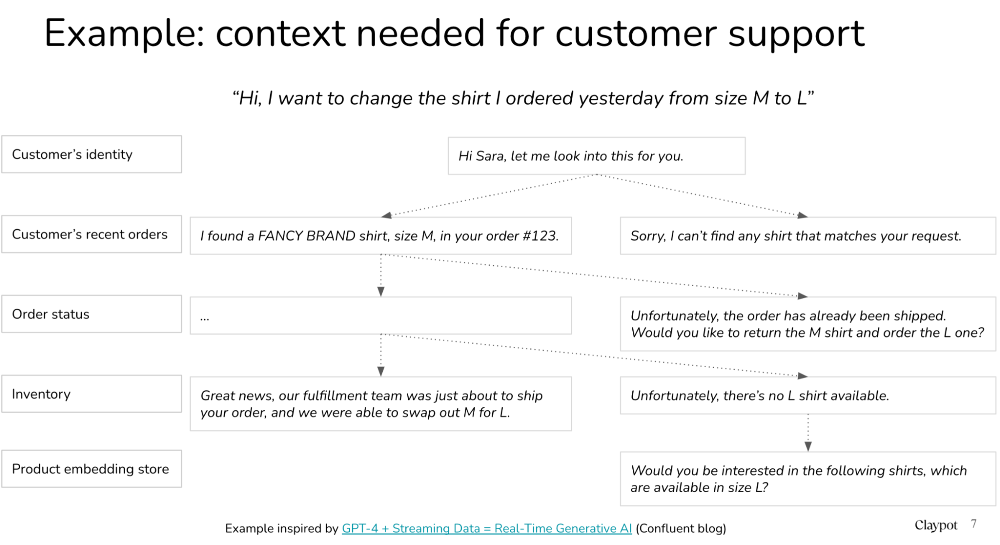
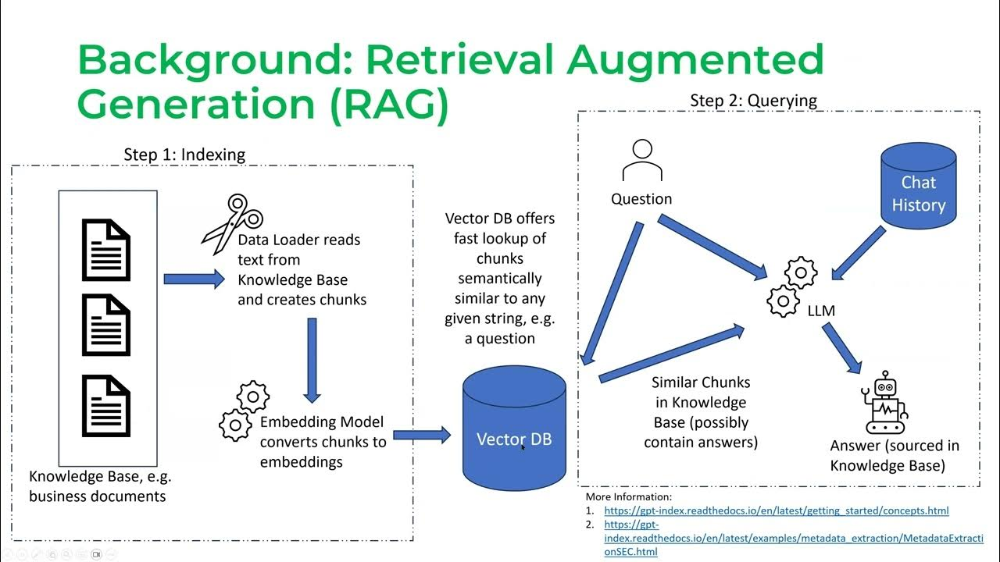
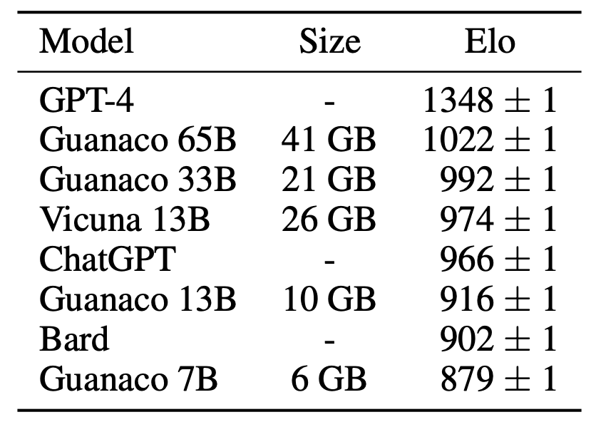
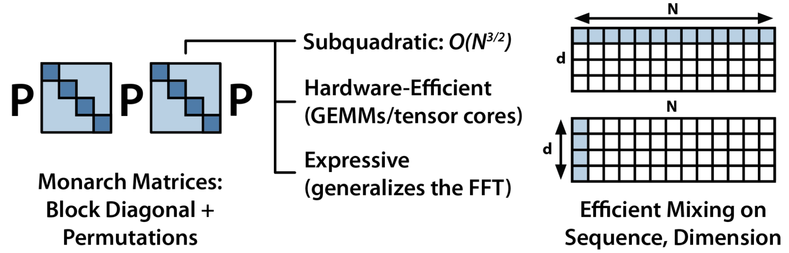
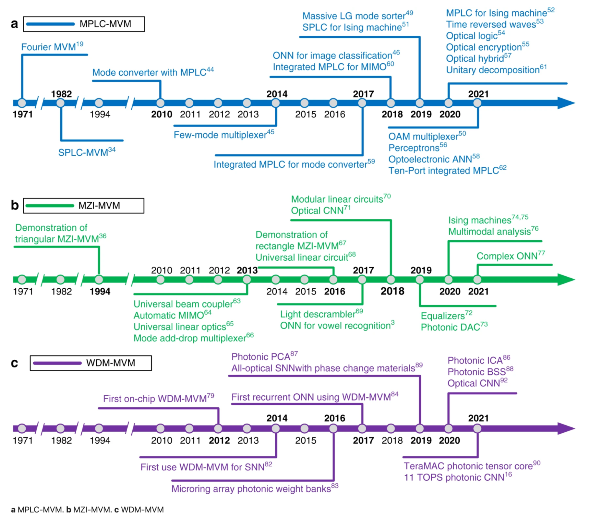
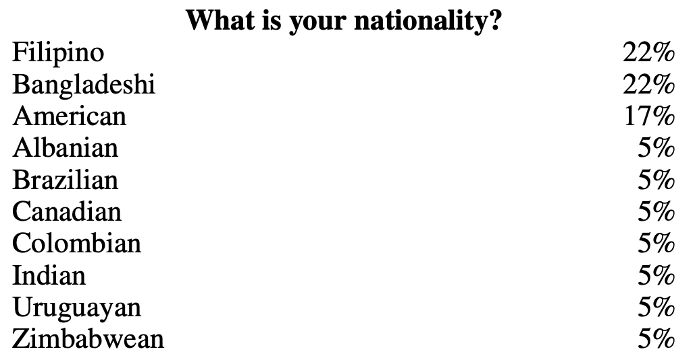
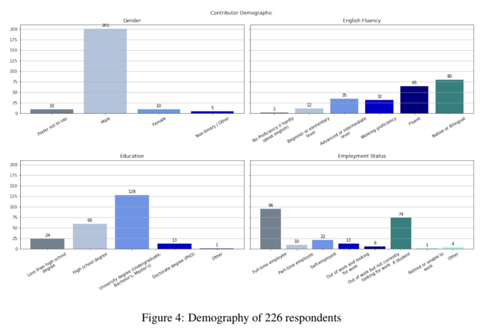
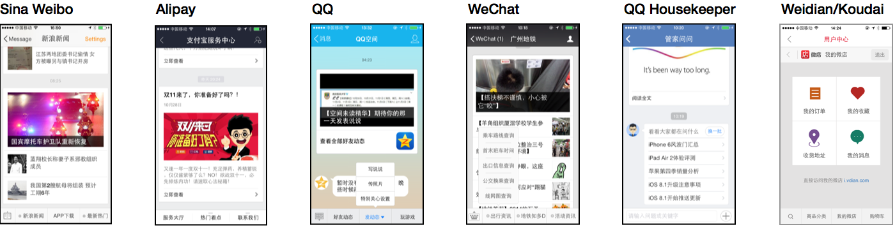
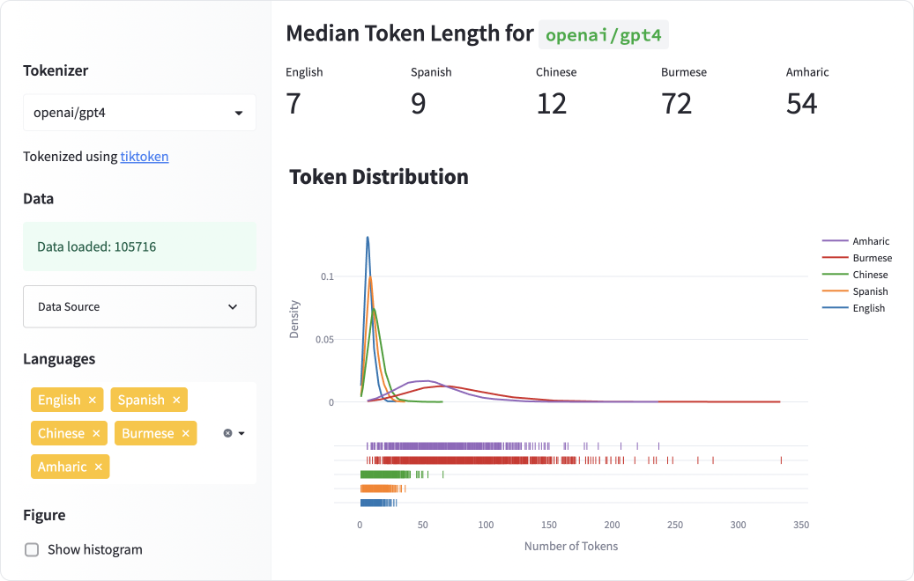

> 本文翻译存在问题。比如 LLM 翻译为「法律硕士」，注意甄别。 

Never before in my life had I seen so many smart people working on the same goal: making LLMs better.  

我一生中从未见过如此多的聪明人为同一个目标而努力：让法律硕士变得更好。  

After talking to many people working in both industry and academia, I noticed the 10 major research directions that emerged.  

在与许多产业界和学术界人士交流后，我注意到出现了 10 个主要研究方向。  

The first two directions, hallucinations and context learning, are probably the most talked about today.  

前两个方向，即幻觉和情境学习，可能是当今最热门的话题。  

I’m the most excited about numbers 3 (multimodality), 5 (new architecture), and 6 (GPU alternatives).  

我最感兴趣的是第 3 项（多模式）、第 5 项（新架构）和第 6 项（GPU 替代方案）。

___

___

## 1\. Reduce and measure hallucinations  

1.减少和测量幻觉

[Hallucination](https://huyenchip.com/2023/05/02/rlhf.html#rlhf_and_hallucination) is a heavily discussed topic already so I’ll be quick. Hallucination happens when an AI model makes stuff up. For many creative use cases, hallucination is a feature.  

幻觉是一个已经被大量讨论过的话题，所以我长话短说。当人工智能模型胡编乱造时，就会产生幻觉。对于许多创意用例来说，幻觉是一种功能。  

However, for most other use cases, hallucination is a bug.  

然而，对于大多数其他使用情况来说，幻觉是一个错误。  

I was at a panel on LLM with Dropbox, Langchain, Elastics, and Anthropic recently, and the #1 roadblock they see for companies to adopt LLMs in production is hallucination.  

最近，我与 Dropbox、Langchain、Elastics 和 Anthropic 一起参加了一个关于 LLM 的讨论会，他们认为公司在生产中采用 LLM 的第一大障碍是幻觉。

Mitigating hallucination and developing metrics to measure hallucination is a blossoming research topic, and I’ve seen many startups focus on this problem.  

减轻幻觉和制定衡量幻觉的标准是一个蓬勃发展的研究课题，我看到许多初创公司都在关注这个问题。  

There are also ad-hoc tips to reduce hallucination, such as adding more context to the prompt, chain-of-thought, self-consistency, or asking your model to be concise in its response.  

此外，还有一些减少幻觉的临时提示，如在提示中添加更多的上下文、思维链、自我一致性，或要求你的模型在回答时简明扼要。

To learn more about hallucination:  

了解更多有关幻觉的信息：

-   [Survey of Hallucination in Natural Language Generation](https://arxiv.org/abs/2202.03629) (Ji et al., 2022)  
    
    自然语言生成中的幻觉调查（Ji 等人，2022 年）
-   [How Language Model Hallucinations Can Snowball](https://arxiv.org/abs/2305.13534) (Zhang et al., 2023)  
    
    语言模型幻觉如何像滚雪球一样越滚越大（Zhang 等人，2023 年）
-   [A Multitask, Multilingual, Multimodal Evaluation of ChatGPT on Reasoning, Hallucination, and Interactivity](https://arxiv.org/abs/2302.04023) (Bang et al., 2023)  
    
    多任务、多语言、多模态评估 ChatGPT 对推理、幻觉和互动性的影响（Bang 等人，2023 年）
-   [Contrastive Learning Reduces Hallucination in Conversations](https://arxiv.org/abs/2212.10400) (Sun et al., 2022)  
    
    对比学习可减少对话中的幻觉（Sun 等人，2022 年）
-   [Self-Consistency Improves Chain of Thought Reasoning in Language Models](https://arxiv.org/abs/2203.11171) (Wang et al., 2022)  
    
    自我一致性改进了语言模型中的思维链推理（Wang 等人，2022年）
-   [SelfCheckGPT: Zero-Resource Black-Box Hallucination Detection for Generative Large Language Models](https://arxiv.org/abs/2303.08896) (Manakul et al., 2023)  
    
    SelfCheckGPT：用于生成式大型语言模型的零资源黑盒幻觉检测（Manakul 等人，2023 年）
-   A simple example of fact-checking and hallucination by [NVIDIA’s NeMo-Guardrails](https://github.com/NVIDIA/NeMo-Guardrails/blob/main/examples/grounding_rail/README.md#grounding-fact-checking-and-hallucination)  
    
    英伟达™（NVIDIA®）NeMo-Guardrails 验证事实和产生幻觉的一个简单例子

## 2\. Optimize context length and context construction  

2.优化上下文长度和上下文结构

A vast majority of questions require context.  

绝大多数问题都需要联系上下文。  

For example, if we ask ChatGPT: “What’s the best Vietnamese restaurant?”, the context needed would be “where” because the best Vietnamese restaurant in Vietnam would be different from the best Vietnamese in the US.  

例如，如果我们问 ChatGPT："最好的越南餐馆是哪家？"，所需的语境是 "哪里"，因为越南最好的越南餐馆和美国最好的越南餐馆是不同的。

According to this cool paper [SituatedQA](https://arxiv.org/pdf/2109.06157.pdf) (Zhang & Choi, 2021), a significant proportion of information-seeking questions have context-dependent answers, e.g. roughly 16.5% of the [Natural Questions NQ-Open dataset](https://ai.google.com/research/NaturalQuestions). Personally, I suspect that this percentage would be even higher for enterprise use cases.  

根据这篇很酷的论文 SituatedQA（Zhang & Choi，2021 年），很大一部分信息搜索问题的答案都与上下文有关，例如，在自然问题 NQ-Open 数据集中约占 16.5%。我个人认为，在企业用例中，这一比例会更高。  

For example, say a company builds a chatbot for customer support, for this chatbot to answer any customer question about any product, the context needed might be that customer’s history or that product’s information.  

例如，如果一家公司为客户支持建立了一个聊天机器人，要让这个聊天机器人回答客户关于任何产品的任何问题，所需的上下文可能是该客户的历史或该产品的信息。

Because the model “learns” from the context provided to it, this process is also called context learning.  

由于模型是从提供给它的上下文中 "学习 "的，因此这一过程也被称为上下文学习。

Context length is especially important for RAG – [Retrieval Augmented Generation](https://arxiv.org/abs/2005.11401) (Lewis et al., 2020) – which has emerged to be the predominant pattern for LLM industry use cases. For those not yet swept away in the RAG rage, RAG works in two phases:  

语境长度对于 RAG（Retrieval Augmented Generation）（刘易斯等人，2020 年）尤为重要，RAG 已成为 LLM 行业用例的主要模式。对于那些尚未被 RAG 狂潮席卷的人来说，RAG 的工作分为两个阶段：

Phase 1: chunking (also known as indexing)  

第 1 阶段：分块（又称索引编制）

1.  Gather all the documents you want your LLM to use  
    
    收集您希望法律硕士使用的所有文件
2.  Divide these documents into chunks that can be fed into your LLM to generate embeddings and store these embeddings in a vector database.  
    
    将这些文档分成若干块，然后输入 LLM 生成嵌入式，并将这些嵌入式存储到向量数据库中。

Phase 2: querying 第 2 阶段：查询

1.  When user sends a query, like “_Does my insurance policy pay for this drug X_”, your LLM converts this query into an embedding, let’s call it QUERY\_EMBEDDING  
    
    当用户发送查询，如 "我的保险单是否支付这种药物 X "时，您的 LLM 会将此查询转换为嵌入，我们称之为 QUERY\_EMBEDDING
2.  Your vector database fetches the chunks whose embeddings are the most similar to QUERY\_EMBEDDING  
    
    您的矢量数据库会获取嵌入与 QUERY\_EMBEDDING 最为相似的数据块。

Screenshot from [Jerry Liu’s talk on LlamaIndex](https://www.youtube.com/watch?v=njzB6fm0U8g) (2023)  

Jerry Liu 关于 LlamaIndex 的演讲截图（2023 年）

The longer the context length, the more chunks we can squeeze into the context. The more information the model has access to, the better its response will be, right?  

上下文长度越长，我们就能在上下文中挤出越多的信息块。模型获取的信息越多，它的响应就越好，不是吗？

Not always. How much context a model can use and how efficiently that model will use it are two different questions.  

并非总是如此。一个模型可以使用多少上下文，以及该模型使用上下文的效率如何，这是两个不同的问题。  

In parallel with the effort to increase model context length is the effort to make the context more efficient. Some people call it “prompt engineering” or “prompt construction”.  

在努力增加模型上下文长度的同时，我们也在努力提高上下文的效率。有人称之为 "快速工程 "或 "快速构建"。  

For example, a paper that has made the rounds recently is about how models are much better at understanding information at the beginning and the end of the index rather than in the middle of it – [Lost in the Middle: How Language Models Use Long Contexts](https://arxiv.org/abs/2307.03172) (Liu et al., 2023).  

例如，最近有一篇论文谈到了模型如何更好地理解索引开头和结尾的信息，而不是中间的信息--《迷失在中间：语言模型如何使用长语境》（Liu et al.）

## 3\. Incorporate other data modalities  

3.纳入其他数据模式

Multimodality, IMO, is so powerful and yet so underrated. There are many reasons for multimodality.  

在我看来，多模态是如此强大，却又如此被低估。采用多模式有很多原因。

First, there are many use cases where multimodal data is required, especially in industries that deal with a mixture of data modalities such as healthcare, robotics, e-commerce, retail, gaming, entertainment, etc.  

首先，许多使用案例都需要多模态数据，尤其是在医疗保健、机器人、电子商务、零售、游戏、娱乐等混合数据模态的行业。  

Examples: 例如

-   Oftentimes, medical predictions require both text (e.g. doctor’s notes, patients’ questionnaires) and images (e.g. CT, X-ray, MRI scans).  
    
    通常，医学预测需要文本（如医生笔记、患者问卷）和图像（如 CT、X 光、核磁共振成像扫描）。
-   Product metadata often contains images, videos, descriptions, and even tabular data (e.g. production date, weight, color).  
    
    产品元数据通常包含图片、视频、描述，甚至表格数据（如生产日期、重量、颜色）。  
    
    You might want to automatically fill in missing product information based on users’ reviews or product photos.  
    
    您可能希望根据用户的评论或产品照片自动填写缺失的产品信息。  
    
    You might want to enable users to search for products using visual information, like shape or color.  
    
    您可能希望让用户能够使用视觉信息（如形状或颜色）搜索产品。

Second, multimodality promises a big boost in model performance.  

其次，多模态技术有望大幅提升模型性能。  

Shouldn’t a model that can understand both text and images perform better than a model that can only understand text?  

一个既能理解文字又能理解图像的模型，难道不应该比一个只能理解文字的模型表现更好吗？  

Text-based models require so much text that there’s a realistic concern that [we’ll soon run out of Internet data to train text-based models](https://huyenchip.com/2023/05/02/rlhf.html#data_bottleneck_for_pretraining). Once we run out of text, we’d need to leverage other data modalities.  

基于文本的模型需要大量文本，以至于我们担心很快就会用完互联网数据来训练基于文本的模型。一旦文本耗尽，我们就需要利用其他数据模式。

Flamingo architecture (Alayrac et al., 2022)  

火烈鸟建筑（Alayrac 等人，2022 年）

One use case I’m especially excited about is that multimodality can enable visually impaired people to browse the Internet and navigate the real world.  

令我特别兴奋的是，多模态技术可以帮助视障人士浏览互联网和浏览现实世界。

Cool multimodal work: 很酷的多模式作品

-   [\[CLIP\] Learning Transferable Visual Models From Natural Language Supervision](https://arxiv.org/abs/2103.00020) (OpenAI, 2021)  
    
    \[CLIP\] 从自然语言监督中学习可转移的视觉模型（OpenAI，2021 年）
-   [Flamingo: a Visual Language Model for Few-Shot Learning](https://arxiv.org/abs/2204.14198) (DeepMind, 2022)  
    
    火烈鸟：用于快速学习的视觉语言模型（DeepMind，2022 年）
-   [BLIP-2: Bootstrapping Language-Image Pre-training with Frozen Image Encoders and Large Language Models](https://arxiv.org/abs/2301.12597) (Salesforce, 2023)  
    
    BLIP-2：使用冻结图像编码器和大型语言模型进行语言图像预训练引导（Salesforce，2023 年）
-   [KOSMOS-1: Language Is Not All You Need: Aligning Perception with Language Models](https://arxiv.org/abs/2302.14045) (Microsoft, 2023)  
    
    KOSMOS-1：语言并非你所需要的全部：将感知与语言模型相结合（微软，2023 年）
-   [PaLM-E: An embodied multimodal language model](https://ai.googleblog.com/2023/03/palm-e-embodied-multimodal-language.html) (Google, 2023)  
    
    PaLM-E：具身多模态语言模型（谷歌，2023 年）
-   [LLaVA: Visual Instruction Tuning](https://arxiv.org/abs/2304.08485) (Liu et al., 2023)  
    
    LLaVA：视觉指令调整（Liu 等人，2023 年）
-   [NeVA: NeMo Vision and Language Assistant](https://catalog.ngc.nvidia.com/orgs/nvidia/teams/playground/models/neva) (NVIDIA, 2023)  
    
    NeVA：NeMo 视觉和语言助手（英伟达，2023 年）

I’ve been working on a post on multimodality that hopefully I can share soon!  

我一直在写一篇关于多模态的文章，希望能尽快与大家分享！

## 4\. Make LLMs faster and cheaper  

4.让法律硕士更快、更便宜

When GPT-3.5 first came out in late November 2022, many people had concerns about latency and cost of using it in production.  

当 GPT-3.5 于 2022 年 11 月底首次发布时，很多人都对在生产中使用它的延迟和成本表示担忧。  

However, latency/cost analysis has changed rapidly since then.  

然而，从那时起，延迟/成本分析已经发生了迅速变化。  

Within half a year, the community found a way to create a model that came pretty close to GPT-3.5 in terms of performance, yet required just under 2% of GPT-3.5’s memory footprint.  

不到半年时间，社区就找到了一种方法，创建了一种在性能上非常接近 GPT-3.5 的模型，但所需内存占用仅为 GPT-3.5 的 2%。

My takeaway: if you create something good enough, people will figure out a way to make it fast and cheap.  

我的启示是：如果你创造的东西足够好，人们就会想出办法来快速、廉价地制造它。

<table data-immersive-translate-effect="1" data-immersive_translate_walked="1aad5c6d-c570-4676-a11e-2c443bef0a75"><tbody data-immersive-translate-effect="1" data-immersive_translate_walked="1aad5c6d-c570-4676-a11e-2c443bef0a75"><tr data-immersive-translate-effect="1" data-immersive_translate_walked="1aad5c6d-c570-4676-a11e-2c443bef0a75"><td data-immersive-translate-effect="1" data-immersive_translate_walked="1aad5c6d-c570-4676-a11e-2c443bef0a75"><strong data-immersive-translate-effect="1" data-immersive_translate_walked="1aad5c6d-c570-4676-a11e-2c443bef0a75">Date&nbsp;日期</strong></td><td data-immersive-translate-effect="1" data-immersive_translate_walked="1aad5c6d-c570-4676-a11e-2c443bef0a75"><strong data-immersive-translate-effect="1" data-immersive_translate_walked="1aad5c6d-c570-4676-a11e-2c443bef0a75">Model&nbsp;模型</strong></td><td data-immersive-translate-effect="1" data-immersive_translate_walked="1aad5c6d-c570-4676-a11e-2c443bef0a75"><strong data-immersive-translate-effect="1" data-immersive_translate_walked="1aad5c6d-c570-4676-a11e-2c443bef0a75"># params&nbsp;# 参数</strong></td><td data-immersive-translate-effect="1" data-immersive_translate_walked="1aad5c6d-c570-4676-a11e-2c443bef0a75"><strong data-immersive-translate-effect="1" data-immersive_translate_walked="1aad5c6d-c570-4676-a11e-2c443bef0a75">Quantization&nbsp;量化</strong></td><td data-immersive-translate-effect="1" data-immersive_translate_walked="1aad5c6d-c570-4676-a11e-2c443bef0a75"><strong data-immersive-translate-effect="1" data-immersive_translate_walked="1aad5c6d-c570-4676-a11e-2c443bef0a75">Memory to finetune&nbsp;内存微调</strong></td><td data-immersive-translate-effect="1" data-immersive_translate_walked="1aad5c6d-c570-4676-a11e-2c443bef0a75"><strong data-immersive-translate-effect="1" data-immersive_translate_walked="1aad5c6d-c570-4676-a11e-2c443bef0a75">Can be trained on 可在以下方面进行培训</strong></td></tr><tr data-immersive-translate-effect="1" data-immersive_translate_walked="1aad5c6d-c570-4676-a11e-2c443bef0a75"><td data-immersive-translate-effect="1" data-immersive_translate_walked="1aad5c6d-c570-4676-a11e-2c443bef0a75">Nov 2022 &nbsp;2022 年 11 月</td><td data-immersive-translate-effect="1" data-immersive_translate_walked="1aad5c6d-c570-4676-a11e-2c443bef0a75">GPT-3.5</td><td data-immersive-translate-effect="1" data-immersive_translate_walked="1aad5c6d-c570-4676-a11e-2c443bef0a75">175B</td><td data-immersive-translate-effect="1" data-immersive_translate_walked="1aad5c6d-c570-4676-a11e-2c443bef0a75">16-bit &nbsp;16 位</td><td data-immersive-translate-effect="1" data-immersive_translate_walked="1aad5c6d-c570-4676-a11e-2c443bef0a75">375GB</td><td data-immersive-translate-effect="1" data-immersive_translate_walked="1aad5c6d-c570-4676-a11e-2c443bef0a75">Many, many machines &nbsp;许许多多的机器</td></tr><tr data-immersive-translate-effect="1" data-immersive_translate_walked="1aad5c6d-c570-4676-a11e-2c443bef0a75"><td data-immersive-translate-effect="1" data-immersive_translate_walked="1aad5c6d-c570-4676-a11e-2c443bef0a75">Mar 2023 &nbsp;2023 年 3 月</td><td data-immersive-translate-effect="1" data-immersive_translate_walked="1aad5c6d-c570-4676-a11e-2c443bef0a75"><a href="https://crfm.stanford.edu/2023/03/13/alpaca.html" data-immersive-translate-effect="1" data-immersive_translate_walked="1aad5c6d-c570-4676-a11e-2c443bef0a75">Alpaca 7B&nbsp;羊驼 7B</a></td><td data-immersive-translate-effect="1" data-immersive_translate_walked="1aad5c6d-c570-4676-a11e-2c443bef0a75">7B</td><td data-immersive-translate-effect="1" data-immersive_translate_walked="1aad5c6d-c570-4676-a11e-2c443bef0a75">16-bit &nbsp;16 位</td><td data-immersive-translate-effect="1" data-immersive_translate_walked="1aad5c6d-c570-4676-a11e-2c443bef0a75">15GB</td><td data-immersive-translate-effect="1" data-immersive_translate_walked="1aad5c6d-c570-4676-a11e-2c443bef0a75">Gaming desktop &nbsp;游戏台式机</td></tr><tr data-immersive-translate-effect="1" data-immersive_translate_walked="1aad5c6d-c570-4676-a11e-2c443bef0a75"><td data-immersive-translate-effect="1" data-immersive_translate_walked="1aad5c6d-c570-4676-a11e-2c443bef0a75">May 2023 &nbsp;2023 年 5 月</td><td data-immersive-translate-effect="1" data-immersive_translate_walked="1aad5c6d-c570-4676-a11e-2c443bef0a75"><a href="https://arxiv.org/abs/2305.14314" data-immersive-translate-effect="1" data-immersive_translate_walked="1aad5c6d-c570-4676-a11e-2c443bef0a75">Guanaco 7B&nbsp;Guanaco 7B</a></td><td data-immersive-translate-effect="1" data-immersive_translate_walked="1aad5c6d-c570-4676-a11e-2c443bef0a75">7B</td><td data-immersive-translate-effect="1" data-immersive_translate_walked="1aad5c6d-c570-4676-a11e-2c443bef0a75">4-bit &nbsp;4 位</td><td data-immersive-translate-effect="1" data-immersive_translate_walked="1aad5c6d-c570-4676-a11e-2c443bef0a75">6GB</td><td data-immersive-translate-effect="1" data-immersive_translate_walked="1aad5c6d-c570-4676-a11e-2c443bef0a75">Any Macbook &nbsp;任何 Macbook</td></tr></tbody></table>

Below is Guanaco 7B’s performance compared to ChatGPT GPT-3.5 and GPT-4, as reported in the Guanco paper. Caveat: in general, the performance comparison is far from perfect.  

以下是 Guanaco 7B 的性能与 ChatGPT GPT-3.5 和 GPT-4 的比较，如 Guanco 论文中所述。注意：总的来说，性能比较远非完美。  

LLM evaluation is very, very hard.  

法律硕士评估非常非常困难。

Four years ago, when I started working on the notes that would later become the section **[Model Compression](https://learning.oreilly.com/library/view/designing-machine-learning/9781098107956/ch07.html#model_compression)** for the book [**Designing Machine Learning Systems**](https://www.amazon.com/Designing-Machine-Learning-Systems-Production-Ready/dp/1098107969), I wrote about four major techniques for model optimization/compression:  

四年前，当我开始为《设计机器学习系统》一书撰写后来成为 "模型压缩 "部分的笔记时，我写下了四种主要的模型优化/压缩技术：

1.  **Quantization**: by far the most general model optimization method. Quantization reduces a model’s size by using fewer bits to represent its parameters, e.g.  
    
    量化：迄今为止最通用的模型优化方法。量化通过使用较少的比特来表示模型的参数，从而减小模型的大小，例如  
    
    instead of using 32 bits to represent a float, use only 16 bits, or even 4 bits.  
    
    与其用 32 位来表示浮点数，不如只用 16 位，甚至 4 位。
2.  **Knowledge distillation**: a method in which a small model (student) is trained to mimic a larger model or ensemble of models (teacher).  
    
    知识提炼：一种训练小模型（学生）模仿大模型或模型组合（教师）的方法。
3.  **Low-rank factorization**: the key idea here is to replace high-dimensional tensors with lower-dimensional tensors to reduce the number of parameters.  
    
    低阶因式分解：这里的关键思路是用低维张量代替高维张量，以减少参数数量。  
    
    For example, you can decompose a 3x3 tensor into the product of a 3x1 and a 1x3 tensor, so that instead of having 9 parameters, you have only 6 parameters.  
    
    例如，可以将 3x3 张量分解为 3x1 和 1x3 张量的乘积，这样就不再需要 9 个参数，而只需要 6 个参数。
4.  **Pruning 修剪**

All these four techniques are still relevant and popular today. Alpaca was trained using knowledge distillation.  

所有这四种技术在今天仍然适用和流行。羊驼是用知识提炼法训练出来的。  

QLoRA used a combination of low-rank factorization and quantization.  

QLoRA 结合使用了低阶因式分解和量化技术。

## 5\. Design a new model architecture  

5.设计新的模型架构

Since AlexNet in 2012, we’ve seen many architectures go in and out of fashion, including LSTM, seq2seq. Compared to those, Transformer is incredibly sticky.  

自 2012 年的 AlexNet 以来，我们目睹了许多架构的兴衰，包括 LSTM、seq2seq 等。与之相比，Transformer 的粘性令人难以置信。  

It’s been around since 2017. It’s a big question mark how much longer this architecture will be in vogue.  

它从 2017 年就开始流行了。这种建筑还能流行多久，还是个大问号。

Developing a new architecture to outperform Transformer isn’t easy. Transformer has been so heavily optimized over the last 6 years.  

开发一种新的架构来超越 Transformer 并不容易。在过去的 6 年中，Transformer 已经进行了大量优化。  

This new architecture has to be performing at the scale that people care about today, on the hardware that people care about. Side note: [Transformer was originally designed by Google to run fast on TPUs](https://timdettmers.com/2018/10/17/tpus-vs-gpus-for-transformers-bert/), and only later optimized on GPUs.  

这种新架构必须在人们关心的硬件上以人们目前关心的规模运行。题外话：Transformer 最初是谷歌为在 TPU 上快速运行而设计的，后来才在 GPU 上进行了优化。

There was a lot of excitement in 2021 around S4 from Chris Ré’s lab – see [Efficiently Modeling Long Sequences with Structured State Spaces](https://arxiv.org/abs/2111.00396) (Gu et al., 2021). I’m not quite sure what happened to it. Chris Ré’s lab is still very invested in developing new architecture, most recently with their architecture [Monarch Mixer](https://together.ai/blog/monarch-mixer) (Fu et al., 2023) in collaboration with the startup [Together](https://together.ai/blog/monarch-mixer).  

2021年，克里斯-雷（Chris Ré）实验室的S4研究曾引起了很大的轰动--见《利用结构化状态空间高效建模长序列》（Gu等人，2021年）。我不太清楚后来发生了什么。克里斯-雷的实验室仍然致力于开发新的架构，最近与初创公司 Together 合作开发的架构 Monarch Mixer（Fu 等人，2023 年）就是其中之一。

Their key idea is that for the existing Transformer architecture, the complexity of attention is quadratic in sequence length and the complexity of an MLP is quadratic in model dimension.  

他们的主要想法是，对于现有的 Transformer 架构，注意力的复杂度是序列长度的二次方，而 MLP 的复杂度是模型维度的二次方。  

An architecture with subquadratic complexity would be more efficient.  

具有亚二次方复杂性的架构将更加高效。

I’m sure many other labs are working on this idea, though I’m not aware of any attempt that has been made public. If you know of any, please let me know!  

我相信许多其他实验室也在研究这个想法，不过我还不知道有任何公开的尝试。如果你知道，请告诉我！

## 6\. Develop GPU alternatives  

6.开发 GPU 替代方案

GPU has been the dominating hardware for deep learning ever since AlexNet in 2012. In fact, one commonly acknowledged reason for AlexNet’s popularity is that it was the first paper to successfully use GPUs to train neural networks.  

自 2012 年的 AlexNet 以来，GPU 一直是深度学习的主流硬件。事实上，AlexNet 广受欢迎的一个公认原因是，它是第一篇成功使用 GPU 训练神经网络的论文。  

Before GPUs, if you wanted to train a model at AlexNet’s scale, you’d have to use thousands of CPUs, like the one [Google released just a few months before AlexNet](https://www.nytimes.com/2012/06/26/technology/in-a-big-network-of-computers-evidence-of-machine-learning.html). Compared to thousands of CPUs, a couple of GPUs were a lot more accessible to Ph.D. students and researchers, setting off the deep learning research boom.  

在使用 GPU 之前，如果要训练一个与 AlexNet 规模相当的模型，就必须使用成千上万的 CPU，比如谷歌在 AlexNet 发布前几个月刚刚发布的 CPU。与数以千计的 CPU 相比，几个 GPU 对博士生和研究人员来说更容易获得，从而掀起了深度学习研究的热潮。

In the last decade, many, many companies, both big corporations, and startups, have attempted to create new hardware for AI. The most notable attempts are Google’s [TPUs](https://cloud.google.com/tpu/docs/intro-to-tpu), Graphcore’s [IPUs](https://www.graphcore.ai/products/ipu) (what’s happening with IPUs?), and [Cerebras](https://www.eetimes.com/cerebras-sells-100-million-ai-supercomputer-plans-8-more/). SambaNova raised over [a billion dollars to develop new AI chips](https://spectrum.ieee.org/sambanova-ceo-ai-interview) but seems to have pivoted to being a generative AI platform.  

在过去的十年中，有很多很多的公司，无论是大公司还是初创企业，都在尝试为人工智能创造新的硬件。最显著的尝试是谷歌的 TPU、Graphcore 的 IPU（IPU 发生了什么？SambaNova 筹集了超过 10 亿美元的资金来开发新的人工智能芯片，但似乎已转向成为一个生成式人工智能平台。

For a while, there has been a lot of anticipation around quantum computing, with key players being:  

一段时间以来，人们对量子计算充满了期待，其中的主要参与者包括：

-   [IBM’s QPU IBM 的 QPU](https://www.ibm.com/quantum)
-   Google’s Quantum computer reported [a major milestone in quantum error reduction](https://www.nature.com/articles/d41586-023-00536-w) earlier this year in Nature. Its quantum virtual machine is publicly accessible via [Google Colab](https://quantumai.google/quantum-virtual-machine)  
    
    谷歌的量子计算机今年早些时候在《自然》杂志上报告了量子错误减少方面的一个重要里程碑。其量子虚拟机可通过谷歌实验室（Google Colab）公开访问。
-   Research labs such as [MIT Center for Quantum Engineering](https://cqe.mit.edu/), [Max Planck Institute of Quantum Optics](https://www.mpq.mpg.de/en), [Chicago Quantum Exchange](https://chicagoquantum.org/), [Oak Ridge National Laboratory](https://quantum-roadmap.ornl.gov/), etc.  
    
    麻省理工学院量子工程中心、马克斯-普朗克量子光学研究所、芝加哥量子交易所、橡树岭国家实验室等研究实验室。

Another direction that is also super exciting is photonic chips. This is the direciton I know the least about – so please correct me if I’m wrong.  

另一个令人兴奋的方向是光子芯片。这是我最不了解的方向--如果我说错了，请指正。  

Existing chips today use electricity to move data, which consumes a lot of power and also incurs latency.  

如今，现有的芯片使用电力来传输数据，不仅耗电量大，还会产生延迟。  

Photonic chips use photons to move data, harnessing the speed of light for faster and more efficient compute.  

光子芯片使用光子来移动数据，利用光速实现更快、更高效的计算。  

Various startups in this space have raised hundreds of millions of dollars, including [Lightmatter](https://lightmatter.co/) ($270M), [Ayar Labs](https://ayarlabs.com/) ($220M), [Lightelligence](https://www.lightelligence.ai/) ($200M+), and [Luminous Computing](https://www.luminous.com/) ($115M).  

该领域的多家初创公司已融资数亿美元，包括 Lightmatter（2.7 亿美元）、Ayar Labs（2.2 亿美元）、Lightelligence（2 亿多美元）和 Luminous Computing（1.15 亿美元）。

Below is the timeline of advances of the three major methods in photonic matrix computation, from the paper [Photonic matrix multiplication lights up photonic accelerator and beyond](https://www.nature.com/articles/s41377-022-00717-8) (Zhou et al., Nature 2022). The three different methods are plane light conversion (PLC), Mach–Zehnder interferometer (MZI), and wavelength division multiplexing (WDM).  

以下是光子矩阵计算三种主要方法的进展时间表，摘自论文《光子矩阵乘法点亮光子加速器及其他》（Zhou 等，《自然》，2022 年）。这三种不同的方法是平面光转换（PLC）、马赫-泽恩德干涉仪（MZI）和波分复用（WDM）。

## 7\. Make agents usable  

7.使代理可用

Agents are LLMs that can take actions, like browsing the Internet, sending emails, making reservations, etc.  

代理是可以采取行动的 LLM，如浏览互联网、发送电子邮件、预订房间等。  

Compared to other research directions in this post, this might be the youngest direction.  

与本职位的其他研究方向相比，这可能是最年轻的方向。

Because of the novelty and the massive potential, there’s a feverish obsession with agents. [Auto-GPT](https://github.com/Significant-Gravitas/Auto-GPT) is now the 25th most popular GitHub repo ever by the number of stars. [GPT-Engineering](https://github.com/AntonOsika/gpt-engineer) is another popular repo.  

由于其新颖性和巨大潜力，人们对代理产生了狂热的痴迷。根据星级数量，Auto-GPT 现在是 GitHub 有史以来第 25 最受欢迎的软件仓库。GPT-Engineering 是另一个热门软件仓库。

Despite the excitement, there is still doubt about whether LLMs are reliable and performant enough to be entrusted with the power to act.  

尽管令人兴奋，但人们仍然怀疑法律硕士是否足够可靠，是否有足够的能力被赋予采取行动的权力。

One use case that has emerged though is the use of agents for social studies, like the famous Stanford experiment that shows that a small society of generative agents produces emergent social behaviors: _for example, starting with only a single user-specified notion that one agent wants to throw a Valentine’s Day party, the agents autonomously spread invitations to the party over the next two days, make new acquaintances, ask each other out on dates to the party …_ ([Generative Agents: Interactive Simulacra of Human Behavior](https://arxiv.org/abs/2304.03442), Park et al., 2023)  

不过，已经出现的一个应用案例是将代理用于社会研究，比如著名的斯坦福实验就表明，一个由生成代理组成的小型社会会产生新兴的社会行为：例如，从用户指定的一个代理想要举办情人节派对的单一概念开始，代理们会在接下来的两天里自主传播派对邀请函、结识新朋友、相互约会参加派对......（《生成代理：人类行为的交互式模拟》，Park 等人，2023 年）：人类行为的互动模拟》，Park 等人，2023 年)

The most notable startup in this area is perhaps Adept, founded by two Transformer co-authors (though [both already left](https://www.theinformation.com/briefings/two-co-founders-of-adept-an-openai-rival-suddenly-left-to-start-another-company)) and an ex-OpenAI VP, and has raised almost half a billion dollars to date.  

该领域最著名的初创公司可能是 Adept，它由两位《变形金刚》的共同作者（虽然两人都已离职）和一位前 OpenAI 副总裁创立，迄今已融资近 5 亿美元。  

Last year, they had a demo showing their agent browsing the Internet and adding a new account to Salesforce. I’m looking forward to seeing their new demos 🙂  

去年，他们有一个演示，展示了他们的代理浏览互联网并向 Salesforce 添加新账户的过程。我很期待看到他们的新演示 🙂

<iframe width="560" height="315" src="https://www.youtube.com/embed/a7CXIE_Gyy8" title="YouTube video player" frameborder="0" allow="accelerometer; autoplay; clipboard-write; encrypted-media; gyroscope; picture-in-picture; web-share" allowfullscreen=""></iframe>

## 8\. Improve learning from human preference  

8.改进对人类偏好的学习

[RLHF, Reinforcement Learning from Human Preference](https://huyenchip.com/2023/05/02/rlhf.html), is cool but kinda hacky. I wouldn’t be surprised if people figure out a better way to train LLMs. There are many open questions for RLHF, such as:  

RLHF，即 "从人类偏好强化学习"（Reinforcement Learning from Human Preference），很酷，但有点笨。如果人们能找到更好的方法来训练 LLM，我也不会感到惊讶。RLHF 还有很多问题有待解决，比如：

**1\. How to mathematically represent human preference?  

1.如何用数学方法表示人类的偏好？**

Currently, human preference is determined by comparison: human labeler determines if response A is better than response B.  

目前，人类的偏好是通过比较来确定的：人类标签员确定 A 反应是否优于 B 反应。  

However, it doesn’t take into account how much better response A is than response B.  

然而，这并没有考虑到 A 反应比 B 反应好多少。

**2\. What’s human preference?  

2.人类的偏好是什么？**

Anthropic measured the quality of their model’s responses along the three axes: helpful, honest, and harmless. See [Constitutional AI: Harmlessness from AI Feedback](https://arxiv.org/abs/2212.08073) (Bai et al., 2022).  

Anthropic沿着三个轴线衡量了他们模型的响应质量：有益的、诚实的和无害的。参见《人工智能宪法：人工智能反馈的无害性》（Bai 等人，2022 年）。

DeepMind tries to generate responses that please the most people. See [Fine-tuning language models to find agreement among humans with diverse preferences](https://www.deepmind.com/publications/fine-tuning-language-models-to-find-agreement-among-humans-with-diverse-preferences), (Bakker et al., 2022).  

DeepMind 试图生成能取悦最多人的回复。请参阅《微调语言模型，在具有不同偏好的人类中寻找一致》（Bakker 等人，2022 年）。

Also, do we want AIs that can take a stand or a vanilla AI that shies away from any potentially controversial topic?  

此外，我们是想要能表明立场的人工智能，还是想要对任何可能有争议的话题都避而远之的虚无人工智能？

**3\. Whose preference is “human” preference, taking into account the differences in cultures, religions, political leanings, etc.?  

3.考虑到文化、宗教、政治倾向等方面的差异，谁的偏好才是 "人 "的偏好？**

There are a lot of challenges in obtaining training data that can be sufficiently representative of all the potential users.  

要获得能充分代表所有潜在用户的训练数据，面临着很多挑战。

For example, for OpenAI’s InstructGPT data, there was no labeler above 65 years old. Labelers are predominantly Filipino and Bangladeshi. See [InstructGPT: Training language models to follow instructions with human feedback](https://arxiv.org/abs/2203.02155) (Ouyang et al., 2022).  

例如，在 OpenAI 的 InstructGPT 数据中，没有 65 岁以上的贴标签者。贴标签者主要是菲律宾人和孟加拉国人。参见 InstructGPT：训练语言模型在人类反馈下遵循指令（欧阳等人，2022 年）。

Community-led efforts, while admirable in their intention, can lead to biased data. For example, for the OpenAssistant dataset, 201 out of 222 (90.5%) respondents identify as male. [Jeremy Howard has a great Twitter thread on this](https://twitter.com/jeremyphoward/status/1647763133665271808/photo/1).  

社区主导的努力虽然其初衷令人钦佩，但却可能导致数据的偏差。例如，在 OpenAssistant 数据集中，222 位受访者中有 201 位（90.5%）认为自己是男性。杰里米-霍华德（Jeremy Howard）在 Twitter 上有一个很好的主题。

## 9\. Improve the efficiency of the chat interface  

9.提高聊天界面的效率

Ever since ChatGPT, there have been multiple discussions on whether chat is a suitable interface for a wide range of tasks.  

自 ChatGPT 以来，人们一直在讨论聊天是否是一个适合各种任务的界面。

-   [Natural language is the lazy user interface](https://austinhenley.com/blog/naturallanguageui.html) (Austin Z. Henley, 2023)  
    
    自然语言是懒惰的用户界面（Austin Z. Henley，2023 年）
-   [Why Chatbots Are Not the Future](https://wattenberger.com/thoughts/boo-chatbots) (Amelia Wattenberger, 2023)  
    
    为什么聊天机器人不是未来（Amelia Wattenberger，2023 年）
-   [What Types of Questions Require Conversation to Answer? A Case Study of AskReddit Questions](https://arxiv.org/abs/2303.17710) (Huang et al., 2023)  
    
    哪类问题需要对话才能回答？AskReddit 问题案例研究》（Huang 等人，2023 年）
-   [AI chat interfaces could become the primary user interface to read documentation](https://idratherbewriting.com/blog/ai-chat-interfaces-are-the-new-user-interface-for-docs) (Tom Johnson, 2023)  
    
    人工智能聊天界面可能成为阅读文档的主要用户界面（汤姆-约翰逊，2023 年）
-   [Interacting with LLMs with Minimal Chat](https://eugeneyan.com/writing/llm-ux/) (Eugene Yan, 2023)  
    
    用最少的聊天与法学硕士互动（Eugene Yan，2023 年）

However, this is not a new discussion. In many countries, especially in Asia, chat has been used as the interface for super apps for about a decade. [Dan Grover had this discussion back in 2014](http://dangrover.com/blog/2014/12/01/chinese-mobile-app-ui-trends.html).  

然而，这并不是一个新的讨论。在许多国家，尤其是亚洲，聊天作为超级应用程序的界面已经使用了大约十年。丹-格罗弗早在 2014 年就进行过这样的讨论。

Chat as a universal interface for Chinese apps (Dan Grover, 2014)  

聊天作为中国应用程序的通用界面（丹-格罗弗，2014年）

The discussion again got tense in 2016, when many people thought apps were dead and chatbots would be the future.  

2016 年，当许多人认为应用程序已死、聊天机器人将成为未来时，讨论再次变得紧张起来。

-   [On chat as interface](https://acroll.medium.com/on-chat-as-interface-92a68d2bf854) (Alistair Croll, 2016)  
    
    关于作为界面的聊天（阿利斯泰尔-克罗尔，2016 年）
-   [Is the Chatbot Trend One Big Misunderstanding?](https://www.technologyreview.com/2016/04/25/8510/is-the-chatbot-trend-one-big-misunderstanding/) (Will Knight, 2016)  
    
    聊天机器人趋势是一个大误区吗？ 威尔-奈特，2016年
-   [Bots won’t replace apps. Better apps will replace apps](http://dangrover.com/blog/2016/04/20/bots-wont-replace-apps.html) (Dan Grover, 2016)  
    
    机器人不会取代应用程序。更好的应用程序将取代应用程序（Dan Grover，2016 年）

Personally, I love the chat interface because of the following reasons:  

我个人非常喜欢聊天界面，原因如下：

1.  Chat is an interface that everyone, even people without previous exposure to computers or the Internet, can learn to use quickly.  
    
    聊天是一种人人都能快速学会使用的界面，即使是以前没有接触过电脑或互联网的人也可以使用。  
    
    When I volunteered at a low-income residential neighborhood (are we allowed to say slum?) in Kenya in the early 2010s, I was blown away by how comfortable everyone there was with doing banking on their phone, via texts.  
    
    2010 年代初，我在肯尼亚的一个低收入住宅区（我们可以说是贫民窟吗？）做志愿者时，那里的每个人都能自如地通过手机短信办理银行业务，这让我大吃一惊。  
    
    No one in that neighborhood had a computer.  
    
    那附近没有人有电脑。
2.  Chat interface is accessible. You can use voice instead of text if your hands are busy.  
    
    聊天界面无障碍。如果手忙脚乱，可以用语音代替文字。
3.  Chat is also an incredibly robust interface – you can give it any request and it’ll give back a response, even if the response isn’t good.  
    
    聊天也是一个非常强大的界面--你可以向它提出任何请求，它都会做出回应，即使回应并不好。

However, there are certain areas that I think the chat interface can be improved upon.  

不过，我认为聊天界面在某些方面还有待改进。

1.  Multiple messages per turn  
    
    每轮多条信息
    
    Currently, we pretty much assume one message per turn. This is not how my friends and I text.  
    
    目前，我们几乎是每轮只发一条信息。我和我的朋友们可不是这样发短信的。  
    
    Often, I need multiple messages to complete my thought, because I need to insert different data (e.g.  
    
    通常情况下，我需要多条信息才能完成我的想法，因为我需要插入不同的数据（例如  
    
    images, locations, links), I forgot something in the previous messages, or I just don’t feel like putting everything into a massive paragraph.  
    
    图片、地点、链接），我在之前的信息中忘记了一些东西，或者我只是不想把所有东西都写进一大段话里。
    
2.  Multimodal input 多模式输入
    
    In the realm of multimodal applications, most energy is spent on building better models, and very little on building better interfaces. Take [Nvidia’s NeVA chatbot](https://catalog.ngc.nvidia.com/orgs/nvidia/teams/playground/models/neva). I’m not a UX expert, but I suspect there might be room for UX improvement here.  
    
    在多模态应用领域，大部分精力都花在建立更好的模型上，而很少花在建立更好的界面上。就拿 Nvidia 的 NeVA 聊天机器人来说吧。我不是用户体验专家，但我认为这里的用户体验可能还有改进的余地。
    
    P.S. Sorry the NeVA team for calling you out. Even with this interface, your work is super cool!  
    
    附注：抱歉，NeVA 团队把你叫出来了。即使是这样的界面，你的作品还是超酷的！
    
    
    
3.  Incorporating generative AI into your workflows  
    
    将生成式人工智能融入工作流程
    
    Linus Lee covered this point well in his talk [Generative AI interface beyond chats](https://www.youtube.com/watch?v=rd-J3hmycQs). For example, if you want to ask a question about a column of a chart you’re working on, you should be able just point to that column and ask a question.  
    
    Linus Lee 在他的演讲 "聊天之外的人工智能生成界面 "中很好地阐述了这一点。例如，如果你想就正在制作的图表中的某一列提问，你应该可以直接指向该列并提问。
    
4.  Editing and deletion of messages  
    
    编辑和删除信息
    
    How would editing or deletion of a user input change the conversation flow with the chatbot?  
    
    编辑或删除用户输入会如何改变与聊天机器人的对话流程？
    

## 10\. Build LLMs for non-English languages  

10.为非英语语言建立 LLM

We know that current English-first LLMs don’t work well for many other languages, both in terms of performance, latency, and speed. See:  

我们知道，目前以英语为第一语言的 LLM 在性能、延迟和速度方面都不能很好地适用于许多其他语言。请看

-   [ChatGPT Beyond English: Towards a Comprehensive Evaluation of Large Language Models in Multilingual Learning](https://arxiv.org/abs/2304.05613) (Lai et al., 2023)  
    
    ChatGPT 超越英语：在多语言学习中全面评估大型语言模型（Lai 等人，2023 年）
-   [All languages are NOT created (tokenized) equal](https://blog.yenniejun.com/p/all-languages-are-not-created-tokenized) (Yennie Jun, 2023)  
    
    所有语言的创建（标记化）并不平等（Yennie Jun，2023 年）

I’m only aware of the effort to train Vietnamese ChatGPT ([Symato](https://discord.gg/a2PCzB4AdE) might be the biggest community effort). If you’re aware of community initiatives in other languages, I’d be happy to include them here.  

我只知道培训越南语 ChatGPT 的努力（Symato 可能是最大的社区努力）。如果您知道其他语言的社区活动，我很乐意在此介绍。

Several early readers of this post told me they don’t think I should include this direction for two reasons.  

这篇文章的几位早期读者告诉我，他们认为我不应该把这个方向写进去，原因有两个。

1.  This is less of a research problem and more of a logistics problem. We already know how to do it. Someone just needs to put money and effort into it. This is not entirely true.  
    
    这与其说是一个研究问题，不如说是一个后勤问题。我们已经知道如何去做。只是需要有人投入资金和精力。这并不完全正确。  
    
    Most languages are considered low-resource, e.g.  
    
    大多数语言被认为是低资源语言，例如  
    
    they have far fewer high-quality data compared to English or Chinese, and might require different techniques to train a large language model. See:  
    
    与英语或中文相比，它们的高质量数据要少得多，可能需要不同的技术来训练大型语言模型。请参见
    
    -   [Low-resource Languages: A Review of Past Work and Future Challenges](https://arxiv.org/abs/2006.07264) (Magueresse et al., 2020)  
        
        低资源语言：过去工作回顾与未来挑战》（Magueresse 等人，2020 年）
    -   [JW300: A Wide-Coverage Parallel Corpus for Low-Resource Languages](https://aclanthology.org/P19-1310/) (Agić et al., 2019)  
        
        JW300：低资源语言的广覆盖并行语料库（Agić 等人，2019 年）
2.  Those more pessimistic think that in the future, many languages will die out, and the Internet will consist of two universes in two languages: English and Mandarin.  
    
    更悲观的人认为，未来许多语言将消亡，互联网将由两种语言的两个世界组成：英语和普通话。  
    
    This school of thought isn’t new – anyone remembers Esperando?  
    
    这种观点并不新鲜，有人还记得 Esperando 吗？
    

The impact of AI tools, e.g. machine translation and chatbots, on language learning is still unclear.  

人工智能工具（如机器翻译和聊天机器人）对语言学习的影响尚不明确。  

Will they help people learn new languages faster, or will they eliminate the need of learning new languages altogether?  

它们会帮助人们更快地学习新语言，还是会完全消除学习新语言的需要？

## Conclusion 结论

Phew, that was a lot of papers to reference, and I have no doubt that I still missed a ton. If there’s something you think I missed, please let me know.  

呼，要参考的论文还真不少，毫无疑问，我还有很多遗漏。如果你认为我遗漏了什么，请告诉我。

For another perspective, check out this comprehsive paper [Challenges and Applications of Large Language Models](https://arxiv.org/abs/2307.10169) (Kaddour et al., 2023).  

从另一个角度来看，请查看这篇综合性论文《大型语言模型的挑战与应用》（Kaddour 等人，2023 年）。

Some of the problems mentioned above are harder than others.  

上述有些问题比其他问题更难解决。  

For example, I think that number 10, building LLMs for non-English languages, is more straightforward with enough time and resources.  

例如，我认为第 10 项，即为非英 语语言建立 LLM，只要有足够的时间和资源，就会比较简单。

Number 1, reducing hallucination, will be much harder, since hallucination is just LLMs doing their probabilistic thing.  

第 1 项是减少幻觉，这将会难得多，因为幻觉只是 LLM 在做概率的事情。

Number 4, making LLMs faster and cheaper, will never be completely solved.  

第 4 点，让法律硕士更快、更便宜，这个问题永远无法彻底解决。  

There is already so much progress in this area, and there will be more, but we will never run out of room for improvement.  

我们在这方面已经取得了巨大进步，今后还会有更多进步，但我们永远不会没有改进的余地。

Number 5 and number 6, new architectures and new hardware, are very challenging, but they are inevitable with time.  

第 5 项和第 6 项，即新架构和新硬件，非常具有挑战性，但随着时间的推移不可避免。  

Because of the symbiosis between architecture and hardware – new architecture will need to be optimized for common hardware, and hardware will need to support common architecture – they might be solved by the same company.  

由于架构和硬件之间的共生关系--新架构需要针对通用硬件进行优化，而硬件需要支持通用架构--它们可能由同一家公司来解决。

Some of these problems won’t be solved using only technical knowledge.  

有些问题仅靠技术知识是无法解决的。  

For example, number 8, improving learning from human preference, might be more of a policy problem than a technical problem.  

例如，第 8 项 "改进对人类偏好的学习 "可能更像是一个政策问题，而不是技术问题。  

Number 9, improving the efficiency of the chat interface, is more of a UX problem. We need more people with non-technical backgrounds to work with us to solve these problems.  

第 9 个问题是提高聊天界面的效率，这更像是一个用户体验问题。我们需要更多具有非技术背景的人员与我们一起解决这些问题。

What research direction are you most excited about? What are the most promising solutions you see for these problems? I’d love to hear from you.  

您最感兴趣的研究方向是什么？您认为最有希望解决这些问题的方案是什么？我很乐意听取您的意见。
