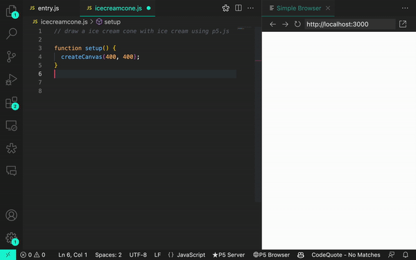

Author 作者

August 8, 2023  2023 年 8 月 8 日

After three-plus years of concepting, designing, and shipping AI-driven developer tools, GitHub is continuing to explore new ways to bring powerful AI models into the developer workflow.  

经过三年多的构思、设计和发布人工智能驱动的开发者工具，GitHub 正在继续探索将强大的人工智能模型引入开发者工作流程的新方法。  

Along the way, we’ve learned that the most important aspect of designing AI-driven products is to focus extensively on the developer experience (DevEx).  

一路走来，我们认识到，设计人工智能驱动的产品最重要的一点是广泛关注开发人员体验（DevEx）。

While it can now feel like there’s a new AI announcement from every company every week, we’re here to reflect on what it takes to build an AI product from scratch—not just to integrate an LLM into an existing product.  

虽然现在感觉每家公司每周都会发布新的人工智能公告，但我们在这里要反思的是，从零开始打造一款人工智能产品需要付出哪些努力，而不仅仅是将人工乐虎国际手机版下载整合到现有产品中。  

In this article, we’ll share 10 tips for designing AI products and developer tools, and lessons we learned first-hand from designing, iterating, and extending GitHub Copilot.  

在本文中，我们将分享设计人工智能产品和开发人员工具的 10 个技巧，以及我们在设计、迭代和扩展 GitHub Copilot 过程中学到的第一手经验。

Let’s jump in. 让我们跳进去。

## Tip 1: Build on the creative power of natural language  

秘诀 1：利用自然语言的创造力

“The hottest new design system is natural language,” reports the team designing GitHub Copilot.  

"设计 GitHub Copilot 的团队表示："最热门的新设计系统是自然语言。  

According to them, the most important tools to develop right now are ones that will allow people to describe, in their respective natural languages, what they want to create, and then get the output that they want.  

他们认为，目前最需要开发的工具是那些能够让人们用各自的自然语言描述他们想要创造的东西，然后获得他们想要的输出结果的工具。

Leveraging the creative power of natural language in AI coding tools will shift the way developers write code and solve complex problems, fueling creativity and democratizing software development.  

在人工智能编码工具中利用自然语言的创造力，将改变开发人员编写代码和解决复杂问题的方式，激发创造力，实现软件开发的民主化。

[Idan Gazit](https://github.com/idan), Senior Director of Research for [GitHub Next](https://githubnext.com/), identifies new modalities of interaction, or patterns in the way code is expressed to and written by developers. One of those is **iteration**, which is most often seen in chat functionalities. Developers can ask the model for an answer, and if it isn’t quite right, refine the suggestions through experimentation.  

GitHub Next 研究部高级总监 Idan Gazit 发现了新的交互方式，即开发人员表达和编写代码的模式。其中之一就是迭代，这在聊天功能中最常见。开发人员可以向模型询问答案，如果答案不完全正确，可以通过实验来完善建议。

He says, “When it comes to building AI applications today, the place to really distinguish the quality of one tool from another is through the tool’s DevEx.”  

他说："如今在构建人工智能应用程序时，真正能区分一个工具和另一个工具质量的地方是工具的 DevEx。

To show how GitHub Copilot can help developers build more efficiently, here’s an example of a developer learning how to prompt the AI pair programmer to generate her desired result.  

为了展示 GitHub Copilot 如何帮助开发人员更高效地进行构建，这里以一位开发人员学习如何提示人工智能配对程序员生成她想要的结果为例。

A vague prompt like, “Draw an ice cream cone with ice cream using p5.js,” resulted in an image that looked like a bulls-eye target sitting on top of a stand:  

一个模糊的提示，比如 "用 p5.js 画一个装有冰淇淋的圆锥形冰淇淋"，得到的图像看起来就像一个靶子，放在一个支架上：

An example of GitHub Copilot responding to a vague prompt to draw an ice cream cone using p5.js and generating an image that looks like a bulls-eye target  

下面举例说明 GitHub Copilot 使用 p5.js 响应一个模糊的提示，即绘制一个冰激凌圆锥体，并生成一个看起来像靶心的图像

A revised prompt that specified details about the desired image, like “The ice cream cone will be a triangle with the point facing down, wider point at the top,” helped the developer to generate her intended result, and saved her from writing code from scratch:  

修改后的提示具体说明了所需图像的细节，如 "冰淇淋蛋筒将是一个三角形，尖朝下，顶端有较宽的点"，这帮助开发人员生成了她想要的结果，使她无需从头开始编写代码：

![When we wrote this prompt to GitHub Copilot, "draw an ice cream cone with an ice cream scoop and a cherry on top," and specified details about each part of the picture, GitHub Copilot generated a picture of the ice cream cone that we wanted. Here were the prompts for those details: 1) "The ice cream cone will be a triangle with the point facing down, wider point at the top. It should have light brown fill" 2) "The ice cream scoop will be a half circle on top of the cone with a light pink fill" 3) "The cherry will be a circle on top of the ice cream scoop with a red fill" 4) "Light blue background"](image3.gif)

An example of a GitHub Copilot responding to a specific prompt to draw an ice cream cone using p5.js and generating the developer’s desired result  

举例说明 GitHub Copilot 响应特定提示，使用 p5.js 绘制冰淇淋蛋筒，并生成开发者想要的结果。

## Tip 2: Identify and define a developer’s pain points  

技巧 2：识别并定义开发人员的痛点

Designing for developers means placing their needs, preferences, and workflows at the forefront. [Adrián Mato](https://github.com/adrianmg), who leads GitHub Copilot’s design team, explains, “It’s hard to design a good product if you don’t have an opinion.  

为开发人员设计意味着将他们的需求、偏好和工作流程放在首位。领导 GitHub Copilot 设计团队的 Adrián Mato 解释说："如果你没有自己的观点，就很难设计出好的产品。  

That’s why you need to ask questions, embrace user feedback, and do the research to fully understand the problem space you’re working in, and how developers think and operate.”  

这就是为什么你需要提出问题，接受用户反馈，并进行研究，以充分了解你所处的问题空间，以及开发人员的思维和操作方式"。

### Keeping devs in the flow  

让开发人员始终处于工作流程中

For example, when designing GitHub Copilot, our designers had to make decisions about **optionality**, which is when an AI model provides a developer with various code completion suggestions (like GitHub Copilot does through ghost text) that the developer can review, accept, or reject.  

例如，在设计 GitHub Copilot 时，我们的设计师必须就可选性做出决定，即人工智能模型为开发人员提供各种代码完成建议（就像 GitHub Copilot 通过幽灵文本所做的那样），开发人员可以查看、接受或拒绝这些建议。  

These decisions are important because [writing software is like building a house of cards](https://github.blog/2023-06-08-developer-experience-what-is-it-and-why-should-you-care/)—tiny distractions can shatter a developer’s flow and productivity, so designers have to make sure the UX for coding suggestions makes a developer’s job easier and not the other way around.  

这些决定非常重要，因为编写软件就像建造一座纸牌搭成的房子--微小的干扰就能破坏开发人员的工作流程和效率，因此设计师必须确保用户体验的编码建议能让开发人员的工作更轻松，而不是相反。

An example of a ghost text coding suggestion in GitHub Copilot’s IDE extension  

GitHub Copilot 集成开发环境扩展中的幽灵文本编码建议示例

### Considering ghost text and going modeless  

考虑幽灵文本和无模式

When GitHub Copilot launched as a [technical preview in June 2021](https://github.blog/2021-06-29-introducing-github-copilot-ai-pair-programmer/) and became [generally available in June 2022](https://github.blog/2022-06-21-github-copilot-is-generally-available-to-all-developers/), **ghost text—the gray text that flashes a coding suggestion while you type—was lauded as keeping developers in the flow because it made the code completion suggestions easy to use or ignore.** In other words, the AI capability is modeless: Users don’t have to navigate away from the IDE to use it, and the AI works in the background.  

GitHub Copilot 于 2021 年 6 月推出技术预览版，并于 2022 年 6 月全面上市，当时，ghost text（即在输入时闪烁编码建议的灰色文本）受到好评，因为它使代码自动完成建议易于使用或忽略，从而让开发人员保持在工作流程中。换句话说，人工智能功能是无模式的：用户无需离开集成开发环境就能使用它，而且人工智能是在后台工作的。

GitHub Copilot also suggests code in a way that allows the user to continuously type: either press tab to accept a suggestion or keep typing to ignore the suggestion. “**Modeless AI is like riding an electric bike with a pedal assist rather than one where you have to switch gears on the handlebar,**” Gazit explains.  

GitHub Copilot 还以允许用户连续键入代码的方式提出建议：要么按下 tab 键接受建议，要么继续键入忽略建议。"Gazit解释说："无模型人工智能就像骑一辆带踏板辅助装置的电动自行车，而不是必须在车把上切换档位的自行车。

When it comes to addressing developer pain points, this pedal assist is essential to keeping them in the flow and doing their best work.  

在解决开发人员的痛点时，这种踏板辅助对于让他们保持畅通无阻、全力以赴地工作至关重要。

## Tip 3: Gather meaningful developer feedback  

技巧 3：收集有意义的开发人员反馈意见

Knowing how to ask for the right kind of feedback is critical to designing a useful product. To keep bias from creeping into each part of the research process, [Grace Vorreuter](https://github.com/gracevor), Principal Researcher for GitHub’s Communities team, shares unbiased interview questions to get you started on the right path:  

要设计出有用的产品，知道如何征求正确的反馈意见至关重要。为了防止研究过程中的每个环节出现偏差，GitHub 社区团队首席研究员 Grace Vorreuter 分享了不带偏见的访谈问题，让你走上正确的道路：

-   **What’s the hardest part about \[x situation\] today?** This question helps to contextualize the problem.  
    
    今天\[x 情况\]最困难的部分是什么？这个问题有助于了解问题的来龙去脉。
-   **Can you tell me a story about the last time that happened?** Stories allow researchers to dive deeper into user problems, learn context, empathize with customers, and remember what information they shared.  
    
    你能给我讲讲上次发生的故事吗？故事可以让研究人员更深入地了解用户问题、了解背景、与客户产生共鸣，并记住他们分享了哪些信息。
-   **Can you say more about why that was difficult?** This question uncovers a deeper layer of the problem.  
    
    你能说说这有什么困难吗？这个问题揭示了更深层次的问题。
-   **What, if anything, have you tried to solve that problem?** If the user shares they’ve already looked for a solution, it’s a signal that this is a significant problem.  
    
    如果有的话，您尝试过哪些方法来解决这个问题？如果用户说他们已经寻找过解决方案，这就表明这是一个重大问题。
-   **What’s not ideal about your current solution?** This question can reveal an opportunity space.  
    
    您当前的解决方案有哪些不理想之处？这个问题可以揭示机会空间。
-   **How often do you experience this problem?** This gives a sense of the size of the problem.  
    
    您多久会遇到这个问题？这可以说明问题的严重程度。

## Tip 4: Design for imperfection  

技巧 4：为不完美而设计

Rosenkilde’s justification of the double trigger in the technical preview of GitHub Copilot CLI reinforces an important fact: LLMs can be wrong.  

罗森基尔德在 GitHub Copilot CLI 技术预览版中为双重触发所做的辩解强化了一个重要事实：LLM 可能是错的。  

While no tool is perfect, the ability of LLMs to hallucinate, or convincingly spit out false information, is important to keep in mind.  

虽然没有一种工具是完美无缺的，但我们必须牢记，法律硕士能够产生幻觉，或令人信服地吐出虚假信息。

Though models will improve in the future—and we’ll discover better prompting strategies that generate reliable responses—we don’t have to wait until tomorrow to build.  

虽然模型在未来会不断改进，我们也会发现更好的提示策略，以产生可靠的响应，但我们不必等到明天再进行构建。  

We can innovate responsibly today by designing around the capabilities of current models.  

今天，我们可以通过围绕现有机型的功能进行设计，以负责任的方式进行创新。

“We have to design apps not only for models whose outputs need evaluation by humans, but also for humans who are learning how to interact with AI,” Gazit says.  

"Gazit说："我们不仅要为需要人类对其输出进行评估的模型设计应用程序，还要为正在学习如何与人工智能互动的人类设计应用程序。  

“Ghost text is one of the first mechanisms that make evaluation cheap and seamless, in that wrong suggestions are ignorable.  

"幽灵文本 "是使评价变得廉价和无缝的首要机制之一，因为错误的建议是可以忽略不计的。  

We have to design more user experiences that are forgiving of today’s imperfect models.”  

我们必须设计出更多的用户体验，以包容当今不完美的模式"。

A well-designed tool helps to establish a foundation of trust. “But it doesn’t compensate for leading someone awry, which can happen with generative AI,” adds [Manuel Muñoz Solera](https://github.com/mamuso), Senior Director of Product Design at GitHub.  

设计精良的工具有助于建立信任基础。"GitHub产品设计高级总监Manuel Muñoz Solera补充说："但这并不能弥补人工智能生成器的缺陷。  

Developers expect an AI model to pull in all the right context to answer a query, every single time, but there’s a technical boundary in that today’s LLMs process a limited amount of context.  

开发人员希望人工智能模型每次都能获取所有正确的上下文来回答查询，但目前的 LLM 处理的上下文数量有限，这就存在一个技术边界。  

That poses a tough but interesting challenge when designing the UX, which needs to manage a user’s expectations while still providing a solution.  

这给用户体验设计带来了严峻而有趣的挑战，因为用户体验设计既要满足用户的期望，又要提供解决方案。

[Learn how GitHub’s machine learning engineers are improving GitHub Copilot’s contextual understanding >  

了解 GitHub 机器学习工程师如何改进 GitHub Copilot 的上下文理解能力 > GitHub Copilot](https://github.blog/2023-05-17-how-github-copilot-is-getting-better-at-understanding-your-code/)

## Tip 5: Recognize bias in your research  

提示 5：认识到研究中的偏见

Vorreuter also shares pointers for recognizing different kinds of bias that surface during user research:  

Vorreuter 还分享了识别用户研究过程中出现的各种偏见的方法：

-   **Confirmation bias** is when data is analyzed and interpreted to confirm hypotheses and expectations.  
    
    确认偏差是指对数据的分析和解释是为了确认假设和预期。  
    
    To avoid this bias in research, try to invalidate your hypothesis, and report on all findings (positive and negative) to avoid cherry-picking results.  
    
    为了避免研究中的这种偏见，应尽量使自己的假设无效，并报告所有的研究结果（正面的和负面的），以避免对结果进行 "偷梁换柱"。
    
    For example, let’s say your hypothesis is that AI coding tools make developers more collaborative.  
    
    例如，假设你的假设是，人工智能编码工具能让开发人员更加协作。  
    
    A question like “Do you agree or disagree that AI coding tools make you more collaborative?” assumes part of your hypothesis—that all developers use AI coding tools—is true.  
    
    像 "您同意还是不同意人工智能编码工具能让您更具协作性？"这样的问题，假设您的部分假设--所有开发人员都使用人工智能编码工具--是真实的。  
    
    The question also forces a yes or no response.  
    
    该问题还强制要求回答 "是 "或 "否"。  
    
    On the other hand, a question like “In what ways do you imagine a world with AI coding tools will impact collaboration within teams?” encourages a nuanced response.  
    
    另一方面，"你认为拥有人工智能编码工具的世界会在哪些方面影响团队内部的协作？"这样的问题会鼓励人们做出细致入微的回答。
    
-   **Leading language** is when a question or task uses certain wording that provides a hint for a particular response or behavior the interviewer is looking for (like “How much does waiting for CI pipelines to run negatively impact your day?”).  
    
    引导性语言是指在问题或任务中使用特定措辞，为面试官所要寻找的特定回答或行为提供提示（例如 "等待 CI 管道运行对您一天的工作有多大负面影响？）  
    
    To avoid this trap, prepare a discussion guide that includes open-ended, non-leading questions (such as “Which of the following do you spend the most time doing on any given day?” followed by a list of options to rank in order).  
    
    为避免这一陷阱，请准备一份讨论指南，其中包括开放式、非引导性的问题（如 "在任何一天中，您花最多时间做以下哪项工作？）  
    
    Then, ask for peer feedback on your discussion guide and hold a pilot interview, after which you can iterate on your questions.  
    
    然后，征求同行对讨论指南的反馈意见，并进行试点访谈，之后再对问题进行反复修改。
    
-   **Selection bias** is when study participants haven’t been selected at random, so certain kinds of people, more than others, are included in the study and skew the results.  
    
    选择偏差是指研究参与者不是随机选择的，因此某些类型的人比其他人更容易被纳入研究，从而使结果出现偏差。  
    
    To avoid this bias, refer to your study’s objectives when deciding what kind of customers to solicit.  
    
    为避免出现这种偏差，在决定邀请哪类客户时，请参考研究目标。  
    
    Be proactive and actively seek out the folks you’re looking for rather than letting people self-select into giving feedback.  
    
    主动出击，积极寻找你要找的人，而不是让他们自我选择提供反馈。
    

This list isn’t exhaustive, nor are all the solutions fool proof—but at GitHub, we’ve found these three tips to be incredibly helpful reminders about how bias can cloud our approach to product design.  

这份清单并不详尽，也不是所有的解决方案都万无一失--但在 GitHub，我们发现这三个小贴士非常有用，它们提醒我们，偏见会给我们的产品设计方法蒙上阴影。

## Tip 6: Allow developers to customize context views  

技巧 6：允许开发人员自定义上下文视图

Developers need easy access to a lot of different information when writing code—or, said another way, context is key for developers.  

开发人员在编写代码时需要轻松获取大量不同的信息，或者换一种说法，上下文对于开发人员来说至关重要。  

A common design question is how much information and context should be displayed on the UI, and how to design a UX that makes context switching feel seamless.  

一个常见的设计问题是，用户界面上应该显示多少信息和上下文，以及如何设计用户体验，让上下文切换感觉天衣无缝。  

We found that when developers are given options to tailor a product to their preferences and requirements, their DevEx becomes personalized and comfortable.  

我们发现，当开发人员可以根据自己的喜好和要求选择定制产品时，他们的 DevEx 就会变得个性化和舒适。

According to [Nicolas Solerieu](https://github.com/nsolerieu), Senior Site Designer at GitHub, minimizing the amount of visual variation and elements to scan can create a feeling of immersion even when the developer has to context switch.  

GitHub 高级网站设计师 Nicolas Solerieu 认为，尽量减少视觉变化和需要扫描的元素，即使开发人员需要进行上下文切换，也能营造出一种身临其境的感觉。  

But sometimes developers need rapid data consumption to find the necessary information.  

但有时开发人员需要快速消耗数据来查找必要的信息。

Developer tools should allow users to view information at different scales, from a general view that makes an entire workflow visible to a granular one that highlights an individual problem.  

开发人员的工具应允许用户以不同的尺度查看信息，从显示整个工作流程的一般视图到突出单个问题的细粒度视图。

## Tip 7: Design for extensibility  

秘诀 7：为可扩展性而设计

Sometimes it’s the ability to amplify the capabilities of an existing tool—instead of building a new one—that improves a developer’s workflow.  

有时，开发人员的工作流程之所以得到改善，是因为他们能够增强现有工具的功能，而不是构建一个新的工具。  

Because developers typically use a large number of tools, offering smooth integrations pays dividends for the developer experience.  

由于开发人员通常会使用大量工具，因此提供流畅的集成可为开发人员的体验带来红利。

Well-written documentation and APIs, for example, are critical to a developer’s understanding, set up, and extensibility of a tool.  

例如，精心编写的文档和应用程序接口对于开发人员理解、设置和扩展工具至关重要。  

When tools are built with extensibility and integration in mind, they can be optimized for a developer’s custom needs, and, ultimately, enable efficient application builds and deployment.  

如果在构建工具时考虑到可扩展性和集成性，就能针对开发人员的定制需求对其进行优化，最终实现高效的应用程序构建和部署。

## Tip 8: Design for accessibility  

秘诀 8：无障碍设计

**A good reminder when designing accessible tooling is** [that](https://github.com/readme/stories/annalu-waller) [designs for users with disabilities also benefit users without disabilities in extraordinary circumstances](https://github.com/readme/stories/annalu-waller#:~:text=adaptability%20for%20inclusivity.-,Ordinary%20extraordinary%20users,-Throughout%20history%2C%20technology). For example, designing a system for those with visual impairments can also help someone struggling to read an e-reader in bright sunlight. [Rachel Cohen](https://github.com/howdyray), Director of Design Infrastructure at GitHub, encourages designers to embrace a “shift-left” mindset and consider the requirements of individuals with disabilities earlier in the design process.  

在设计无障碍工具时，一个很好的提醒是，在特殊情况下，为残障用户设计也能让非残障用户受益。例如，为有视觉障碍的人设计系统，也能帮助那些在强光下阅读电子阅读器的人。GitHub 设计基础架构总监 Rachel Cohen 鼓励设计师们抱着 "左移 "的心态，在设计过程中尽早考虑残障人士的需求。  

The result is more resilient, inclusive, and forward-thinking solutions.  

其结果是，解决方案更具弹性、包容性和前瞻性。

Want to advance your organization’s accessibility practices? [Apply these tactics and lessons from GitHub’s Design team](https://github.blog/2023-05-17-designs-journey-towards-accessibility/).  

想提高组织的可访问性？运用 GitHub 设计团队的这些策略和经验。

## Tip 9: Prioritize performance over flashy features  

秘诀 9：性能优先于华而不实的功能

Striking a balance between adding new features and optimizing existing ones can be challenging, but the priority should always be to maintain or improve the tool’s performance.  

要在添加新功能和优化现有功能之间取得平衡可能具有挑战性，但首要任务始终是保持或提高工具的性能。

**“Developer tooling is very specific** in that the available technology is applied to solve an identified problem in the best way possible,” according to Muñoz Solera.  

"穆尼奥斯-索莱拉说："开发人员的工具非常特殊，因为现有的技术是用来以最佳方式解决已确定的问题的。  

“The technology is used with purpose and isn’t just used to drive product engagement.”  

"技术的使用是有目的的，而不仅仅是用来推动产品参与"。

GitHub Copilot X is our envisioned future of AI-powered software development. [Discover what’s new](https://github.blog/2023-03-22-github-copilot-x-the-ai-powered-developer-experience/).  

GitHub Copilot X 是我们设想的人工智能驱动软件开发的未来。了解新功能。

AI applications should have a revision workflow that allows developers to revise an output from the AI model. This is the workflow we built into GitHub Copilot’s ghost text UX and [GitHub Copilot Chat](https://github.com/features/preview/copilot-x).  

人工智能应用应有一个修订工作流程，允许开发人员修订人工智能模型的输出。这就是我们在 GitHub Copilot 的 ghost text UX 和 GitHub Copilot Chat 中内置的工作流程。

In GitHub Copilot for CLI, explanations comprise the revision workflow. Rosenkilde says that **a revision workflow not only helps to mitigate risk, but also helps to educate the developer**: “The suggested command might be an arcane shell script, so maybe the developer doesn’t understand what that command will do once it runs.  

在 GitHub Copilot for CLI 中，说明构成了修订工作流程。罗森基尔德说，修订工作流程不仅有助于降低风险，还有助于教育开发人员："建议的命令可能是一个神秘的 shell 脚本，因此开发人员可能不明白该命令运行后会做什么。  

The explanation is there to help guide the developer through the shell command’s function and verify it against the original problem the developer is trying to solve.”  

解释是为了帮助引导开发人员了解 shell 命令的功能，并根据开发人员试图解决的原始问题进行验证"。

**A revision workflow is also a way for a developer to send feedback to the AI model**.  

修订工作流程也是开发人员向人工智能模型发送反馈的一种方式。  

Feedback mechanisms built into UIs include the acceptance or ignore rate of AI-generated coding suggestions, the option for users to regenerate a response, and the ability for users to recover when a model falters.  

用户界面中的反馈机制包括人工智能生成的编码建议的接受率或忽略率、用户重新生成响应的选项，以及当模型出现问题时用户恢复的能力。  

“We’re still in an experimental phase with generative AI,” Muñoz Solera says, “so we need to design AI tools that make it easy for developers to signal when the quality of the model’s output isn’t there.”  

"穆尼奥斯-索莱拉说："我们仍处于生成式人工智能的实验阶段，因此我们需要设计人工智能工具，让开发人员能够在模型输出质量不达标时轻松发出信号。

## The path forward 前进之路

Designers, engineers, and users of AI tools are starting to move beyond the shock value of generative AI models: They’re moving toward understanding the technology and, consequently, becoming more discerning about its use cases.  

人工智能工具的设计师、工程师和用户开始超越生成式人工智能模型的震撼价值：他们正在逐步了解这项技术，并因此对其使用案例更加挑剔。

Here’s what we learned after three years of conceptualizing, designing, and extending AI-powered developer tools, like GitHub Copilot and [GitHub Copilot Chat](https://github.blog/2023-07-20-github-copilot-chat-beta-now-available-for-every-organization/): There’s a lot more to discover.  

在构思、设计和扩展人工智能开发者工具（如 GitHub Copilot 和 GitHub Copilot Chat）三年后，我们有了以下收获：我们还有很多东西需要探索。

We hope that sharing these tips will help to accelerate collective learning during this new age of software development.  

我们希望，分享这些技巧将有助于在软件开发的新时代加速集体学习。

> From the outside, innovation looks like making giant leaps of progress. But innovation from the inside is repetition and making small steps forward.  
> 
> 从外观上看，创新就像大踏步前进。但从内部看，创新就是不断重复，小步前进。

\- Manuel Muñoz Solera // Senior Director of Product Design // GitHub  

\- 曼努埃尔-穆尼奥斯-索莱拉 // 产品设计高级总监 // GitHub

-   [What developers need to know about generative AI  
    
    开发人员需要了解的生成式人工智能知识](https://github.blog/2023-04-07-what-developers-need-to-know-about-generative-ai/)
-   [How generative AI is changing the way developers work  
    
    生成式人工智能如何改变开发人员的工作方式](https://github.blog/2023-04-14-how-generative-ai-is-changing-the-way-developers-work/)
-   [How GitHub Copilot is getting better at understanding your code  
    
    GitHub Copilot 如何更好地理解您的代码](https://github.blog/2023-05-17-how-github-copilot-is-getting-better-at-understanding-your-code/)
-   [Working with the LLMs behind GitHub Copilot  
    
    与 GitHub Copilot 背后的法学硕士合作](https://github.blog/2023-05-17-inside-github-working-with-the-llms-behind-github-copilot/)

## Explore more from GitHub  

从 GitHub 浏览更多内容

### Product 产品

Updates on GitHub products and features, hot off the press.  

GitHub 产品和功能的最新动态。

### The ReadME Project ReadME 项目

Stories and voices from the developer community.  

来自开发者社区的故事和声音。

### GitHub Actions GitHub 操作

Native CI/CD alongside code hosted in GitHub.  

与托管在 GitHub 中的代码一起进行本地 CI/CD。

### Work at GitHub! 在 GitHub 工作

Check out our current job openings.  

查看我们当前的职位空缺。
