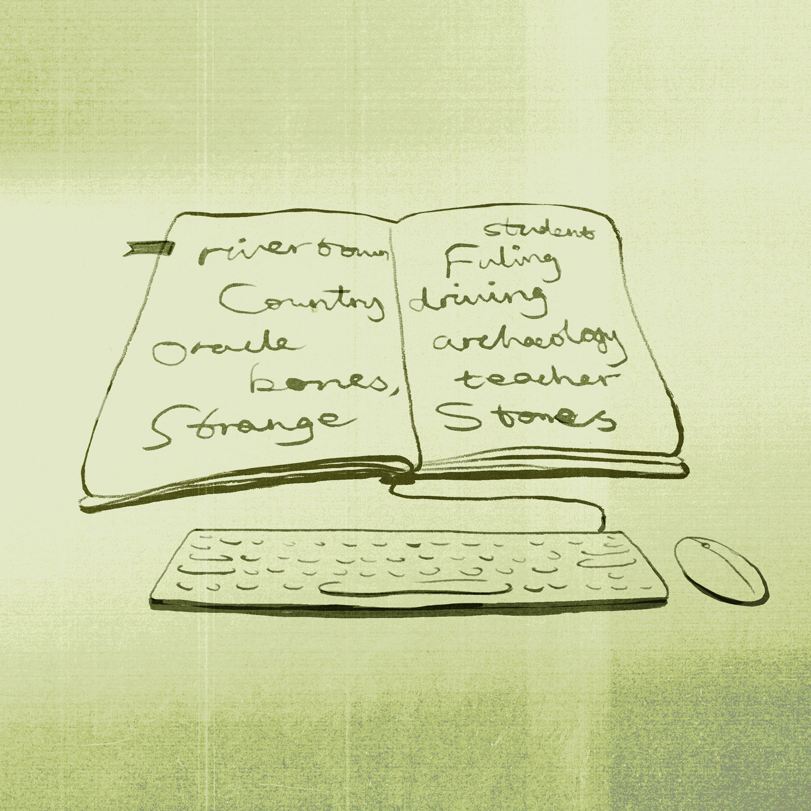

Just about any modern China reading list worth its salt will include at least one book by Peter Hessler.  

几乎所有有价值的现代中国阅读书目中，都会包括至少一本彼得-海斯勒的书。  

Almost from the moment he arrived in the country as a Peace Corps volunteer in 1996, the author of “River Town,” “Oracle Bones,” and “Country Driving” has earned a reputation as a keen observer of China, its people, and their rapid entry into the modern world.  

几乎从 1996 年作为和平队志愿者来到中国的那一刻起，《江城》、《甲骨文》和《乡间行车》的作者就以对中国、中国人民以及他们迅速进入现代世界的敏锐观察而赢得了声誉。

Hessler’s ability to give expression to these experiences has made him as popular with Chinese readers as he is with international audiences.  

海斯勒善于表达这些经历，这使他受到中国读者和国际读者的欢迎。  

His books helped kickstart China’s ongoing literary nonfiction boom, inspiring a generation of young authors to reexamine their surroundings and find value in stories previously dismissed as mundane or uninteresting.  

他的作品掀起了中国非虚构文学的热潮，激励了一代年轻作家重新审视周围的环境，并从以前被视为平凡或无趣的故事中发现价值。  

His 2019 decision to return to China to teach at Sichuan University was big news in the country — as was the university’s [controversial choice](https://www.sixthtone.com/news/1008025) not to renew his contract in April 2021.  

他在 2019 年决定回国到四川大学任教，这在中国是个大新闻，而四川大学在 2021 年 4 月不与他续约的决定也颇具争议。

The China that bid farewell to Hessler in 2021 was in many ways a fundamentally different place from the one that greeted him in 1996. It’s not the only thing that’s changed, either: The rise of the internet, social media, and streaming have reduced demand for long-form journalism, while mounting geopolitical tensions have made it harder for writers on both sides of the Pacific to tell the kind of human stories that made his career.  

2021 年告别赫斯勒的中国，在许多方面都与 1996 年迎接他的中国截然不同。这也不是唯一的变化：互联网、社交媒体和流媒体的兴起减少了对长篇新闻报道的需求，而日益紧张的地缘政治局势也让太平洋两岸的作家们更难讲述那些成就了他职业生涯的人文故事。

SUBSCRIBE TO OUR NEWSLETTER  

订阅我们的通讯

By submitting, you agree to our [Terms Of Use.](https://www.sixthtone.com/terms-use)  

提交信息即表示您同意我们的《使用条款》。

\*Please enter an email address.  

\*请输入电子邮件地址。

Yet Hessler continues to believe in the importance of nonfiction as a window into the wider world.  

然而，海斯勒仍然坚信，非虚构作品是了解更广阔世界的窗口，具有重要意义。  

This spring, he sat down with Sixth Tone for a wide-ranging email interview covering his experiences teaching two very different generations of Chinese, the importance of people-to-people exchanges, and his approach to writing.  

今年春天，他通过电子邮件接受了《第六音调》的广泛采访，内容涉及他教授两代不同中国人的经历、人与人交流的重要性以及他的写作方法。

_This is an edited version of an interview given as part of the_ [_Sixth Tone Writing Contest_](https://interaction.sixthtone.com/feature/2021/Writing-Contest/index.html#/)_. You can read some of the best entries_ [_here_](https://www.sixthtone.com/topics/1008930/writing-contest)_._  

本文是 "第六声调 "写作比赛采访的编辑版本。您可在此阅读部分优秀作品。

**On generations 世代相传**

**Sixth Tone: Americans give their generations names like “Boomers,” “Gen X,” “Gen Y,” and “Millennials,” whereas Chinese people use terms like “the post-’80s,” “the post-’90s”, and “the post-’00s.” Which do you tend to use?  

第六调：美国人给自己的世代起名叫 "Boomers"、"Gen X"、"Gen Y"、"Millennials"，而中国人则用 "80后"、"90后"、"00后"。您倾向于使用哪种说法？  

What is the most significant characteristic of your generation?  

你们这一代人最大的特点是什么？**

Peter Hessler: In the U.S., I am considered part of Gen X. One of the most significant characteristics is that we did not grow up with technology.  

在美国，我被认为是 "X一代 "的一员。我们最大的特点之一就是没有在科技的陪伴下成长。  

My family got a very weak home computer when I was in high school, and it did not even have a word processor.  

我上高中的时候，家里买了一台很薄弱的家用电脑，连文字处理器都没有。  

So I still used a typewriter when I went to college, in the fall of 1988. After arriving at Princeton, I realized that they had computer centers, and I quickly adjusted to using a word processor.  

因此，1988 年秋季上大学时，我仍然使用打字机。到普林斯顿大学后，我才知道他们有计算机中心，于是我很快就适应了使用文字处理器。  

And I bought my first personal computer when I was 20.  

我 20 岁时买了第一台个人电脑。

I did not use email until I was in grad school, at the age of 23, and I did not use the internet in any real capacity until my late 20s.  

我直到 23 岁读研究生时才开始使用电子邮件，直到 20 多岁才真正使用互联网。

Then I basically did it all over again, in China. When I went to Fuling (a city in the southwestern province of Sichuan) in 1996, it was not possible to get an internet connection.  

后来，我基本上又在中国重新做了一遍。1996 年我去涪陵（四川省西南部的一个城市）时，还无法连接互联网。  

So for a year and a half I did not have email or contact with websites. That was probably fortunate, because it forced me to study Chinese and to write.  

因此，有一年半的时间我没有电子邮件，也没有与网站联系。这也许是幸运的，因为它迫使我学习中文和写作。  

And I had a lot of time to think about my writing — I wasn’t posting quick things on websites or social media. Sometimes that pace is too fast, especially for a young writer.  

我有很多时间思考我的写作--我没有在网站或社交媒体上快速发布东西。有时这种节奏太快了，尤其是对年轻作家来说。  

It’s better to spend more time with material and think about how you want to present it.  

最好花更多的时间处理素材，并思考如何呈现素材。

In Fuling, we finally got a dial-up internet connection with about six months or so to go. We could not get on websites, but we could use email.  

在涪陵，我们终于有了拨号上网的机会，大约还有六个月左右的时间。我们无法登录网站，但可以使用电子邮件。  

That turned out to be important for Adam Meier (a fellow volunteer) and me. Adam was able to figure out his plans for graduate school.  

这对我和亚当-迈尔（Adam Meier，志愿者伙伴）来说非常重要。亚当弄清楚了自己的研究生计划。  

And I got back in contact with John McPhee, my teacher from college.  

我又和约翰-麦克菲联系上了，他是我大学时的老师。  

We were corresponding with email and at one point he sent a long message suggesting that I write a book about Fuling.  

我们用电子邮件通信，有一次他发了一条长长的信息，建议我写一本关于涪陵的书。  

I had not considered doing that, but after he wrote, I realized that it made sense. And soon I started working on “River Town.”  

我没有考虑过这样做，但他写完后，我意识到这是有意义的。很快我就开始了 "河流小镇 "的创作

I was fortunate with the timing, because the lack of internet made me a better observer and recorder during the first 18 months.  

我很幸运，因为在最初的 18 个月里，由于没有互联网，我成为了一名更好的观察者和记录者。  

And then the arrival of the internet near the end made me think more about my future and what kind of writing I wanted to do.  

后来，互联网的出现让我对自己的未来有了更多的思考，也让我知道了自己想从事什么样的写作。

Some people from my generation are not fully comfortable with technology, and I am one of them. I don’t use social media and my phone and computers are always very simple and old.  

我们这一代人中，有些人并不完全适应科技，我就是其中之一。我不使用社交媒体，我的手机和电脑总是非常简单和老旧。  

I feel like I need to protect my attention span in order to be the kind of writer I want to be.  

我觉得我需要保护自己的注意力，才能成为我想成为的那种作家。

In China, of course I use the “post-’80s” and “post-’90s” designations, like everybody else.  

在中国，我当然和其他人一样使用 "80 后 "和 "90 后 "的称谓。  

But in my writing I often describe the people I taught in Fuling as belonging to the Reform Generation.  

但在我的文章中，我经常把我在涪陵教过的人称为改革一代。  

Using the simple decades is not always so useful, because they are only ten years long and they are not descriptive.  

使用简单的 "十年 "并不总是那么有用，因为 "十年 "只有十年，而且没有描述性。  

I felt like those people I taught were an interesting generation because they were born shortly before Deng Xiaoping started “reform and opening-up.” So those young people grew up with remarkable economic and social changes.  

我觉得我教过的这些人是有趣的一代，因为他们是在邓小平开始 "改革开放 "不久前出生的。因此，这些年轻人是伴随着显著的经济和社会变化成长起来的。  

That’s the generation that made the incredible shift from the countryside to the city, from poverty to middle class, and often from relative ignorance to a good education.  

正是这一代人实现了从农村到城市、从贫困到中产阶级、从相对无知到接受良好教育的惊人转变。  

I feel quite close to people of that age because I taught so many students and we have been in close touch over the years. I admire their toughness and their flexibility.  

我和这个年龄段的人很亲近，因为我教过很多学生，多年来我们一直保持着密切的联系。我钦佩他们的坚韧和灵活。  

I’ve always believed that they are a special generation in China.  

我一直认为，他们是中国特殊的一代。

**Sixth Tone: What’s it like for you to interact with your children’s generation?  

第六个音调：你与你的孩子这一代互动是什么感觉？  

Is your relationship with your children similar to or different from your parents’ relationship with you?  

您与子女的关系与父母与您的关系相似还是不同？**

Peter Hessler: I think that my children are still too young to be part of a recognizable generation — they are only 13. But obviously one of the big differences is the use of social media.  

彼得-海斯勒：我认为我的孩子们还太小，还不能成为公认的一代人--他们才 13 岁。但其中一个最大的不同显然是社交媒体的使用。  

It’s pretty clear that social media is terrible for children, and my sense is that we are now in a period when people don’t quite realize this, or they don’t know what to do about it.  

很明显，社交媒体对孩子们来说是非常可怕的，而我的感觉是，我们现在正处于一个人们还没有完全意识到这一点的时期，或者说他们不知道该怎么做。  

My daughters don’t have phones and we limit their use of technology. It’s relatively easy because my wife and I also don’t use these things much.  

我的女儿们没有手机，我们也限制她们使用技术。这相对容易，因为我和妻子也不太使用这些东西。  

But I am aware of how different my daughters are from most of their peers. They read a lot and they prefer that to technology. They are somewhat anachronistic.  

但我知道，我的女儿们与大多数同龄人是多么不同。她们经常阅读，比起科技，她们更喜欢阅读。她们有些不合时宜。

But middle-class people in China don’t feel very secure. The young people from that class tend to feel a lot of pressure to excel.  

但中国的中产阶级并不感到非常安全。来自中产阶级的年轻人往往会感受到巨大的出人头地的压力。

I am an older parent than my parents were. When my father was my age, I was already finished with graduate school. But my daughters are only in the seventh grade.  

我比父母年长。我父亲像我这么大的时候，我已经读完了研究生。但我的女儿们才上七年级。  

I had children much later than my parents did. So there are some differences. For one thing, I am more financially secure, because I spent many years working before I had kids.  

我生孩子的时间比我父母晚得多。因此，我们之间存在一些差异。首先，我在经济上更有保障，因为我在有孩子之前已经工作了很多年。  

My parents had very little money when I was growing up. I had a lot of jobs as a young person — I started delivering newspapers from the age of 8. I also did all kinds of jobs around the University of Missouri and other places.  

在我成长的过程中，我的父母非常贫穷。我年轻时做过很多工作--我从 8 岁起就开始送报纸，还在密苏里大学附近和其他地方做过各种工作。  

I was buying my own clothes before I was in high school, and I always paid for my own haircuts.  

我上高中前就开始自己买衣服，理发也总是自己付钱。  

When I was 16, I bought a car — I paid for every cent on my own; my parents gave me nothing.  

16 岁那年，我买了一辆车，每一分钱都是自己掏的，父母什么也没给我。  

So I had a strong sense of financial responsibility and independence. Of course, I also wasn’t doing any homework at all. My high school was very easy.  

因此，我有很强的经济责任感和独立意识。当然，我也根本不做作业。我的高中生活非常轻松。  

So I had a lot of time to work my jobs.  

因此，我有很多时间去工作。

I want my daughters to find part-time jobs, but they won’t work as much as I did in high school. And they are more serious about academics.  

我希望我的女儿们能找到兼职工作，但她们不会像我在高中时工作那么多。而且她们对学业更加认真。

**Sixth Tone: You have built a close bond with your former students in Fuling. Do you see yourself in them, both then and now?  

第六声调：您与昔日在涪陵的学生建立了深厚的感情。您在他们身上看到了自己的影子吗？**

Peter Hessler: There were of course some major differences. I did not grow up with a lot of money, but my parents were well educated, and my father had a university job.  

彼得-海斯勒：当然也有一些重大差异。我在成长过程中并不富裕，但我的父母受过良好的教育，我的父亲在大学工作。  

It was very stable, and those jobs have good pensions. So I did not grow up with anything like the kind of financial pressures that my Fuling students had known.  

这些工作非常稳定，而且退休金也很高。因此，我在成长过程中并没有经历过涪陵学生所经历的那种经济压力。  

Most of them were from the countryside, and some of them had been truly poor. In many cases I did not realize how hard things were for them until later.  

他们大多来自农村，其中有些人曾经非常贫穷。在很多情况下，我直到后来才意识到他们的生活有多么艰难。  

They did not complain and often they hid things like the fact that they couldn’t eat very much at the college.  

他们没有抱怨，还经常隐瞒一些事情，比如在大学里吃不饱饭。

Also, my future was more secure. I was coming from a developed country, and I had degrees from Princeton and Oxford.  

此外，我的未来也更有保障。我来自发达国家，拥有普林斯顿大学和牛津大学的学位。  

So I always knew that if things didn’t work out with China or with writing, I could return to the United States and get some kind of good job.  

因此，我一直都知道，如果在中国或写作方面不顺利，我可以回美国找一份好工作。  

My Fuling students did not have that kind of security.  

我的涪陵学生没有这样的安全感。

But despite those differences, there were also many connections. I admired the way that my students and others of their generation worked. They were very diligent and they could _chiku_ (“eat bitterness”). And I was willing to do that, too.  

尽管存在这些差异，但也有许多联系。我钦佩我的学生和他们那一代人的工作方式。他们非常勤奋，能够 "吃苦"。我也愿意这样做。  

Living in Fuling was pretty difficult as a foreigner, but I took pride in not complaining and doing my best, because that was what so many other people were doing.  

作为一个外国人，在涪陵的生活相当艰苦，但我并不抱怨，而是尽力而为，因为很多人都是这样做的。  

Also, I respected their appetite for risk. The people of that generation were willing to take incredible risks — they were fearless. I think that I had a little of that quality.  

此外，我尊重他们的冒险精神。那一代人愿意承担难以置信的风险--他们无所畏惧。我想，我也有一点这样的品质。  

Joining the Peace Corps was a risk — very few people from elite colleges in the US would do that.  

参加和平队是一种冒险--很少有来自美国名校的人会这么做。  

And it was a risk to write “River Town” without a contract, and then it was a risk to move to Beijing in 1999 without a job, to try to freelance.  

在没有签约的情况下创作《江城》是一种冒险，1999 年在没有工作的情况下来到北京，尝试自由职业也是一种冒险。  

But I always thought about all the Chinese people around me, and I would say: The risks they are taking are so much bigger, and yet they remain calm. So don’t worry about this.  

但我总是想到我周围的中国人，我会说："他们冒的风险比我们大得多：他们冒的风险比我们大得多，但他们却很镇定。所以不用担心。  

Just do the best you can, and try to work hard, the way these people are working.  

就像这些人一样，尽力而为，努力工作。

**Sixth Tone: You have kept in touch with your former students in Fuling, and more recently you taught a younger generation of students at Sichuan University.  

第六声：您一直与涪陵的老学生保持联系，最近又在四川大学教年轻一代的学生。  

When talking to different generations of people in China, do you notice any common topics or themes that they’re all interested in?  

在与中国不同年代的人交谈时，你是否注意到他们都感兴趣的共同话题或主题？**

Peter Hessler: There are significant differences. My Fuling students generally had very little money, and there was no tradition of education in their families.  

彼得-海斯勒：差别很大。我在涪陵的学生一般都没什么钱，家里也没有教育传统。  

So they were very motivated to try to learn and try to improve their economic situation. For them, the improvement in living standards and educational standards was critical.  

因此，他们非常积极地努力学习，试图改善自己的经济状况。对他们来说，提高生活水平和教育水平至关重要。  

They were making a break from their parents’ world.  

他们正在脱离父母的世界。

The students at Sichuan University were mostly middle class.  

四川大学的学生大多是中产阶级。  

Their parents were roughly the same age as my Fuling students, and they had already made that big transition out of poverty and out of the countryside.  

他们的父母与我的涪陵学生年龄相仿，他们已经完成了脱贫和走出农村的重大转变。

In many cases, I sense that the Sichuan University students want something different from life.  

在很多情况下，我感觉到四川大学的学生对生活有着不同的追求。  

Often they hope to make money, but they also talk a lot about spiritual and creative needs, about finding some fulfillment that runs deeper than finances.  

他们通常希望赚钱，但也经常谈及精神和创意需求，谈及寻找比经济更深层次的满足感。

I was impressed that the students at Sichuan University were also very hardworking.  

给我留下深刻印象的是，四川大学的学生也非常勤奋。  

I had expected that they wouldn’t work as hard as the kids in Fuling, because they are from a more comfortable class. But middle-class people in China don’t feel very secure.  

我原本以为他们不会像涪陵的孩子们那样努力，因为他们来自一个更舒适的阶层。但中国的中产阶级并不感到非常安全。  

The young people from that class tend to feel a lot of pressure to excel.  

这个阶层的年轻人往往会感受到很大的压力，必须出人头地。

**Sixth Tone: What kind of generation-related stories in China intrigue you the most? Why? Do you think such stories tell us something new or different about China?  

第六声调：在中国，哪种与代际相关的故事最让你感兴趣？为什么？你认为这些故事是否告诉了我们关于中国的一些新的或不同的东西？**

Peter Hessler: It’s interesting to see how the generations interact. Do they get along? Or are there tensions? If so, what causes the tensions?  

彼得-海斯勒：看几代人如何互动很有意思。他们相处融洽吗？还是存在矛盾？如果有，是什么导致了这种紧张关系？  

What are the things that they don’t understand about each other?  

他们不了解对方的哪些方面？  

For example, my Fuling students often comment to me that the younger generation doesn’t know what it’s like to suffer. They have never experienced poverty or hardship.  

例如，我的涪陵学生经常对我说，年轻一代不知道吃苦是什么滋味。他们从未经历过贫穷和困苦。  

And my Sichuan University students often said that their parents were close-minded about issues like gender and sexuality.  

我的四川大学学生经常说，他们的父母在性别和性等问题上思想闭塞。  

The young people tend to be comfortable with LGBTQ, but the people in their 40s and 50s often are not.  

年轻人倾向于接受 LGBTQ，但四五十岁的人往往不接受。

**On nonfiction 关于非小说类**

**Sixth Tone: Your fans in China have coined the term “Peter Hessler-style writing.” What do you think your style is, and where did it come from?  

第六声调：你在中国的粉丝创造了 "彼得-海斯勒式写作 "这个词。你认为你的风格是什么，从何而来？**

Peter Hessler: I suppose that there are different aspects to style. Some of it is technical, the way that a person writes.  

彼得-海斯勒：我认为风格有不同的方面。有些是技术方面的，比如一个人的写作方式。  

As a young writer I was influenced by Hemingway, Joseph Conrad, Joan Didion. They tend to write quite simply and clearly but with great attention to rhythms. People sometimes think that good writing is a matter of finding a clever turn of phrase or using the right word.  

作为一名年轻作家，我受到海明威、约瑟夫-康拉德和琼-狄迪恩的影响。他们的文章往往简单明了，但非常注重节奏。人们有时会认为，好的写作是找到一个巧妙的转折点或使用一个恰当的词。  

In my opinion, it’s more about building rhythms and cadences through paragraphs and sections.  

在我看来，更多的是通过段落和章节来营造节奏和韵律。

Another aspect of style, for nonfiction, is the topic. I generally have not written much about celebrities or people who are well known.  

对于非虚构类作品来说，风格的另一个方面是主题。我一般不太写名人或知名人士。  

I feel like there are already enough stories about such individuals, and often they become very polished and skilled at dealing with the press.  

我觉得关于这些人的报道已经够多了，而且他们往往在与媒体打交道时变得非常娴熟和熟练。  

I prefer to write about people who haven’t been the topic of much journalism.  

我更喜欢写那些没有成为新闻话题的人。  

The experience of being interviewed is still fresh to them, and I feel like I can see the real person more clearly.  

接受采访的经历对他们来说还很新鲜，我觉得我可以更清楚地看到真实的自己。

**Sixth Tone: When it comes to the writing process, do you have any particular writing habits?  

第六声调：在写作过程中，你有什么特别的写作习惯吗？**

Peter Hessler: Over the years, I learned that I can write anywhere. And I needed to. I was often living in fairly rough conditions, like in Fuling.  

彼得-海斯勒这些年来，我知道我可以在任何地方写作。我需要这样做。我经常生活在相当艰苦的环境中，比如在涪陵。  

Or things were chaotic, like Cairo. I can’t count on my environment to be stable and easy. But I learned to disengage from those things when I am writing.  

或者事情很混乱，比如开罗。我不能指望我所处的环境稳定而轻松。但我学会了在写作时脱离这些事情。  

I can tune out a lot of stuff.  

我可以屏蔽掉很多东西。

I prefer to write in my home office in southwestern Colorado.  

我更喜欢在科罗拉多州西南部的家中办公室写作。  

I have a beautiful view of the Uncompahgre River valley; I look out at pastures and cows and forests and big mountains in the distance.  

我可以看到 Uncompahgre 河谷的美丽景色；我可以眺望牧场、奶牛、森林和远处的大山。  

There are different colors with each season and I never get tired of that view. It makes it easier to sit there and write.  

每个季节都有不同的颜色，我永远不会厌倦这样的景色。这让我更容易坐在那里写作。

In general, I am not a neurotic or superstitious writer. Again, I had to learn to write in many different and often difficult situations.  

总的来说，我不是一个神经质或迷信的作家。同样，我必须学会在许多不同的、往往是困难的情况下写作。  

So I could not complicate things for myself as a writer. Real life was already complicated enough.  

因此，作为一名作家，我不能把事情复杂化。现实生活已经够复杂了。

I am fairly self-sufficient as a writer. I’m a pretty good judge of my own work and I can figure out where the problems are and what I should do.  

作为一名作家，我相当自立。我对自己的作品很有判断力，能找出问题所在，知道自己该怎么做。  

But when I finish a story or book, I often send it to Doug Hunt, a writer friend from Missouri. He has given me so much helpful feedback over the years.  

但当我写完一个故事或一本书时，我经常把它寄给密苏里州的作家朋友道格-亨特（Doug Hunt）。多年来，他给了我很多有益的反馈。  

And of course I also give things to my wife Leslie to read.  

当然，我也会把东西送给我的妻子莱斯利阅读。

Leslie and I probably have similar writing personalities. We tend to prefer to go over things a few times by ourselves before giving them to others.  

莱斯利和我的写作个性可能很相似。我们倾向于先自己过几遍，然后再交给别人。  

We don’t give each other stories or books to read in the early stages. Writing is not a team sport.  

在初期阶段，我们不给对方讲故事，也不给对方看书。写作不是一项团队运动。  

Ideally, a writer becomes as self-sufficient as possible, and he has a good instinct for when he is on the right track or when something needs to be fixed.  

理想的情况是，作家能够尽可能地自给自足，并有良好的直觉，知道自己什么时候走在正确的道路上，什么时候需要修正。

I’ve been more aware of this over the past year, because Leslie and I have both been writing books at the same time. That’s never happened before.  

在过去的一年里，我更加意识到这一点，因为莱斯利和我同时在写书。这在以前从未发生过。  

Her book comes out in January, and mine should be out a half year or so later.  

她的书一月份出版，我的书应该在半年左右之后出版。  

I suppose that having two writers at this stage in the same household could be stressful, but that hasn’t been our experience.  

我想，在这个阶段，在同一个家庭里有两个作家可能会有压力，但这并不是我们的经历。  

Of course, we are now in our fifties, and we understand that this is partly a matter of endurance. You can’t get too worked up about any specific problem with your writing.  

当然，我们现在已经五十多岁了，我们明白这在一定程度上是一个耐力问题。对于写作中的任何具体问题，你都不能过于焦虑。  

Stay calm, patient, and confident, and usually the solution will come.  

保持冷静、耐心和信心，通常问题就会迎刃而解。

**Sixth Tone: Much of everyday life is mundane, but writing often requires tension. How do you balance the two?  

第六声调：日常生活大多平淡无奇，但写作往往需要张力。您是如何平衡这两者的？**

Peter Hessler: Generally speaking, there is some tension in every life. The more time you spend with a person, the more you learn about the forces that shaped them.  

彼得-海斯勒：一般来说，每个人的生命中都会有一些紧张。与一个人相处的时间越长，你就越能了解塑造他们的力量。  

They may have some family sadness, or maybe it’s a deep personal worry, or maybe it’s something that happened long ago but still makes them feel ashamed. You have to be patient.  

他们可能有一些家庭的伤心事，也可能是深深的个人忧虑，还可能是很久以前发生的事情，但现在仍然让他们感到羞愧。你必须要有耐心。  

There’s always a story; it’s just that we usually aren’t around for long enough to figure it out.  

故事总是有的，只是我们通常没有足够长的时间去了解它。

**Sixth Tone: Which nonfiction works or authors have influenced you the most?  

第六调：哪些非虚构作品或作家对你影响最大？**

Peter Hessler: I was greatly influenced by John McPhee, both because of his writing and because he was my teacher.  

彼得-海斯勒：我深受约翰-麦克菲的影响，因为他的写作，也因为他是我的老师。  

He was a very generous instructor and he also took the time to explain pressures he had felt in the early part of his career.  

他是一位非常慷慨的教员，他还花时间解释了自己在职业生涯初期感受到的压力。  

I especially like his books “Coming into the Country,” “Encounters with the Archdruid,” “The Pine Barrens,” and “Levels of the Game.”  

我尤其喜欢他的著作《走进乡村》、《与大德鲁伊的邂逅》、《松树林》和《游戏的层次》。

I also loved Truman Capote’s writing, although there is one caveat — when he was writing nonfiction, people were not as strict about the truth.  

我也喜欢杜鲁门-卡波特的作品，不过有一点需要注意--当他写非虚构作品时，人们对真相的要求并不那么严格。  

So some of his material is not strictly true.  

因此，他的一些材料严格来说并不真实。

When I wrote my first book, I was definitely influenced by “Iron and Silk,” by Mark Salzman.  

当我写第一本书时，我肯定受到了马克-萨尔兹曼的《铁与丝》的影响。  

Salzman had taught in Hunan province (in central China) in the 1980s, roughly a decade before me.  

萨尔茨曼 20 世纪 80 年代曾在湖南省（位于中国中部）任教，比我早了大约十年。  

That book is wonderful and it was read by all the foreign residents when I was in China.  

这本书非常棒，我在中国时，所有外国居民都读过这本书。  

In the end, I wrote a very different book, but it helped to read Salzman’s book and realize that it was possible to write about the experience.  

最后，我写出了一本截然不同的书，但读了萨尔茨曼的书后，我意识到写出这段经历是可能的，这对我很有帮助。

**Sixth Tone: Many lay audiences, at least those in China, often struggle to read longer texts as they are increasingly distracted by short videos and social media.  

第六调：许多非专业受众，至少是中国的非专业受众，往往很难阅读较长的文本，因为他们越来越多地被短视频和社交媒体所干扰。  

Do you think long-form nonfiction writing still has a future or is still worth pursuing? Why?  

您认为长篇非虚构写作还有前途吗？为什么？**

Peter Hessler: The bottom line is that you can do things with nonfiction writing that you can’t do with any other form.  

彼得-海斯勒：最重要的是，你可以用非虚构写作来做其他形式无法做到的事情。  

It’s more deliberate and more skilled — it takes years and years to learn to write, compared to operating a camera. And it is completely solitary.  

它更加深思熟虑，更加熟练--与操作照相机相比，学习写作需要花费数年甚至数年的时间。而且它完全是孤独的。  

A writer does not need to collaborate with others; he does everything himself. As a result, there can be a more focused individual perspective.  

作家不需要与他人合作，一切都要亲力亲为。因此，个人视角会更加集中。  

And if you are a skilled writer, you can effectively create a sense of place, mood, voice.  

如果你是一位技巧娴熟的作家，你就能有效地营造出一种场所感、情绪感和声音感。

But it’s true that people are losing their attention spans. They are worse readers, and of course they are worse writers.  

但是，人们的注意力确实在下降。他们的阅读能力越来越差，当然写作能力也越来越差。  

So the truth is that if you can focus and write, you will stand out. There are fewer and fewer people capable of doing this kind of work. But the number of readers is also dropping.  

因此，事实是，如果你能集中精力写作，你就会脱颖而出。能够胜任这类工作的人越来越少。但读者的数量也在减少。

This form won’t disappear, but it will become more elite, I think.

  

我认为，这种形式不会消失，但会变得更加精英化。

Still, writing remains the most important part of history. The most fundamental historical works are written, not filmed. I always feel like that’s one reason I do this work.  

尽管如此，文字仍然是历史最重要的组成部分。最基本的历史作品是写出来的，而不是拍出来的。我总觉得这是我从事这项工作的原因之一。  

It will be of value to people in the future who want to understand this moment.  

它将对未来想要了解这一刻的人们有所帮助。

**On China 关于中国**

**Sixth Tone: Besides nonfiction, what other genres have helped you better understand China? Can you give a few examples?  

第六调：除了非虚构类作品，还有哪些文体帮助你更好地了解中国？能举几个例子吗？**

Peter Hessler: I was trained as a fiction writer. From the time I was 16, I wanted to be a writer, and my first goal was to write short stories and novels.  

彼得-海斯勒：我接受的是小说写作训练。从 16 岁起，我就想成为一名作家，我的首要目标是写短篇小说和长篇小说。  

I worked very hard on that in high school and then in college, where I majored in creative writing.  

我在高中和大学都为此付出了很大努力，我在大学主修创意写作。

As a fiction writer, you generally start with character or place. And plot is important.  

作为一名小说家，你一般会从人物或地点入手。情节也很重要。  

So the mindset is quite different from that of a journalist, who typically starts with an issue.  

因此，他们的思维方式与记者大相径庭，后者通常从问题入手。  

A journalist in China might choose an issue that he wants to write about, like the one-child policy, and then he tries to find characters and places connected to that issue.  

在中国的记者可能会选择一个他想写的问题，比如独生子女政策，然后他就会努力寻找与该问题相关的人物和地点。  

Sometimes, that can make the character and setting seem secondary. The story is driven by the political issue.  

有时，这会让人物和环境显得次要。故事是由政治问题驱动的。

My instinct moved me in a different direction. I would start with a person or a place that interested me.  

我的直觉让我朝着不同的方向前进。我会从我感兴趣的人或地方开始。  

And then as I got into the research, I would find issues connected to the story. But the main focus was on the character, the place, and the plot.  

然后当我开始研究时，我会发现与故事相关的问题。但主要关注点还是人物、地点和情节。  

I think that this was a good way to write about China. The country is so far away and so different that there is a tendency to reduce everything to political issues.  

我认为这是写中国的好方法。中国是如此遥远，如此不同，以至于人们倾向于把一切都归结为政治问题。

**Sixth Tone: When writing about China, which do you think is more important: emphasizing things that are “quintessentially Chinese” and unseen in other cultures, or invoking something universal?  

第六声调：在书写中国时，你认为哪种方式更重要：强调 "典型中国 "的、在其他文化中看不到的东西，还是唤起一些普遍性的东西？  

Is it possible to strike a balance?  

有可能取得平衡吗？**

Peter Hessler: I guess I don’t really think about these issues. I believe that it’s possible to overthink it — you shouldn’t be too conscious of what your audience needs or lacks.  

彼得-海斯勒：我想我不太考虑这些问题。我认为有可能想得太多--你不应该太在意受众需要什么或缺乏什么。  

You should simply think about your character, your setting, and your plot. Do good research, go through your material, and then tell the best story you can tell.  

您只需思考人物、环境和情节。做好调查研究，仔细研究你的素材，然后讲出你能讲出的最好的故事。

When I wrote “River Town,” I didn’t believe that it would be published.  

写《江城》时，我不相信它会出版。  

I had no contact with agents or publishers, and I had published only a handful of newspaper stories as a freelancer.  

我没有接触过经纪人或出版商，只以自由职业者的身份在报纸上发表过几篇报道。  

If I had realized that the book would be read by a lot of people, I’m sure it would have been negative.  

如果我意识到这本书会有很多人读，我肯定会持否定态度。  

I would have started to think about readers and I would have made it too complicated for myself.  

我就会开始考虑读者，我就会把事情搞得太复杂。  

It helped to just focus on the material and the writing and not think at all about who might read it.  

只专注于材料和写作，完全不去想谁会读它，这对我很有帮助。

Because that was my formative experience, I’ve always tried to do it the same way. I’m working on a follow-up to “River Town” now.  

因为那是我的成长经历，所以我一直尝试用同样的方式去做。我现在正在制作《江城》的续集。  

But I don’t spend any time imagining who might read it or what they will think. I think about the book and that’s it.  

但我不会花时间去想象谁会读这本书，或者他们会怎么想。我只考虑这本书，仅此而已。

**Sixth Tone: In previous decades, China seemed to outsiders a strange, mysterious land filled with opportunities. Now China’s relationship with the world has changed.  

第六个音调：在过去的几十年里，中国在外人眼中似乎是一个陌生、神秘、充满机遇的国度。现在，中国与世界的关系发生了变化。  

It is deeply integrated with the global economy even as opportunities for cooperation have given way to the rhetoric of competition.  

它与全球经济深度融合，即使合作的机会已让位于竞争的言论。  

Does that change how we should write about China for a global audience?  

这是否改变了我们为全球受众撰写中国报道的方式？**

Peter Hessler: A writer has to be more aware of the risks of getting used for something negative.  

彼得-海斯勒：作家必须更加意识到被人利用来做负面报道的风险。  

I feel badly that young journalists have to deal with this kind of politically charged situation. When I started writing, there were problems between the U.S. and China, but it wasn’t anything like it is now.  

我对年轻记者不得不面对这种充满政治色彩的局面感到难过。在我开始写作的时候，中美之间也存在问题，但并不像现在这样。  

Today, if you write something reasonable about China, you will be attacked by extremists on both sides.  

今天，如果你写一些关于中国的合理言论，就会遭到双方极端分子的攻击。

I didn’t write about China as a competitor to the U.S. To me, that construct is pretty artificial.  

我没有把中国写成美国的竞争对手。  

The average Chinese person is not waking up and thinking: What can I do to help my country surpass the U.S.? But they are waking up and thinking about improving their lives.  

普通中国人并没有清醒地思考：我能为我的国家超越美国做些什么？我能做些什么来帮助我的国家超越美国？但他们醒来后会思考如何改善自己的生活。  

So I wrote about that. And sometimes it is connected to the U.S. For example, during the pandemic, I [wrote](https://www.newyorker.com/magazine/2021/03/15/the-rise-of-made-in-china-diplomacy) about an entrepreneur who was selling cheap shoes on Amazon to Americans. I didn’t see him as a competitor.  

所以我写了这方面的文章。例如，在大流行病期间，我曾写过一位在亚马逊上向美国人销售廉价鞋的企业家。我并没有把他视为竞争对手。  

He was a clever entrepreneur who was observing this country across the Pacific and trying to figure out what the consumers wanted. And he was very good at it.  

他是一位聪明的企业家，一直在观察太平洋彼岸的这个国家，试图找出消费者的需求。他在这方面非常出色。  

Again, it wasn’t because he wanted to beat American businesses. He just wanted to build a good business for himself.  

再说一遍，这并不是因为他想打败美国企业。他只是想为自己建立一个好的企业。  

I respected that, and it was not difficult for me to tell his story without portraying him as an enemy. He wasn’t an opponent of the U.S. If anything, he was embodying American values of hard work and resourcefulness, and of course he was using the American business of Amazon.  

我尊重他的想法，在讲述他的故事时不把他描绘成敌人并不难。他并不是美国的对手。如果说有什么不同的话，那就是他体现了美国人勤奋工作、足智多谋的价值观，当然，他还利用了美国的亚马逊业务。

_Additional research: Yao Jiachi; editor: Kilian O’Donnell.  

补充研究：姚家驰；编辑：Kilian O'DonnellKilian O'Donnell._

_(Header and in-text illustrations: Luo Xiran, edited by Ding Yining/Sixth Tone)  

(标题和内文插图：罗熙然，丁一宁/《第六音》编辑)_
