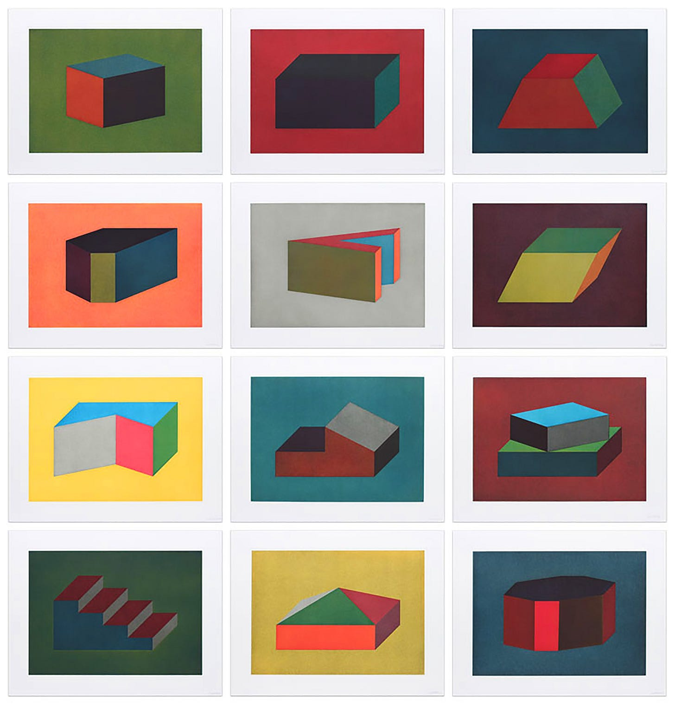
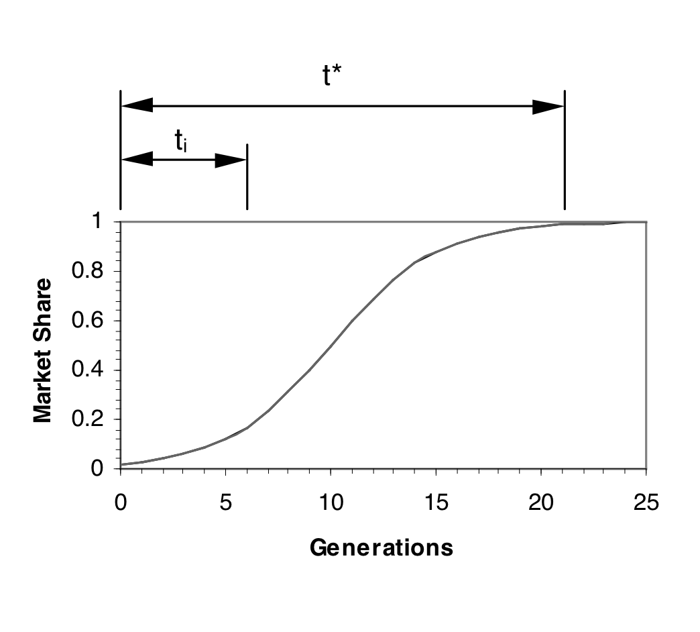

> #CM 这篇文章结合前面《记笔记并不能让我们变得聪明》一起看，还不错。思考和记录都有侧重点。

I’ve been thinking about [this paper on designing genetic algorithms](https://citeseerx.ist.psu.edu/document?repid=rep1&type=pdf&doi=2b0e0c3097db6079f47977b9a309da9cb15d4714) (Goldberg, 1998).  

我一直在思考这篇关于设计遗传算法的论文（Goldberg，1998 年）。

Genetic algorithms get computers to evolve solutions instead of having to design them ourselves. Since evolution will emerge in any system with [mutation, heredity, and selection](https://subconscious.substack.com/i/37455092/evolution-is-composition-with-memory), we just need a few ingredients. A string of 1s and 0s, some mutation operations, and a fitness function will do the trick.  

Press play, and watch designs evolve from the bottom-up.  

按下播放键，观看设计自下而上的演变。  

遗传算法可以让计算机进化出解决方案，而无需我们自己设计。由于在任何系统中都会出现变异、遗传和选择，因此我们只需要一些要素。一串 "1 "和 "0"、一些突变操作和一个适合度函数就可以了。

Goldberg’s paper is about designing GAs, but the patterns he identifies reveal deep insights about innovation in general.  

戈德伯格的论文是关于设计全球定位系统的，但他所发现的模式揭示了关于一般创新的深刻见解。  

They also suggest new ways of thinking about tools for thought. Let's unpack!  

它们还提出了思考工具的新思路。让我们来解读一下！

A genetic algorithm evolves building blocks—chunks of DNA that encode useful traits.  

遗传算法可以进化出构件--编码有用性状的 DNA 块。

> Genetic algorithms work through a mechanism of quasi-decomposition and reassembly… The basic idea is that GAs (1) implicitly identify building blocks or subassemblies of good solutions and (2) recombine different subassemblies to form very high performance solutions.  
> 
> 遗传算法通过一种准分解和重新组合的机制工作......其基本思想是，遗传算法（1）隐含地识别良好解决方案的构件或子组件，（2）重新组合不同的子组件，以形成性能非常高的解决方案。  
> 
> _([Goldberg, 1998](https://citeseerx.ist.psu.edu/document?repid=rep1&type=pdf&doi=2b0e0c3097db6079f47977b9a309da9cb15d4714)) (戈德堡，1998 年）_

So the GA ends up unbundling, remixing, and composing building blocks to make new, higher-level building blocks, in a (hopefully) upward spiral.  

因此，GA 最终会对构件进行拆分、混搭和组合，从而制作出新的、更高级别的构件，（希望）是一个螺旋式上升的过程。

We see this building block pattern emerge in other kinds of evolving systems, too.  

在其他类型的进化系统中，我们也能看到这种积木模式的出现。

-   [Technology evolves through composition](https://subconscious.substack.com/i/52021619/modularity-is-how-the-system-itself-evolves). Things get invented, then [get modularized](https://subconscious.substack.com/p/aggregators-arent-open-ended#%C2%A7aggregators-broke-the-evolutionary-loop-of-technology). These modules are integrated into new technologies, which themselves get modularized.  
    
    技术是通过组合而发展的。事物被发明出来，然后被模块化。这些模块被集成到新技术中，而新技术本身又被模块化。
    
-   Ideas compose too! [We call it citation](https://subconscious.substack.com/p/ideas-procreate-through-citation). Ideas get connected, creating new higher-level ideas, and so on.  
    
    思想也会写作！我们称之为引用。思想相互连接，创造出新的更高层次的思想，如此循环往复。
    

As Goldberg puts it, identification and exchange of building blocks is the critical path to innovative success.  

正如戈德伯格所说，识别和交换构件是创新成功的关键途径。

Sol LeWitt, 1990. “Forms Derived From a Cubic Rectangle”  

索尔-勒维特，1990 年"立方体矩形衍生的形式

GAs don’t evolve toward a single “perfect” thing. Evolution doesn’t work like that! So what are GAs evolving? A population of possibilities.  

基因工程不会朝着单一的 "完美 "事物进化。进化不是这样的！那么，GA 在进化什么呢？一群可能性。

> Understanding selectorecombinative GAs helps us understand that the decision making among different, competing notions is statistical in nature, and that as we increase the population size, we increase the likelihood of making the best possible decisions. _([Goldberg, 1998](https://citeseerx.ist.psu.edu/document?repid=rep1&type=pdf&doi=2b0e0c3097db6079f47977b9a309da9cb15d4714))_  
> 
> 了解选择性组合遗传工程有助于我们理解，不同的、相互竞争的概念之间的决策是统计性质的，随着种群数量的增加，我们做出最佳决策的可能性也会增加。(戈德伯格，1998 年）

Building blocks combine with other building blocks to create new building blocks. Each building block unlocks [new possible combinations](https://subconscious.substack.com/p/stepping-stones-in-possibility-space), expanding our [adjacent possible](https://subconscious.substack.com/p/evolution-adjacent-possible). The more building blocks we have, the more we can create.  

积木与其他积木组合在一起，可以创造出新的积木。每一块积木都会释放出新的组合可能，扩大我们相邻的可能。积木越多，我们就能创造越多。

> You see in this beauty a dynamic stabilizing effect essential to all life. Its aim is simple: to maintain and produce coordinated patterns of greater and greater diversity.  
> 
> 在这种美景中，你会看到一种对所有生命都至关重要的动态稳定效应。它的目的很简单：维持并产生越来越多样化的协调模式。  
> 
> Life improves the closed system's capacity to sustain life. Life—all life—is in the service of life.  
> 
> 生命提高了封闭系统维持生命的能力。生命--所有生命--都是为生命服务的。  
> 
> Necessary nutrients are made available to life by life in greater and greater richness as the diversity of life increases.  
> 
> 随着生命多样性的增加，生命为其提供的必要养分也越来越丰富。  
> 
> The entire landscape comes alive, filled with relationships and relationships within relationships.  
> 
> 整个景观生机勃勃，充满了人际关系和人际关系中的人际关系。  
> 
> _(Liet Keynes, Dune, Frank Herbert)  
> 
> (利特-凯恩斯，《沙丘》，弗兰克-赫伯特）_

Goldberg calls these BB-hard problems.  

戈德伯格将这些问题称为 BB 难问题。

> …This may be because the BBs are deep or complex, hard to find, or because different BBs are difficult to separate, but whatever the difficulty, it may be understood in strictly mechanistic terms.  
> 
> ......这可能是因为BBs很深、很复杂、很难找到，也可能是因为不同的BBs很难分开，但不管是什么困难，都可以用严格的机械论来理解。

This insight clicks together nicely with insights from [assembly theory](https://en.wikipedia.org/wiki/Assembly_theory). The basic intuition here is that evolution works from the bottom-up, in an upward spiral.  

Complex things, like animals, are composed of simpler things, like cells, DNA, molecules, atoms. Since evolution assembles things from the bottom-up, certain simple things end up being prerequisite to the emergence of complex things.  

复杂事物，如动物，是由较简单的事物组成的，如细胞、DNA、分子、原子。由于进化是自下而上地组合事物，某些简单事物最终成为复杂事物出现的先决条件。  

By measuring the complexity of a system, we can get a sense of its evolutionary depth, its这一观点与装配理论的观点不谋而合。这里的基本直觉是，进化是自下而上、螺旋式上升的。 _assembly index_.  

通过测量一个系统的复杂性，我们可以了解它的进化深度和装配指数。

Many BB-Hard problems are problems that require a relatively high assembly index to solve.  

许多 BB 难问题都是需要相对较高的装配指数才能解决的问题。

Genetic algorithms sometimes [prematurely converge](https://en.wikipedia.org/wiki/Premature_convergence) toward a single solution, and then get stuck. That’s a problem. We don’t want to get stuck in a [local maxima](https://subconscious.substack.com/p/getting-lost-in-the-land-of-ideas#:~:text=Our%20creative%20tools%20should%20help%20us%20converge%20efficiently%2C%20right%3F%20Well%2C%20there%E2%80%99s%20a%20dilemma%20here.%20Converging%20too%20early%20gets%20you%20stuck%20in%20local%20maxima%20%E2%80%94%20e.g.%20stuck%20at%20the%20top%20of%20a%20dull%20foothill%20in%20the%20landscape%20of%20ideas.). We want continual innovation.  

遗传算法有时会过早地向一个单一的解决方案靠拢，然后卡住。这是一个问题。我们不想陷入局部最大值。我们希望不断创新。

Why does this happen? Goldberg identifies two important variables: time-to-innovation (`ti`) and time-to-takeover (`t*`).  

为什么会出现这种情况？戈德伯格指出了两个重要变量：创新时间（ `ti` ）和接管时间（ `t*` ）。

-   Time-to-innovation (`ti`) is how long it takes for some new innovative building block to emerge by natural selection.  
    
    创新时间（ `ti` ）是指某些新的创新构件通过自然选择出现所需的时间。
    
-   Time-to-takeover (`t*`) is how long it takes for an innovation to diffuse through the population.  
    
    接管时间（ `t*` ）是指创新在人群中传播所需的时间。
    

Putting them together, we get two measures along a diffusion curve.  

把它们放在一起，我们就得到了沿着扩散曲线的两个测量值。

Since evolution requires a diverse pool of building blocks to draw from,  

因为进化需要一个多样化的构件库、

-   If time-to-innovation (`ti`) is shorter than time-to-takeover (`t*`), then new innovations disrupt old ones before they can cement a dominant position. When (`ti < t*)`, you get steady-state innovation.  
    
    如果创新时间( `ti` )短于接管时间( `t*` )，那么新创新在巩固主导地位之前就会颠覆旧创新。当 ( `ti < t*)` 时，就会出现稳态创新。
    
-   If time-to-innovation (`ti`) is longer than time-to-takeover (`t*`), the incumbent trait dominates. It saturate the population and evolution gets stuck.  
    
    There is too much of just one thing, and not enough building blocks for evolution to work with.  
    
    一种东西太多了，没有足够的基石供进化使用。  
    
    如果创新时间（ `ti` ）长于接管时间（ `t*` ），则现存性状将占主导地位。这将导致种群饱和，进化陷入停滞。
    

It turns out we’re in a race between innovation and ossification. When `ti < t*`, you have a functioning free market. When `ti > t*`, you get oligarchy.  

事实证明，我们正处在创新与僵化的竞争之中。当 `ti < t*` 时，你有一个正常运作的自由市场。当 `ti > t*` 时，就会出现寡头政治。

How might we apply some of these insights when designing tools for thought? Some thoughts and questions.  

在设计思想工具时，我们可以如何应用其中的一些见解？一些想法和问题。

**Your tool for thought should evolve building blocks**. What if we saw our notes as building blocks for ideas? What are the qualities we might look for in a building-block note?  

你的思维工具应该是积木式的。如果我们把笔记看成是思想的积木呢？我们可以从 "积木式 "笔记中寻找哪些特质？

-   Building blocks encode a useful trait. A building block note encodes an idea.  
    
    积木编码一个有用的特征。积木式纸条编码一个想法。
    
-   Building blocks are atomic. You want your BB-notes to be as small as possible, but no smaller. This maximizes combinatorial surface area.  
    
    积木是原子块。你希望你的 BB 注释越小越好，但也不能更小。这样可以最大限度地增加组合表面积。
    
-   Building blocks are composable. BB-notes are focused on composition too. Big ideas are composed from smaller ideas, through hyperlinking and [transclusion](https://en.wikipedia.org/wiki/Transclusion).  
    
    积木是可组合的。BB 注释也注重构成。通过超链接和转接，由小构思组成大构思。
    

Aha! We’ve rediscovered the [evergreen note](https://notes.andymatuschak.org/Evergreen_notes) pattern. The building block hypothesis gives us a explanation of why evergreen notes work so well for knowledge generation.  

啊哈！我们重新发现了常青笔记模式。积木式假说为我们解释了为什么常青音符在知识生成方面如此有效。

**Grow the pool of building blocks**. The bigger your pool of atomic notes, the greater the number of possible combinations. Each note expands your adjacent possible.  

Increase the population size to increase the likelihood of innovation.  

增加种群数量，提高创新的可能性。  

扩大积木库。原子音符库越大，可能的组合就越多。每个音符都会扩大相邻的可能性。

-   How might we expand our population of notes?  
    
    如何扩大我们的笔记人口？
    
-   Is there any upper limit? How big is too big?  
    
    有没有上限？多大才算大？
    

**Introduce mutation**. [Permanent notes](https://zettelkasten.de/posts/concepts-sohnke-ahrens-explained/#permanent-notes) are sort of like DNA. They act as a durable repository for memory across time. What might happen if we introduced mutation to the system?  

引入变异。永久笔记有点像 DNA。它们是跨越时间的持久记忆库。如果我们在系统中引入变异，会发生什么呢？

-   What if we introduced game loops to combine, remix, and rework notes?  
    
    如果我们引入游戏循环，对音符进行组合、混音和再加工呢？
    
-   What other kinds of mutation might we introduce?  
    
    我们还能引入哪些变异？
    

**Add a selection pressure**. Evolution requires mutation, memory, and one more thing—selection.  

增加选择压力。进化需要突变、记忆，还需要一样东西--选择。

-   How might you, yourself, act as a selection pressure on your own notes?  
    
    你自己如何对自己的笔记施加选择压力？
    
-   Can we introduce game loops to help us manually curate, combine, and prune notes?  
    
    我们能否引入游戏循环，帮助我们手动整理、组合和修剪笔记？
    
-   What other signals might we use to introduce selection?  
    
    我们还可以使用哪些信号来引入选择？
    

**Expand the diversity of building blocks**. As Goldberg puts it, diversity is a necessary condition of selectorecombinative success. The broader our ecology of notes, the greater the combinatorial possibility.  

扩大构建模块的多样性。正如戈德伯格所说，多样性是选择性组合成功的必要条件。我们的音符生态越广泛，组合的可能性就越大。

-   In what ways might we increase the diversity of our notes?  
    
    我们可以通过哪些方式来增加我们笔记的多样性？
    
-   How might we connect notes laterally, across topic boundaries?  
    
    我们可以如何横向连接笔记，跨越主题界限？
    

**Build an engine to discover hard building blocks**. These building blocks are probably going to have a high assembly index. What does this mean for note-taking?  

We want to build game loops that encourage us to compose small ideas into bigger ones, in a recursive loop.  

我们希望建立游戏循环，鼓励我们在递归循环中将小创意组合成大创意。  

The higher the assembly index, the greater the chance you will stumble upon your next big idea.  

装配指数越高，你就越有可能发现下一个好点子。  

建立一个引擎，发现硬积木。这些积木很可能具有很高的组装指数。这对记笔记意味着什么？

-   How might we measure the assembly index of a note? Length? Number of links? Depth of links?  
    
    如何测量音符的集合指数？长度？链接数？链接的深度？
    
-   How might we increase the assembly index of our thoughts?  
    
    如何提高我们思想的集合指数？
    

**Accelerate time-to-innovation**. Innovation has to outpace takeover, or evolution gets stuck. Ideas can get ossified too. If `ti < t*`, then you experience continual inspiration. If `ti > t*`, you get creative block.  

加快创新时间。创新必须超越接管，否则进化就会停滞不前。想法也会僵化。如果 `ti < t*` ，您就会不断获得灵感。如果 `ti > t*` ，您就会遇到创新障碍。

-   What does takeover mean in a note-taking context? Big ideas that you return to over and over? Ideological capture? Restating your priors?  
    
    在记笔记时，"接管 "意味着什么？你反复回味的重要思想？意识形态捕获？重述你的先验？
    
-   Are there progressive taxes on (t\*) that might subsidize or accelerate (`ti`)? Can we slow time-to-takeover? Should we? Which is the more important variable for provoking steady-state innovation?  
    
    是否有可能补贴或加速（ `ti` ）的（t\*）累进税？我们能否延缓接管时间？是否应该？哪个变量对激发稳态创新更重要？
    
-   Can we increase the rate of mutation to accelerate time-to-innovation? How fast is too fast?  
    
    我们能否提高突变率以加快创新速度？多快才算快？
    
-   What if we preferentially resurfaced drafts, or less-connected notes, giving them a chance to become building blocks?  
    
    如果我们优先恢复草稿或联系较少的笔记，让它们有机会成为构件呢？
