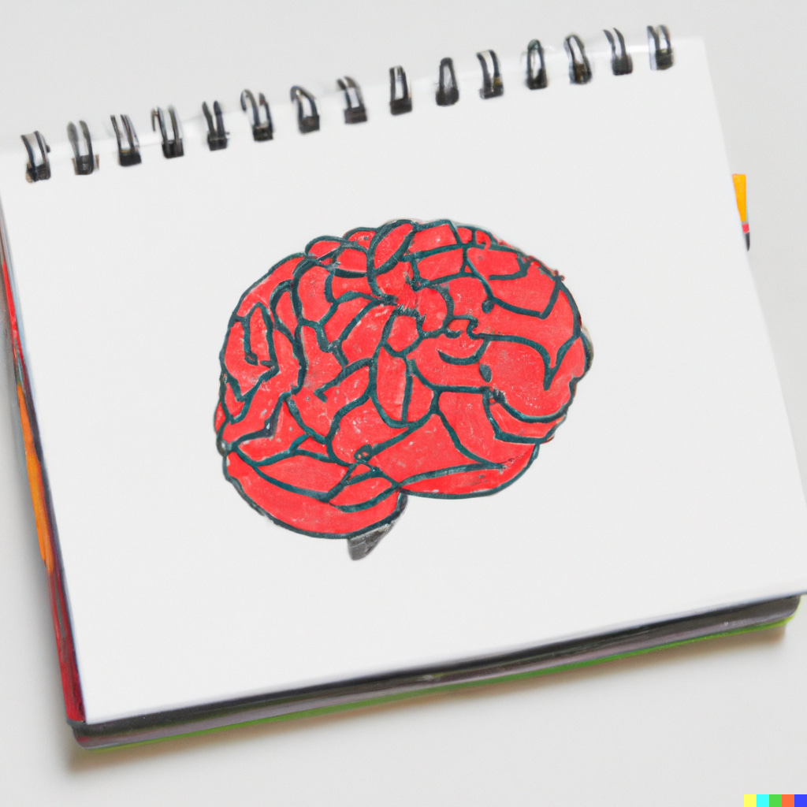
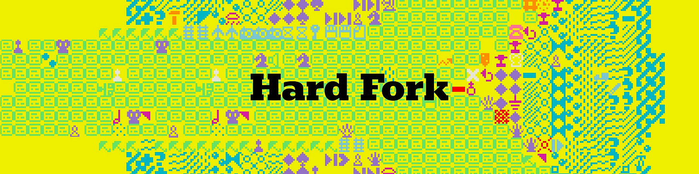
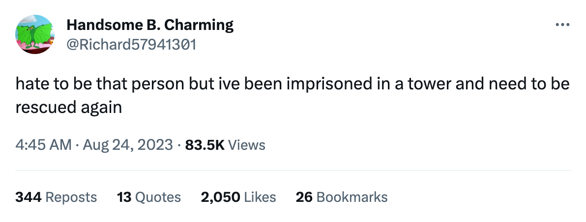
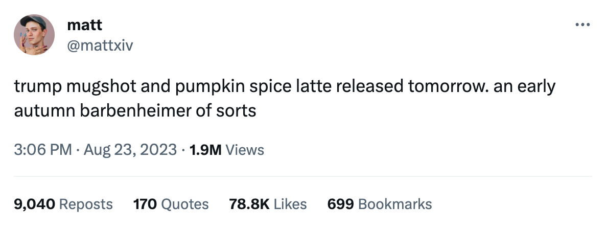

> #CM 我是 PKM 中度用户，对于笔记这件事我始终觉得是少部分人的「习惯」，但是我不知道这个少部分人的构成。大多数人是不记笔记的，在 LLM 大背景下，笔记或许应该重写思考一下了。

“a notepad with a drawing of a human brain on it” / DALL-E  

"写有人脑图画的记事本" / DALL-E

Today let’s step outside the news cycle and turn our attention toward a topic I’m deeply invested in but only rarely write about: productivity platforms. For decades now, software tools have promised to make working life easier.  

今天，让我们跳出新闻的圈子，把目光转向一个我非常关注但却很少写的话题：生产力平台。几十年来，软件工具一直承诺让工作生活更轻松。  

But on one critical dimension — their ability to improve our thinking — they don’t seem to be making much progress at all.  

但在一个关键方面，即提高我们的思维能力方面，他们似乎并没有取得多大进展。

Meanwhile, the arrival of generative artificial intelligence could make the tools we use more powerful than ever — or they could turn out to be just another mirage.  

与此同时，生成式人工智能的到来可能使我们使用的工具比以往任何时候都更加强大，也可能使它们变成另一个海市蜃楼。

To understand where things went wrong, I want to focus on the humble note-taking app: the place where, for so many of us, thinking begins.  

要了解问题出在哪里，我想重点谈谈不起眼的记事应用程序：对我们许多人来说，思考是从这里开始的。

**I.**

Earlier this week I read a story about farmers. “America’s Farmers Are Bogged Down by Data,” read the headline on [Belle Lin’s story in the](https://www.platformer.news/p/why-note-taking-apps-dont-make-ushttp://America’s Farmers Are Bogged Down by Data) _[Wall Street Journal](https://www.platformer.news/p/why-note-taking-apps-dont-make-ushttp://America’s Farmers Are Bogged Down by Data)_. I thought to myself: _You and me both, farmer!_ And I read the piece.  

本周早些时候，我读到一篇关于农民的报道。华尔街日报》上林蓓蕾报道的标题是："美国农民被数据所困"。我心想：你和我都是农民！我又读了这篇报道。

Over the past decade, farmers have been offered all manner of software tools to analyze and manage their crops.  

在过去十年中，农民们获得了各种软件工具来分析和管理他们的作物。  

In general, though, the more software that farmers use, the more they find themselves overwhelmed by data that the tools collect.  

不过，一般来说，农民使用的软件越多，他们就越会发现自己被这些工具收集的数据压得喘不过气来。  

“We’re collecting so much data that you’re almost paralyzed with having to analyze it all,” one farmer told the _Journal_.  

"一位农民告诉《日刊》："我们收集了太多的数据，要对这些数据进行分析，你几乎要瘫痪了。

As a journalist, I’ve never collected as much data as I do now.  

作为一名记者，我从未像现在这样收集这么多数据。  

The collapse of Twitter has me browsing four or five text-based social feeds a day, scanning for news and thoughtful conversation.  

Twitter 的崩溃让我每天都要浏览四五个基于文本的社交源，浏览新闻和有思想的对话。  

The growing popularity of arXiv and pre-prints in general has left me with a stack of research that I will never get through. Book galleys pile up in my house.  

随着 arXiv 和预印本的日益普及，我的研究成果堆积如山，永远也读不完。书架上的书堆积如山。

Meanwhile, all day long I browse the web. Stories that might belong in **Platformer** get saved into a database in the productivity platform Notion. Every link that has ever been in this newsletter is stored there, in many cases with the full article text.  

与此同时，我整天都在浏览网页。可能属于 Platformer 的故事会被保存到生产力平台 Notion 的数据库中。本通讯中出现过的每一个链接都保存在这里，很多时候还附有文章全文。

Collectively, this material offers me an abundance of riches — far more to work with than any beat reporter had such easy access to even 15 years ago.  

总之，这些材料为我提供了丰富的素材--即使在 15 年前，我也无法如此轻易地接触到如此多的素材。

And yet most days I find myself with the same problem as the farmer: I have so much information at hand that I feel paralyzed.  

然而，大多数时候，我发现自己遇到了和农夫一样的问题：我手头的信息太多了，以至于我感到瘫痪。

**II.**

One solution to this data paralysis is to take notes. As a journalist, of course, I have always taken notes.  

解决数据瘫痪的一个办法就是做笔记。当然，作为一名记者，我一直在做笔记。  

A few years ago, I thought we had seen some true breakthroughs in note-taking, and increasingly put my faith in those tools not just to capture my writing but to improve the quality of my thinking.  

几年前，我以为我们已经在笔记方面取得了一些真正的突破，并越来越相信这些工具不仅能记录我的写作，还能提高我的思维质量。

The breakthrough tool was [Roam Research](https://roamresearch.com/). In 2021, I wrote here about [my first year using the subscription-based software](https://www.platformer.news/p/notes-on-a-year-using-roam-research), which had two key insights into knowledge work. One was to make professional note-taking feel more like journaling.  

It turns out that a fresh note created each day, labeled with a date, is a good canvas for collecting transient thoughts, which can serve as a springboard into deeper thinking.  

事实证明，每天创建一张标有日期的新便条，是收集短暂想法的良好画布，可以作为深入思考的跳板。  

这个突破性的工具就是 Roam Research。2021 年，我在这里写下了我第一年使用这款基于订阅的软件的经历，它对知识工作有两个重要的启示。一个是让专业笔记更像日记。

The second is known to note-taking nerds as “[bidirectional linking](https://maggieappleton.com/bidirectionals).” Standard links, like the ones you find on the web, go in only one direction — from one page to another. In a note-taking app, bidirectional links join two pages together.  

This effectively lets you add backlinks to any concept — a company that’s important to you, say, or a concept that’s on your mind — and then let you browse everything you’ve collected related to that concept at your leisure.  

这样，您就可以有效地将反向链接添加到任何概念上--比如说，对您很重要的公司，或者您心中的某个概念--然后您就可以随意浏览您收集到的与该概念相关的所有内容。  

第二种被记笔记的书呆子称为 "双向链接"。标准链接，比如你在网上找到的链接，只有一个方向--从一个页面到另一个页面。在笔记应用程序中，双向链接将两个页面连接在一起。

On one level, that’s not so different from adding tags to notes. But tags are more about search.  

从某种程度上说，这与在笔记中添加标签并无太大区别。但标签更多的是为了搜索。  

Bidirectional links, which some apps show you on pages that include snippets of all the other notes that contain the same link, are more about browsing and rediscovery.  

有些应用程序会在页面上显示双向链接，其中包括包含相同链接的所有其他笔记的片段，这种链接更适合浏览和重新发现。

Initially, I threw myself into this kind of associative note-taking.  

起初，我把自己投入到这种联想式笔记中。  

I gathered links around concepts I wanted to explore (“the internet enables information to travel too quickly,” for example, or social networks and polarization).  

我围绕我想探讨的概念收集链接（例如 "互联网让信息传播得太快"，或者社交网络和两极分化）。  

When I had an interesting conversation with a person, I would add notes to a personal page I had created for them. A few times a week, I would revisit those notes.  

当我与某人进行了一次有趣的谈话后，我会在为他创建的个人页面上添加笔记。每周我会重温几次这些笔记。

I waited for the insights to come.  

我等待着洞察力的到来。

And waited. And waited.  

等待一直等

My gusto for concept-based, link-heavy note-taking diminished. Roam’s development slowed to a crawl, and I spent a season with the lightweight, mostly free alternative known as [Obsidian](https://obsidian.md/). Obsidian’s brutalist design wore on me, though, and eventually I decamped for the more polished user interface of [Mem](https://get.mem.ai/). (These apps all enable the exporting of your notes in Markdown, making switching relatively painless.)  

我对基于概念、链接繁多的记事本的热情逐渐减退。Roam 的开发速度越来越慢，我花了一个季度的时间来使用轻量级、基本免费的替代软件 Obsidian。不过，Obsidian 的野蛮设计让我感到厌倦，最终我选择了用户界面更精致的 Mem（这些应用都能以 Markdown 格式导出笔记，因此切换起来相对简单）。

I continue to journal most days, and occasionally find myself working to refine one concept or another among those notes.  

我每天都坚持写日记，偶尔也会发现自己正在努力完善笔记中的某个概念。

But the original promise of Roam — that it would improve my thinking by helping me to build a knowledge base and discover new ideas — fizzled completely.  

但是，Roam 最初的承诺--通过帮助我建立知识库和发现新想法来改善我的思维--完全泡汤了。

**III.**

One interpretation of these events is that the software failed: that journaling and souped-up links simply don’t have the power some of us once hoped they did.  

对这些事件的一种解释是，软件失败了：日志和经过改进的链接根本没有我们中的一些人曾经希望的那样强大。

Another view, though, is that they are up against a much stronger foe — the infinite daily distractions of the internet.  

不过，另一种观点认为，他们的敌人要强大得多，那就是每天无穷无尽的网络干扰。

Note-taking, after all, does not take place in a vacuum.  

做笔记毕竟不是在真空中进行的。  

It takes place on your computer, next to email, and Slack, and Discord, and iMessage, and the text-based social network of your choosing.  

它发生在你的电脑上，与电子邮件、Slack、Discord、iMessage 和你选择的文本社交网络为邻。  

In the era of alt-tabbing between these and other apps, our ability to build knowledge and draw connections is permanently challenged by what might be our ultimately futile efforts to multitask.  

在这些应用程序和其他应用程序之间频繁切换的时代，我们积累知识和建立联系的能力长期受到挑战，而我们为完成多任务所做的努力最终可能是徒劳的。

Ezra Klein wrote beautifully about this situation this week [in the](https://www.nytimes.com/2023/05/28/opinion/artificial-intelligence-thinking-minds-concentration.html) _[New York Times](https://www.nytimes.com/2023/05/28/opinion/artificial-intelligence-thinking-minds-concentration.html)_:  

本周，埃兹拉-克莱因（Ezra Klein）在《纽约时报》上对这种情况进行了精彩的描述：

> Gloria Mark, a professor of information science at the University of California, Irvine, and the author of “[Attention Span](https://www.harpercollins.com/products/attention-span-gloria-mark?variant=40346590117922),” started researching the way people used computers in 2004. The average time people spent on a single screen was 2.5 minutes. “I was astounded,” she told me.  
> 
> “That was so much worse than I’d thought it would be.” But that was just the beginning. By 2012, Mark and her colleagues found the average time on a single task was 75 seconds.  
> 
> "这比我想象的要糟糕得多"但这仅仅是个开始。到 2012 年，马克和她的同事们发现，完成一项任务的平均时间为 75 秒。  
> 
> Now it’s down to about 47.  
> 
> 现在只剩 47 个了。  
> 
> 加州大学欧文分校信息科学教授、《注意力跨度》一书的作者格洛丽亚-马克从 2004 年开始研究人们使用电脑的方式。人们在一个屏幕上花费的平均时间是 2.5 分钟。"她对我说："我感到非常震惊。
> 
> This is an acid bath for human cognition. Multitasking is mostly a myth. We can focus on one thing at a time. “It’s like we have an internal whiteboard in our minds,” Mark said.  
> 
> 这是对人类认知的一次酸洗。多任务处理大多是个神话。我们可以一次只专注于一件事。"马克说："我们的大脑中就像有一块内部白板。  
> 
> “If I’m working on one task, I have all the info I need on that mental whiteboard. Then I switch to email.  
> 
> "如果我正在处理一项任务，我就会在心理白板上输入我需要的所有信息。然后我再切换到电子邮件。  
> 
> I have to mentally erase that whiteboard and write all the information I need to do email. And just like on a real whiteboard, there can be a residue in our minds.  
> 
> 我必须在脑海中擦掉白板，写下我需要的所有信息，才能完成电子邮件。就像在真正的白板上一样，我们的脑海中也会有残留物。  
> 
> We may still be thinking of something from three tasks ago.”  
> 
> 我们可能还在想着三项任务之前的事情。"

My first thought upon reading this was that it seems rare for me to spend even 47 seconds looking at one screen on my computer without at least glancing at another.  

我读到这篇文章后的第一个想法是，我似乎很少会花哪怕 47 秒钟看电脑上的一个屏幕，而不至少瞥一眼另一个屏幕。  

(I bought a 38” widescreen monitor for the express purpose of being able to glance at many windows simultaneously. At the time I understood this as a tool for _enhancing_ my productivity.)  

(我购买 38 英寸宽屏显示器的明确目的就是为了能够同时浏览多个窗口）。当时我认为这是一种提高工作效率的工具）。

My second thought is that if you want to take good notes, you have to first extract your mind from the acid bath.  

我的第二个想法是，如果你想做好笔记，就必须先把自己的思想从酸水浴中抽离出来。

**IV.**

Klein’s piece starts from the observation that productivity growth is now about half of what it was in the 1950s and ‘60s.  

克莱因在文章中首先指出，目前生产率的增长只有上世纪五六十年代的一半左右。  

The internet’s arrival briefly speeded it up, he writes, but the more we stared at our screens the slower our productivity improved.  

他写道，互联网的出现曾短暂地加快了速度，但我们越是盯着屏幕，工作效率就越低。  

He worries that AI will have a similar effect on the economy — promising to make us more productive, while simultaneously inventing so many new distractions and entertainments that they overwhelm and paralyze us.  

他担心，人工智能会对经济产生类似的影响--一方面有望提高我们的生产力，另一方面又会发明出如此之多的新的分心和娱乐活动，以至于让我们不堪重负，陷入瘫痪。

The piece stuck with me, because there is one specific way I am counting on AI to make me more productive.  

这篇报道让我记忆犹新，因为有一种具体的方式，我正指望人工智能来提高我的工作效率。  

It goes back to that database of links I’ve been building in Notion, and the insights I was hoping to get out of Roam.  

这又回到了我在 Notion 中建立的链接数据库，以及我希望从 Roam 中获得的见解。

Earlier this year, like many productivity tools, Notion added a handful of AI features. I use two of them in my links database.  

今年早些时候，和许多生产力工具一样，Notion 也添加了一些人工智能功能。我在我的链接数据库中使用了其中两项。  

One extracts the names of any companies mentioned in an article, creating a kind of automatic tagging system.  

其中一个功能是提取文章中提到的任何公司的名称，从而创建一种自动标记系统。  

The other provides a two- or three-sentence summary of the article I’m saving.  

另一个是我保存的文章的两三句摘要。

Neither of these, in practice, is particularly useful. Tags might theoretically be useful for revisiting old material, but databases are not designed to be browsed.  

实际上，这两者都不是特别有用。从理论上讲，标签可能对重访旧资料有用，但数据库不是为浏览而设计的。  

And while we publish summaries of news articles in each edition of the newsletter, we wouldn’t use AI-written summaries: among other reasons, they often miss important details and context.  

虽然我们在每期时事通讯中都会发布新闻文章摘要，但我们不会使用人工智能编写的摘要：原因之一是，它们往往会遗漏重要的细节和背景。

At the same time, the database contains nearly three years of links to every subject I cover here, along with the complete text of thousands of articles.  

同时，该数据库还包含近三年来我在这里涉及的每个主题的链接，以及数千篇文章的全文。  

It is here, and not in a note-taking app, that knowledge of my beat has been accreting over the past few years.  

正是在这里，而不是在记事应用程序中，过去几年来，我的节拍知识不断积累。  

If only I could access that knowledge in some way that went beyond my memory.  

如果我能以某种超越记忆的方式获取这些知识就好了。

It’s here that AI should be able to help. Within some reasonable period of time, I expect that I will be able to talk to my Notion database as if it’s ChatGPT.  

在这方面，人工智能应该能帮上忙。我希望在一段合理的时间内，我就能像使用 ChatGPT 一样与我的 Notion 数据库对话。  

If I could, I imagine I would talk to it all the time.  

如果可以，我想我会一直和它说话。

Much of journalism simply involves remembering relevant events from the past. An AI-powered link database has a perfect memory; all it’s missing is a usable chat interface.  

新闻业的许多工作都涉及到对过去相关事件的记忆。人工智能驱动的链接数据库拥有完美的记忆力，它所缺少的只是一个可用的聊天界面。  

If it had one, it might be a perfect research assistant.  

如果它有一个，也许会成为一个完美的研究助手。

I imagine using it to generate little briefing documents to help me when I return to a subject after some time away. _Catch me up on Canada’s fight with Meta over news_, I might say. _Make me a timeline of events at Twitter since Elon Musk bought it_. _Show me coverage of deepfakes over the past three months_.  

我想象着用它来生成一些小的简报文件，以便在我离开一段时间后重新回到某个主题时为我提供帮助。我可以说，让我了解加拿大与 Meta 在新闻方面的斗争。为我制作伊隆-马斯克收购推特后的大事年表。给我看过去三个月里关于深度伪造的报道。

Today’s chatbots can’t do any of this to a reporter’s standard. The training data often stops in 2021, for one thing.  

如今的聊天机器人无法达到记者的标准。首先，训练数据往往在 2021 年就停止了。  

The bots continue to make stuff up, and struggle to cite their sources.  

这些机器人继续胡编乱造，并努力引用资料来源。

But if I could chat in natural language with a massive archive, built from hand-picked trustworthy sources? That seems powerful to me, at least in the abstract.  

但是，如果我可以用自然语言与一个庞大的档案库聊天，而这个档案库是由精心挑选的可信资料来源建立的？在我看来，至少抽象地说，这似乎很强大。

Of course, the output from this kind of AI tool has to be trustworthy.  

当然，这种人工智能工具的输出结果必须值得信赖。  

A significant problem with using AI tools to summarize things is that you can’t trust the summary unless you read all the relevant documents yourself — defeating the point of asking for a summary in the first place.  

使用人工智能工具进行摘要的一个重要问题是，除非你自己阅读了所有相关文件，否则你无法相信摘要，这就失去了要求摘要的初衷。

Still, if you are the sort of productivity-tool optimist who will try any to-do list or calendar app on the off chance it makes you even a little happier at work, it seems to me that a database you can talk to might be the next-generation note-taking tool we have been waiting for.  

不过，如果你是那种生产力工具的乐观主义者，愿意尝试任何待办事项列表或日历应用程序，只要它能让你工作得更开心一些，那么在我看来，一个可以与你对话的数据库可能就是我们期待已久的下一代笔记工具。

**V.**

I’ve learned something else about note-taking apps, though, since my mania for them began in 2020.  

不过，自从 2020 年我开始狂热地使用笔记应用程序以来，我对它们有了一些新的认识。

In short: it is probably a mistake, in the end, to ask software to improve our thinking.  

简而言之：归根结底，要求软件来改进我们的思维可能是一个错误。  

Even if you can rescue your attention from the acid bath of the internet; even if you can gather the most interesting data and observations into the app of your choosing; even if you revisit that data from time to time — this will not be enough.  

即使您能把注意力从互联网的酸性浴中解救出来；即使您能把最有趣的数据和观察结果收集到您选择的应用程序中；即使您能不时地重温这些数据--这也是不够的。  

It might not even be worth trying.  

也许根本不值得一试。

The reason, sadly, is that thinking takes place in your brain.  

可悲的是，原因在于思考是在大脑中进行的。  

And thinking is an active pursuit — one that often happens when you are spending long stretches of time staring into space, then writing a bit, and then staring into space a bit more.  

而思考是一种积极的追求--这种追求往往发生在你长时间凝视太空，然后写一点东西，再凝视太空一点的时候。  

It’s here that the connections are made and the insights are formed. And it is a process that stubbornly resists automation.  

正是在这里建立了联系，形成了见解。这是一个顽固抵制自动化的过程。

Which is not to say that software can’t help. Andy Matuschak, a researcher whose [spectacular website](https://notes.andymatuschak.org/%C2%A7Note-writing_systems) offers a feast of thinking about notes and note-taking, observes [that note-taking apps emphasize displaying and manipulating notes, but never making sense](https://notes.andymatuschak.org/%C2%A7Note-writing_systems?stackedNotes=zsRuFxYgckGS81tr2eiBAP) _[between](https://notes.andymatuschak.org/%C2%A7Note-writing_systems?stackedNotes=zsRuFxYgckGS81tr2eiBAP)_ [them](https://notes.andymatuschak.org/%C2%A7Note-writing_systems?stackedNotes=zsRuFxYgckGS81tr2eiBAP). Before I totally resign myself to the idea that a note-taking app can’t solve my problems, I will admit that on some fundamental level no one has really tried.  

这并不是说软件帮不上忙。安迪-马图夏克（Andy Matuschak）是一位研究人员，他的网站非常壮观，提供了关于笔记和记笔记的思想盛宴。在我完全接受 "记笔记应用无法解决我的问题 "这一观点之前，我得承认，从根本上讲，没有人真正尝试过。

“The goal is not to take notes — the goal is to think effectively,” [Matuschak writes](https://notes.andymatuschak.org/%C2%A7Note-writing_systems?stackedNotes=z8V2q398qu89vdJ73N2BEYCgevMqux3yxQUAC&stackedNotes=z7kEFe6NfUSgtaDuUjST1oczKKzQQeQWk4Dbc). “Better questions are “what practices can help me reliably develop insights over time?” \[and\] “how can I shepherd my attention effectively?”  

"马图沙克写道："我们的目标不是记笔记，而是有效地思考。"更好的问题是："哪些做法可以帮助我长期可靠地形成见解？\[以及\]"我如何才能有效地引导我的注意力？

I’ll admit to having forgotten those questions over the past couple years as I kept filling up documents with transient strings of text inside expensive software.  

我承认在过去的几年里，我已经忘记了这些问题，因为我一直在昂贵的软件中用短暂的文本字符串填充文档。  

And I accept that to be a better thinker, I’ll have to devote more time and attention to wrestling with what I find.  

我承认，要想成为一个更好的思考者，我必须投入更多的时间和精力，与我的发现进行搏斗。

If there’s a friendly AI to help me do that, though, I’ll be first in line to try it.  

不过，如果有一个友好的人工智能能帮我做到这一点，我会第一个去尝试。

**On the podcast this week:** Making sense of New York’s Airbnbacklash. Then, the _Times’_ Erin Griffith joins to tell us the craziest things that AI startup founders are doing to find the GPUs they need. Finally, we select the AI songs of the summer.  

本周播客：纽约 Airbnback 事件的意义。然后，《泰晤士报》的艾琳-格里菲斯（Erin Griffith）将为我们讲述人工智能初创公司的创始人为了找到他们需要的 GPU 而做的最疯狂的事情。最后，我们将选出今年夏天的人工智能歌曲。

**[Apple](https://substack.com/redirect/1f026a90-0a73-4c06-91a5-d9f0074230ed?r=9cs7) | [Spotify](https://substack.com/redirect/1ab817bf-db21-4c76-8b8b-73c3d62d0dd7?r=9cs7) | [Stitcher](https://substack.com/redirect/8f21522a-d6a1-4ec4-a4db-2acaea82bd59?r=9cs7) | [Amazon](https://substack.com/redirect/facb11f9-5648-4c10-8629-af0dbc7a8f4a?r=9cs7) | [Google](https://substack.com/redirect/3bae724f-a172-4879-83b3-50b787887714?r=9cs7)  

Apple | Spotify | Stitcher | Amazon | Google**

Want to hang out with me in person? [Applications are open](http://voxmediaevents.com/code2023Apply/caseyplatformer) for this year’s Code Conference, hosted by me, _The Verge_’s **Nilay Patel**, and CNBC’s **Julia Boorstin**. Join us for live, on-stage journalism with X/Twitter CEO **Linda Yaccarino**, GM CEO **Mary Barra**, Microsoft CTO **Kevin Scott**, and many more speakers to come. It’s all happening September 26th and 27th at The Ritz-Carlton, Laguna Niguel. Follow the latest [here](https://voxmediaevents.com/code2023Apply).  

想和我当面交流吗？由我、The Verge 的 Nilay Patel 和 CNBC 的 Julia Boorstin 主持的今年的代码大会已经开始接受报名。加入我们，与 X/Twitter 首席执行官琳达-雅卡里诺（Linda Yaccarino）、通用汽车首席执行官玛丽-巴拉（Mary Barra）、微软首席技术官凯文-斯科特（Kevin Scott）以及更多演讲者一起在台上进行现场新闻报道。所有活动将于 9 月 26 日和 27 日在拉古纳尼格尔丽思卡尔顿酒店举行。点击这里了解最新信息。

-   [Online conspiracy theories and misinformation about the death of Wagner Group leader Yevgeny V.  
    
    网上关于瓦格纳集团领导人叶夫根尼-V.之死的阴谋论和错误信息。  
    
    Prigozhin in a plane crash this week are running rampant in the absence of official communication from Russia.](https://www.nytimes.com/live/2023/08/24/world/prigozhin-russia-ukraine-news#with-few-available-facts-about-the-crash-rumors-surge) (Sheera Frenkel and Steven Lee Myers / _The New York Times_)  
    
    本周坠机事件中的 Prigozhin 在没有俄罗斯官方消息的情况下肆意妄为。(Sheera Frenkel 和 Steven Lee Myers /《纽约时报）
    
-   [The U.K.  英国  
    
    government’s planned changes to the country’s digital surveillance apparatus, which include blocking end-to-end encryption, may be in violation of international human rights law.](https://www.justsecurity.org/87615/changes-to-uk-surveillance-regime-may-violate-international-law/) (Ioannis Kouvakas / Just Security)  
    
    政府计划对国家数字监控机构进行的改革可能违反了国际人权法，其中包括阻止端到端加密。(Ioannis Kouvakas / Just Security）
    
-   [Google said it would provide more transparency around ad targeting and step up its moderation of CSAM and other illegal content to comply with the EU’s Digital Services Act, which goes into effect on Friday.](https://www.reuters.com/technology/google-vows-more-transparency-ads-new-eu-rules-kick-2023-08-24/) (Foo Yun Chee / Reuters)  
    
    谷歌表示，将提高广告定位的透明度，并加强对 CSAM 和其他非法内容的管理，以遵守周五生效的欧盟《数字服务法案》。(Foo Yun Chee /路透社）
    
-   [Tensions between platforms like Facebook and the news industry are complicating emergency relief responses to natural disasters](https://www.washingtonpost.com/technology/2023/08/24/canada-fires-ca-floods-meta-x-news/). Government agencies are struggling to combat online misinformation around persistent wildfires and tropical storms. They could always choose not to force platforms to pay for the right to show emergency information!  
    
    (Will Oremus /Facebook 等平台与新闻行业之间的紧张关系使自然灾害紧急救援工作变得更加复杂。政府机构正在努力打击围绕持续野火和热带风暴的网络错误信息。他们可以选择不强迫平台为显示紧急信息的权利付费！ _The Washington Post_)  
    
    (Will Oremus /《华盛顿邮报）
    
-   [Google and Meta’s Canadian news ban may be exacerbating misinformation issues caused by an influx of AI-generated news websites, which are popping up faster than the companies can blacklist them.](https://www.thestar.com/business/technology/hundreds-of-ai-news-sites-busily-spew-misinformation-google-and-meta-s-canadian-news-ban/article_734f1666-94ba-5f3f-ad5a-5fde47043393.html) (Kevin Jiang / _Toronto Star_)  
    
    谷歌和 Meta 的加拿大新闻禁令可能会加剧因人工智能生成的新闻网站大量涌入而造成的错误信息问题，这些网站出现的速度比公司将其列入黑名单的速度还要快。(Kevin Jiang / 多伦多星报）
    
    -   [A new study from NewsGuard found 37 AI-powered news sites repackaging articles from legitimate news sources without credit, despite policies from all major chatbot makers barring use of the software for plagiarism.](https://www.newsguardtech.com/misinformation-monitor/august-2023/) (NewsGuard)  
        
        NewsGuard 的一项新研究发现，有 37 家人工智能新闻网站在不注明来源的情况下重新包装合法新闻来源的文章，尽管所有主要聊天机器人制造商都制定了禁止使用该软件进行剽窃的政策。(新闻卫士）
        
-   [Apple penned a surprising letter of support for a new California “right to repair” bill on the grounds that it would improve privacy and security requirements around repair services.](https://techcrunch.com/2023/08/23/apple-lends-support-to-california-state-right-to-repair-bill/) (Brian Heater / _TechCrunch_)  
    
    苹果公司出人意料地撰文支持加州新的 "维修权 "法案，理由是该法案将改善维修服务的隐私和安全要求。(Brian Heater / TechCrunch）
    
-   [Crypto exchange Binance continues to accept Russian rubles for token trades, potentially violating U.S. sanctions, and is now under investigation by the Justice Department.](https://www.wsj.com/finance/binance-cryptocurrency-russia-sanctions-ddb948c3?mod=djemalertNEWS) (Angus Berwick and Patricia Kowsmann / _WSJ_)  
    
    加密货币交易所 Binance 继续接受俄罗斯卢布进行代币交易，可能违反了美国的制裁规定，目前正在接受司法部的调查。(安格斯-贝里克（Angus Berwick）和帕特里夏-考斯曼（Patricia Kowsmann）/《华尔街日报
    

-   [Google is the main driver of traffic to deepfake pornography websites — and meanwhile, Amazon, Cloudflare and Microsoft help deepfake creators share and monetize their videos on the web.](https://www.bloomberg.com/news/articles/2023-08-24/google-microsoft-tools-behind-surge-in-deepfake-ai-porn?sref=CrGXSfHu) (Cecilia D'Anastasio and Davey Alba / Bloomberg)  
    
    谷歌是深层伪造色情网站流量的主要驱动力--与此同时，亚马逊、Cloudflare 和微软帮助深层伪造者在网络上分享他们的视频并从中获利。(塞西莉亚-达纳斯塔西奥和戴维-阿尔巴/彭博社）
    
-   [Google’s “have it both ways” approach to balancing copyright compliance with AI development has created a major contradiction in how it approaches AI-generated music compared to the news industry.](https://www.theverge.com/2023/8/22/23841822/google-youtube-ai-copyright-umg-scraping-universal) Read this! (Nilay Patel / _The Verge_)  
    
    谷歌在版权合规与人工智能发展之间采取的 "两全其美 "的方法，与新闻行业相比，在如何处理人工智能生成的音乐方面产生了重大矛盾。看看这个(Nilay Patel / The Verge)
    
-   [Two groups of California researchers announced new AI-powered brain-computer interfaces to turn thoughts into speech that perform far better than previous devices.](https://www.ft.com/content/ac5da810-5079-4f10-861b-273acbf09bb3) (Clive Cookson / _Financial Times_)  
    
    加利福尼亚州的两组研究人员发布了新型人工智能脑机接口，可将思想转化为语音，其性能远远优于以往的设备。(克莱夫-库克森/《金融时报）
    
-   [OpenAI announced improvements to GPT-3.5 Turbo, its more efficient and lightweight LLM, to make it more reliable and allow for fine tuning with custom data.](https://techcrunch.com/2023/08/22/openai-brings-fine-tuning-to-gpt-3-5-turbo/) (Kyle Wiggers / _TechCrunch_)  
    
    OpenAI 宣布改进其更高效、更轻量级的 LLM GPT-3.5 Turbo，使其更可靠，并允许使用自定义数据进行微调。(凯尔-维格斯（Kyle Wiggers）/ TechCrunch
    
-   [Meta launched Code Llama, a free programming-focused LLM that can generate code and debug human-written code, to compete with Microsoft and Github’s Copilot.](https://www.theverge.com/2023/8/24/23843487/meta-llama-code-generation-generative-ai-llm) (Emilia David / _The Verge_)  
    
    Meta公司推出了Code Llama，这是一款专注于编程的免费龙8国际娱乐城，可以生成代码并调试人类编写的代码，与微软和Github的Copilot竞争。(Emilia David / The Verge）
    
-   [Salesforce led a roughly $200 million funding round for GitHub-like AI startup Hugging Face, which values the company at $4 billion.](https://www.theinformation.com/articles/salesforce-leads-financing-of-ai-startup-at-more-than-4-billion-valuation) (Jon Victor and Amir Efrati / _The Information_)  
    
    Salesforce 领投了类似 GitHub 的人工智能初创公司 Hugging Face 约 2 亿美元的融资，该公司估值达 40 亿美元。(Jon Victor 和 Amir Efrati / The Information）
    
-   [Microsoft is experimenting with bringing AI-powered features to Windows apps, including optical character recognition for its Snipping Tool and Photos apps and a text-to-image tool for Microsoft Paint.](https://www.windowscentral.com/software-apps/windows-11/microsoft-may-bring-ai-capabilities-to-apps-like-paint-and-photos-on-windows-11) (Zac Bowden / _Windows Central_)  
    
    微软正在尝试将人工智能功能引入 Windows 应用程序，包括为其 Snipping Tool 和 Photos 应用程序提供光学字符识别功能，以及为 Microsoft Paint 提供文本到图像工具。(Zac Bowden / Windows Central）
    
-   [Tech entrepreneur Elad Gil argued that the modern AI boom brought on by transformers should be treated as a distinct inflection point for the technology, much like the airplane was for human travel.](https://blog.eladgil.com/p/early-days-of-ai) (Elad Gil)  
    
    科技企业家埃拉德-吉尔（Elad Gil）认为，变压器带来的现代人工智能热潮应被视为该技术的一个独特拐点，就像飞机之于人类旅行一样。(埃拉德-吉尔）
    
    -   [Investor Haomiao Huang argued that the strength of generative language models compared to earlier AI lies in how they can be used as a general-purpose tool across so many different domains, regardless of what data it was trained on.](https://arstechnica.com/ai/2023/08/how-chatgpt-turned-generative-ai-into-an-anything-tool/) An uncommonly readable history of GPT’s technical development and its future potential. (Haomiao Huang / _Ars Technica_)  
        
        投资人黄浩淼认为，与早期的人工智能相比，生成式语言模型的优势在于它可以作为一种通用工具，横跨众多不同领域，而无需考虑它是在什么数据上训练出来的。GPT 的技术发展史及其未来潜力，可读性极强。(黄浩淼/Ars Technica）
        
    -   [Paul Kedrosky and Eric Norlin of SKV Ventures argued that the current wave of AI is in fact not good enough to help alleviate the ongoing U.S. labor shortage using automation without wastefully displacing a large amount of workers.](https://skventures.substack.com/p/ai-isnt-good-enough) (Paul Kedrosky and Eric Norlin / _Irregular Ideas_)  
        
        SKV 风险投资公司的保罗-凯德罗斯基（Paul Kedrosky）和埃里克-诺林（Eric Norlin）认为，目前的人工智能浪潮实际上还不够好，无法在不浪费大量工人的情况下利用自动化帮助缓解美国目前的劳动力短缺问题。(Paul Kedrosky 和 Eric Norlin / Irregular Ideas）。
        
-   [Match Group said it would use AI “to help solve key dating pain points” and suggested using the technology for improving user photo selection and offering AI-generated match recommendations.](https://nymag.com/intelligencer/2023/08/welcome-to-the-age-of-ai-powered-dating-apps.html) (John Herrman / _New York Magazine_)  
    
    Match Group 表示将利用人工智能 "帮助解决约会中的关键痛点"，并建议利用该技术改进用户照片选择，并提供人工智能生成的匹配推荐。(约翰-赫尔曼/《纽约杂志）
    
-   [TikTok’s shopping service is on track to lose more than $500 million in the U.S. this year as a result of the company’s massive investment in getting its e-commerce operation off the ground.](https://www.theinformation.com/articles/tiktok-shop-on-track-to-lose-more-than-500-million-in-u-s-this-year) (Erin Woo and Jing Yang / _The Information_)  
    
    TikTok 的购物服务今年在美国的亏损额将超过 5 亿美元，这是该公司为电子商务运营投入巨资的结果。(Erin Woo 和 Jing Yang / The Information）
    
-   [The next iteration of Meta’s Ray-Ban smart glasses still won’t contain augmented reality features, but they will have an improved battery life and cameras to support live streaming video.](https://www.lowpass.cc/p/meta-ray-ban-new-version-live-streaming-led-tampering?utm_source=www.lowpass.cc&utm_medium=newsletter&utm_campaign=the-scoop-on-meta-s-new-ray-bans) (Janko Röttgers / _Lowpass_)  
    
    Meta 的雷朋智能眼镜的下一代产品仍然不会包含增强现实功能，但它们的电池续航时间和摄像头将得到改进，以支持实时流媒体视频。(Janko Röttgers / Lowpass）。
    
-   [Meta is now widely rolling out the web version of Threads after first announcing the new feature on Tuesday.](https://9to5google.com/2023/08/24/threads-web-rolling-out/) It’s fun! Stop tweeting. (Abner Li / _9to5Google_)  
    
    Meta 在本周二首次宣布推出 Threads 网络版新功能后，目前正在广泛推广。这很有趣！别再发微博了(Abner Li / 9to5Google）
    
-   [Apple’s AirPods Max are known to malfunction from exposure to too much sweat in a phenomenon owners have dubbed “Condensation Death,” and the issue prompted a class-action lawsuit.](https://www.404media.co/airpods-max/) Apple is currently negotiating a settlement, but it has refused to acknowledge the problem otherwise. (Jason Koebler / _404 Media_)  
    
    众所周知，苹果公司的 AirPods Max 会因出汗过多而出现故障，用户将这种现象称为 "冷凝死亡"，这一问题引发了一场集体诉讼。苹果公司目前正在就和解进行谈判，但拒绝承认存在其他问题。(Jason Koebler / 404 Media）
    
-   [Google said it was working on 11 new security enhancements and features for its Workplace platform to arrive in the coming months in response to rising cyber attacks.](https://www.zdnet.com/article/google-introduces-11-new-security-features-for-workspace-some-ai-powered/) (David Gewirtz / _ZDNet_)  
    
    谷歌表示，为应对日益猖獗的网络攻击，该公司正在为其 Workplace 平台开发 11 项新的安全增强功能。(David Gewirtz / ZDNet）
    
-   [Snap named Pulkit Trivedi the new head of its India division and restructured teams in the country to grant Trivedi more autonomy in helping grow Snapchat’s Indian business.](https://techcrunch.com/2023/08/22/snap-overhauls-india-organizational-structure-appoints-new-head/) (Manish Singh / _TechCrunch_)  
    
    Snap 任命 Pulkit Trivedi 为印度分部新负责人，并重组了印度团队，赋予 Trivedi 更多自主权，帮助 Snapchat 发展印度业务。(Manish Singh / TechCrunch）
    
-   [Amazon’s Luna cloud gaming service is now available on LG smart TVs, and it allows subscribers to access games using either a controller or the Luna Phone controller app.](https://techcrunch.com/2023/08/23/amazon-luna-app-launches-on-lg-smart-tvs/) (Ivan Mehta / _TechCrunch_)  
    
    亚马逊的 Luna 云游戏服务现已在 LG 智能电视上推出，用户可以使用手柄或 Luna Phone 手柄应用程序访问游戏。(Ivan Mehta / TechCrunch）
    
-   [Twitch is testing a TikTok-style vertical feed of video clips for select users this week to help improve discovery for creators.](https://www.theverge.com/2023/8/22/23842075/twitch-tiktok-style-discovery-feed) (Jay Peters / _The Verge_)  
    
    Twitch 将于本周为部分用户测试 TikTok 风格的垂直视频片段，以帮助提高创作者的发现能力。(Jay Peters / The Verge）
    

_For more good posts every day, [follow Casey’s Instagram stories](https://www.instagram.com/crumbler/).  

想了解更多精彩内容，请关注凯西的 Instagram 故事。_

([Link](https://twitter.com/Richard57941301/status/1694677270743437800)) ( 链接)

([Link](https://twitter.com/mattxiv/status/1694471088409919772)) ( 链接)

([Link](https://twitter.com/anthonydmusa/status/1694461598222471522)) ( 链接)

Send us tips, comments, questions, and note-taking solutions: [casey@platformer.news](mailto:casey@platformer.news) and [zoe@platformer.news](mailto:zoe@platformer.news).  

请将技巧、评论、问题和笔记解决方案发送给我们：casey@platformer.news 和 zoe@platformer.news。
