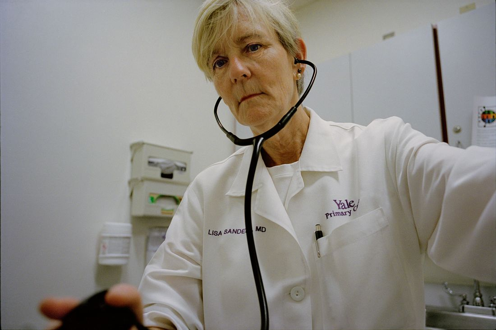

> #CM 最近身边阳（一个快被遗忘的词）的人逐渐多了起来，需要关注自己的身体变化，同时不要忽视这个问题，更加不要轻视。因为个体永远存在差异，影响远没结束。

[medicine](https://nymag.com/intelligencer/tags/medicine/) Aug. 29, 2023  

药品 2023 年 8 月 29 日

## At Yale’s clinic, medical sleuth Lisa Sanders is trying almost everything.

  

Long COVID 之谜仅仅是个开始 在耶鲁大学的诊所里，医学侦探丽莎-桑德斯（Lisa Sanders）几乎想尽了一切办法。

By  

作者：丽莎-米勒（Lisa Miller），自 2011 年以来一直担任《纽约》杂志撰稿人

Photo: Sara Messinger 照片萨拉-梅辛格

     

This article was featured in [One Great Story](http://nymag.com/tags/one-great-story/), _New York_’s reading recommendation newsletter. [Sign up here](https://nymag.com/promo/sign-up-for-one-great-story.html?itm_source=disitepromo&itm_medium=articlelink&itm_campaign=ogs_tertiary_zone) to get it nightly.  

纽约阅读推荐时事通讯《One Great Story》刊登了本文。在此注册，每晚都能收到。

Lisa Sanders was at a large birthday party in New Haven in June 2022. It was an evening in late spring, lovely enough for the party to spill out onto the lawn.  

2022 年 6 月，丽莎-桑德斯参加了纽黑文的一个大型生日派对。那是暮春的一个傍晚，天气很好，派对在草坪上热闹非凡。  

Sanders, an internal-medicine doctor at Yale, was leaning against a doorway drinking a glass of wine and catching up with her friend Erica Spatz, a cardiologist, when Spatz mentioned that she and a few other doctors had the idea of starting a new long-COVID clinic at Yale.  

桑德斯是耶鲁大学的一名内科医生，当时她正靠在门口喝着红酒，与她的朋友、心脏病专家埃里卡-斯帕茨（Erica Spatz）闲聊，斯帕茨提到她和其他几位医生有一个想法，要在耶鲁大学开设一家新的长COVID诊所。  

They were looking for an internist to run it.  

他们正在寻找一位内科医生来管理这个医院。

The problem was one of volume, Spatz explained.  

斯帕兹解释说，问题出在数量上。  

Since the beginning of the pandemic, she — together with colleagues in the pulmonary and neurology departments — had been seeing long-COVID patients at Yale but often in an ad hoc way.  

自大流行病爆发之初，她就与肺部和神经科的同事一起，在耶鲁大学为长期感染 COVID 的病人看病，但通常都是临时性的。  

Some of the doctors had become so flooded with people seeking help that they were having difficulty scheduling and treating their regular patients who came to them for everything else: lung cancer, asthma, heart disease, dementia.  

一些医生已经被大量的求助者淹没，以至于他们很难安排和治疗那些因肺癌、哮喘、心脏病、老年痴呆症等其他疾病而前来就诊的固定病人。  

“My practice is so overwhelmed,” Spatz told Sanders.  

"斯帕兹对桑德斯说："我的诊所已经不堪重负了。

Long-COVID patients, generally speaking, have been very miserable for a very long time, and because the illness attacks their brains, their hearts, their lungs, their guts, their joints — sometimes simultaneously, sometimes intermittently, and sometimes in a chain reaction — they bounce from specialist to specialist, none of whom has the bandwidth to hear their whole frustrating ordeal together with the expertise to address all of their complaints: the nonspecific pain, the perpetual exhaustion, the bewildering test results, the one-off treatments.  

一般来说，长期慢性阻塞性脉管炎患者在很长一段时间里都非常痛苦，因为这种疾病会侵袭他们的大脑、心脏、肺部、内脏和关节--有时是同时发作，有时是间歇发作，有时是连锁反应--他们辗转于各个专科医生之间，没有一个专科医生有足够的带宽来聆听他们整个令人沮丧的经历，也没有一个专科医生有足够的专业知识来解决他们的所有抱怨：非特异性疼痛、长期疲惫不堪、令人困惑的检查结果、一次性治疗。  

“These are people who have not been able to tell their story to anybody but their spouse and their mom — for years sometimes,” Sanders tells me.  

"桑德斯告诉我："这些人除了他们的配偶和母亲之外，无法向任何人讲述他们的故事--有时甚至是好几年。  

“And they are, in some ways, every doctor’s worst nightmare.” From the perspective of a time-pressed physician under ever-more-stringent productivity expectations, who has at most 30 minutes to do a new-patient intake and 15 for a follow-up, “someone who comes in with a very long story — it just sinks your day,” Sanders says.  

"在某些方面，他们是每个医生最可怕的噩梦"。桑德斯说："从时间紧迫的医生的角度来看，他们对工作效率的要求越来越严格，他们最多只能用 30 分钟接诊新病人，15 分钟复诊。

[Long COVID](https://nymag.com/intelligencer/2022/11/is-long-covid-actually-chronic-fatigue-syndrome.html) has been pushing the limits of hospital systems everywhere, not just at Yale.  

不仅在耶鲁大学，Long COVID 也在不断突破医院系统的极限。  

As Americans emerged from the most acute phase of the pandemic, as mask and vaccine mandates lifted and life returned to a semblance of normal for the people who had contracted COVID and recovered, primary-care physicians started to say, “‘I’m not interested in long COVID,’ or ‘I don’t treat long COVID.  

随着美国人走出大流行最严重的阶段，随着口罩和疫苗规定的取消，随着感染 COVID 并康复的人的生活恢复到正常状态，初级保健医生开始说："'我对长效 COVID 不感兴趣'或'我不治疗长效 COVID'。  

Let me refer you to a specialist,’” said David Putrino, who runs the new chronic-illness recovery clinic at Mount Sinai.  

西奈山新开设的慢性病康复诊所负责人戴维-普特里诺（David Putrino）说："让我给你介绍一位专家吧。  

For their part, Putrino added, the specialists were saying, “This is not what my practice is.  

Putrino 补充说，专家们则表示："这不是我的工作。  

This is not an emergency anymore.” Patients all over the country reported monthslong waiting times for appointments at long-COVID clinics.  

这不再是急诊"。全国各地的患者都报告说，他们在长COVID诊所的预约等待时间长达数月之久。  

All the while, scientists and pundits heaped skepticism on the very notion of long COVID, arguing that infection made people stronger, that new variants posed no threats, that the danger of long COVID was overblown — implying that what patients were suffering from was all in their heads.  

与此同时，科学家和学者们对长效 COVID 的概念持怀疑态度，认为感染会让人变得更强壮，新的变种不会造成威胁，长效 COVID 的危险被夸大了--这意味着病人所遭受的痛苦都是他们的幻觉。

Forgotten in this debate are the 65 million people worldwide for whom the pandemic remains a torturous everyday reality.  

在这场辩论中被遗忘的是全世界 6500 万人，对他们来说，大流行病仍然是一个折磨人的日常现实。  

Absent the kind of long-term studies that can provide more definitive answers on what long COVID is and how it can be treated, these people are in desperate need of clarity from someone devoted to their care.  

由于缺乏长期研究，无法对 COVID 的病程和治疗方法给出更明确的答案，这些人急需专门负责他们的人给出明确的答案。  

Spatz and her colleagues were proposing an alternative model: a clinic led by an internal-medicine doctor with a full hour to listen to each patient.  

斯派茨和她的同事们提出了另一种模式：由一名内科医生带领诊所，用整整一个小时的时间倾听每一位病人的心声。  

This physician would create a treatment plan, communicate extensively with the patient’s primary-care team, and refer out to subspecialists when necessary. It wasn’t glamorous.  

这名医生会制定治疗计划，与病人的初级保健团队进行广泛沟通，必要时还会将病人转介给亚专科医生。这并不光彩。  

It might never produce patents or profits or win prizes.  

它可能永远不会产生专利、利润或获奖。

As Sanders listened to her friend unspool this idea, her excitement mounted.  

桑德斯听着她的朋友说出这个想法，兴奋之情溢于言表。  

Hearing patients’ complicated problems and solving them was her sweet spot, the talent and interest upon which she had built a storied career.  

倾听病人的复杂问题并为其排忧解难是她的强项，也是她赖以建立辉煌事业的天赋和兴趣所在。  

Now 67, she has long been known as the Arthur Conan Doyle of medical diagnosis, “a paragon of the modern medical-detective storyteller,” as the celebrated surgeon Atul Gawande once described her.  

现年 67 岁的她一直被誉为医学诊断界的阿瑟-柯南-道尔，著名外科医生阿图尔-加万德曾这样形容她："现代医学侦探小说家的典范"。  

In addition to teaching internal medicine at Yale, she writes “Diagnosis,” a monthly medical-mysteries column for _The New York Times Magazine,_ which was the inspiration for the long-running television series _House._ She has written two books on diagnosis and in 2019 was featured on a Netflix docuseries also called _Diagnosis._  

除了在耶鲁大学教授内科医学外，她还为《纽约时报》杂志撰写 "诊断"（Diagnosis）月刊，这是一个医学探秘专栏，也是长篇电视剧《豪斯》（House）的灵感来源。她撰写了两本关于诊断的书籍，并于 2019 年参加了 Netflix 的一部名为《诊断》的专题节目。

Sanders, energetic and brusque, had been casting about for her next challenge. And here, unexpectedly, it was. “I was like, _Yes! This is what I’ve been looking for,_” she tells me. The Monday after the party, Sanders sent an email inquiring about the position. “I was really the only qualified person who applied for the job,” she says.  

桑德斯精力充沛，性格粗暴，她一直在寻找下一个挑战。没想到，下一个挑战就在这里。"我当时想，是的！这就是我一直在寻找的，"她告诉我。派对结束后的周一，桑德斯发送了一封电子邮件询问这个职位。"她说："我确实是唯一有资格申请这份工作的人。  

Among the ambitious academics at Yale, evaluating frustrated patients for long COVID — and then treating their ever-changing and unremitting symptoms — was not seen as an auspicious professional trajectory.  

在耶鲁大学雄心勃勃的学者们看来，评估长期 COVID 的沮丧病人，然后治疗他们不断变化和持续的症状，并不是一个吉祥的职业轨迹。  

But in their lack of interest, Sanders saw a path forward beyond diagnosis: As an internal-medicine doctor, she was already an expert at managing chronic disease.  

但桑德斯从他们的不感兴趣中看到了诊断之外的出路：作为一名内科医生，她已经是慢性病管理方面的专家。  

“There are no antibiotics for diabetes.  

"糖尿病没有抗生素。  

There’s no magic pill for hypertension,” she says. She has spent more than two decades not offering cures but helping people improve their imperfect health.  

高血压没有灵丹妙药，"她说。二十多年来，她不是在提供治疗方法，而是在帮助人们改善不完美的健康状况。  

She could aim these skills at a new subset of patients suffering from this novel disease.  

她可以将这些技能用于新的新型疾病患者。

Before she was a doctor, Sanders was a journalist — a storyteller in a different sphere.  

在成为医生之前，桑德斯是一名记者--一个在不同领域讲故事的人。  

She worked at CBS, producing news segments on science and medicine and collaborating with the network’s then–medical correspondent, Dr. Bob Arnot.  

她曾在哥伦比亚广播公司（CBS）工作，制作有关科学和医学的新闻片段，并与该电视台当时的医学记者鲍勃-阿诺博士（Dr. Bob Arnot）合作。  

The way she tells it in her 2009 book _Every Patient Tells a Story,_ she decided to become a doctor after she watched Arnot rescue a drowning woman from a river and apply basic CPR. “Television reaches millions but touches few,” Sanders wrote.  

她在 2009 年出版的《每个病人都有一个故事》一书中写道，她是在观看了阿诺从河里救起一名溺水妇女并进行基本心肺复苏术之后决定成为一名医生的。"桑德斯写道："电视触及的人数以百万计，但触动的人却寥寥无几。  

“Medicine reaches fewer but has the potential to transform the lives of those it touches.” She was in her early 30s when she went back to university to take the prerequisites for medical school and 36 when she was accepted at Yale.  

"医学接触的人较少，但却有可能改变接触者的生活"。当她重返大学攻读医学院的先修课程时，她才 30 岁出头，而当她被耶鲁大学录取时，她已经 36 岁了。

At the time, she lived in New York.  

当时，她住在纽约。  

Her husband, Jack Hitt, is a journalist, and their friends were journalists and writers, people who tell stories for a living and for whom “a good story” is a kind of social currency.  

她的丈夫杰克-希特是一名记者，他们的朋友都是记者和作家，这些人以讲故事为生，对他们来说，"好故事 "是一种社会货币。  

Upon starting her medical training, Sanders imagined that her best dinner-party anecdotes would be like the Arnot tale, stories of dramatic medical interventions and heroic derring-do.  

开始接受医学培训时，桑德斯想象自己在晚宴上的精彩轶事会像阿诺特的故事一样，讲述戏剧性的医疗干预和英雄救美的故事。  

Instead, she found herself — and her dinner companions — far more captivated by the stories of diagnosis: “mysterious symptoms that were puzzled out and solved,” she wrote.  

相反，她发现自己--以及她的晚餐同伴们--更着迷于诊断的故事："神秘的症状，被猜出并解决了"，她写道。  

As a student and a resident, she loved wending her way through a complex diagnostic profile and learning about a patient who didn’t fit the pattern, someone with inconclusive or contradictory test results and unusual or unexpected symptoms: “a wonderful piece of detective work — complicated yet satisfying.” Sanders had been an English major in college and found that medical diagnosis scratched the same itch that reading a poem or reporting a story did.  

作为一名学生和住院医师，她喜欢在复杂的诊断资料中穿梭，了解不符合模式的病人，了解那些检查结果不确定或相互矛盾、症状不寻常或出乎意料的病人：她说："这是一项出色的侦查工作--复杂而又令人满意"。桑德斯在大学主修英语，她发现医学诊断就像读诗或报道故事一样，能搔到她的痒处。  

And yet she found that, in medicine, the aha moment at the end — the reveal — was so much more consequential because the answer could be lifesaving.  

然而，她发现，在医学领域，最后的 "啊哈 "时刻--揭示--的意义要大得多，因为答案可能是救命的。  

Once a patient had a diagnosis, a doctor knew what to do.  

一旦病人有了诊断，医生就知道该怎么做。

Sanders had a friend who was an editor at _The New York Times Magazine._ “What can doctors write?” the friend asked her. A year later, the “Diagnosis” column was born.  

桑德斯有个朋友是《纽约时报》杂志的编辑。"这位朋友问她："医生能写些什么？一年后，"诊断 "专栏诞生了。

The columns, and the subsequent episodes of _House,_ followed a formula. A patient shows up at the hospital with dire unexplained symptoms. A young woman on the brink of death has a “highlighter yellow” complexion, a child with cancer has hallucinations, a perfectly healthy teacher collapses with seizures.  

该专栏以及随后的《豪斯》剧集都遵循一个公式。一个病人带着无法解释的可怕症状出现在医院。一名濒临死亡的年轻女性出现了 "荧光笔黄 "肤色，一名患癌儿童产生了幻觉，一名完全健康的教师因癫痫发作而倒下。  

The tests for the usual disease culprits come up negative. Doctor after doctor proposes hypotheses and orders more tests to no avail.  

对常见疾病罪魁祸首的检测结果均为阴性。一个又一个医生提出各种假设，并要求进行更多检查，但都无济于事。  

And then one wise physician — sometimes in the columns it’s Sanders but more often not — reads all the available information from another angle and by turning the kaleidoscope just so, has the insight that leads to the diagnosis.  

然后，一位睿智的医生--有时是专栏中的桑德斯，但更多时候不是--从另一个角度解读了所有可用信息，并通过转动万花筒，获得了诊断的洞察力。  

It’s a rare genetic disease, a blood clot in the brain, a tapeworm.  

这是一种罕见的遗传病，是脑血栓，也是绦虫。

Back then, Sanders perpetuated a rather romantic, old-fashioned view of medicine, in which great doctors are portrayed as maverick philosophers seeking deeper truths amid tryhards and technocrats. (Dr.  

当时，桑德斯延续了一种相当浪漫、陈旧的医学观，将伟大的医生描绘成在试探者和技术官僚中寻求更深层次真理的特立独行的哲学家。医生  

House, the character played by Hugh Laurie, was the epitome of this: a misanthropic drug addict who was necessary to the hospital because of his diagnostic brilliance.) Sanders’s role, as she saw it, was to share with her students and the wider world her belief in the art of diagnosis as central to healing.  

休-劳里（Hugh Laurie）饰演的豪斯（House）就是这方面的缩影：一个厌世的瘾君子，因为他的诊断才华而成为医院的必需品）。在她看来，桑德斯的职责是与她的学生和更广泛的世界分享她的信念，即诊断艺术是治疗的核心。  

A tenet of her value system even then was that doctors should become more comfortable with uncertainty and more willing to cop to what they do not know.  

即使在当时，她的价值体系的一个信条就是，医生应该更加适应不确定性，更加愿意应对他们不知道的事情。  

“The fact is that, more often than doctors would like to admit, they cannot find a cause for a patient’s symptoms,” she wrote.  

"她写道："事实上，医生们往往不愿意承认，他们找不到病人症状的原因。  

Unknowing is the first step to solving the puzzle, she believed.  

她认为，未知是解开谜题的第一步。

But even Sanders has sometimes succumbed to the most common of doctor diseases: groupthink and hubris.  

但即便是桑德斯，有时也会屈服于最常见的医生病：群体思维和自负。  

In the late 1990s, patients with a galaxy of unexplained chronic symptoms — including fatigue, sore throat, joint pain, insomnia, dizziness, brain fog, and depression — began to gather into activist and identity groups, calling themselves sufferers of “chronic Lyme.” They had something, they argued, related to a previous infection from the bite of a deer tick, but their doctors were dismissing them as whiners and neurotics.  

20 世纪 90 年代末，出现了一系列无法解释的慢性症状--包括疲劳、咽喉痛、关节痛、失眠、头晕、脑雾和抑郁--的患者开始聚集成激进分子和身份认同团体，自称为 "慢性莱姆病 "患者。他们认为，自己的病与之前被鹿蜱叮咬感染有关，但医生却把他们当作抱怨者和神经质患者。  

This was in an era when the medical Establishment was rolling its collective eyes at patients who were querying whether diagnoses of “chronic fatigue syndrome” or “fibromyalgia” might fit their symptoms — ones that looked very much like those linked to chronic Lyme.  

在这个时代，医学界对那些质疑 "慢性疲劳综合征 "或 "纤维肌痛 "的诊断是否符合其症状的病人集体翻白眼，而这些症状与慢性莱姆病的症状非常相似。  

In the pilot episode of _House,_ a zhlubby patient asks the doctor if he can be treated for chronic fatigue syndrome. When House raises his eyebrow, the patient suggests fibromyalgia.  

在《豪斯》（House）的试播集里，一位肥胖的病人问医生是否可以治疗他的慢性疲劳综合症。当豪斯扬起眉毛时，病人提出了纤维肌痛的建议。  

House gives him a vial filled with candy from the vending machine.  

豪斯从自动售货机里拿出一个装满糖果的小瓶给他。

Sanders joined the chorus of debunkers. These patients had real symptoms and real ailments, she asserted in _Every Patient Tells a Story._ But the collection of symptoms was “hopelessly broad and overinclusive,” she wrote.  

桑德斯加入了揭穿谎言者的大合唱。她在《每个病人都在讲述一个故事》一书中断言，这些病人都有真实的症状和疾病。但她写道，症状的收集 "过于宽泛和包罗万象，令人绝望"。  

“These are some of the most common symptoms of patients presenting to a primary care office.” She concluded that chronic Lyme was a “phantom diagnosis.”  

"这些是到初级保健诊所就诊的病人最常见的一些症状"。她的结论是，慢性莱姆病是一种 "幽灵诊断"。

“I completely regret that chapter,” she says now.  

"她现在说："我完全后悔那一章。  

“I would like to rewrite it.” Sanders explains that she was reacting to the doctors who were preying on suffering people by prescribing interminable courses of antibiotics that were not helping them: “But I completely misunderstood it.  

"我想改写它"桑德斯解释说，她当时的反应是，医生们在掠夺受苦受难的人们，开出无休止的抗生素疗程，却对他们毫无帮助："但我完全误解了。  

The patients were making the connection between their symptoms and Lyme disease.”  

病人将自己的症状与莱姆病联系起来了"。

The path from dismissing chronic Lyme — now known as post-treatment Lyme disease syndrome — to embracing long COVID was one of professional maturing, from regarding uncertainty as a prerequisite to getting the right answer to understanding it as a fact of life.  

从否定慢性莱姆病--现在称为治疗后莱姆病综合征--到接受长期 COVID，这是一条专业成熟之路，从把不确定性视为获得正确答案的先决条件，到把它理解为生活中的事实。  

Young doctors, having spent the past three or four years with their heads in their books, can be “ready to feel absolutely certain that they know what to do,” Sanders tells me.  

桑德斯告诉我，年轻医生在过去的三四年里一直埋头于书本，他们可能 "准备好了，觉得自己绝对知道该怎么做"。  

But as she grows older, “I’m more interested in areas that are less clear.  

但随着年龄的增长，"我对不那么清晰的领域更感兴趣。  

In helping people manage what’s going on. In continuously having to educate myself.”  

帮助人们处理正在发生的事情。不断自我教育"。

Her job at the long-COVID clinic has plunged Sanders into the deep end of not knowing, just as research scientists are beginning to make some important discoveries.  

就在科学家们开始有了一些重要发现的时候，她在COVID长期诊所的工作让桑德斯陷入了未知的深渊。  

In May 2022, around the time of the birthday party in New Haven, an immunologist named Akiko Iwasaki, also at Yale, published with colleagues a review in _Nature Medicine_ that placed long COVID within a family of post-acute-infection syndromes — including Lyme — that she believes are related.  

2022 年 5 月，也是在纽黑文举行生日派对的前后，耶鲁大学一位名叫岩崎晶子的免疫学家与同事在《自然医学》上发表了一篇评论文章，将长 COVID 归入包括莱姆在内的急性感染后综合征家族，她认为这些综合征是相关的。  

Among people who survive many common viral infections (Ebola, dengue, polio, influenza, and Epstein-Barr, for instance), a small percentage suffer for years with symptoms that are very similar to those of long COVID: extreme fatigue, brain fog, joint pain, inflammation, dizziness, sleep disruption, mood disorders.  

在许多常见病毒感染（如埃博拉、登革热、脊髓灰质炎、流感和 Epstein-Barr）后存活下来的人中，有一小部分人多年来忍受着与长期 COVID 非常相似的症状：极度疲劳、脑雾、关节疼痛、炎症、头晕、睡眠紊乱、情绪失调。  

The same goes for people who get giardia, a parasite.  

得了贾第虫（一种寄生虫）的人也是如此。

Iwasaki made the case not just that these syndromes were, obviously, real but that their pathogeneses — the way they get activated in the body and why, the exact cellular-level mechanisms — were somehow similar.  

岩崎提出的理由不仅是这些综合征显然是真实存在的，而且它们的病因--它们在体内被激活的方式和原因、确切的细胞水平机制--在某种程度上是相似的。  

If scientists could learn how common infections become chronic illnesses in some people but not in others (and what Lyme, a bacterial infection, has in common with mono, a viral one), researchers might develop treatments to attack root causes rather than symptoms. Long COVID provides science with an opportunity to learn how post-infection chronic disease originates and thereby to help hundreds of millions of people, Iwasaki told me.  

如果科学家们能够了解普通感染是如何在某些人身上变成慢性病，而在另一些人身上却不会（以及细菌感染莱姆病与病毒感染单核细胞增多症的共同点），研究人员就有可能开发出针对根本原因而非症状的治疗方法。岩崎告诉我，长COVID为科学提供了一个机会，可以了解感染后慢性病是如何产生的，从而帮助数亿人。  

“We’re not paying enough attention,” she said. “We’re not. Doctors are still dismissing this disease as something that’s in your head.  

"她说："我们没有给予足够的重视。"我们没有。医生们仍然认为这种病是脑子里想出来的。  

I have seen the exchanges on Twitter: ‘Long COVID is exaggerated, not real.’” Women are diagnosed with long COVID at roughly twice the rate of men, Iwasaki pointed out: “I think if the situation was reversed, we’d pay even more attention to this disease.”  

我看到了 Twitter 上的交流：'长COVID被夸大了，不是真的'"。岩崎指出，女性被诊断患有长COVID的比例大约是男性的两倍：岩崎指出："我认为，如果情况反过来，我们会更加关注这种疾病"。

The _Nature Medicine_ paper dovetailed with Sanders’s preexisting interest in unidentified conditions.  

自然医学》的论文与桑德斯之前对不明病症的兴趣不谋而合。  

“There are a lot of people who have diseases that we don’t have names for and certainly we don’t have tests for,” she says.  

"她说："有很多人的疾病我们没有名字，当然也没有检测方法。  

She has come to believe that many of the run-of-the-mill complaints general practitioners see in their day-to-day, which they may be tempted to discount as psychosomatic or “sensitive” or hypochondriacal, do have a biological basis — probably far more than anyone knows or thinks.  

她开始相信，全科医生在日常工作中看到的许多普通病症，他们可能会认为是心身疾病、"敏感 "或疑病症，但这些病症确实有其生物学基础--可能远比人们知道或认为的要多得多。  

She then put forth what she calls her “crank theory” about the anxiety epidemic in Gen Z.  

随后，她就 Z 世代的焦虑流行病提出了她所谓的 "怪诞理论"。  

“I wonder if they’re anxious not because the end of the world is coming,” she says, her tone both joking and not joking.  

"我在想，他们着急是不是因为世界末日就要来了，"她说，语气既开玩笑又不是开玩笑。  

“Maybe they’re anxious from something we’ve done to this planet, so they’re being exposed to something that’s making them feel this way.  

"也许是我们对这个星球所做的事情让他们感到焦虑，所以他们接触到了一些让他们有这种感觉的东西。  

I just think that when everybody has something, it’s not psychology; it’s biology. But I’m not a researcher, so I don’t know.”  

我只是觉得，如果每个人都有某种东西，那就不是心理学，而是生物学。但我不是研究人员，所以我也不知道"。

In medical schools, there’s a saying: When you hear hooves, think horses, not zebras.  

在医学院，有这样一句谚语：听到蹄声，想到的是马，而不是斑马。  

This means that when a patient presents with a cluster of symptoms, the cause is likely to be the likeliest one, not something exotic or rare.  

这意味着，当患者出现一组症状时，病因很可能是最可能的，而不是什么奇特或罕见的病因。  

But even within the realm of the most common diseases, a range of diagnostic possibilities exists.  

但即使在最常见的疾病领域，也存在一系列诊断可能性。  

A patient presenting with a fever and a rash could have “shingles, measles, scarlet fever, or Lyme disease,” Sanders tells me. “There are so many things it could be.  

桑德斯告诉我，发烧和出疹的病人可能患有 "带状疱疹、麻疹、猩红热或莱姆病"。桑德斯告诉我："有很多可能。  

It’s so broad you have to think it through — and that, to me, is extremely exciting.”  

它太宽泛了，你必须考虑清楚，而这对我来说，是非常令人兴奋的。

But even Sanders was not prepared for how little doctors and scientists know about long COVID. There is no blood test. Health officials can’t even agree on how to define it.  

但就连桑德斯也没有想到，医生和科学家们对长效 COVID 的了解竟是如此之少。没有血液检测。卫生官员甚至无法就如何定义它达成一致。  

The CDC describes long COVID as “signs, symptoms, and conditions that continue or develop after acute COVID-19 infection” — or, in Sanders’s paraphrase, “You got COVID and then something bad happened.” Under the CDC definition, patients have long COVID if they are symptomatic at least four weeks after initial infection.  

疾病预防控制中心将长COVID描述为 "急性COVID-19感染后持续或发展的体征、症状和病症"--或者用桑德斯的话来说，"你感染了COVID，然后发生了一些不好的事情"。根据疾病预防控制中心的定义，如果患者在初次感染后至少四周出现症状，就属于长期 COVID。

The WHO defines it similarly but with a different time frame: occurring or lasting at least three months after initial infection.

  

世卫组织的定义与此类似，但时间范围不同：在初次感染后至少三个月内发生或持续。  

This discrepancy matters to Sanders because, as much as possible, she wants to identify patients who have long COVID and not those who may take a little longer to recover from their original illness.  

桑德斯认为这种差异很重要，因为她希望尽可能识别出COVID时间较长的患者，而不是那些可能需要更长时间才能从原来的疾病中恢复过来的患者。  

In her clinic, she uses the WHO definition.  

在她的诊所里，她使用的是世界卫生组织的定义。

The symptoms of long COVID are like an encyclopedia of suffering; one paper in eClinicalMedicine describes more than 200 distinct symptoms of the disease.  

长期 COVID 的症状就像一部痛苦的百科全书；《电子临床医学》（eClinicalMedicine）上的一篇论文描述了 200 多种不同的疾病症状。  

When patients talk about how they’ve been feeling lately, they can sound as if they’re possessed by demons.  

当病人说起他们最近的感受时，听起来就好像他们被恶魔附身了一样。  

Sanders has one patient who on some days can walk from her car to the front door of her office — 700 steps — and some days cannot, and she has encountered one man whose once merely irritating tinnitus has become deafening.  

桑德斯有一位病人，有的时候她可以从汽车走到办公室门口（700 步），有的时候却走不动；她还遇到过一个人，他的耳鸣曾经只是恼人的，现在却变得震耳欲聋。  

“People come in with strange symptoms, like an internal tremor,” she says. “They’ll say, ‘It feels like my insides are trembling.’ This is not one person. This is lots of people.”  

人们来就诊时会出现一些奇怪的症状，比如内脏震颤，"她说，"他们会说'感觉我的内脏在颤抖'。"他们会说，'感觉我的内脏在颤抖'。这不是一个人的症状。这不是一个人的问题，而是很多人的问题。

The most common symptoms of long COVID can have many causes. Brain fog, for example, is a medical catchall that means failures of memory and cognition and inability to concentrate.  

长期慢性阻塞性脑病最常见的症状有多种原因。例如，"脑雾 "是一种医学术语，指记忆力和认知能力衰退，无法集中注意力。  

It can be part of ME/CFS, also known as myalgic encephalomyelitis or chronic fatigue syndrome, which shares many symptoms with longtail syndromes like long COVID.  

它可能是 ME/CFS 的一部分，ME/CFS 又称肌痛性脑脊髓炎或慢性疲劳综合征，与长 COVID 等长尾综合征有许多共同症状。  

Or it can be a symptom of another disease: anemia, diabetes, Alzheimer’s. It can be a side effect of medication.  

也可能是其他疾病的症状：贫血、糖尿病、老年痴呆症。也可能是药物的副作用。  

Aging, menopause, stress, lack of sleep — all these can cause brain fog.  

衰老、更年期、压力、睡眠不足--所有这些都可能导致脑雾。  

In addition, “brain fog” has entered the vernacular in a casual way to describe office fatigue, pandemic fatigue, boredom, dissatisfaction, or the aftereffects of a long night out at the bar.  

此外，"脑雾 "已经进入人们的日常生活，被随意用来形容办公室疲劳、大流行病疲劳、无聊、不满或在酒吧度过漫漫长夜的后遗症。

Sanders, more than ever before, is dependent on the patient’s account — on detailed specifics — to establish her diagnosis. It’s a process of elimination and deduction.  

桑德斯比以往任何时候都更依赖于病人的叙述--详细的细节--来确定她的诊断。这是一个排除和推理的过程。  

So she has “learned just to shut the fuck up and listen.”  

因此，她 "学会了闭嘴倾听"。

I visited Sanders’s office on a rainy day in August when she was meeting new patients. Jennifer is 61. She had always considered herself competent, energetic, active, organized.  

八月的一个雨天，我来到桑德斯的办公室，当时她正在接待新病人。詹妮弗今年 61 岁。她一直认为自己能干、精力充沛、活跃、有条理。  

Methodical. But over the past three months, she started to become forgetful, so much so that her husband was making comments about it.  

有条不紊。但在过去的三个月里，她开始变得健忘，以至于她的丈夫对此颇有微词。

Jennifer first noticed her brain fog early one morning at her home office in East Haven when she found she couldn’t remember her computer login, which she had typed literally thousands of times.  

一天清晨，珍妮弗在位于东黑文的家中办公时，发现自己已经输入了数千次的电脑登录名记不起来了，她这才第一次注意到自己的大脑出现了迷糊。  

Over the next couple of months, the fog settled in. The system she built to keep track of her social-work clients sometimes befuddled her.  

在接下来的几个月里，迷雾逐渐散去。她为跟踪社会工作客户而建立的系统有时让她无所适从。  

She would be in the middle of a routine chore and suddenly feel like an alien at her own job: “All of a sudden, I’d be like, _Oh my gosh, did I get a new client that I maybe forgot?_ ”  

她在做一件例行公事的时候，会突然觉得自己的工作像个外星人："突然间，我会想，天哪，我是不是有了一个新客户，我可能忘了？"

And then there was the terrible fatigue.  

然后是可怕的疲劳。  

She had struggled over the past year with a pinched nerve in her hip, but now going up and down the stairs in her home became so exhausting that she took to sleeping on the living-room recliner.  

在过去的一年里，她一直在与髋部的压迫神经作斗争，但现在在家中上下楼变得如此疲惫，以至于她不得不睡在客厅的躺椅上。  

She realized she was becoming depressed.  

她意识到自己变得郁郁寡欢。

Jennifer had gotten COVID once, as far as she knew, during the massive Omicron wave of 2021. It had been a mild case: a couple days of fever, a week of sluggishness, but with no aftereffects more severe than the ruination of Christmas.  

据詹妮弗所知，她曾经感染过一次 COVID，那是在 2021 年大规模的 Omicron 疫潮期间。那是一次轻微的病例：发烧几天，精神不振一周，但没有比毁掉圣诞节更严重的后遗症。  

But now, she wondered. Could this state she was in — weak, depleted, vague, unfamiliar to herself — be somehow related to the virus?  

但现在，她想知道。她现在的这种状态--虚弱、衰竭、模糊、不熟悉自己--会不会与病毒有某种关系？

Sanders aimed first at clinical dementia.  

桑德斯首先针对的是临床痴呆症。

“Have you ever not recognized a person you know?” Sanders asked.  

"你有没有认不出一个你认识的人？"桑德斯问道。

“No,” Jennifer replied. "没有。"詹妮弗回答道。

“Have you ever gotten lost when you’re driving home?”  

"你开车回家的时候迷路过吗？"

“No,” Jennifer said. "不，"詹妮弗说。

Having ruled out dementia, Sanders inquired about the timing and course of Jennifer’s COVID, the medications she takes for her diabetes, the pain in her hip.  

在排除了痴呆症的可能性后，桑德斯询问了詹妮弗 COVID 的时间和病程、她服用的治疗糖尿病的药物以及她臀部的疼痛。  

Then the doctor ran through an inventory of post-COVID symptoms. Does she get short of breath? No. Fatigue? Yes. Cough, chest pain, palpitations, headaches?  

然后，医生盘点了她得了宫颈糜烂后的症状。她会气短吗？没有。有。咳嗽、胸痛、心悸、头痛？  

Abdominal pain, diarrhea, unexplained fevers, lightheadedness, skin discoloration, rashes, or itching? “No,” Jennifer said. No, no, no, no.  

腹痛、腹泻、不明原因的发烧、头晕、皮肤变色、皮疹或瘙痒？"没有，"珍妮弗说。没有，没有，没有，没有。  

She said she does sometimes have a racing heart, joint pain, and numbness or tingling in her hands and feet.  

她说她有时会心跳加速、关节疼痛、手脚麻木或刺痛。

Then Sanders interrogated Jennifer about her fatigue: After she exerted herself, did she feel tired? Or not until the next day or several days after?  

然后，桑德斯询问詹妮弗是否感到疲劳：她劳累后是否感到疲倦？还是直到第二天或几天后才感到疲劳？  

Here, she was looking for signs of post-exertional malaise, a feature of long COVID in which patients do not recover after resting but run out of gas.  

在这里，她正在寻找劳累后乏力的迹象，这是长期 COVID 的一个特征，患者在休息后不会恢复，而是会气喘吁吁。  

When Sanders inquired about her quality of sleep, Jennifer described the living-room recliner.  

当桑德斯询问她的睡眠质量时，詹妮弗描述了客厅里的躺椅。

Sanders puts most of her patients, including Jennifer, through the most basic of physical tests.  

桑德斯让包括詹妮弗在内的大多数病人接受最基本的身体检查。  

To measure their endurance, she asks all of them to walk as quickly as they can around the halls of the hospital for six minutes.  

为了测量他们的耐力，她要求所有人以最快的速度在医院大厅内行走六分钟。  

She asks them to go from sitting to standing as many times as they can in one minute.  

她要求他们在一分钟内尽可能多次从坐到站。  

Many patients say they feel better lying down than standing up; these she tests for POTS, or postural orthostatic tachycardia syndrome, which has frequently been documented in long-COVID cases.  

许多患者说他们躺着比站着感觉更好；这是对 POTS（即体位性正位性心动过速综合征）的测试，长期 COVID 病例中经常出现这种情况。

A physical therapist and a nurse ran Jennifer through these tests and then Sanders reentered the examining room to deliver her verdict.  

理疗师和护士对詹妮弗进行了这些检查，然后桑德斯再次进入检查室，宣布了她的判决。  

“I’m not sure your memory issues have to do with long COVID,” she said.  

"她说："我不确定你的记忆问题是否与长 COVID 有关。  

The time that had elapsed between when Jennifer contracted COVID-19 and the onset of her brain fog was about 18 months; long COVID can persist for years after initial infection, but in Sanders’s experience, it “doesn’t usually reach out from years back to grab you,” she said.  

从詹妮弗感染 COVID-19 到她开始出现脑雾之间的间隔时间约为 18 个月；长 COVID 可能在初次感染后持续数年，但根据桑德斯的经验，它 "通常不会在数年后伸手来抓你"，她说。  

(It was possible, she conceded, that Jennifer had gotten a subsequent case of COVID-19 so mild she didn’t notice it.) More likely, the brain fog was due to fatigue, which was due in turn to chronic pain from the pinched nerve and the resulting disrupted sleep.  

(她承认，詹妮弗有可能后来又患上了 COVID-19，但病情很轻，她并没有注意到）。更有可能的是，脑雾是由于疲劳造成的，而疲劳又是由于神经压迫引起的慢性疼痛和由此导致的睡眠中断造成的。  

And although Jennifer was out of shape, she did not have POTS.  

虽然詹妮弗的体形很不协调，但她并没有患上 POTS。  

Sanders’s main recommendation was that Jennifer treat the pinched nerve as soon as she could and then resolve to get more exercise, at least 30 minutes a day.  

桑德斯的主要建议是，詹妮弗应尽快治疗压迫神经的疾病，然后下决心加强锻炼，每天至少锻炼 30 分钟。

In real life, stories often fail to satisfy and mysteries are solved without a flourish or a gasp. “She didn’t say, ‘Oh, everything’s perfect,’” Jennifer said afterward.  

在现实生活中，故事往往不能让人满意，谜团的揭开也是不费吹灰之力或惊天动地。"珍妮弗事后说："她没有说'哦，一切都很完美'。  

“It didn’t sound like I especially fit into the category of people experiencing long COVID.” Still, an answer is an answer — “and that did make me feel better,” she said.  

"听起来我并不特别适合经历长期 COVID 的人群"。不过，答案就是答案--"这的确让我感觉好多了，"她说。

By the time he saw Sanders, Christopher had already been diagnosed with long COVID and was desperate.  

在见到桑德斯时，克里斯托弗已经被诊断出患有长程COVID，他已经绝望了。  

A massive 58-year-old man with a round, boyish face, Christopher had been a bodybuilder and a carpenter for most of his life.  

克里斯托弗现年 58 岁，身材魁梧，脸庞圆润，充满稚气，他的大部分时间都在从事健美运动和木匠工作。  

“It used to be I could throw a 20-foot beam on my shoulders and walk up the ladder and put it in place, and now I can’t even pick it up,” he told Sanders.  

"他对桑德斯说："以前我可以把 20 英尺长的横梁扛在肩上，然后走上梯子把它放好，而现在我连拿都拿不起来。  

Phyllis, Christopher’s 87-year-old mother, was there too, sitting quietly by the door with a notebook and pen.  

克里斯托弗 87 岁的母亲菲利斯也在那里，她拿着笔记本和笔静静地坐在门边。  

Her memory was sharp, Christopher said with a rueful laugh, whereas his was disintegrating disturbingly.  

克里斯托弗苦笑着说，她的记忆力很敏锐，而他的记忆力却在令人不安地衰退。  

Formerly, he could quote lines and facts verbatim from books of popular biography and history, but now he can’t remember the paragraph he just read.  

以前，他可以逐字逐句地引用大众传记和历史书中的句子和事实，但现在他却记不起刚读过的段落。

Christopher can no longer pay his bills and has had to apply for state mortgage assistance.  

克里斯托弗已无力支付账单，不得不申请国家抵押贷款援助。  

Since his very brief, almost incidental bout with COVID-19 back in January 2021, Christopher has felt “huffy,” as if he can’t get sufficient oxygen to his organs or muscles.  

自从 2021 年 1 月与 COVID-19 的短暂、几乎偶然的接触后，克里斯托弗就感到 "闷热"，好像他的器官或肌肉无法获得足够的氧气。  

He has atrial fibrillation, a racing pulse that can escalate to 180 beats a minute. (In the doctor’s office, the physical therapist recorded his resting pulse as 126. Normal ranges from 60 to 100.) He gets extremely dizzy when he stands up.  

在医生的办公室里，理疗师记录他的静息脉搏为 126 次。正常范围在 60 到 100 之间）。他站起来时头晕得厉害。  

He has pain in his back — “stenosis,” his mother reminded him — and joint pain. Nine months ago, he was diagnosed with type 2 diabetes, another disease associated with long COVID.  

他的背部疼痛--"狭窄"，他的母亲提醒他--还有关节疼痛。九个月前，他被诊断出患有 2 型糖尿病，这是另一种与长 COVID 相关的疾病。

Christopher has seen 19 doctors and specialists and been put through countless tests. He is on metformin, Jardiance, and Ozempic for his diabetes and a beta-blocker for his AFib.  

克里斯托弗已经看了 19 位医生和专家，接受了无数次检查。他的糖尿病需要服用二甲双胍、Jardiance 和 Ozempic，心房颤动需要服用β-受体阻滞剂。  

A neurologist at Yale prescribed a combination treatment of guanfacine, an ADHD drug, and NAC, an amino acid, which had been shown in a small trial to improve brain fog in long-COVID patients.  

耶鲁大学的一位神经科医生开出的处方是一种联合疗法，其中包括一种多动症药物关法辛和一种氨基酸 NAC，后者在一项小型试验中被证明可以改善长期 COVID 患者的脑雾。  

Christopher believes these drugs have had little to no effect, but he continues to take them just in case.  

克里斯托弗认为这些药物几乎没有什么效果，但为了以防万一，他还是继续服用。  

A pulmonologist had put him on Mestinon, normally used to treat a chronic autoimmune neuromuscular disease called myasthenia gravis, and though that gave him a little energy boost, he stopped taking it because of its side effects.  

肺科医生曾让他服用一种通常用于治疗慢性自身免疫性神经肌肉疾病--重症肌无力的 Mestinon，虽然这种药能让他精力充沛一些，但由于其副作用，他停止了服用。  

“It was like someone had eggbeaters in my stomach all day,” he told Sanders.  

"他对桑德斯说："就像有人在我肚子里放了一整天的打蛋器。

As a young physician, Sanders put her faith in her tenacity and intrepidness.  

作为一名年轻的医生，桑德斯对自己的坚韧和无畏充满信心。  

“The doctor must don her deerstalker cap,” she wrote, “and unravel the mystery.” The line was straight and clear. Symptoms: beginning. Diagnosis: middle. Treatment: end.  

"医生必须戴上鹿角帽"，她写道，"揭开谜底"线条笔直清晰症状：开始。诊断：中间。治疗：结束。  

And even if the endings of her stories were not happy, as in a terminal prognosis, they were, at least from a narrative point of view, complete.  

即使她的故事结局并不圆满，就像绝症预言一样，但至少从叙事的角度来看，它们是完整的。  

But in the long-COVID clinic, diagnosis is the last thing Sanders knows with any degree of certainty. The middle and end are obscure. A chronic illness is not a satisfying story.  

但是，在长期慢性病诊所，诊断是桑德斯最不确定的事情。中间和结尾都很模糊。慢性病并不是一个令人满意的故事。  

It hardly qualifies as a story at all.  

这根本称不上是一个故事。

COVID-19 becomes long COVID in about 10 percent of cases, and scientists don’t know why.  

COVID-19 在大约 10% 的病例中会变成长 COVID，科学家们不知道原因何在。  

Growing evidence suggests that the virus (or fragments of it) hangs around in “reservoirs” in organ tissue for a very long time.  

越来越多的证据表明，病毒（或病毒片段）会在器官组织的 "储库 "中存留很长时间。  

So the virus itself could be causing symptoms, or it may be triggering an autoimmune response, in the same way that Epstein-Barr virus is thought to activate multiple sclerosis, for example.  

因此，病毒本身可能会导致症状，也可能会引发自身免疫反应，就像爱泼斯坦-巴氏病毒被认为会激活多发性硬化症一样。  

Or COVID-19 may activate latent viruses, like EBV, that can sleep for decades in the body and wake up to cause symptoms. Or symptoms may be caused by inflammation.  

或者，COVID-19 可能会激活 EBV 等潜伏病毒，这些病毒可能在体内沉睡数十年，然后苏醒并导致症状。或者，症状可能是由炎症引起的。  

Lab mice infected with a mild case of COVID-19 get minor inflammation in the lungs but “significant damage in the brain,” said Iwasaki.  

岩崎说，实验室小鼠感染轻微的 COVID-19 后，肺部会出现轻微炎症，但 "大脑会受到严重损害"。

These hypothetical causes, or triggers, may not be mutually exclusive.  

这些假设的原因或诱因可能并不相互排斥。  

They may be cascading, overlapping, or bespoke: Long COVID may articulate itself differently depending on the environment within each host.  

它们可能是层叠的、重叠的或定制的：长 COVID 可根据每个主机内的环境以不同的方式表达自己。  

But until researchers can develop targeted treatments, Sanders has to discover, prescribe, and suggest the unsophisticated solutions that exist.  

但在研究人员开发出有针对性的治疗方法之前，桑德斯不得不去发现、开处方并建议现有的不成熟的解决方案。  

That’s why she was thrilled, in the way of a nerd, or a fan, when in July, the Irish health service released a 173-page report dryly called “Interventions to Improve Long COVID Symptoms: A Systematic Review.” It compiled and evaluated 57 tested medical treatments.  

因此，当爱尔兰卫生部门在 7 月份发布了一份长达 173 页的报告，干巴巴地称之为 "改善长期 COVID 症状的干预措施 "时，她就像一个书呆子或粉丝一样激动不已：系统回顾"。该报告汇编并评估了 57 种经过测试的医疗方法。  

Most were small unreplicated studies.  

大多数都是未经重复的小型研究。  

In many cases, safety had not been gauged, and “no definitively effective treatments were identified.” Still, here was something Sanders could use as a road map.  

在许多情况下，安全性尚未得到衡量，"没有确定有效的治疗方法"。不过，桑德斯还是可以把这些东西作为路线图。  

She took 15 pages of notes.  

她做了 15 页笔记。

She is constantly weighing her obligation to practice evidence-based medicine against a reality in which there is no evidence.  

她一直在权衡自己循证行医的义务和没有证据的现实。  

“I’m out here in the ether where nobody knows nothing,” she says.  

"她说："我在这茫茫人海中，无人知晓。  

So although some doctors are using a combination therapy of powerful blood thinners and anti-platelet medications to treat the micro-clots common in long COVID, she thinks twice: “These medications have huge potential risks. If a person  

因此，尽管一些医生正在使用强效血液稀释剂和抗血小板药物的联合疗法来治疗长 COVID 中常见的微血栓，但她还是三思而行："这些药物具有巨大的潜在风险。如果一个人  

taking these drugs fell off their bicycle, they could die.” Sanders sends as many patients as she can to a Yale colleague conducting a clinical test on the efficacy of a 15-day course of Paxlovid on long COVID, and she  

如果服用这些药物的病人从自行车上摔下来，他们可能会死亡"。桑德斯把尽可能多的病人送到耶鲁大学的一位同事那里，这位同事正在进行一项临床试验，研究长效 COVID 15 天疗程 Paxlovid 的疗效。  

sometimes prescribes a low dose of naltrexone, approved for addiction disorders but frequently used off-label to treat chronic pain.  

有时会开出小剂量纳曲酮的处方，这种药物被批准用于治疗成瘾性疾病，但经常在标签外用于治疗慢性疼痛。

But mostly, she is swimming in the same sea of unproven options as her patients.  

但大多数情况下，她和她的病人一样，都是在未经证实的方案海洋中遨游。  

“People will try literally everything,” said Lisa McCorkell, co-founder of the Patient-Led Research Collaborative, who has had long COVID since March 2020. “The answer to the question ‘Are people trying this?’ is ‘yes.’” Sometimes Sanders will prescribe a course of hyperbaric oxygen therapy — two hours a day, five days a week, for six to eight weeks, in a pressurized chamber of pure oxygen.  

"自 2020 年 3 月以来，患者主导研究合作组织（Patient-Led Research Collaborative）的联合创始人丽莎-麦科克尔（Lisa McCorkell）说："人们会尝试一切。"'人们是否在尝试这个方法？'这个问题的答案是'是的'"。有时，桑德斯会开出高压氧治疗的处方--每天两小时，每周五天，在纯氧的加压舱中进行六到八周的高压氧治疗。  

A promising study has shown improvements for brain fog, though it’s not clear how long they last.  

一项很有希望的研究表明，脑雾症有所改善，但尚不清楚这种改善能持续多久。  

She is intrigued by the utility of certain supplements, such as alphalipoic acid, which in combination with coenzyme Q10 may boost energy, and quercetin, which may have an anti-inflammatory effect.  

她对某些保健品的效用很感兴趣，如硫辛酸（与辅酶 Q10 结合使用可增强能量）和槲皮素（可能具有抗炎作用）。  

She is more willing than she has ever been to let patients drive the treatment, in one case giving a man with extreme insomnia an underutilized antidepressant that has a side effect of sleepiness, together with the suggestion that he buy some weed gummies.  

她比以往任何时候都更愿意让病人来主导治疗，在一个病例中，她给一名极度失眠的男子开了一种未被充分利用的抗抑郁药，这种药有嗜睡的副作用，同时建议他买一些大麻软糖。  

The riskiest treatment she has tried was to refer a patient to a surgeon to perform a stellate-ganglion injection; the patient had read on her Facebook group that it might restore her sense of smell.  

她尝试过的最冒险的治疗方法是将一名患者转介给一名外科医生进行星状神经节注射；该患者在她的 Facebook 群组中看到，这可能会恢复她的嗅觉。  

If the treatments are safe, Sanders is inclined to take a can’t-hurt, might-help stance.  

如果治疗是安全的，桑德斯倾向于采取 "不会造成伤害，但可能有帮助 "的立场。  

The insomniac started to sleep again, and the woman smelled coffee for the first time after her procedure.  

失眠的人又开始入睡了，这位女士在手术后第一次闻到了咖啡的香味。  

“These are anecdotes of one,” Sanders warns.  

"桑德斯警告说："这些都是一个人的轶事。

But Christopher was at the end of his rope, and Sanders was inclined not to fiddle. The first thing she tackled was his sleep.  

但克里斯托弗已经到了山穷水尽的地步，桑德斯不想再做无用功。她首先解决的是他的睡眠问题。  

She refers almost every patient out to test for sleep apnea and has been astonished at how many come up positive.  

她几乎让每个病人都去做睡眠呼吸暂停测试，结果令她大吃一惊。  

In any case, a patient may have brain fog owing to long COVID or poor sleep — or both — but if she addresses the sleep, she might fix the brain fog, and even if she doesn’t, she might fix the sleep.  

在任何情况下，病人都可能因长期 COVID 或睡眠不佳（或两者兼而有之）而出现脑雾，但如果她解决了睡眠问题，她就可能解决脑雾问题，即使她没有解决睡眠问题，她也可能解决睡眠问题。

Then Sanders prescribed something for his POTS. Christopher is not getting enough blood to his organs.  

然后桑德斯给他开了治疗POTS的药。克里斯托弗的器官供血不足  

As she explained it to him, when healthy people go from sitting to standing, the blood that collects in their middle in an area called the splanchnic (she loves saying _splanchnic_) immediately moves upward to the heart and brain. But in his case, that mechanism is broken, creating dizziness, breathlessness, and brain fog.  

她向他解释说，当健康人从坐姿转为站姿时，聚集在中间一个叫脾脏（她喜欢说脾脏）的部位的血液会立即向上移动，流向心脏和大脑。但在他的病例中，这种机制被打破了，造成了头晕、呼吸困难和脑雾。  

She offered Christopher the simplest of solutions: prescription compression stockings, which she called “garments” to soothe his masculine pride but which she told his mother are like the strongest control-top pantyhose in the world.  

她为克里斯托弗提供了最简单的解决方案：处方弹力袜，她称之为 "服装"，以抚慰他男性的自尊心，但她告诉他的母亲，这种袜子就像世界上最结实的控制型连裤袜。  

Thirty to 40 milliliters of mercury in pressure, constantly, in the legs and abdomen.  

腿部和腹部持续承受 30 至 40 毫升汞柱的压力。  

Sanders said she believes the stockings, which she later concedes are “primitive” and “not elegant,” will make him feel better almost instantly.  

桑德斯说，她相信她后来承认 "原始 "和 "不优雅 "的丝袜会让他立刻感觉好些。

The clinic currently shares space with Yale’s wound-care team — its patients inhabit a waiting room with people healing from gunshots and dog bites — but it’s scheduled to move to new, bigger digs in October.  

该诊所目前与耶鲁大学的伤口护理团队共用空间--其病人与中枪和被狗咬伤的病人同住一个候诊室--但它计划在 10 月份搬到新的、更大的地方。  

Sanders hopes to eventually expand the clinic’s mandate to include patients of all longtail infections and to make the case to Yale that it’s worth supporting long term.  

桑德斯希望最终能将诊所的任务范围扩大到所有长尾感染的患者，并向耶鲁大学证明它值得长期支持。  

This would, in a small way, be an upheaval of the medical hierarchy, in which internists are among the lowest paid because what they do for a living is not to intubate or operate or extract but to listen, ask questions, and advise.  

从某种程度上说，这将是对医学等级制度的一次颠覆，在医学等级制度中，内科医生的收入是最低的，因为他们的工作不是插管、手术或拔管，而是倾听、提问和提供建议。  

“Super-success” for Sanders would be to be succeeded in the clinic by a team of young, ambitious doctors who can find the same satisfaction that she does in uncertainty: “At the end of every appointment, every doctor has to ask, _What am I going to do for this patient — today — to make it better?_ It’s a more nuanced question, and the answers come from a not totally absolute sense that you know what to do.”  

桑德斯的 "超级成功 "是在诊所里由一群年轻、有抱负的医生接班，他们能像她一样在不确定性中找到满足感："在每次就诊结束时，每个医生都要问：我今天要为这个病人做什么，才能让他的病情好转？这是一个更加细致入微的问题，答案来自于一种并非完全绝对的感觉，即你知道该怎么做"。
