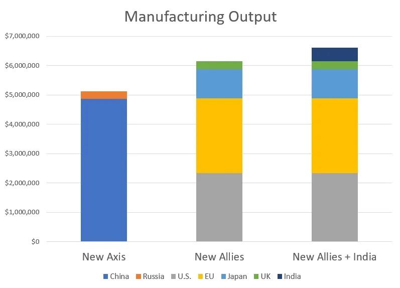

By now, China’s slowdown has been covered from almost every possible angle.  

到目前为止，几乎所有可能的角度都对中国经济放缓进行了报道。  

If you’re following the story, by now you’ve read not just about the details of the economic crisis itself, but also about the [roots of the problem](https://www.noahpinion.blog/p/why-chinas-economy-ran-off-the-rails), the [headwinds going forward](https://arpitrage.substack.com/p/whats-going-on-with-chinas-stagnation), the [political and social effects in China](https://www.economist.com/briefing/2023/08/17/chinas-defeated-youth), and the [effects on the rest of the world](https://www.noahpinion.blog/p/chinas-crash-is-unlikely-to-hurt). But there’s one important question that I haven’t seen anyone else cover yet, and which many people have been asking me about.  

So I thought I’d write a post about whether China’s economic troubles will prompt it to start a war.  

因此，我想写一篇关于中国的经济问题是否会促使其发动战争的文章。  

如果你正在关注这个故事，那么现在你已经不仅读到了经济危机本身的细节，还读到了问题的根源、未来的阻力、对中国的政治和社会影响以及对世界其他地区的影响。但有一个重要的问题，我还没有看到其他人涉及，很多人也一直在问我。

Obviously, whether China decides to start a war is heavily dependent on lots of political factors that I’m not really equipped to analyze.  

很显然，中国是否决定发动战争在很大程度上取决于许多政治因素，而我并不具备分析这些因素的能力。  

Whether Xi Jinping thinks a war would help shore up his legitimacy in the face of various policy failures, or whether Chinese nationalistic sentiment demands that the leadership take aggressive action, or whether China sees a closing window of opportunity for retaking Taiwan are all questions that I just don’t know the answer to.  

习近平是否认为面对各种政策失误，战争将有助于巩固其合法性；中国的民族主义情绪是否要求领导层采取积极行动；中国是否认为夺回台湾的机会之窗正在关闭，这些问题我都不知道答案。

But what I _can_ do, at least to some extent, is think about the economic costs and benefits.  

Obviously leaders’ decisions on war and peace are not always motivated by rational economic calculations — we all know the story of WW1 — but at the same time, costs and benefits probably do matter to但我能做的，至少在某种程度上，是思考经济成本和效益。 _some_ extent.  

I can see at least three factors that seem like they could plausibly affect Xi Jinping’s mental calculus here: the end of catch-up growth, the need for stimulus to fight the economic downturn, and China’s increasing economic self-sufficiency.  

在我看来，至少有三个因素可能会影响习近平的心理盘算：追赶式增长的终结、为应对经济下滑而采取刺激措施的必要性以及中国经济自给自足能力的增强。  

显然，领导人在战争与和平问题上的决策并不总是出于理性的经济考量--我们都知道第一次世界大战的故事--但与此同时，成本和收益可能在某种程度上确实很重要。

Unfortunately, all of these factors seem to point in the same direction: an increased risk of bellicosity and conflict.  

不幸的是，所有这些因素似乎都指向同一个方向：好战和冲突的风险增加。  

So this is going to be a scary post rather than an optimistic one.  

因此，这将是一个可怕的帖子，而不是一个乐观的帖子。  

I don’t want to be alarmist or claim that war is coming; I think there’s still a good chance that Xi refrains from starting a war.  

我不想危言耸听，也不想声称战争即将来临；我认为习近平避免发动战争的可能性还是很大的。  

But I think it’s important to recognize the economic factors involved, and be prepared for increased risk.  

但我认为，重要的是要认识到其中的经济因素，并做好风险增加的准备。

In introductory economics [textbooks](https://faculty.ksu.edu.sa/sites/default/files/microeco-_varian.pdf), a common example is the “when to cut a forest” problem. Basically, a forest grows at some rate over time, and you’re trying to decide when to cut it down and sell the wood.  

If all you wanted was simply to get the maximum amount of wood, you’d actually在经济学入门教科书中，一个常见的例子是 "何时砍伐森林 "问题。基本上，随着时间的推移，森林会以某种速度生长，而你要决定何时砍伐森林并出售木材。 _never_ cut it down; at any point in time it would always make sense to wait and let it grow some more. But of course in reality we care about _time_, too; there’s some cost to waiting.  

Maybe you’re impatient (you’re not immortal, after all), or maybe there are bonds out there you could be investing the money in after you sell the wood. This is an如果你只想获得最大数量的木材，你实际上永远不会砍伐它；在任何时候，等待并让它继续生长都是合理的。当然，在现实生活中，我们也很在乎时间；等待是要付出代价的。 _opportunity cost_; it’s the cost of delaying your payout.  

In any case, the assumption is that the forest’s growth slows over time, so when the rate of growth slows to less than the opportunity cost, you go ahead and cut the forest down.  

无论如何，假设森林的生长速度会随着时间的推移而减慢，因此当生长速度减慢到小于机会成本时，你就会砍伐森林。  

也许你没有耐心（毕竟你不是长生不老之人），也许你可以在卖掉木头后把钱投资在债券上。这就是机会成本；这就是延迟支付的成本。

That’s perhaps not the most environmentally friendly example, but I think there are uncomfortable parallels to China’s strategic calculus during its economic rise.  

这也许不是最环保的例子，但我认为这与中国在经济崛起过程中的战略考量有相似之处。  

A country’s potential military power increases with economic growth — more manufacturing capacity means you can make more weapons and supplies, and a higher technology level means your weapons will be more sophisticated.  

一个国家的潜在军事力量会随着经济增长而增强--更强的制造能力意味着你可以制造更多的武器和补给品，更高的技术水平意味着你的武器会更加先进。  

So even if China wanted to conquer Taiwan in 1996 or 2004 or 2015, its economy was growing so fast that it made sense to wait — to hide their strength and bide their time, in Deng Xiaoping’s famous words.  

因此，即使中国想在 1996 年、2004 年或 2015 年征服台湾，但其经济增长如此之快，用邓小平的名言来说，等待--隐藏实力、韬光养晦--是有道理的。

Starting a war would be a way of _getting the payoff_ from economic growth, just like cutting the forest is the payoff from letting the forest grow.  

And economic growth increased the size of that payoff, since it increased the chances of winning the war (and any follow-on wars after that).  

而经济增长增加了这种回报的规模，因为它增加了赢得战争（以及此后任何后续战争）的机会。  

发动战争是获得经济增长回报的一种方式，就像砍伐森林是让森林生长的回报一样。

But as of 2023, China’s rapid catch-up growth is [probably over](https://www.wsj.com/world/china/china-economy-debt-slowdown-recession-622a3be4), or at least mostly over. Economists’ forecasts are typically slow to adjust, but in light of the current slowdown, [they’re drifting downward](https://www.bloomberg.com/news/articles/2023-09-05/china-slowdown-means-it-may-never-overtake-us-economy-be-says?sref=R8NfLgwS):  

但到 2023 年，中国的快速追赶式增长可能已经结束，或至少基本结束。经济学家的预测通常调整较慢，但鉴于目前的增长放缓，他们的预测正在下调：

> \[Bloomberg\] economists now see growth in China’s economy — the world’s second largest — slowing to 3.5% in 2030 and to near 1% by 2050. That’s lower than prior projections of 4.3% and 1.6%, respectively.  
> 
> \[彭博社\]经济学家们现在认为，世界第二大经济体--中国的经济增长在 2030 年将放缓至 3.5%，到 2050 年将接近 1%。这分别低于此前预测的 4.3% 和 1.6%。

And of course with the fallout from the real estate bust not even fully realized yet, there’s a chance China could do substantially _worse_ than this over the next decade.  

Nor is it just the real estate bust weighing on Chinese growth — before the pandemic, growth had already been falling for a decade thanks to a productivity slowdown:  

影响中国经济增长的也不仅仅是房地产萧条--在大流行病之前，由于生产率放缓，中国经济增长已经连续十年下滑：  

当然，由于房地产萧条的影响尚未完全显现，中国在未来十年的表现有可能比现在更糟。

And in the future both [demographic](https://www.wsj.com/world/china/chinas-fertility-rate-dropped-sharply-study-shows-e97e647f) and [political-economic](https://arpitrage.substack.com/p/whats-going-on-with-chinas-stagnation) headwinds will weigh on the Chinese economy.  

未来，人口和政治经济两方面的不利因素都将给中国经济带来压力。

Of course, military power is _relative_, and China’s economy is still forecast to grow a little faster than that of the U.S. and its allies for a while.  

But remember from the forest-cutting example that we also have to take当然，军事实力是相对的，预计中国的经济增长速度在一段时间内仍将略高于美国及其盟国。 _opportunity cost_ into account. Xi Jinping is 70 years old, and he may want to see Taiwan conquered or U.S. power overthrown before he leaves power. Chinese nationalists may be impatient as well. _Risk_ is also an opportunity cost; the longer Xi waits, the greater the chance that some new factor will emerge to make Chinese hegemony harder to establish.  

Maybe a more powerful India, or the emergence of a NATO equivalent in the Pacific, etc.  

也许是一个更加强大的印度，或者在太平洋地区出现一个与北约相当的国家，等等。  

但请记住，从砍伐森林的例子来看，我们还必须考虑机会成本。习近平已经 70 岁了，他可能希望在卸任前看到台湾被征服或美国政权被推翻。中国的民族主义者可能也不耐烦了。风险也是一种机会成本；习近平等待的时间越长，就越有可能出现一些新的因素，使中国的霸权更难建立。

So as soon as the growth rate of China’s military potential drops below the opportunity cost of waiting longer, we enter what Hal Brands and Michael Beckley call “[the danger zone](https://www.amazon.com/Danger-Zone-Coming-Conflict-China/dp/1324021306)”.  

因此，一旦中国军事潜力的增长率低于等待更长时间的机会成本，我们就进入了哈尔-布兰德和迈克尔-贝克利所说的 "危险区域"。

Of course, one key feature of the “cutting a forest” analogy is that once you cut the forest, you don’t have a forest anymore. For the analogy to work, there has to be some _cost_ of starting the war. One such cost is the risk of actually _losing_ the conflict, which would presumably make the country pretty unhappy with its current leadership.  

But another cost would have been the sudden loss of access to the markets, investment, and technology of the West, and possibly to critical resources from global markets.  

但另一个代价是突然失去了进入西方市场、获得投资和技术的机会，还可能失去从全球市场获得关键资源的机会。  

当然，"砍伐森林 "比喻的一个主要特点是，一旦你砍伐了森林，你就不再有森林了。为了让这个比喻行得通，发动战争必须付出一定的代价。其中一个代价就是在冲突中失败的风险，这可能会让国家对其现任领导非常不满。

So it’s important to note that all of those external dependencies have decreased in recent years. First, there’s investment.  

因此，必须指出的是，近年来所有这些外部依赖性都有所下降。首先是投资。  

FDI was a big part of China’s growth story, since it provided not just jobs and capital but also influxes of foreign technology, through joint ventures between foreign and Chinese companies (and also through espionage).  

外国直接投资是中国经济增长的重要组成部分，因为它不仅提供了就业机会和资金，还通过中外合资企业（以及间谍活动）提供了大量外国技术。  

But now FDI is a much more modest part of the Chinese economy:  

但现在，外国直接投资在中国经济中所占的比重要小得多：

And that’s not even taking into account things like the current slowdown, Xi’s crackdown on tech companies, a [suddenly hostile climate](https://time.com/6292785/china-foreign-investment-national-security-revised-espionage-business-consultants/) for foreign business in China, de-risking by multinational companies, investment restrictions by the U.S. and other governments, and so on.  

China’s role as the world’s preferred destination for investment is basically over. And that means one less foreign dependency to worry about in a war situation.  

中国作为世界首选投资目的地的角色已基本结束。这意味着在战争情况下，可以少担心一个外国依赖国。  

而这还没有考虑到目前的经济放缓、习近平对科技公司的打压、中国突然变得不利于外国企业的环境、跨国公司的去风险化、美国和其他国家政府的投资限制等因素。

As for developed-world markets, those are still important to China, but they’re becoming less important on the margin as exports to the developing world increase:  

至于发达国家市场，它们对中国仍然很重要，但随着对发展中国家出口的增加，它们的重要性在边际上正在下降：

Of course, some of this is intermediate goods trade — countries like Vietnam importing and assembling Chinese components into products for sale in developed-world markets. But [much of it is not](https://www.noahpinion.blog/p/decoupling-isnt-phoney). And remember that China has, in general, become [less of an export-led economy](https://www.noahpinion.blog/p/why-chinas-economy-ran-off-the-rails) in recent years, even before the recent slowdown caused a [sharp drop in total exports](https://www.bbc.com/news/business-66436582).  

当然，这其中有一部分是中间产品贸易--越南等国进口中国的零部件并组装成产品在发达国家市场销售。但大部分并非如此。请记住，近年来，中国总体上已不再是一个出口导向型经济体，甚至在最近经济放缓导致出口总额急剧下降之前也是如此。

As for developed-world technology, this has become less important for China as its manufacturing industries have approached the global frontier.  

至于发达国家的技术，由于中国的制造业已接近全球前沿，这一点对中国已不再那么重要。  

This is why China has become less import-dependent in recent years. A recent [McKinsey report](https://www.mckinsey.com/featured-insights/innovation-and-growth/globalization-in-transition-the-future-of-trade-and-value-chains#part3) explains:  

这就是为什么近年来中国对进口的依赖程度有所降低。麦肯锡最近的一份报告解释道：

> China has moved beyond assembling imported inputs into final products.  
> 
> 中国已不再局限于将进口投入组装成最终产品。  
> 
> It now produces many intermediate goods and conducts more R&D in its own domestic supply chains….In computers and electronics, for instance, Chinese companies are developing the kind of sophisticated smartphone chips that China once imported from advanced economies.  
> 
> 中国现在生产许多中间产品，并在自己的国内供应链中进行更多的研发....，例如，在计算机和电子产品方面，中国公司正在开发中国曾经从发达经济体进口的那种精密智能手机芯片。

Meanwhile semiconductors, the most important sector where developed countries still retain a slim edge, are now subject to export controls.  

与此同时，发达国家仍然保持微弱优势的最重要部门--半导体，现在也受到出口管制。  

And China’s ability to appropriate technologies by buying companies in the U.S. and other developed nations has been impeded by [inbound investment restrictions](https://www.whitecase.com/insight-alert/cfius-2022-annual-report-shows-significant-increase-imposition-mitigation-measures).  

Between these measures and the drop in FDI into China, much of the country’s appropriation of foreign technology will probably now shift to traditional Cold War-style espionage rather than voluntary economic partnerships.  

在这些措施和对华外国直接投资下降的双重作用下，中国对外国技术的利用现在很可能会转向传统的冷战式间谍活动，而不是自愿的经济伙伴关系。  

此外，中国通过收购美国和其他发达国家的公司来获取技术的能力也受到了入境投资限制的阻碍。

What about access to commodities? China could probably feed itself in the event of a conflict. It [imports about a third](https://www.cfr.org/article/china-increasingly-relies-imported-food-thats-problem) of the food it consumes, but it would likely have overland access to Russia and parts of Southeast Asia in wartime, so it would likely be fine. Nevertheless, [Xi has fixated](https://www.economist.com/podcasts/2023/08/08/what-does-xi-jinpings-fixation-on-food-security-mean-for-chinas-countryside) on increasing the country’s food security, which should make the world a bit nervous.  

获得商品的机会如何？如果发生冲突，中国或许可以养活自己。中国进口的粮食约占其消耗量的三分之一，但在战时，中国很可能可以通过陆路进入俄罗斯和东南亚部分地区，因此很可能不会有问题。不过，习近平一直致力于提高中国的粮食安全，这应该会让世界感到紧张。

Oil is often talked about as a major choke point for the Chinese economy.  

石油经常被认为是中国经济的主要咽喉。  

The fact that China imports most of its oil, and these imports have to travel through a bunch of maritime choke points, has been labeled [the “Malacca dilemma”](https://bpr.berkeley.edu/2019/08/26/the-malacca-dilemma-a-hindrance-to-chinese-ambitions-in-the-21st-century/). In a war situation, the U.S. and its allies would try to blockade China from receiving oil shipments, and China’s navy would try to break the blockade.  

But in the end, I’m not sure that China is critically dependent on oil imports. The country has the world’s second-largest事实上，中国的大部分石油靠进口，而这些进口石油必须通过一系列海上咽喉要道，这被称为 "马六甲困境"。在战争情况下，美国及其盟国会试图封锁中国，阻止中国接收石油运输，而中国海军则会试图打破封锁。 [coal reserves](https://en.wikipedia.org/wiki/List_of_countries_by_coal_reserves), and like Nazi Germany in WW2, they can use this coal to make synthetic fuels via the [Fischer-Tropsch process](https://en.wikipedia.org/wiki/Fischer%E2%80%93Tropsch_process#History). It’s not nearly as cheap as imported oil, but it’ll do. (China would also likely construct oil pipelines to Russia.)  

但归根结底，我不确定中国是否严重依赖石油进口。中国拥有世界第二大煤炭储量，就像二战时期的纳粹德国一样，他们可以利用这些煤炭通过费托合成工艺制造合成燃料。虽然比不上进口石油便宜，但也可以。(中国还可能建设通往俄罗斯的石油管道）。

That leaves various minerals. China [dominates the](https://www.economist.com/finance-and-economics/2023/07/13/china-controls-the-supply-of-crucial-war-minerals) _[processing](https://www.economist.com/finance-and-economics/2023/07/13/china-controls-the-supply-of-crucial-war-minerals)_ of many minerals, but in wartime they might get cut off from some of the actual mines, especially in places like Australia.  

This dependence is hard to eliminate completely, because no country has all the minerals required for an advanced industrial economy.  

这种依赖性很难完全消除，因为没有一个国家拥有先进工业经济所需的所有矿产。  

But that would always have been the case, and is just a big inherent risk of starting a major war.  

但这种情况一直都会存在，只是发动一场大规模战争所固有的巨大风险而已。  

剩下的就是各种矿产了。中国主导着许多矿产的加工，但在战时，他们可能会被切断与一些实际矿山的联系，尤其是在澳大利亚等地。

In other words, although China’s economy is not an entirely self-contained fortress, it’s far more self-sufficient across the board than it was even just a few years ago.  

换句话说，尽管中国经济并不是一个完全自给自足的堡垒，但它在各方面的自给自足程度甚至远远超过了几年前。  

And part of that self-sufficiency is actually due to the current economic slowdown, since much of the developed world’s desire to open itself to China was because of the lure of the Chinese market.  

自给自足的部分原因实际上是当前的经济放缓，因为发达国家向中国开放的大部分愿望都是出于中国市场的诱惑。  

With that lure rapidly fading, China has less to lose from adopting a confrontational attitude toward the rest of the world.  

随着这种诱惑迅速消失，中国对世界其他国家采取对抗态度的损失也越来越小。

While the economic cost China would pay from going to war is less than it was, the current slowdown may have also created new economic _benefits_. A shift to a war economy would likely act as a massive fiscal stimulus, to pull China out of the hole it’s fallen into.  

虽然中国从战争中付出的经济代价比原来要少，但当前的经济放缓也可能带来新的经济利益。转向战争经济很可能会起到大规模财政刺激的作用，将中国从已陷入的困境中拉出来。

China’s youth unemployment is so bad right now that the country actually just [stopped publishing the numbers](https://www.wsj.com/world/china/china-slashes-rates-suspends-youth-jobless-data-as-economy-signals-sharper-downturn-418301d6). At last measurement, it was over 21%.  

Mass unemployment always creates a danger of unrest, but youth unemployment is probably especially worrisome, since young people are more willing and able to run riot.  

大规模失业总是会带来动乱的危险，但青年失业可能尤其令人担忧，因为年轻人更愿意也更有能力暴动。  

The country’s leadership has so far shown中国目前的青年失业率非常严重，以至于国家刚刚停止公布相关数字。在上次测量中，失业率超过了 21%。 [a marked reluctance](https://www.washingtonpost.com/business/2023/09/04/why-china-hasn-t-used-bazooka-stimulus-to-rescue-economy/45e0b2d4-4b71-11ee-bfca-04e0ac43f9e4_story.html) to deploy large-scale fiscal stimulus, and any efforts to restore the real estate sector to its bloated pre-crash state will probably be fruitless.  

This sets the stage for years of elevated joblessness — not as bad as the Great Depression, but definitely something the CCP would rather avoid.  

这就为多年来失业率居高不下埋下了伏笔--虽然没有大萧条那么糟糕，但这绝对是中国共产党不愿看到的。  

迄今为止，该国领导层明显不愿意采取大规模的财政刺激措施，任何将房地产行业恢复到暴跌前臃肿状态的努力都可能徒劳无功。

And one way to avoid it — to bring the country rapidly back to full employment — would be a major war. War production, starting with Lend-Lease in 1941, was how the U.S. finally got unemployment down from the very high levels of the Depression.  

而避免这种情况的一个办法--使国家迅速恢复充分就业--就是发动一场大规模战争。从 1941 年租借法案开始的战争生产，是美国最终将失业率从大萧条时期的极高水平降下来的方法。

Some Americans think of a war over Taiwan or in the South China Sea as a short, sharp affair, with some ships and planes shooting at each other and some missiles being launched, and the issue being decided very quickly.  

一些美国人认为，在台湾或南海问题上的战争是一场短平快的事件，一些舰船和飞机互相射击，发射一些导弹，问题很快就会得到解决。  

But as the Ukraine War has reminded us, wars are rarely as short as people expect at the outset. Even if the U.S. somehow prevailed in the early fighting and inflicted serious damage on China’s fleet and missile bases, China could just build another fleet and more missile bases.  

但正如乌克兰战争提醒我们的那样，战争很少会像人们一开始预期的那样短暂。即使美国在早期战斗中占了上风，给中国的舰队和导弹基地造成了严重破坏，中国也可以再建一支舰队和更多的导弹基地。

The weapons of the U.S. and its allies might be a bit superior to what China wields, but China would attempt to overwhelm slightly higher quality with much greater quantity.  

美国及其盟国的武器可能比中国的武器略胜一筹，但中国会试图以更大的数量压倒略高的质量。  

Remember, we’re talking about a country with the manufacturing capacity of the U.S. and Europe combined:  

请记住，我们谈论的是一个制造能力相当于美国和欧洲总和的国家：

Source: World Bank 来源：世界银行资料来源：世界银行

We have seen China accomplish [absolutely amazing feats](https://www.noahpinion.blog/p/where-china-is-beating-the-world) of production and resource mobilization in recent years. We’ve seen them build a high-speed rail network bigger than the entire rest of the world combined in just 15 years.  

We’ve seen them go from an also-ran in the auto industry to the world’s leading car exporter in just a couple of years.  

我们看到，在短短几年内，他们就从汽车行业的 "无名小卒 "一跃成为世界领先的汽车出口国。  

They would obviously apply this same overwhelming mobilization approach to a war with the developed nations.  

他们显然也会把这种压倒性的动员方式用于与发达国家的战争。  

近年来，我们看到中国在生产和资源调动方面取得了令人惊叹的成就。我们看到，他们在短短 15 年时间里建成的高铁网络比世界上其他国家的高铁网络总和还要大。

This would give essentially everyone in China a job to do, ending the real-estate-driven recession in its tracks.  

这基本上会让中国的每个人都有工作可做，从而结束房地产导致的经济衰退。  

And since the war would be a high-tech one, with each side trying to out-innovate the other at breakneck speed, it might also turbocharge domestic Chinese innovation.  

而且，由于这场战争将是一场高科技战争，双方都试图以极快的速度超越对方的创新能力，因此也可能会促进中国国内的创新。  

As economists Daniel Gross and Bhaven Sampat [have written](https://www.nber.org/papers/w27909), something like this happened for the United States during World War 2:  

正如经济学家丹尼尔-格罗斯（Daniel Gross）和巴文-桑帕特（Bhaven Sampat）所写的那样，美国在第二次世界大战期间也发生过类似的情况：

> World War II was one of the most acute emergencies in U.S. history, and the first where mobilizing science and technology was a major part of the government response. The U.S. Office of Scientific Research and Development (OSRD) led a far-ranging research effort to develop technologies and medical treatments that not only helped win the war, but also transformed civilian life, while laying the foundation for postwar innovation policy after it was dissolved…In this paper we bring OSRD into focus, describe how it worked, and explore what insights its experience offers today.  
> 
> 第二次世界大战是美国历史上最严重的紧急状态之一，也是第一次将科学技术作为政府应对措施的主要组成部分。美国科学研究与发展办公室（OSRD）领导了范围广泛的研究工作，开发了各种技术和医疗方法，不仅帮助赢得了战争，还改变了平民的生活，同时也为战后解散后的创新政策奠定了基础......在本文中，我们将聚焦美国科学研究与发展办公室，描述它是如何工作的，并探讨其经验对今天有何启示。  
> 
> We argue that several aspects of OSRD continue to be relevant, especially in crises\[.\]  
> 
> 我们认为，OSRD 的几个方面仍然具有相关性，尤其是在危机中\[......\]。

World War 2 wasn’t just the thing that brought the United States all the way back from the Depression; it made the U.S. the center of global innovation for many decades to come.  

第二次世界大战不仅使美国从经济大萧条中一路走来，还使美国在未来几十年中成为全球创新的中心。

That history is probably on China’s leaders’ minds as they contemplate starting a major great-power conflict.  

中国领导人在考虑挑起一场大国冲突时，很可能会想到这段历史。  

Of course there are other possible outcomes as well — Germany, Japan, Russia, and Britain didn’t benefit economically from the world wars, to say the least.  

当然，还有其他可能的结果--至少可以说，德国、日本、俄罗斯和英国并没有从世界大战中获得经济利益。  

But with their economy in the dumps and their technology under pressure from foreign restrictions, China’s leaders may see the potential upside of war mobilization as a benefit to add into their mental calculations.  

但是，在经济不景气、技术受到外国限制的压力下，中国领导人可能会将战争动员的潜在好处纳入他们的心理计算。

Ultimately, I still think that war would be a very foolish choice for China — the risk of having its rise crushed by a global coalition, or being obliterated in a nuclear exchange, outweighs the modest gains from conquering pieces of Asia.  

归根结底，我仍然认为战争对中国来说是一个非常愚蠢的选择--中国的崛起有可能被全球联军击溃，或者在核战争中被湮没，这比征服整个亚洲所带来的微薄收益要大得多。  

China is already a very large country, with little need for additional territory or population; conquest and hegemony simply aren’t worth the risk.  

中国已经是一个幅员辽阔的国家，几乎不需要增加领土或人口；征服和霸权根本不值得冒险。

But as leaders from Kaiser Wilhelm to Vladimir Putin have shown, national leaders are not always wise or risk-averse.  

但正如从德皇威廉到普京的领导人所表明的那样，国家领导人并不总是明智或规避风险的。  

And when the economic costs of war decrease and the potential upside increases, their natural overconfidence and aggression may gain the upper hand.  

而当战争的经济成本降低、潜在好处增加时，他们天生的过度自信和侵略性可能会占上风。  

Unfortunately, every economic factor I can think of seems to point to a major war being less risky for China on the margin compared to five or ten years ago.  

不幸的是，我能想到的所有经济因素似乎都表明，与五年或十年前相比，一场大规模战争对中国来说风险较小。  

All I can say is that I hope cooler heads prevail and deterrence succeeds.  

我只能说，我希望冷静的头脑占上风，威慑取得成功。

[Share 分享](https://www.noahpinion.blog/p/chinas-slowdown-and-the-incentives?utm_source=substack&utm_medium=email&utm_content=share&action=share&token=eyJ1c2VyX2lkIjo0NjAxMDY0LCJwb3N0X2lkIjoxMzY3NjQxMDEsImlhdCI6MTY5Mzk4NTI0OSwiZXhwIjoxNjk2NTc3MjQ5LCJpc3MiOiJwdWItMzUzNDUiLCJzdWIiOiJwb3N0LXJlYWN0aW9uIn0.RMWmXOOgeMPTBsVbrxpIAv8Qa3UgG7k57sl_L6lug0U)
