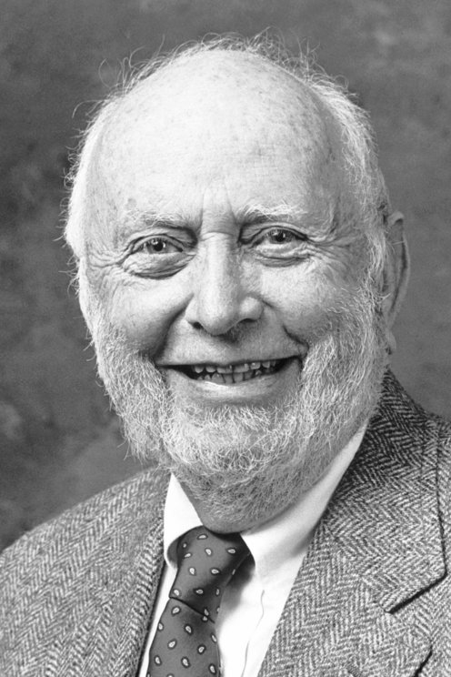

Lecture to the memory of Alfred Nobel, December 9, 1993  

纪念阿尔弗雷德-诺贝尔的演讲，1993 年 12 月 9 日

## Economic Performance through Time  

不同时期的经济表现

**I**  

Economic history is about the performance of economies through time.  

经济史是关于经济在不同时期的表现。  

The objective of research in the field is not only to shed new light on the economic past but also to contribute to economic theory by providing an analytical framework that will enable us to understand economic change.  

该领域研究的目标不仅是为过去的经济发展提供新的启示，而且通过提供一个分析框架，使我们能够理解经济的变化，从而为经济理论做出贡献。  

A theory of economic dynamics comparable in precision to general equilibrium theory would be the ideal tool of analysis.  

与一般均衡理论精度相当的经济动态理论将是理想的分析工具。  

In the absence of such a theory we can describe the characteristics of past economies, examine the performance of economies at various times, and engage in comparative static analysis; but missing is an analytical understanding of the way economies evolve through time.  

在缺乏这样一种理论的情况下，我们可以描述过去经济体的特征，研究不同时期经济体的表现，并进行静态比较分析；但缺少的是对经济体如何随时间演变的分析理解。

A theory of economic dynamics is also crucial for the field of economic development.  

经济动态理论对于经济发展领域也至关重要。  

There is no mystery why the field of development has failed to develop during the five decades since the end of the second World War.  

第二次世界大战结束后的五十年间，发展领域未能取得发展，这一点并不神秘。  

Neo-classical theory is simply an inappropriate tool to analyze and prescribe policies that will induce development.  

新古典主义理论根本不是分析和规定促进发展政策的适当工具。  

It is concerned with the operation of markets, not with how markets develop. How can one prescribe policies when one doesn’t understand how economies develop?  

它关注的是市场运作，而不是市场如何发展。如果不了解经济是如何发展的，又如何制定政策呢？  

The very methods employed by neo-classical economists have dictated the subject matter and militated against such a development.  

新古典主义经济学家所采用的方法本身就决定了这一主题，并阻碍了这一发展。  

That theory in the pristine form that gave it mathematical precision and elegance modeled a frictionless and static world.  

这一理论的原始形式赋予了它数学上的精确性和优雅性，它模拟了一个无摩擦的静态世界。  

When applied to economic history and development it focused on technological development and more recently human capital investment, but ignored the incentive structure embodied in institutions that determined the extent of societal investment in those factors.  

在应用于经济史和经济发展时，它侧重于技术发展和最近的人力资本投资，但却忽视了决定社会对这些因素的投资程度的制度所体现的激励结构。

In the analysis of economic performance through time it contained two erroneous assumptions: one that institutions do not matter and two that time does not matter.

  

在对不同时期的经济表现进行分析时，它包含了两个错误的假设：一是制度并不重要，二是时间并不重要。

This essay is about institutions and time. It does not provide a theory of economic dynamics comparable to general equilibrium theory.[1](https://www.nobelprize.org/prizes/economic-sciences/1993/north/lecture/#not1) We do not have such a theory.’ Rather it provides the initial scaffolding of an analytical framework capable of increasing our understanding of the historical evolution of economies and a necessarily crude guide to policy in the ongoing task of improving the economic performance of economies.  

这篇文章是关于制度和时间的。它没有提供可与一般均衡理论相媲美的经济动态理论。 1 我们没有这样的理论。相反，它提供了一个分析框架的初步构架，能够加深我们对经济历史演变的理解，并在不断改善经济表现的过程中为政策提供粗略的指导。  

The analytical framework is a modification of neo-classical theory.  

分析框架是对新古典主义理论的修改。  

What it retains is the fundamental assumption of scarcity and hence competition and the analytical tools of micro-economic theory. What it modifies is the rationality assumption.  

它保留的是稀缺性的基本假设，因此也保留了竞争和微观经济理论的分析工具。它修改的是理性假设。  

What it adds is the dimension of time.  

它增加的是时间维度。

Institutions form the incentive structure of a society and the political and economic institutions, in consequence, are the underlying determinant of economic performance.  

制度构成了社会的激励结构，因此，政治和经济制度是经济绩效的根本决定因素。  

Time as it relates to economic and societal change is the dimension in which the learning process of human beings shapes the way institutions evolve.  

与经济和社会变革相关的时间，是人类学习过程决定制度演变方式的维度。  

That is, the beliefs that individuals, groups, and societies hold which determine choices are a consequence of learning through time – not just the span of an individual’s life or of a generation of a society but the learning embodied in individuals, groups, and societies that is cumulative through time and passed on intergenerationally by the culture of a society.  

也就是说，个人、群体和社会所持有的决定选择的信念是通过时间学习的结果--不仅仅是个人一生或社会一代人的时间跨度，而是体现在个人、群体和社会中的通过时间累积并通过社会文化代代相传的学习。

The next two sections of this essay summarize the work I, and others, have done on the nature of institutions and the way they affect economic performance (II) and then characterize the nature of institutional change (III).[2](https://www.nobelprize.org/prizes/economic-sciences/1993/north/lecture/#not2) The remaining four sections describe a cognitive science approach to human learning (IV); provide an institutional/cognitive approach to economic history (V); indicate the implications of this approach for improving our understanding of the past (VI); and finally suggest implications for current development policies (VII).  

本文接下来的两节总结了我和其他人在制度的性质及其影响经济表现的方式方面所做的工作（II），然后描述了制度变迁的性质（III）。 2 其余四节介绍了人类学习的认知科学方法（IV）；提供了经济史的制度/认知方法（V）；指出了这一方法对改善我们对过去的理解的影响（VI）；最后提出了对当前发展政策的影响（VII）。

**II**  

Institutions are the humanly devised constraints that structure human interaction.  

制度是人类设计的制约因素，是人类互动的结构。  

They are made up of formal constraints (rules, laws, constitutions), informal constraints (norms of behavior, conventions, and self imposed codes of conduct), and their enforcement characteristics.  

它们由正式约束（规则、法律、宪法）、非正式约束（行为规范、约定俗成和自我施加的行为准则）及其执行特点组成。  

Together they define the incentive structure of societies and specifically economies.  

它们共同决定了社会，特别是经济的激励结构。  

Institutions and the technology employed determine the transaction and transformation costs that add up to the costs of production.  

制度和所采用的技术决定了交易成本和转换成本，这些成本加在一起就是生产成本。  

It was Ronald Coase (1960) who made the crucial connection between institutions, transaction costs, and neo-classical theory.  

正是罗纳德-科斯（1960 年）在制度、交易成本和新古典理论之间建立了重要联系。  

The neo-classical result of efficient markets only obtains when it is costless to transact.  

只有在交易无成本的情况下，新古典的有效市场结果才会出现。  

Only under the conditions of costless bargaining will the actors reach the solution that maximizes aggregate income regardless of the institutional arrangements.  

只有在无成本讨价还价的条件下，行动者才会达成使总收入最大化的解决方案，而与制度安排无关。  

When it is costly to transact then institutions matter. And it is costly to transact. Wallis and North (1986) demonstrated in an empirical study that 45 percent of U.S. GNP was devoted to the transaction sector in 1970. Efficient markets are created in the real world when competition is strong enough via arbitrage and efficient information feedback to approximate the Coase zero transaction cost conditions and the parties can realize the gains from trade inherent in the neo-classical argument.  

如果交易成本高昂，那么机构就很重要。交易成本很高。Wallis 和 North（1986 年）在一项实证研究中表明，1970 年美国国民生产总值的 45% 用于交易部门。当竞争通过套利和有效的信息反馈变得足够强大，从而近似于科斯的零交易成本条件，并且各方能够实现新古典主义论证中固有的贸易收益时，有效市场就在现实世界中产生了。

But the informational and institutional requirements necessary to achieve such efficient markets are stringent.  

但是，实现这种高效市场所需的信息和制度要求非常严格。  

Players must not only have objectives but know the correct way to achieve them. But how do the players know the correct way to achieve their objectives?  

球员不仅要有目标，还要知道实现目标的正确方法。但是，球员如何知道实现目标的正确方法呢？  

The instrumental rationality answer is that even though the actors may initially have diverse and erroneous models, the informational feedback process and arbitraging actors will correct initially incorrect models, punish deviant behavior and lead surviving players to correct models.  

工具理性的答案是，即使行为者最初可能有多种错误的模型，但信息反馈过程和仲裁行为者会纠正最初的错误模型，惩罚偏差行为，并引导幸存的行为者改正模型。

An even more stringent implicit requirement of the discipline-of-the-competitive-market model is that when there are significant transaction costs, the consequent institutions of the market will be designed to induce the actors to acquire the essential information that will lead them to correct their models.  

竞争市场纪律模式的一个更为严格的隐含要求是，当存在巨大的交易成本时，随之而来的市场制度设计将诱导参与者获取基本信息，从而纠正他们的模式。  

The implication is not only that institutions are designed to achieve efficient outcomes but that they can be ignored in economic analysis because they play no independent role in economic performance.  

这不仅意味着机构的设计是为了实现高效的结果，而且意味着在经济分析中可以忽略它们，因为它们在经济表现中并不发挥独立的作用。

These are stringent requirements that are realized only very exceptionally.  

这些严格的要求只有在极少数情况下才能实现。  

Individuals typically act on incomplete information and with subjectively derived models that are frequently erroneous; the information feedback is typically insufficient to correct these subjective models.  

个人通常根据不完整的信息和主观推导出的模型行事，而这些模型往往是错误的；信息反馈通常不足以纠正这些主观模型。  

Institutions are not necessarily or even usually created to be socially efficient; rather they, or at least the formal rules, are created to serve the interests of those with the bargaining power to create new rules.  

建立制度并不一定是为了提高社会效率，甚至通常也不是这样；相反，建立制度，至少是建立正式规则，是为了服务于那些有讨价还价能力的人的利益，使他们能够制定新的规则。  

In a world of zero transaction costs, bargaining strength does not affect the efficiency of outcomes; but in a world of positive transaction costs it does.  

在交易成本为零的世界里，讨价还价的力量不会影响结果的效率；但在交易成本为正的世界里，讨价还价的力量会影响结果的效率。

It is exceptional to find economic markets that approximate the conditions necessary for efficiency. It is impossible to find political markets that do.  

能找到近似于效率所需条件的经济市场是例外。政治市场不可能做到这一点。  

The reason is straightforward. Transaction costs are the costs of specifying what is being exchanged and of enforcing the consequent agreements.  

原因很简单。交易成本是明确交换内容和执行相应协议的成本。  

In economic markets what is being specified (measured) is the valuable attributes – the physical and property rights dimensions – of goods and services or the performance of agents.  

在经济市场中，被指定（衡量）的是商品和服务的有价属性--物理和产权层面--或代理人的表现。

While measurement can frequently be costly, there are some standard criteria: the physical dimensions have objective characteristics (size, weight, color, etc.) and the property rights dimensions are defined in legal terms. Competition also plays a critical role in reducing enforcement costs.

  

虽然测量往往成本高昂，但也有一些标准：物理尺寸具有客观特征（尺寸、重量、颜色等），产权尺寸则以法律术语定义。竞争在降低执法成本方面也起着至关重要的作用。  

The judicial system provides coercive enforcement. Still, economic markets in the past and present are typically imperfect and beset by high transaction costs.  

司法系统提供强制执行。不过，过去和现在的经济市场通常都不完善，交易成本高昂。

Measuring and enforcing agreements in political markets is far more difficult. What is being exchanged (between constituents and legislators in a democracy) is promises for votes.  

衡量和执行政治市场中的协议要困难得多。在民主社会中，选民与议员之间交换的是选票承诺。  

The voter has little incentive to become informed because the likelihood that one’s vote matters is infinitesimal; further the complexity of the issues produces genuine uncertainty.  

选民了解信息的积极性很低，因为他们投票的可能性微乎其微；此外，问题的复杂性也造成了真正的不确定性。

Enforcement of political agreements is beset by difficulties. Competition is far less effective than in economic markets.

  

政治协议的执行困难重重。竞争远不如经济市场有效。  

For a variety of simple, easy-to-measure and important-to-constituent-well-being policies, constituents may be well informed, but beyond such straightforward policy issues ideological stereotyping takes over and (as I shall argue below in section IV) shapes the consequent performance of economies.[3](https://www.nobelprize.org/prizes/economic-sciences/1993/north/lecture/#not3) It is the polity that defines and enforces property rights and in consequence it is not surprising that efficient economic markets are so exceptional.  

对于各种简单、易于衡量且对选民福祉十分重要的政策，选民可能会非常了解，但除了这些直接的政策问题之外，意识形态的陈规定型观念会占据主导地位，并（正如我在下文第 IV 部分中将论述的那样）影响经济的后续表现。 3 正是政体界定并落实了产权，因此，高效的经济市场如此特殊也就不足为奇了。

**III  

**It is the interaction between institutions and organizations that shapes the institutional evolution of an economy.  

正是机构和组织之间的互动塑造了一个经济体的制度演变。  

If institutions are the rules of the game, organizations and their entrepreneurs are the players.  

如果说制度是游戏规则，那么组织及其企业家就是参与者。

Organizations are made up of groups of individuals bound together by some common purpose to achieve certain objectives.  

组织是由一群人组成的，他们被某种共同的目的联系在一起，以实现某些目标。  

Organizations include political bodies (political parties, the Senate, a city council, regulatory bodies), economic bodies (firms, trade unions, family farms, cooperatives), social bodies (churches, clubs, athletic associations), educational bodies (schools, universities, vocational training centers).  

组织包括政治机构（政党、参议院、市议会、监管机构）、经济机构（公司、工会、家庭农场、合作社）、社会机构（教会、俱乐部、体育协会）、教育机构（学校、大学、职业培训中心）。

The organizations that come into existence will reflect the opportunities provided by the institutional matrix.  

新成立的组织将反映机构矩阵提供的机会。  

That is, if the institutional framework rewards piracy then piratical organizations will come into existence; and if the institutional framework rewards productive activities then organizations – firms – will come into existence to engage in productive activities.  

也就是说，如果制度框架奖励海盗行为，那么就会出现海盗组织；如果制度框架奖励生产活动，那么就会出现从事生产活动的组织--企业。

Economic change is a ubiquitous, ongoing, incremental process that is a consequence of the choices individual actors and entrepreneurs of organizations are making every day.  

经济变革是一个无处不在、持续不断、循序渐进的过程，是个体行动者和组织创业者每天所做选择的结果。  

While the vast majority of these decisions are routine (Nelson and Winter, 1982) some involve altering existing “contracts” between individuals and organizations.  

虽然这些决定绝大多数都是常规性的（纳尔逊和温特，1982 年），但有些决定涉及到改变个人与组织之间现有的 "契约"。  

Sometimes that recontracting can be accomplished within the existing structure of property rights and political rules; but sometimes new contracting forms require an alteration in the rules.  

有时，这种重新缔约可以在现有的产权结构和政治规则内完成；但有时，新的缔约形式需要改变规则。  

Equally, norms of behavior that guide exchanges will gradually be modified or wither away. In both instances, institutions are being altered.  

同样，指导交流的行为规范也会逐渐改变或消失。在这两种情况下，体制都在发生变化。

Modifications occur because individuals perceive that they could do better by restructuring exchanges (political or economic).  

之所以会发生改变，是因为个人认为他们可以通过重组交换（政治或经济）做得更好。  

The source of the changed perceptions may be exogenous to the economy – for instance a change in the price or quality of a competitive product in another economy that alters perceptions of entrepreneurs in the given economy about profitable opportunities.  

观念改变的根源可能是经济的外生因素--例如，另一经济体内竞争产品价格或质量的变化，改变了该经济体内企业家对盈利机会的看法。  

But the most fundamental long run source of change is learning by individuals and entrepreneurs of organizations.  

但最根本的长期变革源泉是个人和组织企业家的学习。

While idle curiosity will result in learning, the rate of learning will reflect the intensity of competition amongst organizations.  

闲暇的好奇心会导致学习，而学习的速度则反映了组织间竞争的激烈程度。  

Competition, reflecting ubiquitous scarcity, induces organizations to engage in learning to survive. The degree of competition can and does vary.  

竞争反映了无处不在的稀缺性，促使组织为生存而学习。竞争的程度可以而且确实各不相同。  

The greater the degree of monopoly power the lower the incentive to learn.  

垄断的程度越高，学习的动力就越低。

The speed of economic change is a function of the rate of learning but the direction of that change is a function of the expected pay-offs to acquiring different kinds of knowledge.  

经济变革的速度是学习速度的函数，而变革的方向则是获取不同种类知识的预期回报的函数。  

The mental models that the players develop shape perceptions about the pay-offs.  

玩家建立的心智模式决定了他们对回报的看法。

**IV 四**  

It is necessary to dismantle the rationality assumption underlying economic theory in order to approach constructively the nature of human learning.  

为了建设性地探讨人类学习的本质，有必要打破经济理论所依据的理性假设。  

History demonstrates that ideas, ideologies, myths, dogmas, and prejudices matter; and an understanding of the way they evolve is necessary for further progress in developing a framework to understand societal change.  

历史证明，思想、意识形态、神话、教条和偏见都很重要；要想在制定理解社会变革的框架方面取得进一步进展，就必须了解它们的演变方式。  

The rational choice framework assumes that individuals know what is in their self interest and act accordingly.  

理性选择框架假定，个人知道什么符合自身利益，并据此行事。  

That may be correct for individuals making choices in the highly developed markets of modern economies[4](https://www.nobelprize.org/prizes/economic-sciences/1993/north/lecture/#not4) but it is patently false in making choices under conditions of uncertainty – the conditions that have characterized the political and economic choices that shaped (and continue to shape) historical change.  

对于在现代经济高度发达的市场中做出选择的个人来说，这种观点可能是正确的 4 ，但对于在不确定条件下做出选择的个人来说，这种观点显然是错误的--而这种条件正是影响（并将继续影响）历史变革的政治和经济选择的特点。

Herbert Simon has stated the issues succinctly:  

赫伯特-西蒙简明扼要地阐述了这些问题：

> If… we accept the proposition that both the knowledge and the computational power of the decision-maker are severely limited, then we must distinguish between the real world and the actor’s perception of it and reasoning about it.  
> 
> 如果......我们接受这样的命题，即决策者的知识和计算能力都非常有限，那么我们就必须区分现实世界和行为者对它的感知和推理。  
> 
> That is to say we must construct a theory (and test it empirically) of the process of decision.  
> 
> 也就是说，我们必须为决策过程构建一个理论（并对其进行实证检验）。  
> 
> Our theory must include not only the reasoning processes but also the processes that generated the actor’s subjective representation of the decision problem, his or her frame.  
> 
> 我们的理论不仅必须包括推理过程，还必须包括行为者对决策问题的主观表述过程，即他或她的框架。  
> 
> (Simon, 1986, pp. S210-11)  
> 
> (西蒙，1986 年，第 S210-11 页）

The analytical framework we must build, must originate in an understanding of how human learning takes place.  

我们必须建立的分析框架必须源于对人类学习方式的理解。  

We have a way to go before we can construct such a theory but cognitive science has made immense strides in recent years – enough strides to suggest a tentative approach that can help us understand decision making under uncertainty.[5](https://www.nobelprize.org/prizes/economic-sciences/1993/north/lecture/#not5)  

在构建这样一种理论之前，我们还有很长的路要走，但认知科学近年来已经取得了巨大的进步--这些进步足以提出一种初步的方法，帮助我们理解不确定性下的决策制定。 5

Learning entails developing a structure by which to interpret the varied signals received by the senses.  

学习需要发展一种结构，用以解释感官接收到的各种信号。  

The initial architecture of the structure is genetic but the subsequent scaffolding is a result of the experiences of the individual.  

最初的结构是遗传的，但随后的支架则是个人经历的结果。  

The experiences can be classified into two kinds – those from the physical environment and those from the socio-cultural linguistic environment.  

这些经验可分为两类--来自物理环境的经验和来自社会文化语言环境的经验。  

The structures consist of categories – classifications that gradually evolve from earliest childhood to organize our perceptions and keep track of our memory of analytic results and experiences.  

这些结构由类别组成，即从童年开始逐渐形成的分类，用于组织我们的感知，并记录我们对分析结果和经验的记忆。  

Building on these classifications, we form mental models to explain and interpret the environment – typically in ways relevant to some goal.  

在这些分类的基础上，我们形成了心智模式来解释和诠释环境--通常是以与某些目标相关的方式。  

Both the categories and the mental models will evolve, reflecting the feedback derived from new experiences: feedback that sometimes strengthens our initial categories and models or may lead to modifications – in short, learning.  

类别和心智模式都会不断演变，反映出新经验带来的反馈：这些反馈有时会加强我们最初的类别和模式，有时可能会导致修改--简而言之，就是学习。  

Thus, the mental models may be continually redefined with new experiences, including contact with others’ ideas.  

因此，心智模式可能会随着新的经历，包括与他人想法的接触而不断被重新定义。

At this juncture the learning process of human beings diverges from that of other animals (such as the sea slug – a favorite research subject of cognitive scientists) and particularly diverges from the computer analogy that dominated early studies of artificial intelligence.  

在这个关键时刻，人类的学习过程与其他动物（如海蛞蝓--认知科学家最喜欢的研究对象）的学习过程不同，尤其是与主导早期人工智能研究的计算机类比不同。  

The mind appears to order and reorder the mental models from their special purpose origins to successively more abstract form so that they become available to process other information.  

思维似乎在对心智模式进行排序和重新排序，从它们的特殊用途起源到连续的更抽象形式，以便它们能够用于处理其他信息。  

The term used by Clark and Karmiloff-Smith (1993) is representational redescription.  

Clark 和 Karmiloff-Smith（1993 年）使用的术语是 "表象再描述"。  

The capacity to generalize from the particular to the general and to use analogy is a part of this redescription process.  

从特殊到一般的概括能力和使用类比的能力是这种重新描述过程的一部分。  

It is this capacity that is the source not only of creative thinking but also of the ideologies and belief systems that underlie the choices humans make.[6](https://www.nobelprize.org/prizes/economic-sciences/1993/north/lecture/#not6)  

正是这种能力不仅是创造性思维的源泉，也是支撑人类做出选择的意识形态和信仰体系的源泉。 6

A common cultural heritage provides a means of reducing the divergence in the mental models that people in a society have, and constitutes the means for the intergenerational transfer of unifying perceptions.  

共同的文化遗产为减少社会中人们在心智模式上的差异提供了一种手段，也是统一观念代代相传的途径。  

In pre-modern societies cultural learning provided a means of internal communication; it also provided shared explanations for phenomena outside the immediate experiences of the members of society in the form of religions, myths and dogmas.  

在前现代社会，文化学习提供了一种内部交流的手段；它还以宗教、神话和教条的形式，为社会成员直接经验之外的现象提供了共同的解释。  

Such belief structures are not, however, confined to primitive societies but are an essential part of modern societies as well.  

然而，这种信仰结构并不局限于原始社会，它也是现代社会的重要组成部分。

Belief structures get transformed into societal and economic structures by institutions- both formal rules and informal norms of behavior.  

信仰结构通过制度--正式的规则和非正式的行为规范--转化为社会和经济结构。  

The relationship between mental models and institutions is an intimate one.  

心智模式与制度之间的关系十分密切。  

Mental models are the internal representations that individual cognitive systems create to interpret the environment; institutions are the external (to the mind) mechanisms individuals create to structure and order the environment  

心智模式是个体认知系统为解释环境而创建的内部表征；制度是个体为构建和安排环境而创建的外部（心智）机制。

**V**  

There is no guarantee that the beliefs and institutions that evolve through time will produce economic growth.  

无法保证随着时间推移而演变的信仰和制度会带来经济增长。  

Let me pose the issue that time presents us by a brief institutional/cognitive story of long-run economic/political change.  

让我通过一个关于长期经济/政治变革的简短制度/认知故事来提出时间给我们带来的问题。

As tribes evolved in different physical environments they developed different languages and, with different experiences, different mental models to explain the world around them.  

随着部落在不同的自然环境中进化，他们发展出了不同的语言，并凭借不同的经验，形成了不同的心智模式来解释周围的世界。  

The languages and mental models formed the informal constraints that defined the institutional framework of the tribe and were passed down intergenerationally as customs, taboos, and myths that provided cultural continuity.[7](https://www.nobelprize.org/prizes/economic-sciences/1993/north/lecture/#not7)  

这些语言和思维模式形成了非正式的约束，确定了部落的制度框架，并作为习俗、禁忌和神话代代相传，提供了文化的连续性。 7

With growing specialization and division of labor the tribes evolved into polities and economies; the diversity of experience and learning produced increasingly different societies and civilizations with different degrees of success in solving the fundamental economic problem of scarcity.  

随着专业化和分工的不断发展，部落演变成了政体和经济体；经验和学习的多样性产生了越来越多不同的社会和文明，它们在解决稀缺性这一基本经济问题上取得了不同程度的成功。  

The reason is that as the complexity of the environment increased as human beings became increasingly interdependent, more complex institutional structures were necessary to capture the potential gains from trade.  

原因在于，随着人类日益相互依存，环境的复杂性也随之增加，要想从贸易中获取潜在收益，就必须建立更加复杂的制度结构。  

Such evolution requires that the society develop institutions that will permit anonymous, impersonal exchange across time and space.  

这种演变要求社会发展出允许匿名、非个人的跨时空交流的机构。  

To the extent that the culture and local experiences had produced diverse institutions and belief systems with respect to the gains from such cooperation, the likelihood of creating the necessary institutions to capture the gains from trade of more complex contracting varied.  

由于文化和当地经验产生了与这种合作收益相关的不同制度和信仰体系，建立必要的制度以获取更复杂的合同贸易收益的可能性也各不相同。  

In fact most societies throughout history got “stuck” in an institutional matrix that did not evolve into the impersonal exchange essential to capturing the productivity gains that came from the specialization and division of labor that have produced the Wealth of Nations.  

事实上，历史上的大多数社会都 "陷入 "了一种制度框架，这种框架并没有演变成一种非个人的交换，而这种交换对于获取专业化和劳动分工所带来的生产率提高是必不可少的，这种专业化和劳动分工产生了 "国富论"。

The key to the foregoing story is the kind of learning that the individuals in a society acquired through time.  

上述故事的关键在于社会中的个人通过时间的推移所获得的学习。  

Time in this context entails not only current experiences and learning but also the cumulative experience of past generations that is embodied in culture.  

这里的时间不仅包括当前的经历和学习，还包括体现在文化中的历代积累的经验。  

Collective learning – a term used by Hayek – consists of those experiences that have passed the slow test of time and are embodied in our language, institutions, technology, and ways of doing things.  

集体学习--哈耶克使用的一个术语--包括那些经过时间缓慢考验的经验，这些经验体现在我们的语言、制度、技术和做事方式中。  

It is “the transmission in time of our accumulated stock of knowledge” (Hayek 1960: 27).  

它是 "我们积累的知识储备在时间上的传递"（哈耶克，1960 年：27）。  

It is culture that provides the key to path dependence – a term used to describe the powerful influence of the past on the present and future.  

文化是路径依赖的关键--路径依赖是指过去对现在和未来的强大影响。  

The current learning of any generation takes place within the context of the perceptions derived from collective learning.  

任何一代人当前的学习都是在集体学习所产生的认知背景下进行的。  

Learning then is an incremental process filtered by the culture of a society which determines the perceived pay-offs, but there is no guarantee that the cumulative past experience of a society will necessarily fit them to solve new problems. Societies that get “stuck” embody belief systems and institutions that fail to confront and solve new problems of societal complexity.  

因此，学习是一个循序渐进的过程，需要经过社会文化的过滤，而社会文化决定了人们所感知的回报，但并不能保证一个社会过去积累的经验一定适合他们解决新的问题。陷入 "僵局 "的社会所体现的信仰体系和制度无法面对和解决社会复杂性带来的新问题。

We need to understand a great deal more about the cumulative learning of a society.  

我们需要更多地了解社会的学习积累。  

The learning process appears to be a function of 1) the way in which a given belief structure filters the information derived from experiences; and 2) the different experiences confronting individuals and societies at different times.  

学习过程似乎取决于：1）特定信仰结构过滤经验信息的方式；2）个人和社会在不同时期面临的不同经验。  

The perceived rate of return (private) may be high to military technology (in medieval Europe), to the pursuit and refinement of religious dogma (Rome during and after Constantine) or to the research for an accurate chronometer to determine longitude at sea (for which a substantial reward was offered during the age of exploration).  

对于军事技术（在中世纪的欧洲）、对宗教教条的追求和完善（君士坦丁时期和之后的罗马），或者对于精确测定海上经度的天文钟的研究（在探险时代为此提供了丰厚的报酬），人们认为回报率（私人）可能很高。

The incentives to acquire pure knowledge, the essential underpinning of modern economic growth, are affected by monetary rewards and punishments; they are also fundamentally influenced by a society’s tolerance of creative developments, as a long list of creative individuals from Galileo to Darwin could attest.  

获取纯粹知识的动力是现代经济增长的重要基础，它受到金钱奖惩的影响；它也从根本上受到社会对创造性发展的容忍度的影响，从伽利略到达尔文的一长串创造性人物都可以证明这一点。  

While there is a substantial literature on the origins and development of science, very little of it deals with the links between institutional structure, belief systems and the incentives and disincentives to acquire pure knowledge.  

虽然关于科学起源和发展的文献很多，但很少有文献涉及制度结构、信仰体系以及获取纯粹知识的激励和抑制因素之间的联系。  

A major factor in the development of Western Europe was the gradual perception of the utility of research in pure science.  

西欧发展的一个重要因素是人们逐渐认识到纯科学研究的效用。

Incentives embodied in belief systems as expressed in institutions determine economic performance through time, and however we wish to define economic performance the historical record is clear.  

制度所体现的信仰体系中的激励机制决定着经济的长期表现，无论我们如何定义经济表现，历史记录都是清晰的。  

Throughout most of history and for most societies in the past and present, economic performance has been anything but satisfactory.  

在历史上的大部分时期，以及在过去和现在的大部分社会中，经济表现都不尽如人意。  

Human beings have, by trial and error, learned how to make economies perform better; but not only has this learning taken ten millennia (since the first economic revolution) – it has still escaped the grasp of almost half of the world’s population.  

人类通过不断尝试和犯错，学会了如何使经济运行得更好；但这种学习不仅花费了上千年的时间（自第一次经济革命以来），而且世界上仍有近一半的人口没有掌握这种学习方法。  

Moreover the radical improvement in economic performance, even when narrowly defined as material well-being, is a modern phenomenon of the last few centuries and confined until the last few decades to a small part of the world.  

此外，经济表现的显著改善，即使狭义地定义为物质生活的改善，也是过去几个世纪的现代现象，而且直到最近几十年还仅限于世界上的一小部分地区。  

Explaining the pace and direction of economic change throughout history presents a major puzzle.  

解释历史上经济变化的速度和方向是一个重大难题。

Let us represent the human experience to date as a 24 hour clock in which the beginning consists of the time (apparently in Africa between 4 and 5 million years ago) when humans became separate from other primates.  

让我们把人类迄今为止的经历表示为一个 24 小时的时钟，其中的起点是人类从其他灵长类动物中分离出来的时间（显然是在 400 万到 500 万年前的非洲）。  

Then the beginning of so-called civilization occurs with the development of agriculture and permanent settlement in about 8000 B.C.  

然后，大约在公元前 8000 年，随着农业的发展和永久定居，所谓的文明开始出现。  

in the Fertile Crescent – in the last three or four minutes of the clock.  

在新月沃地的最后三四分钟。  

For the other twenty three hours and fifty six or seven minutes, humans remained hunters and gatherers and while population grew it did so at a very slow pace.  

在其余的 23 小时零 56 或 7 分钟里，人类仍然是狩猎者和采集者，虽然人口增长速度非常缓慢。

Now if we make a new 24 hour clock for the time of civilization – the ten thousand years from development of agriculture to the present – the pace of change appears to be very slow for the first 12 hours although our archeological knowledge is very limited.  

现在，如果我们为文明时代--从农业发展到现在的一万年--制作一个新的 24 小时时钟，虽然我们的考古知识非常有限，但前 12 个小时的变化速度似乎非常缓慢。  

Historical demographers speculate that the rate of population growth may have doubled as compared to the previous era but still was very slow.  

历史人口学家推测，人口增长率可能比前一个时代翻了一番，但仍然非常缓慢。  

The pace of change accelerates in the past five thousand years with the rise and then decline of economies and civilizations.  

在过去的五千年里，随着经济和文明的兴起和衰落，变化的步伐也在加快。  

Population may have grown from about three hundred million at the time of Christ to about eight hundred million by 1750 – a substantial acceleration as compared to earlier rates of growth.  

人口可能已从基督诞生时的约三亿增长到 1750 年的约八亿--与早期的增长率相比，这是一个大幅度的加速。  

The last 250 years – just 35 minutes on our new 24 hour clock – are the era of modern economic growth accompanied by a population explosion that now puts world population in excess of five billion.  

过去的 250 年--在我们新的 24 小时时钟上只有 35 分钟--是现代经济增长的时代，伴随着人口爆炸，现在世界人口已超过 50 亿。

If we focus now on the last 250 years we see that growth was largely restricted to Western Europe and the overseas extensions of Britain for 200 of those 250 years.  

如果我们现在关注过去的 250 年，就会发现在这 250 年中，有 200 年的增长主要局限于西欧和英国的海外延伸地区。

Not only has the pace varied over the ages; the change has not been unidirectional.  

各个时代的步伐不仅各不相同，而且变化也不是单向的。  

That is not simply a consequence of the decline of individual civilizations; there have been periods of apparent secular stagnation – the most recent being the long hiatus between the end of the Roman Empire in the west and the revival of Western Europe approximately five hundred years later.  

这不仅仅是个别文明衰落的结果；世俗也有过明显的停滞期--最近的一次是西方罗马帝国灭亡到大约五百年后西欧复兴之间的漫长间歇。

**VI  

**What can an institutional/cognitive approach contribute to improving our understanding of the economic past?  

制度/认知方法能为我们更好地了解过去的经济做出什么贡献？  

First of all it should make sense out of the very uneven pattern of economic performance described in the previous section.  

首先，上一节描述的经济表现非常不平衡的模式应该是合理的。  

There is nothing automatic about the evolving of conditions that will permit low cost transacting in the impersonal markets that are essential to productive economies.  

要在对生产性经济至关重要的非人工市场上实现低成本交易，各种条件的发展并不是自动的。  

Game theory characterizes the issue.  

博弈论是这一问题的特征。  

Individuals will usually find it worthwhile cooperating with others in exchange when the play is repeated, when they possess complete information about the other player’s past performance, and when there are small numbers of players.  

当游戏重复进行时，当个体掌握了对方过去表现的完整信息时，当游戏参与者人数较少时，个体通常会发现与他人合作交换是值得的。  

Cooperation is difficult to sustain when the game is not repeated (or there is an endgame), when information about the other players is lacking, and when there are large numbers of players.  

当游戏不重复（或有终局）、缺乏其他玩家的信息以及玩家人数众多时，合作就很难持续。  

Creating the institutions that will alter the benefit/cost ratios in favor of cooperation in impersonal exchange is a complex process because it not only entails the creation of economic institutions but requires that they be undergirded by appropriate political institutions.  

建立有利于在非人为交换中进行合作的利益/成本比率的制度是一个复杂的过程，因为这不仅需要建立经济制度，还需要有适当的政治制度作为支撑。

We are just beginning to explore the nature of this historical process.  

我们刚刚开始探索这一历史进程的本质。  

The remarkable development of Western Europe from relative backwardness in the tenth century to world economic hegemony by the eighteenth century is a story of a gradually evolving belief system in the context of competition among fragmented political/economic units producing economic institutions and political structure that produced modern economic growth.8 And even within Western Europe there were successes (The Netherlands and England) and failures (Spain and Portugal) reflecting diverse external environmental experiences.[9](https://www.nobelprize.org/prizes/economic-sciences/1993/north/lecture/#not9)  

西欧从十世纪的相对落后发展到十八世纪的世界经济霸主，这是一个信仰体系逐渐演 变的故事，其背景是分散的政治/经济单位之间的竞争，产生了产生现代经济增长的经济 体制和政治结构。 9

Second, institutional/cognitive analysis should explain path dependence, one of the remarkable regularities of history.  

其次，制度/认知分析应能解释历史的显著规律之一--路径依赖。  

Why do economies once on a path of growth or stagnation tend to persist?  

为什么经济一旦走上增长或停滞的道路就会持续下去？  

Pioneering work on this subject is beginning to give us insights into the sources of path dependence (Arthur, 1989 and David, 1985). But there is much that we still do not know.  

这方面的开创性工作使我们开始深入了解路径依赖的来源（Arthur，1989 年；David，1985 年）。但是，我们还有很多事情不知道。  

The rationality assumption of neo-classical theory would suggest that political entrepreneurs of stagnating economies could simply alter the rules and change the direction of failed economies.  

新古典主义理论的理性假设表明，经济停滞的政治企业家可以简单地改变规则，改变失败经济的方向。  

It is not that rulers have been unaware of poor performance.  

统治者并非不知道业绩不佳。  

Rather the difficulty of turning economies around is a function of the nature of political markets and, underlying that, the belief systems of the actors.  

相反，经济转型的难度取决于政治市场的性质，以及政治市场背后的参与者的信仰体系。  

The long decline of Spain, for example, from the glories of the Habsburg Empire of the sixteenth century to its sorry state under Franco in the twentieth century was characterized by endless self appraisals and frequently bizarre proposed solutions.[10](https://www.nobelprize.org/prizes/economic-sciences/1993/north/lecture/#not10)  

例如，西班牙从十六世纪哈布斯堡帝国的辉煌到二十世纪佛朗哥统治下的悲惨状况，其长期衰落的特点就是无休止的自我评价和经常提出的怪异解决方案。 10

Third, this approach will contribute to our understanding of the complex interplay between institutions, technology, and demography in the overall process of economic change.  

第三，这种方法将有助于我们理解在整个经济变革过程中，制度、技术和人口之间复杂的相互作用。  

A complete theory of economic performance would entail such an integrated approach to economic history. We certainly have not put all the pieces together yet.  

一个完整的经济绩效理论需要对经济史采取这样一种综合方法。当然，我们还没有将所有碎片拼凑在一起。  

For example, Robert Fogel’s path breaking work on demographic theory[11](https://www.nobelprize.org/prizes/economic-sciences/1993/north/lecture/#not11) and its historical implications for reevaluating past economic performance has yet to be fully integrated with institutional analysis. The same is true for technological change.  

例如，罗伯特-福格尔（Robert Fogel）在人口理论方面的开创性工作 11 及其对重新评估过去经济表现的历史意义，尚未与制度分析充分结合。技术变革也是如此。  

The important contributions of Nathan Rosenberg (1976) and Joel Mokyr (1990), exploring the impetus for and consequences of technological change have ongoing implications which need to be integrated with institutional analysis.  

内森-罗森伯格（Nathan Rosenberg，1976 年）和乔尔-莫基尔（Joel Mokyr，1990 年）在探索技术变革的动力和后果方面做出了重要贡献，这些贡献具有持续的影响，需要与制度分析结合起来。  

An essay by Wallis and North (forthcoming) is a beginning at integrating technological and institutional analysis.  

Wallis 和 North（即将发表）的一篇文章是将技术分析与制度分析相结合的一个开端。  

But a major task of economic history is to integrate these separate strands of research.  

但是，经济史的一项主要任务是整合这些独立的研究领域。

**VII**  

We cannot account for the rise and decline of the Soviet Union and world communism with the tools of neo-classical analysis, but we should with an institutional/cognitive approach to contemporary problems of development.  

我们无法用新古典主义分析工具来解释苏联和世界共产主义的兴衰，但我们应该用制度/认知方法来解决当代发展问题。  

To do so – and to provide an analytical framework to understand economic change – we must take into account the following implications of this approach:  

要做到这一点--并为理解经济变化提供一个分析框架--我们必须考虑到这种方法的以下影响：

1\. It is the admixture of formal rules, informal norms, and enforcement characteristics that shapes economic performance.  

1.正是正式规则、非正式规范和执行特点的结合塑造了经济表现。  

While the rules may be changed overnight, the informal norms usually change only gradually.  

规则可以在一夜之间改变，但非正式规范通常只会逐渐改变。  

Since it is the norms that provide “legitimacy” to a set of rules, revolutionary change is never as revolutionary as its supporters desire and performance will be different than anticipated.  

由于是规范为一套规则提供了 "合法性"，革命性变革永远不会像其支持者所期望的那样具有革命性，其表现也会与预期不同。  

And economies that adopt the formal rules of another economy will have very different performance characteristics than the first economy because of different informal norms and enforcement.  

而采用另一个经济体的正式规则的经济体，由于非正式规范和执行方式不同，其绩效特征也会与第一个经济体大相径庭。  

The implication is that transferring the formal political and economic rules of successful western market economies to Third World and eastern European economies is not a sufficient condition for good economic performance.  

这意味着，将成功的西方市场经济体的正式政治和经济规则移植到第三世界和东欧经济体，并不是取得良好经济业绩的充分条件。  

Privatization is not a panacea for solving poor economic performance.  

私有化并不是解决经济表现不佳问题的灵丹妙药。

2\. Polities significantly shape economic performance because they define and enforce the economic rules.  

2.政体在很大程度上决定着经济表现，因为它们制定并执行经济规则。  

Therefore, an essential part of development policy is the creation of polities that will create and enforce efficient property rights.  

因此，发展政策的一个重要部分就是建立能够创造和实施有效产权的政体。  

However, we know very little about how to create such polities because the new political economy (the new institutional economics applied to politics) has been largely focused on the United States and developed polities.  

然而，我们对如何创建这样的政体知之甚少，因为新政治经济学（应用于政治的新制度经济学）主要集中在美国和发达政体上。  

A pressing research need is to model Third World and eastern European polities. However, the foregoing analysis does have some implications:  

当务之急是研究第三世界和东欧政体的模式。不过，上述分析确实有一些启示：

a. Political institutions will be stable only if undergirded by organizations with a stake in their perpetuation.  

a.政治体制只有在与之息息相关的组织的支持下才能保持稳定。

b. Both institutions and belief systems must change for successful reform since it is the mental models of the actors that will shape choices.  

b.机构和信仰体系都必须改变，改革才能取得成功，因为决定选择的是行动者的心智模式。

c. Developing norms of behavior that will support and legitimize new rules is a lengthy process and in the absence of such reinforcing mechanisms polities will tend to be unstable.  

c.制定支持新规则并使之合法化的行为规范是一个漫长的过程，如果缺乏这种强化机制，政体往往会不稳定。

d. While economic growth can occur in the short run with autocratic regimes, long run economic growth entails the development of the rule of law.  

d.虽然专制政权可以在短期内实现经济增长，但长期经济增长需要法治的发展。

e. Informal constraints (norms, conventions and codes of conduct) favorable to growth can sometimes produce economic growth even with unstable or adverse political rules.  

e.即使在政治规则不稳定或不利的情况下，有利于增长的非正式约束（规范、惯例和行为守则）有时也能产生经济增长。  

The key is the degree to which such adverse rules are enforced.  

关键在于这种不利规则的执行程度。

3\. It is adaptive rather than allocative efficiency which is the key to long run growth.  

3.长期增长的关键在于适应性而非分配效率。  

Successful political/economic systems have evolved flexible institutional structures that can survive the shocks and changes that are a part of successful evolution.  

成功的政治/经济制度已经形成了灵活的体制结构，能够经受住成功演变过程中的冲击和变化。  

But these systems have been a product of long gestation. We do not know how to create adaptive efficiency in the short run.  

但这些系统是长期酝酿的产物。我们不知道如何在短期内创造适应性效率。

We have just set out on the long road to achieving an understanding of economic performance through time.  

我们刚刚踏上了解经济运行情况的漫漫长路。  

The ongoing research embodying new hypotheses confronting historical evidence not only will create an analytical framework enabling us to understand economic change through time; in the process it will enrich economic theory enabling it to deal effectively with a wide range of contemporary issues currently beyond its ken.  

正在进行的研究体现了与历史证据相对抗的新假设，它不仅将创建一个分析框架，使我们能够理解不同时期的经济变化；在这一过程中，它还将丰富经济理论，使其能够有效应对目前无法解决的各种当代问题。  

The promise is there. The recognition of that promise by the Nobel Committee should be the essential spur to move us on down that road.  

承诺是存在的。诺贝尔奖委员会对这一承诺的认可，应当成为推动我们沿着这条道路前进的重要动力。

___

1\. In fact such a theory is unlikely. I refer the reader to Frank Hahn’s prediction about the future of economic theory (Hahn, 1991).  

1.事实上，这种理论不太可能出现。请读者参考弗兰克-哈恩（Frank Hahn）对经济理论未来的预测（哈恩，1991 年）。

2\. These two sections briefly summarize material contained in North (1990a).  

2.这两节简要概述了 North（1990a）中的材料。

3\. See the author’s “A Transaction Cost Theory of Politics” for a transaction cost approach to the relative inefficiency of political markets (North, 1990b).  

3.有关政治市场相对低效的交易成本方法，请参阅作者的《政治的交易成本理论》（North，1990b）。

4\. However, see the anomalies even here in the studies by Kahneman, Tversky and others (Hogarth and Reder, 1986).  

4.不过，即使在这里，也可以看到卡尼曼、特维尔斯基等人的研究中出现的反常现象（Hogarth and Reder, 1986）。

5\. See Holland et al. (1986) for an excellent introduction to the cognitive science literature.  

5.参见 Holland 等人（1986 年）对认知科学文献的精彩介绍。

6.  

Ideologies are shared frameworks of mental models that groups of individuals possess that provide both an interpretation of the environment and a prescription as to how that environment should be ordered.  

意识形态是个人群体共同拥有的心智模式框架，它既是对环境的解释，也是对环境秩序的规定。

7.  

Ronald Heiner (1983) in a path-breaking article not only made the connection between the mental capacities of humans and the external environment but suggested the implications for arresting economic progress.  

罗纳德-海纳（Ronald Heiner，1983 年）在一篇开创性的文章中，不仅将人类的心智能力与外部环境联系起来，还提出了阻碍经济进步的影响。

8\. See North and Thomas (1973), Jones (1981), Rosenberg and Birdzell (1986) for accounts of this growth.  

8.关于这种增长的描述，见 North 和 Thomas (1973)、Jones (1981)、Rosenberg 和 Birdzell (1986)。

9\. See North (1990a) Part III for a brief discussion of the contrasting paths of The Netherlands and England on the one hand and Spain on the other.  

9.参见 North (1990a) 第 III 部分，其中简要讨论了荷兰和英国与西班牙截然不同的发展道路。

10\. DeVries (1976) has a description of the bizarre remedies proposed by a Royal Commission to reverse Spain’s decline (p.28).  

10.DeVries（1976 年）描述了皇家委员会为扭转西班牙的衰落而提出的怪异补救措施（第 28 页）。

11\. See Fogel’s accompanying Nobel lecture.  

11.见 Fogel 随附的诺贝尔演讲。

**References 参考资料**

Arthur, Brian, (1989) “Competing Technologies, Increasing Returns, and Lockin by Historical Events”, _Economic Journal_ 99 (March): 116 – 131.  

Arthur, Brian, (1989) "Competing Technologies, Increasing Returns, and Lockin by Historical Events", Economic Journal 99 (March)：116 - 131.

Clark, Andy, and Annette Karmiloff-Smith, (forthcoming) “The Cognizer’s Innards: A Psychological and Philosophical Perspective on the Development of Thought,” _Mind and Language_.  

克拉克、安迪和安妮特-卡米洛夫-史密斯（即将出版），《认知者的内脏：A Psychological and Philosophical Perspective on the Development of Thought," Mind and Language.

Coase, Ronald, (1960) “The Problem of Social Cost,” _Journal of Law and Economics_ 3(1): l-44.  

Coase, Ronald, (1960) "The Problem of Social Cost," Journal of Law and Economics 3(1): l-44.

David, Paul A., (1985) “Clio and the Economics of QWERTY,” _American Economic Review_ 75 (May): 332 -37.  

David, Paul A., (1985) "Clio and the Economics of QWERTY," American Economic Review 75 (May)：332 -37.

De Vries, Jan, (1976) _The Economy of Europe in an Age of Crises, 1600 – 1750_, Cambridge and New York: Cambridge University Press.  

De Vries, Jan, (1976) The Economy of Europe in an Age of Crises, 1600 - 1750, Cambridge and New York：剑桥大学出版社。

Hahn, Frank, (1991) “The Next Hundred Years,” _The Economic Journal_ 101 (Jan.): 47-50.  

Hahn, Frank, (1991) "The Next Hundred Years," The Economic Journal 101 (Jan.)：47-50.

Hayek, Friedrich A., (1960) _The Constitution of Liberty_, Chicago: The University of Chicago Press.  

Hayek, Friedrich A., (1960) The Constitution of Liberty, Chicago：芝加哥大学出版社。

Hogarth, Robin M., and Melvin W. Reder (eds.), (1986) _Rational Choice_, Chicago and London: The University of Chicago Press.  

Hogarth, Robin M. and Melvin W. Reder (eds.), (1986) Rational Choice, Chicago and London：芝加哥大学出版社。

Heiner, Ronald (1983) “The Origins of Predictable Behavior,” _American Economic Review_ 75: 560-95.  

Heiner, Ronald (1983) "The Origins of Predictable Behavior," American Economic Review 75: 560-95.

Holland, John H., Keith J. Holyoak, Richard E. Nisbett and Paul R. Thagard, (1986) _Induction: Processes of Inference, Learning, and Discovery_, Cambridge: M.I.T. Press.  

霍兰、约翰-H.、基思-J.-霍利约克、理查德-E.-尼斯贝特和保罗-R.-塔加德，（1986 年）《归纳》：Induction: Processes of Inference, Learning, and Discovery, Cambridge：M.I.T. Press.

Jones, E.L., (1981) _The European Miracle_, Cambridge: Cambridge University Press.  

Jones, E.L., (1981) The European Miracle, Cambridge：剑桥大学出版社。

Mokyr, Joel, (1990) _The Lever of Riches_, New York and Oxford: Oxford University Press.  

Mokyr, Joel, (1990) The Lever of Riches, New York and Oxford：牛津大学出版社。

Nelson, Richard, and Sidney G. Winter, (1982) _An Evolutionary Theory of Economic Change_. Cambridge: Harvard University Press.  

Nelson, Richard, and Sidney G. Winter, (1982) An Evolutionary Theory of Economic Change.剑桥：哈佛大学出版社。

North, Douglass C., (1990a) _Institutions, Institutional Change, and Economic Performance,_ New York: Cambridge University Press.  

North, Douglass C., (1990a) Institutions, Institutional Change, and Economic Performance, New York：剑桥大学出版社。

North, Douglass C., (1990b) “A Transactions Cost Theory of Politics” _Journal of Theoretical Politics_ 2 (4): 355-67.  

North, Douglass C., (1990b) "A Transactions Cost Theory of Politics" Journal of Theoretical Politics 2 (4)：355-67.

North, Douglass C., and Robert P. Thomas, (1973) _The Rise of the Western World: A New Economic History_, Cambridge: Cambridge University Press.  

North, Douglass C. and Robert P. Thomas, (1973) The Rise of the Western World：新经济史》，剑桥：剑桥大学出版社。

Rosenberg, Nathan, (1976) _Perspectives on Technology_, Cambridge: Cambridge University Press.  

Rosenberg, Nathan, (1976) Perspectives on Technology, Cambridge：剑桥大学出版社。

Rosenberg, Nathan, and L.E. Birdzell, (1986) _How the West Grew Rich: The Economic Transformation of the Industrial World_, New York: Basic Books.  

Rosenberg, Nathan, and L.E. Birdzell, (1986) How the West Grew Rich: The Economic Transformation of the Industrial World, New York：Basic Books.

Simon, Herbert, (1986) “Rationality in Psychology and Economics,” in Hogarth, Robin M., and Melvin W. Reder (eds.), _Rational Choice_, Chicago and London: The University of Chicago Press.  

Simon, Herbert, (1986) "Rationality in Psychology and Economics," in Hogarth, Robin M., and Melvin W. Reder (eds.), Rational Choice, Chicago and London：芝加哥大学出版社。

Tversky, Amos, and Daniel Kahneman, (1986) “Rational Choice and the Framing of Decisions” in Hogarth, Robin M., and Melvin M. Reder (eds.), _Rational Choice_, Chicago and London: The University of Chicago Press.  

Tversky, Amos, and Daniel Kahneman, (1986) "Rational Choice and the Framing of Decisions" in Hogarth, Robin M., and Melvin M. Reder (eds.), Rational Choice, Chicago and London：芝加哥大学出版社。

Wallis, John J., and Douglass C. North, (1986) “Measuring the Transaction Sector in the American Economy, ” in S.L. Engerman and R.E. Gallman, (eds.), _Long Term Factors in American Economic Growth_, Chicago: University of Chicago Press.  

Wallis, John J. and Douglass C. North, (1986) "Measuring the Transaction Sector in the American Economy," in S.L. Engerman and R.E. Gallman, (eds.), Long Term Factors in American Economic Growth, Chicago：芝加哥大学出版社。

Wallis, John J., and Douglass C. North, (forthcoming) “Institutional Change and Technical Change in American Economic Growth: A Transactions Costs Approach, _Journal of Institutional and Theoretical Economics_.  

Wallis, John J. and Douglass C. North, (forthcoming) "Institutional Change and Technical Change in American Economic Growth：A Transactions Costs Approach, Journal of Institutional and Theoretical Economics.

___

\* I am indebted to Robert Bates, Lee and Alexandra Benham, Avner Greif, Margaret Levi, Randy Nielsen, John Nye, Jean-Laurent Rosenthal, Norman Schofield, and Barry Weingast for their comments on an earlier draft and to Elisabeth Case for editing this essay.  

\* 感谢罗伯特-贝茨（Robert Bates）、李和亚历山德拉-本汉姆（Lee and Alexandra Benham）、阿夫纳-格里夫（Avner Greif）、玛格丽特-列维（Margaret Levi）、兰迪-尼尔森（Randy Nielsen）、约翰-奈（John Nye）、让-洛朗-罗森塔尔（Jean-Laurent Rosenthal）、诺曼-肖菲尔德（Norman Schofield）和巴里-温加斯特（Barry Weingast）对本文初稿提出的意见，并感谢伊丽莎白-凯斯（Elisabeth Case）对本文的编辑。

## [Nobel Prizes 2022  

2022 年诺贝尔奖](https://www.nobelprize.org/all-nobel-prizes-2022/)

Fourteen laureates were awarded a Nobel Prize in 2022, for achievements that have conferred the greatest benefit to humankind.  

2022 年，14 位诺贝尔奖获得者因其成就为人类带来了最大利益而获得诺贝尔奖。  

Their work and discoveries range from paleogenomics and click chemistry to documenting war crimes.  

他们的工作和发现范围广泛，从古生物基因组学和点击化学到记录战争罪行。

See them all presented here.

  

在此查看所有介绍。

Select the category or categories you would like to filter by

Physics  物理学

Chemistry  化学

Medicine  医学

Literature  文学

Peace  和平

Economic Sciences  经济科学

Decrease the year by one Choose a year you would like to search in Increase the year by one

Photo from the Nobel Foundation archive.  

照片来自诺贝尔基金会档案。

Douglass C. North 道格拉斯-C-诺斯  

The Sveriges Riksbank Prize in Economic Sciences in Memory of Alfred Nobel 1993  

1993 年纪念阿尔弗雷德-诺贝尔瑞典银行经济科学奖

Born: 5 November 1920, Cambridge, MA, USA  

出生日期：1920 年 11 月 5 日，美国马萨诸塞州剑桥市

Died: 23 November 2015, Benzonia, MI, USA  

逝世于： 2015年11月23日，美国密歇根州本佐尼亚

Affiliation at the time of the award: Washington University, St. Louis, MO, USA  

获奖时的工作单位：美国密苏里州圣路易斯市华盛顿大学

Prize motivation: “for having renewed research in economic history by applying economic theory and quantitative methods in order to explain economic and institutional change”  

获奖动机：获奖理由："通过运用经济理论和定量方法解释经济和制度变革，更新了经济史研究"。

Prize share: 1/2  奖品份额1/2

### Life  生活

Douglass North was born in Cambridge, MA, USA. His family moved a number of times in his childhood, and North went to school in the US, Canada and Europe.  

道格拉斯-诺斯出生于美国马萨诸塞州剑桥市。童年时，他的家庭曾多次搬迁，诺斯在美国、加拿大和欧洲都上过学。  

He claimed to have been a mediocre student; however he finished his Ph.D. studies in 1952 at the University of California. North served as a navigator during WWII.  

他自称学习成绩一般，但于 1952 年在加利福尼亚大学完成了博士学业。诺斯曾在二战期间担任领航员。  

He was a keen photographer and worked with Dorothea Lange in the 1940s.  

他热衷于摄影，20 世纪 40 年代曾与多萝西娅-兰格合作。

### Work  工作

Douglass North’s work was primarily theoretical. He argued that technical innovations alone are insufficient to propel economic development.  

道格拉斯-诺斯的工作主要是理论性的。他认为，仅靠技术创新不足以推动经济发展。  

In order for a market economy to flourish, certain legal and social institutions must be in place.  

市场经济要蓬勃发展，就必须建立某些法律和社会制度。  

His ideas were expressed in a number of books; his groundbreaking work being The Economic Growth of the United States 1790–1860, published in 1961.  

他在多部著作中表达了自己的观点；1961 年出版的《1790-1860 年美国的经济增长》是他的开山之作。
