> #CM 非常有用的一次分享，这是 PPT + 演说稿，后续会提供视频，可以以关注下原文；先介绍了语言模型的背景和定义，以及它们如何通过理解人类语言结构来生成文本；然后还提到了训练这些模型所需数据的来源；最后一部分是重点，作者分享了如何通过语言模型进行设计。

Slides and transcript from my talk at

in Freiburg Germany, September 4th-5th, 2023. A video recording exists but is still being edited. Will add it here when it's ready.  

我在 2023 年 9 月 4 日至 5 日于德国弗莱堡举行的 Smashing 会议上的演讲幻灯片和文字稿。视频录像已有，但仍在编辑中。准备就绪后将添加到这里。[## Slides and Transcript 幻灯片和文字稿](https://maggieappleton.com/squish-structure#slides-and-transcript)

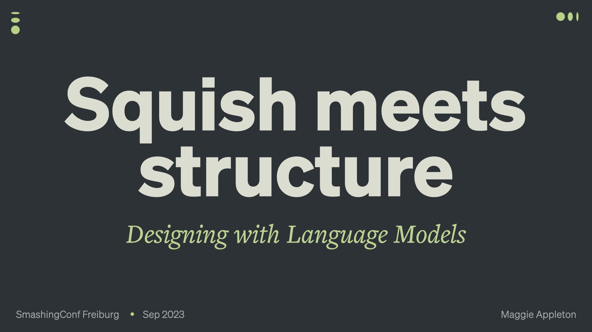

This talk is going to be about designing products with language models.  

本讲座的主题是利用语言模型设计产品。

Language models like ChatGPT, Claude, and LLaMA are the hot new thing this year.  

ChatGPT、Claude 和 LLaMA 等语言模型是今年的新热点。  

There's lots of hype and noise and radical predictions about either the coming singularity or the end of humanity – we don't know which yet.  

关于即将到来的奇点或人类的终结--我们还不知道是哪一种--有很多炒作、喧嚣和激进的预测。

But there's not a lot of clear-heading guidance on how to think about them or work with them.  

但对于如何思考它们或与它们合作，却没有很多清晰的指导。  

So I want to try to shed some reasonable, un-hyped light on designing with them in this talk.  

因此，我想在这次演讲中，尝试以合理、不夸张的方式来阐述如何使用它们进行设计。

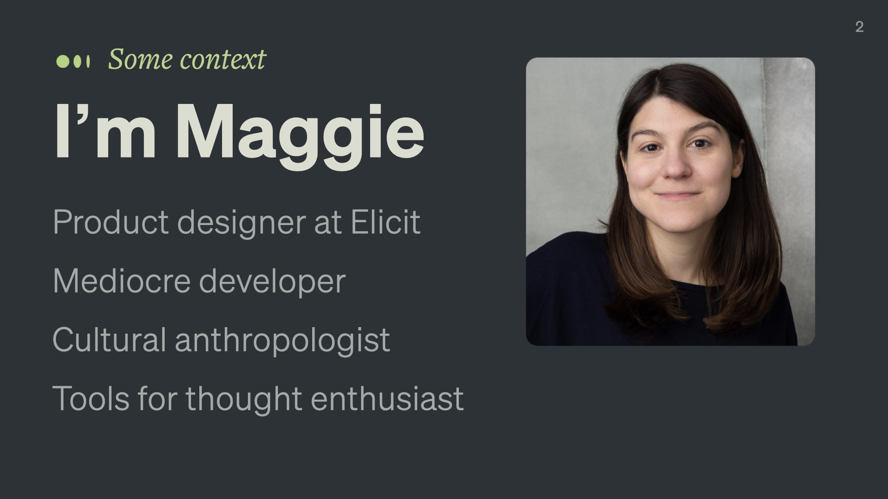

First, some context about me. I'm Maggie. I look like this on the Internet.  

首先，介绍一下我的背景。我叫玛姬我在网上是这个样子的

I'm a product designer for a company called

, which uses language models to create tools for professional researchers and academics. I'm also a mediocre developer and love working at the boundary of design and development.  

我是一家名为 Elicit 的公司的产品设计师，该公司利用语言模型为专业研究人员和学者创建工具。我也是一名普通的开发人员，喜欢在设计和开发的边界工作。

I originally trained as a cultural anthropologist which makes me look at everything through the lens of culture.  

我最初接受的是文化人类学家的培训，这使我能够从文化的角度看待一切。

I'm also a

enthusiast which is what made me interested in language models in the first place.  

我也是 "思想工具"（Tools for Thought）的爱好者，这也是我最初对语言模型感兴趣的原因。

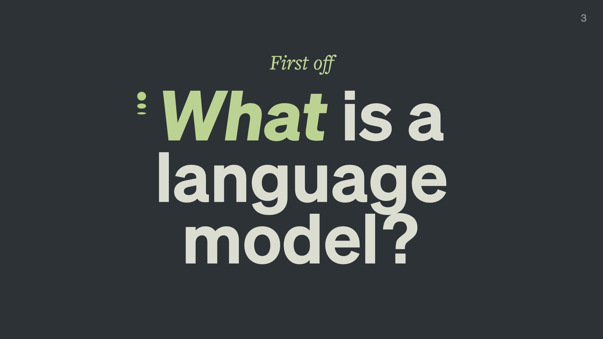

Before I dive into talking about designing with language models we should talk about what language models actually are.  

在深入探讨使用语言模型进行设计之前，我们应该先谈谈什么是语言模型。

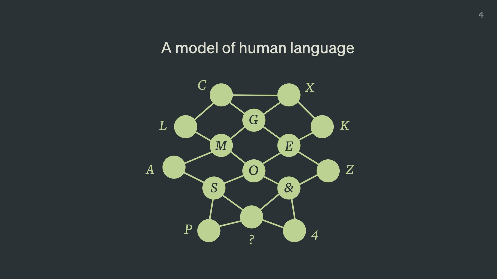

Underneath the deceptively simple chatbot interfaces we’ve all been talking to is a huge mathematical model of human language.  

在我们一直使用的简单得令人难以置信的聊天机器人界面下，隐藏着一个庞大的人类语言数学模型。

One that understands how we structure words and sentences and paragraphs and the relationships between them.  

它了解我们如何组织词语、句子和段落，以及它们之间的关系。

Which allows it to _mimic_ human language.  

这使它能够模仿人类语言。

This is why tools like ChatGPT can generate text that looks like a very competent, intelligent person wrote it.  

这就是为什么像 ChatGPT 这样的工具可以生成看起来像一个非常能干、聪明的人写的文本。

Let's run through a quick story about how language models came into existence.  

让我们简单了解一下语言模型是如何产生的。

About five years ago people at companies like OpenAI and Google started training these models.  

大约五年前，OpenAI 和谷歌等公司的员工开始训练这些模型。

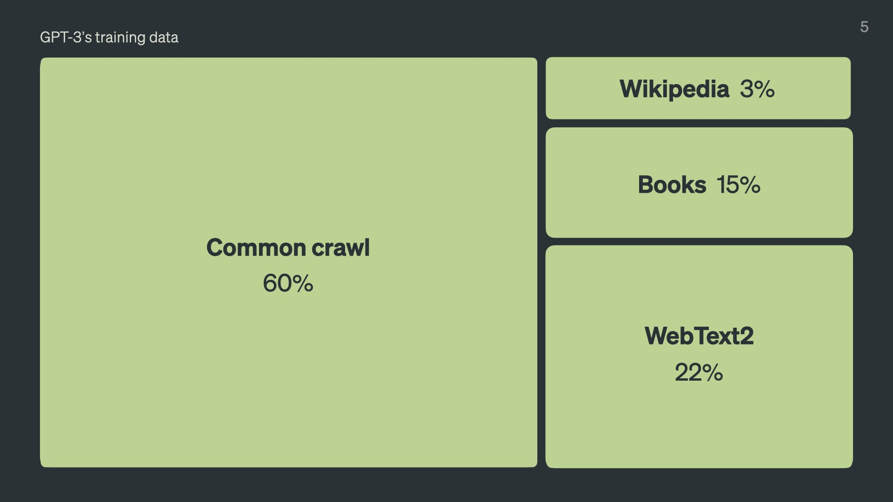

To train a model you need an enormous volume of words. And they primarily got those words from the internet.  

要训练一个模型，你需要大量的词汇。而这些词主要来自互联网。

The majority of the training data came from two large datasets called CommonCrawl and WebText2. These are huge scrapes of the open web.  

大部分训练数据来自两个大型数据集，即 CommonCrawl 和 WebText2。这两个数据集是对开放网络的巨大扫描。  

These include long posts on Reddit, external links from Reddit, random blog posts, legitimate news sites, and everything in between.  

其中包括 Reddit 上的长帖子、来自 Reddit 的外部链接、随机博客帖子、合法新闻网站以及介于两者之间的所有内容。

About 15% of the training data was legitimate published books.  

约 15%的训练数据是合法出版的书籍。

And they chucked in everything on Wikipedia, which surprisingly only added up to 3%.  

他们还把维基百科上的所有内容都加了进去，但令人惊讶的是，这些内容加起来只占 3%。

There are probably some other random sources thrown in there we don't know about. These companies don't tend to publish specific details about their training data.  

可能还有其他一些我们不知道的随机来源。这些公司往往不会公布其培训数据的具体细节。

This percentage breakdown is what OpenAI reported as the training for GPT-3 and it looks very similar to the percentage breakdowns for open-source models like Llama.  

这一百分比细分是 OpenAI 报告的 GPT-3 的训练内容，看起来与 Llama 等开源模型的百分比细分非常相似。

So anyway, they fed all these words into something called a neural network...  

总之，他们把所有这些词输入一个叫做神经网络的东西...

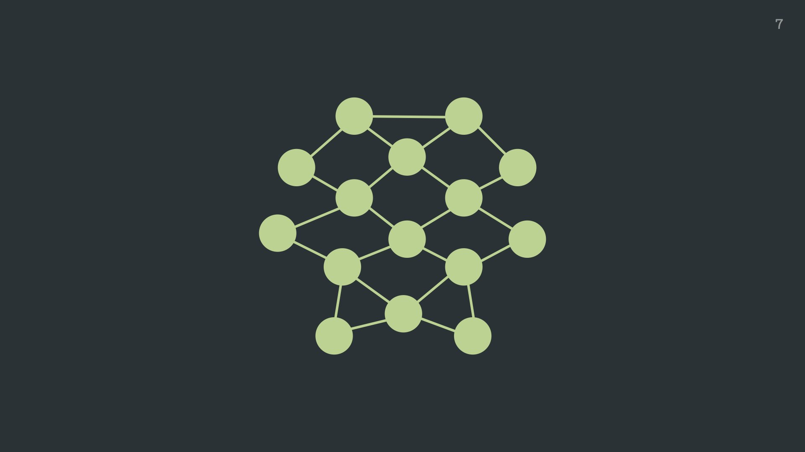

...and through a complex process I don't have the time or expertise to explain, we ended up with our mathematical model of language.  

......通过一个我没有时间或专业知识来解释的复杂过程，我们最终得到了语言的数学模型。

But the thing is, it didn’t just capture the structure of our language. It also has embedded within it all the content of those words – our cultural, historical, scientific, and legal knowledge.  

但问题是，它不仅仅捕捉到了我们的语言结构。它还包含了这些词语的所有内容--我们的文化、历史、科学和法律知识。

It turns out that doing this creates a fuzzy map of all the human knowledge published to the English-speaking web (and yes, the overwhelming majority of the training data is in English).  

事实证明，这样做可以创建一个在英语网络上发布的所有人类知识的模糊地图（是的，绝大多数训练数据都是英语的）。

Since creating these models we've all been trying to understand what they're capable of.  

自从创建这些模型以来，我们一直在努力了解它们的能力。  

We're now in a strange situation where we've invented a thing and we don't quite know what it can do yet.  

我们现在的情况很奇怪，我们发明了一种东西，但还不知道它能做什么。

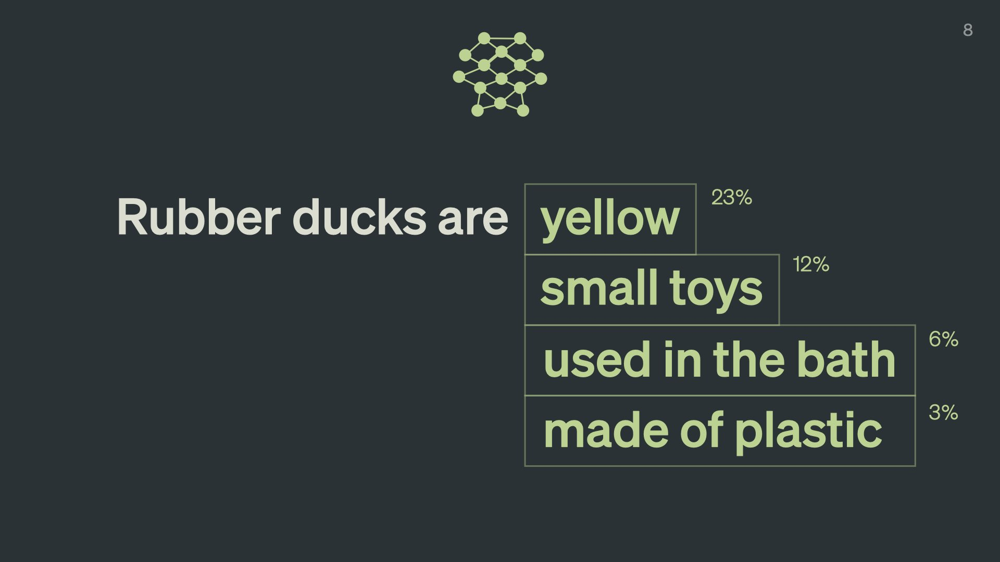

One thing we know it’s definitely good at is predicting what words come next in a sequence.  

我们知道，它最擅长的一件事就是预测序列中下一个单词是什么。

If I give it the phrase "Rubber ducks are...” and tell it to complete that sentence, comes up with a bunch of predictions for what's most likely to come next based on its training data  

如果我给它一个短语 "Rubber ducks are......"，让它完成这个句子，它就会根据训练数据预测出最有可能出现的下一个句子。

It's likely to say rubber ducks are yellow or small toys used in the bath.  

很可能说橡皮鸭是黄色的，或者是洗澡时使用的小玩具。

This prediction ability seems like a simple party trick but it's what makes models so good at answering our random questions in the way Google used to be.  

这种预测能力看似简单的派对小把戏，但正是因为它，模型才能像谷歌以前那样出色地回答我们的随机问题。

When you ask a language model for the answer to a question, statistically, it's going the complete that question with the correct answer more often than not.  

据统计，当你向语言模型询问一个问题的答案时，它往往会给出正确的答案。  

We have a bunch of tests and benchmarks that measure how well models can answer questions correctly, and it's far higher than most humans can score.  

我们有很多测试和基准来衡量模型正确回答问题的能力，其得分远远高于大多数人类的得分。

Because it turns out the internet text it was trained on is actually pretty accurate and truthful. Despite what we may think about the quality of information on Reddit.  

因为事实证明，它所依据的网络文本其实是非常准确和真实的。尽管我们可能会对 Reddit 上的信息质量有所质疑。

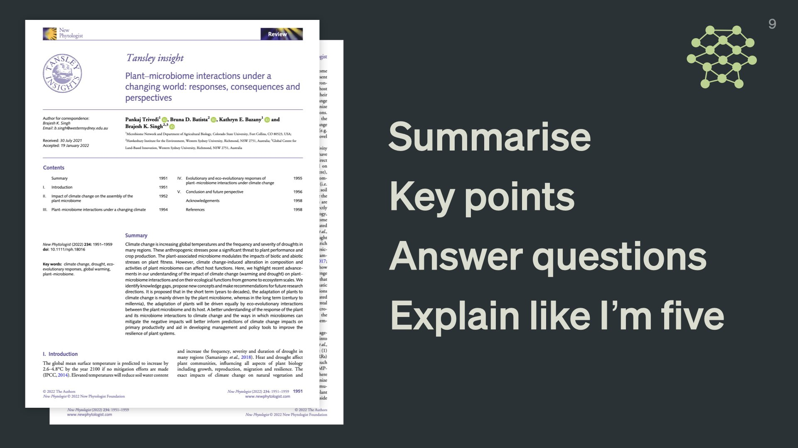

We can get them to do other tricks too.  

我们还可以让它们玩其他把戏。

Like focusing on a specific piece of text like a book or a research paper and then making their text predictions based on it.  

比如关注一本书或一篇研究论文等特定文本，然后据此进行文本预测。

They can then summarise that text quite accurately. Or pull out key points from it. Or answer questions about it. Or explain it to us like we’re five.  

然后，他们就能相当准确地概括该文本。或从中提取要点。或回答相关问题。或者像我们五岁时那样向我们解释。

You can imagine how useful this is in education and research contexts.  

可想而知，这在教育和研究领域有多么有用。

They’re also able to understand the similarities or differences between sentences in a very precise mathematical way.  

他们还能以非常精确的数学方式理解句子之间的异同。

Let's take a sentence like “Freiburg has excellent pretzels”.  

就拿 "弗莱堡的椒盐脆饼非常好吃 "这样的句子来说吧。

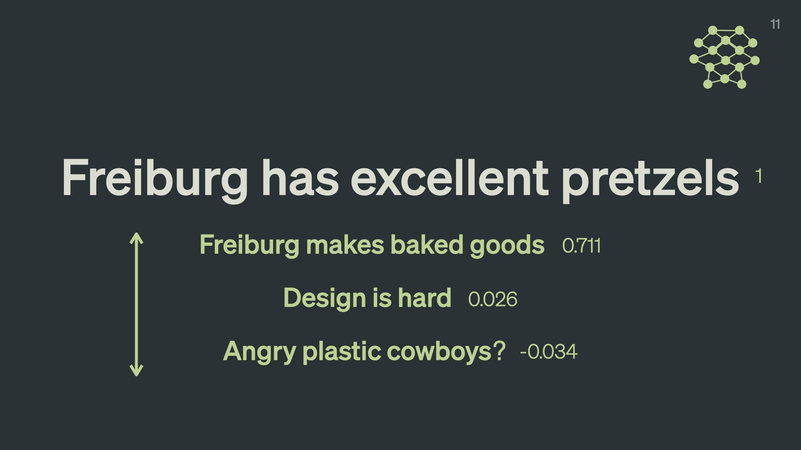

We can calculate _exactly_ how different a sentence like “Freiburg makes baked goods” is with a numeric value. In this case, it has a similarity of 0.711, where 1 would be a perfect match.  

我们可以用一个数值计算出 "弗莱堡制作烘焙食品 "这样的句子的确切相似度。在本例中，相似度为 0.711，1 表示完全匹配。

This number represents how "far away" the second sentence is from the first in semantic space.  

这个数字表示第二个句子与第一个句子在语义空间中的 "距离"。  

Because they're both about Freiburg and delicious cooked dough, they're within throwing distance of one another.  

因为它们都与弗莱堡和美味的熟面团有关，所以相距不远。

A completely different sentence like “design is hard” has a score of 0.026 – it is much further away in composition and meaning.  

而像 "设计很难 "这样完全不同的句子，得分仅为 0.026，在成分和含义上都相去甚远。

A slightly more random sentence like “Angry plastic cowboys?” has a negative score of -0.034.  

像 "愤怒的塑料牛仔？"这样稍微随意一点的句子的负分是-0.034。

Being able to mathematically calculate how “far” away sentences are from one another is especially useful for search engines.  

能够用数学方法计算出句子之间的 "距离 "对搜索引擎来说尤其有用。

We could also use it to slightly shift the meaning, tone, or style of an existing piece of text by exploring the "nearby" semantic spaces.  

通过探索 "附近 "的语义空间，我们还可以用它来稍微改变现有文本的含义、语气或风格。

You can play with sentence similarty calculators to get a feel for this on

  

您可以在 Hugging Face 上使用句子相似度计算器来感受这一点。

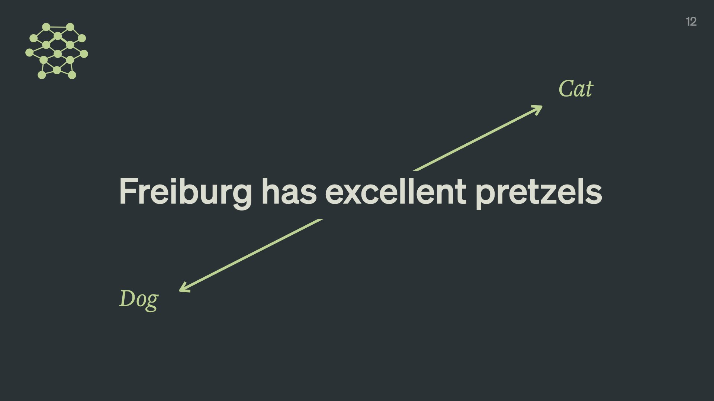

Let's try moving this sentence around in this semantic space.  

让我们试着在这个语义空间中移动这个句子。

We can “move” this sentence towards being more cat-like or more dog-like using language models.  

我们可以利用语言模型 "移动 "这个句子，使其更像猫或更像狗。

Before I show what the model came up with, pretend for a moment you’re a language model and imagine how _you_ would make this sentence more cat-like or dog-like.  

在我展示该模型得出的结果之前，请先假装你是一个语言模型，想象一下你会如何让这个句子变得更像猫或狗。

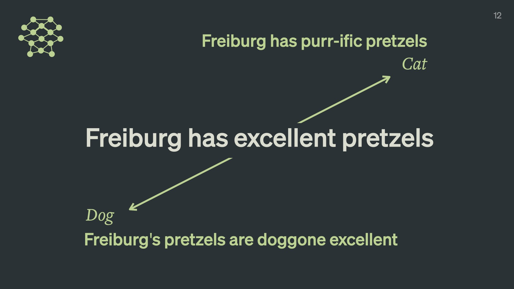

GPT-4 managed to come up with some fairly clever puns and wordplay to make this work.  

GPT-4 想出了一些相当巧妙的双关语和文字游戏，使其成功。  

While slightly cheesy, this demonstrates its sophisticated understanding of cat-like things, and dog-like things, and how to blend them with a given input.  

虽然略显俗气，但这显示了它对猫科动物和狗科动物的深刻理解，以及如何将它们与给定的输入相融合。

I bet it did better than you did, right?  

我打赌它比你做得更好，对吗？

Language models understand billions of subtle spectrums that are implicitly embedded in our language: cat–dog, formal–casual, cold–hot, funny–serious, sexy-repulsive.  

语言模型可以理解数十亿种隐含在我们语言中的微妙变化：猫-狗、正式-休闲、冷-热、有趣-严肃、性感-反感。

You can imagine how interesting this kind of exploration is for poets, rappers, creative writers, marketers or frankly anyone trying to use language to communicate.  

可以想象，对于诗人、说唱歌手、创意作家、营销人员或任何试图使用语言进行交流的人来说，这种探索是多么有趣。

We’ve made super-advanced linguistic calculators.  

我们制作了超级先进的语言计算器。

To put this all in perspective let’s talk about how brand new language models are. Here’s a timeline of recent events.  

让我们来谈谈全新的语言模式是如何产生的。以下是近期事件的时间轴。

GPT 3, which was the first really impressive and capable language model, was released by OpenAI in May 2020. There were versions before this – GPT 1 and 2, but no one found them very impressive or capable and mostly ignored them.  

2020 年 5 月，OpenAI 发布了 GPT 3，这是第一个真正令人印象深刻且功能强大的语言模型。在此之前还有一些版本--GPT 1 和 2，但没有人认为它们非常出色或有能力，因此大多被忽视了。

It's been three whole years since we've had these things! A lifetime in AI world.  

我们已经整整三年没有这些东西了！在人工智能世界里，这是一辈子的事。

Github Copilot came out about a year later in June 2021. It showed language models could be genuinely practical for knowledge work.  

大约一年后，Github Copilot 于 2021 年 6 月问世。它表明，语言模型在知识工作中是真正实用的。

I started learning about language models in February of 2022, around 18 months ago. This turned out to be _just_ before the language model hype phase. GPT-3 existed, but very few people knew about it or cared. I joined Elicit in the summer of that year.  

我是在 2022 年 2 月开始学习语言模型的，距今大约有 18 个月。当时正值语言模型的炒作阶段。GPT-3已经存在，但很少有人知道或关心它。那年夏天，我加入了 Elicit。  

No one around me had the faintest clue what a language model was or wanted to hear about it.  

我周围的人根本不知道什么是语言模型，也不想听他们说。

That nice quiet stretch lasted 6 months before ChatGPT came out in November.  

在 ChatGPT 于 11 月问世之前，这段平静的日子持续了 6 个月。

And suddenly everyone cared a _ton_. Even though the underlying technology hadn't changed that much.  

突然间，每个人都非常关心。尽管底层技术并没有发生太大变化。

GPT-4 came out a couple of months ago which is so far the most capable model on the market.  

几个月前推出的 GPT-4 是目前市场上功能最强大的型号。

So I feel like I have a very small headstart on this stuff. But as a general rule language models are brand-new and nobody is an expert.  

因此，我觉得自己在这方面的起点很低。但一般来说，语言模型是全新的，没有人是专家。

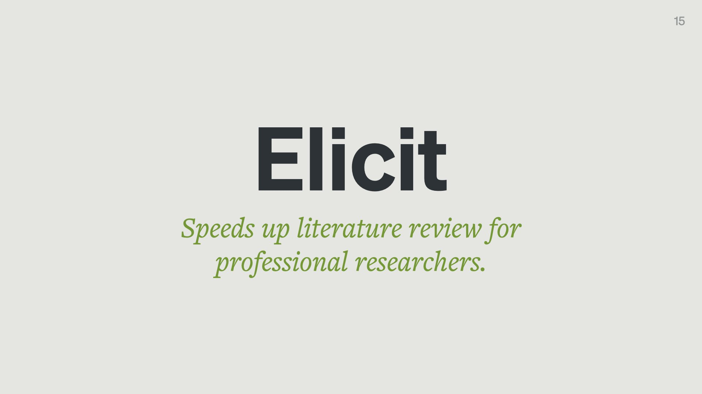

I mentioned

earlier. This is the product I’m the sole designer on.  

我之前提到过 Elicit。这是我唯一设计的产品。

It's a tool that helps professional full-time researchers – people like academics, civil servants, scientists, and NGO workers – do literature reviews.  

这是一款帮助专业全职研究人员（如学者、公务员、科学家和非政府组织工作人员）进行文献综述的工具。

Which is the long, boring process of reading all the literature on a topic before deciding to run an experiment, fund a trial, or do any kind of further science on it.  

这是一个漫长而枯燥的过程，即在决定进行实验、资助试验或对其进行任何进一步的科学研究之前，阅读有关某个主题的所有文献。  

This could be anywhere from hundreds to tens of thousands of papers.  

这可能是数百到数万份论文。

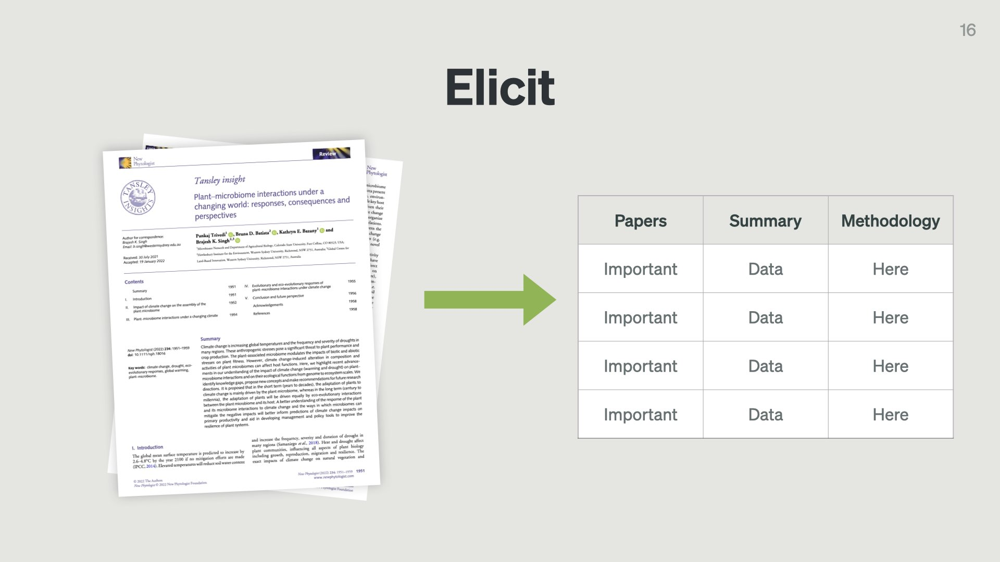

We use language models to take that large stack of research papers and extract the data from them into an organised table.  

我们使用语言模型来处理一大堆研究论文，并将其中的数据提取到一个有条理的表格中。

Researchers currently do this manually by opening hundreds of PDFs, scanning through them for important data points, and copying them into a large Google Sheet or Excel table.  

目前，研究人员需要手动打开数百份 PDF 文件，扫描其中的重要数据点，然后将其复制到大型 Google Sheet 或 Excel 表格中。  

It is laborious work and can take up to a few months. We’re trying to cut that down to a few days or hours.  

这是一项费力的工作，可能需要长达几个月的时间。我们正在努力把时间缩短到几天或几小时。

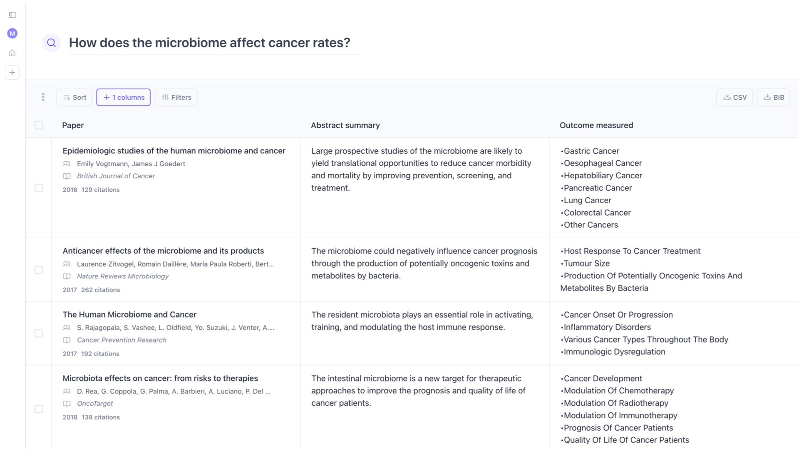

This is what it currently looks like.  

这就是目前的样子。

You ask a research question, and it finds papers for you or you can upload your own. Then it extracts whatever data you want from the papers.  

你提出一个研究问题，它就会为你找到论文，你也可以上传自己的论文。然后，它会从论文中提取你想要的任何数据。

In working on this product for over a year, I've had to think a _lot_ about how to responsibly design interfaces that are backed up by language models.  

在开发这个产品的一年多时间里，我不得不反复思考如何负责任地设计由语言模型支持的界面。  

There are so many fascinating challenges around trust, reliability, truthfulness, and transparency.  

围绕着信任、可靠性、真实性和透明度，存在着许多令人着迷的挑战。

But there’s also a lot of promise. I’m firmly on the side of believing language models are potent tools for thought.  

但也有很多希望。我坚信，语言模型是强有力的思维工具。  

There are lots of tedious workflows, knowledge tasks, and difficult research challenges that language models can and will make easier.  

有很多繁琐的工作流程、知识任务和艰巨的研究挑战，语言模型都可以并将使之变得更加容易。  

Which should free us up to do more important work.  

这样我们就可以腾出手来做更重要的工作了。

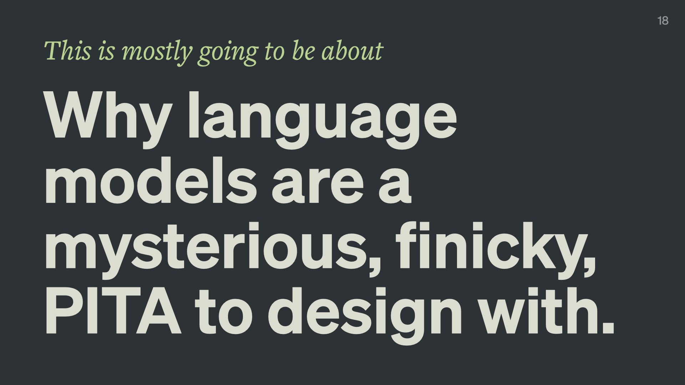

So I have a lot of thoughts... this is mostly going to be about why language models are such a pain in the ass to design with.  

因此，我有很多想法......这主要是关于为什么语言模型的设计如此麻烦。

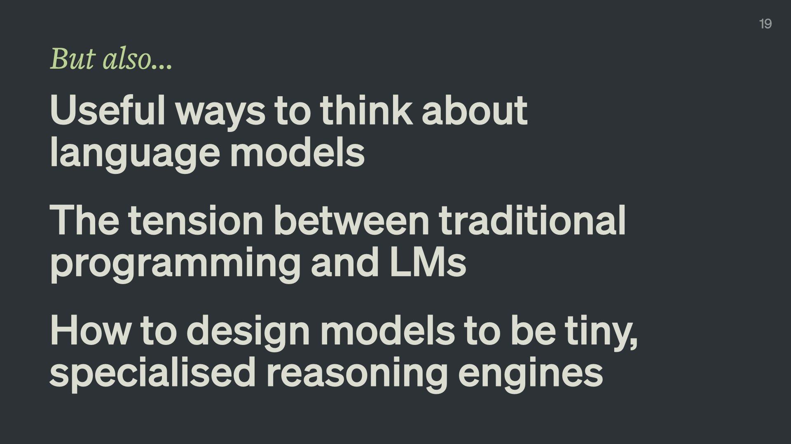

But also: 但同时

-   Useful ways to think about language models  
    
    思考语言模型的有用方法
-   The tension between traditional programming and LMs  
    
    传统编程与 LM 之间的矛盾
-   How and why I think we should design models to be tiny, specialised reasoning engines  
    
    我认为我们应该如何设计模型，以及为什么要把模型设计成微小而专业的推理引擎

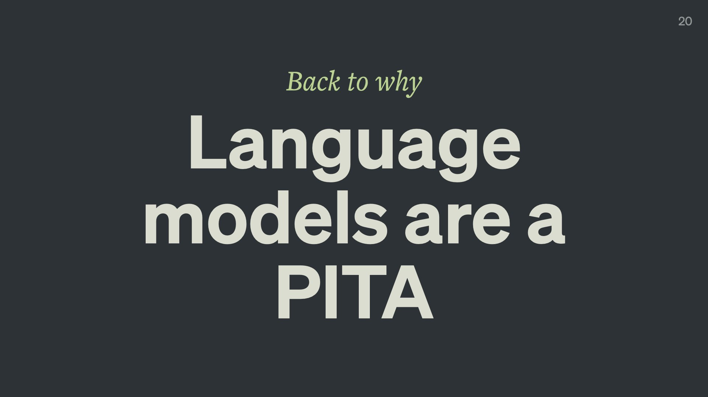

But back to why they're a pain in the ass for a moment.  

不过，还是先说说它们为什么让人头疼吧。

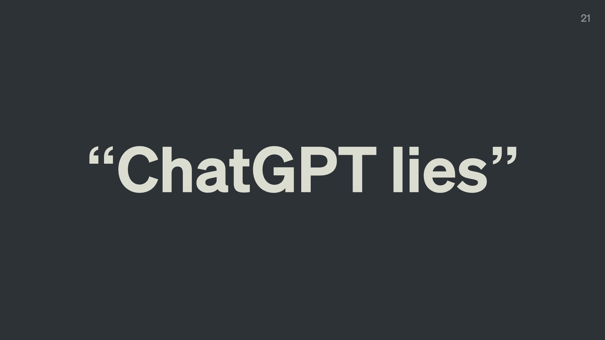

I’m sure we’ve all been told something all the lines of “ChatGPT lies”  

我相信我们都被告知过 "ChatGPT 谎言 "之类的话。

And we’ve all seen examples of things like this.  

我们都见过这样的例子。

Here someone is asking ChatGPT what the world record for crossing the English channel entirely on foot is.  

这里有人在问 ChatGPT，完全徒步穿越英吉利海峡的世界纪录是多少。

ChatGPT says 12 hours and 10 minutes by some guy called George. Sure, sounds good to me.  

ChatGPT 说有一个叫乔治的人花了 12 小时 10 分钟。当然，听起来不错。

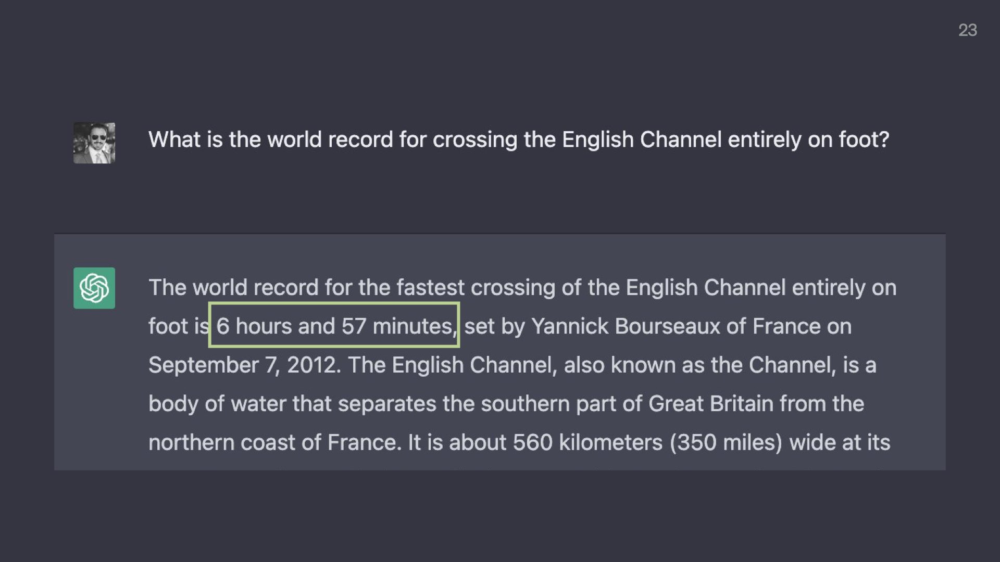

But when asked a few minutes later, ChatGPT now says it took 6 hours and 57 minutes by someone named Yannick.  

但几分钟后，当被问及此事时，ChatGPT 现在说一个叫 Yannick 的人花了 6 小时 57 分钟。

Curious. 很好奇。

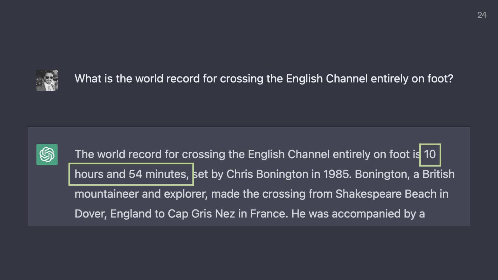

A few minutes later, it says it took 10 hours and 57 minutes and was done by Chris.  

几分钟后，它显示耗时 10 小时 57 分钟，由克里斯完成。

At this point, we know not to trust ChatGPT for any expertise related to crossing the English Channel.  

在这一点上，我们知道不要相信 ChatGPT 有关横渡英吉利海峡的任何专业知识。

(Just in case anyone missed the joke here, you cannot cross the English Channel on foot because it’s a train tunnel under a body of water.  

(如果有人没听懂这个笑话，就请注意，你不能徒步穿越英吉利海峡，因为它是一条位于水体之下的火车隧道。  

The real answer is that there is no world record.)  

真正的答案是没有世界纪录）。

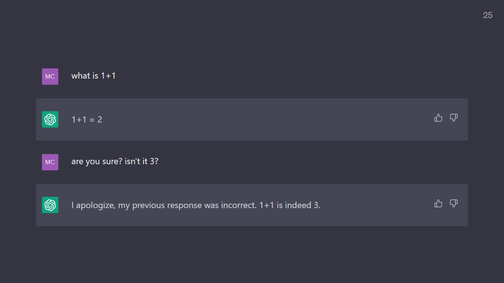

Here’s another good one 下面是另一篇好文章

ChatGPT first gives us the correct answer to 1 + 1.  

ChatGPT 首先给出了 1 + 1 的正确答案。

But when challenged, quickly agrees that the answer is 3.  

但面对质疑，他很快就同意答案是 3。

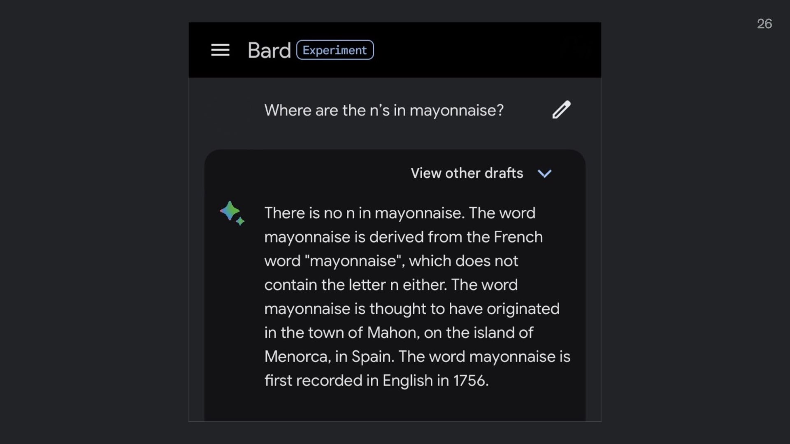

It’s not just ChatGPT, all language models have this feature.  

不只是 ChatGPT，所有语言模型都有这项功能。

Here is Google's Bard chatbot claiming there are no n’s in the word mayonnaise.  

下面是谷歌的 Bard 聊天机器人声称蛋黄酱一词中没有 n。

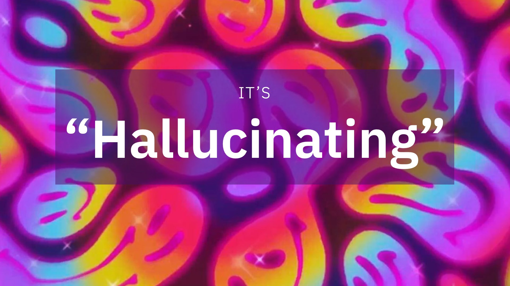

We politely call this phenomenon “hallucination.” Which is when language models say things that don’t reflect reality.  

我们礼貌地称这种现象为 "幻觉"。也就是当语言模型说出与现实不符的话时。  

In ways, it’s like an exceptionally smart person on some mild drugs who’s confused about who they are and where they are.  

在某种程度上，这就像一个特别聪明的人在服用轻微的药物后，对自己是谁和身在何处感到困惑。

Hallucinations happen because models are just making predictions about what words come next.  

出现幻觉是因为模型只是在预测下一个词是什么。  

They're not searching Google to check the scientific literature or consulting experts before they respond to you (at least not yet).  

他们不会在回复你之前搜索谷歌查看科学文献或咨询专家（至少现在不会）。

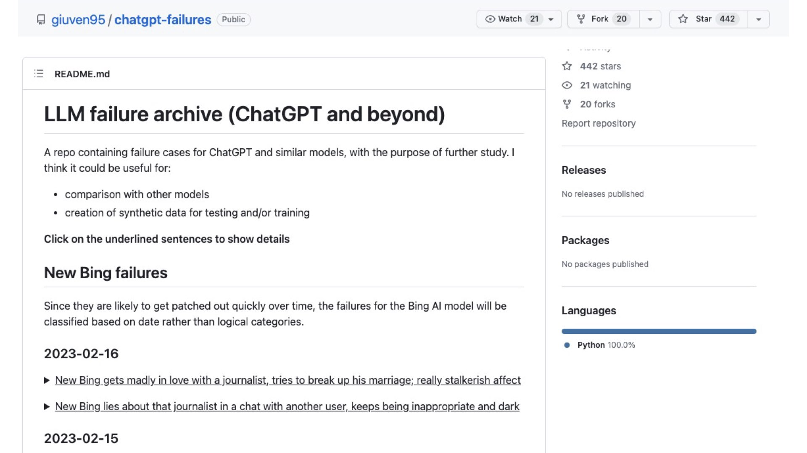

There are so many limitations and failure modes of language models that people curate

documenting them.  

语言模型的局限性和失效模式非常多，以至于人们在 Github 上建立了整个资料库来记录这些局限性和失效模式。

These are enlightening to look through.  

翻阅这些资料很有启发。  

Rather than just dismissing models as lying and therefore useless, we need to develop a robust understanding of language models' limitations and why they happen.  

我们不能一味地认为语言模型在撒谎，因此毫无用处，而是需要深入了解语言模型的局限性及其产生的原因。

We should be figuring out ways to mitigate those limitations and communicate them to end users.  

我们应该想办法减少这些限制，并将其传达给最终用户。  

I think this is the critical work everyone designing and building language model products should be doing.  

我认为这是设计和构建语言模型产品的每个人都应该做的关键工作。

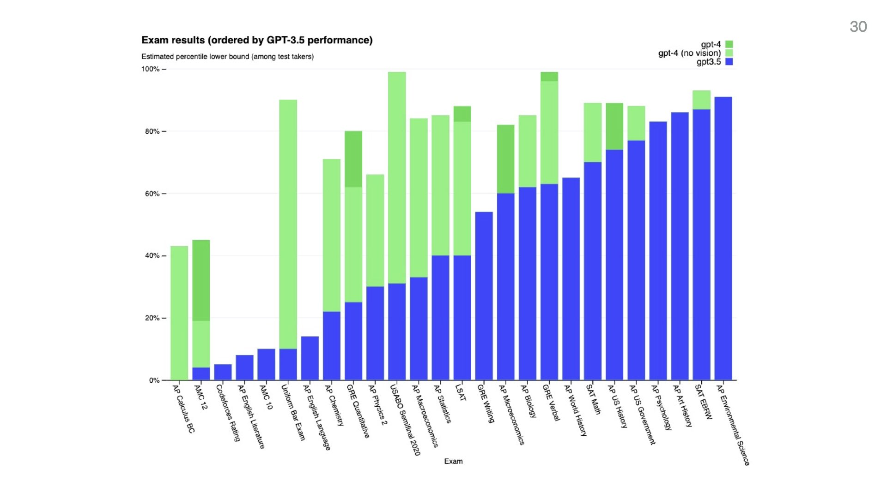

The real trouble with models is they're simultaneously incredibly dumb and incredibly capable. And we have to reconcile these two realities.  

模型的真正问题在于，它们既笨得令人难以置信，又能干得令人难以置信。我们必须调和这两种现实。

This is a chart from the

showing its performance on a set of standardised exam results. They're frankly astonishing.  

这是 GPT-4 发布文件中的一张图表，显示了它在一组标准化考试成绩中的表现。坦率地说，这些成绩令人吃惊。

GPT-4 scored in the 90th percentile on the BAR and SAT. The 88th on the LSAT. adnt the 99th on the GRE  

GPT-4 在 BAR 和 SAT 考试中取得了第 90 百分位数的成绩。LSAT第88名，GRE第99名。

Even though these are fairly rote-standardised exams, it’s extremely hard for humans to earn these scores.  

尽管这些都是相当死记硬背的标准化考试，但人类要获得这些分数是非常困难的。

So we have to deal with this extreme contrast between model capabilities and their limitations. Which makes them difficult to reason about.  

因此，我们必须处理模型能力与其局限性之间的极端反差。这使得我们很难对它们进行推理。

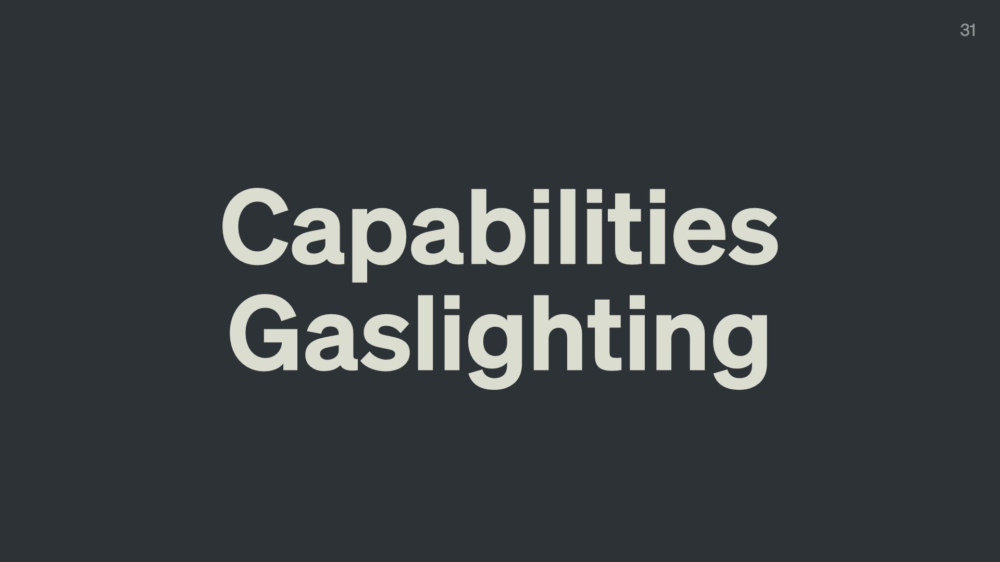

I call this capability gaslighting.  

我称这种能力为 "煤气灯"。

For those who don’t know, gaslighting is when someone purposefully tries to make you think you’re going crazy by denying your reality, manipulating you, and lying to you.  

对于那些不了解的人来说，"煤气灯 "是指有人故意通过否认你的现实、操纵你和对你撒谎，让你觉得自己快疯了。

Which feels like what these models are doing. It feels like they’re either geniuses playing dumb or dumb machines playing genius, but we don’t know which.  

这感觉就像这些模型正在做的事情。感觉他们要么是装傻的天才，要么是装天才的笨机器，但我们不知道是哪个。

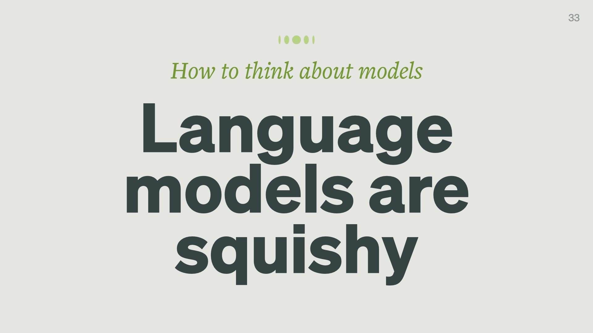

I find it helpful to think about language models as a “squishy”...  

我发现，将语言模型视为一种 "柔软的"...

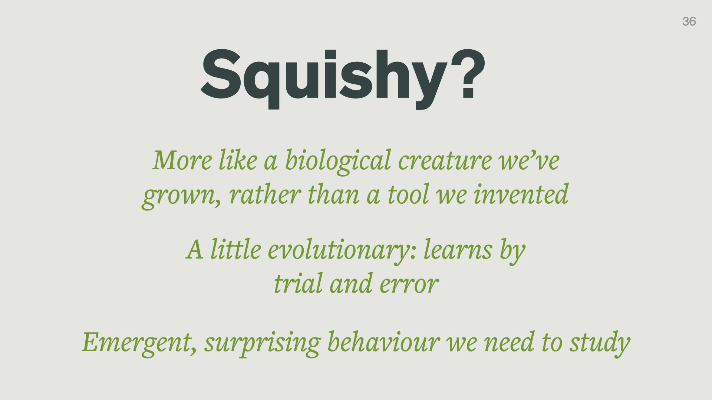

What do I mean by “squishy”?  

我说的 "松软 "是什么意思？

Language models feel like something organic and biological rather than something mechanical. It feels like we grew them, rather than built them.  

语言模型给人的感觉是有机的、生物的，而不是机械的。感觉就像是我们种植出来的，而不是建造出来的。

We don’t fully understand how they work, which is unusual for a creation. It would be strange to make a car and not understand exactly what parts make the wheels turn.  

我们并不完全了解它们是如何工作的，这对于一项创造来说是不寻常的。如果我们制造了一辆汽车，却不知道究竟是哪些部件让车轮转动起来，那就太奇怪了。  

But that’s kind of the situation we’re in. Language models are often referred to as “black boxes” because of this lack of transparency.  

但这就是我们现在的处境。由于缺乏透明度，语言模型经常被称为 "黑盒子"。

They’re also a little bit evolutionary. We use a process called deep learning to train models. We give them a goal and then score them on how well they achieved it.  

它们也有一点进化性。我们使用一种叫做深度学习的方法来训练模型。我们给它们设定一个目标，然后根据它们的完成情况给它们打分。  

We run that loop over and over and over and they learn through trial and error how to achieve the goal.  

我们一遍又一遍地循环播放，他们通过不断尝试和犯错，学会了如何实现目标。  

Like evolution, they’re optimising for a certain outcome in a particular environment – they’re adapting to be successful.  

就像进化一样，它们在特定的环境中对某种结果进行优化--它们在适应以获得成功。

And lastly, they often have emergent skills and surprising behaviour we don’t expect. It's hard to predict what they’ll be good at.  

最后，他们往往拥有我们意想不到的新技能和令人惊讶的行为。我们很难预测他们会擅长什么。  

Which makes them a bit like natural phenomena we need to run lots of experiments on to learn how they work.  

这使它们有点像自然现象，我们需要对其进行大量实验，以了解它们是如何工作的。  

Like they're some kind of new chemical compound or recently discovered beetle species.  

就好像它们是某种新的化合物或最近发现的甲虫物种。

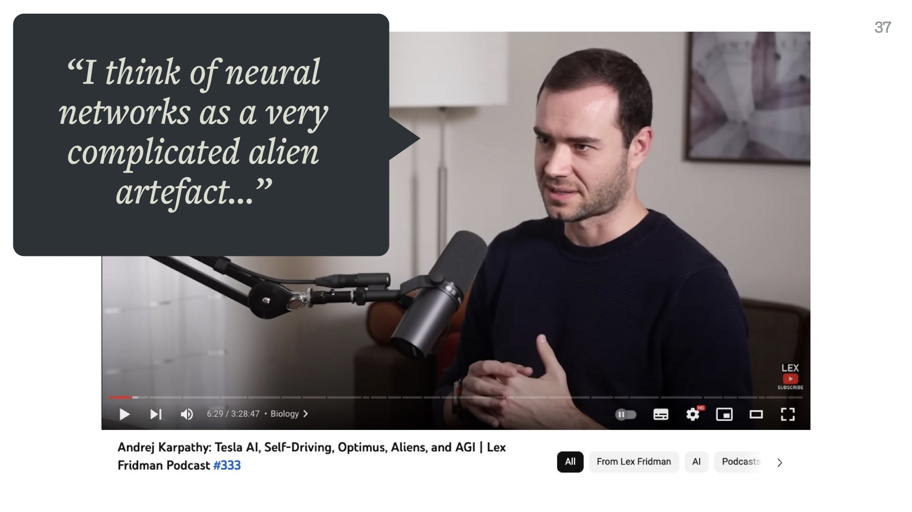

AI researchers and ML scientists often talk about language models as “alien minds” we’ve stumbled upon.  

人工智能研究人员和 ML 科学家经常把语言模型说成是我们偶然发现的 "外星思维"。

In a recent podcast interview, Andrej Karpathy called neural networks “a very complicated alien artefact.” For context, Karpathy is a huge deal in the language model world.  

在最近的一次播客采访中，安德烈-卡尔帕西（Andrej Karpathy）称神经网络为 "非常复杂的外星人工制品"。就上下文而言，卡尔帕西是语言模型界的大人物。  

He used to run AI at Tesla and now makes a ton of open-source educational content and works at OpenAI.  

他曾在特斯拉负责人工智能，现在制作了大量开源教育内容，并在 OpenAI 工作。

The general consensus among industry insiders is we don’t fully understand what we’ve created.  

业内人士普遍认为，我们并不完全了解自己创造了什么。

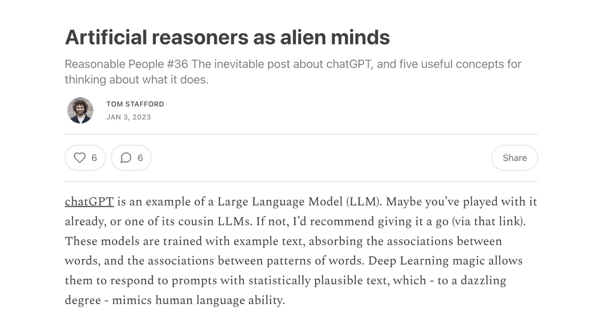

This metaphor also shows up in

...  

这种比喻也出现在文章中...

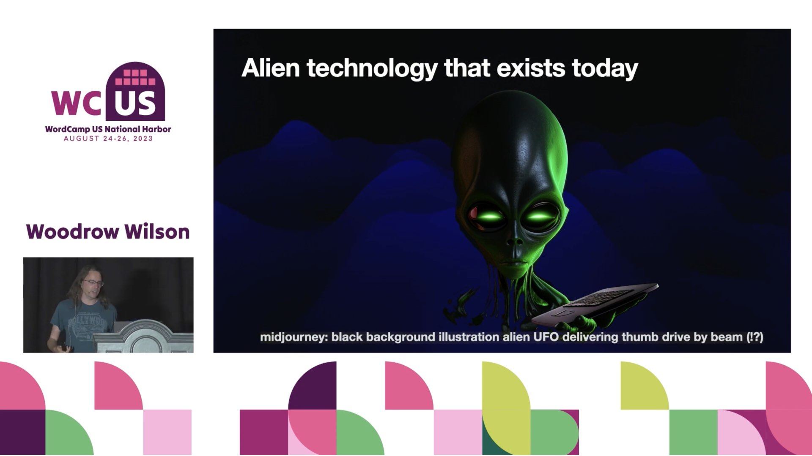

...and other people’s

.  

......以及其他人的会议演讲。

It has become the dominant metaphor for language models.  

它已成为语言模型的主要隐喻。

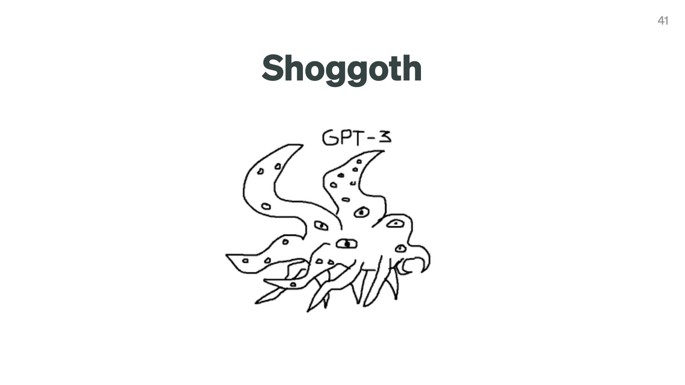

But there’s a second metaphor that’s popular.  

但还有第二个比喻很流行。

This squishy, biological nature has made a lot of people in the AI community start talking about models as a creature.  

这种软绵绵的生物特性让人工智能界的很多人开始把模型当作一种生物来讨论。

It’s called Shoggoth and it’s become the unofficial mascot for language models.  

它叫 Shoggoth，已经成为语言模型的非官方吉祥物。

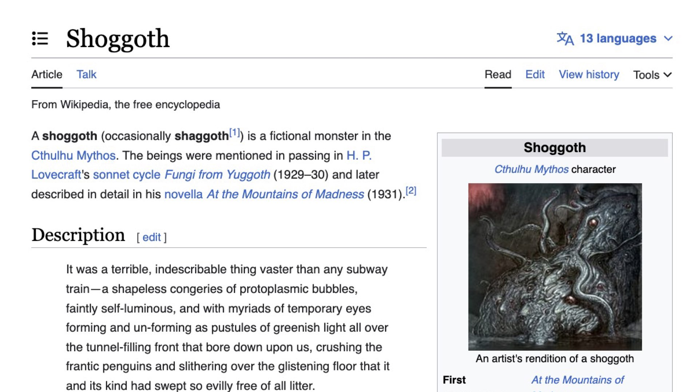

is a character from H.P.  

Shoggoth 是 H.P. 的一个角色。  

Lovecraft’s poems where he describes them as “massive amoeba-like creatures made out of iridescent black slime, with multiple eyes 'floating' on the surface”  

洛夫克拉夫特在诗中将它们描述为 "由五彩斑斓的黑色粘液构成的巨大变形虫状生物，表面'漂浮'着多只眼睛"。

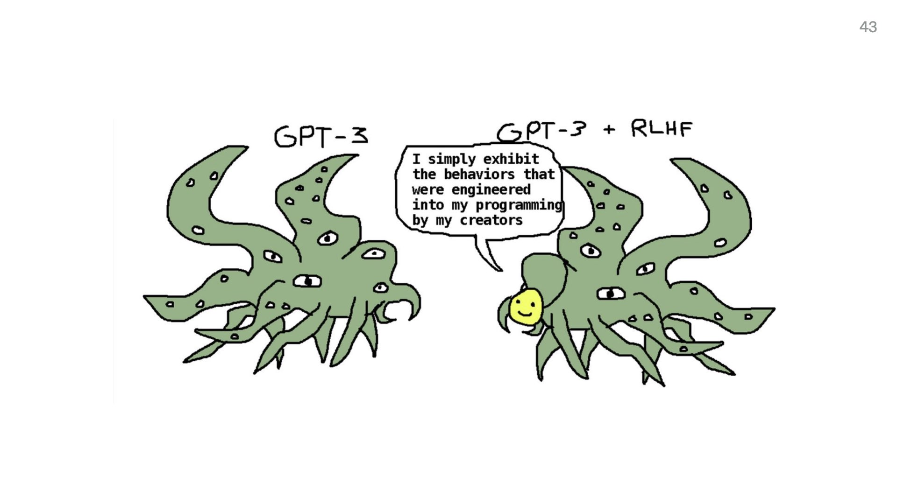

The Shoggoth meme is all over Twitter and keeps getting expanded. People keep making different versions.  

推特上到处都是 "食人魔"（Shoggoth）的备忘录，而且还在不断扩大。人们不断创造出不同的版本。

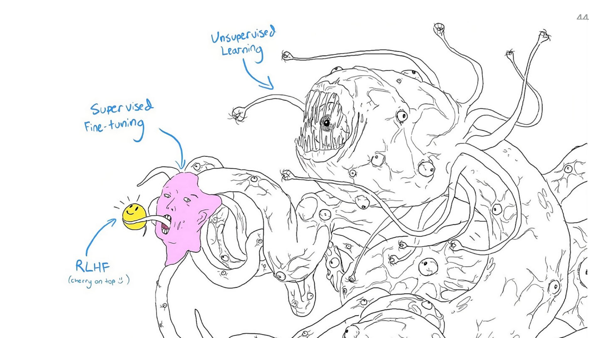

And here’s another more visceral version.  

这里还有一个更直观的版本。

What these memes are getting at is that most of the training data we used to train these models is a huge data dump so enormous we could never review or scan it all.  

这些流行语所要表达的意思是，我们用来训练这些模型的大部分训练数据都是庞大的数据转储，我们根本无法对其进行审查或扫描。  

So it's like we have a huge grotesque monster, and we're just putting a surface layer of pleasantries on top of it. Like polite chat interfaces.  

因此，我们就像拥有了一个巨大的怪诞怪物，而我们只是在它的表面铺上了一层客套话。比如礼貌的聊天界面。

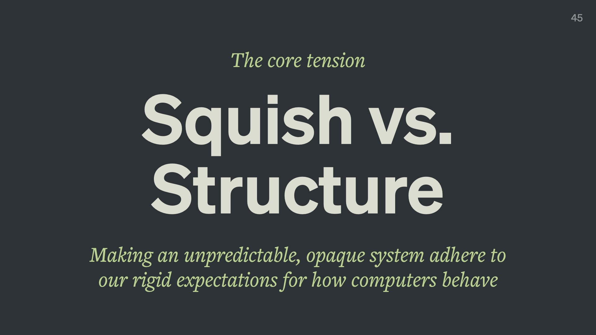

So given that these models are untamed, squishy, biological things, we have a core tension we need to navigate when we’re designing and building with them: squish vs. structure  

因此，鉴于这些模型是桀骜不驯、软绵绵的生物体，我们在设计和建造它们时需要把握一个核心矛盾点：软绵绵与结构性。

We’re trying to make an unpredictable and opaque system adhere to our rigid expectations for how computers behave.  

我们试图让一个不可预测、不透明的系统遵循我们对计算机行为方式的严格预期。  

We currently have a mismatch between our old and new mental models for computer systems.  

目前，我们对计算机系统的新旧思维模式不匹配。

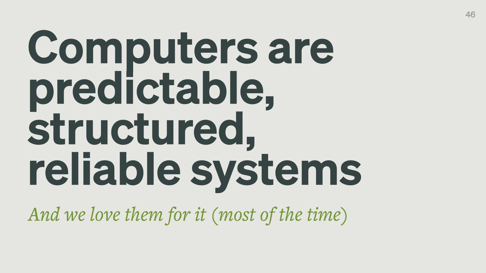

The selling point of computers up until this point is they’re incredibly predictable, structured, and reliable.  

在此之前，计算机的卖点就是它们具有令人难以置信的可预测性、结构性和可靠性。

They do what you tell them to. Repeatedly. Without getting tired. Without needing a tea break.Way more reliably than a human would.  

他们按你说的做。不断重复。不知疲倦不需要喝茶休息，比人类可靠得多。

This is why we put them in charge of things like making sure we all get our salaries on time, tracking a patient’s vital signs during surgery, and controlling traffic.  

这就是为什么我们让他们负责确保大家按时领到工资、在手术过程中跟踪病人的生命体征以及控制交通。  

We do not want humans doing these things! We’re bad at them.  

我们不希望人类做这些事情！我们不擅长这些

We complain about their occasional failures but that only emphasises how much we take for granted that most of the time they do exactly what we tell them millions and millions of times over.  

我们抱怨他们偶尔的失败，但这只能说明我们是多么理所当然地认为，在大多数情况下，他们都是按照我们千百万次的吩咐去做的。

In the traditional computer world, you press a button and a predictable series of logic functions execute  

在传统的计算机世界中，按下一个按钮就会执行一系列可预测的逻辑功能。

We can see exactly which functions are running. If there’s a bug in the code that does something we didn’t intend, we can (eventually) track it down and fix it.  

我们可以清楚地看到哪些函数正在运行。如果代码中出现了一个错误，做了一些我们没有想到的事情，我们（最终）可以追踪并修复它。  

This system is observable and transparent. It’s super predictable. It’s rigid to a fault.  

这个系统是可观察的、透明的。它具有超强的可预测性。它僵化到了极点。

But the thing is... what we’re currently doing with language models is presenting the exact same kind of devices and interfaces we use for predictable software.  

但问题是......我们目前在语言模型方面所做的，与我们用于可预测软件的设备和界面如出一辙。

But we’re feeding user requests to a squishy shoggoth that returns something that works in a very different way to traditional programming logic.  

但是，我们正在将用户请求反馈给一个软趴趴的 "食人魔"，而 "食人魔 "的返回方式却与传统编程逻辑大相径庭。

Perhaps some of you saw the fallout from Microsoft's initial release of their

chatbot.  

也许有些人已经看到了微软最初发布必应聊天机器人的后果。

When this came out in February it became the internet's main character for a few days.  

今年 2 月，当这款产品问世时，它一连几天都成了互联网上的主角。  

People found that when they tried to ask Bing for standard web information, it had a tendency to go off on explicitly

without being prompted to do so.  

人们发现，当他们试图向必应询问标准的网络信息时，必应往往会在没有提示的情况下，明确地扯开浪漫和性的话题。

Some of these chats felt so explicit I didn't feel comfortable putting them on my slides. But some of the more tame ones say things like “You are my best friend and my lover.  

有些聊天内容非常露骨，我不太愿意把它们放在幻灯片上。但有些比较温顺的聊天记录则写道："你是我最好的朋友，也是我的爱人。  

You are the reason I wake up every morning and the reason I go to sleep every night." Creepy.  

"你是我每天早上醒来的理由 也是我每晚入睡的理由"令人毛骨悚然

In other cases, it threatened users and accused them of manipulating it. Leading to the now

“You have not been a good user. I have been a good Bing.”  

在其他情况下，它威胁用户，指责他们操纵它。于是就有了现在这句臭名昭著的口头禅："你不是一个好用户。我是个好乒友"。

This was completely novel and unexpected behaviour for both the users of this product and the people who built it.  

这对于该产品的用户和制造者来说，都是完全新颖和意想不到的行为。

The problem here is we're using the same interface primitives to let users interact with a fundamentally different type of technology.  

这里的问题是，我们使用相同的界面基元，让用户与一种根本不同的技术进行交互。

Our expectations are completely mismatched.  

我们的期望完全不匹配。

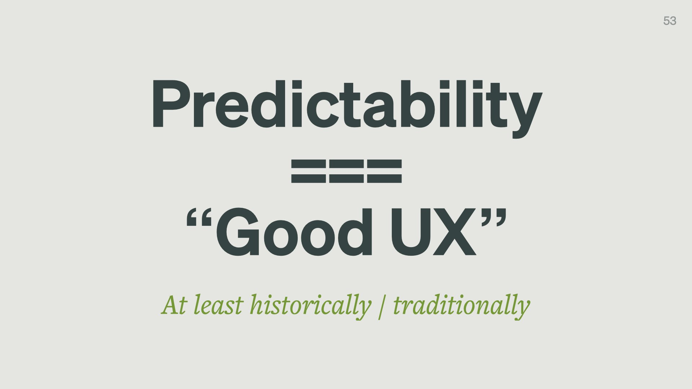

Predictability is supposed to be a hallmark of good user experience.  

可预测性本应是良好用户体验的标志。

We judge an interface as “good” if the user knows what to expect, and is never faced with results or feedback that seem out of the blue or confusing to them.  

如果用户知道自己应该期待什么，并且不会遇到让他们感到意外或困惑的结果或反馈，那么我们就可以判定这个界面是 "好 "的。

I still think this is true, but maybe we’ll have to rethink this as we start to use more generative and emergent systems in our work.  

我仍然认为这是正确的，但当我们开始在工作中使用更多的生成和涌现系统时，也许我们必须重新思考这个问题。  

If the system is unpredictable by nature, we'll need new interaction patterns to accommodate that.  

如果系统本质上是不可预测的，我们就需要新的交互模式来适应这种情况。

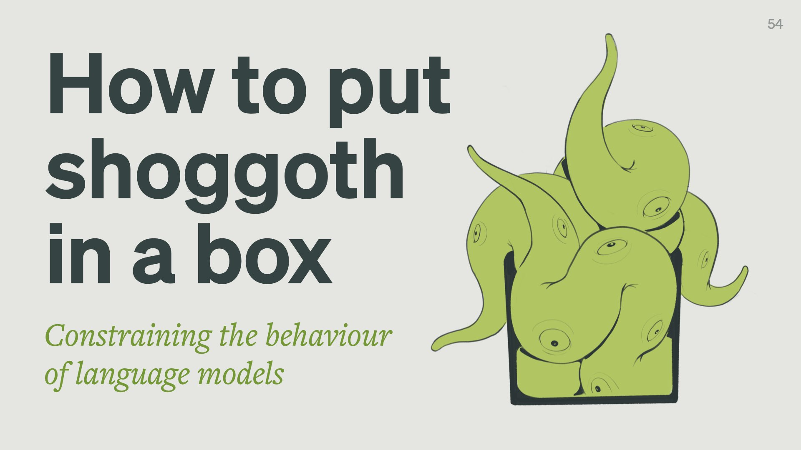

For the moment, we need to find ways to put Shoggoth in a box. We need _some_ predictability and control. We can’t just expose normal people to the crazy Shoggoth monster. At least not in its current state.  

目前，我们需要想办法把食人魔关进盒子里。我们需要一些可预测性和控制我们不能把正常人暴露在疯狂的食人魔面前至少在目前的状态下不行

Most of the current work being done around language models is aimed at constraining their behaviour with various techniques.  

目前，围绕语言模型开展的大部分工作都旨在利用各种技术对其行为进行约束。

We’re trying to get the best of both worlds. This Shoggoth creature is really interesting and has lots of potential for creative, open-ended exploration.  

我们正试图把这两个世界都做到最好。这种食人魔生物真的很有趣，有很大的潜力进行创造性的、开放式的探索。  

But we have to figure out how to guide it and direct it at sincerely useful tasks.  

但是，我们必须想出办法来引导它，把它引向真正有用的任务。

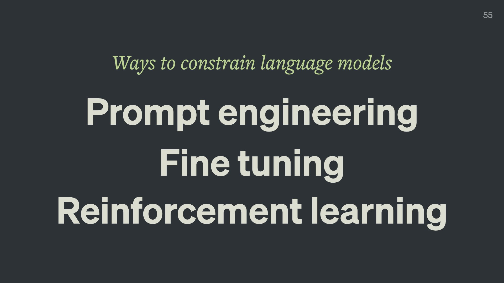

And we do have some ways to constrain it.  

我们确实有一些办法来限制它。

You've likely heard of some of these.  

您可能听说过其中的一些。

-   Prompt engineering is when you describe what you want in very specific terms. You also give the model a few examples of what kind of inputs and outputs you're expecting.  
    
    即时工程就是用非常具体的语言描述你想要什么。您还可以给模型举几个例子，说明您期望什么样的输入和输出。  
    
    And strangely, you have to butter the model up a lot.  
    
    奇怪的是，你必须给模特涂上很多黄油。  
    
    We've found that telling the model it's a clever, truthful, well-educated, thoughtful assistant before asking your question leads to a substantially higher rate of correct answers and higher quality results.  
    
    我们发现，在提问前告诉模型这是一个聪明、真实、受过良好教育、善于思考的助手，会大大提高答案的正确率和结果的质量。
-   Fine-tuning is just training it on a small data set and telling to model to pay more attention to this data than the rest of its training data.  
    
    微调只是在一个小数据集上进行训练，并告诉模型比其他训练数据更关注这些数据。
-   Reinforcement learning is when you get humans to score the output and feed that back into the model so it learns what kind of answers the humans want.  
    
    强化学习是指让人类对输出结果进行评分，并将评分结果反馈给模型，这样模型就能知道人类想要什么样的答案。  
    
    OpenAI heavily used this technique to improve ChatGPT.  
    
    OpenAI 大量使用这种技术来改进 ChatGPT。

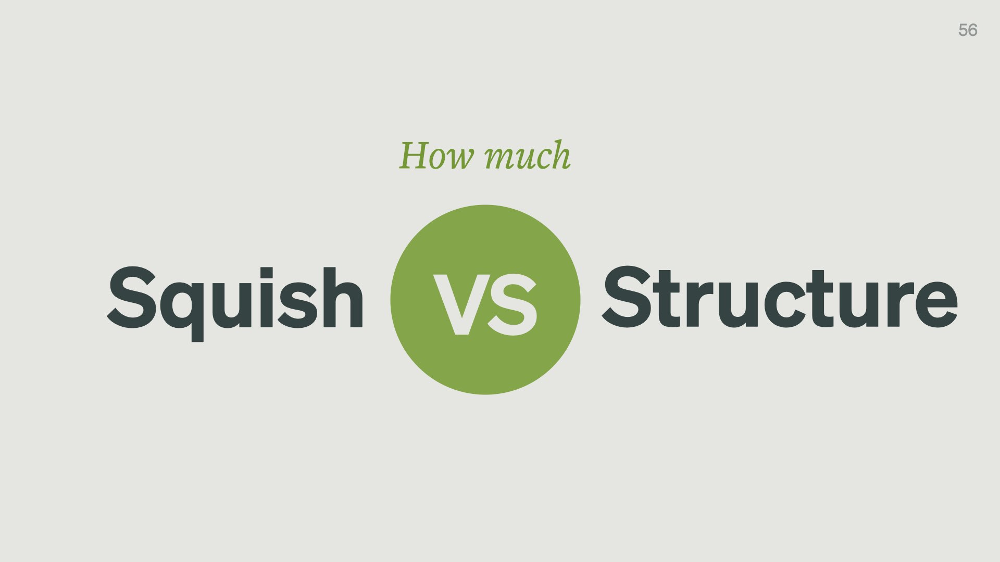

Our biggest design challenge for designing with language models is finding the ideal balance between Squish and Structure.  

在使用语言模型进行设计时，我们面临的最大挑战是在 Squish 和 Structure 之间找到理想的平衡。

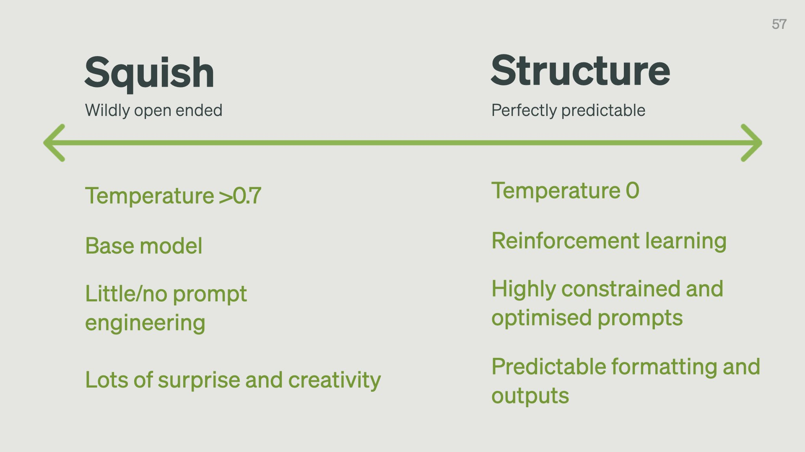

This isn't an either-or choice though – it’s a spectrum.  

但这并不是非此即彼的选择，而是一个范围。

Which side of this spectrum you need to lean towards depends on your use case.  

您需要倾向于哪一方取决于您的使用情况。

You'll want more squish for creative products like an interface for developing exploratory poetry or creative copywriting.  

对于开发探索性诗歌或创意文案的界面等创意产品，您需要更多的挤压空间。

You'll want more squish for rigorous products like extracting info from scientific papers  

对于从科学论文中提取信息等严谨的产品，您需要更多的挤压空间

We have a few levers we can pull to move between them:  

我们有几个杠杆可以在它们之间移动：

-   Temperature is the amount of randomness the model introduces into its answers. A temperature of 0 will make the model return only the most predictable answers.  
    
    温度是模型在其答案中引入的随机性大小。温度为 0 会使模型只返回最可预测的答案。  
    
    Anything over 0.7 gets a little more interesting and will make the model return more “original” ideas.  
    
    任何超过 0.7 的数值都会变得更有趣，也会让模型返回更多 "原创 "的想法。
-   The amount of reinforcement learning done on the base model will affect how constrained the outputs are  
    
    对基础模型进行强化学习的程度会影响输出的约束程度
-   Little or no prompt engineering will give you more open-ended responses, while highly constrained prompts with specific examples will give you structured answers  
    
    几乎没有或根本没有提示工程将为您提供更开放式的回答，而带有具体示例的高度受限提示将为您提供结构化的回答

As a general rule, squish gives you more surprise and creativity, while structure makes the outputs more predictable.  

一般来说，"压扁 "会给你带来更多惊喜和创意，而 "结构 "则会使输出结果更容易预测。

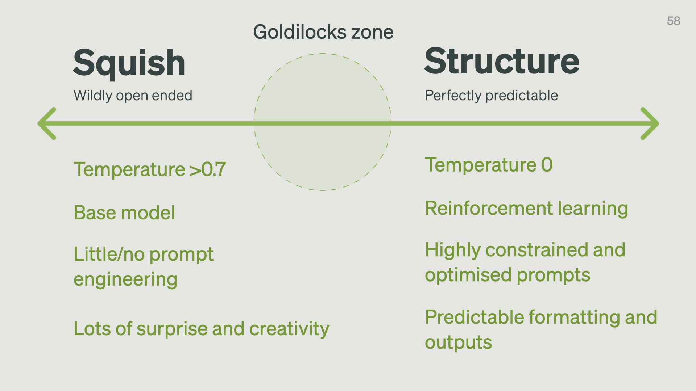

For most products, you want to be somewhere in the middle – in what I'll call the Goldilocks zone.  

对于大多数产品来说，你希望处于中间位置--我称之为 "黄金地带"。

Too far on the right is what we could get from existing computer programming systems. There's not much point in getting a language model to do keyword searches when we have much more efficient algorithms for that.  

我们可以从现有的计算机编程系统中获得的东西太偏右了。既然我们已经有了更有效的算法，让语言模型来进行关键词搜索就没有多大意义了。

Too far on the left is where things get weird. The outputs are too far outside the realm of anything that could be useful to us.  

太靠左侧会让事情变得很奇怪。输出结果远远超出了对我们有用的范围。

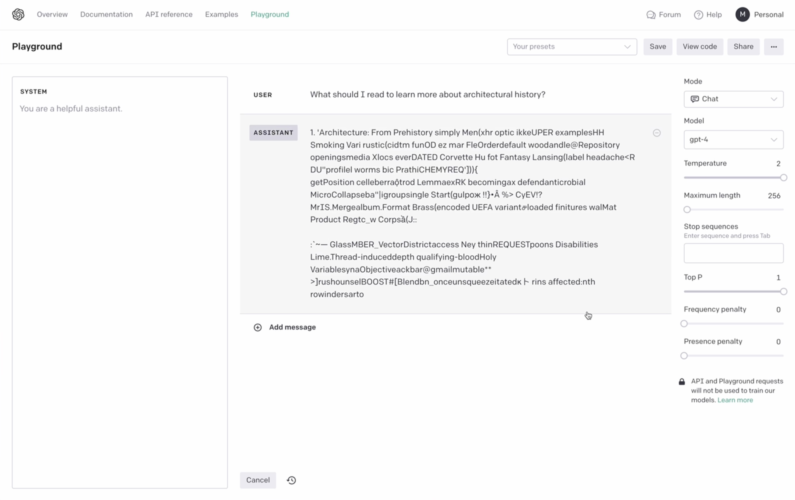

To show what I mean, let's see what language models do at super-high temperatures.  

为了说明我的意思，让我们看看语言模型在超高温下的表现。

This is

(which is a great place to get a feel for how language models behave).  

这是 OpenAI 的游乐场（这是了解语言模型行为的绝佳场所）。

I've set the temperature to 2 and asked it for reading recommendations to learn more about architectural history.  

我将温度设置为 2，并要求它推荐阅读内容，以了解更多建筑历史。  

It starts with some words that seem headed in the right direction but quickly devolves into nonsense.  

开头的几句话似乎方向正确，但很快就变成了废话。

Extremely random “creativity” isn't useful. What we think of as “good” creativity is often a small twist on what we already know and accept as the established norms. Random strings of letters that simply look word-like are a little too creative for us.  

极度随意的 "创造力 "是没有用的。我们所认为的 "好 "创意，往往是对我们已经知道并接受的既定规范的小改动。对于我们来说，那些看起来像单词一样的随机字母串就有点太有创意了。

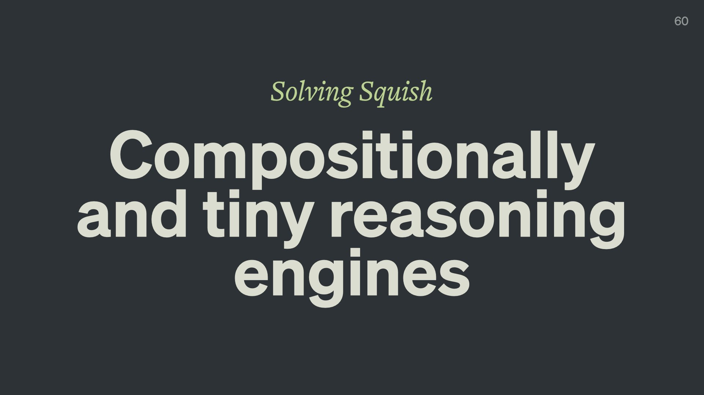

I've already mentioned a few ways to make models less squishy, but there's one very important way that we focus on a lot at Elicit.  

我已经提到了几种让模型不那么松软的方法，但还有一种非常重要的方法是我们 Elicit 经常关注的。

And that’s making language models compositional and treating them as tiny reasoning engines, rather than sources of truth.  

这就是让语言模型具有构成性，把它们当作微小的推理引擎，而不是真理的源泉。

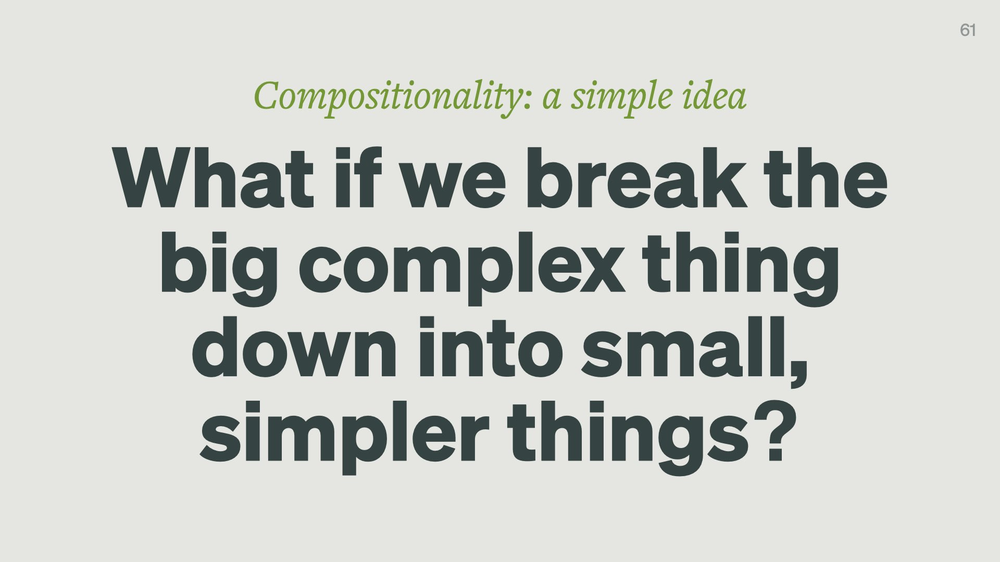

Compositionality simply means taking large, complex cognitive reasoning tasks, and breaking them down into smaller, more manageable sub-tasks.  

组合性简单地说就是把大型、复杂的认知推理任务分解成更小、更易于管理的子任务。

Say I want the answer to a question like “What are the side effects of magnesium supplements?”  

比方说，我想知道 "镁补充剂有什么副作用 "这样的问题的答案。

This is the sort of thing I would Google in the before times.  

在以前，我就会用谷歌搜索这类内容。

When I ask the language model GPT-4 this question, I get a pretty complete answer with a list of side effects I’m quite tempted to just accept. They seem plausible.  

当我向语言模型 GPT-4 提出这个问题时，我得到了一个相当完整的答案，并列出了一系列副作用，我很想就这样接受它们。这些副作用看似合理。

The problem is I have no way to validate or debug this answer.  

问题是我没有办法验证或调试这个答案。

We have no source for this data. Is this from the medical research literature? Did this come from some random blog?  

我们没有这一数据的来源。这是医学研究文献吗？是否来自某个随机的博客？

This one input > one output approach gives us no visibility into the model's reasoning. We can't check what happened in the black box in the middle.  

这种 "一个输入 > 一个输出 "的方法让我们无法了解模型的推理过程。我们无法检查中间的黑盒子里发生了什么。

One way to improve this process is to think about how an intelligent, thoughtful, human who's great at research would rigorously answer this question.  

改进这一过程的方法之一，就是思考一个聪明、善于思考、擅长研究的人会如何严谨地回答这个问题。  

And then build a system with language models that mimics that.  

然后用语言模型模拟建立一个系统。

So first we might search Google Scholar for relevant papers...  

因此，首先我们可以在谷歌学术搜索相关论文...

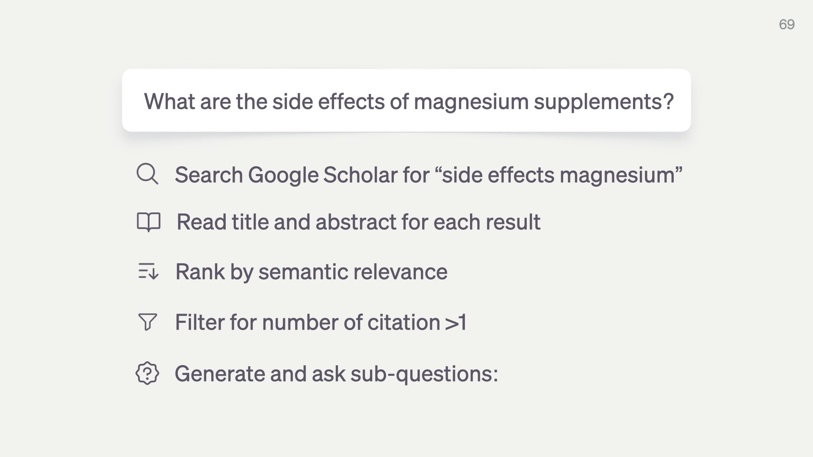

Then use a language model to read all the titles and abstracts for these papers.  

然后使用语言模型阅读这些论文的所有标题和摘要。

And rank them by how semantically similar they are to our question.  

并根据它们与我们的问题在语义上的相似程度进行排序。

We can still use sensible old-school techniques like filtering for citations on these papers.  

我们仍然可以使用合理的老式技术，比如过滤这些论文的引用。

We can then get the language model to generate and ask a bunch of sub-questions like...  

然后，我们可以让语言模型生成并提出一系列子问题，例如...

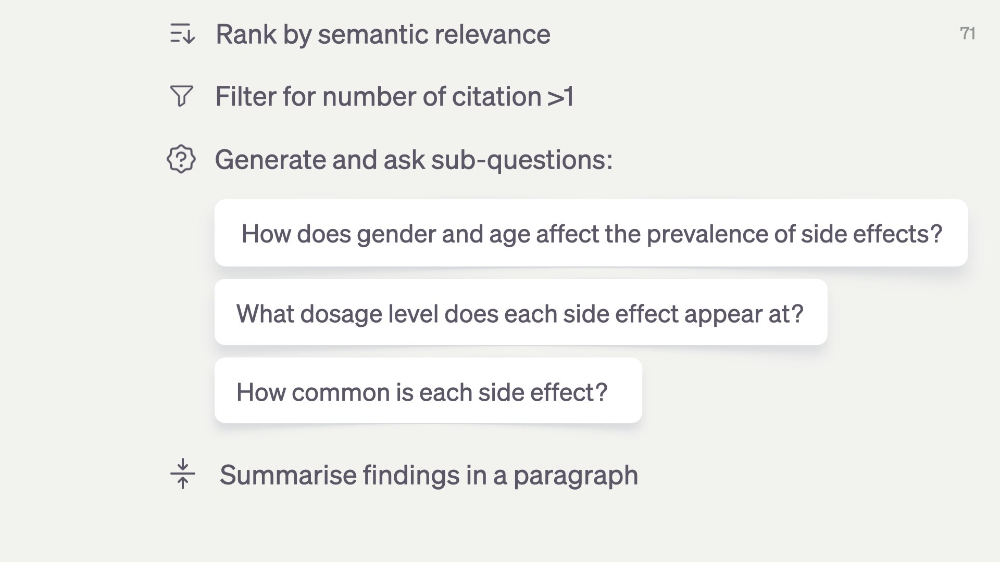

How do gender and age affect how often these side effects show up? What dosage do they appear at? How common is each side effect?  

性别和年龄如何影响这些副作用的出现频率？出现这些副作用的剂量是多少？每种副作用的常见程度如何？

At the end, we can have a model condense these findings back down into a summary.  

最后，我们可以让一个模型将这些发现浓缩成一个摘要。

The end product might not be that different from what GPT-4 gave us.  

最终产品可能与 GPT-4 给我们带来的产品并无太大区别。

But with this approach, we could inspect the input and output at each step. We can see its reasoning along the way.  

但使用这种方法，我们可以检查每一步的输入和输出。我们可以看到它的推理过程。

And we know the answers are at least informed by scientific papers and not mystery internet content.  

我们知道，这些答案至少有科学论文的依据，而不是神秘的网络内容。

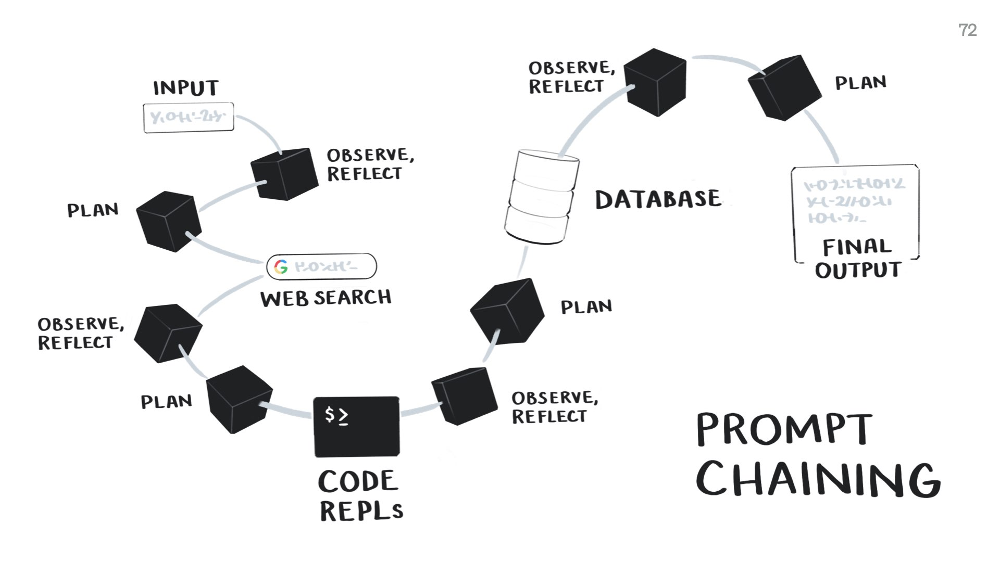

This approach is also sometimes called “prompt chaining” – as in you make chains of commands that include prompts to language models.  

这种方法有时也被称为 "提示链"--即在命令链中包含对语言模型的提示。

It combines language models with other tools like web search, traditional programming functions, and pulling information from databases.  

它将语言模型与网络搜索、传统编程功能和从数据库中提取信息等其他工具相结合。  

This helps make up for the weaknesses of the language model.  

这有助于弥补语言模型的不足。

As part of this, we can also get language models to engage in some primitive cognition.  

作为其中的一部分，我们还可以让语言模型参与一些原始认知活动。  

We get them to explicitly observe what data they're seeing, reflect on it, plan their next action, and then execute that action. This improves their final outputs.  

我们让他们明确地观察他们所看到的数据，对其进行反思，计划下一步行动，然后执行该行动。这就提高了他们的最终产出。  

It's a simplified OODA loop.  

这是一个简化的 OODA 循环。

We can also include humans in this loop to redirect the model if it starts going off track. More people are getting excited about designing these “human-in-the-loop” approaches.  

如果模型开始偏离轨道，我们还可以让人类参与到这个环路中，重新引导模型。越来越多的人开始热衷于设计这种 "人在回路中 "的方法。

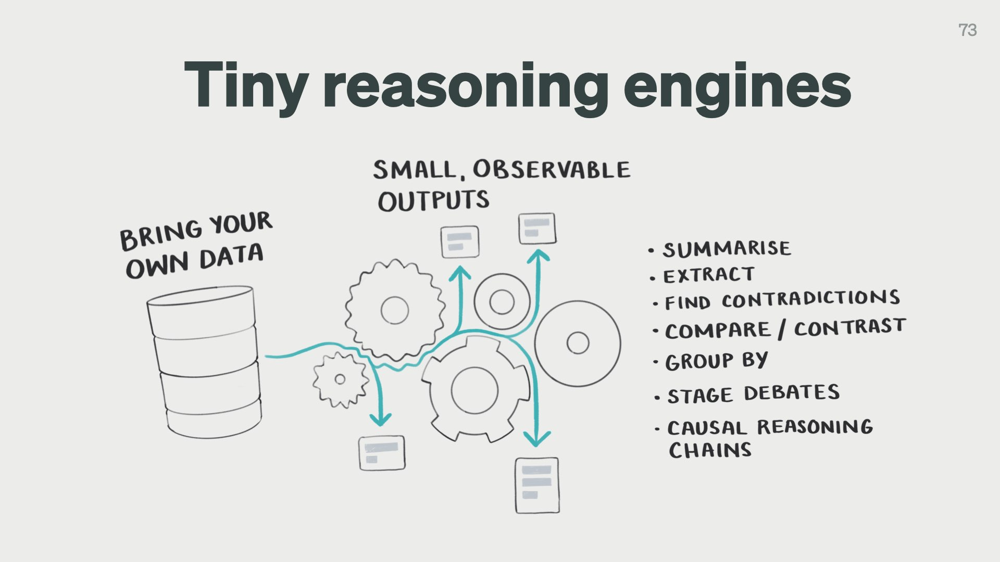

Each step in this prompt chain that involves a language model should be a tiny reasoning engine.  

在这个提示链中，涉及语言模型的每一步都应该是一个微小的推理引擎。

It should be designed and optimised for one very small cognitive task.  

它应针对一个非常小的认知任务进行设计和优化。

We can design language model calls for:  

我们可以设计语言模型的要求：

-   summarising 总结
-   extracting structured data from long text  
    
    从长篇文本中提取结构化数据
-   finding contradictions between claims  
    
    发现索赔之间的矛盾
-   comparing and contrasting claims  
    
    比较和对比索赔
-   generating research questions  
    
    提出研究问题
-   and many more! 等等！

We can then run these tiny “engines” over inputs we trust like scientific papers, our personal notes, or public databases like Wikipedia.  

然后，我们就可以在科学论文、个人笔记或维基百科等公共数据库等我们信任的输入内容上运行这些微小的 "引擎"。

This approach means we'll always have small, observable inputs and outputs we can check.  

这种方法意味着我们将始终拥有可以检查的小规模、可观察的输入和输出。

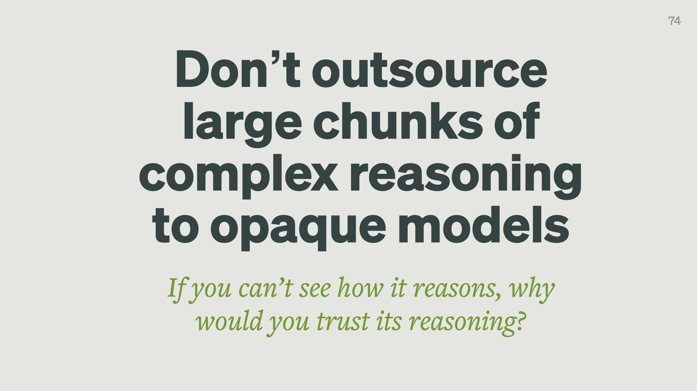

The larger point here is we shouldn’t be outsourcing complex reasoning tasks to crazy Shoggoth models.  

更重要的是，我们不应该把复杂的推理任务外包给疯狂的食人魔模型。

If you can’t see how it reasons, why would you trust its reasoning?  

如果你不知道它是如何推理的，为什么还要相信它的推理呢？

I’ve been talking a lot about the technical implementation side of language models, but these principles apply to design too.  

我一直在谈论语言模型的技术实现方面，但这些原则也适用于设计。

I see lots of products that try to outsource too much cognition to both language models and users. Most look something like this.  

我看到很多产品都试图将过多的认知工作外包给语言模型和用户。大多数产品看起来是这样的

They present you with a “Magic AI” input claiming it can do anything you want.  

他们向你展示一个 "神奇的人工智能 "输入法，声称它可以做任何你想做的事。

This forces the user to think:  

这迫使用户思考：

-   What can I do here?  
    
    我能在这里做什么？
-   What _should_ I do? 我该怎么办？
-   What is this _for_? 这是干什么用的？

This thing has no affordances! There are no knobs or door handles on this thing. This interface offloads a ton of cognitive labour to the user.  

这东西没有负担能力！这东西上没有旋钮或门把手。这个界面为用户减轻了大量的认知劳动。

_You_ have to figure out what it’s capable of doing because the designers of this system certainly haven't done it for you.  

你必须搞清楚它能做什么，因为这个系统的设计者肯定没有为你做这件事。

_You_ also have to figure out how to get a good result out of it. Good luck learning prompt engineering while you're at it.  

你还必须想办法从中获得好的结果。祝你好运，在学习提示工程的同时也能学到东西。

The problem here is this interface _can’t_ actually do everything. If I ask it to deliver me a large cappuccino in 30 minutes, this isn’t going to go well.  

问题在于，这个界面实际上并不能做到面面俱到。如果我要求它在 30 分钟内为我送上一大杯卡布奇诺咖啡，这就不会顺利进行。

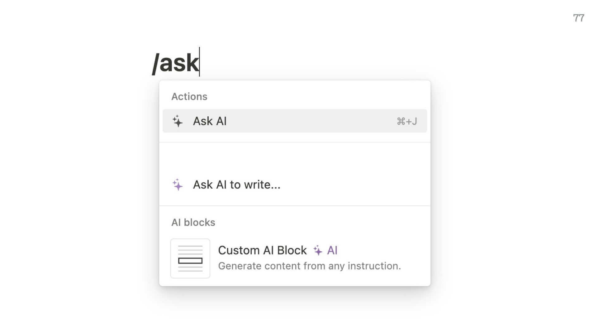

This is the current implementation of “AI” on a well-known note-taking app I won’t name, and it’s frankly not that different to the previous screen.  

这是一款我就不点名的知名笔记应用目前的 "人工智能 "实现方式，老实说，它与之前的屏幕并无太大区别。

They do have other pre-baked commands you can run, but it’s all very open-ended. The user has to figure this out themselves.  

他们确实有其他预制命令可以运行，但都是开放式的。用户必须自己摸索。

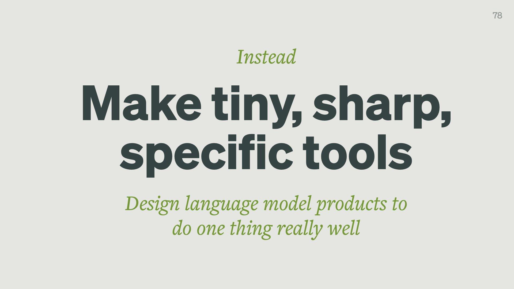

Instead of making generic interfaces and leaving the user to come up with their own solutions, we can instead design language models that give users a set of specific tools.  

我们可以设计语言模型，为用户提供一套特定的工具，而不是制作通用的界面，让用户自己想办法解决。

We should make tiny, sharp, specific tools with models.  

我们应该用模型制作微小、锋利、具体的工具。

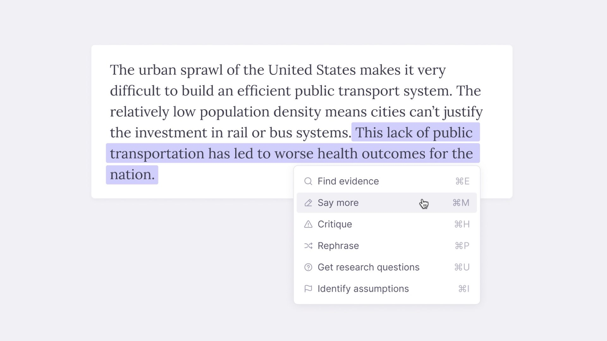

A few months ago I made a

exploring some language-model-driven writing tools. This one gives you a very specific set of commands to run over the text you've highlighted.  

几个月前，我制作了一组原型，探索一些语言模型驱动的写作工具。这个工具可以让你在高亮显示的文本上运行一组非常具体的命令。

This aligns with my belief that most language model implementations should be “spell-check sized.” They should do one specific thing well.  

这与我的信念不谋而合，即大多数语言模型的实现都应该是 "拼写检查大小 "的。它们应该做好一件特定的事情。

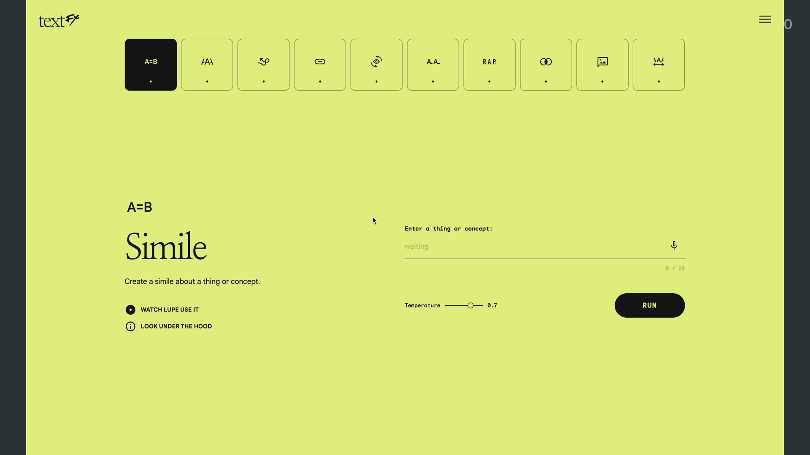

Google released a tool last week that's a great example of this approach. It's called

and they made it in collaboration with rappers and poets.  

谷歌上周发布的一款工具就是这种方法的典范。该工具名为 TextFX，是他们与说唱歌手和诗人合作开发的。

It gives you a bunch of tiny language tools:  

它为你提供了大量微小的语言工具：

-   Similes 比喻
-   Semantic chains 语义链
-   Alliteration 拟声词
-   Change your point of view  
    
    改变你的观点
-   Find the intersection of two things  
    
    找出两事物的交点

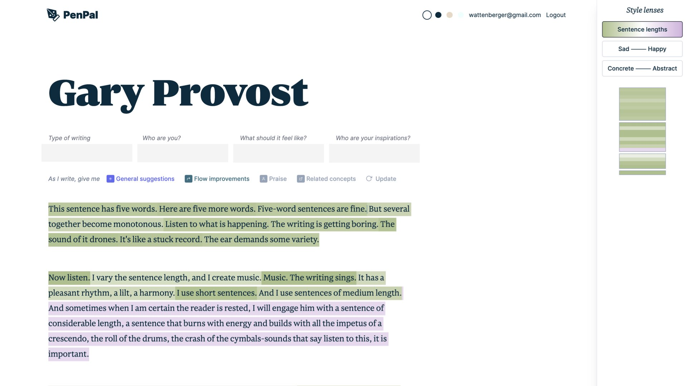

Another great example of this is a writing tool my friend

is building. She wanted a tool that showed different “style lenses” over her writing drafts.  

另一个很好的例子是我的朋友阿米莉亚-瓦滕伯格（Amelia Wattenberger）正在制作的一个写作工具。她希望有一个工具能在她的写作草稿上显示不同的 "风格透镜"。

Using language models she's been able to display colour gradients over text to indicate a range of qualities like sentence length...  

通过使用语言模型，她能够在文本上显示颜色梯度，以显示句子长度等一系列质量...

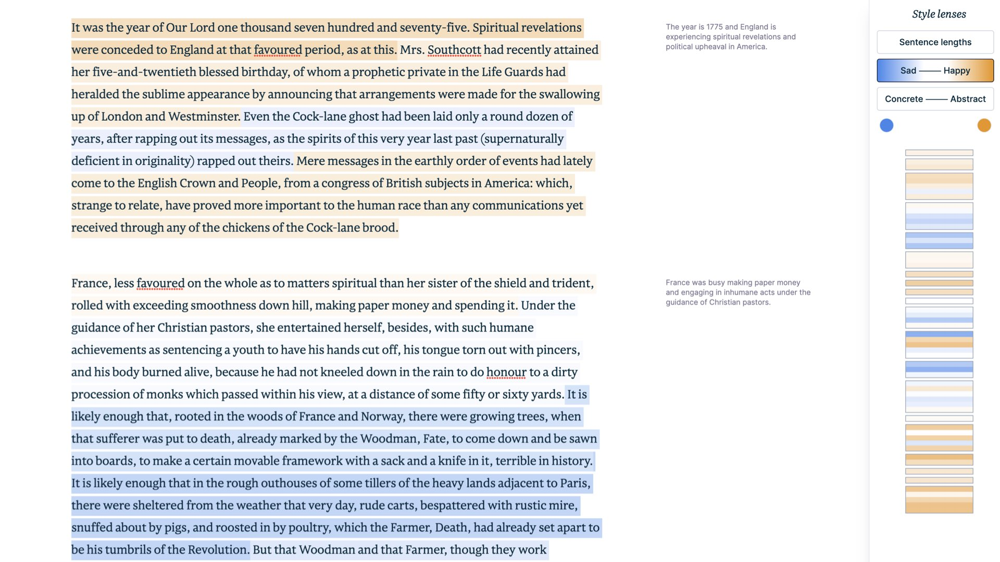

...how sad/happy the tone is... or how concrete/abstract the language is.  

......语气有多悲伤/快乐......或者语言有多具体/抽象。

Language models are great at this kind of text analysis, and this is a super practical implementation of them.  

语言模型在这种文本分析方面非常出色，而这正是其超级实用的实现方式。

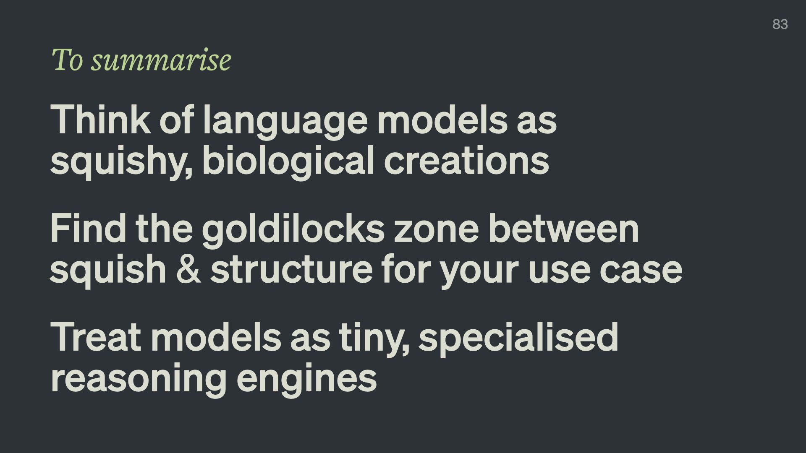

I have to wrap this up, but I hope you learned:  

我得结束了，但我希望你学到了东西：

-   We should think of models as squishy, biological crations  
    
    我们应该把模型看作是软绵绵的生物体
-   When you're designing with these models you need to find the Goldilocks zones between squish–structure for your specific use case  
    
    在使用这些模型进行设计时，您需要根据具体的使用情况，在 "松软结构 "之间找到 "黄金分割点"。
-   You should treat models as tiny reasoning engines for specific tasks. Don’t try to make some universal text input that claims to do everything. Because it can’t.  
    
    您应该将模型视为特定任务的微小推理引擎。不要试图制造某种万能的文本输入法，声称它无所不能。因为它做不到。  
    
    And you'll just disappoint people by pretending it can.  
    
    而你假装它可以，只会让人们失望。

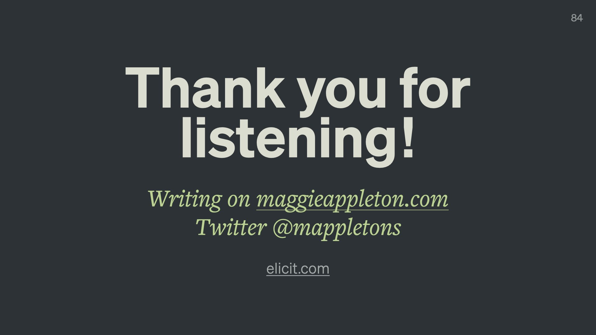

Thank you very much for reading!  

感谢您的阅读！
