Unlike nearly all other arts, architecture is inherently public and shared.  

与几乎所有其他艺术不同，建筑本身具有公共性和共享性。  

That means that buildings should be designed to be agreeable – easy to like – not to be unpopular works of genius.  

这就意味着，建筑物的设计应该是合意的--容易让人喜欢--而不是不受欢迎的天才作品。

Since at least the nineteenth century, debate has intermittently flared up around the question of what styles of architecture we should build.  

至少从十九世纪开始，围绕着我们应该建造什么风格的建筑这一问题，就时不时地出现争论。  

In recent decades the two sides have often been characterised as ‘traditionalists’ and ‘modernists’, supporting the use of traditional and modernist architectural styles respectively.   

近几十年来，双方经常被称为 "传统派 "和 "现代派"，分别支持使用传统和现代建筑风格。

To some people, this framing feels strange. These people have the impression that we used to make [fewer ugly buildings](https://worksinprogress.co/issue/against-the-survival-of-the-prettiest) and dysfunctional places. They don’t accept the idea that technological modernity [somehow morally requires us](https://worksinprogress.co/issue/in-praise-of-pastiche) to build in an austere ‘modernist’ style. But they also find it bizarre to be dogmatically in favour of the use of old architectural styles rather than new ones.  

对一些人来说，这种框架感觉很奇怪。在这些人的印象中，我们过去建造的丑陋建筑和功能失调的地方比较少。他们不接受这样一种观点，即现代技术在某种程度上从道德上要求我们采用朴素的 "现代主义 "风格进行建设。但他们也发现，教条式地支持使用旧建筑风格而不是新建筑风格是很奇怪的。  

People in this group feel that the debate has gone wrong somewhere.  

这部分人认为辩论在某个地方出了问题。  

They are ideologically homeless: they are obviously not ‘modernists’, but they are also uneasy with the ‘traditionalist’ label.  

他们在意识形态上无家可归：他们显然不是 "现代主义者"，但他们也对 "传统主义者 "的标签感到不安。  

I count myself in this category, and I think quite a few other people fall into it too.   

我自己属于这一类，我想很多人也属于这一类。

I believe that the ‘traditionalist’ framing is indeed a mistake, and that there is no reason to favour traditional styles _per se_. But there _are_ important reasons why we should favour some architectural styles over others – reasons that are special to architecture, and that set it apart from music, literature, painting or film.  

我认为，"传统主义 "的框架确实是一个错误，没有理由偏爱传统风格本身。但是，我们应该偏爱某些建筑风格而不是其他建筑风格，这是有重要原因的--这些原因是建筑所特有的，也是建筑有别于音乐、文学、绘画或电影的重要原因。  

Architecture is a public art, a vernacular art, and a background art: it is created by a huge range of people, and experienced involuntarily by an even wider one.  

建筑是一种公共艺术、一种乡土艺术和一种背景艺术：它是由众多人创造的，也是由更多人不由自主地体验的。  

This means that we need architectural styles that are as accessible as possible, to the full range of people who live with what we build, and to the full range of builders who create it.  

这就意味着，我们需要尽可能方便的建筑风格，让所有与我们的建筑共同生活的人们，以及创造这些建筑的所有建筑商都能从中受益。  

Some ‘traditional’ styles might well be useful in achieving this, but it is not their being traditional that matters: any style with broad and deep appeal will do just as well.  

一些 "传统 "风格很可能有助于实现这一目标，但重要的并不是它们是否传统：任何具有广泛而深刻吸引力的风格都能起到同样的作用。

### **1\. The curious idea of ‘traditionalism’  

1.奇特的 "传统主义 "思想**

People who are uneasy with a lot of modern buildings are sometimes attracted to the idea of ‘traditionalism’. But on reflection, ‘traditionalism’ is quite a strange idea.  

对许多现代建筑感到不安的人有时会被 "传统主义 "的理念所吸引。但仔细想想，"传统主义 "是一个相当奇怪的概念。  

I don’t identify as a ‘traditionalist’, and I don’t think other people should either. Here is why.  

我不认为自己是 "传统主义者"，我认为其他人也不应该这么认为。原因如下。

First, the term itself is misleading. A natural definition of ‘traditionalism’ is a view on which we should build in a traditional way.  

首先，"传统主义 "一词本身具有误导性。传统主义 "的自然定义是我们应以传统方式为基础的观点。  

But on any plausible definition of a ‘traditional style’, ‘modernism’ has itself become a tradition.  

但从 "传统风格 "的任何合理定义来看，"现代主义 "本身已成为一种传统。  

It has pioneers, paragons and imitators; it has purists, popularisers and schismatics; it admits of allusion, pastiche and reinvention.  

它有先驱者、典范和模仿者；它有纯粹主义者、普及者和分裂者；它允许影射、模仿和再创造。  

All the cities of the world now teem with office buildings that are variations on [the Seagram Building](https://www.worksinprogress.news/p/notes-on-progress-an-englishman-in) in New York City. It is unclear what makes them less ‘traditional’ as the variations on the Palazzo Farnese that filled many of the cities of the nineteenth century.  

现在，世界上所有城市都充斥着以纽约西格拉姆大厦（Seagram Building）为原型的办公楼。与十九世纪许多城市中的法尔内塞宫相比，不知道是什么让它们变得不那么 "传统"。  

To be sure, modernism began with a period of rapid, relatively discontinuous, and often consciously revolutionary change.  

可以肯定的是，现代主义的开端是一个快速、相对不连续、往往是有意识的革命性变革的时期。  

But so have other traditions, including in some respects the Gothic and the Renaissance.   

但其他传统也是如此，包括哥特式和文艺复兴时期的某些传统。

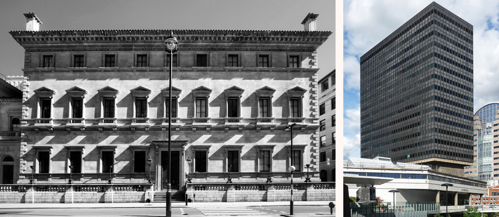

The Reform Club (Left) and Bastion House (Right. Both have

**very** clear stylistic sources. Why should only one be counted as ‘traditional’?  

改革俱乐部（左）和堡垒之屋（右）。两者都有非常明确的风格来源。为什么只有一个被视为 "传统"？

Image 图片

What the traditionalists need is some way of distinguishing the traditions they like from the traditions they don’t.  

传统主义者需要的是某种方法来区分他们喜欢的传统和他们不喜欢的传统。  

One possibility is to go for age: traditionalists could rebrand as ‘oldists’, who favour the use of old styles rather than new ones.  

一种可能的做法是追求时代感：传统主义者可以改名为 "守旧派"，他们喜欢使用旧的风格，而不是新的风格。  

Defining ‘old’ is tricky – we would need to go back to at least 1920 to exclude the Modern Movement pioneers, but by doing so we would exclude Art Deco, Brick Expressionism, and so on.  

如何定义 "古老 "是个难题--我们至少需要追溯到 1920 年，才能将现代运动先驱排除在外，但这样做又会将装饰艺术、砖块表现主义等排除在外。  

Let us suppose, however, that with a bit of fiddling we can get to a definition that does a tolerable job at sorting the styles that traditionalists like from the ones they don’t.  

然而，让我们假设，只要稍加斟酌，我们就能得出一个定义，这个定义可以把传统主义者喜欢的风格和他们不喜欢的风格区分开来。  

Even so, ‘oldism’ would seem like a very strange view. Surely a style’s being old _per se_ is not the thing that matters?  

即便如此，"守旧主义 "似乎也是一种非常奇怪的观点。当然，一种风格是否古老本身并不重要？  

If a new style were invented that had all the merits of the old styles (whatever you think they are), and that enjoyed their broad and deep popularity, surely any sensible traditionalist should be in favour of it?   

如果发明了一种新风格，它具有旧风格（无论你认为它们是什么）的所有优点，并受到广泛而深入的欢迎，那么任何明智的传统主义者肯定都会支持它。

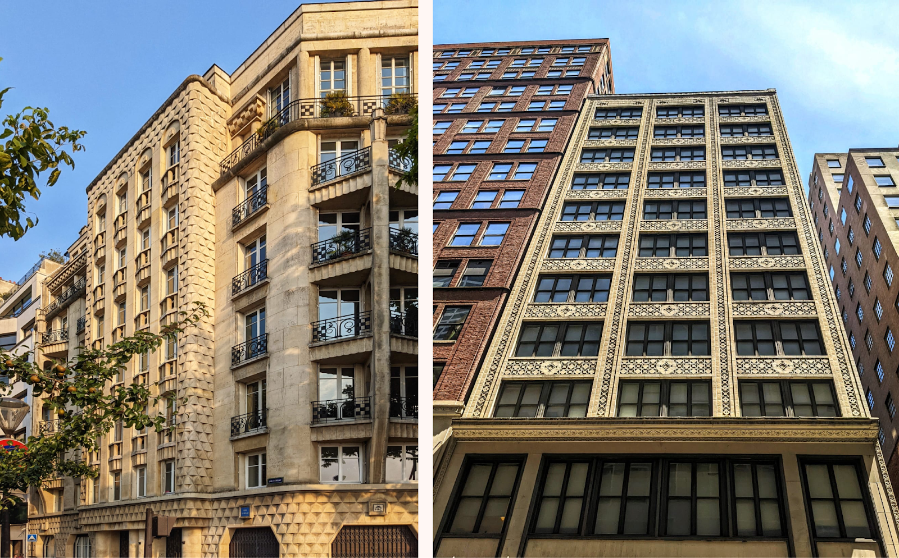

Should ‘oldists’ oppose these buildings because they were built in styles invented after the beginning of ‘modernism’?   

难道 "守旧派 "应该因为这些建筑是在 "现代主义 "兴起之后才发明的风格而反对它们吗？

Image 图片

Author’s collection  作者收藏

What ‘traditionalists’ really want to say, in my view, is that old architectural styles tend to have _some characteristic_ that tends to be lacking in ‘modernism’. What they really support are styles with _this characteristic_: this may correlate with age for the time being, but it is perfectly possible that a new style could be invented in which this characteristic is abundantly present.  

在我看来，"传统主义者 "真正想说的是，古老的建筑风格往往具有 "现代主义 "所缺乏的某些特征。他们真正支持的是具有这种特征的风格：这种特征可能暂时与年代相关，但完全有可能发明出一种新的风格，在其中充分体现这种特征。  

The question of course is what this characteristic is.  

当然，问题在于这种特性是什么。

The most obvious answer might seem to be that it is simply ‘goodness’.  

最明显的答案似乎就是 "善良"。  

We thus arrive at ‘goodism’, according to which we should favour styles conducive to good architecture, and disfavour styles conducive to bad.  

因此，我们得出了 "好建筑主义"，即我们应该赞成有利于好建筑的风格，而反对不利于坏建筑的风格。  

It might seem that goodism is obviously true to the point of being a trivial claim. Curiously enough, however, I am going to argue against it.  

善良主义似乎显然是正确的，甚至可以说是微不足道的主张。但奇怪的是，我却要反驳它。  

There are many contexts in life in which we should be goodists. But when it comes to architecture, we should often care about other things more than the sheer goodness of the work.  

在生活中，有很多情况下，我们都应该做一个善良的人。但说到建筑，比起作品的纯粹美好，我们往往更应该关心其他事情。

### **2\. Easy and challenging styles  

2.简易和高难度风格**

I want to step back for a moment and introduce a different distinction, namely between what we might call _easy_ styles and _challenging_, or difficult, ones.  

我想退后一步，介绍一种不同的区别，即我们可以称之为容易的风格和具有挑战性或困难的风格之间的区别。  

A style is ‘easy’, as I use the term, if works in it can be enjoyed or appreciated, at least on a basic level, without much work; a style is thus ‘challenging’ if works in it require a lot of work to enjoy.  

我所说的 "简单"，是指一种风格中的作品至少在最基本的层面上不需要花太多功夫就能欣赏或领会；因此，如果一种风格中的作品需要花很多功夫才能欣赏，那么这种风格就是 "具有挑战性 "的。  

This is of course a continuum rather than a binary, and it allows that an easy style may encompass the odd challenging work, and a challenging style the odd easy one.  

当然，这是一个连续的过程，而不是二元对立的，它允许一种简单的风格包含一些具有挑战性的作品，而一种具有挑战性的风格包含一些简单的作品。  

Crucially, the easy/challenging distinction is orthogonal to the good/bad distinction: it is obvious that both challenging and easy art can be both good and bad.  

最重要的是，容易/有挑战性的区别与好/坏的区别是正交的：很明显，有挑战性和容易的艺术都可能是好的，也可能是坏的。  

They are not unrelated: for instance, it is arguable that the best works tend to be at least somewhat challenging. But they are definitely not the same thing.  

它们并非毫无关联：例如，可以说最好的作品往往至少具有一定的挑战性。但它们绝对不是一回事。

Challenging arts have existed throughout history to some extent.  

挑战性艺术在一定程度上贯穿了整个历史。  

The court poetries of many cultures have been enormously allusive in ways that exclude everyone unversed in their sources.  

许多文化中的宫廷诗歌都有大量的典故，让不了解其来源的人无从知晓。  

There have been architectural styles that presuppose a knowledge of a complex body of rules upon which they then play, like some kinds of [mannerism](https://www.britannica.com/art/Western-architecture/Italian-Mannerism-or-Late-Renaissance-1520-1600). There has been difficult music, too, like the _ars subtilior_ of the late Middle Ages, a refined and complicated musical style that seems only ever to have been enjoyed in highly educated circles (the curious might try [this playlist](https://open.spotify.com/playlist/4wbjAFHanzwzLeK1yyAFGB)).  

有一些建筑风格是以对复杂的规则体系的了解为前提的，然后在这些规则的基础上进行发挥，就像某些风格主义。也有难度很大的音乐，比如中世纪晚期的 "亚瑟王"（ars subtilior），这是一种高雅而复杂的音乐风格，似乎只有受过高等教育的人才能欣赏（好奇者可以试试这个播放列表）。

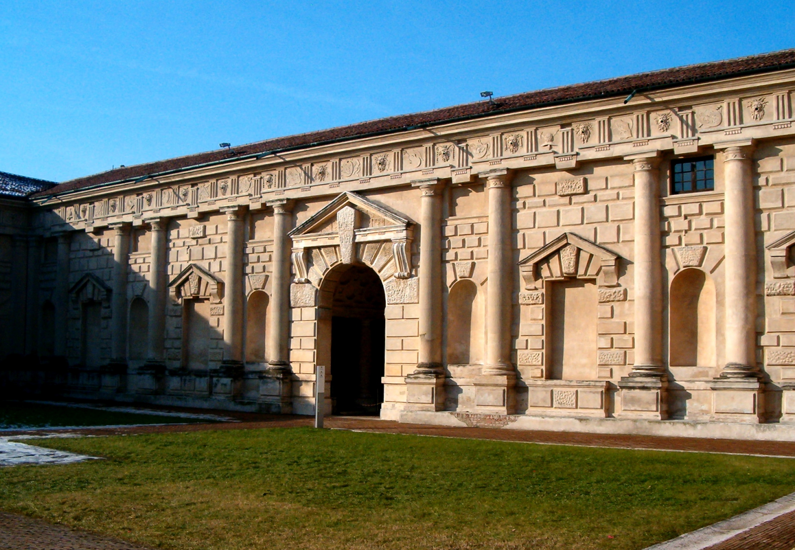

The Palazzo del Te is famous among architectural historians for the various ‘tricks’ it plays with the classical language.  

特尔宫因其在古典语言上玩弄的各种 "花招 "而闻名于建筑史学家。  

Needless to say, these tricks are invisible to laypeople, who derive no pleasure from them. An early example of somewhat more ‘challenging’ architecture  

不用说，外行人是看不到这些技巧的，他们也不会从中得到乐趣。更具 "挑战性 "的早期建筑实例

  

Image 图片

Nonetheless, it seems fair to say that rising levels of difficulty was one of the distinctive characteristics of high-status arts in the twentieth century.  

尽管如此，似乎可以说，难度不断提高是 20 世纪高水平艺术的显著特征之一。  

Atonal music, abstract painting, brutalist architecture and experimental literature are frequently opaque and sometimes actively rebarbative to ordinary people.  

无调性音乐、抽象绘画、野蛮主义建筑和实验文学对普通人来说常常是不透明的，有时甚至是积极的反叛。  

‘Modernism’ is a hugely complex phenomenon, and it would be egregiously silly to say that all modernist art is challenging, or even that all modernist styles are so.  

现代主义 "是一个极其复杂的现象，如果说所有的现代主义艺术都具有挑战性，甚至所有的现代主义风格都是如此，那就太愚蠢了。  

But it would also be silly to deny that the two phenomena are related and correlated.   

但如果否认这两种现象是相关联的，那也是愚蠢的。

In some cases, the ascendancy of the difficult seems to have almost completely severed the relationship with a once relatively broad audience: of the world’s fifty most performed operas, for example, none is remotely modernist, and indeed only one was written after 1914, _Turandot_ ([this website](https://www.operabase.com/en) provides fascinating details). Opera probably never had especially broad appeal, of course – but its appeal has nonetheless narrowed strikingly.   

在某些情况下，高难度歌剧的崛起似乎几乎完全切断了与曾经相对广泛的观众的关系：例如，在世界上演出次数最多的 50 部歌剧中，没有一部是现代派作品，实际上只有一部是 1914 年之后创作的，即《图兰朵》（本网站提供了引人入胜的详细信息）。当然，歌剧可能从未有过特别广泛的吸引力，但它的吸引力却明显缩小了。

It would be extremely interesting to try to describe the contours of this phenomenon – the rise of the artistically challenging – in greater detail.  

试图更详细地描述这一现象的轮廓--艺术挑战者的崛起--将是非常有趣的。  

It is striking, and usually unremarked, that it is very variably true from one art form to another.  

令人震惊的是，在不同的艺术形式中，这一点通常不被注意。  

Many critically admired novelists today – say, Kazuo Ishiguro, Mario Vargas Llosa, Orhan Pamuk, JM Coetzee – appear on fairly normal domestic bookshelves, whereas there is perhaps no living classical composer of the first critical rank who is a household name.  

如今，许多备受评论界推崇的小说家，如石黑一雄、马里奥-巴尔加斯-略萨、奥尔汉-帕慕克、JM-科兹等，都出现在相当普通的国内书架上，而在世的古典音乐作曲家中，也许还没有哪一位是家喻户晓的第一流人物。  

Some contemporary art galleries are hugely popular, like London’s Tate Modern or New York’s Metropolitan Museum of Art, but very few people watch video art or experimental cinema at home.  

一些当代艺术馆大受欢迎，如伦敦的泰特现代美术馆或纽约的大都会艺术博物馆，但很少有人在家观看录像艺术或实验电影。  

Quite a few art forms seem to have drifted easy-wards in recent decades, in an age that increasingly values accessibility and deprecates elitism.  

近几十年来，在这个越来越重视亲和力、摒弃精英主义的时代，不少艺术形式似乎都在逐渐走向平庸。  

A serious, detailed, slightly quantitatively-minded history of the popularity of modern artistic styles would be a fascinating thing to read.  

一本严肃、详细、略带定量思维的现代艺术风格流行史将是一本引人入胜的读物。  

Here however I content myself with very broad contours.  

不过，在这里，我只满足于非常宽泛的轮廓。

In architecture, the broad contours are clear enough. As mentioned above, there are definitely popular ‘modernist’ buildings: as [the huge 2007 poll](https://en.wikipedia.org/wiki/America%27s_Favorite_Architecture) by the American Institute of Architects found, the American people really do like Eero Saarinen’s Gateway Arch and Wright’s Fallingwater.  

在建筑方面，大致轮廓已经足够清晰。 如上所述，"现代主义 "建筑确实很受欢迎：正如美国建筑师协会 2007 年的大型民意调查所发现的，美国人确实喜欢埃罗-沙里宁（Eero Saarinen）的 "门户拱门"（Gateway Arch）和赖特的 "落水洞"（Fallingwater）。  

I am not sure I have ever met someone who disliked the Sydney Opera House.  

我从未见过不喜欢悉尼歌剧院的人。  

Visual preference surveying suggests, however, that the majority of the public remains broadly traditional in its tastes, albeit undogmatically so.  

然而，视觉偏好调查表明，大多数公众的口味仍然大致传统，尽管并不统一。  

The survey below by Create Streets and Ipsos MORI is typical: wholly or mildly traditional designs score highly, more avant-garde designs get a mixed-to-negative reception.  

下面是 Create Streets 和 Ipsos MORI 的典型调查：完全或轻微传统的设计得分很高，而更前卫的设计得到的评价则参差不齐，甚至是负面的。

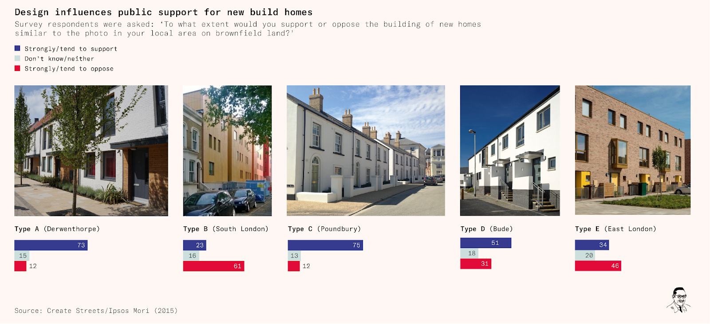

There are also the enormous though little-studied revealed preferences of the private housebuilding market, one of the few contexts where most people’s architectural preferences have unmediated market power.  

此外，私人住宅建筑市场的偏好也是巨大的，尽管对其研究甚少，但这是大多数人的建筑偏好具有非中介市场力量的少数情况之一。  

It seems highly significant that speculative builders, be it in the USA, England or France, continue to build in the vernacular revival styles that have been standard for suburban housing since about the 1870s.  

无论是在美国、英国还是法国，投机性建筑商都继续采用自十九世纪七十年代以来一直作为郊区住宅标准的乡土复兴风格进行建造，这一点似乎非常重要。  

The average ‘Barratt box’ (a pejorative term for the standard mass produced home built in the UK) has brick-faced walls, cottage-style windows, a pitched and tiled roof, a panelled door, and even a fibreglass chimney stack: it is rarely ‘modernist’ in any sense, and it is _never_ brutalist.   

普通的 "巴拉特盒子"（Barratt box，对英国大规模生产的标准住宅的贬义词）有砖砌的墙壁、别墅风格的窗户、倾斜的瓦片屋顶、镶板门，甚至还有玻璃纤维烟囱：从任何意义上讲，它都不是 "现代主义"，也绝不是野蛮主义。

The architectural historian John Summerson, himself sympathetic to the Modern Movement, remarked in 1940 that the public ‘can’t understand modern architecture, never will, and hates it like poison’.  

建筑历史学家约翰-萨默森（John Summerson）本人对现代建筑运动持同情态度，他在 1940 年指出，公众 "无法理解现代建筑，永远也不会理解，对它的憎恨就像毒药一样"。  

This would be a serious exaggeration today, and probably was already in 1940. But it was and remains true that ‘modernist’ styles are relatively inaccessible to the lay public.  

这在今天看来是非常夸张的，可能在 1940 年就已经如此了。但是，"现代主义 "风格对于普通大众来说相对难以接近，这一点过去如此，现在依然如此。

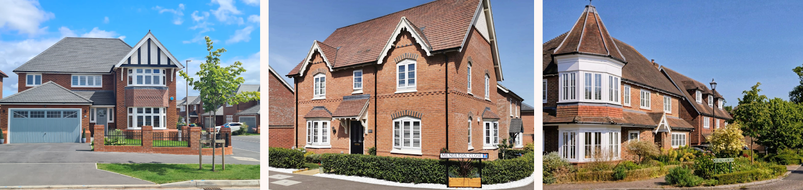

Some recent ‘housebuilder vernacular’ in the UK: in sheerly quantitative terms, something like this is the ‘style of our times’   

英国最近的一些 "住宅建筑商风格"：纯粹从数量上看，类似这样的风格是 "我们时代的风格"。

Image 图片

Robert Kwolek and David Milner, Create Streets  

Robert Kwolek 和 David Milner，创建街道

New American suburban houses are also typically built in styles traditional to the United States  

新建的美国郊区住宅通常也采用美国传统风格

Image 图片

I think the trend towards rising difficulty in most kinds of architecture is concerning, for reasons that do not apply in the case of most other arts.  

我认为，大多数种类的建筑设计难度都呈上升趋势，这一点令人担忧，而其他大多数艺术则不然。  

I am going to look at three of these, having to do with architecture’s character as a _public art_, a _vernacular art_, and a _background art_. In all this, however, I want to remain neutral about whether the best works in challenging styles are better or worse than the best works in easy styles.  

我将探讨其中三个问题，分别涉及建筑作为公共艺术、乡土艺术和背景艺术的特性。不过，在所有这些问题上，我希望保持中立，即具有挑战性风格的最佳作品究竟是优于还是劣于简单风格的最佳作品。  

I also want to remain neutral about why challenging styles rose to ascendancy in the twentieth century, and about whether this was symptomatic of something good, bad or mixed about our culture.  

对于挑战性风格为何在 20 世纪崛起，以及这是否代表了我们文化的好坏或好坏参半，我也希望保持中立。  

These are important questions, about which many interesting things have been written. But I believe we can make a powerful case for ‘easy architecture’ without answering them.   

这些都是很重要的问题，关于这些问题已经有很多有趣的文章。但我相信，不回答这些问题，我们也能为 "简易建筑 "提供有力的论据。

### **3\. The case for easy architecture  

3.简易架构的理由**

The first distinction I want to look at is between private and public arts. A private art is one where the artist and the buyer are the only people who have to experience the work.  

我要探讨的第一个区别是私人艺术和公共艺术。私人艺术是指艺术家和买家是唯一需要体验作品的人。  

Literature is a paradigm of a private art: someone else choosing to read a book almost never directly causes me to have to experience it too.  

文学是私人艺术的典范：别人选择阅读一本书，几乎不会直接导致我也必须体验这本书。  

Music is generally private too: with the exception of muzak in restaurants and music played too loudly by our neighbours, we rarely have to experience others’ musical choices.  

音乐通常也是私密的：除了餐馆里的杂音和邻居播放的过于响亮的音乐之外，我们很少需要体验他人的音乐选择。  

Architecture, by contrast, is to a large extent a public art, at least so far as exteriors are concerned.  

相比之下，建筑在很大程度上是一种公共艺术，至少就外观而言是如此。  

With the exception of the island villas of billionaires, the great majority of those who experience the outside of buildings are _not_ their owners: indeed, a building in a city centre may be experienced by tens of thousands of non-owners every day.  

除了亿万富翁的岛屿别墅之外，绝大多数体验建筑物外部的人都不是其业主：事实上，每天可能有数以万计的非业主体验市中心的一栋建筑物。

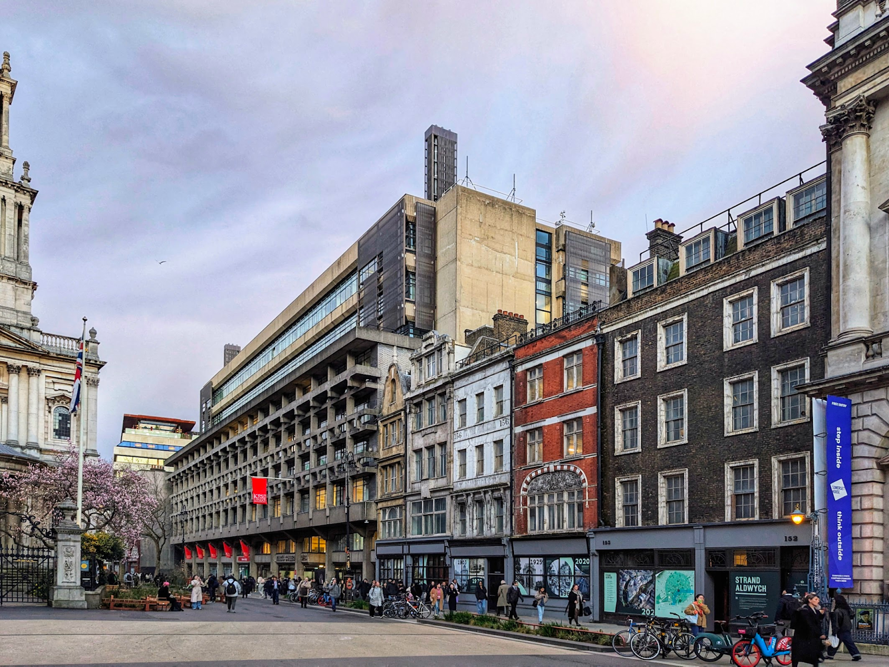

Some people like this building, some do not. But all must experience it  

有些人喜欢这座建筑，有些人不喜欢。但所有人都必须体验它

  

Image 图片

Author’s collection  作者收藏

It should be obvious why this presents a problem for challenging styles. Almost by definition, challenging styles tend to be enjoyed only by more highly versed minorities.  

这对挑战性风格造成的问题是显而易见的。几乎从定义上讲，挑战性的风格往往只有更精通的少数人才会喜欢。  

For a private art form, that need not be a problem: the minority can enjoy its difficult art, while the majority continues to blithely enjoy its easy ones.  

对于一种私人艺术形式来说，这不一定是个问题：少数人可以享受其高难度的艺术，而多数人则继续轻率地享受其简单的艺术。  

The fact that there are people out there listening to Webern and reading Joyce is normally a matter of complete indifference to everyone else listening to Taylor Swift and reading Jack Reacher.  

有人在听韦伯恩的歌，也有人在读乔伊斯的书，这与其他人听泰勒-斯威夫特的歌，读杰克-雷彻的书完全无关。  

But in a public art, the artistic choices of the minority are experienced by everyone.  

但在公共艺术中，少数人的艺术选择是每个人都能体验到的。  

If a style is used that most people dislike, their environment will become to that extent more disagreeable _for them_. If the minority of difficulty-appreciators is disproportionately represented among those who make or influence decisions, then the problem is heightened.  

如果采用了大多数人都不喜欢的风格，他们所处的环境就会因此而变得更加令人不快。如果在决策人或影响决策的人中，欣赏困难的少数人所占比例过大，那么问题就会更加严重。  

Existing evidence suggests that C2DE (roughly, working class) demographic groups tend to have slightly more conservative architectural tastes than ABC1 (roughly, middle class) ones, but postwar social housing tended to be much more stylistically radical than private spec-builder housing of the same period. This is troubling.  

现有证据表明，C2DE（大致指工人阶级）人口群体的建筑品味往往比 ABC1（大致指中产阶级）人口群体略显保守，但战后社会住房在风格上往往比同时期的私人定制住房激进得多。 这一点令人担忧。

This conclusion follows regardless of what view one takes on the broader questions about challenging styles mentioned above.  

无论对上述有关挑战风格的更广泛问题持何种观点，这一结论都是成立的。  

It might be that challenging styles allow for greater and more complex artworks than easy ones do.  

这可能是因为具有挑战性的艺术风格比简单的艺术风格能创作出更伟大、更复杂的艺术作品。  

It might be that their ascendancy reflects the greater openness and creativity of modern cultures. If this is so, their ascendancy in literature and music is something to celebrate.  

它们的崛起可能反映了现代文化的更大开放性和创造性。如果真是这样，那么它们在文学和音乐领域的崛起就值得庆贺了。

But even if it is, the fact that they are displeasing to those without the time or artistic sensitivity to understand them is a problem in the case of architecture.

  

但即便如此，对于那些没有时间或艺术敏感度来理解它们的人来说，它们令人不快的事实在建筑方面也是一个问题。

The second distinction is between what we might call genius and vernacular arts.  

第二个区别是天才艺术和乡土艺术之间的区别。  

A ‘genius art’, as I use the term, is one most people experience through works by a very small minority of artists.  

我所说的 "天才艺术 "是指大多数人通过极少数艺术家的作品体验到的艺术。  

For ease of reference I shall call these the ‘geniuses’, though of course there is an imperfect match between an artist’s being a genius and their work being unusually widely disseminated.  

为了便于参考，我将这些艺术家称为 "天才"，当然，天才与他们的作品被广泛传播之间并不完全匹配。  

A ‘vernacular art’, as I here use the term, is one where most people experience works by a much broader base of artists.  

我这里所说的 "乡土艺术"，是指大多数人都能欣赏到更多艺术家作品的艺术。

Music is a paradigm of a genius art: almost all music to which we listen is written by a tiny minority of composers and songwriters, while the vast majority of composers and songwriters are listened to by almost nobody.  

音乐是天才艺术的典范：我们聆听的几乎所有音乐都是由极少数作曲家和作词家创作的，而绝大多数作曲家和作词家的作品几乎无人聆听。  

The ratio varies from one type of music to another, but [a 2021 report by the Intellectual Property Office](https://www.gov.uk/find-digital-market-research/music-creators-earnings-in-the-digital-era-2021-ipo) found that one percent of artists account for 80% of streaming hours.  

不同类型音乐之间的比例各不相同，但知识产权局 2021 年的一份报告发现，1% 的艺术家占据了 80% 的流媒体播放时长。  

The reason for this pattern is essentially that (a) good music can easily be performed many times, especially once ‘mechanical performances’ from CDs or streaming services are counted; and (b) there is rarely much reason to have bespoke music written for some given purpose.  

造成这种模式的主要原因是：(a) 好的音乐很容易被多次演奏，尤其是将 CD 或流媒体服务中的 "机械演奏 "计算在内；(b) 很少有理由为特定目的定制音乐。  

The exceptions illustrate the rule here.  

例外情况说明了这里的规则。  

It is perfectly possible for composers to write bespoke music for an occasion, like the anthems Handel wrote for the coronation of George II, or songs written for the World Cup today.  

作曲家完全有可能为某个场合量身定做音乐，比如亨德尔为乔治二世加冕礼创作的国歌，或者今天为世界杯创作的歌曲。  

But it is extremely rare – and even this music, if it is good, tends to be listened to on other occasions later.  

但这种情况极为罕见--即使是这种音乐，如果是好的，也往往会在以后的其他场合中再听。

Architecture is near the vernacular end of the continuum: the genius architects are directly responsible for a tiny proportion of the buildings we experience.  

建筑接近于连续体的乡土一端：天才建筑师直接负责的建筑只占我们所见建筑的极小一部分。  

Most great architects probably designed fewer than a hundred buildings: indeed, most buildings are not architect-designed at all (i.e.  

大多数伟大的建筑师设计的建筑可能不到一百座：事实上，大多数建筑根本就不是建筑师设计的（即  

they are put up by builders without consulting an architect). For almost all of us, this will be true of the buildings we care about most – our homes. The reason for this is that it tends to be inconvenient to exactly replicate designs.  

它们是由建筑商在没有咨询建筑师的情况下建造的）。 对几乎所有人来说，我们最关心的建筑--我们的家--都是如此。究其原因，往往是不方便完全复制设计。  

This is not completely true – most Georgian terraced houses had similar facades, for instance, often based on the same pattern books – but on the whole it is not desirable to take a single building by a leading architect and simply repeat it hundreds of thousands of times.  

这种说法并不完全正确--例如，大多数乔治亚时期的排屋都有相似的外立面，而且往往是基于相同的图样书--但总的来说，把一位著名建筑师的单体建筑简单地重复成百上千次是不可取的。

This too is a reason why challenging architectural styles could be more problematic than their equivalents in other media.  

这也是为什么具有挑战性的建筑风格可能比其他媒体中的建筑风格更容易产生问题的原因。  

Inaccessibility does not just make an art harder for audiences: it makes it harder for artists too.  

难以接近不仅使观众难以欣赏艺术，也使艺术家难以欣赏艺术。  

Some of the really challenging styles can yield masterpieces in the hands of masters, but will generate a mess in the hands of minor architects and commercial builders.   

一些真正具有挑战性的风格，在大师的手中可以产生杰作，但在小建筑师和商业建筑商的手中却会造成混乱。

Again, this is not straightforwardly a ‘traditional’ versus ’modernist’ distinction.  

同样，这也不是直截了当的 "传统 "与 "现代 "之分。  

There are, I think, some ‘traditional’ styles that tend towards the difficult or challenging end of the spectrum, and that could not easily be vernacularised.   

我认为，有些 "传统 "风格倾向于高难度或高挑战性，不容易本土化。

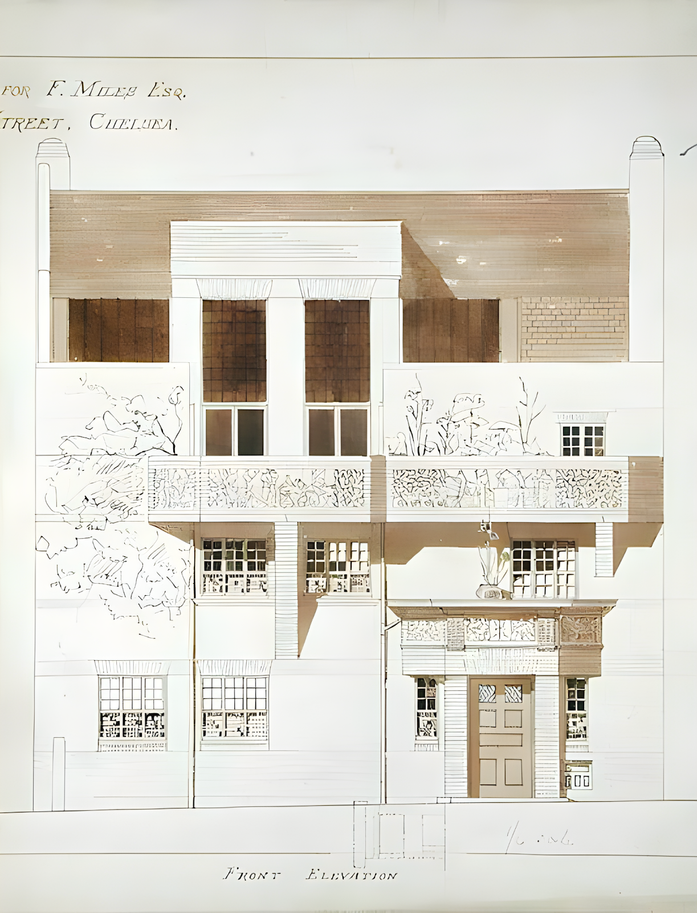

Consider this design by the refined late-Victorian architect EW Godwin for a house in Chelsea.  

请看维多利亚晚期的精致建筑师 EW Godwin 为切尔西的一栋房子所做的设计。  

In my view, this is a successful design, and it is a pity that the Metropolitan Board of Works did not give permission for it to be executed in this form.  

在我看来，这是一个成功的设计，遗憾的是市政工程委员会没有批准以这种形式实施。  

But it would be very hard to emulate its style, except through generating an exact replica.  

但要模仿它的风格非常困难，除非生成一个完全相同的复制品。  

Godwin does not follow any simple rules of thumb on facade composition – he arranges his solids, voids, reliefs, murals and projections with ineffable taste, creating a facade that seems balanced without our knowing quite how.  

戈德温并不遵循任何简单的立面构图规则--他将实体、空隙、浮雕、壁画和投影安排得恰到好处，创造出一种看似平衡的立面，而我们却不知道是如何做到的。  

The murals, sprawling across the facade with no easily describable spatial relationship to the other elements, are a particularly extreme case – they _do_ look right, I think, though it would be so easy for something similar to look wrong.   

这些壁画横跨整个外墙，与其他元素之间没有简单的空间关系，是一个特别极端的例子。

Now imagine Godwin’s style in the hands of our major housebuilders, or indeed in the hands of a traditionally trained but relatively untalented architect.  

现在想象一下，戈德温的风格掌握在我们主要的房屋建筑商手中，或者说掌握在受过传统训练但相对缺乏天赋的建筑师手中。  

Almost certainly, the results would be carnage – superficially similar, but somehow all wrong, each element too big or too small, too high or too low, too extravagant or too sparse.  

几乎可以肯定的是，结果将是大屠杀--表面上相似，但不知何故都是错的，每个元素都太大或太小、太高或太低、太奢侈或太稀疏。

What a volume builder or a minor architect needs is a style that is easy to use, with repeatable elements and straightforward compositional rules of thumb – a style that is easy to get right without genius or even talent.

  

批量建筑商或小建筑师需要的是一种易于使用的风格，具有可重复的元素和简单明了的构图经验法则--一种无需天才甚至天赋就能轻松掌握的风格。

Ease of use is conceptually distinct from the ease of appreciation that we discussed above, but in practice the two are closely interrelated: a builder who cannot appreciate the style they work in is highly unlikely to be able to design effectively in it.

  

易用性在概念上有别于我们上面讨论的易鉴赏性，但在实践中，二者是密切相关的：一个不能鉴赏其工作风格的建筑师，是很难有效地进行设计的。

Ease of use _is_ surely one of the great virtues of the Georgian or ‘Palladian’ style: as the architectural historian David Lewis once remarked to me, one can mass-produce perfectly serviceable ‘Palladian footsoldiers’ to an extent that is true of few other styles.  

易用性无疑是乔治亚或 "帕拉迪奥 "风格的一大优点：正如建筑历史学家大卫-刘易斯曾对我说过的那样，人们可以大量生产完全适用的 "帕拉迪奥步兵"，而其他风格则很少能做到这一点。  

Consider this house in York, of similar size and purpose to Godwin’s design in Chelsea.  

约克郡的这栋房屋与戈德温在切尔西设计的房屋面积和用途相似。  

Every element has been standardised for centuries, and the underlying facade pattern has been used literally millions of times – hardly an ounce of creativity was required of its designer – and the result is still just about perfect.  

几个世纪以来，每一个元素都已标准化，基本的外墙图案也被使用了数百万次，几乎不需要设计者有一丝一毫的创造力，但结果仍然是近乎完美的。

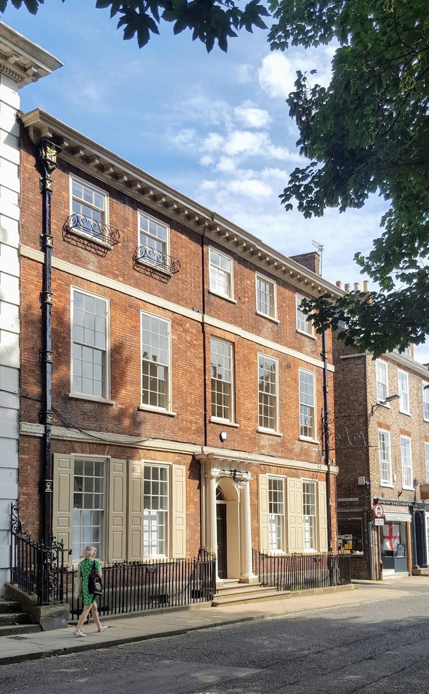

The work of a ‘Palladian footsoldier’ in York  

约克 "帕拉迪奥步兵 "的作品

Image 图片

Author’s collection  作者收藏

Turn now to possibly the most contentious style of all, brutalism. Many people can name some brutalist buildings for which they have at least qualified affection.  

现在来看看可能是最有争议的风格--野蛮主义。许多人都能说出一些他们至少有资格喜欢的野蛮主义建筑。  

Here are some of mine: the Barbican Centre, Harvey Court in Cambridge, Clifton Cathedral, the Alexandra and Ainsworth Estate in St John’s Wood, the old Academy of Arts in Berlin, Our Lady Help of Christians in Birmingham.  

以下是我的一些作品：巴比肯中心（Barbican Centre）、剑桥的哈维宫（Harvey Court）、克利夫顿大教堂（Clifton Cathedral）、圣约翰伍德的亚历山德拉和安斯沃思庄园（Alexandra and Ainsworth Estate in St John's Wood）、柏林的旧艺术学院（Academy of Arts in Berlin）、伯明翰的基督圣母会（Our Lady Help of Christians）。

But the kind of genius that created these buildings is not widespread, and it is much less clear that the style is safe in the hands of talentless architects or commercial builders.

  

但是，创造这些建筑的那种天才并不普遍，而这种风格在没有天赋的建筑师或商业建筑商手中是否安全就更不清楚了。

My own views on the style will always be conditioned by the brutalist building I know best, on a street I visit often in North London. 

  

我对这种风格的看法始终受制于我最熟悉的一座野蛮主义建筑，它位于伦敦北部一条我经常光顾的街道上。

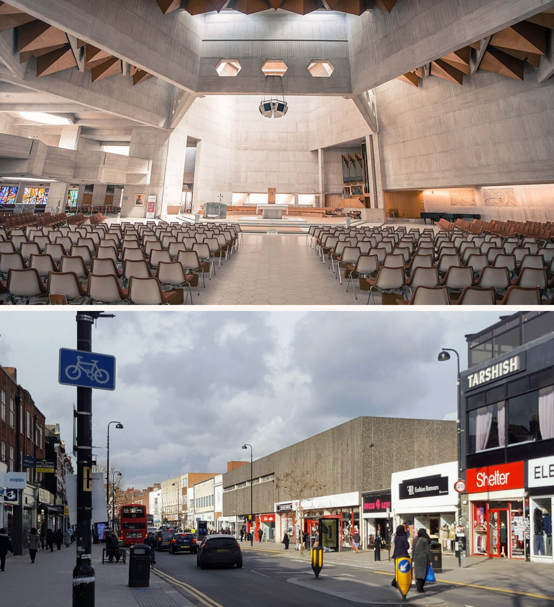

Clifton Cathedral: brutalism with genius. A street in North London: brutalism without genius.  

克利夫顿大教堂：天才的野蛮主义。伦敦北部的一条街道：没有天才的野蛮主义。

Image 图片

Along with private/public and genius/vernacular, there is an important distinction between foreground and background arts.  

除了私人/公共和天才/乡土，前景艺术和背景艺术之间也有重要区别。  

A ‘foreground art’ is one that is paradigmatically enjoyed as the centre of one’s attention.  

前台艺术 "是指作为注意力中心的范例艺术。  

Literature and film are clear foreground arts: it is impossible to enjoy either without concentrating on them.  

文学和电影显然是前台艺术：如果不专注于这两种艺术，就不可能享受其中的任何一种。  

Music is traditionally thought of as a foreground art, though people often do enjoy listening to music in the background too. Painting can be either.  

音乐在传统上被认为是一种前景艺术，尽管人们通常也喜欢听背景音乐。绘画既可以是前景艺术，也可以是背景艺术。  

By contrast, architecture is normally a background art.  

相比之下，建筑通常是一种背景艺术。  

While it is of course possible to contemplate or study a building, most people almost never do this, and even lovers of architecture do it much less than they experience buildings in the background.  

对建筑进行思考或研究当然是可能的，但大多数人几乎从不这样做，即使是建筑爱好者也很少这样做，而只是在背景中体验建筑。  

Overwhelmingly, we experience architecture while doing and thinking about other things.  

绝大多数情况下，我们都是在做其他事情和思考其他事情时体验建筑的。  

In this respect architecture is more akin to dress, ceramics or furniture design than it is to the ‘fine arts’.  

在这方面，建筑与服饰、陶瓷或家具设计相比，更像是 "美术"。

What one wants of a background art depends on what it is a background to. Some activities benefit from quite specific background arts.  

人们对背景艺术的要求取决于它是什么背景。有些活动需要特定的背景艺术。  

People may want psychedelic background music in a bar, Mozart divertimenti at a formal drinks reception, and wholly vapid music in a hotel lift.  

人们可能希望在酒吧里听到迷幻的背景音乐，在正式的酒会上听到莫扎特的小品，而在酒店电梯里听到的音乐则完全是空洞的。  

The same is, to some extent, true of architecture, especially in respect of interiors.  

在某种程度上，建筑也是如此，尤其是室内设计。  

The interiors of churches, pubs, offices, patisseries, royal palaces, hairdressers’, nurseries, law courts and art galleries are all carefully designed as backgrounds for the activities that take place in them, each with its own particular vibe.    

教堂、酒馆、办公室、糕点店、皇宫、理发店、托儿所、法院和美术馆的内部装饰都经过精心设计，为在其中开展的活动提供背景，每一种都有其独特的氛围。

When it comes to the exteriors of buildings, though, we don’t tend to be able to match architecture to activities in such a neat way, for reasons having to do with architecture’s character as a public art.  

不过，说到建筑物的外观，我们往往无法将建筑与活动如此巧妙地结合起来，这与建筑作为公共艺术的特性有关。  

Buildings’ exteriors serve as backgrounds to a huge range of activities. In my view, this generates constraints on what we want them to look like.  

建筑物的外部是各种活动的背景。在我看来，这对我们希望它们看起来是什么样子产生了限制。  

The streets of a city are places of work and play, of sickness and health, of triumph and grief.  

城市的街道是工作和娱乐、疾病和健康、胜利和悲伤的场所。  

To all this, buildings owned by strangers form the involuntary backdrop, and for this reason, we often want them to be as we want strangers to be: polite, courteous, friendly and unintrusive.  

对于这一切，陌生人所拥有的建筑构成了非自愿的背景，因此，我们常常希望他们像我们希望陌生人那样：彬彬有礼、彬彬有礼、友好、不扰民。  

Strangers on a train who won’t stop telling jokes or talking about their deepest fears are not usually welcome, though humour is a virtue and people’s deepest fears are often interesting.   

尽管幽默是一种美德，人们内心深处的恐惧往往也很有趣，但火车上那些不停地讲笑话或谈论自己内心深处恐惧的陌生人通常并不受欢迎。

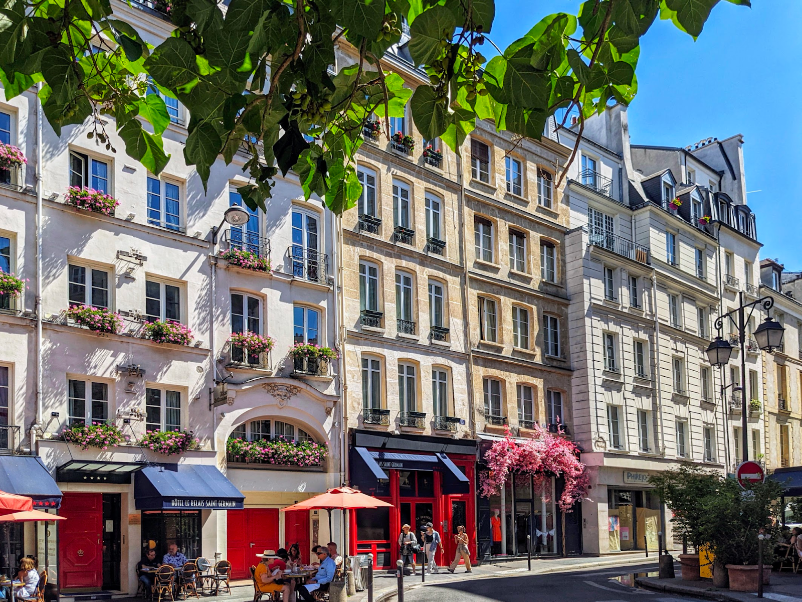

A good background to everyday life  

日常生活的良好背景

Image 图片

Author’s collection  作者收藏

The problem this poses for difficult styles will be clear enough. There _are_ contexts in which we want objectionable background arts: the background music of horror films tends to be atonal, for instance.  

这给高难度风格带来的问题是显而易见的。在某些情况下，我们需要令人反感的背景音乐：例如，恐怖电影的背景音乐往往是无调性的。  

But most people don’t want their everyday lives to be like horror films: they want them to take place against a polite, friendly, but otherwise fairly neutral context.  

但大多数人并不希望自己的日常生活像恐怖电影一样：他们希望日常生活发生在一个礼貌、友好，但在其他方面相当中立的环境中。  

An easy style, enjoyable on a basic level with minimal effort, is naturally suited to this; a challenging style, opaque and perhaps forbidding without work from its audience, is less so.  

轻松的风格，只需极少的努力就能获得基本的享受，自然适合于这种风格；而具有挑战性的风格，不透明，也许会让受众不费吹灰之力就无法接受，就不那么适合了。

### **4\. Concluding remarks 4.结束语**

What makes an easy style? There is no short answer to this question.  

什么是简易风格？这个问题没有简短的答案。  

Maybe ornament has something to do with it, but there are easy styles almost without ornament, like vernacular architecture all over the world ([an example](https://twitter.com/SCP_Hughes/status/1410545155518705668)), and even the [simpler end of Georgian design](https://en.wikipedia.org/wiki/Georgian_architecture#/media/File:Baggot_Street_Lower_2.jpg) in the British Isles. Maybe [natural materials](https://twitter.com/SCP_Hughes/status/1393881746253418496) play a role, but the [cast iron architecture](https://en.wikipedia.org/wiki/Cast-iron_architecture) of the nineteenth century is beloved by all. Maybe [formal or symmetrical facade composition](https://twitter.com/SCP_Hughes/status/1372901814006386688) is involved, but there are numerous old styles that frequently arrange doors and windows across facades without much visible logic.  

也许装饰与此有关，但也有几乎不带装饰的简易风格，比如世界各地的乡土建筑（举例来说），甚至是不列颠群岛乔治亚设计风格中较为简单的一端。也许天然材料在其中发挥了作用，但十九世纪的铸铁建筑却受到了所有人的喜爱。也许形式上或对称的立面构图起了作用，但有许多古老的建筑风格经常在立面上安排门窗，而没有明显的逻辑性。  

Ease and difficulty in architecture involve a cluster of quite complicated and interrelated features, not a single or dominant one.  

建筑的难易程度涉及一系列相当复杂且相互关联的特征，而不是单一或主要的特征。

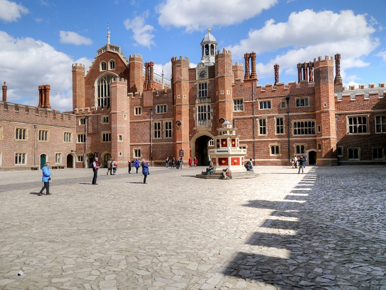

Hampton Court Palace: there is no discernible pattern to the windows, but this hardly seems like demanding or proto-modernist architecture  

汉普顿宫：窗户上没有明显的图案，但这不像是要求很高的建筑，也不像是原现代主义建筑

Image 图片

The case for easy styles is perhaps best summarised by returning to a comparison with music.   

通过与音乐的比较，也许可以最好地概括简易风格的理由。

Atonality in music is the use of all the notes of the chromatic scale, including combinations of notes that would be considered out of key relative to one another by normal standards, that emerged during the 20th century.  

音乐中的 "非调性 "是指使用半音阶的所有音符，包括使用按照正常标准会被认为是偏离调性的音符组合，这种现象出现于 20 世纪。  

It is the most conspicuous driver of the increasing difficulty of modern classical music, which now sets it apart from classical music from before the 1900s, and essentially all popular and folk music to this day.  

它是现代古典音乐难度不断增加的最显著推动力，使其有别于 20 世纪之前的古典音乐，以及至今所有的流行音乐和民间音乐。  

All musically sensitive people agree that there is good atonal music and bad tonal music, but it is also obvious that atonal styles tend to be harder for most people to appreciate.  

所有对音乐敏感的人都同意，有好的无调性音乐，也有坏的调性音乐，但同样显而易见的是，无调性风格往往更难被大多数人欣赏。  

The revealed preference evidence is, as ever, the clearest: atonal music seldom appears even in the classical concert repertoire, and it is even rarer in popular music.  

揭示的偏好证据一如既往地最为清晰：即使在古典音乐会曲目中也很少出现无调性音乐，而在流行音乐中则更为罕见。  

Its one great breakthrough into popular culture is in film and television soundtracks, where it is frequently used to generate unease and tension.  

它在大众文化中的一个重大突破是在电影和电视配乐中，经常被用来制造不安和紧张气氛。

Imagine if atonal music were played on loudspeakers across the towns and cities of the country. The vast majority of it was not written by gifted composers, [such as Arnold Schoenberg](https://www.youtube.com/watch?v=_cmWgll8T4c), but by commercial muzak producers, so even when one troubled to listen carefully to it, it would rarely be of any interest.  

试想一下，如果全国各城镇的扩音器都在播放无调性音乐，那将会是怎样一番景象。这些音乐绝大多数不是由阿诺德-勋伯格等天才作曲家创作的，而是由商业杂音制作者制作的，因此，即使人们费心去仔细聆听，也很少会有兴趣。  

Everywhere someone went, except indoors and in the countryside, this disconcerting sound would follow them, making every street and square into a slightly uneasy and alienating place.  

除了室内和乡村，无论人们走到哪里，这种令人不安的声音都会如影随形，让每条街道和每个广场都变得略显不安和疏离。  

The citizens of such a country would tend to flee its public spaces; the countryside would be intensely valued for its ‘quiet’; its cities would struggle perennially against decline.  

这样一个国家的公民往往会逃离其公共空间；乡村因其 "宁静 "而备受珍视；城市则常年在衰败中挣扎。  

Substitute architecture for music and, it seems to me, a little like the world we actually live in.  

用建筑代替音乐，在我看来，有点像我们实际生活的世界。

In other words, tonality plays roughly the role for music that easy-ness plays for architecture. Or to put it the other way round, easy-ness is ‘architectural tonality’.   

换句话说，调性在音乐中扮演的角色与易性在建筑中扮演的角色大致相同。或者反过来说，简易性就是 "建筑的调性"。

Earlier in this essay, I mentioned ‘goodism’, the view that we should simply favour good works over bad ones. Goodism is obviously sort of true.  

在这篇文章的前半部分，我提到了 "善行主义"，即认为我们应该只做好事而不做坏事。好人主义显然是对的。  

We all have reason to be goodists about music, learning to love and appreciate good atonal music as we appreciate music of other kinds.  

我们每个人都有理由成为音乐好手，学会热爱和欣赏优秀的无调性音乐，就像欣赏其他类型的音乐一样。  

In some contexts – say when we are looking round a foreign city as tourists – we should be goodists about architecture too, admiring good ‘atonal’ buildings for their goodness and not worrying about their atonality.  

在某些情况下，比如当我们以游客的身份游览一座外国城市时，我们也应该对建筑持善意的态度，欣赏优秀的 "无调性 "建筑的优点，而不是担心它们的无调性。  

If we were building a pavilion in a desert, we might also have reason to be goodists in making our design decisions.  

如果我们要在沙漠中建造一座展馆，我们也有理由在做出设计决定时从善如流。

But goodism is not the whole story about architecture. Buildings can be good – even great – in ways that are inaccessible to the people who have to live with them.  

但 "好 "并不是建筑的全部。建筑可以是好的，甚至是伟大的，但必须与之共处的人们却无法理解。  

They can be great in ways that are impossible to scale into a vernacular style. And they can be great in ways that are completely unwelcome as a background to everyday life.  

它们可以是伟大的，但却无法将其融入本土风格。作为日常生活的背景，它们也可以是完全不受欢迎的。  

If we pursue architectural goodness or greatness without regard for these facts, we will produce cities that are deeply inhospitable for their inhabitants – as we have sometimes done.  

如果我们不顾这些事实，一味追求建筑的美观或伟大，我们所建造的城市就会像我们有时所做的那样，对其居民来说非常不友好。  

So we should not pursue goodness without regard for these facts: unqualified goodism is therefore mistaken.   

因此，我们不应不顾这些事实而追求善：因此，无条件的善主义是错误的。

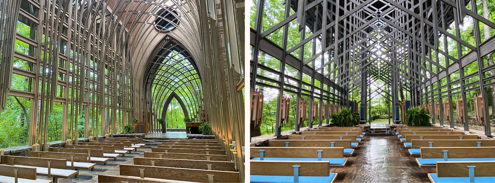

The chapels of E Fay Jones. A flowering of ‘tonal architecture’ in late twentieth-century rural Arkansas?  

E Fay Jones 的小教堂。二十世纪末阿肯色州乡村 "色调建筑 "之花？

Image 图片

Mildred B Cooper Memorial Chapel (

[wikipedia](https://commons.wikimedia.org/wiki/File:Mildred_B._Cooper_Chapel_interior.jpg)) and Thorncrown Chapel (

[wikipedia](https://commons.wikimedia.org/wiki/File:Thorncrown_Chapel_interior.jpg))  

米尔德里德-B-库珀纪念教堂（维基百科）和索恩克朗教堂（维基百科）

It is obvious that architecturally easy, or ‘tonal’, styles do not have to be ‘traditional’ or old ones.  

很明显，建筑风格简洁或 "调性 "并不一定是 "传统 "或古老的风格。  

Some strands of ‘modernist’ architecture were relatively accessible even in the most austere years – in my view Jørn Utzon, Saarinen, Geoffrey Bawa, Frank Lloyd Wright, Minette da Silva and the Eames Office are examples – and lots of non-traditional architects today are trying to establish novel ways of building that have broad and deep appeal.  

在我看来，约恩-乌特松（Jørn Utzon）、沙里宁（Saarinen）、杰弗里-巴瓦（Geoffrey Bawa）、弗兰克-劳埃德-赖特（Frank Lloyd Wright）、米内特-达-席尔瓦（Minette da Silva）和伊姆斯事务所（Eames Office）就是其中的代表。  

We should all hope they succeed. On the other hand, I don’t think there is any general reason why we _have_ to employ new styles, [as I have argued elsewhere](https://worksinprogress.co/issue/in-praise-of-pastiche). Most of the old styles had broad and deep appeal all along, and they are all still there, waiting for us. We need not be afraid to use them.  

我们都应该希望他们取得成功。另一方面，我不认为我们有任何普遍理由必须采用新的风格，正如我在其他地方所论证的那样。大多数旧文体一直具有广泛而深刻的吸引力，它们都还在那里，等待着我们。我们不必害怕使用它们。

1

A note on terminology. I am going to use the term ‘modernist’ to refer to the family of styles descended from the original Modern Movement in the 1920s.  

关于术语的说明。我将使用 "现代主义 "一词来指 20 世纪 20 年代最初的现代运动所产生的各种风格。  

This use of ‘modernist’ is something of a solecism, because in architectural history ‘modernism’ is normally just used to refer to a subset of those styles.  

对 "现代主义 "的使用是一种独白，因为在建筑史中，"现代主义 "通常只是指这些风格的一个子集。  

But there is no obviously better alternative, so we shall have to make do. I leave the word in inverted commas throughout as a reminder that I use it in this spirit.  

但显然没有更好的选择，所以我们只能将就。我把这个词始终放在倒逗号里，以提醒大家我是本着这种精神来使用它的。  

For reasons that will soon become apparent, ‘traditionalism’ is a similarly troublesome term, and I leave it in inverted commas for the same reason.  

传统主义 "也是一个令人头疼的词，出于同样的原因，我把它放在逗号里。

2

In certain milieux, there is intense interest in the idea that this characteristic is the presence of ‘fractals’, meaning roughly recurring patterns at multiple scales.  

在某些领域，人们对 "分形 "这一概念产生了浓厚的兴趣。"分形 "是指在多个尺度上大致重复出现的模式。  

My view is that recurring patterns at multiple scales _are_ important in a lot of buildings, but the claim that fractals are the key feature that distinguishes the styles that ‘traditionalists’ like is riddled with counterexamples.  

我的观点是，多种尺度的重复图案在很多建筑中都很重要，但分形是 "传统主义者 "所喜欢的风格的关键特征这一说法存在很多反例。  

This is not the place, however, in which to enter into this somewhat esoteric debate.  

然而，这里并不是进行这种有点深奥的辩论的地方。

3

A review of the older literature is available [here](http://web.archive.org/web/20211029204634/https://worksinprogress.co/architectural-preferences-in-the-uk/); some later literature is reviewed [here](https://www.createstreets.com/wp-content/uploads/2019/09/Architecture-for-Architects-Milner-Salingaros.pdf); there is a comprehensive review in [this book](https://www.createstreets.com/employees/heart-in-the-right-street/); see also [this](https://policyexchange.org.uk/blogs/poll-finds-public-support-for-traditional-hospital-design/) survey, [this](https://mailchi.mp/policyexchange/place-matters-1?e=474894df23) survey, and [this](https://www.civicart.org/americans-preferred-architecture-for-federal-buildings) survey.   

这里有较早的文献综述；这里有一些较晚的文献综述；本书有全面的综述；另见本调查、本调查和本调查。

4

 See the studies linked above in footnote 3.  

参见上文脚注 3 中链接的研究。

5

 Antoni Gaudí, perhaps the world’s most celebrated architect, designed [17](https://en.wikipedia.org/wiki/List_of_Gaud%C3%AD_buildings) buildings; Sir Christopher Wren oversaw around [100](https://en.wikipedia.org/wiki/List_of_works_by_Christopher_Wren)  

安东尼-高迪可能是世界上最著名的建筑师，他设计了 17 座建筑；克里斯托弗-雷恩爵士设计了约 100 座建筑。.
