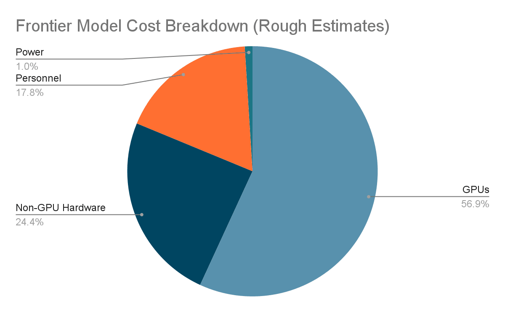
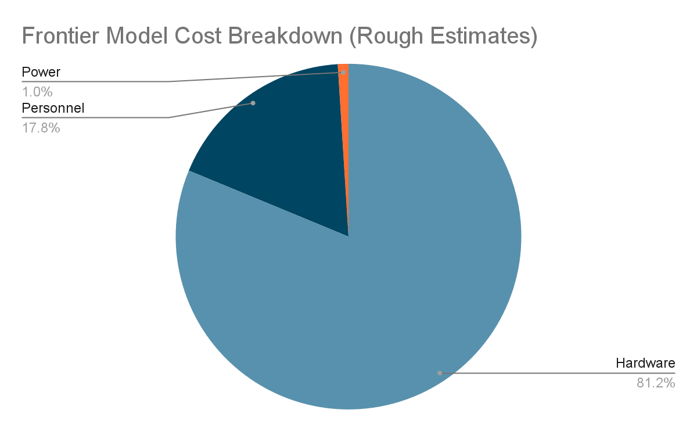
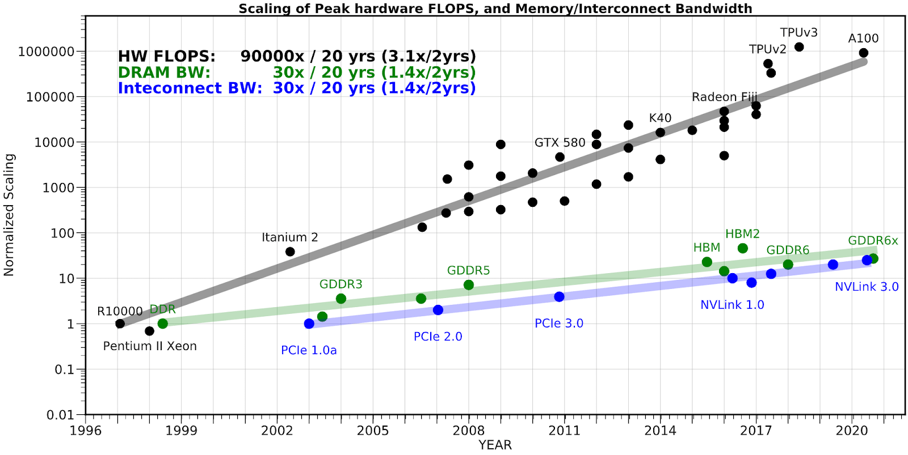
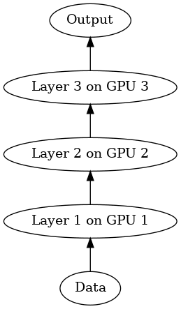
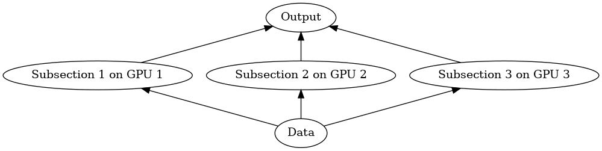
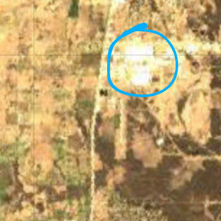

> #CM 老实说，这篇文章我很大部分看不懂，借助 AI 总结&解释了解了一个框架，保存是为了存档，后续可能查阅 LLM 资料的时候需要用到；

Understanding what drives the rising capabilities of AI is important for those who work to forecast, regulate, or ensure the safety of AI.  

对于从事人工智能预测、监管或确保安全工作的人来说，了解人工智能能力不断提升的驱动因素非常重要。  

Regulations on the export of powerful GPUs need to be informed by understanding of how these GPUs are used, forecasts need to be informed by bottlenecks, and safety needs to be informed by an understanding of how the models of the future might be trained.  

关于出口功能强大的 GPU 的规定需要了解这些 GPU 的使用方式，预测需要了解瓶颈问题，安全需要了解未来模型的训练方式。  

A clearer understanding would enable policy makers to target regulations in such a way that they are difficult for companies to [circumvent with only technically compliant GPUs](https://www.tomshardware.com/news/nvidia-gimps-h100-hopper-gpu-to-sell-as-h800-to-china), forecasters to avoid focus on [unreliable metrics](https://docs.google.com/document/d/e/2PACX-1vT94P_qrkYq5D5rD2tlNDD3I3mnfzNOhMSNIemp3-KdE1e7qSEsvXRZQv7a3_Z1fVLxc7tltNgN2Tcp/pub#h.g5d5897qnsfc), and technical research working on mitigating the downsides of AI to understand [what data models might be trained on](https://docs.google.com/document/d/e/2PACX-1vT94P_qrkYq5D5rD2tlNDD3I3mnfzNOhMSNIemp3-KdE1e7qSEsvXRZQv7a3_Z1fVLxc7tltNgN2Tcp/pub#h.apsafl4txsk7).    

有了更清晰的认识，政策制定者就能有的放矢地制定法规，使企业难以仅使用技术上合规的 GPU 来规避法规；预测人员就能避免将重点放在不可靠的指标上；致力于减少人工智能弊端的技术研究人员就能了解可能会对哪些数据模型进行训练。

This doc is built from a collection of smaller docs I wrote on a bunch of different aspects of frontier model training I consider important.  

本文档由我编写的一系列小型文档组成，涉及我认为重要的前沿模型训练的多个不同方面。  

I hope for people to be able to use this document as a collection of resources, to draw from it the information they find important and inform their own models.  

我希望人们能够将本文件作为资源集，从中汲取他们认为重要的信息，并为他们自己的模型提供参考。

I do not expect this doc to have a substantial impact on any serious AI labs capabilities efforts - I think my conclusions are largely discoverable in the process of attempting to scale AIs or for substantially less money than a serious such attempt would cost.  

我并不指望这篇论文会对任何严肃的人工智能实验室能力建设工作产生实质性影响--我认为我的结论在很大程度上是可以在尝试扩展人工智能的过程中发现的，或者花比严肃的人工智能尝试少得多的钱就能发现。  

Additionally I expect major labs already know many of the things in this report.  

此外，我估计各大实验室已经知道本报告中的许多内容。

## Acknowledgements 致谢

I’d like to thank the following people for their feedback, advice, and discussion:  

我要感谢以下人士的反馈、建议和讨论：

-   James Bradbury, Software Engineer, Google DeepMind  
    
    詹姆斯-布拉德伯里，谷歌 DeepMind 软件工程师
-   Benjamin Edelman, Ph.D. Candidate, Harvard University  
    
    本杰明-埃德尔曼，哈佛大学博士候选人
-   Horace He, Software Engineer, PyTorch/Meta  
    
    Horace He，软件工程师，PyTorch/Meta
-   Lukas Finnveden, Research Analyst, Open Philanthropy Project  
    
    开放慈善项目研究分析员 Lukas Finnveden
-   Joanna Morningstar, Chief Scientific Officer, Nanotronics  
    
    Joanna Morningstar，纳米电子公司首席科学官
-   Keller Scholl, Ph.D. Candidate, Pardee RAND Graduate School  
    
    Keller Scholl，帕迪兰德研究生院博士候选人
-   Jaime Sevilla, Director, Epoch  
    
    海梅-塞维利亚，大纪元总监
-   Cody Wild, Research Engineer, Google  
    
    科迪-怀尔德，谷歌研究工程师

## Index 索引

[Cost Breakdown of ML Training  

ML 培训成本细目](https://docs.google.com/document/d/e/2PACX-1vT94P_qrkYq5D5rD2tlNDD3I3mnfzNOhMSNIemp3-KdE1e7qSEsvXRZQv7a3_Z1fVLxc7tltNgN2Tcp/pub#h.q4i6cuur5ejr)

Estimates the costs of training a frontier (state of the art) model, drawing on leaks and analysis. Power usage is a small portion of the cost, GPUs are likely a slim majority.  

利用泄露信息和分析，估算训练前沿（最先进）模型的成本。功耗只占成本的一小部分，GPU 可能占绝大部分。

[Why ML GPUs Cost So Much  

为什么 ML GPU 的成本如此之高](https://docs.google.com/document/d/e/2PACX-1vT94P_qrkYq5D5rD2tlNDD3I3mnfzNOhMSNIemp3-KdE1e7qSEsvXRZQv7a3_Z1fVLxc7tltNgN2Tcp/pub#h.e1ayykcf3smu)

ML GPUs are expensive largely because of their communication and memory capabilities - not because of their processing power.  

ML GPU 之所以昂贵，主要是因为其通信和内存能力，而不是因为其处理能力。  

NVIDIA’s best gaming GPU provides greater ML processing power than the GPU used to train GPT-4, for only a tenth the price.  

英伟达™（NVIDIA®）公司最好的游戏 GPU 提供了比用于训练 GPT-4 的 GPU 更强大的 ML 处理能力，而价格仅为 GPT-4 的十分之一。  

Note that NVIDIA’s near monopoly plausibly explains some of the price differential.  

需要注意的是，英伟达近乎垄断的地位似乎可以解释部分价格差异。

[Contra FLOPs 反向 FLOP](https://docs.google.com/document/d/e/2PACX-1vT94P_qrkYq5D5rD2tlNDD3I3mnfzNOhMSNIemp3-KdE1e7qSEsvXRZQv7a3_Z1fVLxc7tltNgN2Tcp/pub#h.g5d5897qnsfc)

Argues that the most common metric of ML computing power - floating point operations - is flawed, due to the rise of different types of floating point numbers making standardization difficult and the cost of processing power representing a small portion of the cost of ML.  

认为衡量 ML 计算能力的最常用指标--浮点运算--是有缺陷的，因为不同类型浮点数的增加使得标准化变得困难，而且处理能力的成本只占 ML 成本的一小部分。

[ML Parallelism ML 并行性](https://docs.google.com/document/d/e/2PACX-1vT94P_qrkYq5D5rD2tlNDD3I3mnfzNOhMSNIemp3-KdE1e7qSEsvXRZQv7a3_Z1fVLxc7tltNgN2Tcp/pub#h.wdy8qwubysry)

An overview of ML parallelism techniques, showing how the common notion that “ML is [embarrassingly parallel](https://en.wikipedia.org/wiki/Embarrassingly_parallel)” is simplistic and breaks down at large scales - where any simple method of parallelizing a model starts to hit bottlenecks as the capabilities of individual devices become bottlenecks regardless of the number of devices involved.  

对 ML 并行性技术进行概述，说明 "ML 并行性令人尴尬 "这一常见概念是如何被简单化的，以及在大规模情况下是如何被打破的--在大规模情况下，任何简单的模型并行化方法都会开始遇到瓶颈，因为无论涉及多少设备，单个设备的能力都会成为瓶颈。

[We (Probably) Won’t Run Out of Data  

我们（可能）不会耗尽数据](https://docs.google.com/document/d/e/2PACX-1vT94P_qrkYq5D5rD2tlNDD3I3mnfzNOhMSNIemp3-KdE1e7qSEsvXRZQv7a3_Z1fVLxc7tltNgN2Tcp/pub#h.apsafl4txsk7)

There are many routes toward preventing data from becoming a major bottleneck to ML scaling, though it’s not certain any of them enable scaling as fast as has occurred historically.  

要防止数据成为阻碍 ML 扩展的主要瓶颈，有很多方法，但不能肯定任何一种方法都能像历史上那样快速扩展。

[AI Energy Use and Heat Signatures  

人工智能能源使用和热信号](https://docs.google.com/document/d/e/2PACX-1vT94P_qrkYq5D5rD2tlNDD3I3mnfzNOhMSNIemp3-KdE1e7qSEsvXRZQv7a3_Z1fVLxc7tltNgN2Tcp/pub#h.bsosdgecdqu2)

ML energy usage may become important in the near future, even if it’s a relatively minor concern for frontier model training right now.  

在不久的将来，ML 的能耗可能会变得非常重要，即使它现在对前沿模型训练来说只是一个相对次要的问题。  

If current trends continue, energy usage could limit scaling, determine major engineering challenges, and provide a novel approach to surveillance of training runs using satellites and multispectral photography.  

如果目前的趋势继续下去，能源的使用可能会限制规模的扩大，确定主要的工程挑战，并提供一种利用卫星和多光谱摄影监控训练运行的新方法。

## Cost Breakdown of ML Training  

ML 培训成本细目

This section is an attempt to estimate the amount of costs associated with training a state of the art ML model, specifically in terms of the amount of capital that is required.  

本节试图估算与训练最先进的 ML 模型相关的成本，特别是所需的资本数额。  

It’s not a detailed forecasting attempt, but instead is meant to serve as a default source for anyone who wants to know the basics - such as whether power usage is a major expense right now (it’s not) or whether GPUs account for the majority of the cost (probably, but only a slim majority).  

这不是一次详细的预测尝试，而是要为任何想了解基本情况的人提供一个默认的信息来源，例如电力使用是否是目前的主要支出（不是），或者 GPU 是否占了大部分成本（可能是，但只是很小的一部分）。  

I hope this helps people prioritize their research agendas and serves as a jumping off point.  

我希望这能帮助人们确定研究议程的优先次序，并作为一个起点。

Note that I focus specifically on what it takes to train a model that is competitive with the best models at the time of its release.  

请注意，我特别关注的是，要训练出一个在发布时能与最佳模型竞争的模型，需要付出哪些努力。  

As of now GPT-4 is the only publicly acknowledged model in this class and so I will pay special attention to it, though I also use leaks about forthcoming frontier models to augment my analysis<a href="https://www.lesswrong.com/posts/nXcHe7t4rqHMjhzau/report-on-frontier-model-training#fnldni1dmval">[1]</a>.  

到目前为止，GPT-4 是该类模型中唯一公开承认的模型，因此我将特别关注它，不过我也会利用即将推出的前沿模型的信息来扩充我的分析 <a href="https://www.lesswrong.com/posts/nXcHe7t4rqHMjhzau/report-on-frontier-model-training#fnldni1dmval">[1]</a> 。

In this section I’ll be breaking down what I think this money is actually being spent on, and how we might expect this to evolve over time.  

在本节中，我将详细介绍我认为这笔钱的实际用途，以及随着时间的推移，我们可以如何预期这笔钱的使用情况。  

I’m not going to be doing specific forecasting here, though I hope this can serve as a guideline to those who do.  

我不会在这里做具体的预测，但我希望这能为那些做预测的人提供指导。  

Additionally I hope this is useful for policy makers analyzing how to most effectively regulate training runs by demonstrating what parts of training are most expensive.  

此外，我希望这对政策制定者分析如何最有效地规范培训办学很有帮助，因为这说明了培训的哪些部分最昂贵。  

A few major takeaways: 几个主要收获

-   New state of the art (frontier) models will likely cost on the order of a billion dollars, with the most recent frontier model, GPT-4, having cost approximately half a billion dollars.  
    
    新的最先进（前沿）模型的成本可能在 10 亿美元左右，最近的前沿模型 GPT-4 的成本约为 5 亿美元。
-   The cost of a frontier model is (roughly) 80% supercomputer hardware, 18% personnel, and 2% power.  
    
    前沿模型的成本（大致）为 80% 的超级计算机硬件、18% 的人员和 2% 的电力。
-   ML supercomputer hardware cost is split about 70/30 between GPUs and other hardware (mostly meant for helping GPUs communicate with each other rapidly).  
    
    ML 超级计算机的硬件成本约 70/30 由 GPU 和其他硬件（主要用于帮助 GPU 快速相互通信）分担。
-   The internal and external communication capabilities of ML GPUs account for the vast majority of their cost.  
    
    ML GPU 的内部和外部通信能力占其成本的绝大部分。

## Defining “Cost” 定义 "成本

I define the cost of a frontier model as the amount of money a company needs to spend to create a frontier model. In practice I use the following formula:  

我将前沿模型的成本定义为公司创建前沿模型所需的费用。在实践中，我使用以下公式：

_Cost = Hardware Cost + Operating Expenditures During Creation  

成本 = 硬件成本 + 创建期间的运营支出_

Where “_Hardware Cost_” refers to the cost of purchasing all the hardware necessary for the training run, and the “_Operating Expenditures During Creation_” refers to the sum of the amount of money spent on energy, salaries, maintenance, and other operating expenses during the time the model is designed and trained (I think one year is a good upper bound on this time period).  

其中，"硬件成本 "指的是购买培训运行所需的所有硬件的成本，而 "创建期间的运营支出 "指的是在模型设计和培训期间（我认为一年是这个时间段的一个很好的上限），用于能源、工资、维护和其他运营支出的金额总和。

Most analysts differ from me on this, using the cost of renting GPUs for the training run based on prices that require multi-year commitments that continue after the model has been created.  

在这一点上，大多数分析师与我的看法不同，他们使用租用 GPU 进行训练运行的成本是基于需要多年承诺的价格，而这种承诺在模型创建后仍将持续。  

These commitments effectively span the lifetime of the hardware, and so I believe are better thought of as mortgages than as rentals, as the end result of a mortgage is that the provider no longer owns an object of value, whereas the end result of renting for the same period is that the provider owns an item of similar value to what they started with.  

这些承诺实际上跨越了硬件的使用寿命，因此我认为将其视为抵押比租赁更合适，因为抵押的最终结果是提供商不再拥有一件有价值的物品，而租赁的最终结果是提供商拥有一件与开始时价值相似的物品。

Another thing to note here is that I do not factor in the cost of electricity beyond the period during which the model is created, so the lifetime electricity cost of a GPU would be a larger proportion of the cost of that GPU than the electricity cost I consider.  

另外需要注意的是，我并没有将创建模型期间以外的电费计算在内，因此 GPU 的终生电费在该 GPU 成本中所占的比例要大于我所考虑的电费。

## Total Cost Estimate 总成本估算

My preferred way to estimate the total cost of a frontier model is to base the estimate on public information on spending and investment, using a bottom-up component analysis to sanity check the estimate.  

我比较喜欢的估算前沿模型总成本的方法是，根据有关支出和投资的公开信息进行估算，并使用自下而上的成分分析法对估算进行合理性检查。  

Based on this approach, I estimate that GPT-4 cost half a billion dollars and near future frontier models will cost on the order of a billion.  

根据这种方法，我估计 GPT-4 耗资 5 亿美元，而近期的前沿模型将耗资 10 亿美元左右。  

This is based on the following evidence:  

其依据如下

-   [Leaks](https://fortune.com/longform/chatgpt-openai-sam-altman-microsoft/) indicate OpenAI spent over 400 million on compute and data in 2022, the year GPT-4 was trained.  
    
    泄露的信息显示，OpenAI 在 2022 年（即 GPT-4 训练年）的计算和数据支出超过 4 亿美元。
-   Anthropic is [reported](https://techcrunch.com/2023/04/06/anthropics-5b-4-year-plan-to-take-on-openai/) to have said while fundraising that training the next version of Claude would cost 1 billion dollars, for an amount of computation that would be similar to the amount used to train GPT-4, as estimated by [Epoch](https://colab.research.google.com/drive/1O99z9b1I5O66bT78r9ScslE_nOj5irN9?usp%3Dsharing) and [Semianalysis](https://www.semianalysis.com/p/gpt-4-architecture-infrastructure).  
    
    据报道，Anthropic 在筹款时曾表示，训练下一版克劳德将耗资 10 亿美元，计算量与 Epoch 和 Semianalysis 估算的训练 GPT-4 所用的计算量相近。
-   OpenAI [raised](https://www.crunchbase.com/organization/openai/company_financials) 10 billion in 2023 despite having already raised 1 billion in 2019, indicating significant expenditures.    
    
    尽管 OpenAI 在 2019 年已经筹集了 10 亿美元，但在 2023 年仍筹集了 100 亿美元，这表明其支出巨大。
-   Inflection AI [raised](https://inflection.ai/inflection-ai-announces-1-3-billion-of-funding) about 1.5 billion dollars, and has likely spent much of it on a [supercomputer](https://www.nextplatform.com/2023/07/05/the-1-billion-and-higher-ante-to-play-the-ai-game/) capable of training a frontier model.  
    
    Inflection AI 筹集了约 15 亿美元的资金，其中大部分可能都花在了能够训练前沿模型的超级计算机上。
-   Over the past three years NVIDIA’s [data center revenue has increased dramatically](https://www.nextplatform.com/2022/05/26/datacenter-becomes-nvidias-largest-business/%23:~:text%3DDuring%2520fiscal%2520Q1%252C%2520Nvidia%27s%2520datacenter,divisions%2520will%2520jockey%2520for%2520position), probably from ML GPU sales, from under a billion dollars per quarter to over 3.5 billion, which seems reasonably compatible with a few labs building supercomputers that cost on the order of a billion dollars.  
    
    在过去的三年里，英伟达公司数据中心的收入大幅增长，可能来自于 ML GPU 的销售，从每季度不到 10 亿美元增长到超过 35 亿美元，这似乎与一些实验室建造的价值 10 亿美元的超级计算机相吻合。

Note that these numbers are much higher than than the approx 60 million dollars<a href="https://www.lesswrong.com/posts/nXcHe7t4rqHMjhzau/report-on-frontier-model-training#fn86mrkdwudw8">[2]</a> it would cost to rent all the hardware required for the duration of the final training run of GPT-4 if one were willing to commit to renting the hardware for a duration much longer than training, as is likely common for large AI labs.  

请注意，这些数字远高于租用 GPT-4 最终训练运行期间所需的所有硬件所需的约 6000 万美元 <a href="https://www.lesswrong.com/posts/nXcHe7t4rqHMjhzau/report-on-frontier-model-training#fn86mrkdwudw8">[2]</a> ，如果愿意承诺租用硬件的时间远远长于训练时间的话，这可能是大型人工智能实验室的常见做法。  

I think that the methodology I use better tracks the amount of investment needed to produce a frontier model.  

我认为，我使用的方法能更好地跟踪制作前沿模型所需的投资额。  

As a sanity check, rough math gives a 500 million dollar estimate for the cost of the hardware needed to train GPT-4<a href="https://www.lesswrong.com/posts/nXcHe7t4rqHMjhzau/report-on-frontier-model-training#fn7rd3o585ve6">[3]</a>, which lines up well with the empirical evidence of spending and investment by OpenAI.  

粗略计算一下，训练 GPT-4 所需的硬件成本估计为 5 亿美元， <a href="https://www.lesswrong.com/posts/nXcHe7t4rqHMjhzau/report-on-frontier-model-training#fn7rd3o585ve6">[3]</a> ，这与 OpenAI 的支出和投资的经验证据完全吻合。

## Granular Analysis 粒度分析

In order to break down the cost of a training run into individual components, we’ll need to go beyond the bottom line spending numbers and utilize more detailed information about how the training run worked, and what costs it likely involved.  

为了将培训成本分解为各个组成部分，我们需要超越底线支出数字，利用更详细的信息来了解培训如何运作，以及可能涉及哪些成本。  

This necessarily requires a greater number of assumptions and uncertainties but there’s enough information available to make reasonable guesses about the relative costs of various components of a frontier model.  

这必然需要更多的假设和不确定因素，但已有足够的信息可以对前沿模型各组成部分的相对成本做出合理的猜测。

I started estimating the proportions of the costs of training an ML model like GPT-4 with [this leaked info](https://fortune.com/longform/chatgpt-openai-sam-altman-microsoft/) on OpenAI’s spending in 2022:  

我开始根据泄露的 OpenAI 2022 年支出信息，估算训练 GPT-4 等 ML 模型的成本比例：

“\[OpenAI\] was projecting expenses \[for 2022\] of $416.45 million on computing and data, $89.31 million on staff, and $38.75 million in unspecified other operating expenses.”  

"\[OpenAI\]预计\[2022 年\]的计算和数据支出为 4.1645 亿美元，员工支出为 8931 万美元，其他未指定的运营支出为 3875 万美元"。

While these numbers aren’t specifically about GPT-4, I consider it a reasonable baseline for the proportions of the cost. Other possible costs, such as providing ChatGPT for free, would have been [much smaller](https://www.semianalysis.com/p/the-inference-cost-of-search-disruption). I removed the “unspecified” section since it was small and I do not see an obvious means for it to be relevant to GPT-4.  

虽然这些数字并不是专门针对 GPT-4 的，但我认为它是成本比例的合理基准。其他可能的成本，如免费提供 ChatGPT，会小得多。我去掉了 "未说明 "部分，因为它很小，而且我看不出它与 GPT-4 有什么明显的关联。

Next, I broke down the computing and data number. I removed data entirely since I doubt data was a significant factor in costs, with this [article](https://time.com/6247678/openai-chatgpt-kenya-workers/) mentioning one plausible data expense being only $200k<a href="https://www.lesswrong.com/posts/nXcHe7t4rqHMjhzau/report-on-frontier-model-training#fnf8iigdgmfa">[4]</a>. This [post](https://lambdalabs.com/blog/hyperplane-16-infiniband-cluster-total-cost-of-ownership%23:~:text%3DThe%2520default%2520system%2520price%2520used,specifications%2520of%2520the%2520DGX%252D2.) suggests that computing could be broken down into hardware, power, and system administration. System admin seemed small enough that I ignored it entirely.  

接下来，我分解了计算和数据数字。我完全剔除了数据，因为我怀疑数据是否是影响成本的重要因素，这篇文章提到的一项可信的数据支出仅为 20 万美元 <a href="https://www.lesswrong.com/posts/nXcHe7t4rqHMjhzau/report-on-frontier-model-training#fnf8iigdgmfa">[4]</a> 。这篇文章指出，计算可细分为硬件、电力和系统管理。系统管理似乎很小，因此我完全忽略了它。  

I broke out power using about [$0.05/kWh](https://www.eia.gov/electricity/monthly/epm_table_grapher.php?t%3Depmt_5_6_a) as a base price for cheap power and estimating power draw using a variety sources, each giving me fairly similar answers<a href="https://www.lesswrong.com/posts/nXcHe7t4rqHMjhzau/report-on-frontier-model-training#fnn04f3250v5">[5]</a>.  

我用大约 0.05 美元/千瓦时作为廉价电力的基本价格，并利用各种来源估算耗电量，结果都相当相似 <a href="https://www.lesswrong.com/posts/nXcHe7t4rqHMjhzau/report-on-frontier-model-training#fnn04f3250v5">[5]</a> 。

Note that other accounting methodologies focused on the cost of renting hardware imply that operating costs such as power usage costs are a higher portion of the cost than the methodology I use implies.  

请注意，其他侧重于硬件租赁成本的核算方法意味着运营成本（如用电成本）在成本中所占的比例要高于我所使用的方法。  

This is because operating costs are similar across these methodologies (the operating expenses for the period of time during use) but the renting methodology provides a lower total cost. The total cost of owning the hardware across the lifetime of the hardware has similarly higher proportional operating costs.  

这是因为这些方法的运营成本（使用期间的运营费用）相似，但租赁方法的总成本较低。在硬件的整个使用寿命期间，拥有硬件的总成本与运营成本的比例同样较高。

### Hardware Cost Breakdown 硬件成本细目

With hardware (for an ML supercomputer) making up such a significant portion of the frontier model cost, it’s worthwhile to break it down further.  

由于硬件（对于 ML 超级计算机而言）在前沿模型成本中所占比例如此之大，因此值得进一步细分。  

My best guess is that in the best GPU-based ML supercomputers right now, GPUs account for around 70% of the cost, though I consider anywhere from 50% to 85% to be plausible.  

我的最佳猜测是，在目前最好的基于 GPU 的 ML 超级计算机中，GPU 约占成本的 70%，不过我认为 50% 到 85% 的成本都是合理的。  

Most of the remainder of the cost is networking hardware to allow fast and robust communication between GPUs.  

其余大部分成本用于网络硬件，以便在 GPU 之间进行快速、稳健的通信。

I arrived at my 70% estimate by combining two different methods:  

我结合两种不同的方法得出了 70% 的估计值：

1.  Next Platform’s [article](https://www.nextplatform.com/2023/07/05/the-1-billion-and-higher-ante-to-play-the-ai-game/) on Inflection AI’s new supercomputer estimates 50% of the cost is GPUs.  
    
    Next Platform 关于 Inflection AI 新超级计算机的文章估计，50% 的成本来自 GPU。  
    
    The article also indicates that interconnect between nodes accounts for around 20% of the cost of a supercomputer.  
    
    文章还指出，节点之间的互连约占超级计算机成本的 20%。  
    
    My main issue with the overall estimates is that the non-GPU components within individual nodes seem too expensive, especially compared to other more reliable estimates of the costs of similar nodes.  
    
    我对总体估算的主要意见是，单个节点内的非 GPU 组件似乎过于昂贵，尤其是与其他更可靠的类似节点成本估算相比。  
    
    I think this is because of the standards of non-ML supercomputers that Next Platform is more used to  
    
    我认为，这是因为 Next Platform 更习惯于非ML 超级计算机的标准
2.  Semianalysis [breaks down](https://www.semianalysis.com/p/ai-server-cost-analysis-memory-is) the cost of a single H100 node, suggesting that non-GPU components were 14% of the cost (excluding Nvidia’s markup).  
    
    Semianalysis 对单个 H100 节点的成本进行了细分，显示非 GPU 组件占成本的 14%（不包括 Nvidia 的加价）。  
    
    Note that this doesn’t include the non-node costs of a supercomputer.  
    
    请注意，这还不包括超级计算机的非节点成本。

Combining the node cost breakdown from Semianalysis and the 20% interconnect rule of thumb from Next Platform, we find that GPUs are 70% of the hardware cost<a href="https://www.lesswrong.com/posts/nXcHe7t4rqHMjhzau/report-on-frontier-model-training#fnunidulxrjqe">[6]</a>.  

结合 Semianalysis 提供的节点成本明细和 Next Platform 提供的 20% 互连经验法则，我们发现 GPU 占硬件成本的 70% <a href="https://www.lesswrong.com/posts/nXcHe7t4rqHMjhzau/report-on-frontier-model-training#fnunidulxrjqe">[6]</a> 。

Note that this number can fluctuate over time - for supercomputers with more GPUs the cost of coordinating the GPUs and their communication with each other grows substantially, as well as the necessity of robustness to GPU failures.  

需要注意的是，这个数字会随着时间的推移而波动--对于拥有更多 GPU 的超级计算机来说，协调 GPU 及其相互通信的成本会大幅增加，而且还必须具备应对 GPU 故障的鲁棒性。  

As a result, larger clusters have to spend more on hardware to enable fast and robust communication between devices as well as hardware for checkpointing of intermediate results.  

因此，大型集群必须在硬件上投入更多，以实现设备间快速、稳健的通信，以及对中间结果进行检查点的硬件。

The reason why communication is so expensive at this scale is a bit subtle, but it’s related to the fact that as one increases the number of devices in a network the number of possible connections between devices grows quadratically.  

这种规模的通信之所以如此昂贵，原因有点微妙，但它与以下事实有关：随着网络中设备数量的增加，设备之间可能的连接数量也会呈四倍增长。  

This can be dealt with using sophisticated routing techniques, but those techniques still grow in complexity and cost as the number devices increases.  

这可以通过复杂的路由技术来解决，但随着设备数量的增加，这些技术的复杂性和成本也会增加。

### GPU Costs GPU 成本

_This is discussed in greater detail in_ [_Why ML GPUs Cost So Much_](https://docs.google.com/document/d/e/2PACX-1vT94P_qrkYq5D5rD2tlNDD3I3mnfzNOhMSNIemp3-KdE1e7qSEsvXRZQv7a3_Z1fVLxc7tltNgN2Tcp/pub#h.e1ayykcf3smu)_._  

为什么 ML GPU 的成本如此之高》一文对此进行了更详细的讨论。

Delving further into the hardware costs, I’d like to briefly remark on the cost of ML GPUs.  

在进一步探讨硬件成本时，我想简要谈谈 ML GPU 的成本。  

A lot of the cost of ML GPUs is a result of the communication capabilities they require, similar to the importance of communication for non-GPU hardware.  

ML GPU 的成本很大程度上取决于其所需的通信能力，这与非 GPU 硬件通信的重要性类似。  

Memory plays a significant role as well, both the communication aspects of memory (memory bandwidth within a single chip) and the total quantity of high bandwidth memory on each chip.  

内存也发挥着重要作用，包括内存的通信方面（单个芯片内的内存带宽）和每个芯片上高带宽内存的总量。  

Additionally, scarcity and NVIDIA’s dominance in ML GPUs may be significant factors driving prices.  

此外，稀缺性和英伟达™（NVIDIA®）在 ML GPU 领域的主导地位也可能是推动价格上涨的重要因素。  

This could change in the next few years, resulting in a drop in GPU prices as competition and production increases.  

这种情况在未来几年可能会发生变化，随着竞争的加剧和产量的增加，GPU 的价格也会随之下降。

## Why ML GPUs Cost So Much  

为什么 ML GPU 的成本如此之高

ML GPUs make up the single largest component of frontier model training, so it’s useful to understand why they cost as much as they do.  

ML GPU 是前沿模型训练的最大组成部分，因此了解它们的成本为何如此之高是非常有用的。  

Often analysis focuses on the processing power (measured in operations per second) provided by ML GPUs like the ~$15,000 A100 GPU likely used to train GPT-4. However, NVIDIA’s best gaming GPU provides greater ML processing power for about a tenth the price of the A100. The main factors distinguishing the best GPUs for ML from other devices are the exceptional memory and communication capabilities of state of the art ML GPUs.  

分析通常侧重于 ML GPU 提供的处理能力（以每秒运算次数衡量），例如可能用于训练 GPT-4 的价值约 15,000 美元的 A100 GPU。然而，英伟达™（NVIDIA®）公司最好的游戏 GPU 能提供更强的 ML 处理能力，而价格仅为 A100 的十分之一。将用于 ML 的最佳 GPU 与其他设备区分开来的主要因素是，最先进的 ML GPU 具有卓越的内存和通信能力。

Before we get into how relevant different aspects of ML GPUs are to price, a quick overview of the specs of an ML GPU:  

在了解 ML GPU 不同方面与价格的相关性之前，我们先来简单了解一下 ML GPU 的规格：

-   Cost: How much a GPU costs, often secret for ML GPUs but we have reasonable estimates based on leaked info and expert analysis.  
    
    成本： GPU 的成本，对于 ML GPU 来说通常是秘密，但我们根据泄露的信息和专家分析做出了合理的估算。
-   ML Processing Power: The amount of operations a GPU can do per second, using whichever data type is best for ML training.  
    
    ML 处理能力：GPU 使用最适合 ML 训练的数据类型，每秒可执行的操作量。  
    
    Typically measured in trillions of floating point operations per second (TFLOP/s) or the more general trillions of operations per second (TOP/s) when non-floating point data types are usd.  
    
    通常以每秒万亿次浮点运算（TFLOP/s）为单位，当使用非浮点数据类型时，则以更通用的每秒万亿次运算（TOP/s）为单位。
-   Memory Size: How much high-speed memory a GPU has. Measured in billions of bytes (GB).  
    
    内存大小：GPU 拥有多少高速内存。以十亿字节（GB）为单位。  
    
    Note that a much smaller amount of even faster memory exists in GPUs as well, called the cache.  
    
    请注意，在 GPU 中还存在一个小得多的、速度更快的内存，称为高速缓存。
-   Memory Bandwidth: How many bytes per second can be read and written to the memory by a GPU. Measured in trillions of bytes a second (TB/s).  
    
    内存带宽：GPU 每秒可读取和写入内存的字节数。单位为每秒万亿字节（TB/s）。
-   Interconnect Bandwidth: How many bytes per second can be communicated between the GPU and other external devices, including other GPUs and CPUs and such.  
    
    互联带宽：GPU 与其他外部设备（包括其他 GPU 和 CPU 等）之间每秒可通信的字节数。  
    
    There are a variety of types of interconnect but I won’t be getting into that here. Typically measured in hundreds of gigabytes a second (100s GB/s).  
    
    互联有多种类型，但我不会在此赘述。通常以每秒数百 GB（100s GB/s）为单位。
-   A note on interconnect bandwidth: This is really what separates GPUs for supercomputing and ML from consumer GPUs, as this is what is needed to connect massive amounts of GPUs together.  
    
    关于互连带宽的说明：这是超级计算和 ML GPU 与消费级 GPU 的真正区别所在，因为这是连接大量 GPU 的必要条件。
-   Energy Usage: Measured in watts, how much energy a GPU uses.  
    
    能耗：以瓦特为单位，衡量 GPU 的能耗。

As an illustrative example of the importance of these properties, the table below compares the GPU used to train GPT-4, the A100 and the H100 (a state of the art ML GPU and successor to the A100), with the RTX 4090 (NVIDIA’s best gaming GPU).  

为了说明这些特性的重要性，下表将用于训练 GPT-4 的 GPU A100 和 H100（最先进的 ML GPU，A100 的后继产品）与 RTX 4090（英伟达最佳游戏 GPU）进行了比较。  

Note that there are different types of FLOPs (or TOPs); here I used the ones best for training, but also include the numbers the A100 would likely have had if it had the features the newer GPUs have.  

请注意，FLOPs（或 TOPs）有不同的类型；在这里，我使用了最适合训练的 FLOPs，但也包括了 A100 如果具有较新 GPU 所具有的功能而可能获得的数字。

<table data-immersive-translate-effect="1" data-immersive_translate_walked="bdcdc854-babb-4068-821c-b9f05b9342e5"><tbody data-immersive-translate-effect="1" data-immersive_translate_walked="bdcdc854-babb-4068-821c-b9f05b9342e5"><tr data-immersive-translate-effect="1" data-immersive_translate_walked="bdcdc854-babb-4068-821c-b9f05b9342e5"><td colspan="1" rowspan="1" data-immersive-translate-effect="1" data-immersive_translate_walked="bdcdc854-babb-4068-821c-b9f05b9342e5">&nbsp;</td><td colspan="1" rowspan="1" data-immersive-translate-effect="1" data-immersive_translate_walked="bdcdc854-babb-4068-821c-b9f05b9342e5"><a href="https://www.nvidia.com/en-us/data-center/a100/" data-immersive-translate-effect="1" data-immersive_translate_walked="bdcdc854-babb-4068-821c-b9f05b9342e5"><i data-immersive-translate-effect="1" data-immersive_translate_walked="bdcdc854-babb-4068-821c-b9f05b9342e5"><u data-immersive-translate-effect="1" data-immersive_translate_walked="bdcdc854-babb-4068-821c-b9f05b9342e5">NVIDIA A100 80GB SXM</u></i></a></td><td colspan="1" rowspan="1" data-immersive-translate-effect="1" data-immersive_translate_walked="bdcdc854-babb-4068-821c-b9f05b9342e5"><a href="https://resources.nvidia.com/en-us-tensor-core" data-immersive-translate-effect="1" data-immersive_translate_walked="bdcdc854-babb-4068-821c-b9f05b9342e5"><i data-immersive-translate-effect="1" data-immersive_translate_walked="bdcdc854-babb-4068-821c-b9f05b9342e5"><u data-immersive-translate-effect="1" data-immersive_translate_walked="bdcdc854-babb-4068-821c-b9f05b9342e5">NVIDIA H100 SXM</u></i></a></td><td colspan="1" rowspan="1" data-immersive-translate-effect="1" data-immersive_translate_walked="bdcdc854-babb-4068-821c-b9f05b9342e5"><a href="https://images.nvidia.com/aem-dam/Solutions/Data-Center/l4/nvidia-ada-gpu-architecture-whitepaper-v2.1.pdf" data-immersive-translate-effect="1" data-immersive_translate_walked="bdcdc854-babb-4068-821c-b9f05b9342e5"><i data-immersive-translate-effect="1" data-immersive_translate_walked="bdcdc854-babb-4068-821c-b9f05b9342e5"><u data-immersive-translate-effect="1" data-immersive_translate_walked="bdcdc854-babb-4068-821c-b9f05b9342e5">NVIDIA GeForce RTX 4090</u></i></a></td></tr><tr data-immersive-translate-effect="1" data-immersive_translate_walked="bdcdc854-babb-4068-821c-b9f05b9342e5"><td colspan="1" rowspan="1" data-immersive-translate-effect="1" data-immersive_translate_walked="bdcdc854-babb-4068-821c-b9f05b9342e5"><i data-immersive-translate-effect="1" data-immersive_translate_walked="bdcdc854-babb-4068-821c-b9f05b9342e5">Cost&nbsp;费用</i></td><td colspan="1" rowspan="1" data-immersive-translate-effect="1" data-immersive_translate_walked="bdcdc854-babb-4068-821c-b9f05b9342e5">$15,000<a href="https://www.lesswrong.com/posts/nXcHe7t4rqHMjhzau/report-on-frontier-model-training#fnqts2glqvljo">[7]</a>&nbsp;$15,000 <a href="https://www.lesswrong.com/posts/nXcHe7t4rqHMjhzau/report-on-frontier-model-training#fnqts2glqvljo">[7]</a></td><td colspan="1" rowspan="1" data-immersive-translate-effect="1" data-immersive_translate_walked="bdcdc854-babb-4068-821c-b9f05b9342e5">$24,000<a href="https://www.lesswrong.com/posts/nXcHe7t4rqHMjhzau/report-on-frontier-model-training#fn70prgwf7vbi">[8]</a>&nbsp;$24,000 <a href="https://www.lesswrong.com/posts/nXcHe7t4rqHMjhzau/report-on-frontier-model-training#fn70prgwf7vbi">[8]</a></td><td colspan="1" rowspan="1" data-immersive-translate-effect="1" data-immersive_translate_walked="bdcdc854-babb-4068-821c-b9f05b9342e5">$1,599<a href="https://www.lesswrong.com/posts/nXcHe7t4rqHMjhzau/report-on-frontier-model-training#fn3vzbxieq0wf">[9]</a>&nbsp;$1,599 <a href="https://www.lesswrong.com/posts/nXcHe7t4rqHMjhzau/report-on-frontier-model-training#fn3vzbxieq0wf">[9]</a></td></tr><tr data-immersive-translate-effect="1" data-immersive_translate_walked="bdcdc854-babb-4068-821c-b9f05b9342e5"><td colspan="1" rowspan="1" data-immersive-translate-effect="1" data-immersive_translate_walked="bdcdc854-babb-4068-821c-b9f05b9342e5"><i data-immersive-translate-effect="1" data-immersive_translate_walked="bdcdc854-babb-4068-821c-b9f05b9342e5">ML Processing Power</i><a href="https://www.lesswrong.com/posts/nXcHe7t4rqHMjhzau/report-on-frontier-model-training#fnf2409qnb59q">[10]</a> ML 处理能力 <a href="https://www.lesswrong.com/posts/nXcHe7t4rqHMjhzau/report-on-frontier-model-training#fnf2409qnb59q">[10]</a></td><td colspan="1" rowspan="1" data-immersive-translate-effect="1" data-immersive_translate_walked="bdcdc854-babb-4068-821c-b9f05b9342e5">
624 TOP/s

(312 TFLOP/s if int8 training isn’t possible) (如果无法进行 int8 训练，则为 312 TFLOP/s）。
</td><td colspan="1" rowspan="1" data-immersive-translate-effect="1" data-immersive_translate_walked="bdcdc854-babb-4068-821c-b9f05b9342e5">1978.9 TFLOP/s</td><td colspan="1" rowspan="1" data-immersive-translate-effect="1" data-immersive_translate_walked="bdcdc854-babb-4068-821c-b9f05b9342e5">660.6 TFLOP/s</td></tr><tr data-immersive-translate-effect="1" data-immersive_translate_walked="bdcdc854-babb-4068-821c-b9f05b9342e5"><td colspan="1" rowspan="1" data-immersive-translate-effect="1" data-immersive_translate_walked="bdcdc854-babb-4068-821c-b9f05b9342e5"><i data-immersive-translate-effect="1" data-immersive_translate_walked="bdcdc854-babb-4068-821c-b9f05b9342e5">Cost/TFLOP/s (or TOP/s)&nbsp;成本/TFLOP/秒（或 TOP/秒）</i></td><td colspan="1" rowspan="1" data-immersive-translate-effect="1" data-immersive_translate_walked="bdcdc854-babb-4068-821c-b9f05b9342e5">
$24.04

($48.08 if int8 training isn’t possible) (如果无法进行 int8 培训，则为 48.08 美元）
</td><td colspan="1" rowspan="1" data-immersive-translate-effect="1" data-immersive_translate_walked="bdcdc854-babb-4068-821c-b9f05b9342e5">$12.13</td><td colspan="1" rowspan="1" data-immersive-translate-effect="1" data-immersive_translate_walked="bdcdc854-babb-4068-821c-b9f05b9342e5">$2.42</td></tr><tr data-immersive-translate-effect="1" data-immersive_translate_walked="bdcdc854-babb-4068-821c-b9f05b9342e5"><td colspan="1" rowspan="1" data-immersive-translate-effect="1" data-immersive_translate_walked="bdcdc854-babb-4068-821c-b9f05b9342e5"><i data-immersive-translate-effect="1" data-immersive_translate_walked="bdcdc854-babb-4068-821c-b9f05b9342e5"><strong data-immersive-translate-effect="1" data-immersive_translate_walked="bdcdc854-babb-4068-821c-b9f05b9342e5">Memory Size&nbsp;内存大小</strong></i></td><td colspan="1" rowspan="1" data-immersive-translate-effect="1" data-immersive_translate_walked="bdcdc854-babb-4068-821c-b9f05b9342e5"><strong data-immersive-translate-effect="1" data-immersive_translate_walked="bdcdc854-babb-4068-821c-b9f05b9342e5">80 GB</strong></td><td colspan="1" rowspan="1" data-immersive-translate-effect="1" data-immersive_translate_walked="bdcdc854-babb-4068-821c-b9f05b9342e5"><strong data-immersive-translate-effect="1" data-immersive_translate_walked="bdcdc854-babb-4068-821c-b9f05b9342e5">80 GB</strong></td><td colspan="1" rowspan="1" data-immersive-translate-effect="1" data-immersive_translate_walked="bdcdc854-babb-4068-821c-b9f05b9342e5"><strong data-immersive-translate-effect="1" data-immersive_translate_walked="bdcdc854-babb-4068-821c-b9f05b9342e5">24 GB</strong></td></tr><tr data-immersive-translate-effect="1" data-immersive_translate_walked="bdcdc854-babb-4068-821c-b9f05b9342e5"><td colspan="1" rowspan="1" data-immersive-translate-effect="1" data-immersive_translate_walked="bdcdc854-babb-4068-821c-b9f05b9342e5"><i data-immersive-translate-effect="1" data-immersive_translate_walked="bdcdc854-babb-4068-821c-b9f05b9342e5"><strong data-immersive-translate-effect="1" data-immersive_translate_walked="bdcdc854-babb-4068-821c-b9f05b9342e5">Memory Bandwidth&nbsp;内存带宽</strong></i></td><td colspan="1" rowspan="1" data-immersive-translate-effect="1" data-immersive_translate_walked="bdcdc854-babb-4068-821c-b9f05b9342e5"><strong data-immersive-translate-effect="1" data-immersive_translate_walked="bdcdc854-babb-4068-821c-b9f05b9342e5">2.04 TB/s</strong></td><td colspan="1" rowspan="1" data-immersive-translate-effect="1" data-immersive_translate_walked="bdcdc854-babb-4068-821c-b9f05b9342e5"><strong data-immersive-translate-effect="1" data-immersive_translate_walked="bdcdc854-babb-4068-821c-b9f05b9342e5">3.35 TB/s</strong></td><td colspan="1" rowspan="1" data-immersive-translate-effect="1" data-immersive_translate_walked="bdcdc854-babb-4068-821c-b9f05b9342e5"><strong data-immersive-translate-effect="1" data-immersive_translate_walked="bdcdc854-babb-4068-821c-b9f05b9342e5">1.08 TB/s</strong></td></tr><tr data-immersive-translate-effect="1" data-immersive_translate_walked="bdcdc854-babb-4068-821c-b9f05b9342e5"><td colspan="1" rowspan="1" data-immersive-translate-effect="1" data-immersive_translate_walked="bdcdc854-babb-4068-821c-b9f05b9342e5"><i data-immersive-translate-effect="1" data-immersive_translate_walked="bdcdc854-babb-4068-821c-b9f05b9342e5"><strong data-immersive-translate-effect="1" data-immersive_translate_walked="bdcdc854-babb-4068-821c-b9f05b9342e5">Interconnect Bandwidth</strong></i><a href="https://www.lesswrong.com/posts/nXcHe7t4rqHMjhzau/report-on-frontier-model-training#fnn3r0k58yzvp">[11]</a> 互联带宽 <a href="https://www.lesswrong.com/posts/nXcHe7t4rqHMjhzau/report-on-frontier-model-training#fnn3r0k58yzvp">[11]</a></td><td colspan="1" rowspan="1" data-immersive-translate-effect="1" data-immersive_translate_walked="bdcdc854-babb-4068-821c-b9f05b9342e5"><strong data-immersive-translate-effect="1" data-immersive_translate_walked="bdcdc854-babb-4068-821c-b9f05b9342e5">600 GB/s</strong></td><td colspan="1" rowspan="1" data-immersive-translate-effect="1" data-immersive_translate_walked="bdcdc854-babb-4068-821c-b9f05b9342e5"><strong data-immersive-translate-effect="1" data-immersive_translate_walked="bdcdc854-babb-4068-821c-b9f05b9342e5">900 GB/s</strong></td><td colspan="1" rowspan="1" data-immersive-translate-effect="1" data-immersive_translate_walked="bdcdc854-babb-4068-821c-b9f05b9342e5"><strong data-immersive-translate-effect="1" data-immersive_translate_walked="bdcdc854-babb-4068-821c-b9f05b9342e5">64 GB/s</strong><a href="https://www.lesswrong.com/posts/nXcHe7t4rqHMjhzau/report-on-frontier-model-training#fnyvhsu3o0aof">[12]</a>&nbsp;64 GB/s <a href="https://www.lesswrong.com/posts/nXcHe7t4rqHMjhzau/report-on-frontier-model-training#fnyvhsu3o0aof">[12]</a></td></tr><tr data-immersive-translate-effect="1" data-immersive_translate_walked="bdcdc854-babb-4068-821c-b9f05b9342e5"><td colspan="1" rowspan="1" data-immersive-translate-effect="1" data-immersive_translate_walked="bdcdc854-babb-4068-821c-b9f05b9342e5"><i data-immersive-translate-effect="1" data-immersive_translate_walked="bdcdc854-babb-4068-821c-b9f05b9342e5">Energy Usage&nbsp;能源使用情况</i></td><td colspan="1" rowspan="1" data-immersive-translate-effect="1" data-immersive_translate_walked="bdcdc854-babb-4068-821c-b9f05b9342e5">500W<a href="https://www.lesswrong.com/posts/nXcHe7t4rqHMjhzau/report-on-frontier-model-training#fneqmm2whzz6u">[13]</a>&nbsp;500W <a href="https://www.lesswrong.com/posts/nXcHe7t4rqHMjhzau/report-on-frontier-model-training#fneqmm2whzz6u">[13]</a></td><td colspan="1" rowspan="1" data-immersive-translate-effect="1" data-immersive_translate_walked="bdcdc854-babb-4068-821c-b9f05b9342e5">700W</td><td colspan="1" rowspan="1" data-immersive-translate-effect="1" data-immersive_translate_walked="bdcdc854-babb-4068-821c-b9f05b9342e5">450W</td></tr></tbody></table>

In the above table, ML processing power explains little of the price differential, same with energy usage.  

在上表中，ML 处理能力几乎无法解释价格差异，能源使用量也是如此。  

I bolded memory size, memory bandwidth, and interconnect bandwidth as they better track price.  

我将内存大小、内存带宽和互连带宽加粗，因为它们能更好地跟踪价格。  

Memory size and memory bandwidth have a joint impact on price - faster memory costs more per byte<a href="https://www.lesswrong.com/posts/nXcHe7t4rqHMjhzau/report-on-frontier-model-training#fnbpd8hfx7gaa">[14]</a>.  

内存大小和内存带宽对价格有共同影响--速度更快的内存每字节成本更高 <a href="https://www.lesswrong.com/posts/nXcHe7t4rqHMjhzau/report-on-frontier-model-training#fnbpd8hfx7gaa">[14]</a> 。

I’d like to note the importance of the two specifications related to the communication of data: memory bandwidth and interconnect bandwidth.  

我想指出与数据通信有关的两个规格的重要性：内存带宽和互连带宽。  

These specs may become more important over time, as processing power provided by hardware grows faster than memory or interconnect bandwidth.  

随着时间的推移，这些规格可能会变得更加重要，因为硬件提供的处理能力比内存或互连带宽增长得更快。  

This is in part because the process of making smaller and smaller transistors powers the growth of processing power and memory but not bandwidth.  

部分原因在于，晶体管越做越小的过程推动了处理能力和内存的增长，但却没有推动带宽的增长。  

As a result of this, it is unclear whether bandwidth scaling will run out when Moore’s law runs out, as the components relevant to communication are often substantially larger than those relevant to compute and memory and the bottlenecks are different, meaning that they may hit physical limitations later.  

因此，目前还不清楚带宽扩展是否会随着摩尔定律的终结而终结，因为与通信相关的组件往往比与计算和内存相关的组件大得多，而且瓶颈也不同，这意味着它们可能会在稍后遇到物理限制。

For an illustration of growth over time, see the chart below, where HW FLOPS refers to processing power, DRAM BW refers to memory bandwidth, and Interconnect<a href="https://www.lesswrong.com/posts/nXcHe7t4rqHMjhzau/report-on-frontier-model-training#fn891plqjefd5">[15]</a> BW refers to communication speed between GPUs.下图说明了随着时间推移的增长情况，其中 HW FLOPS 指处理能力，DRAM BW 指内存带宽，互连 <a href="https://www.lesswrong.com/posts/nXcHe7t4rqHMjhzau/report-on-frontier-model-training#fn891plqjefd5">[15]</a> BW 指 GPU 之间的通信速度。 

Source: [https://medium.com/riselab/ai-and-memory-wall-2cb4265cb0b8](https://medium.com/riselab/ai-and-memory-wall-2cb4265cb0b8) 

Note that the amount of communication needed per FLOP isn’t necessarily constant, so this difference in growth won’t _inevitably_ result in interconnect being a bottleneck - it’s just useful for understanding how communication is something that needs to be dealt with and optimized around.  

请注意，每个 FLOP 所需的通信量并不一定是恒定的，因此这种增长差异并不会必然导致互连成为瓶颈--它只是有助于了解通信是如何需要处理和优化的。

### NVIDIA’s Monopoly 英伟达的垄断

NVIDIA has plausibly had a monopoly on the best GPUs with the H100 surpassing competitors, though Google may be a serious competitor<a href="https://www.lesswrong.com/posts/nXcHe7t4rqHMjhzau/report-on-frontier-model-training#fn04t0i9i082tm">[16]</a>. Some have reported that they charge [very high margins](https://www.semianalysis.com/p/amd-mi300-taming-the-hype-ai-performance?utm_source%3D%252Fsearch%252F5x%26utm_medium%3Dreader2) (5x manufacturing costs) on their GPUs as a result, though I think it plausible that this is mostly due to high demand given their supply, and that they are increasing supply rapidly in order to meet demand.  

英伟达™（NVIDIA®）似乎垄断了最好的 GPU，其 H100 超越了竞争对手，尽管谷歌可能是一个重要的竞争对手 <a href="https://www.lesswrong.com/posts/nXcHe7t4rqHMjhzau/report-on-frontier-model-training#fn04t0i9i082tm">[16]</a> 。一些报道称，英伟达因此在 GPU 上收取很高的利润（5 倍于制造成本），但我认为这主要是由于供应量大导致需求量大，而且英伟达正在迅速增加供应量以满足需求。  

My best guess is that prices may decrease due to increased competition and supply in the next few years, but memory and bandwidth will still be a bigger factor than flops, at least in the near future.  

我的猜测是，未来几年，由于竞争和供应的加剧，价格可能会下降，但至少在不久的将来，内存和带宽仍将是比闪存更重要的因素。

## Contra FLOPs 反向 FLOP

Floating point operations (FLOPs) are often used as a metric for processing power in ML - to forecast the future of AI<a href="https://www.lesswrong.com/posts/nXcHe7t4rqHMjhzau/report-on-frontier-model-training#fnj1wd590x17">[17]</a>,&nbsp; <a href="https://www.lesswrong.com/posts/nXcHe7t4rqHMjhzau/report-on-frontier-model-training#fnf0m7mc9r5a5">[18]</a> and to regulate the export of powerful hardware in the present.  

浮点运算（FLOPs）经常被用作衡量 ML 处理能力的指标--用来预测人工智能 <a href="https://www.lesswrong.com/posts/nXcHe7t4rqHMjhzau/report-on-frontier-model-training#fnj1wd590x17">[17]</a> ,&nbsp;  <a href="https://www.lesswrong.com/posts/nXcHe7t4rqHMjhzau/report-on-frontier-model-training#fnf0m7mc9r5a5">[18]</a> 的未来，并规范当前强大硬件的出口。  

However, I believe that recent developments in ML hardware and scaling have rendered FLOPs ill-defined and less reliable a metric in the present environment than many assume.  

不过，我认为最近在 ML 硬件和扩展方面的发展已经使 FLOP 的定义变得模糊不清，而且在当前环境下，FLOP 并不像许多人认为的那样是一个可靠的指标。

## Different Types of FLOPs 不同类型的 FLOP

Floating point numbers are represented internally as a sequence of bits.  

浮点数在内部表示为一串比特序列。  

Traditionally, 32 bits were used as a standard - Single-Precision Floating-Point numbers (FP32 - the 32 standing for 32 bits).  

传统上，32 位被用作标准 - 单精度浮点数（FP32 - 32 代表 32 位）。  

This format is the most common one discussed, with double-precision (FP64) being the next most common.  

这种格式是讨论中最常见的格式，其次是双精度 (FP64)。  

However, over the past several years progress has been made on utilizing fewer bits per number (also called lower precision) representations in machine learning.  

不过，在过去几年里，机器学习在利用更少比特数（也称低精度）表示方面取得了进展。  

On the best ML hardware, optimizations including this can lead to a 30x difference in processing power between traditional Single-Precision FLOPs and the most ML training optimized operations<a href="https://www.lesswrong.com/posts/nXcHe7t4rqHMjhzau/report-on-frontier-model-training#fnlqvp92cu9y">[19]</a>.  

在最好的 ML 硬件上，包括这种优化在内的处理能力是传统单精度 FLOP 与最优化的 ML 训练操作 <a href="https://www.lesswrong.com/posts/nXcHe7t4rqHMjhzau/report-on-frontier-model-training#fnlqvp92cu9y">[19]</a> 之间的 30 倍。

It is unclear to me whether FLOPs will become substantially more specialized than they are now.  

我不清楚 FLOP 是否会比现在更加专业化。  

The precision of the floating point numbers can only go down so far, and the required experimentation and the changing architectures of frontier (state of the art) models make extreme specialization of hardware potentially difficult on the timescales involved.  

浮点数的精度只能降低到如此程度，而且所需的实验和前沿（最先进）模型不断变化的架构，使得硬件的极端专业化在时间尺度上可能难以实现。

## FLOP Costs Are Not Everything  

FLOP 成本并不代表一切

While FLOPs are often the focus of analysis of ML training runs, they are not the sole resources that must be optimized around.  

虽然 FLOP 通常是分析 ML 训练运行的重点，但它们并不是必须优化的唯一资源。

GPT-4 Training Orders of Magnitude<a href="https://www.lesswrong.com/posts/nXcHe7t4rqHMjhzau/report-on-frontier-model-training#fnfwu1mnychs">[20]</a>  

GPT-4 培训数量级 <a href="https://www.lesswrong.com/posts/nXcHe7t4rqHMjhzau/report-on-frontier-model-training#fnfwu1mnychs">[20]</a>

See footnotes for details.  

详见脚注。

<table data-immersive-translate-effect="1" data-immersive_translate_walked="bdcdc854-babb-4068-821c-b9f05b9342e5"><tbody data-immersive-translate-effect="1" data-immersive_translate_walked="bdcdc854-babb-4068-821c-b9f05b9342e5"><tr data-immersive-translate-effect="1" data-immersive_translate_walked="bdcdc854-babb-4068-821c-b9f05b9342e5"><td colspan="1" rowspan="1" data-immersive-translate-effect="1" data-immersive_translate_walked="bdcdc854-babb-4068-821c-b9f05b9342e5">Training data could be stored on... 训练数据可存储在...</td><td colspan="1" rowspan="1" data-immersive-translate-effect="1" data-immersive_translate_walked="bdcdc854-babb-4068-821c-b9f05b9342e5">100 Macbooks<a href="https://www.lesswrong.com/posts/nXcHe7t4rqHMjhzau/report-on-frontier-model-training#fn7inu0b4b7z3">[21]</a>&nbsp;100 台 Macbook <a href="https://www.lesswrong.com/posts/nXcHe7t4rqHMjhzau/report-on-frontier-model-training#fn7inu0b4b7z3">[21]</a></td></tr><tr data-immersive-translate-effect="1" data-immersive_translate_walked="bdcdc854-babb-4068-821c-b9f05b9342e5"><td colspan="1" rowspan="1" data-immersive-translate-effect="1" data-immersive_translate_walked="bdcdc854-babb-4068-821c-b9f05b9342e5">Processing power (FLOPs) would take 3 months for.. 处理能力（FLOPs）需要 3 个月的时间。</td><td colspan="1" rowspan="1" data-immersive-translate-effect="1" data-immersive_translate_walked="bdcdc854-babb-4068-821c-b9f05b9342e5">
250,000 PlayStation Fives<a href="https://www.lesswrong.com/posts/nXcHe7t4rqHMjhzau/report-on-frontier-model-training#fnhnjoubiko19">[22]</a> 25 万个 PlayStation 5 <a href="https://www.lesswrong.com/posts/nXcHe7t4rqHMjhzau/report-on-frontier-model-training#fnhnjoubiko19">[22]</a> &nbsp;

(&lt; 1% of all PS5s) (&lt;占所有 PS5 的 1）
</td></tr><tr data-immersive-translate-effect="1" data-immersive_translate_walked="bdcdc854-babb-4068-821c-b9f05b9342e5"><td colspan="1" rowspan="1" data-immersive-translate-effect="1" data-immersive_translate_walked="bdcdc854-babb-4068-821c-b9f05b9342e5">Communication between devices during training was... 培训期间设备之间的通信...</td><td colspan="1" rowspan="1" data-immersive-translate-effect="1" data-immersive_translate_walked="bdcdc854-babb-4068-821c-b9f05b9342e5">&gt; All Internet Traffic in 2022<a href="https://www.lesswrong.com/posts/nXcHe7t4rqHMjhzau/report-on-frontier-model-training#fnnkgum7hxvvp">[23]</a> &gt; 2022 年的所有互联网流量 <a href="https://www.lesswrong.com/posts/nXcHe7t4rqHMjhzau/report-on-frontier-model-training#fnnkgum7hxvvp">[23]</a></td></tr></tbody></table>

This can most straightforwardly be seen by comparing the cost per FLOP of ML GPUs with that of some non-ML GPUs<a href="https://www.lesswrong.com/posts/nXcHe7t4rqHMjhzau/report-on-frontier-model-training#fnk4fgsadnpen">[24]</a>. For instance, the GPU likely used to train GPT-4, NVIDIA’s A100, is ~10x the cost per flop of NVIDIA’s latest gaming GPU.  

将 ML GPU 的每 FLOP 成本与一些非 ML GPU 的每 FLOP 成本进行比较，可以最直观地看出这一点 <a href="https://www.lesswrong.com/posts/nXcHe7t4rqHMjhzau/report-on-frontier-model-training#fnk4fgsadnpen">[24]</a> 。例如，用于训练 GPT-4 的 GPU（英伟达™（NVIDIA®）的 A100）的单位 FLOP 成本是英伟达™（NVIDIA®）最新游戏 GPU 的 10 倍。  

The table below compares the A100 and the H100 (a state of the art ML GPU and successor to the A100), with the RTX 4090 (NVIDIA’s best gaming GPU).  

下表将 A100 和 H100（最先进的 ML GPU，A100 的后继产品）与 RTX 4090（英伟达最佳游戏 GPU）进行了比较。

<table data-immersive-translate-effect="1" data-immersive_translate_walked="bdcdc854-babb-4068-821c-b9f05b9342e5"><tbody data-immersive-translate-effect="1" data-immersive_translate_walked="bdcdc854-babb-4068-821c-b9f05b9342e5"><tr data-immersive-translate-effect="1" data-immersive_translate_walked="bdcdc854-babb-4068-821c-b9f05b9342e5"><td colspan="1" rowspan="1" data-immersive-translate-effect="1" data-immersive_translate_walked="bdcdc854-babb-4068-821c-b9f05b9342e5">&nbsp;</td><td colspan="1" rowspan="1" data-immersive-translate-effect="1" data-immersive_translate_walked="bdcdc854-babb-4068-821c-b9f05b9342e5"><a href="https://www.nvidia.com/en-us/data-center/a100/" data-immersive-translate-effect="1" data-immersive_translate_walked="bdcdc854-babb-4068-821c-b9f05b9342e5"><i data-immersive-translate-effect="1" data-immersive_translate_walked="bdcdc854-babb-4068-821c-b9f05b9342e5"><u data-immersive-translate-effect="1" data-immersive_translate_walked="bdcdc854-babb-4068-821c-b9f05b9342e5">NVIDIA A100 80GB SXM</u></i></a></td><td colspan="1" rowspan="1" data-immersive-translate-effect="1" data-immersive_translate_walked="bdcdc854-babb-4068-821c-b9f05b9342e5"><a href="https://resources.nvidia.com/en-us-tensor-core" data-immersive-translate-effect="1" data-immersive_translate_walked="bdcdc854-babb-4068-821c-b9f05b9342e5"><i data-immersive-translate-effect="1" data-immersive_translate_walked="bdcdc854-babb-4068-821c-b9f05b9342e5"><u data-immersive-translate-effect="1" data-immersive_translate_walked="bdcdc854-babb-4068-821c-b9f05b9342e5">NVIDIA H100 SXM</u></i></a></td><td colspan="1" rowspan="1" data-immersive-translate-effect="1" data-immersive_translate_walked="bdcdc854-babb-4068-821c-b9f05b9342e5"><a href="https://images.nvidia.com/aem-dam/Solutions/Data-Center/l4/nvidia-ada-gpu-architecture-whitepaper-v2.1.pdf" data-immersive-translate-effect="1" data-immersive_translate_walked="bdcdc854-babb-4068-821c-b9f05b9342e5"><i data-immersive-translate-effect="1" data-immersive_translate_walked="bdcdc854-babb-4068-821c-b9f05b9342e5"><u data-immersive-translate-effect="1" data-immersive_translate_walked="bdcdc854-babb-4068-821c-b9f05b9342e5">NVIDIA GeForce RTX 4090</u></i></a></td></tr><tr data-immersive-translate-effect="1" data-immersive_translate_walked="bdcdc854-babb-4068-821c-b9f05b9342e5"><td colspan="1" rowspan="1" data-immersive-translate-effect="1" data-immersive_translate_walked="bdcdc854-babb-4068-821c-b9f05b9342e5"><i data-immersive-translate-effect="1" data-immersive_translate_walked="bdcdc854-babb-4068-821c-b9f05b9342e5">Cost&nbsp;费用</i></td><td colspan="1" rowspan="1" data-immersive-translate-effect="1" data-immersive_translate_walked="bdcdc854-babb-4068-821c-b9f05b9342e5">$15,000<a href="https://www.lesswrong.com/posts/nXcHe7t4rqHMjhzau/report-on-frontier-model-training#fnd44dt0b1ped">[25]</a>&nbsp;$15,000 <a href="https://www.lesswrong.com/posts/nXcHe7t4rqHMjhzau/report-on-frontier-model-training#fnd44dt0b1ped">[25]</a></td><td colspan="1" rowspan="1" data-immersive-translate-effect="1" data-immersive_translate_walked="bdcdc854-babb-4068-821c-b9f05b9342e5">$24,000<a href="https://www.lesswrong.com/posts/nXcHe7t4rqHMjhzau/report-on-frontier-model-training#fnqxa8iken5ms">[26]</a>&nbsp;$24,000 <a href="https://www.lesswrong.com/posts/nXcHe7t4rqHMjhzau/report-on-frontier-model-training#fnqxa8iken5ms">[26]</a></td><td colspan="1" rowspan="1" data-immersive-translate-effect="1" data-immersive_translate_walked="bdcdc854-babb-4068-821c-b9f05b9342e5">$1,599<a href="https://www.lesswrong.com/posts/nXcHe7t4rqHMjhzau/report-on-frontier-model-training#fn1x7kr5b5c7">[27]</a>&nbsp;$1,599 <a href="https://www.lesswrong.com/posts/nXcHe7t4rqHMjhzau/report-on-frontier-model-training#fn1x7kr5b5c7">[27]</a></td></tr><tr data-immersive-translate-effect="1" data-immersive_translate_walked="bdcdc854-babb-4068-821c-b9f05b9342e5"><td colspan="1" rowspan="1" data-immersive-translate-effect="1" data-immersive_translate_walked="bdcdc854-babb-4068-821c-b9f05b9342e5"><i data-immersive-translate-effect="1" data-immersive_translate_walked="bdcdc854-babb-4068-821c-b9f05b9342e5">ML Processing Power</i><a href="https://www.lesswrong.com/posts/nXcHe7t4rqHMjhzau/report-on-frontier-model-training#fn32invmffy99">[28]</a> ML 处理能力 <a href="https://www.lesswrong.com/posts/nXcHe7t4rqHMjhzau/report-on-frontier-model-training#fn32invmffy99">[28]</a></td><td colspan="1" rowspan="1" data-immersive-translate-effect="1" data-immersive_translate_walked="bdcdc854-babb-4068-821c-b9f05b9342e5">
624 TFLOP/s equiv<a href="https://www.lesswrong.com/posts/nXcHe7t4rqHMjhzau/report-on-frontier-model-training#fn8diwdiwt6es">[29]</a> 624 TFLOP/秒当量 <a href="https://www.lesswrong.com/posts/nXcHe7t4rqHMjhzau/report-on-frontier-model-training#fn8diwdiwt6es">[29]</a>

(312 TFLOP/s if int8 training isn’t possible) (如果无法进行 int8 训练，则为 312 TFLOP/s）。
</td><td colspan="1" rowspan="1" data-immersive-translate-effect="1" data-immersive_translate_walked="bdcdc854-babb-4068-821c-b9f05b9342e5">1978.9 TFLOP/s</td><td colspan="1" rowspan="1" data-immersive-translate-effect="1" data-immersive_translate_walked="bdcdc854-babb-4068-821c-b9f05b9342e5">660.6 TFLOP/s</td></tr><tr data-immersive-translate-effect="1" data-immersive_translate_walked="bdcdc854-babb-4068-821c-b9f05b9342e5"><td colspan="1" rowspan="1" data-immersive-translate-effect="1" data-immersive_translate_walked="bdcdc854-babb-4068-821c-b9f05b9342e5"><i data-immersive-translate-effect="1" data-immersive_translate_walked="bdcdc854-babb-4068-821c-b9f05b9342e5">Cost/TFLOP/s&nbsp;成本/TFLOP/秒</i></td><td colspan="1" rowspan="1" data-immersive-translate-effect="1" data-immersive_translate_walked="bdcdc854-babb-4068-821c-b9f05b9342e5">
$24.04

($48.08 if int8 training isn’t possible) (如果无法进行 int8 培训，则为 48.08 美元）
</td><td colspan="1" rowspan="1" data-immersive-translate-effect="1" data-immersive_translate_walked="bdcdc854-babb-4068-821c-b9f05b9342e5">$12.13</td><td colspan="1" rowspan="1" data-immersive-translate-effect="1" data-immersive_translate_walked="bdcdc854-babb-4068-821c-b9f05b9342e5">$2.42</td></tr></tbody></table>

I discuss more about what actually drives the cost of these GPUs in [Why ML GPUs Cost So Much](https://docs.google.com/document/d/e/2PACX-1vT94P_qrkYq5D5rD2tlNDD3I3mnfzNOhMSNIemp3-KdE1e7qSEsvXRZQv7a3_Z1fVLxc7tltNgN2Tcp/pub#h.e1ayykcf3smu).  

我将在《为什么 ML GPU 的成本如此之高》一文中详细讨论这些 GPU 成本的实际驱动因素。

In addition to the individual chips, there are other significant costs in ML training runs - [my best guess](https://docs.google.com/document/d/e/2PACX-1vT94P_qrkYq5D5rD2tlNDD3I3mnfzNOhMSNIemp3-KdE1e7qSEsvXRZQv7a3_Z1fVLxc7tltNgN2Tcp/pub#h.iwhjtdndhoxw) is that GPUs account for only 70% of the cost of the hardware needed for a frontier model training run right now, with networking equipment making up most of the remaining 30%.  

除了单个芯片外，ML 训练运行中还有其他重要成本--我最乐观的估计是，目前 GPU 仅占前沿模型训练运行所需硬件成本的 70%，其余 30% 大部分由网络设备承担。  

As the size of ML supercomputers grows further the non-GPU costs may outpace GPU costs, due to problems of scale.  

随着 ML 超级计算机规模的进一步扩大，由于规模问题，非 GPU 成本可能会超过 GPU 成本。

## Possible Solutions 可能的解决方案

The US [ban](https://www.federalregister.gov/documents/2022/10/13/2022-21658/implementation-of-additional-export-controls-certain-advanced-computing-and-semiconductor) on the export of advanced ML chips to China uses a means of normalizing FLOPs based on the lengths of the values involved.  

美国禁止向中国出口先进的 ML 芯片，采用了一种基于相关数值长度的 FLOP 正常化方法。  

It is my understanding that in practice it amounts to treating all types of FLOPs that are used for training basically the same, and some FLOPs used for inference as worth a fraction of a training FLOP.<a href="https://www.lesswrong.com/posts/nXcHe7t4rqHMjhzau/report-on-frontier-model-training#fn9lkmezu33j">[30]</a> In practice, [attempts](https://www.tomshardware.com/news/nvidia-gimps-h100-hopper-gpu-to-sell-as-h800-to-china) [to circumvent](https://www.semianalysis.com/p/how-chinas-biren-is-attempting-to) the ban have focused on another, communication based, requirement.  

我的理解是，在实践中，这等同于对用于训练的所有类型的 FLOP 基本一视同仁，而用于推理的某些 FLOP 的价值仅为训练 FLOP 的一小部分。 <a href="https://www.lesswrong.com/posts/nXcHe7t4rqHMjhzau/report-on-frontier-model-training#fn9lkmezu33j">[30]</a> 在实践中，规避禁令的尝试主要集中在另一个基于通信的要求上。

In general it can be difficult to figure out what sorts of FLOPs are usable for training frontier models - there are a wide variety of types of FLOPs and their usability can change rapidly - as recently as 2022 it was not publicly known how to train GPT-3 sized models with traditional FP16 precision FLOPs, but [recent progress](https://arxiv.org/abs/2209.05433) has been made on training models of that size with only FP8.  

一般来说，要弄清什么类型的 FLOP 可用于训练前沿模型是很困难的--FLOP 的类型多种多样，其可用性也会瞬息万变--就在 2022 年，人们还不知道如何用传统的 FP16 精度 FLOP 训练 GPT-3 大小的模型，但最近在仅用 FP8 训练这种大小的模型方面取得了进展。

Another way to address issues around specialization would be to search for metrics based on more fundamental and stable aspects of hardware.  

解决专业化问题的另一种方法是寻找基于硬件更基本、更稳定方面的衡量标准。  

Examples of these sorts of metrics might be transistor-hours, energy usage, or single bit logical operations.  

这类指标的例子可能是晶体管小时数、能源使用量或单位逻辑运算。  

These metrics have the advantage of having a large amount of historical data that can be analyzed for forecasting.  

这些指标的优势在于拥有大量历史数据，可用于分析预测。  

The disadvantage is that separate work would need to be done to contend with how specialization interacts with this.  

其缺点是，需要另外做一些工作来处理专业化如何与此相互作用的问题。

I’m not fully satisfied with any of these approaches at the moment, and think this is an open question with important implications for forecasting and regulation.  

目前，我对这些方法都不完全满意，认为这是一个悬而未决的问题，对预测和监管具有重要影响。

## ML Parallelism ML 并行性

_Further reading: Throughout I’ve linked potential resources, and additionally here are some higher level overviews of ML parallelism from_ [_OpenAI_](https://openai.com/research/techniques-for-training-large-neural-networks)_,_ [_HuggingFace_](https://huggingface.co/blog/bloom-megatron-deepspeed)_, and_ [_Fathom Radiant_](https://fathomradiant.co/posts/Deep-Learning-with-Trillions-of-Parameters:-The-Interconnect-Challenge)_._  

进一步阅读：此外，这里还有 OpenAI、HuggingFace 和 Fathom Radiant 对 ML 并行性的一些更高层次的概述。

The common notion that “ML is [embarrassingly parallel](https://en.wikipedia.org/wiki/Embarrassingly_parallel)<a href="https://www.lesswrong.com/posts/nXcHe7t4rqHMjhzau/report-on-frontier-model-training#fn1nq0sesd5pa">[31]</a>” is simplistic and breaks down at large scales - where any simple method of parallelizing a model starts to hit bottlenecks as the capabilities of individual devices become bottlenecks regardless of the number of devices involved.  

通常认为 "ML 的并行性令人尴尬 <a href="https://www.lesswrong.com/posts/nXcHe7t4rqHMjhzau/report-on-frontier-model-training#fn1nq0sesd5pa">[31]</a> "，这种观点过于简单，而且在大规模情况下会崩溃--在大规模情况下，任何简单的模型并行化方法都会遇到瓶颈，因为无论涉及多少设备，单个设备的能力都会成为瓶颈。  

This section gives an overview of parallelism methods, including commentary of the various bottlenecks they hit.  

本节概述了并行方法，包括对这些方法遇到的各种瓶颈的评述。

There are a few different methods to parallelize training across an increasingly large number of devices.  

有几种不同的方法可以在越来越多的设备上实现并行训练。  

I’m going to lump them into two categories: vertical and horizontal parallelism.  

我把它们分为两类：纵向平行和横向平行。  

Other sources split things differently, but I think my approach is easier to understand and better captures the fundamentals of parallelism in ML.  

其他资料的分法有所不同，但我认为我的方法更容易理解，也更能抓住 ML 中并行性的基本原理。

## Vertical Parallelism 垂直平行

**Vertical parallelism** scales by adding devices in a similar way to how an assembly line can scale by adding workers, where each worker in the line passes an item that is being produced to the next worker.  

垂直并行通过增加设备进行扩展，这与装配线通过增加工人进行扩展的方式类似，即装配线上的每个工人将正在生产的物品传递给下一个工人。  

While this may not speed up production of a single item much, by having multiple items on the assembly line at once you can increase the overall throughput.  

虽然这可能不会大大加快单个产品的生产速度，但通过在装配线上同时生产多个产品，可以提高整体吞吐量。

Similarly, **vertical parallelism** works by increasing the number of consecutive devices data flows through during training.  

同样，纵向并行也是通过增加数据在训练过程中流经的连续设备数量来实现的。  

Done naively this results in decreasing device utilization as once data passes through a given device the device will idle.  

这样做会降低设备利用率，因为一旦数据通过指定设备，该设备就会闲置。  

In order to avoid this multiple inputs can be run through this pipeline simultaneously assembly line-style, relying on each stage in the pipeline for only a portion of the work necessary for each input.  

为了避免出现这种情况，多个输入可以同时通过流水线方式运行，流水线中的每个阶段只完成每个输入所需的部分工作。  

This doesn’t substantially increase the speed of updates past a certain point, but it can allow the scaling of batch size without huge slow downs. **Vertical parallelism is important, but cannot be applied to all of the challenges of scaling, as it is not very useful for increasing update speed.**  

这并不能大幅提高超过某个点的更新速度，但却可以在不大幅降低速度的情况下扩大批量规模。垂直并行很重要，但不能用于应对所有扩展挑战，因为它对提高更新速度作用不大。

Two examples of vertical parallelism:  

两个垂直并行的例子：

1.  [Pipeline model parallelism](https://arxiv.org/pdf/1811.06965.pdf) refers to partitioning the layers of a model across different devices, with each device being responsible for computing a few layers and passing the results onward<a href="https://www.lesswrong.com/posts/nXcHe7t4rqHMjhzau/report-on-frontier-model-training#fnt9sthtdrv6c">[32]</a>. This technique can also help with per-device memory requirements, as each device only needs access to a few layers of the overall model.  
    
    流水线模型并行指的是将模型的层划分到不同的设备上，每个设备负责计算几层，并将计算结果传递到 <a href="https://www.lesswrong.com/posts/nXcHe7t4rqHMjhzau/report-on-frontier-model-training#fnt9sthtdrv6c">[32]</a> 。这种技术还有助于满足每个设备的内存需求，因为每个设备只需访问整个模型的几个层。
2.  [Ring-AllReduce](https://towardsdatascience.com/visual-intuition-on-ring-allreduce-for-distributed-deep-learning-d1f34b4911da) accomplishes tasks like summing up a set of numbers spread across devices by having an initial device send its value to the next device, which sums the two together and passes it on to the next in line.  
    
    Ring-AllReduce 通过让初始设备将其值发送给下一个设备，再由下一个设备将二者相加并传递给下一个设备，从而完成对分布在各个设备上的一组数字求和的任务。  
    
    By having multiple sums in progress at the same time it is possible to increase the overall throughput. This can be used to accomplish things like data or tensor parallelism without the drawbacks of horizontal parallelism.  
    
    通过同时进行多个求和，可以提高整体吞吐量。这可以用来实现数据或张量并行，而不会产生水平并行的缺点。

Vertical parallelism hits a few limitations as you scale - the number of layers grows fairly slowly and so pipeline model parallelism is only so, and the need for large amounts of inter device communication between a long chain of devices can prove challenging to overcome as often devices only have very fast communication within a small closed neighborhood<a href="https://www.lesswrong.com/posts/nXcHe7t4rqHMjhzau/report-on-frontier-model-training#fnxas9jhm57mn">[33]</a>.  

随着规模的扩大，垂直并行性会受到一些限制--层数的增长相当缓慢，因此流水线模型的并行性也只能如此，而且需要在一长串设备之间进行大量的设备间通信，这一点很难克服，因为设备通常只能在一个小的封闭邻域内进行快速通信 <a href="https://www.lesswrong.com/posts/nXcHe7t4rqHMjhzau/report-on-frontier-model-training#fnxas9jhm57mn">[33]</a> 。

## Horizontal Parallelism 水平平行

**Horizontal parallelism** is similar to having workers assemble an item simultaneously, typically by breaking the item into parts, having each worker work on a single part, and then having all the workers come together to assemble the final item.  

横向并行类似于让工人同时组装一件物品，通常是将物品分成几个部分，让每个工人负责一个部分，然后让所有工人一起组装最终物品。  

This speeds up the completion of the item but as the number of workers increases the task of coordinating such a large group grows increasingly difficult - think of tens of workers all trying to squeeze together to put their pieces of the item together.  

这加快了项目的完成速度，但随着工人数量的增加，协调如此庞大的团队的任务也变得越来越困难--想想看，几十个工人都在努力挤在一起，把各自的项目拼接在一起。

More concretely, horizontal parallelism is increasing the number of devices that work simultaneously on components of a larger task.  

更具体地说，横向并行是指增加同时处理较大任务组件的设备数量。  

This allows updates to the model to be done faster, as the execution of the model itself will be faster. This also doesn’t require more memory. However, **horizontal parallelism has increasingly large communication costs, as more and more devices need to communicate with each other as you scale this method**.  

这样可以更快地更新模型，因为模型本身的执行速度也会更快。这也不需要更多内存。不过，水平并行的通信成本越来越高，因为随着这种方法的扩展，需要相互通信的设备越来越多。

A few examples of horizontal parallelism:  

横向并行的几个例子

1.  Data Parallelism splits a batch into subsections and distributes them among devices.  
    
    数据并行将批处理分成多个子部分，并将其分配给不同的设备。  
    
    Once the devices have evaluated their subsections, the results are aggregated and then broadcast out to all the workers involved in order to sync up the weights.  
    
    设备评估完各自的分区后，会将结果汇总，然后广播给所有参与评估的工作人员，以便同步权重。  
    
    Note that the aggregation and broadcast phases can be implemented with vertical parallelism via Ring-AllReduce or via horizontal parallelism with Tree-AllReduce.  
    
    需要注意的是，聚合和广播阶段可以通过 Ring-AllReduce 实现垂直并行，也可以通过 Tree-AllReduce 实现水平并行。
2.  [Tensor Parallelism](https://colossalai.org/docs/features/1D_tensor_parallel) splits neurons within a layer of a model among different devices.  
    
    张量并行技术将一个模型层内的神经元分割给不同的设备。  
    
    This sort of division can have very high communication costs due to the density of models requiring lots of dependencies between neurons that are spread across many devices.  
    
    由于模型的密度要求神经元之间存在大量依赖关系，而这些神经元又分布在许多设备上，因此这种划分方式的通信成本可能会非常高。  
    
    However, **tensor parallelism is very important for increasing the speed of an update as model size grows** due to speeding up the computation of a single input to the model rather than just increasing throughput.  
    
    不过，随着模型规模的扩大，张量并行化对于提高更新速度非常重要，因为它可以加快模型单个输入的计算速度，而不仅仅是提高吞吐量。  
    
    It can also help with per-device memory requirements, as each device only needs access to a subset of the parameters of the overall model.  
    
    它还有助于满足每个设备的内存需求，因为每个设备只需访问整个模型的一个参数子集。  
    
    Note that portions of this can be done with Ring-AllReduce, though you will lose the update speed improvements.  
    
    需要注意的是，部分功能可以使用 Ring-AllReduce 完成，但会失去更新速度的提升。
3.  [Tree-AllReduce](https://developer.nvidia.com/blog/massively-scale-deep-learning-training-nccl-2-4/) accomplishes the same tasks as Ring-AllReduce except via a tree-based organization, where the aggregation is done in a series of stages, each doubling the amount of values aggregated by each node, to aggregate values in a logarithmic number of steps.  
    
    Tree-AllReduce 完成的任务与 Ring-AllReduce 相同，只是采用了基于树的组织方式，即通过一系列阶段进行聚合，每个阶段将每个节点聚合的数值加倍，以对数级数聚合数值。

In theory horizontal parallelism can scale fairly efficiently.  

理论上，横向并行可以相当高效地扩展。  

However engineering challenges become increasingly difficult as more and more devices need to communicate with each other, unlike vertical parallelism where each device only needs to communicate with two other devices.  

然而，随着越来越多的设备需要相互通信，工程挑战变得越来越困难，这与垂直并行不同，在垂直并行中，每个设备只需与另外两个设备通信。  

Just like the difficulty of having a large number of workers crowd around a single item, having a large number of GPUs communicate with each other quickly about a single time can impose heavy costs - including in terms of physical space due to the proximity required for speedy communication.  

就像让大量工人围在一个物品周围所面临的困难一样，让大量 GPU 在同一时间内快速相互通信也会带来高昂的成本，包括由于快速通信所需的近距离而造成的物理空间方面的成本。

## We (Probably) Won't Run Out of Data  

我们（可能）不会耗尽数据

There is a reasonably large amount of attention paid to the rather steep data requirements of current ML methods, and to the possibility that data might “run out” and bottleneck scaling<a href="https://www.lesswrong.com/posts/nXcHe7t4rqHMjhzau/report-on-frontier-model-training#fn5uzstzvn26k">[34]</a>. **My best guess is that data will not meaningfully run out, but I'm not certain.** There were a range of opinions among experts I consulted though most did not expect it to be a major bottleneck.  

有相当多的人关注当前 ML 方法对数据的苛刻要求，以及数据 "耗尽 "和瓶颈扩展的可能性 <a href="https://www.lesswrong.com/posts/nXcHe7t4rqHMjhzau/report-on-frontier-model-training#fn5uzstzvn26k">[34]</a> 。我最乐观的猜测是数据不会真正耗尽，但我并不确定。我咨询过的专家意见不一，但大多数人都认为这不会成为主要瓶颈。  

Substantial research has been done that could delay or prevent running out of data, including:  

已经进行了大量研究，可以延迟或防止数据耗尽，包括

1.  Private data that already exists but is unused in language models provides a plentiful source of training data.  
    
    已经存在但在语言模型中未使用的私人数据提供了丰富的训练数据源。  
    
    This seems likely to generate significant controversy should it be attempted, though Google [has shown interest](https://ai.googleblog.com/2023/06/announcing-first-machine-unlearning.html) in finding ways around some of the issues with technological solutions to remove private data from models after they have been trained.  
    
    尽管谷歌已表示有兴趣通过技术解决方案来解决一些问题，以便在模型训练完成后将私人数据从模型中删除，但如果尝试这样做，似乎可能会引发巨大争议。
2.  Using more than just text data is becoming increasingly common: [GPT-4](https://openai.com/research/gpt-4) was trained on images and Google Deepmind’s upcoming model [Gemini](https://blog.google/technology/ai/google-palm-2-ai-large-language-model/) will be multimodal as well.  
    
    使用文本数据以外的数据越来越常见：GPT-4 是在图像上进行训练的，而 Google Deepmind 即将推出的 Gemini 模型也将是多模态的。
3.  Making better use of existing data can alleviate issues, for example by [removing unintentionally repeated data](https://arxiv.org/abs/2205.10487) or [training for multiple epochs](https://arxiv.org/pdf/2305.16264.pdf), as GPT-4 is [reported](https://www.semianalysis.com/p/gpt-4-architecture-infrastructure) to have done.  
    
    更好地利用现有数据可以缓解这些问题，例如删除无意中重复的数据或进行多历元训练，据说 GPT-4 就是这样做的。
4.  Solutions drawing on reinforcement learning to derive data from playing games and attempting challenges has shown some promise, with the multimodal model [Gato](https://www.deepmind.com/blog/a-generalist-agent) from Deepmind using this alongside other forms of data.  
    
    利用强化学习从玩游戏和尝试挑战中获取数据的解决方案已显示出一定的前景，Deepmind 公司的多模态模型 Gato 就利用了这一点和其他形式的数据。
5.  Training via self-correction may be viable as models become more sophisticated. Google AI has done some [work](https://arxiv.org/abs/2210.11610) on this, and Anthropic has used self-correction for alignment via [Constitutional AI](https://arxiv.org/abs/2212.08073).  
    
    随着模型变得越来越复杂，通过自我修正进行训练也许是可行的。谷歌人工智能（Google AI）在这方面做了一些工作，而人类学（Anthropic）则通过人工智能机构（Constitutional AI）将自我校正用于对齐。

Also note that running out of data doesn’t have to be binary - it’s possible that these methods enable continued growth in model performance but at a slower rate than natural data would allow.  

还要注意的是，数据耗尽并不一定是二元对立的--这些方法有可能使模型性能持续增长，但速度比自然数据所允许的要慢。  

Alternatively, they could allow faster growth in model performance - training via self-correction or reinforcement learning based approaches seem plausibly superior to me once models have achieved a minimal level of capabilities.  

或者，它们可以让模型的性能更快地提高--在我看来，一旦模型达到了最基本的能力水平，通过基于自我修正或强化学习的方法进行训练似乎更有优势。

## AI Energy Use and Heat Signatures  

人工智能能源使用和热信号

Energy use gets brought up a lot when discussing the recent AI explosion, despite the fact that it accounts for a very small fraction of [the cost of training a frontier model](https://docs.google.com/document/d/e/2PACX-1vT94P_qrkYq5D5rD2tlNDD3I3mnfzNOhMSNIemp3-KdE1e7qSEsvXRZQv7a3_Z1fVLxc7tltNgN2Tcp/pub#h.90ke0ggz3472), and a very small fraction of the US’s energy usage<a href="https://www.lesswrong.com/posts/nXcHe7t4rqHMjhzau/report-on-frontier-model-training#fn2yp1bm54zbv">[35]</a>.  

在讨论最近的人工智能爆炸式发展时，人们经常提到能源使用问题，尽管事实上能源使用只占训练前沿模型成本的很小一部分，也只占美国能源使用量的很小一部分 <a href="https://www.lesswrong.com/posts/nXcHe7t4rqHMjhzau/report-on-frontier-model-training#fn2yp1bm54zbv">[35]</a> 。  

Despite this, it turns out energy might actually be super important to the future of ML, limiting scaling, determining major engineering challenges, and providing a novel approach to surveillance of training runs.  

尽管如此，事实证明，能量对未来的 ML 可能真的超级重要，它限制了扩展，决定了主要的工程挑战，并提供了一种监控训练运行的新方法。  

This is due in large part due to energy requirements growing and the required density of ML supercomputers.  

这在很大程度上是由于能源需求的增长和 ML 超级计算机所需的密度。

## Growth 增长

So far, it seems unlikely that ML supercomputers have very different energy requirements from normal data centers used by the likes of Google - both requiring perhaps in the low tens of megawatts of power.  

目前看来，ML 超级计算机与谷歌等公司使用的普通数据中心的能源需求不太可能有很大不同，两者所需的电力可能都在几十兆瓦左右。  

This usage has remained consistent for supercomputers at least over the last 25 years - there hasn’t been much change.  

至少在过去 25 年中，超级计算机的这种使用方式一直保持不变，没有太大变化。  

Supercomputer performance has mostly come from increasing performance per watt, not increasing the number of watts used (see the chart in [this article](https://www.nextplatform.com/2023/07/10/lining-up-the-el-capitan-supercomputer-against-the-ai-upstarts/)).  

超级计算机的性能主要来自于每瓦性能的提高，而不是所用瓦数的增加（见本文图表）。  

However it seems really likely that ML will drive a huge increase in the size of the individual supercomputers used for training them which, according to some but not all experts, could result in supercomputers within the next five years that require gigawatts of power (assuming on the order of a hundred billion dollars of spending on individual supercomputers, which is quite the extrapolation to make).  

不过，ML 很有可能会推动用于训练的单个超级计算机的规模大幅增长，据一些专家（并非所有专家）称，未来五年内，超级计算机可能需要数千兆瓦的功率（假设单个超级计算机的支出约为千亿美元，这是一个相当大的推断）。  

This is similar to [the power usage of New York City](https://climate.cityofnewyork.us/subtopics/systems/%23:~:text%3DOn%2520average%252C%2520NYC%2520uses%2520about,as%2520much%2520as%252010%252C000%2520megawatts.). The unavailability of this much power could play a significant role in ML in the near future,  

这与纽约市的电力使用情况类似。在不久的将来，无法获得如此多的电力可能会在 ML 中发挥重要作用、

## Density 密度

ML training runs require huge amounts of communication which becomes harder and requires more energy the farther devices are from each other.  

ML 训练运行需要大量通信，设备之间距离越远，通信就越困难，需要的能量也越多。  

As a result, we should expect ML supercomputers to stay in a relatively small geographic area.  

因此，我们应该期待 ML 超级计算机停留在一个相对较小的地理区域。  

Fitting cooling within a small volume will also be hard, and in general getting rid of heat is a non-trivial challenge.  

在狭小的体积内进行冷却也很困难，而且一般来说，散热也是一项非同小可的挑战。

## Heat Based Satellite Surveillance of ML Training Runs  

基于热量的卫星监控 ML 训练运行

The amount of heat given off by this much energy usage is significant, concentrated in one place, and consistent over time due to training runs running 24/7 for months.  

如此多的能量消耗所产生的热量是巨大的，集中在一个地方，而且由于训练运行长达数月的全天候运行，热量会随着时间的推移而不断增加。  

As a result, you can probably see them in infrared satellite images even now, and in the near future they may be fairly distinguishable from basically anything else!  

因此，即使是现在，你也可能在红外卫星图像中看到它们，而在不久的将来，它们基本上可以与其他任何东西区分开来！  

This provides a novel way to do surveillance on ML training runs done around the world.  

这提供了一种新颖的方法，可以对世界各地进行的 ML 培训运行进行监控。

Here’s a satellite picture I found on [SkyFi](https://app.skyfi.com/explore?aoi%3DPOLYGON%2528%2528-95.33736454265205%2B36.23292459154637%252C-95.3124846913423%2B36.23292459154637%252C-95.3124846913423%2B36.253075996331766%252C-95.33736454265205%2B36.253075996331766%252C-95.33736454265205%2B36.23292459154637%2529%2529) of a data center taken with multispectral photography with the datacenter circled. I’ve adjusted the contrast and brightness.  

这是我在 SkyFi 上找到的一张数据中心的卫星照片，照片是用多光谱摄影技术拍摄的，数据中心被圈了起来。我调整了对比度和亮度。  

I’m uncertain how much of the bright spot is due to IR and how much is due to the datacenter having a light gray roof - I’d need to pay 250 dollars to get access to the higher res originals to get a better sense of what’s going on here.  

我不确定亮点有多少是由于红外线造成的，有多少是由于数据中心的屋顶是浅灰色的--我需要支付 250 美元才能获得更高像素的原图，才能更好地了解这里发生了什么。

## Other Distinguishing Features  

其他显著特点

There are a few things like some aluminum smelters which may use similar amounts of energy but factors like the lack of material input/output, may serve to distinguish ML supercomputers.  

有一些东西，比如一些铝冶炼厂，可能会使用类似的能源，但缺乏材料输入/输出等因素，可能会使 ML 超级计算机与众不同。

Similarly, bitcoin mining relies substantially on minimizing cost of energy to turn a profit, resulting in miners often using excess energy in locations rather than requiring a constant supply of energy for a long period of time as ML training does.  

同样，比特币挖矿主要依靠最大限度地降低能源成本来实现盈利，这导致矿工经常在一些地方使用过剩的能源，而不是像 ML 训练那样需要长时间持续供应能源。

1.  <strong><a href="https://www.lesswrong.com/posts/nXcHe7t4rqHMjhzau/report-on-frontier-model-training#fnrefldni1dmval">^</a></strong>
    
     Google’s Gemini may join this class when it is released, and Claude-Next as well.  
    
    谷歌的 "双子座"（Gemini）发布后可能会加入这一行列，Claude-Next 也是如此。
    
2.  <strong><a href="https://www.lesswrong.com/posts/nXcHe7t4rqHMjhzau/report-on-frontier-model-training#fnref86mrkdwudw8">^</a></strong>
    
      [Semianalysis](https://www.semianalysis.com/p/gpt-4-architecture-infrastructure) says 63 and [Epoch](https://epochai.org/trends) says 40. I trust Semianalysis more on this.  
    
    Semianalysis 说是 63，Epoch 说是 40。在这一点上，我更相信 Semianalysis。
    
3.  <strong><a href="https://www.lesswrong.com/posts/nXcHe7t4rqHMjhzau/report-on-frontier-model-training#fnref7rd3o585ve6">^</a></strong>
    
     I use the estimates I make in [ML Hardware Cost](https://docs.google.com/document/d/e/2PACX-1vT94P_qrkYq5D5rD2tlNDD3I3mnfzNOhMSNIemp3-KdE1e7qSEsvXRZQv7a3_Z1fVLxc7tltNgN2Tcp/pub#h.iwhjtdndhoxw) as well as an assumption that there were 25k A100 GPUs, each costing approximately $15k.  
    
    我使用了我在《ML 硬件成本》中所做的估算，并假设有 2.5 万个 A100 GPU，每个成本约为 1.5 万美元。
    
4.  <strong><a href="https://www.lesswrong.com/posts/nXcHe7t4rqHMjhzau/report-on-frontier-model-training#fnreff8iigdgmfa">^</a></strong>
    
     To a decent extent I’m reasoning from the lack of evidence for significant data-associated costs.  
    
    在某种程度上，我的推理是基于缺乏证据证明与数据相关的成本很高。  
    
    One possible way I could be wrong is if OpenAI were actually paying large amounts to license copyrighted data, but I have not seen any evidence of this.    
    
    如果 OpenAI 真的支付了大笔费用来获得受版权保护的数据许可，那么我就有可能搞错了，但我没有看到任何相关证据。
    
5.  <strong><a href="https://www.lesswrong.com/posts/nXcHe7t4rqHMjhzau/report-on-frontier-model-training#fnrefn04f3250v5">^</a></strong>
    
     I computed power draw costs as a percentage of the cost of an A100 (which I guessed at being 15k) and also tried using 25k A100s as Semianalysis reports, treated them as running for the full year to account for experiments, and used [this](https://www.nvidia.com/content/dam/en-zz/Solutions/Data-Center/a100/pdf/nvidia-a100-datasheet-us-nvidia-1758950-r4-web.pdf), [this](https://www.colfax-intl.com/nvidia/nvidia-dgx-a100) and [this](https://www.top500.org/system/180073/) to estimate power draw of the whole system.  
    
    我计算了耗电成本占 A100 成本的百分比（我猜测为 1.5 万），还尝试使用 2.5 万台 A100 作为 Semianalysis 报告，将其视为全年运行，以考虑到实验情况，并使用这个、这个和这个来估算整个系统的耗电量。
    
6.  <strong><a href="https://www.lesswrong.com/posts/nXcHe7t4rqHMjhzau/report-on-frontier-model-training#fnrefunidulxrjqe">^</a></strong>
    
     Relevant math is 1-195,000/((269,010-42,000) \* (5/4))  
    
    相关数学计算为 1-195,000/((269,010-42,000) \* (5/4))
    
7.  <strong><a href="https://www.lesswrong.com/posts/nXcHe7t4rqHMjhzau/report-on-frontier-model-training#fnrefqts2glqvljo">^</a></strong>
    
     See the estimate by Epoch [here](https://docs.google.com/spreadsheets/d/1NoUOfzmnepzuysr9FFVfF7dp-67OcnUzJO-LxqIPwD0/edit%23gid%3D1503579905).  
    
    点击此处查看大纪元的估算。
    
8.  <strong><a href="https://www.lesswrong.com/posts/nXcHe7t4rqHMjhzau/report-on-frontier-model-training#fnref70prgwf7vbi">^</a></strong>
    
     This is my best guess, based on the cost of 8 H100s (and additional networking equipment) in [this breakdown](https://www.semianalysis.com/p/ai-server-cost-analysis-memory-is) of the cost of  DGX H100. I’m very confident the cost is within the interval $10k-$45k.  
    
    这是我根据 DGX H100 成本明细中 8 台 H100 的成本（以及额外的网络设备）做出的最佳猜测。我非常确信成本在 1 万至 4.5 万美元之间。
    
9.  <strong><a href="https://www.lesswrong.com/posts/nXcHe7t4rqHMjhzau/report-on-frontier-model-training#fnref3vzbxieq0wf">^</a></strong>
10.  <strong><a href="https://www.lesswrong.com/posts/nXcHe7t4rqHMjhzau/report-on-frontier-model-training#fnreff2409qnb59q">^</a></strong>
    
     I use FP8 without sparsity, or int8 without sparsity for the A100 because it lacks FP8 and it seems [plausible](https://openaccess.thecvf.com/content_CVPR_2020/papers/Zhu_Towards_Unified_INT8_Training_for_Convolutional_Neural_Network_CVPR_2020_paper.pdf) int8 works for training.  
    
    我在 A100 上使用了不带稀疏性的 FP8 或不带稀疏性的 int8，因为它没有 FP8，而 int8 在训练中似乎是可行的。
    
11.  <strong><a href="https://www.lesswrong.com/posts/nXcHe7t4rqHMjhzau/report-on-frontier-model-training#fnrefn3r0k58yzvp">^</a></strong>
    
     I use whatever the fastest form of interconnect is.  
    
    我使用任何最快的互连方式。
    
12.  <strong><a href="https://www.lesswrong.com/posts/nXcHe7t4rqHMjhzau/report-on-frontier-model-training#fnrefyvhsu3o0aof">^</a></strong>
    
     See [here](https://www.techpowerup.com/review/nvidia-geforce-rtx-4090-pci-express-scaling/), sum up both directions to get the total.  
    
    请看这里，将两个方向相加得出总数。
    
13.  <strong><a href="https://www.lesswrong.com/posts/nXcHe7t4rqHMjhzau/report-on-frontier-model-training#fnrefeqmm2whzz6u">^</a></strong>
    
     See footnote in the [doc](https://www.nvidia.com/en-us/data-center/a100/) about custom thermal solutions.  
    
    请参阅文档中有关定制热解决方案的脚注。
    
14.  <strong><a href="https://www.lesswrong.com/posts/nXcHe7t4rqHMjhzau/report-on-frontier-model-training#fnrefbpd8hfx7gaa">^</a></strong>
    
     Based on [this](https://ourworldindata.org/grapher/historical-cost-of-computer-memory-and-storage), if the 80GB of memory of an H100 or A100 was standard computer memory it would cost only $164, and if it were hard drive storage it would cost $1.12, The difference in price between these forms of memory, and the one used GPUs, is due to the memory bandwidth - data can be read from and written to the memory of a GPU much much faster than it can for a hard disk.  
    
    在此基础上，如果 H100 或 A100 的 80GB 内存是标准的计算机内存，其价格仅为 164 美元；如果是硬盘存储，其价格为 1.12 美元。这些形式的内存与 GPU 内存之间的价格差异是由于内存带宽造成的--从 GPU 内存读取和写入数据的速度比硬盘快得多。  
    
    I think of this as a function of internal communication within the GPU, not as a function of the RAM.  
    
    我认为这是 GPU 内部通信的功能，而不是 RAM 的功能。
    
15.  <strong><a href="https://www.lesswrong.com/posts/nXcHe7t4rqHMjhzau/report-on-frontier-model-training#fnref891plqjefd5">^</a></strong>
    
     Misspelled in the chart.  
    
    图表中拼写错误。
    
16.  <strong><a href="https://www.lesswrong.com/posts/nXcHe7t4rqHMjhzau/report-on-frontier-model-training#fnref04t0i9i082tm">^</a></strong>
    
     Google’s new TPUv5e chip, and possible upcoming TPUv5 chips, may be comparable to the H100, but the TPUv5e was announced during the final stages of polishing this doc so I do not account for this.  
    
    谷歌新推出的 TPUv5e 芯片以及可能即将推出的 TPUv5 芯片可能与 H100 相当，但 TPUv5e 是在本文档打磨的最后阶段发布的，因此我没有考虑到这一点。
    
17.  <strong><a href="https://www.lesswrong.com/posts/nXcHe7t4rqHMjhzau/report-on-frontier-model-training#fnrefj1wd590x17">^</a></strong>
18.  <strong><a href="https://www.lesswrong.com/posts/nXcHe7t4rqHMjhzau/report-on-frontier-model-training#fnreff0m7mc9r5a5">^</a></strong>
    
     See much of the work of [Epoch](https://epochai.org/).  
    
    查看 Epoch 的许多作品。
    
19.  <strong><a href="https://www.lesswrong.com/posts/nXcHe7t4rqHMjhzau/report-on-frontier-model-training#fnreflqvp92cu9y">^</a></strong>
    
     The SOTA ML GPU, NVIDIA’s [H100](https://resources.nvidia.com/en-us-tensor-core), can perform non-sparse tensor flops of the smallest format (FP8) at 30x the speed of FP32.  
    
    SOTA ML GPU（英伟达™（NVIDIA®）H100）可以执行最小格式（FP8）的非稀疏张量翻转，速度是 FP32 的 30 倍。
    
20.  <strong><a href="https://www.lesswrong.com/posts/nXcHe7t4rqHMjhzau/report-on-frontier-model-training#fnreffwu1mnychs">^</a></strong>
    
     Throughout I am using estimates made by [Epoch](https://epochai.org/trends) and this article by [Semianalysis](https://www.semianalysis.com/p/gpt-4-architecture-infrastructure) - both are good sources with very different specialities.  
    
    我自始至终都在使用 Epoch 和 Semianalysis 这篇文章的估算结果--两者都是很好的资料来源，但专业性却大相径庭。
    
21.  <strong><a href="https://www.lesswrong.com/posts/nXcHe7t4rqHMjhzau/report-on-frontier-model-training#fnref7inu0b4b7z3">^</a></strong>
    
     Epoch suggests 12-20 trillion tokens if GPT-4 involved as much compute as estimated and follows Chinchilla scaling laws, and Semianalysis reports 13 trillion but less than 7.5 trillion unique tokens.  
    
    Epoch 认为，如果 GPT-4 涉及的计算量与估计的一样多，并且遵循钦奇拉缩放定律，那么将有 12-20 万亿个代币；Semianalysis 报告称，有 13 万亿个但不到 7.5 万亿个唯一代币。  
    
    I use 13 trillion. Standard tokenization techniques would imply fewer than 2 bytes per token, which gives us 26TB of data.  
    
    我用的是 13 万亿。标准标记化技术意味着每个标记少于 2 个字节，这样就有 26TB 的数据。  
    
    Cheapest MacBook Air M2 comes with 256GB of storage, giving us 104 which I round to 100. I ignore image data in this analysis, as less research has been done on this and GPT-4’s image capabilities are as of yet unreleased.  
    
    最便宜的 MacBook Air M2 配备 256GB 存储空间，即 104GB，我将其四舍五入为 100。在本分析中，我忽略了图像数据，因为这方面的研究较少，而且 GPT-4 的图像功能尚未发布。
    
22.  <strong><a href="https://www.lesswrong.com/posts/nXcHe7t4rqHMjhzau/report-on-frontier-model-training#fnrefhnjoubiko19">^</a></strong>
    
     Epoch gives ~2e25 FLOPs of compute used for training and Semianalysis agrees. The PlayStation 5 is [reported](https://www.theverge.com/21450334/playstation-5-ps5-sony-news-price-features-specs-hardware-games) to have 10.28 TFLOP/s of compute which gives ~250,200 necessary to have enough compute in 3 months. Sony has [reportedly](https://www.theverge.com/2023/4/28/23702131/sony-ps5-q4-2022-console-sales-game-shipments) sold at least 38.4 million PS5s, implying this is less than <1% of PlayStations that have been sold.  
    
    Epoch 提供了用于训练的 ~2e25 FLOPs 计算量，Semianalysis 也同意这一说法。据报道，PlayStation 5 的计算能力为 10.28 TFLOP/s，这意味着 3 个月内需要 250,200 次才能获得足够的计算能力。据报道，索尼至少售出了 3840 万台 PS5，这意味着这还不到已售出 PlayStation 的 1%。
    
23.  <strong><a href="https://www.lesswrong.com/posts/nXcHe7t4rqHMjhzau/report-on-frontier-model-training#fnrefnkgum7hxvvp">^</a></strong>
    
     The real number is quite likely higher.  
    
    实际数字很可能更高。  
    
    Semianalysis and Epoch give different numbers here, for my best guess I’m using Semianalysis’ numbers since they seem to have more information available and better match what I’ve heard elsewhere.  
    
    Semianalysis 和 Epoch 在这里给出了不同的数字，作为我的最佳猜测，我使用 Semianalysis 的数字，因为他们提供的信息似乎更多，也更符合我在其他地方听到的情况。  
    
    They give about 25k A100 GPUs, which, based on available interconnect and what Semianalysis suggests, would indicate the capability to have at least 5 petabytes a second of aggregate interconnect bandwidth.  
    
    他们给出的 A100 GPU 数量约为 2.5 万个，根据现有的互联技术和 Semianalysis 的建议，这表明至少有能力实现每秒 5 PB 的总互联带宽。  
    
    I think around half of this was likely used given ML parallelization techniques - giving maybe 2.5 petabytes a second.  
    
    我认为，考虑到 ML 并行化技术，其中一半左右的数据可能已被使用，即每秒大约 2.5 PB。  
    
    Over the course of a likely at least 90 day training run (estimated by Epoch and Semianalysis) we get a total of 19.4 zettabytes (1.94e22).  
    
    在可能至少 90 天的训练运行过程中（根据 Epoch 和 Semianalysis 估算），我们总共获得了 19.4 Zettabytes（1.94e22）。  
    
    Cisco estimated 3.5 zettabytes (3.5e21) for [2022 consumer internet traffic](https://www.cisco.com/c/dam/m/en_us/solutions/service-provider/vni-forecast-highlights/pdf/Global_Device_Growth_Traffic_Profiles.pdf) (when the monthly amount is multiplied by 12x) in their 5 year projections as of 2017, I’m having trouble finding more recent numbers.  
    
    思科公司在 2017 年的 5 年预测中估计，2022 年消费者互联网流量为 3.5 zettabytes（3.5e21）（每月流量乘以 12 倍），我很难找到更近的数字。
    
24.  <strong><a href="https://www.lesswrong.com/posts/nXcHe7t4rqHMjhzau/report-on-frontier-model-training#fnrefk4fgsadnpen">^</a></strong>
    
     NVIDIA likely has much higher margins on ML GPUs, which means these numbers could very well change in the future as competition increases.  
    
    英伟达™（NVIDIA®）在 ML GPU 上的利润率可能要高得多，这意味着随着竞争的加剧，这些数字在未来很可能会发生变化。
    
25.  <strong><a href="https://www.lesswrong.com/posts/nXcHe7t4rqHMjhzau/report-on-frontier-model-training#fnrefd44dt0b1ped">^</a></strong>
    
     See the estimate by Epoch [here](https://docs.google.com/spreadsheets/d/1NoUOfzmnepzuysr9FFVfF7dp-67OcnUzJO-LxqIPwD0/edit%23gid%3D1503579905).  
    
    点击此处查看大纪元的估算。
    
26.  <strong><a href="https://www.lesswrong.com/posts/nXcHe7t4rqHMjhzau/report-on-frontier-model-training#fnrefqxa8iken5ms">^</a></strong>
    
     This is my best guess, based on the cost of 8 H100s (and additional networking equipment) in [this breakdown](https://www.semianalysis.com/p/ai-server-cost-analysis-memory-is) of the cost of  DGX H100. I’m very confident the cost is within the interval $10k-$45k.  
    
    这是我根据 DGX H100 成本明细中 8 台 H100 的成本（以及额外的网络设备）做出的最佳猜测。我非常确信成本在 1 万至 4.5 万美元之间。
    
27.  <strong><a href="https://www.lesswrong.com/posts/nXcHe7t4rqHMjhzau/report-on-frontier-model-training#fnref1x7kr5b5c7">^</a></strong>
28.  <strong><a href="https://www.lesswrong.com/posts/nXcHe7t4rqHMjhzau/report-on-frontier-model-training#fnref32invmffy99">^</a></strong>
    
     I use FP8 without sparsity, or int8 without sparsity for the A100 because it lacks FP8 and it seems plausible int8 works for training, see Appendix E of [this](https://arxiv.org/pdf/2208.07339.pdf) and also [this paper](https://openaccess.thecvf.com/content_CVPR_2020/papers/Zhu_Towards_Unified_INT8_Training_for_Convolutional_Neural_Network_CVPR_2020_paper.pdf).  
    
    对于 A100，我使用了不带稀疏性的 FP8 或不带稀疏性的 int8，因为它没有 FP8，而且 int8 在训练中的作用似乎也说得过去，参见本文附录 E 以及本文。
    
29.  <strong><a href="https://www.lesswrong.com/posts/nXcHe7t4rqHMjhzau/report-on-frontier-model-training#fnref8diwdiwt6es">^</a></strong>
    
     Technically int8 operations are not FLOPs, because int8 isn’t a floating point data type, but are being assumed to be basically equivalent for the purposes of ML training.  
    
    从技术上讲，int8 运算不是 FLOP，因为 int8 不是浮点数据类型，但就 ML 训练而言，int8 运算基本等同于 FLOP。
    
30.  <strong><a href="https://www.lesswrong.com/posts/nXcHe7t4rqHMjhzau/report-on-frontier-model-training#fnref9lkmezu33j">^</a></strong>
    
     The ban works by multiplying the amount of FLOPs of a given data type by the bit length of the data types involved.  
    
    禁令的工作原理是将给定数据类型的 FLOP 数量乘以相关数据类型的位长。  
    
    However, ML training typically requires a portion of each operation be done with FP32, even if the inputs are smaller data types and intermediate values are too, which results in the ban treating all such FLOPs the same.  
    
    然而，ML 训练通常要求每个操作的一部分使用 FP32 完成，即使输入是较小的数据类型，中间值也是如此，这就导致禁止将所有此类 FLOP 一视同仁。
    
31.  <strong><a href="https://www.lesswrong.com/posts/nXcHe7t4rqHMjhzau/report-on-frontier-model-training#fnref1nq0sesd5pa">^</a></strong>
    
     Embarrassingly parallel is a term for computational tasks that can be easily divided into sub-tasks that can be accomplished by independent devices.  
    
    令人尴尬的并行是一个术语，指计算任务很容易被划分为可由独立设备完成的子任务。
    
32.  <strong><a href="https://www.lesswrong.com/posts/nXcHe7t4rqHMjhzau/report-on-frontier-model-training#fnreft9sthtdrv6c">^</a></strong>
    
     The need to do backpropagation for learning presents a challenge here, requiring forward passes to be followed by backward ones for computing what the model got wrong for each input.  
    
    反向传播学习的需要在这里提出了一个挑战，它要求在前向传递之后进行后向传递，以计算模型对每个输入的错误之处。  
    
    It’s not trivial to schedule these passes in a way that prevents collisions and it inevitably results in some amount of idle time for the devices (referred to as a “bubble”).  
    
    要以防止碰撞的方式安排这些传递并非易事，这不可避免地会导致设备出现一定的闲置时间（称为 "泡沫"）。  
    
    See the section on pipeline parallelism in this [post](https://huggingface.co/blog/bloom-megatron-deepspeed) by Hugging Face to learn more.  
    
    如需了解更多信息，请参阅 Hugging Face 这篇文章中有关管道并行性的部分。
    
33.  <strong><a href="https://www.lesswrong.com/posts/nXcHe7t4rqHMjhzau/report-on-frontier-model-training#fnrefxas9jhm57mn">^</a></strong>
    
     Within node communication is generally much faster than other communication.  
    
    节点内的通信通常比其他通信快得多。
    
34.  <strong><a href="https://www.lesswrong.com/posts/nXcHe7t4rqHMjhzau/report-on-frontier-model-training#fnref5uzstzvn26k">^</a></strong>
    
     Epoch’s [report](https://epochai.org/blog/will-we-run-out-of-ml-data-evidence-from-projecting-dataset) on this is a prominent example.  
    
    大纪元的相关报道就是一个突出的例子。
    
35.  <strong><a href="https://www.lesswrong.com/posts/nXcHe7t4rqHMjhzau/report-on-frontier-model-training#fnref2yp1bm54zbv">^</a></strong>
    
     I got a quick upper bound of a fraction of a percent. A brief sketch of how I did this: multiplying [the energy usage of an ML GPU](https://www.techpowerup.com/gpu-specs/a100-pcie-80-gb.c3821%23:~:text%3DBeing%2520a%2520dual%252Dslot%2520card,have%2520monitors%2520connected%2520to%2520it.) from NVIDIA by [the revenue of the data center division](https://nvidianews.nvidia.com/news/nvidia-announces-financial-results-for-first-quarter-fiscal-2024%23:~:text%3Din%2520these%2520areas%253A-,Data%2520Center,18%2525%2520from%2520the%2520previous%2520quarter) (which they are under) divided by [the cost of an ML GPU](https://www.cnbc.com/2023/02/23/nvidias-a100-is-the-10000-chip-powering-the-race-for-ai-.html) and comparing that to [US energy usage](https://www.worlddata.info/america/usa/energy-consumption.php). I consider the ML estimate to be very likely far too high and the real number to be even lower.  
    
    我很快就得出了几分之一的上限。简单介绍一下我是如何做到这一点的：将英伟达 ML GPU 的能源使用量乘以数据中心部门（英伟达隶属于该部门）的收入，再除以 ML GPU 的成本，然后与美国的能源使用量进行比较。我认为 ML 的估计值很可能过高，而实际数字可能更低。
