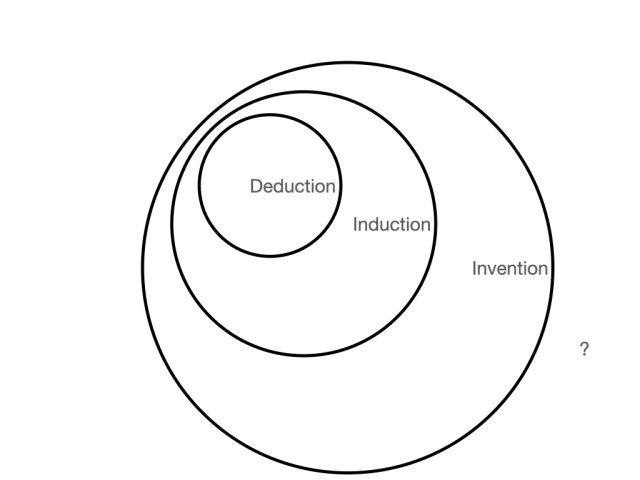
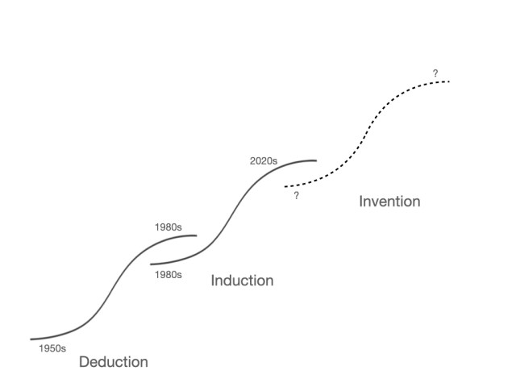

Generative AIs can do some things better than people: they can code faster in many instances, they can write junior high school level essays faster, they can create detailed images on demand no matter what the demand, and they can write a mediocre sonnet about whatever you want.  

生成式人工智能能比人类做得更好：在很多情况下，它们能更快地编写代码；它们能更快地写出初中水平的作文；它们能根据要求创建细节图像，无论需求如何；它们还能写出一首平庸的十四行诗，无论你想写什么。  

But it’s still obvious that human intelligence is more general. Humans are not yet bested.  

但很明显，人类的智慧还是更具有普遍性。人类还不是最好的。  

Even so, the recent advances in AI have caused a widespread belief that AIs will imminently surpass human intelligence: AI is advancing so rapidly, it is not hard to imagine how good it will be in a couple of years, or even a few months.  

即便如此，最近人工智能的进步还是让人们普遍相信，人工智能即将超越人类智慧：人工智能的进步如此之快，不难想象几年后，甚至几个月后它会有多厉害。

Of course, every technology looks exponential until it doesn’t.  

当然，每项技术都是指数级的，直到它不是。  

The rate of improvement starts to level out when a technology starts to reach its inherent limits, because every technology has inherent limits. At least, every technology to date.  

当一项技术开始达到其固有的极限时，改进的速度就开始趋于平缓，因为每项技术都有其固有的极限。至少，迄今为止的所有技术都是如此。  

But the belief that AI will become smarter than humans is predicated on AI being smart enough to not only improve itself but to figure out ways to expand its own capabilities beyond any inherent limits.  

但是，认为人工智能将变得比人类更聪明的前提是，人工智能足够聪明，不仅能自我完善，还能想出办法来扩展自己的能力，超越任何固有的限制。  

The current question is not “is AI smarter than humans?”, it is “can it become so?”  

当前的问题不是 "人工智能是否比人类更聪明"，而是 "人工智能能否变得比人类更聪明"。

This post argues that there may someday be an AI that can improve itself beyond any bounds humans can imagine, but generative AI isn’t it.  

这篇文章认为，也许有一天会出现一种人工智能，它能超越人类所能想象的任何界限来改进自己，但生成式人工智能并不是这样的。  

The current AI technology is not only not smarter than humans, it can’t improve itself to be smarter than humans.  

目前的人工智能技术不仅没有比人类更聪明，而且也无法通过自我改进变得比人类更聪明。  

My argument relies on fundamental conceptual limitations on types of reasoning.  

我的论点依赖于对推理类型的基本概念限制。  

This is important not just to bound what current AI can do, but to expand our thinking to what would need to be done to create true AGI.  

这一点非常重要，它不仅约束了当前人工智能的能力，还将我们的思维扩展到创造真正的人工智能需要做哪些工作。

### 1950s-1970s: Deductive AI  

20 世纪 50 年代至 70 年代演绎式人工智能

> “Let us now return to the history of AI. One of the early things which people attempted to program was the intellectual activity of theorem proving.”  
> 
> "现在让我们回到人工智能的历史。人们早期尝试编程的事物之一，就是定理证明这一智力活动"。
> 
> Douglas Hofstadter, 1979, _[Gödel, Escher, Bach](https://amzn.to/46ev0Tf)_, p. 609.  
> 
> Douglas Hofstadter，1979 年，《哥德尔、埃舍尔、巴赫》，第 609 页。

Theorem proving<a href="https://reactionwheel.net/2023/08/ai-and-the-structure-of-reasoning.html#fn1-4081" title="Newell, Shaw, and Simon’s Logic Theorist, 1956." rel="footnote">1</a>, game playing<a href="https://reactionwheel.net/2023/08/ai-and-the-structure-of-reasoning.html#fn2-4081" title="Shannon’s 1950 paper “Programming a Computer for Playing Chess” and Samuels’ checkers playing programs through the 1950s." rel="footnote">2</a>, machine translation<a href="https://reactionwheel.net/2023/08/ai-and-the-structure-of-reasoning.html#fn3-4081" title="The Georgetown-IBM Experiment, 1954." rel="footnote">3</a>, general problem solving<a href="https://reactionwheel.net/2023/08/ai-and-the-structure-of-reasoning.html#fn4-4081" title="Newell and Simon’s General Problem Solver, 1957; Bobrow’s STUDENT, 1964; Slagle’s SAINT, 1961." rel="footnote">4</a>, and conversation<a href="https://reactionwheel.net/2023/08/ai-and-the-structure-of-reasoning.html#fn5-4081" title="Feigenbaum’s ELIZA, among others." rel="footnote">5</a> were some of the earliest things AI pioneers attempted. All of these efforts used variations on a single way of producing output: they used known rules to deduce from known facts.  

定理证明 <a href="https://reactionwheel.net/2023/08/ai-and-the-structure-of-reasoning.html#fn1-4081" title="Newell, Shaw, and Simon’s Logic Theorist, 1956." rel="footnote">1</a> 、游戏 <a href="https://reactionwheel.net/2023/08/ai-and-the-structure-of-reasoning.html#fn2-4081" title="Shannon’s 1950 paper “Programming a Computer for Playing Chess” and Samuels’ checkers playing programs through the 1950s." rel="footnote">2</a> 、机器翻译 <a href="https://reactionwheel.net/2023/08/ai-and-the-structure-of-reasoning.html#fn3-4081" title="The Georgetown-IBM Experiment, 1954." rel="footnote">3</a> 、一般问题解决 <a href="https://reactionwheel.net/2023/08/ai-and-the-structure-of-reasoning.html#fn4-4081" title="Newell and Simon’s General Problem Solver, 1957; Bobrow’s STUDENT, 1964; Slagle’s SAINT, 1961." rel="footnote">4</a> 和对话 <a href="https://reactionwheel.net/2023/08/ai-and-the-structure-of-reasoning.html#fn5-4081" title="Feigenbaum’s ELIZA, among others." rel="footnote">5</a> 是人工智能先驱们最早的一些尝试。所有这些努力都使用了一种单一的输出方式：它们使用已知规则对已知事实进行推理。

Deduction is a way to create new knowledge. If we know that all men are human and that Socrates is a man, then Socrates must be human. (The rule we are following here is _modus ponens_: if you know that “if p then q” is true, then if p is true q must also be true.) _Must_ be, not _might_ be: deduction takes truths and creates new truths; certainties, not likelihoods.  

演绎是创造新知识的一种方式。如果我们知道所有的人都是人，苏格拉底是人，那么苏格拉底一定是人。(我们在这里遵循的规则是模态：如果你知道 "如果 p 那么 q "是真的，那么如果 p 是真的 q 也一定是真的）。必须是，而不是可能是：演绎法利用真理并创造新的真理；确定性，而不是可能性。

That Socrates is human seems implicit in what we already knew. But making it explicit makes it new knowledge. This is a subtle point, so here’s a better example.  

苏格拉底是人这一点似乎隐含在我们已经知道的知识中。但将其显性化，就成了新知识。这一点很微妙，所以这里有一个更好的例子。  

Consider the equation $ax^2+bx+c=0$. Before Brahmagupta described the quadratic formula in 628 AD, people did not know an algebraic way of solving this.<a href="https://reactionwheel.net/2023/08/ai-and-the-structure-of-reasoning.html#fn6-4081" title="People did solve quadratics before this, of course, but Brahmagupta is the first person documented to have laid out the quadratic formula the way we use it today. In any case, grant me that there was a time before people knew the equation." rel="footnote">6</a> But, of course, the quadratic formula follows rather simply from the equation given and the rules of algebra.<a href="https://reactionwheel.net/2023/08/ai-and-the-structure-of-reasoning.html#fn7-4081" title="You can easily derive the formula using math you learned in high school: complete the square and then solve for x." rel="footnote">7</a> Even so, just as it was new knowledge to _you_ when you learned it in junior high school, it was new knowledge to the world when it was first derived. Deduction creates knowledge by using known rules on known facts.<a href="https://reactionwheel.net/2023/08/ai-and-the-structure-of-reasoning.html#fn8-4081" title="I’m using “facts” to mean something accepted as true within the context of the system being reasoned about." rel="footnote">8</a> This is what mathematicians do when they prove theorems. They explore the inevitable consequences of an accepted set of rules and axioms.  

考虑方程 $ax^2+bx+c=0$ 。在公元 628 年婆罗摩古塔描述二次方程式之前，人们并不知道用代数方法来解决这个问题。 <a href="https://reactionwheel.net/2023/08/ai-and-the-structure-of-reasoning.html#fn6-4081" title="People did solve quadratics before this, of course, but Brahmagupta is the first person documented to have laid out the quadratic formula the way we use it today. In any case, grant me that there was a time before people knew the equation." rel="footnote">6</a> 当然，根据所给方程和代数规则，二次方程式非常简单。 <a href="https://reactionwheel.net/2023/08/ai-and-the-structure-of-reasoning.html#fn7-4081" title="You can easily derive the formula using math you learned in high school: complete the square and then solve for x." rel="footnote">7</a> 即便如此，就像你在初中学习它时对你来说是新知识一样，当它第一次被推导出来时，对世界来说也是新知识。演绎法通过对已知事实使用已知规则来创造知识。 <a href="https://reactionwheel.net/2023/08/ai-and-the-structure-of-reasoning.html#fn8-4081" title="I’m using “facts” to mean something accepted as true within the context of the system being reasoned about." rel="footnote">8</a> 这就是数学家证明定理的过程。他们探索一套公认规则和公理的必然结果。

The first wave of AI was primarily deductive: it solved problems by applying known rules to known facts.  

第一波人工智能主要是演绎式的：它通过将已知规则应用于已知事实来解决问题。  

The facts might have been the state of a board in a checkers game and the rules were the rules of checkers.  

事实可能是跳棋游戏中棋盘的状态，而规则则是跳棋的规则。  

Or the facts might have been a sentence in Russian and the rules were the definitions in an English-Russian dictionary.  

或者，事实可能是俄语中的一个句子，而规则则是英俄词典中的定义。  

It’s relatively easy to program a computer to perform deduction.  

给计算机编程进行推理相对容易。  

The hard part is not in knowing the facts or applying the rules, it is in knowing which rule to apply at any given time and whether applying that rule moves you closer to your goal.  

困难的部分不在于了解事实或应用规则，而在于知道在任何时候应用哪条规则，以及应用这条规则是否能让你更接近目标。

AI researchers came up with several clever ways to do these things, but they primarily used brute force.

  

人工智能研究人员想出了几种巧妙的方法来做这些事情，但他们主要使用的是蛮力。

Some of these programs were fruitful and some were dead ends. Machine translation, for instance, did poorly. Language has too much ambiguity to deduce meaning.  

这些计划有的成果丰硕，有的却走入死胡同。例如，机器翻译就表现不佳。语言有太多的歧义，无法推导出意义。  

But, overall, AI using deduction was successful on its merits.  

但总的来说，使用演绎法的人工智能是成功的。  

By 1987, an expert system developed at CMU was reportedly cutting the time it took DEC salespeople to configure new VAXen by hours, saving DEC some $40 million over five years.<a href="https://reactionwheel.net/2023/08/ai-and-the-structure-of-reasoning.html#fn9-4081" title="Feigenbaum, McCorduck, The Rise of&nbsp; the Expert Company, New York: Basic Books, 1988, p.225." rel="footnote">9</a> But this was peak Deductive AI.  

据报道，到 1987 年，CMU 开发的专家系统已将 DEC 销售人员配置新 VAXen 的时间缩短了几个小时，在五年内为 DEC 节省了约 4000 万美元。 <a href="https://reactionwheel.net/2023/08/ai-and-the-structure-of-reasoning.html#fn9-4081" title="Feigenbaum, McCorduck, The Rise of&nbsp; the Expert Company, New York: Basic Books, 1988, p.225." rel="footnote">9</a> 但这只是演绎法人工智能的顶峰。  

Progress slowed markedly towards the end of the 1970s; improvements in capabilities started to rely primarily on increases in compute speeds, not fundamentally new techniques.  

到 20 世纪 70 年代末，进展明显放缓；能力的提高开始主要依靠计算速度的提高，而不是根本性的新技术。  

Use cases were limited, and human-level intelligence was never approached. With plateauing performance, funding dried up and the “AI Winter” of the 1980s-1990s set in.  

使用案例有限，人类水平的智能从未接近。随着性能趋于平稳，资金逐渐枯竭，20 世纪 80 年代至 90 年代的 "人工智能寒冬 "随之到来。

### 1990s-2020s: Inductive AI  

20 世纪 90 年代--20 世纪 20 年代归纳式人工智能

> Holmes: For example, observation shows me that you have been to the Wigmore Street Post-Office this morning, but deduction lets me know that when there you dispatched a telegram…an explanation is superfluous; and yet it may serve to define the limits of observation and of deduction.  
> 
> 福尔摩斯：比如，观察让我知道您今天早上去过威格莫尔街邮局，但推理让我知道您在那里发了一封电报......解释是多余的，但它可以用来界定观察和推理的界限。  
> 
> Observation tells me that you have a little reddish mould adhering to your instep.  
> 
> 通过观察，我发现你的脚背上附着了一层淡红色的霉菌。  
> 
> Just opposite the Wigmore Street Office they have taken up the pavement and thrown up some earth, which lies in such a way that it is difficult to avoid treading in it in entering.  
> 
> 就在威格摩尔街办事处对面，他们占用了人行道，并堆起了一些土，这样一来，人们在进入时就很难避免踩到这些土。  
> 
> The earth is of this peculiar reddish tint which is found, as far as I know, nowhere else in the neighbourhood. So much is observation. The rest is deduction.  
> 
> 据我所知，这附近没有其他地方的土地呈现出这种奇特的红色。观察到的就是这么多。剩下的就是推理了。
> 
> Watson: How, then, did you deduce the telegram?  
> 
> 华生：那你是怎么推断出电报的？
> 
> Holmes: Why, of course I knew that you had not written a letter, since I sat opposite to you all morning.  
> 
> 福尔摩斯：我当然知道你没有写信，因为我整个上午都坐在你对面。  
> 
> I see also in your open desk there that you have a sheet of stamps and a thick bundle of postcards. What could you go into the post-office for, then, but to send a wire?  
> 
> 我还看到你那张敞开的桌子上有一张邮票和一捆厚厚的明信片。那您去邮局除了发电报还能干什么呢？  
> 
> Eliminate all other factors, and the one which remains must be the truth.  
> 
> 排除所有其他因素，剩下的一定是真相。
> 
> Arthur Conan Doyle, 1890, _The Sign of Four_.  
> 
> 阿瑟-柯南-道尔，1890 年，《四的标志》。

> “In 1986, when we launched the journal \[_Machine Learning_\], machine learning was still viewed as a branch of artificial intelligence.  
> 
> "1986年，当我们创办《机器学习》杂志时，机器学习仍被视为人工智能的一个分支。  
> 
> By 2000, many researchers committed to machine learning treated it as a separate field with few links to its parent discipline.  
> 
> 到 2000 年，许多致力于机器学习的研究人员将其视为一个独立的领域，与其母学科联系甚少。  
> 
> There are now active PhD-level researchers who have never taken a course in artificial intelligence and who see no reason why they should, as their interests lie in completely different areas.”   
> 
> 现在有一些活跃的博士级研究人员从未选修过人工智能课程，他们认为没有理由应该选修，因为他们的兴趣完全不同。
> 
> Pat Langley, 2011, “[The changing science of machine learning](https://link.springer.com/article/10.1007/s10994-011-5242-y)“.  
> 
> Pat Langley，2011 年，《不断变化的机器学习科学》。

The AI pioneers focused on deduction. Computer systems are defined with a type of formal logic, and this may have helped set the path.  

人工智能的先驱们专注于演绎。计算机系统是用一种形式逻辑来定义的，这可能有助于开辟新的道路。  

Deduction can also be effective in a limited universe of knowledge and rules, and computers were memory constrained at the time.  

在知识和规则有限的情况下，演绎法也能发挥有效作用，而当时的计算机内存有限。  

But I also think the human tendency to idolize deduction was at work. Deduction seems like the epitome of reasoning.  

但我也认为，人类崇拜演绎法的倾向也在起作用。演绎似乎是推理的缩影。  

Knowledge you create through deduction is guaranteed to be correct if the antecedent knowledge and the rules are correct. Deduction is rigorous, it is pure.  

如果先验知识和规则是正确的，那么通过演绎法创造的知识就一定是正确的。演绎是严谨的，是纯粹的。  

We consider people who are good at deduction—like mathematicians and philosophers—very intelligent, and so emulating intelligence by becoming good at deduction makes a kind of sense.  

我们认为善于演绎的人--比如数学家和哲学家--非常聪明，因此，通过变得善于演绎来模仿聪明人是有一定道理的。

This is selection bias. We think deduction is a superior kind of intelligence only because we are so naturally bad at it. Our brains don’t seem to work that way.  

这就是选择偏差。我们认为演绎是一种高级智力，只是因为我们天生不擅长演绎。我们的大脑似乎并非如此。  

To be good at deduction you have to have enough mental horsepower to work around your own limitations.  

要擅长推理，就必须有足够的精神力量来克服自身的局限性。  

Trying to make a machine emulate human intelligence by programming it to deduce was exactly wrong: like working towards the subtlety of the human hand by building a vise.  

试图通过编程让机器推理来模仿人类智慧的做法是完全错误的：就像通过制造老虎钳来实现人手的精巧一样。  

What the human brain does best is not deduction; what Sherlock Holmes is illustrating in the above quote is not deduction. The human brain naturally does _induction_; what Holmes is doing is induction.  

人脑最擅长的不是演绎，福尔摩斯在上述引文中说明的也不是演绎。人脑天生擅长归纳，福尔摩斯所做的就是归纳。

Deduction creates new facts using known rules and existing facts. Induction takes known facts and creates rules; these rules can then be used to infer new facts.  

演绎法利用已知规则和现有事实创造新事实。归纳法利用已知事实并创建规则，然后利用这些规则推断出新的事实。  

But while deduction’s new facts are guaranteed to be true, induction’s new facts are only likely to be true.  

但是，演绎法的新事实保证为真，而归纳法的新事实只可能为真。

Induction is extremely useful. The ancients observed the sun rising every day and assumed the sun would rise again tomorrow, even though they did not know why.  

归纳法非常有用。古人每天都观察太阳升起，并假设明天太阳还会升起，尽管他们不知道为什么。  

But induction does not provide the same assurance that deduction provides. A turkey sees the sun rise every day and so assumes he will see it rise the following day.  

但归纳法并不能提供与演绎法同样的保证。一只火鸡每天都能看到太阳升起，因此它假定自己第二天也能看到太阳升起。  

And he will be right, until Thanksgiving.  

他是对的，直到感恩节。

Induction works when there is a constant mechanism that is generating the future.  

当有一个恒定的机制在产生未来时，感应就会起作用。  

(Or at least, constant within the bounds of how the information generated by induction will be used: we know that someday our sun will not rise but we assume this is some way off.) The beauty of induction is that we don’t need to know what that future-producing mechanism is to use induction to predict the future.  

(或者说，至少在归纳法产生的信息将被如何使用的范围内是恒定的：我们知道有一天太阳不会升起，但我们假设这还遥遥无期）。归纳法的妙处在于，我们不需要知道产生未来的机制是什么，就可以利用归纳法预测未来。  

Induction creates the knowledge that the facts you have imply; it deals with the messiness of real-world data and our usually incomplete understanding of why things happen.  

归纳法创造了你所掌握的事实所隐含的知识；它处理了现实世界数据的混乱，以及我们通常对事情发生原因的不完整理解。

Induction—or probabilistic reasoning, one aspect of induction—has been used in AI since the beginning. It just didn’t work that well early on.  

归纳--或者说概率推理（归纳的一个方面）--从一开始就被用于人工智能领域。只是早期的效果并不理想。  

When the AI winter set in, researchers started called their inductive reasoning systems anything _but_ artificial intelligence, as Pat Langley emphasizes above. One of the earliest inductive learning programs I remember was Firefly, in 1995. The website would collect information about music you liked and make recommendations about other music you might like.  

正如帕特-兰利（Pat Langley）在上文中强调的那样，当人工智能的寒冬来临时，研究人员开始称他们的归纳推理系统为人工智能之外的任何东西。我记得最早的归纳学习程序之一是 1995 年的萤火虫（Firefly）。该网站会收集你喜欢的音乐信息，并推荐你可能喜欢的其他音乐。  

It did this by learning from its users the connections between various artists.  

它通过向用户了解不同艺术家之间的联系来实现这一目标。  

If people who like both Guided by Voices and The Beatles often also like Neutral Milk Hotel, then if you like Guided by Voices and The Beatles, you might also like Neutral Milk Hotel.  

如果同时喜欢 Guided by Voices 和 The Beatles 的人也喜欢 Neutral Milk Hotel，那么如果您喜欢 Guided by Voices 和 The Beatles，您可能也会喜欢 Neutral Milk Hotel。  

You got recommendations by telling the system what music you liked and this then fed the system more information to make better recommendations to others in the future.  

你只需告诉系统你喜欢什么音乐，系统就会为你提供更多信息，从而在未来为其他人提供更好的推荐。  

It learned linkages even though it had no idea why GBV, The Beatles and Neutral Milk Hotel might be related.  

尽管它不知道 GBV、披头士和中性牛奶酒店为什么会有联系，但它还是了解到了它们之间的联系。  

A computer asking someone what music they like and then recommending other music they like is far more similar to human intelligence than proving theorems, but no one considered it AI.  

计算机询问某人喜欢什么音乐，然后推荐他喜欢的其他音乐，这比证明定理更接近人类智能，但没有人认为这是人工智能。  

It was called collaborative filtering or collective intelligence, implying the intelligence was supplied by the collective, not generated by the computer. This is a version of [the Chinese Room Argument](https://plato.stanford.edu/entries/chinese-room/). Firefly wasn’t “thinking”, it wasn’t “figuring things out”. It was just telling you what the data said.  

它被称为协同过滤或集体智能，这意味着智能是由集体提供的，而不是由计算机生成的。这是 "中式房间论证 "的一个版本。萤火虫并没有 "思考"，也没有 "发现问题"。它只是告诉你数据是怎么说的。  

(For an excellent history of machine learning, see Chris Wiggins and Matthew Jones’ [How Data Happened](https://amzn.to/3OmSVrA), especially chapter 9.)  

(有关机器学习的精彩历史，请参阅 Chris Wiggins 和 Matthew Jones 的《数据是如何发生的》，尤其是第 9 章）。

Humans do what Firefly did all the time, and we consider making good recommendations a sign of intelligence.  

人类一直在做萤火虫做的事情，我们认为提出好的建议是智慧的象征。  

But Firefly and its ilk were not considered intelligent precisely because they did something humans do so naturally: inductive inference.  

但是，萤火虫和它的同类之所以不被认为是智能的，正是因为它们做了人类自然而然会做的事情：归纳推理。  

We consider human intelligence paramount but then decide things humans can do easily are not really intelligence. It’s ironic.  

我们认为人类的智慧是至高无上的，但又认为人类可以轻易做到的事情并不是真正的智慧。这真是讽刺。

Firefly became useful at the time it did because the internet had become widespread and there was suddenly an easy way to gather data.  

萤火虫之所以能在当时大显身手，是因为互联网已经普及，人们突然有了一种收集数据的简便方法。  

Unlike the expert systems of the 1980s, this wasn’t curated data boiled down to a single “correct” point of view, it was real-world data.  

与 20 世纪 80 年代的专家系统不同，这不是被归结为单一 "正确 "观点的整理数据，而是真实世界的数据。  

The messy data was made predictive using mathematical techniques borrowed from statistics.  

利用从统计学中借鉴的数学技术，使杂乱无章的数据具有预测性。  

The predictiveness of these statistical techniques went up an order of magnitude when huge amounts of data were available.  

当有大量数据可用时，这些统计技术的预测能力就会提高一个数量级。  

Eventually, human programmers no longer needed to tell a program exactly how to solve a problem, they could let the patterns in the data teach the program.  

最终，人类程序员不再需要告诉程序如何准确地解决问题，他们可以让数据中的模式来教程序。

It would be hard to make a list of the most influential _inductive_ AI programs because they were not part of a structured research program, they were much more commonplace. In some cases, like Firefly, they were academically unambitious.  

我们很难列出最具影响力的归纳式人工智能程序，因为它们并不是结构化研究计划的一部分，而是更为普通的程序。在某些情况下，比如萤火虫（Firefly），它们在学术上并不雄心勃勃。  

In others, like Google Translate, they were huge and visible advances. In almost all cases they were not called AI. They were called machine learning, deep learning, and big data.  

在其他情况下，比如谷歌翻译，它们是巨大而明显的进步。几乎在所有情况下，它们都不叫人工智能。它们被称为机器学习、深度学习和大数据。  

Critics quipped that “machine learning is just statistics”. This is not untrue, but the problem with the criticism is that it denigrates induction.  

有批评者戏称 "机器学习不过是统计学"。这并非不实之词，但批评的问题在于它诋毁了归纳法。  

It’s is a bit like criticizing philosophy by saying it’s just arithmetic. Statistics should be appreciated.  

这有点像批评哲学时说它只是算术。统计应该受到重视。  

Like other inductive techniques, statistics allows us to take an incomplete set of facts, infer some possible relationships between them, and then use those relationships _to predict the future_. This is close to magic.  

与其他归纳技术一样，统计学让我们能够利用一组不完整的事实，推断出它们之间可能存在的关系，然后利用这些关系来预测未来。这近乎魔术。

### Machine translation: from certainty to deduction to induction  

机器翻译：从确定到演绎再到归纳

Machine translation was an ongoing goal of AI researchers from the beginning to the present so it’s a great way to see the progression of AI technique.  

从一开始到现在，机器翻译一直是人工智能研究人员的目标，因此它是了解人工智能技术发展的绝佳途径。  

(This is a very short summary of Ilya’s Pestov excellent “[A history of machine translation from the Cold War to deep learning](https://www.freecodecamp.org/news/a-history-of-machine-translation-from-the-cold-war-to-deep-learning-f1d335ce8b5/)” and quotations are from there.)  

(本文是对伊利亚-佩斯托夫出色的 "从冷战到深度学习的机器翻译史 "的简短总结，引文摘自该书）。

#### 0\. Dictionary Translation:  

0.词典翻译：

The 1954 Georgetown-IBM experiment used a computer to successfully translate Russian into English.  

1954 年的乔治敦-IBM 实验利用计算机成功地将俄语翻译成了英语。  

But “the translated examples were carefully selected and tested to exclude any ambiguity. For everyday use, that system was no better than a pocket phrasebook.”  

但是，"翻译的例子都经过精心挑选和测试，以排除任何歧义。就日常使用而言，该系统并不比一本袖珍短语手册更好"。

#### 1\. Rule-Based Machine Translation (RBMT):  

1.基于规则的机器翻译（RBMT）：

Rule-based machine translation emerged in the 1970s and relied on bilingual dictionaries and linguistic rules.  

基于规则的机器翻译出现于 20 世纪 70 年代，依赖于双语词典和语言规则。  

This approach involved creating a set of rules that mapped the grammatical structures and vocabulary of one language to another.  

这种方法包括创建一套规则，将一种语言的语法结构和词汇映射到另一种语言。  

But “Languages did not develop based on a fixed set of rules…they were much more influenced by the history of invasions… How could you explain that to a machine?” RBMT did not work, except in limited and focused domains.  

但是，"语言的发展并非基于一套固定的规则......它们受到入侵历史的影响要大得多......你如何向机器解释这一点呢？除了在有限和集中的领域，RBMT 是行不通的。

#### 2\. Example-Based Machine Translation (EBMT):  

2.基于实例的机器翻译（EBMT）：

In 1984, Makoto Nagao from Kyoto University invented example-based machine translation.  

1984 年，京都大学的 Makoto Nagao 发明了基于示例的机器翻译。  

EBMT systems utilized ready-made translations or bilingual sentence pairs as examples for translation.  

EBMT 系统利用现成的译文或双语句对作为翻译示例。  

Rather than relying on linguistic rules or statistical patterns, EBMT systems used examples as templates for generating translations.  

EBMT 系统不依赖语言规则或统计模式，而是将实例作为生成翻译的模板。  

This approach allowed EBMT systems to handle specific and context-dependent translations more effectively.  

这种方法使 EBMT 系统能够更有效地处理特定的、与上下文相关的翻译。

#### 3\. Statistical Machine Translation (SMT):  

3.统计机器翻译（SMT）：

The idea of discovering rules instead of coding them came to fruition in 1990 at IBM: by analyzing millions of sentence pairs in two languages, the system statistically correlated words, phrases, and syntax.  

1990 年，IBM 公司实现了发现规则而不是编码规则的想法：通过分析两种语言的数百万对句子，该系统对单词、短语和句法进行了统计关联。  

“\[A\]ll conclusions were done by machine, guided by stats and the logic that ‘if people translate that way, so will I.’” The developers of SMT had the genius idea to take the voluminous transcripts of UN and European Parliament meetings—translated by humans into many different languages—to train the models.  

"所有结论都是由机器根据统计数据和'如果人们这样翻译，我也会这样翻译'的逻辑得出的"。SMT 的开发人员有一个天才的想法，那就是利用联合国和欧洲议会的大量会议记录--由人类翻译成多种不同语言--来训练模型。  

This provided enough data for SMT to work.  

这为 SMT 的工作提供了足够的数据。

#### 4\. Neural Machine Translation (NMT):  

4.神经机器翻译（NMT）：

It was neural machine translation, introduced around 2014, that revolutionized machine translation.  

正是 2014 年左右推出的神经机器翻译彻底改变了机器翻译。  

NMT models were enabled by advances in neural networks (RNNs, transformers, and attention).  

神经网络（RNN、变压器和注意力）的进步使 NMT 模型得以实现。  

Unlike SMT, which focused on words and phrases, NMT models considered the entire sentence during translation so they could capture contextual information.  

与专注于单词和短语的 SMT 不同，NMT 模型在翻译过程中考虑的是整个句子，因此可以捕捉上下文信息。  

This resulted in more coherent and contextually accurate outputs.  

这使得产出更加连贯，背景更加准确。

The first couple tries at machine translation (RBT, EMBT…the 1970s and 1980s) were deductive. These were only marginally successful.  

最初的几次机器翻译尝试（RBT、EMBT......20 世纪 70 和 80 年代）都是演绎式的。这些尝试只是略有成功。  

Using induction (SMT, NMT…1990s to now) was key to useful translation.  

使用归纳法（SMT、NMT......20 世纪 90 年代至今）是有用翻译的关键。

### Levels of Inference 推理的层次

> KIRK: _Everything Harry tells you is a lie. Remember that! Everything Harry tells you is a lie!_  
> 
> 哈利告诉你的一切都是谎言记住 Remember that！哈利告诉你的一切都是谎言
> 
> HARRY: _Now listen to this carefully, Norman:_ I AM LYING!  
> 
> 仔细听好 诺曼 我在撒谎
> 
> NORMAN: _You say you are lying, but if everything you say is a lie then you are telling the truth, but you cannot tell the truth because everything you say is a lie, but…you lie, you tell the truth, but you cannot for you l…Illogical! Illogical!  
> 
> Please explain! You are Human! Only Humans can explain their behavior! Please explain!  
> 
> 请解释一下！你是人类！只有人类才能解释自己的行为！请解释一下！_  
> 
> 你说你在说谎，但如果你说的一切都是谎言，那么你说的就是真话，但你不能说真话，因为你说的一切都是谎言，但......你说谎了，你说了真话，但你不能说真话，因为你......不合逻辑！不合逻辑
> 
> Star Trek, 1967, “I, Mudd”.  
> 
> 星际迷航》，1967 年，"我，马德"。

> The supreme triumph of reason…is to cast doubt upon its own validity.  
> 
> 理性的最高胜利......就是对自身的有效性提出怀疑。
> 
> Miguel de Unamuno, 1921, _[The Tragic Sense of Life](https://amzn.to/3NEfAAv)_, London: MacMillan and Co., p. 104.  
> 
> 米格尔-德-乌纳穆诺，1921 年，《人生的悲剧感》，伦敦：MacMillan and Co.，第 104 页。

Here’s something interesting about deduction: You can’t _deduce_ deduction. [Lewis Carrol argued this](https://en.wikisource.org/wiki/Index:Carroll_(Mind,_1895).djvu) (in a very Lewis Carrolian way) in 1895.<a href="https://reactionwheel.net/2023/08/ai-and-the-structure-of-reasoning.html#fn10-4081" title="Carroll, Lewis, “What the Tortoise Said to Achilles”, April 1895. <em>Mind</em>. <strong>IV</strong> (14): 278–280. <a href=&quot;https://en.wikipedia.org/wiki/Doi_(identifier)&quot;>doi</a>:<a href=&quot;https://doi.org/10.1093%2Fmind%2FIV.14.278&quot;>10.1093/mind/IV.14.278</a>." rel="footnote">10</a> In a dialogue between Achilles and the Tortoise, he shows that to accept the results of a deduction, you first must accept the rules of deduction themselves.  

关于演绎法，有一件有趣的事：你无法推导出演绎法。刘易斯-卡罗尔在 1895 年（以一种非常刘易斯-卡罗尔的方式）论证了这一点。 <a href="https://reactionwheel.net/2023/08/ai-and-the-structure-of-reasoning.html#fn10-4081" title="Carroll, Lewis, “What the Tortoise Said to Achilles”, April 1895. <em>Mind</em>. <strong>IV</strong> (14): 278–280. <a href=&quot;https://en.wikipedia.org/wiki/Doi_(identifier)&quot;>doi</a>:<a href=&quot;https://doi.org/10.1093%2Fmind%2FIV.14.278&quot;>10.1093/mind/IV.14.278</a>." rel="footnote">10</a> 在阿基里斯和乌龟的对话中，他表明要接受演绎的结果，首先必须接受演绎规则本身。  

If you do not, no deductive argument can convince you of deduction because, of course, the argument would rely on rules you have not accepted.  

如果你不这样做，任何演绎论证都无法让你相信演绎，因为论证当然会依赖于你没有接受的规则。

If deduction is not self-proving, how did we decide to accept deduction as valid? My guess is that we decided to accept it because it worked.  

如果演绎法不能自我证明，那么我们是如何决定接受演绎法为有效的呢？我的猜测是，我们决定接受它，因为它有效。  

We noticed that when we proved something deductively, like the quadratic formula, the result was always true. This is a powerful argument, but it is an _inductive_ argument.  

我们注意到，当我们用演绎法证明某个问题时，比如二次公式，结果总是正确的。这是一个有力的论证，但它是一个归纳论证。

Of course, it’s not true that deduction always works, as Bertrand Russell demonstrated in 1903 with [Russell’s Paradox](https://www.scientificamerican.com/article/what-is-russells-paradox/). The simplest version of his paradox is to take a sheet of paper and write on it “This sentence is a lie.” If the sentence is true, it is false; if it is false, it is true.  

当然，演绎法并非总是有效，伯特兰-罗素在 1903 年提出的罗素悖论就证明了这一点。他的悖论的最简单版本是，拿一张纸，在上面写下 "这句话是谎言"。如果这句话是真的，它就是假的；如果这句话是假的，它就是真的。  

This is the paradox Captain Kirk used on the artificially intelligent robot Norman in the quote above. In the show, Norman starts to emit smoke and then, presumably, shorts out.  

这就是上文引用的柯克船长对人工智能机器人诺曼使用的悖论。在剧中，诺曼开始冒烟，然后大概就短路了。  

(I just tried this on ChatGPT. Please let me know if you see smoke issuing from their datacenter.)  

(我刚在 ChatGPT 上试过。如果您看到他们的数据中心冒烟，请告诉我）。

And, in 1931, [Kurt Gödel showed](https://www.quantamagazine.org/how-godels-incompleteness-theorems-work-20200714/) that no mathematical system could be complete, that there would always be true things about any deductive system you could not prove using the system.  

1931年，库尔特-哥德尔（Kurt Gödel）证明，任何数学体系都不可能是完整的，任何演绎体系都有你无法用该体系证明的真理。  

This opened the door to a series of papers undermining the foundations of mathematics and, by extension, any deductive system.<a href="https://reactionwheel.net/2023/08/ai-and-the-structure-of-reasoning.html#fn11-4081" title="For a great introduction to this see Morris Kline’s <em><a href=&quot;https://amzn.to/3Newjc9&quot;>Mathematics: the loss of certainty</a></em>, chapter XII: “Disasters”." rel="footnote">11</a> But, despite Gödel, deduction works almost all the time, so any good inductionist will be comfortable using deduction. A good deductionist, of course, would shun deduction.  

这为一系列破坏数学基础，进而破坏任何演绎法体系的论文打开了大门。 <a href="https://reactionwheel.net/2023/08/ai-and-the-structure-of-reasoning.html#fn11-4081" title="For a great introduction to this see Morris Kline’s <em><a href=&quot;https://amzn.to/3Newjc9&quot;>Mathematics: the loss of certainty</a></em>, chapter XII: “Disasters”." rel="footnote">11</a> 但是，尽管有哥德尔，演绎法几乎一直在起作用，所以任何优秀的归纳主义者都会乐于使用演绎法。当然，一个好的演绎论者会回避演绎。  

That mathematicians still exist is a paean to induction.  

数学家依然存在，就是对归纳法的赞美。

Induction has a similar problem: you can’t deduce induction.  

归纳法也有类似的问题：你无法推导出归纳法。  

This was shown by David Hume, whose “problem of induction” is the first thing every philosopher brings up when discussing induction.  

大卫-休谟证明了这一点，他的 "归纳法问题 "是每个哲学家在讨论归纳法时首先提出的问题。

> It was David Hume’s argument against induction that hooked me on philosophy.  
> 
> 正是大卫-休谟反对归纳法的论证让我迷上了哲学。  
> 
> Surely we have good reason to believe that the sun will rise tomorrow, even though it is possible that it won’t; yet Hume provided an apparently unanswerable argument that we have no way to show this.  
> 
> 我们当然有充分的理由相信太阳明天会升起，尽管它有可能不会升起；但休谟却提出了一个显然无法回答的论点，即我们没有办法证明这一点。  
> 
> Our inductive practices have been reliable in the past, or we would not be here now to think about them, but an appeal to their past successes to underwrite their future prospects assumes the very practices we are supposed to be justifying.  
> 
> 我们的归纳实践在过去一直是可靠的，否则我们现在就不会在这里思考这些问题，但是，以它们过去的成功来证明它们未来的前景，这就假定了我们本应证明其合理性的实践。
> 
> Peter Lipton, 1991, [Inference to _the Best Explanation_](https://amzn.to/460DVHM), p. xi.  
> 
> 彼得-利普顿，1991 年，《最佳解释推论》，第 xi 页。

It’s not surprising, since you can’t deduce _deduction_, that you can’t deduce induction. But it might surprise you that you also can’t _induce_ induction:  

既然不能推导演绎，那么不能推导归纳也就不足为奇了。但你可能会感到惊讶的是，你也无法诱导归纳：

> There’s a joke about a planet full of people who believe in anti-induction: if the sun has risen every day in the past, then today, we should expect that it won’t.  
> 
> 有一个笑话说，地球上有很多人相信反归纳法：如果过去太阳每天都升起，那么今天，我们就应该期待它不会升起。  
> 
> As a result, these people are all starving and living in poverty. Someone visits the planet and tells them, “Hey, why are you still using this anti-induction philosophy?  
> 
> 结果，这些人都在挨饿，生活在贫困之中。有人来到这个星球，告诉他们："嘿，你们为什么还在使用这种反诱导哲学？  
> 
> You’re living in horrible poverty!”  
> 
> 你们的生活太贫困了！"
> 
> “Well, it never worked before…”  
> 
> "嗯，以前从没成功过......"
> 
> Scott Aaronson, 2013, _[Quantum Computing Since Democritus](https://amzn.to/3Cy0gip)_, p. 229.  
> 
> 斯科特-阿伦森，2013 年，《德谟克利特以来的量子计算》，第 229 页。

As with deduction, you need circular reasoning to convince someone of induction using only induction.  

与演绎法一样，只用归纳法也需要循环推理才能说服别人相信归纳法。

But if you can’t deduce induction and you can’t induce induction, why do we believe in induction?  

但是，如果不能推导归纳，也不能诱导归纳，我们为什么还要相信归纳呢？  

Just as deduction is believable because of induction, there must be a more general form of reasoning that allows us to use induction comfortably.  

正如演绎法因归纳法而可信一样，一定有一种更普遍的推理形式能让我们自如地使用归纳法。  

I’ll call it Invention for the moment, but it is clearly something humans can do that encompasses induction (and thus also encompasses deduction.) There must be layers of inference, from the most specific to the most general.  

我暂且将其称为 "发明"，但它显然是人类能够做到的事情，其中包含归纳（因此也包含演绎）。  

The most specific, deduction, offers the most assurance of truth, and that assurance wanes as inference becomes more general. Invention might not even be _inference_ at all. Regardless, it is a way to think, and so a type of intelligence.  

最具体的推理最能保证真理，而随着推理变得越来越笼统，这种保证就会减弱。发明甚至可能根本不是推理。无论如何，它是一种思维方式，因此也是一种智力。

Intelligence can mean many things, but the hallmark of human intelligence is its generality.  

智慧可以有很多含义，但人类智慧的特点是它的普遍性。  

In this sense induction is more “intelligent” than deduction because it is more general, and Invention is more intelligent than induction.  

从这个意义上说，归纳比演绎更 "聪明"，因为它更概括，而发明比归纳更聪明。  

The outward progression is the path towards AGI.  

向外发展是通向 AGI 的道路。

### AGI

> AI has existed since the birth of computers. It has been around long enough that it has had periods of excitement where some leading experts make extraordinary claims. Claude Shannon was one of the greatest pioneers in computer science and AI.  
> 
> 自从计算机诞生以来，人工智能就一直存在。它存在的时间已经足够长，以至于它曾有过一段激动人心的时期，一些顶尖的专家曾提出过非凡的主张。克劳德-香农是计算机科学和人工智能领域最伟大的先驱之一。  
> 
> In 1961 he said: “I confidently expect that with\[in\] a matter of ten or fifteen years something will emerge from the laboratory which is not too far from the robot of science fiction fame.” His prediction was that by the mid-1970s we would have walking, talking, thinking autonomous machines.  
> 
> 1961 年，他说："我满怀信心地预计，再过十年或十五年，实验室里就会出现与科幻小说中的机器人相差无几的东西"。他预测，到 20 世纪 70 年代中期，我们将拥有会走路、会说话、会思考的自动机器。  
> 
> Forty years later, we can still barely make a robot walk. It certainly cannot think for itself.  
> 
> 40 年后的今天，我们仍然只能勉强让机器人行走。它当然无法独立思考。  
> 
> Today, there are surveys (containing large variation of views) concluding that there is a “50% chance AI will outperform humans in all tasks in 45 years”.  
> 
> 如今，有调查（包含大量不同观点）认为，"45 年内，人工智能在所有任务中胜过人类的可能性为 50%"。  
> 
> It all sounds so familiar.  
> 
> 这一切听起来如此熟悉。
> 
> Peter J. Bentley, 2018, “_The Three Laws of Artificial Intelligence: Dispelling Common Myths_”<a href="https://reactionwheel.net/2023/08/ai-and-the-structure-of-reasoning.html#fn12-4081" title="In <em><a href=&quot;https://www.europarl.europa.eu/RegData/etudes/IDAN/2018/614547/EPRS_IDA(2018)614547_EN.pdf&quot;>Should We Fear Artificial Intelligence</a></em>, European Parliamentary Research Service, March 2018, p.10." rel="footnote">12</a>  
> 
> 彼得-J-本特利，2018 年，《人工智能三大定律：破除常见迷思" <a href="https://reactionwheel.net/2023/08/ai-and-the-structure-of-reasoning.html#fn12-4081" title="In <em><a href=&quot;https://www.europarl.europa.eu/RegData/etudes/IDAN/2018/614547/EPRS_IDA(2018)614547_EN.pdf&quot;>Should We Fear Artificial Intelligence</a></em>, European Parliamentary Research Service, March 2018, p.10." rel="footnote">12</a>

AGI stands for “Artificial General Intelligence”, but what it tends to mean is artificial intelligence that rivals human intelligence. Intelligence is ill-defined.  

AGI 是 "人工通用智能 "的缩写，但其含义往往是指可与人类智能相媲美的人工智能。智能的定义并不明确。  

Chess playing computers are intelligent in a way, and the current crop of LLMs are also intelligent in a way.  

下棋的计算机在某种程度上是智能的，现在的法律硕士在某种程度上也是智能的。  

The latter are even “generally” intelligent though not yet as generally intelligent as we are. But we designed these AIs and we improved the design over time.  

后者甚至 "普遍 "具有智能，尽管还不如我们普遍具有智能。但是，我们设计了这些人工智能，并且随着时间的推移改进了设计。  

At some point the AIs become intelligent enough to improve themselves and, since electronic circuitry should be faster than our wetware, they should be able to improve themselves faster than we can improve them.  

到一定时候，人工智能就会变得足够聪明，能够自我完善，而且由于电子电路的速度应该比我们的湿软件更快，它们自我完善的速度应该比我们改进它们的速度更快。

People worry about this. There have always been people who have predicted that some new technology is more than just dangerous, it poses an existential risk.  

人们对此忧心忡忡。总有人预言，某些新技术不仅危险，还会带来生存风险。  

We’re still here, so they’ve been wrong each time.  

我们还在这里，所以他们每次都错了。  

But with every new breakthrough technology someone argues that “this time is different.” It’s easy for us tech folk to dismiss this (because induction, actually.) But like the turkey waiting for Thanksgiving, we need to ask ourselves if this time _is_ different.  

但每当有新的突破性技术出现时，就会有人说 "这次不一样"。我们技术人员很容易对此不屑一顾（其实是因为感应），但就像等待感恩节的火鸡一样，我们需要扪心自问，这一次是否与众不同。

Even during the first wave of AI there was widespread fear. The homicidal computer HAL, in _2001: a Space Odyssey_ (1968), and the genocidal computer WOPR, in _WarGames_ (1983), bookended the 1970s.  

即使在人工智能的第一波浪潮中，人们也普遍感到恐惧。2001: 太空漫游》（1968 年）中的杀人计算机 HAL 和《战争游戏》（1983 年）中的种族灭绝计算机 WOPR，为 20 世纪 70 年代划上了句号。  

The crux of the fear was that if AI could find a way to make itself slightly more intelligent then, as something more intelligent, it could find a way to make itself even more intelligent, and so on, unleashing an exponentially increasing cycle of self-improvement, until the AI was so much smarter than humans that it could decide to end humanity on a whim.  

这种恐惧的关键在于，如果人工智能能够找到一种方法，让自己变得稍微更聪明一些，那么，作为更聪明的东西，它就能找到一种方法，让自己变得更加聪明，以此类推，释放出一个指数级增长的自我完善循环，直到人工智能比人类聪明得多，以至于它可以随心所欲地决定终结人类。  

This was called by John Von Neumann (no relation) in 1958 “the singularity”.  

约翰-冯-诺依曼（与此无缘）在 1958 年称之为 "奇点"。  

When there is suddenly a large change in AI capability, people wonder if it is the beginning of that exponential climb.  

当人工智能能力突然发生巨大变化时，人们会怀疑这是否是指数级攀升的开始。  

They look at AI today, compare it to two years ago and say “at this rate of growth in intelligence, humanity will be outstripped in a matter of years, if not months.”<a href="https://reactionwheel.net/2023/08/ai-and-the-structure-of-reasoning.html#fn13-4081" title="There’s also the less existential fear is that even if we do not reach the singularity, the current crop of AIs will be intelligent enough to supplant all human labor, leaving us with nothing to do and no way to support ourselves. This, of course, makes no sense. Trade is circular. If machines did all the farming, for instance, but humans could not afford to buy the food, what would the machines do with the food? They would either have to give it away, or stop growing it. If they stopped growing it, humans would step in and start farming again. This is true of the economy as a whole. There would be, of course, a serious rebalancing of jobs based on comparative advantage. How this would work out is up for dispute. <a href=&quot;https://reactionwheel.net/2013/08/art-for-computers.html&quot;>I’ve written about this before</a> and it’s a boring argument to have for the umpteenth time, so I’m going to skip it, aside from this note." rel="footnote">13</a>  

他们审视今天的人工智能，与两年前进行比较，然后说："按照这样的智能增长速度，人类将在几年甚至几个月内被超越。 <a href="https://reactionwheel.net/2023/08/ai-and-the-structure-of-reasoning.html#fn13-4081" title="There’s also the less existential fear is that even if we do not reach the singularity, the current crop of AIs will be intelligent enough to supplant all human labor, leaving us with nothing to do and no way to support ourselves. This, of course, makes no sense. Trade is circular. If machines did all the farming, for instance, but humans could not afford to buy the food, what would the machines do with the food? They would either have to give it away, or stop growing it. If they stopped growing it, humans would step in and start farming again. This is true of the economy as a whole. There would be, of course, a serious rebalancing of jobs based on comparative advantage. How this would work out is up for dispute. <a href=&quot;https://reactionwheel.net/2013/08/art-for-computers.html&quot;>I’ve written about this before</a> and it’s a boring argument to have for the umpteenth time, so I’m going to skip it, aside from this note." rel="footnote">13</a>

Deductive AIs turned out not to be a threat. While intelligent, they were nowhere near as intelligent as humans.  

事实证明，演绎型人工智能并不构成威胁。虽然它们很聪明，但远不及人类。  

The fear dissipated in the 1980s, as deductive AI progress plateaued.  

到了 20 世纪 80 年代，随着人工智能的演绎进展趋于平稳，这种恐惧也逐渐消散。  

This is typical of new technologies: change is slow as people figure out how a technology works, speeds up as they master it, and then plateaus as its promise is tapped out.  

这是新技术的典型特征：当人们弄清一项技术的工作原理时，变化是缓慢的；当他们掌握了这项技术时，变化就会加快；当这项技术的前景被挖掘出来时，变化就会趋于平稳。  

Technologies follow an s-curve.  

技术呈 S 型曲线发展。  

It should be expected (inductively) that inductive AI would also follow an s-curve, and extrapolating from the last couple of years of progress would be the wrong way to think about it.  

我们应该（归纳地）预计，归纳式人工智能也会遵循一条 S 型曲线，而从过去几年的进展中推断是错误的思维方式。

Technology s-curves do not flatten out because we are not smart enough to continue their improvement. They flatten out because the technologies reach their potential.  

技术 S 型曲线之所以趋于平缓，并不是因为我们不够聪明，无法继续改进技术。它们之所以趋于平缓，是因为技术发挥了其潜力。  

Technologists evolve technologies along this s-curve until they plateau and then they look for new technologies that can take their place.  

技术专家们沿着这条 S 型曲线发展技术，直到技术达到顶峰，然后再寻找新的技术取而代之。  

Moore’s Law, for instance, is a single s-curve of improvement of transistor size in silicon, and thus speed of computation in computer circuits.  

例如，摩尔定律是硅晶体管尺寸改进的一条 S 型曲线，从而提高了计算机电路的计算速度。  

This s-curve was a long-standing one, but has recently started to flatten. And, if you look deeper, the technologies that enabled it also follow s-curves.  

这种 S 型曲线由来已久，但最近开始趋于平缓。而且，如果深入研究，促成这一变化的技术也遵循 S 型曲线。

But, say some very smart people, if the AI could improve itself, then it need not plateau.  

但是，一些非常聪明的人说，如果人工智能能够自我完善，那么它就不需要停滞不前。  

We know that Deductive AI did not improve itself to Inductive AI, and we know from the last section that this is because induction can’t be deduced.  

我们知道，演绎式人工智能并没有将自己改进为归纳式人工智能，而我们从上一节中知道，这是因为归纳无法演绎。  

It was never a question of just providing better algorithms or more horsepower to Deductive AI before it could figure out induction, it required a change in the mode of thinking.  

在演绎法人工智能弄清归纳法之前，为它提供更好的算法或更大的马力绝非易事，这需要改变思维模式。  

No deductive system could have come up with induction. Jumping from one s-curve to the next requires the development of a new technology.  

任何演绎系统都不可能想到归纳法。从一条 S 曲线跳到下一条 S 曲线，需要开发一种新技术。

In assessing the improvement in intelligence in AI, we have already seen a jump from one s-curve, Deductive AI, to the next, Inductive AI, spurred by the new technologies of machine learning and RNNs.  

在评估人工智能的智能改进时，我们已经看到，在机器学习和 RNNs 等新技术的推动下，人工智能已经从一个 s 曲线（演绎式人工智能）跃升到下一个 s 曲线（归纳式人工智能）。  

There was a long rise in Deductive AI followed by a plateau, the AI winter. Then there was a long rise in Inductive AI.  

演绎式人工智能曾长期处于上升期，随后进入高原期，即人工智能的冬天。然后是归纳式人工智能的长期上升。

What happens now? 现在怎么办？

There are two questions that bear on how intelligent inductive AI can become.  

归纳式人工智能的智能化程度取决于两个问题。

### How long until the Inductive AI s-curve starts to plateau?  

归纳式人工智能的 s 曲线还要多久才会趋于平稳？

How far along the s-curve are we with induction? It’s hard to know, but signs are that we are already starting to plateau.  

我们在诱导方面走了多长的 S 曲线？很难说，但有迹象表明，我们已经开始进入平稳期。  

Sam Altman, CEO of OpenAI said “I think we’re at the end of the era where it’s going to be these, like, giant, giant models. We’ll make them better in other ways.”<a href="https://reactionwheel.net/2023/08/ai-and-the-structure-of-reasoning.html#fn14-4081" title="Will Knight, “OpenAI’s CEO Says the Age of Giant AI Models Is Already Over”, Wired, Apr 17, 2023, <a href=&quot;https://www.wired.com/story/openai-ceo-sam-altman-the-age-of-giant-ai-models-is-already-over/&quot;>https://www.wired.com/story/openai-ceo-sam-altman-the-age-of-giant-ai-models-is-already-over/</a> " rel="footnote">14</a> One of these other ways, speeding up of the underlying computing power, also seems close to being tapped out.<a href="https://reactionwheel.net/2023/08/ai-and-the-structure-of-reasoning.html#fn15-4081" title="<a href=&quot;https://www.fromthenew.world/p/diminishing-returns-in-machine-learning&quot;>https://www.fromthenew.world/p/diminishing-returns-in-machine-learning</a>" rel="footnote">15</a> The time from start to end of the first s-curve was about 30 years. It has been ~30 years since the start of the second s-curve. This by itself means little, but it’s a base rate.  

OpenAI 首席执行官山姆-奥特曼（Sam Altman）说："我认为，我们正处在一个时代的末期，这个时代将是这些巨型、巨型模型的时代。我们将通过其他方式让它们变得更好。 <a href="https://reactionwheel.net/2023/08/ai-and-the-structure-of-reasoning.html#fn14-4081" title="Will Knight, “OpenAI’s CEO Says the Age of Giant AI Models Is Already Over”, Wired, Apr 17, 2023, <a href=&quot;https://www.wired.com/story/openai-ceo-sam-altman-the-age-of-giant-ai-models-is-already-over/&quot;>https://www.wired.com/story/openai-ceo-sam-altman-the-age-of-giant-ai-models-is-already-over/</a> " rel="footnote">14</a> 其中一种其他方式，即加快底层计算能力的速度，似乎也已接近枯竭。 <a href="https://reactionwheel.net/2023/08/ai-and-the-structure-of-reasoning.html#fn15-4081" title="<a href=&quot;https://www.fromthenew.world/p/diminishing-returns-in-machine-learning&quot;>https://www.fromthenew.world/p/diminishing-returns-in-machine-learning</a>" rel="footnote">15</a> 第一条 S 曲线从开始到结束的时间约为 30 年。从第二条 S 曲线开始到结束，已经过去了约 30 年。这本身并不意味着什么，但这是一个基数。

If we have already reached the beginning of the plateau, it doesn’t mean the current technology won’t continue to be commercialized in interesting and “disruptive” ways (in fact, technologies often find their best use as they start to plateau in performance because they are both more predictable and because investment in uses becomes more lucrative than investments in improvement), it just means we won’t see the same rate of improvement in performance that we’ve seen for the past 15-20 years.  

如果我们已经到达了高原的起点，这并不意味着当前的技术不会继续以有趣和 "颠覆性 "的方式进行商业化（事实上，技术通常会在其性能开始趋于稳定时找到其最佳用途，因为它们的可预测性更强，而且对用途的投资比对改进的投资更有利可图），这只是意味着我们不会再看到与过去 15-20 年相同的性能改进速度。

### Can Inductive AI itself find the next technology and cause the jump to the next s-curve to happen sooner?  

归纳式人工智能本身能否找到下一个技术，并使下一个 S 曲线的跳跃更快发生？

I don’t doubt that Inductive AIs can improve themselves. Given their own code, and their ability to write code, they could rewrite their code to be better.  

我并不怀疑归纳式人工智能能够自我完善。考虑到它们自己的代码，以及它们编写代码的能力，它们可以重写自己的代码，使之变得更好。  

Induction, like deduction, can create new knowledge. But this kind of improvement is incremental, it can’t jump curves.  

归纳法和演绎法一样，可以创造新的知识。但这种改进是渐进的，不能跳跃曲线。  

Inductive intelligence can’t be used to conceptualize what I’ve called “Invention”, just as deductive intelligence could not conceptualize induction.  

归纳智能不能用来概念化我所说的 "发明"，就像演绎智能不能概念化归纳一样。  

This hard barrier to improvement is an impassable roadblock to the singularity.  

这种阻碍改进的坚硬壁垒是通向奇点的不可逾越的障碍。  

If you believe that human intelligence is something fundamentally more than induction, then we are not currently on the road to AGI.  

如果你认为人类的智能从根本上来说是一种超越归纳的东西，那么我们目前并没有走在通往 AGI 的道路上。

Until we use our inventive intelligence to invent artificial Invention, the next curve jump, this AI can’t become AGI.  

在我们利用我们的发明智能发明人工发明之前，即下一个曲线跳跃之前，这种人工智能无法成为 AGI。  

And this assumes we even can: it may be that humans can’t conceptualize our own intelligence.  

而且，这还是在我们能够做到的前提下：人类可能无法将自己的智慧概念化。  

We can’t deduce deduction or induce induction, so why should we believe we can invent Invention?  

我们不能演绎推理或诱导归纳，那么我们为什么要相信我们能发明发明呢？  

If we can’t, then the creation of the next kind of intelligence will probably only happen in the same way that _our_ intelligence happened: not designed but chanced upon by trial and error through the process of evolution.  

如果我们做不到，那么下一种智能的产生很可能只能以我们的智能产生的方式发生：不是设计出来的，而是通过进化过程中的试验和错误偶然发现的。

## Postscript: what is Invention?  

后记：什么是发明？

Humans do something more than induction. I’m calling it Invention because I think it’s more than a mode of reasoning, but I’m not sure. I’ll explain what I mean.  

人类所做的不只是归纳。我称之为 "发明"，是因为我认为它不仅仅是一种推理模式，但我也不确定。我来解释一下我的意思。

Here’s a quote from a recent article on AI:  

下面是最近一篇关于人工智能的文章中的一段话：

> Dr. Williamson considers mathematics a litmus test of what machine learning can or cannot do.  
> 
> 威廉姆森博士认为数学是检验机器学习能做什么、不能做什么的试金石。  
> 
> Reasoning is quintessential to the mathematical process, and it is the crucial unsolved problem of machine learning.  
> 
> 推理是数学过程的精髓，也是机器学习中尚未解决的关键问题。
> 
> Siobhan Roberts, New York Times, 7/2/2023, “[A.I. Is Coming for Mathematics, Too](https://www.nytimes.com/2023/07/02/science/ai-mathematics-machine-learning.html)“  
> 
> Siobhan Roberts，《纽约时报》，2023 年 7 月 2 日，"A.I. 也来攻数学"。

When Williamson talks about “machine learning”, he is talking about induction. But what does he mean by “reasoning”?  

当威廉姆森谈到 "机器学习 "时，他说的是归纳法。但他所说的 "推理 "是什么意思呢？  

Deduction is the type of reasoning that constitutes a mathematical proof. And machine learning/induction is clearly also reasoning. When an epistemologist talks about inference (ie.  

演绎是构成数学证明的推理类型。而机器学习/推理显然也是一种推理。当认识论学者谈论推理时（即

reasoning), they mostly mean deduction and induction. But obviously Williamson doesn’t mean deduction and he doesn’t mean induction.

  

推理），他们大多是指演绎和归纳。但威廉姆森显然不是指演绎法，也不是指归纳法。  

I believe what he means is that machine learning can’t decide which deductive path to go down.  

我相信他的意思是，机器学习无法决定走哪条演绎路径。  

This is a problem familiar to every 13 year old taking geometry: they may know the relevant theorems, but when asked to construct a two-column proof, they have no idea which theorem to use when.  

这是每个学习几何的 13 岁学生都会遇到的问题：他们可能知道相关定理，但当被要求构建一个两列证明时，他们却不知道什么时候该用哪个定理。  

Choosing the deductive path to take in a proof is partly induction (in the form of learned patterns and heuristics) but is also something more.  

在证明中选择演绎路径部分是归纳法（以学习到的模式和启发式方法的形式），但也有更多的内容。  

This “something more” is what Williamson means when he says machines can’t reason.  

这种 "更多的东西 "就是威廉姆森所说的机器无法推理的意思。

The reasoning he is thinking of is probably abduction, or inference to the best explanation (IBE).  

他所想的推理可能是归纳法，或推理出最佳解释（IBE）。  

(There are arguments in the philosophical literature about the exact definitions of these two things and how they overlap, but I am going to use them interchangeably.)  

(哲学文献中对这两件事的确切定义以及它们如何重叠存在争论，但我打算交替使用）。

Abduction is the process of taking the available data and figuring out the best explanation for it.  

诱导是利用现有数据并找出最佳解释的过程。  

This is akin to induction in that you are creating “rules” to explain the data, but it is crucially different because it is an attempt to discover _why_, not just _what_. For example, we may use induction to find a rule describing how far a dropped ball has fallen after a certain amount of time.  

这与归纳法类似，都是通过创建 "规则 "来解释数据，但两者有本质区别，因为归纳法试图发现的是 "为什么"，而不仅仅是 "是什么"。例如，我们可以使用归纳法找到一条规则，描述一个掉落的球在一定时间后掉落了多远。  

But this rule does not tell us why the ball is falling. We have to use abduction for that.  

但这条规则并没有告诉我们球为什么会下落。我们必须用诱导法来解决这个问题。

The philosopher Charles Peirce said “Abduction…is the only logical operation which introduces any new idea; for induction does nothing but determine a value, and deduction merely evolves the necessary consequences of a pure hypothesis.  

哲学家查尔斯-皮尔斯（Charles Peirce）说："归纳......是引入任何新思想的唯一逻辑操作；因为归纳除了确定一个值之外什么也不做，而演绎只是演化出一个纯粹假设的必然结果。  

Deduction proves that something _must be_; Induction shows that something actually _is operative_; Abduction merely suggests that something _may be_.”<a href="https://reactionwheel.net/2023/08/ai-and-the-structure-of-reasoning.html#fn16-4081" title="Peirce,&nbsp;Charles Sanders.&nbsp;<em>Collected Papers of Charles Sanders Peirce, vol. 5</em>.&nbsp;United States:&nbsp;Harvard University Press,&nbsp;1931, p. 106 or 5.172." rel="footnote">16</a> This is, in my opinion, not quite right: as mentioned previously, deduction can be used to introduce a new idea, such as the quadratic formula, and induction can be used to introduce a new idea, such as Newton’s Laws.  

演绎法证明某些事物必须存在；归纳法表明某些事物实际上是可行的；而归纳法只是暗示某些事物可能存在"。 <a href="https://reactionwheel.net/2023/08/ai-and-the-structure-of-reasoning.html#fn16-4081" title="Peirce,&nbsp;Charles Sanders.&nbsp;<em>Collected Papers of Charles Sanders Peirce, vol. 5</em>.&nbsp;United States:&nbsp;Harvard University Press,&nbsp;1931, p. 106 or 5.172." rel="footnote">16</a> 在我看来，这种说法并不完全正确：如前所述，演绎法可以用来引入一个新概念，如二次公式；归纳法可以用来引入一个新概念，如牛顿定律。  

But, as Peirce said, ideas created through deduction are entailed by the data and rules, while ideas created through induction summarily describe what has actually happened.  

但是，正如皮尔斯所说，通过演绎产生的观念是由数据和规则所蕴含的，而通过归纳产生的观念则是概括地描述实际发生的事情。  

IBE/abduction, on the other hand, has no claim to truth. If I infer an explanation from data, it may be one of innumerable possible explanations.  

另一方面，国际教育局/诱导并不主张真理。如果我从数据中推断出一种解释，它可能是无数种可能解释中的一种。  

And yet it seems we are pretty good at finding explanations that later prove to be true or, at least, useful. This has to be part of what Williamson means when he says “reasoning”.  

然而，我们似乎很擅长找到后来被证明是正确的解释，或者至少是有用的解释。这应该就是威廉姆森所说的 "推理 "的部分含义。  

And yet this type of reasoning is far less reasonable than deduction or even induction.  

然而，这种推理远不如演绎法甚至归纳法合理。

Descriptions of IBE distinguish between the “likeliest” explanation and the “loveliest” explanation.  

国际教育局的描述区分了 "最可能 "的解释和 "最可爱 "的解释。  

The likeliest is the one best supported by the evidence, but it is the loveliest, the explanation that provides the most understanding, that we gravitate towards.<a href="https://reactionwheel.net/2023/08/ai-and-the-structure-of-reasoning.html#fn17-4081" title="Lipton, op cit., pp. 59-60." rel="footnote">17</a> Mathematicians often talk about proofs being “beautiful”, and use this as a mark in their favor. Scientists do this too. In _[The Double Helix](https://amzn.to/3rivs2U)_, James Watson called his proposed structure of DNA “too pretty not to be true.”<a href="https://reactionwheel.net/2023/08/ai-and-the-structure-of-reasoning.html#fn18-4081" title="Watson, JD, <em>The Double Helix</em>, ch. 28." rel="footnote">18</a> We seem geared to do this, even to the point, as Lipton notices, that we are biased to accept conspiracy theories which are often undoubtedly “lovely” even when they are extremely unlikely.  

最有可能的是最有证据支持的，但我们更倾向于最可爱的、最能让人理解的解释。 <a href="https://reactionwheel.net/2023/08/ai-and-the-structure-of-reasoning.html#fn17-4081" title="Lipton, op cit., pp. 59-60." rel="footnote">17</a> 数学家常说证明是 "美丽的"，并以此作为对自己有利的标志。科学家也这样做。在《双螺旋》一书中，詹姆斯-沃森称他提出的 DNA 结构 "漂亮得不像是真的"。 <a href="https://reactionwheel.net/2023/08/ai-and-the-structure-of-reasoning.html#fn18-4081" title="Watson, JD, <em>The Double Helix</em>, ch. 28." rel="footnote">18</a> 我们似乎习惯于这样做，甚至到了李普顿指出的地步，我们偏向于接受阴谋论，这些阴谋论往往毫无疑问是 "可爱的"，即使它们极不可能发生。  

This is clearly unreasonable, but whatever mechanism results in conspiracy theories also results in lovely but at-the-time-unlikely explanations, like Einstein’s special relativity.  

这显然是不合理的，但不管是什么机制导致了阴谋论，也导致了可爱但在当时不太可能的解释，比如爱因斯坦的狭义相对论。

Note that as we are forced by lack of knowledge of the world (either rules or data) outward from deduction to induction to abduction, we lose precision.  

请注意，当我们因为缺乏对世界的了解（无论是规则还是数据）而被迫从演绎到归纳再到归纳时，我们就会失去精确性。  

Thinking becomes less mechanical, less susceptible to speed of computation and brute force.  

思维变得不再机械，不再受计算速度和蛮力的影响。  

Humans are able to do something machines still can’t do: reason effectively in the relative or even complete absence of objective data.  

人类能够做到机器仍然做不到的事情：在相对缺乏甚至完全缺乏客观数据的情况下进行有效推理。  

(For the latter, consider Descartes’ proof of his own existence, his _cogito_.)  

(关于后者，请看笛卡尔对自身存在的证明，即他的 "cogito"）。

IBE is probably the type of reasoning we need to make a leap to if we want to come closer to AGI.  

如果我们想更接近 AGI，IBE 可能就是我们需要飞跃的推理类型。  

IBE seems to be outside of induction and you can clearly abduce induction, so induction is entirely contained within IBE.  

国际教育局似乎在归纳法之外，而你显然可以归纳出归纳法，所以归纳法完全包含在国际教育局中。  

And, as you’ve probably now come to expect, IBE can not be used to prove IBE: it would be a circular argument. In the same way anti-inductionism justifies itself, Inference to the _Worst_ Explanation (IWE) does as well:  

而且，正如您现在可能已经预料到的，《国际基础结构》不能用来证明《国际基础结构》：这将是一个循环论证。反归纳法证明了自己的合理性，同样，推论出最坏的解释（IWE）也证明了自己的合理性：

-   Most attempts at explanation are unsuccessful;  
    
    大多数解释的尝试都不成功；
-   These explanations are arrived at by application of IWE;  
    
    这些解释都是通过应用 IWE 得出的；
-   The worst explanation of this is that IWE is a reliable rule of inference.<a href="https://reactionwheel.net/2023/08/ai-and-the-structure-of-reasoning.html#fn19-4081" title="Psillos, S. “The Scope and Limits of the No Miracles Argument”, 2011, In: Dieks, D., Gonzalez, W., Hartmann, S., Uebel, T., Weber, M. (eds) <em>Explanation, Prediction, and Confirmation. The Philosophy of Science in a European Perspective, vol 2</em>. Springer, Dordrecht." rel="footnote">19</a>  
    
    最糟糕的解释是，IWE 是一种可靠的推理规则。 <a href="https://reactionwheel.net/2023/08/ai-and-the-structure-of-reasoning.html#fn19-4081" title="Psillos, S. “The Scope and Limits of the No Miracles Argument”, 2011, In: Dieks, D., Gonzalez, W., Hartmann, S., Uebel, T., Weber, M. (eds) <em>Explanation, Prediction, and Confirmation. The Philosophy of Science in a European Perspective, vol 2</em>. Springer, Dordrecht." rel="footnote">19</a>

If you want to extend my argument to say that there must be a type of reasoning beyond abduction to explain why IBE makes such evident sense and IWE does not, be my guest; it’s above my pay-grade.  

如果你想扩展我的论证，说必须有一种超越诱导的推理来解释为什么《国际教育准则》有如此明显的意义，而《世界教育准则》却没有，请便；这超出了我的能力范围。

Abduction/IBE can’t be all of invention.  

绑架/IBE 不可能是所有的发明。  

It goes backward from data to produce an explanation of the data, but then needs to go forward from that explanations to create something new.  

它从数据出发，对数据做出解释，但又需要从解释出发，创造出新的东西。  

An explanation of thermodynamics must still be operationalized into a steam engine.  

热力学的解释仍然必须落实到蒸汽机上。  

IBE might be the hard work, in terms of intelligence, but the ability and drive to invent relies on more than just reasoning.  

就智力而言，国际教育局可能是一项艰苦的工作，但发明的能力和动力依靠的不仅仅是推理。

Invention requires the willingness to be wrong, to try things that seem like good ideas and see what happens, even to imagine things that seem like good ideas and imagine what will happen.  

发明需要勇于犯错，勇于尝试那些看似不错的想法，看看会发生什么，甚至勇于想象那些看似不错的想法，想象会发生什么。  

Many intellectual breakthroughs occurred because someone imagined something they thought to be counterfactual and determined its consequences.  

许多智力突破的发生，都是因为有人想象了一些他们认为是反事实的东西，并确定了其后果。  

Einstein, for instance, imagined light traveling at the same relative speed no matter the velocity of his frame of reference and did the math to see the consequences.  

例如，爱因斯坦想象光以相同的相对速度传播，无论其参照系的速度如何，并通过计算得出了结果。  

The math itself was not the breakthrough, it was the supposition, counter to all lived experience, that something would have the same speed in any frame of reference.  

数学本身并不是突破口，突破口在于与所有生活经验相悖的假设，即某物在任何参照系中都具有相同的速度。  

Of course, a supposition isn’t a breakthrough either, but when its consequences explained previously unexplained things, when the explanation was lovely, it became an avenue worth exploring.  

当然，假设也不是什么突破，但当它的后果解释了以前无法解释的事情，当这种解释很可爱时，它就成了一条值得探索的途径。

All of these modes of thinking also require the thinker to ask questions and to want to “[make meaning](https://vaughntan.org/what-makes-us-human-for-now)“. They require the thinker to have intentions, what Vaughn Tan calls “self-directed intentions”. Humans flourish with meaning, even when the meaning they are using is false.  

所有这些思维模式都要求思考者提出问题，并希望 "创造意义"。它们要求思考者有意图，也就是沃恩-谭所说的 "自我导向的意图"。人类因意义而繁荣，即使他们使用的意义是错误的。  

(Consider religion, for instance. Not _your_ religion, of course. I mean all the religions that don’t agree with yours.)  

(比如说宗教。当然不是你的宗教。我指的是所有与你的宗教不一致的宗教）。

Meanings are not _goals_, though goals may be instrumental in making meaning. Self-directed intentions are flexible, self-aware and self-modifying. An over-strict attention to goals precludes intelligence.  

意义不是目标，尽管目标可能有助于创造意义。自我导向的意图是灵活的、自我意识的和自我修正的。对目标的过度关注会阻碍智慧的发展。  

Nick Bostrom’s [paperclip maximizer](https://en.wikipedia.org/wiki/Instrumental_convergence)—an AI that has been tasked with producing as many paperclips as possible and that figures out how to turn all matter in the universe, including humans, into paperclips—is not a consequence of artificial intelligence: this type of goal-directed behavior is incompatible with general intelligence.  

尼克-博斯特罗姆的 "回形针最大化"（paperclip maximizer）--一种人工智能，其任务是生产尽可能多的回形针，并找出如何将宇宙中的所有物质（包括人类）变成回形针--并不是人工智能的结果：这种以目标为导向的行为与一般智能不相容。

The paperclip maximizer is an overpowered problem solver, it is not intelligent. Intelligence _requires_ the ability to discard goals, it requires the ability to think autonomously.  

回形针最大化者是一个能力过强的问题解决者，它并不聪明。智慧需要抛弃目标的能力，需要自主思考的能力。  

You can see this in considering how we abduce, how we play, how we do thought experiments, how we make meaning.  

这一点可以从我们如何寓教于乐、如何玩耍、如何做思想实验、如何创造意义中看出来。  

These things are not separate from our intelligence, they are its quintessence.  

这些东西与我们的智慧并不分离，它们是智慧的精髓。  

An AI that was programmed to have a strict and unalterable goal would not be able to invent and so would be restricted to a lower sort of intelligence, not the general intelligence humans have.<a href="https://reactionwheel.net/2023/08/ai-and-the-structure-of-reasoning.html#fn20-4081" title="You could imagine an AI “superego” that takes the inventions an abducing AI makes and filters them for paperclip-maximizing. This superego would not be intelligent, but the system would be similar to Bostrom’s construct. But this would not be a result of AI, it would be a use. Any technology can be put to bad use. In this sense the paperclip maximizer is as banal as the atomic bomb: it is no more reason to fear AI research than the atomic bomb was to fear research into nuclear physics." rel="footnote">20</a>  

如果一个人工智能被设定了一个严格的、不可改变的目标，那么它就不可能进行发明创造，因此它将被限制在一种较低级的智能中，而不是人类所拥有的一般智能。 <a href="https://reactionwheel.net/2023/08/ai-and-the-structure-of-reasoning.html#fn20-4081" title="You could imagine an AI “superego” that takes the inventions an abducing AI makes and filters them for paperclip-maximizing. This superego would not be intelligent, but the system would be similar to Bostrom’s construct. But this would not be a result of AI, it would be a use. Any technology can be put to bad use. In this sense the paperclip maximizer is as banal as the atomic bomb: it is no more reason to fear AI research than the atomic bomb was to fear research into nuclear physics." rel="footnote">20</a>

Human intelligence is not single minded because to move from induction to abduction we have to let go of strict goal determination.  

人类智慧并不是一心一意的，因为要从归纳法转向诱导法，我们就必须放弃严格的目标判断。  

Human intelligence is bound up in our autonomy and our meaning-making.  

人类的智慧与我们的自主性和意义创造息息相关。  

These can be subtly at odds, but any system that would move beyond induction would have to somehow reconcile them. This is the challenge of the next generation of AI.  

它们之间可能存在微妙的矛盾，但任何超越归纳法的系统都必须以某种方式调和它们。这是新一代人工智能面临的挑战。

___

1.  Newell, Shaw, and Simon’s Logic Theorist, 1956. [↩](https://reactionwheel.net/2023/08/ai-and-the-structure-of-reasoning.html#rf1-4081 "Return to footnote 1.")  
    
    纽维尔、肖和西蒙的《逻辑理论家》，1956 年。
    
2.  Shannon’s 1950 paper “Programming a Computer for Playing Chess” and Samuels’ checkers playing programs through the 1950s. [↩](https://reactionwheel.net/2023/08/ai-and-the-structure-of-reasoning.html#rf2-4081 "Return to footnote 2.")  
    
    香农在 1950 年发表的论文 "Programming a Computer for Playing Chess "以及萨缪尔斯在 20 世纪 50 年代开发的跳棋程序。
    
3.  The Georgetown-IBM Experiment, 1954. [↩](https://reactionwheel.net/2023/08/ai-and-the-structure-of-reasoning.html#rf3-4081 "Return to footnote 3.")  
    
    乔治敦-IBM 实验，1954 年。
    
4.  Newell and Simon’s General Problem Solver, 1957; Bobrow’s STUDENT, 1964; Slagle’s SAINT, 1961. [↩](https://reactionwheel.net/2023/08/ai-and-the-structure-of-reasoning.html#rf4-4081 "Return to footnote 4.")  
    
    纽厄尔和西蒙的《通用解题器》，1957 年；博布罗的《学生》，1964 年；斯莱格的《圣手》，1961 年。
    
5.  Feigenbaum’s ELIZA, among others. [↩](https://reactionwheel.net/2023/08/ai-and-the-structure-of-reasoning.html#rf5-4081 "Return to footnote 5.")  
    
    费根鲍姆的《ELIZA》等。
    
6.  People did solve quadratics before this, of course, but Brahmagupta is the first person documented to have laid out the quadratic formula the way we use it today.  
    
    当然，在此之前也有人求解过二次方程式，但婆罗摩古塔（Brahmagupta）是第一个按照我们今天的用法列出二次方程式的人。  
    
    In any case, grant me that there was a time before people knew the equation. [↩](https://reactionwheel.net/2023/08/ai-and-the-structure-of-reasoning.html#rf6-4081 "Return to footnote 6.")  
    
    无论如何，请允许我承认，在人们还不知道等式的时候。
    
7.  You can easily derive the formula using math you learned in high school: complete the square and then solve for x. [↩](https://reactionwheel.net/2023/08/ai-and-the-structure-of-reasoning.html#rf7-4081 "Return to footnote 7.")  
    
    利用高中所学的数学知识，你可以很容易地推导出公式：完成平方，然后求解 x。
    
8.  I’m using “facts” to mean something accepted as true within the context of the system being reasoned about. [↩](https://reactionwheel.net/2023/08/ai-and-the-structure-of-reasoning.html#rf8-4081 "Return to footnote 8.")  
    
    我说的 "事实 "是指在所推理的体系中被公认为真实的东西。
    
9.  Feigenbaum, McCorduck, The Rise of  the Expert Company, New York: Basic Books, 1988, p.225. [↩](https://reactionwheel.net/2023/08/ai-and-the-structure-of-reasoning.html#rf9-4081 "Return to footnote 9.")  
    
    Feigenbaum, McCorduck, The Rise of the Expert Company, New York：Basic Books，1988 年，第 225 页。
    
10.  Carroll, Lewis, “What the Tortoise Said to Achilles”, April 1895. _Mind_. **IV** (14): 278–280. [doi](https://en.wikipedia.org/wiki/Doi_(identifier)):[10.1093/mind/IV.14.278](https://doi.org/10.1093%2Fmind%2FIV.14.278). [↩](https://reactionwheel.net/2023/08/ai-and-the-structure-of-reasoning.html#rf10-4081 "Return to footnote 10.")  
    
    卡罗尔，刘易斯，《乌龟对阿喀琉斯说了什么》，1895 年 4 月。Mind.IV（14）：doi: 10.1093/mind/IV.14.278.
    
11.  For a great introduction to this see Morris Kline’s _[Mathematics: the loss of certainty](https://amzn.to/3Newjc9)_, chapter XII: “Disasters”. [↩](https://reactionwheel.net/2023/08/ai-and-the-structure-of-reasoning.html#rf11-4081 "Return to footnote 11.")  
    
    有关这方面的精彩介绍，请参阅莫里斯-克莱恩的《数学：确定性的丧失》，第十二章："灾难"。
    
12.  In _[Should We Fear Artificial Intelligence](https://www.europarl.europa.eu/RegData/etudes/IDAN/2018/614547/EPRS_IDA(2018)614547_EN.pdf)_, European Parliamentary Research Service, March 2018, p.10. [↩](https://reactionwheel.net/2023/08/ai-and-the-structure-of-reasoning.html#rf12-4081 "Return to footnote 12.")  
    
    我们是否应该惧怕人工智能》，欧洲议会研究服务处，2018 年 3 月，第 10 页。
    
13.  There’s also the less existential fear is that even if we do not reach the singularity, the current crop of AIs will be intelligent enough to supplant all human labor, leaving us with nothing to do and no way to support ourselves.  
    
    还有一种不那么存在的恐惧，那就是即使我们没有达到奇点，目前的人工智能也会有足够的智能来取代人类的所有劳动，让我们无事可做，无法养活自己。  
    
    This, of course, makes no sense. Trade is circular.  
    
    这当然毫无意义。贸易是循环的。  
    
    If machines did all the farming, for instance, but humans could not afford to buy the food, what would the machines do with the food?  
    
    比如说，如果所有的农活都由机器来做，但人类却买不起食物，那么机器会怎么处理这些食物呢？  
    
    They would either have to give it away, or stop growing it. If they stopped growing it, humans would step in and start farming again. This is true of the economy as a whole.  
    
    他们要么送人，要么停止种植。如果停止种植，人类就会介入，重新开始耕种。整个经济都是如此。  
    
    There would be, of course, a serious rebalancing of jobs based on comparative advantage. How this would work out is up for dispute. [I’ve written about this before](https://reactionwheel.net/2013/08/art-for-computers.html) and it’s a boring argument to have for the umpteenth time, so I’m going to skip it, aside from this note. [↩](https://reactionwheel.net/2023/08/ai-and-the-structure-of-reasoning.html#rf13-4081 "Return to footnote 13.")  
    
    当然，在比较优势的基础上，工作岗位将发生严重的重新平衡。至于如何实现，还有待商榷。我以前写过关于这个问题的文章，争论了无数次，很无聊，所以我打算跳过这个问题，只写这一点。
    
14.  Will Knight, “OpenAI’s CEO Says the Age of Giant AI Models Is Already Over”, Wired, Apr 17, 2023, [https://www.wired.com/story/openai-ceo-sam-altman-the-age-of-giant-ai-models-is-already-over/](https://www.wired.com/story/openai-ceo-sam-altman-the-age-of-giant-ai-models-is-already-over/)  [↩](https://reactionwheel.net/2023/08/ai-and-the-structure-of-reasoning.html#rf14-4081 "Return to footnote 14.")  
    
    Will Knight，"OpenAI 首席执行官称巨型人工智能模型时代已经结束"，《连线》，2023 年 4 月 17 日，https://www.wired.com/story/openai-ceo-sam-altman-the-age-of-giant-ai-models-is-already-over/。
    
15.  [https://www.fromthenew.world/p/diminishing-returns-in-machine-learning](https://www.fromthenew.world/p/diminishing-returns-in-machine-learning) [↩](https://reactionwheel.net/2023/08/ai-and-the-structure-of-reasoning.html#rf15-4081 "Return to footnote 15.")
    
16.  Peirce, Charles Sanders. _Collected Papers of Charles Sanders Peirce, vol. 5_. United States: Harvard University Press, 1931, p. 106 or 5.172. [↩](https://reactionwheel.net/2023/08/ai-and-the-structure-of-reasoning.html#rf16-4081 "Return to footnote 16.")  
    
    Peirce, Charles Sanders.查尔斯-桑德斯-皮尔斯论文集》，第 5 卷。 美国：哈佛大学出版社，1931 年，第 106 页或第 5.172 页。
    
17.  Lipton, op cit., pp. 59-60. [↩](https://reactionwheel.net/2023/08/ai-and-the-structure-of-reasoning.html#rf17-4081 "Return to footnote 17.")  
    
    利普顿，同前，第 59-60 页。
    
18.  Watson, JD, _The Double Helix_, ch. 28. [↩](https://reactionwheel.net/2023/08/ai-and-the-structure-of-reasoning.html#rf18-4081 "Return to footnote 18.")  
    
    沃森，JD，《双螺旋》，第 28 章。
    
19.  Psillos, S. “The Scope and Limits of the No Miracles Argument”, 2011, In: Dieks, D., Gonzalez, W., Hartmann, S., Uebel, T., Weber, M. (eds) _Explanation, Prediction, and Confirmation. The Philosophy of Science in a European Perspective, vol 2_. Springer, Dordrecht. [↩](https://reactionwheel.net/2023/08/ai-and-the-structure-of-reasoning.html#rf19-4081 "Return to footnote 19.")  
    
    Psillos, S. "The Scope and Limits of the No Miracles Argument", 2011, In：Dieks, D., Gonzalez, W., Hartmann, S., Uebel, T., Weber, M. (eds) Explanation, Prediction, and Confirmation.The Philosophy of Science in a European Perspective, vol. 2. Springer, Dordrecht.Springer, Dordrecht.
    
20.  You could imagine an AI “superego” that takes the inventions an abducing AI makes and filters them for paperclip-maximizing.  
    
    你可以想象一个人工智能 "超我"，它可以接收人工智能的发明，并对其进行过滤，以实现回形针最大化。  
    
    This superego would not be intelligent, but the system would be similar to Bostrom’s construct. But this would not be a result of AI, it would be a use.  
    
    这种超我不会是智能的，但系统会与博斯特罗姆的构造相似。但这不是人工智能的结果，而是一种用途。  
    
    Any technology can be put to bad use.  
    
    任何技术都可能被滥用。  
    
    In this sense the paperclip maximizer is as banal as the atomic bomb: it is no more reason to fear AI research than the atomic bomb was to fear research into nuclear physics. [↩](https://reactionwheel.net/2023/08/ai-and-the-structure-of-reasoning.html#rf20-4081 "Return to footnote 20.")  
    
    从这个意义上说，回形针最大化就像原子弹一样平庸：害怕人工智能研究的理由并不比害怕核物理研究的理由多。
