It’s been 9 months since ChatGPT was released and 7 months since it became the fastest consumer application [to reach 100 million monthly active users](https://www.reuters.com/technology/chatgpt-sets-record-fastest-growing-user-base-analyst-note-2023-02-01/), ushering in a new era of generative AI.  

ChatGPT 发布至今已有 9 个月，成为月活跃用户数最快达到 1 亿的消费类应用程序也已有 7 个月，开创了生成式人工智能的新时代。

But other than ChatGPT, how are consumers interacting with generative AI (GenAI) products? In which categories do incumbents dominate—and where are new companies breaking out?  

但是，除了 ChatGPT 之外，消费者是如何与生成式人工智能（GenAI）产品互动的？现有企业在哪些领域占据主导地位，新企业又在哪些领域突围而出？  

Who might be the next “big winner”?  

谁会是下一个 "大赢家"？

To begin to answer these questions, we looked at SimilarWeb traffic data (as of June 2023) to rank the top 50 GenAI web products by monthly visits.  

为了开始回答这些问题，我们查看了 SimilarWeb 的流量数据（截至 2023 年 6 月），对每月访问量排名前 50 位的 GenAI 网络产品进行了排名。  

We also analyzed how these products have grown over time, and where growth is coming from.   

我们还分析了这些产品随着时间推移的增长情况，以及增长的来源。

We relied on web traffic vs. app traffic to “qualify” companies for the list, as most consumer GenAI products have been website-first so far (more on this below!).  

我们依靠网络流量与应用程序流量来 "确定 "上榜公司的资格，因为迄今为止，大多数消费类 GenAI 产品都是网站优先（下文将对此进行详细介绍！）。  

For companies that made the list that do have a mobile app, we added that traffic, gathered from Sensor Tower as of June 2023, to determine their spot number. **Thus, this ranking serves as a tool to identify and understand category trends, and not as an exhaustive ranking of all consumer AI platforms.**  

对于那些拥有移动应用程序的上榜公司，我们会根据 Sensor Tower 收集的截至 2023 年 6 月的流量来确定其排名。因此，这一排名只是用来识别和了解类别趋势的工具，而不是对所有消费人工智能平台的详尽排名。

Here are our top 6 takeaways.  

以下是我们的六大收获。

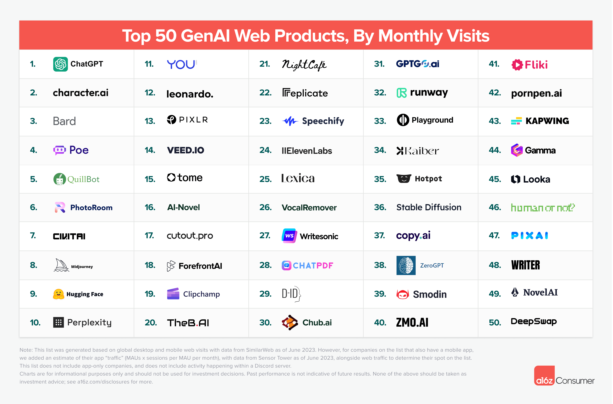

_Note: This list was generated based on global desktop and mobile web visits with data from SimilarWeb as of June 2023. However, for companies on the list that also have a mobile app, we added an estimate of their app “traffic” (MAUs x sessions per MAU per month), with data from Sensor Tower as of June 2023, alongside web traffic to determine their spot on the list.   

注：本榜单根据全球桌面和移动网络访问量生成，数据来自 SimilarWeb（截至 2023 年 6 月）。不过，对于榜单上同时拥有移动应用程序的公司，我们在计算网络流量的同时，还增加了对其应用程序 "流量"（MAUs x 每 MAU 每月会话数）的估算，数据来自 Sensor Tower 截至 2023 年 6 月的数据。_

_This list does not include app-only companies, and does not include activity happening within a Discord server.  

此列表不包括只使用应用程序的公司，也不包括在 Discord 服务器中发生的活动。_

## 1\. Most leading products are built from the “ground up” around generative AI  

1.大多数领先产品都是围绕生成式人工智能 "从头开始 "打造的

Like ChatGPT, the majority of products on this list didn’t exist a year ago—80% of these websites are new.  

与 ChatGPT 一样，这份榜单上的大多数产品在一年前都不存在--这些网站中有 80% 都是新网站。  

This suggests that while many legacy companies are augmenting their products with AI, many of the most compelling consumer experiences are completely novel.   

这表明，虽然许多传统公司正在利用人工智能增强其产品，但许多最引人注目的消费体验都是全新的。

Of the 50 companies on the list, only 5 are products of, or acquisitions by, pre-existing big tech companies: Bard (_Google_), Poe (_Quora_), QuillBot (_Course Hero_), Pixlr (_123RF_), and Clipchamp (_Microsoft_).   

在上榜的 50 家公司中，只有 5 家是原有大型科技公司的产品或被其收购：Bard（谷歌）、Poe（Quora）、QuillBot（Course Hero）、Pixlr（123RF）和Clipchamp（微软）。

Of the remaining list members, a whopping 48% are completely bootstrapped, with no outside funding, according to PitchBook data.  

根据 PitchBook 的数据，在剩下的名单成员中，有高达 48% 的公司完全是自发成立的，没有任何外部资金。  

This suggests that it’s possible to get a large AI product off the ground quickly, and with relatively little capital—though another 15% have raised upwards of $50 million already!  

这表明，在资金相对较少的情况下，快速推出大型人工智能产品是有可能的--尽管另外 15%的公司已经筹集了 5000 万美元以上的资金！

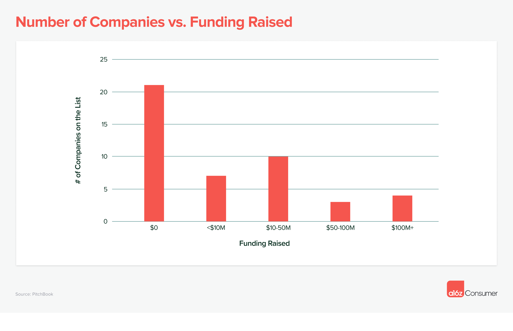

One of the main differences between VC-backed and bootstrapped companies? The tech stack.  

风险投资支持的公司和自筹资金的公司之间的主要区别之一是什么？技术堆栈。  

Depending on the model size, setting up and training your own model can cost millions of dollars.  

根据模型的大小，建立和培训自己的模型可能需要数百万美元。

The top 50 list is an almost even 3-way split between companies that (1) trained their own proprietary model, (2) fine-tuned an existing model, and (3) built a consumer UI on top of an existing model (e.g., “GPT wrappers”).  

排名前 50 位的公司几乎各占一半：(1) 训练自己的专有模型，(2) 对现有模型进行微调，(3) 在现有模型基础上建立消费者用户界面（如 "GPT 封装"）。  

However, it’s worth noting that of the top 10 products, half are built on their own model, while 4 are fine tunes—only one falls in the “wrapper” category.   

不过，值得注意的是，在排名前 10 位的产品中，有一半是基于自己的模型开发的，有 4 个是微调产品，只有一个属于 "包装 "类别。

Excluding ChatGPT (which skews the data given OpenAI’s $11.3 billion raised), companies with a proprietary model have raised an average of $98 million.  

除去 ChatGPT（由于 OpenAI 募集了 113 亿美元，因此数据有所偏差），拥有专有模型的公司平均募集了 9 800 万美元。  

This compares to $20 million for companies that have fine-tuned an open-source model, and $9 million for “wrapper” companies.  

相比之下，对开源模式进行了微调的公司获得了 2000 万美元，"包装 "公司获得了 900 万美元。

## 2\. ChatGPT has a massive lead, for now…  

2.ChatGPT 暂时大幅领先...

ChatGPT represents 60% of monthly traffic to the entire top 50 list, with an estimated 1.6 billion monthly visits and 200 million monthly users (as of June 2023).  

ChatGPT 占整个 50 强榜单月流量的 60%，预计月访问量达 16 亿次，月用户达 2 亿人（截至 2023 年 6 月）。  

This makes ChatGPT the 24th most visited website globally.   

这使得 ChatGPT 成为全球访问量最大的网站，排名第 24 位。

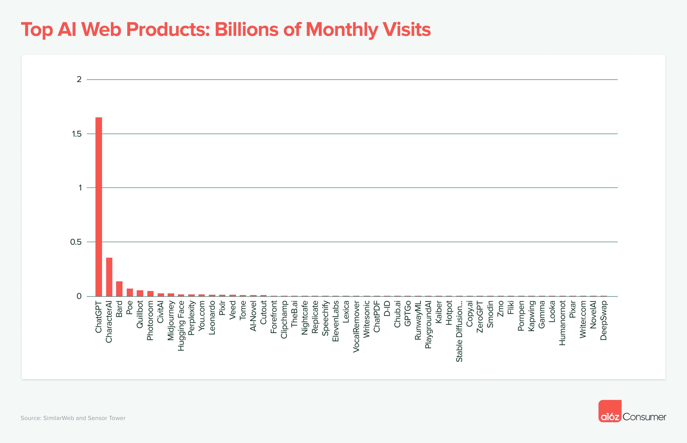

No other product has seen quite the same ramp, though companion platform CharacterAI has emerged as a solid #2, with ~21% of the scale of ChatGPT.  

尽管配套平台 CharacterAI 以相当于 ChatGPT 21% 的规模稳居第二，但没有其他产品出现同样的增长。  

On mobile in particular, CharacterAI is one of the strongest early players—with DAUs rivaling ChatGPT, and significantly better retention, according to Sensor Tower data.   

特别是在移动端，CharacterAI 是早期最强大的参与者之一--根据 Sensor Tower 的数据，其 DAUs 可与 ChatGPT 相媲美，而且留存率明显更高。

Compared to mainstream consumer products, even the biggest GenAI products are still fairly small.  

与主流消费产品相比，即使是最大的 GenAI 产品也仍然相当小。  

When combining web and mobile app traffic, ChatGPT ranks around the same scale as Reddit, LinkedIn, and Twitch—but still far below the “giants” (WhatsApp, YouTube, Facebook, etc.).  

如果将网络和移动应用程序的流量合并计算，ChatGPT 的排名与 Reddit、LinkedIn 和 Twitch 差不多，但仍远低于 "巨头"（WhatsApp、YouTube、Facebook 等）。

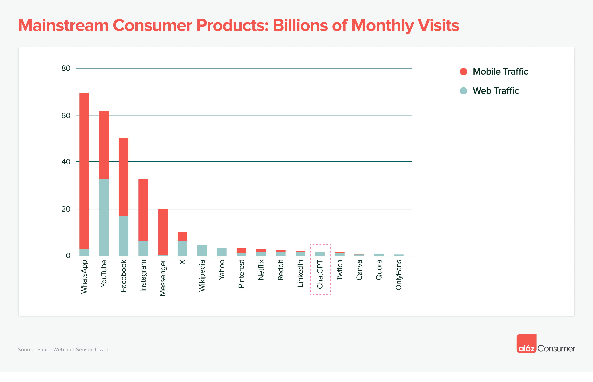

## 3\. LLM assistants (like ChatGPT) are dominant, but companionship and creative tools are on the rise  

3.LLM 助手（如 ChatGPT）占主导地位，但陪伴和创意工具正在兴起

General LLM chatbots represent 68% of total consumer traffic to the top 50 list. Alongside ChatGPT, this category includes Google’s Bard and Quora’s Poe, all ranked in the top 5.  

一般乐虎国际手机版下载聊天机器人占前 50 强榜单消费者总流量的 68%。除 ChatGPT 外，该类别还包括谷歌的 Bard 和 Quora 的 Poe，它们均排名前五。

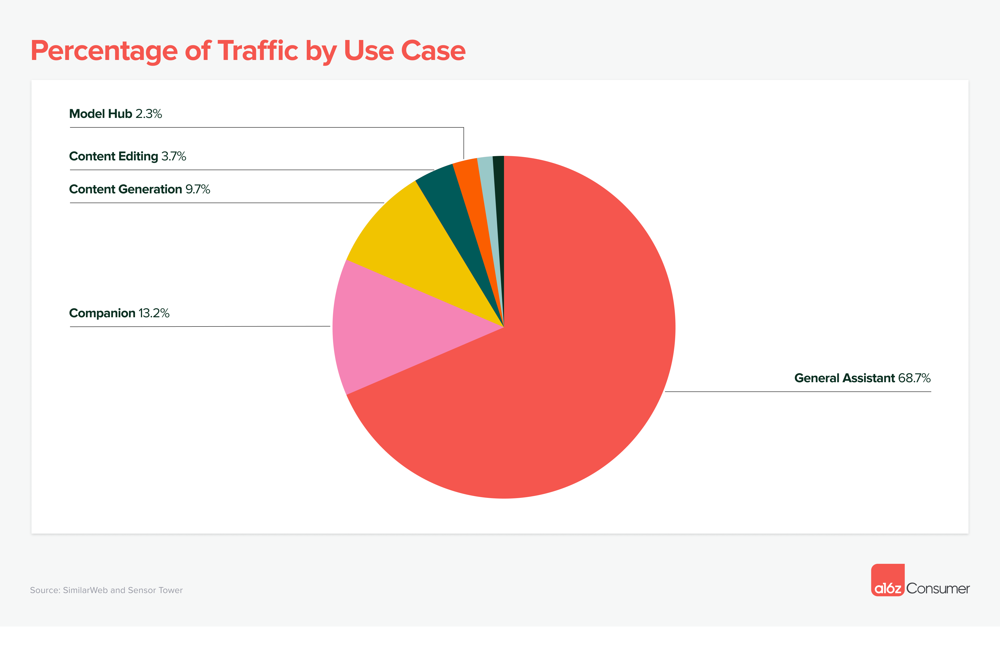

However, two other categories have started to drive significant usage in recent months—AI companions (such as CharacterAI) and content generation tools (such as Midjourney and ElevenLabs).  

不过，近几个月来，另外两类工具也开始得到大量使用--人工智能伴侣（如 CharacterAI）和内容生成工具（如 Midjourney 和 ElevenLabs）。  

Within the broader content generation category, image generation is the top use case with 41% of traffic, followed by prosumer writing tools at 26%, and video generation at 8%.   

在更广泛的内容生成类别中，图片生成是流量最大的使用案例，占 41%，其次是专业写作工具，占 26%，视频生成占 8%。

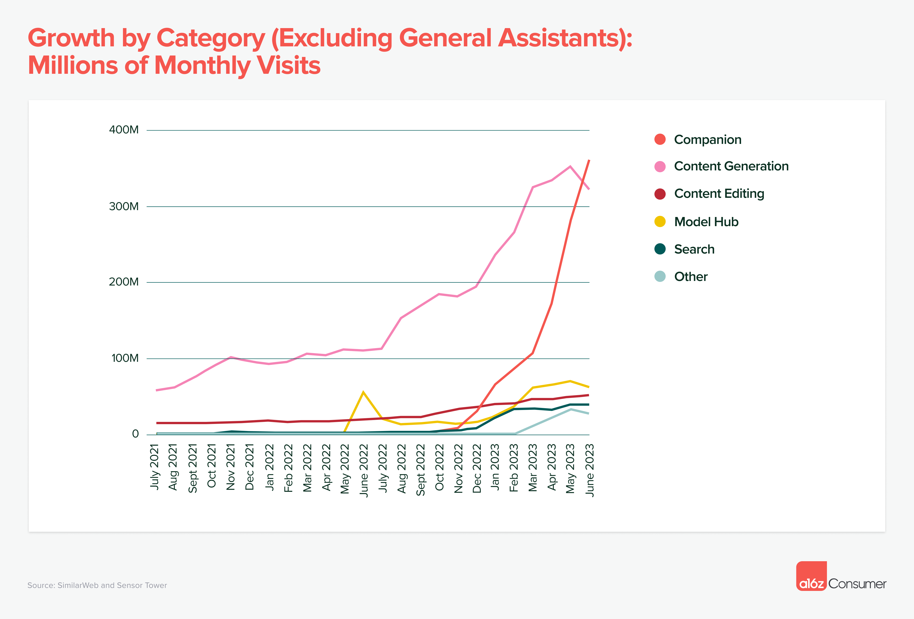

Another category worth mentioning? Model hubs. There are only 2 on the list, but they drive significant traffic—Civitai (for images) and Hugging Face both rank in the top 10. This is especially impressive because consumers are typically visiting these sites to download models to run locally, so web traffic is likely an underestimate of actual usage.   

另一个值得一提的类别是什么？模特中心。榜单上只有 2 个，但它们带来了巨大的流量--Civitai（图片）和 Hugging Face 都进入了前 10 名。这尤其令人印象深刻，因为消费者访问这些网站通常是为了下载模型在本地运行，因此网络流量很可能低估了实际使用量。

## 4\. Early “winners” have emerged, but most product categories are up for grabs  

4.早期 "赢家 "已经出现，但大多数产品类别仍有待争夺

Good news for builders: despite the surge in interest in generative AI, in many categories there is not yet a runway success.   

对于建筑商来说，好消息是：尽管人们对生成式人工智能的兴趣大增，但在许多类别中还没有成功的案例。

The below graph shows the differential in traffic between the #1 and #2 players in each space.  

下图显示了各领域第一名和第二名之间的流量差距。  

While there are some exceptions (e.g., companionship), for most categories there is less than a 2x gap—meaning the top company receives just double (or less) the number of visits as its next closest competitor.  

虽然也有一些例外情况（如陪伴），但在大多数类别中，差距都小于 2 倍，即排名第一的公司的访问量仅是其次近的竞争对手的两倍（或更少）。  

This is nowhere near insurmountable given companies on the list averaged 50% monthly growth over the past 6 months.  

鉴于榜单上的公司在过去 6 个月中平均每月增长 50%，这还远远不是一个难以克服的问题。

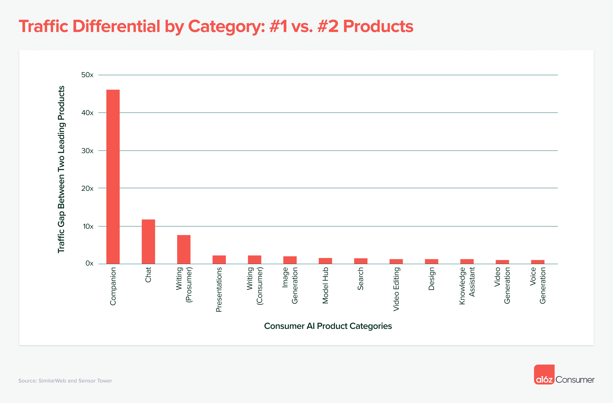

We’re also starting to see significant fragmentation.  

我们也开始看到严重的碎片化现象。  

Products that are purpose-built for specific use cases or workflows are growing alongside more generalist tools, and showing signs that they can also become successful companies.  

为特定用例或工作流程而专门设计的产品正在与更多通用工具一起成长，并显示出它们也能成为成功公司的迹象。

One example is image generation. While Midjourney dominates the broader space, companies like Leonardo (specific to gaming assets) are also seeing impressive growth in traffic.  

图像生成就是一个例子。虽然 Midjourney 在更广泛的领域占据主导地位，但莱昂纳多（专门针对游戏资产）等公司的流量增长也令人印象深刻。  

The graph below shows the ramp in Midjourney’s Discord server members, as compared to Leonardo’s monthly unique visitors.  

下图显示了 Midjourney Discord 服务器成员数量与莱昂纳多每月独立访客数量的对比。  

While not at the same scale, Leonardo has been able to pick up millions of users alongside Midjourney’s continued ascent.  

莱昂纳多虽然没有达到同样的规模，但在 Midjourney 持续上升的同时，也积累了数百万用户。

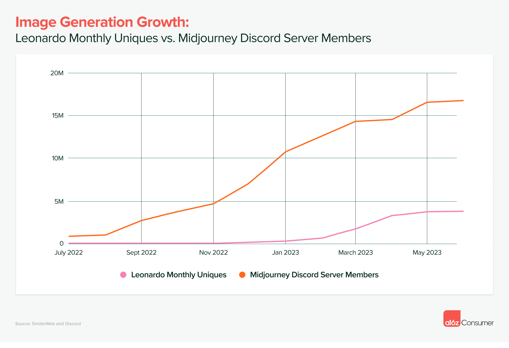

## 5\. Acquisition for top products is entirely organic—and consumers are willing to pay!  

5.顶级产品的采购完全是有机的，而且消费者愿意付费！ 

For the past 5 years, many consumer apps have been caught in an acquisition game.  

在过去 5 年中，许多消费类应用程序都陷入了收购游戏。  

With no platform shift (e.g., internet → mobile), it’s been difficult to drive excitement for new products. Costs of acquisition [have also been](https://www.forbes.com/sites/forbesagencycouncil/2022/05/17/surviving-e-commerces-great-customer-acquisition-crisis/?sh=53288a715f71) rising, meaning that most consumer companies have had to worry about metrics like [lifetime value and customer acquisition cost](https://a16z.com/2023/08/22/why-do-investors-care-so-much-about-ltvcac/).  

由于没有平台转移（如互联网→移动），很难激发新产品的兴奋点。获取客户的成本也在不断上升，这意味着大多数消费企业不得不担心终身价值和客户获取成本等指标。

GenAI has changed the game. The majority of companies on this list have no paid marketing (at least, that SimilarWeb is able to attribute).  

GenAI 改变了游戏规则。这份榜单上的大多数公司都没有付费营销（至少，SimilarWeb 能够归因于此）。  

There is significant free traffic “available” via X, Reddit, Discord, and email, as well as word of mouth and referral growth.   

通过 X、Reddit、Discord 和电子邮件，以及口碑和推荐增长，"可获得 "大量免费流量。

The bottom quartile of these GenAI products saw just 2% of their traffic coming from paid sources.  

在这些 GenAI 产品中，排名后四分之一的产品仅有 2% 的流量来自付费来源。  

This compares to 70% paid traffic for the bottom quartile of non-AI consumer subscription companies, per a16z’s benchmarking of 150 products.  

而根据 a16z 对 150 种产品的基准测试，在非人工智能消费者订阅公司中，付费流量占比最低的四分之一为 70%。

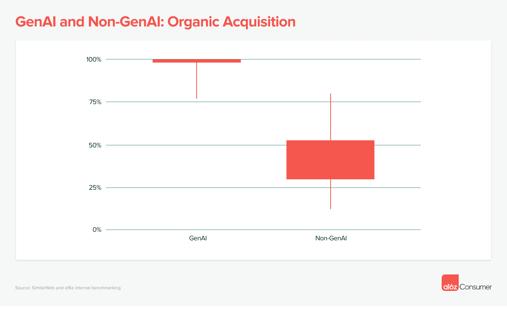

And consumers are willing to pay for GenAI. 90% of companies on the list are already monetizing, nearly all of them via a subscription model.  

消费者愿意为 GenAI 付费。榜单上 90% 的公司已经开始盈利，几乎所有公司都采用订阅模式。  

The average product on the list makes $21/month (for users on monthly plans)—yielding $252 annually.   

榜单上的平均产品月收入为 21 美元（包月计划用户），年收益为 252 美元。

If you’ve subscribed to any popular consumer subscription products pre-AI (e.g., Calm, Headspace, Duolingo) you’ll know they mostly charge less than $70 per year for annual subscribers—with [an average](https://www.businessofapps.com/data/app-pricing/) of $10/month for monthly subscribers. Generative AI [unlocks a new level of value](https://a16z.com/2023/08/03/the-economic-case-for-generative-ai-and-foundation-models/), which increases consumer willingness to pay.  

如果您在人工智能出现之前订阅过任何流行的消费者订阅产品（例如，Calm、Headspace、Duolingo），您就会知道它们的年订阅费大多低于 70 美元，月订阅费平均为 10 美元/月。生成式人工智能将价值提升到了一个新的高度，从而提高了消费者的付费意愿。

## 6\. Mobile apps are still emerging as a GenAI platform  

6.移动应用程序仍是新兴的 GenAI 平台

Consumer AI products have, thus far, been largely browser-first, rather than app-first. Even ChatGPT took 6 months to launch a mobile app!  

迄今为止，人工智能消费产品基本上都是浏览器优先，而不是应用程序优先。就连 ChatGPT 也花了 6 个月才推出移动应用！

There have been notable exceptions. In the image generation category, the “barrier to launch” an app is fairly low, thanks to third-party APIs.  

但也有明显的例外。在图像生成类别中，由于第三方应用程序接口的存在，应用程序的 "启动门槛 "相当低。  

Products like Lensa and WOMBO saw steep ascents—and equally steep declines.   

Lensa 和 WOMBO 等产品的销量急剧上升，但跌幅也同样巨大。

Why aren’t more AI companies building on mobile? The browser is a natural starting place to reach the broadest base of consumers.  

为什么没有更多的人工智能公司在移动平台上开展业务？浏览器是接触最广泛消费者的天然起点。  

Many AI companies have small teams and likely don’t want to fragment their focus and resources across Web, iOS, and Android.  

许多人工智能公司的团队规模较小，很可能不希望将精力和资源分散到 Web、iOS 和 Android 上。  

As a result, only 15 companies on the list currently have a live mobile app, and almost all of them see less than 10% of total monthly traffic come from their app versus the web.   

因此，目前只有 15 家上榜公司拥有实时移动应用程序，而且几乎所有这些公司每月的总流量中，来自应用程序的流量不到网络流量的 10%。

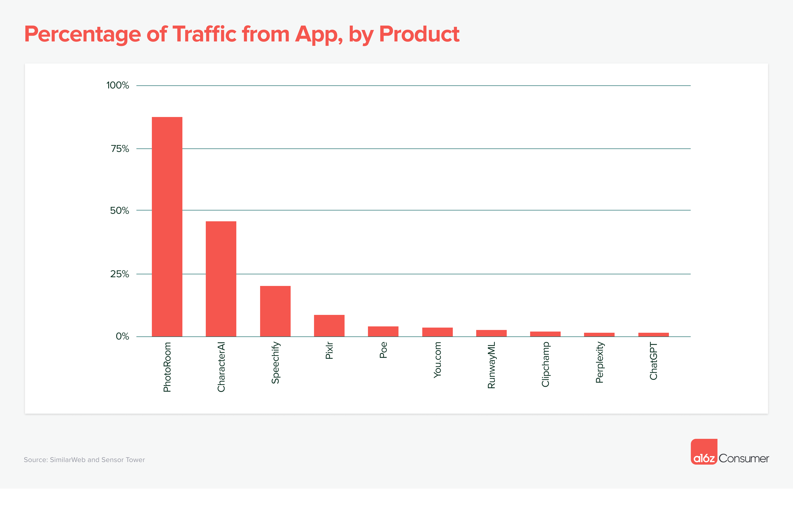

There are 3 notable exceptions: prosumer design studio **PhotoRoom** (estimated 88% of traffic on app), companion app **CharacterAI** (46% of traffic on app), and text-to-speech product **Speechify** (20% of traffic on app). These companies are seeing outsized engagement (measured as sessions per visitor, per month) on their mobile apps, compared to their websites.  

有 3 个明显的例外：专业消费者设计工作室 PhotoRoom（估计占应用程序流量的 88%）、伴侣应用程序 CharacterAI（占应用程序流量的 46%）和文本转语音产品 Speechify（占应用程序流量的 20%）。与网站相比，这些公司在其移动应用程序上的参与度（以每位访客每月的会话数来衡量）更高。

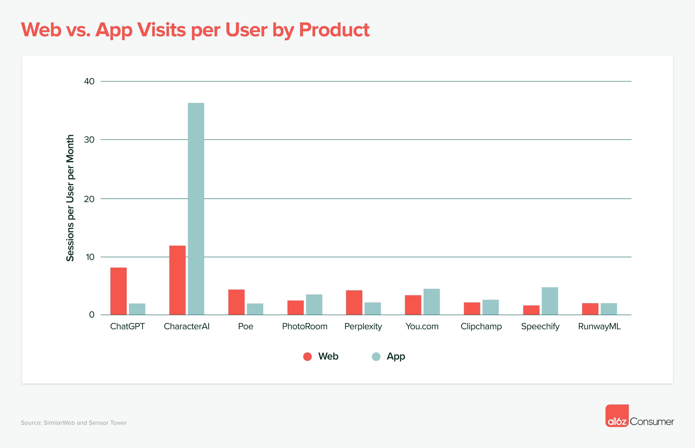

Given that the average consumer now [spends 36 minutes more per day on mobile](https://www.zippia.com/advice/mobile-vs-desktop-usage-statistics/#:~:text=Americans%20spend%20about%204.1%20hours,on%20phones%20compared%20to%20desktops.) than desktop (4.1 hours vs. 3.5 hours), we expect to see more mobile-first GenAI products emerge as the technology matures.   

鉴于现在消费者平均每天在移动设备上花费的时间比台式机多 36 分钟（4.1 小时对 3.5 小时），我们预计随着技术的成熟，将会出现更多移动优先的 GenAI 产品。

___

If you’re building something in generative AI, reach out! We’d love to hear from you—you can find me on Twitter at @omooretweets, or via email at [omoore@a16z.com](mailto:omoore@a16z.com).如果你正在构建生成式人工智能，请联系我们！您可以通过 Twitter 上的 @omooretweets 或电子邮件 omoore@a16z.com 找到我。
