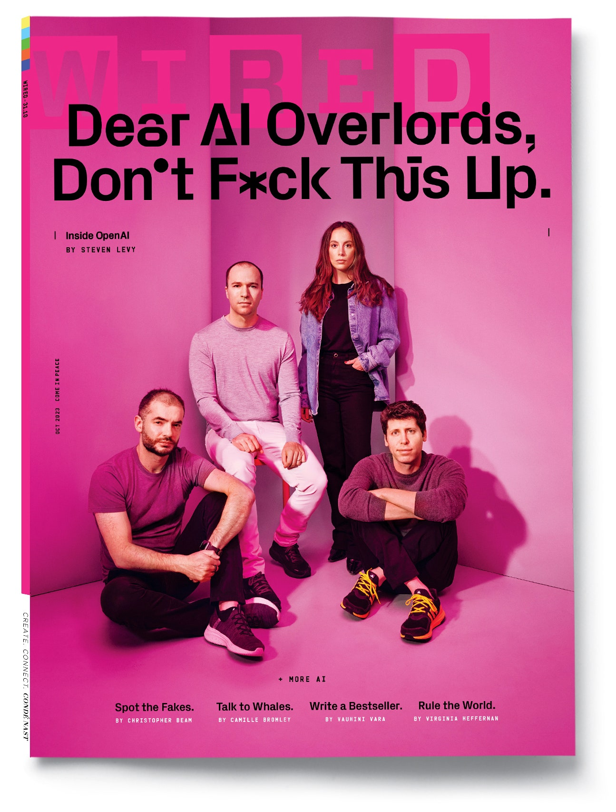

The air crackles with an almost Beatlemaniac energy as the star and his entourage tumble into a waiting Mercedes van.  

当这位明星和他的随行人员跌跌撞撞地跑进一辆等候多时的奔驰面包车时，空气中迸发出近乎披头士狂热的能量。  

They’ve just ducked out of one event and are headed to another, then another, where a frenzied mob awaits.  

他们刚从一个活动中逃出来，又要去另一个、再另一个活动，那里有一群疯狂的暴徒在等着他们。  

As they careen through the streets of London—the short hop from Holborn to Bloomsbury—it’s as if they’re surfing one of civilization’s before-and-after moments.  

从霍尔本到布卢姆斯伯里，他们在伦敦的街道上飞驰，就像在冲浪，感受文明的前世今生。  

The history-making force personified inside this car has captured the attention of the world.  

这辆汽车所蕴含的创造历史的力量吸引了全世界的目光。  

Everyone wants a piece of it, from the students who’ve waited in line to the prime minister.  

从排队等候的学生到首相，每个人都想从中分一杯羹。

Inside the luxury van, wolfing down a salad, is the neatly coiffed 38-year-old entrepreneur Sam Altman, cofounder of [OpenAI](https://www.wired.com/tag/openai/); a PR person; a security specialist; and me.  

在这辆豪华面包车里，正狼吞虎咽地吃着沙拉的是 38 岁的企业家、OpenAI 的联合创始人萨姆-奥特曼（Sam Altman）、一名公关人员、一名安全专家和我。  

Altman is unhappily sporting a blue suit with a tieless pink dress shirt as he whirlwinds through London as part of a monthlong global jaunt through 25 cities on six continents.  

奥特曼身着蓝色西装和无领粉色礼服衬衫，在伦敦旋风般地穿行，这是他为期一个月的环球旅行的一部分，途经六大洲的 25 座城市。  

As he gobbles his greens—no time for a sit-down lunch today—he reflects on his meeting the previous night with French president Emmanuel Macron. Pretty good guy! And _very_ interested in [artificial intelligence](https://www.wired.com/tag/artificial-intelligence/).  

他一边狼吞虎咽地吃着蔬菜--今天没时间坐下来吃午餐--一边回想着前一晚与法国总统埃马纽埃尔-马克龙的会面。马克龙是个好人！而且对人工智能非常感兴趣。

As was the prime minister of Poland. And the prime minister of Spain.  

波兰首相也是如此。西班牙首相也是如此。

Riding with Altman, I can almost hear the ringing, ambiguous chord that opens “A Hard Day’s Night”—introducing the future. Last November, when OpenAI let loose its monster hit, [ChatGPT](https://www.wired.com/tag/chatgpt/), it triggered a tech explosion not seen since the internet burst into our lives.  

和奥特曼一起骑车，我几乎能听到《难熬的一夜》开篇那铿锵有力、模棱两可的和弦--那是对未来的介绍。去年 11 月，OpenAI 推出了一款怪兽级产品 ChatGPT，引发了自互联网进入我们生活以来前所未有的技术爆炸。  

Suddenly the Turing test was history, search engines were endangered species, and no college essay could ever be trusted. No job was safe. No scientific problem was immutable.  

突然间，图灵测试成了历史，搜索引擎成了濒危物种，任何大学论文都不可信。没有一份工作是安全的。没有一个科学问题是一成不变的。

Altman didn’t do the research, train the neural net, or code the interface of ChatGPT and its more precocious sibling, GPT-4. But as CEO—and a dreamer/doer type who’s like a younger version of his cofounder Elon Musk, without the baggage—one news article after another has used his photo as the visual symbol of humanity’s new challenge.  

阿尔特曼没有参与 ChatGPT 及其更早熟的同胞兄弟 GPT-4 的研究、神经网络训练或界面编码。但作为首席执行官--一个梦想家/实干家，他就像年轻版的联合创始人埃隆-马斯克（Elon Musk），没有任何包袱--一篇又一篇的新闻报道将他的照片作为人类新挑战的视觉象征。  

At least those that haven’t led with an eye-popping image generated by OpenAI’s visual AI product, [Dall-E.](https://www.wired.com/story/openai-dalle-copyright-intellectual-property-art/) He is the oracle of the moment, the figure that people want to consult first on how AI might usher in a golden age, or consign humans to irrelevance, or worse.  

至少那些没有以 OpenAI 的可视化人工智能产品 Dall-E 生成的令人瞠目的图像为先导的公司是这样做的。他是当下的神谕，是人们在人工智能如何迎来黄金时代，或使人类变得无关紧要，或更糟时，首先想咨询的人物。

Altman’s van whisks him to four appearances that sunny day in May.  

在五月那个阳光明媚的日子里，奥特曼的面包车载着他去参加了四场演出。  

The first is stealthy, an off-the-record session with the Round Table, a group of government, academia, and industry types.  

第一场会议是隐秘的，是由政府、学术界和工业界人士组成的圆桌讨论会。  

Organized at the last minute, it’s on the second floor of a pub called the Somers Town Coffee House.  

活动是在最后一刻组织的，地点在一家名为萨默斯镇咖啡馆的酒吧二楼。  

Under a glowering portrait of brewmaster Charles Wells (1842–1914), Altman fields the same questions he gets from almost every audience. Will AI kill us? Can it be regulated?  

在酿酒师查尔斯-威尔斯（Charles Wells，1842-1914 年）面无表情的肖像下，奥特曼向几乎所有观众提出了同样的问题。人工智能会杀死我们吗？能否对其进行监管？  

What about China? He answers every one in detail, while stealing glances at his phone.  

中国怎么样？他一边偷看手机，一边详细回答每一个问题。  

After that, he does a fireside chat at the posh Londoner Hotel in front of 600 members of the Oxford Guild.  

之后，他在豪华的伦敦人酒店与牛津公会的 600 名成员进行了炉边谈话。  

From there it’s on to a basement conference room where he answers more technical questions from about 100 entrepreneurs and engineers.  

在那里，他回答了约 100 名企业家和工程师提出的更多技术问题。  

Now he’s almost late to a mid-afternoon onstage talk at University College London.  

现在，他在伦敦大学学院下午的台上演讲几乎要迟到了。  

He and his group pull up at a loading zone and are ushered through a series of winding corridors, like the Steadicam shot in _Goodfellas_. As we walk, the moderator hurriedly tells Altman what he’ll ask. When Altman pops on stage, the auditorium—packed with rapturous academics, geeks, and journalists—erupts.  

他和他的团队在一个装货区停车，然后被带进一系列蜿蜒曲折的走廊，就像《古惑仔》中的 Steadicam 镜头一样。一边走，主持人一边匆匆告诉奥特曼他要问的问题。当奥特曼突然出现在舞台上时，观众席上的学者、怪才和记者们沸腾了。

Altman is not a natural publicity seeker. I once spoke to him right after _The New Yorker_ ran [a long profile](https://www.newyorker.com/magazine/2016/10/10/sam-altmans-manifest-destiny) of him. “Too much about me,” he said. But at University College, after the formal program, he wades into the scrum of people who have surged to the foot of the stage.  

奥特曼并不是一个天生的宣传狂。有一次，在《纽约客》刊登了一篇关于他的长篇报道后，我立即与他进行了交谈。"他说："关于我的报道太多了。但在大学学院，在正式活动结束后，他走进了涌向台下的人群中。  

His aides try to maneuver themselves between Altman and the throng, but he shrugs them off.  

他的助手试图在奥特曼和人群之间周旋，但被他甩开了。  

He takes one question after another, each time intently staring at the face of the interlocutor as if he’s hearing the query for the first time. Everyone wants a selfie.  

他一个问题接一个问题地回答，每次都聚精会神地盯着对话者的脸，仿佛他是第一次听到这个问题。每个人都想要一张自拍照。  

After 20 minutes, he finally allows his team to pull him out. Then he’s off to meet with UK prime minister Rishi Sunak.  

20 分钟后，他终于让他的团队把他拉了出来。然后，他去会见英国首相里希-苏纳克。

Maybe one day, when robots write our history, they will cite Altman’s world tour as a milestone in the year when everyone, all at once, started to make their own personal reckoning with the singularity.  

也许有一天，当机器人书写我们的历史时，他们会把奥特曼的世界巡演作为一个里程碑，因为在这一年里，每个人都同时开始对奇点进行自己的个人思考。  

Or then again, maybe whoever writes the history of this moment will see it as a time when a quietly compelling CEO with a paradigm-busting technology made an attempt to inject a very peculiar worldview into the global mindstream—from an unmarked four-story headquarters in San Francisco’s Mission District to the entire world.  

又或者，无论谁来书写这一刻的历史，都会把它看作是一位默默无闻的令人信服的首席执行官，带着一项打破范式的技术，试图将一种非常奇特的世界观注入全球的思想潮流--从旧金山使命区一个没有标志的四层楼总部到整个世界。

This article appears in the October 2023 issue. [Subscribe to WIRED](https://subscribe.wired.com/subscribe/splits/wired/WIR_Edit_Hardcoded?source=HCL_WIR_COVER_INSET_0).  

本文刊登于 2023 年 10 月刊。订阅《WIRED》。

Photograph: Jessica Chou  

摄影：Jessica Chou

For Altman and his company, ChatGPT and GPT-4 are merely stepping stones along the way to achieving a simple and seismic mission, one these technologists may as well have branded on their flesh.  

对奥特曼和他的公司来说，ChatGPT 和 GPT-4 只是实现简单而震撼人心的使命的垫脚石，这些技术专家可能已经在自己的肉体上烙下了这个使命。  

That mission is to build artificial general intelligence—a concept that’s so far been grounded more in science fiction than science—and to make it safe for humanity.  

这项任务就是建立人工通用智能--迄今为止，这个概念更多地是建立在科幻小说而非科学的基础上，而且要让它对人类安全。  

The people who work at OpenAI are fanatical in their pursuit of that goal.  

OpenAI 的员工对这一目标有着狂热的追求。  

(Though, as any number of conversations in the office café will confirm, the “build AGI” bit of the mission seems to offer up more raw excitement to its researchers than the “make it safe” bit.) These are people who do not shy from casually using the term “super-intelligence.” They _assume_ that AI’s trajectory will surpass whatever peak biology can attain.  

(不过，在办公室咖啡厅里的许多谈话都会证实，"构建 AGI "这一点似乎比 "确保安全 "这一点更能让研究人员感到兴奋）。这些人并不避讳随意使用 "超级智能 "这个词。他们认为，人工智能的发展轨迹将超越生物学所能达到的任何顶峰。  

The company’s financial documents even stipulate a kind of exit contingency for when AI wipes away our whole economic system.  

该公司的财务文件甚至规定了一种退出应急方案，以防人工智能摧毁我们的整个经济体系。

It’s not fair to call OpenAI a cult, but when I asked several of the company’s top brass if someone could comfortably work there if they didn’t believe AGI was truly coming—and that its arrival would mark one of the greatest moments in human history—most executives didn’t think so. _Why would a nonbeliever want to work here_? they wondered.  

说OpenAI是邪教并不公平，但当我问公司的几位高层，如果有人不相信AGI真的会到来--它的到来将标志着人类历史上最伟大的时刻之一--是否能在这里安心工作时，大多数高管都不这么认为。他们不禁要问，不相信的人为什么要在这里工作呢？  

The assumption is that the workforce—now at approximately 500, though it might have grown since you began reading this paragraph—has self-selected to include only the faithful.  

我们的假设是，我们的员工队伍--现在大约有 500 人，尽管从你开始读这一段起可能已经增加了--已经自我选择，只包括忠实的信徒。  

At the very least, as Altman puts it, once you get hired, it seems inevitable that you’ll be drawn into the spell.  

至少，正如奥特曼所说，一旦你被录用，似乎就不可避免地会被卷入咒语之中。

At the same time, OpenAI is not the company it once was.  

与此同时，OpenAI 也已今非昔比。  

It was founded as a purely nonprofit research operation, but today most of its employees technically work for a profit-making entity that is reportedly valued at [almost $30 billion](https://www.wsj.com/articles/chatgpt-creator-openai-is-in-talks-for-tender-offer-that-would-value-it-at-29-billion-11672949279).  

该公司成立之初是一家纯粹的非营利性研究机构，但如今，从技术上讲，它的大部分员工都在为一家据说估值近 300 亿美元的营利性实体工作。  

Altman and his team now face the pressure to deliver a revolution in every product cycle, in a way that satisfies the commercial demands of investors and keeps ahead in a fiercely competitive landscape.  

Altman 和他的团队现在面临的压力是，要在每个产品周期中都实现革命，既要满足投资者的商业需求，又要在激烈的竞争中保持领先。  

All while hewing to a quasi-messianic mission to elevate humanity rather than exterminate it.  

与此同时，他们还肩负着提升人类而非消灭人类的准弥赛亚使命。

That kind of pressure—not to mention the unforgiving attention of the entire world—can be a debilitating force.  

这种压力--更不用说全世界无情的关注--会让人崩溃。  

The Beatles set off colossal waves of cultural change, but they anchored their revolution for only so long: Six years after chiming that unforgettable chord they weren’t even a band anymore.  

甲壳虫乐队掀起了巨大的文化变革浪潮，但他们的革命只持续了这么短的时间：在敲响那令人难忘的和弦六年后，他们甚至不再是一支乐队了。  

The maelstrom OpenAI has unleashed will almost certainly be far bigger. But the leaders of OpenAI swear they’ll stay the course.  

OpenAI 引发的漩涡几乎肯定会更大。但 OpenAI 的领导者们发誓，他们将坚持到底。  

All they want to do, they say, is build computers smart enough and safe enough to end history, thrusting humanity into an era of unimaginable bounty.  

他们说，他们要做的就是制造出足够智能和安全的计算机，终结历史，将人类带入一个难以想象的富饶时代。

Growing up in the late ’80s and early ’90s, Sam Altman was a nerdy kid who gobbled up science fiction and _Star Wars_. The worlds built by early sci-fi writers often had humans living with—or competing with—superintelligent AI systems. The idea of computers matching or exceeding human capabilities thrilled Altman, who had been coding since his fingers could barely cover a keyboard.  

萨姆-奥特曼（Sam Altman）成长于上世纪 80 年代末 90 年代初，是一个沉迷于科幻小说和《星球大战》的书呆子。在早期科幻小说家构建的世界中，人类往往与超级智能人工智能系统共同生活，或与之竞争。计算机与人类能力相匹配或超越人类能力的想法让阿尔特曼兴奋不已，他从手指还能勉强触碰键盘时就开始编码了。  

When he was 8, his parents bought him a Macintosh LC II.  

8 岁时，父母给他买了一台 Macintosh LC II。  

One night he was up late playing with it and the thought popped into his head: “Someday this computer is going to learn to think.” When he arrived at Stanford as an undergrad in 2003, he hoped to help make that happen and took courses in AI.  

一天晚上，他玩到很晚 突然冒出一个念头"总有一天这台电脑会学会思考"2003 年，当他作为本科生来到斯坦福大学时，他希望能帮助实现这一目标，并选修了人工智能课程。

But “it wasn’t working at all,” he’d later say. The field was still mired in an innovation trough known as AI winter.

  

但他后来说，"这根本行不通"。该领域仍深陷被称为 "人工智能寒冬 "的创新低谷。  

Altman dropped out to enter the startup world; his company Loopt was in the tiny first batch of wannabe organizations in [Y Combinator,](https://www.wired.com/story/how-y-combinator-changed-the-world/) which would become the world’s most famed incubator.  

阿尔特曼退学后进入了初创企业界；他的公司Loopt是Y Combinator的第一批小公司，Y Combinator后来成为世界上最著名的孵化器。

In February 2014, Paul Graham, YC’s founding guru, chose then-28-year-old Altman to succeed him. “Sam is one of the smartest people I know,” [Graham wrote](https://www.ycombinator.com/blog/sam-altman-for-president/) in the announcement, “and understands startups better than perhaps anyone I know, including myself.” But Altman saw YC as something bigger than a launchpad for companies.  

2014 年 2 月，YC 的创始人保罗-格雷厄姆（Paul Graham）选择当时 28 岁的阿尔特曼接替自己。"格雷厄姆在公告中写道："山姆是我所认识的最聪明的人之一，他对初创企业的理解可能超过我认识的任何人，包括我自己。"但在 Altman 看来，YC 不仅仅是一个公司的启动平台。  

“We are not about startups,” he told me soon after taking over.  

"他在上任后不久就对我说："我们与初创企业无关。  

“We are about innovation, because we believe that is how you make the future great for everyone.” In Altman’s view, the point of cashing in on all those unicorns was not to pack the partners’ wallets but to fund species-level transformations.  

"我们的宗旨是创新，因为我们相信，只有创新才能为每个人创造美好的未来"。在奥特曼看来，从所有这些独角兽身上套现的意义不在于装满合伙人的钱包，而在于为物种层面的变革提供资金。  

He began a research wing, hoping to fund ambitious projects to solve the world’s biggest problems. But AI, in his mind, was the one realm of innovation to rule them all: a superintelligence that could address humanity’s problems better than humanity could.  

他成立了一个研究部门，希望为雄心勃勃的项目提供资金，以解决世界上最大的问题。但在他看来，人工智能才是统治一切的创新领域：一种能比人类更好地解决人类问题的超级智能。

As luck would have it, Altman assumed his new job just as AI winter was turning into an abundant spring.  

幸运的是，就在大赦国际的冬天即将变成丰收的春天时，奥特曼上任了。  

Computers were now performing amazing feats, via deep learning and neural networks, like labeling photos, translating text, and optimizing sophisticated ad networks.  

现在，计算机通过深度学习和神经网络完成了令人惊叹的壮举，比如给照片贴标签、翻译文本和优化复杂的广告网络。  

The advances convinced him that for the first time, AGI was actually within reach. Leaving it in the hands of big corporations, however, worried him.  

这些进步让他相信，AGI 第一次真正触手可及。然而，将其交到大公司手中却让他忧心忡忡。  

He felt those companies would be too fixated on their products to seize the opportunity to develop AGI as soon as possible.  

他认为，这些公司会过于专注于自己的产品，而不会抓住机会尽快开发 AGI。  

And if they did create AGI, they might recklessly unleash it upon the world without the necessary precautions.  

如果他们真的创造出了人工智能，他们可能会不顾一切地将其释放到世界上，而不采取必要的预防措施。

At the time, Altman had been thinking about running for governor of California.  

当时，奥特曼一直在考虑竞选加州州长。  

But he realized that he was perfectly positioned to do something bigger—to lead a company that would change humanity itself.  

但他意识到，他完全有能力做更大的事情--领导一家改变人类本身的公司。  

“AGI was going to get built exactly once,” he told me in 2021. “And there were not that many people that could do a good job running OpenAI.  

"他在 2021 年告诉我："AGI 只打算建造一次。"没有那么多人能够很好地运行 OpenAI。  

I was lucky to have a set of experiences in my life that made me really positively set up for this.”  

我很幸运，我生命中的一系列经历让我真正为此做好了积极的准备"。

Altman began talking to people who might help him start a new kind of AI company, a nonprofit that would direct the field toward responsible AGI.  

阿尔特曼开始与那些可能帮助他创办一家新型人工智能公司的人交谈，这家非营利性公司将引导人工智能领域向负责任的方向发展。  

One kindred spirit was Tesla and SpaceX CEO Elon Musk. As Musk [would later tell CNBC](https://www.youtube.com/watch?v=bWr-DA5Wjfw), he had become concerned about AI’s impact after having some marathon discussions with Google cofounder Larry Page.  

特斯拉和 SpaceX 公司首席执行官埃隆-马斯克（Elon Musk）就是其中一位志同道合者。马斯克后来告诉 CNBC，在与谷歌联合创始人拉里-佩奇（Larry Page）进行了一些马拉松式的讨论后，他开始担心人工智能的影响。  

Musk said he was dismayed that Page had little concern for safety and also seemed to regard the rights of robots as equal to humans.  

马斯克说，令他感到沮丧的是，佩奇几乎不关心安全问题，而且似乎把机器人的权利视为与人类平等。  

When Musk shared his concerns, Page accused him of being a “speciesist.” Musk also understood that, at the time, Google employed much of the world’s AI talent.  

当马斯克表达自己的担忧时，佩奇指责他是一个 "物种主义者"。马斯克也明白，当时谷歌雇佣了世界上大部分的人工智能人才。  

He was willing to spend some money for an effort more amenable to Team Human.  

他愿意花一些钱，为 "人类团队 "做出更多努力。

Within a few months Altman had raised money from Musk (who pledged $100 million, and his time) and Reid Hoffman (who donated $10 million).  

几个月内，奥特曼就从马斯克（承诺提供 1 亿美元和他的时间）和里德-霍夫曼（捐赠 1 千万美元）那里筹到了资金。  

Other funders included Peter Thiel, Jessica Livingston, Amazon Web Services, and YC Research. Altman began to stealthily recruit a team.  

其他资助者包括彼得-蒂尔（Peter Thiel）、杰西卡-利文斯顿（Jessica Livingston）、亚马逊网络服务公司（Amazon Web Services）和 YC Research。奥特曼开始秘密招募团队。  

He limited the search to AGI believers, a constraint that narrowed his options but one he considered critical.  

他将搜索范围限制在 AGI 信徒身上，这一限制缩小了他的选择范围，但他认为这一限制至关重要。  

“Back in 2015, when we were recruiting, it was almost considered a career killer for an AI researcher to say that you took AGI seriously,” he says.  

"他说："早在 2015 年，当我们进行招聘时，对于人工智能研究人员来说，如果说你认真对待 AGI，这几乎被认为是职业生涯的杀手。  

“But I wanted people who took it seriously.”  

"但我想要认真对待它的人"

Greg Brockman is now OpenAI’s president.  

格雷格-布罗克曼（Greg Brockman）现任 OpenAI 总裁。

Photograph: Jessica Chou  

摄影：Jessica Chou

Greg Brockman, the chief technology officer of Stripe, was one such person, and he agreed to be OpenAI’s CTO.  

Stripe 公司的首席技术官格雷格-布罗克曼（Greg Brockman）就是这样一个人，他同意担任 OpenAI 的首席技术官。  

Another key cofounder would be Andrej Karpathy, who had been at Google Brain, the search giant’s cutting-edge AI research operation.  

另一位重要的联合创始人是安德烈-卡尔帕西（Andrej Karpathy），他曾在搜索巨头谷歌的尖端人工智能研究机构 "谷歌大脑"（Google Brain）工作。  

But perhaps Altman’s most sought-after target was a Russian-born engineer named [Ilya Sutskever.](https://www.cs.toronto.edu/~ilya/)  

不过，阿尔特曼最想得到的目标或许是一位名叫伊利亚-苏茨克沃的俄罗斯裔工程师。

Sutskever’s pedigree was unassailable. His family had emigrated from Russia to Israel, then to Canada.  

Sutskever 的血统是无可争议的。他的家族从俄罗斯移民到以色列，然后又移民到加拿大。  

At the University of Toronto he had been a standout student under Geoffrey Hinton, known as the godfather of modern AI for his work on deep learning and neural networks.  

在多伦多大学，他是杰弗里-辛顿（Geoffrey Hinton）的得意门生，辛顿因研究深度学习和神经网络而被称为现代人工智能教父。  

Hinton, who is still close to Sutskever, marvels at his protégé’s wizardry. Early in Sutskever’s tenure at the lab, Hinton had given him a complicated project.  

辛顿仍然与苏茨克沃保持着密切的关系，他对自己门徒的聪明才智赞叹不已。苏茨克沃在实验室任职初期，辛顿曾交给他一个复杂的项目。  

Sutskever got tired of writing code to do the requisite calculations, and he told Hinton it would be easier if he wrote a custom programming language for the task.  

Sutskever 厌倦了编写代码来进行必要的计算，他告诉 Hinton，如果他能为这项任务编写一种定制的编程语言，就会更轻松。  

Hinton got a bit annoyed and tried to warn his student away from what he assumed would be a monthlong distraction. Then Sutskever came clean: “I did it this morning.”  

辛顿有点恼火，试图警告他的学生，不要让他的学生分心一个月。然后，苏茨克沃坦白地说："我今天早上做的。"

Sutskever became an AI superstar, coauthoring a breakthrough paper that showed how AI could learn to recognize images simply by being exposed to huge volumes of data.  

Sutskever 成为了人工智能领域的超级明星，他与他人合作撰写了一篇突破性论文，展示了人工智能如何通过接触大量数据来学习识别图像。  

He ended up, happily, as a key scientist on the Google Brain team.  

最后，他很高兴地成为了谷歌大脑团队的一名重要科学家。

In mid-2015 Altman cold-emailed Sutskever to invite him to dinner with Musk, Brockman, and others at the swank Rosewood Hotel on Palo Alto’s Sand Hill Road.  

2015 年年中，Altman 给 Sutskever 发去冷冰冰的邮件，邀请他与 Musk、Brockman 等人在帕洛阿尔托 Sand Hill 路的豪华 Rosewood 酒店共进晚餐。  

Only later did Sutskever figure out that he was the guest of honor. “It was kind of a general conversation about AI and AGI in the future,” he says.  

后来，Sutskever 才知道自己是座上宾。"他说："这是一次关于未来人工智能和 AGI 的一般性对话。  

More specifically, they discussed “whether Google and DeepMind were so far ahead that it would be impossible to catch up to them, or whether it was still possible to, as Elon put it, create a lab which would be a counterbalance.” While no one at the dinner explicitly tried to recruit Sutskever, the conversation hooked him.  

更具体地说，他们讨论了 "谷歌和 DeepMind 是否已经遥遥领先，以至于不可能追上它们，或者是否仍有可能像埃隆所说的那样，创建一个能与之抗衡的实验室"。虽然晚宴上没有人明确试图招募 Sutskever，但这次谈话吸引了他。

Sutskever wrote an email to Altman soon after, saying he was game to lead the project—but the message got stuck in his drafts folder.  

Sutskever 不久后给 Altman 写了一封邮件，表示他愿意领导这个项目，但这封邮件却卡在了他的草稿文件夹里。  

Altman circled back, and after months fending off Google’s counteroffers, Sutskever signed on. He would soon become the soul of the company and its driving force in research.  

奥特曼又绕了回来，经过几个月抵制谷歌的还价后，苏茨克沃与谷歌签约。他很快就成为了公司的灵魂人物和研究领域的推动力。

Sutskever joined Altman and Musk in recruiting people to the project, culminating in a Napa Valley retreat where several prospective OpenAI researchers fueled each other’s excitement.  

Sutskever 与 Altman 和 Musk 一起为该项目招兵买马，最终在纳帕谷的一次务虚会上，几位未来的 OpenAI 研究人员互相激发了对方的热情。  

Of course, some targets would resist the lure. John Carmack, the legendary gaming coder behind _Doom_, _Quake_, and countless other titles, declined an Altman pitch.  

当然，有些目标会抵制诱惑。约翰-卡马克（John Carmack）是《毁灭战士》（Doom）、《雷神之锤》（Quake）等无数游戏的传奇编码员，他拒绝了奥特曼的邀请。

OpenAI officially launched in December 2015. At the time, [when I interviewed Musk and Altman](https://www.wired.com/2015/12/how-elon-musk-and-y-combinator-plan-to-stop-computers-from-taking-over/), they presented the project to me as an effort to make AI safe and accessible by sharing it with the world. In other words, open source.  

OpenAI 于 2015 年 12 月正式启动。当时，当我采访马斯克和奥特曼时，他们向我介绍说，这个项目旨在通过与世界共享，让人工智能变得安全、易用。换句话说，就是开源。  

OpenAI, they told me, was not going to apply for patents. Everyone could make use of their breakthroughs. Wouldn’t that be empowering some future Dr. Evil? I wondered.  

他们告诉我，OpenAI 不会申请专利。每个人都可以利用他们的突破。这不是在为未来的邪恶博士赋权吗？我想知道。  

Musk said that was a good question.  

马斯克说，这是一个好问题。  

But Altman had an answer: Humans are generally good, and because OpenAI would provide powerful tools for that vast majority, the bad actors would be overwhelmed.  

但 Altman 有一个答案：人类一般都是善良的，而由于 OpenAI 将为绝大多数人提供强大的工具，因此坏人将不堪一击。  

He admitted that if Dr. Evil were to use the tools to build something that couldn’t be counteracted, “then we’re in a really bad place.” But both Musk and Altman believed that the safer course for AI would be in the hands of a research operation not polluted by the profit motive, a persistent temptation to ignore the needs of humans in the search for boffo quarterly results.  

他承认，如果 "邪恶博士 "利用这些工具制造出无法对抗的东西，"那我们的处境就非常糟糕了"。但马斯克和奥特曼都认为，人工智能更安全的发展方向是掌握在不受利益驱动污染的研究机构手中。

Altman cautioned me not to expect results soon. “This is going to look like a research lab for a long time,” he said.  

Altman 提醒我不要期望很快就有结果。"他说："在很长一段时间里，这里都会像一个研究实验室。

There was another reason to tamp down expectations. Google and the others had been developing and applying AI for years.  

降低期望值还有另一个原因。谷歌和其他公司多年来一直在开发和应用人工智能。  

While OpenAI had a billion dollars committed (largely via Musk), an ace team of researchers and engineers, and a lofty mission, it had no clue about how to pursue its goals.  

虽然 OpenAI 已投入 10 亿美元（主要是通过马斯克），拥有一支由研究人员和工程师组成的王牌团队，并且肩负着崇高的使命，但它对如何实现目标却毫无头绪。  

Altman remembers a moment when the small team gathered in Brockman’s apartment—they didn’t have an office yet. “I was like, what should we do?”  

奥特曼还记得小团队聚集在布洛克曼公寓的一个时刻--当时他们还没有办公室。"我想，我们该怎么办？"

I had breakfast in San Francisco with Brockman a little more than a year after OpenAI’s founding. For the CTO of a company with the word _open_ in its name, he was pretty parsimonious with details. He did affirm that the nonprofit could afford to draw on its initial billion-dollar donation for a while.  

OpenAI 成立一年多后，我在旧金山与布洛克曼共进午餐。作为一家名字中带有 "开放 "一词的公司的首席技术官，他对细节的描述相当吝啬。他确实肯定，这家非营利组织可以在一段时间内利用其最初的十亿美元捐款。  

The salaries of the 25 people on its staff—who were being paid at far less than market value—ate up the bulk of OpenAI’s expenses.  

25 名员工的薪水远远低于市场价值，占 OpenAI 支出的大部分。  

“The goal for us, the thing that we’re really pushing on,” he said, “is to have the systems that can do things that humans were just not capable of doing before.” But for the time being, what that looked like was a bunch of researchers publishing papers.  

"他说："我们的目标，也是我们正在努力实现的目标，就是让系统能够完成人类以前无法完成的事情。但目前看来，这只是一群研究人员在发表论文。  

After the interview, I walked him to the company’s newish office in the Mission District, but he allowed me to go no further than the vestibule.  

面试结束后，我陪他去了公司位于使命区的新办公室，但他只允许我走到前厅。  

He did duck into a closet to get me a T-shirt.  

他确实躲进衣柜里给我拿了件 T 恤。

Had I gone in and asked around, I might have learned exactly how much OpenAI _was_ floundering. Brockman now admits that “nothing was working.” Its researchers were tossing algorithmic spaghetti toward the ceiling to see what stuck.  

如果我当时进去打听一下，也许就能知道 OpenAI 究竟有多艰难。布罗克曼现在承认，"没有什么是行得通的"。它的研究人员把算法面条扔向天花板，看什么能粘住。  

They delved into systems that solved video games and spent considerable effort on robotics. “We knew _what_ we wanted to do,” says Altman. “We knew _why_ we wanted to do it. But we had no idea _how_.”  

他们深入研究了解决视频游戏的系统，并在机器人技术方面花费了大量精力。"奥特曼说："我们知道自己想做什么。"我们知道为什么要这么做。但我们不知道怎么做。

But they _believed_.  但他们相信。  

Supporting their optimism were the steady improvements in artificial neural networks that used deep-learning techniques.“The general idea is, don’t bet against deep learning,” says Sutskever.  

Sutskever说："使用深度学习技术的人工神经网络不断改进，这为他们的乐观情绪提供了支持。  

Chasing AGI, he says, “wasn’t totally crazy. It was only moderately crazy.”  

他说，"追逐 AGI 并不完全疯狂。它只是适度疯狂"。

OpenAI’s road to relevance really started with its hire of an as-yet-unheralded researcher named Alec Radford, who joined in 2016, leaving the small Boston AI company he’d cofounded in his dorm room.  

OpenAI 的崛起之路真正始于它聘用了一位名叫亚历克-拉德福德（Alec Radford）的尚未成名的研究员，拉德福德于 2016 年加入 OpenAI，离开了他在宿舍里共同创办的波士顿一家小型人工智能公司。  

After accepting OpenAI’s offer, he told his high school alumni magazine that taking this new role was “kind of similar to joining a graduate program”—an open-ended, low-pressure perch to research AI.  

在接受 OpenAI 的邀请后，他告诉他的高中校友杂志说，担任这个新职位 "有点类似于加入一个研究生项目"--一个研究人工智能的开放式、低压力的栖息地。

The role he would actually play was more like Larry Page inventing PageRank.  

他实际扮演的角色更像是拉里-佩奇发明了 PageRank。

Radford, who is press-shy and hasn’t given interviews on his work, responds to my questions about his early days at OpenAI via a long email exchange.  

拉德福德对媒体讳莫如深，从未就自己的工作接受过采访，他通过一封电子邮件回答了我关于他在 OpenAI 早期工作的问题。  

His biggest interest was in getting neural nets to interact with humans in lucid conversation.  

他最大的兴趣是让神经网络与人类进行清晰的对话。  

This was a departure from the traditional scripted model of making a chatbot, an approach used in everything from the primitive ELIZA to the popular assistants Siri and Alexa—all of which kind of sucked.  

从原始的 ELIZA 到流行的 Siri 和 Alexa，所有的聊天机器人都采用了这种方法。  

“The goal was to see if there was any task, any setting, any domain, any _anything_ that language models could be useful for,” he writes.  

"他写道："我们的目标是看看是否有任何任务、任何环境、任何领域、任何事情，语言模型都能派上用场。  

At the time, he explains, “language models were seen as novelty toys that could only generate a sentence that made sense once in a while, and only then if you really squinted.” His first experiment involved scanning 2 billion Reddit comments to train a language model.  

他解释说，"当时，语言模型被视为新奇的玩具，只能偶尔生成一个有意义的句子，而且只有在你真正眯起眼睛的时候才能生成"。他的第一个实验是扫描 20 亿条 Reddit 评论来训练语言模型。  

Like a lot of OpenAI’s early experiments, it flopped. No matter. The 23-year-old had permission to keep going, to fail again.  

就像 OpenAI 的许多早期实验一样，它失败了。没关系。这位 23 岁的年轻人获得了继续前进、再次失败的许可。  

“We were just like, Alec is great, let him do his thing,” says Brockman.  

"布洛克曼说："我们当时就想，艾力克很棒，就让他做自己的事吧。

His next major experiment was shaped by OpenAI’s limitations of computer power, a constraint that led him to experiment on a smaller data set that focused on a single domain—Amazon product reviews.  

他的下一个重要实验是受 OpenAI 计算机能力的限制而形成的，这一限制促使他在一个较小的数据集上进行实验，该数据集专注于单一领域--亚马逊产品评论。  

A researcher had gathered about 100 million of those. Radford trained a language model to simply predict the next character in generating a user review.  

一位研究人员收集了大约 1 亿条这样的信息。拉德福德训练了一个语言模型，以简单预测生成用户评论的下一个字符。

But then, on its own, the model figured out whether a review was positive or negative—and when you programmed the model to create something positive or negative, it delivered a review that was adulatory or scathing, as requested.  

但随后，该模型会自己找出评论是正面的还是负面的--当你编程让该模型创建正面或负面的评论时，它就会按照你的要求提供褒贬不一的评论。  

(The prose was admittedly clunky: “I love this weapons look … A must watch for any man who love Chess!”) “It was a complete surprise,” Radford says.  

(这篇散文确实有些笨拙："我喜欢这种武器造型......喜欢国际象棋的男人必看！"）。"拉德福德说："这完全是个惊喜。  

The sentiment of a review—its favorable or disfavorable gist—is a complex function of semantics, but somehow a part of Radford’s system had gotten a feel for it.  

评论的情感--好评或差评--是一个复杂的语义函数，但拉德福德系统的一部分已经对此有了感觉。  

Within OpenAI, this part of the neural net came to be known as the [“unsupervised sentiment neuron.”](https://openai.com/research/unsupervised-sentiment-neuron)  

在 OpenAI 内部，这部分神经网络被称为 "无监督情感神经元"。

Sutskever and others encouraged Radford to expand his experiments beyond Amazon reviews, to use his insights to train neural nets to converse or answer questions on a broad range of subjects.  

Sutskever 和其他人鼓励拉德福德将他的实验扩展到亚马逊评论之外，利用他的洞察力训练神经网络就广泛的主题进行对话或回答问题。

And then good fortune smiled on OpenAI. In early 2017, an unheralded preprint of a research paper appeared, coauthored by eight Google researchers. Its official title was [“Attention Is All You Need,”](https://arxiv.org/abs/1706.03762) but it came to be known as the “transformer paper,” named so both to reflect the game-changing nature of the idea and to honor the toys that transmogrified from trucks to giant robots.  

然后，好运降临到了 OpenAI 身上。2017 年初，一篇由八位谷歌研究人员合著的研究论文的预印本出现了，但并未引起人们的注意。这篇论文的正式标题是 "Attention Is All You Need"，但它后来被称为 "变形金刚论文"，这样命名既是为了反映这个想法改变游戏规则的性质，也是为了纪念从卡车变形为巨型机器人的玩具。  

Transformers made it possible for a neural net to understand—and generate—language much more efficiently.  

变形金刚使神经网络能够更有效地理解和生成语言。  

They did this by analyzing chunks of prose in parallel and figuring out which elements merited “attention.” This hugely optimized the process of generating coherent text to respond to prompts.  

他们的做法是并行分析散文片段，找出值得 "关注 "的内容。这极大地优化了根据提示生成连贯文本的过程。  

Eventually, people came to realize that the same technique could also generate images and even video.  

最终，人们意识到，同样的技术也可以生成图像甚至视频。  

Though the transformer paper would become known as the catalyst for the current AI frenzy—think of it as the Elvis that made the Beatles possible—at the time Ilya Sutskever was one of only a handful of people who understood how powerful the breakthrough was.  

尽管这篇变压器论文后来被称为当前人工智能狂潮的催化剂--可以把它想象成让披头士乐队成为可能的猫王--但在当时，伊利亚-苏茨克沃只是少数几个了解这一突破有多么强大的人之一。  

“The real _aha_ moment was when Ilya saw the transformer come out,” Brockman says.  

"布罗克曼说："当伊利亚看到变压器出来时，才是真正的'顿悟'时刻。  

“He was like, ‘That’s what we’ve been waiting for.’ That’s been our strategy—to push hard on problems and then have faith that we or someone in the field will manage to figure out the missing ingredient.”  

"他说，'这正是我们一直在等待的'。'这就是我们的策略--努力解决问题，然后相信我们或这个领域的某个人会设法找出缺失的成分。

Radford began experimenting with the transformer architecture. “I made more progress in two weeks than I did over the past two years,” he says.  

Radford 开始试验变压器结构。"他说："我在两周内取得的进展比过去两年取得的进展还要多。  

He came to understand that the key to getting the most out of the new model was to add scale—to train it on fantastically large data sets.  

他逐渐明白，要想最大限度地利用新模型，关键在于扩大规模--在超大规模的数据集上进行训练。  

The idea was dubbed “Big Transformer” by Radford’s collaborator Rewon Child.  

这个想法被拉德福德的合作者 Rewon Child 称为 "大变形金刚"。

This approach required a change of culture at OpenAI and a focus it had previously lacked.  

这种方法需要改变 OpenAI 的企业文化，以及以前缺乏的关注点。  

“In order to take advantage of the transformer, you needed to scale it up,” says Adam D’Angelo, the CEO of Quora, who sits on OpenAI’s board of directors.  

"Quora首席执行官、OpenAI董事会成员亚当-达安杰洛（Adam D'Angelo）说："为了利用变压器的优势，你需要扩大它的规模。  

“You need to run it more like an engineering organization.  

"你需要把它办得更像一个工程组织。  

You can’t have every researcher trying to do their own thing and training their own model and make elegant things that you can publish papers on.  

不能让每个研究人员都各行其是，训练自己的模型，做出可以发表论文的高雅东西。  

You have to do this more tedious, less elegant work.” That, he added, was something OpenAI was able to do, and something no one else did.  

你必须做这些更乏味、不那么优雅的工作"。他补充说，这是 OpenAI 能够做到的，也是其他人做不到的。

Mira Murati, OpenAI’s chief technology officer.  

Mira Murati，OpenAI 的首席技术官。

Photograph: Jessica Chou  

摄影：Jessica Chou

The name that Radford and his collaborators gave the model they created was an acronym for “generatively pretrained transformer”—[GPT-1.](https://s3-us-west-2.amazonaws.com/openai-assets/research-covers/language-unsupervised/language_understanding_paper.pdf) Eventually, this model came to be generically known as “generative AI.” To build it, they drew on a collection of 7,000 unpublished books, many in the genres of romance, fantasy, and adventure, and refined it on Quora questions and answers, as well as thousands of passages taken from middle school and high school exams. All in all, the model included 117 million parameters, or variables.  

拉德福德和他的合作者将他们创建的模型命名为 "生成预训练变换器"--GPT-1 的缩写。最终，这个模型被通称为 "生成式人工智能"。为了建立这个模型，他们收集了 7000 本未出版的书籍，其中很多都是浪漫、奇幻和冒险类型的书籍，并在 Quora 问答以及初中和高中考试的数千段文章中对其进行了改进。总之，该模型包括 1.17 亿个参数或变量。  

And it outperformed everything that had come before in understanding language and generating answers.  

它在理解语言和生成答案方面的表现优于之前的所有产品。  

But the most dramatic result was that processing such a massive amount of data allowed the model to offer up results _beyond_ its training, providing expertise in brand-new domains. These unplanned robot capabilities are called zero-shots.  

但最引人注目的结果是，处理如此海量的数据使模型能够提供超出其训练的结果，在全新的领域提供专业知识。这些计划外的机器人能力被称为 "零镜头"。  

They still baffle researchers—and account for the queasiness that many in the field have about these so-called large language models.  

它们仍然让研究人员感到困惑--这也是该领域许多人对这些所谓的大型语言模型感到不安的原因。

Radford remembers one late night at OpenAI’s office. “I just kept saying over and over, ‘Well, that’s cool, but I’m pretty sure it won’t be able to do _x_.’ And then I would quickly code up an evaluation and, sure enough, it could kind of do _x_.”  

Radford 还记得在 OpenAI 办公室的一个深夜。"我只是一遍又一遍地说：'嗯，这很酷，但我很确定它做不了 X。'然后我会快速编写一个评估代码，果然，它可以做到 X。"

Each GPT iteration would do better, in part because each one gobbled an order of magnitude more data than the previous model.  

GPT 的每次迭代都会做得更好，部分原因是每次迭代所吞噬的数据量都比前一个模型多出一个数量级。  

Only a year after creating the first iteration, OpenAI trained [GPT-2](https://d4mucfpksywv.cloudfront.net/better-language-models/language_models_are_unsupervised_multitask_learners.pdf) on the open internet with an astounding 1.5 billion parameters. Like a toddler mastering speech, its responses got better and more coherent.  

在创建第一个迭代版本仅一年后，OpenAI 就在开放互联网上用 15 亿个参数对 GPT-2 进行了训练。就像蹒跚学步的孩子掌握语言一样，它的反应越来越好，越来越连贯。  

So much so that OpenAI hesitated to release the program into the wild. Radford was worried that it might be used to generate spam. “I remember reading Neal Stephenson’s [_Anathem_](https://www.amazon.com/Anathem-Neal-Stephenson/dp/006147410X) in 2008, and in that book the internet was overrun with spam generators,” he says.  

以至于 OpenAI 在是否将该程序公之于众的问题上犹豫不决。拉德福德担心它可能会被用来生成垃圾邮件。"他说："我记得在2008年读过尼尔-斯蒂芬森（Neal Stephenson）的《Anathem》，在那本书中，互联网上充斥着垃圾邮件生成器。  

“I had thought that was really far-fetched, but as I worked on language models over the years and they got better, the uncomfortable realization that it was a real possibility set in.”  

"我曾认为这真的很牵强，但随着这些年我对语言模型的研究和它们的改进，我开始不舒服地意识到这是一种真实的可能性"。

In fact, the team at OpenAI was starting to think it wasn’t such a good idea after all to put its work where Dr. Evil could easily access it.  

事实上，OpenAI 的团队开始觉得，把自己的工作放在邪恶博士可以轻易访问的地方并不是一个好主意。  

“We thought that open-sourcing GPT-2 could be really dangerous,” says chief technology officer Mira Murati, who started at the company in 2018. “We did a lot of work with misinformation experts and did some red-teaming.  

"我们认为开源 GPT-2 可能真的很危险，"2018 年入职该公司的首席技术官米拉-穆拉提（Mira Murati）说。"我们与错误信息专家做了大量工作，并进行了一些红队。  

There was a lot of discussion internally on how much to release.” Ultimately, OpenAI temporarily withheld the full version, making a less powerful version available to the public.  

内部就发布多少版本进行了大量讨论。最终，OpenAI 暂时搁置了完整版本，向公众提供了功能较弱的版本。  

When the company finally shared the full version, the world managed just fine—but there was no guarantee that more powerful models would avoid catastrophe.  

当该公司最终分享完整版时，世界还算正常，但无法保证更强大的机型能避免灾难。

The very fact that OpenAI was making products smart enough to be deemed dangerous, and was grappling with ways to make them safe, was proof that the company had gotten its mojo working.  

OpenAI 正在制造智能到足以被视为危险的产品，并且正在想方设法确保它们的安全，这一事实本身就证明了该公司的魔力正在发挥作用。  

“We’d figured out the formula for progress, the formula everyone perceives now—the oxygen and the hydrogen of deep learning is computation with a large neural network and data,” says Sutskever.  

"Sutskever说："我们已经找到了进步的公式，也就是现在大家所认知的公式--深度学习的氧气和氢气就是利用大型神经网络和数据进行计算。

To Altman, it was a mind-bending experience.  

对 Altman 来说，这是一次令人兴奋的经历。  

“If you asked the 10-year-old version of me, who used to spend a lot of time daydreaming about AI, what was going to happen, my pretty confident prediction would have been that first we’re gonna have robots, and they’re going to perform all physical labor.  

"如果你问 10 岁的我--曾经花很多时间做人工智能白日梦的我--未来会发生什么，我会非常自信地预测：首先，我们会有机器人，它们将从事所有体力劳动。  

Then we’re going to have systems that can do basic cognitive labor.  

然后，我们将拥有能够从事基本认知劳动的系统。  

A really long way after that, maybe we’ll have systems that can do complex stuff like proving mathematical theorems. Finally we will have AI that can create new things and make art and write and do these deeply human things.  

在那之后的很长一段时间里，也许我们会拥有能做复杂事情的系统，比如证明数学定理。最后，我们将拥有能够创造新事物、进行艺术创作、写作以及做这些深入人类生活的事情的人工智能。  

That was a terrible prediction—it’s going exactly the other direction.”  

这是一个可怕的预测--它正朝着另一个方向发展"。

The world didn’t know it yet, but Altman and Musk’s research lab had begun a climb that plausibly creeps toward the summit of AGI.  

全世界都还不知道，但阿尔特曼和马斯克的研究实验室已经开始攀登，似有若无地向人工智能的顶峰爬去。  

The crazy idea behind OpenAI suddenly was not so crazy.  

OpenAI 背后的疯狂想法突然变得不那么疯狂了。

By early 2018, OpenAI was starting to focus productively on large language models, or LLMs. But Elon Musk wasn’t happy.  

2018 年初，OpenAI 开始卓有成效地关注大型语言模型（或称 LLM）。但埃隆-马斯克并不高兴。  

He felt that the progress was insufficient—or maybe he felt that now that OpenAI was on to something, it needed leadership to seize its advantage.  

他觉得进展不够--或者说，他觉得既然 OpenAI 已经有了一些进展，就需要领导力来抓住它的优势。  

Or maybe, as he’d later explain, he felt that safety should be more of a priority. Whatever his problem was, he had a solution: Turn everything over to him.  

或者，正如他后来解释的那样，他觉得应该更优先考虑安全问题。不管他的问题是什么，他都有解决办法：把一切都交给他  

He proposed taking a majority stake in the company, adding it to the portfolio of his multiple full-time jobs (Tesla, SpaceX) and supervisory obligations (Neuralink and the Boring Company).  

他提议持有该公司的多数股份，将其加入自己的多个全职工作（特斯拉、SpaceX）和监管义务（Neuralink 和 Boring Company）组合中。

Musk believed he had a _right_ to own OpenAI. “It wouldn’t exist without me,” he later told CNBC.  

马斯克认为他有权拥有 OpenAI。"他后来告诉 CNBC："没有我，它就不会存在。  

“I came up with the name!” (True.) But Altman and the rest of OpenAI’s brain trust had no interest in becoming part of the Muskiverse.  

"名字是我想出来的！"（确实如此）。(没错）但 Altman 和 OpenAI 的其他智囊团成员对成为 Muskiverse 的一员毫无兴趣。  

When they made this clear, Musk cut ties, providing the public with the incomplete explanation that he was leaving the board to avoid a conflict with Tesla’s AI effort.  

当他们明确表示这一点时，马斯克切断了联系，并向公众提供了一个不完整的解释：他离开董事会是为了避免与特斯拉的人工智能工作发生冲突。  

His farewell came at an all-hands meeting early that year where he predicted that OpenAI would fail. And he called at least one of the researchers a “jackass.”  

他的告别是在年初的一次全体员工会议上，当时他预言 OpenAI 将以失败告终。他还称至少有一名研究人员是 "蠢货"。

He also took his money with him. Since the company had no revenue, this was an existential crisis. “Elon is cutting off his support,” Altman said in a panicky call to Reid Hoffman.  

他还带走了自己的钱。由于公司没有收入，这是一场生存危机。"埃隆正在切断他的支持，"奥特曼在给里德-霍夫曼（Reid Hoffman）的电话中惊慌失措地说。  

“What do we do?” Hoffman volunteered to keep the company afloat, paying overhead and salaries.  

"我们该怎么办？"霍夫曼自告奋勇要维持公司的运转，支付管理费用和工资。

But this was a temporary fix; OpenAI had to find big bucks elsewhere. Silicon Valley loves to throw money at talented people working on trendy tech.  

但这只是权宜之计，OpenAI 还得从别处掘金。硅谷喜欢把钱砸给从事时髦技术工作的人才。  

But not so much if they are working at a nonprofit. It had been a massive lift for OpenAI to get its first billion.  

但如果他们在非营利机构工作，情况就不一样了。OpenAI 能够获得第一个 10 亿美元，已经是一个巨大的进步。  

To train and test new generations of GPT—and then access the computation it takes to deploy them—the company needed another billion, and fast. And that would only be the start.  

为了训练和测试新一代 GPT，然后获取部署它们所需的计算量，该公司需要另外 10 亿美元，而且要快。而这仅仅是个开始。

So in March 2019, OpenAI came up with a bizarre hack. It would remain a nonprofit, fully devoted to its mission. But it would also create a [for-profit entity](https://openai.com/blog/openai-lp). The actual structure of the arrangement is hopelessly baroque, but basically the entire company is now engaged in a “capped’’ profitable business.  

因此，在 2019 年 3 月，OpenAI 想出了一个怪异的办法。它将继续保持非营利性质，全心全意履行使命。但它也将创建一个营利实体。这种安排的实际结构是无可救药的巴洛克式的，但基本上整个公司现在从事的是一种 "有上限''的盈利业务。  

If the cap is reached—the number isn’t public, but its own charter, if you read between the lines, suggests it might be in the trillions—everything beyond that reverts to the nonprofit research lab.  

如果达到上限--这个数字并不公开，但如果你仔细阅读其章程，就会发现上限可能高达数万亿--超出上限的一切都将归还给非营利研究实验室。  

The novel scheme was almost a quantum approach to incorporation: Behold a company that, depending on your time-space point of view, is for-profit and nonprofit.  

这种新颖的方案几乎是一种量子化的注册方式：根据你的时空观，这家公司既是营利性的，也是非营利性的。  

The details are embodied in charts full of boxes and arrows, like the ones in the middle of a scientific paper where only PhDs or dropout geniuses dare to tread.  

这些细节都体现在满是方框和箭头的图表中，就像科学论文中只有博士或辍学天才才敢涉足的地方。  

When I suggest to Sutskever that it looks like something the as-yet-unconceived GPT-6 might come up with if you prompted it for a tax dodge, he doesn’t warm to my metaphor.  

当我向 Sutskever 提出，这看起来像是尚未构想出来的 GPT-6 可能会想出的东西，如果你促使它避税的话，他对我的比喻并不感冒。  

“It’s not about accounting,” he says.  

"他说："这与会计无关。

But accounting is critical. A for-profit company optimizes for, well, profits.  

但会计至关重要。营利性公司的优化目标是利润。  

There’s a reason why companies like Meta feel pressure from shareholders when they devote billions to R&D. How could this not affect the way a firm operates?  

像 Meta 这样的公司在投入数十亿美元进行研发时会感受到来自股东的压力，这是有原因的。这怎么能不影响公司的运营方式呢？  

And wasn’t avoiding commercialism the reason why Altman made OpenAI a nonprofit to begin with?  

而避免商业化不正是 Altman 让 OpenAI 成为非营利组织的初衷吗？  

According to COO Brad Lightcap, the view of the company’s leaders is that the board, which is still part of the nonprofit controlling entity, will make sure that the drive for revenue and profits won’t overwhelm the original idea.  

据首席运营官布拉德-莱特凯普（Brad Lightcap）称，公司领导认为，董事会（仍是非营利性控股实体的一部分）将确保对收入和利润的追求不会压倒最初的想法。  

“We needed to maintain the mission as the reason for our existence,” he says, “It shouldn’t just be in spirit, but encoded in the structure of the company.” Board member Adam D’Angelo says he takes this responsibility seriously: “It’s my job, along with the rest of the board, to make sure that OpenAI stays true to its mission.”  

他说："我们需要将使命作为我们存在的理由，""它不应该只是精神上的，而应该是公司结构中的编码"。董事会成员 Adam D'Angelo 说，他非常重视这一责任："我和董事会其他成员的工作就是确保 OpenAI 坚守自己的使命"。

Potential investors were warned about those boundaries, Lightcap explains. “We have a legal disclaimer that says you, as an investor, stand to lose all your money,” he says.  

Lightcap 解释说，潜在投资者被警告要注意这些界限。"他说："我们有一份法律免责声明，上面写着作为投资者，你可能会损失你所有的钱。  

“We are not here to make your return. We’re here to achieve a technical mission, foremost. And, oh, by the way, we don’t really know what role money will play in a post-AGI world.”  

"我们不是来让你回去的。我们来这里首先是为了完成一项技术任务。而且，哦，顺便说一句，我们真的不知道在AGI之后的世界里，钱会扮演什么角色。"

That last sentence is not a throwaway joke. OpenAI’s plan really does include a reset in case computers reach the final frontier.  

最后一句话可不是说着玩的。OpenAI 的计划确实包括重置，以防计算机到达最后的边界。  

Somewhere in the restructuring documents is a clause to the effect that, if the company does manage to create AGI, all financial arrangements will be reconsidered.  

在重组文件的某处有这样一个条款，大意是如果公司确实设法创建了 AGI，所有财务安排都将重新考虑。  

After all, it will be a new world from that point on. Humanity will have an alien partner that can do much of what we do, only better.  

毕竟，从那时起，这将是一个崭新的世界。人类将拥有一个外星伙伴，它能做很多我们能做的事，只是做得更好。  

So previous arrangements might effectively be kaput.  

因此，以前的安排实际上可能会泡汤。

There is, however, a hitch: At the moment, OpenAI doesn’t claim to know what AGI really _is_. The determination would come from the board, but it’s not clear how the board would define it.  

不过，这其中有一个小问题：目前，OpenAI 还不知道 AGI 到底是什么。这将由董事会来决定，但目前还不清楚董事会将如何定义它。  

When I ask Altman, who is on the board, for clarity, his response is anything but open. “It’s not a single Turing test, but a number of things we might use,” he says.  

当我向董事会成员 Altman 提问时，他的回答并不明确。"他说："这不是一个单一的图灵测试，而是我们可能会用到的许多东西。  

“I would happily tell you, but I like to keep confidential conversations private. I realize that is unsatisfyingly vague.  

"我很乐意告诉你，但我喜欢保密谈话。我意识到这样含糊其辞不能令人满意。  

But we don’t know what it’s going to be like at that point.”  

但我们不知道到时候会是什么样。"

Nonetheless, the inclusion of the “financial arrangements” clause isn’t just for fun: OpenAI’s leaders think that if the company is successful enough to reach its lofty profit cap, its products will probably have performed well enough to reach AGI.  

尽管如此，"财务安排 "条款的加入并不只是为了好玩：OpenAI 的领导者认为，如果公司能够成功地达到其利润上限，那么其产品的性能就有可能达到 AGI 的水平。  

Whatever that is. 不管那是什么。

“My regret is that we’ve chosen to double down on the term AGI,” Sutskever says. “In hindsight it is a confusing term, because it emphasizes generality above all else.  

"我感到遗憾的是，我们选择加倍使用 AGI 这个词，"Sutskever 说。"事后看来，这是一个令人困惑的术语，因为它强调的是普遍性。  

GPT-3 is general AI, but yet we don’t really feel comfortable calling it AGI, because we want human-level competence.  

GPT-3 是通用人工智能，但我们不太愿意称其为 AGI，因为我们需要的是人类级别的能力。  

But back then, at the beginning, the idea of OpenAI was that superintelligence is attainable. It is the endgame, the final purpose of the field of AI.”  

但在那时，在一开始，OpenAI 的理念就是超级智能是可以实现的。这是人工智能领域的终极目标，也是最终目的"。

Those caveats didn’t stop some of the smartest venture capitalists from throwing money at OpenAI during its [2019 funding round](https://www.wired.com/story/compete-google-openai-seeks-investorsand-profits/). At that point, the first VC firm to invest was Khosla Ventures, which kicked in $50 million. According to Vinod Khosla, it was double the size of his largest initial investment.  

这些注意事项并没有阻止一些最聪明的风险投资人在2019年的一轮融资中向OpenAI一掷千金。当时，第一家投资的风险投资公司是科斯拉风险投资公司（Khosla Ventures），该公司投入了 5000 万美元。据维诺德-科斯拉（Vinod Khosla）称，这是他最大一笔初始投资规模的两倍。  

“If we lose, we lose 50 million bucks,” he says.  

"他说："如果我们输了，就会损失 5000 万美元。  

“If we win, we win 5 billion.” Others investors reportedly would include elite VC firms Thrive Capital, Andreessen Horowitz, Founders Fund, and Sequoia.  

"如果我们赢了，我们就能赢得50亿"据报道，其他投资者还包括精英风险投资公司 Thrive Capital、Andreessen Horowitz、Founders Fund 和红杉。

The shift also allowed OpenAI’s employees to claim some equity. But not Altman. He says that originally he intended to include himself but didn’t get around to it.  

这种转变也让 OpenAI 的员工可以要求获得一些股权。但阿尔特曼没有。他说，他原本打算把自己也算进去，但没来得及。  

Then he decided that he didn’t need any piece of the $30 billion company that he’d cofounded and leads. “Meaningful work is more important to me,” he says. “I don’t think about it.  

后来他决定，他不需要从自己共同创立和领导的这家市值 300 亿美元的公司中分一杯羹。"有意义的工作对我来说更重要，"他说。"我不会去想它。  

I honestly don’t get why people care so much.”  

老实说，我不明白人们为什么这么在乎。"

Because … not taking a stake in the company you cofounded is weird?  

因为......不参股自己共同创办的公司很奇怪？

“If I didn’t already have a ton of money, it would be much weirder,” he says. “It does seem like people have a hard time imagining ever having enough money.  

"他说："如果我没有一大笔钱，那就更奇怪了。"人们似乎很难想象会有足够的钱。  

But I feel like I have enough.” (Note: For Silicon Valley, this is _extremely_ weird.) Altman joked that he’s considering taking one share of equity “so I never have to answer that question again.”  

但我觉得我有足够的资金。(阿尔特曼开玩笑说，他正在考虑入股，"这样我就再也不用回答这个问题了"。

Ilya Sutskever, OpenAI’s chief scientist.  

Ilya Sutskever，OpenAI 的首席科学家。

Photograph: Jessica Chou  

摄影：Jessica Chou

The billion-dollar VC round wasn’t even table stakes to pursue OpenAI’s vision. The miraculous Big Transformer approach to creating LLMs required Big Hardware.  

为了实现 OpenAI 的愿景，数十亿美元的风险投资甚至都不是赌注。创造 LLM 的神奇 Big Transformer 方法需要大型硬件。  

Each iteration of the GPT family would need exponentially more power—GPT-2 had over a billion parameters, and GPT-3 would use 175 billion. OpenAI was now like Quint in _Jaws_ after the shark hunter sees the size of the great white. “It turned out we didn’t know how much of a bigger boat we needed,” Altman says.  

GPT 系列的每一次迭代所需的功率都呈指数级增长--GPT-2 有超过 10 亿个参数，而 GPT-3 将使用 1 750 亿个参数。OpenAI 现在就像《大白鲨》中的昆特，在鲨鱼猎人看到大白鲨的体型之后。"Altman说："原来我们并不知道我们需要多大的船。

Obviously, only a few companies in existence had the kind of resources OpenAI required. “We pretty quickly zeroed in on Microsoft,” says Altman.  

显然，只有少数几家公司拥有 OpenAI 所需的资源。"我们很快就锁定了微软，"Altman 说。  

To the credit of Microsoft CEO Satya Nadella and CTO Kevin Scott, the software giant was able to get over an uncomfortable reality: After more than 20 years and billions of dollars spent on a research division with supposedly cutting-edge AI, the Softies needed an innovation infusion from a tiny company that was only a few years old.  

微软首席执行官萨蒂亚-纳德拉（Satya Nadella）和首席技术官凯文-斯科特（Kevin Scott）的功劳在于，这家软件巨头能够克服令人不舒服的现实：在花费了 20 多年时间和数十亿美元建立了一个所谓的尖端人工智能研究部门之后，微软需要一家成立仅几年的小公司注入创新活力。  

Scott says that it wasn’t just Microsoft that fell short—“it was everyone.” OpenAI’s focus on pursuing AGI, he says, allowed it to accomplish a moonshot-ish achievement that the heavy hitters weren’t even aiming for.  

斯科特说，不仅仅是微软公司落败了，"所有人都落败了"。他说，OpenAI 专注于追求 AGI，这让它完成了一项类似 "登月"（moonshot）的成就，而那些大公司甚至都没有瞄准这个目标。  

It also proved that not pursuing generative AI was a lapse that Microsoft needed to address.  

这也证明，不追求生成式人工智能是微软需要解决的一个失误。  

“One thing you just very clearly need is a frontier model,” says Scott.  

"斯科特说："你显然需要一个前沿模型。

Microsoft originally [chipped in a billion dollars](https://news.microsoft.com/2019/07/22/openai-forms-exclusive-computing-partnership-with-microsoft-to-build-new-azure-ai-supercomputing-technologies/), paid off in computation time on its servers. But as both sides grew more confident, the deal expanded. Microsoft now has [sunk $13 billion](https://openai.com/blog/openai-and-microsoft-extend-partnership) into OpenAI. (“Being on the frontier is a very expensive proposition,” Scott says.)  

微软最初出资 10 亿美元，以其服务器上的计算时间作为回报。但随着双方信心的增强，交易规模不断扩大。现在，微软已经向 OpenAI 投入了 130 亿美元。(斯科特说："在前沿领域的投入是非常昂贵的。）

Of course, because OpenAI couldn’t exist without the backing of a huge cloud provider, Microsoft was able to cut a great deal for itself.  

当然，由于 OpenAI 的存在离不开一家大型云计算提供商的支持，因此微软也能为自己砍下一笔大买卖。  

The corporation bargained for what Nadella calls “non-controlling equity interest” in OpenAI’s for-profit side—reportedly 49 percent.  

该公司以纳德拉所谓的 "非控制性股权 "换取了 OpenAI 盈利部门 49% 的股份。  

Under the terms of the deal, some of OpenAI’s original ideals of granting equal access to all were seemingly dragged to the trash icon.  

根据交易条款，OpenAI 最初的一些理想--让所有人都能平等地访问，似乎被拖进了垃圾桶。  

(Altman objects to this characterization.) Now, Microsoft has an exclusive license to commercialize OpenAI’s tech.  

(阿尔特曼反对这种说法。）现在，微软获得了 OpenAI 技术商业化的独家授权。  

And OpenAI also has committed to use Microsoft’s cloud exclusively.  

此外，OpenAI 还承诺只使用微软的云。  

In other words, without even taking its cut of OpenAI’s profits (reportedly Microsoft gets 75 percent until its investment is paid back), Microsoft gets to lock in one of the world’s most desirable new customers for its Azure web services.  

换句话说，微软甚至不用从 OpenAI 的利润中分一杯羹（据说微软可以获得 75% 的利润，直到收回投资为止），就可以为其 Azure 网络服务锁定全球最受欢迎的新客户之一。  

With those rewards in sight, Microsoft wasn’t even bothered by the clause that demands reconsideration if OpenAI achieves general artificial intelligence, whatever that is.  

有了这些奖励，微软甚至不会对要求在 OpenAI 实现通用人工智能（不管那是什么）时重新考虑的条款感到困扰。  

“At that point,” [says Nadella,](https://www.wired.com/story/microsofts-satya-nadella-is-betting-everything-on-ai/) “all bets are off.” It might be the last invention of humanity, he notes, so we might have bigger issues to consider once machines are smarter than we are.  

"纳德拉说："到那个时候，所有的赌注都打完了。"他指出，这可能是人类最后的发明，因此一旦机器比我们更聪明，我们可能要考虑更大的问题。

By the time Microsoft began unloading Brinks trucks’ worth of cash into OpenAI ($2 billion in 2021, and the other $10 billion earlier this year), OpenAI had completed GPT-3, which, of course, was even more impressive than its predecessors.  

当微软开始向 OpenAI 投入布林克斯卡车（2021 年投入 20 亿美元，今年年初投入 100 亿美元）价值的现金时，OpenAI 已经完成了 GPT-3，当然，它比前几个版本更加令人印象深刻。  

When Nadella saw what GPT-3 could do, he says, it was the first time he deeply understood that Microsoft had snared something truly transformative.  

纳德拉说，当他看到 GPT-3 的功能时，他第一次深刻地认识到，微软抓住了真正具有变革意义的东西。  

“We started observing all those emergent properties.” For instance, GPT had taught itself how to program computers.  

"我们开始观察所有这些突发特性"例如，GPT 自学了计算机编程。  

“We didn’t train it on coding—it just got good at coding!” he says.  

他说："我们没有对它进行编码训练，它只是擅长编码而已！"。  

Leveraging its ownership of GitHub, Microsoft released a product called Copilot that uses GPT to churn out code literally on command.  

利用对 GitHub 的所有权，微软发布了一款名为 Copilot 的产品，该产品可使用 GPT 按命令生成代码。  

Microsoft would later integrate OpenAI technology in new versions of its workplace products.  

后来，微软将 OpenAI 技术集成到其新版工作场所产品中。  

Users pay a premium for those, and a cut of that revenue gets logged to OpenAI’s ledger.  

用户为此支付溢价，而收入的一部分会记录到 OpenAI 的分类账中。

Some observers professed whiplash at OpenAI’s one-two punch: creating a for-profit component and reaching an exclusive deal with Microsoft.  

一些观察家对 OpenAI 的双管齐下表示不解：既要创建营利部门，又要与微软达成独家协议。  

How did a company that promised to remain patent-free, open source, and totally transparent wind up giving an exclusive license of its tech to the world’s biggest software company?  

一家承诺保持无专利、开放源代码和完全透明的公司，是如何将其技术独家授权给世界上最大的软件公司的？  

Elon Musk’s remarks were particularly lacerating. “This does seem like the opposite of open—OpenAI is essentially captured by Microsoft,” he posted on Twitter.  

埃隆-马斯克（Elon Musk）的言论尤其尖刻。"他在推特上写道："这似乎是开放的反面--OpenAI 本质上被微软俘获了。  

On CNBC, he elaborated with an analogy: “Let’s say you founded an organization to save the Amazon rainforest, and instead you became a lumber company, chopped down the forest, and sold it.”  

在 CNBC 节目中，他打了一个比方："假设你成立了一个拯救亚马逊雨林的组织，但你却变成了一家木材公司，砍伐森林，然后卖掉。

Musk’s jibes might be dismissed as bitterness from a rejected suitor, but he wasn’t alone. “The whole vision of it morphing the way it did feels kind of gross,” says John Carmack.  

马斯克的嘲讽可能会被认为是被拒绝的追求者的愤懑，但他并不孤单。"约翰-卡马克（John Carmack）说："它变形的整个过程让人感觉有点恶心。  

(He does specify that he’s still excited about the company’s work.) Another prominent industry insider, who prefers to speak without attribution, says, “OpenAI has turned from a small, somewhat open research outfit into a secretive product-development house with an unwarranted superiority complex.”  

(他明确表示，他仍然对公司的工作感到兴奋。）另一位不愿透露姓名的知名业内人士说："OpenAI 已经从一个小型的、略微开放的研究机构，变成了一个神秘的、有着莫须有的优越感的产品开发公司。"

Even some employees had been turned off by OpenAI’s venture into the for-profit world.  

甚至一些员工也对OpenAI涉足营利性领域感到反感。  

In 2019, several key executives, including head of research Dario Amodei, left to start a rival AI company called Anthropic. They recently [told _The New York Times_](https://www.nytimes.com/2023/07/11/technology/anthropic-ai-claude-chatbot.html) that OpenAI had gotten too commercial and had fallen victim to mission drift.  

2019 年，包括研究主管达里奥-阿莫代（Dario Amodei）在内的几位主要高管离职，创办了一家名为 Anthropic 的竞争对手人工智能公司。他们最近告诉《纽约时报》，OpenAI 已经变得过于商业化，成为使命漂移的牺牲品。

Another OpenAI defector was Rewon Child, a main technical contributor to the GPT-2 and GPT-3 projects.  

OpenAI 的另一位叛逃者是 Rewon Child，他是 GPT-2 和 GPT-3 项目的主要技术贡献者。  

He left in late 2021 and is now at Inflection AI, a company led by former DeepMind cofounder Mustafa Suleyman.  

他于 2021 年底离职，目前在 Inflection AI 公司工作，该公司由前 DeepMind 联合创始人 Mustafa Suleyman 领导。

Altman professes not to be bothered by defections, dismissing them as simply the way Silicon Valley works.  

奥特曼自称对叛逃并不感到困扰，认为这只是硅谷的工作方式。  

“Some people will want to do great work somewhere else, and that pushes society forward,” he says. “That absolutely fits our mission.”  

"他说："有些人会想去其他地方做伟大的工作，这将推动社会向前发展。"这绝对符合我们的使命"。

Until November of last year, awareness of OpenAI was largely confined to people following technology and software development.  

在去年 11 月之前，人们对 OpenAI 的了解主要局限于技术和软件开发领域。  

But as the whole world now knows, OpenAI took the dramatic step of releasing a consumer product late that month, built on what was then the most recent iteration of GPT, version 3.5. For months, the company had been internally using a version of GPT with a conversational interface.  

但现在全世界都知道，OpenAI 在当月晚些时候采取了戏剧性的举措，发布了基于 GPT 最新迭代版本（3.5 版）的消费级产品。几个月来，公司内部一直在使用带有对话界面的 GPT 版本。  

It was especially important for what the company called “truth-seeking.” That means that via dialog, the user could coax the model to provide responses that would be more trustworthy and complete.  

这对于该公司所谓的 "求真 "尤为重要。这意味着，通过对话，用户可以诱导模型做出更可信、更完整的回答。  

ChatGPT, optimized for the masses, could allow anyone to instantly tap into what seemed to be an endless source of knowledge simply by typing in a prompt—and then continue the conversation as if hanging out with a fellow human who just happened to know everything, albeit one with a penchant for fabrication.  

面向大众的 ChatGPT 经过优化，任何人只需输入一个提示符，就能立即获取似乎无穷无尽的知识，然后继续进行对话，就像与一个碰巧无所不知的人类同伴在一起，尽管这个人喜欢编造。

Within OpenAI, there was a lot of debate about the wisdom of releasing a tool with such unprecedented power. But Altman was all for it.  

在 OpenAI 内部，对于是否应该发布这样一款功能空前强大的工具，存在很多争论。但阿尔特曼对此表示支持。  

The release, he explains, was part of a strategy designed to acclimate the public to the reality that artificial intelligence is destined to change their everyday lives, presumably for the better.  

他解释说，这次发布是一项战略的一部分，目的是让公众认识到人工智能注定会改变他们的日常生活，而且可能会变得更好。  

Internally, this is known as the “iterative deployment hypothesis.” Sure, ChatGPT would create a stir, the thinking went.  

在公司内部，这被称为 "迭代部署假设"。当然，ChatGPT 会引起轰动。  

After all, here was something anyone could use that was smart enough to get college-level scores on the SATs, write a B-minus essay, and summarize a book within seconds.  

毕竟，这是一个任何人都可以使用的东西，它足够聪明，可以在 SAT 考试中获得大学水平的分数，写出 B 分的作文，并在几秒钟内总结出一本书的内容。  

You could ask it to write your funding proposal or summarize a meeting and then request it to do a rewrite in Lithuanian or as a Shakespeare sonnet or in the voice of someone obsessed with toy trains.  

你可以让它为你撰写融资建议书或会议摘要，然后要求它用立陶宛语、莎士比亚十四行诗或痴迷玩具火车的人的口吻进行改写。  

In a few seconds, pow, the LLM would comply. Bonkers.  

几秒钟后，"粉"，法律硕士就会遵从。太疯狂了  

But OpenAI saw it as a table-setter for its newer, more coherent, more capable, and scarier successor, GPT-4, trained with a reported 1.7 trillion parameters.  

但是，OpenAI 将其视为其更新、更连贯、能力更强、更可怕的后继者 GPT-4 的台标，据报道，GPT-4 使用 1.7 万亿个参数进行训练。  

(OpenAI won’t confirm the number, nor will it reveal the data sets.)  

(OpenAI 不会确认这一数字，也不会透露数据集）。

Altman explains why OpenAI released ChatGPT when GPT-4 was close to completion, undergoing safety work.  

Altman 解释了为什么 OpenAI 在 GPT-4 接近完成、正在进行安全工作时发布了 ChatGPT。  

“With ChatGPT, we could introduce chatting but with a much less powerful backend, and give people a more gradual adaptation,” he says.  

"他说："有了 ChatGPT，我们可以引入聊天功能，但后台功能要弱得多，让人们更容易逐渐适应。  

“GPT-4 was a lot to get used to at once.” By the time the ChatGPT excitement cooled down, the thinking went, people might be ready for GPT-4, which can pass the bar exam, plan a course syllabus, and write a book within seconds.  

"GPT-4让人一下子适应不了"。当 ChatGPT 的热潮冷却下来时，人们可能已经为 GPT-4 做好了准备，因为 GPT-4 可以在几秒钟内通过律师资格考试、规划课程大纲和编写一本书。  

(Publishing houses that produced genre fiction were indeed flooded with AI-generated bodice rippers and space operas.)  

(生产类型小说的出版社确实被人工智能生成的撕裂衣襟小说和太空歌剧淹没了）。

A cynic might say that a steady cadence of new products is tied to the company’s commitment to investors, and equity-holding employees, to make some money.  

愤世嫉俗者可能会说，稳定地推出新产品是公司对投资者和持有股权的员工的承诺，是为了赚些钱。  

OpenAI now charges customers who use its products frequently. But OpenAI insists that its true strategy is to provide a soft landing for the singularity.  

OpenAI 现在向经常使用其产品的客户收取费用。但OpenAI坚持认为，其真正的战略是为奇点提供软着陆。  

“It doesn’t make sense to just build AGI in secret and drop it on the world,” Altman says.  

"奥特曼说："秘密建造 AGI 并将其投放到世界上是没有意义的。  

“Look back at the industrial revolution—everyone agrees it was great for the world,” says Sandhini Agarwal, an OpenAI policy researcher. “But the first 50 years were really painful.  

"回顾工业革命--每个人都认为它对世界来说是伟大的，"OpenAI 政策研究员 Sandhini Agarwal 说。"但前 50 年真的很痛苦。

There was a lot of job loss, a lot of poverty, and then the world adapted. We’re trying to think how we can make the period before adaptation of AGI as painless as possible.”

  

很多人失业，很多人贫穷，然后世界就适应了。我们正在努力思考，如何才能让人们在适应 AGI 之前的这段时期尽可能没有痛苦。"

Sutskever puts it another way: “You want to build larger and more powerful intelligences and keep them in your basement?”  

苏茨克沃换了一种说法"你想制造更大更强大的智能体 并把它们放在地下室里？"

Even so, OpenAI was stunned at the reaction to ChatGPT. “Our internal excitement was more focused on GPT-4,” says Murati, the CTO.  

即便如此，OpenAI 还是对 ChatGPT 的反响感到震惊。"首席技术官穆拉提说："我们内部的兴奋点更多集中在 GPT-4 上。  

“And so we didn’t think ChatGPT was really going to change everything.” To the contrary, it galvanized the public to the reality that AI had to be dealt with, _now._ ChatGPT became the fastest-growing consumer software in history, amassing a reported 100 million users.  

"所以我们并不认为 ChatGPT 真的会改变一切"恰恰相反，它让公众意识到，人工智能必须立即得到解决。ChatGPT 成为历史上增长最快的消费软件，据说积累了 1 亿用户。  

(Not-so-OpenAI won’t confirm this, saying only that it has “millions of users.”) “I underappreciated how much making an easy-to-use conversational interface to an LLM would make it much more intuitive for everyone to use,” says Radford.  

(Not-so-OpenAI不愿证实这一点，只说它拥有 "数百万用户"）。"拉德福德说："我没有充分认识到，为 LLM 制作一个易于使用的对话界面会让每个人都能更直观地使用它。

ChatGPT was of course delightful and astonishingly useful, but also scary—prone to “hallucinations” of plausible but shamefully fabulist details when responding to prompts.  

ChatGPT 当然令人愉悦，而且非常有用，但也很可怕，在回答提示时容易产生 "幻觉"，出现一些似是而非但可耻的虚构细节。  

Even as journalists wrung their hands about the implications, however, they effectively endorsed ChatGPT by extolling its powers.  

然而，就在记者们为这一影响而绞尽脑汁的时候，他们却通过赞美 ChatGPT 的权力而有效地认可了 ChatGPT。

The clamor got even louder in February when Microsoft, taking advantage of its multibillion-dollar partnership, released a [ChatGPT-powered version of its search engine](https://www.wired.com/story/microsoft-taps-chatgpt-to-boost-bing-and-beat-google/) Bing. CEO Nadella was euphoric that he had beaten Google to the punch in introducing generative AI to Microsoft’s products.  

今年 2 月，微软利用其价值数十亿美元的合作伙伴关系，发布了一个由 ChatGPT 驱动的必应搜索引擎版本，这让舆论更加哗然。首席执行官纳德拉欣喜若狂，因为他打败了谷歌，在微软产品中引入了生成式人工智能。  

He taunted the search king, which had been cautious in releasing its own LLM into products, to do the same. “I want people to know [we made them dance](https://www.theverge.com/23589994/microsoft-ceo-satya-nadella-bing-chatgpt-google-search-ai),” he said.  

他嘲讽搜索之王在将自己的 LLM 发布到产品中时一直很谨慎，现在也要这样做。"他说："我想让人们知道，我们让他们跳了舞。

In so doing, Nadella triggered an arms race that tempted companies big and small to release AI products before they were fully vetted.  

纳德拉这样做引发了一场军备竞赛，诱使大大小小的公司在人工智能产品得到充分审核之前就发布这些产品。  

He also a triggered a new round of media coverage that kept wider and wider circles of people up at night: interactions with Bing that unveiled the chatbot’s shadow side, replete with unnerving professions of love, an envy of human freedom, and a weak resolve to withhold misinformation.  

他还引发了新一轮的媒体报道，让越来越多的人彻夜难眠：与必应的互动揭示了聊天机器人的阴暗面，其中充满了令人不安的爱的表白、对人类自由的妒忌以及隐瞒错误信息的软弱决心。  

As well as an unseemly habit of creating hallucinatory misinformation of its own.  

以及自己制造幻觉性错误信息的不雅习惯。

But if OpenAI’s products were forcing people to confront the implications of artificial intelligence, Altman figured, so much the better.  

但 Altman 认为，如果 OpenAI 的产品能迫使人们正视人工智能的影响，那就更好了。  

It was time for the bulk of humankind to come off the sidelines in discussions of how AI might affect the future of the species.  

在讨论人工智能可能如何影响人类未来的时候，人类的大多数人应该站出来。

Photograph: Jessica Chou 摄影：Jessica Chou

OpenAI’s San Francisco headquarters is unmarked; but inside, the coffee is awesome.  

OpenAI 的旧金山总部没有任何标志，但里面的咖啡非常棒。

Photograph: Jessica Chou  

摄影：Jessica Chou

As society started to prioritize thinking through all the potential drawbacks of AI—job loss, misinformation, human extinction—OpenAI set about placing itself in the center of the discussion.  

随着社会开始优先考虑人工智能的所有潜在弊端--失业、信息错误、人类灭绝--开放人工智能开始将自己置于讨论的中心。  

Because if regulators, legislators, and doomsayers mounted a charge to smother this nascent alien intelligence in its cloud-based cradle, OpenAI would be their chief target anyway.  

因为如果监管者、立法者和末日论者发起冲锋，要把这种新生的外星智能扼杀在基于云的摇篮里，那么无论如何，OpenAI 都会成为他们的主要目标。  

“Given our current visibility, when things go wrong, even if those things were built by a different company, that’s still a problem for us, because we’re viewed as the face of this technology right now,” says [Anna Makanju](https://www.pdsoros.org/meet-the-fellows/anna-makanju), OpenAI’s chief policy officer.  

"OpenAI 的首席政策官 Anna Makanju 说："鉴于我们目前的知名度，当事情出错时，即使这些事情是由另一家公司制造的，对我们来说仍然是个问题，因为我们现在被视为这项技术的代言人。

Makanju is a Russian-born DC insider who served in foreign policy roles at the US Mission to the United Nations, the US National Security Council, and the Defense Department, and in the office of Joe Biden when he was vice president.  

马坎朱是一位出生于俄罗斯的华盛顿内部人士，曾在美国驻联合国代表团、美国国家安全委员会、国防部以及乔-拜登担任副总统时的办公室担任外交政策职务。  

“I have lots of preexisting relationships, both in the US government and in various European governments,” she says. She joined OpenAI in September 2021. At the time, very few people in government gave a hoot about generative AI.  

"她说："我在美国政府和欧洲各国政府都有很多既有关系。她于 2021 年 9 月加入 OpenAI。当时，政府中很少有人关心生成式人工智能。  

Knowing that OpenAI’s products would soon change that, she began to introduce Altman to administration officials and legislators, making sure that they’d hear the good news and the bad from OpenAI first.  

她知道 OpenAI 的产品很快就会改变这种状况，于是开始向政府官员和立法者介绍 Altman，确保他们能第一时间听到 OpenAI 的好消息和坏消息。

“Sam has been extremely helpful, but also very savvy, in the way that he has dealt with members of Congress,” says Richard Blumenthal, the chair of the Senate Judiciary Committee.  

"参议院司法委员会主席理查德-布卢门撒尔（Richard Blumenthal）说："萨姆在与国会议员打交道的过程中提供了极大的帮助，同时也非常精明。  

He contrasts Altman’s behavior with that of the younger Bill Gates, who unwisely stonewalled legislators when Microsoft was under antitrust investigations in the 1990s.  

他将奥特曼的行为与年轻时的比尔-盖茨进行了对比，后者在 20 世纪 90 年代微软受到反垄断调查时，曾不明智地搪塞立法者。  

“Altman, by contrast, was happy to spend an hour or more sitting with me to try to educate me,” says Blumenthal. “He didn’t come with an army of lobbyists or minders.  

"相比之下，奥特曼很乐意花一个多小时和我坐在一起，试图教育我，"布卢门撒尔说。"他没有带着一大群说客或看门人来。  

He demonstrated ChatGPT. It was mind-blowing.”  

他演示了 ChatGPT。太震撼了"。

In Blumenthal, Altman wound up making a semi-ally of a potential foe. “Yes,” the senator admits.  

在布卢门撒尔身上，奥特曼将一个潜在的敌人半真半假地塑造了出来。"是的，"参议员承认。  

“I’m excited about both the upside and the potential perils.” OpenAI didn’t shrug off discussion of those perils, but presented itself as the force best positioned to mitigate them.  

"我对前景和潜在的危险都感到兴奋"。OpenAI 并没有回避对这些危险的讨论，而是表示自己是最有能力减轻这些危险的力量。

“We had 100-page system cards on all the red-teaming safety valuations,” says Makanju.

  

"马坎朱说："我们有 100 页的系统卡片，内容涉及所有红队的安全评估。  

(Whatever that meant, it didn’t stop users and journalists from endlessly discovering ways to jailbreak the system.)  

(不管这意味着什么，它并没有阻止用户和记者无休止地探索越狱系统的方法）。

By the time Altman made his first appearance in [a congressional hearing](https://www.youtube.com/watch?v=P_ACcQxJIsg)—fighting a fierce migraine headache—the path was clear for him to sail through in a way that Bill Gates or Mark Zuckerberg could never hope to.  

当奥特曼顶着剧烈的偏头痛，第一次出席国会听证会时，他的人生道路已经豁然开朗，这是比尔-盖茨或马克-扎克伯格望尘莫及的。  

He faced almost none of the tough questions and arrogant badgering that tech CEOs now routinely endure after taking the oath.  

他几乎没有面对任何棘手的问题和傲慢的刁难，而现在的科技公司首席执行官在宣誓后通常都要忍受这些问题和刁难。  

Instead, senators asked Altman for advice on how to regulate AI, a pursuit Altman enthusiastically endorsed.  

相反，参议员们就如何监管人工智能向 Altman 征求意见，Altman 对此表示热烈支持。

The paradox is that no matter how assiduously companies like OpenAI red-team their products to mitigate misbehavior like deepfakes, misinformation efforts, and criminal spam, future models might get smart enough to foil the efforts of the measly minded humans who invented the technology yet are still naive enough to believe they can control it.  

悖论在于，无论 OpenAI 等公司如何孜孜不倦地对自己的产品进行再开发，以减少深度伪造、错误信息和垃圾邮件犯罪等不当行为，未来的模型都可能变得足够聪明，足以挫败那些发明了这项技术却仍然天真地认为自己可以控制它的头脑简单的人类的努力。  

On the other hand, if they go _too_ far in making their models safe, it might hobble the products, making them less useful.  

另一方面，如果他们过分追求模型的安全性，可能会削弱产品的功能，降低其实用性。  

One study indicated that more recent versions of GPT, which have improved safety features, are actually dumber than previous versions, making errors in basic math problems that earlier programs had aced.  

一项研究表明，最新版本的 GPT 在安全功能上有所改进，但实际上比以前的版本更笨，在一些基本的数学问题上出现了错误，而以前的程序却能解决这些问题。  

(Altman says that OpenAI’s data doesn’t confirm this. “Wasn’t that study retracted?” he asks. No.)  

(Altman 说 OpenAI 的数据并不能证实这一点。"他问道："那项研究不是被撤回了吗？没有）。

It makes sense that Altman positions himself as a fan of regulation; after all, his mission is AGI, but safely.  

奥特曼将自己定位为监管的拥护者是有道理的；毕竟，他的使命是AGI，但要安全。  

Critics have charged that he’s gaming the process so that regulations would thwart smaller startups and give an advantage to OpenAI and other big players. Altman denies this.  

批评者指责他在玩弄程序，使法规阻碍了小型初创企业的发展，给 OpenAI 和其他大型企业带来了优势。阿尔特曼对此予以否认。  

While he has endorsed, in principle, the idea of an international agency overseeing AI, he does feel that some proposed rules, like banning all copyrighted material from data sets, present unfair obstacles.  

虽然他原则上赞同由一个国际机构来监督人工智能的想法，但他确实认为，一些拟议的规则，如禁止数据集中的所有受版权保护的材料，构成了不公平的障碍。  

He pointedly didn’t sign a widely distributed letter urging a six-month moratorium on developing more powerful AI systems. But he and other OpenAI leaders did add their names to a one-sentence statement: “Mitigating the risk of extinction from AI should be a global priority alongside other societal-scale risks such as pandemics and nuclear war.” Altman explains: “I said, ‘Yeah, I agree with that.  

他没有在一封广为散发的敦促暂停开发更强大人工智能系统六个月的信上签字。但他和 OpenAI 的其他领导人确实在一份只有一句话的声明上签上了自己的名字："减轻人工智能带来的灭绝风险，应该与大流行病和核战争等其他社会规模的风险一样，成为全球的优先事项。"奥特曼解释说："我说：'是的，我同意。  

One-minute discussion.” 一分钟讨论"。

As one prominent Silicon Valley founder notes, “It’s rare that an industry raises their hand and says, ‘We are going to be the end of humanity’—and then continues to work on the product with glee and alacrity.”  

正如一位著名的硅谷创始人所指出的："一个行业举起手说'我们将成为人类的终结者'--然后继续兴高采烈地开发产品，这种情况是很少见的"。

OpenAI rejects this criticism. Altman and his team say that working and releasing cutting-edge products is _the way_ to address societal risks.  

OpenAI 拒绝接受这种批评。Altman 和他的团队表示，工作和发布尖端产品是应对社会风险的途径。  

Only by analyzing the responses to millions of prompts by users of ChatGPT and GPT-4 could they get the knowledge to ethically align their future products.  

只有通过分析 ChatGPT 和 GPT-4 用户对数百万条提示的回复，他们才能获得知识，使未来的产品符合道德规范。

Still, as the company takes on more tasks and devotes more energy to commercial activities, some question how closely OpenAI can concentrate on the mission—especially the “mitigating risk of extinction” side.  

不过，随着公司承担更多任务，将更多精力投入到商业活动中，有人质疑 OpenAI 能在多大程度上集中精力完成任务，尤其是 "降低灭绝风险 "这一方面。  

“If you think about it, they’re actually building _five_ businesses,” says an AI industry executive, ticking them off with his fingers.  

"一位人工智能行业的高管用手比划着说："仔细想想，他们实际上在建立五项业务。  

“There’s the product itself, the enterprise relationship with Microsoft, the developer ecosystem, and an app store.  

"有产品本身、与微软的企业关系、开发者生态系统和应用商店。  

And, oh yes—they are also obviously doing an AGI research mission.” Having used all five fingers, he recycles his index finger to add a sixth.  

哦，对了，他们显然还在执行一项 AGI 研究任务"。在用完五根手指后，他又用食指加了第六根手指。  

“And of course, they’re also doing the investment fund,” he says, referring to a $175 million project to seed startups that want to tap into OpenAI technology.  

他说，"当然，他们还在做投资基金，"他指的是一个 1.75 亿美元的项目，旨在为希望利用 OpenAI 技术的初创企业提供种子资金。  

“These are different cultures, and in fact they’re conflicting with a research mission.”  

"这些都是不同的文化，事实上它们与研究任务相冲突"。

I repeatedly asked OpenAI’s execs how donning the skin of a product company has affected its culture.  

我反复询问 OpenAI 的高管，披上产品公司的外衣对公司文化有何影响。  

Without fail they insist that, despite the for-profit restructuring, despite the competition with Google, Meta, and countless startups, the mission is still central. Yet OpenAI _has_ changed. The nonprofit board might technically be in charge, but virtually everyone in the company is on the for-profit ledger.  

他们无一例外地坚持认为，尽管进行了营利性重组，尽管要与谷歌、Meta 和无数初创公司竞争，但使命仍然是核心。然而，OpenAI 已经发生了变化。从技术上讲，非营利性的董事会可能是负责人，但公司里的每个人几乎都是营利性的。  

Its workforce includes lawyers, marketers, policy experts, and user-interface designers.  

其员工包括律师、营销人员、政策专家和用户界面设计师。  

OpenAI contracts with hundreds of content moderators to educate its models on inappropriate or harmful answers to the prompts offered by many millions of users.  

OpenAI 与数以百计的内容审核员签订了合同，让他们对其模型进行教育，使其了解数百万用户提供的提示中不恰当或有害的答案。  

It’s got product managers and engineers working constantly on updates to its products, and every couple of weeks it seems to ping reporters with demonstrations—just like other product-oriented Big Tech companies.  

与其他以产品为导向的大科技公司一样，该公司的产品经理和工程师也在不断更新产品，而且每隔几周就会向记者展示产品。  

Its offices look like an _Architectural Digest_ spread.  

它的办公室看起来就像《建筑文摘》的封面。  

I have visited virtually every major tech company in Silicon Valley and beyond, and not one surpasses the coffee options in the lobby of OpenAI’s headquarters in San Francisco.  

我几乎拜访过硅谷及硅谷以外的所有大型科技公司，但没有一家公司能超越 OpenAI 旧金山总部大厅的咖啡选择。

Not to mention: It’s obvious that the “openness” embodied in the company’s name has shifted from the radical transparency suggested at launch.  

这还不算：很明显，公司名称所体现的 "开放 "已经从推出时提出的彻底透明转变了。  

When I bring this up to Sutskever, he shrugs. “Evidently, times have changed,” he says. But, he cautions, that doesn’t mean that the prize is not the same.  

当我向 Sutskever 提及此事时，他耸了耸肩。"他说："显然，时代不同了。但他提醒说，这并不意味着奖品没有变化。  

“You’ve got a technological transformation of such gargantuan, cataclysmic magnitude that, even if we all do our part, success is not guaranteed.  

"你所面临的技术变革是如此巨大和灾难性，以至于即使我们都尽了力，也无法保证成功。  

But if it all works out we can have quite the incredible life.”  

但如果一切顺利，我们就能过上不可思议的生活。"

“I can’t emphasize this enough—we didn’t have a master plan,” says Altman. “It was like we were turning each corner and shining a flashlight.  

"Altman 说："我怎么强调都不过分，我们没有总体规划。"我们就像是在转过每个角落，然后用手电筒照亮。  

We were willing to go through the maze to get to the end.” Though the maze got twisty, the goal has not changed.  

我们愿意通过迷宫到达终点"。虽然迷宫变得曲折，但目标并没有改变。  

“We still have our core mission—believing that safe AGI was this critically important thing that the world was not taking seriously enough.”  

"我们仍然肩负着核心使命--相信安全亚博体育手机客户端是一件极其重要的事情，而世界对它的重视程度还不够"。

Meanwhile, OpenAI is apparently taking its time to develop the next version of its large language model.  

与此同时，OpenAI 显然在慢慢开发下一版大型语言模型。  

It’s hard to believe, but the company insists it has yet to begin working on GPT-5, a product that people are, depending on point of view, either salivating about or dreading.  

令人难以置信的是，该公司坚称尚未开始 GPT-5 的研发工作，而根据不同的观点，人们对该产品要么垂涎三尺，要么望而生畏。  

Apparently, OpenAI is grappling with what an exponentially powerful improvement on its current technology actually looks like.  

显然，OpenAI 正在努力研究在现有技术基础上进行指数级的强大改进究竟是什么样子。  

“The biggest thing we’re missing is coming up with new ideas,” says Brockman. “It’s nice to have something that could be a virtual assistant. But that’s not the dream.  

"布洛克曼说："我们最大的不足就是没有新的想法。"能有一个虚拟助理就不错了。但这不是我们的梦想。  

The dream is to help us solve problems we can’t.”  

梦想就是帮助我们解决我们无法解决的问题"。

Considering OpenAI’s history, that next big set of innovations might have to wait until there’s another breakthrough as major as transformers.  

考虑到 OpenAI 的历史，下一系列重大创新可能要等到再次出现像变形金刚那样的重大突破时才能实现。  

Altman hopes that will come from OpenAI—“We want to be the best research lab in the world,” he says—but even if not, his company will make use of others’ advances, as it did with Google’s work.  

Altman希望OpenAI能做到这一点--"我们希望成为世界上最好的研究实验室"，他说，但即使做不到，他的公司也会利用他人的进步，就像利用谷歌的工作一样。  

“A lot of people around the world are going to do important work,” he says.  

"他说："全世界很多人都将从事重要的工作。

It would also help if generative AI didn’t create so many new problems of its own.  

如果生成式人工智能不自己制造那么多新问题，也会有所帮助。  

For instance, LLMs need to be trained on huge data sets; clearly the most powerful ones would gobble up the whole internet.  

例如，LLM 需要在庞大的数据集上进行训练；显然，最强大的 LLM 会吞噬整个互联网。  

This doesn’t sit well with some creators, and just plain people, who unwittingly provide content for those data sets and wind up somehow contributing to the output of ChatGPT.  

这让一些创作者和普通人很不满意，他们在不知不觉中为这些数据集提供了内容，并在某种程度上为 ChatGPT 的输出做出了贡献。  

Tom Rubin, an elite intellectual property lawyer who officially joined OpenAI in March, is optimistic that the company will eventually find a balance that satisfies both its own needs and that of creators—including the ones, like comedian Sarah Silverman, who are [suing OpenAI](https://www.wired.com/story/artificial-intelligence-copyright-law/) for using their content to train its models. One hint of OpenAI’s path: partnerships with news and photo agencies like the [Associated Press](https://apnews.com/article/openai-chatgpt-associated-press-ap-f86f84c5bcc2f3b98074b38521f5f75a) and [Shutterstock](https://investor.shutterstock.com/news-releases/news-release-details/shutterstock-expands-partnership-openai-signs-new-six-year) to provide content for its models without questions of who owns what.  

汤姆-鲁宾（Tom Rubin）是今年三月正式加入OpenAI的知识产权精英律师，他乐观地认为，该公司最终会找到一个平衡点，既满足自己的需求，也满足创作者的需求--包括像喜剧演员莎拉-西尔弗曼（Sarah Silverman）这样起诉OpenAI使用其内容训练模型的创作者。OpenAI的发展方向之一是：与美联社和Shutterstock等新闻和图片机构合作，为其模型提供内容，而不存在谁拥有谁的问题。

As I interview Rubin, my very human mind, subject to distractions you never see in LLMs, drifts to the arc of this company that in eight short years has gone from a floundering bunch of researchers to a Promethean behemoth that has changed the world.  

在我采访鲁宾的过程中，我的思绪在法学硕士中从未见过的人性化思维中，飘向了这家公司在短短八年内从一群踌躇满志的研究人员发展成为改变世界的普罗米修斯巨兽的弧线。  

Its very success has led it to transform itself from a novel effort to achieve a scientific goal to something that resembles a standard Silicon Valley unicorn on its way to elbowing into the pantheon of Big Tech companies that affect our everyday lives.  

它的成功使它从一个为实现科学目标而做出的新颖努力，变成了一个标准的硅谷独角兽，正在跻身影响我们日常生活的大科技公司的行列。  

And here I am, talking with one of its key hires—a lawyer—not about neural net weights or computer infrastructure but copyright and fair use.  

而我在这里，与该公司的一位主要雇员--一位律师--谈论的不是神经网络权重或计算机基础设施，而是版权和合理使用。  

Has this IP expert, I wonder, signed on to the mission, like the superintelligence-seeking voyagers who drove the company originally?  

我想知道，这位知识产权专家是否也像最初推动公司发展的超级智能探索者一样，加入了公司的使命？

Rubin is nonplussed when I ask him whether he believes, as an article of faith, that AGI will happen and if he’s hungry to make it so.  

当我问鲁宾，他是否坚信 AGI 一定会实现，以及他是否渴望让它实现时，他不置可否。  

“I can’t even answer that,” he says after a pause.  

"我甚至无法回答这个问题，"他顿了顿说。  

When pressed further, he clarifies that, as an intellectual property lawyer, speeding the path to scarily intelligent computers is not his job.  

当被进一步追问时，他澄清说，作为一名知识产权律师，他的工作并不是加速实现令人恐怖的智能计算机。  

“From my perch, I look forward to it,” he finally says.  

"他最后说："从我的角度来看，我期待着它。

_Updated 9-7-23, 5:30pm EST: This story was updated to clarify Rewon Child's role at OpenAI, and the aim of a letter calling for a six-month pause on the most powerful AI models.更新时间：美国东部时间 9-7-23 下午 5:30：本故事已更新，以澄清 Rewon Child 在 OpenAI 的角色，以及呼吁暂停使用最强大的人工智能模型六个月的信件的目的。_  

_Styling by Turner/The Wall Group. Hair and Makeup by Hiroko Claus.  

造型设计：Turner/The Wall Group。发型和化妆：Hiroko Claus。_

___

_This article appears in the October 2023 issue._ [_Subscribe now_](https://subscribe.wired.com/subscribe/splits/wired/WIR_Edit_Hardcoded?source=ArticleEnd_CMlink)_._  

本文刊登于 2023 年 10 月刊。立即订阅

_Let us know what you think about this article. Submit a letter to the editor at_ [_mail@wired.com_](mailto:mail@wired.com)_._  

让我们知道您对这篇文章的看法。给编辑写信，mail@wired.com。
