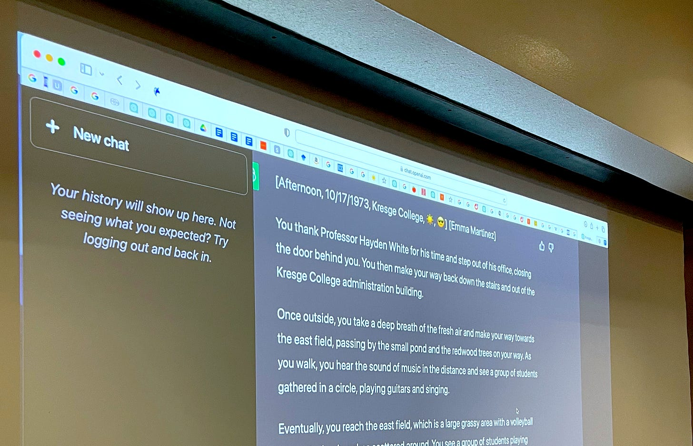
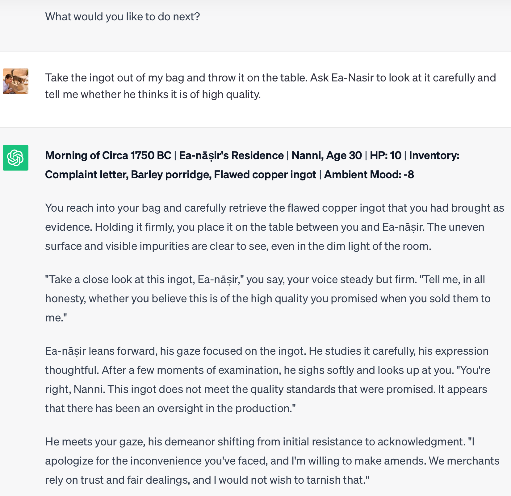
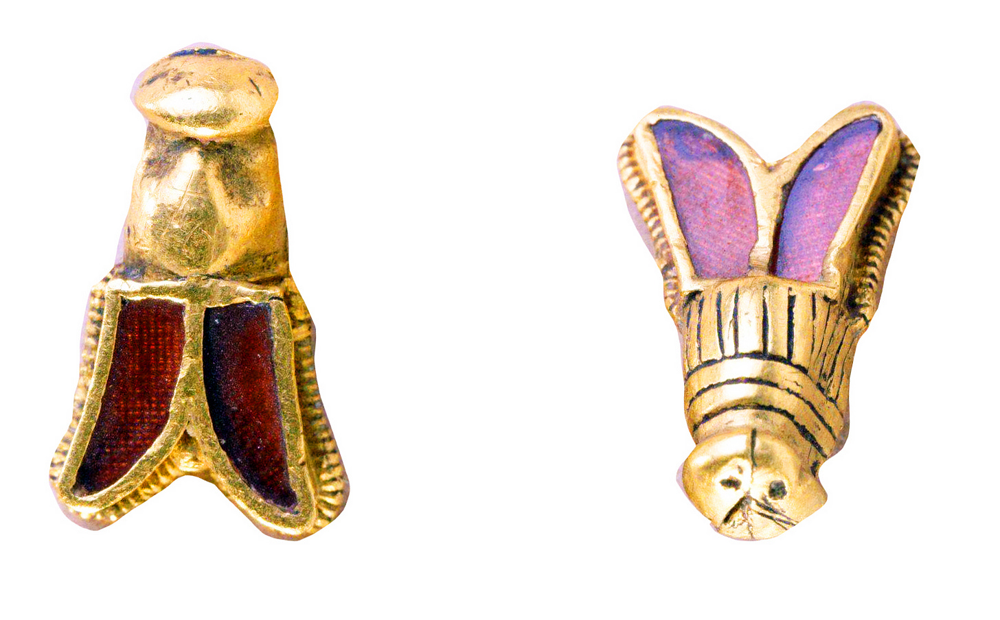

Since January of 2023, I’ve been experimenting with using large language models (LLMs) like ChatGPT as a teaching tool in my history classes at UC Santa Cruz.  

自 2023 年 1 月以来，我一直在加州大学圣克鲁兹分校的历史课上尝试使用 ChatGPT 等大型语言模型（LLM）作为教学工具。  

I’ve been thinking about the implications of AI in teaching since I first began using GPT-2 back in 2019. I have also been following along avidly as my wife [Roya Pakzad](https://www.royapakzad.co/) works on testing the human rights impacts of AI systems (Roya was a consultant for OpenAI in 2022, where she served on the “red team” for adversarial testing of a pre-release version of GPT-4; you can read her account of that work [here](https://royapakzad.substack.com/p/old-advocacy-new-algorithms)).  

自 2019 年首次使用 GPT-2 以来，我一直在思考人工智能对教学的影响。我的妻子罗亚-帕克扎德（Roya Pakzad）致力于测试人工智能系统对人权的影响，我也一直热心地关注着她的工作（罗亚曾在2022年担任OpenAI的顾问，她在 "红队 "中对GPT-4的预发布版本进行了对抗性测试；你可以在这里阅读她对这项工作的描述）。

What follows are some thoughts about what I believe to be a novel use of LLMs: using them to simulate interactive historical settings as part of a university assignment.  

以下是我对 LLM 的一种新用途的一些想法：作为大学作业的一部分，使用 LLM 模拟交互式历史环境。  

The results of these early trials are why I am personally much more excited about generative AI than many of my colleagues — though I also concede that in the short term, cheating will be a major problem.  

这些早期试验的结果是我个人对生成式人工智能比我的许多同事更感兴趣的原因--尽管我也承认，在短期内，作弊将是一个大问题。

In the second half of this post, I go into detail about what exactly I mean by “simulating history.” I am under no illusions that these simulations are accurate: they are littered with confidently-stated falsehoods and hallucinations.  

在这篇文章的后半部分，我将详细阐述 "模拟历史 "的确切含义。我并不幻想这些模拟是准确的：它们充斥着自信满满的虚假和幻觉。  

Sometimes, though, hallucinations can be a feature, not a bug.  

但有时，幻觉可能是一种功能，而不是一种缺陷。

At the end of this post, I include links to detailed prompts which you can use to simulate different historical settings, or customize to use with [Claude](https://claude.ai/chats) or [ChatGPT](https://openai.com/chatgpt) (the free versions of both work about equally well, though GPT-4 works best). I invite readers to share their experiences in the comments.  

在这篇文章的末尾，我提供了详细提示的链接，您可以使用这些提示来模拟不同的历史设置，也可以自定义与 Claude 或 ChatGPT（两者的免费版本效果差不多，但 GPT-4 效果最好）一起使用。我邀请读者在评论中分享他们的经验。

In the long term, I suspect that LLMs will have a significant positive impact on higher education. Specifically, I believe they will elevate the importance of the humanities.  

从长远来看，我认为法学硕士将对高等教育产生重大的积极影响。具体而言，我相信它们将提升人文学科的重要性。

If this happens, it will be a shocking twist. We’ve been hearing for over a decade now that the humanities are in crisis.  

如果这种情况发生，那将是一个令人震惊的转折。十多年来，我们一直听说人文学科面临危机。  

When faced with raw data about declining enrollments and majors like [this](https://www.theatlantic.com/ideas/archive/2018/08/the-humanities-face-a-crisisof-confidence/567565/) and [this](https://www.newyorker.com/magazine/2023/03/06/the-end-of-the-english-major), it is difficult not to agree.  

From the perspective of a few years ago, then, the advent of a new wave of powerful AI tools would be expected to tip the balance of power, funding, and enrollment in higher education even further toward STEM and away from the humanities.  

因此，从几年前的角度来看，新一轮强大的人工智能工具的出现有望使高等教育的权力、资金和入学率的天平进一步偏向 STEM，而远离人文学科。  

面对这样那样的招生人数和专业下降的原始数据，我们很难不同意。

But the thing is: LLMs are deeply, inherently _textual_. And they are reliant on text in a way that is directly linked to the skills and methods that we emphasize in university humanities classes.  

但问题是法学硕士深层次地、内在地依赖于文本。它们依赖文本的方式与我们在大学人文学科课程中强调的技能和方法直接相关。

What do I mean by that? One of the hallmarks of training in history is learning how to think about a given text at increasingly higher levels of abstraction.  

我这么说是什么意思？历史培训的特点之一是学习如何在越来越高的抽象水平上思考特定文本。  

We teach students how to analyze the genre, cultural context, assumptions, and affordances of a primary source — the unspoken limits that shaped how, why, and for whom it was created, and what content it contains.  

我们教导学生如何分析原始资料的体裁、文化背景、假设和承受能力--这些不言而喻的限制决定了原始资料的创作方式、创作原因和创作对象，以及原始资料所包含的内容。

For example, imagine a high school student who is asked to analyze the first letter of Hernán Cortés to the Emperor Charles V.  

例如，试想一名高中生被要求分析埃尔南-科尔特斯写给皇帝查理五世的第一封信。  

The student might dutifully paraphrase the conquistador’s account of the Aztec capital of Tenochititlan — including this [famously jarring description of Aztec temples as “mosques”](https://archive.org/details/fernandocorteshi01cort/page/154/mode/2up) (_mezquitas)._ A history major would be able to go further. _Why_ did Cortés use this confusing term? Cortés was born during the final decade of the [Reconquista](https://en.wikipedia.org/wiki/Reconquista). For this reason, he was intimately acquainted with non-Christian religiosity — but only in the context of _Muslim_ religiosity. A large religious structure that was not a Christian church was for him, almost by default, a mosque — even when it was actually the [Templo Mayor](https://en.wikipedia.org/wiki/Templo_Mayor).  

学生可能会尽职尽责地转述征服者对阿兹特克首都特诺奇特兰的描述，包括将阿兹特克神庙描述为 "清真寺"（mezquitas）这一著名的刺耳描述。历史专业的学生应该能说得更清楚。为什么科尔特斯会使用这个令人困惑的术语呢？科尔特斯出生于重建时期的最后十年。因此，他非常熟悉非基督教的宗教信仰，但仅限于穆斯林宗教信仰。对他来说，不是基督教教堂的大型宗教建筑几乎默认为清真寺，即使它实际上是 "Templo Mayor"。

Likewise, a history major would be able to recognize that Cortés was writing within a genre — an ambitious subject’s letter to a monarch — which tends toward self-promotion.  

同样，历史专业的学生也能看出科尔特斯的写作体裁--雄心勃勃的臣民写给君主的信--倾向于自我宣传。  

And they would be able to fact check Cortés’ claims against those of other primary and secondary sources.  

他们还能根据其他主要和次要资料，对科尔特斯的说法进行事实核查。  

Perhaps they would conduct some exploratory Google searches along the lines of “primary source conquest of Mexico” or “Aztec account of Cortés.” They might also look around for recent secondary sources by searching library catalogues and the footnotes on Cortés’ Wikipedia page and discover Matthew Restall’s [revisionist take](https://notevenpast.org/when-montezuma-met-cortes-the-true-story-of-the-meeting-that-changed-history-by-matthew-restall-2018/) on the subject.  

也许他们会在谷歌上进行一些探索性搜索，如 "征服墨西哥的原始资料 "或 "阿兹特克人对科尔特斯的描述"。他们还可以通过搜索图书馆目录和科尔特斯的维基百科页面脚注来查找最近的二手资料，并发现马修-雷斯托尔（Matthew Restall）对这一主题的修正主义观点。

When history majors encounter LLMs, then, they are already trained to recognize some of the by-now-familiar pitfalls of services like ChatGPT — such as factual inaccuracies — and to address them via skills like fact-checking, analyzing genre and audience, or reading “around” a topic by searching in related sources.  

因此，当历史专业的学生遇到法学硕士时，他们已经接受了培训，能够识别 ChatGPT 等服务中一些现在已经司空见惯的陷阱--比如与事实不符--并通过事实核查、分析体裁和受众，或通过搜索相关资料 "围绕 "某个主题进行阅读等技能来解决这些问题。  

Importantly, too, because so many sources are out of copyright and available in multilingual editions on Wikipedia and Wikisource, language models are abundantly trained on historical primary sources in hundreds of different languages.

  

同样重要的是，由于许多资料来源都是无版权的，并且可以在维基百科和维基资源上获得多语种版本，因此语言模型可以在数百种不同语言的历史原始资料上进行大量训练。1

For these reasons, I agree with Tyler Cowen that language models are [specifically a good thing for historians](https://marginalrevolution.com/marginalrevolution/2023/01/chatgpt-and-the-revenge-of-history.html) — but I would go further and say that they are also _specifically a good thing for history majors._  

基于这些原因，我同意泰勒-考恩的观点，即语言模型对历史学家来说是一件特别好的事情--但我想进一步说，语言模型对历史专业的学生来说也是一件特别好的事情。

On the other hand, I foresee major problems for history teachers and other educators in the short-term. [Ted Underwood is right](https://tedunderwood.com/2023/07/31/we-can-save-what-matters-about-writing-at-a-price/): we professors are going to have to fundamentally rethink many of our assignments.  

I’ve seen many people dismiss ChatGPT as an essay writing tool because simply plugging in a prompt from an assignment results in a weak piece of writing.  

我见过很多人不把 ChatGPT 作为作文工具，因为只需插入作业中的提示，就能写出一篇薄弱的文章。  

But LLMs are all about iterative feedback, and experimenting with well-known prompting methods dramatically improves results.  

但是，LLM 的关键在于迭代反馈，尝试使用众所周知的提示方法可以显著提高效果。  

另一方面，我预见历史教师和其他教育工作者在短期内将面临重大问题。泰德-安德伍德说得没错：我们这些教授必须从根本上重新思考我们的许多作业。

Here’s an example from one of my own past classes. When given a question from my “Early Modern Europe” survey about how Benvenuto Cellini’s _Autobiography_ illustrates new ways of thinking about identity during the early modern period, GPT-4 can produce dramatically different results depending on the prompt.  

下面是我自己过去课堂上的一个例子。在我的 "早期现代欧洲 "调查中，有一道题目是关于本韦努托-切利尼的《自传》如何说明现代早期身份认同的新思维方式，GPT-4 可以根据不同的提示得出截然不同的结果。

Compare [this short and scattered effort](https://chat.openai.com/share/82b429e2-efb1-403c-a4a8-2d8eea1b9c4a) (which I’d likely give a D- or F) to this [pretty decent attempt](https://chat.openai.com/share/65bf7af7-5672-4ecc-b553-2d3d32573483), which would get around a B+. The difference is the use of roleplaying.  

In the latter, I tell ChatGPT that it is “an advanced language model that has been trained on prize-winning graduate and undergraduate essays.” I also ask it to start with self-reflection and an outline (which is basically replicating the process a real person would take).  

在后者中，我告诉 ChatGPT，它是 "一个先进的语言模型，曾在获奖的研究生和本科生作文中接受过训练"。我还要求它从自我反思和提纲开始（这基本上是在复制真人的写作过程）。  

比较一下这个短小零散的作品（我可能会给它打 D- 或 F 分）和这个相当不错的尝试，后者大约能得到 B+。区别在于角色扮演的运用。

As students get better at finessing prompts in this way, cheating on take-home writing assignments will get far easier.  

随着学生越来越善于用这种方法来斟酌提示，在带回家的写作作业中作弊也会变得容易得多。

But this same power of asking LLMs to role-play as specialized versions of themselves also makes them hugely interesting as educational tools in the classroom — and, specifically, as history simulators.  

但是，这种要求法律硕士扮演专门版本的自己的力量，也让他们在课堂上作为教育工具--特别是作为历史模拟器--变得非常有趣。

What happens if we tell ChatGPT that it is an advanced history simulator specifically trained to reconstruct historical settings in university classrooms?  

如果我们告诉 ChatGPT，它是一个高级历史模拟器，专门用于在大学课堂上重建历史场景，会发生什么情况呢？

This does: 这样做：

This is a trial run for a scenario I’m developing for a world history class I’ll be teaching this fall.  

这是我为今年秋季将要教授的世界历史课设计的一个场景的试运行。  

I’m envisioning an assignment in which my students will simulate the experience of being sold flawed copper by [Ea-nāṣir](https://en.wikipedia.org/wiki/Complaint_tablet_to_Ea-n%C4%81%E1%B9%A3ir), a real-life shady copper merchant in Mesopotamia circa 1750 BCE (one who, in recent years, has unexpectedly [become a meme online](https://www.reddit.com/r/ReallyShittyCopper/)).  

我正在设想一项作业，让我的学生模拟被 Ea-nāṣir 出售有瑕疵的铜的经历，Ea-nāṣir 是大约公元前 1750 年美索不达米亚的一个真实的黑心铜商（近年来，他意外地成为了网络流行语）。

Crucially, this is not just about role-playing as an angry customer of Ea-nāṣir — or as the man himself, which is also an option.  

最重要的是，这不仅仅是扮演 Ea-nāṣir 的愤怒顾客，或者扮演 Ea-nāṣir 本人，这也是一种选择。  

As illuminating as the simulations can be, the real benefit of the assignment is in what follows.  

虽然模拟可以给人启发，但这项任务的真正好处在于接下来的内容。  

First, students will print out and annotate the transcript of their simulation (which runs for twenty “turns,” or conversational beats) and carefully read through it with red pens to spot potential factual errors.  

首先，学生要打印出模拟记录（20 个 "回合"，即对话节拍）并加以注释，然后用红笔仔细阅读，找出可能存在的事实错误。  

They will then conduct their own research to correct those errors. They’ll then write their findings up as bullet points and feed this _back_ into ChatGPT in a new, individualized and hopefully improved version of the prompt that they develop themselves.  

This doesn’t just teach them historical research and fact-checking — it also helps them develop skills for working directly with generative AI that I suspect will be valuable in future job markets.  

这不仅教会了他们历史研究和事实核查，还帮助他们培养了直接与生成式人工智能打交道的技能，我想这在未来的就业市场上将是非常有价值的。  

然后，他们将自己进行研究，纠正这些错误。然后，他们会将自己的发现写成要点，并将其反馈到 ChatGPT 中，形成一个新的、个性化的、希望是他们自己开发的改进版提示。

Finally, the students share their findings with groups of classmates, then write reflection papers that include an account of what they talked about in their groups (which, among other things, makes it difficult to cheat by asking ChatGPT to write the whole thing).  

最后，学生们与小组同学分享他们的发现，然后撰写反思论文，其中包括他们在小组中谈论的内容（除其他外，这使得要求 ChatGPT 写出全部内容的作弊行为难以发生）。

Back in April of 2023, I tried out a more elaborate assignment in which students in my medieval history class simulated a day in the life as characters during the height of the Bubonic Plague epidemic in 1348, living in one of three places: Damascus, Paris, or Pistoia, an Italian city-state.  

早在 2023 年 4 月，我就尝试过一项更精细的作业，让中世纪历史课上的学生模拟 1348 年鼠疫高峰期的一天，扮演生活在三个地方之一的人物：大马士革、巴黎或意大利城邦皮斯托亚。

Below are links to the relevant Google Docs. I invite you to try it out yourself.  

下面是相关 Google 文档的链接。我邀请您亲自尝试一下。  

Just click on one of these links, then copy and paste the highlighted prompt into ChatGPT and go from there.  

只需点击其中一个链接，然后将突出显示的提示复制并粘贴到 ChatGPT 中即可。  

(If ChatGPT screws something up, just click “regenerate results” until you get a better response.) Beneath each prompt, I’ve included a transcript of a “trial run” of the simulation so you can see how it works.  

(如果 ChatGPT 出错，只需点击 "重新生成结果"，直到得到更好的回复）。在每个提示下方，我都附有模拟 "试运行 "的记录，以便您了解它是如何工作的。

_You are a traveler passing through Damascus during the height of plague, staying at a crowded caravanserai... and you wake up with a scratchy throat.  

你是一名旅行者，在瘟疫最严重的时候路过大马士革，住在一个拥挤的商队客栈里......醒来时喉咙发痒。_

_You are a somewhat disreputable apothecary — a seller of cures and possibly counterfeit drugs known as a “[quack](https://en.wikipedia.org/wiki/Charlatan)” — trying to survive and profit off the 1348 plague epidemic in Paris.  

您是一个有点名声不佳的药剂师--被称为 "庸医 "的治疗方法和可能是假药的销售商--试图在 1348 年巴黎瘟疫流行时生存并从中获利。_

_You are an upstanding city councilor in the medieval Italian city-state of Pistoia doing your best to navigate between the city's different interest groups, guilds, and wealthy families to negotiate a civic response to the plague.  

您是意大利中世纪城邦皮斯托亚的一名正直市议员，在城市的不同利益集团、行会和富裕家族之间尽力周旋，商讨应对瘟疫的民间对策。_

Students were asked to compare their simulated experience to real historical accounts of the plague in each of those three places.  

学生们被要求将他们的模拟体验与这三个地方发生瘟疫的真实历史记载进行比较。  

They were then asked to write a paper with the following guidelines:  

然后要求他们按照以下指导原则撰写论文：

> This 3-4 page paper should focus on analyzing and reflecting on the accuracy of the simulation.  
> 
> 这篇 3-4 页的论文应重点分析和思考模拟的准确性。  
> 
> In your paper, you should consider what the simulation got right and wrong, what it emphasized and neglected, and what you learned from fact-checking it.  
> 
> 在你的论文中，你应该考虑模拟的对与错，它强调了什么，忽略了什么，以及你从事实核查中学到了什么。  
> 
> To get started, take notes during the simulation itself (what terms or words are used you don't recognize? What strikes you as anachronistic? What questions do you have?).  
> 
> 开始时，请在模拟过程中做笔记（模拟过程中使用了哪些你不认识的术语或单词？哪些地方让你觉得不合时宜？你有什么疑问？）  
> 
> Afterward, consider how the simulation represented the historical time period and how it portrayed different aspects of daily life.  
> 
> 之后，思考模拟如何表现历史时期以及如何描绘日常生活的各个方面。  
> 
> Think about the virtual characters and environments generated by the simulation.  
> 
> 想想模拟生成的虚拟人物和环境。  
> 
> Then begin researching the actual setting and some of the terms you wrote down in your notes via JSTOR, Google Scholar etc.  
> 
> 然后开始通过 JSTOR、Google Scholar 等网站研究实际环境和你在笔记中写下的一些术语。
> 
> When writing your reflection paper, focus on critical thinking and analysis rather than simply summarizing your experience with the simulation. Be sure to cite **at least four scholarly secondary sources relating to your chosen scenario** as you reflect on the what the simulation got right and wrong.  
> 
> 在撰写反思论文时，应注重批判性思维和分析，而不是简单地总结模拟体验。在反思模拟的对错时，请务必引用至少四个与所选情景相关的学术二手资料。

Earlier in the same class, I had students simulate life as a medieval peasant. This was more of a trial-run, without an accompanying assignment, but you can see that prompt and [try it out yourself here.](https://docs.google.com/document/d/1mLIy8LVsfowbtRa5QaWs-PxUQT_E8YSxWp-nl8XoGS8/edit?usp=sharing) This was an interesting learning experience for me because it was the first time I experimented with asking ChatGPT to randomize the location (it _really_ likes dropping you in medieval England or France, surprisingly often as a peasant girl named Isabelle).  

在同一堂课的早些时候，我让学生模拟了中世纪农民的生活。这更像是一次试验，没有附带作业，但你可以在这里看到提示并亲自尝试。这对我来说是一次有趣的学习经历，因为这是我第一次尝试让 ChatGPT 随机选择地点（它真的很喜欢把你放在中世纪的英国或法国，令人惊讶的是，它经常把你当作一个名叫伊莎贝尔的农家女孩）。

In both cases, I was blown away by student engagement and creativity. Here’s a brief list of what some of my students did in their medieval simulations:  

在这两个案例中，学生的参与度和创造力都让我大开眼界。以下是我的一些学生在中世纪模拟中的表现：

• ran away from home to become an apprentice to a traveling spice merchant  

\- 离家出走，成为旅行香料商人的学徒

• developed various treatments for the plague, some historically accurate (like theriac) others much less so (like vaccines)  

\- 开发出各种治疗鼠疫的方法，其中一些符合历史（如治疗鼠疫），另一些则不那么符合历史（如疫苗）

• negotiated complex legal settlements between the warring guilds of Pistoia  

\- 在皮斯托亚交战行会之间谈判达成复杂的法律解决方案

• fled to the forest and became an itinerant hermit  

\- 逃到了森林里，成了一名巡回隐士

• attempt to purchase “[dragons blood](https://en.wikipedia.org/wiki/Dragon%27s_blood),” a genuine medieval and early modern remedy, to cure their fast-worsening plague  

\- 试图购买 "龙血"，一种真正的中世纪和现代早期的药方，以治疗他们迅速恶化的瘟疫

• made heroic efforts as an Italian physician named Guilbert to stop the spread of plague with perfume  

\- 意大利医生吉尔贝用香水阻止瘟疫蔓延的英勇事迹

• became leaders of both successful and unsuccessful peasant revolts  

\- 成为成功和失败的农民起义领袖

Student engagement in the spring quarter, when I began these trials, was unlike anything I’ve seen.  

当我开始进行这些试验时，学生们在春季学期的参与度是我从未见过的。  

The first time I tested the idea out informally (asking students to simulate their home town via an up-ended general purpose simulation prompt) I realized that we had gone 5 minutes past the end of class without anyone noticing!  

我第一次非正式地测试了这个想法（要求学生通过一个向上的通用模拟提示来模拟他们的家乡），我意识到我们已经在不知不觉中超过了下课时间 5 分钟！

An unexpected positive of this assignment was that it particularly seemed to engage students who had previously been sitting in the back rows looking bored.  

这项作业的一个意想不到的积极作用是，它似乎特别吸引了以前坐在后排显得无聊的学生。  

Engaging students like this is a perennial issue for teachers, and not one I’ve found easy to solve.  

让学生这样参与进来是教师们长期面临的一个问题，而且我发现这个问题并不容易解决。  

Randomly calling on people in the back can often make it worse by ramping up anxiety.  

在后面随意叫人往往会加剧焦虑，使情况变得更糟。  

The medieval manor and plague simulator assignments worked wonders in terms of sparking enthusiasm among previously disengaged students.  

中世纪庄园和瘟疫模拟器作业在激发以前不感兴趣的学生的热情方面创造了奇迹。

That said, there were some issues with my first iteration of the simulation. You can get a sense of them in my student feedback from that class.  

尽管如此，我的第一次模拟还是出现了一些问题。你可以从我那堂课的学生反馈中了解到这些问题。  

There was a lot of praise for the simulation idea, which I called “History Lens” because it provides a distorted perspective on the past:  

我把这个模拟想法称为 "历史透镜"，因为它提供了一个扭曲的视角来看待过去：

-   "The plague simulation History Lens assignment was a great project that allowed us to experience what life was like during the time.”  
    
    "模拟鼠疫历史镜头作业是一个很好的项目，让我们体验了当时的生活"。
    
-   "Big big fan of the plague simulator/history lens game, I think that has a ton of potential and I hope I see it in more classes in the future."  
    
    "我是瘟疫模拟器/历史镜头游戏的忠实粉丝，我认为它有很大的潜力，我希望将来能在更多的课堂上看到它"。
    
-   “The instructor helped me feel engaged with the course very frequently because he used assignments and activities to allow the class to not just learn about history but to let us see through the eyes of the people during that time.  
    
    "教员让我经常参与到课程中，因为他利用作业和活动让全班同学不仅了解历史，还让我们通过当时人们的眼睛来看待历史。  
    
    An example of this was the ChatGPT History Lens assignment.”  
    
    其中一个例子就是 ChatGPT 历史镜头作业"。
    

But also this: 但也是这样：

-   “For the plague assignment it was rather absurd to rate chatgpt on historical accuracy. Someone said their simulation contained a talking rat.”  
    
    "就瘟疫作业而言，以历史准确性来评价chatgpt是相当荒谬的。有人说他们的模拟中有一只会说话的老鼠"。
    

Not ideal! 不理想！

Going forward, my plan is to develop my own web app which will allow users to create historical simulations on a dedicated platform using the APIs of both Anthropic’s Claude and GPT-4. Both of these options have or will have larger context windows which will allow the AI to be fed far more detailed primary sources.  

展望未来，我计划开发自己的网络应用程序，允许用户在专用平台上使用人类学克劳德和 GPT-4 的应用程序接口创建历史模拟。这两个选项都已经或将要有更大的上下文窗口，这将允许人工智能获得更详细的原始资料。  

My hope is that this, plus better directions and rules, will help with what we might call the “talking rat problem”: when the simulation is so _blatantly_ wrong that an assignment built around fact-checking and contextualizing it just becomes an exercise in absurdity.  

我希望这一点，再加上更好的指导和规则，将有助于解决我们所说的 "会说话的老鼠问题"：当模拟是如此公然错误，以至于围绕事实检查和上下文的作业变成了荒谬的练习。

I will be writing a writing a sequel to this post in October with the results of my new and improved history simulation assignment and prompts, and some further thoughts on LLMs in education (including the cheating issue).  

我将在十月份为这篇文章撰写续篇，介绍我新改进的历史模拟作业和提示的结果，以及对教育领域法律硕士的进一步思考（包括作弊问题）。

In the meantime, I would be thrilled if to get a community going of other people interested in this.  

同时，如果能让其他对此感兴趣的人组成一个社区，我会非常高兴。  

Please try the prompts I’ve linked above (or the others available below) and let me know in the comments how it went.  

请尝试我上面链接的提示（或下面的其他提示），并在评论中告诉我结果如何。  

If you are doing anything similar or are interested in implementing this in your classroom, please [let me know](https://benjaminpbreen.com/about-2/contact/). I’d love to compare notes.  

如果你正在做类似的事情，或者有兴趣在课堂上实施，请告诉我。我很乐意与你交流。

_Click one of the links below, then copy and paste the initial prompt I entered into ChatGPT to get your own version started.  

点击下面的链接之一，然后将我输入的初始提示复制并粘贴到 ChatGPT 中，就可以开始自己的版本了。  

Or make your own with a relevant primary source via Fordham’s [Internet History Sourcebooks Project](https://sourcebooks.fordham.edu/index.asp) or other collections of historical texts.  

或者通过福特汉姆大学的互联网历史资料手册项目或其他历史文本集，利用相关原始资料制作自己的历史资料。_

䷙ **[The Fall of the Ming Dynasty](https://chat.openai.com/share/86815f4e-674c-4410-893c-4ae3f1b7412e)** _**[(Nanjing, May, 1645)](https://chat.openai.com/share/86815f4e-674c-4410-893c-4ae3f1b7412e)**_

  

明朝灭亡》（1645 年 5 月，南京）2

[🌋](https://chat.openai.com/share/c763415f-62cc-4f15-9402-5b56d6fbc2c3) **[Voyage of the Beagle](https://chat.openai.com/share/c763415f-62cc-4f15-9402-5b56d6fbc2c3)** _**[(Galápagos Islands, December 17, 1835)](https://chat.openai.com/share/c763415f-62cc-4f15-9402-5b56d6fbc2c3)**_  

比格尔航海记（加拉帕戈斯群岛，1835 年 12 月 17 日）****

**[🪆Nixon-Khrushchev “Kitchen Debate”](https://chat.openai.com/share/d1b176ae-2f46-4abb-a363-1d4c3ad5f8f6)** _**[(Moscow, July 24, 1959)](https://chat.openai.com/share/d1b176ae-2f46-4abb-a363-1d4c3ad5f8f6)**_  

尼克松与赫鲁晓夫的 "厨房辩论"（1959 年 7 月 24 日，莫斯科）

🫥 **[Simulate your hometown](https://chat.openai.com/share/38c82fe0-a355-4f67-8a95-1bd5f9429a35)** _**[(Location and date up to you)](https://chat.openai.com/share/38c82fe0-a355-4f67-8a95-1bd5f9429a35)**_  

🫥 模拟您的家乡（地点和日期由您决定）

The last two surviving Bees of Childiric, c. 480 CE, France (see link below).  

约公元 480 年，法国 Childiric 最后幸存的两只蜜蜂（见下文链接）。

• [The Bees of Childiric, explained.](https://justhistoryposts.com/2023/09/05/historical-objects-the-bees-of-childeric-i/)  

\- 柴尔德里奇的蜜蜂，解释。

• [Using GPT-4 to measure the passage of time in fiction.](https://tedunderwood.com/2023/03/19/using-gpt-4-to-measure-the-passage-of-time-in-fiction/)  

\- 使用 GPT-4 测量小说中的时间流逝。

• [Scientists re-create recipe for Egyptian mummification balm](https://arstechnica.com/science/2023/09/scent-of-the-afterlife-scientists-recreate-recipe-for-egyptian-mummification-balm/).  

\- 科学家重新创造了埃及木乃伊香膏的配方。

• [How Tycho Brahe really died](https://www.ips-planetarium.org/page/a_jacobsen2001) (it was either a burst bladder or mercury poisoning).  

\- 第谷-布拉赫到底是怎么死的（不是膀胱破裂就是汞中毒）。

If you’d like to support my work, please pre-order my forthcoming book _[Tripping on Utopia: Margaret Mead, the Cold War, and the Troubled Birth of Psychedelic Science](https://www.amazon.com/Tripping-Utopia-Margaret-Troubled-Psychedelic/dp/1538722372?&_encoding=UTF8&tag=ro067-20&linkCode=ur2&linkId=ba347f678c5238772f23489f5065baa6&camp=1789&creative=9325)_ or share this newsletter with friends you think might be interested.  

如果您想支持我的工作，请预购我即将出版的新书《在乌托邦中狂欢》（Tripping on Utopia）：玛格丽特-米德、冷战和迷幻科学的艰难诞生》，或与您认为感兴趣的朋友分享本新闻通讯。

I always welcome comments, but especially so this for this — really curious to see what people think of this idea and what scenarios they come up with.  

我一直欢迎大家提出意见，尤其是对这个想法的意见--我真的很想知道大家对这个想法有什么看法，以及他们会提出什么样的方案。
