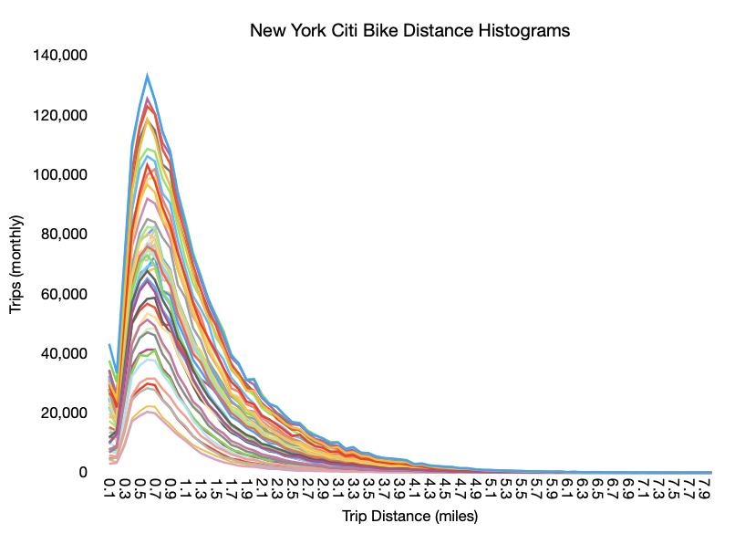
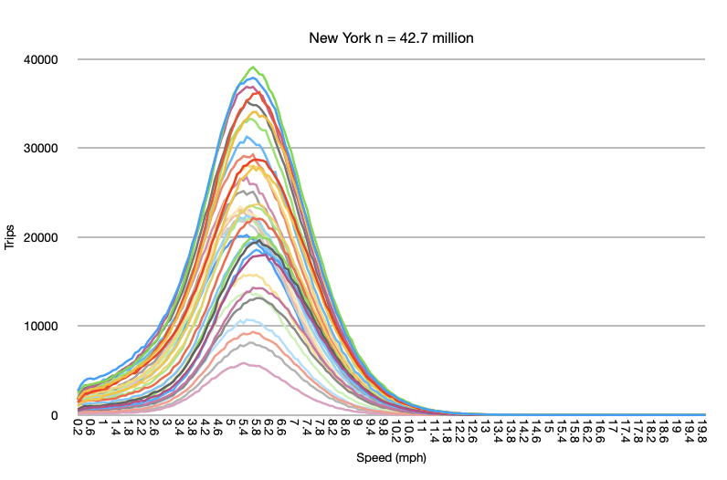
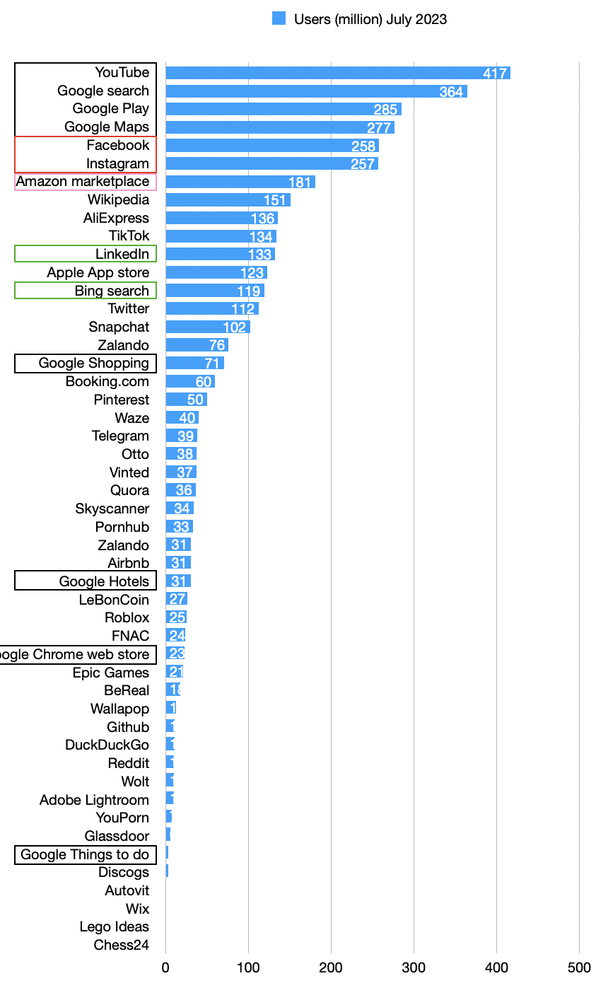
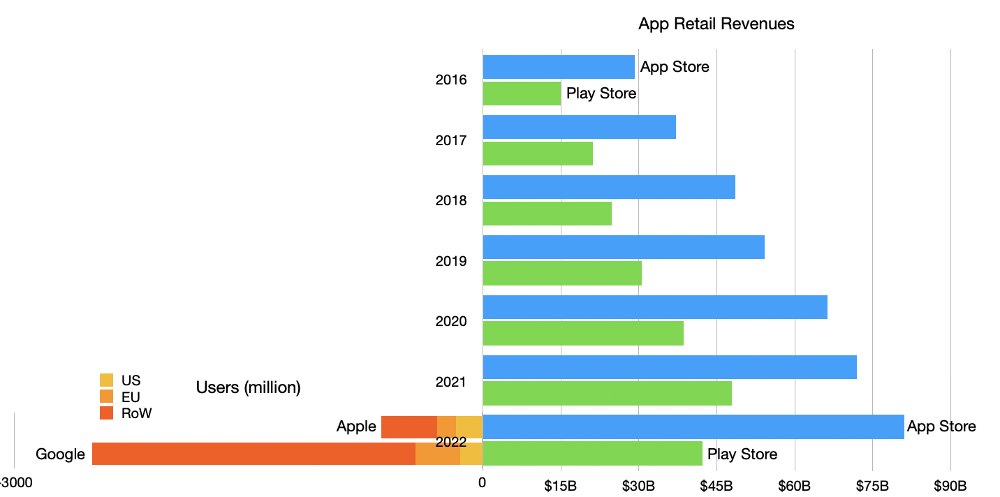
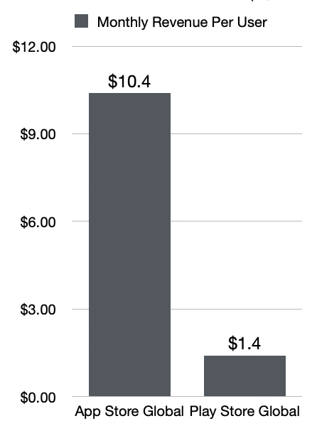

As I remember it, at least 10 years ago, I began to hear anecdotes from developers who built apps for both iOS and Android about their economics.  

在我的记忆中，至少在 10 年前，我开始听到为 iOS 和 Android 开发应用程序的开发人员谈论他们的经济效益。  

The story is that they tended to have twice as many users using Android but that iPhone App Store revenues were roughly twice those of Google Play Store.  

报道称，他们使用安卓系统的用户数量往往是谷歌的两倍，但 iPhone 应用商店的收入却大约是谷歌 Play 商店的两倍。  

From that I devised a rule of thumb that an iPhone user was about 4 times more valuable than an Android user. Half the users, paying 4 times as much means double the income.  

由此，我总结出一条经验法则：iPhone 用户的价值大约是安卓用户的 4 倍。一半的用户，4倍的价格，意味着双倍的收入。

Over the years I came across a lot more data about market development (the diffusion of innovations) and market creation (the innovation process) and applied it to transportation.  

多年来，我接触到了更多关于市场开发（创新扩散）和市场创造（创新过程）的数据，并将其应用于交通领域。  

Along the way I also became more aware that figures of consumption and spending are not normally distributed.  

一路走来，我也越来越意识到，消费和支出的数字并不是正态分布的。  

That it turns out that the governing function of much of human behavior is log-normal. That is, it is skewed rather than balanced or symmetric around an average.  

事实证明，人类大部分行为的支配函数是对数正态分布。也就是说，它是倾斜的，而不是围绕平均值的平衡或对称。  

Classic examples are income distribution and the distribution of travel distances.  

典型的例子是收入分配和旅行距离的分配。

Consider the following diagrams: Trip Distances vs. Trip Speeds for New York Citi Bike travelers (n=42.7 million.)  

请看下图：纽约 Citi Bike 乘客的出行距离与出行速度对比（n=4270 万。）

The different lines represent different time periods spanning the months of the year.  

不同的线条代表一年中不同月份的不同时段。

The top graph shows that most trips are short, and the average distance is not the most common distance. The bottom graph shows that the average speed is the most common speed.  

上图显示，大多数行程较短，平均距离不是最常见的距离。下图显示，平均速度是最常见的速度。  

The top graph is very accurately modeled with the log-normal function. The bottom graph is the classic bell curve of the normal or Gaussian function.  

上图是非常精确的对数正态函数模型。下图是典型的正态或高斯函数钟形曲线。

Income is log-normally distributed and so it has to be with services revenues. There must be a definite skew where there is a disproportionate spend by those who have more income.  

收入是对数正态分布的，服务收入也是如此。收入越高的人花的钱越多，这肯定是有一定偏差的。  

Thus segmenting or, to put it less kindly, discriminating customers properly is super important. Customer quality is just as important, perhaps more so, than quantity.  

因此，对客户进行细分，或者不那么客气地说，对客户进行适当的鉴别就显得格外重要。客户质量与客户数量同样重要，甚至更为重要。

So let’s revisit the question of user quality for online services.  

因此，让我们重新审视一下在线服务的用户质量问题。

Unlike 10 years ago, there is a lot more data. The EU, for instance requires a report of the number of users on each platform.  

与 10 年前不同的是，现在有了更多的数据。例如，欧盟要求报告每个平台的用户数量。

The figures I want to focus on are those of Apple App Store and Google Play Store: 123 million and 284.6 million respectively.  

我想重点介绍的是苹果应用商店和谷歌应用商店的数据：分别为 1.23 亿和 2.846 亿。  

These are strikingly similar to the ratio of 2x between iOS and Android from my old anecdotes.  

这与我以前的轶事中 iOS 和 Android 之间的 2x 比例惊人地相似。  

However, if we look at global data, Apple claims 650 million active App Store users while Google claims 2.5 billion active users. That makes the global ratio closer to 4x Android.  

但是，如果我们看一下全球数据，苹果公司声称有 6.5 亿活跃的 App Store 用户，而谷歌则声称有 25 亿活跃用户。这使得全球比例接近于安卓的 4 倍。  

However, if we look at the US, the ratio is 167 million iPhone users vs. 144 million Android. In the US, iOS is a majority.  

但是，如果我们看一下美国的情况，iPhone 用户为 1.67 亿，Android 用户为 1.44 亿。在美国，iOS 用户占大多数。

This is explained by income. The wealthier the user base the more iOS seems to be in use.  

这可以用收入来解释。用户群越富裕，使用 iOS 系统的人数似乎越多。

Now let’s look at revenues for the platform stores.  

现在我们来看看平台商店的收入情况。

On the right side is the history of retail revenues by year from 2016 to 2022 and split between Apple App Store and Google Play Store.  

右侧是 2016 年至 2022 年按年份分列的零售收入历史，以及苹果应用商店和 Google Play 商店的分成情况。  

Mirrored on the left is the number of users, also split by store but also by region, but only for 2022. \[App Store revenues are my own analysis (with validation against other sources) and include billings not just Apple’s own cut.  

左侧为用户数量，同样按商店和地区分列，但仅限于 2022 年。\[App Store 的收入是我自己的分析结果（与其他来源的数据进行了验证），其中包括账单，而不仅仅是苹果自己的分成。  

Play Store revenues are from [Business of Apps](https://www.businessofapps.com/data/google-play-statistics/).\]  

Play Store 的收入来自应用程序业务\]。

The ratio between revenues has kept remarkably steady, with 2016 revenues at a Apple:Google ratio of 29:15 (1.93) and 2022 at a ratio of 81:42 (1.93).  

收入之间的比例保持明显稳定，2016 年苹果与谷歌的收入比例为 29:15（1.93），2022 年为 81:42（1.93）。

The global user numbers are, as mentioned, 3.8 to 1.  

如前所述，全球用户数量为 3.8 比 1。

\[Aside: One sanity check on the data is that the 650 million App Store users is about half of my estimate of iPhones in use (1.2 billion). That might be alarming.  

\[题外话：对这些数据的一个理智判断是，6.5 亿 App Store 用户大约是我估计的 iPhone 用户数量（12 亿）的一半。这可能令人震惊。  

Why are only 54% of iPhones in use paired with App Store use?  

为什么只有 54% 的 iPhone 在使用中与 App Store 配对？  

However, if we take the sum of both App Store and Play store users (3.15 billion) and compare it with the total number of global smartphone users (6.92 billion), we discover that 45.5% of all smartphone users use some store.  

然而，如果我们把 App Store 和 Play 商店用户的总和（31.5 亿）与全球智能手机用户总数（69.2 亿）进行比较，我们就会发现，45.5% 的智能手机用户会使用某些商店。  

Adding Chinese Android stores we can see that the ratio of 54% for iOS is somewhat consistent.\]  

加上中国的安卓商店，我们可以看到 iOS 54% 的比例是一致的\]。

Thus we can compare the app revenue per user of the two platforms by dividing global revenue number by the global user numbers. The results are shown below:  

因此，我们可以用全球收入除以全球用户数量，来比较两个平台每个用户的应用收入。结果如下：

I scaled the spending to a per-month basis.  

我将支出按月缩减。

So the picture becomes clearer. The iPhone customer is _7.4 times_ more valuable than the Android customer. This is more impressive than the 4x rule I had 10 years ago.  

因此，情况变得更加清晰。iPhone 客户的价值是安卓客户的 7.4 倍。这比我 10 年前的 4 倍规则更令人印象深刻。  

The reasons are mainly that my anecdotes were from developers who sold products in the US or EU whereas expansion of smartphones to 7 billion global users has drawn in more lower spending customers.  

原因主要在于，我的轶事都是来自在美国或欧盟销售产品的开发商，而智能手机在全球 70 亿用户中的扩展则吸引了更多消费水平较低的客户。

But Apple’s base has also grown to over 1 billion users (650 million store users). This highlights that Apple has effectively grown _and_ discriminated customers effectively. It obtained not just 1 billion customers but _the best_ 1 billion customers.  

但苹果公司的用户数量也已超过 10 亿（6.5 亿商店用户）。这凸显了苹果公司的有效增长和对客户的有效区分。它获得的不仅仅是 10 亿用户，而是最好的 10 亿用户。

How to discriminate effectively is the holy grail of marketing. The naïve approach is to keep prices high.  

如何有效地区别对待是营销的圣杯。天真的做法是保持高价。  

But that usually only results in a “luxury” branding and a small base that tends not to grow.  

但这样做的结果通常是品牌 "奢侈"，基数小，往往无法发展壮大。  

The alternative “premium” approach is to offer functionality and multiple tiers and distribution options and financing and merchandising. There is no simple formula.  

另一种 "优质 "方法是提供功能性、多层次、分销选择、融资和商品销售。没有简单的公式。

The bottom line is that Apple’s approach is attracting 650 million $10/month app spenders.  

最重要的是，苹果的做法吸引了 6.5 亿每月 10 美元的应用消费者。  

When we factor in additional subscription services, we get to the juggernaut that is Apple Services.  

如果再算上额外的订阅服务，苹果服务就成了一个巨无霸。  

This analysis has shown how difficult it is for anyone to come close to this quality of revenue.  

这一分析表明，任何人都很难接近这一收入质量。

As we look forward to Spatial Computing, the idea of increasing that spend from $10/month for a small glass rectangle in your palm to perhaps $100/month for an immersive 360-degree 3D experience does not sound too crazy.  

在我们展望空间计算时，将每月花费 10 美元购买手掌中的小玻璃矩形，提高到每月花费 100 美元购买身临其境的 360 度 3D 体验，这听起来并不太疯狂。

But only if you can find those customers. I suspect Apple already knows who they are.  

但前提是你能找到这些客户。我怀疑苹果公司已经知道他们是谁。

If you want to learn more and hear an in-depth discussion on this topic make sure you subscribe to the Asymetric Podcast on [Supercast](https://asymetric.supercast.com/v1?) and [Apple Podcasts](https://www.google.com/url?sa=t&rct=j&q=&esrc=s&source=web&cd=&ved=2ahUKEwiah7_Bn5OBAxUXIRAIHUehAEUQFnoECBAQAQ&url=https%3A%2F%2Fpodcasts.apple.com%2Fis%2Fpodcast%2Fasymetric%2Fid1565557473&usg=AOvVaw29AVE25kbZGEpapujetVPD&opi=89978449).  

如果您想了解更多信息并听取有关此主题的深入讨论，请务必在 Supercast 和 Apple Podcasts 上订阅 Asymetric 播客。
