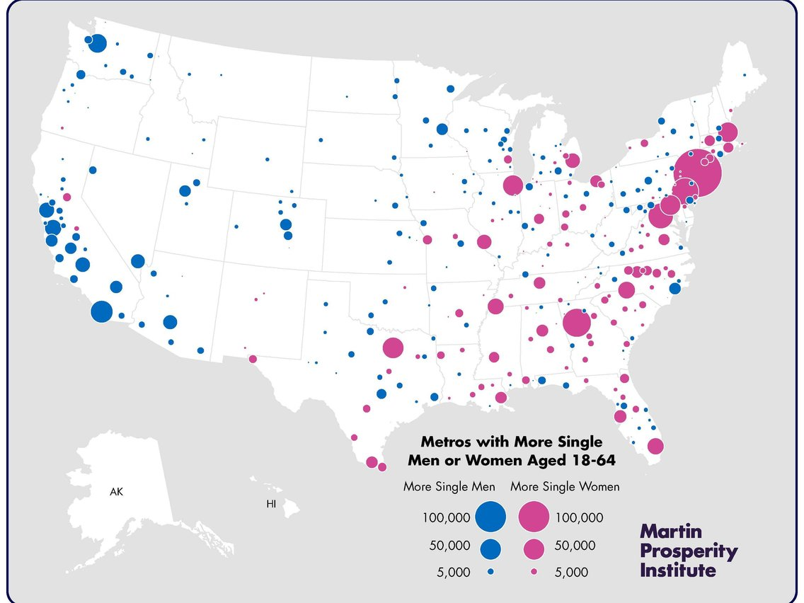
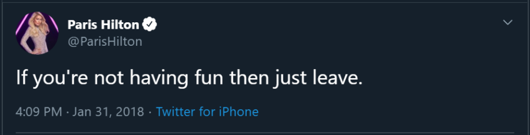

A couple of weeks ago [Venkatesh](https://www.ribbonfarm.com/about/) challenged his followers to brainstorm at least 100 tweets on a topic via live responses.  

几周前，文卡特什向他的追随者发起挑战，要求他们通过现场回复的方式，就一个话题集思广益，至少写出 100 条推文。  

Since I’m not an expert on anything in particular, I decided to simply see if I can come up with 100 discrete pieces of life advice in a day.  

因为我不是什么专家，所以我决定看看自己能否在一天之内提出 100 条不同的人生建议。

This off-the-cuff game turned into perhaps the most successful creative project I’ve ever done.  

这个突发奇想的游戏也许成了我做过的最成功的创意项目。  

The thread was viewed by tens of thousands of people, received thousands of likes, and gained me hundreds of Twitter followers.  

该主题被数万人浏览，获得了数千个赞，并为我赢得了数百名 Twitter 追随者。  

I didn’t know there was such thirst for random life-advice, nor that I would be the one to tap the kegs.  

我不知道人们会如此渴求随意的人生建议，也不知道我会是那个敲打酒桶的人。  

And now my blog readers get the expanded, edited, organized, and illustrated collection.  

现在，我的博客读者可以得到这本经过扩充、编辑、整理和图文并茂的作品集了。

[The good life](https://putanumonit.com/category/life/) is a frequent subject on Putanumonit.  

美好生活是普塔努莫尼特经常谈论的话题。  

I aimed for this thread to be an inspiration to myself as well, writing down many things that I think I should do but haven’t gotten around to yet.  

我希望这个主题也能激励自己，写下许多我认为应该做但还没来得及做的事情。  

I tried to steer a middle course between over-generalized [Navalisms](https://medium.com/@noahmadden/navalism-quotes-perceptions-by-naval-ravikant-a5fd60ac5788) and too-specific tips on the particular brand of chapstick that will change your life. May these inspire you to live your best life or to mock me in funny ways in the comments.   

我试图在过于笼统的纳瓦拉主义和过于具体的关于改变你生活的特殊品牌润唇膏的提示之间找到一条中间路线。但愿这些能激励你过上最好的生活，或者在评论中用有趣的方式嘲笑我。

## Meta  

梅塔

#### 1

Any life advice that isn’t given to you personally is not designed to be followed to the letter.  

任何人生建议，如果不是亲自给你的，都不是为了让你不折不扣地遵循。  

Try to resonate with the philosophy that generates it instead.  

试着与产生它的哲学产生共鸣。  

Remember that directional advice (e.g., “be more …”) [may need to be reversed](https://slatestarcodex.com/2014/03/24/should-you-reverse-any-advice-you-hear/) before consumption.  

请记住，定向建议（如 "要更......"）可能需要在使用前进行反转。

#### 2

Collect feedback from everybody.  

收集每个人的反馈意见。  

Play games with close friends where you have to give each other constructive criticism and ways to improve.  

与好友一起玩游戏，互相提出建设性的批评意见和改进方法。  

Collect anonymous feedback from internet strangers on [Admonymous](https://admonymous.co/yashkaf).   

在 Admonymous 上收集互联网陌生人的匿名反馈。

#### 3

Stop lurking; write that comment.  

停止潜伏，写下评论。  

You know the saying about letting people suspect you’re dumb rather than opening your mouth and removing all doubt?  

你知道有句话叫 "让别人怀疑你是哑巴，而不是张开嘴巴消除一切怀疑 "吗？  

Fuck that. We know you’re dumb. You get less dumb by saying things and getting feedback.  

去他妈的我们知道你很笨说出来并得到反馈，你就不会那么蠢了。

#### 4

Learn some improv, at least to get the basic gist of it. Take a class or [read Impro](https://www.goodreads.com/book/show/306940.Impro).  

学习一些即兴表演，至少要掌握基本要领。上一堂课或者读一读即兴表演。  

Improv mindset is a great way to approach many social situations including most interactions on the internet.  

即兴心态是处理许多社交场合（包括互联网上的大多数互动）的好方法。  

A good comment/reply often starts with “yes, and”.  

好的评论/回复往往以 "是的，而且 "开头。

#### 5

Don’t nitpick, that’s the opposite of good improv.  

不要吹毛求疵，这是好的即兴表演的反面。  

You think that the categories in this post are arbitrary?  

你认为本帖中的分类是任意的吗？  

A piece of advice doesn’t apply to your special situation?  

某条建议不适用于您的特殊情况？  

You’re probably right, but writing this in a comment will just make readers annoyed and make you frustrated when nobody responds.  

你可能是对的，但写在评论里只会让读者恼火，当没人回复时你也会很沮丧。

## Mind  

思想

#### 6

[There](https://open.spotify.com/show/3qv8BS1HzrgKpDnXSlYWWL) [are](https://www.econtalk.org/) [more](https://www.dancarlin.com/hardcore-history-series/) [great](https://www.theguardian.com/football/series/footballweekly) [podcasts](https://conversationswithtyler.com/) [than](http://rationallyspeakingpodcast.org/) [you’ll](https://samharris.org/) [ever](https://www.patreon.com/colinslaststand/posts?tag=Sacred%20Symbols) [have](https://fs.blog/the-knowledge-project/) [the](https://anchor.fm/intellectualexplorersclub) [time](https://www.aqr.com/Insights/Podcasts) to listen to. If it sucks after 10 minutes, skip half an hour ahead. Still boring?  

优秀的播客多得你根本没有时间去听。如果听了 10 分钟就觉得无聊，那就跳过半小时再听。还是很无聊？  

Delete and move on. Obviously, do the same for books.  

删除，然后继续。显然，对书籍也是如此。

#### 7

Free will. The anthropic principle. Solipsism. The simulation hypothesis. Moral realism.  

自由意志。人择原理唯我论模拟假说道德现实主义  

They’re fun to argue about through the night but don’t judge anyone too much based on the positions they take and don’t treat any of them too seriously as guides to actually living your life.  

彻夜争论这些问题很有趣，但不要过多地根据他们所持的立场来评判任何人，也不要太认真地把它们当作实际生活的指南。  

It should all add up to normalcy in the end.   

这一切最终都会恢复正常。

#### 8

Find a medium of expression and express yourself publicly [every day for three months](https://twitter.com/visakanv/status/1204622097428803584). If you’re good with words, write 100 Tweets. An artist — post 100 sketches on Instagram.  

找到一种表达媒介，在三个月内每天公开表达自己。如果你擅长文字，那就写 100 条微博。艺术家--在 Instagram 上发布 100 幅素描。  

Music/dance person — 100 TikToks.  

音乐/舞蹈人员 - 100 TikToks。

#### 9

Tell a bad joke or a pun as soon as you think of it, even if it’s just to your exasperated spouse or coworker.  

一想到坏笑话或双关语，就马上讲出来，哪怕只是讲给你气急败坏的配偶或同事听。  

It takes 20 bad jokes to think of a single good one, and you only start making good jokes once you remove the unconscious [filter stifling your generative brain](https://www.lesswrong.com/posts/i42Dfoh4HtsCAfXxL/babble).   

要想出一个好笑话，需要 20 个糟糕的笑话，而只有当你去掉了扼杀你大脑创造力的无意识过滤器后，你才会开始创造出好笑话。

#### 10

If you can’t give it up completely, try to constrain the bandwidth of how much you hear about politics.  

如果你不能完全放弃，那就尽量限制你听到政治信息的范围。  

Don’t start your day with the front page of the Times.  

不要从《泰晤士报》的头版开始你的一天。  

Unfollow anyone whose posts are more than 20% about politics or the outrage du jour.  

取消关注任何超过 20% 的帖子涉及政治或当日愤怒事件的人。  

And don’t jump into online arguments, it’s vice masquerading as virtue.  

不要在网上争论，那是伪装成美德的恶习。

#### 11

Binge a show/video game for a couple of weeks, then take a break from TV for a couple of weeks.  

狂看几周节目/玩几周游戏，然后休息几周不再看电视。  

Trying to limit yourself to an hour a day is less fun and more addictive.  

试图把自己限制在每天一小时的时间里，会减少乐趣，更容易上瘾。

#### 12

Should you watch that movie / play that game / read that book? Use the ratio:  

你应该看那部电影/玩那款游戏/读那本书吗？使用比例：

(\[# who rated it 5/5\] + \[# who rated it 1/5\]) / \[# who rated it 3/5\].  

( \[# 打 5/5 分的人\] + \[# 打 1/5 分的人\]) / \[# 打 3/5 分的人\]。

This doesn’t [apply to everything](https://putanumonit.com/2016/02/03/015-dating_1/), but it applies to many things, including media.  

这并不适用于所有事情，但适用于许多事情，包括媒体。  

There are too many options out there to waste time on mediocrity, and everything great will be divisive.  

现在有太多的选择，我们不能把时间浪费在平庸上，一切伟大的东西都会产生分歧。

#### 13

Unless one of them is your friend or boss, you should spend 100x less time thinking and talking about billionaires than you currently do.   

除非他们中有人是你的朋友或老板，否则你应该比现在少花 100 倍的时间去思考和谈论亿万富翁。

#### 14

Facebook is for event invites only, not for scrolling.  

Facebook 只能用于活动邀请，不能用于滚动。  

The people you met offline are not going to be the people posting the best stuff online, so the timeline content is worse than what you’d get on Twitter/Reddit/blogs.  

你在线下认识的人不会是在网上发布最好内容的人，因此时间轴上的内容比你在 Twitter/Reddit/blog 上看到的内容要差。  

And the algorithm is designed to fuck with your brain.   

而算法的设计就是为了扰乱你的大脑。

#### 15

Don’t keep watching a bad TV show just because your friends are talking about it, it’s a terrible time trade-off.  

不要因为朋友们都在谈论一部糟糕的电视剧，就一直看下去，这是很糟糕的时间交易。  

You can read a recap or even better — bring up richer topics of conversations.  And don’t pay money for [bad](https://www.rottentomatoes.com/m/captain_marvel) [movies](https://www.rottentomatoes.com/m/star_wars_the_rise_of_skywalker) just because “everyone is watching them”.  

您可以阅读影评，或者更好的是，引出更丰富的话题。不要因为 "大家都在看 "就花钱去看烂片。  

Doing so is defecting against your friends since they’ll now have to watch it to not feel left out.  

这样做就是背叛你的朋友，因为他们现在不得不看，才不会觉得被冷落。

#### 16

Habits are reinforced by your habitual environment.  

习惯环境会强化你的习惯。  

That’s a big part of why retreats work: they take you away from your usual surroundings and people.  

这也是为什么疗养能起作用的一个重要原因：疗养能让你远离周围的环境和人。  

If you want to start meditating, doing pushups, intermittent fasting, etc, try starting on a vacation where the new circumstances make it easier to integrate new habits.   

如果你想开始冥想、做伏地挺身、间歇性禁食等，可以尝试从假期开始，在新的环境中更容易融入新的习惯。

#### 17

Are you really going to give up on expressing yourself, learning from mistakes, attracting like-minded people, building a reputation, and changing the world because someone may someday try to cancel you?  

你真的会因为有一天有人试图取消你而放弃表达自己、从错误中学习、吸引志同道合的人、建立声誉和改变世界吗？  

They can smell the fear, you know.   

他们能嗅到恐惧，你知道吗？

#### 18

You just read 1000 words.  

你刚读了 1000 字。  

Close your eyes and count to 10 to break the dopamine loop and make sure that reading a listicle is really the thing you want to be doing most right now.  

闭上眼睛，数到 10，打破多巴胺循环，确保阅读列表文章真的是你现在最想做的事情。  

If not, this post will still be here when you get back.  

如果没有，当你回来时，这个帖子还会在这里。

## Body  

身体

#### 19

Humans are made to walk.  

人类是为行走而生的。  

Set up your life to encourage walking by acquiring soft-soled shoes, good audiobooks, and/or a dog.  If you’re not enjoying walking and not getting your 10,000 steps you can get there with good design choices.   

通过购买软底鞋、有声读物和/或养狗，让你的生活鼓励步行。如果您不喜欢走路，没有达到一万步的目标，您可以通过合理的设计来实现。

#### 20

Wrestle while [naked and covered in coconut oil](https://touchandplay.org/liquid-love/).   

赤身裸体、满身椰子油地摔跤。

#### 21

[Buy a $20 bar of soap](https://putanumonit.com/2016/05/11/shopping-for-happiness/) on Amazon just to see how it feels. If it doesn’t do much for you, go back to $4 bars.  

在亚马逊上买一块 20 美元的肥皂，看看感觉如何。如果没什么效果，就换回 4 美元的香皂。  

Liquid soap has a low ceiling, so don’t bother.   

液体肥皂的上限很低，所以不用管它。

#### 22

Shower in the evening instead of the morning.  

晚上而不是早上洗澡。  

You’ll sleep much better when you’re clean, your muscles are relaxed, and your body cools after a warm shower.  

洗完澡后，身体干净了，肌肉放松了，身体也凉爽了，你会睡得更香。  

And if you don’t sweat at night (keep the bedroom cool) you’ll be clean in the morning.   

如果晚上不出汗（保持卧室凉爽），早上就会干干净净。

#### 23

Doctors are fallible humans, they have biases and make mistakes.  

医生是容易犯错的人，他们会有偏见，会犯错误。  

It’s your job to be educated about your diagnoses and the drugs you are prescribed.  

您有责任了解自己的诊断和处方药。  

If you’re confused, ask for details or a second opinion.   

如果您感到困惑，请询问详情或听取其他意见。

#### 24

In ⚽/🎾/🏓/🏐 , keep your eye on the center of the ball through the hit.  

在⚽/🎾/🏓/🏐中，在击球过程中要始终盯住球的中心。  

The goal/court/table doesn’t move, only the ball does.  

球门/球场/球台不会移动，只有球会移动。

#### 25

Keep fresh fruit around.  

随身携带新鲜水果  

Even if you end up throwing a couple apples out once in a while, it’s hugely valuable to have a tasty fruit closer at hand than junk food.  

即使你偶尔会扔掉几个苹果，但比起垃圾食品，手边有一个美味的水果是非常有价值的。

#### 26

In case you missed it, humanity has fully optimized apples.  

如果你错过了，人类已经对苹果进行了全面优化。  

Snapdragon, Zestar and Cosmic Crisp if you can find them, Honeycrisp or SweeTango as backup, Fuji in a pinch.  

如果能找到 Snapdragon、Zestar 和 Cosmic Crisp，Honeycrisp 或 SweeTango 可作为后备，富士可在紧要关头使用。  

All other cultivars are a distraction.   

所有其他栽培品种都会让人分心。

#### 27

Get massages, give massages. You don’t have to know what you’re doing to make someone feel great.  

做按摩，给人按摩。你不必知道自己在做什么，也能让别人感觉很好。  

Use scentless oil, or simple moisturizer if the recipient is not going to shower afterward.   

如果接受者事后不洗澡，可使用无香精油或简单的润肤霜。

#### 28

The #1 measure of an exercise program should be “is this fun enough to keep me coming back to the gym?” I don’t care how “efficient” HIIT is, it’s for masochists.   

衡量一项锻炼计划的首要标准应该是 "这是否足够有趣，能让我继续回到健身房？我不在乎 HIIT 有多 "高效"，那是给受虐狂准备的。

#### 29

If you’re not waking up at sunrise on purpose, your bedroom should be dim when you wake.  

如果你不是故意在日出时醒来，那么当你醒来时，你的卧室应该是昏暗的。  

Put up blackout curtains and get rid of all electronic lights.  

拉上遮光窗帘，关掉所有电子设备。

#### 30

Do you know what a sex toy in your butt feels like? You should at least find out.   

你知道性玩具插进屁眼是什么感觉吗？你至少应该了解一下。

#### 31

Most sexually active Americans have two things: [herpes](https://www.cdc.gov/nchs/products/databriefs/db304.htm) (often undiagnosed and unsymptomatic), and fear of herpes (often irrational and unfounded).  

大多数性生活活跃的美国人都有两样东西：疱疹（通常未确诊和无症状）和对疱疹的恐惧（通常是非理性和毫无根据的）。  

It’s not part of most standard STD screens because most people get more psychological pain from finding out than the virus itself ever caused.  

这不是大多数标准性传播疾病筛查的一部分，因为大多数人在发现病毒后所承受的心理痛苦比病毒本身造成的痛苦更大。  

If you decide to check and you have it: congratulations, you don’t have to worry about catching the type you have and getting an outbreak.  

如果您决定进行检查，并发现自己患有这种疾病：那么恭喜您，您不必担心会感染这种疾病并导致疾病爆发。

#### 32

If you’re not obese, have you considered that losing 20 pounds will not actually solve all your problems? If you can’t lose weight easily, keep your weight stable and work on the insecurities that make you scared to take your shirt off.  

如果你不是肥胖，你是否想过，减掉 20 磅其实并不能解决你所有的问题？如果你不能轻易减肥，那就保持体重稳定，并努力消除那些让你不敢脱衣服的不安全感。

#### 33

Once in a while, try eating only [a short list of simple foods](https://putanumonit.com/2018/11/27/peanut-butter/) for several days. For example, carrots+almonds+yogurt+water.  

偶尔尝试连续几天只吃一小部分简单的食物。例如，胡萝卜+杏仁+酸奶+水。  

You’ll eat less without being hungry, and afterward you’ll savor flavorful foods a lot more.  

你会吃得更少而不会感到饥饿，之后你会更多地品尝美味的食物。

#### 34

You wouldn’t clean mud off a leather couch with dry toilet paper, would you?  

你不会用干卫生纸来清理真皮沙发上的泥土吧？  

The same applies in the bathroom.  

浴室也是如此。  

In a pinch, you can just splash some water on regular toilet paper.  

在紧要关头，您可以在普通卫生纸上泼洒一些水。

#### 35

Learn how caffeine and alcohol affect you.  

了解咖啡因和酒精对人体的影响。  

I know people whose quality of sleep improved dramatically once they stopped having coffee with friends after lunch; it turned out they are metabolizing coffee very slowly and it affected them 10 hours later.   

我认识一些人，他们在午餐后不再和朋友一起喝咖啡后，睡眠质量明显改善；事实证明，他们对咖啡的新陈代谢非常缓慢，10 个小时后咖啡就会影响他们的睡眠。

#### 36

When you wake up to a long day on not enough sleep, start with tea instead of a triple espresso.  

当你在睡眠不足的情况下度过漫长的一天时，可以先喝茶，而不是三倍浓缩咖啡。  

You want to pace your caffeine intake throughout the day instead of crashing at 1 pm.   

您需要在一天中合理安排咖啡因的摄入量，而不是在下午 1 点才开始摄入。

#### 37

Play a competitive team sport to make friends and practice [masculine virtues](https://putanumonit.com/2019/01/26/masculine-virtues/). But don’t show up if you’re not ready for 100% effort — your teammates can tell.   

参加团队竞技运动，结交朋友，锻炼男性美德。但是，如果你没有做好百分百努力的准备，就不要参加，你的队友会看出来的。

#### 38

Not a single hungry child in Africa was helped by you finishing a meal you didn’t enjoy.  

非洲没有一个饥饿的孩子因为你吃完一顿你不喜欢的饭菜而得到帮助。

## Stuff  

东西

#### 39

If you’re moving chargers and cables around the house, you need to buy more chargers and cables.  

如果你在家里到处移动充电器和电缆，你就需要购买更多的充电器和电缆。  

A girl in every port, a USB-C in every room.   

每个端口都有一个女孩，每个房间都有一个 USB-C。

#### 40

Expensive personal lube is worth every penny. Same for hot sauce.  

昂贵的个人润滑油物有所值。辣酱也一样。  

Just don’t get the bottles mixed up.   

只是不要把瓶子弄混了。

#### 41

Old: buy 20 of the same pair of black socks so you don’t have to worry about matching. Bold: buy 20 colorful pairs and don’t worry about matching.  

老式：买 20 双相同的黑色袜子，这样就不用担心搭配问题了。大胆：买 20 双彩色袜子，不用担心搭配问题。

#### 42

Ask people to stop giving you non-consumable gifts.  

请别人不要再送你非消费性礼物。  

A physical thing that’s not exactly what you need costs more in storage and opportunity cost than it’s worth.   

如果一件实物并不是你所需要的，那么它的存储成本和机会成本就会超过它的价值。

#### 43

Buy some cryptocurrency, maybe 2-3% of your net worth. [Barbell investing](https://en.wikipedia.org/wiki/Barbell_strategy) makes sense.  

买一些加密货币，可能占你净资产的 2-3%。杠铃投资很有意义。  

As a bonus, checking Coinbase every day provides the same excitement as checking social media but takes a lot less time.  

此外，每天查看 Coinbase 还能带来与查看社交媒体一样的兴奋感，但花费的时间要少得多。

#### 44

Every week at the grocery store buy one ingredient you’re not sure what to do with.  

每周在杂货店买一种你不知道如何处理的食材。  

Try eating it raw if you haven’t been able to figure out where to incorporate it.  

如果你还不知道在哪里加入它，可以尝试生吃。

#### 45

If you’re meeting a friend for lunch who makes less than half your income, you should pick a place in your price range and pay for both of you.  

如果你要与收入不到你一半的朋友共进午餐，你应该选择一个在你的价格范围内的地方，并为你们两个人买单。  

And if a friend who makes double offers to do the same, accept it graciously.   

如果有朋友提出加倍，也请欣然接受。

#### 46

Try a much harder mattress. Try a much softer mattress.  

试试更硬的床垫。试试更软的床垫  

They all have 100-day free trials now, there’s no excuse for spending thousands of hours on a less-than-perfect mattress.  

现在，它们都有 100 天的免费试用期，没有理由再花几千个小时在不太完美的床垫上了。

#### 47

Becoming a tea connoisseur is as fun as becoming a whiskey connoisseur but much much cheaper.  

Craft beer snobbery is in the middle price-wise but can veer dangerously close to obnoxious hipsterism. Start a成为茶叶鉴赏家就像成为威士忌鉴赏家一样有趣，但价格却便宜得多。 tea club at work, it’s an excuse to chill and socialize deliciously.  

精酿啤酒在价格上处于中间位置，但也有可能接近令人生厌的时髦主义。在工作中成立一个茶艺俱乐部，这是你放松身心、美味社交的借口。

#### 48

Cars are getting both more reliable and more complicated, so the payoff to learning car maintenance is getting worse.  

汽车越来越可靠，也越来越复杂，因此学习汽车保养的回报也越来越高。  

It’s reasonable to buy a second-hand car and own it for years without needing to fix anything yourself.  

购买一辆二手车并拥有多年而无需自己修理是合理的。

#### 49

Learn to make one cocktail really well and always keep the ingredients at home.  

学会调制一种真正好喝的鸡尾酒，并始终把配料放在家里。  

It impresses people, and no one ever expects you to pull off a second one. My go-to: [cucumber elderflower gimlet](https://cookieandkate.com/cucumber-elderflower-gimlet/).   

它能给人留下深刻印象，而且没有人会指望你能再来一杯。我的最爱是黄瓜接骨木花鸡尾酒。

#### 50

Any <$100 purchase that may turn into a hobby is worth it even if the hit rate is low.  

任何小于 100 美元的购买行为都有可能成为一种爱好，即使命中率很低，也是值得的。  

Sports equipment, a musical instrument, art supplies, etc.  

体育器材、乐器、美术用品等。  

If it doesn’t catch on, gift it to a friend.   

如果不受欢迎，就把它送给朋友。

#### 51

Order weird clothes off the internet.  

从网上订购奇怪的衣服。  

It doesn’t make economic sense for anyone to open a shop of “J-pop streetwear” or “African athleisure” in your town, but someone from South China will send them to you for cheap.  

对任何人来说，在你的城市开一家 "J-POP 街头服饰 "或 "非洲运动休闲 "店都没有经济意义，但有人会从中国南方以低廉的价格把它们寄给你。  

It’s easier to stand out by being weird than by spending more on the same style that everyone around you wears.  

比起花更多的钱去买周围每个人都穿的同一种款式，怪异更容易脱颖而出。

#### 52

Do blind tastings of wines, then just keep buying the $10 bottle you like best.  

进行葡萄酒盲品，然后继续购买你最喜欢的 10 美元一瓶的葡萄酒。  

Novelty is good, but let’s be honest: you can’t really tell different Malbecs apart that much.   

新奇是好事，但老实说，不同的马尔贝克酒其实没什么区别。

#### 53

An espresso machine with all the functions (grinder, milk steamer, etc) not only makes better coffee but also provides you with a meaningful, multi-step ritual to start your day with.   

一台功能齐全的意式浓缩咖啡机（磨豆机、牛奶蒸煮器等）不仅能煮出更好的咖啡，还能为您提供一个有意义的、多步骤的仪式来开始一天的生活。

## Place  

地点

#### 54

Have sex in a public park at 1 am. 10% chance of getting caught = 10x erotic excitement.  

凌晨 1 点在公园里做爱。10%的被抓几率=10倍的性爱刺激。

#### 55

Do vacations where you just spend two weeks in a city.  

度假时只在一个城市待上两周。  

You’ll run out of touristy things to do and discover the climbing gyms, live shows, art classes that you’ll love.  

在这里，你会发现攀岩健身房、现场表演、艺术课程都是你的最爱。  

You’ll also be forced to start actually chatting with the locals.  

你还会被迫开始真正与当地人聊天。

#### 56

Tinder is a terrible dating app in the US but an excellent way to find a dinner buddy while abroad.  

在美国，Tinder 是一款糟糕的约会软件，但在国外，它却是寻找晚餐伙伴的绝佳途径。  

Make it explicit that this is what you’re looking for.   

明确指出这就是你要找的人。

#### 57

If you love dogs but can’t own one, volunteer to walk a neighbor’s dog once a week.  

如果您喜欢狗但不能养狗，可以自愿每周遛一次邻居家的狗。  

Dogs should be part of the share economy.  

狗应该成为共享经济的一部分。

#### 58

Put more light in your house. More. [Still more](https://www.lesswrong.com/posts/yPLr2tnXbiFXkMWvk/an-equilibrium-of-no-free-energy#iv_).  

让你的房子更亮。更多。更多

#### 59

If you’re bored at home on a Tuesday and hate it, move to Brooklyn.  

如果你讨厌周二闷在家里，那就搬到布鲁克林去吧。  

If you’re stuck on another crowded subway and hate it – move to a small town in the mountains.  

如果你讨厌挤在拥挤的地铁里，那就搬到山区小镇去吧。  

The city you live in has a massive impact on your life.  

你所居住的城市对你的生活有着巨大的影响。  

And if you’re single, consider also the dating market and gender ratio of singles.  

如果您是单身，还要考虑约会市场和单身男女的性别比例。

#### 60

Yes, moving to a new city will make you restart your social life from scratch. [But is that a bad thing](https://www.ribbonfarm.com/2019/05/08/predictable-identities-9-how-to-change/)? Are you sure you have the best reputation / social role / circle of friends you could have?   

是的，搬到一个新城市会让你的社交生活从头开始。但这是坏事吗？你确定自己拥有最好的声誉/社会角色/朋友圈吗？

#### 61

Travel with a [hiking backpack](https://www.osprey.com/us/en/featured/anti-gravity/), not wheeled luggage.  

旅行时携带登山背包，而不是带轮子的行李。  

You want to be moving freely, not to be tied down to a heavy box dragging behind you.   

您希望自由移动，而不是被身后拖着的沉重箱子束缚。

#### 62

There are way more fruits in the world than you know about.  

世界上的水果比你知道的要多得多。  

When you travel to South America or Asia buy a couple of each at the market and try them.   

去南美或亚洲旅游时，可以在市场上各买几种尝尝。

#### 63

Put art on all your walls. If you can’t afford originals, [buy prints](https://www.icanvas.com/). Can’t afford prints, buy posters.  

把艺术品挂满你所有的墙壁。买不起原作，就买印刷品。买不起印刷品，就买海报。  

The selection criterion is a piece that you can stare at for at least 10 minutes the first time you see it.  

评选标准是第一次看到作品时，至少能盯着看 10 分钟。  

When you find better art, take down the old stuff.   

当你找到更好的艺术品时，就把旧的拿下来。

#### 64

If you live in a big city it’s fine not to cook.  

如果你住在大城市，不做饭也没关系。  

The cooks at the Mexican spot on the corner are better than you and appreciate your patronage.   

街角那家墨西哥餐馆的厨师都比你强，他们会感谢你的光顾。

## The Soul  

灵魂

#### 65

[Give meditation a 50 hour trial](https://tasshin.com/blog/meditation-tips-for-a-lifetime-of-practice/) with a good app or guidebook. If it ain’t your thing, give it up  

用一个好的应用程序或指导手册进行 50 小时的冥想试验。如果你不喜欢，就放弃吧

P.S. The best places to meditate are churches and cathedrals.  

附注：冥想的最佳场所是教堂和大教堂。

#### 66

Participate in exactly one riot in your life.   

在你的一生中恰好参加过一次暴动。

#### 67

Before lying or doing something unethical, consider the real possibility that you and everyone you know will live for hundreds of years with enhanced memory and reputation tracking.   

在撒谎或做不道德的事情之前，请考虑一下你和你认识的每个人都有可能凭借增强的记忆和声誉追踪功能而活上几百年的真实可能性。

#### 68

[Read Emily Dickinson](https://www.bartleby.com/113/1022.html), her poems are both poignant and immediately accessible. Memorize five, they’re quite short.  

读读艾米莉-狄金森（Emily Dickinson）的诗，她的诗既凄美又通俗易懂。背诵五首，它们都很短。

#### 69

Nice!  

不错！

Keep making this joke, happiness is built up of simple pleasures.  

继续开这个玩笑吧，幸福是由简单的快乐组成的。

#### 70

Most great music [is made outside your country](https://twitter.com/yashkaf/status/1202692162523189262) and in other languages.  

大多数伟大的音乐都是在国外用其他语言创作的。

#### 71

In any giant museum, your goal should be to spend 5+ minutes with 10 amazing works, not 5 seconds with 1,000. If it’s the Louvre, one of those should be Guérin’s “The Return of Marcus Sextus”.  

在任何一家大型博物馆，你的目标应该是花 5 分钟以上的时间欣赏 10 件令人惊叹的作品，而不是花 5 秒钟欣赏 1000 件作品。如果是卢浮宫，其中一件应该是盖朗的 "马库斯-塞克斯图斯的回归"。

#### 72

When you’re home alone, blast some music and dance.  

一个人在家时，放点音乐跳跳舞。  

Don’t think about any particular moves, just focus on the music.  

不要想任何特别的动作，只需专注于音乐。  

Then do the exact same thing when you’re at a dance party.  

然后在参加舞会时做同样的事情。

#### 73

Stand in the shower and repeat out loud “My opinions on guns, taxes and immigration have no impact on the world” until inner peace arrives.   

站在浴室里，大声重复 "我对枪支、税收和移民的看法对世界没有影响"，直到内心平静下来。

#### 74

Once in a while let yourself cry, fight, scream, and eat your boogers.  

偶尔让自己哭一哭、闹一闹、叫一叫、吃一吃鼻屎。  

That shit worked in kindergarten, there’s no reason to completely give up on it now.  

这招在幼儿园就很管用，现在没必要完全放弃。

#### 75

Set a pile of bills on fire. Watch your partner kiss someone. Bomb at an open mic.  

点燃一堆钞票。看着你的伴侣亲吻某人在开放式麦克风上爆炸  

Observe in precise detail how you feel.  

精确细致地观察自己的感受。  

You will learn that there is much more complexity to your emotions than “this is bad and painful”.  

你会发现，除了 "这很糟糕、很痛苦 "之外，你的情绪还有更复杂的一面。  

You’ll also surprise yourself with how you react.  

你的反应也会让自己大吃一惊。

#### 76

Take MDMA once a year, at home, with a person you care about.  

每年在家与你关心的人一起服用一次摇头丸。

#### 77

Study [an ancient mythology](https://putanumonit.com/2019/05/21/lonelinesses/) in depth and find [a god to channel](http://www.catb.org/~esr/writings/dancing.html).  

深入研究古代神话，找到可以引导的神。

#### 78

Every “spiritual” thing is worth trying at least once: Sunday mass, holotropic breathwork, any sort of ritual.  

每一种 "精神 "事物都值得至少尝试一次：周日弥撒、整体呼吸法、任何一种仪式。  

They have purposes and benefits that can’t be explained ahead of time to a skeptic, and that can be enjoyed even if you don’t buy in to any of the underlying ideology.   

它们的目的和好处是怀疑论者无法事先解释的，即使你不相信任何基本的意识形态，也可以享受其中。

#### 79

## Career  

职业生涯

#### 80

You won’t get money, status, fun, impact, and career capital at the same job.  

在同一份工作中，你无法获得金钱、地位、乐趣、影响力和职业资本。  

Pick two, get the rest elsewhere in your life.  

选两个，其余的在生活中其他地方解决。

#### 81

Don’t put money in savings accounts, let alone CDs, let alone secured CDs. These are all scams. [You should own mostly stocks](https://putanumonit.com/2017/02/10/get-rich-slowly/), but if you want [a low-yield-low-volatility investment](https://putanumonit.com/2019/06/03/get-rich-real-slowly/) you can get a better rate with no lockup or fees at online brokerages.   

不要把钱存入储蓄账户，更不要存入 CD，更不要存入担保 CD。这些都是骗局。你应该主要持有股票，但如果你想要低收益、低波动的投资，你可以在网上经纪商那里获得更好的利率，而且没有锁定期或费用。

#### 82

If you’re thinking about doing that degree, think twice. If it’s a PhD, think ten times.  

如果你想读那个学位，请三思。如果是博士学位，请考虑十次。  

Can you start doing now what you hope to do with the credential and get where you want in fewer years while also making money?  

您能否现在就开始做您希望用证书做的事情，并在更短的时间内达到您的目标，同时还能赚钱？  

Also underrated: dropping out of grad school one year in.  

同样被低估的还有：读了一年研究生就辍学。

#### 83

It’s fine to eat lunch alone.  

一个人吃午餐很好。  

Catching up with co-workers every day doesn’t do much beyond what you’d get from catching up once a week.  

每天与同事聚聚，并不会比一周一次的聚聚有什么效果。  

A good podcast is more interesting than your best colleague.  

一个好的播客比你最好的同事更有趣。  

Also, you don’t want your main friend group to be contingent on everyone remaining employed at the same place indefinitely.  

此外，你也不希望你的主要朋友圈取决于每个人都无限期地在同一个地方工作。

#### 84

If you’ve been waiting for months for someone to create an event and invite you, whether it’s a book discussion or a BDSM orgy, just throw one yourself.  

如果你已经等了几个月，等着有人创建一个活动并邀请你，不管是图书讨论还是 BDSM 狂欢，那就自己举办一个吧。  

Most social scenes suffer from lack of initiative, not excess.  

大多数社交场合的问题在于缺乏主动性，而不是过多。

#### 85

You can wear the same outfit to the office two days in a row. Your boss won’t notice.  

你可以连续两天穿同一套衣服去办公室。你的老板不会注意到的。  

Your colleagues won’t notice.  

你的同事不会注意到的。  

The only people who’ll notice are those who have a crush on you so this is a good way to find out who those are.  

只有那些对你有好感的人才会注意到你，所以这是一个很好的方法来找出那些人是谁。

#### 86

At work, if someone wants to set up a meeting or call, don’t accept until they send a clear agenda or a list of questions/topics.  

在工作中，如果有人想安排会议或打电话，在他们发来明确的议程或问题/话题清单之前，不要接受。  

If you need someone’s time, send a clear agenda and list ahead of time.  

如果您需要别人的时间，请提前发送明确的议程和清单。  

Meetings should not be about deciding what the meeting should be about.  

会议不应该是决定会议应该讨论什么。

#### 87

When looking for employers, perhaps your first priority should be whether they’re raking in cash.  

在寻找雇主时，也许你首先要考虑的是他们是否在赚大钱。  

No friendly culture, creative freedom, or generous package can survive long in an unprofitable business.  

在无利可图的企业中，任何友好的文化、创造性的自由或优厚的待遇都无法长久生存。  

You’re investing your time and energy in an employer so think like an investor.   

您在雇主身上投入了时间和精力，所以请像投资者一样思考。

#### 88

If someone could really use several hours of your help, ask them to [hire you at a fair price](https://putanumonit.com/donate/). Do the same when you need help. There are amazing win-wins to be had.   

如果有人真的需要你几个小时的帮助，请他以合理的价格雇佣你。当你需要帮助时，也可以这样做。双赢的效果令人惊叹。

## Relationships  

关系

#### 89

Put a reminder on your phone to call your grandma.  

在手机上设置给奶奶打电话的提醒。  

Ask her to tell you about some of the dumbest shit she has done in her life.   

让她告诉你她这辈子做过的最蠢的事。

#### 90

Talk to people on flights, starting at the boarding gate.  

在航班上与人交谈，从登机口开始。  

Everyone is bored and alienated in airports, and you get the chance to meet people far outside your normal circles.  

在机场，每个人都会感到无聊和疏远，而你却有机会结识远远超出你正常生活圈子的人。  

Offer people gummy bears to break the ice.   

向人们提供小熊软糖，打破僵局。

#### 91

If your spouse, friend, or family member has a dumb but not strictly harmful habit, try thinking of it as their artistic expression instead of using facts and logic to fail to talk them out of it.   

如果你的配偶、朋友或家人有一个愚蠢但严格来说并不有害的习惯，试着把它当成他们的艺术表现，而不是用事实和逻辑去说服他们放弃。

#### 92

Sex doesn’t have to be symmetrically satisfying every time.  

性爱不一定每次都要对称满足。  

Some nights are just for giving, some are just for receiving. Same for relationships in general.   

有些夜晚是用来付出的，有些夜晚是用来接受的。人际关系也是如此。

#### 93

Take a tab of acid and hang out with a 5-year-old as equals.   

吃一片迷幻药，和一个 5 岁的孩子平等相处。

#### 94

[Interview people you know](https://putanumonit.com/category/interview/), even if they’re not famous or experts in any particular thing.  

采访你认识的人，即使他们并不出名，也不是某方面的专家。  

Just write down 10 questions and hit _record_. You’ll learn a lot and deepen the relationship.   

只需写下 10 个问题，然后按下 "记录 "键。你会学到很多东西，并加深双方的关系。

#### 95

If you have too little social life, wake up at 10 am every day to have energy in the evening.  

如果你的社交生活太少，每天早上 10 点起床，晚上就会精力充沛。  

Too many people bothering you — wake up at 5 am to enjoy some alone time in the morning.   

太多人打扰你--早上 5 点起床，享受清晨独处的时光。

#### 96

Your parents can handle hearing about your crazy life, dumb mistakes, and weird opinions.  

你的父母可以承受你疯狂的生活、愚蠢的错误和奇怪的观点。  

How will they learn to respect you as an adult if you don’t believe in your own story enough to share it?  

如果你不相信自己的故事，不愿意与他人分享，他们怎么会学会尊重你这个成年人呢？

#### 97

If you’re not having fun on dates, think of something you enjoy and do that as a date.  

如果你在约会中找不到乐趣，那就想想你喜欢的事情，并把它当作约会。  

Painting class dates, hiking dates, ping pong dates, board game dates…  

绘画课约会、徒步旅行约会、乒乓球约会、棋盘游戏约会......

#### 98

At any big party or event, your goal should be to make 2-3 connections, not to collect 500 business cards or Facebook friends.  

在任何大型聚会或活动中，你的目标应该是建立 2-3 个联系，而不是收集 500 张名片或 Facebook 好友。  

Throw quarterly gatherings with only the most recent friends you’ve made to consolidate the relationships and get them to meet each other.   

每季度举办一次聚会，只邀请最近结识的朋友参加，以巩固关系，让他们互相认识。

#### 99

Unless the guests haven’t seen each other in more than a year, parties with an agenda are much better than general hangouts.  

除非客人们已经一年多没见面了，否则有议程的聚会比一般的闲逛要好得多。  

Some ideas: silent party, [deep question party](https://twitter.com/yashkaf/status/1198683296965763073), touch/cuddle party, relating games party, art/performance party.   

一些想法：无声派对、深度提问派对、触摸/拥抱派对、相关游戏派对、艺术/表演派对。

#### 100

Promise people you’ll do 100 of something (like writing pieces of life advice) even if you’re not entirely sure you can do it. Then do 109. Overpromise AND overdeliver.  

答应别人你要做 100 件事（比如写一些人生建议），即使你并不完全确定自己能不能做到。然后做 109 件。过度承诺，过度兑现。

#### 101

Make friends from [as many subcultures and worldviews](https://putanumonit.com/2018/11/20/deluks917-on-online-communities/) as you can.  

尽可能多地结交来自亚文化和世界观的朋友。  

A Mormon friend, an SJW friend, a transhumanist friend, a crystal healing friend, an 8chan friend, a hard normie friend, etc.   

摩门教朋友、SJW 朋友、超人类主义者朋友、水晶疗法朋友、8chan 朋友、硬邦邦的正常人朋友，等等。

#### 102

Try to meet [your online friends offline](https://putanumonit.com/meet/).  

尝试在线下与你的网友见面。  

It’s always incredibly cool to see in person someone you’ve built a connection with and imagined a lot of things about over the internet.  

能亲眼见到一个与你建立了联系，并在网络上对你有很多想象的人，总是令人难以置信的酷。

#### 103

Learn to be OK with nudity and to disentangle it from shame and sexuality.  

学会接受裸体，并将其与羞耻感和性欲区分开来。  

Go to a nudist lodge, or just throw a nude non-sexual party with your trusted friends.  

去裸体主义者小屋，或者与你信任的朋友一起举办一个非性的裸体派对。

#### 104

Yes, manic pixie dream girls and insouciant bad boys are interesting.  

是的，狂躁精灵的梦幻女孩和不苟言笑的坏男孩都很有趣。  

But have you tried dating sincere, honest, and responsible people who actually care about you?   

但是，你有没有试过和真诚、诚实、负责任、真正关心你的人约会呢？

#### 105

“I know we were just introduced, but I forgot your name.”  

"我知道我们刚认识 但我忘了你的名字"

“I saw the email you sent me last month, I just procrastinated and forgot to respond.”  

"我看到了你上个月发给我的邮件，只是拖拖拉拉忘了回复"。

“This is the best effort I was realistically going to make.”  

"这是我现实中能做出的最大努力"

Try it, it’s liberating.  

试试吧，这能解放你的思想。

#### 106

If you think you’re running 10 minutes late, text to say you’ll be 15 minutes late.  

如果你认为自己要迟到 10 分钟，那就发短信说你会迟到 15 分钟。  

That way the other person gets one disappointment and one pleasant surprise.  

这样，对方就会得到一个失望和一个惊喜。  

Most people do the opposite: they say they’re 5 minutes late when it’s 10 and end up annoying the other and looking like total fools.  

大多数人的做法恰恰相反：明明晚了 10 分钟，却说晚了 5 分钟，结果惹恼了对方，看起来像个大傻瓜。

### And Finally  

最后

#### 107

Giving life advice to an anonymous crowd on the internet is an act of service, but giving life advice to a single person’s face is often a brash power move.  

在互联网上向匿名人群提供人生建议是一种服务行为，但当着一个人的面提供人生建议往往是一种蛮横的权力行为。  

Same for challenging someone’s model of the world.  

挑战别人的世界模式也是如此。  

Remember that every act of communication has two sides and a context.   

请记住，每一种交流行为都有其两面性和背景。

#### 108

Write things online, even if you’re not qualified to write them, even if you think that no one will care.  

在网上写东西，即使你没有资格写，即使你认为没有人会在意。  

I started this thread on a lark, but ended up making friends, practicing creative brainstorming, gaining followers, and coming up with ways to improve my own life.   

我开始这个主题只是为了好玩，但最后却结交了朋友，锻炼了创造性头脑风暴，获得了追随者，并想出了改善自己生活的方法。

#### 109

[Follow me on Twitter](https://twitter.com/yashkaf) for more life advice, bad puns, and lukewarm takes.  

在 Twitter 上关注我，获取更多生活建议、糟糕的双关语和冷笑话。
