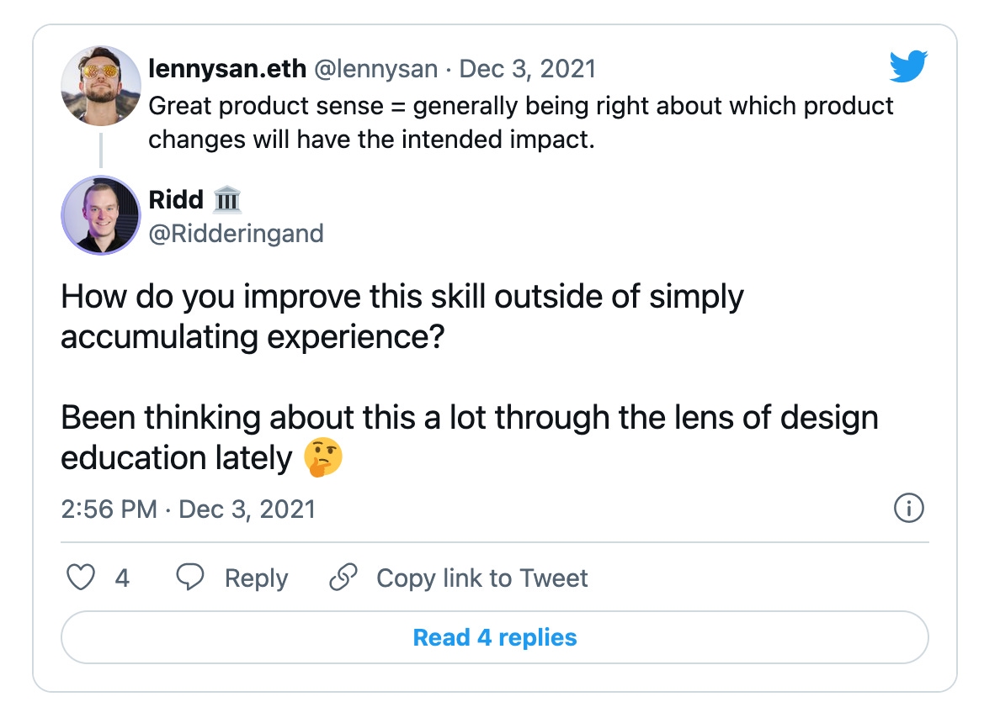
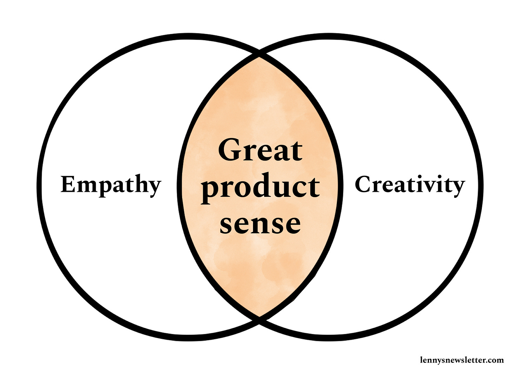
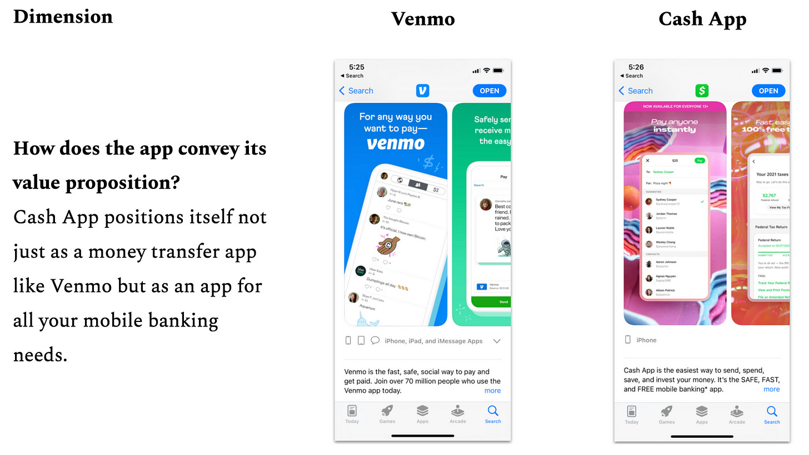
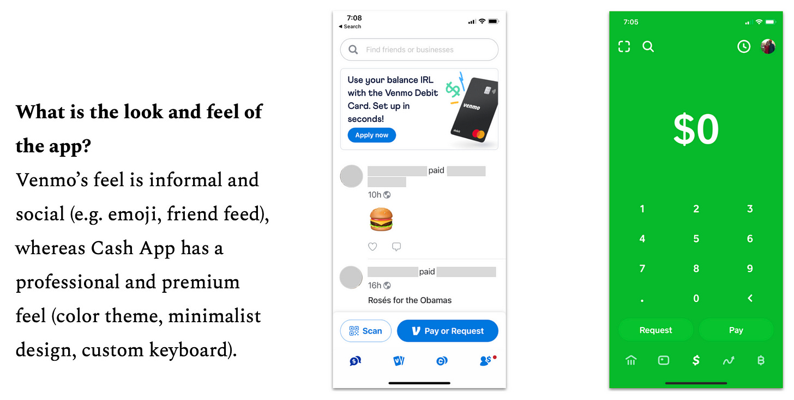
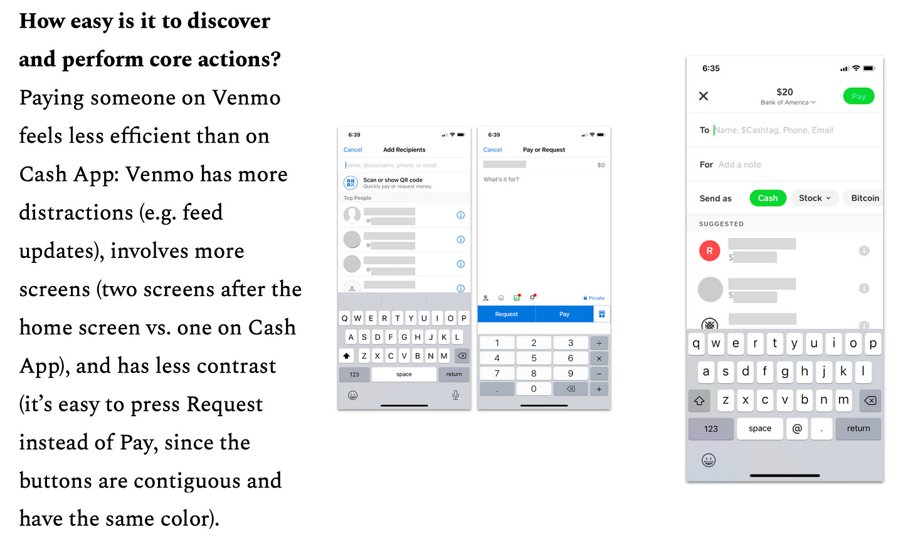
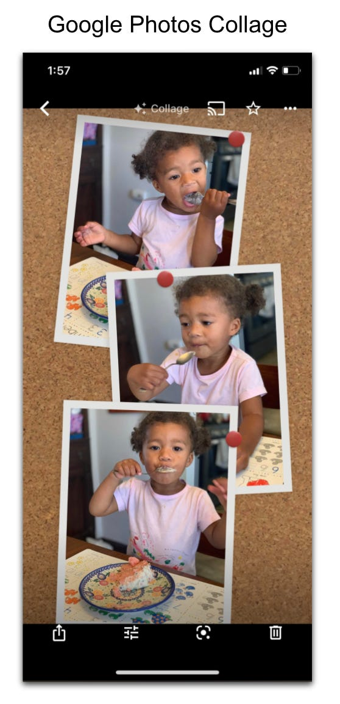
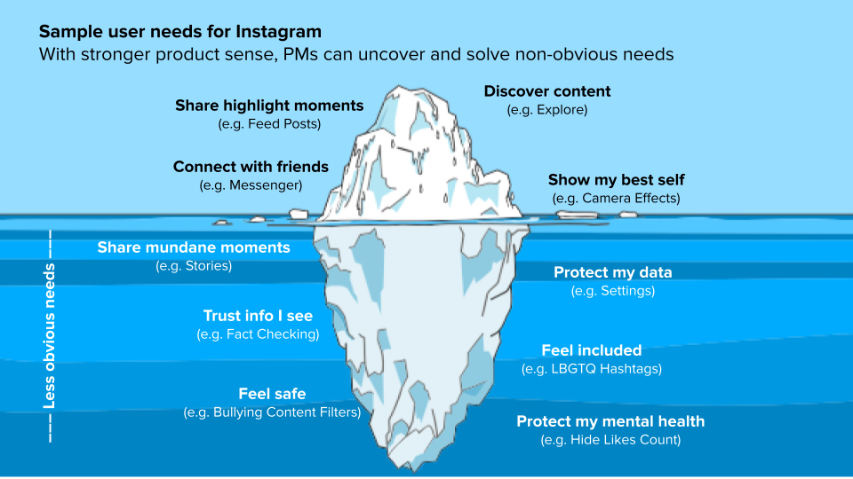
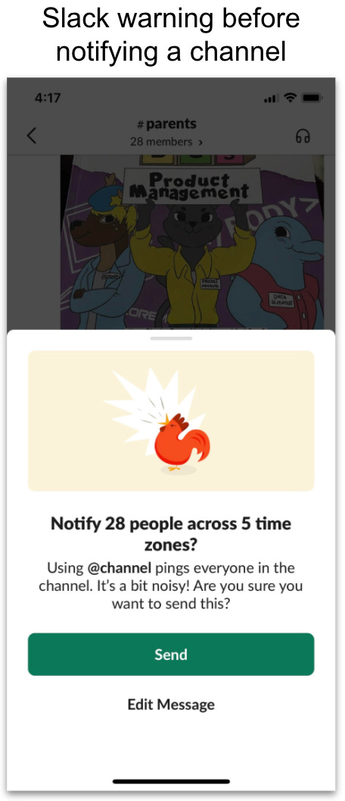
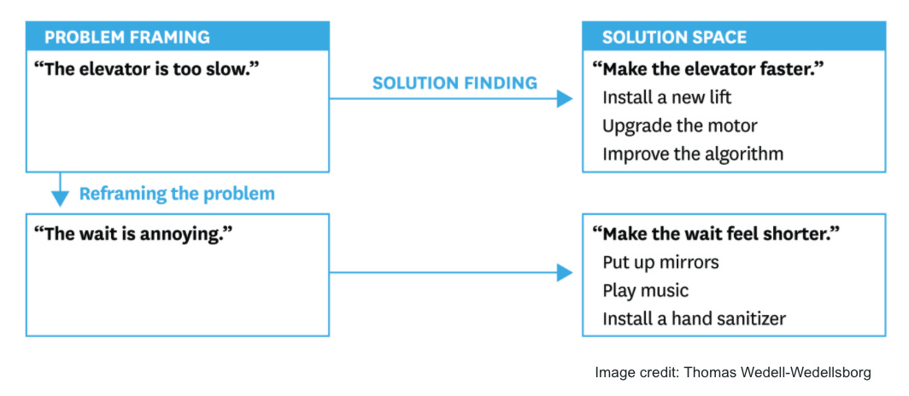

## How to develop product sense  

如何培养产品意识

### With guest author Jules Walter  

特邀作者朱尔斯-沃尔特

_👋 Hey, [Lenny](https://twitter.com/lennysan) here! Welcome to a ✨ **monthly free edition** ✨ of my weekly newsletter.  

Each week I tackle reader questions about building product, driving growth, working with humans, and anything else that’s stressing you out about work.  

每周我都会回答读者提出的问题，这些问题涉及产品开发、推动增长、与人合作以及其他任何让你感到工作压力的问题。  

> ## Q: How do I develop product sense?  
> 
> 问：如何培养产品意识？

Your question implies that it _can_ be developed, and to that point, I 1,000% agree.  

Contrary to what a lot of PMs believe, product sense is not something you need to be born with.  

与许多项目经理的看法相反，产品意识并非与生俱来。  

It’s a learned skill, just like any other PM skill.  

这是一门学问，就像其他 PM 技能一样。  

Sure, some people are naturally better at it, but that’s OK.  

当然，有些人天生就比较擅长这个，但没关系。  

You don’t need to be in the 99th percentile of this skill to be an incredibly successful PM.  

要想成为一名非常成功的 PM，你并不需要在这项技能上达到第 99 百分位数。  

That being said, you are building a product as your job, and are often the final word on product decisions, so you absolutely do need to develop your product sense muscle, especially as you move up in seniority.  

尽管如此，你的工作就是开发产品，而且往往是产品决策的最终决定者，因此你绝对需要培养自己的产品意识，尤其是当你的资历越高时。  

你的问题意味着它是可以发展的，对于这一点，我完全同意。

To help you build your product sense, I’ve asked [Jules Walter](https://www.linkedin.com/in/juleswalter/), a longtime PM at Slack and YouTube who’s also a prominent leader in the broader PM community, to share his hard-earned wisdom with us.  

Below, Jules unravels the mystery that is product sense.  

下面，朱尔斯将为您揭开产品感的神秘面纱。  

He shares a ton of actionable and practical advice to develop your product sense, explains what product sense is, how to know if you’re getting better, and dives deep into four concrete ways to build this skill with a bunch of examples from his own experience.  

他分享了大量可操作的实用建议来培养你的产品意识，解释了什么是产品意识，如何知道自己是否在进步，并深入探讨了培养这种技能的四种具体方法，还列举了大量他自己的经验。  

Enjoy!  

请慢用  

为了帮助你建立自己的产品意识，我邀请了 Slack 和 YouTube 的长期项目经理、同时也是更广泛的项目经理社区的杰出领袖朱尔斯-沃尔特（Jules Walter）与我们分享他的心血智慧。

_You can follow Jules on [Twitter](https://twitter.com/julesdwalt) and [LinkedIn](https://www.linkedin.com/in/juleswalter).  

您可以在 Twitter 和 LinkedIn 上关注 Jules。_

_P.S. You can now hear this post in audio form 👇  

附注：您现在可以听到这篇文章的音频👇。_

Product sense is not only one of the most important PM skills (see chart below from [Lenny’s survey of ~1,000 PMs](https://www.lennysnewsletter.com/p/product-management-survey?s=w#:~:text=Being%20a%20Product%20Manager))—it’s also the most vague. And it’s often the hardest to learn.  

产品意识不仅是项目经理最重要的技能之一（见下图，来自 Lenny 对约 1000 名项目经理的调查），也是最模糊的技能。而且往往最难学习。

There isn’t much written on the subject, and as a PM trying to improve your product sense, you may not know if you’re any good at it, or how to get better.  

关于这一主题的文章并不多，而作为一名试图提高产品意识的项目经理，你可能不知道自己是否擅长于此，也不知道如何才能做得更好。  

I want to help.  

我想帮忙。

**Product sense is the skill of consistently being able to craft products (or make changes to existing products) that have the intended impact on their users.** Product sense relies on (1) **empathy** to discover meaningful user needs and (2) **creativity** to come up with solutions that effectively address those needs.  

产品意识是一种技能，它能够持续不断地制作出对用户产生预期影响的产品（或对现有产品进行修改）。产品意识依赖于（1）同理心来发现有意义的用户需求；（2）创造力来提出有效满足这些需求的解决方案。

You likely have good product sense if you’ve championed successful features or products that were not obvious to others.  

如果你曾倡导过成功的功能或产品，而这些功能或产品在其他人看来并不明显，那么你很可能具有良好的产品意识。  

Here are some examples of products born out of strong product sense:  

以下是一些因强烈的产品意识而诞生的产品实例：

-   The original iPhone was built on the insight that people value aesthetics, and not just functionality, in their products.  
    
    最初的 iPhone 是建立在人们对产品的审美价值而不仅仅是功能价值的洞察之上的。  
    
    It was designed around the idea that consumers needed a smartphone that felt personal.  
    
    它的设计理念是，消费者需要一款个人化的智能手机。
    
-   The original Gmail responded to unmet user needs at the time.  
    
    最初的 Gmail 满足了当时尚未得到满足的用户需求。  
    
    It addressed common user problems, including low storage quotas, poor search experience, and related messages separated from each other (instead of being combined in a thread).  
    
    它解决了常见的用户问题，包括存储配额低、搜索体验差、相关信息相互分离（而不是合并在一个线程中）等。
    
-   Superhuman saw a need for a modern email client to allow busy professionals to get through emails quickly.  
    
    Superhuman 发现了现代电子邮件客户端的需求，它能让繁忙的专业人士快速处理电子邮件。  
    
    It used thoughtful design to support fast email workflows and limit distractions.  
    
    它采用了深思熟虑的设计，以支持快速的电子邮件工作流程并限制干扰。
    

Each of these products originated with strong product sense and offered creative solutions to previously unmet user needs.  

这些产品都具有强烈的产品意识，并为以前未得到满足的用户需求提供了创造性的解决方案。

I was the first PM on Slack’s growth team, where I spent more than four years building product experiences used by millions of people.  

我是 Slack 增长团队的第一位 PM，在那里我花了四年多的时间打造了被数百万人使用的产品体验。  

I’m now a product leader at YouTube, where I’m building a yet-to-be-released zero-to-one product.  

我现在是 YouTube 的产品负责人，正在打造一款尚未发布的 "零对一 "产品。

In my roles, I’ve relied on product sense to bring unique insights to the table and drive user value and business impact.  

在我的工作中，我依靠产品意识带来独特的见解，推动用户价值和业务影响。  

In this article, I will be discussing four practices for building product sense.   

在本文中，我将讨论建立产品意识的四种做法。

**Building empathy:  

建立同理心：**

1.  Observe people interacting with products  
    
    观察人们与产品的互动
    
2.  Deconstruct everyday products  
    
    解构日常产品
    

**Improving creativity:  

提高创造力：**

3.  Learn from great product thinkers  
    
    向伟大的产品思想家学习
    
4.  Be curious about changes in technology and your domain  
    
    对技术和您所在领域的变化充满好奇
    

Let’s get to it.  

让我们开始吧。

### 1\. Observe people interacting with products 🕵🏾  

1.观察人们与产品的互动 🕵🏾

One approach to developing empathy—and thus, product sense—is to repeatedly observe people using products, whether yours or other companies’.  

培养同理心的方法之一是反复观察人们使用产品的情况，无论是自己的产品还是其他公司的产品。  

This practice will help you get better at identifying subtle user needs that others miss (e.g.  

这种做法可以帮助你更好地识别别人忽略的细微用户需求（例如  

social, emotional, or functional needs).  

社会、情感或功能需求）。

You can start small. Initially, I recommend doing this two to four times a month for your product.  

你可以从小事做起。最初，我建议您每月为自己的产品做两到四次。  

Don’t just read reports from researchers on your team; instead attend user research sessions to get firsthand exposure to user experiences and reactions.  

不要只阅读团队中研究人员的报告，而是要参加用户研究会议，获得用户体验和反应的第一手资料。  

What’s important is to pay attention to micro details and ask yourself why people react to your product the way they do.  

重要的是要关注微观细节，问问自己为什么人们会对你的产品产生这样的反应。  

Observe their facial expressions as they try various aspects of your product, and try to spot moments when they’re hesitant, confused, excited, etc.  

观察他们在试用产品各方面时的面部表情，努力发现他们犹豫、困惑、兴奋等的瞬间。  

In those moments, ask open-ended questions to better understand not just how they feel but, more importantly, _why_.  

在这种时候，提出一些开放式的问题，以便更好地了解他们的感受，更重要的是，了解他们为什么这样做。

Here are some sample questions you can ask:  

以下是您可以提出的一些示例问题：

1.  What do you think the purpose of this product is? Who do you think it’s for? _This will give you a sense of how effective your product’s landing page is.  
    
    It also gives you ideas for words to describe your product that resonate with people.  
    
    它还能为您提供一些能引起人们共鸣的描述产品的词汇。_  
    
    您认为该产品的用途是什么？你认为它是为谁准备的？这将让您了解产品着陆页的效果如何。
    
2.  Now that you’re in the product, what actions do you want to take? _This will help you understand which features are easy to discover and how clear your product’s navigation and calls to action are._  
    
    既然您已经进入了产品，您想采取什么行动？这将帮助您了解哪些功能易于发现，以及产品导航和行动号召的清晰程度。
    
3.  What are you thinking right now? How does that make you feel? _I tend to ask this at every new step the user lands on, because people tend not to notice their self-talk and feelings otherwise._  
    
    你现在在想什么？这让你感觉如何？每当用户进入一个新的步骤，我都会问这个问题，因为人们往往不会注意到他们的自我对话和感受。
    

When I joined Slack in 2016, our data indicated high churn rates for new users on mobile.  

我在 2016 年加入 Slack 时，我们的数据显示移动端新用户的流失率很高。  

We wanted to understand why, so we set up user research sessions and asked questions such as the ones above.  

我们想了解其中的原因，因此我们设置了用户研究环节，并提出了上述问题。  

Through those questions and through observing users, we learned that:  

通过这些问题和对用户的观察，我们了解到

-   Many people didn’t really understand what Slack did, even after visiting our homepage, which was too abstract at the time.  
    
    很多人并不真正了解 Slack 是做什么的，即使访问了我们的主页也是如此，因为我们的主页当时太抽象了。
    
-   People would land in the Slack app and not know what to do because of competing calls to action.  
    
    人们进入 Slack 应用程序后，会因为相互竞争的行动号召而不知所措。
    
-   People didn’t want to give permission to their mobile address book, because it had their friends’ contact info and not their colleagues’.  
    
    人们不愿意允许使用自己的手机通讯录，因为里面只有朋友的联系方式，而没有同事的。
    

These new insights led us to come up with experiment ideas that enabled us to improve Slack’s product experience for new users and significantly increase the product’s retention rate.  

这些新的洞察力促使我们提出了一些实验想法，使我们能够改善 Slack 新用户的产品体验，并显著提高产品的留存率。  

Below is one such experiment, which removed friction in the invite step and addressed users’ concerns around giving permission to their address books.  

下面就是这样一个实验，它消除了邀请步骤中的摩擦，并解决了用户对允许使用通讯录的顾虑。

After observing hundreds of people use products I’ve worked on (whether in research sessions or coffee shops etc.) and asking them questions about their usage, I’ve developed better instincts about how people will react to various product experiences.  

通过观察数百人使用我所研究的产品（无论是在研究会议还是咖啡厅等），并向他们询问使用情况，我对人们对各种产品体验的反应有了更好的直觉。  

Here are five quick lessons about product usage that have stuck with me:  

以下是让我记忆犹新的五条关于产品使用的快速经验：

1.  **People are time-crunched and distracted when they use your product.** They might not read labels or text and might not be willing to spend even a few seconds to figure out what to do next.  
    
    Pick the right defaults and use visual design and cues to make primary actions obvious (e.g.  
    
    选择正确的默认设置，并利用视觉设计和提示使主要操作一目了然（如  
    
    prominence, lack of distractions).  
    
    突出、无干扰）。  
    
    人们在使用您的产品时时间紧迫，注意力分散。他们可能不会阅读标签或文字，甚至不愿意花几秒钟来弄清楚下一步该做什么。
    
2.  **People will drop out of a product flow as soon as they feel confused or nervous** that they might be doing something wrong.  
    
    Make sure labels are unambiguous and contrast options appropriately.  
    
    确保标签明确无误，并适当对比选项。  
    
    一旦人们感到困惑或紧张，担心自己可能做错了什么，他们就会退出产品流程。
    
3.  **Don’t give people too much information at once**, because once they feel overwhelmed, they tend to leave.  
    
    For example, we ran pricing page experiments at Slack and saw increases in purchases when we moved some of the information on the various purchase options behind a dropdown list.  
    
    例如，我们在 Slack 进行了定价页面实验，当我们将各种购买选项的部分信息移到下拉列表后面时，发现购买量增加了。  
    
    不要一次给人们提供太多信息，因为一旦他们感到不知所措，他们往往就会离开。
    
4.  **Context impacts decisions.** Use tools like comparisons, contrasting, and social proof to make it easier for users to make a decision.  
    
    情境影响决策。使用比较、对比和社会证明等工具，让用户更容易做出决定。
    
5.  **Make sure the goal of your product and possible actions are clear to users.** At Slack, we often heard from users that they didn’t know what Slack was really about and what they could do with the app.  
    
    We experimented with various onboarding experiences to address that issue, and one early experiment on mobile increased user retention just by telling new users what Slack is and linking to a video showing people how a work team might use it on desktop and mobile.  
    
    为了解决这个问题，我们尝试了各种上机体验，其中一个早期的移动实验仅通过告诉新用户 Slack 是什么，并链接到一个视频，向人们展示一个工作团队如何在桌面和移动设备上使用 Slack，就提高了用户留存率。  
    
    确保用户清楚产品的目标和可能采取的行动。在 Slack，我们经常听到用户说，他们不知道 Slack 的真正目的是什么，也不知道他们能用这款应用做些什么。
    

The more frequently and closely you watch people using products, the more observant you’ll become and the more empathy you’ll develop.  

你越频繁、越仔细地观察人们使用产品，你的观察力就会越强，你就会产生更多的共鸣。

### 2\. Deconstruct everyday products 👨🏾🔧️  

2.解构日常产品 👨🏾🔧️

Another approach to developing empathy is to observe _yourself_ using everyday products.  

I spend one or two hours a month trying out new products and deconstructing them.  

我每个月都会花一两个小时试用新产品，并对它们进行解构。  

The goal is to strengthen my intuition about why some products work well and others don’t—this also helps me identify common UX best practices and paradigms. While deconstructing products, I recommend asking the types of questions Julie Zhuo shares in the article另一种培养同理心的方法是观察自己使用日常用品的情况。 [How to Do a Product Critique](https://medium.com/the-year-of-the-looking-glass/how-to-do-a-product-critique-98b657050638#.v5o81mocz), such as:   

这样做的目的是加强我的直觉，让我知道为什么有些产品做得好，而有些产品做得不好--这也有助于我识别常见的用户体验最佳实践和范例。在解构产品时，我建议提出朱莉-卓（Julie Zhuo）在《如何进行产品评论》（How to Do a Product Critique）一文中分享的问题类型，例如：

1.  What’s the experience of getting started or signing up?  
    
    入门或注册的体验如何？
    
2.  How does this app explain itself in the first minute?  
    
    这款应用程序如何在第一分钟内解释自己？
    
3.  How easy to use was the app?  
    
    应用程序的易用性如何？
    
4.  How did you feel while exploring the app?  
    
    在探索应用程序时，您有什么感受？
    
5.  Did the app deliver on your expectations?  
    
    该应用程序是否达到了您的预期？
    

If you want to go deeper in your understanding of a product, I recommend also looking at other products in the same category and comparing and contrasting them.  

如果您想更深入地了解某种产品，我建议您也看看同类产品中的其他产品，并对它们进行比较和对比。  

For example, to better understand a product like [Cash App](https://cash.app/), compare it with [Venmo](https://venmo.com/). You’ll see that these two seemingly similar money apps are fundamentally different.  

Below are a few dimensions you can look at to compare two products and better understand how they approach product decisions.  

以下是您可以用来比较两种产品并更好地了解他们如何进行产品决策的几个维度。  

例如，为了更好地理解 Cash App 这样的产品，可以将它与 Venmo 进行比较。你会发现，这两款看似相似的货币应用却有着本质的区别。

By comparing a product with others in the space, some of the product design choices become more salient and it’s easier to get hints of the product’s strategy.  

通过将产品与同类产品进行比较，产品的某些设计选择会变得更加突出，也更容易获得产品策略的暗示。  

For example, in the Cash App vs.  

例如，在 "现金应用 "对 "现金应用 "中，"现金应用 "是 "现金应用程序 "的一部分。  

Venmo comparison, it seems Venmo’s strategy is to lean into its social graph (use Venmo because your friends are already on it and you can easily make sure you’re sending the money to the right person), whereas Cash App is focused on ease of use and breadth of capabilities for people who want to go beyond just peer-to-peer transfers (run your personal finances or small business from your phone).  

与Venmo相比，Venmo的战略似乎是向其社交图谱倾斜（使用Venmo是因为你的朋友已经在使用它，而且你可以很容易地确保你把钱寄给了正确的人），而Cash App则侧重于易用性和功能的广泛性，适合那些希望超越点对点转账（通过手机管理个人财务或小企业）的人。

When I use new products, I also observe my own self-talk and feelings, including moments of frustration, such as:  

在使用新产品时，我也会观察自己的自言自语和感受，包括沮丧的时刻，例如

-   I’m trying to log in to my medical app to set up an appointment, but I’m unable to because I can’t remember my password.  
    
    我想登录我的医疗应用程序来安排预约，但因为不记得密码而无法登录。  
    
    The password reset flow never sent me an email, even after multiple attempts, and I just stopped using the service.  
    
    密码重置流程从未向我发送过电子邮件，即使在多次尝试之后也是如此，于是我就不再使用这项服务了。
    
-   I’m trying to rent a car, but as soon as I input the start time, the interface shows an error message telling me that the end time can’t be before the start time.  
    
    我想租一辆车，但一输入开始时间，界面就显示错误信息，告诉我结束时间不能早于开始时间。  
    
    I was going to update the end time anyway, and now I feel stupid and frustrated while using this product, which is not a feeling you want your users to have.  
    
    无论如何我都要更新结束时间，现在我在使用这个产品时感到愚蠢和沮丧，这不是你希望用户有的感觉。
    

I also note moments when I experience delight, such as:  

我还会记录下我体验到快乐的时刻，比如

-   Carta’s stock-vesting email could have been just text letting me know that I’ve vested into more shares, but it also includes an animation with confetti that takes my feeling of celebration to another level.  
    
    Carta 的股票投资电子邮件本可以只是文字通知，让我知道我已经获得了更多的股票，但它还包括一个带有彩纸的动画，让我的庆祝之情更上一层楼。
    
-   Google Photos collages combine multiple photos of the people who matter to me the most in delightful ways.  
    
    谷歌照片拼贴将我最重要的人的多张照片以令人愉悦的方式组合在一起。
    

One bonus practice I recommend for improving your empathy and observation skills is meditation.  

为了提高你的同理心和观察力，我推荐的一种额外练习就是冥想。  

I’ve been meditating for years, and it’s helped me become more perceptive—not just of other people’s feelings but also of my own.  

多年来，我一直在冥想，它让我变得更加敏锐--不仅是对别人的感受，还有对自己的感受。  

If you are new to meditation, I recommend starting with an [app](https://www.fitmind.co/fitmind-meditation-app) or joining a [meditation community](https://sundaysangha.net/) to help you form a daily habit.  

如果您是冥想新手，我建议您从一个应用程序或加入一个冥想社区开始，帮助您养成每天冥想的习惯。

The more frequently and closely you observe people (and yourself), the more insight you will gain into their motivations and needs, and the more your empathy will grow.  

你越频繁、越仔细地观察别人（和你自己），就越能洞察他们的动机和需求，你的同理心也就越强。

### 3\. Learn from great product thinkers 📓  

3.向优秀的产品思想家学习 📓

One of the biggest levers for developing creativity (and again, product sense) is to spend time with people who already have it.  

开发创造力（以及产品意识）的最大杠杆之一，就是花时间与那些已经拥有创造力的人在一起。

My creativity improved significantly after I joined Slack, partly because I observed how people like CEO Stewart Butterfield approached building products.  

加入 Slack 后，我的创造力有了明显提高，部分原因是我观察到了首席执行官斯图尔特-巴特菲尔德（Stewart Butterfield）等人是如何打造产品的。  

If you’ve never worked at a company with strong product thinkers, I recommend joining such a company at some point in your career to strengthen your product fundamentals—the earlier, the better.  

如果你从未在一家拥有强大产品思想家的公司工作过，我建议你在职业生涯的某个阶段加入这样一家公司，以加强你的产品基础--越早越好。  

If you’re not sure which companies to consider, start by thinking of companies whose products you use and love.  

如果您不确定要考虑哪些公司，可以从您使用并喜爱其产品的公司开始考虑。

Once you’re at a company with great product thinkers, I recommend attending as many product reviews as you can.  

一旦你进入了一家拥有优秀产品思想家的公司，我建议你尽可能多地参加产品评论。  

Take copious notes during the reviews, and look for patterns in the questions and feedback you hear—i.e.  

在审查过程中做大量笔记，并从听到的问题和反馈中寻找规律，例如  

what type of comments keep coming up.  

什么类型的评论不断出现。  

Over time, you’ll understand the mental checklists your product leaders use to ensure that new product ideas will be successful, and you’ll identify the principles they use to make product decisions and trade-offs.  

随着时间的推移，您将了解产品负责人为确保新产品创意获得成功而使用的心理清单，您还将确定他们在做出产品决策和权衡时使用的原则。

One of the things I learned from my exposure to Stewart Butterfield is that _every_ detail about the user experience matters.  

“The details are not the details,” he would say, quoting designer Charles Eames.  

"他引用设计师查尔斯-伊姆斯（Charles Eames）的话说："细节不是细节。  

“They make the design.” Stewart’s obsession with the details is one of the main reasons why Slack exists and is used by millions of people.  

"他们造就了设计"。斯图尔特对细节的执着是 Slack 存在并被数百万人使用的主要原因之一。  

我从斯图尔特-巴特菲尔德身上学到的一点是，用户体验的每一个细节都很重要。

For example, if a user tries to use @channel to message a large number of teammates across multiple time zones in Slack, they’ll see a cartoon rooster (below) asking them to think twice about notifying these people.  

例如，如果用户试图在 Slack 中使用 @channel 向多个时区的大量队友发送消息，他们会看到一只卡通公鸡（如下图），要求他们三思而后行，不要通知这些人。  

It’s a detail that wasn’t built to move metrics but rather to prevent anxiety for people who would otherwise receive work notifications at odd hours.  

这个细节并不是为了移动指标而设计的，而是为了防止人们在不固定的时间收到工作通知而感到焦虑。  

The rooster icon was chosen to keep the tone playful so that the message sender doesn’t feel ashamed or guilty when they read the warning.  

选择公鸡图标是为了保持俏皮的语气，让信息发送者在阅读警告时不会感到羞愧或内疚。

This type of product detail can mean a lot to users.  

这种产品细节对用户来说意义重大。  

When I would review customer tickets at Slack, many of them were positive feedback from people thanking us for the thoughtfulness that the team put into the product.  

当我在 Slack 审查客户投诉时，很多都是正面反馈，人们感谢我们的团队为产品所做的周到考虑。  

Sometimes people couldn’t even say exactly _why_ they loved Slack—partly because what drew them wasn’t one big feature, but rather the attention to details across the product.  

I’ve learned that if you remove from your product lots of small annoyances that people deal with on a daily basis, the value you get from doing that adds up to something meaningful.  

我了解到，如果你能从产品中去除许多人们每天都要面对的小麻烦，那么你所获得的价值就会变得非常有意义。  

有时，人们甚至说不清楚为什么会喜欢 Slack，部分原因是吸引他们的并不是某个大功能，而是整个产品对细节的关注。

Another lesson I learned from Stewart is to spend time understanding user problems and framing them in a way that sets strong constraints for the team.  

我从斯图尔特身上学到的另一个经验是，要花时间了解用户的问题，并以一种为团队设定强有力约束的方式来阐述这些问题。  

Many PMs jump into solution-finding before they truly understand the problem.  

许多项目管理人员在真正了解问题之前就急于寻找解决方案。  

This leads to ineffective solutions, or indecisiveness as their teams struggle to eliminate potential solutions.  

这就导致了无效的解决方案，或者在他们的团队努力排除潜在解决方案时优柔寡断。  

If you understand why a problem exists and frame it clearly, you will identify enough constraints that only a few solutions will be left, streamlining the decision-making process.  

如果你了解问题存在的原因，并将其清晰地描述出来，你就能找出足够多的限制因素，从而只剩下少数几个解决方案，简化决策过程。  

For example, in the article [Are You Solving the Right Problems?](https://hbr.org/2017/01/are-you-solving-the-right-problems), Thomas Wedell-Wedellsborg gives an example of how two different framings of a problem lead to completely different solutions:  

例如，托马斯-韦德尔-韦德尔斯堡（Thomas Wedell-Wedellsborg）在《你解决的是正确的问题吗？

This ability to reframe problems and set opinionated constraints is a key skill I’ve seen product thinkers use to drive creative solutions.  

这种重构问题并设定有主见的限制条件的能力，是我所见过的产品思想家们用来推动创造性解决方案的关键技能。

If, on the other hand, you don’t work at a company with strong product thinkers, look for external mentors and read articles or interviews from people such as [Julie Zhuo](https://www.youtube.com/watch?v=b78zq-kimVs), [Stewart Butterfield](https://medium.com/@stewart/we-dont-sell-saddles-here-4c59524d650d), [David Lieb](https://www.ycombinator.com/library/5f-on-starting-and-scaling-one-of-the-biggest-ios-apps), and [Rahul Vohra](https://www.youtube.com/watch?v=zaxAdRlyZQ8).  

另一方面，如果你所在的公司没有强大的产品思想家，你可以寻找外部导师，阅读卓文钰、斯图尔特-巴特菲尔德、大卫-利布和拉胡尔-沃赫拉等人的文章或访谈。

If you’re able to connect with great product thinkers, here are some sample questions you can ask to better understand their processes and insights:  

如果您能与优秀的产品思想家建立联系，您可以向他们提出一些示例问题，以便更好地了解他们的工作流程和见解：

-   What prompted you to build your product? _This will give you a sense of the type of user insights you should be looking for and the process to get them._  
    
    是什么促使您创建自己的产品？这将让您了解您应该寻找的用户洞察类型以及获得这些洞察的过程。
    
-   What were the key decision points along the way?  
    
    一路走来，关键的决策点是什么？
    
-   What alternative approaches did you consider? _For ambiguous problems, you have to explore multiple approaches before you land on one that works.  
    
    Understanding the solutions that were discarded, and why, will help you get a sense of how they test hypotheses and make trade-offs.  
    
    了解被放弃的解决方案及其原因，有助于你了解他们是如何检验假设和做出权衡的。_  
    
    你考虑过哪些替代方法？对于模棱两可的问题，在找到一种可行的方法之前，你必须探索多种方法。
    
-   What were surprising insights or results? _Knowing when their initial hypotheses were wrong and understanding why can help you uncover great insights._  
    
    有哪些令人惊讶的见解或结果？了解他们最初的假设何时是错误的，并理解其原因，可以帮助你发现伟大的洞察力。
    
-   What principles or frameworks helped you navigate the ambiguity? _Great product thinkers internalize product principles they use to evaluate solutions.  
    
    If you can uncover those principles, you can use them to guide your decisions as well.  
    
    如果你能发现这些原则，你也可以用它们来指导你的决策。_  
    
    哪些原则或框架可以帮助您克服模糊性？优秀的产品思考者会将他们用来评估解决方案的产品原则内化于心。
    

Gaining access to strong product thinkers may be difficult, but try to read as many blog posts or watch as many videos as you can where product leaders who you look up to share their thought processes.  

接触强大的产品思想家可能很难，但要尽量多读博文或多看视频，在这些博文或视频中，你所仰慕的产品领导者会分享他们的思考过程。

### 4\. Be curious about changes in technology and your domain📱  

4.对技术和所在领域的变化充满好奇📱

Another practice for developing creativity is to spend time learning about emerging trends in technology, society, and regulations.  

培养创造力的另一种做法是花时间了解技术、社会和法规方面的新趋势。  

Changes in the industry create opportunities for launching new products that can address user needs in new ways.  

行业的变化为推出能以新方式满足用户需求的新产品创造了机会。  

As a PM, you want to understand what’s possible in your domain in order to come up with creative solutions. For example:  

作为一名项目管理人员，您需要了解您所在领域的可能性，以便提出创造性的解决方案。举个例子：

-   Cash App decided to support Bitcoin transactions, and as a result, 76% (nearly $4.6 billion) of its 2020 revenues came from Bitcoin.  
    
    Cash App 决定支持比特币交易，因此，其 2020 年收入的 76% （近 46 亿美元）来自比特币。  
    
    For more examples of products that benefited from new trends, see Lenny’s article [Why now](https://www.lennysnewsletter.com/p/why-now?).  
    
    欲了解更多受益于新趋势的产品案例，请参阅 Lenny 的文章《为什么是现在》。
    
-   Uber became possible because of the proliferation of smartphones with GPS capabilities and the availability of Google Maps APIs.  
    
    由于具有 GPS 功能的智能手机的普及和谷歌地图应用程序接口的可用性，Uber 成为可能。
    
-   Clubhouse took off quickly because of the pandemic, which accelerated the need for virtual public discourse.  
    
    由于大流行病加速了对虚拟公共对话的需求，会所迅速发展起来。
    

There are two levels at which you can look at emerging trends: the macro and the micro.  

您可以从宏观和微观两个层面来审视新兴趋势。  

At the macro level, you should keep track of important platform shifts (e.g.  

在宏观层面上，您应跟踪重要的平台变化（如  

web3, AR/VR, AI), social shifts (e.g. the shift to remote work), and changes in regulations (e.g.  

web3、AR/VR、人工智能）、社会变革（如向远程工作的转变）以及法规变化（如  

new privacy protection laws).  

新的隐私保护法）。  

It’s important to keep an open mind about new technologies, because at first they receive a lot of skepticism and have obvious flaws.  

对新技术保持开放的心态很重要，因为一开始它们会受到很多质疑，而且有明显的缺陷。  

I still remember when people were skeptical of e-commerce and assumed it would never be safe to use credit cards online.  

我还记得，当时人们对电子商务持怀疑态度，认为在网上使用信用卡永远不会安全。  

When you see a new trend, instead of dismissing it as a fad, ask yourself, “If this trend reaches its full potential, what opportunities will it create that I can pursue?”  

当你看到一种新趋势时，不要把它当作一种时尚而不予理睬，而是问问自己："如果这种趋势充分发挥了它的潜力，它将会创造出哪些我可以追求的机会？

There are many places to keep up with macro technology trends. For example, you can:  

有很多地方可以了解宏观技术趋势。例如，您可以

-   Watch annual developer conferences from major tech companies to understand what areas they see as promising (e.g. [Google](https://io.google/2021/?lng=en), [Apple](https://developer.apple.com/wwdc21/), [Meta](https://developers.facebook.com/f8/), [Amazon](https://reinvent.awsevents.com/)).  
    
    关注主要科技公司的年度开发者大会，了解他们认为哪些领域大有可为（如谷歌、苹果、Meta、亚马逊）。
    
-   Read commentary from industry analysts (e.g. [Ben Thompson](https://stratechery.com/)).  
    
    阅读行业分析师（如 Ben Thompson）的评论。
    
-   Follow tech founders and investors on Twitter (e.g. [Naval Ravikant](https://twitter.com/naval?), [Elad Gil](https://twitter.com/eladgil?), [Balaji Srinivasan](https://twitter.com/balajis)) and pay attention to trends they’re bullish on.  
    
    在 Twitter 上关注科技创始人和投资者（如 Naval Ravikant、Elad Gil、Balaji Srinivasan），关注他们看好的趋势。
    
-   Invest in or advise startups operating in spaces that interest you.  
    
    在你感兴趣的领域投资初创企业或为其提供建议。  
    
    If that’s not possible, pay attention to what companies top VCs are investing in, and follow those companies.  
    
    如果做不到这一点，那就关注顶级风险投资公司正在投资哪些公司，并跟踪这些公司。
    

While the macro trends are helpful in seeing where the industry is going, many of the non-obvious opportunities lie in deeply understanding micro changes that may unlock new possibilities.  

虽然宏观趋势有助于了解行业的发展方向，但许多非显而易见的机会在于深入了解微观变化，这些变化可能会开启新的可能性。  

For example, Figma’s high-quality browser-based application for designers became possible only once WebGL became performant enough.  

例如，只有当 WebGL 的性能足够强大时，Figma 为设计师设计的基于浏览器的高质量应用程序才成为可能。  

In order to understand the nuances of micro changes, I recommend meeting with engineers and domain experts and going deep with them on topics of interest, such as new APIs or platform capabilities.  

为了了解微小变化的细微差别，我建议与工程师和领域专家会面，与他们深入探讨感兴趣的话题，如新的应用程序接口或平台功能。

As Paul Graham said in [How to Get Startup Ideas](http://paulgraham.com/startupideas.html), “Live in the future, then build what’s missing.” Living in the future is also an effective approach to developing your product sense.  

正如保罗-格雷厄姆（Paul Graham）在《如何获得初创公司的创意》一书中所说："活在未来，然后创造缺失的东西"。活在未来也是培养产品意识的有效方法。

Developing product sense takes time and practice. As you get better at it, you’ll:  

培养产品意识需要时间和实践。当你掌握得越来越好时，你就会

-   Notice subtle things about products and people that you would have missed before (e.g.  
    
    注意到您以前可能会忽略的产品和人的细微之处（例如  
    
    micro frustrations and delights)  
    
    微型挫折与乐趣）
    
-   Anticipate non-obvious user problems when you look at product experiences or before you present at product reviews  
    
    在查看产品体验时或在产品评测之前，预测非显而易见的用户问题
    
-   Develop higher-quality hypotheses about product experiences to build, even in the face of ambiguity  
    
    即使面对模棱两可的情况，也要开发出更高质量的产品体验假设来进行构建
    
-   Contribute more unique insights to your team, given your improved understanding of users and the landscape  
    
    加深对用户和环境的了解，为团队贡献更多独特见解
    
-   Be right more often than not about what impact a change to a flow has on metrics  
    
    对流程的改变对指标的影响往往是正确的
    
-   And, potentially, receive comments from your design partner on how impressed they are with a detail you noticed  
    
    还有可能收到设计合作伙伴的评论，说你注意到的某个细节给他们留下了深刻印象
    

I hope you decide to invest in developing your product sense, and that the practices in this article, on strengthening empathy and creativity, are as useful to you as they’ve been to me.  

我希望你决定投资开发你的产品感，并希望本文中关于加强同理心和创造力的做法对你和对我一样有用。

### Helpful resources 🙏🏾  

有用资源 🙏🏾

1.  [The First Secret of Great Design](https://www.youtube.com/watch?v=9uOMectkCCs): 16-minute TED talk with Tony Fadell about how keeping a beginner’s mind led to the creation of Nest  
    
    伟大设计的第一秘诀：Tony Fadell 的 16 分钟 TED 演讲，讲述如何保持初学者的心态来创造 Nest
    
2.  _[Inspired](https://www.amazon.com/Inspired-Create-Products-Customers-Love/dp/0981690408/ref=sr_1_2?)_: Book by Marty Cagan about creating products people love  
    
    灵感：马蒂-卡根关于创造人们喜爱的产品的书
    
3.  [Intro to the Design of Everyday Things](https://www.udacity.com/course/intro-to-the-design-of-everyday-things--design101): Two-week course with Don Norman on applying design principles  
    
    日常用品设计入门：与唐-诺曼（Don Norman）一起应用设计原则的两周课程
    

_Thanks to Lenny for the opportunity to contribute to this newsletter.  

感谢 Lenny 提供为本期通讯投稿的机会。  

And thanks to others who’ve shared thoughts or feedback for this article, including Courtney Lessard, Bangaly Kaba, Camille Edwards, David Lieb, Erin Teague, Lawrence Ripsher, Todd Sherman, and Shreyas Doshi.  

同时，感谢 Courtney Lessard、Bangaly Kaba、Camille Edwards、David Lieb、Erin Teague、Lawrence Ripsher、Todd Sherman 和 Shreyas Doshi 等人分享了对本文的看法或反馈。_

_For more, follow Jules on [Twitter](https://twitter.com/julesdwalt) and [LinkedIn](https://www.linkedin.com/in/juleswalter).  

如需了解更多信息，请在 Twitter 和 LinkedIn 上关注 Jules。_

1.  **Perfect Venue:** [Founding Team Full Stack Engineer](https://www.lennysjobs.com/jobs/461940f7-6f12-42af-a0d7-8fca71b2c693) (Remote-US)  
    
    绝佳地点：创始团队全栈工程师（远程-美国）
    
2.  **Snackpass:** [Senior Product Manager](https://www.lennysjobs.com/jobs/3e5c5552-cb71-4b23-9773-95f21ab14dfc) (NYC, LA, SF)  
    
    Snackpass：高级产品经理（纽约、洛杉矶、旧金山）
    
3.  **Silo Finance:** [Technical Product Manager](https://lennys-jobs.pallet.com/jobs/dceac63a-d817-47e7-a4a5-5f653f298bdd) (Remote-Global, Remote-EU)  
    
    Silo Finance：技术产品经理（全球远程、欧盟远程）
    
4.  **Donut:** [First Product Manager](https://lennys-jobs.pallet.com/jobs/6259d930-475f-4ed4-82a3-fea29273b40a) (Remote-US, Remote-EU)  
    
    甜甜圈第一产品经理（远程-美国、远程-欧盟）
    
5.  **Mindbloom:** [Product Designer](https://lennys-jobs.pallet.com/jobs/0db1f9c0-266c-4d77-9852-df27b58f8779) (Remote-US, Remote-Canada)  
    
    Mindbloom：产品设计师（远程-美国，远程-加拿大）
    
6.  **Finch Care Inc.:** [Product Designer](https://lennys-jobs.pallet.com/jobs/18311f14-d482-48a1-808e-3716a7f1aabe) (Remote)  
    
    芬奇护理公司产品设计师（远程）
    
7.  **Mos:** [Product Manager](https://lennys-jobs.pallet.com/jobs/86e76563-7237-4a39-8465-3682823f7506) (Remote-US)  
    
    莫斯产品经理（远程-美国）
    
8.  **Airhouse:** [Senior Product Manager](https://lennys-jobs.pallet.com/jobs/1739a7ee-41ab-43fb-8ac9-788738baad22) (SF, Oakland)  
    
    Airhouse：高级产品经理（旧金山、奥克兰）
    
9.  **CommerceHub:** [Director of Product Management, Delivery](https://lennys-jobs.pallet.com/jobs/5e4c79e3-9c75-4cd3-aa6f-0b9fc40636bf) (Remote-US)  
    
    CommerceHub：产品管理总监，交付（远程-美国）
    
10.  **CommerceHub:** [Sr. Product Manager](https://lennys-jobs.pallet.com/jobs/125eafba-2e93-41ee-98aa-abaae84c1b35) (Remote-US)  
    
    CommerceHub：高级产品经理（远程-美国）
    
11.  **Elevate Labs:** [Senior Product Manager, Balance](https://lennys-jobs.pallet.com/jobs/54802bbd-3ad4-4abf-bd0f-308e86d52586) (Remote)  
    
    Elevate Labs：高级产品经理，平衡（远程）
    
12.  **Oath Care:** [UX Designer](https://lennys-jobs.pallet.com/jobs/0e35e470-6b81-4dae-a706-33139219fa68) (Remote-US)  
    
    Oath Care：用户体验设计师（远程-美国）
    

_Browse more open roles, or add your own, at [Lenny’s Job Board](https://lennysnewsletter.com/jobs).  

在 Lenny's Job Board 浏览更多空缺职位，或添加您自己的职位。_

**If you’re finding this newsletter valuable, consider sharing it with friends, or subscribing if you haven’t already.  

如果您觉得这份时事通讯很有价值，请考虑与朋友分享，如果还没有订阅，也可以订阅。**

Sincerely,  

此致敬礼

Lenny 👋

<table data-immersive-translate-effect="1" data-immersive_translate_walked="50d11e16-5b15-46c6-99bb-d38e65019b59"><tbody><tr data-immersive-translate-effect="1" data-immersive_translate_walked="50d11e16-5b15-46c6-99bb-d38e65019b59"><td data-immersive-translate-effect="1" data-immersive_translate_walked="50d11e16-5b15-46c6-99bb-d38e65019b59">
<a href="https://substack.com/profile/1991078-jules-walter" data-immersive-translate-effect="1" data-immersive_translate_walked="50d11e16-5b15-46c6-99bb-d38e65019b59">
<picture data-immersive-translate-effect="1" data-immersive_translate_walked="50d11e16-5b15-46c6-99bb-d38e65019b59"><source type="image/webp" srcset="https://substackcdn.com/image/fetch/w_104,h_104,c_fill,f_webp,q_auto:good,fl_progressive:steep/https%3A%2F%2Fbucketeer-e05bbc84-baa3-437e-9518-adb32be77984.s3.amazonaws.com%2Fpublic%2Fimages%2Fd7c76bd7-966b-4e7f-bba3-a22fff9a98b9_500x500.jpeg" data-immersive-translate-effect="1" data-immersive_translate_walked="50d11e16-5b15-46c6-99bb-d38e65019b59"></picture>
</a>
</td><td data-immersive-translate-effect="1" data-immersive_translate_walked="50d11e16-5b15-46c6-99bb-d38e65019b59">
<table data-immersive-translate-effect="1" data-immersive_translate_walked="50d11e16-5b15-46c6-99bb-d38e65019b59"><tbody><tr data-immersive-translate-effect="1" data-immersive_translate_walked="50d11e16-5b15-46c6-99bb-d38e65019b59"><td data-immersive-translate-effect="1" data-immersive_translate_walked="50d11e16-5b15-46c6-99bb-d38e65019b59">
Product Leader at YouTube and previously at Slack. YouTube 产品负责人，曾就职于 Slack。 Co-Founder and Board Member at CodePath.org and Black Product Managers Network. CodePath.org 和 Black Product Managers Network 的联合创始人兼董事会成员。
</td><td data-immersive-translate-effect="1" data-immersive_translate_walked="50d11e16-5b15-46c6-99bb-d38e65019b59"></td></tr></tbody></table>
</td></tr></tbody></table>
