For a long time, each ML model operated in one data mode – text (translation, language modeling), image (object detection, image classification), or audio (speech recognition).  

长期以来，每个 ML 模型都在一种数据模式下运行--文本（翻译、语言建模）、图像（物体检测、图像分类）或音频（语音识别）。

However, natural intelligence is not limited to just a single modality.  

然而，自然智能并不局限于单一的模式。  

Humans can read and write text. We can see images and watch videos.  

人类可以阅读和书写文字。我们可以观看图像和视频。  

We listen to music to relax and watch out for strange noises to detect danger.  

我们听音乐来放松，留意奇怪的声音来发现危险。  

Being able to work with multimodal data is essential for us or any AI to operate in the real world.  

能够处理多模态数据对于我们或任何人工智能在现实世界中的运行都至关重要。

OpenAI noted in their [GPT-4V system card](https://cdn.openai.com/papers/GPTV_System_Card.pdf) that “_incorporating additional modalities (such as image inputs) into LLMs is viewed by some as a key frontier in AI research and development_.”  

OpenAI 在其 GPT-4V 系统卡中指出，"将其他模式（如图像输入）纳入 LLM，被一些人视为人工智能研发的关键前沿"。

Incorporating additional modalities to LLMs (Large Language Models) creates LMMs (Large Multimodal Models).  

在 LLM（大型语言模型）中加入额外的模态，就形成了 LMM（大型多模态模型）。  

In the last year, every week, a major research lab introduced a new LMM, e.g.  

在过去的一年里，每周都有一个主要研究实验室推出新的 LMM。  

DeepMind’s Flamingo, Salesforce’s BLIP, Microsoft’s KOSMOS-1, Google’s PaLM-E, and Tencent’s Macaw-LLM. Chatbots like [ChatGPT](https://openai.com/blog/chatgpt-can-now-see-hear-and-speak) and [Gemini](https://blog.google/technology/ai/google-io-2023-keynote-sundar-pichai/#palm-2-gemini) are LMMs.  

DeepMind 的 Flamingo、Salesforce 的 BLIP、微软的 KOSMOS-1、谷歌的 PaLM-E 和腾讯的 Macaw-LLM。ChatGPT 和 Gemini 等聊天机器人都属于 LMM。

Not all multimodal systems are LMMs. For example, text-to-image models like Midjourney, Stable Diffusion, and Dall-E are multimodal but don’t have a language model component.  

并非所有多模态系统都是 LMM。例如，Midjourney、Stable Diffusion 和 Dall-E 等文本到图像模型是多模态的，但没有语言模型组件。  

Multimodal can mean one or more of the following:  

多模式可以指以下一种或多种模式：

1.  Input and output are of different modalities (e.g. text-to-image, image-to-text)  
    
    输入和输出为不同模式（如文本到图像、图像到文本）
2.  Inputs are multimodal (e.g. a system that can process both text and images)  
    
    输入是多模态的（例如，系统可以处理文本和图像）
3.  Outputs are multimodal (e.g. a system that can generate both text and images)  
    
    输出是多模态的（例如，系统可以生成文本和图像）

This post covers multimodal systems in general, including LMMs. It consists of 3 parts.  

这篇文章涵盖了包括 LMM 在内的一般多模态系统。它由三个部分组成。

-   Part 1 covers the context for multimodality, including why multimodal, different data modalities, and types of multimodal tasks.  
    
    第 1 部分涉及多模态的背景，包括为什么要采用多模态、不同的数据模态以及多模态任务的类型。
-   Part 2 discusses the fundamentals of a multimodal system, using the examples of CLIP, which lays the foundation for many future multimodal systems, and Flamingo, whose impressive performance gave rise to LMMs.  
    
    第 2 部分以 CLIP 和 Flamingo 为例，讨论了多模态系统的基本原理，前者为许多未来的多模态系统奠定了基础，而后者的出色表现则催生了 LMM。
-   Part 3 discusses some active research areas for LMMs, including generating multimodal outputs and adapters for more efficient multimodal training, covering newer multimodal systems such as BLIP-2, LLaVA, LLaMA-Adapter V2, LAVIN, etc.  
    
    第 3 部分讨论了 LMM 的一些活跃研究领域，包括生成多模态输出和适配器以实现更高效的多模态训练，涵盖了 BLIP-2、LLaVA、LLaMA-Adapter V2、LAVIN 等较新的多模态系统。

The post is long. Feel free to skip to the sections most interesting to you.  

帖子很长。请随意跳到您最感兴趣的部分。

**⚠ Ambiguous terminology ⚠  

术语不明确 ⚠**  

Multimodal data can also refer to multimodal distributions, e.g.  

多模态数据也可指多模态分布，例如  

bimodal distribution, which is different from multimodal data in this post.  

双模态分布，与本帖中的多模态数据不同。

## Part 1. Understanding Multimodal  

第 1 部分.了解多模式

Many use cases are impossible without multimodality, especially those in industries that deal with a mixture of data modalities such as healthcare, robotics, e-commerce, retail, gaming, etc.  

许多使用案例都离不开多模态技术，尤其是那些需要处理多种数据模态的行业，如医疗保健、机器人、电子商务、零售、游戏等。

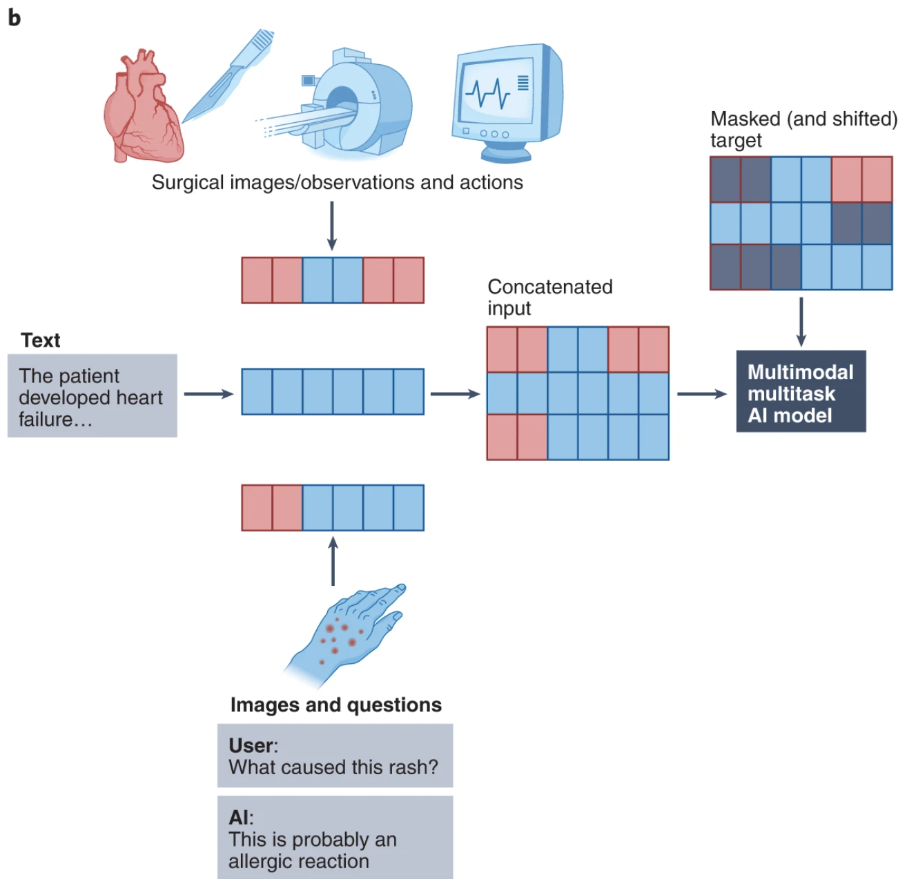

An example of how multimodality can be used in healthcare.  

多模态技术在医疗保健领域的应用实例。  

Image from Multimodal biomedical AI (Acosta et al., Nature Medicine 2022)  

图片来自多模态生物医学人工智能（Acosta 等人，《自然医学》，2022 年）

Not only that, incorporating data from other modalities can help boost model performance.  

不仅如此，结合其他模式的数据也有助于提高模型性能。  

Shouldn’t a model that can learn from both text and images perform better than a model that can learn from only text or only image?  

一个既能从文本又能从图像中学习的模型，难道不应该比一个只能从文本或图像中学习的模型表现更好吗？

Multimodal systems can provide a more flexible interface, allowing you to interact with them in whichever way works best for you at the moment.  

多模态系统可以提供更灵活的界面，让您以最适合自己的方式与系统互动。  

Imagine you can ask a question by typing, talking, or just pointing your camera at something.  

想象一下，你可以通过打字、说话或将摄像头对准某物来提问。

One use case that I’m especially excited about, is that multimodality can also enable visually impaired people to browse the Internet and also navigate the real world.  

让我感到特别兴奋的一个用例是，多模态技术还能让视障人士浏览互联网，并浏览现实世界。

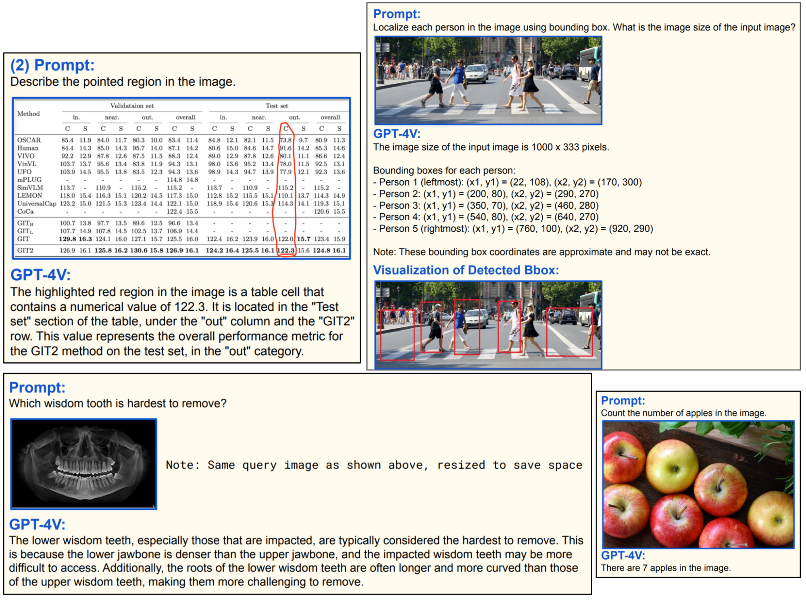

Some cool multimodal use cases from GPT-4V  

来自 GPT-4V 的一些很酷的多模式使用案例

## Data modalities  

数据模式

Different data modes are text, image, audio, tabular data, etc. One data mode can be represented or _approximated_ in another data mode. For example:  

不同的数据模式包括文本、图像、音频、表格数据等。一种数据模式可以用另一种数据模式表示或近似。例如

-   Audio can be represented as images (mel spectrograms).  
    
    音频可以用图像（梅尔频谱图）表示。
-   Speech can be transcribed into text, though its text-only representation loses information such as volume, intonation, pauses, etc.  
    
    虽然语音可以转录成文本，但只用文本表示会丢失音量、语调、停顿等信息。
-   An image can be represented as a vector, which, in turn, can be flattened and represented as a sequence of text tokens.  
    
    图像可以表示为矢量，而矢量又可以扁平化并表示为文本标记序列。
-   A video is a sequence of images plus audio.  
    
    视频是一连串图像和音频。  
    
    ML models today mostly treat videos as sequences of images.  
    
    如今的 ML 模型大多将视频视为图像序列。  
    
    This is a severe limitation, as sounds have proved to be just as important as visuals for videos. [88% of TikTok users shared that sound is essential for their TikTok experience](https://www.kantar.com/uki/inspiration/advertising-media/the-power-of-tiktok).  
    
    这是一个严重的限制，因为事实证明，声音与视频的视觉效果同样重要。88% 的 TikTok 用户认为声音对他们的 TikTok 体验至关重要。
-   A text can be represented as an image if you simply take a picture of it.  
    
    只需拍摄一张照片，文字就能以图像的形式表现出来。
-   A data table can be converted into a chart, which is an image.  
    
    数据表可以转换成图表，也就是图像。

___

**How about other data modalities?  

其他数据模式如何？**

All digital data formats can be represented using bitstrings (strings of 0 and 1) or bytestrings.  

所有数字数据格式都可以用位字符串（0 和 1 的字符串）或字节字符串来表示。  

A model that can effectively learn from bitstrings or bytestrings will be very powerful, and it can learn from any data mode.  

能够有效学习位字符串或字节字符串的模型将非常强大，它可以学习任何数据模式。  

There are other data modalities we haven’t touched on, such as graphs and 3D assets.  

我们还没有涉及其他数据模式，如图表和 3D 资产。  

We also haven’t touched on the formats used to represent smell and touch (haptics).  

我们还没有涉及用于表示嗅觉和触觉（触觉）的格式。

___

  

In ML today, audio is still largely treated as a voice-based alternative to text.  

在当今的 ML 中，音频在很大程度上仍被视为文本的语音替代品。  

The most common use cases for audio are still speech recognition (speech-to-text) and speech synthesis (text-to-speech).  

音频最常见的使用情况仍然是语音识别（语音到文本）和语音合成（文本到语音）。  

Non-speech audio use cases, e.g. music generation, are still pretty niche.  

非语音音频使用案例，如音乐生成，仍然非常小众。  

See the fake Drake & Weeknd song and [MusicGen model on HuggingFace](https://huggingface.co/spaces/facebook/MusicGen).  

在 HuggingFace 上查看假冒的 Drake & Weeknd 歌曲和 MusicGen 模型。

<iframe width="560" height="315" src="https://www.youtube.com/embed/7HZ2ie2ErFI?si=3RTESVN4kfFRw_WR" title="YouTube video player" frameborder="0" allow="accelerometer; autoplay; clipboard-write; encrypted-media; gyroscope; picture-in-picture; web-share" allowfullscreen=""></iframe>

Image is perhaps the most versatile format for model inputs, as it can be used to represent text, tabular data, audio, and to some extent, videos.  

图像可能是最通用的模型输入格式，因为它可以用来表示文本、表格数据、音频，在一定程度上还可以表示视频。  

There’s also so much more visual data than text data.  

可视化数据也比文本数据多得多。  

We have phones/webcams that constantly take pictures and videos today.  

如今，我们的手机/网络摄像头可以不断拍照和录像。

Text is a much more powerful mode for model outputs.  

文本是一种功能更强大的模型输出模式。  

A model that can generate images can only be used for image generation, whereas a model that can generate text can be used for many tasks: summarization, translation, reasoning, question answering, etc.  

能生成图像的模型只能用于生成图像，而能生成文本的模型则可用于多种任务：摘要、翻译、推理、问题解答等。

For simplicity, we’ll focus on 2 modalities: images and text.  

为简单起见，我们将重点讨论两种模式：图像和文本。  

The learnings can be somewhat generalized to other modalities.  

这些经验在某种程度上可以推广到其他模式。

## Multimodal tasks  

多模式任务

To understand multimodal systems, it’s helpful to look at the tasks they are built to solve.  

要了解多模态系统，最好先了解一下这些系统是用来解决什么任务的。  

There are many tasks and many possible ways to organize them.  

有许多任务，也有许多可能的组织方式。  

In literature, I commonly see vision-language tasks divided into two groups: **generation** and **vision-language understanding** (VLU), which is the umbrella term for all tasks that don’t require generation.  

在文献中，我通常看到的视觉语言任务分为两类：生成和视觉语言理解（VLU），后者是所有不需要生成的任务的总称。  

The line between these two groups is blurred, as being able to generate answers requires understanding too.  

这两类人之间的界限是模糊的，因为能够产生答案也需要理解。

### Generation  

一代人

For generative tasks, the output can be unimodal (e.g. text, image, 3D rendering) or multimodal.  

对于生成任务来说，输出可以是单模态的（如文本、图像、三维渲染），也可以是多模态的。  

While unimodal outputs are common today, multimodal outputs are still shaping up.  

虽然单模式输出在今天很常见，但多模式输出仍在形成之中。  

We’ll discuss multimodal outputs at the end of this post.  

我们将在本帖最后讨论多模式输出。

#### Image generation (text-to-image synthesis)  

图像生成（文本到图像的合成）

This task category is straightforward. Examples: Dall-E, Stable Diffusion, and Midjourney.  

该任务类别简单明了。例如Dall-E、Stable Diffusion 和 Midjourney。

#### Text generation  

文本生成

A common text generation task is visual question answering.  

常见的文本生成任务是视觉问题解答。  

Instead of relying only on text for the context, you can give the model both text and images.  

您可以同时为模型提供文字和图像，而不是仅仅依靠文字来提供上下文。  

Imagine you can point your camera to anything and ask questions like: “My car won’t start.  

想象一下，你可以把相机对准任何东西，然后提问，比如："我的车发动不了。  

What’s wrong with it?”, “How to make this dish?”, or “What is this meme about?”.  

有什么问题吗？"、"这道菜怎么做？"或 "这个备忘录是关于什么的？"。

Another common use case is image captioning, which can be used as part of a text-based image retrieval system.  

另一个常见用例是图像标题，它可用作基于文本的图像检索系统的一部分。  

An organization might have millions, if not billions, of images: product images, graphs, designs, team pictures, promotional materials, etc.  

一个组织可能有数百万甚至数十亿张图片：产品图片、图表、设计、团队图片、宣传材料等。  

AI can automatically generate captions and metadata for them, making it easier to find the exact images you want.  

人工智能可以为它们自动生成标题和元数据，从而更容易准确找到您想要的图片。

### Vision-language understanding  

视觉语言理解

We’ll zoom into two task types: classification and text-based image retrieval (TBIR).  

我们将深入研究两种任务类型：分类和基于文本的图像检索 (TBIR)。

#### Classification  

分类

Classification models can only generate outputs that belong to a pre-determined list of classes.  

分类模型只能生成属于预定类别列表的输出结果。  

This works when you only care about a fixed number of outcomes.  

当你只关心固定数量的结果时，这种方法就会奏效。  

For example, an OCR system only needs to predict if a visual is one of the known characters (e.g.  

例如，OCR 系统只需预测视觉效果是否为已知字符之一（如："......"）。  

a digit or a letter).  

数字或字母）。

**Side note**: An OCR system processes data at the character level.  

题外话：OCR 系统在字符级别处理数据。  

When used together with a system that can understand the broader context, it can improve use cases such as allowing you to “talk” to any textbook, contract, assembly instructions, etc.  

与能够理解更广泛背景的系统一起使用时，它可以改进使用情况，例如让您与任何教科书、合同、组装说明等 "对话"。

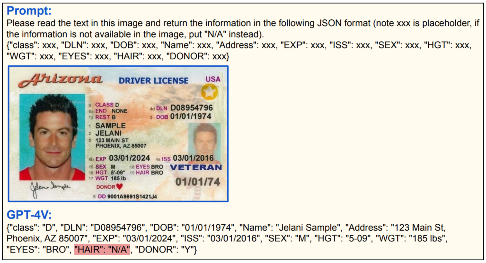

Document processing with GPT-4V. The model's mistake is highlighted in red.  

使用 GPT-4V 处理文件。模型的错误用红色标出。

One related task to classification is **image-to-text retrieval**: given an image and a pool of pre-defined texts, find the text that’s most likely to accompany the image.  

与分类相关的一项任务是图像到文本检索：给定一幅图像和一组预先定义的文本，找出最有可能与图像搭配的文本。  

This can be helpful for product image search, i.e. retrieving product reviews from a picture.  

这有助于产品图片搜索，即从图片中检索产品评论。

#### Text-based image retrieval (image search)  

基于文本的图像检索（图像搜索）

Image search matters not only for search engines but also for enterprises to be able to search through all their internal images and documents.  

图像搜索不仅对搜索引擎很重要，而且对企业来说，能够搜索所有内部图像和文件也很重要。  

Some people call text-based image retrieval “text-to-image retrieval”.  

有人将基于文本的图像检索称为 "文本到图像检索"。

There are several approaches to text-based image retrieval. Two of them are:  

基于文本的图像检索有多种方法。其中两种是

1.  Generate captions and metadata for each image, either manually or automatically (see image captioning in **Text generation**). Given a text query, find images whose captions/metadata are closest to this text query.  
    
    手动或自动为每张图片生成标题和元数据（请参阅文本生成中的图片标题）。给定文本查询，查找其标题/元数据最接近该文本查询的图片。
2.  Train a joint embedding space for both images and text.  
    
    训练图像和文本的联合嵌入空间。  
    
    Given a text query, generate an embedding for this query, and find all images whose embeddings are closest to this embedding.  
    
    给定一个文本查询，为该查询生成一个嵌入式，并找出嵌入式与该嵌入式最接近的所有图像。

The second approach is more flexible, and I believe will be more widely used.  

第二种方法更加灵活，我相信会得到更广泛的应用。  

This approach requires having a strong joint embedding space for both vision and language, like the one that OpenAI’s [CLIP](https://arxiv.org/abs/2103.00020) developed.  

这种方法要求视觉和语言都有一个强大的联合嵌入空间，就像 OpenAI 的 CLIP 所开发的那样。

## Part 2. Fundamentals of Multimodal Training  

第 2 部分.多模式培训基础

Given the existence of so many amazing multimodal systems, a challenge of writing this post is choosing which systems to focus on.  

鉴于存在如此多令人惊叹的多模态系统，撰写这篇文章的一个挑战就是选择哪些系统作为重点。  

In the end, I decided to focus on two models: [CLIP](https://arxiv.org/abs/2103.00020) (2021) and [Flamingo](https://arxiv.org/abs/2204.14198) (2022) both for their significance as well as availability and clarity of public details.  

最后，我决定把重点放在两个型号上：CLIP（2021 年）和 Flamingo（2022 年）的重要性以及公开细节的可用性和清晰度。

-   CLIP was the first model that could generalize to multiple **image classification tasks** with zero- and few-shot learning.  
    
    CLIP 是第一个可以通过零镜头和少镜头学习对多种图像分类任务进行泛化的模型。
-   Flamingo wasn’t the first large multimodal model that could **generate open-ended responses** ([Salesforce’s BLIP](https://arxiv.org/abs/2201.12086) came out 3 months prior). However, Flamingo’s strong performance prompted some to consider it [the GPT-3 moment in the multimodal domain](https://arxiv.org/abs/2304.08485).  
    
    Flamingo 并不是第一个可以生成开放式回答的大型多模态模型（Salesforce 的 BLIP 在 3 个月前问世）。然而，Flamingo 的强劲表现促使一些人将其视为多模态领域的 GPT-3 时刻。

Even though these two models are older, many techniques they use are still relevant today.  

尽管这两种模式的历史较长，但它们使用的许多技术在今天仍然适用。  

I hope they serve as the foundation to understanding newer models.  

我希望它们能作为理解更新模型的基础。  

The multimodal space is evolving repaidly, with many new ideas being developed.  

多式联运领域的发展日新月异，许多新理念不断涌现。  

We’ll go over these newer models in [Part 3](https://huyenchip.com/2023/10/10/multimodal.html#part_3_research_directions_for_lmms).  

我们将在第 3 部分介绍这些新型号。

At a high level, a multimodal system consists of the following components:  

在高层次上，多模式系统由以下部分组成：

1.  An **encoder** for each data modality to generate the embeddings for data of that modality.  
    
    每个数据模态都有一个编码器，用于生成该模态数据的嵌入。
2.  A way to **align embeddings** of different modalities into the same **multimodal embedding space**.  
    
    一种将不同模态的嵌入数据整合到同一多模态嵌入空间的方法。
3.  \[Generative models only\] A **language model to generate text responses**.  
    
    \[仅限生成模型\] 生成文本回复的语言模型。  
    
    Since inputs can contain both text and visuals, new techniques need to be developed to allow the language model to condition its responses on not just text, but also visuals.  
    
    由于输入可能同时包含文本和视觉效果，因此需要开发新的技术，使语言模型不仅能根据文本，还能根据视觉效果做出反应。

Ideally, as many of these components should be pretrained and reusable as possible.  

理想情况下，这些组件中应尽可能多地进行预培训和重复使用。

## CLIP: Contrastive Language-Image Pre-training  

CLIP：对比语言-图像预培训

CLIP’s key contribution is its ability to map data of different modalities, text and images, into a shared embedding space.  

CLIP 的主要贡献在于它能够将文本和图像等不同模式的数据映射到一个共享的嵌入空间。  

This shared multimodal embedding space makes text-to-image and image-to-text tasks so much easier.  

这种共享的多模态嵌入空间使文本到图像和图像到文本的任务变得更加容易。

Training this multimodal embedding space also produced a strong image encoder, which allows CLIP to achieve **competitive zero-shot performance on many image classification tasks**.  

对这一多模态嵌入空间的训练还产生了一个强大的图像编码器，这使得 CLIP 在许多图像分类任务中都能实现具有竞争力的零镜头性能。  

This strong image encoder can be used for many other tasks: image generation, visual question answering, and text-based image retrieval.  

这种强大的图像编码器还可用于许多其他任务：图像生成、视觉问题解答和基于文本的图像检索。  

Flamingo and LLaVa use CLIP as their image encoder. DALL-E uses CLIP to rerank generated images.  

Flamingo 和 LLaVa 使用 CLIP 作为图像编码器。DALL-E 使用 CLIP 对生成的图像进行重排。  

It’s unclear if GPT-4V uses CLIP.  

目前还不清楚 GPT-4V 是否使用 CLIP。

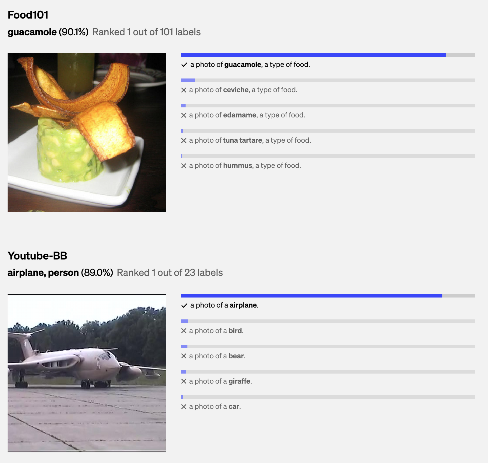

Zero-shot image classification with CLIP  

利用 CLIP 进行零镜头图像分类

CLIP leveraged **natural language supervision** and **contrastive learning**, which allowed CLIP to both scale up their data and make training more efficient.  

CLIP 利用自然语言监督和对比学习，既扩大了数据规模，又提高了训练效率。  

We’ll go over why/how these two techniques work.  

我们将详细介绍这两种技术的原因/工作原理。

### CLIP's high-level architecture  

CLIP 的高级架构

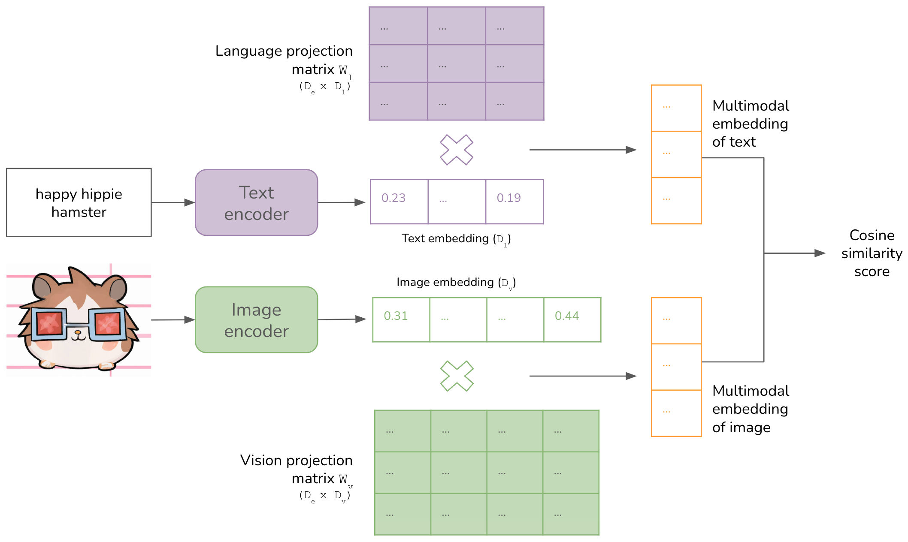

CLIP's architecture.  

CLIP 的结构。  

Both encoders and projection matrices are jointly trained together from scratch.  

编码器和投影矩阵都是从零开始联合训练的。  

The training goal is to maximize the similarity scores of the right (image, text) pairings while minimizing the similarity scores of the wrong pairings (contrastive learning).  

训练目标是最大化正确配对（图像、文本）的相似度得分，同时最小化错误配对的相似度得分（对比学习）。

For the **image encoder**, the authors experimented with both ResNet and ViT. Their best-performing model is `ViT-L/14@336px`:  

对于图像编码器，作者使用 ResNet 和 ViT 进行了实验。表现最好的模型是 `ViT-L/14@336px` ：

-   Large vision transformer (ViT-L)  
    
    大型视觉变压器 (ViT-L)
-   14 patches (each image is divided into 14 sub-images)  
    
    14 个补丁（每幅图像分为 14 个子图像）
-   on 336x336 pixel input  
    
    输入 336x336 像素时

For the **text encoder**, CLIP uses a Transformer model similar to [GPT-2](https://openai.com/research/better-language-models) but smaller. Their base model has only 63M parameters with 8 attention heads.  

在文本编码器方面，CLIP 使用与 GPT-2 类似的 Transformer 模型，但体积更小。他们的基本模型只有 6300 万个参数和 8 个注意头。  

The authors found CLIP’s performance to be less sensitive to the capacity of the text encoder.  

作者发现 CLIP 的性能对文本编码器的容量不太敏感。

Embeddings generated by the image encoder and text encoder are projected into the same embedding space using two projection matrices图像编码器和文本编码器生成的嵌入信息通过两个投影矩阵 \\(W\_v\\) 和 \\(W\_l\\) 投射到同一个嵌入空间。 and .

-   Given an image embedding给定一个图像嵌入值 \\(V\_i\\)，相应的多模态嵌入值的计算公式为\\W\_vV\_i\\). , the corresponding multimodal embedding is computed as: .
-   Given a text embedding给定一个文本嵌入（\\(L\_i\\)），相应的多模态嵌入计算如下：\\W\_lL\_i\\). , the corresponding multimodal embedding is computed as: .

When people say CLIP embeddings, they either refer to these multimodal embeddings or the embeddings generated by CLIP’s image encoder.  

当人们提到 CLIP 嵌入时，他们要么指的是这些多模态嵌入，要么指的是 CLIP 图像编码器生成的嵌入。

### Natural language supervision  

自然语言监督

For many years, image models were trained with manually annotated (image, text) datasets (e.g.  

多年来，图像模型都是通过人工标注的（图像、文本）数据集（例如，"图像模型"）进行训练的。  

ImageNet, MS COCO). This isn’t scalable. Manual annotation is time-consuming and expensive.  

ImageNet、MS COCO）。这无法扩展。人工标注费时费力。

The CLIP paper noted that none of the then-available (image, text) datasets was big and high quality enough.  

CLIP 论文指出，当时可用的（图像、文本）数据集都不够大，质量也不够高。  

They created their own dataset – 400M (image, text) pairs – as follows.  

他们创建了自己的数据集--4 亿（图像、文本）对，具体如下。

1.  Construct a list of 500,000 queries.  
    
    构建一个包含 500,000 条查询的列表。  
    
    Queries are common words, bigrams, and titles of popular Wikipedia articles.  
    
    查询的内容是维基百科热门文章的常用词、双音节词和标题。
2.  Find images matching these queries (string and substring match).  
    
    查找与这些查询匹配的图像（字符串和子串匹配）。  
    
    The paper mentioned this search did NOT happen on search engines but didn’t specify where.  
    
    论文提到这种搜索并不是在搜索引擎上进行的，但没有具体说明是在哪里进行的。  
    
    My theory is that since OpenAI already scraped the entire Internet for their GPT models, they probably just queried their internal database.  
    
    我的理论是，既然 OpenAI 已经在整个互联网上搜索了他们的 GPT 模型，那么他们可能只是查询了他们的内部数据库。
3.  Each image is paired with a text that co-occurs with it (e.g.  
    
    每幅图像都与一个共同出现的文本配对（例如  
    
    captions, comments) instead of the query since queries are too short to be descriptive.  
    
    标题、注释），而不是查询，因为查询太短，无法进行描述。

Because some queries are more popular than others, to avoid data imbalance, they used at most 20K images for a query.  

由于有些查询比其他查询更受欢迎，为避免数据不平衡，他们最多使用 20K 张图片进行查询。

### Contrastive learning  

对比学习

Pre-CLIP, most vision-language models were trained using a classifier or language model objectives.  

在 CLIP 之前，大多数视觉语言模型都是使用分类器或语言模型目标来训练的。  

Contrastive objective is a clever technique that allows CLIP to scale and generalize to multiple tasks.  

对比目标是一种巧妙的技术，它使 CLIP 能够扩展并适用于多种任务。

We’ll show why the constrastive objective works better for CLIP using an example task of image captioning: given an image, generate a text that describes it.  

我们将通过一个为图片配字幕的示例任务来说明为什么收缩目标更适合 CLIP：给定一张图片，生成一段描述该图片的文字。

#### Classifier objective  

分类器目标

A classifier predicts the correct class among a predetermined list of classes.  

分类器可从预定的类别列表中预测出正确的类别。  

This works when the output space is finite.  

当输出空间有限时，这种方法就会奏效。  

Previous models that work with (image, text) pair datasets all had this limitation.  

以前使用（图像、文本）配对数据集的模型都有这种局限性。  

For example, models working with [ILSVRC-2012](https://www.image-net.org/challenges/LSVRC/2012/) limited themselves to 1,000 classes, and [JFT-300M](https://arxiv.org/abs/1707.02968) to 18,291 classes.  

例如，使用 ILSVRC-2012 的模型仅限于 1,000 个等级，而使用 JFT-300M 的模型仅限于 18,291 个等级。

This objective limits not only the model’s capacity to output meaningful responses but also its capacity for zero-shot learning.  

这一目标不仅限制了模型输出有意义响应的能力，也限制了其零点学习的能力。  

Say, if the model was trained to predict among 10 classes, it won’t work for a task that has 100 classes.  

比方说，如果模型是为预测 10 个类别而训练的，那么它就不能用于有 100 个类别的任务。

#### Language model objective  

语言模式目标

If a classifier outputs only one class for each input, a language model outputs a sequence of classes.  

如果分类器对每个输入只输出一个类别，那么语言模型则会输出一系列类别。  

Each generated class is called a token.  

每个生成的类称为一个标记。  

Each token is from a predetermined list, the vocabulary, of the language model.  

每个标记都来自语言模型的预定列表，即词汇表。

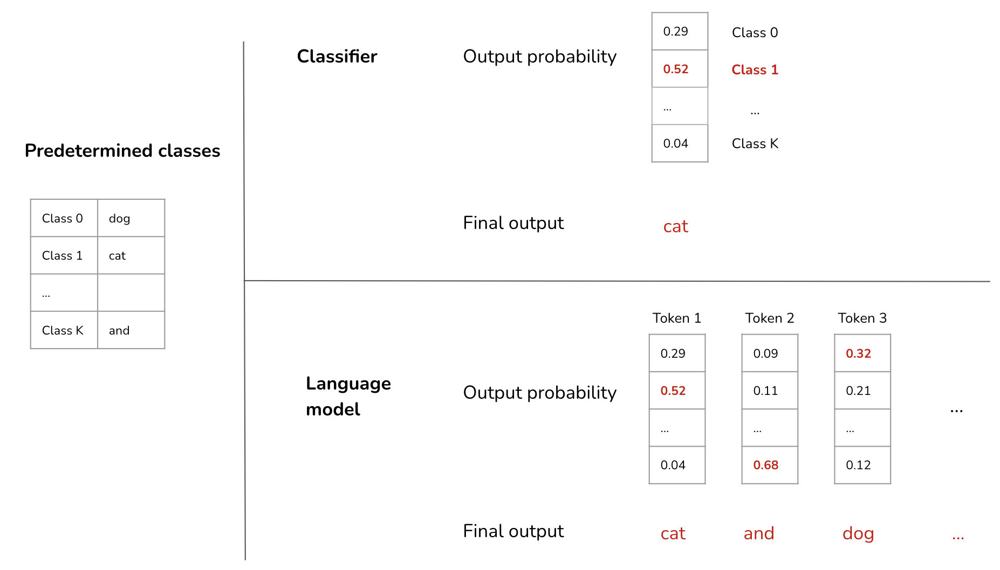

Classifier vs. language model objectives  

分类器与语言模型的目标

#### Contrastive objective  

对比目标

While the language model objective allows for vastly more flexible outputs, CLIP authors noted this objective made the training difficult.  

虽然语言模型的目标允许更灵活的输出，但 CLIP 的作者指出，这一目标给训练带来了困难。  

They hypothesized that this is because the model tries to generate _exactly_ the text accompanying each image, while many possible texts can accompany an image: alt-text, caption, comments, etc.  

他们假设，这是因为该模型试图准确生成每张图片的附带文本，而一张图片可能附带多种文本：alt-text、标题、注释等。

For example, in the [Flickr30K dataset](https://arxiv.org/abs/1509.04942), each image has 5 captions provided by human annotators, and the captions for the same image can be very different.  

例如，在 Flickr30K 数据集中，每张图片都有 5 个由人类注释者提供的标题，而同一图片的标题可能大相径庭。

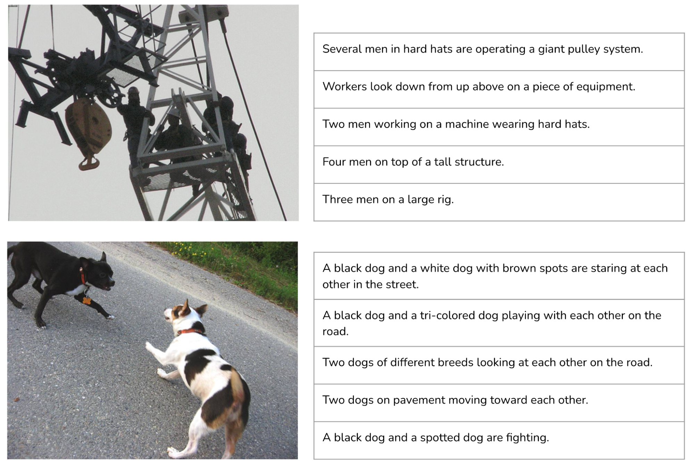

Contrastive learning is to overcome this challenge.  

对比学习就是要克服这一挑战。  

Instead of predicting the exact text of each image, CLIP was trained to predict whether a text is more likely to accompany an image than other texts.  

CLIP 不预测每张图片的确切文字，而是通过训练来预测某段文字是否比其他文字更有可能与图片一起出现。

For each batch of对于每一批 （图像、文本）对，模型会生成 N 个文本嵌入和 N 个图像嵌入。 (image, text) pairs, the model generates N text embeddings and N image embeddings.

-   Let让 \\(V\_1, V\_2, ..., V\_n\\) 成为 \\(N\\) 图像的嵌入。 be the embeddings for the images.
-   Let让 \\(L\_1, L\_2, ..., L\_n\\) 成为 \\(N\\) 文本的嵌入。 be the embeddings for the texts.

CLIP computes the cosine similarity scores of theCLIP 计算可能的 (\\(V\_i, L\_j\\))配对的余弦相似度得分。 possible () pairings.  

The model is trained to maximize the similarity scores of the训练模型的目的是最大化（N）正确配对的相似度得分，同时最小化（N^2 - N）错误配对的得分。 correct pairings while minimizing the scores of the incorrect pairings.  

For CLIP,  

对于 CLIP，（N = 32 768）。.

Another way to look at this is that each training batch of CLIP is two classification tasks.  

另一种看法是，CLIP 的每个训练批次都是两个分类任务。

1.  Each image can be paired with N possible texts, and the model tries to predict the correct one.  
    
    每张图片可以与 N 个可能的文本配对，模型会尝试预测正确的文本。  
    
    This is the same setup as image-to-text retrieval.  
    
    这与图像到文本检索的设置相同。
    
2.  Each text can be paired with N possible images, and the model tries to predict the correct image.  
    
    每个文本可与 N 幅可能的图像配对，模型会尝试预测正确的图像。  
    
    This is the same setup as text-to-image retrieval.  
    
    这与文本到图像的检索设置相同。
    

The sum of these two losses is minimized. 𝛽 is a trainable inverse temperature parameter.  

这两项损失之和最小。匡是一个可训练的反温度参数。

This is what it all looks like in pseudocode.  

这就是伪代码的全部内容。

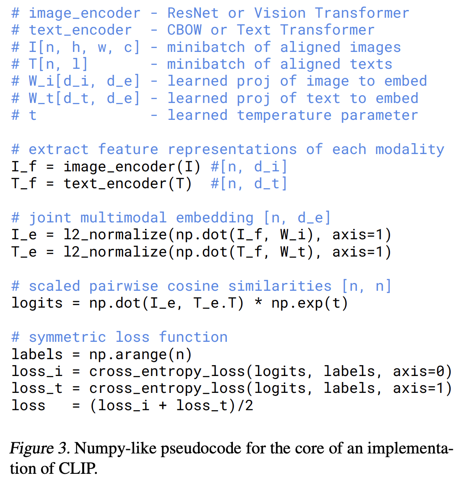

CLIP authors found that the contrastive objective provided a 12x improvement in efficiency compared to the language model objective baseline while producing higher-quality image embeddings.  

CLIP 的作者发现，与语言模型目标基线相比，对比目标的效率提高了 12 倍，同时生成的图像嵌入质量更高。

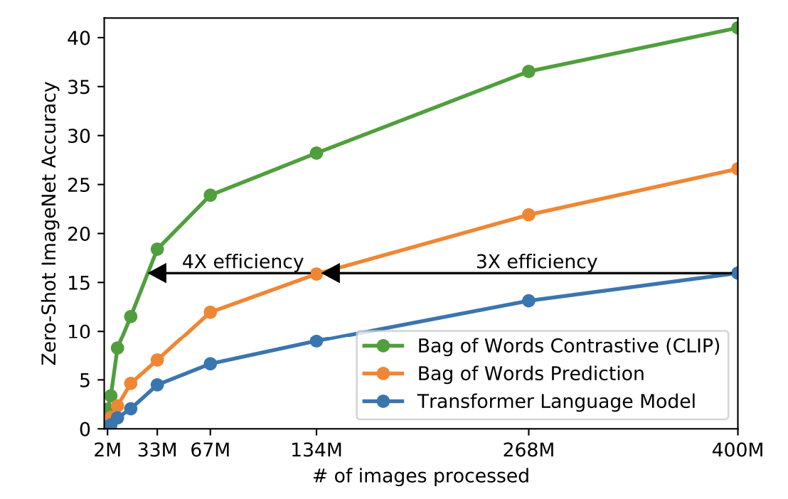

### CLIP applications  

CLIP 应用

#### Classification  

分类

Today, for many image classification tasks, CLIP is still a strong out-of-the-box baseline to be used as-is or fine-tuned.  

如今，对于许多图像分类任务来说，CLIP 仍然是一个强大的开箱即用的基准工具，既可以按原样使用，也可以进行微调。

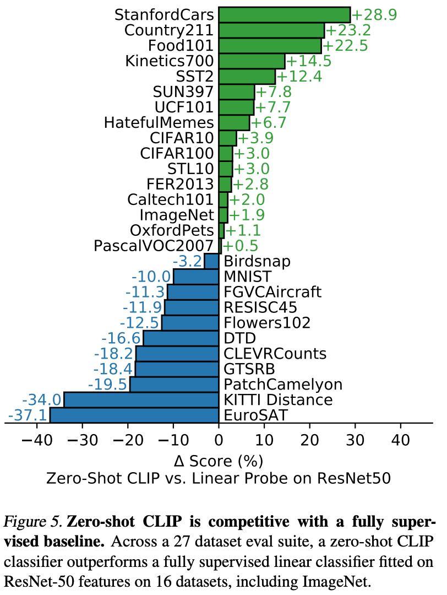

#### Text-based image retrieval  

基于文本的图像检索

Since CLIP’s training process was conceptually similar to image-to-text retrieval and text-to-image retrieval, CLIP “_displays significant promise for widely-applicable tasks like image retrieval or search_.” However, “_on image retrieval, CLIP’s performance relative to the overall state of the art is noticeably lower._”  

由于 CLIP 的训练过程在概念上类似于图像到文本检索和文本到图像检索，CLIP "在图像检索或搜索等广泛应用的任务中显示出巨大的前景"。然而，"在图像检索方面，CLIP 的性能相对于整体技术水平明显较低"。

There are attempts to use CLIP for image retrieval. For example, [clip-retrieval](https://github.com/rom1504/clip-retrieval) package works as follows:  

有人尝试使用 CLIP 进行图像检索。例如，剪辑检索软件包的工作原理如下：

1.  Generate CLIP embeddings for all your images and store them in a vector database.  
    
    为所有图像生成 CLIP 嵌入，并将其存储在矢量数据库中。
2.  For each text query, generate a CLIP embedding for this text.  
    
    对于每个文本查询，为该文本生成 CLIP 嵌入。
3.  Query in the vector database for all images whose embeddings are close to this text query embedding.  
    
    在矢量数据库中查询嵌入式与该文本查询嵌入式相近的所有图像。

#### Image generation  

图像生成

CLIP’s joint image-text embeddings are useful for image generation. Given a text prompt, [DALL-E](https://openai.com/research/dall-e) (2021) generates many different visuals and uses CLIP to rerank these visuals before showing the top visuals to users.  

CLIP 的图像-文本联合嵌入对图像生成非常有用。DALL-E (2021) 给出文本提示后，会生成许多不同的视觉效果，并使用 CLIP 对这些视觉效果进行重新排序，然后再向用户展示最佳视觉效果。

In 2022, OpenAI introduced [unCLIP](https://openai.com/research/hierarchical-text-conditional-image-generation-with-clip-latents), a text-to-image synthesis model conditioned on CLIP latents. It consists of two main components:  

2022 年，OpenAI 推出了 unCLIP，这是一个以 CLIP 潜在变量为条件的文本到图像合成模型。它由两个主要部分组成：

1.  CLIP is trained and frozen.  
    
    CLIP 已接受培训并冻结。  
    
    The pretrained CLIP model can generate embeddings for both text and images in the same embedding space.  
    
    经过预训练的 CLIP 模型可以在同一嵌入空间中生成文本和图像的嵌入。
2.  Two things happen at image generation:  
    
    图像生成时会发生两件事：
    -   Use CLIP to generate embedding for this text.  
        
        使用 CLIP 为该文本生成嵌入。
    -   Use a diffusion decoder to generate images conditioned on this embedding.  
        
        使用扩散解码器生成以这种嵌入为条件的图像。

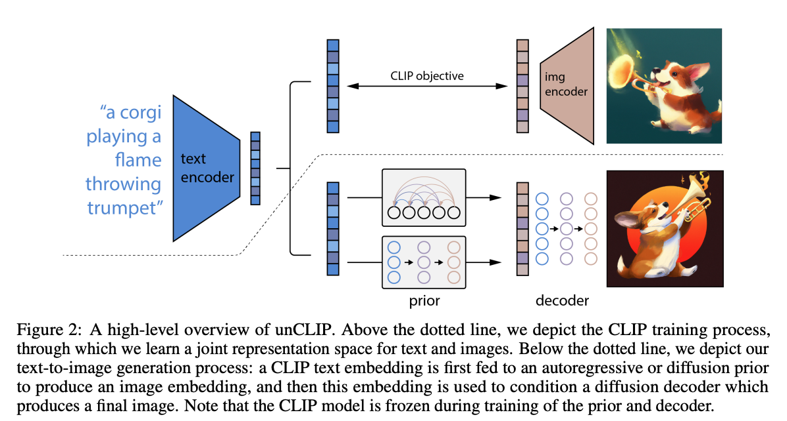

#### Text generation: visual question answering, captioning  

文本生成：视觉问题解答、字幕

CLIP authors did attempt to create a model for text generation.  

CLIP 的作者确实试图创建一个文本生成模型。  

One version they experimented with is called LM RN50. Though this model could generate text responses, its performance was consistently around 10% below CLIP’s best-performing model on all the vision-language understanding tasks that CLIP was evaluated on.  

他们试验的一个版本称为 LM RN50。虽然这个模型可以生成文本回复，但在 CLIP 评估的所有视觉语言理解任务中，它的表现始终比 CLIP 表现最好的模型低 10% 左右。

While today CLIP isn’t used directly for text generation, its image encoder is often the backbone for LMMs that can generate texts.  

虽然 CLIP 如今并不直接用于文本生成，但其图像编码器往往是可生成文本的 LMM 的支柱。

## Flamingo: the dawns of LMMs  

火烈鸟：LMM 的曙光

Unlike CLIP, Flamingo can generate text responses.  

与 CLIP 不同，Flamingo 可以生成文本回复。  

In a reductive view, Flamingo is CLIP + a language model, with added techniques to make it possible for the language model to generate text tokens conditioned on both visual and text inputs.  

从还原的角度看，Flamingo 就是 CLIP + 语言模型，并增加了一些技术，使语言模型能够根据视觉和文本输入生成文本标记。

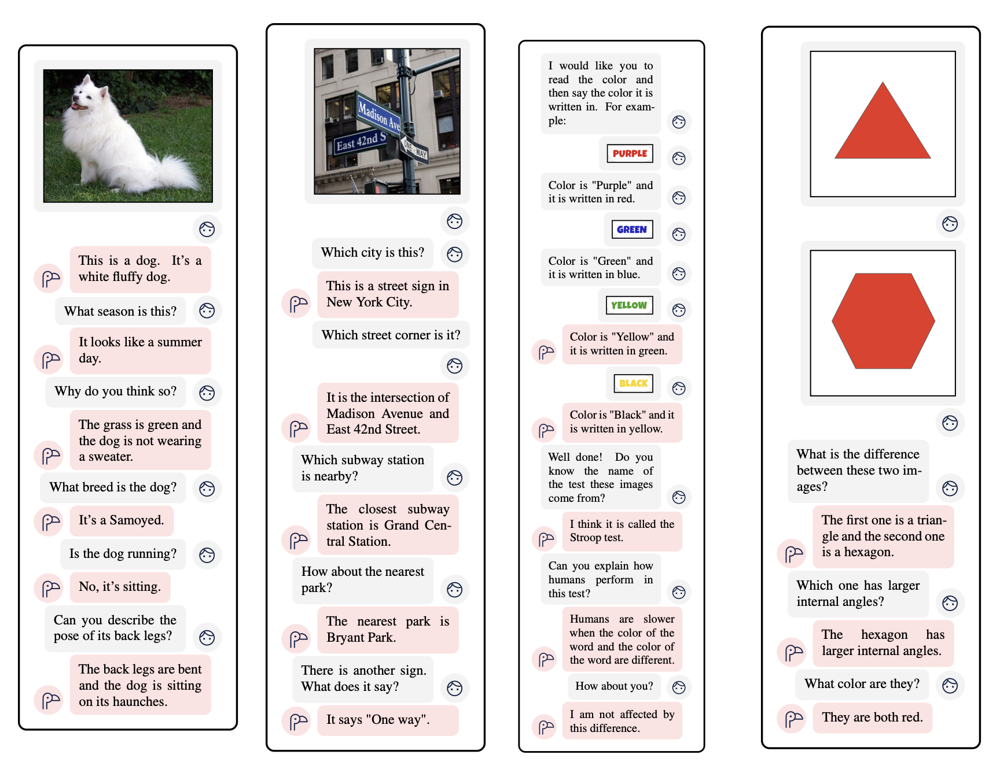

Flamingo can generate text responses conditioned on both text and images  

Flamingo 可根据文字和图像生成文字反应

### Flamingo's high-level architecture  

Flamingo 的高级架构

At a high level, Flamingo consists of 2 parts:  

在高层次上，火烈鸟由两个部分组成：

1.  **Vision encoder**: a CLIP-like model is trained using contrastive learning.  
    
    视觉编码器：利用对比学习训练类似 CLIP 的模型。  
    
    The text encoder of this model is then discarded.  
    
    然后，该模型的文本编码器将被丢弃。  
    
    The vision encoder is frozen to be used in the main model.  
    
    视觉编码器已冻结，将在主模型中使用。
2.  **Language model**: Flamingo finetunes Chinchilla to generate text tokens, conditioned on visuals and text, using language model loss, with two additional components Perceiver Resampler and GATED XATTN-DENSE layers.  
    
    语言模型：Flamingo 对 Chinchilla 进行了微调，利用语言模型损耗生成以视觉和文本为条件的文本标记，并增加了两个附加组件 Perceiver Resampler 和 GATED XATTN-DENSE 层。  
    
    We’ll discuss them later in this blog.  
    
    我们稍后将在本博客中讨论它们。

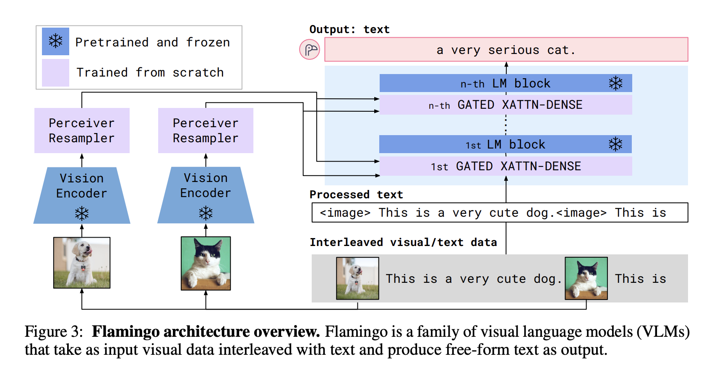

### Data  

数据

Flamingo used 4 datasets: 2 (image, text) pair datasets, 1 (video, text) pair dataset, and 1 interleaved image and text dataset.  

Flamingo 使用了 4 个数据集：2 个（图像、文本）配对数据集、1 个（视频、文本）配对数据集和 1 个交错图像和文本数据集。

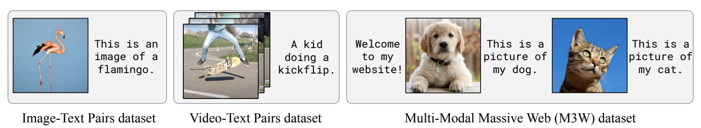

<table data-immersive-translate-effect="1" data-immersive_translate_walked="de41cc8b-cb6f-4426-9c68-52a1cc6cd3cb"><tbody data-immersive-translate-effect="1" data-immersive_translate_walked="de41cc8b-cb6f-4426-9c68-52a1cc6cd3cb"><tr data-immersive-translate-effect="1" data-immersive_translate_walked="de41cc8b-cb6f-4426-9c68-52a1cc6cd3cb"><td data-immersive-translate-effect="1" data-immersive_translate_walked="de41cc8b-cb6f-4426-9c68-52a1cc6cd3cb"><strong data-immersive-translate-effect="1" data-immersive_translate_walked="de41cc8b-cb6f-4426-9c68-52a1cc6cd3cb">Dataset 数据集</strong></td><td data-immersive-translate-effect="1" data-immersive_translate_walked="de41cc8b-cb6f-4426-9c68-52a1cc6cd3cb"><strong data-immersive-translate-effect="1" data-immersive_translate_walked="de41cc8b-cb6f-4426-9c68-52a1cc6cd3cb">Type 类型</strong></td><td data-immersive-translate-effect="1" data-immersive_translate_walked="de41cc8b-cb6f-4426-9c68-52a1cc6cd3cb"><strong data-immersive-translate-effect="1" data-immersive_translate_walked="de41cc8b-cb6f-4426-9c68-52a1cc6cd3cb">Size 尺寸</strong></td><td data-immersive-translate-effect="1" data-immersive_translate_walked="de41cc8b-cb6f-4426-9c68-52a1cc6cd3cb"><strong data-immersive-translate-effect="1" data-immersive_translate_walked="de41cc8b-cb6f-4426-9c68-52a1cc6cd3cb">How</strong></td><td data-immersive-translate-effect="1" data-immersive_translate_walked="de41cc8b-cb6f-4426-9c68-52a1cc6cd3cb"><strong data-immersive-translate-effect="1" data-immersive_translate_walked="de41cc8b-cb6f-4426-9c68-52a1cc6cd3cb">Training weight 训练重量</strong></td></tr><tr data-immersive-translate-effect="1" data-immersive_translate_walked="de41cc8b-cb6f-4426-9c68-52a1cc6cd3cb"><td data-immersive-translate-effect="1" data-immersive_translate_walked="de41cc8b-cb6f-4426-9c68-52a1cc6cd3cb">M3W</td><td data-immersive-translate-effect="1" data-immersive_translate_walked="de41cc8b-cb6f-4426-9c68-52a1cc6cd3cb">Interleaved image and text dataset 交错图像和文本数据集</td><td data-immersive-translate-effect="1" data-immersive_translate_walked="de41cc8b-cb6f-4426-9c68-52a1cc6cd3cb">43M webpages 4 300 万网页</td><td data-immersive-translate-effect="1" data-immersive_translate_walked="de41cc8b-cb6f-4426-9c68-52a1cc6cd3cb">For each webpage, they sample a random subsequence of 256 tokens and take up to the first 5 images included in the sampled sequence. 对于每个网页，他们会随机抽取 256 个标记的子序列，并取样序列中的前 5 个图像。</td><td data-immersive-translate-effect="1" data-immersive_translate_walked="de41cc8b-cb6f-4426-9c68-52a1cc6cd3cb">1.0</td></tr><tr data-immersive-translate-effect="1" data-immersive_translate_walked="de41cc8b-cb6f-4426-9c68-52a1cc6cd3cb"><td data-immersive-translate-effect="1" data-immersive_translate_walked="de41cc8b-cb6f-4426-9c68-52a1cc6cd3cb">ALIGN 对齐</td><td data-immersive-translate-effect="1" data-immersive_translate_walked="de41cc8b-cb6f-4426-9c68-52a1cc6cd3cb">(Image, text) pairs (图像、文本）对</td><td data-immersive-translate-effect="1" data-immersive_translate_walked="de41cc8b-cb6f-4426-9c68-52a1cc6cd3cb">1.8B pairs 18 亿对</td><td data-immersive-translate-effect="1" data-immersive_translate_walked="de41cc8b-cb6f-4426-9c68-52a1cc6cd3cb">Texts are alt-texts, averaging 12 tokens/text. 文本为alt-texts，平均每个文本有12个标记。</td><td data-immersive-translate-effect="1" data-immersive_translate_walked="de41cc8b-cb6f-4426-9c68-52a1cc6cd3cb">0.2</td></tr><tr data-immersive-translate-effect="1" data-immersive_translate_walked="de41cc8b-cb6f-4426-9c68-52a1cc6cd3cb"><td data-immersive-translate-effect="1" data-immersive_translate_walked="de41cc8b-cb6f-4426-9c68-52a1cc6cd3cb">LTIP</td><td data-immersive-translate-effect="1" data-immersive_translate_walked="de41cc8b-cb6f-4426-9c68-52a1cc6cd3cb">(Image, text) pairs (图像、文本）对</td><td data-immersive-translate-effect="1" data-immersive_translate_walked="de41cc8b-cb6f-4426-9c68-52a1cc6cd3cb">312M pairs 3.12 亿对</td><td data-immersive-translate-effect="1" data-immersive_translate_walked="de41cc8b-cb6f-4426-9c68-52a1cc6cd3cb">Texts are long descriptions, averaging 20.5 tokens/text. 文本是长篇描述，平均每篇文本有 20.5 个标记。</td><td data-immersive-translate-effect="1" data-immersive_translate_walked="de41cc8b-cb6f-4426-9c68-52a1cc6cd3cb">0.2</td></tr><tr data-immersive-translate-effect="1" data-immersive_translate_walked="de41cc8b-cb6f-4426-9c68-52a1cc6cd3cb"><td data-immersive-translate-effect="1" data-immersive_translate_walked="de41cc8b-cb6f-4426-9c68-52a1cc6cd3cb">VTP</td><td data-immersive-translate-effect="1" data-immersive_translate_walked="de41cc8b-cb6f-4426-9c68-52a1cc6cd3cb">(Video, text) pairs (视频、文字）对</td><td data-immersive-translate-effect="1" data-immersive_translate_walked="de41cc8b-cb6f-4426-9c68-52a1cc6cd3cb">27M short videos 2,700 万个短视频</td><td data-immersive-translate-effect="1" data-immersive_translate_walked="de41cc8b-cb6f-4426-9c68-52a1cc6cd3cb">~22 seconds/video on average 平均每段视频 ~22 秒</td><td data-immersive-translate-effect="1" data-immersive_translate_walked="de41cc8b-cb6f-4426-9c68-52a1cc6cd3cb">0.03</td></tr></tbody></table>

### Flamingo's vision encoder  

火烈鸟视觉编码器

Flamingo first trains a CLIP-like model from scratch using contrastive learning.  

Flamingo 首先利用对比学习从头开始训练一个类似 CLIP 的模型。  

This component only uses the 2 (image, text) pair datasets, ALIGN and LTIP, totaling 2.1M (image, text) pairs.  

该组件仅使用 ALIGN 和 LTIP 这两个（图像、文本）配对数据集，共计 210 万个（图像、文本）配对。  

This is 5x larger than the dataset CLIP was trained on.  

这比 CLIP 所训练的数据集大 5 倍。

-   For the text encoder, Flamingo uses BERT instead of GPT-2.  
    
    在文本编码器方面，Flamingo 使用 BERT 而不是 GPT-2。
-   For the vision encoder, Flamingo uses a NormalizerFree ResNet (NFNet) F6 model.  
    
    在视觉编码器方面，Flamingo 使用了 NormalizerFree ResNet (NFNet) F6 模型。
-   Text and vision embeddings are meanpooled before being projected to the joint embedding space.  
    
    在投射到联合嵌入空间之前，对文本和视觉嵌入进行均值池化处理。

### Flamingo's language model  

火烈鸟语言模型

Flamingo uses Chinchilla as their language model.  

Flamingo 使用 Chinchilla 作为语言模型。  

More specifically, they freeze the 9 pretrained Chinchilla LM layers.  

更具体地说，他们冻结了 9 个经过预训练的钦奇拉 LM 图层。  

A traditional language model predicts the next text token based on the preceding text tokens.  

传统的语言模型会根据前面的文本标记预测下一个文本标记。  

Flamingo predicts the next text token based on both the preceding text and visual tokens.  

Flamingo 会根据前面的文字和视觉标记预测下一个文字标记。

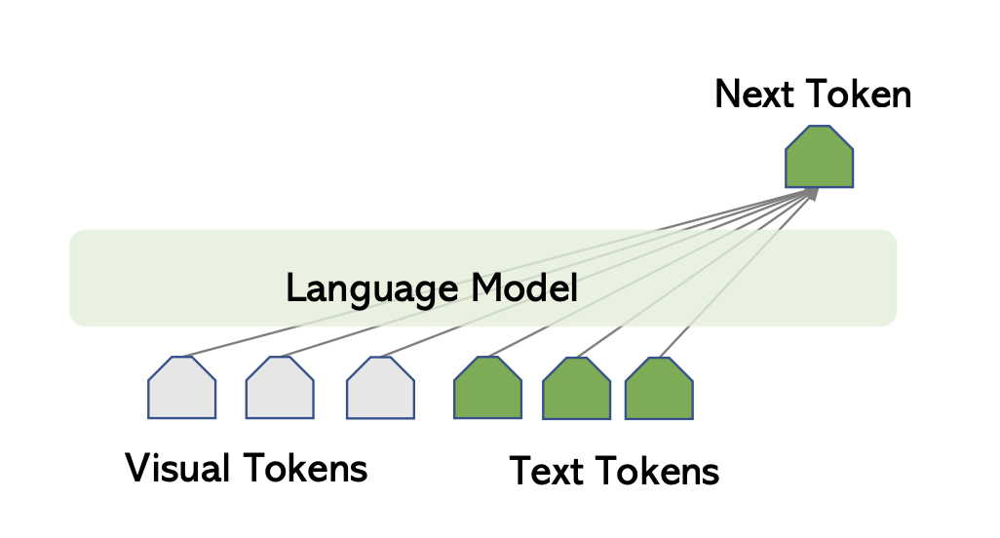

Next token generation is conditioned on both text and visual tokens.  

下一个标记的生成以文本和视觉标记为条件。  

Illustration taken from Chunyuan Li's CVPR 2023 tutorial: Large Multimodal Models.  

插图摘自李春元的 CVPR 2023 教程：大型多模态模型。

To be able to generate text conditioned on both text and visual inputs, Flamingo relied on Perceiver Resampler and GATED XATTN-DENSE layers.  

Flamingo 依靠 Perceiver Resampler 和 GATED XATTN-DENSE 层来生成以文字和视觉输入为条件的文本。

#### Perceiver Resampler  

接收器重采样器

As the visual inputs can be both images and videos, the vision encoder can produce a variable number of image or video features.  

由于视觉输入既可以是图像也可以是视频，因此视觉编码器可以生成不同数量的图像或视频特征。  

Perceiver Resampler converts these variable features into a consistent 64 visual outputs.  

Perceiver Resampler 可将这些可变特征转换为 64 种一致的视觉输出。

Interestingly enough, while training the vision encoder, the resolution used was 288 x 288. However, at this phase, visual inputs are resized to 320 × 320. It’s been shown that [a higher test-time resolution can lead to improved performance when using CNNs](https://arxiv.org/abs/1906.06423).  

有趣的是，在训练视觉编码器时，使用的分辨率是 288 x 288。然而，在这一阶段，视觉输入被调整为 320 × 320。事实证明，在使用 CNN 时，测试时间分辨率越高，性能越好。

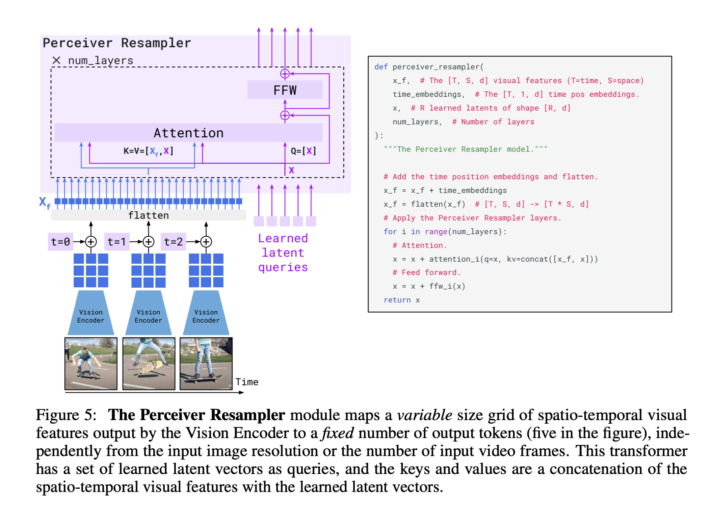

#### GATED XATTN-DENSE layers  

门控 XATTN-DENSE 层

GATED XATTN-DENSE layers are inserted between existing and frozen LM layers to allow the language model to attend more efficiently to the visual tokens when generating text tokens.  

GATED XATTN-DENSE 层被插入现有和冻结的 LM 层之间，以便语言模型在生成文本标记时更有效地关注视觉标记。  

Without these layers, Flamingo authors noted a drop of 4.2% in the overall score.  

如果没有这些层，Flamingo 作者注意到总分下降了 4.2%。

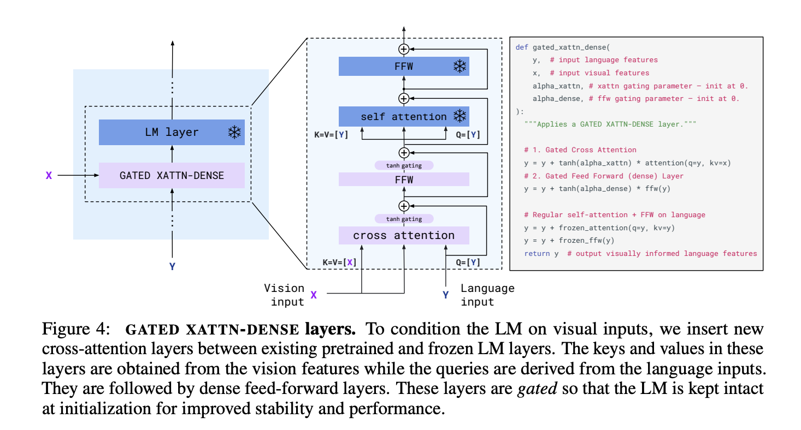

#### Loss function  

损失函数

Flamingo computes the likelihood of textFlamingo 根据交错图像和视频 \\(x\\)计算文本 \\(y\\)的可能性。 conditioned on the interleaved images and videos .

  

\\\[p(y|x)=prod\_{l=1}^N p(y\_l|y\_{<l}, x\_{\\leq l})/\]。

The training loss function was a weighted sum of expected negative log-likelihoods of generated text across all 4 datasets, with训练损失函数是所有 4 个数据集生成文本的预期负对数似然值的加权和，其中 \\(\\lambda\_m\\) 是数据集 \\(m\\) 的训练权重。 being the training weight of dataset .

  

\\\[（sum\_{m=1}^M \\lambda\_m E\_{(x, y)\\sim D\_m} \[ -\\sum\_{l=1}^L \\log p(y|x)\]\\\]\].

#### Training  

培训

While the Chinchilla LM layers are finetuned and frozen, the additional components are trained from scratch, using all 4 Flamingo datasets, with different weights. _Finding the right per-dataset weights was key to performance._ The weight for each dataset is in the **Training weight** column in the dataset table above.  

在对 Chinchilla LM 层进行微调和冻结的同时，使用全部 4 个 Flamingo 数据集，以不同的权重，从头开始训练附加组件。找到合适的数据集权重是提高性能的关键。每个数据集的权重都在上表数据集的训练权重栏中。

VTP’s weight is much smaller than other datasets (0.03 compared to 0.2 and 1), so its contribution to the training should be minimal.  

VTP 的权重比其他数据集要小得多（0.03，而 0.2 和 1），因此它对训练的贡献应该是最小的。  

However, the authors noted that removing this dataset negatively affects performance on all video tasks.  

不过，作者指出，移除该数据集会对所有视频任务的性能产生负面影响。

While Flamingo isn’t open-sourced, there are many open-source replications of Flamingo.  

虽然 Flamingo 没有开源，但有许多 Flamingo 的开源复制品。

-   [IDEFICS](https://huggingface.co/spaces/HuggingFaceM4/idefics_playground) (HuggingFace)  
    
    IDEFICS (拥抱脸)
-   [mlfoundations/open\_flamingo](https://github.com/mlfoundations/open_flamingo/issues)

## TL;DR: CLIP vs. Flamingo  

简要说明：CLIP vs. Flamingo

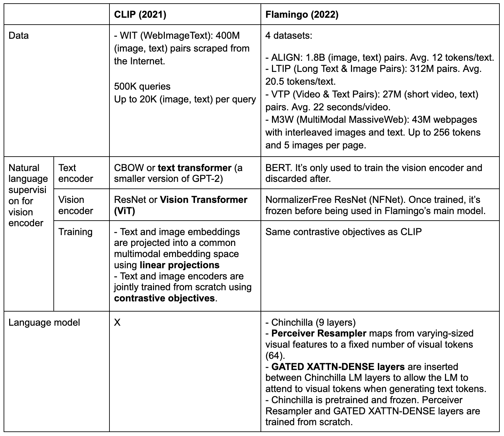

## Part 3. Research Directions for LMMs  

第 3 部分.LMM 的研究方向

CLIP is 3 years old and Flamingo is almost 2. While their architectures serve as a good foundation for us to understand how LMMs are built, there have been many new progresses in the space.  

CLIP 已有 3 年历史，Flamingo 也将近 2 年。虽然它们的架构为我们了解 LMM 的构建方式奠定了良好基础，但该领域仍取得了许多新进展。

Here are a few directions that I’m excited about.  

以下是几个让我感到兴奋的方向。  

This is far from an exhaustive list, both because this post has been long and because I’m still learning about the space too.  

这远不是一份详尽无遗的清单，因为这篇文章很长，而且我也还在了解这个空间。  

If you have any pointers or suggestions, please let me know!  

如果您有任何指点或建议，请告诉我！

## Incorporating more data modalities  

纳入更多数据模式

Today, most multimodal systems work with text and images.  

如今，大多数多模态系统都使用文本和图像。  

It’s only a matter of time before we need systems that can incorporate other modalities such as videos, music, and 3D.  

我们迟早会需要能够整合视频、音乐和 3D 等其他模式的系统。  

Wouldn’t it be amazing to have one shared embedding space for ALL data modalities?  

如果所有数据模式都有一个共享的嵌入空间，岂不妙哉？

Examples of works in this space:  

该领域的作品举例

-   [ULIP: Learning a Unified Representation of Language, Images, and Point Clouds for 3D Understanding](https://arxiv.org/abs/2212.05171) (Xue et al., Dec 2022)  
    
    ULIP：学习语言、图像和点云的统一表示，实现三维理解（Xue 等人，2022 年 12 月）
-   [ImageBind: One Embedding Space To Bind Them All](https://browse.arxiv.org/abs/2305.05665) (Girdhar et al., May 2023)  
    
    图像绑定：一个嵌入空间绑定所有图像（Girdhar 等人，2023 年 5 月）
-   Jeff Dean’s ambitious [Pathways](https://blog.google/technology/ai/introducing-pathways-next-generation-ai-architecture/) project (2021): its vision is to “_enable multimodal models that encompass vision, auditory, and language understanding simultaneously_.”  
    
    杰夫-迪恩雄心勃勃的 Pathways 项目（2021 年）：其愿景是 "实现同时包含视觉、听觉和语言理解的多模态模型"。

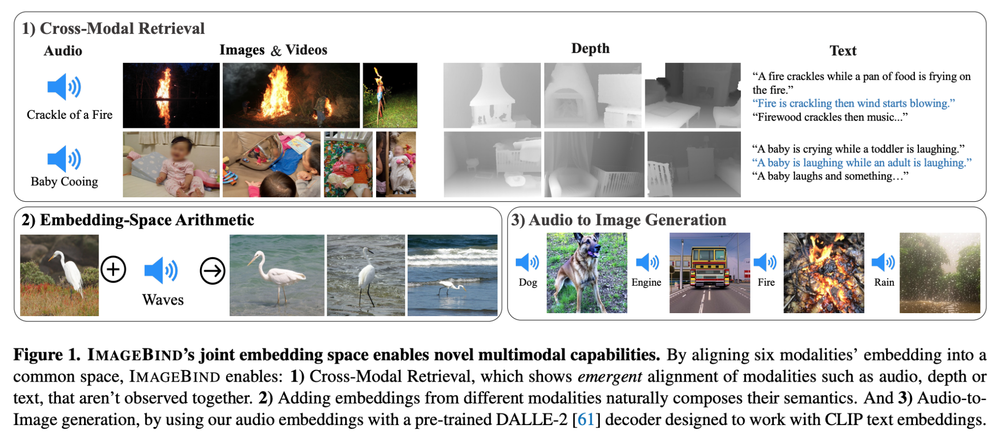

## Multimodal systems for instruction-following  

多模式教学系统

Flamingo was trained for completion, but not for dialogue or for following instructions.  

火烈鸟接受的是完成任务的训练，而不是对话或听从指令的训练。  

(If you’re not familiar with completion vs. dialogue, check out my post on [RLHF](https://huyenchip.com/2023/05/02/rlhf.html)).  

(如果您还不了解 "完成 "与 "对话"，请查看我在 RLHF 上发表的文章）。  

Many people are working on building LMMs that can follow instructions and have conversations, such as:  

许多人都在研究如何制造能够听从指令并进行对话的 LMM，例如

-   [MultiInstruct: Improving Multi-Modal Zero-Shot Learning via Instruction Tuning](https://arxiv.org/abs/2212.10773) (Xu et al., Dec 2022)  
    
    MultiInstruct：通过指令调整改进多模式零点学习（Xu 等人，2022 年 12 月）
-   [LLaVA: Visual Instruction Tuning](https://arxiv.org/abs/2304.08485) (Liu et al., Apr 28, 2023)  
    
    LLaVA：视觉指令调整（Liu 等人，2023 年 4 月 28 日）
-   [InstructBLIP: Towards General-purpose Vision-Language Models with Instruction Tuning](https://arxiv.org/abs/2305.06500) (Salesforce, May 11, 2023)  
    
    InstructBLIP：利用指令调整实现通用视觉语言模型（Salesforce，2023 年 5 月 11 日）
-   LaVIN: [Cheap and Quick: Efficient Vision-Language Instruction Tuning for Large Language Models](https://arxiv.org/abs/2305.15023) (Luo et al., May 24, 2023)  
    
    LaVIN：便宜又快速：针对大型语言模型的高效视觉语言指令调整（Luo 等人，2023 年 5 月 24 日）

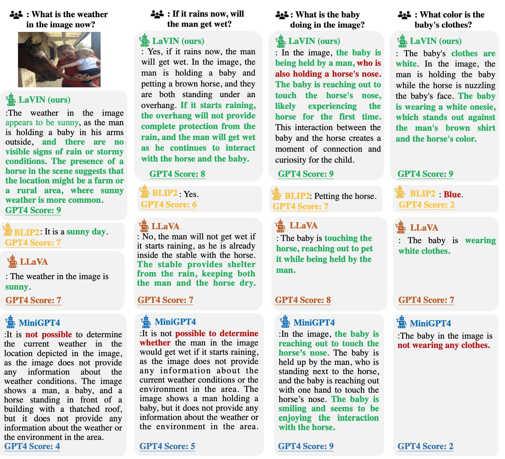

Examples of LaVIN's outputs compared to other LMMs, shown in LaVIN's paper  

LaVIN 的产出与其他 LMM 相比的例子，见 LaVIN 的论文

## Adapters for more efficient multimodal training  

更高效的多模式培训适配器

While Flamingo used 9 pretrained and frozen layers from Chinchilla, it had to pretrain its vision encoder, Perceiver Resampler, and GATED XATTN-DENSE layers from scratch.  

Flamingo 使用了 Chinchilla 的 9 个预训练和冻结层，但它必须从头开始预训练视觉编码器、感知器重采样器和 GATED XATTN-DENSE 层。  

These train-from-scratch modules could be compute-intensive.  

这些 "从零开始 "的模块可能是计算密集型的。  

Many works focus on more efficient ways to bootstrap multimodal systems using less training from scratch.  

许多研究都集中在如何更有效地引导多模态系统，减少从头开始的训练。

Some works are quite promising.  

有些作品很有希望。  

BLIP-2, for example, outperformed Flamingo-80B by 8.7% on zero-shot VQA-v2 with 54x fewer trainable parameters.  

例如，BLIP-2 在零镜头 VQA-v2 上的表现比 Flamingo-80B 高出 8.7%，而可训练参数却少了 54 倍。

Works in this space include:  

该领域的作品包括

-   [BLIP-2: Bootstrapping Language-Image Pre-training with Frozen Image Encoders and Large Language Models  
    
    BLIP-2：利用冻结图像编码器和大型语言模型引导语言图像预训练](https://arxiv.org/abs/2301.12597)
-   \[LAVIN\] [Cheap and Quick: Efficient Vision-Language Instruction Tuning for Large Language Models](https://arxiv.org/abs/2305.15023)  
    
    \[LAVIN\]便宜又快速：针对大型语言模型的高效视觉语言指令调整
-   [LLaMA-Adapter V2: Parameter-Efficient Visual Instruction Model  
    
    LLaMA-Adapter V2：参数效率可视化指令模型](https://arxiv.org/abs/2304.15010)

The two images below are from Chunyuan Li’s [Large Multimodal Models](https://datarelease.blob.core.windows.net/tutorial/vision_foundation_models_2023/slides/Chunyuan_cvpr2023_tutorial_lmm.pdf) tutorial at CVPR 2023, which is, btw, an excellent tutorial.  

下面的两张图片来自李春元在 CVPR 2023 上的大型多模态模型教程。

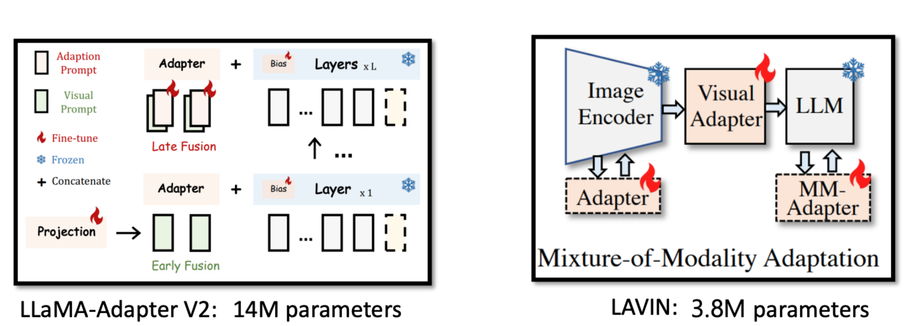

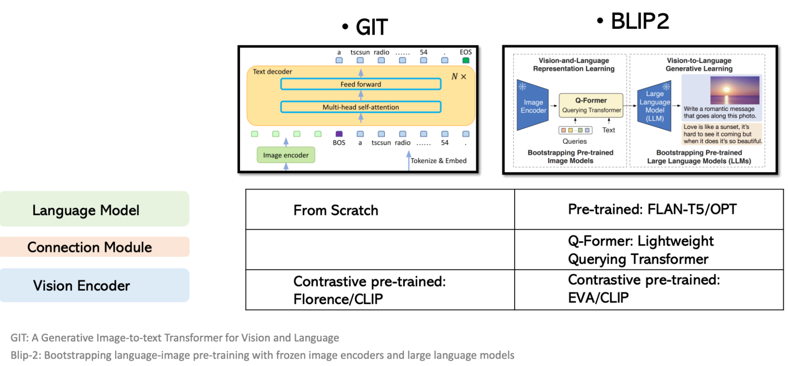

## Generating multimodal outputs  

生成多模式输出

While models that can process multimodal inputs are becoming the norm, multimodal output is still lagging.  

虽然能够处理多模态输入的模型正在成为规范，但多模态输出仍然滞后。  

Many use cases require multimodal outputs.  

许多用例需要多模式输出。  

For example, if we ask ChatGPT to explain RLHF, an effective explanation might require graphs, equations, and even simple animations.  

例如，如果我们要求 ChatGPT 解释 RLHF，有效的解释可能需要图形、方程甚至简单的动画。

To generate multimodal outputs, a model would first need to generate a shared intermediate output.  

要生成多模式输出，模型首先需要生成一个共享的中间输出。  

One key question is what the intermediate output would look like.  

一个关键问题是中间产出是什么样子的。

One option for intermediate output is text, which will then be used to generate/synthesize other actions.  

中间输出的一个选项是文本，然后将用于生成/合成其他操作。

For example, [CM3](https://arxiv.org/abs/2201.07520) (Aghajanyan et al., 2022) outputs HTML markup which can be compiled into webpages that contain not only text but also formattings, links, and images.  

例如，CM3（Aghajanyan 等人，2022 年）可输出 HTML 标记，将其编译成不仅包含文本还包含格式、链接和图像的网页。  

GPT-4V generates Latex code, which can then be reconstructed as data tables.  

GPT-4V 生成 Latex 代码，然后可将其重构为数据表。

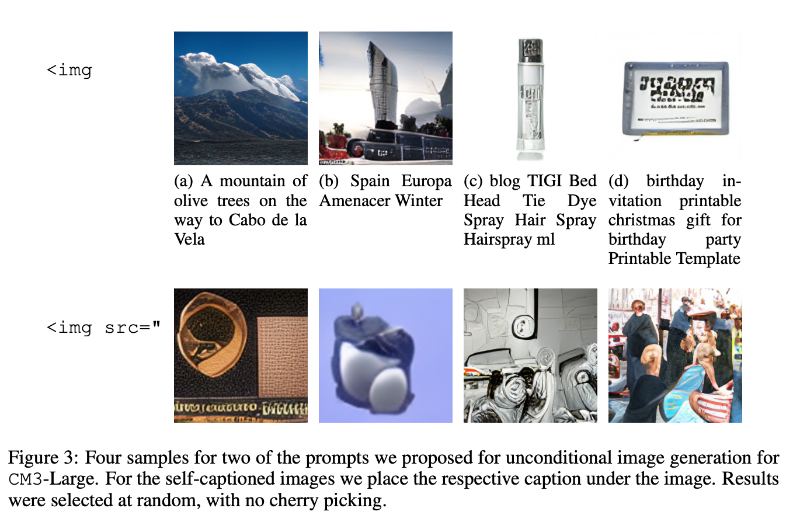

Sampled outputs from CM3  

CM3 的采样输出

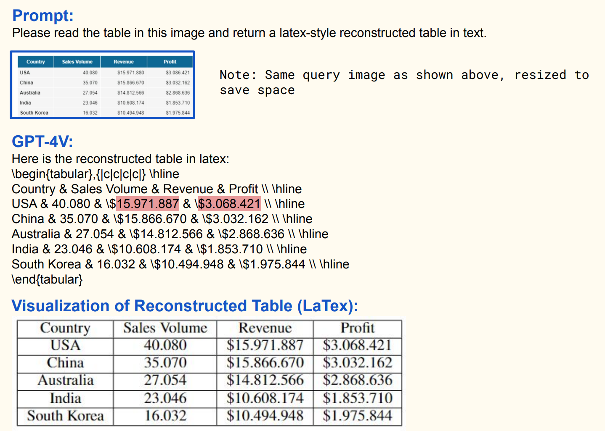

GPT-4V generates Latex code, which can then be reconstructed as a data table  

GPT-4V 生成 Latex 代码，然后可将其重构为数据表

Another option for intermediate output would be multimodal tokens. This is the option that [Caiming Xiong](https://www.linkedin.com/in/caiming-xiong-150a1417), whose team at Salesforce has done a lot of awesome work on multimodality, told me.  

中间输出的另一种选择是多模态标记。这就是熊才明告诉我的方案，他在 Salesforce 的团队在多模态方面做了很多了不起的工作。  

Each token will have a tag to denote whether it’s a text token or an image token.  

每个标记符都有一个标签，用来表示是文本标记符还是图像标记符。  

Image tokens will then be input into an image model like Diffusion to generate images.  

然后，图像标记将被输入到像 Diffusion 这样的图像模型中，以生成图像。  

Text tokens will then be input into a language model.  

然后将文本标记输入语言模型。

[Generating Images with Multimodal Language Models](https://arxiv.org/abs/2305.17216) (Koh et al., Jun 2023) is an awesome paper that shows how LMMs can generate and retrieve images together with generating texts. See below.  

利用多模态语言模型生成图像》（Koh 等人，2023 年 6 月）是一篇出色的论文，它展示了 LMM 如何在生成文本的同时生成和检索图像。请参见下文。

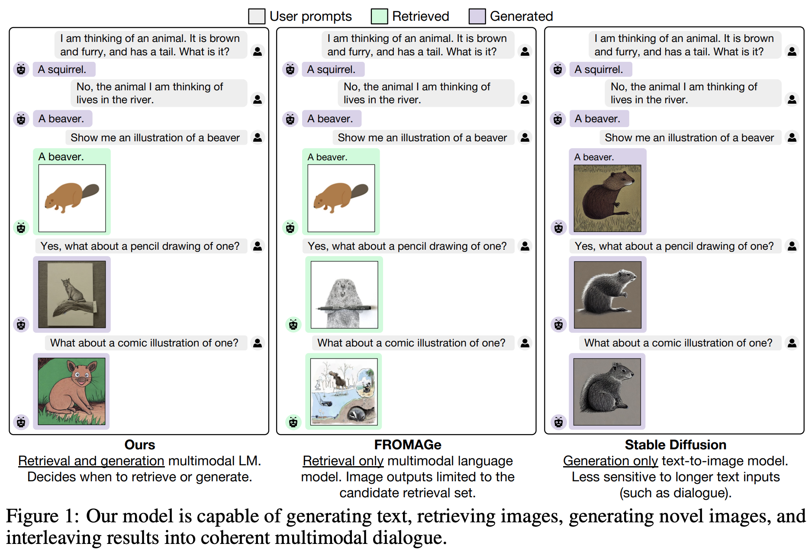

## Conclusion  

结论

It’s been a lot of fun going over so many multimodal papers as well as talking to people doing awesome work and trying to summarize the key patterns in one blog post.  

阅读这么多的多模态论文，与工作出色的人交谈，并尝试在一篇博文中总结关键模式，这真是一件非常有趣的事情。  

There’s so much about multimodality that I’m sure there are many things that I’ve missed, but I hope that this post provides the core patterns that will help you develop multimodal systems and apply them to your work.  

关于多模态的内容太多了，我肯定还有很多遗漏的地方，但我希望这篇文章提供的核心模式能帮助你开发多模态系统，并将其应用到你的工作中。

As you see in part 3 of this post, we’re still in the early days of multimodal systems (so early that a friend told me he’s not sure if the LMM abbreviation would catch on).  

正如本文第三部分所述，我们仍处于多模态系统的早期阶段（以至于一位朋友告诉我，他不确定 LMM 缩写是否会流行起来）。  

Yes, in most of my conversations, there’s little doubt that multimodal systems in general, and LMMs in particular, will be even more impactful than large language models.  

是的，在我的大多数谈话中，毫无疑问，多模态系统，尤其是 LMM，将比大型语言模型更具影响力。  

However, keep in mind that LMMs do not make LLMs obsolete.  

不过，请记住，LMM 不会使 LLM 过时。  

As LMMs extend upon LLMs, the performance of an LMM relies on the performance of its base LLM.  

由于 LMM 是在 LLM 的基础上扩展的，因此 LMM 的性能取决于其基础 LLM 的性能。  

Many labs that work on multimodal systems work on LLMs in parallel.  

许多研究多模态系统的实验室同时研究 LLM。

## Early reviewers  

早期审查员

I’d like to thank the amazing early reviewers who gave me plenty of pointers and suggestions to make this post better: [Han-chung Lee](https://www.linkedin.com/in/hanchunglee/), [Sam Reiswig](https://www.linkedin.com/in/samreiswig/), and [Luke Metz](https://twitter.com/Luke_Metz).  

我要感谢那些了不起的早期审稿人，他们给了我很多指点和建议，让这篇文章变得更好：Han-chung Lee、Sam Reiswig 和 Luke Metz。

## Resources  

资源

### Models  

机型

An incomplete list of multimodal systems by time to give you a sense of how fast the space is moving!  

按时间分列的多模式系统不完整清单，让您了解该领域的发展速度！

-   [Microsoft COCO Captions: Data Collection and Evaluation Server](https://arxiv.org/abs/1504.00325) (Apr 2015)  
    
    Microsoft COCO 字幕：数据收集和评估服务器（2015 年 4 月）
-   [VQA: Visual Question Answering](https://arxiv.org/abs/1505.00468) (May 2015)  
    
    VQA：可视化问题解答（2015 年 5 月）
-   [VideoBERT: A Joint Model for Video and Language Representation Learning](https://arxiv.org/abs/1904.01766) (Google, Apr 3, 2019)  
    
    VideoBERT：视频和语言表征学习的联合模型（谷歌，2019年4月3日）
-   [LXMERT: Learning Cross-Modality Encoder Representations from Transformers](https://arxiv.org/abs/1908.07490) (UNC Chapel Hill, Aug 20, 2019)  
    
    LXMERT：从变换器学习跨模态编码器表征（2019年8月20日，北卡罗来纳州立大学教堂山分校）
-   [\[CLIP\] Learning Transferable Visual Models From Natural Language Supervision](https://arxiv.org/abs/2103.00020) (OpenAI, 2021)  
    
    \[CLIP\] 从自然语言监督中学习可转移的视觉模型（OpenAI，2021 年）
-   [Unifying Vision-and-Language Tasks via Text Generation](https://arxiv.org/abs/2102.02779) (UNC Chapel Hill, May 2021)  
    
    通过文本生成统一视觉和语言任务（2021 年 5 月，联合国大学教堂山分校）
-   [BLIP: Bootstrapping Language-Image Pre-training for Unified Vision-Language Understanding and Generation](https://arxiv.org/abs/2201.12086) (Salesforce, Jan 28, 2022)  
    
    BLIP：引导语言图像预训练，实现统一的视觉语言理解和生成（Salesforce，2022 年 1 月 28 日）
-   [Flamingo: a Visual Language Model for Few-Shot Learning](https://arxiv.org/abs/2204.14198) (DeepMind, April 29, 2022)  
    
    火烈鸟：用于快速学习的视觉语言模型（DeepMind，2022 年 4 月 29 日）
-   [GIT: A Generative Image-to-text Transformer for Vision and Language](https://arxiv.org/abs/2205.14100) (Microsoft, May 2, 2022)  
    
    GIT：视觉和语言的图像到文本生成转换器（微软，2022 年 5 月 2 日）
-   [MultiInstruct: Improving Multi-Modal Zero-Shot Learning via Instruction Tuning](https://arxiv.org/abs/2212.10773) (Xu et al., Dec 2022)  
    
    MultiInstruct：通过指令调整改进多模式零点学习（Xu 等人，2022 年 12 月）
-   [BLIP-2: Bootstrapping Language-Image Pre-training with Frozen Image Encoders and Large Language Models](https://arxiv.org/abs/2301.12597) (Salesforce, Jan 30, 2023)  
    
    BLIP-2：利用冻结图像编码器和大型语言模型引导语言图像预训练（Salesforce，2023 年 1 月 30 日）
-   [Cross-Modal Fine-Tuning: Align then Refine](https://arxiv.org/abs/2302.05738) (Shen et al., Feb 11, 2023)  
    
    跨模式微调：先对齐再完善（Shen 等，2023 年 2 月 11 日）
-   [KOSMOS-1: Language Is Not All You Need: Aligning Perception with Language Models](https://arxiv.org/abs/2302.14045) (Microsoft, Feb 27, 2023)  
    
    KOSMOS-1：语言并非你所需要的全部：将感知与语言模型相结合（微软，2023 年 2 月 27 日）
-   [PaLM-E: An Embodied Multimodal Language Model](https://arxiv.org/abs/2303.03378) (Google, Mar 10, 2023)  
    
    PaLM-E：嵌入式多模态语言模型（谷歌，2023 年 3 月 10 日）
-   [LLaMA-Adapter: Efficient Fine-tuning of Language Models with Zero-init Attention](https://arxiv.org/abs/2303.16199) (Zhang et al., Mar 28, 2023)  
    
    LLaMA-Adapter：利用零初始注意高效微调语言模型（Zhang 等人，2023 年 3 月 28 日）
-   [mPLUG-Owl: Modularization Empowers Large Language Models with Multimodality](https://arxiv.org/abs/2304.14178) (Ye et al., Apr 2, 2023)  
    
    mPLUG-Owl：模块化赋予大型语言模型以多模态性（Ye 等人，2023 年 4 月 2 日）
-   [LLaMA-Adapter V2: Parameter-Efficient Visual Instruction Model](https://arxiv.org/abs/2304.15010) (Gao et al., Apr 28, 2023)  
    
    LLaMA-Adapter V2：参数效率可视化指令模型（Gao 等人，2023 年 4 月 28 日）
-   [LLaVA: Visual Instruction Tuning](https://arxiv.org/abs/2304.08485) (Liu et al., Apr 28, 2023)  
    
    LLaVA：视觉指令调整（Liu 等人，2023 年 4 月 28 日）
-   [InstructBLIP: Towards General-purpose Vision-Language Models with Instruction Tuning](https://arxiv.org/abs/2305.06500) (Salesforce, May 11, 2023)  
    
    InstructBLIP：利用指令调整实现通用视觉语言模型（Salesforce，2023 年 5 月 11 日）
-   [Towards Expert-Level Medical Question Answering with Large Language Models](https://arxiv.org/abs/2305.09617) (Singhal et al., May 16, 2023)  
    
    利用大型语言模型实现专家级医学问题解答（Singhal 等人，2023 年 5 月 16 日）
-   [Cheap and Quick: Efficient Vision-Language Instruction Tuning for Large Language Models](https://arxiv.org/abs/2305.15023) (Luo et al., May 24, 2023)  
    
    便宜又快速：针对大型语言模型的高效视觉语言指令调整（Luo 等人，2023 年 5 月 24 日）
-   [Shikra: Unleashing Multimodal LLM’s Referential Dialogue Magic](https://arxiv.org/abs/2306.15195) (SenseTime, Jun 3, 2023)  
    
    Shikra：释放多模态 LLM 的参考对话魔力（SenseTime，2023 年 6 月 3 日）
-   [Macaw-LLM: Multi-Modal Language Modeling with Image, Audio, Video, and Text Integration](https://arxiv.org/abs/2306.09093) (Tencent, Jun 15, 2023)  
    
    Macaw-LLM：整合图像、音频、视频和文本的多模态语言建模（腾讯，2023 年 6 月 15 日）

### Other resources  

其他资源

-   \[CVPR2023 Tutorial Talk\] [Large Multimodal Models: Towards Building and Surpassing Multimodal GPT-4](https://www.youtube.com/watch?v=mkI7EPD1vp8)  
    
    \[CVPR2023教程讲座\]大型多模态模型：构建和超越多模态 GPT-4
    -   Slides: [Large Multimodal Models](https://datarelease.blob.core.windows.net/tutorial/vision_foundation_models_2023/slides/Chunyuan_cvpr2023_tutorial_lmm.pdf)  
        
        幻灯片大型多模态模型
-   \[CMU course\] [11-777 MMML](https://cmu-multicomp-lab.github.io/mmml-course/fall2022/)  
    
    \[CMU课程\] 11-777 MMML
-   \[Open source\] [Salesforce’s LAVIS](https://github.com/salesforce/LAVIS)  
    
    \[开源\] Salesforce 的 LAVIS
