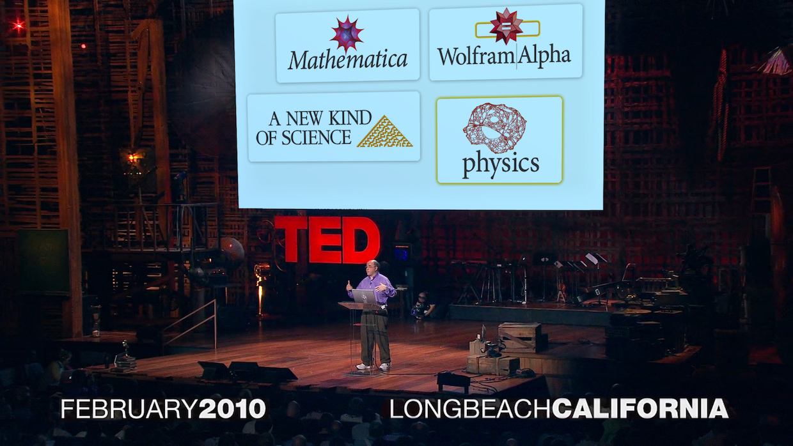
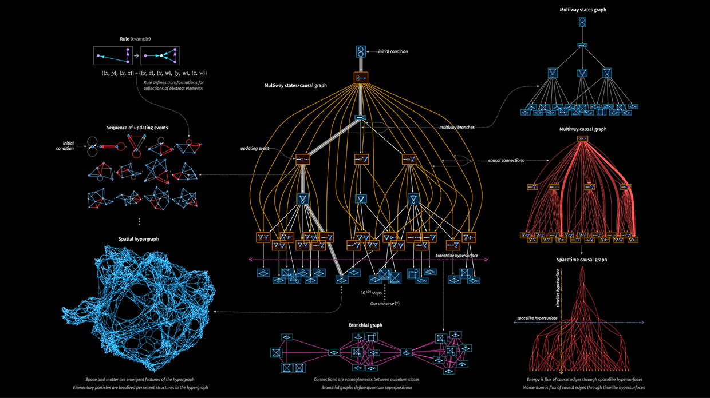
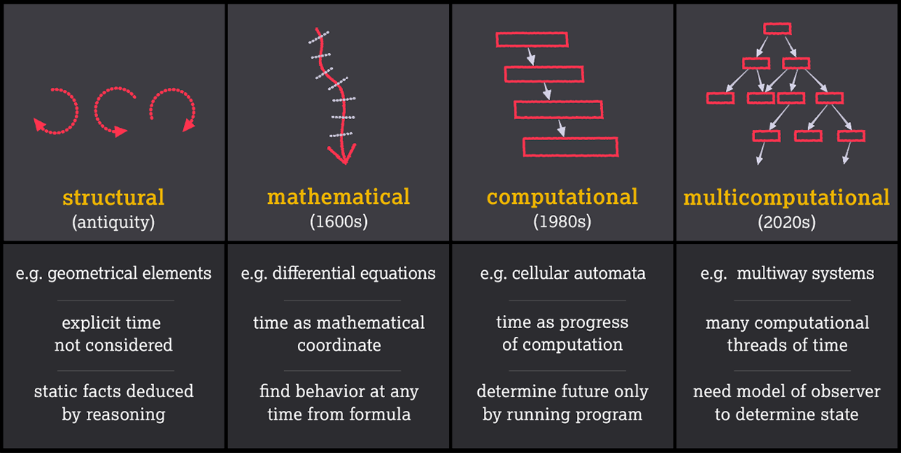

_Transcript of a talk at TED AI on October 17, 2023, in San Francisco  

2023 年 10 月 17 日在旧金山 TED AI 大会上的演讲实录_

Human language. Mathematics. Logic. These are all ways to formalize the world.  

人类语言。数学逻辑学这些都是将世界形式化的方法。  

And in our century there’s a new and yet more powerful one: computation.  

而在我们这个世纪，出现了一种新的、更强大的方式：计算。

And for nearly 50 years I’ve had the great privilege of building an ever [taller tower of science and technology](https://www.stephenwolfram.com/) based on that idea of computation. And today I want to tell you some of what that’s led to.  

近50年来，我有幸在计算理念的基础上建造了一座越来越高的科技之塔。今天，我想告诉大家一些我的研究成果。

There’s a lot to talk about—so I’m going to go quickly… sometimes with just a sentence summarizing what I’ve written [a whole book about](https://www.wolfram-media.com/products/).  

要讲的东西很多，所以我会讲得很快......有时只用一句话就能概括我写了一整本书的内容。

You know, [I last gave a TED talk thirteen years ago](https://www.ted.com/talks/stephen_wolfram_computing_a_theory_of_all_knowledge?language=en)—in February 2010—soon after [Wolfram|Alpha](https://www.wolframalpha.com/) launched.  

要知道，我上一次发表 TED 演讲还是 13 年前，即 2010 年 2 月，当时 Wolfram|Alpha 刚刚推出不久。

And I ended that talk with a question: is computation ultimately what’s underneath everything in our universe?  

在演讲结束时，我提出了一个问题：我们宇宙中的万事万物最终都是由计算支撑的吗？

I gave myself a decade to find out. And actually it could have needed a century.  

我给了自己十年的时间去寻找答案。实际上，这可能需要一个世纪。  

But in April 2020—just after the decade mark—we were [thrilled to be able to announce](https://writings.stephenwolfram.com/2020/04/finally-we-may-have-a-path-to-the-fundamental-theory-of-physics-and-its-beautiful/) what seems to be the [ultimate “machine code” of the universe](https://www.wolframphysics.org/).  

但在 2020 年 4 月--就在十年大关之后--我们兴奋地宣布，这似乎就是宇宙的终极 "机器码"。

And, yes, it’s computational.  

没错，这是计算。  

So computation isn’t just a possible formalization; it’s the ultimate one for our universe.  

因此，计算不仅仅是一种可能的形式化，它还是我们宇宙的终极形式化。

It all starts from the idea that [space—like matter—is made of discrete elements](https://writings.stephenwolfram.com/2020/04/finally-we-may-have-a-path-to-the-fundamental-theory-of-physics-and-its-beautiful/#what-is-space).  

这一切都源于这样一个想法：空间与物质一样，都是由离散的元素构成的。  

And that the structure of space and everything in it is just defined by the network of relations between these elements—that we might call atoms of space.  

而空间结构和其中的万事万物正是由这些元素--我们可以称之为空间原子--之间的关系网络所定义的。  

It’s very elegant—but deeply abstract.  

这非常优雅，但也非常抽象。

But here’s a humanized representation:  

但这里有一个人性化的表述：

<iframe src="https://player.vimeo.com/video/878695933?h=0202603bb8" width="620" height="" frameborder="0" scrolling="no" allowfullscreen=""></iframe>

A version of the very beginning of the universe.  

宇宙诞生之初的一个版本。  

And what we’re seeing here is the emergence of space and everything in it by the successive application of very simple computational rules.  

我们在这里看到的是通过连续应用非常简单的计算规则而产生的空间和其中的一切。  

And, remember, those dots are not atoms in any existing space. They’re atoms _of_ space—that are getting put together to _make_ space. And, yes, if we kept going long enough, we could build our whole universe this way.  

记住，这些点并不是任何现存空间中的原子。它们是空间的原子，它们被组合在一起形成了空间。是的，如果我们持续足够长的时间，我们就可以用这种方式构建整个宇宙。

Eons later here’s a chunk of space with two [little black holes](https://arxiv.org/abs/2303.07282), that eventually merge, radiating ripples of gravitational radiation:  

数亿年后，这里有一大块空间，其中有两个小黑洞，它们最终合并在一起，散发出引力辐射的涟漪：

<iframe src="https://player.vimeo.com/video/878696037?h=91fb6e5261" width="620" height="" frameborder="0" scrolling="no" allowfullscreen=""></iframe>

And remember—all this is built from pure computation.  

记住，这一切都建立在纯粹的计算之上。  

But like fluid mechanics emerging from molecules, what emerges here is spacetime—and Einstein’s equations for gravity.  

但就像从分子中产生流体力学一样，这里产生的是时空和爱因斯坦的引力方程。  

Though there are deviations that we just might be able to detect. Like that the [dimensionality of space won’t always be precisely 3](https://writings.stephenwolfram.com/2020/04/finally-we-may-have-a-path-to-the-fundamental-theory-of-physics-and-its-beautiful/#the-dimensionality-of-space).  

尽管其中存在一些偏差，但我们或许能够探测到。比如空间维度并不总是精确的三维。

And there’s something else.  

还有一点  

Our computational rules can inevitably be applied in many ways, each defining a different thread of time—a different path of history—that can branch and merge:  

我们的计算规则不可避免地会以多种方式应用，每种方式都定义了不同的时间线--不同的历史路径--可以分支和合并：

<iframe src="https://player.vimeo.com/video/878696367?h=dc1d3ca2fb" width="620" height="" frameborder="0" scrolling="no" allowfullscreen=""></iframe>

But as observers embedded in this universe, we’re branching and merging too. And it turns out that [quantum mechanics emerges](https://writings.stephenwolfram.com/2020/04/finally-we-may-have-a-path-to-the-fundamental-theory-of-physics-and-its-beautiful/#the-inevitability-of-quantum-mechanics) as the story of how branching minds perceive a branching universe.  

但作为嵌入这个宇宙的观察者，我们也在分支和合并。事实证明，量子力学的出现就是分支思维如何感知分支宇宙的故事。

The little pink lines here show the structure of what we call [branchial space](https://www.wolframphysics.org/technical-introduction/the-updating-process-for-string-substitution-systems/the-concept-of-branchial-graphs/)—the space of quantum branches.  

这里的粉色小线显示了我们所说的分支空间的结构--量子分支空间。  

And one of the stunningly beautiful things—at least for a physicist like me—is that the same phenomenon that in [physical space gives us gravity, in branchial space gives us quantum mechanics](https://writings.stephenwolfram.com/2020/04/finally-we-may-have-a-path-to-the-fundamental-theory-of-physics-and-its-beautiful/#general-relativity-and-quantum-mechanics-are-the-same-idea).  

其中一个令人惊叹的美妙之处--至少对我这样的物理学家来说--就是在物理空间中产生万有引力的现象，在分支空间中也产生了量子力学。

In the history of science so far, I think we can [identify four broad paradigms for making models of the world](https://writings.stephenwolfram.com/2021/09/multicomputation-a-fourth-paradigm-for-theoretical-science/)—that can be distinguished by how they deal with time.  

在迄今为止的科学史中，我认为我们可以找出四大范式来建立世界模型--它们可以通过如何处理时间来区分。

In antiquity—and in plenty of areas of science even today—it’s all about “what things are made of”, and time doesn’t really enter.  

在古代--甚至在今天的许多科学领域--一切都只关乎 "事物是由什么构成的"，时间并没有真正进入其中。  

But in the 1600s came the idea of modeling things with mathematical formulas—in which time enters, but basically just as a coordinate value.  

但在 1600 年代，出现了用数学公式建模的想法--时间进入了数学公式，但基本上只是作为一个坐标值。

Then in the 1980s—and this is something in which [I was deeply involved](https://writings.stephenwolfram.com/2021/09/charting-a-course-for-complexity-metamodeling-ruliology-and-more/)—came the [idea of making models by starting with simple computational rules](https://www.wolframscience.com/nksonline/toc.html) and then just letting them run:  

到了 20 世纪 80 年代--这也是我深入参与的领域--出现了通过简单的计算规则来制作模型，然后让它们运行的想法：

<iframe src="https://player.vimeo.com/video/878696414?h=b8bf5c5e8" width="620" height="" frameborder="0" scrolling="no" allowfullscreen=""></iframe>

Can one predict what will happen? No, there’s what I call [computational irreducibility](https://www.wolframscience.com/nks/chap-12--the-principle-of-computational-equivalence#sect-12-6--computational-irreducibility): in effect the passage of time corresponds to an irreducible computation that we have to run to know how it will turn out.  

我们能预测会发生什么吗？不，我称之为计算的不可还原性：实际上，时间的流逝对应于一种不可还原的计算，我们必须运行这种计算才能知道结果如何。

But now there’s something even more: in our [Physics Project](https://www.wolframphysics.org/) things become [multicomputational](https://writings.stephenwolfram.com/2021/09/multicomputation-a-fourth-paradigm-for-theoretical-science/), with many threads of time, that can only be knitted together by an observer.  

但现在有了更多的东西：在我们的物理项目中，事物变得多计算，有许多时间线，只有观察者才能把它们编织在一起。

It’s a new paradigm—that actually seems to unlock things not only in fundamental physics, but also in the [foundations of mathematics](https://www.wolframscience.com/metamathematics/) and [computer science](https://writings.stephenwolfram.com/2023/09/expression-evaluation-and-fundamental-physics/), and possibly in areas like [biology](https://writings.stephenwolfram.com/2021/09/multicomputation-a-fourth-paradigm-for-theoretical-science/#chemistry-molecular-biology) and [economics](https://writings.stephenwolfram.com/2021/09/multicomputation-a-fourth-paradigm-for-theoretical-science/#economics) too.  

这是一种新的范式--它似乎不仅能解开基础物理学的谜团，还能解开数学和计算机科学的谜团，甚至可能解开生物学和经济学等领域的谜团。

You know, I talked about building up the universe by repeatedly applying a computational rule.  

你知道，我谈到过通过重复应用一种计算规则来构建宇宙。  

But how is that rule picked? Well, actually, it isn’t. Because all possible rules are used.  

但这个规则是如何选出来的呢？其实不是这样的。因为所有可能的规则都会被用到。  

And we’re building up [what I call the ruliad](https://writings.stephenwolfram.com/2021/11/the-concept-of-the-ruliad/): the deeply abstract but unique object that is the entangled limit of all possible computational processes.  

我们正在构建我所说的 "规则"：一个深刻抽象但又独一无二的物体，它是所有可能的计算过程的纠缠极限。  

Here’s a tiny fragment of it shown [in terms of Turing machines](https://www.wolframphysics.org/bulletins/2020/06/exploring-rulial-space-the-case-of-turing-machines/):  

下面是用图灵机展示的一个小片段：

<iframe src="https://player.vimeo.com/video/878696490?h=288b83f7ab" width="620" height="" frameborder="0" scrolling="no" allowfullscreen=""></iframe>

OK, so the ruliad is everything. And [we as observers are necessarily part of it](https://writings.stephenwolfram.com/2021/11/the-concept-of-the-ruliad/#observers-like-us). In the ruliad as a whole, everything computationally possible can happen.  

好吧，那么，Ruleiad 就是一切。而我们作为观察者，必然是其中的一部分。在这个整体中，一切计算上可能发生的事情都可能发生。  

But observers like us can just sample specific slices of the ruliad.  

但像我们这样的观察者，只能对整个宇宙的特定片段进行采样。

And there are two crucial facts about us. First, we’re computationally bounded—our minds are limited.  

关于我们，有两个至关重要的事实。首先，我们在计算上是受限的--我们的思维是有限的。  

And second, we believe we’re persistent in time—even though we’re made of different atoms of space at every moment.  

其次，我们相信自己在时间上是永恒的--尽管我们每时每刻都是由不同的空间原子构成的。

So then here’s the big result. What [observers with those characteristics perceive](https://writings.stephenwolfram.com/2021/03/what-is-consciousness-some-new-perspectives-from-our-physics-project/) in the ruliad necessarily follows certain laws.  

因此，这就是最重要的结果。具有这些特征的观察者在鲁里亚德感知到的事物必然遵循某些规律。  

And those laws turn out to be precisely the three key theories of 20th-century physics: general relativity, quantum mechanics, and statistical mechanics and the [Second Law](https://writings.stephenwolfram.com/2023/02/computational-foundations-for-the-second-law-of-thermodynamics/).  

而这些定律正是 20 世纪物理学的三大关键理论：广义相对论、量子力学、统计力学和第二定律。

It’s because we’re observers like us that we perceive the laws of physics we do.  

正是因为我们是和我们一样的观察者，所以我们才能感知到我们所感知到的物理定律。

We can think of [different minds as being at different places in rulial space](https://writings.stephenwolfram.com/2021/11/the-concept-of-the-ruliad/#alien-views-of-the-ruliad). Human minds who think alike are nearby. Animals further away. And further out we get to [alien minds](https://writings.stephenwolfram.com/2022/06/alien-intelligence-and-the-concept-of-technology/) where it’s hard to make a translation.  

我们可以把不同的思维想象成处于尺度空间的不同位置。思维相同的人类思维在附近动物在更远的地方。而更远的地方则是外星思维，很难进行翻译。

How can we get intuition for all this?  

我们怎样才能获得这一切的直觉呢？  

We can use generative AI to take what amounts to an incredibly tiny slice of the ruliad—aligned with images we humans have produced.  

我们可以使用生成式人工智能，从我们人类生成的图像中提取一个极小的片段。

We can think of this as a place in the ruliad described using [the concept of a cat in a party hat](https://writings.stephenwolfram.com/2023/07/generative-ai-space-and-the-mental-imagery-of-alien-minds/):  

我们可以把它看作是用 "戴着派对帽的猫 "这一概念描述的《古兰经》中的一个地方：

<iframe src="https://player.vimeo.com/video/878696513?h=0e16c7b964" width="620" height="" frameborder="0" scrolling="no" allowfullscreen=""></iframe>

Zooming out, we see what we might call “cat island”. But pretty soon we’re in [interconcept space](https://writings.stephenwolfram.com/2023/07/generative-ai-space-and-/%20the-mental-imagery-of-alien-minds/#the-notion-of-interconcept-space). Occasionally things will look familiar, but mostly we’ll see things we humans don’t have words for.  

放大后，我们会看到一个我们称之为 "猫岛 "的地方。但很快我们就进入了概念间空间。偶尔我们会看到熟悉的事物，但大多数情况下，我们会看到人类无法用语言描述的事物。  

In physical space we explore more of the universe by sending out spacecraft.  

在物理空间，我们通过发射宇宙飞船探索更多的宇宙。  

In rulial space we explore more by expanding our concepts and our paradigms.  

在规则空间，我们通过扩展我们的概念和范式来探索更多。

We can get a sense of what’s out there by sampling possible rules—doing what I call [ruliology](https://writings.stephenwolfram.com/2021/09/charting-a-course-for-/%20complexity-metamodeling-ruliology-and-more/#the-pure-basic-science-of-\%20ruliology):  

我们可以通过对可能的规则进行取样--也就是我所说的 "规则学"--来了解外面的世界：

<iframe src="https://player.vimeo.com/video/878696601?h=cf94415092" width="620" height="" frameborder="0" scrolling="no" allowfullscreen=""></iframe>

Even with [incredibly simple rules there’s incredible richness](https://www.wolframscience.com/nks/chap-2--the-crucial-experiment/).  

即使是非常简单的规则，也有惊人的丰富性。  

But the issue is that most of it doesn’t yet connect with things we humans understand or care about.  

但问题是，大部分规则都与我们人类理解或关心的事物无关。  

It’s like when we look at the natural world and only gradually realize we can use features of it for technology.  

就像我们在观察自然界时，才逐渐意识到我们可以利用自然界的特征来发展科技。  

Even after everything our civilization has achieved, we’re just at the very, very beginning of exploring rulial space.  

即使在我们的文明取得了一切成就之后，我们也只是刚刚开始探索统治空间。

But what about AIs?  

那么人工智能呢？  

Just like we can do ruliology, AIs can in principle go out and explore rulial space.  

就像我们可以进行规则学研究一样，人工智能原则上也可以去探索规则空间。  

But left to their own devices, they’ll mostly be doing things we humans don’t connect with, or care about.  

但是，如果任由它们自生自灭，它们大多会做一些我们人类不会联系或关心的事情。

The big [achievements of AI in recent times](https://writings.stephenwolfram.com/2023/02/what-is-chatgpt-doing-and-why-does-it-work/) have been about making systems that are closely aligned with us humans.  

人工智能近来取得的巨大成就，是制造出与我们人类密切相关的系统。  

We train LLMs on billions of webpages so they can produce text that’s typical of what we humans write.  

我们在数十亿网页上训练 LLM，使它们能够生成典型的人类写作文本。  

And, yes, the fact that this works is [undoubtedly telling us some deep scientific things](https://writings.stephenwolfram.com/2023/02/what-is-chatgpt-doing-and-why-does-it-work/#what-really-lets-chatgpt-work?) about the semantic grammar of language—and generalizations of things like logic—that perhaps we should have known centuries ago.  

是的，这一事实无疑告诉了我们一些关于语言语义语法的深奥科学知识，以及对逻辑等事物的概括，也许我们早在几个世纪前就应该知道。

You know, for much of human history we were kind of like LLMs, figuring things out by matching patterns in our minds.  

要知道，在人类历史的大部分时间里，我们都有点像 LLM，通过匹配我们头脑中的模式来解决问题。  

But then came more systematic formalization—and eventually computation.  

但后来出现了更系统的形式化--最终是计算。  

And with that we got a whole other level of power—to create truly new things, and in effect to go wherever we want in the ruliad.  

由此，我们获得了另一个层面的力量--创造出真正的新事物，实际上，我们可以在鲁里亚德随心所欲。

But the challenge is to do that in a way that connects with what we humans—and our AIs—understand.  

但我们面临的挑战是，如何做到与我们人类和我们的人工智能所理解的事物相联系。

And in fact I’ve devoted a large part of my life to building that bridge. It’s all been about [creating a language for expressing ourselves computationally](https://writings.stephenwolfram.com/2019/05/what-weve-built-is-a-computational-language-and-thats-very-important/): a language for computational thinking.  

事实上，我一生中很大一部分时间都在搭建这座桥梁。这一切都是为了创造一种计算表达语言：一种计算思维语言。

The goal is to formalize what we know about the world—in computational terms. To have computational ways to represent cities and chemicals and movies and formulas—and our knowledge about them.  

我们的目标是将我们对这个世界的认知用计算术语形式化。用计算的方式来表达城市、化学物质、电影和公式，以及我们对它们的认知。

It’s been a vast undertaking—that’s [spanned more than four decades of my life](https://writings.stephenwolfram.com/2016/04/my-life-in-technology-as-told-at-the-computer-history-museum/). It’s something very unique and different. But I’m happy to report that in what has been [Mathematica](https://www.wolfram.com/mathematica/) and is now the [Wolfram Language](https://www.wolfram.com/language/) I think we have now firmly succeeded in creating a truly full-scale computational language.  

这是一项浩大的工程，跨越了我四十多年的人生。这是一项非常独特和与众不同的工作。但我很高兴地告诉大家，在过去的 Mathematica 和现在的沃尔夫拉姆语言中，我认为我们已经成功地创建了一种真正全面的计算语言。

In effect, [every one of the functions here](https://reference.wolfram.com/language/) can be thought of as formalizing—and encapsulating in computational terms—some facet of the intellectual achievements of our civilization:  

实际上，这里的每一个函数都可以被认为是形式化的，并用计算术语概括了我们人类文明智力成就的某些方面：

<iframe src="https://player.vimeo.com/video/878696695?h=b4462cc7b2" width="620" height="" frameborder="0" scrolling="no" allowfullscreen=""></iframe>

It’s the most concentrated form of intellectual expression I know: finding the essence of everything and coherently expressing it in the design of our computational language.  

这是我所知道的最集中的智力表达形式：找到万事万物的本质，并在我们的计算语言设计中将其连贯地表达出来。  

For me personally it’s been an amazing journey, year after year building the tower of ideas and technology that’s needed—and nowadays [sharing that process with the world on open livestreams](https://livestreams.stephenwolfram.com/category/live-ceoing/).  

对我个人来说，这是一段奇妙的旅程，年复一年地建立起所需的思想和技术之塔，如今又通过开放的直播与全世界分享这一过程。

A few centuries ago the development of mathematical notation, and what amounts to the “language of mathematics”, gave a systematic way to express math—and made possible algebra, and calculus, and ultimately all of modern mathematical science.  

几个世纪前，数学符号和 "数学语言 "的发展为数学提供了一种系统的表达方式，并使代数、微积分以及最终的现代数学科学成为可能。  

And computational language now provides a similar path—letting us ultimately create a “computational X” for all imaginable fields X.  

现在，计算语言也提供了类似的途径--让我们最终为所有可以想象的领域 X 创造出一种 "计算 X"。

We’ve seen the growth of computer science—CS.  

我们已经看到了计算机科学的发展。  

But computational language opens up something ultimately much bigger and broader: CX.  

但计算语言最终开辟了更大更广的领域：CX。  

For 70 years we’ve had programming languages—which are about telling computers in their terms what to do.  

70 年来，我们一直在使用编程语言，而编程语言就是用计算机的语言告诉计算机该做什么。  

But computational language is about something intellectually much bigger: it’s about taking everything we can think about and operationalizing it in computational terms.  

但是，计算语言涉及的知识面要大得多：它涉及我们所能思考的一切，并用计算术语将其操作化。

You know, I built the Wolfram Language first and foremost because I wanted to use it myself.  

要知道，我之所以创建沃尔夫拉姆语言，首先是因为我想自己使用它。  

And now when I use it, I feel like it’s giving me a superpower:  

现在当我使用它时，我感觉它给了我一种超能力：

<iframe src="https://player.vimeo.com/video/878696815?h=6dc97bbf86" width="620" height="" frameborder="0" scrolling="no" allowfullscreen=""></iframe>

I just have to imagine something in computational terms and then the language almost magically lets me bring it into reality, see its consequences and then build on them.  

我只需要用计算术语想象一些东西，然后沃尔夫拉姆语言就会神奇地让我把它带入现实，看到它的结果，然后在此基础上继续发展。  

And, yes, that’s the superpower that’s let me do things like our Physics Project.  

没错，就是这种超能力让我完成了我们的物理项目。

And over the past 35 years it’s been my great privilege to share this superpower with many other people—and by doing so to have enabled such an incredible number of advances across so many fields.  

在过去的 35 年里，我非常荣幸地与其他许多人分享了这种超能力，并因此在许多领域取得了令人难以置信的进步。  

It’s a wonderful thing to see people—researchers, CEOs, [kids](https://www.wolframcloud.com/obj/microsites/summer-research-high-school/projects.html)—using our language to fluently [think in computational terms](https://writings.stephenwolfram.com/2016/09/how-to-teach-computational-thinking/), crispening up their own thinking and then in effect automatically calling in computational superpowers.  

看到人们--研究人员、首席执行官、孩子们--使用我们的语言流畅地用计算术语进行思考，使自己的思维更加清晰，从而自动调用计算超能力，这真是一件美妙的事情。

And now it’s not just people who can do that. AIs can use our computational language as a tool too.  

现在，不仅人类可以这样做。人工智能也可以使用我们的计算语言作为工具。  

Yes, to get their facts straight, but even more importantly, to compute new facts.  

是的，是为了让他们理清事实，但更重要的是，是为了计算新的事实。  

There are already some [integrations of our technology into LLMs](https://writings.stephenwolfram.com/2023/03/chatgpt-gets-its-wolfram-superpowers/)—and there’s a lot more you’ll be seeing soon.  

我们的技术已经与 LLM 进行了一些整合--很快你就会看到更多的整合。  

And, you know, when it comes to building new things, a [very powerful emerging workflow](https://writings.stephenwolfram.com/2023/06/introducing-chat-notebooks-integrating-llms-into-the-notebook-paradigm/) is basically to start by telling the LLM roughly what you want, then have it try to express that in precise Wolfram Language.  

要知道，在构建新事物时，一个非常强大的新兴工作流程是，首先告诉 LLM 你想要什么，然后让它尝试用精确的 Wolfram 语言来表达。  

Then—and this is a critical feature of our computational language compared to a programming language—you as a human can “read the code”.  

然后--与编程语言相比，这是我们的计算语言的一个关键特征--作为人类，你就可以 "阅读代码 "了。  

And if it does what you want, you can use it as a dependable component to build on.  

如果它能满足你的要求，你就可以把它作为一个可靠的组件来构建。

OK, but let’s say we use more and more AI—and more and more computation.  

好吧，但假设我们使用越来越多的人工智能和越来越多的计算。  

What’s the world going to be like?  

世界会变成什么样？  

From the Industrial Revolution on, we’ve been used to doing engineering where we can in effect “see how the gears mesh” to “understand” how things work.  

从工业革命开始，我们一直习惯于做工程，实际上我们可以 "看到齿轮是如何啮合的"，从而 "理解 "事物是如何工作的。  

But computational irreducibility now shows that won’t always be possible.  

但现在的计算不可还原性表明，这并不总是可能的。  

We won’t always be able to make a simple human—or, say, mathematical—narrative to explain or predict what a system will do.  

我们并不总能用一个简单的人类叙事，或者说数学叙事来解释或预测一个系统会做什么。

And, yes, this is science in effect eating itself from the inside.  

是的，这实际上是科学在从内部吞噬自己。  

From all the successes of mathematical science we’ve come to believe that somehow—if only we could find them—there’d be formulas to predict everything.  

从数理科学的所有成功中，我们开始相信--只要我们能找到它们--一定会有公式来预测一切。  

But now computational irreducibility shows that isn’t true.  

但现在，计算的不可还原性表明，事实并非如此。  

And that in effect to find out what a system will do, we have to go through the same irreducible computational steps as the system itself.  

实际上，要想知道一个系统会做什么，我们必须经历和系统本身一样的不可还原的计算步骤。

Yes, it’s a weakness of science. But it’s also why the passage of time is significant—and meaningful.  

是的，这是科学的弱点。但这也是为什么时间的流逝意义重大。  

We can’t just jump ahead and get the answer; we have to “live the steps”.  

我们不能一蹴而就地得到答案；我们必须 "按部就班"。

It’s going to be a great societal dilemma of the future.  

这将是未来社会的一大难题。  

If we let our AIs achieve their full computational potential, they’ll have lots of computational irreducibility, and we won’t be able to predict what they’ll do.  

如果我们让人工智能充分发挥其计算潜能，那么它们将拥有大量的计算不可复制性，我们将无法预测它们会做什么。

But if we put constraints on them to make them predictable, we’ll limit what they can do for us.

  

但如果我们对人工智能施加限制，使其具有可预测性，我们就会限制人工智能为我们所做的事情。

So what will it feel like if our world is full of computational irreducibility?  

那么，如果我们的世界充满了计算的不可还原性，会是什么感觉呢？  

Well, it’s really nothing new—because that’s the story with much of nature.  

其实，这并不是什么新鲜事--因为大自然中的很多东西都是如此。  

And what’s happened there is that we’ve found ways to operate within nature—even though nature can still surprise us.  

我们已经找到了在自然界中运行的方法--尽管自然界仍然会给我们带来惊喜。

And so it will be with the AIs. We might [give them a constitution](https://writings.stephenwolfram.com/2016/10/computational-law-/%20symbolic-discourse-and-the-ai-constitution/), but there will always be consequences we can’t predict.  

人工智能也将如此。我们可能会给它们一部宪法，但总会出现我们无法预测的后果。  

Of course, even figuring out societally what we want from the AIs is hard.  

当然，即使从社会角度来考虑我们想要人工智能做什么也很难。  

Maybe we need a promptocracy where people write prompts instead of just voting.  

也许我们需要一个提示民主制，让人们写下提示，而不仅仅是投票。  

But basically every control-the-outcome scheme seems full of both political philosophy and computational irreducibility gotchas.  

但基本上所有控制结果的方案似乎都充满了政治哲学和计算不可还原性的问题。

You know, if we look at the whole arc of human history, the one thing that’s systematically changed is that more and more gets automated.  

要知道，纵观整个人类历史，有一件事一直在发生变化，那就是自动化程度越来越高。  

And LLMs just gave us a dramatic and unexpected example of that. So does that mean that [in the end we humans will have nothing to do](https://writings.stephenwolfram.com/2023/03/will-ais-take-all-our-jobs-and-end-human-history-or-not-well-its-complicated/)?  

而法律硕士刚刚给了我们一个戏剧性的、意想不到的例子。那么，这是否意味着我们人类最终将无所事事？  

Well, if you look at history, what seems to happen is that when one thing gets automated away, it opens up lots of new things to do.  

好吧，如果你看看历史，似乎发生的事情是，当一件事情被自动化后，就会有很多新的事情可以做。  

And as economies develop, the [pie chart of occupations](https://writings.stephenwolfram.com/2023/03/will-ais-take-all-our-jobs-and-end-human-history-or-not-well-its-complicated/#afterword:-looking-at-some-actual-data) seems to get more and more fragmented.  

随着经济的发展，职业的饼图似乎变得越来越分散。

And now we’re back to the ruliad.  

现在，我们又回到了 "里亚德"。  

Because at a foundational level what’s happening is that automation is opening up more directions to go in the ruliad.  

因为在基础层面上，自动化为我们打开了更多的发展方向。  

And there’s no abstract way to choose between them.  

我们无法抽象地在它们之间做出选择。  

It’s just a question of what we humans want—and it requires humans “doing work” to define that.  

这只是一个我们人类想要什么的问题--这需要人类 "工作 "来定义。

A society of AIs untethered by human input would effectively go off and explore the whole ruliad.  

一个不受人类输入束缚的人工智能社会将有效地去探索整个鲁里亚德。  

But most of what they’d do would seem to us random and pointless.  

但在我们看来，它们所做的大部分事情都是随机的、毫无意义的。  

Much like now most of nature doesn’t seem like it’s “achieving a purpose”.  

就像现在的大部分自然界看起来并没有 "达到目的 "一样。

One used to imagine that to build things that are useful to us, we’d have to do it step by step.  

人们曾经想象，要制造出对我们有用的东西，我们必须一步一步地去做。  

But AI and the whole phenomenon of computation tell us that really what we need is more just to define what we want.  

但人工智能和整个计算现象告诉我们，我们真正需要的更多只是定义我们想要什么。  

Then computation, AI, automation can make it happen.  

然后，计算、人工智能和自动化就能实现这一点。

And, yes, I think the key to defining in a clear way what we want is computational language.  

是的，我认为明确定义我们想要什么的关键在于计算语言。  

You know—even after 35 years—for many people the Wolfram Language is still an artifact from the future.  

要知道，即使已经过去了35年，对于很多人来说，沃尔夫拉姆语言仍然是来自未来的艺术品。  

If your job is to program it seems like a cheat: how come you can do in an hour what would usually take a week?  

如果你的工作是编程，那么它似乎是一种欺骗：为什么你可以在一小时内完成通常需要一周时间才能完成的工作？  

But it can also be daunting, because having dashed off that one thing, you now have to conceptualize the next thing.  

但它也可能让人望而生畏，因为在完成一件事之后，你现在必须构思下一件事。  

Of course, it’s great for CEOs and CTOs and intellectual leaders who are ready to race onto the next thing.  

当然，这对首席执行官、首席技术官和智力领袖来说是件好事，因为他们已经准备好进入下一个阶段。  

And indeed it’s impressively popular in that set.  

事实上，它在这些人中也非常受欢迎。

In a sense, what’s happening is that Wolfram Language shifts from concentrating on mechanics to concentrating on conceptualization.  

从某种意义上说，Wolfram 语言正在从专注于力学转向专注于概念化。  

And the key to that conceptualization is broad computational thinking. So [how can one learn to do that](https://writings.stephenwolfram.com/2023/03/will-ais-take-all-our-/%20jobs-and-end-human-history-or-not-well-its-complicated/#preparing-for-\%20an-ai-world)? It’s not really a story of CS. It’s really a story of CX.  

而概念化的关键在于广泛的计算思维。那么，如何才能学会这样做呢？这其实并不是一个关于 CS 的故事。这其实是一个关于 CX 的故事。  

And as a kind of education, it’s more like liberal arts than STEM.  

作为一种教育，它更像文科，而非 STEM。  

It’s part of a trend that when you automate technical execution, what becomes important is not figuring out how to do things—but what to do.  

这是一种趋势的一部分，当你实现技术执行自动化时，重要的不是如何做事，而是做什么。  

And that’s more a story of broad knowledge and general thinking than any kind of narrow specialization.  

这与其说是狭隘的专业化，不如说是广博的知识和综合的思维。

You know, there’s an unexpected human-centeredness to all of this.  

要知道，这一切都出乎意料地以人为中心。  

We might have thought that with the advance of science and technology, the particulars of us humans would become ever less relevant.  

我们可能会认为，随着科学技术的进步，我们人类的特殊性会变得越来越不重要。  

But we’ve discovered that that’s not true.  

但我们发现事实并非如此。  

And that in fact everything—even our physics—depends on how we humans happen to have sampled the ruliad.  

事实上，一切--甚至是我们的物理学--都取决于我们人类是如何碰巧采样鲁里亚德的。

Before our Physics Project we didn’t know if our universe really was computational.  

在我们的物理项目之前，我们并不知道我们的宇宙是否真的是可计算的。  

But now it’s pretty clear that it is.  

但现在很清楚，它是的。  

And from that we’re inexorably led to the ruliad—with all its vastness, so hugely greater than all the physical space in our universe.  

由此，我们不可避免地被引向了鲁里亚德--它浩瀚无边，比我们宇宙中所有的物理空间都要大得多。

So where will we go in the ruliad? Computational language is what lets us chart our path.  

那么，我们要去哪里呢？计算语言能让我们规划自己的道路。  

It lets us humans define our goals and our journeys.  

它让我们人类确定自己的目标和旅程。  

And what’s amazing is that all the power and depth of what’s out there in the ruliad is accessible to everyone.  

令人惊叹的是，每个人都可以利用鲁里亚德的所有力量和深度。  

One just has to learn to harness those computational superpowers. Which [starts here](https://www.wolfram.com/language/). Our portal to the ruliad:  

我们只需学会利用这些计算超能力。从这里开始。我们通往鲁里亚德的入口

<iframe src="https://player.vimeo.com/video/878696932?h=37605604bf" width="620" height="" frameborder="0" scrolling="no" allowfullscreen=""></iframe>
