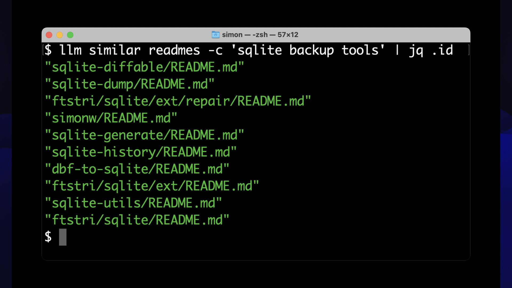

Embeddings are a really neat trick that often come wrapped in a pile of intimidating jargon.  

嵌入式是一种非常巧妙的技巧，但往往被一堆令人生畏的术语所包裹。

If you can make it through that jargon, they unlock powerful and exciting techniques that can be applied to all sorts of interesting problems.  

如果你能听懂这些专业术语，就会发现它们释放出强大而令人兴奋的技术，可以应用于各种有趣的问题。

I gave a talk about embeddings at [PyBay 2023](https://pybay.com/).  

我在 PyBay 2023 上发表了关于嵌入的演讲。  

This article represents an improved version of that talk, which should stand alone even without watching the video.  

本文是该演讲的改进版，即使不看视频，也可以单独阅读。

If you’re not yet familiar with embeddings I hope to give you everything you need to get started applying them to real-world problems.  

如果你还不熟悉嵌入式，我希望能为你提供开始将其应用于实际问题所需的一切。

In this article:  

本文中：

-   [The 38 minute video version  
    
    38 分钟的视频版本](https://simonwillison.net/2023/Oct/23/embeddings/#the-38-minute-video-version)
-   [What are embeddings?  
    
    什么是嵌入？](https://simonwillison.net/2023/Oct/23/embeddings/#what-are-embeddings)
-   [Related content using embeddings  
    
    使用嵌入式技术的相关内容](https://simonwillison.net/2023/Oct/23/embeddings/#related-content-using-embeddings)
-   [Exploring how these things work with Word2Vec  
    
    探索如何使用 Word2Vec 实现这些功能](https://simonwillison.net/2023/Oct/23/embeddings/#exploring-how-these-things-work-with-word2vec)
-   [Calculating embeddings using my LLM tool  
    
    使用我的 LLM 工具计算嵌入度](https://simonwillison.net/2023/Oct/23/embeddings/#calculating-embeddings-using-my-llm-tool)
-   [Vibes-based search  
    
    基于振动的搜索](https://simonwillison.net/2023/Oct/23/embeddings/#vibes-based-search)
-   [Embeddings for code using Symbex  
    
    使用 Symbex 嵌入代码](https://simonwillison.net/2023/Oct/23/embeddings/#embeddings-for-code-using-symbex)
-   [Embedding text and images together using CLIP  
    
    使用 CLIP 将文字和图像嵌入在一起](https://simonwillison.net/2023/Oct/23/embeddings/#embedding-text-and-images-together-using-clip)
-   [Faucet Finder: finding faucets with CLIP  
    
    水龙头查找器：使用 CLIP 查找水龙头](https://simonwillison.net/2023/Oct/23/embeddings/#faucet-finder-finding-faucets-with-clip)
-   [Clustering embeddings  
    
    聚类嵌入](https://simonwillison.net/2023/Oct/23/embeddings/#clustering-embeddings)
-   [Visualize in 2D with Principal Component Analysis  
    
    利用主成分分析实现二维可视化](https://simonwillison.net/2023/Oct/23/embeddings/#visualize-in-2d-with-principal-component-analysis)
-   [Scoring sentences using average locations  
    
    使用平均位置为句子评分](https://simonwillison.net/2023/Oct/23/embeddings/#scoring-sentences-using-average-locations)
-   [Answering questions with Retrieval-Augmented Generation  
    
    用检索增强生成技术回答问题](https://simonwillison.net/2023/Oct/23/embeddings/#answering-questions-with-retrieval-augmented-generation)
-   [Q&A](https://simonwillison.net/2023/Oct/23/embeddings/#qa)
-   [Further reading  
    
    更多阅读](https://simonwillison.net/2023/Oct/23/embeddings/#embeddings-further-reading)

#### The 38 minute video version  

38 分钟的视频版本

Here’s [a video](https://www.youtube.com/watch?v=ArnMdc-ICCM&t=50s) of the talk that I gave at PyBay:  

这是我在 PyBay 上演讲的视频：

<iframe width="560" height="315" src="https://www.youtube.com/embed/ArnMdc-ICCM?start=50" frameborder="0" allow="autoplay; encrypted-media" allowfullscreen="allowfullscreen"></iframe>

The audio quality of the official video wasn’t great due to an issue with the microphone, but I ran that audio through Adobe’s [Enhance Speech tool](https://podcast.adobe.com/enhance) and uploaded my own video with the enhanced audio to YouTube.  

由于麦克风的问题，官方视频的音频质量不是很好，但我将音频通过 Adobe 的增强语音工具进行了处理，并将我自己的增强音频视频上传到了 YouTube。

#### What are embeddings?  

什么是嵌入？

Embeddings are a technology that’s adjacent to the wider field of Large Language Models—the technology behind ChatGPT and Bard and Claude.  

嵌入是一种与大型语言模型（即 ChatGPT 和 Bard and Claude 背后的技术）相邻的技术。


Embeddings are based around one trick: take a piece of content—in this case [a blog entry](https://til.simonwillison.net/llms/openai-embeddings-related-content)—and turn that piece of content into an array of floating point numbers.  

嵌入技术的基础是一个技巧：将一段内容（本例中为博客条目）转化为浮点数数组。

The key thing about that array is that it will always be the same length, no matter how long the content is.  

数组的关键在于，无论内容有多长，数组的长度都是一样的。  

The length is defined by the embedding model you are using—an array might be 300, or 1,000, or 1,536 numbers long.  

长度由你使用的嵌入模型决定--一个数组的长度可能是 300、1000 或 1536 个数字。

The best way to think about this array of numbers is to imagine it as co-ordinates in a very weird multi-dimensional space.  

思考数字数组的最佳方式是将其想象成一个非常奇怪的多维空间中的坐标。

It’s hard to visualize 1,536 dimensional space, so here’s a 3D visualization of the same idea:  

1536 维空间很难可视化，所以这里用三维可视化来表达同样的想法：


Why place content in this space?  

为什么要在这个空间中放置内容？  

Because we can learn interesting things about that content based on its location—in particular, based on what else is nearby.  

因为我们可以根据内容所处的位置，尤其是根据附近的其他内容，了解到有关内容的有趣信息。

The location within the space represents the semantic meaning of the content, according to the embedding model’s weird, mostly incomprehensible understanding of the world.  

根据嵌入模型对世界的奇特理解，空间内的位置代表了内容的语义。  

It might capture colors, shapes, concepts or all sorts of other characteristics of the content that has been embedded.  

它可能捕捉到嵌入内容的颜色、形状、概念或其他各种特征。

Nobody fully understands what those individual numbers mean, but we know that their locations can be used to find out useful things about the content.  

没有人完全理解这些单个数字的含义，但我们知道它们的位置可以用来找出内容的有用信息。

#### Related content using embeddings  

使用嵌入式技术的相关内容

One of the first problems I solved with embeddings was to build a “related content” feature for [my TIL blog](https://til.simonwillison.net/). I wanted to be able to show a list of related articles at the bottom of each page.  

我用嵌入式技术解决的第一个问题是为我的 TIL 博客建立一个 "相关内容 "功能。我希望能在每个页面的底部显示相关文章列表。

I did this using embeddings—in this case, I used the OpenAI `text-embedding-ada-002` model, which is available [via their API](https://platform.openai.com/docs/guides/embeddings).  

我使用嵌入式模型来完成这项工作--在本例中，我使用了 OpenAI `text-embedding-ada-002` 模型，该模型可通过其 API 获取。

I currently have 472 articles on my site.  

我的网站上目前有 472 篇文章。  

I calculated the 1,536 dimensional embedding vector (array of floating point numbers) for each of those articles, and stored those vectors in my site’s SQLite database.  

我为每篇文章计算了 1536 维嵌入向量（浮点数数组），并将这些向量存储在网站的 SQLite 数据库中。

Now, if I want to find related articles for a given article, I can calculate the _cosine similarity_ between the embedding vector for that article and every other article in the database, then return the 10 closest matches by distance.  

现在，如果我想为某篇文章查找相关文章，我可以计算该文章的嵌入向量与数据库中其他每篇文章之间的余弦相似度，然后按距离返回 10 个最接近的匹配项。

There’s an example at [the bottom of this page](https://til.simonwillison.net/sqlite/sqlite-tg#related). The top five related articles for [Geospatial SQL queries in SQLite using TG, sqlite-tg and datasette-sqlite-tg](https://til.simonwillison.net/sqlite/sqlite-tg) are:  

本页底部有一个示例。与在 SQLite 中使用 TG、sqlite-tg 和 datasette-sqlite-tg 进行地理空间 SQL 查询相关的五篇最热门文章是

-   [Geopoly in SQLite](https://til.simonwillison.net/sqlite/geopoly)—2023-01-04  
    
    SQLite 中的地缘政治-2023-01-04
-   [Viewing GeoPackage data with SpatiaLite and Datasette](https://til.simonwillison.net/spatialite/viewing-geopackage-data-with-spatialite-and-datasette)—2022-12-11  
    
    使用 SpatiaLite 和 Datasette 查看 GeoPackage 数据-2022-12-11
-   [Using SQL with GDAL](https://til.simonwillison.net/gis/gdal-sql)—2023-03-09  
    
    在 GDAL 中使用 SQL-2023-03-09
-   [KNN queries with SpatiaLite](https://til.simonwillison.net/spatialite/knn)—2021-05-16  
    
    使用 SpatiaLite 进行 KNN 查询-2021-05-16
-   [GUnion to combine geometries in SpatiaLite](https://til.simonwillison.net/spatialite/gunion-to-combine-geometries)—2022-04-12  
    
    GUnion 在 SpatiaLite 中组合几何图形-2022-04-12

That’s a pretty good list!  

这个列表很不错！

Here’s [the Python function](https://github.com/simonw/llm/blob/bf229945fe57036fa75e8105e59d9e506a720156/llm/__init__.py#L252C1-L256C53) I’m using to calculate those cosine similarity distances:  

下面是我用来计算余弦相似度距离的 Python 函数：

```
def cosine_similarity(a, b):
    dot_product = sum(x * y for x, y in zip(a, b))
    magnitude_a = sum(x * x for x in a) ** 0.5
    magnitude_b = sum(x * x for x in b) ** 0.5
    return dot_product / (magnitude_a * magnitude_b)
```

My TIL site runs on my [Datasette](https://datasette.io/) Python framework, which supports building sites on top of a SQLite database.  

我的 TIL 站点在我的 Datasette Python 框架上运行，该框架支持在 SQLite 数据库之上构建站点。  

I wrote more about how that works in [the Baked Data architectural pattern](https://simonwillison.net/2021/Jul/28/baked-data/).  

我在 "烘焙数据"（Baked Data）架构模式中详细介绍了其工作原理。

You can browse the SQLite table that stores the calculated embeddings at [tils/embeddings](https://til.simonwillison.net/tils/embeddings).  

你可以在 tils/embeddings 浏览存储计算嵌入的 SQLite 表。


Those are binary values. We can [run this SQL query](https://til.simonwillison.net/tils?sql=select+id%2C+hex%28embedding%29+from+embeddings) to view them as hexadecimal:  

这些都是二进制值。我们可以运行此 SQL 查询来查看它们的十六进制值：

```sql
select id, hex(embedding) from embeddings
```


That’s still not very readable though. We can use the `llm_embed_decode()` custom SQL function to turn them into a JSON array:  

不过，这仍然不是很好读。我们可以使用 `llm_embed_decode()` 自定义 SQL 函数将它们转换成 JSON 数组：

```sql
select id, llm_embed_decode(embedding) from embeddings limit 10
```

[Try that here](https://til.simonwillison.net/tils?sql=select+id%2C+llm_embed_decode%28embedding%29+from+embeddings+limit+10). It shows that each article is accompanied by that array of 1,536 floating point numbers.  

在这里试试。结果显示，每篇文章都附有一个由 1,536 个浮点数组成的数组。


We can use another custom SQL function, `llm_embed_cosine(vector1, vector2)`, to calculate those cosine distances and find the most similar content.  

我们可以使用另一个自定义 SQL 函数 `llm_embed_cosine(vector1, vector2)` 来计算这些余弦距离，并找出最相似的内容。

That SQL function [is defined here](https://github.com/simonw/datasette-llm-embed/blob/ebded67fa9ee19db2c4b1badb1895cef0d58ac4a/datasette_llm_embed.py#L22-L26) in my [datasette-llm-embed](https://datasette.io/plugins/datasette-llm-embed) plugin.  

在我的 datasette-llm-embed 插件中定义了该 SQL 函数。

Here’s a query returning the five most similar articles to my SQLite TG article:  

以下是返回与我的 SQLite TG 文章最相似的五篇文章的查询：

```sql
select
  id,
  llm_embed_cosine(
    embedding,
    (
      select
        embedding
      from
        embeddings
      where
        id = 'sqlite_sqlite-tg.md'
    )
  ) as score
from
  embeddings
order by
  score desc
limit 5
```

[Executing that query](https://til.simonwillison.net/tils?sql=select%0D%0A++id%2C%0D%0A++llm_embed_cosine%28%0D%0A++++embedding%2C%0D%0A++++%28%0D%0A++++++select%0D%0A++++++++embedding%0D%0A++++++from%0D%0A++++++++embeddings%0D%0A++++++where%0D%0A++++++++id+%3D+%27sqlite_sqlite-tg.md%27%0D%0A++++%29%0D%0A++%29+as+score%0D%0Afrom%0D%0A++embeddings%0D%0Aorder+by%0D%0A++score+desc%0D%0Alimit+5) returns the following results:  

执行该查询会返回以下结果：

| id | score  
总谱 |
| --- | --- |
| sqlite\_sqlite-tg.md | 1.0 |
| sqlite\_geopoly.md | 0.8817322855676049 |
| spatialite\_viewing-geopackage-data-with-spatialite-and-datasette.md | 0.8813094978399854 |
| gis\_gdal-sql.md | 0.8799581261326747 |
| spatialite\_knn.md | 0.8692992294266506 |

As expected, the similarity between the article and itself is 1.0. The other articles are all related to geospatial SQL queries in SQLite.  

不出所料，该文章与自身的相似度为 1.0。其他文章都与 SQLite 中的地理空间 SQL 查询有关。

This query takes around 400ms to execute.  

该查询的执行时间约为 400ms。  

To speed things up, I pre-calculate the top 10 similarities for every article and store them in a separate table called [tils/similarities](https://til.simonwillison.net/tils/similarities).  

为了加快速度，我预先计算了每篇文章的前 10 个相似度，并将它们存储在一个名为 tils/similarities 的单独表中。


I wrote a Python function to [look up related documents from that table](https://github.com/simonw/til/blob/a244856c72000760c2939550ae2a78266dee4f07/plugins/template_vars.py#L21-L37) and [called it from the template](https://github.com/simonw/til/blob/a244856c72000760c2939550ae2a78266dee4f07/templates/pages/%7Btopic%7D/%7Bslug%7D.html#L37-L45) that’s used to render the article page.  

我编写了一个 Python 函数，用于从该表中查找相关文档，并在用于渲染文章页面的模板中调用该函数。

My [Storing and serving related documents with openai-to-sqlite and embeddings](https://til.simonwillison.net/llms/openai-embeddings-related-content) TIL explains how this all works in detail, including how GitHub Actions are used to fetch new embeddings [as part of the build script](https://github.com/simonw/til/blob/a244856c72000760c2939550ae2a78266dee4f07/.github/workflows/build.yml#L67-L75) that deploys the site.  

我的使用 openai-to-sqlite 和 embeddings 存储和提供相关文档的 TIL 详细解释了这一切是如何工作的，包括如何使用 GitHub 操作来获取新的 embeddings，作为部署网站的构建脚本的一部分。

I used the OpenAI embeddings API for this project.  

我在这个项目中使用了 OpenAI embeddings API。  

It’s extremely inexpensive—for my TIL website I embedded around 402,500 tokens, which at $0.0001 / 1,000 tokens comes to $0.04—just 4 cents!  

它的价格非常便宜--我在 TIL 网站上嵌入了约 402500 个代币，以 0.0001 美元/1000 个代币计算，价格为 0.04 美元--仅 4 美分！

It’s really easy to use: you POST it some text along with your API key, it gives you back that JSON array of floating point numbers.  

使用方法非常简单：将文本和 API 密钥发送给它，它就会返回浮点数 JSON 数组。


But... it’s a proprietary model. A few months ago OpenAI [shut down some of their older embeddings models](https://openai.com/blog/gpt-4-api-general-availability#deprecation-of-older-embeddings-models), which is a problem if you’ve stored large numbers of embeddings from those models since you’ll need to recalculate them against a supported model if you want to be able to embed anything else new.  

但是......这是一种专有模式。几个月前，OpenAI 关闭了一些旧的嵌入模型，如果你已经从这些模型中存储了大量的嵌入数据，那就麻烦了，因为如果你想嵌入其他新的数据，就需要根据支持的模型重新计算这些数据。


To OpenAI’s credit, they did promise to “cover the financial cost of users re-embedding content with these new models.”—but it’s still a reason to be cautious about relying on proprietary models.  

值得称赞的是，OpenAI 确实承诺 "承担用户使用这些新模型重新嵌入内容的财务成本"--但这仍然是我们谨慎依赖专有模型的一个原因。

The good news is that there are extremely powerful openly licensed models which you can run on your own hardware, avoiding any risk of them being shut down.  

好消息是，有一些功能非常强大的开放授权模式，你可以在自己的硬件上运行，避免了被关闭的风险。  

We’ll talk about that more in a moment.  

我们稍后会详细讨论这个问题。

#### Exploring how these things work with Word2Vec  

探索如何使用 Word2Vec 实现这些功能

Google Research put out an influential paper 10 years ago describing an early embedding model they created called Word2Vec.  

10 年前，谷歌研究院发表了一篇颇具影响力的论文，描述了他们创建的名为 Word2Vec 的早期嵌入模型。

That paper is [Efficient Estimation of Word Representations in Vector Space](https://arxiv.org/abs/1301.3781), dated 16th January 2013. It’s a paper that helped kick off widespread interest in embeddings.  

这篇论文是《向量空间中单词表示的高效估计》（Efficient Estimation of Word Representations in Vector Space），发表于 2013 年 1 月 16 日。这篇论文引发了人们对嵌入模型的广泛兴趣。

Word2Vec is a model that takes single words and turns them into a list of 300 numbers.  

Word2Vec 是一个模型，它将单个单词转换成由 300 个数字组成的列表。  

That list of numbers captures something about the meaning of the associated word.  

这个数字列表可以捕捉到相关单词的含义。

This is best illustrated by a demo.  

一个演示最能说明这一点。

[turbomaze.github.io/word2vecjson](https://turbomaze.github.io/word2vecjson/) is an interactive tool put together by [Anthony Liu](https://anthony.ai/) with a 10,000 word subset of the Word2Vec corpus. You can view [this JavaScript file](https://turbomaze.github.io/word2vecjson/data/wordvecs10000.js) to see the JSON for those 10,000 words and their associated 300-long arrays of numbers.  

turbomaze.github.io/word2vecjson 是 Anthony Liu 利用 Word2Vec 语料库的 10,000 个单词子集制作的一个交互式工具。您可以查看此 JavaScript 文件，查看这 10,000 个单词的 JSON 及其相关的 300 长数字数组。


Search for a word to find similar words based on cosine distance to their Word2Vec representation.  

搜索单词时，可根据与其 Word2Vec 表示的余弦距离找到相似的单词。  

For example, the word “france” returns the following related results:  

例如，单词 "france "会返回以下相关结果：

| word  
词 | similarity  

相似性 |
| --- | --- |
| france  

法国 | 1 |
| french  

法语 | 0.7000748343471224 |
| belgium  

比利时 | 0.6933180492111168 |
| paris  

巴黎 | 0.6334910653433325 |
| germany  

德国 | 0.627075617939471 |
| italy  

意大利 | 0.6135215284228007 |
| spain  

西班牙 | 0.6064218103692152 |

That’s a mixture of french things and European geography.  

这是法语和欧洲地理的混合体。

A really interesting thing you can do here is perform arithmetic on these vectors.  

你可以在这里做一件非常有趣的事情，那就是对这些向量进行算术运算。

Take the vector for “germany”, add “paris” and subtract “france”.  

以 "德国 "为向量，加上 "巴黎"，减去 "法国"。  

The resulting vector is closest to “berlin”!  

得出的向量最接近 "柏林"！

Something about this model has captured the idea of nationalities and geography to the point that you can use arithmetic to explore additional facts about the world.  

这个模型捕捉到了民族和地理的概念，让你可以用算术来探索世界上更多的事实。

Word2Vec was trained on 1.6 billion words of content.  

Word2Vec 是在 16 亿个单词的内容上训练出来的。  

The embedding models we use today are trained on much larger datasets and capture a much richer understanding of the underlying relationships.  

我们现在使用的嵌入模型是在大得多的数据集上训练出来的，能捕捉到更丰富的底层关系。

#### Calculating embeddings using my LLM tool  

使用我的 LLM 工具计算嵌入度

I’ve been building a command-line utility and Python library called [LLM](https://llm.datasette.io/).  

我一直在构建一个名为 LLM 的命令行工具和 Python 库。

You can read more about LLM here:  

关于 LLM 的更多信息，请点击此处：

-   [llm, ttok and strip-tags—CLI tools for working with ChatGPT and other LLMs  
    
    llm、ttok 和 strip-tags-CLI 工具，用于使用 ChatGPT 和其他 LLM](https://simonwillison.net/2023/May/18/cli-tools-for-llms/)
-   [The LLM CLI tool now supports self-hosted language models via plugins  
    
    LLM CLI 工具现在可通过插件支持自托管语言模型](https://simonwillison.net/2023/Jul/12/llm/)
-   [LLM now provides tools for working with embeddings  
    
    LLM 现在提供了嵌入式工具](https://simonwillison.net/2023/Sep/4/llm-embeddings/)
-   [Build an image search engine with llm-clip, chat with models with llm chat  
    
    用 llm-clip 建立图像搜索引擎，用 llm chat 与模特聊天](https://simonwillison.net/2023/Sep/12/llm-clip-and-chat/)

LLM is a tool for working with Large Language Models. You can install it like this:  

LLM 是一款用于处理大型语言模型的工具。您可以像这样安装它：

Or via Homebrew:  

或通过 Homebrew 安装：

You can use it as a command-line tool for interacting with LLMs, or as [a Python library](https://llm.datasette.io/en/stable/python-api.html).  

您可以将其用作与 LLM 交互的命令行工具，也可以将其用作 Python 库。

Out of the box it can work with the OpenAI API. Set [an API key](https://llm.datasette.io/en/stable/setup.html#saving-and-using-stored-keys) and you can run commands like this:  

开箱即可使用 OpenAI API。设置一个 API 密钥，就能运行类似这样的命令：

```shell
llm 'ten fun names for a pet pelican'
```

Where it gets really fun is when you start [installing plugins](https://llm.datasette.io/en/stable/plugins/index.html).  

真正有趣的地方在于你开始安装插件。  

There are plugins that add entirely new language models to it, including models that run directly on your own machine.  

有一些插件可以为它添加全新的语言模型，包括直接在你自己的机器上运行的模型。

A few months ago [I extended LLM](https://simonwillison.net/2023/Sep/4/llm-embeddings/) to support plugins that can run embedding models as well.  

几个月前，我扩展了 LLM，使其也能支持运行嵌入模型的插件。

Here’s how to run the catchily titled [all-MiniLM-L6-v2](https://huggingface.co/sentence-transformers/all-MiniLM-L6-v2) model using LLM:  

下面是如何使用 LLM 运行标题醒目的 all-MiniLM-L6-v2 模型：


First, we install `llm` and then use that to install the [llm-sentence-transformers](https://github.com/simonw/llm-sentence-transformers) plugin—a wrapper around the [SentenceTransformers](https://www.sbert.net/) library.  

首先，我们安装 `llm` ，然后用它来安装 llm-sentence-transformers 插件--SentenceTransformers 库的封装器。

```shell
pip install llm
llm install llm-sentence-transformers
```

Next we need to register the `all-MiniLM-L6-v2` model. This will download the model from Hugging Face to your computer:  

接下来，我们需要注册 `all-MiniLM-L6-v2` 模型。这将把模型从 Hugging Face 下载到您的电脑上：

```shell
llm sentence-transformers register all-MiniLM-L6-v2
```

We can test that out by embedding a single sentence like this:  

我们可以像这样嵌入一句话来进行测试：

```shell
llm embed -m sentence-transformers/all-MiniLM-L6-v2 \
  -c 'Hello world'
```

This outputs a JSON array that starts like this:  

这会输出一个JSON数组，开头如下：

`[-0.03447725251317024, 0.031023245304822922, 0.006734962109476328, 0.026108916848897934, -0.03936201333999634, ...`

Embeddings like this on their own aren’t very interesting—we need to store and compare them to start getting useful results.  

像这样的嵌入本身并不十分有趣，我们需要对它们进行存储和比较，才能得到有用的结果。

LLM can store embeddings in a “collection”—a SQLite table. The [embed-multi command](https://llm.datasette.io/en/stable/embeddings/cli.html#llm-embed-multi) can be used to embed multiple pieces of content at once and store them in a collection.  

LLM 可以将嵌入词存储在一个 "集合"--一个 SQLite 表中。embed-multi 命令可用于一次嵌入多个内容，并将它们存储在一个集合中。

That’s what this next command does:  

下一条命令就是这样做的：

```shell
llm embed-multi readmes \
  --model sentence-transformers/all-MiniLM-L6-v2 \
  --files ~/ '**/README.md' --store
```

Here we are populating a collection called “readmes”.  

在这里，我们将填充一个名为 "readmes "的集合。

The `--files` option takes two arguments: a directory to search and a glob pattern to match against filenames.  

`--files` 选项有两个参数：要搜索的目录和与文件名匹配的 glob 模式。  

In this case I’m searching my home directory recursively for any file named `README.md`.  

在这种情况下，我将递归搜索我的主目录中任何名为 `README.md` 的文件。

The `--store` option causes LLM to store the raw text in the SQLite table in addition to the embedding vector.  

`--store` 选项会使 LLM 在 SQLite 表中存储原始文本和嵌入向量。

This command took around 30 minutes to run on my computer, but it worked!  

这条命令在我的电脑上运行了大约 30 分钟，但还是成功了！  

I now have a collection called `readmes` with 16,796 rows—one for each `README.md` file it found in my home directory.  

现在，我有一个名为 `readmes` 的集合，其中有 16 796 行--它在我的主目录中找到的每个 `README.md` 文件都有一行。

#### Vibes-based search  

基于振动的搜索

Now that we have a collection of embeddings, we can run searches against it using the [llm similar command](https://llm.datasette.io/en/stable/embeddings/cli.html#llm-similar):  

现在，我们有了嵌入式集合，可以使用 llm similar 命令对其进行搜索：



```shell
llm similar readmes -c 'sqlite backup tools' | jq .id
```

We are asking for items in the `readmes` collection that are similar to the embedding vector for the phrase “sqlite backup tools”.  

我们要求 `readmes` 集合中的项目与 "sqlite 备份工具 "短语的嵌入向量相似。

This command outputs JSON by default, which includes the full text of the README files since we stored them using `--store` earlier.  

该命令默认输出 JSON 格式，其中包括 README 文件的全文，因为我们之前使用 `--store` 存储了这些文件。

Piping the results through `jq .id` causes the command to output just the IDs of the matching rows.  

将结果导入 `jq .id` 后，命令只输出匹配行的 ID。

The top matching results are:  

最匹配的结果是

```
"sqlite-diffable/README.md"
"sqlite-dump/README.md"
"ftstri/salite/ext/repair/README.md"
"simonw/README.md"
"sqlite-generate/README.md"
"sqlite-history/README.md"
"dbf-to-sqlite/README.md"
"ftstri/sqlite/ext/README.md"
"sqlite-utils/README.md"
"ftstri/sqlite/README.md'
```

These are good results!  

这些都是很好的结果！  

Each of these READMEs either describes a tool for working with SQLite backups or a project that relates to backups ins ome way.  

这些 README 中的每一个都描述了一个处理 SQLite 备份的工具或一个以某种方式与备份相关的项目。

What’s interesting about this is that it’s not guaranteed that the term “backups” appeared directly in the text of those READMEs.  

有趣的是，并不能保证 "备份 "一词会直接出现在这些 READMEs 的文本中。  

The content is semantically similar to that phrase, but might not be an exact textual match.  

这些内容在语义上与该短语相似，但可能并非完全匹配。

We can call this semantic search. I like to think of it as **vibes-based search**.  

我们可以称之为语义搜索。我喜欢把它看作是基于氛围的搜索。

The vibes of those READMEs relate to our search term, according to this weird multi-dimensional space representation of the meaning of words.  

这些 READMEs 的 vibes 与我们的搜索词有关，是根据这种奇怪的词义多维空间表示法得出的。

This is absurdly useful.  

这非常有用。  

If you’ve ever built a search engine for a website, you know that exact matches don’t always help people find what they are looking for.  

如果你曾经为一个网站建立过搜索引擎，你就会知道精确匹配并不总能帮助人们找到他们要找的东西。

We can use this kind of semantic search to build better search engines for a whole bunch of different kinds of content.  

我们可以利用这种语义搜索为各种不同的内容建立更好的搜索引擎。

#### Embeddings for code using Symbex  

使用 Symbex 嵌入代码

Another tool I’ve been building is called [Symbex](https://github.com/simonw/symbex). It’s a tool for exploring the symbols in a Python codebase.  

我一直在开发的另一个工具叫做 Symbex。这是一个用于探索 Python 代码库中符号的工具。

I [originally built it](https://simonwillison.net/2023/Jun/18/symbex/) to help quickly find Python functions and classes and pipe them into LLMs to help explain and rewrite them.  

我最初创建它是为了帮助快速查找 Python 函数和类，并将它们导入 LLM，以帮助解释和重写它们。

Then I realized that I could use it to calculate embeddings for all of the functions in a codebase, and use those embeddings to build a code search engine.  

后来我意识到，我可以用它来计算代码库中所有函数的嵌入，并用这些嵌入来构建一个代码搜索引擎。

I added a feature that could output JSON or CSV representing the symbols it found, using the same output format that `llm embed-multi` can use as an input.  

我添加了一项功能，可以输出 JSON 或 CSV 格式的符号，与 `llm embed-multi` 作为输入的输出格式相同。

Here’s how I built a collection of all of the functions in my [Datasette](https://github.com/simonw/datasette) project, using a newly released model called [gte-tiny](https://huggingface.co/TaylorAI/gte-tiny)—just a 60MB file!  

下面是我如何使用新发布的名为 gte-tiny 的模型，创建 Datasette 项目中所有功能的集合--只有一个 60MB 的文件！

```shell
llm sentence-transformers register TaylorAI/gte-tiny

cd datasette/datasette

symbex '*' '*:*' --nl | \
  llm embed-multi functions - \
  --model sentence-transformers/TaylorAI/gte-tiny \
  --format nl \
  --store
```

`symbex '*' '*:*' --nl` finds all functions (`*`) and class methods (the `*:*` pattern) in the current directory and outputs them as newline-delimited JSON.  

`symbex '*' '*:*' --nl` 查找当前目录中的所有函数 ( ) 和类方法（ 模式），并以新行分隔的 JSON 格式输出。 `*` `*:*`

The `llm embed-multi ... --format nl` command expects newline-delimited JSON as input, so we can pipe the output of `symbex` directly into it.  

`llm embed-multi ... --format nl` 命令希望以换行分隔的 JSON 作为输入，因此我们可以将 `symbex` 的输出直接导入该命令。

This defaults to storing the embeddings in the default LLM SQLite database. You can add `--database /tmp/data.db` to specify an alternative location.  

默认情况下，嵌入信息会存储在默认的 LLM SQLite 数据库中。您可以添加 `--database /tmp/data.db` ，指定其他位置。

And now... I can run vibes-based semantic search against my codebase!  

现在...我可以在我的代码库中运行基于 vibes 的语义搜索了！

I could use the `llm similar` command for this, but I also have the ability to run these searches using Datasette itself.  

为此，我可以使用 `llm similar` 命令，但也可以使用 Datasette 本身运行这些搜索。

Here’s a SQL query for that, using the [datasette-llm-embed](https://datasette.io/plugins/datasette-llm-embed) plugin from earlier:  

下面是一个 SQL 查询，使用的是之前的 datasette-llm-embed 插件：

```sql
with input as (
  select
    llm_embed(
      'sentence-transformers/TaylorAI/gte-tiny',
      :input
    ) as e
)
select
  id,
  content
from
  embeddings,
  input
where
  collection_id = (
    select id from collections where name = 'functions'
  )
order by
  llm_embed_cosine(embedding, input.e) desc
limit 5
```

The `:input` parameter is automatically turned into a form field by Datasette.  

`:input` 参数会被 Datasette 自动转化为表单域。

When I run this, I get back functions that relate to the concept of listing plugins:  

当我运行这个程序时，我得到了与列出插件概念相关的函数：


The key idea here is to use SQLite as an integration point—a substrate for combining together multiple tools.  

这里的关键思路是将 SQLite 作为一个集成点--将多种工具组合在一起的基底。

I can run separate tools that extract functions from a codebase, run them through an embedding model, write those embeddings to SQLite and then run queries against the results.  

我可以运行单独的工具，从代码库中提取函数，通过嵌入模型运行这些函数，将这些嵌入写入 SQLite，然后针对结果运行查询。

Anything that can be piped into a tool can now be embedded and processed by the other components of this ecosystem.  

现在，任何可以导入工具的内容都可以被嵌入，并由该生态系统的其他组件进行处理。

#### Embedding text and images together using CLIP  

使用 CLIP 将文字和图像嵌入在一起

My current favorite embedding model is [CLIP](https://openai.com/blog/clip/).  

我目前最喜欢的嵌入模型是 CLIP。

CLIP is a fascinating model released by OpenAI—back in January 2021, when they were still doing most things in the open—that can embed both text and images.  

CLIP 是 OpenAI 在 2021 年 1 月发布的一个令人着迷的模型，当时他们还在做大部分公开的事情，它既能嵌入文本，也能嵌入图像。

Crucially, it embeds them both into the same vector space.  

最重要的是，它能将文本和图像嵌入同一个向量空间。

If you embed the string “dog”, you’ll get a location in 512 dimensional space (depending on your CLIP configuration).  

如果你嵌入字符串 "dog"，你会得到 512 维空间中的一个位置（取决于你的 CLIP 配置）。

If you embed a photograph of a dog, you’ll get a location in that same space... and it will be close in terms of distance to the location of the string “dog”!  

如果嵌入一张狗的照片，就会在同一空间中得到一个位置......而且这个位置与字符串 "狗 "的位置距离很近！

This means we can search for related images using text, and search for related text using images.  

这意味着我们可以使用文本搜索相关图片，也可以使用图片搜索相关文本。

I built [an interactive demo](https://observablehq.com/@simonw/openai-clip-in-a-browser) to help explain how this works.  

我制作了一个交互式演示来帮助解释它是如何工作的。  

The demo is an Observable notebook that runs the CLIP model directly in the browser.  

该演示是一个 Observable 笔记本，可直接在浏览器中运行 CLIP 模型。

It’s a pretty heavy page—it has to load 158MB of resources (64.6MB for the CLIP text model and 87.6MB for the image model)—but once loaded you can use it to embed an image, then embed a string of text and calculate the distance between the two.  

这是一个相当繁重的页面--需要加载 158MB 的资源（64.6MB 用于 CLIP 文本模型，87.6MB 用于图像模型）--但是一旦加载完毕，你就可以用它来嵌入一张图片，然后嵌入一串文本，并计算两者之间的距离。

I can give it this photo I took of a beach:  

我可以给它一张我拍摄的海滩照片：


Then type in different text strings to calculate a similarity score, here displayed as a percentage:  

然后输入不同的文本字符串来计算相似度得分，这里显示的是百分比：


| text  
文本 | score  

总谱 |
| --- | --- |
| beach  

滨 | 26.946% |
| city  

城市 | 19.839% |
| sunshine  

旸 | 24.146% |
| sunshine beach  

阳光海滩 | 26.741% |
| california  

加利福尼亚州 | 25.686% |
| california beach  

加利福尼亚海滩 | 27.427% |

It’s pretty amazing that we can do all of this in JavaScript running in the browser!  

在浏览器中运行 JavaScript 就能实现这些功能，真是令人惊叹！

There’s an obvious catch: it’s not actually that useful to be able to take an arbitrary photo and say “how similar is this to the term ’city’?”.  

但有一个显而易见的问题：任意拍摄一张照片，然后说 "这与'城市'一词有多相似"，实际上并没有什么用处。

The trick is to build additional interfaces on top of this.  

诀窍在于在此基础上构建其他界面。  

Once again, we have the ability to build vibes-based search engines.  

再次，我们有能力建立基于氛围的搜索引擎。

Here’s a great example of one of those.  

下面就是一个很好的例子。

#### Faucet Finder: finding faucets with CLIP  

水龙头查找器：使用 CLIP 查找水龙头

[Drew Breunig](https://www.dbreunig.com/) used LLM and my [llm-clip](https://github.com/simonw/llm-clip) plugin to build a search engine for faucet taps.  

Drew Breunig 使用 LLM 和我的 llm-clip 插件建立了一个水龙头搜索引擎。

He was renovating his bathroom, and he needed to buy new faucets.  

他正在装修浴室，需要购买新的水龙头。  

So he scraped 20,000 photographs of faucets from a faucet supply company and ran CLIP against all of them.  

于是，他从一家水龙头供应公司获取了 20,000 张水龙头照片，并对所有照片运行 CLIP。

He used the result to build [Faucet Finder](https://faucet-finder.fly.dev/)—a custom tool (deployed using Datasette) for finding faucets that look similar to other faucets.  

他利用结果创建了 Faucet Finder--一种定制工具（使用 Datasette 部署），用于查找与其他水龙头相似的水龙头。


Among other things, this means you can find an expensive faucet you like and then look for visually similar cheaper options!  

除其他外，这意味着您可以找到喜欢的昂贵水龙头，然后寻找视觉上相似的便宜选择！

Drew wrote more about his project in [Finding Bathroom Faucets with Embeddings](https://www.dbreunig.com/2023/09/26/faucet-finder.html).  

Drew 在《使用嵌入式技术查找浴室水龙头》一文中详细介绍了他的项目。

Drew’s demo uses pre-calculated embeddings to display similar results without having to run the CLIP model on the server.  

Drew 的演示使用了预先计算的嵌入式技术来显示相似的结果，而无需在服务器上运行 CLIP 模型。

Inspired by this, I spent some time figuring out [how to deploy a server-side CLIP model](https://til.simonwillison.net/fly/clip-on-fly) hosted by my own [Fly.io](https://fly.io/) account.  

受此启发，我花了一些时间研究如何部署由我自己的 Fly.io 账户托管的服务器端 CLIP 模型。

Drew’s Datasette instance [includes this table](https://faucet-finder.fly.dev/faucets/embeddings) of embedding vectors, exposed via the Datasette API.  

德鲁的 Datasette 实例包括这个嵌入向量表，通过 Datasette API 公开。

I deployed my own instance with [this API](https://clip-datasette-on-fly.fly.dev/_memory?sql=select+hex(llm_embed(%27clip%27%2C+%3Aq))+as+x&q=purple) for embedding text strings, then built an Observable notebook demo that hits both APIs and combines the results.  

我用这个用于嵌入文本字符串的 API 部署了自己的实例，然后构建了一个 Observable 笔记本演示，可以同时使用这两个 API 并合并结果。

[observablehq.com/@simonw/search-for-faucets-with-clip-api](https://observablehq.com/@simonw/search-for-faucets-with-clip-api)

Now I can search for things like “gold purple” and get back vibes-based faucet results:  

现在，我可以搜索 "金紫色 "之类的内容，并得到基于氛围的龙头结果：


Being able to spin up this kind of ultra-specific search engine in a few hours is exactly the kind of trick that excites me about having embeddings as a tool in my toolbox.  

能在几小时内创建这种超特异性搜索引擎，这正是我的工具箱中嵌入式工具的一大亮点。

#### Clustering embeddings  

聚类嵌入

Related content and semantic / vibes-based search are the two most comon applications of embeddings, but there are a bunch of other neat things you can do with them too.  

相关内容和基于语义/氛围的搜索是嵌入式技术最常见的两种应用，但你还可以用它们做很多其他有趣的事情。

One of those is clustering.  

其中之一就是聚类。

I built a plugin for this called [llm-cluster](https://github.com/simonw/llm-cluster) which implements this using [sklearn.cluster](https://scikit-learn.org/stable/modules/clustering.html) from scikit-learn.  

我为此开发了一个名为 llm-cluster 的插件，它使用 scikit-learn 的 sklearn.cluster 实现了这一功能。

To demonstrate that, I used my [paginate-json](https://github.com/simonw/paginate-json) tool and the GitHub issues API to collect the titles of all of the issues in my `simonw/llm` repository into a collection called `llm-issues`:  

为了演示这一点，我使用分页-json 工具和 GitHub 问题 API 将 `simonw/llm` 仓库中所有问题的标题收集到一个名为 `llm-issues` 的集合中：

```shell
paginate-json 'https://api.github.com/repos/simonw/llm/issues?state=all&filter=all' \
  | jq '[.[] | {id: .id, title: .title}]' \
  | llm embed-multi llm-issues - \
  --store
```

Now I can create 10 clusters of issues like this:  

现在我可以像这样创建 10 个问题集群：

```shell
llm install llm-cluster

llm cluster llm-issues 10
```

Clusters are output as a JSON array, with output that looks something like this (truncated):  

群集以 JSON 数组的形式输出，输出结果如下（截断）：

```json
[
  {
    "id": "2",
    "items": [
      {
        "id": "1650662628",
        "content": "Initial design"
      },
      {
        "id": "1650682379",
        "content": "Log prompts and responses to SQLite"
      }
    ]
  },
  {
    "id": "4",
    "items": [
      {
        "id": "1650760699",
        "content": "llm web command - launches a web server"
      },
      {
        "id": "1759659476",
        "content": "`llm models` command"
      },
      {
        "id": "1784156919",
        "content": "`llm.get_model(alias)` helper"
      }
    ]
  },
  {
    "id": "7",
    "items": [
      {
        "id": "1650765575",
        "content": "--code mode for outputting code"
      },
      {
        "id": "1659086298",
        "content": "Accept PROMPT from --stdin"
      },
      {
        "id": "1714651657",
        "content": "Accept input from standard in"
      }
    ]
  }
]
```

These do appear to be related, but we can do better. The `llm cluster` command has a `--summary` option which causes it to pass the resulting cluster text through a LLM and use it to generate a descriptive name for each cluster:  

这些似乎是相关的，但我们可以做得更好。 `llm cluster` 命令有一个 `--summary` 选项，可以让它将生成的簇文本通过 LLM，并用它为每个簇生成一个描述性的名称：

```shell
llm cluster llm-issues 10 --summary
```

This gives back names like “Log Management and Interactive Prompt Tracking” and “Continuing Conversation Mechanism and Management”. See [the README](https://github.com/simonw/llm-cluster/blob/main/README.md#generating-summaries-for-each-cluster) for more details.  

这样就有了 "日志管理和交互式提示跟踪 "和 "持续对话机制和管理 "等名称。详情请参见 README。

#### Visualize in 2D with Principal Component Analysis  

利用主成分分析实现二维可视化

The problem with massively multi-dimensional space is that it’s really hard to visualize.  

海量多维空间的问题在于很难可视化。

We can use a technique called Principal Component Analysis to reduce the dimensionality of the data to a more manageable size—and it turns out lower dimensions continue to capture useful semantic meaning about the content.  

我们可以使用一种名为主成分分析的技术，将数据的维度降低到更易于管理的大小，而且事实证明，较低的维度仍能捕捉到内容的有用语义。

[Matt Webb](https://interconnected.org/) used the OpenAI embedding model to generate embeddings for descriptions of every episode of the BBC’s In Our Time podcast.  

马特-韦伯（Matt Webb）使用 OpenAI 嵌入模型为 BBC 的 "我们的时代"（In Our Time）播客的每一集描述生成嵌入。  

He used these to find related episodes, but also ran PCA against them to create [an interactive 2D visualization](https://interconnected.org/more/2023/02/in_our_time-PCA-plot.html).  

他利用这些内容找到了相关的剧集，并对其进行了 PCA 处理，创建了一个交互式二维可视化。


Reducing 1,536 dimensions to just two still produces a meaningful way of exploring the data!  

将 1536 个维度缩减为两个维度，仍能产生有意义的数据探索方式！  

Episodes about historic wars show up near each other, elsewhere there’s a cluster of episodes about modern scientific discoveries.  

关于历史战争的剧集彼此靠近，而其他地方则出现了关于现代科学发现的剧集集群。

Matt wrote more about this in [Browse the BBC In Our Time archive by Dewey decimal code](https://interconnected.org/home/2023/02/07/braggoscope).  

马特在《按杜威十进制编码浏览英国广播公司的《我们的时代》档案》一文中对此做了详细介绍。

#### Scoring sentences using average locations  

使用平均位置为句子评分

Another trick with embeddings is to use them for classification.  

嵌入式的另一个技巧是将其用于分类。

First calculate the average location for a group of embeddings that you have classified in a certain way, then compare embeddings of new content to those locations to assign it to a category.  

首先计算出一组已按某种方式分类的嵌入式内容的平均位置，然后将新内容的嵌入式内容与这些位置进行比较，从而将其归入某个类别。

Amelia Wattenberger demonstrated a beautiful example of this in [Getting creative with embeddings](https://wattenberger.com/thoughts/yay-embeddings-math).  

阿米莉亚-瓦滕伯格（Amelia Wattenberger）在《创造性地使用嵌入式技术》一书中展示了一个很好的例子。

She wanted to help people improve their writing by encouraging a mixture of concrete and abstract sentences.  

她希望通过鼓励混合使用具体和抽象句子来帮助人们提高写作水平。  

But how do you tell if a sentence of text is concrete or abstract?  

但如何判断一个句子是具体的还是抽象的？

Her trick was to generate samples of the two types of sentence, calculate their average locations and then score new sentences based on how close they are to either end of that newly defined spectrum.  

她的诀窍是生成这两类句子的样本，计算它们的平均位置，然后根据新句子与新定义的光谱两端的接近程度进行评分。


This score can even be converted into a color loosely representing how abstract or concrete a given sentence is!  

这个分数甚至可以转换成一种颜色，松散地代表某个句子的抽象或具体程度！

This is a really neat demonstration of the kind of creative interfaces you can start to build on top of this technology.  

这真是一个非常巧妙的演示，让我们可以在这项技术的基础上开始构建富有创意的界面。

#### Answering questions with Retrieval-Augmented Generation  

用检索增强生成技术回答问题

I’ll finish with the idea that first got me excited about embeddings.  

最后，我要谈谈最先让我对嵌入式感到兴奋的想法。

Everyone who tries out ChatGPT ends up asking the same question: how could I use a version of this to answer questions based on my own private notes, or the internal documents owned by my company?  

每个试用 ChatGPT 的人最后都会问同一个问题：我怎么才能用它来回答基于我自己的私人笔记或公司内部文件的问题？

People assume that the answer is to train a custom model on top of that content, likely at great expense.  

人们认为答案是在这些内容的基础上训练一个自定义模型，这很可能要花费很大的代价。

It turns out that’s not actually necessary.  

事实证明，这其实没有必要。  

You can use an off the shelf Large Language Model model (a hosted one or one that runs locally) and a trick called Retrieval Augmented Generation, or RAG.  

你可以使用现成的大型语言模型（托管模型或本地运行的模型）和一种名为 "检索增强生成"（RAG）的技巧。

The key idea is this: a user asks a question.  

其主要思路是这样的：用户提出一个问题。  

You search your private documents for content that appears relevant to the question, then paste excerpts of that content into the LLM (respecting its size limit, usually between 3,000 and 6,000 words) along with the original question.  

您可以在私人文件中搜索与问题相关的内容，然后将这些内容的摘录与原始问题一起粘贴到 LLM 中（遵守其大小限制，通常在 3,000 到 6,000 字之间）。

The LLM can then answer the question based on the additional content you provided.  

然后，LLM 就可以根据您提供的补充内容回答问题。

This cheap trick is astonishingly effective.  

这种低劣的伎俩效果惊人。  

It’s trivial to get a basic version of this working—the challenge is in getting it to work as well as possible given the infinite set of questions a user might ask.  

要实现这种方法的基本版本并不难，难的是如何在用户可能提出无限问题的情况下让它尽可能好地工作。

The key problem in RAG is figuring out the best possible excerpts of content to include in the prompt to the LLM.  

RAG 的关键问题在于找出最好的内容摘录，并将其纳入 LLM 的提示中。

“Vibes-based” semantic search powered by embedding is exactly the kind of thing you need to gather potentially relevant content to help answer a user’s question.  

嵌入式 "基于振动 "的语义搜索正是收集潜在相关内容以帮助回答用户问题所需要的。

I built a version of this against content from my blog, described in detail in [Embedding paragraphs from my blog with E5-large-v2](https://til.simonwillison.net/llms/embed-paragraphs).  

我针对我博客中的内容构建了一个这样的版本，详情请参阅《使用 E5-large-v2 嵌入我博客中的段落》。

I used a model called [E5-large-v2](https://huggingface.co/intfloat/e5-large-v2) for this. It’s a model trained with this exact use-case in mind.  

为此，我使用了一个名为 E5-large-v2 的模型。该模型正是在这种情况下训练出来的。

A challenge with finding content relevant to questions is that the user’s question—“What is shot-scraper?”—isn’t guaranteed to be considered semantically similar to content that answers that question.  

查找与问题相关的内容所面临的一个挑战是，用户的问题--"什么是 shot-scraper？"--并不能保证与回答该问题的内容在语义上相似。  

Questions and assertions have a different grammar from each other.  

问题和断言的语法不同。

E5-large-v2 addresses this by supporting two types of content.  

E5-large-V2 通过支持两种类型的内容来解决这个问题。  

You can embed phrases (factual sentences) and queries (questions) in the same space, similar to how CLIP supports both images and text.  

你可以在同一空间嵌入短语（事实性句子）和询问（问题），这与 CLIP 支持图片和文本的方式类似。

I embedded 19,000 paragraphs of text from my blog as phrases, and now I can embed a question as a query and use that to find the paragraphs most likely to answer that question.  

我将我博客中的 19,000 段文字作为短语嵌入，现在我可以将一个问题作为查询嵌入，并用它来查找最有可能回答该问题的段落。

The result is RAG implemented as a one-liner Bash script:  

这就是以单行 Bash 脚本实现的 RAG：

```shell
llm similar blog-paragraphs -c "query: $1" \
  | jq '.content | sub("passage: "; "")' -r \
  | llm -m mlc-chat-Llama-2-7b-chat-hf-q4f16_1 \
  "$1" -s 'You answer questions as a single paragraph'
```

This example uses Llama 2 Chat 7B running on my laptop (with the [llm-mlc](https://github.com/simonw/llm-mlc) plugin), so I’m able to answer questions entirely offline using code running on my laptop.  

这个例子使用的是在我的笔记本电脑上运行的 Llama 2 Chat 7B（带有 llm-mlc 插件），因此我可以使用在笔记本电脑上运行的代码完全离线回答问题。

Running this:  

运行此代码：

```shell
./blog-answer.sh 'What is shot-scraper?'
```

Outputs this:  

输出如下

> Shot-scraper is a Python utility that wraps Playwright, providing both a command line interface and a YAML-driven configuration flow for automating the process of taking screenshots of web pages and scraping data from them using JavaScript.  
> 
> Shot-scraper 是一个封装了 Playwright 的 Python 工具，它提供了一个命令行界面和一个 YAML 驱动的配置流程，用于自动执行网页截图过程，并使用 JavaScript 从网页中抓取数据。  
> 
> It can be used to take one-off screenshots or take multiple screenshots in a repeatable way by defining them in a YAML file.  
> 
> 通过在 YAML 文件中定义截图，它可用于一次性截图或以可重复的方式截取多个截图。  
> 
> Additionally, it can be used to execute JavaScript on a page and return the resulting value.  
> 
> 此外，它还可用于在页面上执行 JavaScript 并返回结果值。

That’s a really good description of my [shot-scraper](https://shot-scraper.datasette.io/) tool.  

这是对我的镜头剪辑工具的最好描述。  

I checked and none of that output is an exact match to content I had previously published on my blog.  

我检查了一下，这些输出的内容都与我之前在博客上发布的内容不完全匹配。

#### Q&A

My talk ended with a Q&A session. Here are the summarized questions and answers.  

我的演讲以问答环节结束。以下是问题和回答的摘要。

-   **How does LangChain fit into this?  
    
    LangChain 如何参与其中？**
    
    [LangChain](https://www.langchain.com/) is a popular framework for implementing features on top of LLMs. It covers a _lot_ of ground—my only problem with LangChain is that you have to invest a lot of work in understanding how it works and what it can do for you.  
    
    LangChain 是一种流行的框架，用于在 LLMs 上实现各种功能。它涵盖了很多领域--我对 LangChain 的唯一疑问是，你必须投入大量精力去了解它是如何工作的，以及它能为你做些什么。  
    
    Retrieval Augmented Generation is one of the key features of LangChain, so a lot of the things I’ve shown you today could be built on top of LangChain if you invest the effort.  
    
    检索增强生成（Retrieval Augmented Generation）是 LangChain 的主要功能之一，因此，如果你投入精力，我今天向你展示的很多东西都可以构建在 LangChain 的基础之上。
    
    My philosophy around this stuff differs from LangChain in that I’m focusing on building a suite of small tools that can work together, as opposed to a single framework that solves everything in one go.  
    
    我在这方面的理念与 LangChain 不同，我专注于构建一套可以协同工作的小型工具，而不是一次性解决所有问题的单一框架。
    
-   **Have you tried distance functions other than cosine similarity?  
    
    您尝试过余弦相似性以外的距离函数吗？**
    
    I have not.  
    
    我还没有。  
    
    Cosine similarity is the default function that everyone else seems to be using and I’ve not spent any time yet exploring other options.  
    
    余弦相似度是默认函数，其他人似乎都在用，我还没有花时间探索其他选项。
    
    I actually got ChatGPT to write all of my different versions of cosine similarity, across both Python and JavaScript!  
    
    实际上，我让 ChatGPT 编写了我所有不同版本的余弦相似度，包括 Python 和 JavaScript！
    
    A fascinating thing about RAG is that it has so many different knobs that you can tweak.  
    
    RAG 的迷人之处在于它有许多不同的旋钮供你调整。  
    
    You can try different distance functions, different embedding models, different prompting strategies and different LLMs. There’s a lot of scope for experimentation here.  
    
    你可以尝试不同的距离函数、不同的嵌入模型、不同的提示策略和不同的 LLM。这里有大量的实验空间。
    
-   **What do you need to adjust if you have 1 billion objects?  
    
    如果有 10 亿个对象，需要调整什么？**
    
    The demos I’ve shown today have all been on the small side—up to around 20,000 embeddings.  
    
    我今天展示的演示都是小规模的，大约只有 20,000 个嵌入。  
    
    This is small enough that you can run brute force cosine similarity functions against everything and get back results in a reasonable amount of time.  
    
    这样的规模已经足够小，你可以对所有数据运行蛮力余弦相似度函数，并在合理的时间内得到结果。
    
    If you’re dealing with more data there are a growing number of options that can help.  
    
    如果你需要处理更多的数据，有越来越多的选择可以提供帮助。
    
    Lots of startups are launching new “vector databases”—which are effectively databases that are custom built to answer nearest-neighbour queries against vectors as quickly as possible.  
    
    很多初创公司都在推出新的 "向量数据库"--这实际上是一种定制数据库，用于尽快回答向量的最近邻查询。
    
    I’m not convinced you need an entirely new database for this: I’m more excited about adding custom indexes to existing databases.  
    
    我并不认为这需要一个全新的数据库：我更感兴趣的是为现有数据库添加自定义索引。  
    
    For example, SQLite has [sqlite-vss](https://github.com/asg017/sqlite-vss) and PostgreSQL has [pgvector](https://github.com/pgvector/pgvector).  
    
    例如，SQLite 有 sqlite-vss，PostgreSQL 有 pgvector。
    
    I’ve also done some successful experiments with Facebook’s [FAISS](https://github.com/facebookresearch/faiss) library, including building a Datasette plugin that uses it called [datasette-faiss](https://datasette.io/plugins/datasette-faiss).  
    
    我还使用 Facebook 的 FAISS 库进行了一些成功的尝试，包括构建了一个使用该库的 Datasette 插件，名为 datasette-faiss。
    
-   **What improvements to embedding models are you excited to see?  
    
    您对嵌入模型的哪些改进感到兴奋？**
    
    I’m really excited about multi-modal models.  
    
    我对多模态模型非常感兴趣。  
    
    CLIP is a great example, but I’ve also been experimenting with Facebook’s [ImageBind](https://github.com/facebookresearch/ImageBind), which “learns a joint embedding across six different modalities—images, text, audio, depth, thermal, and IMU data.” It looks like we can go a lot further than just images and text!  
    
    CLIP 就是一个很好的例子，但我也一直在尝试 Facebook 的 ImageBind，它 "学习六种不同模式的联合嵌入--图像、文本、音频、深度、热和 IMU 数据"。看起来，我们可以走得更远，而不仅仅是图像和文本！
    
    I also like the trend of these models getting smaller.  
    
    我也喜欢这些模型越来越小的趋势。  
    
    I demonstrated a new model, gtr-tiny, earlier which is just 60MB.  
    
    我之前展示过一个新模型，gtr-tiny，只有 60MB。  
    
    Being able to run these things on constrained devices, or in the browser, is really exciting to me.  
    
    能够在受限的设备上或浏览器中运行这些东西真的让我很兴奋。
    

#### Further reading  

更多阅读

If you want to dive more into the low-level details of how embeddings work, I suggest the following:  

如果您想深入了解嵌入式工作原理的底层细节，我建议您阅读以下内容：

-   [What are embeddings?](https://vickiboykis.com/what_are_embeddings/) by Vicki Boykis  
    
    什么是嵌入？ 作者：Vicki Boykis
-   [Text Embeddings Visually Explained](https://txt.cohere.com/text-embeddings/) by Meor Amer for Cohere  
    
    Meor Amer 为 Cohere 直观解释文本嵌入问题
-   [The Tensorflow Embedding Projector](https://projector.tensorflow.org/)—an interactive tool for exploring embedding spaces  
    
    Tensorflow 嵌入投影仪--探索嵌入空间的互动工具
-   [Learn to Love Working with Vector Embeddings](https://www.pinecone.io/learn/) is a collection of tutorials from vector database vendor Pinecone  
    
    学会爱上使用矢量嵌入》是矢量数据库供应商 Pinecone 的教程集。
