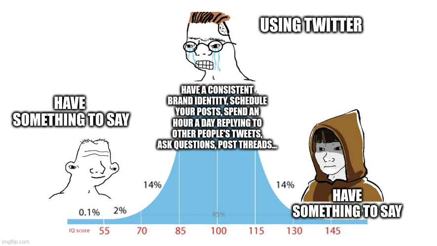

How I wish people used Twitter versus how they seem to be doing it lately.  

我多么希望人们使用推特，而不是像他们最近那样。

I’m not quite sure when I started feeling uncomfortable with Twitter.<a href="https://www.coryzue.com/writing/authenticity-and-engagement/#fn:1" rel="footnote">1</a>  

我不太确定自己是从什么时候开始对 Twitter 感到不舒服的。 <a href="https://www.coryzue.com/writing/authenticity-and-engagement/#fn:1" rel="footnote">1</a>

It _wasn’t_ when Elon Musk bought it, or during the mass firings, or the bluecheck fiasco, or the rebrand to X, or any of the other politically-obvious times that many people decided to give up on it.  

不是在埃隆-马斯克（Elon Musk）收购它的时候，也不是在大批员工被解雇的时候，更不是在 "蓝查"（bluecheck）惨败的时候，也不是在改名为 "X "的时候，更不是在其他政治上显而易见的时候，许多人决定放弃它。

No, I was a Twitter optimist for a long time.  

不，在很长一段时间里，我都是推特的乐观主义者。

But somehow, somewhere over the last few months, my positive outlook on the platform has slowly eroded away.  

但不知怎的，在过去的几个月里，我对这个平台的积极看法慢慢消失了。  

As I—ironically—spend as much time as ever scrolling through my feed—I find myself more and more annoyed, jealous, outraged, yes, but mostly just… _bored_.  

讽刺的是，当我一如既往地花大量时间滚动浏览我的推特时，我发现自己越来越恼火、嫉妒、愤怒，是的，但主要还是......无聊。

And what’s funny is that the content is more “engaging” than ever.  

有趣的是，这些内容比以往任何时候都更 "吸引人"。  

My feed is full of posts that have obviously had more effort put into it than most of what I used to see.  

我的推送中充斥着一些帖子，它们显然比我以前看到的大多数帖子都更用心。  

Megathreads about AI, thoughtful, longform narratives that could have been blog posts, carefully curated images, and super-positive business updates.  

有关于人工智能的大型讨论，有深思熟虑的长篇叙事，有精心策划的图片，还有超级积极的业务更新。  

It’s mostly _engaging stuff_.  

大部分都是引人入胜的内容。

And therein, I think, lies the problem. **The content I now see on Twitter is content that has been designed to be seen on Twitter.** Tweeting has become a job.  

我认为，问题就出在这里。我现在在 Twitter 上看到的内容都是为了在 Twitter 上被看到而设计的内容。发微博已经成为一项工作。  

Quite literally, for many people, ever since they’ve started paying creators a share of ad revenue.  

对很多人来说，自从他们开始向创作者支付广告收入分成后，这简直就是一份工作。

And yes, on the surface this incentivizes people to create better content.  

是的，从表面上看，这激励人们创作更好的内容。  

The better your content is, the more it gets seen, and the more money you make.  

你的内容越好，被看到的次数就越多，你赚的钱也就越多。  

And yet, my felt experience of this change is the exact opposite—as people seek more engagement, their content gets _worse_. What’s going on here?  

然而，我对这一变化的感受却恰恰相反--随着人们追求更多的参与度，他们的内容却越来越差。这到底是怎么回事？

One possibility is that I am unusual. I go on Twitter for _authenticity_.  

一种可能是我与众不同。我在 Twitter 上追求真实性。  

I have carefully curated a list of human beings who I know by name, and whose ideas and actions interest me.  

我精心策划了一份名单，上面都是我认识的人，我对他们的想法和行动很感兴趣。  

But authenticity is often at odds with growth.  

但真实性往往与成长相悖。

Why? Well to _grow_ you need to be noticed. To be noticed, you need to stand out.  

为什么呢？要想成长，你就需要被关注。要引起注意，你就需要脱颖而出。  

And to stand out is—usually—inauthentic. Yes, we all say and do noteworthy things, but not every day.  

而脱颖而出通常就是真实。是的，我们都说过和做过值得注意的事情，但并不是每天都这样。

To do or say noteworthy things every day involves some degree of forcedness, repetition, or _trying_. The opposite of authenticity.

  

要想每天都做或说值得注意的事情，就需要在一定程度上勉强、重复或尝试。这与真实性恰恰相反。

If I wanted to get 10x more engagement than usual on a Tweet tomorrow, I could.  

如果我明天想在推特上获得比平时多 10 倍的参与度，我可以做到。  

I could post some celebratory brag about how much money I’m earning from my businesses (“omg $10k MRR!”).  

我可以发布一些关于我从我的业务中赚了多少钱的庆祝性吹嘘（"omg $10k MRR!"）。  

I could pick a fight on a topic people feel strongly about (“React sucks!”). I could mention it’s my birthday and post a picture of myself (“Can’t believe I’m 41!”).<a href="https://www.coryzue.com/writing/authenticity-and-engagement/#fn:2" rel="footnote">2</a> I could ask a question that lets people promote themselves (“What’s your favorite personal website?”), angrily quote-tweet a terrible take, and so on.  

我可以就人们强烈关注的话题挑起争论（"React 逊毙了！"）。我可以提到今天是我的生日，然后贴上一张自己的照片（"真不敢相信我已经 41 岁了！"）。 <a href="https://www.coryzue.com/writing/authenticity-and-engagement/#fn:2" rel="footnote">2</a> 我可以问一个让人们宣传自己的问题（"你最喜欢的个人网站是什么？"），愤怒地引用一条糟糕的推文，等等。

I know these things work.  

我知道这些都很有效。  

And I occasionally do them, knowing they will work. I try to do this only a handful of times a year, because even though they _work_, and even though they _are useful for me and [my](https://scriv.ai/) [businesses](https://www.saaspegasus.com/)_, and even though they _make my lizard brain feel good_, a part of me still hates them. Even a few times a year.  

我偶尔也会这样做，因为我知道它们会起作用。我尽量一年只做几次，因为尽管它们有用，尽管它们对我和我的企业有用，尽管它们让我的蜥蜴大脑感觉良好，但我的一部分仍然讨厌它们。即使是一年几次。

Clearly I’ve been wrestling with this issue for a little while now.  

显然，我已经为这个问题纠结了一段时间。

But oh boy, not the people in my feed.  

但是，天哪，我的朋友们可不是这样。  

The people in my feed—most of whom I’m not following, by the way—_love_ posting for engagement.  

顺便说一句，我的朋友圈中大部分人都不是我的粉丝，他们都很喜欢发帖吸引眼球。  

Some of them love it so much that they offer courses teaching other people how to do it—which amplifies this godforsaken death spiral even further.  

他们中的一些人喜欢得不得了，甚至还开设课程教别人怎么做--这就进一步扩大了这个该死的死亡螺旋。

And so now we find ourselves in a situation where all these asshats with 20k followers and a Stripe account are now _running their Twitter account as a business_.  

因此，现在我们发现，所有这些拥有 2 万粉丝和一个 Stripe 账户的混蛋都把自己的 Twitter 账户当成了一门生意来经营。  

And this has led to a slow and inevitable decline from authenticity to some version of marketing (look at my content!) and sales (follow me!).  

这导致了从真实性到营销（看看我的内容！）和销售（关注我！）的缓慢而不可避免的衰退。

What we are witnessing now is the _professionalization_ of Twitter.  

我们现在看到的是 Twitter 的专业化。

And look, I don’t think it’s just the algorithm and the incentives.  

而且，我认为这不仅仅是算法和激励机制的问题。  

Elon’s political antics chased away a lot of good people. Many of my favorite follows have moved to Mastodon, Threads, and Bluesky.<a href="https://www.coryzue.com/writing/authenticity-and-engagement/#fn:3" rel="footnote">3</a> Also, more and more people are waking up and realizing that social media is actually quite bad for you, and leaving it behind. Good for them. Bad for me.<a href="https://www.coryzue.com/writing/authenticity-and-engagement/#fn:4" rel="footnote">4</a>  

埃隆的政治反常行为赶走了很多好人。我最喜欢关注的很多人都转到了 Mastodon、Threads 和 Bluesky。 <a href="https://www.coryzue.com/writing/authenticity-and-engagement/#fn:3" rel="footnote">3</a> 此外，越来越多的人开始觉醒，意识到社交媒体其实对身体很不好，于是开始远离社交媒体。对他们来说是好事。对我不利 <a href="https://www.coryzue.com/writing/authenticity-and-engagement/#fn:4" rel="footnote">4</a>

Still—and quite ironically—if anything actually gets me to stop using this platform, it’s going to be the changes that are supposed to make it grow.  

不过，讽刺的是，如果有什么东西真的能让我停止使用这个平台，那一定是那些本该让它成长的改变。

___

_If you liked this, you can [share it on Twitter](https://x.com/czue/status/1717889142997086412), discuss it [on Hacker News](https://news.ycombinator.com/item?id=38037851), or sign up below to get emailed when I post new stuff.  

如果你喜欢这篇文章，可以在 Twitter 上分享，在 Hacker News 上讨论，或者在下面注册，在我发布新内容时收到电子邮件。_

**Notes  

说明**
