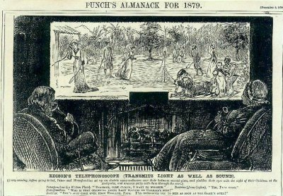
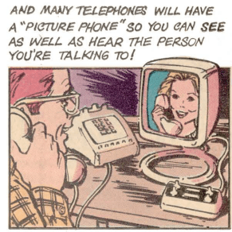
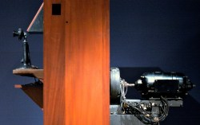
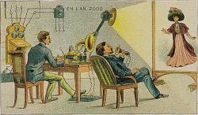

Videoconferencing has been around in one form or another for quite a while, but it took the pandemic to thrust into prominence with just about everyone.  

视频会议以这样或那样的形式出现已经有相当长的一段时间了，但它是在大流行之后才在几乎每个人的心目中崭露头角的。  

In a way, it has been the delivery of something long-promised by phone companies, futurists, and science fiction writers: the picture phone.  

从某种程度上说，它实现了电话公司、未来学家和科幻小说家许诺已久的东西：可视电话。  

But very few people imagined how the picture phone would actually manifest itself.  

但很少有人想象过拍照手机的实际表现形式。  

We thought it might be interesting to look at some of the historical predictions and attempts to bring this technology to the mass market.  

我们认为，回顾一下历史上的一些预测和将这项技术推向大众市场的尝试可能会很有趣。

The reality is, we don’t have true picture phones.  

现实情况是，我们并没有真正的图像手机。  

We have computers with sufficient bandwidth to carry live video and audio.  

我们的电脑拥有足够的带宽来传输实时视频和音频。  

Your FaceTime call is going over the data network.  

FaceTime 通话是通过数据网络进行的。  

Contrast that with, say, sending a fax which really is a document literally over the phone lines.  

相比之下，发送传真就是通过电话线发送文件。

So how did people imagine picture phones? And when did they become available?  

那么，人们是如何想象图像电话的呢？它们又是何时问世的？  

The answers might surprise you.  

答案可能会让你大吃一惊。  

We aren’t sure how far back people imagined such a device, but we know that one was built as early as 1930.  

我们并不清楚人们对这种设备的想象有多久远，但我们知道早在 1930 年就有人制造了这种设备。

Even as early as the 1870s, science fiction mentioned telephonoscopes, an intention a cartoonist attributed to a future version of Thomas Edison.  

甚至早在 19 世纪 70 年代，科幻小说中就提到了电话视镜，一位漫画家将这一设想归功于未来版本的托马斯-爱迪生。  

Alexander Graham Bell did think such a thing was possible and even wrote of using selenium as a way to sense light to convert it into electricity.  

亚历山大-格雷厄姆-贝尔确实认为这样的事情是可能的，他甚至写道："用硒来感应光，将其转换成电能。  

He knew, though, that the sensor would have to be very tiny.  

不过，他知道传感器必须非常微小。  

This was years before electromechanical TV started to appear in the early part of the 20th century.  

这比 20 世纪初开始出现的机电电视早了很多年。

## A Brief Survey of Picture Phones  

图象电话简介

From the Radio Shack comic: The New Science Fair Story of Electronics” from 1978.  

来自 Radio Shack 漫画：电子产品的新科普故事》，1978 年。

You can argue what exactly constitutes a picture phone.  

你可以争论究竟什么是图像电话。  

AT&T offered a picture phone commercially in 1992 — we’ll talk about it soon — that showed black and white images at 10 frames per second.  

AT&T 在 1992 年推出了一款商用图像电话--我们很快就会谈到它--它能以每秒 10 帧的速度显示黑白图像。  

While that’s crude by today’s standards, most people would agree it was video.  

虽然以今天的标准来看这还很粗糙，但大多数人都会认为这是视频。  

But some old attempts used something akin to what ham radio operators call slow scan TV.  

但一些老的尝试使用了类似于火腿无线电操作员所说的慢扫描电视。  

A camera would grab a black and white image and send it fax-like via audio tones.  

摄像机会捕捉黑白图像，并通过音频音调进行传真式发送。  

That means you got an 6- or 8-second delay and you could see the picture.  

这意味着你会有 6 或 8 秒的延迟，但你可以看到画面。  

Most people wouldn’t consider that video, but it is a slippery slope where you draw the line.  

大多数人不会认为那是视频，但这是一个滑坡，你必须划清界限。

We remember Radio Shack briefly advertising these phones, although we can’t find any evidence of it now.  

我们记得 Radio Shack 曾为这些电话做过短暂的广告宣传，虽然现在找不到任何证据。  

But we think they were Mitsubishi Luma phones.  

但我们认为它们是三菱 Luma 手机。  

Regardless, these kinds of phones were mostly novelties and didn’t sell well in the consumer space.  

无论如何，这类手机大多是新奇产品，在消费领域并不畅销。

## Ancient History  

古代史

It is no secret that the phone company itself had the biggest interest in Picturephones (a trademark) and, in fact, everyone assumed that by 2001, every payphone would have a camera and a screen.  Not many people thought the payphone itself would be an endangered species.  

电话公司本身对 Picturephone（商标）的兴趣最大，这已经不是什么秘密了，事实上，每个人都认为到 2001 年，每部公用电话都会有摄像头和屏幕。没有多少人认为公用电话本身会成为濒危物种。  

Even the 1927 classic _Metropolis_ had a video phone call in it.  

甚至 1927 年的经典影片《大都会》中也有视频电话。

<iframe loading="lazy" width="800" height="480" src="https://www.youtube.com/embed/ZXokqxBQsFM?version=3&amp;rel=1&amp;showsearch=0&amp;showinfo=1&amp;iv_load_policy=1&amp;fs=1&amp;hl=en-US&amp;autohide=2&amp;wmode=transparent" allowfullscreen="true" sandbox="allow-scripts allow-same-origin allow-popups allow-presentation"></iframe>

The phone company started working on video calling when it sent a speech by Herbert Hoover — then the Secretary of Commerce — from Washington to New York in 1927. The video was only one way and with a limited frame rate.  

1927 年，电话公司将时任商务部长的赫伯特-胡佛（Herbert Hoover）的演讲从华盛顿传送到纽约，从此开始了视频通话的研究。视频只能单向传输，而且帧频有限。  

The New York Times noted that Hoover’s face was not clearly distinguishable.  

纽约时报》指出，胡佛的脸部并不清晰可辨。

The equipment used probably looked like the 1927 prototype seen here. The scanning for the image was [done with a mechanical disk](https://hackaday.com/2017/06/28/mechanical-image-acquisition-with-a-nipkow-disc/), which is limiting.  

使用的设备很可能就是这里看到的 1927 年的原型。图像的扫描是通过机械磁盘完成的，这是有局限性的。

Getting that much data across phone lines would be a challenge before there was any way to compress the signal.  In fact, the image traveled over multiple phone lines.  

在没有压缩信号的方法之前，通过电话线传输如此多的数据将是一项挑战。事实上，图像是通过多条电话线传输的。  

With a mechanical system, the motors on the sending and receiving disk also needed to be synchronized, presenting another technical challenge.  

使用机械系统时，发送和接收磁盘上的电机也需要同步，这是另一项技术挑战。  

The phone company kept working on this system — dubbed Ikonophone — for several years with a team of around 200 people.  

几年来，电话公司一直在研发这个被称为 "Ikonophone "的系统，团队约有 200 人。  

Work slowed during World War II, but by the 1950s, the company would resume work on the system now known as Picturephone.  

二战期间，这项工作有所放缓，但到了 20 世纪 50 年代，公司又重新开始了现在被称为 Picturephone 的系统的研发工作。

Meanwhile, in other parts of the world, Germans had public video phone service as early as 1936 between the post offices in Berlin and Leipzig.  

与此同时，在世界其他地区，德国人早在 1936 年就在柏林和莱比锡的邮局之间开通了公共视频电话服务。  

A dedicated cable 100 miles long connected the two phones that combined a flying-spot scanner and a cathode ray tube.  

一条长达 100 英里的专用电缆将两部电话连接起来，该电缆结合了飞点扫描仪和阴极射线管。  

The video was respectable, at 25 frames per second and 150 lines of resolution.  

视频效果不错，每秒 25 帧，分辨率为 150 行。  

The system eventually increased to 180 lines of resolution and other routes including Hamburg, Munich, and Nuremberg.  

该系统的分辨率最终提高到 180 行，其他线路包括汉堡、慕尼黑和纽伦堡。  

Each city had two booths and a call cost about 1/15th of the average worker’s weekly wage.  

每个城市有两个电话亭，通话费用约为普通工人周工资的 1/15。  

The French also had a similar system.  

法国也有类似的系统。  

These post office video phones, like the United States version, halted during the War.  

这些邮局视频电话与美国的版本一样，在战争期间停止使用。

## Picturephone  

图像电话

By the mid-1950s, prototype picture phones using signal compression could transmit an image every two seconds over regular phone lines.  

到 20 世纪 50 年代中期，使用信号压缩技术的图像电话原型可以通过普通电话线每两秒钟传输一幅图像。  

The phone contained a storage tube or magnetic drum.  

这种电话包含一个存储管或磁鼓。  

By 1964, the Picturephone Mod I which had a better frame rate was seen at the New York World’s Fair and Disneyland.  

到 1964 年，帧频更高的 Picturephone Mod I 出现在纽约世界博览会和迪斯尼乐园。  

By 1964, there were several Picturephone booths, but they were not very popular, mainly because of the cost which could be as high as $27 for three minutes — over $250 today.  

到 1964 年，已经有了几个 Picturephone 电话亭，但它们并不十分流行，主要原因是价格昂贵，3 分钟的通话费高达 27 美元，相当于现在的 250 多美元。  

By 1968, the phonebooths were gone.  

到 1968 年，电话亭已不复存在。

The Mod II, however, found use for videoconferencing in 1970. The cost was high.  

不过，Mod II 在 1970 年被用于视频会议。成本很高。  

The phone cost $150 along with a service fee of about $160 per month for the first phone and $50 for each additional phone.  

第一部电话售价 150 美元，每月服务费约 160 美元，每增加一部电话，服务费增加 50 美元。  

For that price, you got a whole 30 minutes of calls, after which you would pay a quarter a minute.  

按照这个价格，你可以通话整整 30 分钟，之后每分钟支付 25 美分。  

Eventually, the price came down, but it was a lot of money in the early 1970s.  

最终，价格有所下降，但在 20 世纪 70 年代初，这也是一笔不小的开支。

For that price, you got about 250 lines of resolution at 30 frames per second.  

这个价格可以获得大约 250 行的分辨率，每秒 30 帧。  

It looks like you also needed a speakerphone for the audio and — by way of an additional box — signaling.  

看来您还需要一个免提电话来传输音频，并通过一个额外的盒子来传输信号。  

There were two separate phone lines for the video. Early models were not color.  

视频有两条独立的电话线。早期型号不是彩色的。

## Final Analysis  

最终分析

Unfortunately for AT&T, the video phones they had developed over decades were a commercial failure.  

不幸的是，AT&T 几十年来开发的可视电话在商业上是失败的。  

The official program alone was over 15 years and cost around $500 million.  

仅官方项目就耗时 15 年，耗资约 5 亿美元。  

The phone company had predicted 100,000 phones in service by 1975. The real number was in the hundreds.  

电话公司曾预计到 1975 年将有 10 万部电话投入使用。实际数量只有几百部。

They tried again in the early 1990s with the VideoPhone 2500 marketed at consumers.  

20 世纪 90 年代初，他们再次尝试推出面向消费者的视频电话 2500。  

At $1,500 a pop and anywhere from 10 frames per second to 1/3 of a frame per second, they didn’t sell very well.  

每部售价 1500 美元，每秒 10 帧到 1/3 帧不等，销量并不理想。  

Surprisingly, they apparently sold about 30,000 units, but that was hardly enough to recoup their investment.  

令人惊讶的是，他们显然卖出了大约 3 万台，但这还不足以收回投资。

Other countries tried similar systems with similar results.  

其他国家也尝试过类似的系统，但结果大同小异。  

France, Sweden, and the United Kingdom all had some form of video phone and all suffered from the same problems — low bandwidth over phone lines is simply not conducive to live video.  

法国、瑞典和英国都有某种形式的视频电话，但都遇到了同样的问题--电话线带宽低，根本无法进行实时视频。

Villemard’s 1910 drawing of life in the year 2000 shows a video call in progress.  

Villemard 在 1910 年绘制的 2000 年生活图画中展示了正在进行的视频通话。

The answer would be digital networks and techniques, even though that wasn’t always obvious.  

答案就是数字网络和技术，尽管这一点并不总是显而易见。  

For example, ARCNET — an early competitor to Ethernet — could — in some configurations — reserve bandwidth for analog video signals.  

例如，以太网的早期竞争对手 ARCNET 在某些配置中可以为模拟视频信号预留带宽。

You can compress video with digital techniques, and network bandwidth has been on an upward slope.  

使用数字技术可以压缩视频，而网络带宽一直呈上升趋势。  

So as compression gets better, bandwidth goes up, and today it isn’t unusual to video conference with a large number of participants at once.  

因此，随着压缩技术的进步，带宽也在不断增加，如今同时与大量与会者进行视频会议已不是什么稀罕事。

While it doesn’t look much like Villemard’s 1910 imagining of videoconferencing in the year 2000, it isn’t that far off, either.

  

虽然这与 Villemard 在 1910 年对 2000 年视频会议的想象不太一样，但也相差不远。

If you have the urge to hack something related, you can create a mirror system that lets you read your screen and [make eye contact at the same time](https://hackaday.com/2020/05/29/two-way-mirror-improves-video-conferencing/). Or, be a real hacker and do your [conferences in text mode](https://hackaday.com/2020/12/15/real-hackers-videoconference-in-terminal/).  

如果你有黑客的冲动，你可以创建一个镜像系统，让你在阅读屏幕的同时进行眼神交流。或者，做个真正的黑客，在文本模式下召开会议。  

We’re just glad today’s version of the video phone doesn’t let you see us pacing in the control room waiting for a call like the one in Metropolis (see below) does.  

我们很高兴今天的视频电话不会让你看到我们在控制室里踱步等待电话，就像《大都会》里的那个（见下图）。  

We still aren’t sure what the paper tape coming out of those phones is for.  

我们仍然不清楚这些电话里的纸带是做什么用的。

<iframe loading="lazy" width="800" height="480" src="https://www.youtube.com/embed/griiRL8Yvu0?version=3&amp;rel=1&amp;showsearch=0&amp;showinfo=1&amp;iv_load_policy=1&amp;fs=1&amp;hl=en-US&amp;autohide=2&amp;wmode=transparent" allowfullscreen="true" sandbox="allow-scripts allow-same-origin allow-popups allow-presentation"></iframe>
